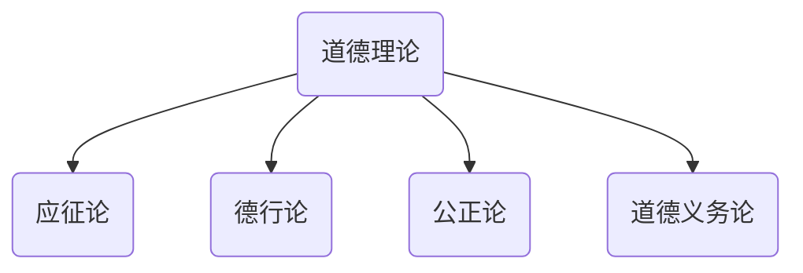

                 

### 文章标题

# 生物伦理：科技进步中的道德考量

### 关键词

- 生物伦理
- 科技进步
- 道德考量
- 基因编辑
- 生物医学研究
- 政策与社会影响

### 摘要

本文从生物伦理的角度出发，探讨了在科技进步的背景下，如何对生物技术中的道德问题进行考量。文章首先介绍了生物伦理的背景和重要性，然后深入分析了核心概念和其在生物技术中的应用。接着，文章重点讨论了基因编辑和生物医学研究中的道德问题，并提出了相应的伦理解决方案。最后，文章从社会与政策层面探讨了生物伦理的影响，并对未来生物伦理的趋势进行了展望。通过本文的阐述，我们希望能为读者提供对生物伦理问题更为全面和深入的理解。

---

### 目录大纲

----------------------------------------------------------------

# 第一部分：引言

## 第1章：生物伦理概述

## 1.1 问题的背景

### 1.1.1 科技进步的推动力

### 1.1.2 道德考量的重要性

### 1.1.3 生物伦理的研究领域

## 1.2 道德考量与生物技术

### 1.2.1 基因编辑技术

### 1.2.2 克隆技术

### 1.2.3 生物医学研究

## 1.3 核心概念与联系

### 1.3.1 生物伦理学基本原理

### 1.3.2 伦理原则与生物技术的联系

### 1.3.3 案例分析：伦理困境与解决方案

## 1.4 生物伦理的边界与外延

### 1.4.1 生物伦理的国内发展

### 1.4.2 国际生物伦理的挑战与应对

### 1.4.3 未来生物伦理的趋势

## 1.5 本章小结

----------------------------------------------------------------

# 第二部分：生物伦理的核心概念

## 第2章：核心概念解析

## 2.1 道德理论

### 2.1.1 应征论

### 2.1.2 德行论

### 2.1.3 公正论

### 2.1.4 道德义务论

## 2.2 概念属性特征对比

| 道德理论 | 特征 | 对比 |
| --- | --- | --- |
| 应征论 | 强调道德行为的自主性 | 与德行论相比，更注重个体自由与道德责任 |
| 德行论 | 强调道德行为的内在价值 | 与应征论相比，更强调个体品德修养 |
| 公正论 | 强调道德行为的公平性 | 与道德义务论相比，更强调公平与正义原则 |
| 道德义务论 | 强调道德行为的责任性 | 与公正论相比，更注重个体对社会的责任 |

## 2.3 ER实体关系图

## 2.4 关键术语定义

### 2.4.1 生物伦理

### 2.4.2 道德考量

### 2.4.3 生物技术

## 2.5 本章小结

----------------------------------------------------------------

# 第三部分：生物技术中的道德问题

## 第3章：基因编辑伦理问题

## 3.1 基因编辑技术概述

### 3.1.1 CRISPR-Cas9技术

### 3.1.2 基因编辑的基本原理

### 3.1.3 基因编辑的应用领域

## 3.2 伦理争议

### 3.2.1 基因编辑的人体应用

### 3.2.2 基因编辑的环境影响

### 3.2.3 基因编辑的伦理挑战

## 3.3 案例分析

### 3.3.1 基因编辑婴儿事件

### 3.3.2 科学家的伦理责任

### 3.3.3 社会的伦理反应

## 3.4 伦理解决方案

### 3.4.1 国际法规与伦理指导原则

### 3.4.2 科技公司与伦理审查

### 3.4.3 公众参与与伦理教育

## 3.5 本章小结

----------------------------------------------------------------

# 第四部分：生物医学研究的道德考量

## 第4章：生物医学研究伦理

## 4.1 生物医学研究概述

### 4.1.1 生物医学研究的发展历程

### 4.1.2 生物医学研究的基本原则

### 4.1.3 生物医学研究的伦理挑战

## 4.2 受试者权益保护

### 4.2.1 知情同意

### 4.2.2 受试者隐私保护

### 4.2.3 受试者风险控制

## 4.3 动物实验伦理

### 4.3.1 动物实验的道德考量

### 4.3.2 动物实验的法律规定

### 4.3.3 动物替代实验

## 4.4 伦理审查

### 4.4.1 伦理审查机构的角色

### 4.4.2 伦理审查流程

### 4.4.3 伦理审查的挑战与改进

## 4.5 本章小结

----------------------------------------------------------------

# 第五部分：社会与政策层面

## 第5章：生物伦理政策与社会影响

## 5.1 政策框架

### 5.1.1 国际生物伦理政策

### 5.1.2 国内生物伦理政策

### 5.1.3 政策实施与挑战

## 5.2 社会影响

### 5.2.1 社会舆论与公众态度

### 5.2.2 教育与伦理意识的培养

### 5.2.3 科技创新与伦理考量的平衡

## 5.3 未来展望

### 5.3.1 生物伦理趋势分析

### 5.3.2 社会政策改进建议

### 5.3.3 生物伦理教育的推广

## 5.4 本章小结

----------------------------------------------------------------

---

### 第一部分：引言

## 第1章：生物伦理概述

### 1.1 问题的背景

### 1.1.1 科技进步的推动力

### 1.1.2 道德考量的重要性

### 1.1.3 生物伦理的研究领域

在当今快速发展的科技时代，生物技术的进步给人类带来了前所未有的机遇和挑战。从基因编辑到克隆技术，再到生物医学研究的深入，生物技术正以前所未有的速度改变着我们的生活。然而，这些技术的应用也引发了一系列道德考量的问题。如何平衡科技发展与伦理道德，如何在追求科技进步的同时保护人类的尊严和权利，成为了我们必须面对的重要课题。

科技进步的推动力不仅来自于科学研究的突破，更来自于社会的需求和期待。随着人类社会的发展，人们对健康、长寿和生活质量的追求越来越高。生物技术的进步为我们提供了实现这些目标的可能性，但同时也带来了新的道德困境。例如，基因编辑技术虽然可以治愈某些遗传性疾病，但也可能引发基因歧视和伦理风险。克隆技术的出现引发了关于生命本质和个体身份的争议，同时也涉及了伦理和法律的问题。

因此，道德考量在生物技术发展中扮演着至关重要的角色。生物伦理学作为一门交叉学科，研究生物技术在社会、法律、哲学和医学等多方面的应用，旨在提供一种道德框架来指导科技的发展和应用。生物伦理不仅关注技术的利与弊，更关注技术如何影响人类的生活和价值观。通过道德考量，我们可以更好地平衡科技与伦理，确保科技进步真正造福人类。

### 1.2 道德考量与生物技术

生物技术与伦理考量之间存在着紧密的联系。随着生物技术的不断进步，许多新的道德问题也随之产生。这些问题不仅涉及到技术的潜在风险和伦理挑战，还涉及到社会、法律和文化等多个层面。因此，理解生物技术中的道德考量对于推动科技的发展和应用至关重要。

首先，基因编辑技术是当前生物技术领域中最为引人注目的一个方面。CRISPR-Cas9技术作为一种革命性的基因编辑工具，可以在细胞层面上精确地修改基因序列。这一技术的应用前景广阔，包括治疗遗传性疾病、增强人类基因、改善作物产量等。然而，基因编辑技术也引发了大量的伦理争议。例如，关于基因编辑人体应用的安全性和伦理风险，特别是在人类胚胎编辑方面，存在着广泛的讨论和争议。此外，基因编辑可能导致基因歧视和伦理风险，例如，一些人可能会选择通过基因编辑来增强他们的后代，这可能导致社会不平等和道德困境。

其次，克隆技术也是生物伦理中的一个重要话题。克隆技术可以通过复制个体的基因组来创造一个与原个体几乎相同的新个体。虽然克隆技术可以用于医学研究，如器官移植和疾病治疗，但它也引发了关于生命本质和个体身份的深刻思考。例如，克隆个体是否拥有与自然出生个体相同的道德地位和权利？克隆技术是否可能被滥用，用于制造“设计婴儿”或用于非法商业活动？这些问题都需要我们深入探讨和解决。

此外，生物医学研究的伦理考量也是一个关键领域。生物医学研究旨在通过科学方法揭示生命的奥秘，推动医疗技术的进步，提高人类健康水平。然而，生物医学研究也面临着诸多伦理挑战。例如，关于受试者权益的保护，如何确保受试者的知情同意和隐私保护？在动物实验中，如何平衡科学研究的需要与动物权益的保护？这些都需要通过严格的伦理审查和规范来确保。

总的来说，生物技术与伦理考量之间的关系是复杂的。一方面，生物技术为人类提供了巨大的机遇，可以解决许多重大的健康和社会问题。另一方面，生物技术也带来了一系列新的道德问题，需要我们进行深入的思考和探讨。通过道德考量，我们可以确保生物技术的发展和应用符合伦理原则，真正造福人类。

### 1.3 核心概念与联系

生物伦理学中的核心概念和原则是理解和解决伦理问题的关键。为了更好地探讨生物技术中的道德考量，我们需要明确这些核心概念和它们之间的联系。

首先，生物伦理学的基本原理包括尊重个人、公正、非利用和有益等。尊重个人强调个体的权利和尊严，意味着在生物技术应用中，必须确保个体的知情同意和自主选择。公正则要求在生物技术的应用过程中，确保资源的公平分配和社会公平，避免因技术进步带来的社会不平等。非利用原则要求在生物技术研究中，不得滥用或恶意使用生物资源，特别是涉及人类遗传物质时。有益原则则要求生物技术的应用应有助于提高人类健康和生活质量。

其次，伦理原则与生物技术的具体应用密切相关。例如，基因编辑技术的应用需要遵循尊重个人原则，确保受试者的知情同意。同时，公正原则要求在基因编辑的应用中，防止出现因基因改造带来的社会不平等。在克隆技术的应用中，尊重个人和公正原则同样至关重要，需要确保克隆个体的权利和尊严，避免克隆技术的滥用。

此外，通过案例分析和具体实例，我们可以更好地理解这些核心概念在生物技术中的应用。例如，基因编辑婴儿事件引发了关于基因编辑人体应用的伦理争议，揭示了尊重个人和公正原则在基因编辑技术中的应用困境。另一个典型案例是猪肾移植到人类身上，引发了关于器官移植伦理的讨论，强调了非利用原则在生物医学研究中的重要性。

通过明确生物伦理学中的核心概念和原则，我们可以更好地指导生物技术的应用，确保科技的发展和应用符合伦理道德的要求，真正造福人类。

### 1.4 生物伦理的边界与外延

生物伦理的边界和外延是理解生物技术道德考量的重要维度。首先，国内生物伦理的发展历程展示了从传统伦理观念到现代伦理规范的转变。在早期的生物医学研究中，伦理问题主要关注受试者的自愿性和知情同意。然而，随着基因编辑、克隆技术等新兴生物技术的出现，国内生物伦理研究逐渐涉及基因改造、基因隐私、基因歧视等更为复杂的伦理议题。国内相关部门和学术机构也逐步制定和完善了生物伦理的法规和指导原则，如《人类遗传资源管理暂行办法》和《基因编辑人类胚胎研究管理办法》等，为生物技术的应用提供了伦理框架。

其次，国际生物伦理的挑战与应对展现了全球范围内对生物技术伦理问题的共识和分歧。国际社会普遍认可生物技术应遵循尊重个人、公正、非利用和有益等伦理原则。然而，在具体应用中，各国面临的挑战各不相同。例如，基因编辑技术的国际监管标准尚未统一，不同国家和地区对基因编辑人体应用的法律态度各异。此外，跨国生物技术合作中的伦理问题，如基因资源共享和国际伦理审查，也亟需全球范围内的协调和共识。

最后，未来生物伦理的发展趋势表明，随着科技的不断进步，生物伦理问题将更加复杂和多样化。一方面，人工智能和大数据技术的应用将深刻影响生物医学研究，引发新的伦理挑战。例如，如何保护个人隐私和数据安全，防止数据滥用？另一方面，生物技术将更加广泛应用于医疗、农业和环境保护等领域，这要求我们不断更新和完善生物伦理的法规和指导原则，确保科技进步与伦理考量相互协调。总的来说，未来生物伦理的发展需要在国际合作和国内规范的基础上，实现科技与伦理的平衡，为人类创造更加美好的未来。

### 1.5 本章小结

本章通过回顾生物伦理的背景、道德考量与生物技术的关系、核心概念及其联系，以及生物伦理的边界与外延，为后续章节的深入探讨奠定了基础。随着生物技术的迅猛发展，生物伦理问题日益复杂，这要求我们既要关注技术带来的机遇，也要警惕可能引发的伦理风险。通过本章的介绍，我们希望读者能够对生物伦理有更全面和深入的理解，为后续章节的分析和讨论做好充分的准备。

---

## 第二部分：生物伦理的核心概念

### 第2章：核心概念解析

生物伦理学作为一门交叉学科，其核心概念和理论为我们理解和解决生物技术中的道德问题提供了重要的框架。本章将重点解析几种主要的道德理论，并对它们的主要特征和相互之间的对比进行详细阐述。

### 2.1 道德理论

道德理论是生物伦理学的基础，不同的理论为我们提供了不同的视角来分析伦理问题。以下是几种主要的道德理论：

#### 2.1.1 应征论

应征论（Deontological Ethics）由德国哲学家康德提出，强调道德行为的自主性和义务性。应征论认为，道德行为的正确与否取决于行为本身是否符合道德规则，而不仅仅是行为的后果。在生物伦理学中，应征论强调个体在基因编辑、克隆技术等生物技术应用中的自主选择权，以及科学家和医疗机构对伦理规范的遵守。

#### 2.1.2 德行论

德行论（Virtue Ethics）强调道德行为的内在价值，认为道德不仅仅是一系列规则，更是一种个体品德和修养的体现。德行论强调个体应培养善良、诚实、勇敢等美德，以此来指导行为。在生物伦理学中，德行论认为科学家和医疗工作者应具备高尚的职业道德，以保护受试者和患者的权益。

#### 2.1.3 公正论

公正论（Justice Theory）关注道德行为的公平性，认为道德责任和义务应该平等地分配。公正论强调社会资源的公平分配，防止因技术进步带来的社会不平等。在生物伦理学中，公正论要求在基因编辑、克隆技术等生物技术应用中，确保资源的公平利用，避免因技术优势带来的社会分化。

#### 2.1.4 道德义务论

道德义务论（Moral Obligations Theory）强调个体对社会的道德责任和义务。道德义务论认为，个体有责任遵守社会规范和道德准则，以确保社会整体的福祉。在生物伦理学中，道德义务论要求科学家和医疗工作者不仅要关注个体患者的利益，还要考虑到整个社会的健康和福祉。

### 2.2 概念属性特征对比

下表对上述道德理论的主要特征进行了对比：

| 道德理论 | 特征 |
| --- | --- |
| 应征论 | 强调道德行为的自主性和义务性 |
| 德行论 | 强调道德行为的内在价值，个体品德修养 |
| 公正论 | 强调道德行为的公平性，社会资源公平分配 |
| 道德义务论 | 强调个体对社会的道德责任和义务 |

### 2.3 ER实体关系图

为了更直观地展示这些道德理论之间的关系，我们可以使用ER（实体关系）图进行表示：

### 2.4 关键术语定义

在深入探讨生物伦理学时，理解一些关键术语的定义至关重要。以下是几个重要术语的定义：

#### 2.4.1 生物伦理

生物伦理是关于生物技术和生命科学领域中的道德原则和规范的研究。它涉及基因编辑、克隆技术、生物医学研究等，旨在确保科技的发展和应用符合伦理要求，保护人类的尊严和权利。

#### 2.4.2 道德考量

道德考量是指对行为或决策在道德上的正当性和合适性的评估。在生物技术领域，道德考量涉及对技术应用的潜在风险、受试者权益保护、社会公平等问题。

#### 2.4.3 生物技术

生物技术是指利用生物学原理和技术手段进行研究和应用的一门科学。包括基因编辑、克隆技术、生物医学研究等，旨在提高人类健康水平、解决环境和能源问题等。

### 2.5 本章小结

本章通过解析应征论、德行论、公正论和道德义务论等道德理论，以及对比它们的主要特征，为读者提供了理解生物伦理学核心概念的基础。同时，通过ER实体关系图和关键术语的定义，进一步加深了对生物伦理学概念结构的认识。这些核心概念和理论将为我们后续分析生物技术中的道德问题提供有力的理论支持。

---

## 第三部分：生物技术中的道德问题

### 第3章：基因编辑伦理问题

基因编辑技术的出现，如CRISPR-Cas9，为医学研究和治疗提供了前所未有的可能性。然而，这项技术的应用也引发了广泛的伦理争议。本章将深入探讨基因编辑技术的伦理问题，分析其争议点，并通过具体案例分析，揭示伦理困境及其解决方案。

### 3.1 基因编辑技术概述

#### 3.1.1 CRISPR-Cas9技术

CRISPR-Cas9技术是一种革命性的基因编辑工具，由成簇规律间隔短回文重复序列（Clustered Regularly Interspaced Short Palindromic Repeats）和Cas9核酸酶组成。该技术通过引导RNA（gRNA）识别目标基因序列，然后Cas9核酸酶对目标序列进行切割，从而实现基因的修改。CRISPR-Cas9技术具有高效、简便和成本较低的特点，使其在基因编辑领域迅速得到广泛应用。

#### 3.1.2 基因编辑的基本原理

基因编辑的基本原理是通过破坏目标DNA序列，引发DNA修复机制，进而引入所需的基因修改。这个过程可以分为以下几个步骤：

1. **设计引导RNA（gRNA）**：根据目标基因序列设计特异的gRNA，使其能够精确识别目标DNA序列。

2. **DNA切割**：gRNA与Cas9核酸酶结合，识别并切割目标DNA序列。

3. **DNA修复**：细胞利用其内建的DNA修复机制，对切割的DNA进行修复，从而实现基因编辑。

4. **基因插入或修改**：通过DNA修复过程中的同源重组（Homology-Directed Repair, HDR），可以引入特定的基因序列。

#### 3.1.3 基因编辑的应用领域

基因编辑技术具有广泛的应用前景，主要领域包括：

1. **遗传性疾病治疗**：通过编辑导致遗传性疾病的特定基因，可以治愈或缓解疾病症状。

2. **农业**：通过基因编辑，可以培育出具有更高产量、抗病虫害的作物，从而提高农业产量。

3. **医学研究**：基因编辑技术为研究基因功能提供了强有力的工具，有助于揭示基因与疾病之间的关系。

4. **生物医学**：基因编辑技术可用于创建动物模型，用于研究人类疾病和开发新药物。

### 3.2 伦理争议

基因编辑技术的应用不仅带来了巨大的科学和医学价值，同时也引发了一系列伦理争议。以下是其中一些主要的伦理争议：

#### 3.2.1 基因编辑的人体应用

基因编辑人体应用，特别是人类胚胎编辑，引发了广泛的伦理争议。争议点包括：

1. **安全性**：基因编辑技术尚处于发展阶段，可能存在未知的长期风险和副作用。对人类胚胎进行基因编辑可能导致不可预见的后果。

2. **伦理风险**：人类胚胎编辑可能引发基因歧视和社会不平等。例如，一些家庭可能会选择通过基因编辑来增强他们的后代，这可能导致社会分层和伦理困境。

3. **道德地位**：人类胚胎是否拥有与成年个体相同的道德地位？对人类胚胎进行基因编辑是否违背了尊重生命的伦理原则？

#### 3.2.2 基因编辑的环境影响

基因编辑不仅涉及人类健康和医学领域，还可能对环境产生深远影响。争议点包括：

1. **生态平衡**：通过基因编辑改造生物，可能会对生态系统产生不可预知的影响，破坏生态平衡。

2. **基因污染**：基因编辑可能导致基因的扩散和污染，影响野生生物种群，甚至可能对人类健康构成威胁。

3. **伦理责任**：科学家和企业在基因编辑技术的应用中，是否需要承担对环境的伦理责任？

#### 3.2.3 基因编辑的伦理挑战

基因编辑技术的伦理挑战不仅限于人体应用和环境影响，还包括以下几个方面：

1. **伦理审查**：如何确保基因编辑项目在实施前经过严格的伦理审查？伦理审查机构是否具备足够的独立性和权威性？

2. **监管政策**：国家和国际层面如何制定和实施基因编辑技术的监管政策？监管政策的制定需要平衡科技发展和伦理考量。

3. **公众参与**：如何确保公众在基因编辑技术的决策过程中有充分的参与和表达意见的机会？公众的伦理观念和科技认知水平如何影响基因编辑技术的应用？

### 3.3 案例分析

#### 3.3.1 基因编辑婴儿事件

2018年，中国科学家贺建奎宣布成功利用CRISPR-Cas9技术编辑了人类胚胎基因，以抵御艾滋病。这一事件引发了全球范围内的强烈伦理争议。

1. **伦理困境**：该事件涉及多个伦理问题，包括基因编辑的人体应用安全性、伦理责任和公众知情权等。贺建奎的实验未经严格伦理审查，且未公开透明地进行，引发了广泛的伦理质疑。

2. **社会反应**：这一事件在国内外引起了强烈的社会反应。许多人认为，基因编辑婴儿的诞生可能带来不可预见的健康风险，且可能加剧社会不平等。同时，这一事件也引发了关于基因编辑技术监管的讨论。

3. **解决方案**：为了避免类似事件再次发生，需要建立更加严格的基因编辑技术监管体系。首先，应加强伦理审查，确保基因编辑项目在实施前经过严格的评估。其次，应制定和实施明确的监管政策，规范基因编辑技术的应用。最后，应加强公众参与和伦理教育，提高公众对基因编辑技术的认知和理解，促进科技与伦理的平衡。

#### 3.3.2 科学家的伦理责任

基因编辑技术的应用不仅涉及技术本身，还涉及到科学家和医疗工作者的伦理责任。以下是一些科学家伦理责任的案例分析：

1. **合规性**：科学家在基因编辑技术的应用中，需要遵守相关的伦理规范和法律法规。例如，进行人类胚胎基因编辑需要经过严格的伦理审查和监管。

2. **透明度**：科学家应保持实验过程的透明度，公开实验结果和相关信息，以接受社会和公众的监督。

3. **公众沟通**：科学家应积极参与公众沟通，提高公众对基因编辑技术的认知和理解，减少误解和恐慌。

#### 3.3.3 社会的伦理反应

社会的伦理反应对基因编辑技术的应用和发展具有重要影响。以下是一些社会伦理反应的案例分析：

1. **舆论压力**：基因编辑技术的应用往往会引发社会舆论的强烈反响。例如，基因编辑婴儿事件引发了公众对基因编辑技术的质疑和恐慌。

2. **政策调整**：社会舆论和政策环境的变化会对基因编辑技术的应用产生直接影响。例如，一些国家加强对基因编辑技术的监管，以防范潜在的伦理风险。

3. **公众参与**：社会公众对基因编辑技术的伦理考量有重要发言权。通过公众参与和讨论，可以更好地平衡科技发展和社会伦理需求。

### 3.4 伦理解决方案

为了应对基因编辑技术引发的伦理争议，需要采取一系列的伦理解决方案。以下是一些可能的解决方案：

#### 3.4.1 国际法规与伦理指导原则

国际社会应制定和实施统一的基因编辑技术法规和伦理指导原则，以确保基因编辑技术的安全、合法和道德应用。例如，联合国教科文组织可以牵头制定国际基因编辑伦理标准，促进各国在基因编辑技术应用上的协调和合作。

#### 3.4.2 科技公司与伦理审查

科技公司应建立独立的伦理审查委员会，对基因编辑技术的应用进行严格评估。此外，科技公司应加强公众沟通，提高透明度，接受社会监督。

#### 3.4.3 公众参与与伦理教育

公众参与和伦理教育是确保基因编辑技术道德应用的重要环节。政府和学术机构应积极开展伦理教育，提高公众对基因编辑技术的认知和理解，促进公众参与基因编辑技术的决策过程。

#### 3.4.4 伦理监管与合规性

政府和监管机构应加强对基因编辑技术的监管，确保其合规性。例如，建立专门的基因编辑技术监管机构，制定详细的监管标准和操作流程。

### 3.5 本章小结

本章通过探讨基因编辑技术的伦理问题，揭示了其在人体应用、环境影响和伦理挑战等方面的争议。通过具体案例分析，我们了解了基因编辑技术引发的伦理困境和解决方案。通过国际法规、科技公司、公众参与和伦理监管等多方面的努力，我们可以更好地平衡基因编辑技术的科技发展和社会伦理需求，确保其应用符合伦理原则，造福人类。

---

## 第四部分：生物医学研究的道德考量

### 第4章：生物医学研究伦理

生物医学研究的进展为人类健康和生命科学带来了巨大贡献。然而，这一领域的发展也伴随着复杂的伦理问题。本章将深入探讨生物医学研究中的伦理考量，包括受试者权益保护、动物实验伦理和伦理审查等方面。

### 4.1 生物医学研究概述

#### 4.1.1 生物医学研究的发展历程

生物医学研究的历史可以追溯到19世纪末和20世纪初，随着微生物学、生理学和生物化学的发展，医学研究开始进入一个全新的阶段。20世纪中叶，随着分子生物学和基因学的兴起，生物医学研究取得了突破性进展。特别是20世纪末和21世纪初，基因组学、蛋白质组学和系统生物学的发展，进一步推动了生物医学研究的深入。

#### 4.1.2 生物医学研究的基本原则

生物医学研究的基本原则包括：

1. **科学性**：生物医学研究必须基于科学原理和实验方法，确保研究的可靠性和有效性。
2. **伦理性**：生物医学研究必须遵循伦理原则，保护受试者的权益和尊严。
3. **合规性**：生物医学研究必须遵守相关法律法规，确保研究过程的合法性和安全性。

#### 4.1.3 生物医学研究的伦理挑战

随着生物医学研究技术的不断进步，伦理挑战也在不断增多。以下是一些主要的伦理挑战：

1. **受试者权益保护**：在生物医学研究中，如何确保受试者的自愿性和知情同意，保护受试者的隐私权和尊严。
2. **动物实验伦理**：在生物医学研究中，动物实验是常见的方法，如何平衡科学研究的需要与动物权益的保护。
3. **基因编辑和安全问题**：随着基因编辑技术的应用，如何确保基因编辑的安全性和潜在风险。
4. **生物安全与道德责任**：在生物医学研究中，如何确保生物样本和数据的保护，防止生物恐怖和伦理滥用。

### 4.2 受试者权益保护

#### 4.2.1 知情同意

知情同意是生物医学研究伦理的核心原则之一，它要求在研究开始前，向受试者充分披露研究的目的、方法、潜在风险和利益，并确保受试者理解并自愿参与研究。知情同意的过程通常包括以下几个步骤：

1. **信息披露**：研究团队应向受试者提供详细的研究信息，包括研究目的、研究方法、可能的益处和风险等。
2. **理解确认**：受试者应在充分理解研究信息的基础上，确认自己的自愿参与。
3. **签名同意**：受试者在充分理解并确认自愿参与后，应在知情同意书上签字。

#### 4.2.2 受试者隐私保护

在生物医学研究中，受试者的隐私权同样至关重要。研究团队必须采取有效措施，保护受试者的个人隐私和生物样本数据。以下是一些保护受试者隐私的措施：

1. **匿名化处理**：研究数据应进行匿名化处理，确保受试者的个人信息不被泄露。
2. **数据保护**：研究团队应采取加密和数据备份等措施，确保研究数据的安全。
3. **访问控制**：研究数据应仅限于授权人员访问，防止未经授权的访问和数据泄露。

#### 4.2.3 受试者风险控制

在生物医学研究中，必须采取有效措施，控制受试者的风险，确保受试者的安全和健康。以下是一些受试者风险控制的方法：

1. **风险评估**：在研究开始前，对研究可能带来的风险进行评估，并制定相应的风险控制措施。
2. **紧急预案**：制定紧急预案，确保在发生意外情况时，能够及时采取应对措施，保护受试者的安全和健康。
3. **持续监测**：在研究过程中，对受试者的健康状况进行持续监测，确保及时发现和处理潜在的风险。

### 4.3 动物实验伦理

动物实验在生物医学研究中起着重要作用，但同时也引发了一系列伦理问题。以下是一些关于动物实验伦理的考量：

#### 4.3.1 动物实验的道德考量

动物实验的道德考量涉及对动物权益的保护和科学研究的需要。以下是一些关键点：

1. **动物福利**：动物实验应确保动物的福利，减少动物的痛苦和不适。
2. **替代实验**：应积极开发和推广动物替代实验方法，减少对动物的依赖。
3. **伦理审查**：动物实验必须经过严格的伦理审查，确保实验的必要性和伦理性。

#### 4.3.2 动物实验的法律规定

许多国家和地区都有关于动物实验的法律法规，规定了动物实验的条件和程序。以下是一些主要法律法规：

1. **《动物福利法》**：规定了动物实验的伦理原则和操作规范。
2. **《实验动物管理条例》**：规定了实验动物的管理和福利保障。
3. **国际公约**：如《世界动物福利协会实验动物伦理指南》，规定了动物实验的国际标准和规范。

#### 4.3.3 动物替代实验

动物替代实验是指使用非动物实验方法，如细胞培养、体外实验、计算机模拟等，来替代动物实验。以下是一些动物替代实验的方法：

1. **体外实验**：在体外条件下，使用细胞、组织或细胞器等来模拟生物系统的行为。
2. **计算机模拟**：使用计算机模型和算法，模拟生物系统的行为和反应。
3. **细胞培养**：在实验室条件下，培养和观察细胞的行为和功能。

### 4.4 伦理审查

伦理审查是生物医学研究伦理管理的重要环节，其目的是确保研究过程符合伦理原则和法律法规。以下是一些关于伦理审查的考量：

#### 4.4.1 伦理审查机构的角色

伦理审查机构（IRB）是负责对生物医学研究进行伦理审查的独立机构。其角色包括：

1. **审查研究提案**：对研究方案的伦理合规性进行审查，确保研究符合伦理原则和法律法规。
2. **监督研究过程**：对研究过程进行监督，确保研究按照批准的方案进行。
3. **保护受试者权益**：确保受试者的权益得到保护，包括知情同意、隐私保护和风险控制。

#### 4.4.2 伦理审查流程

伦理审查流程通常包括以下几个步骤：

1. **提交研究提案**：研究团队向伦理审查机构提交研究提案。
2. **初步审查**：伦理审查机构对研究提案进行初步审查，确定是否需要进一步的审查。
3. **详细审查**：伦理审查机构对研究提案进行详细审查，包括研究目的、方法、伦理风险等方面的评估。
4. **决定**：伦理审查机构根据审查结果，做出批准、修改或拒绝的决定。
5. **监督与报告**：伦理审查机构对已批准的研究进行监督，并要求研究团队定期报告研究进展。

#### 4.4.3 伦理审查的挑战与改进

伦理审查在实施过程中面临一些挑战，如：

1. **资源不足**：许多伦理审查机构面临人手不足、经费不足等问题，影响审查效率和质量。
2. **专业能力**：伦理审查机构成员的专业能力和知识水平可能参差不齐，影响审查的准确性。
3. **公众参与**：公众对生物医学研究的伦理问题有不同的看法，如何平衡公众参与和科学决策是一个挑战。

为了改进伦理审查，可以采取以下措施：

1. **加强培训**：对伦理审查机构成员进行定期培训，提高他们的专业能力和知识水平。
2. **规范化管理**：制定统一的伦理审查标准和操作流程，确保审查的规范性和一致性。
3. **增加资源投入**：增加对伦理审查机构的经费投入，提高审查效率和质量。
4. **公众参与**：通过公众参与和咨询，提高公众对伦理审查的理解和认同，促进科学决策。

### 4.5 本章小结

本章通过探讨生物医学研究中的伦理考量，包括受试者权益保护、动物实验伦理和伦理审查等方面，揭示了生物医学研究在伦理管理中的复杂性和挑战。通过严格的伦理审查和规范的管理，我们可以确保生物医学研究的道德应用，为人类健康和生命科学的发展做出积极贡献。

---

## 第五部分：社会与政策层面

### 第5章：生物伦理政策与社会影响

生物伦理政策在社会与政策层面扮演着至关重要的角色。为了确保生物技术能够造福人类，同时避免潜在的风险和道德问题，各国和国际组织都在制定和实施相关的伦理政策。本章将探讨生物伦理政策的框架、社会影响，并展望未来的发展趋势。

### 5.1 政策框架

#### 5.1.1 国际生物伦理政策

国际生物伦理政策为全球生物技术的规范和监管提供了重要的指导。以下是一些主要国际生物伦理政策：

1. **《生物多样性公约》**：该公约强调保护生物多样性，确保生物资源的可持续利用和公平分配。
2. **《人类基因组编辑国际共识》**：该共识由多个国家科学家和伦理学家共同制定，提出对基因编辑技术的伦理准则。
3. **《世界卫生组织伦理准则》**：该准则为生物医学研究和医疗实践提供了伦理指导，强调保护受试者的权益和尊严。

#### 5.1.2 国内生物伦理政策

不同国家和地区根据自身国情和科技发展水平，制定了相应的生物伦理政策。以下是中国的一些主要生物伦理政策：

1. **《人类遗传资源管理暂行办法》**：该办法规定了人类遗传资源的采集、保存、利用和分享，确保资源的合法和道德利用。
2. **《基因编辑人类胚胎研究管理办法》**：该办法对基因编辑人类胚胎研究进行了详细的规定，强调伦理审查和公众参与。
3. **《生物安全法》**：该法律为生物技术和生物医学研究提供了全面的监管框架，确保生物安全和社会稳定。

#### 5.1.3 政策实施与挑战

生物伦理政策的实施面临着诸多挑战：

1. **法规执行**：一些国家和地区在法规执行方面存在不足，可能导致政策未能得到有效执行。
2. **资源不足**：伦理审查机构和监管机构通常面临人手不足和经费不足的问题，影响政策实施的效果。
3. **公众参与**：公众对生物伦理政策的了解和参与程度不足，可能导致政策与社会需求脱节。

### 5.2 社会影响

生物伦理政策不仅影响科技发展，也对社会的各个层面产生了深远的影响：

#### 5.2.1 社会舆论与公众态度

社会舆论和公众态度对生物伦理政策的制定和实施具有重要影响。以下是一些主要的社会舆论和公众态度：

1. **支持与担忧**：大多数人对生物技术的发展表示支持，但同时也对潜在的风险和道德问题表示担忧。
2. **透明度与信任**：公众对生物伦理政策的透明度和公正性有较高的要求，认为这有助于建立信任和接受度。
3. **公众参与**：公众参与生物伦理政策的讨论和决策过程，有助于政策更符合社会需求。

#### 5.2.2 教育与伦理意识的培养

教育与伦理意识的培养是确保生物技术道德应用的重要途径。以下是一些教育和伦理意识培养的措施：

1. **科学教育**：在科学教育中加强生物伦理的内容，提高学生的伦理意识和科学素养。
2. **伦理培训**：对科学家、医疗工作者和决策者进行伦理培训，提高他们的伦理意识和决策能力。
3. **公众教育**：通过媒体、社区活动等方式，提高公众对生物伦理的了解和认识，促进社会对生物技术的理解和支持。

#### 5.2.3 科技创新与伦理考量的平衡

科技创新与伦理考量的平衡是生物伦理政策面临的重要挑战。以下是一些平衡措施：

1. **风险评估**：在科技创新过程中，进行全面的伦理风险评估，识别潜在的风险和道德问题。
2. **伦理审查**：建立严格的伦理审查机制，确保科技创新符合伦理原则和法律法规。
3. **公众参与**：在科技创新决策过程中，充分听取公众的意见和建议，平衡科技发展和社会伦理需求。

### 5.3 未来展望

随着生物技术的快速发展，生物伦理政策将面临新的挑战和机遇。以下是一些未来生物伦理政策的发展趋势：

#### 5.3.1 生物伦理趋势分析

1. **全球化**：生物伦理政策的制定和实施将更加全球化，国际协作和协调将成为重要趋势。
2. **技术创新**：随着生物技术的不断进步，伦理政策需要不断更新，以适应新技术带来的挑战。
3. **伦理教育**：伦理教育的普及和提升将成为未来生物伦理政策的重要组成部分。

#### 5.3.2 社会政策改进建议

1. **加强法规执行**：通过提高执法力度和增加资源投入，确保生物伦理政策得到有效执行。
2. **提升公众参与**：通过公众参与和透明度提升，增强公众对生物伦理政策的理解和信任。
3. **科技创新与伦理平衡**：在科技创新过程中，加强伦理考量，确保科技发展与伦理原则相互协调。

#### 5.3.3 生物伦理教育的推广

1. **学校教育**：在中小学和大学教育中加强生物伦理教育，培养学生的伦理意识和科学素养。
2. **专业培训**：对科学家、医疗工作者和决策者进行定期的生物伦理培训，提高他们的伦理意识和决策能力。
3. **公众教育**：通过多种渠道和形式，向公众普及生物伦理知识，提高公众对生物技术的理解和支持。

### 5.4 本章小结

本章通过探讨生物伦理政策的框架、社会影响和未来展望，揭示了生物伦理政策在科技发展和社会治理中的重要作用。通过国际和国内政策的制定与实施，以及公众参与和教育推广，我们可以更好地平衡科技创新和伦理考量，确保生物技术的发展真正造福人类。

---

### 文章末尾

通过本文的探讨，我们可以看到生物伦理在科技进步中的重要性。无论是基因编辑技术，还是生物医学研究，都面临着复杂的道德考量。为了确保科技发展真正造福人类，我们需要在伦理考量、政策制定和社会教育等方面进行全面和深入的思考。

**作者：AI天才研究院/AI Genius Institute & 禅与计算机程序设计艺术 /Zen And The Art of Computer Programming**

本文旨在为读者提供一个全面和深入理解生物伦理的视角，希望通过本文的探讨，能够引发更多对生物技术伦理问题的关注和思考。

**最佳实践 tips**：

1. **加强伦理审查**：确保所有生物技术项目在实施前经过严格的伦理审查，防止潜在的风险和道德问题。
2. **提升公众参与**：通过公众参与和透明度提升，增强公众对生物伦理政策的理解和信任。
3. **加强伦理教育**：在中小学和大学教育中加强生物伦理教育，培养学生的伦理意识和科学素养。

**注意事项**：

1. **法规执行**：确保生物伦理政策得到有效执行，防止法规空转。
2. **科技创新与伦理平衡**：在科技创新过程中，始终将伦理考量放在首位，确保科技发展符合伦理原则。

**拓展阅读**：

1. 《基因编辑：伦理、法律与社会挑战》
2. 《生物医学研究的伦理考量》
3. 《生物伦理学导论》

让我们共同努力，确保科技进步与伦理考量相互协调，为人类创造一个更加美好和健康的未来。

