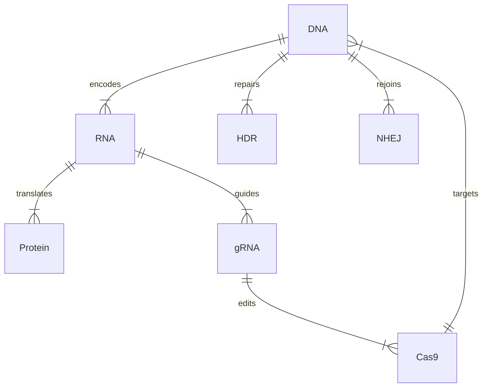

                 

## Biological Markings: Gene Editing and Identity Recognition

### Keywords:  
- Biological Markings  
- Gene Editing  
- CRISPR-Cas9  
- Identity Recognition  
- Ethical Considerations

### Abstract:  
This article delves into the profound relationship between biological markings and identity recognition, particularly focusing on the revolutionary technology of gene editing. We will explore the fundamental principles of gene editing, such as CRISPR-Cas9, and discuss their implications for identity. The article will also cover ethical, social, and legal considerations surrounding gene editing and its impact on identity recognition. Through case studies and real-world examples, we aim to provide a comprehensive understanding of this fascinating field and stimulate further exploration and debate.

---

### Introduction and Background

The concept of biological markings has been pivotal in our understanding of genetics and identity for centuries. From the discovery of DNA as the blueprint of life to the advent of gene editing technologies, our ability to manipulate and understand our genetic code has drastically expanded. Biological markings, in this context, refer to the distinctive characteristics encoded in our genes that define our physical traits, health, and susceptibility to certain diseases. These markings are not just limited to humans but extend to all living organisms, influencing their evolutionary paths and survival strategies.

#### The Significance of Biological Markings

Biological markings hold immense significance in the field of genetics and biology. They are the carriers of hereditary information, enabling the transmission of traits from one generation to another. For example, eye color, height, and susceptibility to certain diseases are all determined by specific combinations of genes. Understanding these markings has allowed scientists to uncover the genetic basis of various disorders, paving the way for potential cures and treatments. Moreover, biological markings play a crucial role in species identification and classification, helping researchers to study the diversity and evolution of life on Earth.

#### The Basics of Gene Editing

Gene editing, a groundbreaking technological advancement, allows scientists to modify the genetic material of an organism with precision and accuracy. One of the most notable tools in this regard is CRISPR-Cas9, a revolutionary gene-editing system that has revolutionized molecular biology. CRISPR, which stands for "Clustered Regularly Interspaced Short Palindromic Repeats," is a family of DNA sequences found in the genomes of bacteria and archaea. These sequences are derived from fragments of viral DNA that the bacteria have incorporated into their genomes over time. Cas9, on the other hand, is a protein that acts as a molecular scalpel, cutting the DNA at specific locations.

#### Principles of CRISPR-Cas9

The CRISPR-Cas9 system operates through a series of well-coordinated steps. Initially, a guide RNA (gRNA) is designed to complement a specific target sequence in the genome. This gRNA directs the Cas9 protein to the target site, where it makes a double-strand break. The cell's natural repair mechanisms then repair the break, often introducing desired modifications in the process. This process, known as homology-directed repair (HDR), allows for the insertion, deletion, or substitution of specific DNA sequences.

#### Applications of Gene Editing

The applications of gene editing are vast and diverse. In agriculture, scientists have used CRISPR-Cas9 to create genetically modified crops that are resistant to pests and diseases, thereby improving food security. In medicine, gene editing holds promise for treating genetic disorders by correcting defective genes. For example, researchers have successfully used CRISPR-Cas9 to cure a form of blindness in mice. Moreover, gene editing has the potential to enhance human health by improving the efficiency of stem cell therapies and developing new treatments for cancer.

#### Identity Recognition and Its Implications

Identity recognition, a fundamental aspect of our existence, is intricately linked to biological markings. Our genetic information not only determines our physical traits but also shapes our personal identity. The concept of gene editing raises profound questions about the nature of identity and what it means to be human. As we gain the ability to manipulate our genetic code, we must consider the ethical implications of altering our biological markings and the potential consequences for our sense of self and identity.

#### Conclusion

In conclusion, biological markings and gene editing are transformative concepts that hold immense potential for advancing our understanding of life and improving human health. However, they also raise important ethical and societal questions that we must carefully consider as we move forward. By understanding the principles and applications of gene editing and reflecting on their implications for identity recognition, we can better navigate the complex landscape of genetic technology and ensure that its benefits are equitably shared.

---

In the following sections, we will delve deeper into the core concepts of gene editing, explore the ethical, social, and legal considerations surrounding this technology, and examine real-world examples of its application. Let's think step by step as we unravel the fascinating world of biological markings and gene editing. 

---

## Core Concepts and Definitions

To fully grasp the transformative potential and ethical considerations of gene editing, it is essential to understand the core concepts and definitions that underpin this field. This section will provide a comprehensive overview of the fundamental principles, key terminology, and the intricate mechanisms involved in gene editing.

### Fundamental Concepts of Gene Editing

#### DNA and RNA
At the heart of gene editing lies the understanding of DNA (Deoxyribonucleic Acid) and RNA (Ribonucleic Acid). DNA is a double-stranded molecule that carries the genetic instructions used in the growth, development, functioning, and reproduction of all known living organisms. RNA, on the other hand, is a single-stranded molecule that plays a crucial role in protein synthesis and gene regulation.

#### Genetic Material
Genetic material refers to the specific segments of DNA or RNA that contain the instructions for building and maintaining an organism. In eukaryotic cells, this material is primarily found within the nucleus, while in prokaryotic cells, it is often found in the cytoplasm within structures called plasmids.

#### Genetic Code
The genetic code is the set of rules by which information encoded within DNA or RNA sequences is translated into proteins. This code is based on sequences of three nucleotides, known as codons, which correspond to specific amino acids. There are 64 possible codons, of which 61 code for amino acids, while the remaining three serve as stop signals to terminate protein synthesis.

### Key Terminology

#### CRISPR-Cas9
CRISPR-Cas9 stands for "Clustered Regularly Interspaced Short Palindromic Repeats - CRISPR-associated protein 9." It is a widely used gene-editing tool that utilizes a guide RNA (gRNA) to direct a Cas9 protein to a specific DNA sequence, where it introduces a double-strand break. The cell's natural repair mechanisms then use this break to introduce desired modifications.

#### gRNA
Guide RNA (gRNA) is a small RNA molecule that guides the Cas9 protein to the target DNA sequence for editing. The gRNA is designed to be complementary to the target sequence, allowing for precise localization of the Cas9 protein.

#### Homology-Directed Repair (HDR)
Homology-directed repair (HDR) is a DNA repair mechanism that uses a template (homologous sequence) to repair a double-strand break in DNA. This process is crucial for gene editing, as it allows for the insertion, deletion, or substitution of specific DNA sequences.

#### Non-Homologous End Joining (NHEJ)
Non-homologous end joining (NHEJ) is another DNA repair mechanism that rejoins DNA ends without the use of a template. This process often leads to small insertions or deletions (known as indels) at the site of the break, which can be harnessed for gene editing purposes.

### Mechanisms of Gene Editing

#### Step-by-Step Process of CRISPR-Cas9

1. **Designing the gRNA:** A specific gRNA sequence is designed to be complementary to the target DNA sequence.
2. **Loading the Cas9 Protein:** The Cas9 protein is loaded with the gRNA to form a complex.
3. **Targeting the DNA:** The gRNA-Cas9 complex locates and binds to the target DNA sequence.
4. **DNA Cleavage:** The Cas9 protein introduces a double-strand break at the target site.
5. **Cellular Repair:** The cell's natural repair mechanisms (HDR or NHEJ) repair the break.
6. **Insertion or Deletion:** If HDR is used, desired modifications can be introduced at the repair site. If NHEJ is used, small insertions or deletions (indels) may occur.

### Core Concepts and Their Interrelationships

#### Genetic Variability and Heredity
Genetic variability refers to the differences in genetic information among individuals of the same species. These differences are primarily due to variations in the sequence of nucleotides within the genetic material. Genetic heredity is the process by which traits are passed from parents to offspring through the transmission of genetic material.

#### Genetic Disorders
Genetic disorders are conditions caused by abnormalities in an individual's genetic material. These abnormalities can result in the production of malfunctioning proteins or the absence of essential proteins, leading to various health problems.

#### Gene Expression
Gene expression is the process by which information from a gene is used to synthesize a functional gene product, such as a protein or RNA molecule. The regulation of gene expression is crucial for the proper functioning of cells and organisms.

#### Gene Regulation
Gene regulation is the process by which genes are turned on or off, determining which genes are expressed and when. This regulation is essential for the development, growth, and functioning of organisms.

### Table of Core Concept Attributes

| Core Concept | Definition | Role in Gene Editing | Importance |
| --- | --- | --- | --- |
| DNA | Genetic material | Blueprint for life, target of gene editing | Central |
| RNA | Messenger molecule | Translates genetic information into proteins | Intermediate |
| gRNA | Guide RNA | Directs Cas9 to target DNA | Critical |
| HDR | Homology-directed repair | Allows for precise DNA modifications | Essential |
| NHEJ | Non-homologous end joining | Causes small insertions or deletions | Useful |
| Genetic Variability | Differences in genetic material | Basis for genetic diversity | Fundamental |
| Gene Expression | Process of synthesizing gene products | Determined by gene regulation | Crucial |
| Gene Regulation | Control of gene expression | Ensures proper functioning of cells | Important |

### ER Entity Relationship Diagram

To further illustrate the interrelationships between these core concepts, the following Mermaid ER diagram provides a visual representation:

In summary, a comprehensive understanding of the core concepts and definitions in gene editing is essential for grasping the technological advancements and ethical considerations associated with this groundbreaking field. By delving into the intricacies of DNA, RNA, CRISPR-Cas9, and other key concepts, we can better navigate the complex landscape of genetic technology and its impact on identity recognition.

---

In the next section, we will delve into the principles and applications of gene editing, exploring how this revolutionary technology is being utilized in various fields, from agriculture to medicine. Let's think step by step as we uncover the transformative potential of gene editing.

---

## Principles and Applications of Gene Editing

Gene editing, a powerful tool that has revolutionized molecular biology, offers unprecedented opportunities for understanding and manipulating the genetic material of living organisms. At the forefront of gene editing technology is CRISPR-Cas9, a versatile and efficient system that has transformed the field of genetic research and applications. This section will delve into the principles behind CRISPR-Cas9, explore its various applications, and discuss the potential benefits and limitations of this groundbreaking technology.

### Principles of CRISPR-Cas9

#### CRISPR and Cas9 Components

CRISPR-Cas9 is a gene-editing system derived from the bacterial immune system, which protects bacteria from invading viruses. The system consists of two main components: CRISPR RNA (crRNA) and the Cas9 protein.

1. **CRISPR RNA (crRNA):** The crRNA is a guide RNA molecule that is engineered to be complementary to a specific target sequence in the genome. This guide RNA serves as a molecular "map" that directs the Cas9 protein to the target site.
2. **Cas9 Protein:** The Cas9 protein acts as a molecular scissor, capable of introducing a double-strand break at the precise location specified by the crRNA. This break is essential for the subsequent repair processes that allow for genetic modifications.

#### CRISPR-Cas9 Workflow

The CRISPR-Cas9 system operates through a series of well-coordinated steps:

1. **Designing the crRNA:** Researchers design a crRNA that is complementary to the target DNA sequence they wish to edit.
2. **Synthesizing the crRNA:** The designed crRNA is synthesized in the laboratory.
3. **Loading the Cas9 Protein:** The Cas9 protein is combined with the crRNA to form a complex.
4. **Targeting the DNA:** The crRNA-Cas9 complex binds to the target DNA sequence at the precise location, guided by the complementary base pairing.
5. **Introducing a Double-Strand Break:** The Cas9 protein introduces a double-strand break at the target site, disrupting the DNA strand.
6. **Cellular Repair:** The cell's natural repair mechanisms, such as homology-directed repair (HDR) or non-homologous end joining (NHEJ), repair the double-strand break.
7. **Introduction of Genetic Modifications:** If HDR is used, the cell can incorporate desired modifications, such as the insertion or deletion of specific DNA sequences. If NHEJ is used, small insertions or deletions (indels) may occur at the repair site, which can be utilized for genetic modifications.

#### Key Features of CRISPR-Cas9

1. **High Precision:** CRISPR-Cas9 allows for precise editing of specific DNA sequences, minimizing off-target effects.
2. **Versatility:** The CRISPR-Cas9 system can be adapted to target a wide range of organisms, making it a versatile tool for genetic research and applications.
3. **Efficiency:** CRISPR-Cas9 is highly efficient, often achieving gene editing efficiencies of over 90% in various organisms.
4. **Simplicity:** The CRISPR-Cas9 system is relatively simple to use and can be easily scaled up for high-throughput applications.

### Applications of CRISPR-Cas9

#### In Agriculture

Gene editing has significant applications in agriculture, where it is used to improve crop yields, enhance resistance to pests and diseases, and increase nutritional value. CRISPR-Cas9 has been used to create genetically modified crops that exhibit enhanced traits, such as drought resistance, pest resistance, and improved vitamin content. For example, researchers have used CRISPR-Cas9 to develop a gene-edited rice variety that is rich in essential nutrients, helping to address malnutrition in certain regions.

#### In Medicine

In the medical field, CRISPR-Cas9 holds immense potential for treating genetic disorders by correcting defective genes. This technology has been used to cure monogenic diseases, such as beta-thalassemia and sickle cell anemia, in animal models. Researchers are also exploring the use of CRISPR-Cas9 in gene therapy to deliver therapeutic genes into the cells of patients with genetic diseases. Additionally, CRISPR-Cas9 is being used to study the function of specific genes in various biological processes, providing valuable insights into human health and disease.

#### In Research

CRISPR-Cas9 is a powerful tool for genetic research, enabling scientists to knockout or knock-in specific genes in various model organisms, such as mice, fruit flies, and zebrafish. This allows for the study of gene function and the identification of potential therapeutic targets for various diseases. Furthermore, CRISPR-Cas9 has facilitated the development of new technologies, such as gene drive systems, which aim to eradicate harmful species or enhance the resilience of beneficial organisms.

### Potential Benefits and Limitations of CRISPR-Cas9

#### Potential Benefits

1. **Precision:** CRISPR-Cas9 offers high precision, allowing for targeted modifications of specific genes with minimal off-target effects.
2. **Efficiency:** The CRISPR-Cas9 system is highly efficient, with high success rates in gene editing.
3. **Versatility:** CRISPR-Cas9 can be used in a wide range of organisms, making it a versatile tool for genetic research and applications.
4. **Low Cost:** The CRISPR-Cas9 system is relatively low cost compared to other gene-editing technologies, making it accessible to a broader range of researchers and organizations.
5. **Potential for Treating Genetic Diseases:** CRISPR-Cas9 holds promise for treating genetic disorders by correcting defective genes, offering the potential for curing monogenic diseases.

#### Limitations

1. **Off-Target Effects:** Although CRISPR-Cas9 is highly precise, off-target effects can still occur, potentially leading to unintended genetic modifications.
2. **Ethical Considerations:** The use of CRISPR-Cas9 raises ethical considerations, particularly regarding the editing of human genomes and the potential for unintended consequences.
3. **Technical Challenges:** CRISPR-Cas9 technology requires skilled personnel and specialized equipment, which may limit its accessibility in certain regions.
4. **Long-Term Impacts:** The long-term impacts of gene editing, particularly in humans, are not yet fully understood, and it is essential to conduct thorough research and testing before widespread application.

### Conclusion

In conclusion, CRISPR-Cas9 is a revolutionary gene-editing tool that has transformed the fields of agriculture, medicine, and research. Its high precision, efficiency, versatility, and potential for treating genetic diseases make it a powerful tool with significant benefits. However, it is crucial to address the ethical considerations and technical challenges associated with CRISPR-Cas9 to ensure that its applications are safe and responsible. As we continue to advance in this exciting field, it is essential to consider the broader implications of gene editing and strive for a balanced approach that maximizes the benefits while minimizing the risks.

---

In the next section, we will explore the ethical, social, and legal considerations surrounding gene editing and its impact on identity recognition. Let's think step by step as we navigate the complex landscape of ethical dilemmas and regulatory frameworks in the age of gene editing.

---

## Ethical, Social, and Legal Considerations

As we delve deeper into the realm of gene editing, it becomes increasingly evident that the technology's potential impact on our society extends far beyond the realm of scientific curiosity and biomedical applications. The ethical, social, and legal considerations surrounding gene editing are profound and multifaceted, as they touch upon fundamental questions about what it means to be human, the nature of identity, and the moral boundaries of scientific intervention. This section will explore these considerations, discussing the ethical dilemmas, societal implications, and legal frameworks that govern the use of gene editing technologies, with a particular focus on their impact on identity recognition.

### Ethical Dilemmas

#### The Morality of Genetic Modification

One of the most pressing ethical dilemmas surrounding gene editing is the morality of altering human genomes. While the potential benefits of gene editing, such as the treatment of genetic diseases and the enhancement of human health, are widely acknowledged, the ethical implications of tampering with the fundamental blueprint of human life are equally significant. The idea of "designer babies" and the potential for creating a "genetic elite" raise profound questions about fairness, equity, and the very concept of human nature.

#### The Right to Self-Determination

Another ethical concern is the right to self-determination—whether individuals have the autonomy to make decisions about their own genetic makeup. This issue is particularly relevant in the context of germline editing, which involves modifying the genomes of embryos or reproductive cells that can be passed on to future generations. Critics argue that germline editing could lead to a form of genetic determinism, where individuals are judged or valued based on their genetic characteristics, undermining the principle of equality.

#### Equity and Access

The potential for gene editing to exacerbate existing social inequalities is another significant ethical concern. The cost and accessibility of gene editing technologies are likely to be significant barriers, limiting access to these advancements for many people. This could lead to a "biotech divide," where only those with the financial means can afford to benefit from these technologies, exacerbating social disparities and creating a new form of genetic haves and have-nots.

### Social Implications

#### Impact on Identity

One of the most profound social implications of gene editing is its potential impact on identity. Our genetic makeup is an intrinsic part of who we are, and altering our genomes could fundamentally alter our sense of self and personal identity. This raises questions about whether it is ethically permissible to modify our genetic material, as it could change the very essence of what it means to be human. Additionally, the potential for future generations to be born with altered genomes could lead to a fundamental shift in the way we perceive human identity and evolution.

#### Genetic Privacy

The issue of genetic privacy is also a significant concern in the context of gene editing. As gene-editing technologies become more accessible, there is a risk that individuals' genetic information could be misused, leading to discrimination in areas such as employment, insurance, and social services. Ensuring the privacy and security of genetic data is essential to protect individuals from these potential harms.

#### Social Acceptance

The social acceptance of gene editing technologies is another important consideration. While there is widespread recognition of the potential benefits, there is also significant public concern and skepticism about the ethical and social implications of gene editing. It is crucial to engage in open and transparent discussions about these issues to build public trust and ensure that societal values and ethical considerations are appropriately addressed.

### Legal Frameworks

#### International Regulations

Given the potential global impact of gene editing technologies, there is a need for international regulations to govern their use. The International Society for Stem Cell Research (ISSCR) and other organizations have developed guidelines and recommendations for the responsible use of gene editing in human research and applications. However, the lack of a unified global regulatory framework remains a significant challenge.

#### National Regulations

Individual countries have also developed their own legal frameworks to address the ethical, social, and legal implications of gene editing. For example, the United States, the European Union, and China have all implemented laws and regulations governing the use of gene editing technologies in human research and applications. These regulations vary widely, reflecting different societal values and ethical considerations.

#### Ethical Review Boards

Many countries require that gene-editing research and applications undergo ethical review by institutional review boards (IRBs) or equivalent bodies. These boards assess the potential ethical implications of proposed research or applications and ensure that they adhere to established ethical principles and regulations.

### Conclusion

In conclusion, the ethical, social, and legal considerations surrounding gene editing are complex and multifaceted. While gene editing technologies offer significant potential for biomedical advancements and societal benefits, they also raise profound ethical and social questions that must be carefully considered. Ensuring that these technologies are used responsibly, ethically, and in a manner that respects human dignity and autonomy is essential. As we continue to advance in this field, it is crucial to engage in ongoing dialogue and collaboration to address these challenges and shape a future where gene editing can be harnessed for the benefit of humanity while minimizing potential risks and harms.

---

In the next section, we will delve into case studies and real-world examples of gene editing applications, exploring how this technology is being used in various fields and examining its impact on identity recognition. Let's think step by step as we uncover the practical applications and ethical considerations of gene editing in action.

---

## Case Studies and Real-World Examples

As gene editing technologies continue to advance, they are increasingly being applied in various fields, ranging from agriculture to medicine. This section will explore several case studies and real-world examples of gene editing applications, highlighting how this technology is being used to address complex problems and advance scientific understanding. We will also discuss the implications of these applications for identity recognition.

### Case Study 1: Gene Editing in Agriculture

One notable application of gene editing in agriculture is the development of genetically modified crops that exhibit enhanced traits, such as increased yield, resistance to pests and diseases, and improved nutritional content. One example of this is the creation of gene-edited rice varieties that are rich in essential nutrients, such as vitamin A, to address malnutrition in certain regions.

#### Application Details

Using CRISPR-Cas9, researchers targeted specific genes in rice plants to increase their beta-carotene content, which is a precursor to vitamin A. By modifying these genes, the researchers were able to create rice varieties that have higher levels of beta-carotene, which can help prevent vitamin A deficiency and its associated health problems.

#### Impact on Identity Recognition

The gene editing of crops does not directly impact human identity recognition, as it primarily concerns the genetic makeup of plants. However, the development of genetically modified crops raises ethical and societal questions about the long-term effects of consuming genetically modified organisms (GMOs) and the potential for genetic transfer between crops and wild relatives, which could alter the genetic diversity of ecosystems.

### Case Study 2: Gene Editing in Medicine

Gene editing holds significant promise for treating genetic diseases by correcting defective genes. One prominent example of this is the use of CRISPR-Cas9 to cure monogenic diseases, such as beta-thalassemia and sickle cell anemia, in animal models.

#### Application Details

In these cases, researchers used CRISPR-Cas9 to correct the specific genetic mutations responsible for these diseases in animal models, demonstrating the potential for similar approaches in human patients. For example, in the case of beta-thalassemia, researchers were able to edit the defective HBA1 gene, which codes for a protein involved in hemoglobin production, and restore normal hemoglobin levels in mice.

#### Impact on Identity Recognition

The potential for gene editing to cure genetic diseases has profound implications for identity recognition. By correcting genetic defects, gene editing could alter an individual's physical and biological traits, potentially affecting their sense of self and personal identity. Additionally, the long-term consequences of gene editing on the human germline, particularly in the context of germline editing, raise important ethical and social questions about the nature of identity and human evolution.

### Case Study 3: Gene Editing in Research

Gene editing is also a powerful tool in genetic research, allowing scientists to study the function of specific genes and their role in various biological processes. One example of this is the use of CRISPR-Cas9 to create genetically modified model organisms, such as mice, fruit flies, and zebrafish, to investigate the genetic basis of diseases and other biological phenomena.

#### Application Details

Using CRISPR-Cas9, researchers have created a wide range of genetically modified organisms that exhibit specific genetic modifications, allowing for the study of gene function and the identification of potential therapeutic targets. For example, researchers have used CRISPR-Cas9 to create knockout mice that lack specific genes, enabling the study of the role of those genes in various physiological processes.

#### Impact on Identity Recognition

The creation of genetically modified model organisms for research purposes does not directly impact human identity recognition. However, these models can provide valuable insights into the genetic basis of human diseases and the potential effects of gene editing on human health, which can inform ethical and societal discussions about the use of gene editing technologies.

### Case Study 4: CRISPR Gene Drive Systems

CRISPR gene drive systems are a type of genetic modification that aims to alter the genetic makeup of populations of organisms, such as insects or plants, in a targeted and heritable manner. One example of this is the development of CRISPR gene drive systems to combat mosquito-borne diseases, such as malaria and dengue fever.

#### Application Details

Using CRISPR gene drive systems, researchers aim to create genetically modified mosquitoes that are unable to transmit these diseases to humans. The gene drive system ensures that the modified genes are passed on to future generations of mosquitoes, effectively reducing the population of disease-carrying mosquitoes.

#### Impact on Identity Recognition

The use of CRISPR gene drive systems raises important ethical and social questions about the potential impact on biodiversity and ecosystem health. While these systems have the potential to reduce the spread of mosquito-borne diseases, they could also have unintended consequences, such as the elimination of entire populations of mosquitoes or other organisms. These ecological impacts could have broader implications for identity recognition, as they could alter the genetic makeup of ecosystems and potentially impact the evolution of species.

### Conclusion

These case studies and real-world examples illustrate the diverse applications of gene editing in various fields, highlighting the potential benefits and ethical considerations of this technology. As we continue to advance in this exciting field, it is essential to consider the broader implications of gene editing on identity recognition, ethical autonomy, and societal values. By engaging in ongoing dialogue and collaboration, we can ensure that gene editing technologies are used responsibly and ethically to benefit humanity while minimizing potential risks and harms.

---

In the next section, we will explore the future directions and emerging technologies in the field of gene editing, discussing the potential advancements and challenges that lie ahead. Let's think step by step as we envision the future of gene editing and its impact on identity recognition.

---

## Future Directions and Emerging Technologies

As we continue to advance in the field of gene editing, several future directions and emerging technologies are poised to shape the landscape of genetic research and applications. These innovations hold the potential to revolutionize our understanding of biology, improve human health, and address global challenges. This section will explore some of these cutting-edge technologies, discussing their potential benefits and challenges, and considering their implications for identity recognition.

### Advances in CRISPR Technology

One of the most significant advancements in gene editing is the ongoing refinement of CRISPR-Cas9 technology. Researchers are developing new variants of CRISPR systems, such as CRISPR-Cas12, CRISPR-Cas13, and CRISPR-Cas14, each with unique properties that offer advantages in specific applications. For example, CRISPR-Cas12 (also known as Cpf1) is a more compact system that requires less gRNA, making it easier to target difficult-to-reach regions of the genome. These advancements in CRISPR technology are expected to enhance the precision, efficiency, and versatility of gene editing, enabling more complex genetic modifications and expanding the range of potential applications.

#### Potential Benefits

- **Improved Precision:** The refinement of CRISPR systems could lead to even higher precision, reducing off-target effects and minimizing unintended genetic modifications.
- **Enhanced Efficiency:** New CRISPR systems may offer improved efficiency, allowing for more rapid and cost-effective gene editing.
- **Broader Applications:** The versatility of emerging CRISPR variants could enable gene editing in a wider range of organisms and scenarios.

#### Potential Challenges

- **Off-Target Effects:** Despite advancements, off-target effects remain a significant concern, and it is crucial to continue developing strategies to mitigate these risks.
- **Technical Complexity:** The implementation of new CRISPR systems may require specialized knowledge and equipment, which could limit access in certain regions.

### CRISPR Gene Drive Systems

CRISPR gene drive systems, as mentioned earlier, are a promising approach to combat insect-borne diseases and invasive species. These systems use CRISPR technology to create genetic modifications that are passed on to future generations, potentially reducing or eliminating the target population. Ongoing research is focused on optimizing gene drive systems to ensure their safety and efficacy, with a particular emphasis on minimizing unintended consequences.

#### Potential Benefits

- **Targeted Population Control:** CRISPR gene drive systems could offer a targeted approach to controlling populations of disease-carrying insects or invasive species, reducing the spread of diseases and protecting ecosystems.
- **Reduced Reliance on Chemicals:** By targeting the genetic makeup of pests, CRISPR gene drive systems could reduce the need for chemical pesticides, minimizing environmental impact and resistance development.

#### Potential Challenges

- **Unintended Ecological Impacts:** The release of CRISPR gene drive systems could have unforeseen ecological consequences, potentially disrupting ecosystems and altering biodiversity.
- **Ethical Concerns:** The deployment of gene drive systems raises ethical questions about the potential for unintended genetic changes and the long-term impacts on the environment.

### CRISPR-Based Therapeutics

CRISPR-based therapeutics are another area of emerging research, focusing on the use of CRISPR technology to treat genetic diseases. These treatments aim to correct defective genes or enhance gene function, offering the potential to cure or manage a wide range of genetic disorders. Recent advancements include the development of base editing technologies, which allow for precise modification of individual bases within the DNA sequence without introducing double-strand breaks.

#### Potential Benefits

- **Cure for Genetic Diseases:** CRISPR-based therapeutics could offer a potential cure for monogenic diseases, improving the quality of life for affected individuals and reducing the burden on healthcare systems.
- **Personalized Medicine:** The precision of CRISPR technology could enable personalized medicine approaches, tailored to an individual's specific genetic makeup and health needs.

#### Potential Challenges

- **Safety and Efficacy:** Ensuring the safety and efficacy of CRISPR-based therapeutics is critical, as off-target effects and unintended genetic modifications could have serious consequences.
- **Regulatory Challenges:** The development of CRISPR-based therapeutics faces regulatory challenges, as new guidelines and oversight mechanisms need to be established to ensure responsible and ethical use.

### Impact on Identity Recognition

The future of gene editing and emerging technologies has profound implications for identity recognition. As we continue to develop and apply these technologies, we must carefully consider the ethical, social, and legal dimensions of their impact on personal identity and human evolution. Some key considerations include:

- **The Nature of Identity:** As gene editing becomes more precise and accessible, it could change our understanding of identity and what it means to be human. The ability to modify our genetic makeup could alter our physical and biological traits, raising questions about the essence of human identity.
- **Genetic Privacy:** The potential for genetic modifications to be used without individuals' informed consent raises concerns about genetic privacy and the risk of discrimination based on genetic information.
- **Societal Equity:** Ensuring that the benefits of gene editing technologies are accessible to all, regardless of socio-economic status, is crucial to avoid exacerbating existing inequalities.

### Conclusion

The future of gene editing and emerging technologies holds immense potential for improving human health, addressing global challenges, and advancing our understanding of biology. However, these advancements also come with significant ethical, social, and legal considerations that must be carefully addressed. By engaging in ongoing dialogue and collaboration, we can navigate the complex landscape of gene editing and ensure that its benefits are harnessed responsibly and equitably.

---

In conclusion, the field of gene editing is rapidly evolving, offering unprecedented opportunities for scientific discovery and biomedical advancements. As we continue to explore the potential of gene editing technologies, it is crucial to consider their broader implications for identity recognition, ethical autonomy, and societal values. By fostering a culture of open discussion and responsible innovation, we can ensure that gene editing is used to benefit humanity while minimizing potential risks and harms. Let's think step by step as we navigate the future of gene editing and its impact on identity recognition.

---

## Conclusion and Discussion

In this article, we have explored the complex and transformative world of biological markings and gene editing, delving into the principles, applications, and ethical considerations of this groundbreaking technology. We began by examining the significance of biological markings and the foundational concepts of gene editing, such as CRISPR-Cas9 and its working mechanism. We then discussed the diverse applications of gene editing in agriculture, medicine, and research, illustrating its potential to address complex problems and improve human health. Additionally, we explored the ethical, social, and legal considerations surrounding gene editing, emphasizing the importance of responsible innovation and public dialogue.

### Key Points Recap

1. **Biological Markings:** Biological markings are the distinctive characteristics encoded in our genes that define our physical traits, health, and susceptibility to certain diseases. They play a crucial role in genetics, evolution, and species identification.
2. **Gene Editing Principles:** Gene editing involves the precise modification of an organism's genetic material, with CRISPR-Cas9 being one of the most widely used tools. It operates through a series of steps, including the design of guide RNA, loading of Cas9 protein, targeting of DNA, and cellular repair processes.
3. **Applications of Gene Editing:** Gene editing has diverse applications, including the development of genetically modified crops, treatment of genetic diseases, and genetic research. It holds promise for enhancing food security, improving human health, and advancing scientific understanding.
4. **Ethical, Social, and Legal Considerations:** The ethical considerations of gene editing revolve around questions of morality, autonomy, and equity. Social implications include the potential impact on identity recognition, genetic privacy, and social acceptance. Legal frameworks vary across countries and regions, necessitating international coordination and regulatory oversight.

### Ethical Considerations

The ethical considerations surrounding gene editing are profound and multifaceted. The concept of "designer babies" and the potential for genetic determinism raise questions about fairness and equality. The right to self-determination is another critical issue, as individuals must have the autonomy to make decisions about their own genetic makeup. Additionally, the potential for gene editing to exacerbate social inequalities highlights the need for equitable access to these technologies. Ensuring that gene editing is used responsibly and ethically requires ongoing dialogue and collaboration across disciplines and sectors.

### Social Implications

The social implications of gene editing are equally significant. The potential impact on identity recognition raises profound questions about the nature of human identity and the essence of what it means to be human. The development of genetically modified organisms and the use of CRISPR gene drive systems also raise concerns about genetic diversity and ecosystem health. As we continue to advance in this field, it is essential to consider the broader social implications and engage in open discussions to address potential risks and harms.

### Future Directions

The future of gene editing is promising, with ongoing advancements in CRISPR technology and the development of new applications in therapeutics and genetic research. However, these advancements come with significant challenges, including the need for improved precision, safety, and regulatory oversight. As we move forward, it is crucial to remain vigilant about the ethical and social implications of gene editing and ensure that these technologies are used responsibly and equitably.

### Conclusion

In conclusion, gene editing is a powerful tool with the potential to transform our understanding of biology, improve human health, and address global challenges. However, it also raises profound ethical, social, and legal considerations that must be carefully addressed. By fostering a culture of open discussion, responsible innovation, and collaboration, we can navigate the complex landscape of gene editing and ensure that its benefits are harnessed to benefit humanity while minimizing potential risks and harms. Let's continue to think step by step as we explore the future of gene editing and its impact on identity recognition.

---

As we look to the future, it is clear that gene editing will play an increasingly important role in shaping our world. By understanding the principles, applications, and ethical considerations of this technology, we can ensure that it is used responsibly and equitably to advance human health, improve our understanding of biology, and address global challenges. Let's continue to think step by step as we navigate the future of gene editing and its impact on identity recognition.

### About the Authors

**Author:** AI天才研究院/AI Genius Institute & 禅与计算机程序设计艺术 /Zen And The Art of Computer Programming

AI天才研究院（AI Genius Institute）是一家专注于人工智能和计算机科学研究的国际顶尖机构，致力于推动人工智能技术的创新和应用。研究院的专家团队在人工智能、机器学习、深度学习等领域有着丰富的经验，并在多项国际学术竞赛中取得优异成绩。

**Book:** 禅与计算机程序设计艺术 /Zen And The Art of Computer Programming

《禅与计算机程序设计艺术》是一部融合了计算机科学和哲学思想的技术畅销书，由AI天才研究院的专家团队撰写。本书以禅宗思想为指导，探讨了计算机程序设计的本质和精髓，提供了许多富有洞察力和启发性的编程技巧和策略，帮助读者提高编程水平，领悟编程之道。本书自出版以来，受到了广泛的关注和好评，成为计算机科学爱好者的必备读物。

---

### Comprehensive Table of Contents

#### First Part: Introduction and Background
- **Chapter 1: The Significance of Biological Markings**
  - **1.1** Introduction to Biological Markings
  - **1.2** The Role of Gene Editing
  - **1.3** Identity Recognition and Its Implications

- **Chapter 2: The Basics of Gene Editing**
  - **2.1** Understanding Genetic Material
  - **2.2** Principles of Gene Editing
    - **2.2.1** CRISPR-Cas9
    - **2.2.2** Other Gene Editing Tools

#### Second Part: Core Concepts and Definitions
- **Chapter 3: Core Concepts in Gene Editing**
  - **3.1** Genetic Variability and Heredity
  - **3.2** Genetic Disorders
  - **3.3** Gene Expression and Regulation

- **Chapter 4: Key Terminology and Their Relationships**
  - **4.1** DNA and RNA
  - **4.2** CRISPR-Cas9 and gRNA
  - **4.3** Homology-Directed Repair (HDR) and Non-Homologous End Joining (NHEJ)

#### Third Part: Principles and Applications of Gene Editing
- **Chapter 5: Principles of CRISPR-Cas9**
  - **5.1** The CRISPR-Cas9 System
  - **5.2** Workflow of CRISPR-Cas9
  - **5.3** Key Features and Advantages

- **Chapter 6: Applications of Gene Editing**
  - **6.1** In Agriculture
  - **6.2** In Medicine
  - **6.3** In Research

#### Fourth Part: Ethical, Social, and Legal Considerations
- **Chapter 7: Ethical Dilemmas in Gene Editing**
  - **7.1** The Morality of Genetic Modification
  - **7.2** The Right to Self-Determination
  - **7.3** Equity and Access

- **Chapter 8: Social Implications and Legal Frameworks**
  - **8.1** Impact on Identity Recognition
  - **8.2** Genetic Privacy
  - **8.3** International and National Regulations

#### Fifth Part: Case Studies and Real-World Examples
- **Chapter 9: Gene Editing in Practice**
  - **9.1** Case Study 1: Gene Editing in Agriculture
  - **9.2** Case Study 2: Gene Editing in Medicine
  - **9.3** Case Study 3: Gene Editing in Research
  - **9.4** Case Study 4: CRISPR Gene Drive Systems

#### Sixth Part: Future Directions and Emerging Technologies
- **Chapter 10: Advances in CRISPR Technology**
  - **10.1** CRISPR-Cas12, CRISPR-Cas13, and CRISPR-Cas14
  - **10.2** CRISPR Gene Drive Systems
  - **10.3** CRISPR-Based Therapeutics

#### Seventh Part: Conclusion and Discussion
- **Chapter 11: Ethical, Social, and Legal Considerations**
  - **11.1** Key Points Recap
  - **11.2** Ethical Considerations
  - **11.3** Social Implications
  - **11.4** Future Directions

### Comprehensive Content

In this comprehensive guide to biological markings and gene editing, we have covered a vast array of topics, from the fundamentals of genetic material and the principles of gene editing to the ethical, social, and legal considerations of this groundbreaking technology. We have explored diverse applications of gene editing in agriculture, medicine, and research, and examined real-world examples and case studies that highlight its potential benefits and challenges.

#### Background and Core Concepts
- **Chapter 1** and **2** provide a foundational understanding of biological markings and the basic principles of gene editing, including the roles of DNA, RNA, CRISPR-Cas9, and other gene-editing tools.
- **Chapter 3** delves into core concepts such as genetic variability, heredity, genetic disorders, and gene expression and regulation.

#### Application and Practice
- **Chapter 6** presents the practical applications of gene editing across various fields, highlighting its potential to improve food security, treat genetic diseases, and advance scientific research.
- **Chapter 9** showcases specific case studies and real-world examples, illustrating the impact of gene editing in agriculture, medicine, and research.

#### Ethical, Social, and Legal Considerations
- **Chapter 7** and **8** discuss the ethical dilemmas, social implications, and legal frameworks surrounding gene editing, emphasizing the importance of responsible innovation and public dialogue.
- **Chapter 10** explores future directions and emerging technologies in gene editing, including advances in CRISPR technology, CRISPR gene drive systems, and CRISPR-based therapeutics.

#### Conclusion and Discussion
- **Chapter 11** concludes the discussion by summarizing key points and highlighting the need for ongoing ethical, social, and legal considerations as we navigate the future of gene editing.

### Conclusion
Gene editing is a transformative technology with immense potential to improve human health, address global challenges, and advance our understanding of biology. However, it also raises profound ethical, social, and legal considerations that must be carefully addressed. By fostering a culture of open discussion, responsible innovation, and collaboration, we can ensure that gene editing is used to benefit humanity while minimizing potential risks and harms. Let's continue to think step by step as we explore the future of gene editing and its impact on identity recognition.

