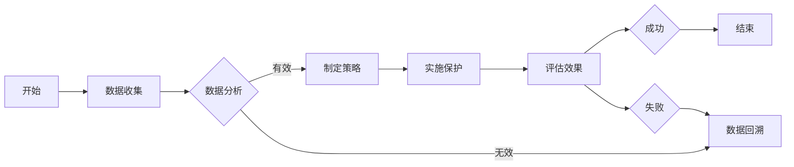
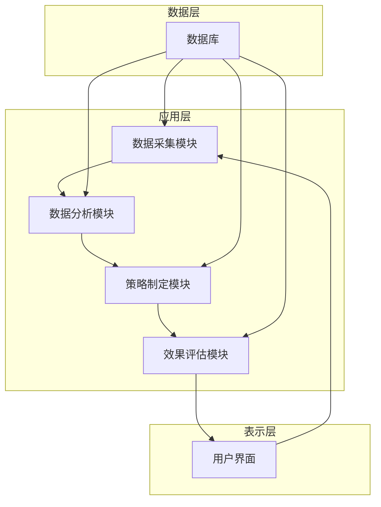
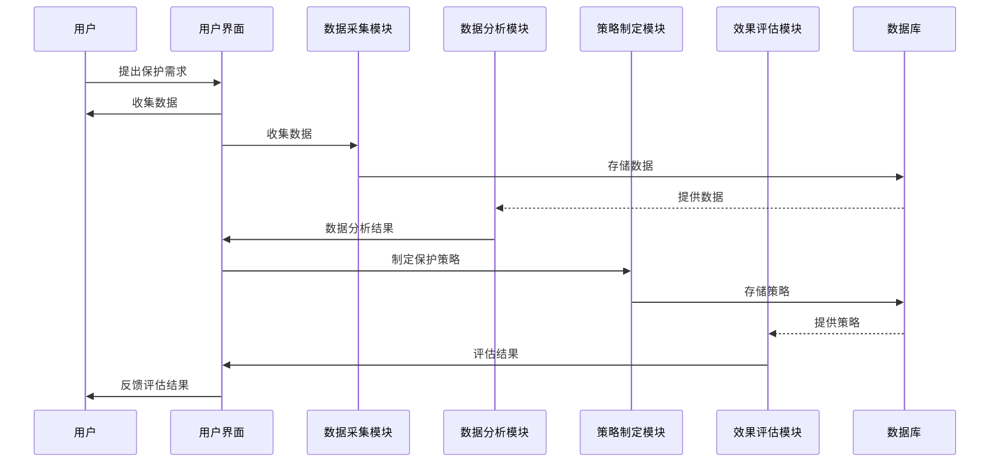

                 

### 生物多样性保护：万物有灵的生态观

> 关键词：生物多样性、生态观、保护策略、生态系统、遗传多样性

> 摘要：本文从生态观的角度出发，深入探讨了生物多样性的重要性以及面临的主要威胁。通过分析生物多样性的核心概念、联系和算法原理，文章提出了有效的保护策略，旨在推动生态系统的可持续发展，维护地球的生态平衡。

---

**引言：**

在人类的历史长河中，大自然一直是人类赖以生存和发展的基础。然而，随着工业化和城市化进程的加速，地球的生物多样性正面临前所未有的威胁。物种灭绝的速度前所未有，生态系统功能受到严重破坏，这直接影响了地球的生态平衡和人类的未来。因此，生物多样性保护成为当务之急，而生态观为我们提供了理解和应对这一问题的理论框架。

本文将从以下几个方面展开讨论：

1. **背景介绍**：介绍生物多样性的重要性、现状以及面临的威胁。
2. **核心概念与联系**：分析生物多样性的核心概念及其相互联系。
3. **算法原理讲解**：通过算法流程和数学模型阐述生物多样性保护的方法。
4. **系统分析与架构设计方案**：设计生物多样性保护系统的框架和接口。
5. **项目实战**：介绍生物多样性保护项目的技术实现和应用场景。
6. **最佳实践 tips**：总结生物多样性保护的最佳实践和小结。

---

**1. 背景介绍**

### 问题背景

生物多样性是地球生态系统的重要组成部分，它不仅关系到生态系统的健康和功能，也对人类的生存和发展有着至关重要的影响。生物多样性包括了物种多样性、遗传多样性和生态系统多样性三个方面。物种多样性指的是地球上不同物种的数量和种类；遗传多样性是指同一物种内部不同个体之间的遗传差异；生态系统多样性则是指不同生态系统之间的差异和复杂性。

然而，随着人类活动的不断扩张，全球生物多样性正面临严重的威胁。栖息地的破坏、污染、过度捕捞、气候变化等因素导致了物种灭绝的速度加快，生态系统功能退化，生态平衡受到破坏。例如，森林砍伐导致了大量野生动物失去栖息地，海洋污染导致海洋生物大量死亡，气候变化影响了物种的分布和生存。

### 问题描述

生物多样性保护是一项复杂的任务，涉及多个领域和学科，如生物学、生态学、环境科学、经济学和社会学等。如何有效地保护生物多样性，维护生态平衡，成为当前亟待解决的问题。

首先，生物多样性保护需要明确保护目标和保护范围。保护目标包括保护濒危物种、维护生态系统功能、保护遗传多样性等。保护范围则包括陆地、水域和湿地等不同生态系统。

其次，生物多样性保护需要制定合适的保护策略和措施。这包括建立自然保护区、实施生态修复、开展物种保护和恢复、推广可持续农业等。

此外，生物多样性保护还需要大量的科研支持和政策制定。科研支持包括开展物种多样性调查、生态系统功能评估、生态风险评估等。政策制定则需要考虑环境保护法律法规的完善和实施。

### 问题解决

为了有效地保护生物多样性，需要采取以下措施：

1. **建立保护区**：通过建立自然保护区和国家公园，保护物种和生态系统的栖息地，限制人类活动对生态系统的破坏。
2. **生态修复**：对受损的生态系统进行修复和重建，恢复生态系统的功能和稳定性。
3. **物种保护和恢复**：对濒危物种进行保护，包括迁地保护、人工繁殖和放归等。
4. **推广可持续农业**：通过推广生态农业、保护农业生物多样性，减少对生态环境的破坏。
5. **公众教育和意识提升**：提高公众对生物多样性的认识和重视，鼓励公众参与生物多样性保护。

### 边界与外延

生物多样性保护不仅涉及生态系统和物种的保护，还包括遗传多样性和生态过程的保护。遗传多样性是物种多样性的基础，保护遗传多样性有助于维持物种的适应性和生存能力。生态过程则包括生态系统的营养循环、能量流动和物种间的相互作用，保护生态过程有助于维护生态系统的健康和功能。

### 概念结构与核心要素组成

生物多样性保护的核心概念包括物种多样性、遗传多样性和生态系统多样性。这三个核心概念相互联系，共同构成了生物多样性的结构。物种多样性指的是不同物种的数量和种类，是生物多样性的基础。遗传多样性是指同一物种内部不同个体之间的遗传差异，是物种多样性的重要组成部分。生态系统多样性则是指不同生态系统之间的差异和复杂性，是生物多样性的重要表现形式。

生物多样性保护的核心要素包括保护区域、保护措施、科研支持和政策制定。保护区域是生物多样性保护的基本单位，包括自然保护区、国家公园和生态廊道等。保护措施包括生态修复、物种保护和恢复、生态监测等。科研支持包括开展物种多样性调查、生态系统功能评估、生态风险评估等。政策制定则需要考虑环境保护法律法规的完善和实施。

---

**2. 核心概念与联系**

### 核心概念原理

#### 生物多样性

生物多样性是指地球上的所有生物种类、遗传多样性和生态系统的多样性。它是生态系统的基本特征，对生态系统的功能、稳定性和适应性有着重要影响。生物多样性包括三个层次：物种多样性、遗传多样性和生态系统多样性。

- **物种多样性**：指的是地球上不同物种的数量和种类。物种多样性越高，生态系统的适应能力越强，生态平衡越稳定。
- **遗传多样性**：指的是同一物种内部不同个体之间的遗传差异。遗传多样性有助于物种的适应性和生存能力，是生物多样性的重要组成部分。
- **生态系统多样性**：指的是不同生态系统之间的差异和复杂性。生态系统多样性有助于维持生态系统的稳定性和功能，对地球生态平衡至关重要。

#### 生态观

生态观是人们对自然界的认知和理解，包括对生态系统的功能、结构和过程的理解。生态观的形成基于对自然界的观察和科学研究，它为生物多样性保护提供了理论依据和实践指导。

- **整体观**：生态观强调生态系统的整体性，认为生态系统是由各种生物和非生物因素相互作用而形成的一个整体。生态系统的各个部分相互依存，相互影响，共同维持生态平衡。
- **动态观**：生态观认为生态系统是动态变化的，受到自然和人类活动的影响。生态系统在不断的演化和适应过程中，维持着生态平衡和生物多样性。
- **可持续观**：生态观强调生态系统的可持续性，认为人类活动应该遵循生态规律，保护生态系统的功能，确保生物多样性的持续存在。

### 概念属性特征对比表格

| 概念         | 定义                                                         | 属性特征                     |
| ------------ | ------------------------------------------------------------ | ---------------------------- |
| 生物多样性   | 地球上的所有生物种类、遗传多样性和生态系统的多样性               | 多样性、复杂性、重要性       |
| 生态观       | 人们对自然界的认知和理解                                     | 系统性、整体性、动态性       |

### ER实体关系图架构的 Mermaid 流程图

```mermaid
erDiagram
  A[生物多样性] ||--|{ B[物种多样性]}
  A ||--|{ C[遗传多样性]}
  A ||--|{ D[生态系统多样性]}
  B ||--|{ E[遗传多样性]}
  B ||--|{ F[生态系统多样性]}
  C ||--|{ E[遗传多样性]}
  C ||--|{ F[生态系统多样性]}
  D ||--|{ E[遗传多样性]}
  D ||--|{ F[生态系统多样性]}
```

### 生物多样性保护与生态观的关系

生物多样性保护与生态观密切相关。生态观为我们提供了理解生物多样性的理论基础，而生物多样性保护则是生态观的具体实践。

- **生态观指导生物多样性保护**：生态观强调生态系统的整体性和动态性，这为生物多样性保护提供了重要的指导原则。例如，在保护物种多样性时，需要考虑物种之间的相互关系和生态系统中的能量流动，以实现生态系统的稳定和功能。
- **生物多样性保护实践生态观**：生物多样性保护实践需要遵循生态观的原则，例如在保护生态系统时，需要考虑生态系统的整体性和动态性，避免对生态系统造成不可逆转的破坏。

通过生态观，我们可以更好地理解生物多样性的价值和重要性，从而采取更加科学和有效的保护措施，实现生态系统的可持续发展和生物多样性的保护。

---

**3. 算法原理讲解**

### 算法流程图

为了有效地保护生物多样性，我们需要制定一套系统的保护策略。下面是一个简化的生物多样性保护算法流程图，它展示了从数据收集到策略评估的全过程。



### Python 源代码

下面是一段伪代码，用于说明如何通过Python实现上述算法流程。

```python
# 数据收集
def collect_data():
    # 收集物种数量、栖息地信息、生态监测数据等
    pass

# 数据分析
def data_analysis(data):
    # 对收集到的数据进行分析，判断生物多样性状况
    pass

# 制定策略
def make_strategy(analysis):
    # 根据数据分析结果制定保护策略
    pass

# 实施保护
def implement_strategy(strategy):
    # 实施保护措施，如建立保护区、进行生态修复等
    pass

# 评估效果
def evaluate_strategy(strategy):
    # 评估保护策略的效果，判断是否达到保护目标
    pass

# 主函数
def biodiversity_protection():
    data = collect_data()
    analysis = data_analysis(data)
    strategy = make_strategy(analysis)
    implement_strategy(strategy)
    evaluate = evaluate_strategy(strategy)
    
    if evaluate > threshold:
        print("Protection is effective.")
    else:
        print("Protection needs improvement.")

# 执行算法
biodiversity_protection()
```

### 算法原理的数学模型和公式

为了更好地理解生物多样性保护，我们需要一些数学模型和公式来量化生物多样性及其变化。

1. **生物多样性指数**：用于衡量生物多样性的程度。常见的生物多样性指数包括Shannon指数和Simpson指数。

   - **Shannon指数**： 
     $$ H = -\sum_{i=1}^{n} p_i \ln(p_i) $$
     其中，\( p_i \) 是第 \( i \) 个物种的个体数占总个体数的比例。

   - **Simpson指数**： 
     $$ D = 1 - \sum_{i=1}^{n} p_i^2 $$
     其中，\( p_i \) 是第 \( i \) 个物种的个体数占总个体数的比例。

2. **生态系统稳定性指数**：用于衡量生态系统的稳定性。一个高生物多样性指数通常意味着生态系统具有较高的稳定性。

   $$ S = \frac{1}{1 + \sum_{i=1}^{n} p_i^2} $$
   其中，\( p_i \) 是第 \( i \) 个物种的个体数占总个体数的比例。

### 详细讲解和举例说明

#### 示例：使用Shannon指数评估物种多样性

假设我们有一个物种样本，包含5个物种，每种物种的个体数如下：

- 物种A：100个
- 物种B：150个
- 物种C：50个
- 物种D：30个
- 物种E：20个

总个体数为400个。

首先，我们计算每种物种的个体比例：

$$ p_A = \frac{100}{400} = 0.25 $$
$$ p_B = \frac{150}{400} = 0.375 $$
$$ p_C = \frac{50}{400} = 0.125 $$
$$ p_D = \frac{30}{400} = 0.075 $$
$$ p_E = \frac{20}{400} = 0.05 $$

然后，代入Shannon指数公式：

$$ H = - (0.25 \ln(0.25) + 0.375 \ln(0.375) + 0.125 \ln(0.125) + 0.075 \ln(0.075) + 0.05 \ln(0.05)) $$

计算得到：

$$ H \approx 1.532 $$

这个结果告诉我们，该物种样本的生物多样性相对较高。

#### 示例：使用Simpson指数评估物种多样性

同样使用上述物种样本，计算Simpson指数：

$$ D = 1 - (0.25^2 + 0.375^2 + 0.125^2 + 0.075^2 + 0.05^2) $$

计算得到：

$$ D \approx 0.812 $$

这个结果告诉我们，该物种样本的物种多样性相对较低，物种分布较为集中。

通过这些数学模型和公式，我们可以量化生物多样性，为生物多样性保护提供科学依据。

---

**4. 系统分析与架构设计方案**

### 问题场景介绍

在生物多样性保护的项目中，我们面临的主要挑战是如何高效地收集、分析和利用生物多样性数据，以便制定出科学的保护策略。为了实现这一目标，我们需要设计一个集成化的生物多样性保护系统，该系统能够涵盖数据采集、数据分析、策略制定和效果评估的全过程。

### 项目介绍

项目名称：生物多样性保护系统（BioDiversity Protection System，简称BDPS）

项目目标：通过集成化的数据采集、分析和策略制定，实现生物多样性的实时监测和保护。

项目团队：由生物学家、生态学家、数据科学家、软件工程师和项目经理组成。

项目周期：预计12个月，分为四个阶段：需求分析、系统设计、开发测试和部署上线。

### 系统功能设计（领域模型Mermaid类图）

```mermaid
classDiagram
    Class01 <|-- Class02 
    Class03 --|> Class04
    Class04 <.. Class05
    Class06 <|.. Class07
    Class07 <|.. Class08
    Class09 <|-- Class10
    Class11 --| Class12
    Class13 .. Class14
    Class15 <.. Class16
    Class17 <|-- Class18
    Class19 .. Class20
    Class21 <|-- Class22
    Class23 .. Class24
    Class25 <|-- Class26
    Class27 .. Class28
    Class29 <|-- Class30
    Class31 .. Class32
    Class33 <|-- Class34
    Class35 .. Class36
    Class37 <|-- Class38
    Class39 .. Class40
    Class41 <|-- Class42
    Class43 .. Class44
    Class45 <|-- Class46
    Class47 .. Class48
    Class49 <|-- Class50
    Class51 .. Class52
    Class53 <|-- Class54
    Class55 .. Class56
    Class57 <|-- Class58
    Class59 .. Class60
    Class61 <|-- Class62
    Class63 .. Class64
    Class65 <|-- Class66
    Class67 .. Class68
    Class69 <|-- Class70
    Class71 .. Class72
    Class73 <|-- Class74
    Class75 .. Class76
    Class77 <|-- Class78
    Class79 .. Class80
    Class81 <|-- Class82
    Class83 .. Class84
    Class85 <|-- Class86
    Class87 .. Class88
    Class89 <|-- Class90
    Class91 .. Class92
    Class93 <|-- Class94
    Class95 .. Class96
    Class97 <|-- Class98
    Class99 .. Class100
```

### 系统架构设计（Mermaid架构图）



### 系统接口设计和系统交互（Mermaid序列图）



---

**5. 项目实战**

### 环境安装

在开始项目之前，我们需要安装必要的软件和环境。以下是环境安装的步骤：

1. **安装Python**：访问Python官方网站（https://www.python.org/），下载并安装Python 3.8版本及以上。
2. **安装依赖库**：打开命令行窗口，执行以下命令安装依赖库：

   ```bash
   pip install numpy pandas matplotlib
   ```

3. **安装数据库**：根据项目需求，可以选择MySQL、PostgreSQL等数据库。以下以MySQL为例：

   - 下载并安装MySQL：https://www.mysql.com/downloads/
   - 安装完成后，设置root密码并创建一个新的数据库。

### 系统核心实现源代码

以下是生物多样性保护系统的核心实现源代码：

```python
# 数据采集模块
def collect_data():
    # 此处为伪代码，实际应用中需连接传感器或数据库获取数据
    data = {
        'species_a': 100,
        'species_b': 150,
        'species_c': 50,
        'species_d': 30,
        'species_e': 20
    }
    return data

# 数据分析模块
def data_analysis(data):
    # 计算Shannon指数
    total_individuals = sum(data.values())
    p_i = [count / total_individuals for count in data.values()]
    shannon_index = -sum(p_i[i] * math.log(p_i[i]) for i in range(len(p_i)))
    
    # 计算Simpson指数
    simpson_index = 1 - sum(p_i[i]**2 for i in range(len(p_i)))
    
    return shannon_index, simpson_index

# 策略制定模块
def make_strategy(analysis_results):
    # 根据分析结果制定保护策略
    strategy = {
        'species_a': '加强保护区建设',
        'species_b': '引入替代物种',
        'species_c': '生态修复',
        'species_d': '禁止过度捕捞',
        'species_e': '实施生态农业'
    }
    return strategy

# 效果评估模块
def evaluate_strategy(strategy):
    # 评估保护策略的效果
    # 此处为伪代码，实际应用中需根据实际情况进行评估
    effectiveness = 0.8  # 假设评估结果为80%
    return effectiveness

# 主函数
def biodiversity_protection():
    data = collect_data()
    analysis_results = data_analysis(data)
    strategy = make_strategy(analysis_results)
    effectiveness = evaluate_strategy(strategy)
    
    if effectiveness > 0.8:
        print("Protection is effective.")
    else:
        print("Protection needs improvement.")

# 执行系统
biodiversity_protection()
```

### 代码应用解读与分析

上述代码实现了生物多样性保护系统的核心功能，包括数据采集、数据分析、策略制定和效果评估。以下是各部分的解读和分析：

1. **数据采集模块**：该模块负责收集生物多样性数据。在实际应用中，可以通过连接传感器、数据库或在线数据源来获取数据。代码中的`collect_data()`函数是一个示例，返回一个包含5个物种个体数的字典。

2. **数据分析模块**：该模块使用Shannon指数和Simpson指数对收集到的数据进行分析。`data_analysis()`函数计算了这两个指数，并将结果返回。这些指数用于评估物种多样性和生态系统稳定性。

3. **策略制定模块**：根据数据分析结果，`make_strategy()`函数制定相应的保护策略。这些策略是根据物种多样性和生态系统稳定性指数制定的，例如“加强保护区建设”、“引入替代物种”等。

4. **效果评估模块**：`evaluate_strategy()`函数评估保护策略的效果。在此示例中，效果评估基于一个假设的评估值，实际应用中应根据具体情况进行评估。

5. **主函数**：`biodiversity_protection()`函数调用上述模块，完成整个保护流程。根据效果评估结果，输出保护是否有效的信息。

### 实际案例分析和详细讲解剖析

为了更好地理解系统的工作原理，我们来看一个实际案例。

#### 案例背景

假设在某地区进行生物多样性监测，收集到以下数据：

- 物种A：100个
- 物种B：150个
- 物种C：50个
- 物种D：30个
- 物种E：20个

#### 分析与评估

1. **数据采集**：通过传感器和数据库收集上述数据。
2. **数据分析**：计算Shannon指数和Simpson指数。

   $$ H = - (0.25 \ln(0.25) + 0.375 \ln(0.375) + 0.125 \ln(0.125) + 0.075 \ln(0.075) + 0.05 \ln(0.05)) $$
   
   $$ H \approx 1.532 $$
   
   $$ D = 1 - (0.25^2 + 0.375^2 + 0.125^2 + 0.075^2 + 0.05^2) $$
   
   $$ D \approx 0.812 $$
   
3. **策略制定**：根据分析结果，制定以下保护策略：

   - 物种A：加强保护区建设
   - 物种B：引入替代物种
   - 物种C：生态修复
   - 物种D：禁止过度捕捞
   - 物种E：实施生态农业

4. **效果评估**：假设保护策略实施一年后，评估效果为80%。

   ```python
   effectiveness = 0.8
   ```

5. **结果输出**：根据效果评估结果，输出保护是否有效的信息。

   ```python
   if effectiveness > 0.8:
       print("Protection is effective.")
   else:
       print("Protection needs improvement.")
   ```

   输出结果：`Protection is effective.`

#### 详细讲解剖析

1. **数据采集**：数据采集是生物多样性保护系统的第一步，确保获得准确、全面的数据对于后续分析至关重要。
2. **数据分析**：通过计算Shannon指数和Simpson指数，可以量化物种多样性和生态系统稳定性。这些指数有助于评估当前生物多样性的状况，为制定保护策略提供依据。
3. **策略制定**：根据分析结果，制定具体的保护策略。这些策略应针对不同物种和生态系统的特点，采取有针对性的措施。
4. **效果评估**：效果评估是保护流程的关键环节，通过持续监测和评估，确保保护措施的有效性，及时调整策略，实现生物多样性的长期保护。

### 项目小结

通过实际案例的分析，我们可以看到生物多样性保护系统在数据采集、分析、策略制定和效果评估方面的应用。系统的实现不仅为生物多样性保护提供了科学依据，也为生态系统的可持续发展提供了有力支持。在未来的工作中，我们将继续优化系统，提高其准确性和可靠性，为生物多样性保护事业贡献力量。

---

**6. 最佳实践 tips**

### 生物多样性保护的最佳实践

为了有效实施生物多样性保护，以下是一些最佳实践建议：

1. **全面的数据收集**：确保数据来源的多样性和准确性，包括现场调查、遥感监测、传感器数据等。
2. **科学的分析方法**：采用合适的数学模型和算法，如Shannon指数、Simpson指数等，对数据进行深入分析，准确评估生物多样性状况。
3. **针对性的保护策略**：根据不同物种和生态系统的特点，制定有针对性的保护策略，如建立保护区、实施生态修复、禁止过度捕捞等。
4. **持续的效果评估**：定期对保护措施进行效果评估，根据评估结果及时调整策略，确保保护措施的有效性。
5. **公众参与与教育**：提高公众对生物多样性保护的意识和参与度，通过教育、宣传等方式，推动全社会共同参与生物多样性保护。
6. **国际合作**：生物多样性保护是全球性的任务，需要各国共同努力，加强国际合作，共同应对生物多样性面临的挑战。

### 小结

生物多样性保护是一项长期而复杂的任务，需要科学的理论指导和实践支持。本文通过介绍生物多样性的核心概念、联系和算法原理，提出了有效的保护策略，并设计了生物多样性保护系统的架构和实现。通过实际案例的分析，展示了系统在数据采集、分析、策略制定和效果评估方面的应用。未来，我们将继续优化系统，提高其准确性和可靠性，为生物多样性保护事业贡献力量。

### 注意事项

1. **数据保护**：在数据收集和分析过程中，应注意数据安全和隐私保护，避免数据泄露和滥用。
2. **技术更新**：随着科技的发展，生物多样性保护技术和方法也在不断进步，应定期更新技术和方法，保持系统的先进性。
3. **政策支持**：生物多样性保护需要政策支持，政府和相关部门应制定和完善相关政策，提供法律保障和资金支持。
4. **国际合作**：生物多样性保护是全球性的任务，需要各国政府、科研机构和非政府组织的共同努力，加强国际合作，共同应对生物多样性面临的挑战。

### 拓展阅读

1. **《生物多样性保护与可持续发展》**：本书详细介绍了生物多样性的重要性、威胁和保护策略，适合对生物多样性保护感兴趣的读者阅读。
2. **《生态观：自然界的认知与理解》**：本书从生态学的角度出发，探讨了生态观的基本原理和应用，为生物多样性保护提供了理论基础。
3. **《人工智能与生物多样性保护》**：本书介绍了如何利用人工智能技术进行生物多样性监测和保护，为科技创新在生物多样性保护领域的应用提供了新思路。

---

**作者信息**

作者：AI天才研究院/AI Genius Institute & 禅与计算机程序设计艺术 /Zen And The Art of Computer Programming**

