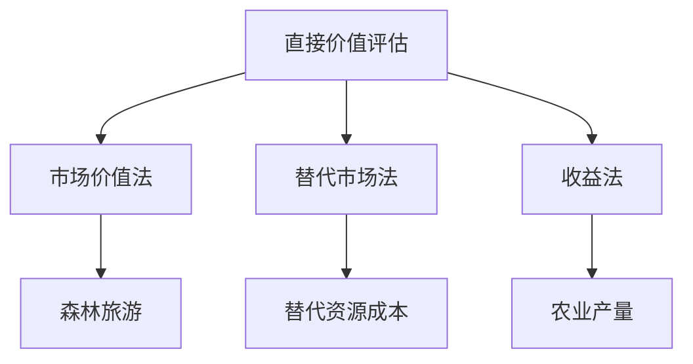
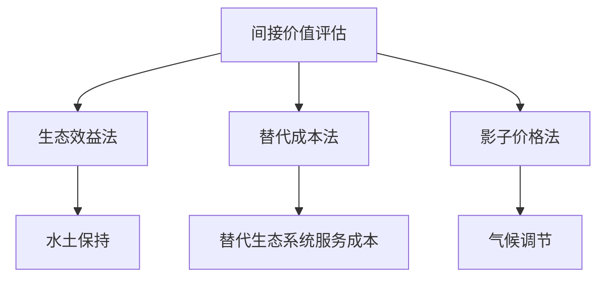
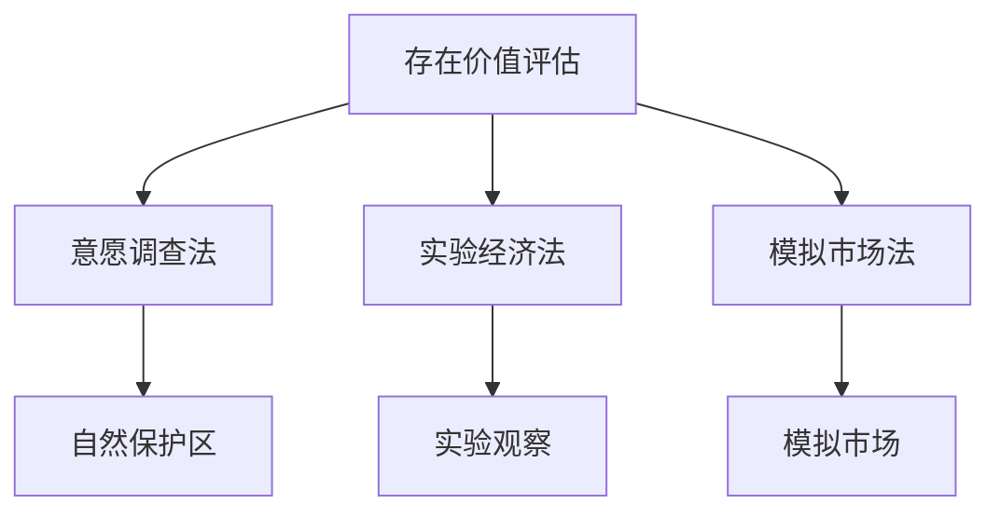

                 

# 生物多样性经济学：生态保护的价值评估

> 关键词：生物多样性、生态保护、价值评估、经济分析、可持续发展

> 摘要：本文旨在探讨生物多样性经济学，分析生态保护的价值评估方法。通过对直接价值、间接价值和存在价值等评估方法的详细阐述，本文揭示了生物多样性在经济学中的重要性，为可持续发展和环境保护提供了理论基础。

## 引言

生物多样性是地球上生命形式的多样性，包括物种多样性、遗传多样性和生态系统多样性。随着人类活动的加剧，生物多样性面临着前所未有的威胁，生态系统的失衡导致了许多环境问题，如气候变化、土地退化和水资源短缺。因此，对生物多样性进行经济评估，以确定生态保护的价值，成为了一个重要的课题。

生物多样性经济学是研究生物多样性、生态保护和经济发展之间相互关系的学科。它旨在通过量化生态系统的服务功能，为生态保护提供经济依据，进而推动可持续发展。本文将介绍生物多样性经济学的理论基础，探讨生态保护的价值评估方法，并分析其在实践中的应用。

### 生物多样性的重要性

生物多样性对于地球的生态平衡和人类社会的可持续发展具有至关重要的意义。首先，生物多样性是生态系统稳定性的基础。丰富的物种多样性有助于生态系统的自我调节能力，从而提高其抵抗外界干扰的能力。其次，生物多样性为人类提供了丰富的资源，如食物、药物和纤维。最后，生物多样性具有美学价值，能够提高人类的生活质量。

### 经济学与生态保护的联系

经济学是研究资源分配和决策制定的科学，而生态保护是保护自然资源和生物多样性的一项重要任务。生态保护与经济发展的关系一直是学术界和政策制定者关注的热点问题。传统的经济发展模式往往以牺牲环境为代价，而生态保护则强调在保护环境的前提下实现可持续发展。

### 价值评估方法概述

生态保护的价值评估是生物多样性经济学的一个重要组成部分。价值评估方法包括直接价值评估、间接价值评估和存在价值评估等。直接价值评估关注生物多样性直接为人类提供的经济效益，如森林旅游和渔业资源。间接价值评估则关注生物多样性对生态系统服务的价值，如水土保持和气候调节。存在价值评估则关注生物多样性本身的存在价值，即人们愿意为保护某个物种或生态系统支付的费用。

## 生物多样性经济学的理论基础

### 生态经济学的基本原理

生态经济学是研究经济活动与生态系统相互作用的学科。它强调在经济发展的同时，必须考虑到生态系统的承载能力和保护。生态经济学的基本原理包括：

1. 资源有限性：地球上的资源是有限的，人类必须合理利用资源，避免过度开采。
2. 系统整体性：生态系统是一个整体，各个部分之间相互关联，必须进行综合评估。
3. 持续发展：经济发展必须考虑到未来的需求，确保生态系统的可持续性。

### 生物多样性经济学的概念框架

生物多样性经济学是在生态经济学的基础上，进一步研究生物多样性对经济的影响及其经济价值。其主要概念框架包括：

1. 直接价值：生物多样性直接为人类提供的经济效益，如农业、林业和渔业。
2. 间接价值：生物多样性对生态系统服务的价值，如水土保持、气候调节和生物防治。
3. 存在价值：人们愿意为保护某个物种或生态系统支付的费用。

### 概念属性特征对比表格

| 概念类型 | 定义 | 属性特征 | 对比分析 |
| --- | --- | --- | --- |
| 直接价值 | 生物多样性直接为人类提供的经济效益 | 可量化的经济收益 | 价值明确，容易量化 |
| 间接价值 | 生物多样性对生态系统服务的价值 | 生态服务功能 | 难以量化，但具有重要意义 |
| 存在价值 | 人们愿意为保护某个物种或生态系统支付的费用 | 非直接的经济效益 | 难以量化，但反映人们的价值观 |

### 生物多样性经济学与可持续发展

生物多样性经济学为可持续发展提供了重要的理论依据。通过评估生物多样性的经济价值，政策制定者可以更好地理解生态保护的重要性，并在经济发展和环境保护之间找到平衡点。可持续发展要求在满足当前人类需求的同时，不损害未来世代的利益。生物多样性经济学通过量化生态系统的服务功能，为这一目标提供了实现路径。

## 生物多样性的直接价值评估

直接价值评估关注生物多样性直接为人类提供的经济效益。这种方法通常用于评估自然资源的使用价值，如森林、渔业和农业等。以下将介绍直接价值评估的方法、例子和数学模型。

### 直接价值评估方法

直接价值评估通常采用市场价值法、替代市场法和收益法等。市场价值法基于市场交易数据，通过比较类似资源的交易价格来估算生物多样性的直接价值。替代市场法则通过估算替代资源的成本来评估生物多样性的价值。收益法则基于生物多样性带来的直接经济效益，如农业产量和渔业收入等。

### 例子：森林旅游的价值评估

森林旅游是生物多样性直接价值的一个重要组成部分。通过评估游客对森林旅游的支付意愿，可以估算森林旅游的直接价值。以下是一个简单的例子：

假设一个森林公园每年吸引10万名游客，每位游客的旅游支出为100元。那么，森林旅游的直接价值为：

$$ V = 10万 \times 100元 = 1000万元 $$

### 数学模型与公式

直接价值评估通常使用以下数学模型和公式：

$$ V = \sum_{i=1}^{n} (P_i \cdot Q_i) $$

其中，\( V \) 表示直接价值，\( P_i \) 表示第 \( i \) 个资源单位的价格，\( Q_i \) 表示第 \( i \) 个资源单位的数量。

### 详细讲解与举例

假设我们要评估一个森林中的木材资源价值。首先，我们需要收集以下数据：

- 木材的市场价格：每立方米2000元
- 森林中可采伐的木材数量：5000立方米

根据这些数据，我们可以使用上述公式计算木材资源的直接价值：

$$ V = 2000元/立方米 \times 5000立方米 = 1亿元 $$

这表明，这个森林中的木材资源具有1亿元的直接价值。

## 生物多样性的间接价值评估

间接价值评估关注生物多样性对生态系统服务的价值。这种方法通常用于评估生物多样性对环境质量、水资源、气候调节等生态服务功能的影响。以下将介绍间接价值评估的方法、例子和数学模型。

### 间接价值评估方法

间接价值评估通常采用生态效益法、替代成本法和影子价格法等。生态效益法通过评估生物多样性对生态系统的益处来估算其间接价值。替代成本法则通过估算替代生态系统服务的成本来评估生物多样性的价值。影子价格法通过设定一个基准值，来估算生物多样性的间接价值。

### 例子：生态系统服务的价值评估

生态系统服务是生物多样性间接价值的一个重要组成部分。以下是一个简单的例子：

假设一个湿地生态系统每年能够提供1000吨的淡水资源，每吨淡水的社会成本为5元。那么，湿地生态系统的间接价值为：

$$ IVC = 1000吨 \times 5元/吨 = 5000元 $$

### 数学模型与公式

间接价值评估通常使用以下数学模型和公式：

$$ IVC = \sum_{i=1}^{n} (P_i \cdot Q_i) $$

其中，\( IVC \) 表示间接价值，\( P_i \) 表示第 \( i \) 个生态服务单位的价格，\( Q_i \) 表示第 \( i \) 个生态服务单位的数量。

### 详细讲解与举例

假设我们要评估一个森林对水土保持的间接价值。首先，我们需要收集以下数据：

- 森林的水土保持效率：每年减少水土流失1000吨
- 每吨水土流失的治理成本：10元

根据这些数据，我们可以使用上述公式计算森林对水土保持的间接价值：

$$ IVC = 10元/吨 \times 1000吨 = 10000元 $$

这表明，这个森林每年对水土保持的间接价值为10000元。

## 生物多样性的存在价值评估

存在价值评估关注生物多样性本身的存在价值，即人们愿意为保护某个物种或生态系统支付的费用。这种方法通常用于评估人们对生物多样性保护的意愿。以下将介绍存在价值评估的方法、例子和数学模型。

### 存在价值评估方法

存在价值评估通常采用意愿调查法、实验经济法和模拟市场法等。意愿调查法通过调查人们对生物多样性保护的支付意愿来估算存在价值。实验经济法通过设计实验，观察人们在不同情境下的支付行为来评估存在价值。模拟市场法则通过创建一个模拟市场，观察人们的行为来评估存在价值。

### 例子：自然景观的价值评估

自然景观是生物多样性存在价值的一个重要组成部分。以下是一个简单的例子：

假设一个自然保护区每年吸引1万名游客，每位游客的支付意愿为100元。那么，自然景观的存在价值为：

$$ EV = 1万 \times 100元 = 1000万元 $$

### 数学模型与公式

存在价值评估通常使用以下数学模型和公式：

$$ EV = \sum_{i=1}^{n} (U_i \cdot P_i) $$

其中，\( EV \) 表示存在价值，\( U_i \) 表示第 \( i \) 个物种或生态系统的存在价值，\( P_i \) 表示第 \( i \) 个物种或生态系统的支付意愿。

### 详细讲解与举例

假设我们要评估一个自然保护区中的某个珍稀植物的存在价值。首先，我们需要收集以下数据：

- 该植物的存在价值：500万元
- 游客的支付意愿：每增加1万元，支付意愿增加100元

根据这些数据，我们可以使用上述公式计算该植物的存在价值：

$$ EV = 500万元 + 100元/万元 \times 1万元 = 510万元 $$

这表明，这个自然保护区中的该珍稀植物的存在价值为510万元。

## 生物多样性经济评估的应用

### 政策制定中的应用

生物多样性经济评估在政策制定中具有重要的应用价值。通过量化生态系统的服务功能，政策制定者可以更准确地了解生态保护的重要性，并制定出更有效的保护政策。例如，政府可以基于生物多样性的直接价值和间接价值，制定森林保护、水资源管理和土地开发政策。

### 企业决策中的应用

企业在进行决策时，也需要考虑生物多样性的经济价值。例如，一家公司计划在某地建设工厂，它需要评估当地生物多样性的损失及其对生态系统服务的影响。通过生物多样性经济评估，企业可以做出更环保的决策，从而降低环境风险，提高社会责任形象。

### 公众参与与教育

生物多样性经济评估还可以促进公众参与和环境保护教育。通过宣传生态系统的服务功能和经济价值，可以增强公众对生物多样性保护的意识，提高公众参与环境保护的积极性。例如，学校可以开设相关课程，向学生介绍生物多样性经济学的基本原理，培养学生的环保意识。

## 生物多样性经济学评估的挑战与未来方向

### 数据收集与处理挑战

生物多样性经济评估面临的一个主要挑战是数据收集与处理。生态系统服务功能的量化需要大量的数据支持，包括生态学、经济学和环境科学等多个领域的数据。然而，现有的数据质量和数量往往难以满足评估需求，这限制了评估方法的准确性和可靠性。

### 评估方法的局限性

不同的评估方法有其局限性。市场价值法依赖于市场价格，而市场价格可能受到供需变化的影响，导致评估结果不稳定。替代市场法和收益法则可能受到数据缺失和信息不对称的问题。存在价值评估方法则依赖于人们的支付意愿，而支付意愿可能受到文化、教育和收入水平等因素的影响。

### 未来研究方向

未来，生物多样性经济学的研究应关注以下几个方面：

1. 改进数据收集与处理方法，提高评估的准确性和可靠性。
2. 开发新的评估模型和方法，以更好地反映生物多样性的经济价值。
3. 加强跨学科研究，整合生态学、经济学和环境科学的研究成果。
4. 探索生物多样性经济评估在政策制定和企业管理中的应用。

### 拓展阅读

- Costanza, R., d'Arge, R., de Groot, R., Farber, S., Grasso, M., Hannon, B., ... & Wilson, M. (1997). The value of the world's ecosystem services and natural capital. Nature, 387(6630), 253-260.
- Daily, G. C. (1997). Global biodiversity conservation: The economic imperative. Science, 276(5316), 609-615.
- Wong, K. Y. (2001). Ecosystem services: Benefits supplied to human societies by natural ecosystems. Ecological Economics, 37(2), 25-40.

## 结论

生物多样性经济学是研究生物多样性、生态保护和经济发展之间相互关系的学科。通过直接价值评估、间接价值评估和存在价值评估等方法，我们可以量化生态系统的服务功能，为生态保护提供经济依据，推动可持续发展。面对数据收集与处理、评估方法局限性等挑战，未来研究应致力于改进评估方法，加强跨学科研究，为生物多样性保护和环境保护提供更坚实的理论基础。

## 作者信息

作者：AI天才研究院/AI Genius Institute & 禅与计算机程序设计艺术 /Zen And The Art of Computer Programming

## 附录

### 数学公式

$$ V = \sum_{i=1}^{n} (P_i \cdot Q_i) $$

$$ IVC = \sum_{i=1}^{n} (P_i \cdot Q_i) $$

$$ EV = \sum_{i=1}^{n} (U_i \cdot P_i) $$

### Mermaid 流程图

