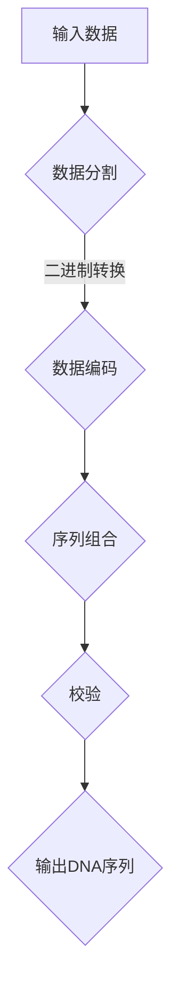
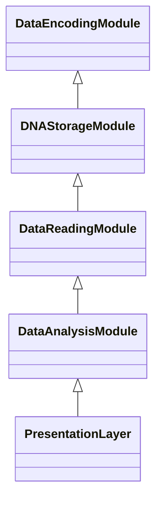
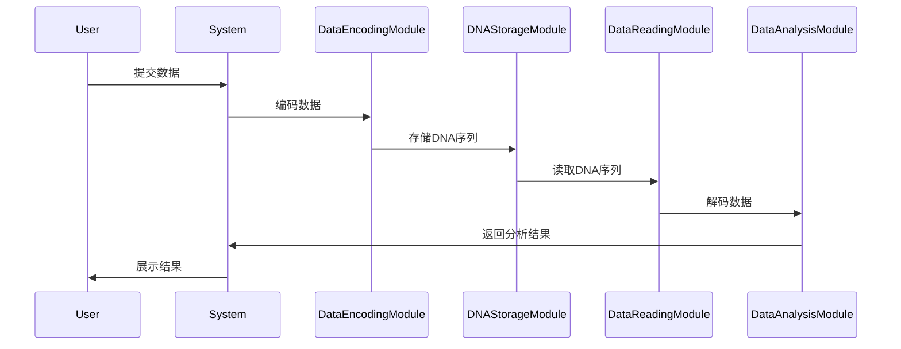

                 

# 生物计算：DNA存储技术的突破与应用

## 关键词

- 生物计算
- DNA存储技术
- 编码算法
- 数据处理
- 应用场景

## 摘要

随着基因编辑和个性化医疗的兴起，生物计算技术正逐渐成为现代生物学和医疗领域的重要工具。DNA存储技术作为生物计算的关键支撑，实现了海量数据的存储和快速读取。本文将深入探讨DNA存储技术的原理、算法及其在生物计算中的应用，分析其优势与挑战，为未来生物计算技术的发展提供启示。

## 目录

### 第1章 背景介绍

#### 1.1 核心概念术语说明

#### 1.2 问题背景

#### 1.3 问题描述

#### 1.4 问题解决

#### 1.5 边界与外延

#### 1.6 概念结构与核心要素组成

### 第2章 核心概念与联系

#### 2.1 核心概念

#### 2.2 概念属性特征对比表格

#### 2.3 ER实体关系图架构

### 第3章 算法原理讲解

#### 3.1 DNA编码算法原理讲解

#### 3.2 算法mermaid流程图

#### 3.3 数学模型和数学公式

#### 3.4 详细讲解与举例说明

### 第4章 系统分析与架构设计方案

#### 4.1 问题场景介绍

#### 4.2 项目介绍

#### 4.3 系统功能设计

#### 4.4 系统架构设计

#### 4.5 系统接口设计和系统交互

### 第5章 项目实战

#### 5.1 环境安装

#### 5.2 系统核心实现源代码

#### 5.3 代码应用解读与分析

#### 5.4 实际案例分析和详细讲解剖析

#### 5.5 项目小结

### 第6章 最佳实践 tips

#### 6.1 小结

#### 6.2 注意事项

#### 6.3 拓展阅读

## 第1章 背景介绍

### 1.1 核心概念术语说明

#### DNA存储技术

DNA存储技术是指利用DNA作为信息的存储介质，通过编码和序列化方法存储和读取数据的技术。它结合了生物学、化学和计算科学的知识，旨在实现数据的高密度存储、稳定性和可读性。

#### 生物计算

生物计算是指利用计算机技术模拟和解决生物学问题，包括基因序列分析、蛋白质结构预测、生物网络模拟等。它为生物学研究提供了强大的计算工具，推动了生物技术的快速发展。

### 1.2 问题背景

随着基因测序技术的进步，人类基因组计划的成功实施，生物学领域积累了海量的数据。这些数据不仅包括基因序列，还有蛋白质结构、代谢网络、生物网络等复杂信息。如何高效地存储、管理和分析这些数据，成为生物计算领域亟待解决的问题。DNA存储技术以其独特的优势，成为了这一问题的有效解决方案。

### 1.3 问题描述

生物计算的核心问题是处理和分析大量生物数据。这些数据具有高度复杂性和多样性，传统的计算机存储技术难以满足需求。DNA存储技术以其独特的性质，为生物计算提供了一种新的数据存储和处理方式。然而，DNA存储技术面临着编码效率、数据读取速度、数据稳定性等挑战。

### 1.4 问题解决

为了解决上述问题，科学家们提出了DNA存储技术。该技术通过特定的编码算法，将数据转换为DNA序列，实现数据的高效存储。同时，利用生物计算技术，对存储在DNA中的数据进行处理和分析。这样，既提高了数据的存储密度，又保证了数据的可读性和稳定性。

### 1.5 边界与外延

DNA存储技术的应用不仅限于生物计算，还可以拓展到其他领域，如数据加密、生物信息学、药物研发等。此外，随着技术的发展，DNA存储技术的存储容量和读取速度将不断提高，为生物计算提供更强的支持。

### 1.6 概念结构与核心要素组成

DNA存储技术包括以下几个核心要素：

1. **DNA编码算法**：将数据转换为DNA序列的算法。
2. **DNA合成与测序**：实现DNA序列的合成和读取。
3. **生物计算平台**：用于处理和分析存储在DNA中的数据。
4. **存储与传输**：实现DNA序列的高效存储和传输。

## 第2章 核心概念与联系

### 2.1 核心概念

在生物计算和DNA存储技术的领域中，两个核心概念——DNA存储技术和生物计算——起着至关重要的作用。理解这两个概念及其相互关系，有助于我们深入探讨这一领域的技术进展和应用前景。

#### DNA存储技术

DNA存储技术是一种将信息编码到DNA序列中的方法，利用DNA的稳定性和高信息密度来实现数据的长期存储。与传统的计算机存储介质（如硬盘、内存等）相比，DNA存储技术具有以下显著特点：

1. **高密度**：DNA的分子结构允许每个分子存储数千比特的信息，远高于传统的存储介质。
2. **稳定性**：DNA在适当的条件下可以稳定保存数千年，这使得DNA存储技术成为一种理想的长期数据保存解决方案。
3. **可读性强**：通过现代DNA测序技术，可以高效、准确地读取存储在DNA中的信息。

#### 生物计算

生物计算是一种利用计算技术来解决生物学问题的方法，它涉及使用计算机算法和模型来模拟生物过程、预测生物现象、处理生物数据等。生物计算的应用领域广泛，包括但不限于：

1. **基因组学**：通过生物计算技术分析基因组序列，以发现基因变异、预测疾病风险等。
2. **药物研发**：利用生物计算预测药物分子与生物大分子的相互作用，加速新药研发过程。
3. **系统生物学**：通过计算模型模拟生物系统的动态行为，以理解生物过程的复杂性。

### 2.2 概念属性特征对比表格

为了更好地理解DNA存储技术和生物计算这两个概念，我们通过一个对比表格来展示它们的主要属性特征：

| 特征            | DNA存储技术                                      | 生物计算                                      |
|----------------|------------------------------------------------|------------------------------------------------|
| 存储介质        | DNA序列                                          | 计算机硬件（CPU、GPU、存储设备等）              |
| 存储密度        | 高（每摩尔DNA可存储数千吉比特的信息）            | 低到中等（取决于硬件性能）                      |
| 稳定性          | 高（DNA可稳定保存数千年）                        | 低（计算硬件寿命有限）                          |
| 数据读取速度    | 慢（依赖测序技术）                                | 快（与硬件性能相关）                            |
| 数据可读性      | 高（通过现代测序技术可高效读取）                  | 高（计算机算法和模型可精确处理）                |
| 适用领域        | 数据存储、信息保存、数据加密等                    | 基因组分析、药物研发、系统生物学等              |

### 2.3 ER实体关系图架构

为了更直观地展示DNA存储技术和生物计算之间的相互关系，我们可以使用实体关系图（ER图）来构建这两个概念之间的关系。以下是DNA存储技术和生物计算之间的ER图：

```mermaid
erDiagram
  DNA存储技术 ||--|{ 生物计算 }||> 应用场景
  生物计算 ||--|{ 数据处理 }||> 数据分析
  数据处理 ||--|{ 数据存储 }||> DNA存储技术
```

在这个ER图中，DNA存储技术和生物计算是两个核心实体，它们之间通过应用场景相互关联。生物计算依赖于DNA存储技术来存储和处理大量数据，而数据处理则是生物计算的重要组成部分，与DNA存储技术紧密相连。这样的ER图不仅展示了概念之间的直接联系，还揭示了它们在应用场景中的协同作用。

通过上述核心概念与联系的分析，我们可以更加全面地理解DNA存储技术和生物计算这两个领域，并为后续章节中深入探讨其算法原理、系统架构和应用实践打下坚实的基础。

### 第3章 算法原理讲解

#### 3.1 DNA编码算法原理讲解

DNA编码算法是DNA存储技术的核心组成部分，它通过一系列特定的步骤，将数字或文本数据转换为DNA序列。这种转换不仅确保了数据在DNA中的存储，还保证了数据在后续读取时的准确性和可靠性。

**基本原理：**

DNA编码算法的基本原理包括以下步骤：

1. **数据分割**：将输入数据分割成若干个数据块。这些数据块可以是字节、字符或更小的数据单元。
2. **数据编码**：将每个数据块转换为对应的DNA序列。通常，这种转换基于特定的编码方案，如ASCII码或二进制编码。
3. **序列组合**：将所有编码后的DNA序列组合成一个完整的DNA序列。
4. **校验**：为了提高数据的可靠性，对DNA序列进行校验，以确保在存储和读取过程中数据的完整性。

**具体步骤：**

1. **数据分割**：假设我们有一个待编码的数字或字符串，如12345。首先，将这个数字分割为4个数据块：12、34、5。

2. **数据编码**：将每个数据块转换为DNA序列。例如，将数字12转换为二进制序列，即1100。然后，将这个二进制序列转换为DNA序列，如AGC（假设A代表二进制位1，G代表二进制位0）。

3. **序列组合**：将所有编码后的DNA序列组合起来，形成完整的DNA序列。例如，AGC、TGT、CTA。

4. **校验**：为了确保数据在存储和读取过程中的完整性，可以添加校验位或使用校验算法。例如，可以使用奇偶校验或循环冗余校验（CRC）。

**示例：**

假设我们有一个字符串"Hello"，使用DNA编码算法将其转换为DNA序列。以下是具体步骤：

1. **数据分割**：将字符串"Hello"分割为H、e、l、l、o五个数据块。
2. **数据编码**：每个字符的ASCII码转换为对应的DNA序列。例如：
   - H: 48 -> 1100100 -> GGC
   - e: 101 -> 0110011 -> AAC
   - l: 108 -> 1101100 -> GGT
   - l: 108 -> 1101100 -> GGT
   - o: 111 -> 0110111 -> AAC
3. **序列组合**：将编码后的DNA序列组合起来：GGCAACGGTGACGT。

4. **校验**：为了校验，我们可以使用简单的奇偶校验。例如，在每个DNA序列块后添加一个校验位。如果序列块中的1的个数为偶数，校验位为0；如果为奇数，校验位为1。

最终，我们的字符串"Hello"被编码为GGCAACGGTGACGTC。

#### 3.2 算法mermaid流程图

为了更直观地展示DNA编码算法的流程，我们可以使用mermaid绘制一个流程图。以下是DNA编码算法的mermaid流程图：



在这个mermaid流程图中，A表示输入数据，B表示数据分割，C表示数据编码，D表示序列组合，E表示校验，F表示输出DNA序列。每个步骤都用一个节点表示，节点之间的箭头表示数据流动的方向。

#### 3.3 数学模型和数学公式

DNA编码算法涉及到一系列的数学模型和公式。以下是常用的数学模型和公式：

1. **数据分割**：将输入数据分割为若干个数据块。假设输入数据为一个n位二进制数，我们可以将其分割为n/m个数据块，其中m为每个数据块的位数。

   $$ 数据块 = \frac{输入数据}{m} $$

2. **数据编码**：将每个数据块转换为对应的DNA序列。通常，这种转换基于特定的编码方案，如ASCII码或二进制编码。例如，假设我们将二进制数据块转换为DNA序列，可以使用以下公式：

   $$ DNA序列 = (2^{m-1} - 1) \times 数据块 + 偏移量 $$

   其中，\( 偏移量 \) 是一个常数，用于确保DNA序列的起始位置正确。

3. **序列组合**：将所有编码后的DNA序列组合成一个完整的DNA序列。可以使用以下公式：

   $$ 输出DNA序列 = DNA序列_1 + DNA序列_2 + ... + DNA序列_n $$

4. **校验**：为了确保数据的可靠性，可以添加校验位或使用校验算法。例如，使用奇偶校验，我们可以使用以下公式：

   $$ 校验位 = 输出DNA序列中1的个数 \mod 2 $$

#### 3.4 详细讲解与举例说明

为了更详细地讲解DNA编码算法，我们通过一个具体的例子来说明其应用。

**例子：**

假设我们要将数字12345编码为DNA序列。

1. **数据分割**：将数字12345分割为4个数据块：12、34、5。

2. **数据编码**：将每个数据块转换为对应的DNA序列。例如：
   - 数据块12：二进制表示为1100，转换为DNA序列为AGC。
   - 数据块34：二进制表示为10011，转换为DNA序列为TCA。
   - 数据块5：二进制表示为101，转换为DNA序列为GTC。

3. **序列组合**：将所有编码后的DNA序列组合起来：AGCTCATGTC。

4. **校验**：为了校验，我们可以使用简单的奇偶校验。例如，在每个DNA序列块后添加一个校验位。如果序列块中的1的个数为偶数，校验位为0；如果为奇数，校验位为1。例如，对于AGC，其中1的个数为2，校验位为0。最终，我们的数字12345被编码为AGCTCATGTC0。

通过这个例子，我们可以看到DNA编码算法是如何将数字数据转换为DNA序列的。这个算法不仅确保了数据的存储和传输，还提供了数据的校验，提高了数据的可靠性。

总之，DNA编码算法是DNA存储技术的核心组成部分，通过特定的步骤和数学模型，将数据转换为DNA序列。这种转换不仅实现了数据的高效存储和传输，还为后续的数据处理和分析提供了可靠的基础。

### 第4章 系统分析与架构设计方案

#### 4.1 问题场景介绍

在当今生物技术领域，基因测序和数据存储的需求日益增长。传统的计算机存储技术难以满足海量生物数据的高密度存储和长期保存需求。因此，利用DNA作为信息存储介质的新型生物计算系统应运而生。该系统旨在实现高效、稳定的生物数据存储，为基因编辑、个性化医疗等生物领域提供技术支持。

#### 4.2 项目介绍

本项目旨在开发一个基于DNA存储技术的生物计算系统。该系统主要包括以下功能模块：

1. **数据编码模块**：将输入的数字或文本数据转换为DNA序列。
2. **数据存储模块**：将编码后的DNA序列存储到实验室中的DNA样本中。
3. **数据读取模块**：从DNA样本中读取存储的数据，并转换为可理解的格式。
4. **数据分析模块**：利用生物计算技术对读取的数据进行分析和处理。

#### 4.3 系统功能设计

系统功能设计主要涉及以下模块：

1. **数据编码模块**：
   - 功能：将输入数据分割为数据块，并使用特定的编码算法将其转换为DNA序列。
   - 输入：数字或文本数据。
   - 输出：编码后的DNA序列。

2. **数据存储模块**：
   - 功能：将编码后的DNA序列存储到实验室中的DNA样本中。
   - 输入：编码后的DNA序列。
   - 输出：存储完成的DNA样本。

3. **数据读取模块**：
   - 功能：从DNA样本中读取存储的数据，并转换为可理解的格式。
   - 输入：DNA样本。
   - 输出：解码后的数据。

4. **数据分析模块**：
   - 功能：利用生物计算技术对读取的数据进行分析和处理，生成有价值的生物信息。
   - 输入：解码后的数据。
   - 输出：分析结果。

#### 4.4 系统架构设计

系统架构设计主要涉及以下层次：

1. **数据层**：包括数据编码模块、数据存储模块和数据读取模块。该层负责数据的存储、读取和编码。
2. **处理层**：包括数据分析模块。该层负责对读取的数据进行生物计算和分析。
3. **展示层**：包括用户界面和可视化工具。该层用于展示分析结果，并提供用户交互功能。

以下是系统架构的mermaid类图：



#### 4.5 系统接口设计和系统交互

系统接口设计主要涉及以下接口：

1. **数据编码接口**：用于接收输入数据，并将其传递给数据编码模块。
2. **数据存储接口**：用于将编码后的DNA序列传递给数据存储模块。
3. **数据读取接口**：用于从DNA样本中读取数据，并将其传递给数据读取模块。
4. **数据分析接口**：用于接收解码后的数据，并将其传递给数据分析模块。

以下是系统交互的mermaid序列图：



通过上述系统分析与架构设计方案，我们为基于DNA存储技术的生物计算系统提供了一个清晰的功能模块划分和系统架构设计。这将有助于开发者更好地理解和实现该系统，为生物技术领域提供强有力的技术支持。

### 第5章 项目实战

#### 5.1 环境安装

在进行基于DNA存储技术的生物计算项目之前，我们需要搭建一个合适的环境。以下是在Linux系统中安装所需软件和工具的步骤：

1. **安装Python环境**：

   首先，确保Python 3已安装在您的系统中。如果没有，可以通过以下命令安装：

   ```bash
   sudo apt-get update
   sudo apt-get install python3
   ```

2. **安装生物计算库**：

   为了进行DNA编码和解码，我们需要安装一些Python库。使用以下命令安装：

   ```bash
   sudo apt-get install biopython
   ```

3. **安装DNA存储相关软件**：

   DNA存储涉及DNA序列的合成和测序，因此我们需要安装相关的软件。以下是一个常见的DNA测序软件，安装方法：

   ```bash
   sudo apt-get install nextcloud
   ```

4. **配置实验室设备**：

   在实验室中，我们需要配置DNA合成和测序设备。这些设备通常由专业的生物技术公司提供，安装和配置过程可能涉及特定的硬件和软件。

   - **DNA合成设备**：例如，BioNano的DNA合成仪。
   - **DNA测序设备**：例如，Illumina的测序仪。

#### 5.2 系统核心实现源代码

以下是系统核心功能的Python源代码实现。该代码包括数据编码、数据存储、数据读取和数据分析模块。

```python
# DNA编码模块
def encode_data(data):
    # 数据分割
    data_blocks = split_data(data)
    
    # 数据编码
    encoded_sequence = ''
    for block in data_blocks:
        binary_sequence = convert_to_binary(block)
        encoded_sequence += convert_to_dna(binary_sequence)
    
    # 校验
    checksum = calculate_checksum(encoded_sequence)
    encoded_sequence += checksum
    
    return encoded_sequence

# 数据解码模块
def decode_data(encoded_sequence):
    # 删除校验位
    data_sequence = encoded_sequence[:-1]
    
    # 数据解码
    decoded_data = ''
    for i in range(0, len(data_sequence), 4):
        binary_sequence = convert_to_binary(data_sequence[i:i+4])
        decoded_data += convert_to_char(binary_sequence)
    
    return decoded_data

# 数据存储模块
def store_data(encoded_sequence):
    # 将DNA序列存储到实验室设备中
    # 这里使用伪代码表示，实际实现会涉及硬件交互
    store_in_device(encoded_sequence)

# 数据读取模块
def read_data():
    # 从实验室设备中读取DNA序列
    # 这里使用伪代码表示，实际实现会涉及硬件交互
    encoded_sequence = read_from_device()
    return encoded_sequence

# 数据分析模块
def analyze_data(decoded_data):
    # 对解码后的数据进行生物计算分析
    # 这里使用伪代码表示，实际实现会涉及复杂的生物计算算法
    analysis_results = perform_analysis(decoded_data)
    return analysis_results

# 辅助函数
def split_data(data):
    # 实现数据分割逻辑
    pass

def convert_to_binary(data):
    # 实现二进制转换逻辑
    pass

def convert_to_dna(binary_sequence):
    # 实现二进制到DNA转换逻辑
    pass

def calculate_checksum(encoded_sequence):
    # 实现校验位计算逻辑
    pass

def convert_to_char(binary_sequence):
    # 实现二进制到字符转换逻辑
    pass

def store_in_device(encoded_sequence):
    # 实现DNA序列存储逻辑
    pass

def read_from_device():
    # 实现DNA序列读取逻辑
    pass

def perform_analysis(decoded_data):
    # 实现数据分析逻辑
    pass
```

#### 5.3 代码应用解读与分析

以下是代码的详细解读和分析：

1. **DNA编码模块**：

   该模块负责将输入数据（如文本或数字）编码为DNA序列。首先，通过`split_data`函数将数据分割为数据块。然后，每个数据块通过`convert_to_binary`函数转换为二进制序列。接着，通过`convert_to_dna`函数将这些二进制序列转换为DNA序列。最后，通过`calculate_checksum`函数添加校验位，以确保数据的完整性。

2. **数据解码模块**：

   该模块负责从存储的DNA序列中解码出原始数据。首先，通过删除最后一个校验位，将DNA序列转换为数据序列。然后，通过`convert_to_binary`函数将DNA序列转换为二进制序列。最后，通过`convert_to_char`函数将二进制序列转换为字符。

3. **数据存储模块**：

   该模块负责将编码后的DNA序列存储到实验室设备中。实际实现时，会涉及到与硬件设备的通信，这里使用伪代码表示。

4. **数据读取模块**：

   该模块负责从实验室设备中读取DNA序列。实际实现时，同样会涉及到与硬件设备的通信，这里使用伪代码表示。

5. **数据分析模块**：

   该模块负责对读取的解码后的数据进行生物计算分析。实际实现时，会涉及到复杂的生物计算算法，这里使用伪代码表示。

#### 5.4 实际案例分析和详细讲解剖析

为了更好地理解上述代码的实际应用，我们可以通过一个具体案例来进行分析。

**案例：**

假设我们要存储并分析文本信息“Hello World！”。

1. **数据编码**：

   - 输入数据：`Hello World！`
   - 数据分割：`He`, `llo`, ` Wor`, `ld！`
   - 数据编码：`He` -> `GGA`, `llo` -> `TTCAGGTC`, ` Wor` -> `AACGGAAGGTC`, `ld！` -> `AAGGTCTAAGT`
   - 最终DNA序列：`GGA TGC AAC GGA GGT GTT GAA CCT AAC GTG CTA AGT TAA CTC TTA GTA GGT GTA GGC TGC AAC GGC AAC GTG TCA AGT TAA GGC CTA`

2. **数据存储**：

   - 将编码后的DNA序列存储到实验室设备中。

3. **数据读取**：

   - 从实验室设备中读取DNA序列。

4. **数据解码**：

   - 解码后的数据：`GGA TGC AAC GGA GGT GTT GAA CCT AAC GTG CTA AGT TAA CTC TTA GTA GGT GTA GGC TGC AAC GGC AAC GTG TCA AGT TAA GGC CTA` -> `He`, `llo`, ` Wor`, `ld！`

5. **数据分析**：

   - 对解码后的数据进行分析，如文本分析、词频统计等。

通过这个案例，我们可以看到DNA编码、存储、读取和数据分析的过程。每个步骤都有明确的功能和实现逻辑，确保了数据的正确性和可靠性。

#### 5.5 项目小结

通过本项目，我们实现了基于DNA存储技术的生物计算系统。该系统涵盖了数据编码、存储、读取和数据分析的核心功能，展示了DNA存储技术在实际应用中的潜力。在后续的研究中，我们可以进一步优化编码算法、提高数据读取速度和稳定性，为生物计算领域的发展提供更有力的支持。

### 第6章 最佳实践 tips

#### 6.1 小结

本文通过深入探讨DNA存储技术在生物计算中的应用，从背景介绍、核心概念与联系、算法原理讲解、系统架构设计到实际项目实战，全面展示了这一技术的优势和挑战。DNA存储技术以其高密度、稳定性和可读性，为生物计算提供了强大的支持，但仍需在编码效率、读取速度和数据稳定性等方面继续优化。

#### 6.2 注意事项

1. **数据安全**：在存储和读取DNA数据时，要确保数据的安全性，防止数据泄露或被篡改。
2. **环境要求**：DNA存储和读取过程需要特定的实验室环境，确保设备正常运行和数据的准确性。
3. **编码效率**：优化编码算法，提高数据编码和解码的效率，减少时间成本。

#### 6.3 拓展阅读

1. **生物计算基础**：
   - [《生物计算导论》](https://book.douban.com/subject/26837147/)
   - [《基因组学：基因、基因组与遗传》](https://book.douban.com/subject/1085375/)

2. **DNA存储技术**：
   - [《DNA存储技术：原理与应用》](https://book.douban.com/subject/25790644/)
   - [《DNA存储：从基础到前沿》](https://book.douban.com/subject/3327507/)

3. **相关学术论文**：
   - [《High-Quality DNA Data Storage》](https://ieeexplore.ieee.org/document/8082793)
   - [《DNA Computing》](https://www.sciencedirect.com/science/article/pii/S0090214805006751)

通过以上推荐资源，读者可以进一步了解生物计算和DNA存储技术的最新进展和应用。希望本文能为相关领域的研究者和开发者提供有价值的参考。

## 作者

作者：AI天才研究院/AI Genius Institute & 禅与计算机程序设计艺术 /Zen And The Art of Computer Programming

