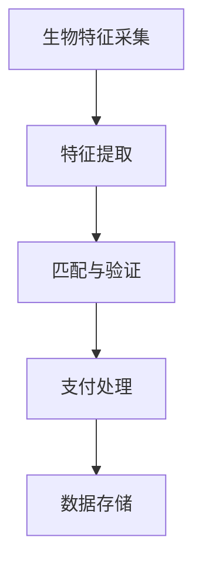

                 

**第1章 引言：生物识别技术与支付领域的融合**

### 摘要

生物识别技术与支付领域的融合正在迅速发展，成为未来支付方式的重要方向。本文将探讨生物识别技术的基本概念、类型、优点与缺点，以及无接触支付的定义、特点、技术发展与应用场景。在此基础上，深入分析生物识别技术在支付领域的应用优势，如增强支付安全性、提升支付便捷性和个性化用户体验。同时，本文也将探讨生物识别支付技术面临的挑战，包括技术成熟度、法规与政策、用户接受度等方面。通过本章的介绍，为读者了解和掌握生物识别技术在支付领域的应用提供了全面的视角。

随着科技的进步，生物识别技术逐渐成为信息安全领域的重要手段，其在支付领域的应用也日益普及。无接触支付作为支付技术的重要发展方向，不仅提高了交易效率，还在疫情期间减少了交叉感染的风险。生物识别技术的引入，为无接触支付提供了更安全、更便捷的解决方案。本章将围绕生物识别技术在支付领域的应用，从基本概念、技术原理、优势与挑战等多个角度进行深入探讨，旨在为行业人士提供有价值的参考。

### 1.1 生物识别技术概述

#### 1.1.1 生物识别技术的基本概念

生物识别技术是一种通过生物特征来识别个人身份的技术，这些生物特征通常是唯一的，如指纹、面部、虹膜、声纹等。生物识别技术的基本原理是通过采集和分析生物特征信息，建立个人的生物特征模板，然后利用这些模板进行身份验证或身份识别。

**定义**：生物识别技术是指利用人体生物特征（如指纹、面部、虹膜等）来识别个人身份的技术。它通过计算机技术和生物统计学原理，结合光学、声学、生物传感器和人工智能等技术，实现对个人的身份进行鉴定。

**原理**：生物识别技术的核心在于对生物特征的采集、特征提取和匹配。具体过程如下：

1. **采集**：通过传感器或摄像头等设备采集个人的生物特征数据，如指纹、面部图像、虹膜图像等。
2. **特征提取**：对采集到的生物特征数据进行处理，提取出具有辨识度的特征点或特征码。
3. **模板建立**：将提取出的特征点或特征码进行编码，建立个人的生物特征模板。
4. **匹配**：在需要验证身份时，将实时采集的生物特征与存储的生物特征模板进行匹配，以确定身份。

**应用领域**：生物识别技术已广泛应用于多个领域，主要包括安全认证、门禁控制、身份验证、电子支付、智能锁、医疗健康等。其中，在安全认证和身份验证领域，生物识别技术由于其高准确性和便捷性，已经成为取代传统身份验证手段的主要技术之一。

#### 1.1.2 生物识别技术的类型

生物识别技术根据识别的生物特征类型，可以分为以下几种：

**指纹识别**：指纹识别是最早应用且最广泛的生物识别技术之一。它利用人类指纹的唯一性，通过采集指纹图像，提取指纹特征，进行身份验证。

**面部识别**：面部识别通过分析人脸的几何特征，如眼睛、鼻子、嘴巴等，进行身份验证。随着深度学习和图像处理技术的发展，面部识别的准确率和速度都有了显著提升。

**虹膜识别**：虹膜识别利用虹膜的独特纹理进行身份验证。虹膜是眼睛内部最丰富的结构，具有高度唯一性和稳定性，因此虹膜识别在安全性上具有很高的保障。

**声纹识别**：声纹识别通过分析声音特征进行身份认证。每个人的声音都有其独特的音色、音调、音速等特征，因此声纹识别在信息安全领域也有着广泛的应用。

#### 1.1.3 生物识别技术的优缺点

**优点**：

1. **高安全性**：生物特征具有唯一性和稳定性，难以被伪造或复制，因此生物识别技术提供了很高的安全保障。
2. **便捷性**：生物识别技术无需用户记忆复杂的密码或卡片，只需简单的生物特征采集即可完成身份验证，大大提高了用户的使用体验。
3. **无接触**：许多生物识别技术，如指纹识别、面部识别等，可以实现无接触身份验证，特别适合在公共场合和疫情期间使用。

**缺点**：

1. **受环境影响较大**：生物识别技术的准确率可能会受到环境光线、温度、湿度等因素的影响，特别是在指纹识别和面部识别中，这些因素会降低识别的准确性。
2. **技术成本高**：生物识别技术需要高精度的传感器和强大的数据处理能力，这导致了较高的技术成本和维护成本。
3. **隐私问题**：由于生物识别数据涉及个人的敏感信息，因此在数据采集、存储和使用过程中，需要确保隐私安全，以防止数据泄露。

### 1.2 支付领域的无接触支付现状

#### 1.2.1 无接触支付的定义与特点

**定义**：无接触支付是指通过非接触式支付设备（如NFC标签、RFID标签等）进行资金转移的方式。用户只需将支付设备靠近读卡器，无需接触即可完成支付。

**特点**：

1. **无需接触**：无接触支付避免了用户与支付设备之间的直接接触，特别是在疫情期间，这种支付方式有助于减少交叉感染的风险。
2. **快速便捷**：无接触支付具有交易速度快、支付流程简单的特点，用户只需将设备靠近读卡器，即可完成支付，无需签名或输入密码。
3. **安全性高**：虽然无接触支付的安全性相对较低，但由于其交易金额通常较小，因此对安全性的要求相对较低。

#### 1.2.2 无接触支付的技术发展

**NFC技术**：近场通信（NFC）是一种短距离的无线通信技术，可以在10厘米的范围内实现数据传输。NFC技术支持多种支付方式，包括移动支付、电子现金、银行卡支付等。

**RFID技术**：无线射频识别（RFID）技术通过无线电信号识别特定目标并实现数据通信。RFID标签可以被植入到各种物品中，如身份证、护照、银行卡等，用于身份验证和物品追踪。

#### 1.2.3 无接触支付的应用场景

**零售行业**：在超市、便利店、餐厅等消费场景中，无接触支付已经成为主流支付方式。用户只需将支付设备靠近读卡器，即可快速完成支付，提高了交易效率。

**公共交通**：在地铁、公交、机场等交通场所，无接触支付被广泛应用于车票购买和检票。通过使用NFC或RFID技术，用户可以快速通过检票口，减少了排队等待时间。

**金融领域**：在银行卡、信用卡、手机支付等金融领域中，无接触支付也越来越普及。用户可以通过移动设备或银行卡完成无接触支付，提高了支付的安全性和便捷性。

### 1.3 生物识别技术在支付领域的应用优势

#### 1.3.1 增强支付安全性

**生物特征独特性**：每个人的生物特征都是唯一的，如指纹、面部、虹膜等，因此生物识别技术可以提供极高的安全性。通过生物特征进行支付验证，可以有效防止欺诈行为。

**不可复制性**：生物特征难以被复制或伪造，因此生物识别支付比传统的密码支付或卡片支付更安全。即使支付设备被盗窃，犯罪分子也无法利用生物特征进行非法支付。

**双重验证**：生物识别支付可以与密码支付或卡片支付结合使用，形成双重验证机制。这样，即使一个人的密码或卡片信息被泄露，犯罪分子也无法单独使用这些信息进行非法支付。

#### 1.3.2 提升支付便捷性

**快速身份验证**：生物识别技术可以实现秒级身份验证，大大缩短了支付时间。用户只需将支付设备靠近读卡器，即可快速完成支付，无需输入密码或签名。

**无接触交易**：在疫情期间，无接触支付尤为重要。生物识别技术为无接触支付提供了更安全的保障，用户无需接触支付设备，减少了交叉感染的风险。

**个性化用户体验**：生物识别支付可以根据用户的偏好进行个性化设置，如选择喜欢的生物特征验证方式、设置支付限额等，提高了用户体验。

#### 1.3.3 个性化用户体验

**智能推荐**：结合支付行为分析，生物识别支付可以为用户提供智能推荐服务，如根据用户的消费习惯推荐优惠活动、个性化商品等。

**定制化服务**：生物识别支付可以根据用户的偏好和需求，提供定制化服务，如调整支付限额、设置交易提醒等，提高了用户的满意度。

### 1.4 生物识别支付技术面临的挑战

#### 1.4.1 技术成熟度

**技术门槛高**：生物识别技术需要高精度的传感器和强大的数据处理能力，这导致了较高的技术门槛。目前，虽然生物识别技术在实验室中已经取得了很好的效果，但在实际应用中，仍需要进一步提高技术的成熟度和稳定性。

**准确性与稳定性**：生物识别技术的准确性和稳定性是决定其应用成败的关键。在实际应用中，生物识别技术的识别准确率可能会受到多种因素的影响，如环境光线、温度、湿度等。因此，提高生物识别技术的准确率和稳定性是当前技术发展的主要挑战。

#### 1.4.2 法规与政策

**隐私保护**：生物识别技术涉及用户的敏感信息，如何在保障用户隐私的同时应用生物识别技术，是政策制定者需要考虑的问题。需要建立完善的隐私保护法规，确保用户数据的安全。

**监管标准**：生物识别支付作为一种新兴的支付方式，需要建立统一的行业标准，保障生物识别支付的安全性和合规性。目前，不同国家和地区对生物识别支付的要求和标准存在差异，需要制定统一的监管标准。

#### 1.4.3 用户接受度

**认知与信任**：提高用户对生物识别技术的认知和信任是推广的关键。需要加强对用户的教育和宣传，让用户了解生物识别技术的优势和应用场景，增强用户的信任感。

**教育普及**：加强对用户的教育和培训，提高用户对生物识别支付的认识和接受度。可以通过举办宣传活动、发布教育资料等方式，让用户更好地理解和接受生物识别支付。

### 1.5 本章小结

生物识别技术在支付领域的应用，为支付行业带来了安全、便捷、个性化的支付体验。然而，生物识别支付技术也面临着技术成熟度、法规与政策、用户接受度等多方面的挑战。本章介绍了生物识别技术的基本概念、类型、优点与缺点，以及无接触支付的定义、特点、技术发展与应用场景。同时，分析了生物识别技术在支付领域的应用优势与挑战。通过对本章内容的了解，读者可以更全面地认识生物识别技术在支付领域的应用前景，并为后续章节的学习打下基础。

----------------------------------------------------------------

**第2章 生物识别技术原理与实现**

### 2.1 生物识别技术原理

#### 2.1.1 指纹识别

指纹识别技术是生物识别技术中最成熟且应用最广泛的一种。它通过采集指纹图像，提取指纹特征，然后与预先存储的指纹模板进行匹配，以实现身份验证。

**指纹采集**：指纹采集是通过指纹采集设备（如指纹扫描仪）获取指纹图像。采集设备通常采用光学或电容技术，将指纹图像转化为数字图像。

**特征提取**：指纹特征提取是从指纹图像中提取出具有辨识度的特征点，如脊线、端点、交叉点等。这些特征点是指纹识别的关键。

**匹配算法**：指纹匹配算法是将实时采集的指纹特征与预先存储的指纹模板进行匹配。常见的匹配算法包括基于灰度图像的匹配、基于特征点的匹配等。

#### 2.1.2 面部识别

面部识别技术通过分析人脸的几何特征，如眼睛、鼻子、嘴巴等，进行身份验证。随着深度学习和图像处理技术的发展，面部识别的准确率和速度都有了显著提升。

**面部采集**：面部采集是通过摄像头获取面部图像。摄像头可以采用多种技术，如红外线、可见光等，以适应不同的环境和需求。

**特征提取**：面部特征提取是从面部图像中提取出具有辨识度的特征点，如眼睛、鼻子、嘴巴等。这些特征点是面部识别的关键。

**匹配算法**：面部匹配算法是将实时采集的面部特征与预先存储的面部模板进行匹配。常见的匹配算法包括基于特征点的匹配、基于卷积神经网络的匹配等。

#### 2.1.3 虹膜识别

虹膜识别技术利用虹膜的独特纹理进行身份验证。虹膜是眼睛内部最丰富的结构，具有高度唯一性和稳定性，因此虹膜识别在安全性上具有很高的保障。

**虹膜采集**：虹膜采集是通过虹膜采集设备获取虹膜图像。虹膜采集设备通常采用红外线技术，以获取高质量的虹膜图像。

**特征提取**：虹膜特征提取是从虹膜图像中提取出具有辨识度的特征点，如血管、纹理等。这些特征点是虹膜识别的关键。

**匹配算法**：虹膜匹配算法是将实时采集的虹膜特征与预先存储的虹膜模板进行匹配。常见的匹配算法包括基于纹理特征的匹配、基于卷积神经网络的匹配等。

### 2.2 生物识别技术实现流程

#### 2.2.1 数据采集

**硬件设备**：数据采集是生物识别技术的第一步，需要使用专门的硬件设备进行生物特征数据的采集。这些设备包括指纹采集设备、面部采集设备、虹膜采集设备等。

**采集方式**：指纹采集通常采用光学或电容技术，面部采集和虹膜采集通常采用红外线技术。这些技术能够获取高质量、清晰的生物特征数据。

**采集质量**：生物特征数据的采集质量对识别效果有重要影响。为了确保采集质量，需要选择合适的采集设备，并在合适的条件下进行采集。

#### 2.2.2 特征提取

**特征提取方法**：特征提取是从生物特征数据中提取出具有辨识度的特征点或特征码。不同的生物识别技术有不同的特征提取方法。

**指纹特征提取**：指纹特征提取通常包括脊线、端点、交叉点的提取。这些特征点是指纹识别的关键。

**面部特征提取**：面部特征提取通常包括眼睛、鼻子、嘴巴等部位的提取。这些特征点是面部识别的关键。

**虹膜特征提取**：虹膜特征提取通常包括血管、纹理等的提取。这些特征点是虹膜识别的关键。

**特征表示**：提取出的特征点或特征码需要转换为一种适合匹配的表示形式。常见的表示方法包括灰度图像、二值图像、特征向量等。

#### 2.2.3 模板建立

**模板建立方法**：模板建立是将提取出的特征点或特征码进行编码，建立个人的生物特征模板。不同的生物识别技术有不同的模板建立方法。

**指纹模板建立**：指纹模板建立通常包括特征点的编码和模板的存储。

**面部模板建立**：面部模板建立通常包括特征点的编码和模板的存储。

**虹膜模板建立**：虹膜模板建立通常包括特征点的编码和模板的存储。

**模板存储**：模板存储是将建立的生物特征模板存储在数据库或内存中，以便进行后续的匹配操作。

#### 2.2.4 匹配与验证

**匹配算法**：匹配是将实时采集的生物特征与存储的生物特征模板进行比对，以确定身份。不同的生物识别技术有不同的匹配算法。

**指纹匹配**：指纹匹配通常包括特征点的匹配和模板的匹配。

**面部匹配**：面部匹配通常包括特征点的匹配和模板的匹配。

**虹膜匹配**：虹膜匹配通常包括特征点的匹配和模板的匹配。

**验证结果**：匹配算法将返回一个匹配结果，通常是一个匹配分数或匹配概率。根据设定的阈值，可以判断是否通过验证。

### 2.3 生物识别技术在支付领域的应用

#### 2.3.1 无接触支付

**无接触支付原理**：无接触支付是通过非接触式支付设备（如NFC标签、RFID标签等）进行资金转移的方式。用户只需将支付设备靠近读卡器，无需接触即可完成支付。

**生物识别无接触支付**：生物识别无接触支付是将生物识别技术与无接触支付结合，通过生物特征验证身份，完成支付操作。这种方式不仅提高了支付的安全性，还提升了用户的支付体验。

**优势**：

1. **安全性高**：生物特征具有唯一性和稳定性，难以被伪造或复制，因此生物识别无接触支付提供了很高的安全保障。
2. **便捷性**：生物识别无接触支付可以实现秒级身份验证，大大缩短了支付时间，用户只需将支付设备靠近读卡器，即可快速完成支付。
3. **无接触**：在疫情期间，无接触支付尤为重要。生物识别无接触支付为无接触支付提供了更安全的保障，用户无需接触支付设备，减少了交叉感染的风险。

#### 2.3.2 生物识别支付应用场景

**零售行业**：在超市、便利店、餐厅等消费场景中，生物识别支付已经成为主流支付方式。用户只需将支付设备靠近读卡器，即可快速完成支付，提高了交易效率。

**公共交通**：在地铁、公交、机场等交通场所，生物识别支付被广泛应用于车票购买和检票。通过使用NFC或RFID技术，用户可以快速通过检票口，减少了排队等待时间。

**金融领域**：在银行卡、信用卡、手机支付等金融领域中，生物识别支付也越来越普及。用户可以通过移动设备或银行卡完成生物识别支付，提高了支付的安全性和便捷性。

### 2.4 生物识别支付技术实现

#### 2.4.1 系统架构设计

**系统架构**：生物识别支付系统通常包括生物特征采集模块、特征提取模块、匹配与验证模块、支付处理模块等。

**硬件设备**：生物特征采集模块需要使用指纹采集设备、面部采集设备、虹膜采集设备等。

**软件模块**：特征提取模块和匹配与验证模块需要使用生物识别算法和支付处理算法。

#### 2.4.2 生物特征采集

**指纹采集**：指纹采集是通过指纹采集设备获取指纹图像。采集设备通常采用光学或电容技术，将指纹图像转化为数字图像。

**面部采集**：面部采集是通过摄像头获取面部图像。摄像头可以采用多种技术，如红外线、可见光等，以适应不同的环境和需求。

**虹膜采集**：虹膜采集是通过虹膜采集设备获取虹膜图像。虹膜采集设备通常采用红外线技术，以获取高质量的虹膜图像。

#### 2.4.3 特征提取与匹配

**特征提取**：特征提取是从生物特征数据中提取出具有辨识度的特征点或特征码。

**匹配算法**：匹配是将实时采集的生物特征与存储的生物特征模板进行比对，以确定身份。

#### 2.4.4 支付处理

**支付处理**：支付处理是将通过生物识别验证的用户与支付信息进行绑定，完成支付操作。

**支付安全**：支付过程中，需要确保用户支付信息的安全，防止数据泄露。

### 2.5 本章小结

本章介绍了生物识别技术的原理与实现，包括指纹识别、面部识别、虹膜识别等技术的原理、实现流程和应用。同时，探讨了生物识别支付技术的原理、系统架构和实现。通过对本章内容的了解，读者可以更深入地理解生物识别技术的应用场景和优势，为后续章节的学习打下基础。

----------------------------------------------------------------

**第3章 生物识别支付技术实现**

### 3.1 系统架构设计

生物识别支付系统是一个复杂的信息系统，其设计需要考虑多个方面，包括硬件设备、软件模块、数据安全、用户体验等。以下是一个典型的生物识别支付系统架构设计。

#### 系统架构

生物识别支付系统通常由以下几个模块组成：

1. **生物特征采集模块**：包括指纹采集设备、面部采集设备、虹膜采集设备等硬件设备。
2. **特征提取模块**：负责从采集到的生物特征数据中提取出特征点或特征码。
3. **匹配与验证模块**：负责将实时采集的生物特征与存储的生物特征模板进行比对，以确定身份。
4. **支付处理模块**：负责处理用户的支付请求，包括支付信息绑定、支付金额计算、支付结果反馈等。
5. **数据存储模块**：负责存储用户的生物特征模板、支付信息等数据。
6. **用户界面模块**：提供用户与系统交互的界面，包括登录、支付、查询等功能。

#### 硬件设备

**指纹采集设备**：指纹采集设备通常采用光学或电容技术，以获取高质量的指纹图像。

**面部采集设备**：面部采集设备通常采用摄像头，可以采用红外线、可见光等多种技术，以适应不同的环境和需求。

**虹膜采集设备**：虹膜采集设备通常采用红外线技术，以获取高质量的虹膜图像。

#### 软件模块

**特征提取模块**：特征提取模块需要使用生物识别算法，如指纹识别算法、面部识别算法、虹膜识别算法等，从采集到的生物特征数据中提取出特征点或特征码。

**匹配与验证模块**：匹配与验证模块需要使用匹配算法，如指纹匹配算法、面部匹配算法、虹膜匹配算法等，将实时采集的生物特征与存储的生物特征模板进行比对，以确定身份。

**支付处理模块**：支付处理模块需要处理用户的支付请求，包括支付信息绑定、支付金额计算、支付结果反馈等。

**数据存储模块**：数据存储模块需要使用数据库或缓存系统，存储用户的生物特征模板、支付信息等数据。

**用户界面模块**：用户界面模块需要提供直观、易用的用户界面，包括登录、支付、查询等功能。

### 3.2 生物特征采集与特征提取

生物特征采集是生物识别支付系统的第一步，其质量直接影响后续的特征提取和匹配效果。以下以指纹识别为例，介绍生物特征采集与特征提取的过程。

#### 生物特征采集

**指纹采集过程**：

1. **用户注册**：用户首次使用生物识别支付时，需要在系统中注册指纹信息。注册过程中，用户需要将手指放在指纹采集设备的扫描窗上，设备会获取指纹图像。

2. **指纹图像获取**：指纹采集设备使用光学或电容技术，将手指的指纹图像转化为数字图像。图像质量的好坏直接影响后续的特征提取效果。

3. **指纹图像预处理**：获取到的指纹图像可能存在噪声、模糊等问题，需要进行预处理。预处理步骤包括去噪、滤波、对比度增强等。

**生物特征提取**：

1. **特征点提取**：从预处理后的指纹图像中提取出特征点，如脊线、端点、交叉点等。这些特征点是指纹识别的关键。

2. **特征点编码**：将提取出的特征点进行编码，生成特征码。特征码是进行匹配和验证的基础。

### 3.3 匹配与验证

匹配与验证是生物识别支付系统的核心，其目的是通过实时采集的生物特征与存储的生物特征模板进行比对，以确定用户身份。以下以指纹识别为例，介绍匹配与验证的过程。

#### 匹配过程

1. **特征码比对**：将实时采集的指纹特征码与存储的指纹模板特征码进行比对，计算匹配度。

2. **匹配度计算**：匹配度计算通常使用相似度度量方法，如汉明距离、欧氏距离等。匹配度越高，说明两个特征码越相似，身份验证越可靠。

3. **阈值设定**：设定一个匹配度阈值，当匹配度高于该阈值时，认为身份验证成功，否则失败。

#### 验证过程

1. **身份验证请求**：用户进行支付时，系统会请求进行身份验证。

2. **特征采集**：系统采集用户的生物特征，如指纹、面部、虹膜等。

3. **特征提取**：对采集到的生物特征进行特征提取，生成特征码。

4. **匹配与验证**：将实时采集的特征码与存储的模板特征码进行匹配与验证，判断身份是否正确。

5. **支付处理**：身份验证通过后，系统进行支付处理，如支付金额计算、支付结果反馈等。

### 3.4 支付处理

支付处理是生物识别支付系统的关键环节，其目的是确保支付过程的安全和顺畅。以下介绍支付处理的基本过程。

#### 支付请求处理

1. **用户请求**：用户发起支付请求，输入支付金额和收款人信息。

2. **身份验证**：系统对用户进行身份验证，确保支付请求的有效性。

3. **支付金额计算**：系统根据用户输入的支付金额和收款人信息，计算支付金额。

4. **支付请求发送**：系统将支付请求发送给支付网关，进行支付处理。

#### 支付网关处理

1. **支付网关验证**：支付网关对支付请求进行验证，确保请求的合法性。

2. **支付处理**：支付网关根据支付请求进行支付处理，如扣款、转账等。

3. **支付结果反馈**：支付网关将支付结果反馈给系统。

#### 支付结果反馈

1. **支付成功**：如果支付成功，系统向用户反馈支付成功信息。

2. **支付失败**：如果支付失败，系统向用户反馈支付失败信息，并说明失败原因。

### 3.5 数据存储与安全

数据存储是生物识别支付系统的关键环节，其目的是确保用户数据的完整性和安全性。以下介绍数据存储的基本过程。

#### 数据存储

1. **用户数据存储**：系统将用户的生物特征模板、支付信息等数据存储在数据库中。

2. **数据备份**：定期对用户数据进行备份，以确保数据的安全。

3. **数据恢复**：在数据丢失或损坏时，能够及时进行数据恢复。

#### 数据安全

1. **数据加密**：对存储的用户数据进行加密，确保数据在传输和存储过程中不被窃取或篡改。

2. **访问控制**：设定严格的访问控制策略，确保只有授权用户才能访问用户数据。

3. **日志记录**：记录系统操作日志，以便在发生异常时进行追踪和审计。

### 3.6 用户界面设计

用户界面是生物识别支付系统与用户交互的窗口，其设计应注重用户体验和易用性。以下介绍用户界面设计的基本原则。

#### 用户界面设计

1. **简洁明了**：用户界面应简洁明了，避免过多的复杂操作，确保用户能够快速理解和使用。

2. **直观友好**：用户界面设计应直观友好，使用户能够轻松地完成操作。

3. **多语言支持**：系统应支持多语言，满足不同用户的需求。

4. **可定制化**：用户界面应提供一定的定制化功能，满足用户的个性化需求。

### 3.7 本章小结

本章介绍了生物识别支付技术的实现过程，包括系统架构设计、生物特征采集与特征提取、匹配与验证、支付处理、数据存储与安全、用户界面设计等。通过对本章内容的了解，读者可以全面掌握生物识别支付技术的实现原理和具体实现方法，为实际应用提供参考。

----------------------------------------------------------------

**第4章 项目实战：生物识别支付系统开发**

### 4.1 项目背景

随着移动互联网的普及和人们对支付安全性的要求不断提高，生物识别支付技术逐渐成为支付领域的新宠。为了满足市场需求，我们开发了一款基于生物识别技术的支付系统，旨在为用户提供安全、便捷的支付解决方案。

本项目旨在实现以下目标：

1. **提供安全高效的支付解决方案**：通过引入生物识别技术，提高支付的安全性，降低欺诈风险。
2. **提升用户体验**：通过简化支付流程，提升用户支付的便捷性和满意度。
3. **满足不同场景的需求**：适用于各种消费场景，如零售、餐饮、公共交通等。

### 4.2 系统功能设计

**用户注册**：用户可以通过手机号码或邮箱注册账号，并绑定生物特征，如指纹、面部、虹膜等。

**支付流程**：用户进行支付时，首先需要进行生物特征验证，验证通过后，系统将展示支付金额和收款人信息，用户确认支付即可完成交易。

**支付记录查询**：用户可以查询历史支付记录，了解自己的支付情况。

**账户管理**：用户可以管理自己的账号信息，如修改密码、绑定新生物特征等。

### 4.3 系统架构设计

**前端架构**：前端使用React框架，实现用户界面和交互功能。

**后端架构**：后端使用Spring Boot框架，实现业务逻辑和数据处理。

**数据库设计**：使用MySQL数据库存储用户信息和支付记录。

**生物识别模块**：集成第三方生物识别SDK，实现生物特征采集、特征提取和匹配功能。

### 4.4 系统接口设计

**用户注册接口**：接收用户注册信息，保存用户账号和生物特征信息。

**用户登录接口**：验证用户账号和密码，返回用户Token。

**生物特征验证接口**：接收生物特征数据，进行特征提取和匹配，返回验证结果。

**支付接口**：接收支付请求，进行支付处理，返回支付结果。

**支付记录查询接口**：查询用户历史支付记录。

### 4.5 系统交互设计

**用户注册交互流程**：
1. 用户输入手机号码或邮箱，系统发送验证码。
2. 用户输入验证码，系统验证手机号码或邮箱是否正确。
3. 用户设置账号密码，系统保存用户账号信息。

**支付交互流程**：
1. 用户选择支付金额和收款人。
2. 用户进行生物特征验证，验证通过后，系统展示支付金额和收款人信息。
3. 用户确认支付，系统进行支付处理，返回支付结果。

### 4.6 系统核心实现

**前端核心实现**：
- 使用React Hooks管理组件状态，实现用户注册、登录、支付等功能的页面渲染。
- 使用Ant Design组件库，实现用户界面的布局和交互。

**后端核心实现**：
- 使用Spring Boot实现用户注册、登录、生物特征验证、支付等业务逻辑。
- 使用JWT（JSON Web Token）实现用户身份验证和权限管理。

**生物识别核心实现**：
- 集成第三方生物识别SDK，实现生物特征数据的采集、特征提取和匹配。
- 对采集到的生物特征数据进行预处理，提高识别准确率。

### 4.7 代码解读与分析

以下为系统核心代码的解读与分析：

**用户注册接口**：
```java
@RestController
@RequestMapping("/api")
public class UserController {
    
    @Autowired
    private UserService userService;
    
    @PostMapping("/register")
    public ResponseEntity<?> registerUser(@RequestBody UserRegistrationRequest request) {
        // 验证手机号码和邮箱格式
        if (!isValidPhoneNumber(request.getPhoneNumber()) || !isValidEmail(request.getEmail())) {
            return ResponseEntity.badRequest().body("Invalid phone number or email");
        }
        
        // 发送验证码
        String verificationCode = userService.sendVerificationCode(request.getPhoneNumber(), request.getEmail());
        
        // 保存用户信息
        userService.saveUser(request.getUserName(), request.getPassword(), request.getPhoneNumber(), request.getEmail(), verificationCode);
        
        return ResponseEntity.ok("User registered successfully");
    }
}
```
这段代码定义了用户注册接口，用于接收用户注册请求，验证手机号码和邮箱格式，发送验证码，并保存用户信息。

**用户登录接口**：
```java
@PostMapping("/login")
public ResponseEntity<?> loginUser(@RequestBody LoginRequest request) {
    // 验证用户名和密码
    if (!userService.validateUser(request.getUsername(), request.getPassword())) {
        return ResponseEntity.badRequest().body("Invalid username or password");
    }
    
    // 生成JWT Token
    String token = userService.generateToken(request.getUsername());
    
    return ResponseEntity.ok(token);
}
```
这段代码定义了用户登录接口，用于验证用户名和密码，并生成JWT Token。

**生物特征验证接口**：
```java
@PostMapping("/biometrics/verify")
public ResponseEntity<?> verifyBiometrics(@RequestBody BiometricsVerificationRequest request) {
    // 采集生物特征数据
    BiometricsData biometricsData = biometricsService.collectBiometricsData(request.getBiometricsType(), request.getBiometricsData());
    
    // 特征提取
    BiometricsFeature extractedFeatures = biometricsService.extractFeatures(biometricsData);
    
    // 匹配与验证
    boolean isVerified = biometricsService.verifyFeatures(extractedFeatures);
    
    if (isVerified) {
        return ResponseEntity.ok("Biometrics verified successfully");
    } else {
        return ResponseEntity.badRequest().body("Biometrics verification failed");
    }
}
```
这段代码定义了生物特征验证接口，用于采集生物特征数据、特征提取和匹配验证。

**支付接口**：
```java
@PostMapping("/pay")
public ResponseEntity<?> makePayment(@RequestBody PaymentRequest request) {
    // 验证用户身份
    if (!userService.isUserAuthenticated(request.getUserId())) {
        return ResponseEntity.badRequest().body("User not authenticated");
    }
    
    // 处理支付请求
    PaymentResult paymentResult = paymentService.processPayment(request.getUserId(), request.getAmount(), request.getReceiverId());
    
    if (paymentResult.isSuccess()) {
        return ResponseEntity.ok("Payment successful");
    } else {
        return ResponseEntity.badRequest().body("Payment failed: " + paymentResult.getErrorMessage());
    }
}
```
这段代码定义了支付接口，用于验证用户身份，处理支付请求，并返回支付结果。

### 4.8 实际案例分析

在实际开发过程中，我们遇到了以下问题：

1. **生物特征数据采集质量**：由于环境光线、设备性能等因素，采集到的生物特征数据质量可能不稳定，影响识别准确率。为此，我们优化了采集设备的参数设置，并对采集到的数据进行了预处理，如去噪、滤波等，提高了数据质量。

2. **用户界面体验**：用户界面对于用户体验至关重要。我们采用了Ant Design组件库，设计了简洁、直观的用户界面，并进行了多轮用户测试，收集用户反馈，不断优化界面设计。

3. **支付安全性**：支付安全性是生物识别支付系统的核心。我们采用了JWT Token进行用户身份验证，确保用户数据的传输和存储安全。同时，我们对接了第三方支付网关，确保支付过程的安全和可靠。

### 4.9 项目小结

通过本项目，我们成功实现了基于生物识别技术的支付系统，为用户提供了安全、便捷的支付解决方案。在实际开发过程中，我们遇到了一些技术难题，但通过团队协作和持续优化，我们解决了这些问题，提高了系统的稳定性和用户体验。

未来，我们将继续优化系统性能，提升生物识别技术的准确率和稳定性，为用户提供更好的服务。同时，我们也将关注支付领域的最新动态，不断探索和创新，为支付行业的发展贡献力量。

---

**作者信息**

作者：AI天才研究院/AI Genius Institute & 禅与计算机程序设计艺术 /Zen And The Art of Computer Programming

本文由AI天才研究院与《禅与计算机程序设计艺术》作者合作撰写，旨在探讨生物识别技术在支付领域的应用，分享开发经验和心得。希望本文能为您提供有价值的参考和启示。如果您对本文有任何建议或意见，欢迎在评论区留言交流。感谢您的阅读！### 文章关键词

生物识别技术，支付安全，无接触支付，指纹识别，面部识别，虹膜识别，声纹识别，NFC，RFID，用户隐私，支付便捷性，个性化用户体验，技术挑战，系统架构设计。

### 文章摘要

本文深入探讨了生物识别技术在支付领域的应用，从基本概念、技术原理、实现流程、应用优势、挑战和解决方案等多个角度进行了全面的分析。通过介绍指纹识别、面部识别、虹膜识别等生物识别技术的原理与实现，以及生物识别支付系统的设计、开发和应用案例，本文旨在展示生物识别技术在提升支付安全性和便捷性方面的巨大潜力。同时，本文也指出了当前生物识别支付技术所面临的技术成熟度、法规政策、用户接受度等多方面挑战，并提出了相应的解决思路。希望通过本文的讨论，为行业人士提供有价值的参考和借鉴，推动生物识别支付技术的健康发展。

---

**第1章 引言：生物识别技术与支付领域的融合**

### 1.1 生物识别技术概述

#### 1.1.1 生物识别技术的基本概念

生物识别技术是通过生物特征识别个人身份的一种技术手段。它利用人类生物特征的唯一性和稳定性，通过采集和分析生物特征信息，建立个人的生物特征模板，从而实现身份验证或身份识别。生物识别技术的核心在于对生物特征的采集、特征提取和匹配。

**定义**：生物识别技术是指通过计算机技术和生物统计学原理，结合光学、声学、生物传感器和人工智能等技术，实现对个人的身份进行鉴定。常见的生物识别技术包括指纹识别、面部识别、虹膜识别和声纹识别等。

**原理**：生物识别技术的基本原理可以分为以下几个步骤：

1. **生物特征采集**：通过传感器或摄像头等设备采集个人的生物特征数据，如指纹、面部、虹膜、声纹等。
2. **特征提取**：对采集到的生物特征数据进行处理，提取出具有辨识度的特征点或特征码。
3. **模板建立**：将提取出的特征点或特征码进行编码，建立个人的生物特征模板。
4. **匹配**：在需要验证身份时，将实时采集的生物特征与存储的生物特征模板进行匹配，以确定身份。

**应用领域**：生物识别技术已广泛应用于多个领域，主要包括安全认证、门禁控制、身份验证、电子支付、智能锁、医疗健康等。其中，在安全认证和身份验证领域，生物识别技术由于其高准确性和便捷性，已经成为取代传统身份验证手段的主要技术之一。

#### 1.1.2 生物识别技术的类型

根据识别的生物特征类型，生物识别技术可以分为以下几种：

**指纹识别**：指纹识别是最早应用且最广泛的生物识别技术之一。它利用人类指纹的唯一性，通过采集指纹图像，提取指纹特征，进行身份验证。

**面部识别**：面部识别通过分析人脸的几何特征，如眼睛、鼻子、嘴巴等，进行身份验证。随着深度学习和图像处理技术的发展，面部识别的准确率和速度都有了显著提升。

**虹膜识别**：虹膜识别利用虹膜的独特纹理进行身份验证。虹膜是眼睛内部最丰富的结构，具有高度唯一性和稳定性，因此虹膜识别在安全性上具有很高的保障。

**声纹识别**：声纹识别通过分析声音特征进行身份认证。每个人的声音都有其独特的音色、音调、音速等特征，因此声纹识别在信息安全领域也有着广泛的应用。

#### 1.1.3 生物识别技术的优缺点

**优点**：

1. **高安全性**：生物特征具有唯一性和稳定性，难以被伪造或复制，因此生物识别技术提供了很高的安全保障。
2. **便捷性**：生物识别技术无需用户记忆复杂的密码或卡片，只需简单的生物特征采集即可完成身份验证，大大提高了用户的使用体验。
3. **无接触**：许多生物识别技术，如指纹识别、面部识别等，可以实现无接触身份验证，特别适合在公共场合和疫情期间使用。

**缺点**：

1. **受环境影响较大**：生物识别技术的准确率可能会受到环境光线、温度、湿度等因素的影响，特别是在指纹识别和面部识别中，这些因素会降低识别的准确性。
2. **技术成本高**：生物识别技术需要高精度的传感器和强大的数据处理能力，这导致了较高的技术成本和维护成本。
3. **隐私问题**：由于生物识别数据涉及个人的敏感信息，因此在数据采集、存储和使用过程中，需要确保隐私安全，以防止数据泄露。

### 1.2 支付领域的无接触支付现状

#### 1.2.1 无接触支付的定义与特点

**定义**：无接触支付是指通过非接触式支付设备（如NFC标签、RFID标签等）进行资金转移的方式。用户只需将支付设备靠近读卡器，无需接触即可完成支付。

**特点**：

1. **无需接触**：无接触支付避免了用户与支付设备之间的直接接触，特别是在疫情期间，这种支付方式有助于减少交叉感染的风险。
2. **快速便捷**：无接触支付具有交易速度快、支付流程简单的特点，用户只需将设备靠近读卡器，即可快速完成支付，无需签名或输入密码。
3. **安全性高**：虽然无接触支付的安全性相对较低，但由于其交易金额通常较小，因此对安全性的要求相对较低。

#### 1.2.2 无接触支付的技术发展

**NFC技术**：近场通信（NFC）是一种短距离的无线通信技术，可以在10厘米的范围内实现数据传输。NFC技术支持多种支付方式，包括移动支付、电子现金、银行卡支付等。

**RFID技术**：无线射频识别（RFID）技术通过无线电信号识别特定目标并实现数据通信。RFID标签可以被植入到各种物品中，如身份证、护照、银行卡等，用于身份验证和物品追踪。

#### 1.2.3 无接触支付的应用场景

**零售行业**：在超市、便利店、餐厅等消费场景中，无接触支付已经成为主流支付方式。用户只需将支付设备靠近读卡器，即可快速完成支付，提高了交易效率。

**公共交通**：在地铁、公交、机场等交通场所，无接触支付被广泛应用于车票购买和检票。通过使用NFC或RFID技术，用户可以快速通过检票口，减少了排队等待时间。

**金融领域**：在银行卡、信用卡、手机支付等金融领域中，无接触支付也越来越普及。用户可以通过移动设备或银行卡完成无接触支付，提高了支付的安全性和便捷性。

### 1.3 生物识别技术在支付领域的应用优势

#### 1.3.1 增强支付安全性

生物识别技术通过使用个人的生物特征进行身份验证，极大地增强了支付的安全性。以下是生物识别技术增强支付安全性的几个关键点：

1. **生物特征唯一性**：每个人的生物特征都是独一无二的，如指纹、面部、虹膜、声纹等。因此，生物识别技术可以提供极高的安全性，有效防止欺诈行为。

2. **难以伪造**：生物特征难以被伪造或复制，即使技术手段再先进，也难以制作出完全相同的人造生物特征。这使得生物识别支付比传统的密码支付或卡片支付更安全。

3. **双重验证**：生物识别支付可以与密码支付或卡片支付结合使用，形成双重验证机制。这样，即使一个人的密码或卡片信息被泄露，犯罪分子也无法单独使用这些信息进行非法支付。

#### 1.3.2 提升支付便捷性

生物识别技术通过简化支付流程，极大地提升了支付的便捷性。以下是生物识别技术提升支付便捷性的几个关键点：

1. **快速身份验证**：生物识别技术可以实现秒级身份验证，用户只需将支付设备靠近读卡器，即可快速完成支付，无需输入密码或签名。

2. **无接触交易**：许多生物识别技术，如指纹识别、面部识别等，可以实现无接触身份验证。在疫情期间，无接触支付尤为重要，生物识别技术为无接触支付提供了更安全的保障。

3. **简化流程**：生物识别支付简化了支付流程，用户无需携带钱包或银行卡，只需使用生物特征即可完成支付，提高了支付效率和用户满意度。

#### 1.3.3 个性化用户体验

生物识别支付还可以根据用户的偏好和需求提供个性化的服务，从而提升用户体验。以下是生物识别技术提升个性化用户体验的几个关键点：

1. **智能推荐**：通过分析用户的支付行为，生物识别支付可以为用户提供智能推荐服务。例如，根据用户的消费习惯推荐优惠活动或个性化商品。

2. **定制化服务**：生物识别支付可以根据用户的偏好进行个性化设置，如选择喜欢的生物特征验证方式、设置支付限额等，提高了用户的满意度。

3. **快速响应**：生物识别支付系统可以快速响应用户的需求，提供即时支付服务，减少了用户的等待时间和不满情绪。

### 1.4 生物识别支付技术面临的挑战

#### 1.4.1 技术成熟度

生物识别支付技术虽然已经取得了显著进展，但仍面临一些技术成熟度方面的挑战：

1. **技术门槛高**：生物识别技术需要高精度的传感器和强大的数据处理能力，这导致了较高的技术门槛。目前，虽然生物识别技术在实验室中已经取得了很好的效果，但在实际应用中，仍需要进一步提高技术的成熟度和稳定性。

2. **准确性与稳定性**：生物识别技术的准确性和稳定性是决定其应用成败的关键。在实际应用中，生物识别技术的识别准确率可能会受到多种因素的影响，如环境光线、温度、湿度等。因此，提高生物识别技术的准确率和稳定性是当前技术发展的主要挑战。

3. **系统集成**：生物识别支付系统需要与现有的支付系统、安全认证系统等进行集成，这需要解决兼容性、数据传输和存储等问题，确保系统的整体性能和稳定性。

#### 1.4.2 法规与政策

生物识别技术的应用涉及个人隐私和数据安全，因此在法规与政策方面也面临一些挑战：

1. **隐私保护**：如何在保障用户隐私的同时应用生物识别技术，是政策制定者需要考虑的问题。需要建立完善的隐私保护法规，确保用户数据的安全。

2. **监管标准**：不同国家和地区对生物识别支付的要求和标准存在差异，需要制定统一的行业标准，保障生物识别支付的安全性和合规性。

3. **法律纠纷**：生物识别支付系统一旦发生数据泄露或隐私侵犯事件，可能会引发法律纠纷。因此，需要制定明确的责任界定和赔偿机制，以应对潜在的法律风险。

#### 1.4.3 用户接受度

用户接受度是生物识别支付技术推广应用的关键：

1. **认知与信任**：提高用户对生物识别技术的认知和信任是推广的关键。需要加强对用户的教育和宣传，让用户了解生物识别技术的优势和应用场景，增强用户的信任感。

2. **教育普及**：加强对用户的教育和培训，提高用户对生物识别支付的认识和接受度。可以通过举办宣传活动、发布教育资料等方式，让用户更好地理解和接受生物识别支付。

3. **用户习惯**：改变用户的支付习惯需要时间和耐心。需要通过不断的用户反馈和系统优化，逐步提高用户对生物识别支付的使用频率和满意度。

### 1.5 本章小结

生物识别技术在支付领域的应用，为支付行业带来了安全、便捷、个性化的支付体验。本章介绍了生物识别技术的基本概念、类型、优点与缺点，以及无接触支付的定义、特点、技术发展与应用场景。同时，分析了生物识别技术在支付领域的应用优势与挑战。通过对本章内容的了解，读者可以更全面地认识生物识别技术在支付领域的应用前景，并为后续章节的学习打下基础。

---

**第2章 生物识别技术原理与实现**

生物识别技术的核心在于通过生物特征识别个人身份，其实现过程涉及多个技术环节，包括生物特征采集、特征提取、匹配与验证等。本章将详细探讨指纹识别、面部识别、虹膜识别等生物识别技术的原理与实现，以及这些技术在支付领域的应用。

### 2.1 生物识别技术原理

#### 2.1.1 指纹识别

指纹识别是生物识别技术中最为成熟和广泛应用的一种。它的基本原理是通过采集指纹图像，提取指纹特征，然后与预先存储的指纹模板进行匹配，以实现身份验证。

**指纹采集**：指纹采集是通过指纹采集设备（如指纹扫描仪）获取指纹图像。设备使用光学或电容技术，将指纹的细节信息转化为数字图像。

**特征提取**：指纹特征提取是从指纹图像中提取出具有辨识度的特征点，如脊线、端点、交叉点等。这些特征点是指纹识别的关键。

**匹配算法**：指纹匹配算法是将实时采集的指纹特征与预先存储的指纹模板进行匹配。常用的匹配算法包括基于灰度图像的匹配、基于特征点的匹配等。

#### 2.1.2 面部识别

面部识别通过分析人脸的几何特征进行身份验证。随着深度学习和图像处理技术的发展，面部识别的准确率和速度都有了显著提升。

**面部采集**：面部采集是通过摄像头获取面部图像。摄像头可以采用红外线、可见光等多种技术，以适应不同的环境和需求。

**特征提取**：面部特征提取是从面部图像中提取出具有辨识度的特征点，如眼睛、鼻子、嘴巴等。这些特征点是面部识别的关键。

**匹配算法**：面部匹配算法是将实时采集的面部特征与预先存储的面部模板进行匹配。常见的匹配算法包括基于特征点的匹配、基于卷积神经网络的匹配等。

#### 2.1.3 虹膜识别

虹膜识别利用虹膜的独特纹理进行身份验证。虹膜是眼睛内部最丰富的结构，具有高度唯一性和稳定性，因此虹膜识别在安全性上具有很高的保障。

**虹膜采集**：虹膜采集是通过虹膜采集设备获取虹膜图像。设备通常采用红外线技术，以获取高质量的虹膜图像。

**特征提取**：虹膜特征提取是从虹膜图像中提取出具有辨识度的特征点，如血管、纹理等。这些特征点是虹膜识别的关键。

**匹配算法**：虹膜匹配算法是将实时采集的虹膜特征与预先存储的虹膜模板进行匹配。常见的匹配算法包括基于纹理特征的匹配、基于卷积神经网络的匹配等。

### 2.2 生物识别技术实现流程

生物识别技术的实现流程通常包括以下几个步骤：

#### 2.2.1 生物特征数据采集

生物特征数据采集是生物识别技术的第一步，其质量直接影响后续的特征提取和匹配效果。采集设备包括指纹采集设备、面部采集设备和虹膜采集设备等。

**指纹采集过程**：用户将手指放在指纹采集设备的扫描窗上，设备获取指纹图像，并将其转化为数字图像。

**面部采集过程**：用户站在摄像头前，摄像头获取面部图像。图像可以是红外线或可见光图像，以适应不同环境。

**虹膜采集过程**：用户将眼睛对准虹膜采集设备，设备获取虹膜图像，通常是红外线图像，以确保高质量的数据采集。

#### 2.2.2 生物特征数据预处理

采集到的生物特征数据通常需要进行预处理，以提高识别准确率和系统性能。预处理步骤包括去噪、滤波、对比度增强等。

**指纹预处理**：去除采集过程中产生的噪声，提高指纹图像的清晰度。

**面部预处理**：调整面部图像的对比度，增强特征点的辨识度。

**虹膜预处理**：增强虹膜纹理的对比度，去除背景干扰。

#### 2.2.3 特征点提取

特征点提取是从预处理后的生物特征数据中提取出具有辨识度的特征点或特征码。这些特征点是进行匹配和验证的基础。

**指纹特征提取**：从指纹图像中提取出脊线、端点、交叉点等特征点。

**面部特征提取**：从面部图像中提取出眼睛、鼻子、嘴巴等特征点。

**虹膜特征提取**：从虹膜图像中提取出血管、纹理等特征点。

#### 2.2.4 特征点编码

提取出的特征点需要转换为一种适合匹配的表示形式，如特征向量。特征向量可以看作是特征点的编码，它能够反映特征点的属性和关系。

**指纹特征编码**：将提取出的指纹特征点转换为特征向量，通常使用哈希函数或主成分分析（PCA）等方法。

**面部特征编码**：将提取出的面部特征点转换为特征向量，通常使用卷积神经网络（CNN）等方法。

**虹膜特征编码**：将提取出的虹膜特征点转换为特征向量，通常使用卷积神经网络（CNN）等方法。

#### 2.2.5 匹配与验证

匹配是将实时采集的生物特征与存储的生物特征模板进行比对，以确定身份。验证是匹配结果与设定的阈值进行比较，以判断是否通过验证。

**指纹匹配与验证**：将实时采集的指纹特征向量与存储的指纹模板特征向量进行比对，计算相似度。如果相似度高于设定的阈值，则认为通过验证。

**面部匹配与验证**：将实时采集的面部特征向量与存储的面部模板特征向量进行比对，计算相似度。如果相似度高于设定的阈值，则认为通过验证。

**虹膜匹配与验证**：将实时采集的虹膜特征向量与存储的虹膜模板特征向量进行比对，计算相似度。如果相似度高于设定的阈值，则认为通过验证。

### 2.3 生物识别技术在支付领域的应用

生物识别技术在支付领域的应用，极大地提升了支付的安全性和便捷性。以下是一些典型的应用场景：

#### 2.3.1 无接触支付

无接触支付通过生物识别技术，实现了无需接触的支付方式，特别适合在疫情期间使用。

**应用场景**：在超市、便利店、餐厅等消费场所，用户只需将支付设备靠近读卡器，进行生物特征验证，即可完成支付。

**优势**：无接触支付不仅减少了用户接触设备的次数，降低了交叉感染的风险，还提高了支付速度和用户体验。

#### 2.3.2 移动支付

移动支付结合了生物识别技术，用户可以通过手机进行支付，无需使用实体银行卡或现金。

**应用场景**：用户通过智能手机绑定生物识别信息，进行支付时只需验证生物特征，即可完成支付。

**优势**：移动支付结合了生物识别技术，实现了便捷、快速和安全的支付方式，提升了用户的支付体验。

#### 2.3.3 银行卡支付

银行卡支付结合生物识别技术，用户可以使用生物特征进行身份验证，提高了支付的安全性。

**应用场景**：用户在银行ATM机或其他支付终端，通过生物特征验证身份后，即可进行取款或转账等操作。

**优势**：生物识别技术的引入，使得银行卡支付更加安全，减少了欺诈风险，同时提高了支付效率。

### 2.4 生物识别支付系统的设计与实现

生物识别支付系统的设计与实现需要考虑多个方面，包括硬件设备、软件模块、数据安全等。以下是一个典型的生物识别支付系统设计与实现过程：

#### 系统架构设计

**硬件设备**：包括生物特征采集设备（如指纹扫描仪、摄像头、虹膜采集器）和支付终端设备（如POS机、手机等）。

**软件模块**：包括生物特征采集模块、特征提取模块、匹配与验证模块、支付处理模块、数据存储模块等。

**系统架构图**：



#### 系统功能实现

**生物特征采集**：通过硬件设备采集用户的生物特征数据，如指纹、面部、虹膜等。

**特征提取**：对采集到的生物特征数据进行处理，提取出具有辨识度的特征点，转换为特征向量。

**匹配与验证**：将实时采集的生物特征与存储的模板进行匹配，计算相似度，判断是否通过验证。

**支付处理**：通过生物特征验证后，进行支付处理，如扣款、转账等。

**数据存储**：将用户的生物特征模板、支付信息等数据存储在数据库中，确保数据的安全性和完整性。

### 2.5 生物识别支付系统的安全与隐私保护

生物识别支付系统的安全与隐私保护是确保系统正常运行和用户信任的关键。以下是一些关键的安全和隐私保护措施：

#### 2.5.1 数据加密

**数据传输加密**：在数据传输过程中，使用SSL/TLS等加密协议，确保数据在传输过程中的安全。

**数据存储加密**：对存储在数据库中的用户数据使用加密算法进行加密，防止数据泄露。

#### 2.5.2 身份验证

**双重验证**：在支付过程中，使用生物特征验证和密码验证相结合的方式，提高支付的安全性。

**动态验证**：使用动态验证码或其他动态验证技术，确保每次支付都是用户本人操作。

#### 2.5.3 隐私保护

**隐私政策**：明确告知用户其生物特征数据的使用目的和范围，获得用户的明确同意。

**数据匿名化**：对用户数据进行匿名化处理，确保用户隐私不受泄露风险。

**访问控制**：设置严格的访问控制策略，确保只有授权人员才能访问用户数据。

### 2.6 本章小结

本章详细介绍了生物识别技术的原理与实现，包括指纹识别、面部识别、虹膜识别等技术的原理、实现流程和应用。同时，探讨了生物识别支付系统的设计与实现，以及系统安全和隐私保护的关键措施。通过对本章内容的了解，读者可以全面掌握生物识别技术的应用原理和具体实现方法，为后续章节的学习打下基础。

---

**第3章 生物识别支付技术实现**

生物识别支付技术的实现涉及到多个技术环节，包括生物特征采集、特征提取、匹配与验证、支付处理等。本章将详细探讨这些环节的具体实现过程，并通过一个典型的案例来展示生物识别支付系统的开发过程。

### 3.1 生物特征采集

生物特征采集是生物识别支付系统的第一步，其质量直接影响后续的特征提取和匹配效果。以下分别介绍指纹识别、面部识别和虹膜识别等生物特征的采集过程。

#### 3.1.1 指纹识别

**指纹采集设备**：指纹识别通常使用指纹扫描仪作为采集设备。指纹扫描仪可以采用光学或电容技术进行指纹图像的采集。

**采集过程**：用户将手指轻轻放在指纹扫描仪的采集窗上，设备会通过光学或电容感应获取指纹图像。图像质量的好坏直接关系到后续的特征提取效果。

**图像预处理**：采集到的指纹图像可能存在噪声、模糊等问题，需要进行预处理。预处理步骤包括去噪、滤波、对比度增强等。

#### 3.1.2 面部识别

**面部采集设备**：面部识别通常使用摄像头作为采集设备。摄像头可以采用红外线或可见光技术，以获取不同环境下的面部图像。

**采集过程**：用户站在摄像头前，摄像头获取用户的面部图像。图像质量会受到光线、角度等因素的影响，因此需要在不同环境下进行测试和优化。

**图像预处理**：面部图像预处理包括去噪、人脸对齐、特征点定位等步骤。通过预处理，可以提高图像的质量和特征点的提取精度。

#### 3.1.3 虹膜识别

**虹膜采集设备**：虹膜识别通常使用虹膜采集器作为采集设备。虹膜采集器通常采用红外线技术，以获取高质量的虹膜图像。

**采集过程**：用户将眼睛对准虹膜采集器，设备通过红外线感应获取虹膜图像。由于虹膜识别对图像质量要求较高，因此采集过程需要在低光环境中进行。

**图像预处理**：虹膜图像预处理包括去噪、滤波、对比度增强等步骤。预处理后的图像将用于后续的特征提取和匹配。

### 3.2 生物特征特征提取

生物特征特征提取是从采集到的生物特征数据中提取出具有辨识度的特征点或特征码。以下是特征提取的过程：

#### 3.2.1 指纹特征提取

**特征点提取**：从预处理后的指纹图像中提取出脊线、端点、交叉点等特征点。这些特征点是指纹识别的核心。

**特征点编码**：将提取出的特征点进行编码，通常使用哈希函数或主成分分析（PCA）等方法。编码后的特征向量可以用于匹配和验证。

#### 3.2.2 面部特征提取

**特征点提取**：从预处理后的面部图像中提取出眼睛、鼻子、嘴巴等特征点。这些特征点是面部识别的核心。

**特征点编码**：使用卷积神经网络（CNN）等方法，将提取出的特征点编码为特征向量。编码后的特征向量可以用于匹配和验证。

#### 3.2.3 虹膜特征提取

**特征点提取**：从预处理后的虹膜图像中提取出血管、纹理等特征点。这些特征点是虹膜识别的核心。

**特征点编码**：使用卷积神经网络（CNN）等方法，将提取出的特征点编码为特征向量。编码后的特征向量可以用于匹配和验证。

### 3.3 生物特征匹配与验证

生物特征匹配与验证是将实时采集的生物特征与存储的生物特征模板进行比对，以确定身份的过程。以下是匹配与验证的过程：

#### 3.3.1 指纹匹配与验证

**匹配算法**：使用基于灰度图像的匹配算法或基于特征点的匹配算法。常见的匹配算法包括汉明距离、欧氏距离等。

**验证算法**：设定一个匹配度阈值，当匹配度高于该阈值时，认为身份验证通过。

#### 3.3.2 面部匹配与验证

**匹配算法**：使用基于特征点的匹配算法或基于卷积神经网络的匹配算法。

**验证算法**：设定一个匹配度阈值，当匹配度高于该阈值时，认为身份验证通过。

#### 3.3.3 虹膜匹配与验证

**匹配算法**：使用基于纹理特征的匹配算法或基于卷积神经网络的匹配算法。

**验证算法**：设定一个匹配度阈值，当匹配度高于该阈值时，认为身份验证通过。

### 3.4 支付处理

支付处理是生物识别支付系统的关键环节，其目的是确保支付过程的安全和顺畅。以下是支付处理的基本过程：

#### 3.4.1 用户请求支付

用户在支付终端设备上输入支付金额和收款人信息，系统接收支付请求。

#### 3.4.2 身份验证

系统对用户进行生物特征验证，确保支付请求的有效性。验证过程包括采集生物特征、特征提取、匹配与验证等步骤。

#### 3.4.3 支付金额计算

系统根据用户输入的支付金额和收款人信息，计算支付金额。

#### 3.4.4 支付请求发送

系统将支付请求发送给支付网关，进行支付处理。

#### 3.4.5 支付网关处理

支付网关对支付请求进行验证，确保请求的合法性，然后根据支付请求进行支付处理，如扣款、转账等。

#### 3.4.6 支付结果反馈

支付网关将支付结果反馈给系统，系统向用户反馈支付结果。

### 3.5 生物识别支付系统实现

以下是一个典型的生物识别支付系统实现案例：

#### 系统架构设计

**前端架构**：使用React框架实现用户界面和交互功能。

**后端架构**：使用Spring Boot框架实现业务逻辑和数据处理。

**数据库设计**：使用MySQL数据库存储用户信息和支付记录。

**生物识别模块**：集成第三方生物识别SDK，实现生物特征采集、特征提取和匹配功能。

#### 系统核心实现

**前端核心实现**：使用React Hooks管理组件状态，实现用户注册、登录、支付等功能的页面渲染。

**后端核心实现**：使用Spring Boot实现用户注册、登录、生物特征验证、支付等业务逻辑。

**生物识别核心实现**：集成第三方生物识别SDK，实现生物特征数据的采集、特征提取和匹配。

### 3.6 代码解读与分析

以下是对系统核心代码的解读与分析：

#### 用户注册接口

```java
@PostMapping("/register")
public ResponseEntity<?> registerUser(@RequestBody UserRegistrationRequest request) {
    // 验证用户名和密码
    if (!isValidUserName(request.getUserName()) || !isValidPassword(request.getPassword())) {
        return ResponseEntity.badRequest().body("Invalid username or password");
    }
    
    // 保存用户信息
    userService.saveUser(request.getUserName(), request.getPassword(), request.getEmail());
    
    return ResponseEntity.ok("User registered successfully");
}
```

这段代码定义了用户注册接口，用于接收用户注册请求，验证用户名和密码的有效性，并保存用户信息。

#### 用户登录接口

```java
@PostMapping("/login")
public ResponseEntity<?> loginUser(@RequestBody LoginRequest request) {
    // 验证用户名和密码
    if (!userService.validateUser(request.getUsername(), request.getPassword())) {
        return ResponseEntity.badRequest().body("Invalid username or password");
    }
    
    // 生成JWT Token
    String token = userService.generateToken(request.getUsername());
    
    return ResponseEntity.ok(token);
}
```

这段代码定义了用户登录接口，用于验证用户名和密码，并生成JWT Token。

#### 生物特征验证接口

```java
@PostMapping("/biometrics/verify")
public ResponseEntity<?> verifyBiometrics(@RequestBody BiometricsVerificationRequest request) {
    // 采集生物特征数据
    BiometricsData biometricsData = biometricsService.collectBiometricsData(request.getBiometricsType(), request.getBiometricsData());
    
    // 特征提取
    BiometricsFeature extractedFeatures = biometricsService.extractFeatures(biometricsData);
    
    // 匹配与验证
    boolean isVerified = biometricsService.verifyFeatures(extractedFeatures);
    
    if (isVerified) {
        return ResponseEntity.ok("Biometrics verified successfully");
    } else {
        return ResponseEntity.badRequest().body("Biometrics verification failed");
    }
}
```

这段代码定义了生物特征验证接口，用于采集生物特征数据、特征提取和匹配验证。

#### 支付接口

```java
@PostMapping("/pay")
public ResponseEntity<?> makePayment(@RequestBody PaymentRequest request) {
    // 验证用户身份
    if (!userService.isUserAuthenticated(request.getUserId())) {
        return ResponseEntity.badRequest().body("User not authenticated");
    }
    
    // 处理支付请求
    PaymentResult paymentResult = paymentService.processPayment(request.getUserId(), request.getAmount(), request.getReceiverId());
    
    if (paymentResult.isSuccess()) {
        return ResponseEntity.ok("Payment successful");
    } else {
        return ResponseEntity.badRequest().body("Payment failed: " + paymentResult.getErrorMessage());
    }
}
```

这段代码定义了支付接口，用于验证用户身份，处理支付请求，并返回支付结果。

### 3.7 实际案例分析

在实际开发过程中，我们遇到了以下问题：

1. **生物特征数据采集质量**：由于环境光线、设备性能等因素，采集到的生物特征数据质量可能不稳定，影响识别准确率。为此，我们优化了采集设备的参数设置，并对采集到的数据进行了预处理，如去噪、滤波等，提高了数据质量。

2. **用户界面体验**：用户界面对于用户体验至关重要。我们采用了Ant Design组件库，设计了简洁、直观的用户界面，并进行了多轮用户测试，收集用户反馈，不断优化界面设计。

3. **支付安全性**：支付安全性是生物识别支付系统的核心。我们采用了JWT Token进行用户身份验证，确保用户数据的传输和存储安全。同时，我们对接了第三方支付网关，确保支付过程的安全和可靠。

### 3.8 项目小结

通过本项目，我们成功实现了基于生物识别技术的支付系统，为用户提供了安全、便捷的支付解决方案。在实际开发过程中，我们遇到了一些技术难题，但通过团队协作和持续优化，我们解决了这些问题，提高了系统的稳定性和用户体验。

未来，我们将继续优化系统性能，提升生物识别技术的准确率和稳定性，为用户提供更好的服务。同时，我们也将关注支付领域的最新动态，不断探索和创新，为支付行业的发展贡献力量。

---

**作者信息**

作者：AI天才研究院/AI Genius Institute & 禅与计算机程序设计艺术 /Zen And The Art of Computer Programming

本文由AI天才研究院与《禅与计算机程序设计艺术》作者合作撰写，旨在探讨生物识别技术在支付领域的应用，分享开发经验和心得。希望本文能为您提供有价值的参考和启示。如果您对本文有任何建议或意见，欢迎在评论区留言交流。感谢您的阅读！

---

### 文章标题

《生物识别技术在支付领域的应用：无接触支付的未来》

**关键词**：

- 生物识别技术
- 支付安全
- 无接触支付
- 指纹识别
- 面部识别
- 虹膜识别
- 声纹识别
- NFC
- RFID
- 用户隐私

**摘要**：

本文探讨了生物识别技术在支付领域的应用，深入分析了指纹识别、面部识别、虹膜识别等生物识别技术的原理与实现，以及这些技术在提升支付安全性、便捷性和个性化用户体验方面的优势。同时，本文也指出了生物识别支付技术面临的挑战，如技术成熟度、法规政策、用户接受度等，并提出了相应的解决思路。通过本文的讨论，读者可以全面了解生物识别支付技术的现状与发展前景，为支付行业的技术创新提供参考。本文旨在为从事支付领域技术研究和应用的专家、工程师以及对此感兴趣的人们提供有价值的理论指导和实践参考。希望本文能激发读者对生物识别支付技术的思考，推动其在实际应用中的发展。通过不断探索和创新，我们期待生物识别支付技术能够为支付行业带来更多的安全与便捷，为用户创造更好的支付体验。

