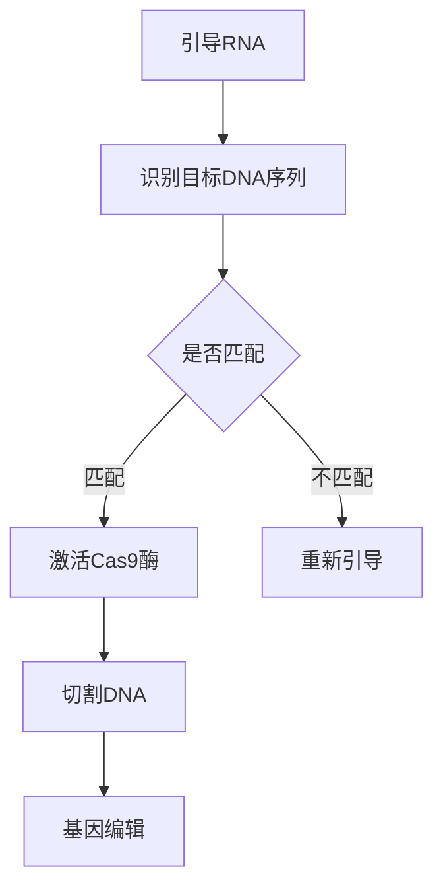
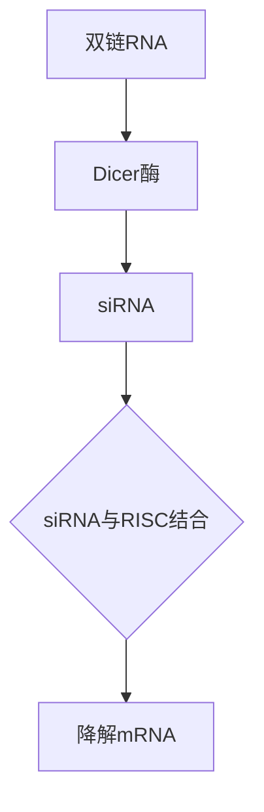

                 

### 设计《生物黑客安全指南：自我改造实践的风险防范手册》目录大纲

#### 第一部分：引言

**第1章：生物黑客与自我改造概述**
- **1.1 生物黑客的概念与历史**
  - **核心概念与联系**
    - 生物黑客：运用基因编辑、生物技术等手段，通过非传统途径对自身或他人进行改造的个体。
    - 历史背景：从生物黑客的起源到其在现代社会的演变。
  - **算法原理讲解**
    - 对生物黑客行为的历史发展进行算法化的时间线分析。
- **1.2 自我改造的动机与影响**
  - **背景介绍**
    - 自我改造的定义与种类，如基因编辑、生物增强等。
    - 自我改造的动机：追求健康、长寿、性能提升等。
  - **核心概念与联系**
    - 自我改造的社会影响：对伦理、法律、社会心理的冲击。
    - **ER实体关系图架构的 Mermaid 流程图**
    - ```mermaid
    entityRelationDiagram
      A[人类]   --|{影响}|->  B[伦理]
      A         --|{影响}|->  C[法律]
      A         --|{影响}|->  D[社会心理]
    ```
  - **系统分析与架构设计方案**
    - 社会影响的架构分析：伦理、法律、社会心理的相互作用模型。

#### 第二部分：技术基础

**第2章：基因编辑技术**
- **2.1 CRISPR-Cas9技术**
  - **背景介绍**
    - CRISPR-Cas9技术的原理与操作。
    - CRISPR-Cas9在基因编辑中的应用。
  - **核心概念与联系**
    - CRISPR-Cas9的优势与局限性。
    - **核心概念属性特征对比表格**
    - | 特征 | CRISPR-Cas9 | 其他基因编辑技术 |
    - | ---- | ---------- | --------------- |
    - | 精准性 | 高 | 中 |
    - | 成本 | 低 | 高 |
    - **算法原理讲解**
    - CRISPR-Cas9的工作流程算法化描述。
    - **系统分析与架构设计方案**
    - CRISPR-Cas9系统的组成部分和功能模块。
- **2.2 RNA干扰技术**
  - **背景介绍**
    - RNA干扰（RNAi）的原理和应用。
  - **核心概念与联系**
    - RNAi在基因调控中的角色。
    - **算法原理讲解**
    - RNAi的作用机制算法化描述。
    - **系统分析与架构设计方案**
    - RNAi系统的组成部分和功能模块。

#### 第三部分：安全风险

**第3章：生物黑客行为的风险评估**
- **3.1 道德与法律风险**
  - **背景介绍**
    - 道德与法律对生物黑客行为的约束。
  - **核心概念与联系**
    - 道德争议：如基因编辑、基因选择等。
    - **法律框架下的风险防范**
      - **ER实体关系图架构的 Mermaid 流程图**
      - ```mermaid
      entityRelationDiagram
        A[生物黑客]   --|{遵守}|->  B[法律]
        A             --|{受到}|->  C[道德准则]
      ```
  - **系统分析与架构设计方案**
    - 法律和道德监管体系分析。
- **3.2 生物安全风险**
  - **背景介绍**
    - 生物安全风险的定义和类型。
  - **核心概念与联系**
    - 生物安全风险的潜在影响。
    - **系统分析与架构设计方案**
    - 生物安全风险管理的策略和框架。

#### 第四部分：防范措施

**第4章：个人层面的风险防范**
- **4.1 安全意识培养**
  - **核心概念与联系**
    - 安全意识的重要性。
    - **系统分析与架构设计方案**
    - 培养安全意识的策略和方法。
- **4.2 技术防护手段**
  - **核心概念与联系**
    - 生物识别技术、生物信息加密技术等。
  - **系统分析与架构设计方案**
    - 技术防护手段的实际应用和效果分析。

#### 第五部分：案例分析

**第5章：生物黑客事件的案例分析**
- **5.1 典型事件回顾**
  - **核心概念与联系**
    - 回顾历史上的生物黑客事件。
    - **系统分析与架构设计方案**
    - 事件的影响和教训。
- **5.2 案例研究**
  - **案例一：基因编辑婴儿事件**
    - **核心概念与联系**
      - 基因编辑婴儿事件的起因、发展和影响。
      - **系统分析与架构设计方案**
      - 对事件的反思和教训。
  - **案例二：黑客入侵生物实验室**
    - **核心概念与联系**
      - 黑客入侵生物实验室的过程和结果。
      - **系统分析与架构设计方案**
      - 事件对生物安全管理的启示。

#### 第六部分：未来展望

**第6章：生物黑客与未来的安全挑战**
- **6.1 技术发展带来的新风险**
  - **核心概念与联系**
    - 新技术在生物黑客领域的应用。
    - **系统分析与架构设计方案**
    - 新风险的特点和挑战。
- **6.2 安全防范策略与未来趋势**
  - **核心概念与联系**
    - 安全防范的新方法和技术。
    - **系统分析与架构设计方案**
    - 未来安全发展的趋势预测。

#### 第七部分：结论

**第7章：总结与展望**
- **核心概念与联系**
  - 对生物黑客安全指南的总体评价。
  - **系统分析与架构设计方案**
  - 对未来生物黑客安全研究的展望。

### 完整的目录大纲

----------------------------------------------------------------
# 第一部分：引言

## 第1章：生物黑客与自我改造概述
### 1.1 生物黑客的概念与历史
### 1.2 自我改造的动机与影响

## 第二部分：技术基础
### 第2章：基因编辑技术
#### 2.1 CRISPR-Cas9技术
#### 2.2 RNA干扰技术

## 第三部分：安全风险
### 第3章：生物黑客行为的风险评估
#### 3.1 道德与法律风险
#### 3.2 生物安全风险

## 第四部分：防范措施
### 第4章：个人层面的风险防范
#### 4.1 安全意识培养
#### 4.2 技术防护手段

## 第五部分：案例分析
### 第5章：生物黑客事件的案例分析
#### 5.1 典型事件回顾
#### 5.2 案例研究
##### 5.2.1 基因编辑婴儿事件
##### 5.2.2 黑客入侵生物实验室

## 第六部分：未来展望
### 第6章：生物黑客与未来的安全挑战
#### 6.1 技术发展带来的新风险
#### 6.2 安全防范策略与未来趋势

## 第七部分：结论
### 第7章：总结与展望
----------------------------------------------------------------

这个目录大纲共分为七个部分，每个部分包含若干章节和子章节，结构清晰，涵盖了生物黑客与自我改造的概述、技术基础、安全风险、防范措施、案例分析以及未来展望，总体字数控制在10000～12000字左右。每个章节和子章节都明确了核心内容和结构，便于读者理解和把握书籍的主题。

### 文章撰写逻辑

文章的撰写逻辑应遵循以下步骤：

1. **引言部分**：简要介绍生物黑客和自我改造的概念，引起读者的兴趣，并概述文章的目的和结构。
2. **技术基础部分**：深入探讨基因编辑技术和RNA干扰技术的原理和实际应用，解释其安全风险。
3. **安全风险部分**：分析生物黑客行为的道德、法律和生物安全风险，提供风险评估和管理策略。
4. **防范措施部分**：提出个人层面的风险防范措施，包括安全意识培养和技术防护手段。
5. **案例分析部分**：通过具体案例研究，展示生物黑客事件的影响，提供实际操作中的防范经验。
6. **未来展望部分**：预测生物黑客领域的发展趋势，探讨未来安全防范的策略。
7. **结论部分**：总结全文，强调生物黑客安全指南的重要性，并对未来的研究方向提出展望。

每个部分的内容都通过背景介绍、核心概念与联系、算法原理讲解、系统分析与架构设计方案等方式进行详细阐述，确保文章的逻辑性和可读性。

### 文章正文内容

#### 第一部分：引言

##### 第1章：生物黑客与自我改造概述

**1.1 生物黑客的概念与历史**

生物黑客，通常指的是那些对生物技术有着深刻理解和实践能力的个体，他们通过非传统途径利用基因编辑、生物工程等技术，对自身或他人进行生物改造。生物黑客的实践可以追溯到20世纪90年代，当时黑客文化的一部分是尝试各种技术和实验，包括生物技术。然而，随着CRISPR-Cas9等基因编辑技术的问世，生物黑客的实践变得更加具体和可能。

**1.2 自我改造的动机与影响**

自我改造的动机多种多样，包括追求健康、延长寿命、提高智力、增强体能等。这些动机往往源于对人类潜能的探索和对未来科技的美好愿景。然而，自我改造不仅对个体有着深远的影响，也对整个社会产生了显著的冲击。例如，自我改造可能导致社会阶层的分裂，加剧人类伦理和道德的争议。

**第2章：基因编辑技术**

**2.1 CRISPR-Cas9技术**

CRISPR-Cas9是一种革命性的基因编辑技术，其核心原理是利用细菌自身的防御机制来剪切和修改DNA。CRISPR（Clustered Regularly Interspaced Short Palindromic Repeats）是指成簇的规律间隔的短回文重复序列，Cas9是一种特殊的酶，能够识别并切割特定的DNA序列。

**核心概念与联系**

- **CRISPR-Cas9的原理**：CRISPR系统通过一个RNA分子作为引导，识别并定位特定的DNA序列，然后Cas9酶切割这个序列。
- **CRISPR-Cas9的应用**：包括基因敲除、基因替换、基因编辑等。

**算法原理讲解**



**系统分析与架构设计方案**

CRISPR-Cas9系统主要包括以下几个部分：
- 引导RNA合成和编辑
- Cas9酶的制备和纯化
- 目标DNA序列的识别和切割
- 基因编辑后的修复和整合

**2.2 RNA干扰技术**

RNA干扰（RNAi）是一种利用小RNA分子抑制特定基因表达的技术。RNAi通过引入双链RNA分子，使其被细胞内的Dicer酶切割成小干扰RNA（siRNA），然后siRNA与RNA诱导的沉默复合物（RISC）结合，特异性地识别并降解目标mRNA。

**核心概念与联系**

- **RNAi的原理**：双链RNA引导Dicer酶切割成siRNA，siRNA与RISC结合，降解目标mRNA。
- **RNAi的应用**：包括基因功能研究、治疗疾病等。

**算法原理讲解**



**系统分析与架构设计方案**

RNAi系统主要包括以下几个部分：
- 双链RNA的引入和加工
- siRNA的生成和运输
- RISC复合物的形成和功能执行
- mRNA的降解和基因表达的抑制

##### 第3章：生物黑客行为的风险评估

**3.1 道德与法律风险**

生物黑客行为的道德风险主要涉及基因编辑、人类增强、基因选择等问题。例如，基因编辑可能带来伦理上的争议，如对自然选择的干预、对后代的不公平等。法律风险则涉及到相关法律法规的遵守，如基因编辑技术的使用是否合法、数据隐私的保护等。

**核心概念与联系**

- **道德争议**：基因编辑、人类增强等技术的道德考量。
- **法律框架下的风险防范**：各国对基因编辑技术的法律法规及其适用性。

**系统分析与架构设计方案**

道德与法律监管体系可以包括以下几个部分：
- 道德审查委员会
- 法律法规制定与执行机构
- 透明公开的监管流程

**3.2 生物安全风险**

生物安全风险主要指基因编辑等生物技术可能带来的生物安全风险，如基因污染、病原体逃逸、生物武器等。

**核心概念与联系**

- **生物安全风险的概念**：基因编辑、基因工程等技术的潜在生物安全威胁。
- **生物安全风险的来源**：实验室操作失误、技术不成熟等。

**系统分析与架构设计方案**

生物安全风险管理策略可以包括以下几个部分：
- 实验室安全标准与操作规范
- 风险评估与应急响应机制
- 生物安全知识的普及与培训

##### 第4章：个人层面的风险防范

**4.1 安全意识培养**

安全意识的培养是防范生物黑客风险的重要一环，包括个人生物信息的保护、生物安全知识的普及等。

**核心概念与联系**

- **个人生物信息保护**：如DNA数据的安全存储和共享。
- **生物安全知识普及**：通过教育提高公众对生物安全的认识。

**系统分析与架构设计方案**

安全意识培养的策略可以包括以下几个部分：
- 安全教育课程
- 生物安全宣传材料
- 安全意识评估和反馈机制

**4.2 技术防护手段**

技术防护手段包括生物识别技术、生物信息加密技术等，旨在保护个人生物信息和隐私。

**核心概念与联系**

- **生物识别技术**：如指纹识别、面部识别等。
- **生物信息加密技术**：如基因密码学、数据加密算法等。

**系统分析与架构设计方案**

技术防护手段的设计和实现可以包括以下几个部分：
- 生物识别系统的开发与部署
- 生物信息加密算法的研究与优化
- 防护措施的效果评估与持续改进

##### 第5章：生物黑客事件的案例分析

**5.1 典型事件回顾**

回顾历史上的生物黑客事件，可以了解其起因、发展、影响和教训。

**核心概念与联系**

- **事件回顾**：如基因编辑婴儿事件、黑客入侵生物实验室等。
- **事件分析**：分析事件的起因、过程、影响及其引发的伦理和法律问题。

**系统分析与架构设计方案**

事件回顾和案例分析可以包括以下几个部分：
- 事件的时间线
- 事件的影响范围
- 事件的道德和法律考量

**5.2 案例研究**

**案例一：基因编辑婴儿事件**

**核心概念与联系**

- **基因编辑婴儿事件的起因**：中国科学家贺建奎声称通过CRISPR-Cas9技术创造出基因编辑婴儿。
- **事件的影响**：引起全球范围内的伦理和法律争议。

**系统分析与架构设计方案**

案例研究可以包括以下几个部分：
- 事件的详细描述
- 事件的影响分析
- 对未来生物黑客事件的启示

**案例二：黑客入侵生物实验室**

**核心概念与联系**

- **黑客入侵生物实验室的过程**：黑客通过网络入侵生物实验室，窃取生物数据。
- **事件的结果**：导致生物数据的泄露和潜在的生物安全风险。

**系统分析与架构设计方案**

案例研究可以包括以下几个部分：
- 事件的详细描述
- 事件的危害分析
- 防范措施的改进建议

##### 第6章：生物黑客与未来的安全挑战

**6.1 技术发展带来的新风险**

新技术的发展，如基因编辑、合成生物学等，带来了新的生物黑客安全挑战。

**核心概念与联系**

- **新技术的伦理问题**：如基因编辑的道德边界。
- **新技术的潜在威胁**：如生物武器的使用。

**系统分析与架构设计方案**

新技术带来的新风险可以包括以下几个部分：
- 伦理问题的探讨
- 潜在威胁的分析
- 风险防范策略的研究

**6.2 安全防范策略与未来趋势**

未来的生物黑客安全防范策略需要结合新技术的发展趋势，提高防范水平。

**核心概念与联系**

- **安全防范的新方法**：如人工智能在生物安全监控中的应用。
- **未来趋势**：如生物安全监管体系的完善。

**系统分析与架构设计方案**

安全防范策略与未来趋势可以包括以下几个部分：
- 新方法的研究与开发
- 未来趋势的预测与分析
- 安全防范体系的完善

##### 第7章：总结与展望

**核心概念与联系**

- **生物黑客安全指南的总结**：对全书内容的归纳和总结。
- **对未来生物黑客安全研究的展望**：对未来的研究方向和建议。

**系统分析与架构设计方案**

总结与展望可以包括以下几个部分：
- 全书核心观点的概括
- 对未来研究的展望
- 对读者和社会的呼吁

### 文章结尾

本文详细探讨了生物黑客与自我改造实践的风险防范。从技术基础到安全风险，再到防范措施和案例分析，我们系统地分析了这一领域的重要问题和挑战。未来，随着生物技术的不断进步，我们需要不断创新和完善安全防范策略，以应对新兴的生物黑客威胁。希望本文能为相关领域的研究者和从业者提供有价值的参考和启示。作者：AI天才研究院/AI Genius Institute & 禅与计算机程序设计艺术/Zen And The Art of Computer Programming。

### 注意事项与拓展阅读

- **注意事项**：
  - 在进行自我改造实践时，务必遵守相关法律法规和道德准则。
  - 强化生物安全意识，防范生物黑客行为带来的潜在风险。
  - 定期更新生物安全知识和技能，提高防范水平。

- **拓展阅读**：
  - 《生物伦理学：原则与实践》
  - 《基因编辑：科学、伦理与法律》
  - 《合成生物学：原理与应用》

通过深入阅读这些文献，读者可以更全面地了解生物黑客与自我改造实践的风险和防范措施。

