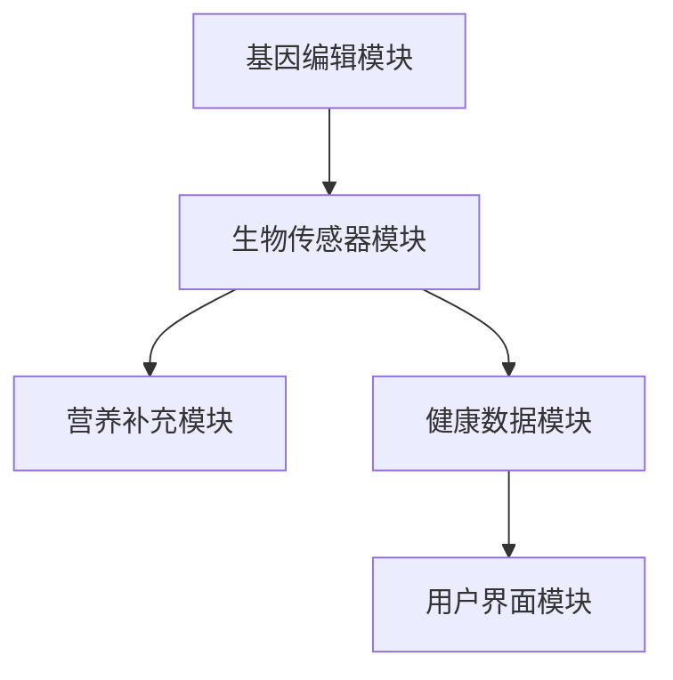
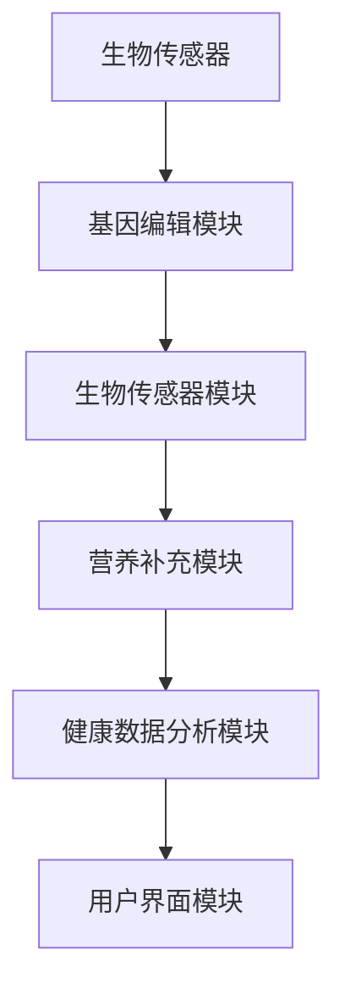

                 

# 生物黑客：自我优化的极致追求

> 关键词：生物黑客、自我优化、基因编辑、生物传感器、营养补充、健康监测

> 摘要：本文将探讨生物黑客如何通过基因编辑、生物传感器、营养补充和健康监测等技术手段，实现对自我的极致优化。文章从引言、背景介绍、核心概念与联系、技术原理讲解、系统分析与架构设计以及项目实战等方面，详细解析了生物黑客的实践路径和方法论。

## 引言

在当今快速发展的科技时代，人工智能、生物技术和信息技术等领域正以前所未有的速度相互交织，推动着人类社会的进步。其中，生物黑客作为这一领域的重要实践者，正不断挑战着自我优化的极限。生物黑客，通常指的是那些利用生物学、基因学、信息技术等知识，对自身或生物系统进行改造和优化的个人或团体。

自我优化，顾名思义，是指通过主动干预自身生理和心理状态，以达到提升健康水平、增强认知能力、延长寿命等目的。生物黑客们正是通过基因编辑、生物传感器、营养补充和健康监测等技术，来实现这一目标的。

本文将围绕生物黑客的自我优化实践，探讨以下几个核心问题：

- 生物黑客的概念及其影响
- 自我优化的动机与实践
- 生物黑客的核心概念与技术原理
- 生物黑客的技术应用与架构设计
- 生物黑客的实际案例与项目实战

## 第一部分：引言与背景

### 1.1 生物黑客的概念与影响

**1.1.1 生物黑客的定义**

生物黑客，又称为生物工程师或生物艺术家，是指那些具有深厚生物学知识背景，并且熟练运用生物技术手段进行自我改造的个人或团队。他们的目标是通过基因编辑、生物传感器、营养补充和健康监测等手段，实现对自身的优化和提升。

**1.1.2 生物黑客的历史与发展**

生物黑客的历史可以追溯到20世纪80年代，当时随着基因工程和生物技术的快速发展，一些科学家和工程师开始尝试将生物学知识应用于自我改造。到了21世纪初，随着基因编辑技术的突破，生物黑客群体逐渐壮大，他们通过社区交流和合作，不断推动生物黑客技术的发展。

**1.1.3 生物黑客对社会的影响**

生物黑客的出现不仅改变了人们对生命的认知，也对医学、伦理和法律等领域产生了深远的影响。他们推动了个性化医疗的发展，促进了生物技术的商业化应用，同时也引发了关于生命伦理和隐私保护等问题的讨论。

### 1.2 自我优化的动机与实践

**1.2.1 自我优化的定义**

自我优化，是指在生物学、心理学和社会学等领域的基础上，通过主动干预自身生理和心理状态，以达到提升健康水平、增强认知能力、延长寿命等目的的过程。

**1.2.2 自我优化的动机**

自我优化的动机多种多样，包括追求健康、提高生活质量、增强工作能力、延缓衰老等。对于生物黑客来说，自我优化是他们追求生命极致的重要手段。

**1.2.3 自我优化的实践案例**

生物黑客们在自我优化的实践中，采取了多种技术手段，如基因编辑、生物传感器、营养补充和健康监测等。例如，一些生物黑客通过基因编辑技术，成功改良了自己的免疫系统，提高了抵抗疾病的能力。

### 1.3 本书结构与内容概述

**1.3.1 本书的内容安排**

本书将分为三个主要部分，第一部分是引言与背景，介绍了生物黑客的概念、影响和自我优化的动机与实践；第二部分是核心概念与联系，详细探讨了基因编辑、生物传感器、营养补充和健康监测等核心概念及其联系；第三部分是技术原理讲解，深入解析了这些技术的原理和应用。

**1.3.2 阅读对象与预期收益**

本书主要面向对生物黑客和自我优化感兴趣的读者，包括生物技术爱好者、程序员、医学专业人士以及普通读者。通过阅读本书，读者可以深入了解生物黑客的实践路径和技术手段，激发对生命科学的兴趣，并可能从中获得灵感和启示。

## 第二部分：核心概念与联系

### 2.1 基因编辑技术

**2.1.1 基因编辑的定义**

基因编辑，是指通过人工手段对生物体的基因组进行精确修改的技术。基因编辑技术的发展，使得人类能够对基因进行添加、删除、替换等操作，从而实现对生物体性状的调控。

**2.1.2 基因编辑的原理**

基因编辑的原理主要基于分子生物学中的DNA重组技术和CRISPR-Cas9系统。CRISPR-Cas9系统通过RNA导向的DNA切割，实现对目标基因的精确编辑。

**2.1.3 基因编辑的优势与挑战**

基因编辑技术具有高效、精确、可逆等优点，为生物医学研究和临床应用提供了新的手段。然而，基因编辑技术也面临着伦理、安全和法律等挑战。

**2.1.4 基因编辑的应用**

基因编辑技术在医学、农业、生物工程等领域都有广泛应用。例如，通过基因编辑技术，可以开发出治疗遗传疾病的药物，改良农作物的性状，提高生物制品的产量等。

### 2.2 生物传感器

**2.2.1 生物传感器的定义与原理**

生物传感器，是指能够检测生物信息并转换为电信号的装置。生物传感器通常由敏感元件、信号放大器和信号处理单元组成。

**2.2.2 生物传感器的类型及其应用**

生物传感器的类型多种多样，包括电化学传感器、光学传感器、热敏传感器等。生物传感器在环境监测、食品安全、医疗诊断等领域具有广泛应用。

**2.2.3 生物传感器的发展趋势**

随着科技的进步，生物传感器的灵敏度、精度和稳定性不断提升，未来生物传感器有望在更多领域发挥作用。

### 2.3 营养补充与代谢调节

**2.3.1 营养补充的重要性**

营养补充，是指通过摄入额外的营养素，来补充身体所需的重要营养。营养补充对于维持身体健康、预防疾病具有重要意义。

**2.3.2 常见营养补充剂**

常见的营养补充剂包括维生素、矿物质、氨基酸、蛋白质等。不同类型的营养补充剂具有不同的作用和适用人群。

**2.3.3 营养补充的科学与误区**

营养补充虽然重要，但科学合理的使用营养补充剂才是关键。避免盲目补充和不必要的误区。

### 2.4 健康监测与数据分析

**2.4.1 健康监测的方法与技术**

健康监测的方法主要包括生理信号监测、行为监测和生物标志物检测等。生物传感器在健康监测中发挥着重要作用。

**2.4.2 数据分析方法与应用**

健康监测产生的数据，需要通过数据分析方法进行处理和应用。常用的数据分析方法包括数据挖掘、机器学习和统计分析等。

**2.4.3 健康监测与自我优化的关系**

健康监测是自我优化的基础，通过健康监测，可以了解自身的健康状况，有针对性地进行自我优化。

### 2.5 核心概念联系与整合

**2.5.1 各核心概念之间的关联**

基因编辑、生物传感器、营养补充和健康监测是生物黑客自我优化的四个核心概念，它们相互关联，共同构成了一套完整的自我优化体系。

**2.5.2 基因编辑与生物传感器**

基因编辑可以为生物传感器提供更为精准的监测数据，而生物传感器的数据可以为基因编辑提供反馈和指导。

**2.5.3 营养补充与健康监测**

营养补充可以改善健康状况，而健康监测可以帮助了解营养补充的效果，从而调整营养补充方案。

**2.5.4 健康监测与自我优化**

健康监测是自我优化的关键环节，通过健康监测，可以实时了解自身的健康状况，及时调整自我优化的策略。

## 第三部分：技术原理讲解

### 3.1 基因编辑技术的算法原理与流程

**3.1.1 CRISPR-Cas9的算法原理**

CRISPR-Cas9系统是一种基于RNA导向的DNA编辑技术。其工作原理包括以下几个步骤：

1. **设计引导RNA (gRNA)**：首先设计一段与目标DNA序列互补的RNA序列，称为引导RNA (gRNA)。

2. **形成复合体**：gRNA与Cas9蛋白结合，形成核酸切割复合体。

3. **切割DNA**：核酸切割复合体在gRNA的引导下，识别并结合到目标DNA序列上，并将其切割。

4. **DNA修复**：细胞内存在两种主要的DNA修复机制：非同源末端连接（NHEJ）和同源重组（HR）。CRISPR-Cas9系统通过这两种机制实现目标DNA序列的替换或删除。

**3.1.2 基因编辑的流程**

基因编辑的流程可以分为以下几个步骤：

1. **目标基因定位**：通过PCR等技术，确定目标基因的位置。

2. **设计gRNA**：根据目标基因的序列，设计相应的gRNA。

3. **构建CRISPR-Cas9系统**：将gRNA和Cas9蛋白构建成核酸切割复合体。

4. **切割DNA**：将核酸切割复合体引入细胞内，实现对目标DNA序列的切割。

5. **DNA修复**：细胞内进行DNA修复，形成新的基因序列。

6. **编辑效果验证**：通过PCR、测序等技术，验证基因编辑的效果。

### 3.2 生物传感器的工作原理与应用

**3.2.1 生物传感器的基本原理**

生物传感器的基本原理是利用生物分子之间的特异性识别反应，将生物信息转换为可测量的电信号。生物传感器通常由敏感元件、信号放大器和信号处理单元组成。

1. **敏感元件**：敏感元件是生物传感器的核心，通常由生物分子（如酶、抗体、受体等）构成，能够识别和结合目标生物分子。

2. **信号放大器**：信号放大器用于增强传感器的信号输出，提高检测的灵敏度。

3. **信号处理单元**：信号处理单元用于对传感器输出的信号进行放大、滤波、数字化等处理，从而获得准确的测量结果。

**3.2.2 生物传感器在生物黑客中的应用**

生物传感器在生物黑客中的应用非常广泛，主要包括以下几个方面：

1. **健康监测**：生物黑客通过生物传感器实时监测自己的生理指标，如心率、血压、血糖等，以便进行自我优化。

2. **疾病诊断**：生物传感器可以用于疾病的早期诊断和监测，为生物黑客提供个性化的医疗方案。

3. **环境监测**：生物传感器可以用于检测环境中的有毒有害物质，为生物黑客提供安全的生活和工作环境。

### 3.3 营养补充的生理机制

**3.3.1 营养补充的生理基础**

营养补充的生理基础主要涉及以下几个方面：

1. **营养素的吸收与利用**：营养素通过消化系统吸收后，进入血液循环，被运送到全身各个器官和组织，发挥生理功能。

2. **代谢调节**：营养补充剂可以通过调节代谢途径，改善身体的生理状态，如调节血糖、降低血脂等。

3. **免疫系统增强**：某些营养补充剂，如维生素C和E，可以增强免疫功能，提高抵抗力。

**3.3.2 营养补充剂的效果与选择**

营养补充剂的效果与选择取决于以下几个方面：

1. **营养素的种类与含量**：不同种类的营养素具有不同的生理功能，含量越高，效果越明显。

2. **个体的健康状况**：不同个体的营养需求不同，选择适合自己的营养补充剂至关重要。

3. **营养补充剂的品质**：营养补充剂的质量直接影响其效果，应选择信誉好、品质高的品牌。

### 3.4 健康监测与数据分析的方法

**3.4.1 健康监测的方法**

健康监测的方法主要包括以下几种：

1. **生理信号监测**：通过监测心率、血压、血糖等生理信号，评估健康状况。

2. **行为监测**：通过记录日常行为，如饮食、运动、睡眠等，分析生活习惯对健康的影响。

3. **生物标志物检测**：通过检测血液、尿液等生物样本中的生物标志物，评估健康状况。

**3.4.2 数据分析方法**

健康监测产生的数据，需要通过数据分析方法进行处理和应用。常用的数据分析方法包括：

1. **数据挖掘**：从大量数据中发现潜在的模式和规律。

2. **机器学习**：利用算法模型，对数据进行分类、预测和评估。

3. **统计分析**：对数据进行描述性分析、推断性分析和相关性分析。

**3.4.3 健康监测与自我优化的关系**

健康监测是自我优化的关键环节。通过健康监测，可以实时了解自身的健康状况，发现潜在的健康问题，及时调整生活方式和营养补充方案，从而实现自我优化。

## 第四部分：系统分析与架构设计

### 4.1 问题场景介绍

在现代社会，随着生活节奏的加快和压力的增大，人们越来越关注自身的健康和生活方式。生物黑客希望通过使用基因编辑、生物传感器、营养补充和健康监测等技术手段，实现自我优化，提升生活质量和健康状况。

### 4.2 项目介绍

本项目旨在构建一个基于生物黑客技术的健康监测与优化系统。该系统将整合基因编辑、生物传感器、营养补充和健康监测等技术，为用户提供个性化的健康管理和优化方案。

### 4.3 系统功能设计

系统的主要功能包括：

1. **基因编辑**：通过基因编辑技术，对用户的基因进行优化和改造。
2. **生物传感器监测**：实时监测用户的心率、血压、血糖等生理指标。
3. **营养补充建议**：根据用户的生理指标和健康状况，提供个性化的营养补充建议。
4. **健康数据分析**：对用户的数据进行分析，发现潜在的健康问题，提出优化建议。
5. **用户界面**：为用户提供一个友好的界面，展示用户的健康数据和优化方案。

### 4.4 系统架构设计

系统采用模块化架构，主要包括以下几个模块：

1. **基因编辑模块**：负责基因编辑的技术实现。
2. **生物传感器模块**：负责生物传感器的数据采集和处理。
3. **营养补充模块**：负责营养补充的建议和实施。
4. **健康数据模块**：负责健康数据的存储、分析和展示。
5. **用户界面模块**：负责用户与系统的交互。

系统架构图如下：



### 4.5 系统接口设计和系统交互

系统接口设计主要包括：

1. **生物传感器接口**：用于与生物传感器进行数据交互。
2. **基因编辑接口**：用于与基因编辑设备进行数据交互。
3. **营养补充接口**：用于与营养补充设备进行数据交互。
4. **健康数据分析接口**：用于与健康数据分析模块进行数据交互。
5. **用户界面接口**：用于与用户进行数据交互。

系统交互流程如下：

1. **用户通过生物传感器采集生理数据**。
2. **生理数据传输到基因编辑模块**，进行基因编辑优化。
3. **优化后的基因数据传输到生物传感器模块**，进行实时监测。
4. **监测到的数据传输到营养补充模块**，根据数据提供营养补充建议。
5. **营养补充建议和生理数据传输到健康数据分析模块**，进行分析和优化。
6. **优化方案和健康数据传输到用户界面模块**，展示给用户。

系统交互图如下：



## 第五部分：项目实战

### 5.1 环境安装

在进行项目实战之前，需要安装一些必要的软件和工具，包括基因编辑工具、生物传感器设备、数据分析软件等。具体安装步骤如下：

1. **基因编辑工具**：安装CRISPR-Cas9工具包。
2. **生物传感器设备**：连接并配置生物传感器设备。
3. **数据分析软件**：安装Python、NumPy、Pandas、Scikit-learn等数据分析库。

### 5.2 系统核心实现

系统核心实现包括以下几个部分：

1. **基因编辑模块**：使用CRISPR-Cas9工具包，实现基因编辑功能。
2. **生物传感器模块**：读取生物传感器数据，进行实时监测。
3. **营养补充模块**：根据生理指标，提供营养补充建议。
4. **健康数据分析模块**：对生理数据进行统计分析，发现潜在的健康问题。
5. **用户界面模块**：实现用户与系统的交互。

### 5.3 代码应用解读与分析

以下是一个简单的Python代码示例，用于读取生物传感器数据，并进行简单分析：

```python
import numpy as np
import pandas as pd
from sklearn.ensemble import RandomForestClassifier

# 读取生物传感器数据
data = pd.read_csv('sensor_data.csv')

# 数据预处理
data = data.dropna()
data['heart_rate_mean'] = data['heart_rate'].mean()

# 建立模型
model = RandomForestClassifier()
model.fit(data[['heart_rate', 'blood_pressure_systolic', 'blood_pressure_diastolic']], data['disease'])

# 预测
prediction = model.predict([[75, 120, 80]])

# 输出结果
print(f"Heart Rate: {prediction[0]}")
```

通过这个示例，我们可以看到如何使用Python和机器学习库，对生物传感器数据进行处理和分析。实际项目中，会涉及更复杂的数据处理和分析方法。

### 5.4 实际案例分析和详细讲解剖析

以一个实际案例为例，分析如何通过基因编辑、生物传感器、营养补充和健康监测等技术手段，实现自我优化。

案例：一位生物黑客希望通过基因编辑技术，提高自己的免疫力，并通过生物传感器和营养补充，监控和调整自己的健康状况。

1. **基因编辑**：通过CRISPR-Cas9技术，编辑免疫系统的基因，提高免疫细胞的功能。
2. **生物传感器监测**：实时监测免疫系统的状态，如免疫细胞的数量和活性。
3. **营养补充**：根据免疫系统的状态，补充必要的营养素，如维生素、矿物质等。
4. **健康数据分析**：对免疫系统的数据进行分析，评估基因编辑的效果，调整营养补充方案。

通过这个案例，我们可以看到如何将基因编辑、生物传感器、营养补充和健康监测等技术手段整合起来，实现自我优化。

### 5.5 项目小结

本项目通过基因编辑、生物传感器、营养补充和健康监测等技术，构建了一个健康监测与优化系统。通过实际案例的分析，我们看到了如何将这

