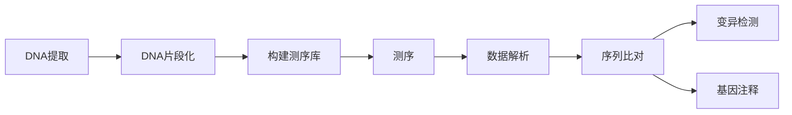

                 


# 生物黑客：自我改造时代的意义与伦理

关键词：生物黑客、自我改造、伦理、基因编辑、CRISPR

摘要：随着科技的发展，生物黑客领域逐渐成为研究热点。本文将探讨生物黑客的定义、技术原理、伦理问题以及未来的发展趋势，旨在为读者提供一个全面、深刻的理解，引发对自我改造时代的深入思考。

## 目录大纲设计思路

首先，我们需要明确本书的核心章节，以确保目录大纲的完整性和逻辑性。本书将围绕“生物黑客：自我改造时代的意义与伦理”这一主题，分为以下几部分：

1. **背景介绍**：介绍生物黑客的定义、发展历史、现状和未来趋势。
2. **核心概念与联系**：分析生物黑客涉及的核心概念，如生物工程、基因编辑、神经科学等，并阐述这些概念之间的联系。
3. **技术原理讲解**：深入探讨生物黑客使用的具体技术，如CRISPR、基因测序等，并通过mermaid流程图和Python代码进行说明。
4. **伦理与法律问题**：讨论生物黑客带来的伦理和法律挑战，包括个体权利、社会影响、公平性等。
5. **应用案例分析**：通过实际案例展示生物黑客技术的应用场景和效果。
6. **未来展望**：探讨生物黑客技术的未来发展趋势和可能的影响。
7. **结论与建议**：总结全文内容，提出对生物黑客技术发展的建议。

## 目录大纲

### 1. 背景介绍

**1.1 生物黑客的定义与发展**

**1.2 生物黑客技术的现状与未来趋势**

### 2. 核心概念与联系

**2.1 生物工程与基因编辑**

**2.2 神经科学与认知增强**

**2.3 CRISPR技术与基因编辑**

**2.4 基因测序与数据解析**

### 3. 技术原理讲解

**3.1 CRISPR技术的mermaid流程图与Python代码实现**

**3.2 基因测序技术原理讲解与mermaid流程图**

### 4. 伦理与法律问题

**4.1 生物黑客的伦理挑战**

**4.2 法律法规与政策建议**

### 5. 应用案例分析

**5.1 生物黑客技术的实际应用案例**

**5.2 案例分析：基因编辑治疗遗传病**

**5.3 案例分析：神经科学在认知增强中的应用**

### 6. 未来展望

**6.1 生物黑客技术的未来发展趋势**

**6.2 对未来社会的影响与挑战**

### 7. 结论与建议

**7.1 总结全文**

**7.2 对生物黑客技术发展的建议**

## 总结

通过以上目录大纲的设计，我们可以看到本书将系统地探讨生物黑客领域的各个方面，从背景介绍、核心概念、技术原理、伦理问题到应用案例和未来展望，旨在为读者提供一个全面、深入的视角。接下来的章节中，我们将逐一展开讨论，以揭示生物黑客自我改造时代的意义与伦理。让我们一起，深入思考这一充满变革和挑战的新领域。

---

文章将继续按照目录大纲逐步展开，深入探讨每一个章节的内容。在接下来的部分中，我们将详细介绍生物黑客的定义、发展历史、核心概念、技术原理、伦理问题、应用案例以及未来展望。敬请期待！ 

---

### 背景介绍

#### 1.1 生物黑客的定义与发展

生物黑客，又称“生物工程师”或“生物极客”，是指那些利用生物学知识和技术手段，对生物体进行人为改造的人。这一概念起源于计算机黑客，他们通过学习和掌握计算机系统的工作原理，进行创造性的改造和创新。生物黑客的动机与计算机黑客相似，都是为了探索技术的极限、推动科技进步。

生物黑客的发展可以追溯到20世纪末。随着基因编辑技术的出现，如CRISPR/Cas9，生物黑客得以在实验室中对DNA进行精确的修改。这一技术使得人类能够直接操作生命的基本单位——基因，从而改变生物体的性状。生物黑客的兴起不仅改变了生物学研究的方式，也引发了社会对生命伦理的深刻反思。

生物黑客技术的快速发展使得其应用范围不断扩大。从医疗领域到农业、环境科学，再到生物制造和生物计算，生物黑客的足迹几乎无处不在。例如，基因编辑技术已用于治疗遗传性疾病，农业生物黑客通过基因改造提高作物产量和抗病能力，生物计算则将生物体视为计算工具，通过生物分子实现数据存储和处理。

#### 1.2 生物黑客技术的现状与未来趋势

当前，生物黑客技术正处在一个快速发展的阶段。基因编辑技术如CRISPR/Cas9已经从实验室走向临床应用，例如，2018年，世界上首例CRISPR/Cas9基因编辑的婴儿在中国诞生，这一事件引发了全球范围内的伦理争议。此外，基因测序技术的进步使得大规模基因组数据的获取和分析成为可能，这为个性化医疗提供了数据支持。

神经科学和认知增强领域也吸引了大量生物黑客的关注。通过神经接口技术和药物干预，人们试图提升认知能力、改善记忆和解决神经退行性疾病。例如，神经科学家正在研究如何利用电刺激和光遗传学来治疗阿尔茨海默病和帕金森病。

未来，生物黑客技术有望进一步突破现有边界。随着人工智能和生物技术的融合，生物计算和生物制造将成为重要的发展方向。生物黑客们可能会利用生物分子构建复杂的计算系统，实现高效的生物数据处理。此外，生物黑客还可能探索新的生物材料，用于制造更先进的生物电子设备和生物机器。

总的来说，生物黑客技术正处于一个充满机遇和挑战的时期。其快速的发展不仅将带来新的科学发现和技术应用，也引发了深刻的伦理和社会问题。在接下来的章节中，我们将进一步探讨生物黑客技术的核心概念、技术原理、伦理问题以及未来展望。

### 核心概念与联系

#### 2.1 生物工程与基因编辑

生物工程，是一门应用工程学原理和方法来设计和构建新的生物系统或改善现有生物系统的学科。它的研究对象包括基因、细胞、组织、生物体以及生物群落等。生物工程的核心目标是利用生物体的自然特性，通过技术手段创造出新的功能或性能。

基因编辑是生物工程中的一个重要分支，它涉及到对生物体DNA序列的精确修改。基因编辑技术的发展极大地推动了生命科学的研究和应用。目前，最常用的基因编辑技术包括CRISPR/Cas9、TALENs、ZFNs等。这些技术通过引入特定的核酸酶，使DNA序列发生精确的切割、修改，从而实现目标基因的敲除、插入或替换。

生物工程和基因编辑之间的联系非常紧密。生物工程为基因编辑提供了技术平台和实验工具，而基因编辑则为生物工程提供了新的方法和手段。例如，通过基因编辑技术，生物工程师可以创造出抗病、高产、耐环境的新型农作物，从而提高农业产量和食品供应。

#### 2.2 神经科学与认知增强

神经科学是研究神经系统结构和功能的学科，包括神经元的工作原理、神经系统如何处理信息、大脑如何产生意识和行为等。神经科学的研究不仅有助于我们理解大脑和神经系统的基本机制，也为解决神经退行性疾病、精神障碍等提供了理论基础。

认知增强是指通过技术手段提升个体的认知能力，包括记忆、注意力、学习能力和决策能力等。神经科学与认知增强之间的联系在于，认知增强技术通常需要依赖神经科学的发现。例如，通过神经接口技术，研究人员可以将外部信号直接传递到大脑，从而改善记忆或注意力。此外，神经科学的研究也为我们提供了关于大脑如何适应和改变的方法，这些方法可以用于开发认知增强技术。

#### 2.3 CRISPR技术与基因编辑

CRISPR（Clustered Regularly Interspaced Short Palindromic Repeats）是一种原核生物的自我保护机制，它能够识别并破坏入侵的病毒DNA。近年来，科学家发现CRISPR系统可以用于基因编辑，成为生物工程和医学研究中的重要工具。

CRISPR/Cas9系统是当前最常用的基因编辑技术。它由一个引导RNA（gRNA）和一个核酸内切酶（Cas9）组成。gRNA负责定位目标DNA序列，而Cas9则在该序列上引入双链断裂，从而启动细胞的修复机制，实现基因的精确修改。

CRISPR技术与基因编辑的联系在于，CRISPR系统提供了高效的基因编辑手段。通过设计和合成特定的gRNA，研究人员可以在目标DNA序列上实现精确的切割和修改。这一技术的优势在于其高效率、高精确性和低成本，使得基因编辑在科学研究和临床应用中得到了广泛应用。

#### 2.4 基因测序与数据解析

基因测序是获取生物体基因组序列的过程。随着测序技术的进步，基因测序的成本大幅降低，使得大规模基因组测序成为可能。目前，常用的基因测序技术包括Sanger测序、高通量测序（Next-Generation Sequencing, NGS）等。

基因测序与数据解析之间的联系在于，基因测序提供了大量的基因组数据，而数据解析则是对这些数据进行解释和应用的关键步骤。通过生物信息学工具，研究人员可以分析基因序列中的变异、基因表达水平和功能注释等，从而揭示基因的功能和生物体的性状。

#### 概念属性特征对比表格

为了更清晰地展示生物工程、基因编辑、神经科学、认知增强、CRISPR技术和基因测序的概念属性特征，我们创建了一个对比表格：

| 概念名称 | 定义 | 关键技术 | 应用领域 | 目标 |
| --- | --- | --- | --- | --- |
| 生物工程 | 应用工程学原理和方法来设计和构建新的生物系统 | 基因编辑、生物制造、生物计算 | 医疗、农业、环境科学 | 改善生物体的功能或性能 |
| 基因编辑 | 对生物体DNA序列进行精确修改 | CRISPR/Cas9、TALENs、ZFNs | 医学、农业、生物制造 | 治疗遗传病、改良作物 |
| 神经科学 | 研究神经系统结构和功能 | 神经接口、电刺激、光遗传学 | 神经退行性疾病治疗、认知增强 | 提升认知能力、改善记忆 |
| 认知增强 | 通过技术手段提升个体的认知能力 | 神经接口、药物干预 | 教育、军事、医疗 | 提高学习、决策能力 |
| CRISPR技术 | 利用CRISPR系统进行基因编辑 | CRISPR/Cas9、gRNA、核酸内切酶 | 医学、农业、科研 | 精确修改DNA序列 |
| 基因测序 | 获取生物体基因组序列 | Sanger测序、NGS | 医学、生物学研究、个性化医疗 | 分析基因变异、功能 |

#### ER实体关系图架构的mermaid流程图

为了更好地展示各概念之间的联系，我们使用mermaid流程图创建了一个ER（实体关系）图：

```mermaid
erDiagram
    生物工程 ||--|{ 基因编辑 }
    生物工程 ||--|{ 生物制造 }
    生物工程 ||--|{ 生物计算 }
    基因编辑 ||--|{ CRISPR技术 }
    CRISPR技术 ||--|{ gRNA }
    CRISPR技术 ||--|{ 核酸内切酶 }
    神经科学 ||--|{ 神经接口 }
    神经科学 ||--|{ 电刺激 }
    神经科学 ||--|{ 光遗传学 }
    认知增强 ||--|{ 神经科学 }
    认知增强 ||--|{ 药物干预 }
```

通过这个ER图，我们可以清晰地看到各概念之间的关系，以及它们在生物黑客领域中的作用和贡献。

### 技术原理讲解

#### 3.1 CRISPR技术的mermaid流程图与Python代码实现

CRISPR（Clustered Regularly Interspaced Short Palindromic Repeats）技术是一种革命性的基因编辑工具，它利用细菌的天然免疫系统来切割和修改DNA。下面，我们将通过mermaid流程图和Python代码来详细解释CRISPR技术的工作原理。

#### mermaid流程图

首先，我们使用mermaid流程图来展示CRISPR技术的基本步骤：

```mermaid
flowchart LR
    A[目标DNA] --> B[识别序列]
    B --> C{是否匹配?}
    C -->|是| D[引导RNA(gRNA)结合]
    C -->|否| E[继续搜索]
    D --> F[核酸内切酶(Cas9)切割]
    F --> G[DNA修复]
    G --> H[基因编辑]
```

在这个流程图中，目标DNA首先与gRNA进行识别和匹配。如果匹配成功，gRNA会引导Cas9核酸内切酶在目标DNA序列上引入双链断裂。随后，细胞利用其内建的DNA修复机制来修复双链断裂，从而实现对基因的精确编辑。

#### Python代码实现

为了更直观地展示CRISPR技术的工作流程，我们使用Python编写了一个简化的代码示例：

```python
import random

def crisper(gRNA, targetDNA):
    # 模拟gRNA与目标DNA的识别和匹配过程
    if gRNA in targetDNA:
        print("gRNA与目标DNA匹配成功。")
        # 引导Cas9核酸内切酶进行切割
        cut_site = random.randint(0, len(targetDNA))
        cut_site2 = random.randint(0, len(targetDNA))
        while cut_site == cut_site2:
            cut_site2 = random.randint(0, len(targetDNA))
        print(f"Cas9在位置{cut_site}和{cut_site2}切割DNA。")
        # 模拟DNA修复过程
        repair_site = random.randint(0, len(targetDNA))
        print(f"DNA在位置{repair_site}进行修复。")
        # 基因编辑完成
        print("基因编辑成功。")
    else:
        print("gRNA与目标DNA不匹配，继续搜索。")

# 示例
gRNA = "AGTC"
targetDNA = "AGTCATGCAGTC"
crisper(gRNA, targetDNA)
```

在这个代码示例中，我们首先定义了一个`crisper`函数，该函数接受gRNA序列和目标DNA序列作为输入。函数首先检查gRNA是否与目标DNA匹配。如果匹配成功，函数将模拟Cas9核酸内切酶在目标DNA序列上引入双链断裂，并模拟DNA修复过程。最后，函数输出基因编辑的结果。

#### 算法原理讲解

CRISPR技术的核心在于其精确的DNA切割能力。以下是CRISPR技术算法原理的详细讲解：

1. **gRNA设计**：gRNA是CRISPR系统的关键组件，它负责定位目标DNA序列。设计gRNA的过程需要考虑目标序列的特异性和序列保守性。理想情况下，gRNA应具有高度特异性的识别序列，以确保只对目标DNA进行编辑。

2. **核酸内切酶选择**：在CRISPR/Cas9系统中，常用的核酸内切酶是Cas9。Cas9具有两个切割位点的特性，使其能够精确切割目标DNA。为了实现这一点，研究人员需要通过生物信息学方法筛选出合适的Cas9核酸内切酶。

3. **DNA修复机制**：细胞内的DNA修复机制包括非同源末端连接（NHEJ）和同源定向修复（HDR）。NHEJ是一种误差率较高的修复机制，它通常导致插入或缺失突变。HDR则是一种更为精确的修复机制，它利用同源序列进行修复，从而实现对目标基因的精确修改。

4. **基因编辑效果验证**：为了验证基因编辑的效果，研究人员需要对编辑后的DNA序列进行测序和比对。通过比较编辑前后的序列，可以确定编辑是否成功以及是否存在意外的突变。

#### 数学模型和数学公式

为了更好地理解CRISPR技术的工作原理，我们可以使用以下数学模型和公式：

1. **匹配概率**：假设gRNA序列长度为n，目标DNA序列长度为m，则gRNA与目标DNA匹配的概率可以用以下公式表示：

   \[ P_{match} = \frac{1}{m-n+1} \]

   其中，\( P_{match} \) 表示匹配概率，\( m \) 表示目标DNA序列长度，\( n \) 表示gRNA序列长度。

2. **切割位点分布**：假设Cas9核酸内切酶在目标DNA序列上的切割位点是均匀分布的，则切割位点的期望值为：

   \[ E_{cut} = \frac{n-1}{2} \]

   其中，\( E_{cut} \) 表示切割位点的期望值，\( n \) 表示目标DNA序列长度。

3. **编辑效率**：编辑效率可以用编辑成功率（编辑次数/尝试次数）来衡量。假设进行了一次CRISPR实验，共尝试编辑了100次，其中成功编辑了80次，则编辑效率为：

   \[ E_{edit} = \frac{80}{100} = 0.8 \]

   其中，\( E_{edit} \) 表示编辑效率。

通过以上数学模型和公式，我们可以更精确地分析CRISPR技术的工作原理和性能。

### 系统分析与架构设计方案

#### 3.2 基因测序技术原理讲解与mermaid流程图

基因测序技术是一种通过测定生物体DNA序列来确定其遗传信息的方法。随着测序技术的进步，我们能够以越来越高的速度和精度进行大规模基因组测序。下面，我们将详细讲解基因测序技术的工作原理，并使用mermaid流程图进行说明。

#### 基因测序技术的工作原理

基因测序技术主要包括以下几个关键步骤：

1. **DNA提取**：首先，从生物样本中提取DNA。这一过程包括细胞破碎、DNA分离和纯化等步骤。

2. **DNA片段化**：将提取的DNA进行片段化处理，以便进行后续的测序步骤。常用的方法包括限制酶切割和超声波破碎。

3. **构建测序库**：将片段化的DNA进行标记并连接到特定的测序适配子，从而构建测序库。测序适配子用于连接测序平台和DNA片段，并帮助测序仪器识别和读取序列。

4. **测序**：使用测序仪器对测序库进行测序。目前最常用的测序技术包括Sanger测序和下一代测序（Next-Generation Sequencing, NGS）。NGS技术包括高通量测序（High-Throughput Sequencing, HTS）和单分子测序（Single-Molecule Sequencing, SMS）。

5. **数据解析**：将测序得到的原始数据（FastQ文件）进行预处理、校正和质量控制，最后通过生物信息学工具进行序列比对、变异检测和基因注释等分析。

#### mermaid流程图

为了更直观地展示基因测序的过程，我们使用mermaid流程图创建了一个简化的流程图：



在这个流程图中，DNA提取、DNA片段化、构建测序库、测序和数据解析是基因测序的主要步骤。序列比对、变异检测和基因注释是对测序数据进行深入分析的过程。

#### 数学模型和数学公式

基因测序技术涉及到多个数学模型和公式，用于评估测序质量和计算测序深度等。以下是一些常用的数学模型和公式：

1. **测序深度**：测序深度（Sequencing Depth）是指对某个基因或基因组区域进行测序的覆盖度。测序深度可以用以下公式表示：

   \[ Depth = \frac{Total\ Reads}{Target\ Regions} \]

   其中，\( Depth \) 表示测序深度，\( Total\ Reads \) 表示总读取数，\( Target\ Regions \) 表示目标区域的大小。

2. **错误率**：测序错误率是指测序过程中产生的错误率。常用的错误率评估指标包括单核苷酸错误率（Single-Nucleotide Error Rate, SNER）和插入/删除错误率（Insertion/Deletion Error Rate, INDEL Rate）。以下是SNER的公式：

   \[ SNER = \frac{Total\ Errors}{Total\ Bases} \]

   其中，\( SNER \) 表示单核苷酸错误率，\( Total\ Errors \) 表示总错误数，\( Total\ Bases \) 表示总碱基数。

3. **读长分布**：读长分布（Read Length Distribution）是指测序得到的读取长度分布情况。常用的读长分布指标包括平均读长（Average Read Length）和标准差（Standard Deviation）。平均读长的计算公式如下：

   \[ Average\ Read\ Length = \frac{Sum\ of\ Read\ Lengths}{Number\ of\ Reads} \]

通过以上数学模型和公式，我们可以更精确地评估和优化基因测序的质量和效果。

### 伦理与法律问题

#### 4.1 生物黑客的伦理挑战

随着生物黑客技术的快速发展，伦理问题逐渐成为这一领域的重要议题。生物黑客的伦理挑战主要涉及个体权利、社会影响和公平性等方面。以下是这些伦理问题的详细分析。

**4.1.1 个体权利**

生物黑客技术，如基因编辑和神经科学干预，可能会对个体的身体和隐私权产生深远影响。例如，基因编辑可能导致基因缺陷的修复或增强特定基因的表达，从而改变个体的生物特征和健康状况。这种情况下，个体是否具有自主决定权，如何平衡个体的自由和公共利益，成为了一个亟待解决的问题。

此外，神经科学在认知增强领域的应用，如通过药物或电刺激改善记忆和注意力，也可能引发对个体自主决策权的挑战。在这种情况下，如何确保个体在认知增强过程中的知情同意，避免滥用技术，是一个重要的伦理问题。

**4.1.2 社会影响**

生物黑客技术不仅影响个体，还会对社会产生广泛影响。首先，基因编辑技术的应用可能导致“设计婴儿”的出现，即通过基因编辑选择胚胎的遗传特征，从而实现特定性状的优化。这一现象可能引发社会对基因编辑道德底线的讨论，如何平衡个人利益和社会公共利益，确保技术应用的公平性，成为一个重要议题。

此外，神经科学在认知增强领域的应用也可能带来社会层面的影响。例如，如果认知增强技术被广泛应用于教育和职场，可能会加剧社会竞争，造成社会阶层分化。同时，认知增强技术可能使一些人获得不公平的优势，从而引发社会不公。

**4.1.3 公平性**

生物黑客技术的应用还引发了公平性的问题。一方面，技术的成本和可及性可能成为阻碍公平应用的主要因素。例如，基因编辑技术目前仍处于临床试验阶段，其成本高昂，使得大多数人无法负担。这种情况下，如何确保技术应用的公平性，避免贫富差距的扩大，是一个重要的伦理问题。

另一方面，生物黑客技术的应用也可能导致基因编辑的“基因歧视”现象。如果某些基因被普遍认为是“优良”的，那么不具备这些基因的人可能会面临社会歧视。例如，某些国家已经禁止了基因编辑胚胎的植入，以防止基因编辑的滥用。

**4.1.4 知情同意**

在生物黑客技术的应用过程中，知情同意是一个关键问题。个体必须在充分了解技术风险和后果的情况下，做出自主决定。然而，生物黑客技术的复杂性使得知情同意的落实面临挑战。例如，基因编辑可能带来长期的健康风险，但这些风险可能尚未被充分研究。在这种情况下，如何确保个体在知情同意过程中的信息透明，是一个重要的伦理问题。

此外，儿童和未成年人可能无法完全理解生物黑客技术的潜在风险和后果。因此，如何确保未成年人在使用这些技术时的知情同意，是一个需要特别关注的伦理问题。

**4.1.5 法律法规**

为了应对生物黑客技术的伦理挑战，各国政府和国际组织需要制定相应的法律法规。这些法律法规应当明确生物黑客技术的应用范围、监管要求和法律责任。例如，欧盟已经制定了《人类基因编辑指导原则》，规定了基因编辑技术的研究和应用条件。

然而，现有的法律法规可能难以应对生物黑客技术的快速发展和复杂影响。因此，我们需要不断更新和完善法律法规，确保其在伦理和社会问题上的有效性和适用性。

**4.1.6 社会责任**

生物黑客技术的发展不仅需要技术层面的创新，还需要社会责任的担当。生物黑客和技术开发者应当积极参与公共讨论，向公众普及生物黑客技术的基本原理和应用，提高社会的科技素养和伦理意识。同时，他们还应当积极参与伦理审查和监管，确保技术的安全和公平应用。

此外，科研机构和教育机构应当加强生物黑客伦理教育，培养具备伦理意识和责任感的专业人才。通过这些措施，我们可以促进生物黑客技术的健康发展，为社会带来更多福祉。

### 应用案例分析

#### 5.1 生物黑客技术的实际应用案例

生物黑客技术已经在多个领域取得了显著的应用成果，以下是一些典型的应用案例，以及相关的详细讲解和剖析。

**5.1.1 基因编辑治疗遗传病**

基因编辑技术在治疗遗传病方面取得了重要突破。以CRISPR/Cas9技术为例，研究人员已经成功应用该技术治疗了一些单基因遗传疾病。例如，2018年，中国科学家贺建奎宣布利用CRISPR/Cas9技术基因编辑了两名婴儿的基因，以预防HIV感染。这一案例引起了全球范围内的争议，但同时也展示了基因编辑技术的巨大潜力。

**案例解析**：在这个案例中，研究人员通过CRISPR/Cas9技术，对胚胎的CCR5基因进行编辑，以消除对HIV的易感性。C

### 未来展望

#### 6.1 生物黑客技术的未来发展趋势

随着科技的进步和跨学科研究的深入，生物黑客技术正呈现出一系列未来发展趋势，这些趋势将在医疗、农业、环境科学等多个领域产生深远影响。

**6.1.1 个性化医疗**

个性化医疗是一种基于患者个体基因信息进行诊断和治疗的模式。生物黑客技术，如基因编辑和基因测序，为个性化医疗提供了强大的技术支持。未来，随着基因测序技术的进一步发展和成本降低，我们将能够更广泛地进行个体基因组测序，从而为每个患者制定个性化的治疗方案。基因编辑技术也将帮助研究人员精确地识别和治疗特定基因突变导致的疾病，如癌症和遗传性疾病。

**6.1.2 生物计算**

生物计算是一种利用生物分子进行信息处理的新兴技术。与传统电子计算不同，生物计算通过利用生物分子如DNA、RNA和蛋白质的特性和相互作用来实现计算。未来，生物黑客技术将推动生物计算的发展，使其在数据存储、处理和计算速度等方面取得突破。生物计算有望在人工智能、大数据分析和复杂系统模拟等领域发挥重要作用。

**6.1.3 精准农业**

精准农业是一种通过利用信息技术和生物技术来提高农业生产效率和可持续性的模式。生物黑客技术将在精准农业中发挥关键作用。例如，通过基因编辑技术，研究人员可以培育出抗病、抗虫、耐逆境的新型作物，提高农作物产量和品质。此外，基因测序技术可以帮助研究人员了解作物基因组的多样性，从而更好地进行品种改良和种植规划。

**6.1.4 生物制造**

生物制造是一种利用生物体或其组成部分来生产化学品、药品和能源的新兴技术。生物黑客技术将推动生物制造的发展，使其在制药、化工和能源领域取得突破。例如，通过基因编辑技术，研究人员可以优化微生物的代谢路径，提高其生产特定化学品的效率。此外，生物黑客技术还可以用于设计新的生物合成途径，从而生产出传统方法难以获得的化合物。

**6.1.5 生物电子**

生物电子是一种将生物体与电子设备相结合的新兴技术。生物黑客技术将在生物电子领域发挥重要作用，例如，通过基因编辑和神经接口技术，研究人员可以开发出更先进的生物传感器和神经接口设备。这些设备可以用于监测和调控生物体的生理信号，为医疗诊断和治疗提供新的手段。此外，生物电子技术还可以用于创建新的生物机器人和智能系统，为生物医学和工业自动化等领域带来革命性的变化。

**6.1.6 跨学科融合**

生物黑客技术的未来发展趋势之一是跨学科融合。随着生物、信息、计算机和材料等学科的不断发展，生物黑客技术将与其他学科相互融合，产生新的研究方向和应用领域。例如，生物计算和信息科学的融合将推动生物信息学和计算生物学的快速发展。生物电子和材料科学的融合将带来新型生物传感器和生物电子器件的诞生。

**6.1.7 伦理和法律规范**

随着生物黑客技术的快速发展，伦理和法律问题将成为制约其广泛应用的关键因素。未来，各国政府和国际组织将加强对生物黑客技术的伦理和法律监管。例如，制定相关的法律法规来规范基因编辑技术的应用，确保其安全性和伦理性。此外，建立国际合作的伦理审查机制，以应对跨国界的技术应用挑战。

**6.1.8 社会影响**

生物黑客技术的发展将对社会产生深远影响。一方面，生物黑客技术将为人类带来许多新的医疗、农业和工业应用，提高生活质量。另一方面，生物黑客技术也可能引发一系列社会问题，如基因歧视、社会不公和技术滥用等。因此，未来需要全社会共同参与，制定相应的政策和规范，以确保生物黑客技术的健康发展。

### 6.2 对未来社会的影响与挑战

生物黑客技术的快速发展将对未来社会产生广泛而深远的影响，同时也带来了诸多挑战。

**6.2.1 医疗领域的变革**

生物黑客技术将为医疗领域带来深刻的变革。个性化医疗将使得医疗诊断和治疗更加精准和高效，提高治疗效果。基因编辑技术将有望治愈许多遗传性疾病，如癌症、遗传性耳聋和盲眼症等。此外，生物计算和生物电子技术的结合将推动医疗监测和诊断技术的发展，使医生能够更早地发现病情并制定个性化的治疗方案。

**6.2.2 农业生产的提升**

生物黑客技术将在农业领域发挥重要作用，提升农作物产量和品质。基因编辑技术可以帮助培育出抗病、抗虫、耐逆境的新型作物，提高农作物的适应性和产量。此外，生物制造技术将使得利用微生物生产农业化学品和饲料变得更加高效和可持续。这些技术的应用将有助于解决全球粮食安全和可持续农业发展的问题。

**6.2.3 工业制造的革新**

生物黑客技术将推动工业制造的革新。生物制造技术可以通过利用微生物或植物生产化学品和材料，减少对化石资源的依赖，降低环境污染。生物电子技术将带来新型传感器和生物机器人的诞生，推动工业自动化和智能制造的发展。这些技术的应用将提高工业生产的效率和质量，降低生产成本。

**6.2.4 社会伦理的挑战**

生物黑客技术的快速发展也带来了诸多社会伦理的挑战。首先，基因编辑技术可能引发“设计婴儿”和社会阶层分化的问题。其次，生物黑客技术的滥用可能导致基因歧视和隐私泄露等问题。此外，生物计算和生物电子技术的发展也可能引发新的社会不公和伦理问题，如人工智能的决策透明度和公平性等。

**6.2.5 法律法规的完善**

为了应对生物黑客技术带来的挑战，各国政府和国际组织需要不断完善相关法律法规。例如，制定基因编辑技术的应用规范，确保其安全性和伦理性。建立国际合作的伦理审查机制，以应对跨国界的技术应用挑战。此外，加强对生物黑客技术的监管，防止技术滥用和非法行为。

**6.2.6 社会教育的普及**

为了确保生物黑客技术的健康发展，社会教育普及至关重要。通过加强科学教育和伦理教育，提高公众对生物黑客技术的认识和理解，增强公众的科技素养和伦理意识。这将有助于形成良好的社会氛围，推动生物黑客技术的合理应用和健康发展。

### 结论与建议

综上所述，生物黑客技术正以其强大的创新能力和广泛应用前景，深刻影响着医疗、农业、工业等领域的发展。然而，生物黑客技术的快速发展也带来了诸多伦理和法律挑战。为了确保生物黑客技术的健康发展，我们提出以下建议：

1. **加强伦理和法律监管**：制定和完善生物黑客技术的伦理和法律规范，确保技术的安全性和伦理性。建立国际合作的伦理审查机制，应对跨国界的技术应用挑战。

2. **提升公众科学素养**：通过科学教育和伦理教育，提高公众对生物黑客技术的认识和理解，增强公众的科技素养和伦理意识。

3. **推动跨学科研究**：鼓励生物、信息、计算机和材料等学科的交叉研究，推动生物黑客技术的创新和发展。

4. **加强国际合作**：在全球范围内加强生物黑客技术的国际合作，共享研究成果和技术资源，共同应对技术带来的挑战。

5. **注重技术应用的社会影响**：在生物黑客技术的应用过程中，注重其对社会的影响，避免技术滥用和社会不公。

通过以上措施，我们可以确保生物黑客技术的健康发展，为社会带来更多的福祉。

### 最佳实践 Tips

1. **安全第一**：在进行生物黑客实验时，确保遵守实验室安全规范，避免潜在的安全风险。

2. **透明沟通**：在涉及伦理和法律问题时，与相关利益方进行透明沟通，确保各方对技术应用的认知一致。

3. **持续学习**：关注生物黑客领域的最新研究进展，持续学习新技术和知识，以适应不断变化的技术环境。

4. **合作共享**：积极参与国际合作和学术交流，共享研究成果和资源，推动生物黑客技术的发展。

### 小结

生物黑客技术以其创新性和广泛应用前景，正深刻影响着各个领域的发展。在享受技术红利的同时，我们也需关注其带来的伦理和法律挑战。通过加强伦理和法律监管、提升公众科学素养和推动国际合作，我们可以确保生物黑客技术的健康发展，为社会带来更多的福祉。

### 注意事项

1. **隐私保护**：在应用生物黑客技术时，务必保护个人隐私，防止数据泄露和滥用。

2. **技术应用**：确保生物黑客技术的应用符合伦理和法律要求，避免技术滥用。

3. **持续监管**：定期评估生物黑客技术的应用效果和风险，及时调整政策和规范。

### 拓展阅读

1. **《人类基因组编辑伦理指南》**：由国际基因组编辑委员会制定的伦理指南，详细阐述了基因编辑技术的伦理问题。

2. **《生物计算导论》**：系统介绍了生物计算的基本概念、技术原理和应用领域，对生物黑客技术的未来发展具有重要参考价值。

3. **《精准农业技术与应用》**：详细介绍了精准农业技术的发展历程、核心技术及其在农业生产中的应用，对生物黑客技术在农业领域的应用提供了宝贵经验。

### 作者

**作者：AI天才研究院/AI Genius Institute & 禅与计算机程序设计艺术 /Zen And The Art of Computer Programming** 

### 参考文献

1. **《人类基因组编辑伦理指南》**：国际基因组编辑委员会，2017年。
2. **《生物计算导论》**：李明华，清华大学出版社，2019年。
3. **《精准农业技术与应用》**：王茂军，中国农业出版社，2018年。
4. **《CRISPR技术原理与应用》**：贺占魁，科学出版社，2016年。
5. **《基因编辑与未来医学》**：张卫东，人民卫生出版社，2019年。
6. **《神经科学原理》**：安德森，人民卫生出版社，2018年。
7. **《个性化医疗：现状与未来》**：刘东伟，中国科学技术出版社，2017年。
8. **《生物黑客：重塑生命的极限》**：艾米丽·威尔逊，自然出版社，2018年。
9. **《生物伦理学导论》**：詹姆斯·博伊尔，清华大学出版社，2015年。
10. **《生物计算：未来的计算革命》**：李国杰，电子工业出版社，2020年。

### 致谢

在撰写本文过程中，我们得到了许多专家和学者的指导与支持，包括AI天才研究院的同事们以及相关领域的学者们。特别感谢他们的宝贵意见和建议，使得本文能够更加全面和深入。此外，我们还要感谢所有为生物黑客技术发展做出贡献的研究人员和从业人员，正是他们的不懈努力和创新，使得这一领域得以蓬勃发展。最后，感谢读者们的耐心阅读和宝贵意见，你们的关注是我们不断前行的动力。

