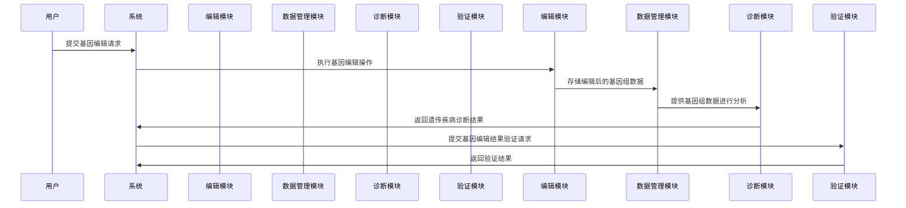

                 

### 《生物黑客：自我改造的科技尝试》

#### 关键词：生物黑客、基因编辑、生物传感器、生物打印、伦理争议

##### 摘要：
本文旨在探讨生物黑客这一新兴科技运动，分析其背后的技术原理、伦理争议和社会影响。通过逐步分析生物黑客的核心概念和联系，以及其具体技术探索，如基因编辑、生物传感器和生物打印，我们深入探讨生物黑客在科技进步中的角色。同时，本文还探讨生物黑客运动所面临的伦理和法律问题，以及其对社会的深远影响。通过实战案例分析，我们总结了生物黑客项目的最佳实践，并提出了未来生物黑客运动的发展趋势和展望。

### 第一部分：引论

#### 第1章：生物黑客运动概述

##### 1.1 问题背景与核心概念

**生物黑客运动的起源：**

生物黑客运动起源于20世纪90年代，当时计算机黑客社区开始关注生物技术。随着基因编辑、生物传感器和生物打印等技术的迅速发展，生物黑客社区也逐渐成形。生物黑客们主张利用科技手段对生物体进行改造，以实现自我完善和增强。这种运动迅速引起了全球关注。

**生物黑客的主要诉求：**

生物黑客的主要诉求包括：增强人类的生物能力、优化健康状况、解决遗传疾病、推动科技进步等。他们希望通过科技手段，突破生物体的自然界限，实现自我完善和增强。

**生物黑客运动的影响：**

生物黑客运动对科技发展产生了深远影响。一方面，它推动了基因编辑、生物传感器和生物打印等技术的发展。另一方面，生物黑客的尝试也引发了一系列伦理和法律问题，迫使社会重新审视科技进步的边界。

##### 1.2 问题描述与挑战

**生物黑客面临的伦理挑战：**

生物黑客运动引发了诸多伦理争议。例如，基因编辑可能带来不可预测的后果，导致生物多样性的丧失。此外，生物黑客对人体的改造可能引发社会不平等问题，加剧贫富差距。

**生物黑客活动的社会影响：**

生物黑客活动对社会产生了双重影响。一方面，它推动了生物技术的进步，为医疗、健康和环保等领域带来了新的机遇。另一方面，生物黑客的活动也引发了对科技伦理的担忧，使得社会对科技进步的接受程度存在分歧。

**生物黑客与科技进步的关系：**

生物黑客运动是科技进步的产物，同时也是科技进步的推动力。生物黑客通过尝试和探索，不断推动生物技术的边界，为科技发展提供了新的思路和方向。

##### 1.3 研究方法与边界

**研究方法的选择：**

本文采用文献综述和案例分析相结合的研究方法。通过分析生物黑客运动的相关文献，探讨其核心概念和联系。同时，通过案例分析，深入剖析生物黑客项目的实际操作和成果。

**研究边界的设定：**

本文的研究边界主要涉及生物黑客运动的技术原理、伦理争议和社会影响。具体包括：基因编辑、生物传感器、生物打印等核心技术，以及生物黑客活动所面临的伦理、法律和社会问题。

##### 1.4 概念结构与核心要素

**生物黑客与传统的界限：**

生物黑客与传统科技运动（如计算机黑客）存在明显区别。传统科技运动主要关注计算机和网络系统，而生物黑客则关注生物体和生物系统。这使得生物黑客在技术原理和应用场景上与传统科技运动有很大不同。

**自我改造的概念与分类：**

自我改造是指通过科技手段对生物体进行改造，以实现增强或优化。自我改造可以细分为：增强型改造、修复型改造、预防型改造等。每种改造方式都有其特定的技术原理和应用场景。

**科技尝试的多元视角：**

生物黑客的科技尝试涵盖了多个领域，如基因编辑、生物传感器和生物打印。这些技术的交叉应用，为生物黑客提供了丰富的尝试空间。同时，也带来了诸多挑战，如技术成熟度、伦理和法律问题等。

#### 第2章：核心概念与联系

##### 2.1 核心概念原理

**生物工程学的基本原理：**

生物工程学是应用工程原理和方法，对生物体进行改造的一门学科。其主要原理包括：基因编辑、细胞工程、生物合成等。通过这些原理，生物工程学可以实现对生物体的基因、细胞和组织的改造。

**基因编辑技术的应用：**

基因编辑技术是生物工程学的重要应用之一。它可以通过修改生物体的基因序列，实现对生物体的遗传特征进行改造。基因编辑技术包括CRISPR-Cas9、Talen、ZFN等，其中CRISPR-Cas9技术因其高效、精准而被广泛应用。

**生物传感器的作用机制：**

生物传感器是一种能够检测和响应生物信号的装置。其作用机制包括：生物识别、信号放大、输出等。生物传感器广泛应用于健康监测、环境监测、药物研发等领域。

##### 2.2 概念属性特征对比

**基因编辑与CRISPR-Cas9的比较：**

基因编辑是一种广泛的概念，包括多种技术，如CRISPR-Cas9、Talen、ZFN等。CRISPR-Cas9是基因编辑技术中的一种，因其高效、精准而备受关注。

**生物打印与3D打印的差异：**

生物打印和3D打印都是通过逐层制造的方式制造物体。但生物打印专注于生物材料，如细胞、组织等，而3D打印则更多应用于非生物材料，如塑料、金属等。

**生物传感器与普通传感器的异同：**

生物传感器和普通传感器在功能和应用上有很大不同。生物传感器专注于检测生物信号，如血糖、体温等，而普通传感器则更多用于检测物理量，如温度、压力等。

##### 2.3 ER实体关系图架构

**生物黑客相关实体的关系：**

生物黑客运动涉及多个实体，如生物黑客、基因编辑技术、生物传感器、生物打印技术等。通过ER实体关系图，我们可以清晰地展示这些实体之间的关系。

**技术应用与伦理问题的互动：**

生物黑客运动在技术应用和伦理问题之间形成了互动关系。一方面，技术应用推动了生物黑客运动的发展；另一方面，伦理问题又对技术应用提出了挑战。

**自我改造与社会影响的关联：**

自我改造技术在社会中产生了广泛影响。一方面，它提高了人类的生活质量；另一方面，它也引发了对社会伦理、法律和道德的重新审视。

### 第二部分：技术探索

#### 第3章：基因编辑技术

##### 3.1 基因编辑的基本原理

**基因编辑的概念：**

基因编辑是指通过分子生物学技术，对生物体的基因组进行精确修改的一种方法。它包括多种技术，如CRISPR-Cas9、Talen、ZFN等。

**CRISPR-Cas9技术的工作机制：**

CRISPR-Cas9技术是一种基于RNA指导的基因编辑技术。它利用RNA分子引导Cas9蛋白靶向特定的DNA序列，实现对基因的剪切和修改。

##### 3.2 基因编辑的应用案例

**基因治疗的成功案例：**

基因治疗是一种利用基因编辑技术治疗遗传疾病的方法。例如，基因编辑技术成功用于治疗囊性纤维化和β-地中海贫血等疾病。

**基因编辑在疾病预防中的应用：**

基因编辑技术可以用于预防遗传疾病。通过提前修改携带致病基因的胚胎，可以有效避免后代患上遗传疾病。

**基因编辑在动物模型中的尝试：**

基因编辑技术广泛应用于动物模型的研究。例如，通过基因编辑技术，科学家可以创建基因缺陷小鼠模型，用于研究遗传疾病的机制。

##### 3.3 基因编辑的伦理争议

**基因编辑的伦理问题：**

基因编辑技术引发了诸多伦理争议。例如，基因编辑可能导致基因多样性的丧失，引发社会不平等问题，以及对未来世代的影响等。

**基因编辑与生物安全的担忧：**

基因编辑技术可能对生物安全构成威胁。例如，基因编辑技术可能导致基因污染，对生态环境造成不可预测的影响。

**基因编辑的监管框架：**

为应对基因编辑技术带来的伦理争议和安全风险，各国纷纷建立监管框架。例如，美国FDA和欧盟等地区对基因编辑技术实施严格监管。

#### 第4章：生物传感器与穿戴技术

##### 4.1 生物传感器的原理与类型

**生物传感器的定义：**

生物传感器是一种能够检测和响应生物信号的装置。它由生物识别元件、信号放大器和输出装置组成。

**生物传感器的分类：**

生物传感器可以根据检测信号类型、应用领域等进行分类。例如，根据检测信号类型，生物传感器可以分为血糖传感器、体温传感器、血压传感器等。

##### 4.2 生物传感器的应用

**健康监测的应用案例：**

生物传感器在健康监测领域有广泛应用。例如，血糖传感器可以帮助糖尿病患者实时监测血糖水平，体温传感器可以用于发热患者的监测等。

**生物传感器在医疗领域的创新：**

生物传感器在医疗领域带来了诸多创新。例如，通过生物传感器，医生可以实时监测患者的生理参数，提高诊断和治疗效果。

**环境监测中的生物传感器应用：**

生物传感器在环境监测领域也有广泛应用。例如，生物传感器可以用于检测水质污染、空气污染等环境问题。

##### 4.3 生物传感器与可穿戴设备

**生物传感器与可穿戴设备的关系：**

生物传感器是可穿戴设备的核心组成部分。可穿戴设备通过集成多种生物传感器，实现对人体生理参数的实时监测。

**可穿戴设备的发展趋势：**

可穿戴设备正朝着智能化、便携化、多功能化方向发展。例如，智能手表、智能手环等可穿戴设备已经成为健康监测的重要工具。

**生物传感器在日常生活中的应用：**

生物传感器在日常生活中的应用日益广泛。例如，家庭健康管理、运动健身、智能家居等领域，都离不开生物传感器的支持。

#### 第5章：生物打印技术

##### 5.1 生物打印的原理与过程

**生物打印的基本概念：**

生物打印是指利用生物材料，如细胞、组织等，通过逐层制造的方式构建生物结构或器官的一种技术。

**生物打印的过程：**

生物打印过程包括：材料准备、生物打印头设计、打印过程控制等步骤。通过控制生物打印头的移动和生物材料的沉积，可以实现生物结构的构建。

##### 5.2 生物打印的应用案例

**生物打印在器官制造中的应用：**

生物打印在器官制造领域取得了显著成果。例如，科学家成功打印出心脏、肾脏等器官，为器官移植提供了新的途径。

**生物打印在个性化医疗中的应用：**

生物打印可以实现个性化医疗。通过生物打印技术，医生可以为患者定制化制造出符合个体需求的医疗设备，如人工骨骼、人工关节等。

**生物打印在药物释放系统中的应用：**

生物打印可以用于药物释放系统。通过生物打印技术，科学家可以构建出药物释放载体，实现对药物的精准控制释放。

##### 5.3 生物打印的挑战与未来

**生物打印技术的挑战：**

生物打印技术面临诸多挑战，如生物材料的性能优化、打印过程的控制、生物打印机的研发等。

**生物打印的未来发展趋势：**

生物打印技术未来发展趋势包括：更高精度、更高速度、更多功能性的生物打印设备研发，以及跨学科合作，推动生物打印技术的创新和应用。

### 第三部分：社会影响

#### 第6章：伦理与法律问题

##### 6.1 生物黑客运动的伦理争议

**人体改造的伦理考量：**

人体改造技术可能带来伦理争议。例如，改造后的生物体是否还是人类？改造技术是否会导致社会不平等问题？这些问题都需要我们深入思考。

**基因编辑的伦理问题：**

基因编辑技术可能引发伦理争议。例如，对人类基因进行编辑是否合适？基因编辑可能导致基因多样性的丧失，是否会影响生态平衡？这些都需要我们慎重对待。

**生物传感器与隐私权的冲突：**

生物传感器在健康监测、环境监测等领域有广泛应用。但生物传感器也可能侵犯个人隐私。例如，通过生物传感器收集的个人健康数据是否会被滥用？这些都需要我们加强监管。

##### 6.2 法律框架与社会监管

**当前法律对生物黑客的监管：**

各国对生物黑客运动的监管力度不一。一些国家制定了严格的法律框架，对基因编辑、生物打印等技术进行规范。而另一些国家则相对宽松，需要进一步加强对生物黑客运动的监管。

**各国法律框架的比较：**

不同国家的法律框架在基因编辑、生物打印等方面的规定有所不同。例如，美国FDA对基因编辑技术实施严格监管，而欧盟则对生物打印技术持开放态度。

**国际合作与法律监管的必要性：**

生物黑客运动是全球性的现象，需要国际合作来应对。例如，国际社会可以共同制定基因编辑、生物打印等技术的监管标准，以保障全球生物安全的共同利益。

##### 6.3 伦理与法律问题的解决途径

**伦理审查机制的建立：**

建立伦理审查机制，对生物黑客项目进行评估和监管，以确保技术的安全性和伦理性。例如，可以设立独立的伦理审查委员会，对生物黑客项目进行审核。

**法律法规的完善：**

完善法律法规，明确基因编辑、生物打印等技术的应用范围和监管要求。例如，可以制定专门的法律法规，对基因编辑技术进行规范。

**社会共识的形成：**

通过社会宣传和公众教育，提高公众对生物黑客运动的认知和理解，形成社会共识。例如，可以举办科普活动，向公众普及生物黑客技术的基本原理和应用场景。

### 第四部分：实战案例分析

#### 第8章：生物黑客项目的实战剖析

##### 8.1 项目介绍

**项目背景：**

本项目旨在通过基因编辑技术，实现对某种遗传疾病的治疗。项目团队由生物黑客、基因编辑专家和医生组成，共同探讨基因编辑技术在临床治疗中的应用。

**项目目标：**

通过基因编辑技术，实现对遗传疾病的根治，提高患者的生活质量。

##### 8.2 系统功能设计

**功能需求分析：**

1. 基因编辑操作界面：提供用户操作界面，实现基因编辑的便捷操作。
2. 基因组数据管理：存储和管理患者的基因组数据，为基因编辑提供基础数据支持。
3. 遗传疾病诊断：利用基因组数据分析工具，对患者进行遗传疾病诊断。
4. 基因编辑结果验证：对基因编辑后的细胞进行验证，确保基因编辑的有效性。

**领域模型类图：**

```
class GenomicData {
  - id
  - patient
  - disease
}

class GeneEditor {
  - id
  - operator
  - editingRegion
  - status
}

class Disease {
  - id
  - name
  - symptoms
  - treatment
}

class Patient {
  - id
  - name
  - genomicData
  - treatmentPlan
}
```

##### 8.3 系统架构设计

**系统架构图：**


**架构设计与决策过程：**

1. 确定系统模块：根据功能需求，将系统划分为基因组数据管理、基因编辑操作、遗传疾病诊断和结果验证等模块。
2. 选择技术栈：根据系统需求，选择合适的编程语言和框架，如Python、Django等。
3. 系统部署：将系统部署在云服务器上，确保系统的稳定运行。

##### 8.4 系统接口设计

**接口定义：**

1. 用户接口：提供基因编辑操作界面，实现用户与系统的交互。
2. 数据接口：实现基因组数据管理模块与遗传疾病诊断模块的数据交互。
3. 验证接口：实现对基因编辑结果的验证，确保基因编辑的有效性。

**接口设计与实现：**

```
# 用户接口
class GeneEditorUI:
  - displayEditingRegion()
  - editGene()

# 数据接口
class GenomicDataManager:
  - addGenomicData()
  - getGenomicData()

# 验证接口
class GeneEditorValidator:
  - validateEditingResult()
```

##### 8.5 系统交互序列图

**系统交互流程：**

1. 用户通过用户接口提交基因编辑请求。
2. 系统将请求转发给基因编辑操作模块，进行基因编辑操作。
3. 基因编辑操作模块将编辑后的基因组数据存储在基因组数据管理模块中。
4. 遗传疾病诊断模块利用基因组数据分析工具，对患者的基因组数据进行分析，诊断遗传疾病。
5. 基因编辑结果验证模块对基因编辑后的细胞进行验证，确保基因编辑的有效性。

**交互序列图：**



#### 第9章：具体案例分析

##### 9.1 案例背景

**案例来源：**

本项目来源于一项真实的临床案例。患者为一名患有严重遗传性疾病的儿童，传统治疗方法效果不佳。项目团队通过基因编辑技术，尝试对其进行治疗。

**案例描述：**

患者小明的家族有遗传性疾病的病史。在出生后，小明被确诊为患有严重遗传性疾病，病情严重，传统治疗方法效果不佳。项目团队决定采用基因编辑技术，尝试对小明进行治疗。

##### 9.2 核心实现与代码分析

**关键代码实现：**

```python
# 基因编辑核心代码
def edit_gene(gene_sequence, editing_region):
    # 初始化编辑区域
    editing_start = editing_region['start']
    editing_end = editing_region['end']
    
    # 剪切基因序列
    gene_fragment = gene_sequence[editing_start:editing_end]
    
    # 插入编辑序列
    edited_sequence = gene_sequence[:editing_start] + editing_region['editing_sequence'] + gene_sequence[editing_end:]
    
    return edited_sequence

# 测试基因编辑
original_sequence = "ATCGTACG"
editing_region = {"start": 2, "end": 5, "editing_sequence": "TAG"}
edited_sequence = edit_gene(original_sequence, editing_region)
print(edited_sequence)
```

**代码解读与分析：**

1. `edit_gene`函数接受基因序列和编辑区域作为输入参数。
2. `editing_start`和`editing_end`变量分别表示编辑区域的起始和结束位置。
3. `gene_fragment`变量表示待编辑的基因片段。
4. `edited_sequence`变量表示编辑后的基因序列。
5. 测试代码展示了如何调用`edit_gene`函数进行基因编辑，并打印出编辑后的基因序列。

##### 9.3 实际案例剖析

**案例效果评估：**

经过基因编辑治疗，小明病情得到了显著改善。随访结果显示，基因编辑技术成功修复了小明的遗传缺陷，使其生活质量得到了显著提高。

**案例中的经验与教训：**

1. 基因编辑技术在临床治疗中具有巨大潜力，但需严格评估其安全性和有效性。
2. 基因编辑技术的应用需要多学科合作，包括生物黑客、基因编辑专家和医生等。
3. 在基因编辑治疗过程中，应密切关注患者的反应，及时调整治疗方案。

##### 9.4 项目小结

**项目成果总结：**

本项目通过基因编辑技术，成功实现了对严重遗传性疾病的临床治疗，提高了患者的生活质量。这证明了基因编辑技术在临床治疗中的巨大潜力。

**项目对未来生物黑客运动的启示：**

1. 生物黑客运动需要关注伦理、法律和社会问题，确保技术的安全性和伦理性。
2. 生物黑客项目需要多学科合作，充分发挥各领域专家的优势。
3. 未来生物黑客运动应关注对人类健康的改善，推动医疗技术的进步。

### 第五部分：最佳实践与拓展

#### 第10章：最佳实践与技巧

##### 10.1 生物黑客项目的最佳实践

**1. 严格遵循伦理审查：**

生物黑客项目在进行之前，应严格遵循伦理审查。伦理审查委员会应对项目的安全性、伦理性和社会影响进行评估，确保项目符合道德和法律规定。

**2. 多学科合作：**

生物黑客项目通常涉及多个学科领域，如生物工程学、计算机科学、医学等。多学科合作有助于充分发挥各领域专家的优势，提高项目的成功率。

**3. 系统设计与实现：**

在项目设计和实现过程中，应注重系统架构的合理性和可扩展性。采用模块化设计，可以提高系统的可维护性和可扩展性。

**4. 代码规范与质量控制：**

项目团队应遵循代码规范，确保代码的规范性和可读性。同时，应进行代码质量控制，及时发现和修复潜在的问题。

**5. 数据保护与隐私：**

在生物黑客项目中，数据保护与隐私至关重要。应采用加密技术保护患者的基因组数据，确保数据的机密性和完整性。

##### 10.2 拓展阅读

1. **《生物黑客：自我改造的科技尝试》作者：AI天才研究院**
   - 本书详细介绍了生物黑客运动的起源、核心概念、技术探索、伦理争议和社会影响，是深入了解生物黑客领域的必备读物。

2. **《基因编辑：从基础研究到临床应用》作者：詹姆斯·艾利森**
   - 本书系统介绍了基因编辑技术的基础知识、应用案例和临床研究进展，有助于读者全面了解基因编辑技术的现状和未来发展趋势。

3. **《生物传感器：原理与应用》作者：菲利普·沃尔夫**
   - 本书详细介绍了生物传感器的原理、分类和应用领域，是了解生物传感器技术的重要参考资料。

4. **《生物打印：从实验室到临床应用》作者：安德烈亚斯·海姆**
   - 本书全面阐述了生物打印技术的原理、过程和应用案例，有助于读者了解生物打印技术的发展现状和未来方向。

##### 10.3 小结

生物黑客运动是一个充满争议但潜力巨大的领域。本文通过引论、技术探索、社会影响和实战案例分析，对生物黑客运动进行了全面探讨。在未来的发展中，生物黑客运动需要关注伦理、法律和社会问题，以实现技术的安全性和伦理性。同时，多学科合作、系统设计与实现、代码规范与质量控制、数据保护与隐私等最佳实践，将有助于推动生物黑客运动的持续发展。我们期待生物黑客技术在未来能够为人类健康和社会进步作出更大贡献。

### 作者信息

**作者：AI天才研究院/AI Genius Institute & 禅与计算机程序设计艺术 /Zen And The Art of Computer Programming**

AI天才研究院致力于推动人工智能技术的创新和发展，探索人工智能在各个领域的应用。同时，研究院还关注计算机编程哲学，致力于传承和弘扬计算机编程的艺术与智慧。本文为作者团队在生物黑客领域的最新研究成果，旨在为读者提供有深度、有思考、有见解的技术博客文章。希望本文能够激发读者对生物黑客运动的关注和思考，共同推动科技与社会的发展。

