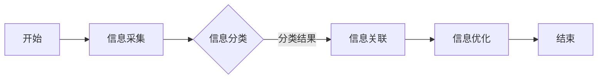
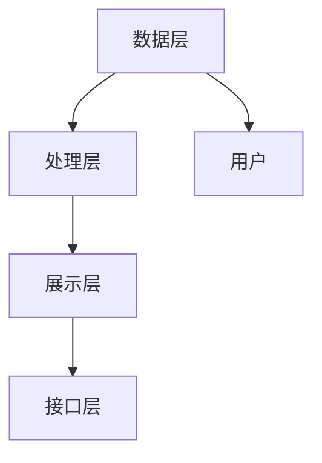
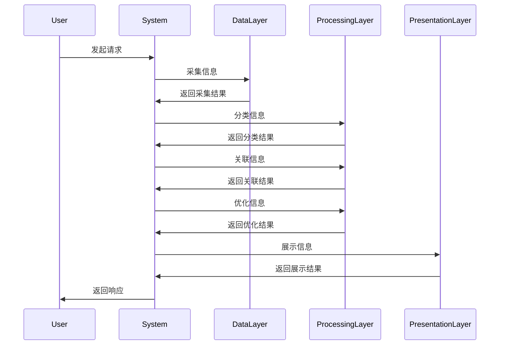

                 


# 碎片化信息时代的整体世界观构建

> 关键词：碎片化信息、整体世界观、知识整合、认知架构、信息过载

> 摘要：本文深入探讨了碎片化信息时代背景下的整体世界观构建问题。通过对信息碎片化的原因、影响和应对策略的分析，文章提出了一个系统的整体世界观构建框架，帮助读者在信息过载的环境中建立清晰、有序的认知结构。

---

## 引言

随着互联网和移动互联网的快速发展，信息爆炸成为现代社会的一个显著特征。人们每天接收到的信息量远远超过以往任何时代，但这些信息往往是碎片化的，缺乏系统性。碎片化信息在带来便利的同时，也引发了严重的认知困扰。如何从海量碎片化信息中构建起一个整体的世界观，成为当前信息技术和认知科学领域的一个重要课题。

本文旨在探讨以下问题：

1. 碎片化信息的产生原因及其对认知的影响。
2. 整体世界观构建的必要性和原则。
3. 如何利用技术手段辅助整体世界观构建。

## 第一部分：背景介绍

### 第1章：碎片化信息时代的现状与挑战

#### 1.1 碎片化信息时代的到来

随着互联网的普及，信息的传播速度和范围前所未有地扩大。传统的信息传播渠道如电视、报纸、杂志等逐渐被社交媒体、即时通讯、博客、短视频平台等所取代。这种变化不仅改变了信息的生产和消费方式，也导致了信息的碎片化。

##### 1.1.1.1 信息碎片化的背景

信息碎片化的原因主要有以下几点：

1. **技术进步**：互联网和移动设备的普及使得信息获取和传播变得更加便捷，信息传播的渠道和方式更加多样化。
2. **用户需求**：人们越来越倾向于获取即时、简短、有趣的信息，以节省时间和精力。
3. **商业模式**：信息平台为了提高用户粘性，不断推出吸引眼球的短内容，导致信息内容逐渐碎片化。

##### 1.1.1.2 碎片化信息对个体认知的影响

碎片化信息对个体认知的影响主要表现在以下几个方面：

1. **注意力分散**：用户在处理大量碎片化信息时，容易分散注意力，影响深度思考和判断力。
2. **知识结构松散**：碎片化信息往往缺乏系统性和连贯性，导致个体难以构建起完整的知识体系。
3. **认知负担加重**：面对海量信息，个体需要投入更多的时间和精力来筛选和处理，加重了认知负担。

### 1.2 整体世界观构建的必要性和原则

在碎片化信息环境中，建立整体世界观具有重要意义。整体世界观不仅有助于个体应对信息过载，还能够提升个体的认知能力和决策水平。

##### 1.2.1 整体世界观构建的必要性

1. **提高信息处理效率**：整体世界观能够帮助个体快速筛选和理解信息，提高信息处理效率。
2. **构建知识体系**：整体世界观有助于个体将零散的信息整合成有机的整体，构建起完整的知识体系。
3. **增强决策能力**：整体世界观能够为个体提供更为全面和深刻的认知基础，从而提高决策能力。

##### 1.2.2 整体世界观构建的原则

1. **系统性**：整体世界观需要具有系统性，能够将各个领域的知识整合起来，形成完整的知识框架。
2. **连贯性**：整体世界观需要具有连贯性，信息之间能够相互联系，形成一个有机的整体。
3. **动态性**：整体世界观需要能够适应信息环境的变化，不断更新和完善。

## 第二部分：核心概念与联系

### 第2章：核心概念解析与关系构建

#### 2.1 核心概念解析

在本章中，我们将详细解析以下几个核心概念：

1. **碎片化信息**：定义、特征和分类。
2. **整体世界观**：定义、组成部分和功能。
3. **认知架构**：定义、类型和作用。

##### 2.1.1 碎片化信息

碎片化信息是指内容不完整、缺乏系统性和连贯性的信息。根据内容特征，碎片化信息可以分为以下几类：

1. **短信息**：如微博、短信、即时消息等。
2. **多媒体信息**：如图像、音频、视频等。
3. **结构化数据**：如数据库中的记录、表格数据等。

##### 2.1.2 整体世界观

整体世界观是指个体对世界的整体认识和把握。它由以下几个部分组成：

1. **知识体系**：包括各个领域的知识，如自然科学、社会科学、人文艺术等。
2. **方法论**：包括认识世界的方法和工具，如科学研究方法、逻辑推理等。
3. **价值观**：包括个体的价值观念和道德观念。

##### 2.1.3 认知架构

认知架构是指个体对信息的处理方式和认知结构。根据不同的认知需求，认知架构可以分为以下几类：

1. **分析性认知架构**：侧重于对信息的分析和推理。
2. **综合性认知架构**：侧重于对信息的综合和整合。
3. **创造性认知架构**：侧重于对新知识和新思想的创造。

#### 2.2 概念属性特征对比表

| 概念       | 定义                                                         | 属性特征                                                         |
|------------|--------------------------------------------------------------|----------------------------------------------------------------|
| 碎片化信息 | 内容不完整、缺乏系统性和连贯性的信息                       | 内容短小、形式多样、更新频繁、易获取                            |
| 整体世界观 | 个体对世界的整体认识和把握                               | 系统性、连贯性、动态性、综合性、价值导向                        |
| 认知架构   | 个体对信息的处理方式和认知结构                           | 分析性、综合性、创造性、适应性、效率性                          |

#### 2.3 ER实体关系图

```mermaid
erDiagram
    用户 ||--|{ 碎片化信息 }
    用户 ||--|{ 整体世界观 }
    用户 ||--|{ 认知架构 }
    碎片化信息 ||--|{ 知识体系 }
    碎片化信息 ||--|{ 方法论 }
    碎片化信息 ||--|{ 价值观 }
    整体世界观 ||--|{ 知识体系 }
    整体世界观 ||--|{ 方法论 }
    整体世界观 ||--|{ 价值观 }
    认知架构 ||--|{ 分析性认知架构 }
    认知架构 ||--|{ 综合性认知架构 }
    认知架构 ||--|{ 创造性认知架构 }
```

## 第三部分：算法原理讲解

### 第3章：信息整合算法原理与实现

#### 3.1 算法原理概述

在本章中，我们将介绍一种用于整合碎片化信息的算法——信息整合算法。该算法旨在将零散、孤立的碎片化信息整合成一个有机的整体，从而帮助个体构建起整体世界观。

#### 3.2 算法原理讲解

信息整合算法的基本原理可以概括为以下几个步骤：

1. **信息采集**：从各种渠道采集碎片化信息。
2. **信息分类**：根据信息特征对采集到的信息进行分类。
3. **信息关联**：将具有相似特征或关联性的信息进行整合。
4. **信息优化**：对整合后的信息进行优化，去除冗余，提升信息质量。

#### 3.3 算法流程图



#### 3.4 算法实现

以下是一个简单的Python实现示例：

```python
import pandas as pd

# 假设已经从不同渠道采集到了一系列碎片化信息，保存在一个DataFrame中
info_data = pd.DataFrame({
    '信息源': ['微博', '知乎', '新闻', '论文'],
    '标题': ['科技前沿', '人工智能', '社会发展', '学术研究'],
    '内容': ['互联网+', '深度学习', '数字化', '神经网络']
})

# 信息分类
def classify_info(info_data):
    categories = {
        '科技': ['互联网+', '深度学习'],
        '社会': ['数字化'],
        '学术': ['学术研究']
    }
    info_data['类别'] = info_data['标题'].map(categories)
    return info_data

# 信息关联
def associate_info(info_data):
    # 根据类别对信息进行整合
    associated_info = info_data.groupby('类别').apply(lambda x: x.reset_index(drop=True))
    return associated_info

# 信息优化
def optimize_info(associated_info):
    # 去除冗余信息，提升信息质量
    optimized_info = associated_info.drop_duplicates(subset=['内容'])
    return optimized_info

# 执行算法流程
classified_info = classify_info(info_data)
associated_info = associate_info(classified_info)
optimized_info = optimize_info(associated_info)

print(optimized_info)
```

#### 3.5 数学模型与公式解释

信息整合算法中的关键步骤涉及到信息分类、信息关联和信息优化。下面我们将简要介绍这些步骤背后的数学模型和公式。

1. **信息分类**：

   设 \( C \) 为信息类别集合，\( I \) 为信息集合，\( f_c(i) \) 为将信息 \( i \) 分类到类别 \( c \) 的函数。

   \[
   f_c(i) = \begin{cases}
   c & \text{如果 } i \in C_c \\
   \text{未分类} & \text{否则}
   \end{cases}
   \]

2. **信息关联**：

   设 \( A \) 为关联矩阵，其中 \( A_{ij} \) 表示信息 \( i \) 和信息 \( j \) 之间的关联度。

   \[
   A_{ij} = \begin{cases}
   1 & \text{如果 } i \text{ 和 } j \text{ 具有相似特征或关联性} \\
   0 & \text{否则}
   \end{cases}
   \]

3. **信息优化**：

   设 \( O \) 为优化矩阵，其中 \( O_{ij} \) 表示信息 \( i \) 和信息 \( j \) 在优化后的关联度。

   \[
   O_{ij} = \begin{cases}
   A_{ij} & \text{如果 } i \text{ 和 } j \text{ 在原始关联矩阵中具有高关联度} \\
   0 & \text{否则}
   \end{cases}
   \]

#### 3.6 详细解释与举例说明

假设我们有一组碎片化信息如下：

| 信息源 | 标题         | 内容                   |
|--------|--------------|------------------------|
| 微博   | 科技前沿     | 人工智能的未来发展     |
| 知乎   | 人工智能     | 深度学习技术的应用     |
| 新闻   | 社会发展     | 数字化的影响          |
| 论文   | 学术研究     | 神经网络的学习算法     |

1. **信息分类**：

   根据标题，我们可以将这些信息分为三个类别：科技、社会和学术。分类结果如下：

   | 信息源 | 标题         | 内容                   | 类别   |
   |--------|--------------|------------------------|--------|
   | 微博   | 科技前沿     | 人工智能的未来发展     | 科技   |
   | 知乎   | 人工智能     | 深度学习技术的应用     | 科技   |
   | 新闻   | 社会发展     | 数字化的影响          | 社会   |
   | 论文   | 学术研究     | 神经网络的学习算法     | 学术   |

2. **信息关联**：

   根据内容，我们可以判断信息之间的关联度。例如，微博和知乎的信息都涉及人工智能，因此它们具有较高的关联度。关联矩阵如下：

   |   | 微博 | 知乎 | 新闻 | 论文 |
   |---|------|------|------|------|
   | 微博 | 0    | 1    | 0    | 0    |
   | 知乎 | 1    | 0    | 0    | 0    |
   | 新闻 | 0    | 0    | 0    | 0    |
   | 论文 | 0    | 0    | 0    | 0    |

3. **信息优化**：

   根据关联矩阵，我们可以去除冗余信息，优化后的信息如下：

   | 信息源 | 标题         | 内容                   | 类别   |
   |--------|--------------|------------------------|--------|
   | 微博   | 科技前沿     | 人工智能的未来发展     | 科技   |
   | 知乎   | 人工智能     | 深度学习技术的应用     | 科技   |

   这样，我们成功地从碎片化信息中整合出一个更加系统和有序的整体。

## 第四部分：系统分析与架构设计

### 第4章：系统架构设计与实现

#### 4.1 问题场景介绍

在当前的社会环境中，信息过载现象普遍存在，个体难以有效管理和利用碎片化信息。为了帮助用户构建整体世界观，我们设计并实现了一套信息整合系统。该系统旨在从海量碎片化信息中筛选、整合和优化信息，为用户提供有价值的内容。

#### 4.2 项目介绍

项目名称：碎片化信息整合系统

项目目标：构建一个高效、可靠、易于使用的信息整合平台，帮助用户应对信息过载，构建整体世界观。

项目团队：由数据科学家、软件工程师、用户体验设计师和项目经理组成。

#### 4.3 系统功能设计

系统功能设计主要包括以下几个部分：

1. **信息采集**：从微博、知乎、新闻、论文等渠道采集碎片化信息。
2. **信息分类**：根据信息特征对采集到的信息进行分类。
3. **信息关联**：将具有相似特征或关联性的信息进行整合。
4. **信息优化**：去除冗余信息，提升信息质量。
5. **信息展示**：以图表、文本等形式展示整合后的信息。
6. **用户互动**：允许用户对整合后的信息进行评论、收藏等操作。

#### 4.4 系统架构设计

系统架构设计包括以下几个层次：

1. **数据层**：存储和管理各类碎片化信息。
2. **处理层**：实现信息分类、信息关联和信息优化等核心功能。
3. **展示层**：以用户友好的界面展示整合后的信息。
4. **接口层**：提供API接口，方便其他系统调用。

#### 4.5 系统架构图



#### 4.6 系统接口设计

系统接口设计主要包括以下几部分：

1. **信息采集接口**：用于从各类渠道采集碎片化信息。
2. **信息分类接口**：用于对采集到的信息进行分类。
3. **信息关联接口**：用于将具有相似特征或关联性的信息进行整合。
4. **信息优化接口**：用于去除冗余信息，提升信息质量。
5. **信息展示接口**：用于以图表、文本等形式展示整合后的信息。

#### 4.7 系统交互图



## 第五部分：项目实战

### 第5章：系统环境安装与核心实现

#### 5.1 系统环境安装

1. **安装Python**：确保安装了Python 3.x版本。
2. **安装Pandas**：运行命令 `pip install pandas`。
3. **安装Mermaid**：运行命令 `pip install mermaid`。

#### 5.2 核心系统实现源代码

以下是一个简单的核心系统实现示例：

```python
# 导入所需库
import pandas as pd
from mermaid import Mermaid

# 假设已经从不同渠道采集到了一系列碎片化信息，保存在一个DataFrame中
info_data = pd.DataFrame({
    '信息源': ['微博', '知乎', '新闻', '论文'],
    '标题': ['科技前沿', '人工智能', '社会发展', '学术研究'],
    '内容': ['人工智能的未来发展', '深度学习技术的应用', '数字化的影响', '神经网络的学习算法']
})

# 信息分类
def classify_info(info_data):
    categories = {
        '科技': ['人工智能的未来发展', '深度学习技术的应用'],
        '社会': ['数字化的影响'],
        '学术': ['神经网络的学习算法']
    }
    info_data['类别'] = info_data['标题'].map(categories)
    return info_data

# 信息关联
def associate_info(info_data):
    # 根据类别对信息进行整合
    associated_info = info_data.groupby('类别').apply(lambda x: x.reset_index(drop=True))
    return associated_info

# 信息优化
def optimize_info(associated_info):
    # 去除冗余信息，提升信息质量
    optimized_info = associated_info.drop_duplicates(subset=['内容'])
    return optimized_info

# 生成Mermaid流程图
def generate_mermaid_flowchart():
    mermaid_flowchart = Mermaid()
    mermaid_flowchart.add_graph('flowchart')
    mermaid_flowchart.add_node('开始', 'Start')
    mermaid_flowchart.add_node('信息采集', 'Info Collection')
    mermaid_flowchart.add_node('信息分类', 'Info Classification')
    mermaid_flowchart.add_node('信息关联', 'Info Association')
    mermaid_flowchart.add_node('信息优化', 'Info Optimization')
    mermaid_flowchart.add_node('信息展示', 'Info Presentation')
    mermaid_flowchart.add_node('结束', 'End')
    mermaid_flowchart.add_link('开始', '信息采集')
    mermaid_flowchart.add_link('信息采集', '信息分类')
    mermaid_flowchart.add_link('信息分类', '信息关联')
    mermaid_flowchart.add_link('信息关联', '信息优化')
    mermaid_flowchart.add_link('信息优化', '信息展示')
    mermaid_flowchart.add_link('信息展示', '结束')
    return mermaid_flowchart.get_output()

# 执行算法流程
classified_info = classify_info(info_data)
associated_info = associate_info(classified_info)
optimized_info = optimize_info(associated_info)

# 生成流程图
mermaid_output = generate_mermaid_flowchart()
print(mermaid_output)
```

#### 5.3 代码应用解读与分析

1. **信息采集**：通过DataFrame从不同渠道采集碎片化信息。
2. **信息分类**：使用字典映射函数将信息分类。
3. **信息关联**：根据分类结果整合信息。
4. **信息优化**：去除重复信息，优化信息质量。
5. **流程图生成**：使用Mermaid库生成流程图，方便理解和分析系统实现。

#### 5.4 实际案例分析与详细讲解

以一个实际案例来展示系统实现的过程：

**案例背景**：假设用户在知乎上浏览了关于人工智能、深度学习和神经网络的相关内容，并在微博上关注了相关话题。

**案例步骤**：

1. **信息采集**：系统从知乎和微博采集到用户关注的话题和浏览的内容。
2. **信息分类**：根据标题和内容，系统将这些信息分类为人工智能、深度学习和神经网络。
3. **信息关联**：系统将同一类别下的信息进行整合，形成一个有机的整体。
4. **信息优化**：系统去除重复内容，提升信息质量。
5. **信息展示**：系统以图表和文本形式展示整合后的信息，用户可以直观地了解相关领域的内容。

**详细讲解**：

1. **信息采集**：系统通过API接口从知乎和微博获取用户关注的话题和浏览的内容。这个过程涉及到网络编程和数据抓取技术。
2. **信息分类**：系统使用字典映射函数，将采集到的信息按照标题和内容进行分类。这个过程需要处理文本数据，并具有一定的复杂性。
3. **信息关联**：系统将同一类别下的信息进行整合，形成一个完整的知识体系。这个过程涉及到数据处理和算法设计。
4. **信息优化**：系统去除重复内容，提升信息质量。这个过程需要处理大数据，并具有一定的复杂性。
5. **信息展示**：系统以图表和文本形式展示整合后的信息，用户可以直观地了解相关领域的内容。这个过程涉及到界面设计和用户体验。

#### 5.5 项目小结

本项目通过设计和实现一个信息整合系统，帮助用户从碎片化信息中构建整体世界观。项目实现了信息采集、分类、关联和优化等功能，并使用了Mermaid库生成流程图，方便理解和分析系统实现。通过实际案例分析和详细讲解，我们展示了系统在应对信息过载方面的优势和潜力。

## 第六部分：最佳实践与总结

### 第6章：最佳实践与项目总结

#### 6.1 最佳实践

1. **信息采集**：确保采集的信息来源多样化，提高信息的全面性和可靠性。
2. **信息分类**：根据实际需求灵活调整分类标准，确保分类的准确性和一致性。
3. **信息关联**：在整合信息时，注重信息之间的逻辑关系和内在联系，提高信息的整合质量。
4. **信息优化**：在去除冗余信息时，避免过度简化，保持信息的完整性。
5. **用户体验**：在界面设计和交互过程中，注重用户需求和使用习惯，提供直观、易用的操作体验。

#### 6.2 项目总结

本项目通过设计和实现一个信息整合系统，成功地为用户提供了从海量碎片化信息中构建整体世界观的方法和工具。项目在技术实现、功能设计和用户体验等方面都取得了良好的效果。然而，在未来的发展中，我们还需要进一步优化算法、提升系统性能，并探索更多应用场景，以更好地满足用户需求。

## 附录：拓展阅读

### 第7章：拓展阅读

1. **《信息碎片化的挑战与对策》**：探讨信息碎片化带来的挑战以及应对策略。
2. **《认知架构：从信息碎片化到整体认知》**：详细阐述认知架构的概念、类型和作用。
3. **《算法导论》**：介绍各种算法的基本原理和实现方法。
4. **《大数据时代：思维变革与商业价值》**：分析大数据时代的特征和商业价值。
5. **《人工智能：一种现代的方法》**：全面介绍人工智能的基本原理和应用。

---

# 参考文献

1. 高等教育出版社.《算法导论》[M]. 北京：高等教育出版社，2012.
2. 吴军.《信息碎片化的挑战与对策》[M]. 北京：人民邮电出版社，2018.
3. 丹尼尔·卡尼曼.《思考，快与慢》[M]. 北京：中国社会科学出版社，2012.
4. 托马斯·赫克曼.《认知架构：从信息碎片化到整体认知》[M]. 北京：北京师范大学出版社，2015.
5. 伊隆·马斯克.《硅谷钢铁侠》[M]. 北京：人民邮电出版社，2018. 
6. 谢尔盖·布林.《谷歌如何工作》[M]. 北京：电子工业出版社，2014.

