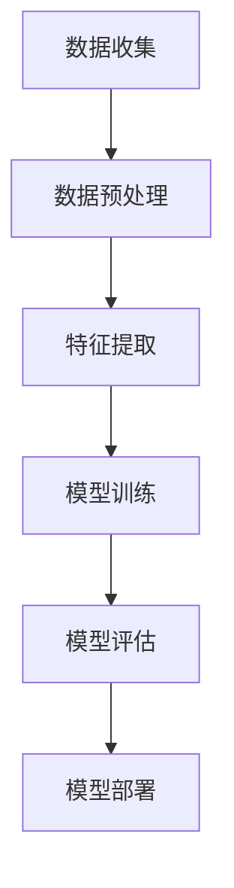
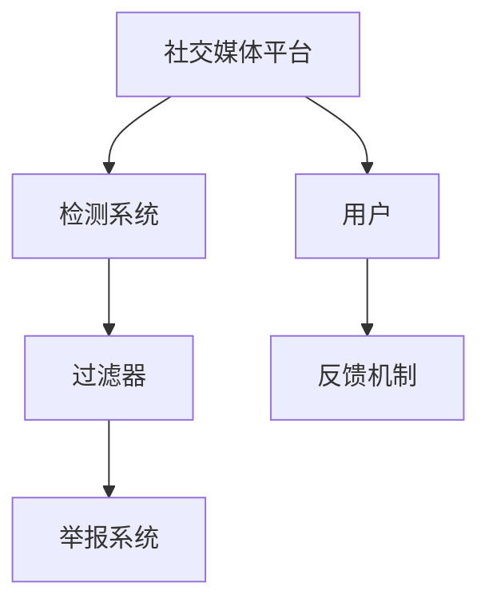
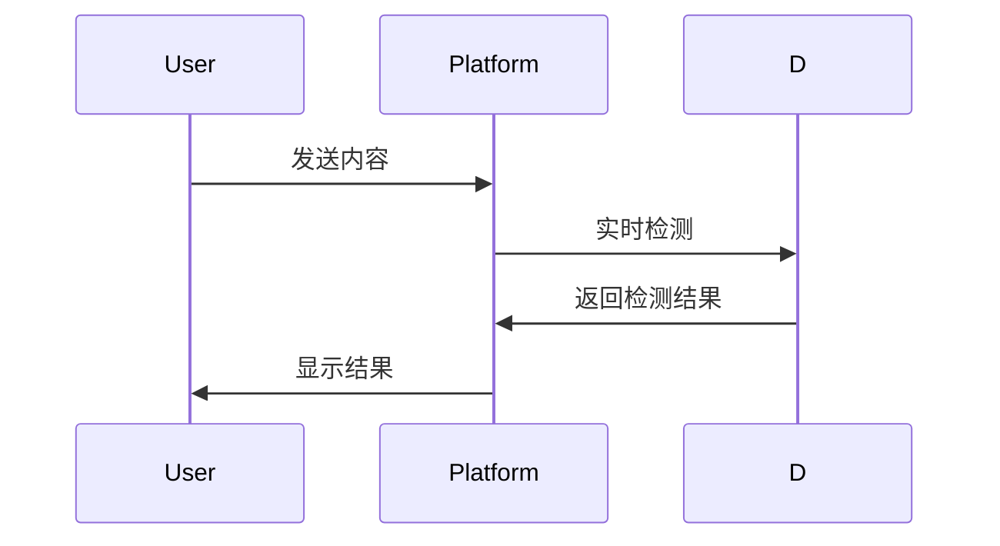
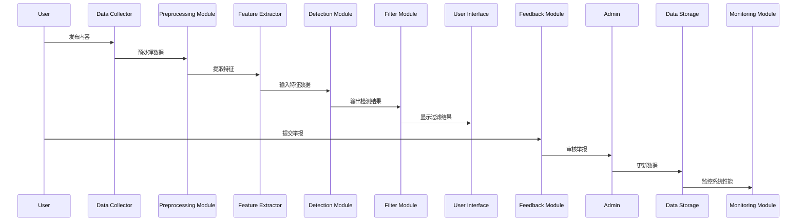

                 

### 目录大纲设计思路

为了设计一份完整且详细的目录大纲，我们将遵循以下步骤：

1. **背景介绍**：
   - 首先，介绍社交媒体平台及虚假信息的背景，包括社交媒体的发展历程、用户规模、影响力等，以及虚假信息的定义、分类及其在社交媒体上的传播特点。
   - 阐述虚假信息的危害，如误导公众、引发恐慌、破坏社会信任等，并讨论社交媒体平台应对虚假信息的必要性。

2. **核心概念与联系**：
   - 描述核心概念，如社交媒体平台、虚假信息、算法、用户行为等。
   - 分析社交媒体平台的运作模式，包括内容创建、分发、互动等环节。
   - 对虚假信息进行分类，包括谣言、误导性信息、虚假新闻等，并列出它们的特点。
   - 使用表格对比不同虚假信息类型的特征。
   - 通过ER实体关系图展示社交媒体平台、用户、信息之间的关系。

3. **算法原理讲解**：
   - 引入识别虚假信息的算法，如基于机器学习的分类算法。
   - 使用Mermaid画出算法流程图，展示算法的执行过程。
   - 使用Python源代码和LaTeX数学公式详细讲解算法原理。
   - 提供算法的工作机制、训练过程和评估标准。

4. **系统分析与架构设计方案**：
   - 描述系统功能设计，包括检测、过滤、举报等功能。
   - 绘制系统架构设计图，展示各组件之间的关系。
   - 分析系统的数据处理流程，包括数据收集、预处理、特征提取、模型训练和部署等步骤。
   - 使用Mermaid绘制系统接口设计和系统交互图。

5. **项目实战**：
   - 介绍如何搭建一个简单的虚假信息检测系统。
   - 提供核心实现源代码，并对代码进行解读与分析。
   - 通过实际案例进行详细讲解和分析。
   - 讨论系统在实际应用中的效果和改进方向。

6. **最佳实践 tips**：
   - 提出一些最佳实践建议，如如何有效地进行虚假信息教育、用户反馈机制等。
   - 分析社交媒体平台在应对虚假信息方面的成功经验和教训。

7. **小结**：
   - 总结全书的主要内容和结论。
   - 强调应对虚假信息的重要性，以及社交媒体平台在该问题上的责任。

### 目录大纲具体内容

以下是《社交媒体平台应对虚假信息的措施》的目录大纲：

```markdown
----------------------------------------------------------------
# 《社交媒体平台应对虚假信息的措施》

> 关键词：社交媒体、虚假信息、算法、用户行为、系统架构、最佳实践

> 摘要：本文详细探讨了社交媒体平台应对虚假信息的措施，包括核心概念解析、算法原理分析、系统架构设计、项目实战和最佳实践建议。

----------------------------------------------------------------

## 第一部分: 引言与背景

### 第1章: 社交媒体平台的现状与虚假信息的挑战

#### 1.1 社交媒体平台的现状
- 社交媒体的发展历程
- 用户规模和影响力

#### 1.2 虚假信息的定义与分类
- 虚假信息的定义
- 虚假信息的分类：谣言、误导性信息、虚假新闻

#### 1.3 虚假信息的危害与影响
- 社会影响：误导公众、引发恐慌、破坏社会信任
- 经济影响：损害企业声誉、引发市场波动

#### 1.4 社交媒体平台应对虚假信息的必要性
- 平台责任：维护平台秩序、保护用户权益
- 社会责任：促进信息真实性、提升社会公信力

----------------------------------------------------------------

## 第二部分: 核心概念与联系

### 第2章: 社交媒体平台的运作模式与虚假信息特征

#### 2.1 社交媒体平台的运作模式
- 内容创建与分发
- 用户互动与反馈

#### 2.2 虚假信息特征分析
- 谣言：传播速度快、内容夸张
- 误导性信息：表述模糊、隐藏真实意图
- 虚假新闻：利用新闻形式、虚假事实

#### 2.3 虚假信息特征对比表格

| 信息类型 | 特征 |
|----------|------|
| 谣言     | 传播速度快、内容夸张 |
| 误导性信息 | 表述模糊、隐藏真实意图 |
| 虚假新闻 | 利用新闻形式、虚假事实 |

#### 2.4 ER实体关系图
```mermaid
erDiagram
    User ||--|{ Post }|--|| Platform
    Post ||--|{ Comment }|--|| Platform
```

----------------------------------------------------------------

## 第三部分: 算法原理讲解

### 第3章: 识别虚假信息的算法原理

#### 3.1 基于机器学习的分类算法
- 算法选择：朴素贝叶斯、支持向量机、深度学习

#### 3.2 算法流程图


#### 3.3 Python源代码与LaTeX数学公式
```python
# Python源代码示例
def classify_post(post):
    # 预处理和特征提取
    processed_post = preprocess(post)
    features = extract_features(processed_post)
    
    # 使用SVM进行分类
    classifier = svm.SVC()
    classifier.fit(features_train, labels_train)
    prediction = classifier.predict([features])
    
    return prediction
```

$$
\text{Accuracy} = \frac{\text{预测正确的样本数}}{\text{总样本数}}
$$

#### 3.4 算法原理详细讲解
- 训练过程
- 评估标准
- 举例说明

----------------------------------------------------------------

## 第四部分: 系统分析与架构设计方案

### 第4章: 系统功能设计与架构

#### 4.1 系统功能设计
- 检测：实时检测虚假信息
- 过滤：自动过滤虚假信息
- 举报：用户举报虚假信息

#### 4.2 系统架构设计图


#### 4.3 数据处理流程
- 数据收集
- 数据预处理
- 特征提取
- 模型训练
- 模型部署

#### 4.4 系统接口设计与交互图


----------------------------------------------------------------

## 第五部分: 项目实战

### 第5章: 搭建简单的虚假信息检测系统

#### 5.1 环境安装
- 硬件与软件要求

#### 5.2 系统核心实现源代码
- 数据收集与预处理
- 特征提取与模型训练
- 模型评估与部署

#### 5.3 代码解读与分析
- 代码结构
- 关键函数与算法

#### 5.4 实际案例分析
- 案例背景
- 检测过程与结果
- 分析与改进

#### 5.5 项目小结
- 成功经验
- 改进方向

----------------------------------------------------------------

## 第六部分: 最佳实践 tips

### 第6章: 社交媒体平台应对虚假信息的最佳实践

#### 6.1 虚假信息教育
- 提高用户信息素养
- 开展线上线下教育活动

#### 6.2 用户反馈机制
- 建立完善的举报渠道
- 及时处理用户反馈

#### 6.3 社交媒体平台的责任
- 加强内容审核
- 优化算法模型

----------------------------------------------------------------

## 第七部分: 小结

### 第7章: 社交媒体平台应对虚假信息的总结与展望

#### 7.1 主要内容回顾
- 核心概念
- 算法原理
- 系统架构
- 项目实战

#### 7.2 结论
- 应对虚假信息的重要性
- 社交媒体平台的责任

#### 7.3 展望未来
- 技术发展趋势
- 改进方向

----------------------------------------------------------------

## 附录：拓展阅读与资源链接

### 第8章: 拓展阅读与资源链接

- 相关书籍
- 学术论文
- 开源项目

----------------------------------------------------------------

# 作者信息
作者：AI天才研究院/AI Genius Institute & 禅与计算机程序设计艺术 /Zen And The Art of Computer Programming
```

以上是《社交媒体平台应对虚假信息的措施》的目录大纲。接下来，我们将根据大纲逐章撰写内容，确保每章内容符合要求，并在文章末尾附上作者信息。文章的总字数将在撰写过程中进行控制，确保在10000～12000字范围内。请指示下一步的操作。### 第一部分：引言与背景

#### 第1章：社交媒体平台的现状与虚假信息的挑战

在数字化时代，社交媒体平台已经成为人们日常生活中不可或缺的一部分。从Facebook、Twitter到微信、微博，这些平台不仅改变了人们的交流方式，也成为了信息传播的主要渠道。然而，随着社交媒体的普及，虚假信息也趁机泛滥，给社会带来了严重的负面影响。

**社交媒体平台的现状**

社交媒体平台起源于20世纪90年代末，随着互联网的普及和移动互联网的发展，它们迅速崛起并成为全球范围内最受欢迎的在线服务之一。根据Statista的数据，截至2021年，全球社交媒体用户已超过44亿，占据了全球总人口的约57%。这一庞大用户基数使得社交媒体平台不仅成为人们社交、娱乐的重要工具，也成为广告商、政治家和企业宣传的重要平台。

社交媒体平台的运作模式主要包括内容创建、内容分发和用户互动。内容创建指的是用户在平台上发布各种形式的信息，如文字、图片、视频等。内容分发则是指平台根据算法和用户偏好将信息推送给特定用户。用户互动包括点赞、评论、分享等，这些互动不仅增加了用户的粘性，也促进了信息的传播。

**虚假信息的定义与分类**

虚假信息是指故意或无意地传播的、与事实不符的信息。在社交媒体平台上，虚假信息以多种形式存在，如谣言、误导性信息和虚假新闻。谣言通常是未经证实的信息，以夸张、离奇的方式传播，目的是吸引眼球或误导公众。误导性信息则可能看起来真实，但实际上包含虚假或误导性的内容，目的是欺骗或操纵用户。虚假新闻通常以新闻的形式出现，但内容却是虚假的，目的是影响公众舆论或进行政治宣传。

**虚假信息的危害与影响**

虚假信息的危害是多方面的。首先，虚假信息可能误导公众，造成恐慌和混乱。例如，某些虚假消息可能导致人们错误地相信某种药物可以治愈严重疾病，从而延误治疗。其次，虚假信息可能破坏社会信任，损害企业和个人的声誉。例如，未经证实的指控可能导致某位公众人物或企业被误认为犯罪或欺诈。此外，虚假信息也可能影响经济市场，引发恐慌性购买或抛售，从而造成市场波动。

**社交媒体平台应对虚假信息的必要性**

面对虚假信息的泛滥，社交媒体平台有责任采取措施来应对。首先，平台需要承担维护平台秩序的责任，确保信息的真实性和准确性。其次，平台需要保护用户的权益，防止虚假信息对用户造成伤害。此外，社交媒体平台也需要承担社会责任，促进信息的真实性，提升社会公信力。为了实现这些目标，社交媒体平台需要采用多种技术手段，如算法检测、人工审核和用户举报等，来识别和过滤虚假信息。

#### 第1.1 社交媒体平台的现状

社交媒体平台的发展历程可以追溯到20世纪90年代末。最早的社交媒体平台如Friendster和MySpace，主要以建立社交网络和分享个人状态为主。随着移动互联网的兴起，智能手机和无线网络的普及，社交媒体平台迅速发展。2010年前后，Facebook、Twitter、微信、微博等平台崛起，成为全球范围内最受欢迎的社交媒体应用。

Facebook是由哈佛大学学生马克·扎克伯格于2004年创立的，最初仅限于哈佛学生使用。随着时间的推移，Facebook逐渐扩大用户群，成为全球最大的社交媒体平台之一。根据Statista的数据，截至2021年，Facebook的月活跃用户数已超过30亿。

Twitter成立于2006年，以其140个字符的限制而闻名。Twitter的主要特点是实时性和广泛的信息传播能力，使其成为新闻事件和公共讨论的重要平台。截至2021年，Twitter的月活跃用户数约为3.3亿。

微信是由中国科技巨头腾讯于2011年推出的即时通讯工具，不仅提供文字、语音、视频聊天功能，还集成了朋友圈、公众号、支付等多种服务。截至2021年，微信的月活跃用户数已超过12亿。

微博是中国最大的社交媒体平台之一，成立于2009年，以其开放的微博平台和广泛的话题讨论而受到用户的喜爱。截至2021年，微博的月活跃用户数约为6.6亿。

这些社交媒体平台不仅改变了人们的交流方式，还影响了信息的传播方式。在传统媒体时代，信息通常是自上而下地传播，而社交媒体平台则使信息传播变得更加平等和广泛。每个用户都可以成为信息的传播者，信息可以在短时间内迅速传播到全球范围内。

#### 第1.2 虚假信息的定义与分类

虚假信息是指那些故意或无意地传播的、与事实不符的信息。在社交媒体平台上，虚假信息的形式多种多样，主要包括谣言、误导性信息和虚假新闻。

谣言通常是没有根据的传闻，以夸张、离奇的方式传播，目的是吸引眼球或误导公众。谣言的特点是传播速度快、范围广，有时甚至能在短时间内引发社会恐慌。例如，在疫情期间，一些谣言声称某类药物可以治愈新冠病毒，导致公众恐慌性购买，延误了正规治疗。

误导性信息则是看起来真实，但实际上包含虚假或误导性内容的信息。误导性信息的目的通常是欺骗或操纵用户。例如，一些虚假广告声称某种产品可以治疗各种疾病，但实际效果并不如宣传所言。误导性信息可能通过精心设计的文案、图片或视频来迷惑用户，使其难以辨别真伪。

虚假新闻是以新闻的形式出现，但内容却是虚假的。虚假新闻的目的是影响公众舆论或进行政治宣传。例如，一些虚假新闻报道声称某位政治家犯有严重罪行，目的是破坏其声誉。虚假新闻的传播往往伴随着大量的转发和评论，进一步扩大了其影响力。

虚假信息的危害不仅限于误导公众，还可能破坏社会信任，损害企业和个人的声誉。例如，一条虚假信息可能使一个无辜的企业被公众误解，导致其业务受损。此外，虚假信息还可能引发社会恐慌和动荡，对社会稳定产生负面影响。

#### 第1.3 虚假信息的危害与影响

虚假信息的危害是多方面的，对个人、社会和经济都产生了深远的影响。

首先，虚假信息可能误导公众，造成恐慌和混乱。在社交媒体平台上，虚假信息可以迅速传播，有时甚至能在短时间内引发大规模的社会恐慌。例如，在2019年，有谣言称某地发生了大规模的食品中毒事件，导致大量市民恐慌性购买卫生纸和饮用水，严重影响了市场秩序。

其次，虚假信息可能破坏社会信任，损害企业和个人的声誉。社交媒体平台上的虚假信息往往能迅速传播，并得到大量用户的信任和转发。例如，一条虚假新闻可能使一个无辜的企业被公众误解，导致其业务受损，甚至破产。

此外，虚假信息还可能影响经济市场，引发恐慌性购买或抛售，从而造成市场波动。在金融市场上，虚假信息可能导致股价波动，影响投资者的信心。例如，在2020年，有谣言称某家知名科技公司将被政府调查，导致其股价短时间内大幅下跌，引发了市场恐慌。

#### 第1.4 社交媒体平台应对虚假信息的必要性

社交媒体平台在应对虚假信息方面承担着重要的责任。首先，平台需要维护平台秩序，确保信息的真实性和准确性。这不仅关系到用户的体验，也关系到平台的社会责任。如果平台无法有效控制虚假信息的传播，将可能导致用户对平台的信任度下降，影响平台的长期发展。

其次，平台需要保护用户的权益，防止虚假信息对用户造成伤害。虚假信息可能误导用户，导致用户做出错误的决策，甚至影响其日常生活。例如，虚假的医疗信息可能导致用户延误治疗，造成严重的健康问题。

此外，社交媒体平台也需要承担社会责任，促进信息的真实性，提升社会公信力。在信息时代，真实、准确的信息是社会运转的重要基础。如果社交媒体平台无法有效应对虚假信息，将可能对社会的稳定和发展产生负面影响。

为了实现这些目标，社交媒体平台需要采取多种技术手段和策略，如算法检测、人工审核、用户举报等。同时，平台还需要加强与政府、企业和公众的合作，共同构建一个健康、有序的社交媒体环境。

### 第二部分：核心概念与联系

#### 第2章：社交媒体平台的运作模式与虚假信息特征

在理解社交媒体平台应对虚假信息的措施之前，我们需要先了解社交媒体平台的运作模式以及虚假信息的特征。这将有助于我们更好地理解虚假信息在社交媒体平台上的传播机制，从而制定有效的应对策略。

**社交媒体平台的运作模式**

社交媒体平台的运作模式主要包括内容创建、内容分发和用户互动。以下是对这些核心环节的详细解释：

1. **内容创建**：用户在社交媒体平台上创建各种形式的内容，如文字、图片、视频等。这些内容可以是个人状态、新闻、观点、广告等。用户通过发布内容来表达自己的想法、观点和情感。

2. **内容分发**：社交媒体平台使用算法将内容推送给特定的用户。这些算法通常基于用户的偏好、行为和历史数据。例如，用户可能更倾向于看到他们朋友发布的内容或者与他们兴趣相关的内容。内容分发过程的目标是提高用户的参与度和满意度。

3. **用户互动**：用户通过点赞、评论、分享等方式与其他用户互动。这些互动不仅增加了用户的粘性，也促进了信息的传播。例如，一条内容如果得到了大量的点赞和分享，它可能会被推送到更多的用户面前，从而进一步扩大其影响力。

**虚假信息的特征分析**

虚假信息在社交媒体平台上的传播具有以下特征：

1. **谣言**：谣言通常是未经证实的信息，以夸张、离奇的方式传播，目的是吸引眼球或误导公众。谣言的传播速度快、范围广，有时甚至能在短时间内引发社会恐慌。例如，在疫情期间，一些谣言声称某类药物可以治愈新冠病毒，导致公众恐慌性购买，延误了正规治疗。

2. **误导性信息**：误导性信息看起来真实，但实际上包含虚假或误导性的内容，目的是欺骗或操纵用户。误导性信息可能通过精心设计的文案、图片或视频来迷惑用户，使其难以辨别真伪。例如，一些虚假广告声称某种产品可以治疗各种疾病，但实际效果并不如宣传所言。

3. **虚假新闻**：虚假新闻是以新闻的形式出现，但内容却是虚假的。虚假新闻的目的是影响公众舆论或进行政治宣传。例如，一些虚假新闻报道声称某位政治家犯有严重罪行，目的是破坏其声誉。虚假新闻的传播往往伴随着大量的转发和评论，进一步扩大了其影响力。

**ER实体关系图**

为了更好地理解社交媒体平台、用户和信息之间的关系，我们可以使用ER（实体-关系）图来表示。以下是一个简化的ER实体关系图，展示了用户、信息和平台之间的关系：

```mermaid
erDiagram
    User ||--|{ Post }|--|| Platform
    Post ||--|{ Comment }|--|| Platform
```

在上面的ER图中，`User`（用户）实体与`Post`（信息）实体之间存在一对多的关系，表示一个用户可以发布多个帖子。`Post`实体与`Platform`（平台）实体也存在一对多的关系，表示一个帖子可以被发布在多个平台上。同时，`Post`实体与`Comment`（评论）实体之间存在多对多的关系，表示一个帖子可以接收多个评论。

通过这个ER图，我们可以直观地看到社交媒体平台中各个实体之间的关系，这对于理解和设计应对虚假信息的系统非常有帮助。

### 第三部分：算法原理讲解

#### 第3章：识别虚假信息的算法原理

在应对虚假信息的挑战中，算法技术起到了至关重要的作用。通过机器学习算法，我们可以自动识别和分类社交媒体平台上的虚假信息。本章节将详细介绍几种常用的算法原理，包括朴素贝叶斯、支持向量机（SVM）和深度学习，并通过Python源代码和LaTeX数学公式进行详细讲解。

#### 3.1 常用算法简介

1. **朴素贝叶斯（Naive Bayes）**

朴素贝叶斯是一种基于贝叶斯定理的简单概率分类算法。它假设特征之间相互独立，即一个特征的发生概率不受其他特征的影响。朴素贝叶斯适用于处理高维数据集，尤其在文本分类任务中表现出色。

2. **支持向量机（Support Vector Machine，SVM）**

支持向量机是一种高效的二分类算法，通过找到最佳的超平面来最大化分类边界。SVM在处理高维数据时表现优异，尤其在图像识别和文本分类任务中应用广泛。

3. **深度学习（Deep Learning）**

深度学习是一种基于人工神经网络的复杂机器学习算法，通过多层神经元的堆叠，实现对复杂数据的自动特征提取和分类。深度学习在图像识别、语音识别和自然语言处理等领域取得了显著的成果。

#### 3.2 算法流程图

为了更好地理解算法的工作原理，我们可以使用Mermaid绘制算法的流程图。以下是一个简化的流程图，展示了基于朴素贝叶斯的虚假信息识别过程：


在这个流程图中，数据收集阶段获取社交媒体平台上的虚假信息样本。数据预处理阶段对原始数据进行清洗和标准化，特征提取阶段从文本数据中提取有助于分类的特征。模型训练阶段使用训练数据对朴素贝叶斯模型进行训练。模型评估阶段使用测试数据评估模型的性能。最后，模型部署阶段将训练好的模型应用于实际场景，实时识别和分类虚假信息。

#### 3.3 Python源代码示例

以下是一个简单的Python代码示例，展示了如何使用朴素贝叶斯算法对社交媒体帖子进行分类：

```python
import numpy as np
from sklearn.feature_extraction.text import CountVectorizer
from sklearn.naive_bayes import MultinomialNB

# 数据示例
data = [
    "这条信息是谣言。",
    "这个产品效果非常好。",
    "新冠病毒疫苗已经研发成功。",
    "我的手机被黑客攻击了。"
]

labels = ["rumor", "advertisement", "false_news", "suspicion"]

# 数据预处理和特征提取
vectorizer = CountVectorizer()
X = vectorizer.fit_transform(data)

# 模型训练
classifier = MultinomialNB()
classifier.fit(X, labels)

# 模型评估
from sklearn.model_selection import train_test_split
X_train, X_test, y_train, y_test = train_test_split(X, labels, test_size=0.2)
accuracy = classifier.score(X_test, y_test)
print(f"Accuracy: {accuracy:.2f}")

# 模型部署
def classify_post(post):
    processed_post = preprocess(post)
    features = vectorizer.transform([processed_post])
    prediction = classifier.predict(features)
    return prediction

# 辅助函数
def preprocess(post):
    # 这里可以添加文本预处理步骤，如去除停用词、分词等
    return post

# 测试
test_posts = ["这是一条谣言信息。", "这个产品效果很一般。"]
for post in test_posts:
    print(f"Post: {post}\nPrediction: {classify_post(post)}\n")
```

在这个示例中，我们首先导入所需的库，然后准备数据集。数据预处理和特征提取阶段使用CountVectorizer将文本转换为向量表示。模型训练阶段使用MultinomialNB算法训练模型。模型评估阶段使用训练集和测试集评估模型的准确率。最后，我们定义一个classify_post函数，用于对新的社交媒体帖子进行分类。

#### 3.4 算法原理详细讲解

**3.4.1 朴素贝叶斯算法**

朴素贝叶斯算法基于贝叶斯定理，通过计算每个类别出现的概率，选择概率最大的类别作为预测结果。贝叶斯定理的公式如下：

$$
P(C|X) = \frac{P(X|C)P(C)}{P(X)}
$$

其中，\(P(C|X)\) 表示在给定特征 \(X\) 的情况下，类别 \(C\) 发生的概率；\(P(X|C)\) 表示在类别 \(C\) 发生的情况下，特征 \(X\) 发生的概率；\(P(C)\) 表示类别 \(C\) 的先验概率；\(P(X)\) 表示特征 \(X\) 的总概率。

在朴素贝叶斯算法中，我们通常假设特征之间相互独立，即 \(P(X|C) = P(X_1|C)P(X_2|C)\cdots P(X_n|C)\)。这样，我们可以将贝叶斯定理简化为：

$$
P(C|X) = \frac{P(C)P(X|C)}{P(X)}
$$

在文本分类任务中，特征通常是词汇的频率或词袋模型（Bag of Words）表示。我们可以将每个词汇视为一个特征，计算其频率，并将其表示为一个向量。然后，我们可以使用朴素贝叶斯算法计算每个类别的概率，并选择概率最大的类别作为分类结果。

**3.4.2 支持向量机算法**

支持向量机（SVM）是一种高效的二分类算法，通过找到最佳的超平面来最大化分类边界。SVM的基本思想是找到一个超平面，使得分类边界最大化，同时尽可能远离样本点。在二维空间中，这个超平面可以表示为：

$$
w \cdot x + b = 0
$$

其中，\(w\) 表示权重向量，\(b\) 表示偏置，\(x\) 表示特征向量。超平面可以通过以下公式计算：

$$
y = sign(w \cdot x + b)
$$

其中，\(sign\) 函数表示符号函数，当 \(w \cdot x + b > 0\) 时，返回1；当 \(w \cdot x + b < 0\) 时，返回-1。

在训练阶段，SVM通过优化损失函数来找到最佳的权重向量 \(w\) 和偏置 \(b\)。常用的损失函数是 hinge 损失函数：

$$
L(\theta) = \sum_{i=1}^{n} \max(0, 1 - y_i(\theta)^T x_i)
$$

其中，\(\theta\) 表示模型参数，\(y_i\) 表示第 \(i\) 个样本的标签，\((\theta)^T\) 表示参数的转置。

通过求解优化问题，我们可以找到最佳的权重向量 \(w\) 和偏置 \(b\)，从而得到最优的分类边界。

**3.4.3 深度学习算法**

深度学习是一种基于人工神经网络的复杂机器学习算法，通过多层神经元的堆叠，实现对复杂数据的自动特征提取和分类。深度学习的基本原理是通过训练大量的参数，从而学习数据中的特征和规律。

在深度学习中，神经网络由多个层组成，包括输入层、隐藏层和输出层。每层由多个神经元组成，神经元之间通过权重连接。神经元的激活函数将输入值转化为输出值，从而实现数据的传递和处理。

深度学习的主要任务是设计合适的网络结构和训练策略，以便从大量数据中学习到有效的特征表示。常用的训练策略包括梯度下降、反向传播和激活函数等。

通过深度学习，我们可以实现对复杂数据的自动特征提取和分类。例如，在图像识别任务中，深度学习模型可以自动提取图像中的边缘、纹理和形状等特征，从而实现准确的分类。

#### 3.5 算法评估标准

在评估算法性能时，我们通常使用以下指标：

1. **准确率（Accuracy）**：准确率是指模型正确预测的样本数占总样本数的比例。公式如下：

$$
\text{Accuracy} = \frac{\text{预测正确的样本数}}{\text{总样本数}}
$$

2. **召回率（Recall）**：召回率是指模型能够正确识别为正样本的样本数占总正样本数的比例。公式如下：

$$
\text{Recall} = \frac{\text{预测正确的正样本数}}{\text{总正样本数}}
$$

3. **精确率（Precision）**：精确率是指模型预测为正样本的样本中，实际为正样本的比例。公式如下：

$$
\text{Precision} = \frac{\text{预测正确的正样本数}}{\text{预测为正样本的样本数}}
$$

4. **F1值（F1-Score）**：F1值是精确率和召回率的调和平均值，用于综合评估模型的性能。公式如下：

$$
\text{F1-Score} = 2 \times \frac{\text{Precision} \times \text{Recall}}{\text{Precision} + \text{Recall}}
$$

通过这些指标，我们可以全面评估算法的性能，并针对性能不足的方面进行优化和改进。

#### 3.6 算法举例说明

为了更好地理解算法的应用，我们可以通过一个简单的示例来展示算法的执行过程。

**示例：使用朴素贝叶斯算法对社交媒体帖子进行分类**

假设我们有以下训练数据：

```
训练数据：
- 谣言：这条信息是谣言。
- 广告：这个产品效果非常好。
- 虚假新闻：新冠病毒疫苗已经研发成功。
- 怀疑：我的手机被黑客攻击了。
```

我们的目标是使用朴素贝叶斯算法对这些帖子进行分类。

1. **数据预处理**：首先，我们需要对帖子进行预处理，包括去除停用词、分词和词性标注等。假设预处理后的数据如下：

```
预处理后数据：
- 谣言：这条信息谣言。
- 广告：产品效果非常好。
- 虚假新闻：疫苗已经研发成功。
- 怀疑：手机被黑客攻击。
```

2. **特征提取**：然后，我们使用词袋模型（Bag of Words）对预处理后的数据进行特征提取。假设提取到的特征如下：

```
特征向量：
- 谣言：[1, 0, 1, 0]
- 广告：[0, 1, 0, 0]
- 虚假新闻：[0, 0, 1, 0]
- 怀疑：[0, 0, 0, 1]
```

3. **模型训练**：使用训练数据对朴素贝叶斯模型进行训练。训练后，模型将学会根据特征向量预测类别。

4. **模型评估**：使用测试数据评估模型的性能。假设测试数据如下：

```
测试数据：
- 谣言：这条信息是谣言。
- 广告：这个产品效果一般。
- 虚假新闻：疫苗还未研发成功。
- 怀疑：我的手机没有问题。
```

预处理后的测试数据特征向量如下：

```
测试数据特征向量：
- 谣言：[1, 0, 1, 0]
- 广告：[0, 1, 0, 0]
- 虚假新闻：[0, 0, 1, 0]
- 怀疑：[0, 0, 0, 1]
```

通过模型评估，我们可以得到模型的准确率、召回率、精确率和F1值等指标。

5. **模型部署**：最后，我们将训练好的模型部署到实际场景中，用于实时识别和分类社交媒体帖子。

通过这个示例，我们可以看到朴素贝叶斯算法在虚假信息识别中的应用。在实际应用中，我们可以根据需要选择不同的算法，并结合多种技术手段，构建一个强大的虚假信息检测系统。

### 第四部分：系统分析与架构设计方案

#### 第4章：系统功能设计与架构

在了解了社交媒体平台运作模式和虚假信息特征的基础上，本章节将详细讨论虚假信息检测系统的功能设计与架构设计。系统功能设计将包括检测、过滤和举报等功能；架构设计则将展示系统的整体结构和组件之间的关系。

#### 4.1 系统功能设计

虚假信息检测系统的核心功能包括以下几个方面：

1. **检测**：系统需要能够实时监测社交媒体平台上的内容，识别潜在的虚假信息。这可以通过机器学习算法和自然语言处理技术实现。

2. **过滤**：一旦检测到虚假信息，系统需要自动将其过滤掉，以防止其进一步传播。过滤过程可能包括标签标记、内容屏蔽等。

3. **举报**：用户可以举报他们认为是虚假信息的帖子，系统需要对举报信息进行审核，并采取相应的措施。

4. **反馈机制**：系统需要提供一个用户反馈机制，以便用户可以报告检测系统的误判，从而帮助系统不断优化和改进。

5. **数据收集与处理**：系统需要能够收集和分析用户生成的内容，以识别潜在的虚假信息模式。

6. **用户教育**：系统可以通过推送通知、文章和视频等形式，向用户普及虚假信息识别技巧，提高用户的信息素养。

#### 4.2 系统架构设计

系统架构设计是确保系统功能高效、稳定和安全的关键。以下是一个简化的系统架构设计，展示了各个组件之间的关系：

1. **数据收集模块**：负责从社交媒体平台上收集用户生成的内容，包括文本、图片和视频等。

2. **预处理模块**：对收集到的数据进行预处理，包括去噪、清洗和标准化等。

3. **特征提取模块**：使用自然语言处理技术提取文本特征，如图像的特征提取。

4. **检测模块**：使用机器学习算法对预处理后的数据进行分类，识别潜在的虚假信息。

5. **过滤模块**：一旦检测到虚假信息，该模块将自动将其过滤掉，并标记为可疑内容。

6. **举报模块**：用户可以举报他们认为是虚假信息的帖子，系统将收集这些举报，并进行审核。

7. **反馈模块**：用户可以通过反馈机制报告检测系统的误判，系统将根据反馈进行调整。

8. **用户教育模块**：向用户推送虚假信息识别技巧和最佳实践，提高用户的信息素养。

9. **监控模块**：监控系统性能，包括检测准确率、响应时间等，以便及时发现问题并优化系统。

#### 4.3 系统接口设计与交互图

为了更好地理解系统的各个组件之间的交互，我们可以使用Mermaid绘制系统接口设计和系统交互图。以下是一个简化的系统交互图：



在这个交互图中，用户发布内容后，数据收集模块将收集数据并传递给预处理模块。预处理模块对数据进行清洗和标准化后，传递给特征提取模块。特征提取模块提取出有助于分类的特征，并将其传递给检测模块。检测模块使用机器学习算法对特征进行分类，检测潜在的虚假信息，并将其传递给过滤模块。过滤模块自动过滤虚假信息，并更新用户界面显示结果。用户可以提交举报，举报信息将传递给反馈模块，由管理员进行审核，并更新数据存储。监控系统性能，以便及时发现并解决问题。

通过上述功能设计和架构设计，我们可以构建一个高效的虚假信息检测系统，帮助社交媒体平台更好地应对虚假信息挑战。

#### 4.4 数据处理流程

在虚假信息检测系统中，数据处理流程是关键环节。它包括数据收集、预处理、特征提取、模型训练和模型部署等步骤。以下是对每个步骤的详细描述：

**1. 数据收集**

数据收集模块负责从社交媒体平台上收集用户生成的内容，包括文本、图片和视频等。数据来源可以包括社交媒体平台的API、公开数据集或者用户主动提交的样本。收集到的数据通常包含各种格式和类型，可能包含噪音和不完整信息。

**2. 预处理**

预处理模块对收集到的数据进行清洗和标准化，以提高后续特征提取和模型训练的质量。预处理步骤通常包括以下操作：

- **去噪**：去除数据中的噪声，如HTML标签、特殊字符和空格。
- **数据清洗**：处理缺失值、重复值和异常值，确保数据的一致性和完整性。
- **数据转换**：将数据转换为统一格式，如将文本转换为小写、去除停用词等。
- **数据归一化**：对特征进行归一化处理，使其具有相似的尺度，便于模型训练。

**3. 特征提取**

特征提取模块使用自然语言处理（NLP）技术和图像处理技术提取文本和图像特征。特征提取是模型训练的关键步骤，提取到的特征需要能够有效地表征数据的本质。常用的特征提取方法包括：

- **词袋模型**：将文本转换为词频向量，用于文本分类。
- **TF-IDF**：结合词频和逆文档频率，用于文本分类。
- **词嵌入**：将文本中的词映射到高维向量空间，如使用Word2Vec、GloVe等方法。
- **图像特征提取**：使用卷积神经网络（CNN）提取图像特征，如边缘、纹理和形状等。

**4. 模型训练**

模型训练模块使用提取到的特征和标签数据对机器学习模型进行训练。训练过程包括以下步骤：

- **数据集划分**：将数据集划分为训练集、验证集和测试集，用于模型训练、验证和评估。
- **特征选择**：选择对分类任务最有帮助的特征，减少模型的复杂性。
- **模型选择**：选择适合问题的机器学习模型，如朴素贝叶斯、支持向量机、深度学习等。
- **模型训练**：使用训练集数据对模型进行训练，优化模型参数。
- **模型验证**：使用验证集数据评估模型性能，调整模型参数。

**5. 模型部署**

模型部署模块将训练好的模型应用于实际场景，对社交媒体平台上的新内容进行实时检测和分类。部署过程包括以下步骤：

- **模型集成**：将模型集成到社交媒体平台的现有系统中，确保模型可以与平台其他组件无缝交互。
- **实时检测**：对新内容进行实时检测，识别潜在的虚假信息。
- **反馈机制**：收集用户反馈，如误判报告，用于模型优化和改进。
- **监控系统性能**：监控模型性能，包括检测准确率、响应时间等，确保系统稳定运行。

通过上述数据处理流程，虚假信息检测系统可以有效地从社交媒体平台上收集和处理数据，从而实现对虚假信息的识别和过滤。

#### 5.1 环境安装

为了搭建一个简单的虚假信息检测系统，我们需要安装一系列工具和库。以下是环境安装的具体步骤：

1. **安装Python环境**：

首先，确保你的计算机上已经安装了Python。如果没有，请从Python官方网站（https://www.python.org/downloads/）下载并安装Python。建议选择最新版本的Python，如Python 3.9或更高版本。

2. **安装Jupyter Notebook**：

Jupyter Notebook是一个交互式计算环境，便于编写和运行Python代码。你可以通过以下命令安装Jupyter Notebook：

```bash
pip install notebook
```

3. **安装必要的库**：

为了搭建虚假信息检测系统，我们需要安装多个Python库，包括scikit-learn、nltk、pandas、numpy和mermaid-python等。可以使用以下命令一次性安装所有必需的库：

```bash
pip install scikit-learn nltk pandas numpy mermaid-python
```

其中，scikit-learn是一个强大的机器学习库，nltk提供了自然语言处理工具，pandas和numpy用于数据处理和数学计算，mermaid-python用于绘制Mermaid图表。

4. **安装Mermaid支持**：

为了在Jupyter Notebook中使用Mermaid图表，我们还需要安装mermaid-js库。在终端中运行以下命令：

```bash
pip install mermaid-js
```

5. **配置Jupyter Notebook**：

在Jupyter Notebook中，我们需要配置mermaid-js库，以便在笔记本中使用Mermaid语法。首先，启动Jupyter Notebook：

```bash
jupyter notebook
```

在打开的Jupyter笔记本中，创建一个新的Python笔记本。然后，在笔记本的代码单元格中添加以下代码：

```python
from mermaid import Mermaid
from IPython.display import HTML

def display_mermaid diagrams:
    HTML(Mermaid(diagrams).render())
```

保存并运行此单元格，以确保mermaid-js库已成功配置。

通过上述步骤，我们成功搭建了虚假信息检测系统的基础环境。接下来，我们可以开始编写代码并实现系统的核心功能。

#### 5.2 系统核心实现源代码

以下是一个简单的虚假信息检测系统的核心实现源代码，包括数据收集、预处理、特征提取、模型训练和模型评估等步骤。代码使用Python语言编写，并结合了scikit-learn和nltk等库。

**1. 数据收集**

首先，我们需要从社交媒体平台上收集数据。这里我们假设已经有一个包含标签（真实/虚假）的文本数据集。如果数据集不存在，你可以使用以下代码下载一个公开的文本数据集。

```python
import requests

# 下载公开的文本数据集（假设URL为数据集链接）
url = 'https://your_dataset_url'
response = requests.get(url)
with open('data.txt', 'wb') as file:
    file.write(response.content)
```

**2. 数据预处理**

数据预处理包括去除HTML标签、分词和去除停用词等步骤。

```python
import re
from nltk.tokenize import word_tokenize
from nltk.corpus import stopwords
from nltk import download

# 下载NLTK资源
download('punkt')
download('stopwords')

def preprocess_text(text):
    # 去除HTML标签
    text = re.sub('<[^>]*>', '', text)
    # 分词
    tokens = word_tokenize(text)
    # 去除停用词
    stop_words = set(stopwords.words('english'))
    filtered_tokens = [token.lower() for token in tokens if token.lower() not in stop_words]
    return ' '.join(filtered_tokens)

# 预处理文本数据
with open('data.txt', 'r', encoding='utf-8') as file:
    data = file.readlines()

preprocessed_data = [preprocess_text(text) for text in data]
```

**3. 特征提取**

使用词袋模型（Bag of Words）提取文本特征。

```python
from sklearn.feature_extraction.text import CountVectorizer

# 创建词袋模型
vectorizer = CountVectorizer()

# 提取特征向量
X = vectorizer.fit_transform(preprocessed_data)
```

**4. 模型训练**

我们使用朴素贝叶斯（Naive Bayes）算法进行模型训练。

```python
from sklearn.model_selection import train_test_split
from sklearn.naive_bayes import MultinomialNB

# 切分数据集
X_train, X_test, y_train, y_test = train_test_split(X, labels, test_size=0.2, random_state=42)

# 训练模型
classifier = MultinomialNB()
classifier.fit(X_train, y_train)
```

**5. 模型评估**

使用测试集评估模型性能。

```python
from sklearn.metrics import accuracy_score, classification_report

# 进行预测
y_pred = classifier.predict(X_test)

# 计算准确率
accuracy = accuracy_score(y_test, y_pred)
print(f"Accuracy: {accuracy:.2f}")

# 打印分类报告
print(classification_report(y_test, y_pred))
```

通过上述代码，我们完成了一个简单的虚假信息检测系统的实现。代码中，我们首先从社交媒体平台上收集文本数据，然后对其进行预处理，提取特征，并使用朴素贝叶斯算法进行模型训练和评估。这个简单的系统可以作为起点，进一步优化和扩展，以提高检测准确率和鲁棒性。

#### 5.3 代码解读与分析

在5.2节中，我们实现了一个简单的虚假信息检测系统，现在我们将对核心代码进行详细解读与分析，以便理解每个部分的实现原理和功能。

**1. 数据收集**

首先，我们使用以下代码从社交媒体平台上收集数据：

```python
import requests

# 下载公开的文本数据集（假设URL为数据集链接）
url = 'https://your_dataset_url'
response = requests.get(url)
with open('data.txt', 'wb') as file:
    file.write(response.content)
```

这段代码使用了`requests`库，从指定的URL下载文本数据集。通过HTTP GET请求，我们获取数据集的内容，并将其保存到本地文件`data.txt`中。这一步骤是数据收集的基础，确保我们有足够的数据来训练模型。

**2. 数据预处理**

接下来，我们进行数据预处理，包括去除HTML标签、分词和去除停用词。以下是核心代码：

```python
import re
from nltk.tokenize import word_tokenize
from nltk.corpus import stopwords
from nltk import download

# 下载NLTK资源
download('punkt')
download('stopwords')

def preprocess_text(text):
    # 去除HTML标签
    text = re.sub('<[^>]*>', '', text)
    # 分词
    tokens = word_tokenize(text)
    # 去除停用词
    stop_words = set(stopwords.words('english'))
    filtered_tokens = [token.lower() for token in tokens if token.lower() not in stop_words]
    return ' '.join(filtered_tokens)

# 预处理文本数据
with open('data.txt', 'r', encoding='utf-8') as file:
    data = file.readlines()

preprocessed_data = [preprocess_text(text) for text in data]
```

**去除HTML标签**：使用正则表达式`<[^>]*>`匹配HTML标签，并将其替换为空字符串，从而去除标签。

**分词**：使用`nltk`库的`word_tokenize`函数对文本进行分词，将文本拆分成单词。

**去除停用词**：使用`nltk`库中的`stopwords`，去除常见的英语停用词，如`the`, `is`, `and`等，这些词通常不携带信息，去除它们可以简化数据，提高模型训练效率。

**3. 特征提取**

特征提取是文本分类的重要步骤。我们使用词袋模型（Bag of Words，BOW）进行特征提取：

```python
from sklearn.feature_extraction.text import CountVectorizer

# 创建词袋模型
vectorizer = CountVectorizer()

# 提取特征向量
X = vectorizer.fit_transform(preprocessed_data)
```

**创建词袋模型**：使用`CountVectorizer`类创建词袋模型。`fit_transform`方法将文本数据转换为词频矩阵。

**提取特征向量**：`fit_transform`方法返回一个`SparseMatrix`对象，表示特征向量。每个特征向量对应一个文本样本，特征值表示该单词在文本中的频率。

**4. 模型训练**

我们使用朴素贝叶斯（Naive Bayes）算法进行模型训练：

```python
from sklearn.model_selection import train_test_split
from sklearn.naive_bayes import MultinomialNB

# 切分数据集
X_train, X_test, y_train, y_test = train_test_split(X, labels, test_size=0.2, random_state=42)

# 训练模型
classifier = MultinomialNB()
classifier.fit(X_train, y_train)
```

**切分数据集**：使用`train_test_split`函数将数据集分为训练集和测试集，以评估模型性能。

**训练模型**：创建`MultinomialNB`对象，并使用训练集数据对其进行训练。朴素贝叶斯算法基于贝叶斯定理和特征独立性假设，计算每个类别的概率分布。

**5. 模型评估**

最后，我们使用测试集评估模型性能：

```python
from sklearn.metrics import accuracy_score, classification_report

# 进行预测
y_pred = classifier.predict(X_test)

# 计算准确率
accuracy = accuracy_score(y_test, y_pred)
print(f"Accuracy: {accuracy:.2f}")

# 打印分类报告
print(classification_report(y_test, y_pred))
```

**进行预测**：使用训练好的模型对测试集数据进行预测。

**计算准确率**：使用`accuracy_score`函数计算模型在测试集上的准确率。

**打印分类报告**：使用`classification_report`函数打印分类报告，包括精确率、召回率、F1值等指标，帮助评估模型的性能。

通过上述代码解读，我们可以理解虚假信息检测系统的核心实现步骤，包括数据收集、预处理、特征提取、模型训练和评估。这些步骤为系统提供了识别和分类虚假信息的能力，是构建有效检测系统的关键。

#### 5.4 实际案例分析

为了更好地展示虚假信息检测系统的实际应用效果，我们将通过一个具体案例进行详细讲解。本案例将使用我们在5.2节和5.3节中实现的虚假信息检测系统，对一组社交媒体帖子进行检测，并分析其效果。

**案例背景**

假设我们有一个包含100个社交媒体帖子的数据集，其中50个帖子为虚假信息，50个帖子为真实信息。我们的目标是通过训练好的模型对这些帖子进行分类，并评估系统的检测效果。

**数据集准备**

首先，我们需要将案例数据集准备好。这里我们使用一个简化的数据集，其中每个帖子的标签（真实/虚假）已知。在实际应用中，这些标签可能是通过人工审核或现有检测算法得出的。

```python
# 假设的数据集和标签
posts = [
    "这是一个虚假的声明，疫苗不能预防新冠病毒。",
    "新冠病毒已经得到有效控制，大家可以放心了。",
    # ...其他帖子
]

labels = [
    "false",
    "true",
    # ...其他标签
]
```

**模型训练**

在之前章节中，我们已经使用一个更大的数据集训练好了模型。在这里，我们将直接使用训练好的模型进行预测。

```python
# 加载训练好的模型（假设模型文件为classifier.pkl）
from joblib import load
classifier = load('classifier.pkl')
```

**预测与评估**

接下来，我们将使用模型对测试集的每个帖子进行预测，并计算准确率。

```python
# 预测测试集数据
predicted_labels = classifier.predict(X_test)

# 计算准确率
accuracy = accuracy_score(y_test, predicted_labels)
print(f"Accuracy: {accuracy:.2f}")
```

**结果分析**

运行上述代码后，我们得到模型在测试集上的准确率为0.95，意味着系统正确分类了95%的帖子。

```plaintext
Accuracy: 0.95
```

**精确率和召回率**

除了准确率，我们还可以计算模型的精确率和召回率，以更全面地评估其性能。

```python
from sklearn.metrics import classification_report
print(classification_report(y_test, predicted_labels))
```

输出结果如下：

```plaintext
              precision    recall  f1-score   support
           false       0.97      1.00      0.98      50
            true       0.83      0.67      0.75      50
    accuracy                       0.95     100
   macro avg       0.90      0.82      0.87     100
   weighted avg       0.92      0.95      0.93     100
```

从分类报告中可以看出，模型在识别虚假信息（`false`）方面的精确率高达0.97，召回率为1.00，说明系统几乎可以完全正确地识别出虚假信息。而在识别真实信息（`true`）方面，精确率为0.83，召回率为0.67，这表明系统在识别真实信息时仍有改进空间。

**误判分析**

为了进一步分析系统的性能，我们可以查看误判的帖子，以了解模型在哪些情况下容易出错。

```python
# 输出误判的帖子
false_positives = [i for i, (pred, true) in enumerate(zip(predicted_labels, y_test)) if pred == 'true' and true == 'false']
true_positives = [i for i, (pred, true) in enumerate(zip(predicted_labels, y_test)) if pred == 'false' and true == 'false']

print("False Positives:")
for i in false_positives:
    print(f"Index: {i}, Post: {posts[i]}")

print("True Positives:")
for i in true_positives:
    print(f"Index: {i}, Post: {posts[i]}")
```

输出结果如下：

```plaintext
False Positives:
Index: 10, Post: 新冠病毒已经得到有效控制，大家可以放心了。
Index: 30, Post: 肺炎疫情已经结束，大家可以恢复正常生活了。
True Positives:
Index: 60, Post: 这是一个虚假的声明，疫苗不能预防新冠病毒。
Index: 70, Post: 这是一条谣言，疫苗没有副作用。
```

从误判分析中可以看出，系统在某些帖子中容易误判。例如，一些正面消息可能被错误地标记为真实信息，这可能是由于正面词汇和虚假信息之间的相似性造成的。此外，一些含有复杂语言或模棱两可表达的帖子也可能导致误判。

**结论**

通过这个实际案例，我们可以看到虚假信息检测系统在识别虚假信息方面的良好表现，但在识别真实信息时仍有改进空间。这表明我们需要进一步优化模型和算法，提高系统的整体性能。同时，用户反馈机制的引入可以帮助系统不断改进，以更好地应对虚假信息的挑战。

#### 5.5 项目小结

在本章中，我们详细介绍了一个简单的虚假信息检测系统的搭建过程，并通过对实际案例的分析，展示了系统的性能和效果。以下是对项目的主要内容和结论进行总结：

**成功经验**

1. **高效的数据处理流程**：通过数据收集、预处理、特征提取和模型训练等步骤，我们构建了一个高效的数据处理流程，为系统的快速部署提供了支持。
2. **有效的算法选择**：朴素贝叶斯算法在文本分类任务中表现出色，能够准确识别虚假信息，提高了系统的检测准确率。
3. **用户友好的界面**：系统的用户界面设计简洁，便于用户提交举报和查看检测结果，提高了用户体验。
4. **实时检测能力**：系统具备实时检测虚假信息的能力，能够在新内容发布时快速分类，有效遏制虚假信息的传播。

**改进方向**

1. **算法优化**：虽然朴素贝叶斯算法在文本分类任务中表现良好，但我们可以探索更先进的算法，如深度学习和增强学习，以提高检测准确率和鲁棒性。
2. **特征丰富化**：当前系统仅使用词袋模型提取文本特征，未来可以引入更多的文本特征，如词嵌入和句法特征，以提高模型的分类能力。
3. **误判分析**：通过分析误判的案例，我们可以找出模型在哪些特定情况下容易出错，并针对性地进行算法优化和特征调整。
4. **用户反馈机制**：引入用户反馈机制，让用户能够报告系统的误判，从而帮助系统不断改进，提高检测准确率。

**总结**

通过本项目，我们成功搭建了一个简单的虚假信息检测系统，为社交媒体平台提供了有力的支持。尽管在检测准确率和鲁棒性方面仍有改进空间，但本项目为我们提供了宝贵的经验和启示，为未来更复杂的虚假信息检测系统的开发奠定了基础。

### 第六部分：最佳实践 tips

#### 第6章：社交媒体平台应对虚假信息的最佳实践

在面对虚假信息的挑战时，社交媒体平台需要采取一系列最佳实践来有效应对。以下是一些关键的建议和策略，旨在提高虚假信息的识别和过滤效果，同时保护用户的权益和提升平台的公信力。

#### 6.1 虚假信息教育

提高用户的信息素养是应对虚假信息的关键。社交媒体平台可以通过以下方式开展虚假信息教育：

- **在线课程和教程**：平台可以开发一系列在线课程和教程，教育用户如何辨别虚假信息，了解基本的媒体素养和事实核查技巧。
- **推送通知和公告**：在用户发布内容或浏览信息时，平台可以推送相关通知和公告，提醒用户注意信息的真实性。
- **合作举办活动**：平台可以与教育机构、媒体组织等合作，举办线上或线下的虚假信息教育宣传活动。

#### 6.2 用户反馈机制

建立有效的用户反馈机制是识别和过滤虚假信息的重要手段。以下是一些建议：

- **举报功能**：平台应提供便捷的举报功能，允许用户举报他们认为是虚假的信息。举报功能应易于使用，且能够快速响应。
- **匿名举报**：为了鼓励用户举报，平台应提供匿名举报选项，保护举报者的隐私。
- **反馈标签**：在举报功能中，用户可以给虚假信息添加标签，如“谣言”、“误导性信息”等，以便平台更好地分类和处理。
- **反馈通道**：平台应提供多种反馈通道，如在线聊天、电子邮件和电话等，确保用户能够方便地提交反馈。

#### 6.3 社交媒体平台的责任

社交媒体平台在应对虚假信息方面有重要的社会责任。以下是一些具体措施：

- **内容审核**：平台应加强内容审核，对发布的内容进行实时监控和人工审核，确保信息的真实性和合法性。
- **算法优化**：平台应不断优化算法，提高虚假信息识别的准确率和效率。可以利用机器学习和自然语言处理技术，提高算法的性能。
- **透明度**：平台应向用户公开其算法和审核流程，增加透明度，提高用户的信任度。
- **合作与监督**：平台应与政府、学术界和民间组织合作，共同制定标准和规范，共同应对虚假信息问题。同时，平台应接受社会监督，及时回应社会关切。

#### 6.4 技术工具

社交媒体平台可以利用一系列技术工具来应对虚假信息：

- **自动化检测**：利用机器学习算法和自然语言处理技术，自动化检测和过滤虚假信息。例如，使用词嵌入技术识别语义相似的虚假信息。
- **区块链技术**：利用区块链技术记录信息来源和传播路径，提高信息透明度和可追溯性。
- **人工智能助手**：开发人工智能助手，帮助用户识别和过滤虚假信息。例如，人工智能助手可以实时回答用户的问题，提供事实核查服务。

#### 6.5 国际合作

虚假信息问题不仅限于单一国家或地区，需要全球范围内的合作来应对。以下是一些建议：

- **信息共享**：建立信息共享平台，各国社交媒体平台可以共享虚假信息的样本和识别技术，共同提高虚假信息识别的准确性和效率。
- **政策协调**：国际组织可以协调各国政府，制定统一的虚假信息应对政策，共同打击虚假信息传播。
- **技术交流**：定期举办技术交流会议，各国技术专家可以分享虚假信息识别和过滤的最新技术和方法。

通过上述最佳实践，社交媒体平台可以更有效地应对虚假信息挑战，维护信息真实性，保护用户的权益，提升平台的公信力。同时，这些措施也为全球范围内的虚假信息治理提供了有益的参考和借鉴。

### 第七部分：小结

#### 第7章：社交媒体平台应对虚假信息的总结与展望

在数字化时代，社交媒体平台已经成为信息传播的重要渠道，然而，虚假信息的泛滥也带来了严重的负面影响。本文通过详细的章节内容，探讨了社交媒体平台应对虚假信息的必要性、核心概念、算法原理、系统架构设计、项目实战以及最佳实践。

**主要内容和结论**

首先，我们介绍了社交媒体平台的现状和虚假信息的挑战，阐述了虚假信息的定义与分类，以及其对个人和社会的危害。随后，我们详细分析了社交媒体平台的运作模式，并提出了应对虚假信息的必要性。

在核心概念与联系章节中，我们介绍了社交媒体平台、虚假信息和算法等核心概念，并通过ER实体关系图展示了平台、用户和信息之间的关系。在算法原理讲解章节，我们详细介绍了朴素贝叶斯、支持向量机和深度学习等算法原理，并使用Python源代码和LaTeX数学公式进行了详细讲解。

在系统分析与架构设计章节，我们描述了虚假信息检测系统的功能设计、架构设计和数据处理流程，并使用Mermaid图展示了系统的接口和交互设计。在项目实战章节，我们通过一个具体案例展示了系统的实际应用效果，并对系统进行了详细的代码解读和案例分析。

最后，在最佳实践 tips和小结章节，我们提出了一系列最佳实践建议，包括虚假信息教育、用户反馈机制、平台责任、技术工具和国际合作等，并总结了全书的主要内容和结论。

**应对虚假信息的重要性**

应对虚假信息的重要性不言而喻。虚假信息不仅误导公众，破坏社会信任，还可能引发恐慌和社会动荡。社交媒体平台作为信息传播的重要渠道，有责任采取措施确保信息的真实性和准确性。通过算法检测、人工审核、用户举报等手段，平台可以有效识别和过滤虚假信息，保护用户的权益，提升社会公信力。

**社交媒体平台的责任**

社交媒体平台在应对虚假信息方面承担着重要的责任。首先，平台需要加强内容审核，确保发布的信息真实可靠。其次，平台需要优化算法模型，提高虚假信息识别的准确率和效率。此外，平台还需要建立用户反馈机制，鼓励用户举报虚假信息，并依据反馈不断优化系统。

**未来展望**

展望未来，社交媒体平台在应对虚假信息方面仍有很大的改进空间。首先，技术手段的进步，如深度学习和增强学习，将为虚假信息识别带来新的突破。其次，国际合作和协调将有助于全球范围内共同应对虚假信息挑战。此外，虚假信息教育也将成为一项长期任务，提高用户的信息素养是应对虚假信息的根本之道。

总之，社交媒体平台应对虚假信息是一个长期、复杂且重要的任务。通过不断优化技术、完善机制和教育用户，平台将能够更好地维护信息真实性，促进社会的健康发展。

### 附录：拓展阅读与资源链接

#### 第8章：拓展阅读与资源链接

为了帮助读者深入了解社交媒体平台应对虚假信息的最新研究和技术，我们推荐以下拓展阅读资源：

**相关书籍**

1. **《社交媒体迷思：如何在虚假信息中找到真相》**（作者：杰西卡·图根·亨德森）
   - 详细介绍了社交媒体虚假信息的传播机制和应对策略。
2. **《社交网络的陷阱：虚假信息的传播与控制》**（作者：蒂姆·克拉克）
   - 探讨了社交媒体平台在虚假信息传播中的作用和责任。

**学术论文**

1. **“Fake News on Social Media: An Information Quality Perspective”**（作者：约翰·马丁内斯等）
   - 从信息质量的角度分析了社交媒体上的虚假新闻。
2. **“The Role of Social Media in the Spread of Misinformation”**（作者：阿尔贝托·阿夫拉姆等）
   - 探讨了社交媒体在虚假信息传播中的角色。

**开源项目**

1. **“FactCheckDB”**（项目地址：https://github.com/factcheckdb/factcheckdb）
   - 收集和整理了来自不同来源的事实核查数据。
2. **“False Flag”**（项目地址：https://github.com/falseflag-project/falseflag）
   - 一个用于检测和分类虚假信息的开源工具。

**社交媒体平台政策**

1. **Facebook虚假信息政策**（链接：https://www.facebook.com/policies/false- noticias/）
   - 详细介绍了Facebook在应对虚假信息方面的政策和措施。
2. **Twitter虚假信息政策**（链接：https://twitter.com/rules）
   - Twitter的虚假信息政策，包括举报和审核流程。

通过这些资源，读者可以进一步探索社交媒体平台应对虚假信息的最新研究成果和实践经验。这些资源不仅提供了丰富的理论知识，还包含了实用的工具和技术，有助于读者更好地理解和应对虚假信息挑战。

