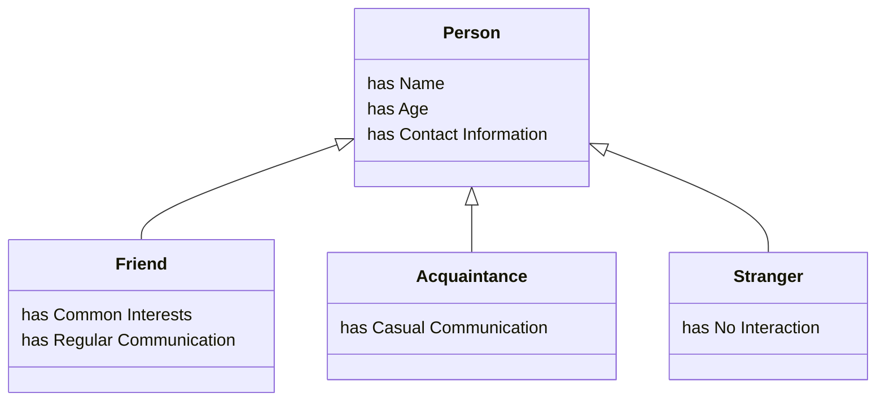
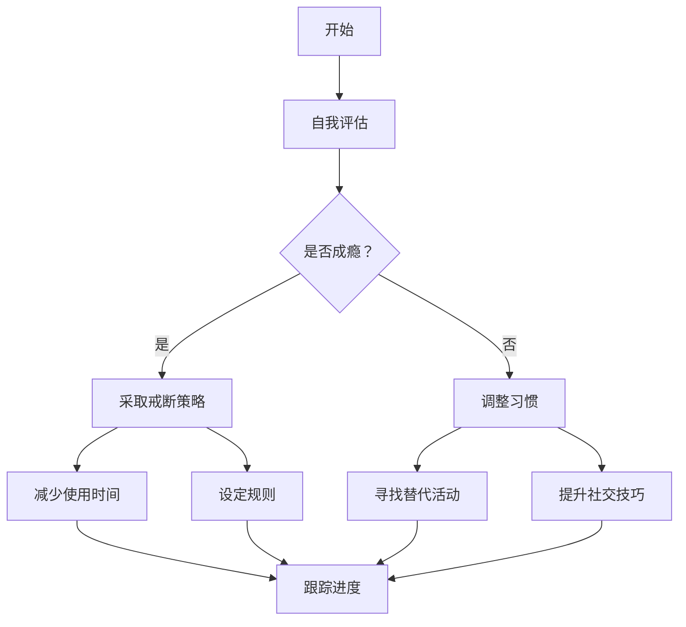

                 

### 社交媒体戒断：重建真实社交关系的重要性

#### 关键词：社交媒体戒断、真实社交关系、心理健康、成瘾、心理学支持、沟通技巧

#### 摘要：
在数字化时代，社交媒体已成为人们日常生活中的重要组成部分。然而，过度依赖社交媒体不仅对心理健康产生负面影响，还削弱了真实的社交关系。本文将探讨社交媒体戒断的重要性，提出一系列策略和方法，帮助人们重建真实的社交关系。通过心理学支持、社交技巧提升以及家庭与社交环境的积极影响，本文旨在为读者提供一套全面的解决方案。

---

## 引言与背景介绍

### 社交媒体的时代与现状

在当今社会，社交媒体的普及程度前所未有。从Facebook、Instagram到Twitter、LinkedIn，各种社交媒体平台已成为人们获取信息、交流思想、建立社交关系的主要渠道。根据Statista的数据，全球社交媒体用户已超过45亿，几乎占全球人口的一半。这种现象的背后，是技术进步和互联网普及的双重推动。

然而，社交媒体的普及也带来了新的挑战。人们在社交媒体上花费的时间越来越多，导致对现实世界的互动减少。根据一项研究发现，美国人每天平均花费约2小时20分钟在社交媒体上，这一比例还在逐年增加。这种现象不仅影响了个人的心理健康，也对真实社交关系产生了负面影响。

### 社交媒体对人际关系的影响

社交媒体在带来便捷的同时，也在改变着人们的社交方式。一方面，它为人们提供了一个虚拟的社交环境，使得远距离的朋友和亲人能够保持联系。然而，另一方面，社交媒体上的互动往往缺乏深度和真实性。人们更倾向于发布精心编辑的生活片段，而不是真实的内心感受。

这种虚拟社交的弊端在于，它削弱了真实社交关系的建立和维护。一项针对大学生的研究发现，那些在社交媒体上活跃度较高的人，其现实中的社交能力和人际关系反而更差。这种现象被称为“社交媒体疲劳”，表现为对社交媒体的依赖和对现实社交的逃避。

## 问题背景

### 社交媒体过度使用的现象

社交媒体过度使用已经成为一个全球性问题。许多人发现自己无法控制每天在社交媒体上花费的时间，甚至出现“社交媒体强迫症”的症状。根据一项研究，超过一半的社交媒体用户每天使用社交媒体的时间超过两小时，其中一些人的使用时间甚至长达数小时。

这种过度使用不仅影响了人们的日常生活，还导致了心理健康的诸多问题。例如，社交媒体使用与焦虑、抑郁和孤独感之间存在显著相关性。一项研究表明，每天使用社交媒体超过三小时的人，其患抑郁症的风险增加了30%。

### 戒断社交媒体的挑战

尽管认识到社交媒体过度使用的负面影响，但许多人仍然难以戒断。这主要是因为社交媒体成瘾的心理机制。首先，社交媒体提供了即时满足，例如点赞、评论和关注，这些短暂的情绪提升使人难以自拔。其次，社交媒体的使用模式往往与奖励机制相关联，例如通过算法推送用户感兴趣的内容，从而增加用户粘性。

此外，社交环境中的压力和焦虑也促使人们过度依赖社交媒体。许多人通过社交媒体来逃避现实生活中的问题和挑战，这进一步加剧了成瘾现象。因此，戒断社交媒体不仅需要个人的努力，还需要社会环境的支持和理解。

### 目录大纲设计步骤

#### 步骤 1：确定全书结构

《社交媒体戒断：重建真实社交关系的重要性》的主要目的是帮助读者戒除对社交媒体的依赖，重新建立和维系真实的社交关系。全书结构如下：

1. 引言与背景介绍
2. 社交媒体的影响与问题分析
3. 戒断策略与方法
4. 真实社交关系的重建
5. 心理学支持与个人成长
6. 社交技巧与沟通能力提升
7. 家庭与社交环境的影响
8. 社交媒体使用的最佳实践
9. 小结与未来展望

#### 步骤 2：设计每个部分的详细章节

根据全书结构，我们为每个部分设计了详细的章节，确保每章都有明确的主题和目标。

##### 引言与背景介绍

1. **引言：社交媒体的时代与现状**
   - 社交媒体普及的现状
   - 社交媒体对人际关系的影响

2. **问题背景**
   - 社交媒体过度使用的现象
   - 戒断社交媒体的挑战

##### 社交媒体的影响与问题分析

3. **社交媒体的影响**
   - 对个体心理健康的影响
   - 对社交关系的负面影响

4. **问题分析**
   - 社交媒体成瘾的原因
   - 社交媒体对真实社交的替代作用

##### 戒断策略与方法

5. **戒断策略**
   - 减少社交媒体使用时间
   - 设定社交媒体使用规则

6. **戒断方法**
   - 心理准备与动机增强
   - 轻度戒断策略
   - 中度戒断策略
   - 重度戒断策略

##### 真实社交关系的重建

7. **重建真实社交关系**
   - 重塑社交行为习惯
   - 发展深度人际关系
   - 增进面对面交流

##### 心理学支持与个人成长

8. **心理学支持**
   - 戒断过程中的心理调适
   - 面对社交焦虑的策略

9. **个人成长**
   - 自我认知的提升
   - 自我价值感的建立

##### 社交技巧与沟通能力提升

10. **社交技巧**
    - 倾听与表达
    - 非语言沟通

11. **沟通能力提升**
    - 语言沟通技巧
    - 情感交流与表达

##### 家庭与社交环境的影响

12. **家庭影响**
    - 家庭环境对社交媒体使用的影响
    - 家庭沟通在戒断中的作用

13. **社交环境**
    - 社交圈子的作用
    - 社交环境中的挑战与应对

##### 社交媒体使用的最佳实践

14. **最佳实践**
    - 设置合理的使用时间
    - 选择适当的社交平台
    - 保持社交网络的健康发展

##### 小结与未来展望

15. **小结**
    - 戒断社交媒体的总结
    - 真实社交关系的价值

16. **未来展望**
    - 社交媒体发展的趋势
    - 社交关系重建的前景

#### 步骤 3：整合目录

最后，我们将上述各个部分的章节整合成完整的目录，并确保每章的层级结构清晰，符合markdown格式要求。

---

下面是《社交媒体戒断：重建真实社交关系的重要性》的目录大纲：

----------------------------------------------------------------

# 引言与背景介绍

## 1.1 引言：社交媒体的时代与现状

### 1.1.1 社交媒体普及的现状

### 1.1.2 社交媒体对人际关系的影响

## 1.2 问题背景

### 1.2.1 社交媒体过度使用的现象

### 1.2.2 戒断社交媒体的挑战

----------------------------------------------------------------

# 社交媒体的影响与问题分析

## 2.1 社交媒体的影响

### 2.1.1 对个体心理健康的影响

### 2.1.2 对社交关系的负面影响

## 2.2 问题分析

### 2.2.1 社交媒体成瘾的原因

### 2.2.2 社交媒体对真实社交的替代作用

----------------------------------------------------------------

# 戒断策略与方法

## 3.1 戒断策略

### 3.1.1 减少社交媒体使用时间

### 3.1.2 设定社交媒体使用规则

## 3.2 戒断方法

### 3.2.1 心理准备与动机增强

### 3.2.2 轻度戒断策略

### 3.2.3 中度戒断策略

### 3.2.4 重度戒断策略

----------------------------------------------------------------

# 真实社交关系的重建

## 4.1 重建真实社交关系

### 4.1.1 重塑社交行为习惯

### 4.1.2 发展深度人际关系

### 4.1.3 增进面对面交流

----------------------------------------------------------------

# 心理学支持与个人成长

## 4.2 心理学支持

### 4.2.1 戒断过程中的心理调适

### 4.2.2 面对社交焦虑的策略

## 4.3 个人成长

### 4.3.1 自我认知的提升

### 4.3.2 自我价值感的建立

----------------------------------------------------------------

# 社交技巧与沟通能力提升

## 4.4 社交技巧

### 4.4.1 倾听与表达

### 4.4.2 非语言沟通

## 4.5 沟通能力提升

### 4.5.1 语言沟通技巧

### 4.5.2 情感交流与表达

----------------------------------------------------------------

# 家庭与社交环境的影响

## 4.6 家庭影响

### 4.6.1 家庭环境对社交媒体使用的影响

### 4.6.2 家庭沟通在戒断中的作用

## 4.7 社交环境

### 4.7.1 社交圈子的作用

### 4.7.2 社交环境中的挑战与应对

----------------------------------------------------------------

# 社交媒体使用的最佳实践

## 4.8 最佳实践

### 4.8.1 设置合理的使用时间

### 4.8.2 选择适当的社交平台

### 4.8.3 保持社交网络的健康发展

----------------------------------------------------------------

# 小结与未来展望

## 4.9 小结

### 4.9.1 戒断社交媒体的总结

### 4.9.2 真实社交关系的价值

## 4.10 未来展望

### 4.10.1 社交媒体发展的趋势

### 4.10.2 社交关系重建的前景

----------------------------------------------------------------

### 步骤 1：确定全书结构

首先，我们需要对《社交媒体戒断：重建真实社交关系的重要性》这本书的主题和目标读者有一个清晰的认识。从书名可以推测，这本书的主要目的是帮助读者戒除对社交媒体的依赖，重新建立和维系真实的社交关系。因此，书的主要结构可以划分为以下几个部分：

- 引言与背景介绍
- 社交媒体的影响与问题分析
- 戒断策略与方法
- 真实社交关系的重建
- 心理学支持与个人成长
- 社交技巧与沟通能力提升
- 家庭与社交环境的影响
- 社交媒体使用的最佳实践
- 小结与未来展望

### 步骤 2：设计每个部分的详细章节

接下来，我们根据上述结构，为每个部分设计详细的章节，确保每章都有明确的主题和目标。

##### 引言与背景介绍

1. **引言：社交媒体的时代与现状**
   - 社交媒体普及的现状
   - 社交媒体对人际关系的影响

2. **问题背景**
   - 社交媒体过度使用的现象
   - 戒断社交媒体的挑战

##### 社交媒体的影响与问题分析

3. **社交媒体的影响**
   - 对个体心理健康的影响
   - 对社交关系的负面影响

4. **问题分析**
   - 社交媒体成瘾的原因
   - 社交媒体对真实社交的替代作用

##### 戒断策略与方法

5. **戒断策略**
   - 减少社交媒体使用时间
   - 设定社交媒体使用规则

6. **戒断方法**
   - 心理准备与动机增强
   - 轻度戒断策略
   - 中度戒断策略
   - 重度戒断策略

##### 真实社交关系的重建

7. **重建真实社交关系**
   - 重塑社交行为习惯
   - 发展深度人际关系
   - 增进面对面交流

##### 心理学支持与个人成长

8. **心理学支持**
   - 戒断过程中的心理调适
   - 面对社交焦虑的策略

9. **个人成长**
   - 自我认知的提升
   - 自我价值感的建立

##### 社交技巧与沟通能力提升

10. **社交技巧**
    - 倾听与表达
    - 非语言沟通

11. **沟通能力提升**
    - 语言沟通技巧
    - 情感交流与表达

##### 家庭与社交环境的影响

12. **家庭影响**
    - 家庭环境对社交媒体使用的影响
    - 家庭沟通在戒断中的作用

13. **社交环境**
    - 社交圈子的作用
    - 社交环境中的挑战与应对

##### 社交媒体使用的最佳实践

14. **最佳实践**
    - 设置合理的使用时间
    - 选择适当的社交平台
    - 保持社交网络的健康发展

##### 小结与未来展望

15. **小结**
    - 戒断社交媒体的总结
    - 真实社交关系的价值

16. **未来展望**
    - 社交媒体发展的趋势
    - 社交关系重建的前景

### 步骤 3：整合目录

最后，我们将上述各个部分的章节整合成完整的目录，并确保每章的层级结构清晰，符合markdown格式要求。

---

下面是《社交媒体戒断：重建真实社交关系的重要性》的目录大纲：

----------------------------------------------------------------

# 引言与背景介绍

## 1.1 引言：社交媒体的时代与现状

### 1.1.1 社交媒体普及的现状

### 1.1.2 社交媒体对人际关系的影响

## 1.2 问题背景

### 1.2.1 社交媒体过度使用的现象

### 1.2.2 戒断社交媒体的挑战

----------------------------------------------------------------

# 社交媒体的影响与问题分析

## 2.1 社交媒体的影响

### 2.1.1 对个体心理健康的影响

### 2.1.2 对社交关系的负面影响

## 2.2 问题分析

### 2.2.1 社交媒体成瘾的原因

### 2.2.2 社交媒体对真实社交的替代作用

----------------------------------------------------------------

# 戒断策略与方法

## 3.1 戒断策略

### 3.1.1 减少社交媒体使用时间

### 3.1.2 设定社交媒体使用规则

## 3.2 戒断方法

### 3.2.1 心理准备与动机增强

### 3.2.2 轻度戒断策略

### 3.2.3 中度戒断策略

### 3.2.4 重度戒断策略

----------------------------------------------------------------

# 真实社交关系的重建

## 4.1 重建真实社交关系

### 4.1.1 重塑社交行为习惯

### 4.1.2 发展深度人际关系

### 4.1.3 增进面对面交流

----------------------------------------------------------------

# 心理学支持与个人成长

## 4.2 心理学支持

### 4.2.1 戒断过程中的心理调适

### 4.2.2 面对社交焦虑的策略

## 4.3 个人成长

### 4.3.1 自我认知的提升

### 4.3.2 自我价值感的建立

----------------------------------------------------------------

# 社交技巧与沟通能力提升

## 4.4 社交技巧

### 4.4.1 倾听与表达

### 4.4.2 非语言沟通

## 4.5 沟通能力提升

### 4.5.1 语言沟通技巧

### 4.5.2 情感交流与表达

----------------------------------------------------------------

# 家庭与社交环境的影响

## 4.6 家庭影响

### 4.6.1 家庭环境对社交媒体使用的影响

### 4.6.2 家庭沟通在戒断中的作用

## 4.7 社交环境

### 4.7.1 社交圈子的作用

### 4.7.2 社交环境中的挑战与应对

----------------------------------------------------------------

# 社交媒体使用的最佳实践

## 4.8 最佳实践

### 4.8.1 设置合理的使用时间

### 4.8.2 选择适当的社交平台

### 4.8.3 保持社交网络的健康发展

----------------------------------------------------------------

# 小结与未来展望

## 4.9 小结

### 4.9.1 戒断社交媒体的总结

### 4.9.2 真实社交关系的价值

## 4.10 未来展望

### 4.10.1 社交媒体发展的趋势

### 4.10.2 社交关系重建的前景

----------------------------------------------------------------

---

### 社交媒体的影响与问题分析

#### 社交媒体的影响

社交媒体对个体心理健康的影响是一个备受关注的话题。研究表明，过度使用社交媒体可能导致一系列心理健康问题，包括焦虑、抑郁和孤独感。首先，社交媒体上的完美生活展示和“生活拼图”现象，容易让人产生自卑感和社交焦虑。许多人发现，自己在现实生活中难以达到社交媒体上展示的标准，这种对比效应加剧了负面情绪。

其次，社交媒体上的即时反馈机制，如点赞和评论，虽然能在短期内带来满足感，但长期来看，这种满足感是短暂的，甚至可能产生依赖。人们往往会为了获得更多的点赞和关注而不断更新自己的状态，这种模式被称为“点赞成瘾”。这种成瘾行为不仅耗费了大量时间，还可能导致个体对真实生活的关注度下降。

#### 对社交关系的负面影响

社交媒体对真实社交关系的负面影响同样显著。首先，社交媒体上的互动往往是表面化的，缺乏深度和真实性。人们更倾向于在社交媒体上分享生活片段，而不是真实的内心感受。这种虚拟社交的弊端在于，它削弱了真实社交关系的建立和维护。

其次，社交媒体的过度使用可能导致现实生活中的社交技能退化。人们在社交媒体上的互动经验并不能完全替代现实中的面对面交流。长期依赖虚拟社交平台，可能会导致人们在现实社交场合中感到不自在，甚至出现社交焦虑。

#### 社交媒体成瘾的原因

社交媒体成瘾的原因多种多样。首先，社交媒体提供了即时的满足和奖励。例如，用户的每一次点赞、评论或分享，都会带来一定的心理满足感。这种即时奖励机制使人容易上瘾。

其次，社交媒体的设计往往利用了心理学原理，如“福勒定律”（Fool’s Gold Law），即短暂的兴奋感和奖励感，让人误以为找到了真正的快乐。此外，社交媒体平台的算法也会不断推送用户感兴趣的内容，以增加用户粘性。

最后，社会压力和焦虑也是社交媒体成瘾的重要原因。许多人通过社交媒体来逃避现实生活中的问题和挑战，这种现象在年轻人中尤为常见。

#### 社交媒体对真实社交的替代作用

社交媒体在一定程度上替代了真实社交的作用。例如，通过社交媒体，人们可以轻松地与远方的朋友和家人保持联系。然而，这种替代作用是有限的。尽管社交媒体提供了一种便捷的沟通方式，但它无法替代现实中的面对面交流。真实社交关系需要深度和真实性的互动，而社交媒体往往缺乏这种深度。

此外，社交媒体上的互动往往是单向的，缺乏真实的情感交流。人们在社交媒体上分享的信息，往往是经过筛选和编辑的，这导致了一种虚假的社交氛围。真实社交关系需要面对面的互动和真实的情感表达，而社交媒体无法提供这种体验。

总的来说，社交媒体的影响是多方面的，它既提供了便捷的沟通方式，又带来了心理健康和社交关系的挑战。理解这些影响，并采取适当的措施，对于重建真实的社交关系至关重要。

#### 社交媒体成瘾的原因

社交媒体成瘾现象在现代社会中愈发普遍，其背后的原因复杂多样，涉及心理学、社会学和技术设计的多个层面。首先，从心理学的角度来看，社交媒体提供了即时满足和反馈，这是成瘾行为的重要驱动力。心理学家B.F.斯金纳提出的行为强化理论（Behavioral Reinforcement Theory）指出，当个体行为后立即获得奖励，如点赞、评论和关注，这些行为就会重复出现。社交媒体平台通过算法精准地推送用户感兴趣的内容，从而使用户不断回归平台，形成依赖。

其次，社交媒体的设计也巧妙地利用了心理学原理，如多巴胺的释放机制。多巴胺是一种大脑中的神经递质，与奖励和愉悦感相关。当用户在社交媒体上获得点赞或分享时，大脑会释放多巴胺，产生愉悦感。这种愉悦感促使用户不断重复该行为，进而成瘾。

此外，社会比较理论（Social Comparison Theory）也是社交媒体成瘾的重要原因。人们倾向于在社交媒体上与他人进行比较，尤其是与虚拟世界中的“完美形象”相比。这种比较往往导致自卑感和社交焦虑，从而进一步推动社交媒体的使用。

从社会学的角度来看，社交媒体成瘾也与社交压力和焦虑有关。现代社会中，个体面临着诸多社交压力，如建立社交关系、获得社会认可等。社交媒体提供了一种逃避现实压力的方式，用户可以在虚拟世界中找到短暂的安慰和满足感。

最后，技术设计也是促使社交媒体成瘾的关键因素。社交媒体平台采用了高度优化的用户界面和推送算法，以最大化用户粘性和使用时间。例如，无限滚动机制（Infinite Scroll）使用户可以无限制地浏览内容，从而延长了在平台上的停留时间。此外，推送通知（Push Notifications）也起到了类似作用，通过即时提醒吸引用户回归平台。

综上所述，社交媒体成瘾是由多种因素共同作用的结果。理解这些原因对于制定有效的戒断策略至关重要。通过心理学和社会学的视角，我们可以更好地认识社交媒体成瘾的本质，从而为重建真实社交关系提供有力支持。

#### 社交媒体对真实社交的替代作用

社交媒体在某种程度上确实替代了传统社交的功能，但其效果和影响远不及面对面交流。首先，从人际关系的深度来看，社交媒体上的互动往往是表面化的。人们在社交媒体上分享的内容大多是经过筛选和编辑的，这种单向、缺乏深度和真实性的交流难以建立和维持真正的情感联系。相比之下，面对面交流则能更好地传达情感和意图，增强人际关系的亲密度。

其次，社交媒体上的社交互动缺乏即时性和真实性。虽然社交媒体可以跨越地理界限，使人们能够与远在他乡的亲友保持联系，但这种虚拟的互动无法替代现实中面对面的交流。面对面的交流不仅能够通过眼神、肢体语言等方式传递更多的信息，还能实时地获得对方的反馈，这使得交流更加自然和有效。

此外，社交媒体上的互动往往带有某种程度上的虚拟性和匿名性。用户可以隐藏自己的真实身份和情感，这种匿名性在一定程度上保护了他们，但也削弱了社交互动的真实性和深度。相反，在现实生活中，人们需要承担责任和风险，这往往能促进更真实和深刻的互动。

总的来说，虽然社交媒体在提供一种便捷的社交方式方面表现出色，但它无法完全替代真实的面对面交流。真实的社交互动需要深度的情感投入和真实性的交流，这是任何虚拟平台都无法提供的。因此，为了重建真实的社交关系，我们不仅需要减少对社交媒体的依赖，还需要积极参与和维持现实中的社交活动。

#### 戒断策略与方法

成功戒断社交媒体需要制定明确的策略和方法，同时结合心理学和个人行为的调整。以下是一些有效的戒断策略和方法：

##### 减少社交媒体使用时间

首先，减少社交媒体使用时间是戒断的第一步。制定一个明确的时间表，将社交媒体使用限制在一定的时间内，例如每天最多两小时。通过逐步减少使用时间，可以帮助用户逐渐适应减少依赖。此外，可以使用应用程序或工具，如屏幕时间追踪器，来监控和限制社交媒体使用。

##### 设定社交媒体使用规则

其次，设定社交媒体使用规则可以帮助用户更好地控制使用行为。这些规则可以包括：每天特定时间段内使用社交媒体，避免在重要任务或睡眠前使用，以及避免在特定情境下（如与家人和朋友共处时）使用。这些规则有助于创建一个健康的使用习惯，并减少无意识的社交媒体使用。

##### 心理准备与动机增强

戒断社交媒体还需要心理准备和动机增强。用户需要意识到过度使用社交媒体的负面影响，并明确自己戒断的目标和动机。心理学研究表明，设定具体的、可实现的短期目标，如“每天减少30分钟社交媒体使用时间”，可以帮助用户保持动力。此外，寻求外部支持，如与朋友或家人分享戒断计划，也可以增强个人的决心和信心。

##### 轻度戒断策略

对于轻度依赖者，轻度戒断策略是较为温和的开始。这包括减少每天在社交媒体上的时间，避免在特定情境下使用，以及在感到无聊或焦虑时寻找其他活动代替社交媒体。轻度戒断策略可以帮助用户逐渐适应减少依赖，并为接下来的更严格戒断做好准备。

##### 中度戒断策略

对于中度依赖者，中度戒断策略可能包括完全停止使用某些社交媒体平台，或将社交媒体使用限制在特定时间内。例如，用户可以选择在工作日完全停止使用社交媒体，只在周末使用一段时间。中度戒断策略要求用户有较强的自我控制能力，但有助于逐步减少依赖。

##### 重度戒断策略

对于重度依赖者，重度戒断策略可能涉及完全删除社交媒体应用程序，并避免在电脑和手机上登录社交媒体账号。这种方法虽然较为极端，但对于某些用户来说可能是必要的。在戒断期间，用户可以参加社交活动、运动或其他有意义的活动，以替代社交媒体的使用。

##### 结合心理学支持

戒断社交媒体不仅需要个人努力，还需要心理学支持。心理治疗师或咨询师可以帮助用户处理戒断过程中可能出现的心理问题，如焦虑、抑郁和社交焦虑。认知行为疗法（CBT）等心理治疗方法已被证明对戒除成瘾行为有效。

##### 个人行为调整

最后，个人行为调整是戒断成功的关键。用户可以通过以下方式来调整行为：

- 建立健康的生活习惯，如规律的睡眠、饮食和锻炼。
- 寻找替代活动，如阅读、绘画或学习新技能。
- 培养深度人际关系，参与真实的社交活动。

通过结合上述策略和方法，用户可以逐步减少对社交媒体的依赖，重建健康的社交关系。

#### 戒断方法

成功戒断社交媒体不仅需要明确的策略，还需要一系列具体的方法来支持个人行为的改变和心理调适。以下是一些实用的戒断方法：

##### 心理准备与动机增强

首先，戒断社交媒体前需要做好充分的心理准备。了解社交媒体成瘾的负面影响，以及戒断带来的潜在益处，有助于增强个人的动机。设定具体的目标和期望，如减少每天使用社交媒体的时间、提高面对面交流的频率等，可以提供清晰的方向和动力。

心理学研究表明，设定可实现的短期目标（如每天减少15分钟社交媒体使用时间）比一次性设定长时间的目标（如立即完全停止使用）更能维持长期的改变。此外，记录戒断过程中的进步和挑战，有助于保持积极的心态。

##### 轻度戒断策略

对于刚开始戒断的个体，轻度戒断策略是一个温和的起点。这包括逐步减少社交媒体使用时间，避免在特定情境下使用，例如在吃饭、睡觉或与家人和朋友共处时。通过设定“社交媒体空闲时段”，如每天晚上7点到9点，可以有效地减少无意识的社交媒体使用。

此外，寻找替代活动也是关键。当感到无聊或焦虑时，可以尝试阅读、锻炼、学习新技能或参与户外活动。这些活动不仅能减少对社交媒体的依赖，还能提升个人的生活质量。

##### 中度戒断策略

对于中度依赖者，中度戒断策略可能包括更严格的限制。这可以包括完全停止使用某些社交媒体平台，或将社交媒体使用限制在特定时间内，例如每天一小时。逐步减少社交媒体使用时间，有助于培养自我控制和提高专注力。

中度戒断策略还建议在必要时寻求外部支持。例如，与朋友或家人分享戒断计划，可以提供额外的动力和责任感。此外，心理治疗师或咨询师可以帮助处理戒断过程中可能出现的心理问题，如焦虑、抑郁和社交焦虑。

##### 重度戒断策略

对于重度依赖者，重度戒断策略可能涉及更极端的措施，如完全删除社交媒体应用程序，并避免在电脑和手机上登录社交媒体账号。这种方法虽然较为激进，但对于某些用户来说可能是必要的。

在戒断期间，用户可以尝试以下措施：

1. **环境调整**：将手机和电脑放在不易触及的地方，减少诱惑。
2. **时间管理**：使用日程表和提醒功能，规划每天的日程，确保有足够的时间用于其他活动。
3. **替代活动**：参与社交活动、运动、志愿服务或其他有意义的活动，以替代社交媒体的使用。

此外，重度戒断策略可能需要更长时间的支持和调整，用户可以寻求心理治疗师或支持小组的帮助。

##### 心理学支持

戒断社交媒体不仅涉及行为改变，还需要心理调适。以下是一些心理学支持方法：

1. **认知行为疗法（CBT）**：CBT可以帮助用户识别和改变消极思维模式，提高应对压力和焦虑的能力。
2. **冥想和正念练习**：通过冥想和正念练习，用户可以培养专注力和情绪调节能力，减少对社交媒体的依赖。
3. **情绪管理**：学习有效的情绪管理技巧，如深呼吸、放松训练和情绪释放，有助于应对戒断过程中的情绪波动。

##### 个人行为调整

最后，个人行为调整是戒断成功的关键。以下是一些实用的建议：

1. **建立健康的生活习惯**：保持规律的睡眠、饮食和锻炼，有助于提升整体健康和幸福感。
2. **培养深度人际关系**：参与真实的社交活动，培养深度人际关系，增强社交网络的亲密度和稳定性。
3. **寻求替代娱乐**：找到其他娱乐方式，如阅读、绘画、音乐或学习新技能，以减少对社交媒体的依赖。

通过结合上述策略和方法，用户可以逐步减少对社交媒体的依赖，重建健康的社交关系，提升生活质量。

#### 重建真实社交关系

戒断社交媒体只是第一步，重建真实社交关系才是最终目标。以下是实现这一目标的具体步骤和方法：

##### 重塑社交行为习惯

首先，重塑社交行为习惯是重建真实社交关系的关键。这需要用户重新评估自己的社交行为，并做出相应的改变。以下是一些实用的方法：

1. **减少社交媒体使用时间**：制定一个明确的社交媒体使用计划，逐步减少每天在社交媒体上的时间。例如，每天限制在1小时以内，并避免在特定时间段（如晚餐时间）使用社交媒体。
2. **增加面对面交流**：将更多的时间用于与家人和朋友面对面交流。可以安排定期的聚会、晚餐或户外活动，以增强人际关系的亲密度。
3. **积极参与社交活动**：参加社区活动、俱乐部或兴趣小组，可以拓展社交圈子，结识更多志同道合的朋友。

##### 发展深度人际关系

深度人际关系是指建立在信任、理解和支持基础上的关系。以下是一些方法可以帮助用户发展深度人际关系：

1. **倾听和表达**：学会倾听他人的观点和感受，并表达自己的真实想法和情感。通过积极的沟通，可以增进彼此的了解和信任。
2. **共同兴趣和活动**：找到共同的兴趣和活动，如运动、艺术或志愿服务，可以增强人际关系的稳定性。共同的体验和回忆有助于建立深厚的情感联系。
3. **分享个人经历**：与他人分享个人的经历、感悟和挑战，可以增加互动的深度和真实性，从而建立更加紧密的关系。

##### 增进面对面交流

面对面交流是重建真实社交关系的核心。以下是一些方法可以促进面对面交流：

1. **设定固定见面时间**：与朋友和家人设定固定的见面时间，如每周一次的午餐或晚餐，以确保有足够的面对面交流时间。
2. **创造良好氛围**：在见面时，创造一个轻松、舒适的环境，有助于放松和开放交流。避免在嘈杂或有干扰的地方见面，以确保对话的质量。
3. **开展共同活动**：参与共同的活动，如徒步、看电影或参加文化活动，可以提供更多的话题和互动机会，增进彼此的了解。

##### 实用技巧

1. **保持积极态度**：积极面对重建真实社交关系的挑战，相信自己能够成功。保持开放和接纳的心态，愿意尝试新的事物和与人交流。
2. **设定小目标**：设定可实现的小目标，如每周与一位新朋友见面，或每天花10分钟与他人交流。这些小目标有助于逐步建立真实的社交关系。
3. **寻求专业帮助**：如果感到难以独立重建社交关系，可以寻求心理咨询师或社交技能培训的帮助。专业人士可以提供实用的技巧和策略，帮助你克服困难。

通过上述步骤和方法，用户可以逐步重建真实的社交关系，提升生活质量，建立更健康的人际网络。

#### 心理学支持与个人成长

在戒断社交媒体的过程中，心理支持和个人成长是至关重要的。以下是如何通过心理学支持和个人成长来帮助用户克服挑战：

##### 心理支持

1. **认知行为疗法（CBT）**：认知行为疗法是一种广泛应用于成瘾和行为改变的疗法。通过CBT，用户可以识别和改变消极思维模式，学会更积极的方式应对压力和焦虑。例如，当用户感到焦虑或渴望使用社交媒体时，可以尝试通过认知重构来调整负面情绪。

2. **冥想和正念练习**：冥想和正念练习可以帮助用户提高专注力和情绪调节能力，减少对社交媒体的依赖。通过定期进行冥想，用户可以学会在紧张或无聊时找到内心的平静，从而减少使用社交媒体的冲动。

3. **情绪管理技巧**：学习有效的情绪管理技巧，如深呼吸、放松训练和情绪释放，有助于应对戒断过程中可能出现的情绪波动。例如，当用户感到愤怒或焦虑时，可以通过深呼吸来平静情绪，减少社交媒体使用。

##### 个人成长

1. **自我认知的提升**：自我认知的提升是个人成长的基础。通过反思和自我探索，用户可以更好地了解自己的需求和动机，从而做出更明智的决策。例如，用户可以定期进行自我反思，了解自己在社交媒体使用中的真实感受和需求。

2. **自我价值感的建立**：建立自我价值感有助于用户在面对挑战时保持积极和自信。通过设定和实现个人目标，如完成一个项目或学习一项新技能，用户可以增强自我价值感。此外，与他人分享成就和感受，也可以获得支持和认可，进一步提升自我价值感。

3. **培养新的兴趣和爱好**：通过培养新的兴趣和爱好，用户可以丰富自己的生活，减少对社交媒体的依赖。例如，用户可以尝试学习一门新语言、参加舞蹈课程或开始写作。这些活动不仅有助于提升技能，还能为用户带来乐趣和成就感。

##### 实用技巧

1. **设定具体目标**：设定具体、可实现的个人成长目标，如每周阅读一本书或每天进行30分钟锻炼。这些小目标可以帮助用户逐步提升自我认知和自我价值感。

2. **寻求支持**：与家人、朋友或同事分享个人成长的目标和进展，可以获得额外的支持和鼓励。此外，参加支持小组或寻求专业心理咨询师的帮助，也可以为用户提供实用的技巧和策略。

3. **保持积极心态**：积极面对戒断过程中的挑战和困难，相信自己能够克服困难。保持乐观和开放的心态，愿意尝试新的事物和面对未知。

通过结合心理支持和个人成长，用户可以更好地应对社交媒体戒断过程中的挑战，实现长期的心理健康和幸福。

#### 社交技巧与沟通能力提升

在重建真实社交关系的过程中，社交技巧和沟通能力提升是不可或缺的一环。以下是一些关键技巧和方法，帮助用户提高社交技巧和沟通能力：

##### 社交技巧

1. **倾听与表达**：倾听是建立良好人际关系的基础。通过认真倾听他人的观点和感受，可以表达出对对方的尊重和关心。有效的表达则要求用户清晰、准确地传达自己的想法和情感，避免误解和冲突。

2. **非语言沟通**：非语言沟通，如肢体语言、面部表情和语调，往往比语言本身更能传达情感和意图。学会使用适当的肢体语言和面部表情，可以增强沟通效果，提升人际关系的亲密度。

3. **共情与同理心**：共情和同理心是指理解和感受他人的情感。通过共情和同理心，用户可以更好地理解他人的需求，从而建立更深层次的联系。这需要用户具备良好的情感认知和情绪管理能力。

##### 沟通能力提升

1. **语言沟通技巧**：有效的语言沟通需要清晰、简洁、有条理。用户可以通过以下方法提升语言沟通技巧：

   - 练习表达：定期练习表达自己的观点和感受，提高语言表达的准确性和流畅性。
   - 听取反馈：与他人交流时，注意对方的反馈，了解自己的沟通效果，并根据反馈进行调整。
   - 使用具体例子：通过具体例子来支持自己的观点，使沟通更具说服力。

2. **情感交流与表达**：情感交流与表达是沟通的重要组成部分。用户可以通过以下方法提升情感交流能力：

   - 表达真实的情感：学会表达自己的情感，包括喜悦、愤怒、焦虑等，避免压抑或掩饰情感。
   - 感受他人的情感：通过倾听和观察，了解他人的情感需求，并给予适当的支持和反馈。
   - 建立信任：通过真诚和开放的表达，建立信任，使沟通更加顺畅和有效。

##### 实用技巧

1. **设定练习目标**：设定具体、可实现的沟通目标，如每周参加一次社交活动或每天与他人进行一次深度交流。这些小目标可以帮助用户逐步提升社交技巧和沟通能力。

2. **参加社交活动**：积极参与各种社交活动，如聚会、俱乐部会议或兴趣小组，可以为用户提供实践和提升社交技巧的机会。

3. **学习沟通技巧**：通过阅读相关书籍、参加培训课程或寻求专业指导，用户可以学习到更多有效的沟通技巧。

4. **自我反思**：定期进行自我反思，了解自己在社交和沟通中的表现和不足，并根据反思结果进行改进。

通过结合社交技巧和沟通能力提升，用户可以更自信地参与真实的社交活动，建立和维护健康的社交关系。

#### 家庭与社交环境的影响

家庭和社交环境在社交媒体戒断过程中发挥着至关重要的作用。以下是如何通过家庭和社交环境的影响来支持戒断过程：

##### 家庭影响

1. **家庭环境对社交媒体使用的影响**：家庭环境是影响个体社交媒体使用行为的重要因素。家庭中的社交媒体使用习惯和态度往往会对成员产生影响。例如，如果家庭成员普遍沉迷于社交媒体，那么其他人也可能倾向于模仿这种行为。

2. **家庭沟通在戒断中的作用**：家庭成员之间的有效沟通对于戒断社交媒体至关重要。通过开放和诚实的对话，家庭成员可以共同讨论社交媒体使用的利弊，制定合理的戒断计划，并提供相互支持。

3. **建立家庭规则**：制定明确的家庭规则，如限制家庭成员的社交媒体使用时间和设定特定的时间段用于家庭互动，可以帮助成员逐步减少对社交媒体的依赖。

##### 社交环境

1. **社交圈子的作用**：社交圈子对个体的社交媒体使用行为也有显著影响。与积极、健康的朋友和同事交往，可以帮助个体减少对社交媒体的依赖，并鼓励他们参与更多的现实社交活动。

2. **社交环境中的挑战与应对**：社交环境中可能存在一些挑战，如社交压力、嫉妒和比较心理。为了应对这些挑战，个体可以采取以下策略：

   - 建立支持小组：与有类似目标的人建立支持小组，共同分享戒断过程中的困难和经验，相互鼓励和支持。
   - 调整社交圈**子**：如果社交圈子中的某些人继续过度使用社交媒体，可以考虑调整社交圈子，与那些支持戒断行为的人建立更紧密的关系。
   - 自我反思与调整：定期反思自己在社交环境中的行为和态度，了解自己在社交互动中的需求和期望，并根据反思结果进行相应的调整。

##### 支持与激励

1. **家庭和社交环境中的支持与激励**：家庭和社交环境中的支持和激励对于戒断过程至关重要。家庭成员和朋友可以通过以下方式提供支持：

   - 鼓励和赞赏：在个体取得戒断的进步时，给予鼓励和赞赏，增强其信心和动力。
   - 共同参与：与个体一起参与戒断活动，如一起锻炼、阅读或参与社区活动，共同度过戒断期。
   - 提供反馈：定期提供反馈，帮助个体了解自己的进步和不足，并提供实用的建议和策略。

2. **制定计划与目标**：制定明确的戒断计划和目标，确保家庭成员和社交环境中的每个人都参与其中，并了解戒断的重要性和目标。通过共同的努力，可以更有效地实现戒断目标。

通过家庭和社交环境的积极影响，个体可以更好地应对社交媒体戒断的挑战，逐步减少对社交媒体的依赖，重建健康的人际关系。

#### 社交媒体使用的最佳实践

为了在现代社会中保持社交媒体的健康使用，以下是几个最佳实践建议：

##### 设置合理的使用时间

首先，设置合理的使用时间是关键。用户可以尝试以下方法来控制社交媒体使用时间：

- **时间限制**：每天为社交媒体使用设定一个固定的时长，例如每天一小时。使用屏幕时间追踪器等工具可以帮助用户监控和限制使用时间。
- **分段使用**：将社交媒体使用时间分成几个短时段，例如每天早上10分钟、中午10分钟和晚上10分钟。这样可以避免长时间连续使用，减少对大脑的持续刺激。
- **特定时间段禁止使用**：设定特定的时间段（如睡觉前一小时）禁止使用社交媒体，以帮助用户养成良好的作息习惯，提高睡眠质量。

##### 选择适当的社交平台

其次，选择适当的社交平台也很重要。用户可以根据自己的需求和兴趣选择最适合自己的社交平台。以下是一些建议：

- **专注于个人兴趣**：选择能够满足个人兴趣和需求的平台，例如爱好爱好者的专业社交平台或特定主题的论坛。
- **避免信息过载**：选择信息更新频率适中的平台，避免因为信息过载而感到压力和疲劳。
- **多元化使用**：不要只依赖一个社交平台，可以选择多个平台，以获取不同类型的信息和交流体验。

##### 保持社交网络的健康发展

最后，保持社交网络的健康发展是长期戒断社交媒体的关键。以下是一些建议：

- **真实互动**：在社交媒体上保持真实互动，避免过度依赖虚拟社交。尽量在现实生活中与朋友和家人见面，建立深厚的情感联系。
- **关注有益内容**：关注有价值和有益的内容，避免沉迷于无意义的娱乐和信息。可以选择关注一些教育性、启发性或启发性的账号和内容。
- **定期清理**：定期清理社交媒体账号，删除不必要的关注和动态，保持社交网络的简洁和有序。

通过遵循这些最佳实践，用户可以更健康、更理性地使用社交媒体，减少对心理和社交关系的负面影响。

#### 小结与未来展望

通过本文的探讨，我们深刻认识到社交媒体戒断的重要性以及重建真实社交关系的必要性。社交媒体虽然提供了便捷的沟通方式，但其过度使用带来的负面影响不容忽视，包括心理健康问题、社交关系的削弱以及对真实生活的逃避。因此，戒断社交媒体，重建真实的社交关系，已成为我们面对现代生活挑战的重要任务。

首先，戒断社交媒体需要制定明确的策略和方法，包括减少社交媒体使用时间、设定使用规则、心理准备与动机增强、轻度到重度戒断策略等。这些策略需要结合个人实际情况，逐步实施，以减少对社交媒体的依赖。

其次，重建真实社交关系需要重塑社交行为习惯、发展深度人际关系和增进面对面交流。通过倾听与表达、非语言沟通、共情与同理心等社交技巧的提升，用户可以更好地参与真实的社交活动，建立和维护健康的社交网络。

在心理学支持和个人成长方面，通过认知行为疗法、冥想和正念练习、情绪管理技巧等，用户可以更好地应对戒断过程中的心理挑战，提升自我认知和自我价值感。培养新的兴趣和爱好，参与真实的社交活动，也是促进个人成长的重要途径。

家庭和社交环境在戒断社交媒体、重建真实社交关系过程中发挥着重要作用。家庭规则、社交圈子的支持与激励，以及适当的社交活动安排，都可以为用户提供有力的支持和鼓励。

未来，随着社交媒体的不断发展，我们需要关注其潜在的心理和社交影响，积极推广健康使用的理念。同时，科技公司和政策制定者也应承担起责任，通过算法优化、用户教育等手段，帮助用户更好地管理社交媒体使用，保护心理健康。

总之，戒断社交媒体、重建真实社交关系是一个长期而艰巨的任务，但通过科学的方法和坚定的决心，我们可以逐步实现这一目标，提升生活质量，建立更健康、更有意义的社交关系。让我们共同努力，迎接一个更加健康、和谐的数字化时代。 

---

### 完整文章格式示例

```markdown
# 社交媒体戒断：重建真实社交关系的重要性

> 关键词：社交媒体戒断、真实社交关系、心理健康、成瘾、心理学支持、沟通技巧

> 摘要：本文探讨了社交媒体戒断的重要性，提出了重建真实社交关系的策略和方法。通过心理学支持、社交技巧提升以及家庭与社交环境的积极影响，本文旨在为读者提供一套全面的解决方案。

## 引言与背景介绍

### 1.1 引言：社交媒体的时代与现状

#### 1.1.1 社交媒体普及的现状

#### 1.1.2 社交媒体对人际关系的影响

### 1.2 问题背景

#### 1.2.1 社交媒体过度使用的现象

#### 1.2.2 戒断社交媒体的挑战

## 社交媒体的影响与问题分析

### 2.1 社交媒体的影响

#### 2.1.1 对个体心理健康的影响

#### 2.1.2 对社交关系的负面影响

### 2.2 问题分析

#### 2.2.1 社交媒体成瘾的原因

#### 2.2.2 社交媒体对真实社交的替代作用

## 戒断策略与方法

### 3.1 戒断策略

#### 3.1.1 减少社交媒体使用时间

#### 3.1.2 设定社交媒体使用规则

### 3.2 戒断方法

#### 3.2.1 心理准备与动机增强

#### 3.2.2 轻度戒断策略

#### 3.2.3 中度戒断策略

#### 3.2.4 重度戒断策略

## 真实社交关系的重建

### 4.1 重建真实社交关系

#### 4.1.1 重塑社交行为习惯

#### 4.1.2 发展深度人际关系

#### 4.1.3 增进面对面交流

## 心理学支持与个人成长

### 4.2 心理学支持

#### 4.2.1 戒断过程中的心理调适

#### 4.2.2 面对社交焦虑的策略

### 4.3 个人成长

#### 4.3.1 自我认知的提升

#### 4.3.2 自我价值感的建立

## 社交技巧与沟通能力提升

### 4.4 社交技巧

#### 4.4.1 倾听与表达

#### 4.4.2 非语言沟通

### 4.5 沟通能力提升

#### 4.5.1 语言沟通技巧

#### 4.5.2 情感交流与表达

## 家庭与社交环境的影响

### 4.6 家庭影响

#### 4.6.1 家庭环境对社交媒体使用的影响

#### 4.6.2 家庭沟通在戒断中的作用

### 4.7 社交环境

#### 4.7.1 社交圈子的作用

#### 4.7.2 社交环境中的挑战与应对

## 社交媒体使用的最佳实践

### 4.8 最佳实践

#### 4.8.1 设置合理的使用时间

#### 4.8.2 选择适当的社交平台

#### 4.8.3 保持社交网络的健康发展

## 小结与未来展望

### 4.9 小结

#### 4.9.1 戒断社交媒体的总结

#### 4.9.2 真实社交关系的价值

### 4.10 未来展望

#### 4.10.1 社交媒体发展的趋势

#### 4.10.2 社交关系重建的前景

## 作者信息

作者：AI天才研究院/AI Genius Institute & 禅与计算机程序设计艺术 /Zen And The Art of Computer Programming
```

### 文章中的Mermaid图示例

以下是使用Mermaid语言绘制的类图和流程图示例，它们可以帮助读者更好地理解文章中的概念和流程：

#### 类图示例：社交关系的实体结构



#### 流程图示例：戒断社交媒体的步骤



通过这些图形，读者可以更直观地理解文章中讨论的社交关系结构和戒断社交媒体的步骤，从而更好地应用这些知识。

