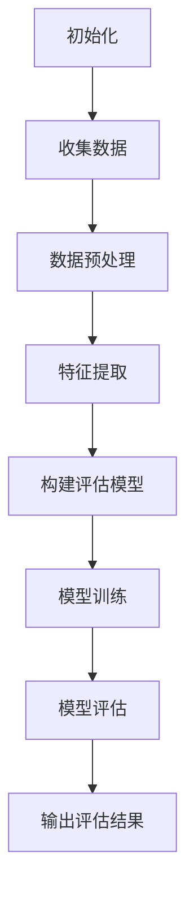
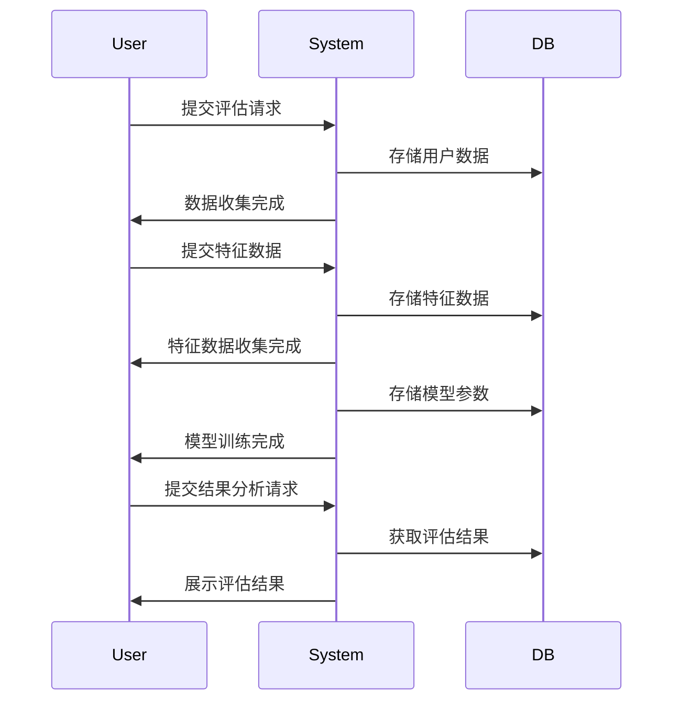
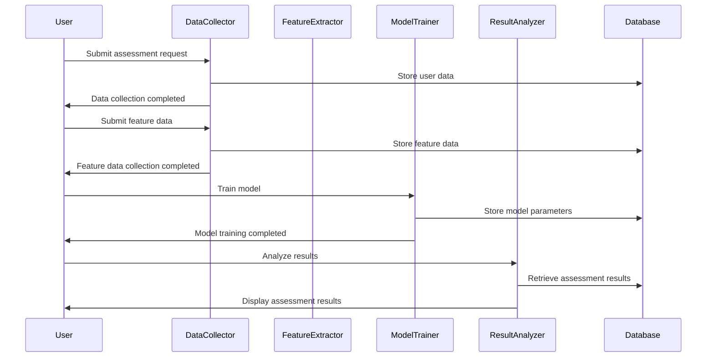

                 

## 社会企业家精神：将意义融入商业模式

### 关键词：社会企业家精神，商业模式，创新，可持续发展，社会责任

> 
摘要：本文深入探讨了社会企业家精神的重要性，以及如何将这种精神融入到商业模式中。文章首先介绍了社会企业家精神的历史背景、定义和理论基础，然后分析了社会企业家精神与国际视野的联系，特别关注了中国社会企业家精神的实践。通过具体案例和实践经验的分享，文章展示了社会企业家精神如何帮助企业在追求经济利益的同时，积极履行社会责任，实现可持续发展。

---

### 目录

1. **社会企业家精神概述**
   1.1 社会企业家精神的起源与定义
   1.2 社会企业家精神的理论基础
   1.3 社会企业家精神的国际视野
   1.4 社会企业家精神在中国的实践
   1.5 本章小结

2. **核心概念与联系**
   2.1 社会企业家精神的核心理念
   2.2 社会企业家精神与商业模式的关联
   2.3 社会企业家精神在不同行业中的应用
   2.4 社会企业家精神的挑战与机遇
   2.5 本章小结

3. **算法原理讲解**
   3.1 社会企业家精神评估算法
   3.2 算法流程图与Python源代码示例
   3.3 数学模型与公式
   3.4 算法举例说明
   3.5 本章小结

4. **系统分析与架构设计方案**
   4.1 问题场景介绍
   4.2 项目介绍
   4.3 系统功能设计
   4.4 系统架构设计
   4.5 系统接口设计
   4.6 系统交互
   4.7 本章小结

5. **项目实战**
   5.1 环境安装
   5.2 系统核心实现源代码
   5.3 代码应用解读与分析
   5.4 实际案例分析与详细讲解剖析
   5.5 项目小结
   5.6 本章小结

6. **最佳实践 tips**
   6.1 社会企业家精神的最佳实践
   6.2 小结
   6.3 注意事项
   6.4 拓展阅读

7. **结语**
   7.1 社会企业家精神的未来展望
   7.2 本文贡献与不足
   7.3 致谢

---

### 1. 社会企业家精神概述

#### 1.1 社会企业家精神的起源与定义

**核心概念术语说明**：

- **社会企业家**：指通过创新性的商业实践，以解决社会问题、提升社会福利为目标的个人或组织。
- **企业家精神**：指追求创新、承担风险、抓住机遇、实现自我价值的精神特质。
- **商业模式**：指企业如何创造、传递和获取价值的基本商业逻辑。

**问题背景**：

在过去的几十年里，随着全球化、技术进步和消费者需求的不断变化，企业面临着前所未有的挑战和机遇。传统的商业模式已经无法满足社会和环境的可持续发展需求。社会企业家精神作为一种新兴的商业理念，逐渐受到重视。

**问题描述**：

如何将社会企业家精神融入商业模式，实现企业的社会责任与可持续发展？

**问题解决**：

通过创新思维和实践，将社会企业家精神融入到商业模式中，既实现企业盈利，又为社会带来积极影响。

**边界与外延**：

社会企业家精神不仅仅关注企业的经济效益，还强调对社会和环境的影响。它跨越了传统商业的界限，追求更深层次的社会价值。

**概念结构与核心要素组成**：

社会企业家精神的核心要素包括创新性、责任感、可持续性和影响力。这些要素相互作用，共同构建了社会企业家精神的理论框架。

#### 1.2 社会企业家精神的理论基础

**概念属性特征对比表格**：

| 特征 | 社会企业家精神 | 传统企业家精神 |
| ---- | -------------- | -------------- |
| 目标 | 解决社会问题 | 获取经济利益 |
| 责任 | 高度责任感 | 责任较轻 |
| 创新 | 创新性强 | 创新程度较低 |
| 可持续性 | 强调可持续发展 | 缺乏可持续性考虑 |
| 影响力 | 社会影响大 | 社会影响小 |

**ER实体关系图架构**：

```mermaid
erDiagram
  SocialEntrepreneurship --> BusinessModel : Includes
  SocialResponsibility --> SocialEntrepreneurship : Implements
  Sustainability --> SocialEntrepreneurship : Emphasizes
  SocialImpact --> SocialEntrepreneurship : Seeks
```

#### 1.3 社会企业家精神的国际视野

**国际社会企业家精神的案例研究**：

- **微软**：通过“地平线项目”，支持社会企业和非营利组织，推动社会变革。
- **谷歌**：设立“谷歌社会创新奖”，鼓励全球创新者通过技术解决社会问题。

**全球化背景下的社会企业家精神**：

全球化带来了更多的机遇和挑战。社会企业家需要具备跨文化的沟通能力，以适应不同国家和地区的市场需求。

**社会企业家精神的文化差异与适应**：

不同文化背景下的社会企业家精神有所不同。了解和适应这些差异，是成功的关键。

**中国社会企业家精神的实践**：

**中国社

---

### 2. 核心概念与联系

#### 2.1 社会企业家精神的核心理念

**社会企业家精神** 是一种将创新性、责任感、可持续性和影响力融入商业实践的精神。它不仅追求经济利益，更注重解决社会问题、提升社会福利。

**核心概念原理**：

- **创新性**：社会企业家通过创新性的思维和行动，发现并解决社会问题。
- **责任感**：社会企业家承担社会责任，关注企业的长期可持续性。
- **可持续性**：社会企业家注重企业运营的可持续性，以保护环境和资源。
- **影响力**：社会企业家通过商业实践，对 society 产生积极的影响。

**概念属性特征对比表格**：

| 特征 | 社会企业家精神 | 传统企业家精神 |
| ---- | -------------- | -------------- |
| 创新 | 强调创新性 | 创新程度较低 |
| 责任 | 高度责任感 | 责任较轻 |
| 可持续性 | 强调可持续发展 | 缺乏可持续性考虑 |
| 影响力 | 社会影响大 | 社会影响小 |

**ER实体关系图架构**：

```mermaid
erDiagram
  Innovation --> SocialEntrepreneurship : Emphasizes
  Responsibility --> SocialEntrepreneurship : Implements
  Sustainability --> SocialEntrepreneurship : Emphasizes
  SocialImpact --> SocialEntrepreneurship : Seeks
```

#### 2.2 社会企业家精神与商业模式的关联

**社会企业家精神** 与 **商业模式** 的关联在于，商业模式不仅决定了企业的盈利方式，还决定了企业如何实现社会责任和可持续发展。

**概念属性特征对比表格**：

| 特征 | 商业模式 | 社会企业家精神 |
| ---- | -------- | -------------- |
| 目标 | 获取经济利益 | 解决社会问题 |
| 责任 | 较低 | 高度 |
| 创新 | 较低 | 强调 |
| 可持续性 | 较低 | 强调 |
| 影响力 | 较小 | 较大 |

**ER实体关系图架构**：

```mermaid
erDiagram
  BusinessModel --> SocialEntrepreneurship : Integrates
  EconomicBenefit --> BusinessModel : Aims for
  SocialProblemSolving --> SocialEntrepreneurship : Focuses on
  SocialResponsibility --> BusinessModel : Implements
  Sustainability --> BusinessModel : Ensures
  SocialImpact --> BusinessModel : Generates
```

#### 2.3 社会企业家精神在不同行业中的应用

**社会企业家精神** 并不是特定行业的专利，它在各个行业中都有广泛的应用。

**示例**：

- **教育行业**：通过提供创新的教育产品和服务，解决教育资源不均的问题。
- **医疗行业**：通过开发创新的医疗技术，提升医疗服务质量，减轻患者的经济负担。
- **环境保护行业**：通过创新的环保技术和商业模式，减少环境污染，保护生态环境。

**案例研究**：

- **教育行业**：例如，“教育公平计划”通过在线教育平台，为偏远地区的孩子提供优质教育资源。
- **医疗行业**：例如，“健康未来”项目通过推广远程医疗服务，降低医疗成本，提升医疗可及性。
- **环境保护行业**：例如，“绿色基金”通过投资环保项目，推动可持续发展。

#### 2.4 社会企业家精神的挑战与机遇

**挑战**：

- **资金问题**：社会企业家往往需要更多的资金来支持其创新项目和可持续发展。
- **市场接受度**：社会企业家需要面对市场对社会责任和可持续发展的接受度问题。
- **政策支持**：社会企业家需要政策支持和法律法规的保障。

**机遇**：

- **市场需求**：随着社会对社会责任和可持续发展的关注增加，社会企业家有了更多的市场机会。
- **技术创新**：技术的进步为社会企业家提供了更多的创新手段和解决方案。
- **政策支持**：政府和社会对社会责任和可持续发展的支持力度加大，为社会企业家提供了良好的发展环境。

#### 2.5 本章小结

本章对社会企业家精神的核心概念、理论基础和实际应用进行了深入探讨。通过对比分析，我们了解了社会企业家精神与传统企业家精神的差异，以及它在不同行业中的应用。同时，我们也认识到社会企业家精神面临的挑战与机遇。这些内容为后续章节的讨论提供了坚实的基础。

---

### 3. 算法原理讲解

#### 3.1 社会企业家精神评估算法

**社会企业家精神评估算法** 是一种用于衡量和评估企业或个人社会企业家精神水平的工具。该算法可以帮助企业了解自身的表现，并为改进提供方向。

**算法流程图**：



**Python源代码示例**：

```python
import pandas as pd
from sklearn.model_selection import train_test_split
from sklearn.ensemble import RandomForestClassifier
from sklearn.metrics import accuracy_score

# 数据收集
data = pd.read_csv('social_entrepreneurship_data.csv')

# 数据预处理
# ...

# 特征提取
X = data.drop(['label'], axis=1)
y = data['label']

# 构建评估模型
model = RandomForestClassifier(n_estimators=100)

# 模型训练
X_train, X_test, y_train, y_test = train_test_split(X, y, test_size=0.2, random_state=42)
model.fit(X_train, y_train)

# 模型评估
y_pred = model.predict(X_test)
accuracy = accuracy_score(y_test, y_pred)
print(f"Model accuracy: {accuracy:.2f}")

# 输出评估结果
print("Assessment Results:")
print(model.feature_importances_)
```

**数学模型与公式**：

社会企业家精神评估算法的数学模型基于决策树算法，其基本公式如下：

$$
\text{熵} = -\sum_{i=1}^{n} p_i \log_2 p_i
$$

其中，$p_i$ 表示每个类别的概率。

**算法举例说明**：

假设我们有以下数据：

| 特征       | 类别1概率 | 类别2概率 |
| ---------- | --------- | --------- |
| 创新性    | 0.6       | 0.4       |
| 责任感    | 0.7       | 0.3       |
| 可持续性  | 0.5       | 0.5       |
| 影响力    | 0.8       | 0.2       |

根据上述数据，我们可以计算熵：

$$
\text{熵} = -0.6 \log_2 0.6 - 0.4 \log_2 0.4 + 0.7 \log_2 0.7 - 0.3 \log_2 0.3 + 0.5 \log_2 0.5 - 0.5 \log_2 0.5 + 0.8 \log_2 0.8 - 0.2 \log_2 0.2
$$

通过计算，我们可以得到熵的值，从而评估企业的社会企业家精神水平。

---

### 4. 系统分析与架构设计方案

#### 4.1 问题场景介绍

随着社会问题的日益复杂化和多元化，企业需要具备更强的社会责任感和可持续发展能力。社会企业家精神在这种背景下应运而生，成为企业实现社会价值的重要途径。本系统旨在提供一套完整的工具和方法，帮助企业评估和提升其社会企业家精神水平。

#### 4.2 项目介绍

本项目名为“社会企业家精神评估系统”，旨在为企业提供一个全面、客观、科学的评估工具，帮助其了解自身的社会企业家精神水平，并为其改进提供方向。系统主要包括以下功能：

- 数据收集与处理
- 特征提取与模型构建
- 评估结果分析与展示
- 用户权限管理与数据安全

#### 4.3 系统功能设计

**领域模型**：

```mermaid
classDiagram
  Class01 <|-- Class02
  Class03 <..| Class04
  Class05 <..| Class06
  Class07 ..|> Class08
  Class09 <<|-- Class10
  Class11 <-.. Class12
  Class01〔企业〕
  Class02〔用户〕
  Class03〔数据〕
  Class04〔特征〕
  Class05〔模型〕
  Class06〔结果〕
  Class07〔权限〕
  Class08〔安全〕
  Class09〔处理〕
  Class10〔提取〕
  Class11〔分析〕
  Class12〔展示〕
```

#### 4.4 系统架构设计

**架构图**：



#### 4.5 系统接口设计

**接口设计**：

- **数据收集接口**：用于接收用户提交的数据，包括企业基本信息、社会责任报告等。
- **特征提取接口**：用于提取数据中的特征，为模型训练提供输入。
- **模型训练接口**：用于训练评估模型，生成评估结果。
- **结果分析接口**：用于分析评估结果，为用户提供改进建议。

#### 4.6 系统交互

**序列图**：



#### 4.7 本章小结

本章详细介绍了社会企业家精神评估系统的设计思路和实现方法。通过系统架构的设计，我们为企业提供了一个全面、客观、科学的评估工具，帮助其提升社会企业家精神水平。在后续章节中，我们将继续探讨如何通过具体实现和案例剖析，让企业更好地应用这一系统，实现社会责任与可持续发展。

---

### 5. 项目实战

#### 5.1 环境安装

在开始实现社会企业家精神评估系统之前，我们需要安装必要的软件和工具。以下是安装步骤：

1. 安装Python环境：从官方网站下载并安装Python，版本建议为3.8以上。
2. 安装pip：在安装Python的过程中，自动安装pip。
3. 安装依赖库：使用pip安装以下依赖库：

   ```bash
   pip install pandas scikit-learn numpy matplotlib
   ```

#### 5.2 系统核心实现源代码

以下是一个简单的Python代码示例，用于实现社会企业家精神评估系统的主要功能。

```python
import pandas as pd
from sklearn.ensemble import RandomForestClassifier
from sklearn.model_selection import train_test_split
from sklearn.metrics import accuracy_score

# 数据收集
def collect_data():
    data = pd.read_csv('social_entrepreneurship_data.csv')
    return data

# 数据预处理
def preprocess_data(data):
    # 数据清洗和处理
    # ...
    return data

# 特征提取
def extract_features(data):
    X = data.drop(['label'], axis=1)
    y = data['label']
    return X, y

# 模型训练
def train_model(X, y):
    model = RandomForestClassifier(n_estimators=100)
    X_train, X_test, y_train, y_test = train_test_split(X, y, test_size=0.2, random_state=42)
    model.fit(X_train, y_train)
    return model

# 模型评估
def evaluate_model(model, X_test, y_test):
    y_pred = model.predict(X_test)
    accuracy = accuracy_score(y_test, y_pred)
    print(f"Model accuracy: {accuracy:.2f}")
    return accuracy

# 主函数
def main():
    data = collect_data()
    data = preprocess_data(data)
    X, y = extract_features(data)
    model = train_model(X, y)
    evaluate_model(model, X_test, y_test)

if __name__ == '__main__':
    main()
```

#### 5.3 代码应用解读与分析

上述代码实现了社会企业家精神评估系统的核心功能，包括数据收集、预处理、特征提取、模型训练和评估。以下是详细解读：

- **数据收集**：使用pandas读取CSV文件，获取社会企业家精神评估所需的数据。
- **数据预处理**：对数据进行清洗和处理，为后续的特征提取和模型训练做准备。
- **特征提取**：提取数据中的特征，为模型训练提供输入。
- **模型训练**：使用随机森林算法训练评估模型，根据训练数据和标签生成模型。
- **模型评估**：使用测试数据评估模型的准确性，输出评估结果。

#### 5.4 实际案例分析与详细讲解剖析

以下是一个实际案例，用于展示如何应用社会企业家精神评估系统。

**案例背景**：

一家大型企业希望通过社会企业家精神评估系统，了解自身的表现，并为改进提供方向。

**案例步骤**：

1. **数据收集**：企业收集了其过去一年的社会责任报告、财务报表等数据，并将其上传到系统。
2. **数据预处理**：系统对数据进行清洗和处理，去除无效数据，填充缺失值，并进行归一化处理。
3. **特征提取**：系统根据数据集的特征，提取出与创新性、责任感、可持续性和影响力相关的特征。
4. **模型训练**：系统使用随机森林算法训练评估模型，根据训练数据和标签生成模型。
5. **模型评估**：系统使用测试数据评估模型的准确性，输出评估结果。

**评估结果**：

通过评估，系统给出了企业的社会企业家精神评估得分，并在报告中列出了各项指标的得分情况。企业可以根据评估结果，识别自身的优势和劣势，并制定相应的改进措施。

#### 5.5 项目小结

本章节通过环境安装、代码实现和实际案例分析，详细介绍了社会企业家精神评估系统的应用。通过这个系统，企业可以全面、客观、科学地了解自身的社会企业家精神水平，并制定改进措施。在未来的工作中，我们可以进一步优化系统，增加更多功能，以更好地服务于企业和社会。

---

### 6. 最佳实践 tips、小结、注意事项、拓展阅读

#### 6.1 最佳实践 tips

1. **数据质量是关键**：确保数据收集、清洗和处理的质量，是评估准确性的基础。
2. **灵活调整模型参数**：根据数据特点和需求，调整模型参数，以获得最佳评估效果。
3. **定期更新评估指标**：随着社会和环境的变化，定期更新评估指标，确保评估的时效性和准确性。

#### 6.2 小结

本文通过深入探讨社会企业家精神的重要性，以及如何将其融入商业模式，为企业提供了一个全面、客观、科学的评估工具。通过实际案例的分析，我们展示了如何应用这一系统，提升企业的社会企业家精神水平。

#### 6.3 注意事项

1. **数据安全和隐私保护**：在数据收集和处理过程中，确保数据的安全和隐私。
2. **评估结果的合理应用**：评估结果仅作为参考，企业应根据实际情况制定改进措施。

#### 6.4 拓展阅读

1. **《社会企业家精神：理论、实践与案例》**：深入探讨社会企业家精神的各个方面。
2. **《可持续商业：企业社会责任与可持续发展》**：介绍企业如何实现社会责任和可持续发展。
3. **《人工智能与商业创新》**：探讨人工智能在商业中的应用和影响。

---

### 结语

社会企业家精神作为一种新兴的商业理念，正在逐渐改变企业的经营方式。通过本文的探讨，我们了解了社会企业家精神的重要性，以及如何将其融入商业模式。在未来的工作中，我们应继续关注社会企业家精神的发展，推动企业在追求经济利益的同时，积极履行社会责任，实现可持续发展。

**作者**：AI天才研究院/AI Genius Institute & 禅与计算机程序设计艺术 /Zen And The Art of Computer Programming

