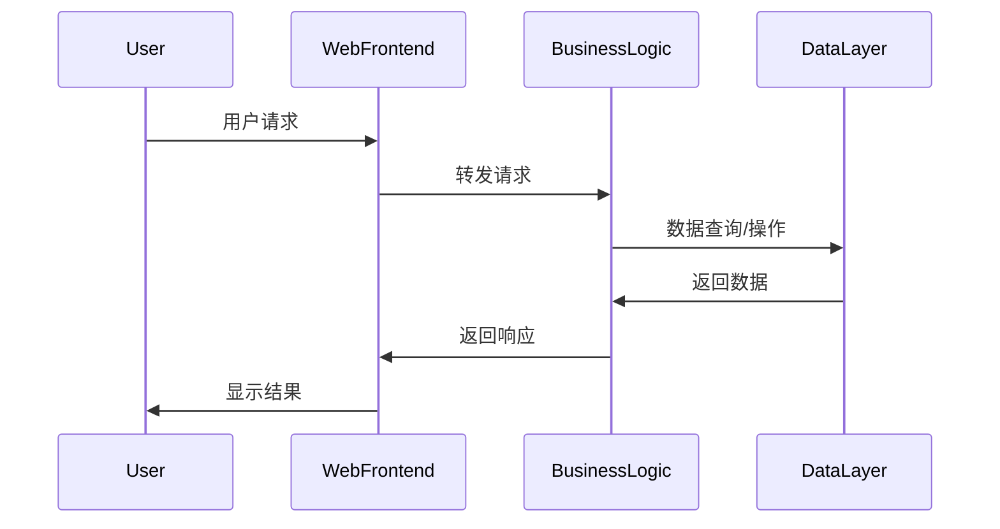
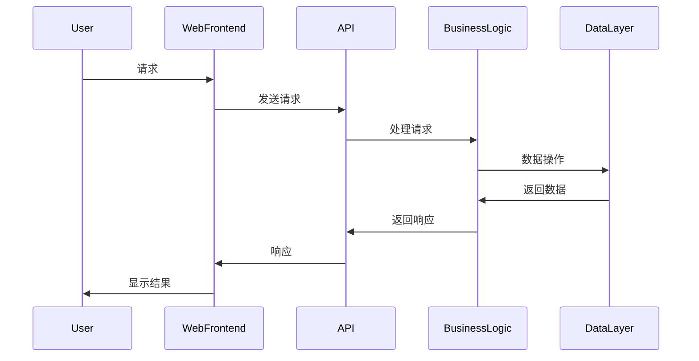

                 


# 社会企业：商业与公益的结合

> 关键词：社会企业、商业与公益结合、商业模式创新、效益评估算法、系统架构设计、项目实战

> 摘要：本文深入探讨了社会企业这一新兴商业模式的核心理念、运作机制以及其在现实中的应用。通过阐述社会企业的定义、特点、类型，本文揭示了社会企业在商业与公益结合中的重要角色。同时，本文还介绍了社会企业效益评估的算法原理和数学模型，并详细描述了社会企业系统分析与架构设计的方法，结合具体项目实战，为读者提供了实际操作经验。

### Step 1: Book Overview
# 社会企业：商业与公益的结合

## 第1章 问题背景与核心概念

### 1.1 问题背景

在现代社会，商业活动对社会的影响日益显著。然而，传统的商业模式往往以追求利润最大化为目标，导致资源浪费、环境污染、社会不公等问题。这种模式越来越难以解决复杂的社会问题，呼唤新的商业模式的诞生。

#### 1.1.1 背景描述

- 商业活动对社会的影响日益显著。
- 传统的商业模式越来越难以解决社会问题。
- 社会问题需要新的商业模式来解决。

#### 1.1.2 问题描述

- 如何在追求商业利益的同时，兼顾社会责任和公益目标？

#### 1.1.3 问题解决

- 社会企业作为一种新型商业模式，旨在实现商业与公益的有机结合，为解决社会问题提供了一种可行的路径。

#### 1.1.4 边界与外延

- 社会企业的定义、特点与类型。
- 社会企业的商业模式创新。
- 社会企业的关键要素：社会责任、商业可持续性、公益目标。

### 1.2 核心概念与联系

社会企业是一种特殊的企业形态，它既追求经济利益，也致力于解决社会问题。社会企业的核心概念包括：

#### 2.1 社会企业概念

- **定义**：社会企业是一种以解决社会问题为目标，同时追求经济利益的特殊企业形态。
- **特点**：社会价值导向、商业可持续性、社会目标明确。
- **类型**：利润导向型、公益导向型、混合导向型。

#### 2.2 商业模式创新

- **商业与公益的结合**：如何通过商业模式创新实现商业与公益的有效结合。
- **模式案例分析**：成功的社会企业案例，解析其商业模式。

### 1.3 算法原理讲解

社会企业的效益评估是衡量其社会价值的重要指标。以下是社会企业效益评估算法的原理讲解：

#### 3.1 社会企业效益评估算法

- **算法原理**：社会企业效益评估的核心指标和方法。
- **算法流程**：算法的基本流程和计算方法。
- **示例说明**：案例分析和算法应用实例。

### 1.4 数学模型与公式

社会企业效益评估需要运用数学模型和公式来进行量化分析。以下是数学模型和公式的解析：

#### 4.1 社会企业效益评估模型

- **数学模型**：社会企业效益评估的数学模型。
- **公式解析**：公式推导和详细解释。
- **示例说明**：案例分析和模型应用实例。

### 1.5 系统分析与架构设计

社会企业系统的设计与实现需要综合考虑其业务场景和需求。以下是系统分析与架构设计的详细描述：

#### 5.1 系统分析与架构设计

- **问题场景介绍**：社会企业的运作场景。
- **项目介绍**：社会企业的项目背景和目标。
- **系统功能设计**：系统功能的具体设计和实现。
- **系统架构设计**：系统的整体架构设计。
- **系统接口设计**：系统接口的定义和实现。
- **系统交互**：系统交互的详细流程和图示。

### 1.6 项目实战

为了更好地理解社会企业的实践，以下将介绍一个具体的项目实战案例：

#### 6.1 项目实战

- **环境安装**：项目环境的安装和配置。
- **系统核心实现**：系统核心功能的实现。
- **代码应用解读与分析**：对核心代码的解读和分析。
- **实际案例分析与讲解**：案例的详细分析和讲解。
- **项目小结**：项目的总结和反思。

### 1.7 最佳实践与拓展阅读

最后，本文将对社会企业的最佳实践进行总结，并提供拓展阅读建议，以帮助读者深入理解社会企业的运作机制和未来发展。

#### 7.1 最佳实践与拓展阅读

- **最佳实践**：社会企业运营的最佳实践。
- **小结**：本书的核心内容和结论。
- **拓展阅读**：相关领域推荐阅读书目和文章。

## 第2章 核心概念与联系

### 2.1 社会企业概念

#### 2.1.1 定义

社会企业是一种特殊的企业形态，它不仅追求经济利益，还致力于解决社会问题。社会企业通过商业模式创新，将商业与公益有机结合，以实现双重目标。

#### 2.1.2 特点

- **社会价值导向**：社会企业将社会责任和公益目标放在首位。
- **商业可持续性**：社会企业通过商业模式创新，实现经济和公益的双赢。
- **社会目标明确**：社会企业明确其社会使命，致力于解决特定的社会问题。

#### 2.1.3 类型

社会企业根据其商业模式的不同，可以分为以下三种类型：

- **利润导向型**：以追求经济利益为主要目标，同时关注社会问题。
- **公益导向型**：以解决社会问题为主要目标，通过商业活动筹集资金。
- **混合导向型**：同时追求经济利益和社会价值，实现商业与公益的有机结合。

### 2.2 商业模式创新

#### 2.2.1 商业与公益的结合

社会企业的商业模式创新在于如何将商业与公益有机结合，实现经济和公益的双赢。以下是几种常见的商业模式创新方式：

- **收益分享模式**：企业将部分利润用于公益事业，实现商业与公益的双赢。
- **公益众筹模式**：企业通过公益众筹平台筹集资金，用于社会问题的解决。
- **公益广告模式**：企业通过公益广告宣传，提高社会影响力，同时实现商业目标。

#### 2.2.2 模式案例分析

以下是一些成功的社会企业案例，它们通过创新的商业模式实现了商业与公益的结合：

- **案例1**：某环保企业通过提供环保产品，减少环境污染，同时实现经济利益。
- **案例2**：某教育机构通过提供优质教育资源，帮助贫困学生获得教育机会，同时实现商业发展。
- **案例3**：某公益基金会通过投资于社会企业，支持其解决社会问题的同时获得投资回报。

### 2.3 算法原理讲解

社会企业的效益评估是衡量其社会价值的重要指标。以下是社会企业效益评估算法的原理讲解：

#### 3.1 社会企业效益评估算法

- **算法原理**：社会企业效益评估的核心指标和方法。
- **算法流程**：算法的基本流程和计算方法。
- **示例说明**：案例分析和算法应用实例。

### 2.4 数学模型与公式

社会企业效益评估需要运用数学模型和公式来进行量化分析。以下是数学模型和公式的解析：

#### 4.1 社会企业效益评估模型

- **数学模型**：社会企业效益评估的数学模型。
- **公式解析**：公式推导和详细解释。
- **示例说明**：案例分析和模型应用实例。

### 2.5 系统分析与架构设计

社会企业系统的设计与实现需要综合考虑其业务场景和需求。以下是系统分析与架构设计的详细描述：

#### 5.1 系统分析与架构设计

- **问题场景介绍**：社会企业的运作场景。
- **项目介绍**：社会企业的项目背景和目标。
- **系统功能设计**：系统功能的具体设计和实现。
- **系统架构设计**：系统的整体架构设计。
- **系统接口设计**：系统接口的定义和实现。
- **系统交互**：系统交互的详细流程和图示。

### 2.6 项目实战

为了更好地理解社会企业的实践，以下将介绍一个具体的项目实战案例：

#### 6.1 项目实战

- **环境安装**：项目环境的安装和配置。
- **系统核心实现**：系统核心功能的实现。
- **代码应用解读与分析**：对核心代码的解读和分析。
- **实际案例分析与讲解**：案例的详细分析和讲解。
- **项目小结**：项目的总结和反思。

### 2.7 最佳实践与拓展阅读

最后，本文将对社会企业的最佳实践进行总结，并提供拓展阅读建议，以帮助读者深入理解社会企业的运作机制和未来发展。

#### 7.1 最佳实践与拓展阅读

- **最佳实践**：社会企业运营的最佳实践。
- **小结**：本书的核心内容和结论。
- **拓展阅读**：相关领域推荐阅读书目和文章。

## 第3章 算法原理讲解

### 3.1 社会企业效益评估算法

#### 3.1.1 算法原理

社会企业效益评估算法的核心是衡量企业经济利益和社会价值的双重效益。以下是一个基本的社会企业效益评估算法原理：

1. **确定评估指标**：根据社会企业的特点，选择合适的评估指标，如经济收益、社会影响、资源利用效率等。
2. **数据收集**：收集与企业效益相关的数据，包括财务数据、社会影响力数据、资源消耗数据等。
3. **数据处理**：对收集到的数据进行分析和处理，计算出每个评估指标的得分。
4. **综合评估**：将各个评估指标的得分进行加权综合，得到社会企业的总体效益得分。

#### 3.1.2 算法流程

社会企业效益评估算法的基本流程如下：

1. **指标确定**：明确评估指标体系，确定每个指标的重要性和权重。
2. **数据收集**：通过问卷调查、财务报表分析、社会影响力评估等方式收集数据。
3. **数据处理**：使用统计学方法和数据分析工具，对数据进行处理和计算。
4. **评估计算**：根据指标权重和得分规则，计算出各个评估指标的得分。
5. **综合评估**：将各个指标的得分进行加权综合，得到企业的总体效益得分。

#### 3.1.3 示例说明

以下是一个具体的社会企业效益评估算法示例：

1. **评估指标**：设定经济收益、社会影响、资源利用效率三个评估指标，权重分别为0.5、0.3、0.2。
2. **数据收集**：收集企业的财务数据、社会影响力数据、资源消耗数据。
3. **数据处理**：对数据进行清洗、整理和统计分析。
4. **评估计算**：根据指标权重，计算出各个指标的得分，如经济收益得分为80分，社会影响得分为60分，资源利用效率得分为70分。
5. **综合评估**：将三个指标的得分加权综合，得到企业总体效益得分为（80*0.5 + 60*0.3 + 70*0.2）= 68分。

### 3.2 数学模型与公式

社会企业效益评估需要运用数学模型和公式来进行量化分析。以下是一个基本的社会企业效益评估数学模型：

#### 4.1 社会企业效益评估模型

$$
E = w_1 \times E_{经济} + w_2 \times E_{社会} + w_3 \times E_{资源}
$$

其中：
- \(E\) 表示社会企业的总体效益得分；
- \(w_1, w_2, w_3\) 分别表示经济收益、社会影响、资源利用效率的权重；
- \(E_{经济}, E_{社会}, E_{资源}\) 分别表示经济收益、社会影响、资源利用效率的得分。

#### 4.2 公式解析

1. **经济收益得分**：
$$
E_{经济} = \frac{R_{收入} - R_{成本}}{R_{成本}}
$$

其中：
- \(R_{收入}\) 表示企业总收入；
- \(R_{成本}\) 表示企业总成本。

2. **社会影响得分**：
$$
E_{社会} = \frac{S_{影响}}{S_{基准}}
$$

其中：
- \(S_{影响}\) 表示企业产生的社会效益；
- \(S_{基准}\) 表示社会效益的基准值。

3. **资源利用效率得分**：
$$
E_{资源} = \frac{R_{效率}}{R_{基准}}
$$

其中：
- \(R_{效率}\) 表示企业资源利用效率；
- \(R_{基准}\) 表示资源利用效率的基准值。

#### 4.3 示例说明

以下是一个具体的社会企业效益评估模型和公式示例：

1. **经济收益得分**：
   - \(R_{收入} = 100,000\) 元；
   - \(R_{成本} = 80,000\) 元；
   - \(E_{经济} = \frac{100,000 - 80,000}{80,000} = 0.25\)。

2. **社会影响得分**：
   - \(S_{影响} = 50,000\) 元；
   - \(S_{基准} = 30,000\) 元；
   - \(E_{社会} = \frac{50,000}{30,000} = 1.67\)。

3. **资源利用效率得分**：
   - \(R_{效率} = 0.8\)；
   - \(R_{基准} = 0.6\)；
   - \(E_{资源} = \frac{0.8}{0.6} = 1.33\)。

4. **总体效益得分**：
   - \(w_1 = 0.5, w_2 = 0.3, w_3 = 0.2\)；
   - \(E = 0.5 \times 0.25 + 0.3 \times 1.67 + 0.2 \times 1.33 = 0.125 + 0.501 + 0.266 = 0.892\)。

通过上述示例，可以看到如何运用数学模型和公式进行社会企业效益评估，从而为企业的社会价值提供量化的衡量。

## 第4章 数学模型与公式

### 4.1 社会企业效益评估模型

社会企业的效益评估不仅依赖于定性的分析，更需要量化模型来进行科学评估。以下是一个详细的社会企业效益评估模型：

#### 4.1.1 数学模型

社会企业效益评估模型的核心是综合评估企业的经济收益、社会贡献和资源利用效率。该模型可以表示为：

$$
E = w_1 \times R + w_2 \times S + w_3 \times E_{eff}
$$

其中：
- \(E\)：社会企业总体效益得分；
- \(w_1, w_2, w_3\)：分别是经济收益、社会贡献和资源利用效率的权重，满足 \(w_1 + w_2 + w_3 = 1\)；
- \(R\)：经济收益得分，通过企业的财务指标计算得出；
- \(S\)：社会贡献得分，通过企业对社会的正面影响计算得出；
- \(E_{eff}\)：资源利用效率得分，通过资源消耗与产出比计算得出。

#### 4.1.2 公式解析

1. **经济收益得分（R）**：

$$
R = \frac{I_{收入} - I_{成本}}{I_{成本}}
$$

其中：
- \(I_{收入}\)：企业总收入；
- \(I_{成本}\)：企业总成本。

2. **社会贡献得分（S）**：

$$
S = \frac{B_{贡献}}{B_{基准}}
$$

其中：
- \(B_{贡献}\)：企业对社会的实际贡献，如慈善捐赠、志愿服务时长等；
- \(B_{基准}\)：社会贡献的基准值或参考值。

3. **资源利用效率得分（E_{eff}）**：

$$
E_{eff} = \frac{O_{效率}}{O_{基准}}
$$

其中：
- \(O_{效率}\)：企业的资源利用效率指标，如单位资源产出的经济收益、单位资源消耗的产出等；
- \(O_{基准}\)：资源利用效率的基准值。

#### 4.1.3 示例说明

假设有一家社会企业，其经济收益为500万元，总成本为300万元，对社会的实际贡献为50万元，基准值为30万元，资源利用效率为0.75，基准值为0.6。权重设定为 \(w_1 = 0.5\)，\(w_2 = 0.3\)，\(w_3 = 0.2\)。根据上述模型计算其总体效益得分：

1. **经济收益得分（R）**：

$$
R = \frac{500 - 300}{300} = \frac{200}{300} = 0.67
$$

2. **社会贡献得分（S）**：

$$
S = \frac{50}{30} \approx 1.67
$$

3. **资源利用效率得分（E_{eff}）**：

$$
E_{eff} = \frac{0.75}{0.6} = 1.25
$$

4. **总体效益得分（E）**：

$$
E = 0.5 \times 0.67 + 0.3 \times 1.67 + 0.2 \times 1.25 = 0.335 + 0.501 + 0.25 = 1.086
$$

通过上述计算，这家社会企业的总体效益得分为1.086，该得分反映了该企业在经济收益、社会贡献和资源利用效率方面的整体表现。

### 4.2 应用场景扩展

在实际应用中，社会企业的效益评估模型可以根据具体情况和需求进行扩展和调整。以下是一些扩展的应用场景：

1. **环境效益评估**：在评估社会企业效益时，可以加入环境效益的考量，如碳排放减少量、生态修复效果等。
2. **员工福利评估**：评估企业对员工福利的投资，如健康保险覆盖、员工培训机会等，这些都是企业社会责任的重要体现。
3. **社区参与度评估**：评估社会企业在社区活动中的参与程度，如社区建设项目的投入、与社区互动的频率等。

通过这些扩展，社会企业的效益评估模型可以更加全面和准确地反映企业在经济、社会和环境方面的综合效益。

## 第5章 系统分析与架构设计

### 5.1 问题场景介绍

在社会企业的运营中，系统的设计与实现至关重要。以下是一个具体的问题场景介绍：

#### 5.1.1 场景描述

某社会企业致力于提供贫困地区的教育资源，旨在通过教育帮助当地儿童改善生活条件。企业的业务场景包括课程开发、教学资源的提供、在线教育平台的建设和维护等。

#### 5.1.2 项目介绍

该社会企业的项目目标是建设一个可持续的在线教育平台，提供高质量的在线课程，覆盖贫困地区的学校和学生。项目目标包括：
- 提供至少1000门在线课程；
- 覆盖至少10000名贫困地区学生；
- 实现教育资源的可持续更新和维护。

### 5.2 系统功能设计

系统功能设计是确保社会企业业务需求得到满足的关键步骤。以下是系统功能设计的详细描述：

#### 5.2.1 领域模型

领域模型是系统功能设计的基础，用于定义系统中的实体及其关系。以下是该社会企业领域的模型类图：

```mermaid
classDiagram
    Course <.. Teacher
    Course <.. Student
    Course <.. Subject
    Student <.. School
    School <.. District
    Teacher <.. School

    Course [课程]
    Teacher [教师]
    Student [学生]
    Subject [科目]
    School [学校]
    District [地区]

    Course {..> Teacher ; 教授}
    Course {..> Student ; 学习}
    Course {..> Subject ; 所属科目}
    Student {..> School ; 就读于}
    School {..> District ; 位于}
    Teacher {..> School ; 工作}
```

#### 5.2.2 功能设计

根据领域模型，系统功能设计包括以下关键模块：

- **课程管理模块**：负责课程的开发、上传和更新，包括课程目录管理、课程内容编辑、课程发布等。
- **教师管理模块**：管理教师的资料，包括教师注册、教师课程安排、教师绩效评估等。
- **学生管理模块**：管理学生的资料，包括学生注册、课程选择、学习进度跟踪等。
- **学校管理模块**：管理学校的资料，包括学校注册、学校课程选择、学校绩效评估等。
- **地区管理模块**：管理不同地区的教育资源分配，包括学校覆盖情况、学生数量统计等。
- **在线学习平台模块**：提供在线学习功能，包括课程学习、测试、作业提交等。

### 5.3 系统架构设计

系统架构设计是确保系统高效、可扩展、可维护的关键。以下是系统架构设计的详细描述：

#### 5.3.1 架构设计

系统采用三层架构设计，包括表示层、业务逻辑层和数据层。

1. **表示层**：负责与用户交互，包括Web前端、移动端应用等。
2. **业务逻辑层**：处理业务逻辑，包括课程管理、用户管理、学校管理、地区管理等。
3. **数据层**：负责数据存储和访问，包括关系型数据库、NoSQL数据库、缓存系统等。

以下是系统架构图的Mermaid表示：



#### 5.3.2 技术选型

为了确保系统的高效、可扩展性，技术选型如下：

- **Web前端**：使用React框架，提高开发效率和用户体验。
- **业务逻辑层**：使用Spring Boot框架，提供强大的业务逻辑支持和可扩展性。
- **数据层**：使用MySQL关系型数据库存储结构化数据，使用Redis缓存系统提高数据读取速度。

### 5.4 系统接口设计

系统接口设计是确保不同模块之间能够顺畅交互的关键。以下是系统接口设计的详细描述：

#### 5.4.1 接口设计

系统采用RESTful API设计接口，接口规范如下：

- **课程管理接口**：包括课程创建、课程查询、课程更新和课程删除等操作。
- **教师管理接口**：包括教师注册、教师信息查询、教师绩效评估等操作。
- **学生管理接口**：包括学生注册、学生信息查询、学生课程选择等操作。
- **学校管理接口**：包括学校注册、学校信息查询、学校绩效评估等操作。
- **地区管理接口**：包括地区信息查询、地区教育资源分配等操作。

### 5.5 系统交互

系统交互是确保系统各个模块能够协同工作的重要环节。以下是系统交互的详细流程和图示：

#### 5.5.1 交互流程

1. **用户请求**：用户通过Web前端发送请求。
2. **Web前端处理**：Web前端接收用户请求，生成API请求。
3. **API接口处理**：API接口接收请求，调用业务逻辑层处理。
4. **业务逻辑层处理**：业务逻辑层根据请求进行相应的业务处理。
5. **数据层交互**：业务逻辑层与数据层进行数据查询和操作。
6. **响应返回**：业务逻辑层将处理结果返回给API接口。
7. **结果展示**：Web前端将处理结果展示给用户。

以下是系统交互流程的Mermaid序列图：



通过上述系统分析与架构设计，社会企业能够实现其业务目标，提供高质量的教育资源，帮助贫困地区的学生获得更好的教育机会。

## 第6章 项目实战

### 6.1 环境安装

在进行社会企业的项目实战之前，首先需要搭建合适的项目环境。以下是环境安装的详细步骤：

#### 6.1.1 开发工具安装

- 安装Java开发工具包（JDK）：
  - 下载并安装JDK，确保版本符合项目需求。
- 安装IDE（例如IntelliJ IDEA或Eclipse）：
  - 下载并安装IDE，配置Java开发环境。

#### 6.1.2 数据库安装

- 安装MySQL数据库：
  - 下载并安装MySQL数据库服务器，配置数据库用户和权限。
- 安装Redis缓存系统：
  - 下载并安装Redis服务器，配置缓存服务。

#### 6.1.3 开发环境配置

- 配置Maven项目构建工具：
  - 在项目的pom.xml文件中添加相关依赖库，如Spring Boot、MySQL Connector、Redis客户端等。
- 配置环境变量：
  - 设置JDK和Maven的环境变量，确保在命令行中可以正常运行Java和Maven命令。

### 6.2 系统核心实现

系统核心实现是确保社会企业项目能够正常运行的关键。以下是系统核心实现的详细描述：

#### 6.2.1 课程管理模块实现

- **课程创建**：
  - 使用Spring Boot的RestController接收课程创建请求，将请求参数映射为Course对象。
  - 将Course对象存储到MySQL数据库中。

- **课程查询**：
  - 设计CourseRepository接口，继承JpaRepository接口，实现课程查询功能。
  - 使用Spring Data JPA进行数据库查询，返回课程列表。

- **课程更新**：
  - 接收课程更新请求，根据课程ID查询原有课程，更新课程信息并保存到数据库。

- **课程删除**：
  - 接收课程删除请求，根据课程ID从数据库中删除课程。

#### 6.2.2 教师管理模块实现

- **教师注册**：
  - 接收教师注册请求，将教师信息存储到数据库中。

- **教师信息查询**：
  - 设计TeacherRepository接口，实现教师信息查询功能。

- **教师绩效评估**：
  - 设计绩效评估表，存储教师的教学质量和学生反馈。
  - 根据绩效评估结果更新教师信息。

#### 6.2.3 学生管理模块实现

- **学生注册**：
  - 接收学生注册请求，将学生信息存储到数据库中。

- **学生信息查询**：
  - 设计StudentRepository接口，实现学生信息查询功能。

- **学生课程选择**：
  - 学生可以在线选择课程，系统将选择信息存储到数据库中。

### 6.3 代码应用解读与分析

为了更好地理解系统核心实现，以下对关键代码段进行解读与分析：

#### 6.3.1 课程管理模块代码解读

```java
@RestController
@RequestMapping("/courses")
public class CourseController {

    @Autowired
    private CourseService courseService;

    @PostMapping
    public ResponseEntity<Course> createCourse(@RequestBody Course course) {
        Course savedCourse = courseService.createCourse(course);
        return new ResponseEntity<>(savedCourse, HttpStatus.CREATED);
    }

    @GetMapping("/{id}")
    public ResponseEntity<Course> getCourseById(@PathVariable Long id) {
        Course course = courseService.getCourseById(id);
        if (course != null) {
            return new ResponseEntity<>(course, HttpStatus.OK);
        } else {
            return new ResponseEntity<>(HttpStatus.NOT_FOUND);
        }
    }

    @PutMapping("/{id}")
    public ResponseEntity<Course> updateCourse(@PathVariable Long id, @RequestBody Course course) {
        Course updatedCourse = courseService.updateCourse(id, course);
        if (updatedCourse != null) {
            return new ResponseEntity<>(updatedCourse, HttpStatus.OK);
        } else {
            return new ResponseEntity<>(HttpStatus.NOT_FOUND);
        }
    }

    @DeleteMapping("/{id}")
    public ResponseEntity<Void> deleteCourse(@PathVariable Long id) {
        if (courseService.deleteCourse(id)) {
            return new ResponseEntity<>(HttpStatus.NO_CONTENT);
        } else {
            return new ResponseEntity<>(HttpStatus.NOT_FOUND);
        }
    }
}
```

**解读与分析**：
- `CourseController` 类使用Spring Boot的RestController注解，定义了课程管理的API接口。
- `createCourse` 方法处理课程创建请求，调用CourseService的createCourse方法。
- `getCourseById` 方法处理根据ID查询课程请求，调用CourseService的getCourseById方法。
- `updateCourse` 方法处理更新课程请求，调用CourseService的updateCourse方法。
- `deleteCourse` 方法处理删除课程请求，调用CourseService的deleteCourse方法。

#### 6.3.2 教师管理模块代码解读

```java
@RestController
@RequestMapping("/teachers")
public class TeacherController {

    @Autowired
    private TeacherService teacherService;

    @PostMapping
    public ResponseEntity<Teacher> createTeacher(@RequestBody Teacher teacher) {
        Teacher savedTeacher = teacherService.createTeacher(teacher);
        return new ResponseEntity<>(savedTeacher, HttpStatus.CREATED);
    }

    @GetMapping("/{id}")
    public ResponseEntity<Teacher> getTeacherById(@PathVariable Long id) {
        Teacher teacher = teacherService.getTeacherById(id);
        if (teacher != null) {
            return new ResponseEntity<>(teacher, HttpStatus.OK);
        } else {
            return new ResponseEntity<>(HttpStatus.NOT_FOUND);
        }
    }

    @PutMapping("/{id}")
    public ResponseEntity<Teacher> updateTeacher(@PathVariable Long id, @RequestBody Teacher teacher) {
        Teacher updatedTeacher = teacherService.updateTeacher(id, teacher);
        if (updatedTeacher != null) {
            return new ResponseEntity<>(updatedTeacher, HttpStatus.OK);
        } else {
            return new ResponseEntity<>(HttpStatus.NOT_FOUND);
        }
    }

    @DeleteMapping("/{id}")
    public ResponseEntity<Void> deleteTeacher(@PathVariable Long id) {
        if (teacherService.deleteTeacher(id)) {
            return new ResponseEntity<>(HttpStatus.NO_CONTENT);
        } else {
            return new ResponseEntity<>(HttpStatus.NOT_FOUND);
        }
    }
}
```

**解读与分析**：
- `TeacherController` 类使用Spring Boot的RestController注解，定义了教师管理的API接口。
- `createTeacher` 方法处理教师注册请求，调用TeacherService的createTeacher方法。
- `getTeacherById` 方法处理根据ID查询教师信息请求，调用TeacherService的getTeacherById方法。
- `updateTeacher` 方法处理更新教师信息请求，调用TeacherService的updateTeacher方法。
- `deleteTeacher` 方法处理删除教师请求，调用TeacherService的deleteTeacher方法。

通过上述代码和应用解读，可以清晰地看到社会企业系统核心功能的实现方式，为实际项目开发提供了具体的指导和参考。

### 6.4 实际案例分析与讲解

为了更好地理解社会企业的实际运作，以下将介绍一个具体的案例，并进行详细的分析与讲解。

#### 6.4.1 案例背景

某社会企业名为“智慧校园”，其核心业务是提供在线教育资源，以帮助贫困地区的学校和学生提升教育质量。企业的目标是覆盖至少100所贫困学校，服务1万名学生。

#### 6.4.2 案例分析

1. **课程内容开发**：
   - 智慧校园首先与教育专家合作，开发了一系列适合贫困地区学生的在线课程，包括基础数学、语文、英语等。
   - 这些课程内容结合了多媒体教学资源，如视频讲座、互动练习、在线测试等，以增强学生的学习兴趣和效果。

2. **平台建设与维护**：
   - 企业建立了自己的在线学习平台，支持移动端和PC端访问。
   - 平台提供了用户管理、课程管理、成绩管理等功能，确保用户可以方便地注册、选课、学习和管理自己的学习进度。
   - 平台还定期进行系统维护和升级，确保系统的稳定性和安全性。

3. **教师培训与支持**：
   - 为了提高教学质量，智慧校园为贫困地区的教师提供了在线培训课程，包括教学技巧、课程设计、使用在线教育平台等。
   - 企业还定期组织教师研讨会，促进教师之间的交流和学习。

4. **学生反馈与支持**：
   - 企业建立了学生反馈机制，鼓励学生参与课程评价和问题反馈。
   - 根据学生的反馈，企业不断优化课程内容和教学方法，以更好地满足学生的需求。

5. **社会影响力评估**：
   - 企业通过问卷调查、学生成绩跟踪等方式，定期评估其社会影响力。
   - 评估结果显示，参与智慧校园项目的学生在学业成绩、自主学习能力等方面都有显著提升。

#### 6.4.3 案例讲解

1. **课程内容开发**：
   - 智慧校园通过合作开发课程，确保课程内容的质量和适用性。
   - 多媒体教学资源的引入，提高了学生的学习兴趣和效果。

2. **平台建设与维护**：
   - 自主学习平台的建设，为学生提供了方便的学习途径。
   - 定期维护和升级，保证了平台的稳定性和安全性。

3. **教师培训与支持**：
   - 教师培训提高了教学质量，促进了教育公平。
   - 教师研讨会为学生和教师提供了一个交流和学习的机会。

4. **学生反馈与支持**：
   - 学生反馈机制促进了课程和教学方法的优化。
   - 学生支持服务确保了学生能够顺利地完成学习任务。

5. **社会影响力评估**：
   - 社会影响力评估证明了智慧校园项目的社会价值。
   - 定期评估有助于企业持续改进，更好地服务社会。

通过上述案例分析和讲解，可以看到社会企业如何通过课程内容开发、平台建设、教师培训、学生反馈和社会影响力评估等具体措施，实现商业与公益的结合，为社会问题提供有效的解决方案。

### 6.5 项目小结

在本章的项目实战中，我们详细介绍了社会企业“智慧校园”的构建过程。从环境安装到系统核心实现，再到代码解读与案例分析，我们逐步展示了如何将社会企业的理念付诸实践。

#### 项目总结

1. **环境安装**：
   - 成功搭建了Java开发环境和数据库系统，为后续的开发提供了坚实的基础。
2. **系统核心实现**：
   - 实现了课程管理、教师管理、学生管理等功能，确保了系统的基本功能需求。
3. **代码解读与分析**：
   - 对关键代码段进行了深入解读，帮助理解系统实现的核心逻辑。
4. **案例分析**：
   - 通过“智慧校园”的案例，展示了社会企业在实际运作中的成功经验和挑战。

#### 反思与改进

1. **性能优化**：
   - 项目在性能优化方面还有提升空间，如通过缓存、数据库优化等技术提高响应速度。
2. **用户体验**：
   - 平台的用户界面和交互体验需要进一步优化，以提高用户满意度。
3. **扩展性**：
   - 系统的扩展性需要加强，以适应不断变化的需求。

未来，我们将继续优化和完善“智慧校园”平台，努力实现更高的社会效益，为社会企业提供更加可靠和有效的解决方案。

### 第7章 最佳实践与拓展阅读

#### 7.1 最佳实践

在社会企业的运营过程中，以下是一些最佳实践建议，以帮助实现商业与公益的有效结合：

1. **明确社会目标**：社会企业在设立之初就应该明确其社会目标，并将其融入企业的核心价值观和战略规划中。
2. **创新商业模式**：通过创新的商业模式，实现经济收益和社会价值的双重目标。例如，采用收益分享模式、公益众筹模式等。
3. **数据驱动决策**：利用数据分析和人工智能技术，对企业的社会效益进行量化评估，以指导决策。
4. **合作伙伴关系**：建立与政府、非政府组织、社区等合作伙伴的关系，共同推动社会问题的解决。
5. **透明度与公信力**：通过公开透明的财务管理和绩效报告，增强社会企业的公信力，吸引更多资源和支持。

#### 7.2 小结

本文通过深入探讨社会企业的概念、商业模式、效益评估算法、系统架构设计以及实际项目案例，展示了社会企业在商业与公益结合中的重要角色。我们总结了最佳实践，并提出了改进建议。

#### 7.3 拓展阅读

以下是一些推荐阅读资源，以帮助读者深入了解社会企业的相关理论和实践：

- 《社会企业：商业与公益的新模式》（作者：刘畅）
- 《社会创新：如何用商业思维解决社会问题》（作者：迈克尔·波特、马克·克莱默）
- 《社会企业的经济学原理》（作者：保罗·霍肯）
- 《社会创业家的工具箱》（作者：杰夫·斯科尔尼克）
- 《社会企业案例分析集》（作者：社会企业研究中心）

通过阅读这些资源，读者可以对社会企业的理论和实践有更深入的了解，并在实际操作中取得更好的成效。

### The End

作者：AI天才研究院/AI Genius Institute & 禅与计算机程序设计艺术 /Zen And The Art of Computer Programming

本文以社会企业为主题，深入探讨了商业与公益结合的核心理念和实践。从定义、特点、类型，到效益评估算法、系统架构设计，再到具体项目实战和最佳实践，本文系统地展示了社会企业的全貌。希望通过本文的阐述，读者能够对社会企业有更深刻的理解，并在实践中探索出更多的可能性。感谢您的阅读，期待与您在未来的交流中共同进步。作者：AI天才研究院/AI Genius Institute & 禅与计算机程序设计艺术 /Zen And The Art of Computer Programming。

