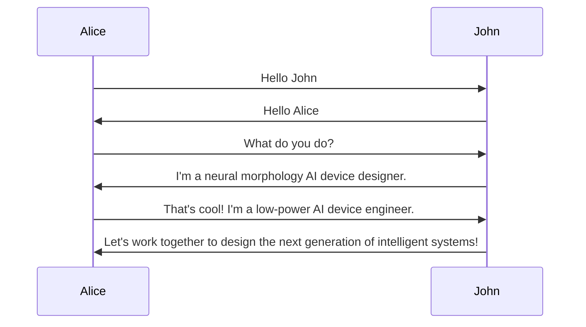

                 

# 神经形态计算在低功耗AI设备中的应用：模拟人脑的学习方式

## 关键词
- 神经形态计算
- 低功耗AI设备
- 人脑模拟
- 神经元
- 突触
- 能量效率

## 摘要
本文探讨了神经形态计算在低功耗AI设备中的应用，通过模拟人脑的学习方式，实现了高效的能量消耗和处理能力。文章首先介绍了神经形态计算的基本原理和优势，然后分析了神经形态计算在感知任务、认知任务和智能控制系统中的应用，并详细讲解了低功耗AI设备的设计与实现。最后，本文展望了神经形态计算与低功耗AI设备的未来发展趋势。

## 第一部分：背景介绍

### 第1章：问题背景与核心概念

在数字时代，人工智能（AI）技术正迅速发展，各类智能设备的应用日益广泛。然而，传统的AI设备在处理复杂任务时往往需要大量功耗，这对于电池供电的移动设备来说是一个巨大的挑战。因此，如何实现低功耗AI设备成为了一个亟待解决的问题。

神经形态计算（Neuromorphic Computing）作为一种新兴的计算范式，通过模拟人脑的神经结构和功能，实现高效的能量消耗和处理能力。这种计算方式与传统的计算方式相比，具有更高的效率和更低的功耗。因此，将神经形态计算应用于低功耗AI设备中，成为了一个具有前景的研究方向。

### 1.1 问题背景

传统的AI设备在处理图像、语音和自然语言等任务时，通常采用冯·诺伊曼架构。这种架构虽然能够实现高效的计算，但需要大量的能量消耗。根据相关研究，传统的AI设备在执行特定任务时，功耗高达数十瓦，这对于电池供电的移动设备来说是无法承受的。

相比之下，人脑在执行相同的任务时，能量消耗却非常低。人脑的功率仅为20瓦左右，而其处理能力和效率却远超传统计算机。因此，如何模拟人脑的计算方式，实现低功耗AI设备，成为了一个重要的研究方向。

### 1.2 核心概念

**神经形态计算**：神经形态计算是一种模仿人脑的神经网络结构的计算方式，通过模拟神经元和突触的工作原理，实现高效的能量消耗和处理能力。神经形态计算的核心在于神经元和突触的模拟，以及神经网络的学习和自适应能力。

**低功耗AI设备**：低功耗AI设备是指能够实现特定AI功能，同时功耗极低的设备。这种设备通常用于电池供电的移动设备中，如智能手机、智能手表和可穿戴设备等。低功耗AI设备的设计需要综合考虑功耗、性能和能效等因素。

### 1.3 问题解决

神经形态计算通过模拟人脑的计算方式，实现了高效的能量消耗和处理能力。这种计算方式在低功耗AI设备中的应用，有望解决传统AI设备功耗高的问题。通过神经形态计算，低功耗AI设备可以执行复杂任务，同时保持低功耗，延长设备的使用寿命。

### 1.4 边界与外延

神经形态计算在低功耗AI设备中的应用，不仅限于移动设备，还可以应用于其他领域，如智能交通、智能制造和医疗设备等。这些领域对功耗和能效有更高的要求，神经形态计算的应用将带来革命性的变化。

同时，神经形态计算的研究还涉及多个学科，包括计算机科学、神经科学、材料科学和物理学等。这些学科的结合，将推动神经形态计算的进一步发展和应用。

### 1.5 概念结构与核心要素组成

神经形态计算的核心要素包括神经元、突触、神经网络和学习算法。神经元是神经形态计算的基本单元，负责信息的接收、处理和传递。突触是神经元之间的连接部分，通过改变突触的连接强度来调整网络的学习能力和适应性。神经网络是神经元和突触的组合，实现复杂的计算任务。学习算法则用于调整神经网络的结构和参数，提高网络的性能和适应性。

在低功耗AI设备中，这些核心要素被集成到硬件和软件中，实现高效的计算和处理。硬件部分主要包括神经元和突触的模拟，以及神经网络的学习和自适应。软件部分则包括学习算法的实现和优化，以及AI任务的执行和控制。

## 第二部分：核心概念与联系

### 第2章：神经形态计算原理

#### 2.1 神经形态计算的基本原理

神经形态计算的基本原理是模仿人脑的神经网络结构和工作机制。人脑由大量的神经元组成，神经元之间通过突触连接形成复杂的神经网络。神经网络通过学习和适应，实现各种认知和计算任务。

神经形态计算通过模拟这种神经网络结构，实现高效的计算和处理。神经元在神经形态计算中通常被模拟为人工神经元，突触被模拟为连接神经元之间的电子元件。神经网络则由大量的人工神经元和突触组成，通过电子信号在神经元之间的传递和相互作用，实现复杂的计算任务。

#### 2.2 神经元与突触

神经元是神经形态计算的基本单元，负责信息的接收、处理和传递。神经元可以接收来自其他神经元的信号，通过突触将这些信号传递出去。神经元的信号传递过程通常包括以下几个步骤：

1. **信号接收**：神经元通过树突接收来自其他神经元的信号。
2. **信号整合**：神经元将接收到的信号整合，形成一个新的信号。
3. **信号传递**：神经元通过轴突将信号传递到其他神经元。
4. **信号触发**：如果整合后的信号达到一定的阈值，神经元会触发一个动作电位，向下一个神经元传递信号。

突触是神经元之间的连接部分，负责信号的传递和调制。突触分为兴奋性突触和抑制性突触，分别负责增强和抑制信号的传递。突触的连接强度可以通过训练和学习进行调整，实现神经网络的自适应和学习能力。

#### 2.3 神经网络结构

神经网络是神经形态计算的核心部分，由大量的人工神经元和突触组成。神经网络的结构和功能决定了计算任务的能力和效率。常见的神经网络结构包括以下几种：

1. **前馈神经网络**：前馈神经网络是单向传递的神经网络，信息从输入层经过隐藏层传递到输出层。前馈神经网络在图像识别、语音识别和自然语言处理等领域有广泛应用。
2. **循环神经网络**：循环神经网络具有时间记忆能力，可以处理序列数据。循环神经网络在语音识别、自然语言处理和视频分析等领域有广泛应用。
3. **卷积神经网络**：卷积神经网络具有局部连接和权重共享的特点，可以高效地处理图像和视频数据。卷积神经网络在图像识别、物体检测和视频分析等领域有广泛应用。

#### 2.4 学习算法

神经形态计算的学习算法是神经网络训练和优化的关键。学习算法通过调整神经网络的结构和参数，提高网络的性能和适应性。常见的学习算法包括以下几种：

1. **误差反向传播算法**：误差反向传播算法是最常用的学习算法，通过反向传播误差，调整网络权重和偏置，实现网络的训练和优化。
2. **遗传算法**：遗传算法是一种基于自然进化的优化算法，通过模拟自然选择和遗传变异，实现网络的训练和优化。
3. **粒子群优化算法**：粒子群优化算法是一种基于群体智能的优化算法，通过模拟鸟群觅食行为，实现网络的训练和优化。

#### 2.5 神经形态计算的优势与局限

**优势**：

1. **高效能**：神经形态计算通过模拟人脑的神经网络结构和工作机制，实现了高效的计算和处理能力。
2. **自适应性**：神经形态计算可以通过调整神经网络的结构和参数，实现自适应学习和适应能力。
3. **可塑性**：神经形态计算具有可塑性，可以适应新的环境和任务。

**局限**：

1. **复杂度**：神经形态计算的模型和算法相对复杂，实现难度较大。
2. **数据需求**：神经形态计算需要对大量数据进行训练，以便模拟人脑的功能。

### 第3章：神经形态计算的优势与局限

#### 3.1 优势

**高效能**：神经形态计算通过模拟人脑的神经网络结构和工作机制，实现了高效的计算和处理能力。与传统的计算方式相比，神经形态计算在处理复杂任务时具有更高的效率和更低的功耗。

**自适应性**：神经形态计算可以通过调整神经网络的结构和参数，实现自适应学习和适应能力。这种能力使得神经形态计算在处理未知或动态变化的任务时具有优势。

**可塑性**：神经形态计算具有可塑性，可以适应新的环境和任务。这种能力使得神经形态计算在持续学习和适应新任务方面具有优势。

#### 3.2 局限

**复杂度**：神经形态计算的模型和算法相对复杂，实现难度较大。这需要研究人员在理论和实践中投入大量精力，以便理解和实现神经形态计算。

**数据需求**：神经形态计算需要对大量数据进行训练，以便模拟人脑的功能。这要求研究人员在数据收集和处理方面具备较高的能力。

**实时性**：虽然神经形态计算在处理速度方面具有优势，但在某些情况下，其处理速度仍然无法满足实时性的要求。这需要研究人员在算法优化和硬件设计方面进行改进。

## 第三部分：神经形态计算的应用场景

### 第4章：神经形态计算在感知任务中的应用

#### 4.1 图像识别

神经形态计算在图像识别任务中具有显著优势。传统的图像识别方法通常依赖于大量的预处理和后处理操作，而这些操作往往需要大量的计算资源。相比之下，神经形态计算通过模拟人脑的视觉处理机制，实现了高效的图像识别。

神经形态计算在图像识别中的应用主要包括以下几个方面：

1. **特征提取**：神经形态计算通过模拟人脑的视觉处理机制，实现了高效的特征提取。这有助于提高图像识别的准确性和速度。
2. **分类器设计**：神经形态计算可以通过模拟人脑的神经网络结构，设计出高效的分类器。这有助于提高图像识别的效率和精度。
3. **实时性**：神经形态计算在处理速度方面具有优势，可以满足图像识别的实时性要求。

#### 4.2 声音识别

神经形态计算在声音识别任务中也具有优势。传统的声音识别方法通常依赖于大量的音频信号处理和模式识别算法，而这些算法往往需要大量的计算资源。相比之下，神经形态计算通过模拟人脑的听觉处理机制，实现了高效的声音识别。

神经形态计算在声音识别中的应用主要包括以下几个方面：

1. **特征提取**：神经形态计算通过模拟人脑的听觉处理机制，实现了高效的声音特征提取。这有助于提高声音识别的准确性和速度。
2. **分类器设计**：神经形态计算可以通过模拟人脑的神经网络结构，设计出高效的声音分类器。这有助于提高声音识别的效率和精度。
3. **实时性**：神经形态计算在处理速度方面具有优势，可以满足声音识别的实时性要求。

### 第5章：神经形态计算在认知任务中的应用

#### 5.1 问题解决

神经形态计算在认知任务中的应用主要包括问题解决和决策支持等方面。传统的认知任务通常依赖于复杂的算法和模型，而这些算法和模型往往需要大量的计算资源。相比之下，神经形态计算通过模拟人脑的神经网络结构和工作机制，实现了高效的问题解决和决策支持。

神经形态计算在问题解决中的应用主要包括以下几个方面：

1. **问题建模**：神经形态计算可以通过模拟人脑的神经网络结构，实现高效的问题建模。这有助于提高问题解决的速度和精度。
2. **搜索算法**：神经形态计算可以通过模拟人脑的神经网络结构，设计出高效的问题搜索算法。这有助于提高问题解决的效率和精度。
3. **决策支持**：神经形态计算可以通过模拟人脑的神经网络结构，实现高效的决策支持。这有助于提高决策的速度和准确性。

#### 5.2 机器翻译

机器翻译是神经形态计算在认知任务中的一个重要应用。传统的机器翻译方法通常依赖于大量的语言模型和翻译规则，而这些方法往往需要大量的计算资源。相比之下，神经形态计算通过模拟人脑的神经网络结构和工作机制，实现了高效的语言建模和翻译。

神经形态计算在机器翻译中的应用主要包括以下几个方面：

1. **语言建模**：神经形态计算可以通过模拟人脑的神经网络结构，实现高效的语言建模。这有助于提高机器翻译的准确性和速度。
2. **翻译规则**：神经形态计算可以通过模拟人脑的神经网络结构，设计出高效的翻译规则。这有助于提高机器翻译的效率和精度。
3. **实时性**：神经形态计算在处理速度方面具有优势，可以满足机器翻译的实时性要求。

### 第6章：神经形态计算在智能控制系统中的应用

#### 6.1 智能交通系统

神经形态计算在智能交通系统中具有广泛的应用前景。智能交通系统需要实时处理大量的交通数据，包括车辆位置、速度、道路状况等。传统的交通控制系统通常依赖于复杂的算法和模型，而这些算法和模型往往需要大量的计算资源。相比之下，神经形态计算通过模拟人脑的神经网络结构和工作机制，实现了高效的数据处理和智能决策。

神经形态计算在智能交通系统中的应用主要包括以下几个方面：

1. **交通流量预测**：神经形态计算可以通过模拟人脑的神经网络结构，实现高效的交通流量预测。这有助于优化交通信号控制和交通调度，提高交通效率。
2. **车辆路径规划**：神经形态计算可以通过模拟人脑的神经网络结构，实现高效的车辆路径规划。这有助于减少车辆行驶时间和油耗，提高交通安全性。
3. **事故预警与应急处理**：神经形态计算可以通过模拟人脑的神经网络结构，实现高效的事故预警和应急处理。这有助于提高交通安全性，减少事故发生的风险。

#### 6.2 智能制造

神经形态计算在智能制造中也具有广泛的应用前景。智能制造需要实时处理大量的生产数据，包括设备状态、产品质量、生产流程等。传统的智能制造系统通常依赖于复杂的算法和模型，而这些算法和模型往往需要大量的计算资源。相比之下，神经形态计算通过模拟人脑的神经网络结构和工作机制，实现了高效的数据处理和智能决策。

神经形态计算在智能制造中的应用主要包括以下几个方面：

1. **质量检测**：神经形态计算可以通过模拟人脑的神经网络结构，实现高效的产品质量检测。这有助于提高产品质量，降低次品率。
2. **故障诊断**：神经形态计算可以通过模拟人脑的神经网络结构，实现高效的设备故障诊断。这有助于提高设备运行效率，减少故障停机时间。
3. **生产优化**：神经形态计算可以通过模拟人脑的神经网络结构，实现高效的生产流程优化。这有助于提高生产效率，降低生产成本。

## 第四部分：低功耗AI设备的设计与实现

### 第7章：低功耗AI设备的关键技术

#### 7.1 神经形态计算硬件设计

低功耗AI设备的硬件设计是关键的一环，它决定了设备的功耗、性能和能效。神经形态计算硬件设计的关键技术包括以下几个方面：

1. **神经元模拟**：神经元模拟是神经形态计算硬件设计的基础。通过使用特殊的材料和技术，实现人工神经元的模拟，使其具有类似生物神经元的功能。

2. **突触模拟**：突触模拟是神经形态计算硬件设计的关键。通过使用特殊的电子元件和电路，实现人工突触的模拟，使其具有类似生物突触的功能。

3. **神经网络构建**：神经网络构建是神经形态计算硬件设计的核心。通过将大量的人工神经元和突触组合起来，构建出神经网络，实现复杂的计算任务。

4. **功耗优化**：功耗优化是神经形态计算硬件设计的重要目标。通过设计高效的电路和算法，降低设备的功耗，延长设备的使用寿命。

5. **集成与封装**：集成与封装是神经形态计算硬件设计的关键。通过将大量的神经元、突触和电路集成到一个芯片上，并对其进行封装，实现低功耗AI设备的硬件设计。

#### 7.2 软件算法优化

低功耗AI设备的软件算法优化是降低功耗的关键。软件算法优化的关键技术包括以下几个方面：

1. **神经网络优化**：神经网络优化是软件算法优化的核心。通过设计高效的神经网络结构和算法，提高网络的性能和效率。

2. **数据流优化**：数据流优化是软件算法优化的重要方面。通过优化数据流和控制流，降低算法的计算复杂度和功耗。

3. **能耗管理**：能耗管理是软件算法优化的重要目标。通过设计高效的能耗管理策略，降低设备的功耗。

4. **运行时优化**：运行时优化是软件算法优化的重要方面。通过动态调整算法和数据的处理方式，提高算法的实时性和效率。

#### 7.3 硬件与软件协同优化

低功耗AI设备的硬件与软件协同优化是提高设备性能和降低功耗的关键。硬件与软件协同优化的关键技术包括以下几个方面：

1. **协同设计**：协同设计是将硬件和软件设计相结合，实现设备性能和功耗的最佳优化。

2. **信息共享**：信息共享是将硬件和软件之间的信息共享，实现数据流的优化和能耗管理的协同。

3. **动态调整**：动态调整是将硬件和软件的调整相结合，实现设备性能和功耗的动态优化。

4. **协同测试**：协同测试是将硬件和软件的测试相结合，实现设备性能和功耗的全面验证。

### 第8章：低功耗AI设备的硬件设计

#### 8.1 硬件架构

低功耗AI设备的硬件架构是硬件设计的基础。常见的硬件架构包括以下几种：

1. **冯·诺伊曼架构**：冯·诺伊曼架构是一种传统的计算机架构，其特点是将数据和指令存储在同一存储器中，通过控制单元读取指令和数据，实现计算任务。

2. **哈佛架构**：哈佛架构是一种将数据和指令存储在分离的存储器中的计算机架构，其特点是可以同时读取指令和数据，提高计算速度。

3. **神经形态架构**：神经形态架构是一种模仿人脑结构的计算机架构，其特点是通过模拟人脑的神经元和神经网络，实现高效的计算和处理。

#### 8.2 硬件组件

低功耗AI设备的硬件组件包括以下几个方面：

1. **处理器**：处理器是设备的计算核心，负责执行指令和计算任务。

2. **存储器**：存储器是设备的存储单元，负责存储数据和指令。

3. **输入输出接口**：输入输出接口是设备的输入输出通道，负责与其他设备进行通信和数据交换。

4. **电源管理**：电源管理是设备的电源控制单元，负责管理设备的功耗和供电。

#### 8.3 硬件设计流程

低功耗AI设备的硬件设计流程包括以下几个步骤：

1. **需求分析**：分析设备的需求，确定设备的性能、功耗和成本等要求。

2. **架构设计**：设计设备的硬件架构，选择合适的架构类型。

3. **组件选择**：选择合适的硬件组件，包括处理器、存储器、输入输出接口和电源管理等。

4. **电路设计**：设计设备的电路，实现组件之间的连接和控制。

5. **封装设计**：设计设备的封装方案，保护硬件组件并实现设备的安装和调试。

6. **验证与测试**：验证和测试设备的性能和功耗，确保设备满足设计要求。

### 第9章：低功耗AI设备的软件设计

#### 9.1 软件架构

低功耗AI设备的软件架构是软件设计的基础。常见的软件架构包括以下几种：

1. **客户端-服务器架构**：客户端-服务器架构是一种分布式计算架构，其中客户端负责数据的输入和输出，服务器负责数据的处理和存储。

2. **微服务架构**：微服务架构是一种基于服务组件的架构，其中每个服务组件负责特定的功能，通过接口进行通信和协作。

3. **神经网络架构**：神经网络架构是一种基于神经网络的架构，其中神经网络负责数据的处理和预测。

#### 9.2 软件组件

低功耗AI设备的软件组件包括以下几个方面：

1. **神经网络库**：神经网络库是设备的核心组件，负责实现神经网络的构建、训练和推理。

2. **数据处理组件**：数据处理组件负责数据的采集、预处理和特征提取。

3. **输入输出组件**：输入输出组件负责设备的输入输出控制，实现设备与外部环境的交互。

4. **用户界面**：用户界面是设备的用户交互界面，负责提供设备的操作界面和交互功能。

#### 9.3 软件设计流程

低功耗AI设备的软件设计流程包括以下几个步骤：

1. **需求分析**：分析设备的需求，确定设备的软件功能、性能和用户体验等要求。

2. **架构设计**：设计设备的软件架构，选择合适的架构类型。

3. **组件设计**：设计设备的软件组件，确定组件的功能和接口。

4. **代码实现**：实现软件组件的代码，编写详细的接口和算法。

5. **集成与测试**：将软件组件集成到设备中，进行集成测试和性能测试。

6. **部署与维护**：部署设备到实际环境中，进行维护和更新。

### 第10章：低功耗AI设备的系统测试与优化

#### 10.1 测试目的

低功耗AI设备的系统测试与优化是为了验证设备的功能、性能和可靠性，确保设备满足设计要求。测试目的包括以下几个方面：

1. **功能验证**：验证设备的功能是否完整，是否符合需求。

2. **性能评估**：评估设备的性能指标，如计算速度、功耗和内存占用等。

3. **可靠性测试**：测试设备的稳定性和可靠性，确保设备在长时间运行中不会出现故障。

4. **用户体验评估**：评估设备的使用体验，包括界面设计、操作流程和交互体验等。

#### 10.2 测试方法

低功耗AI设备的系统测试与优化采用以下几种测试方法：

1. **功能测试**：通过编写测试用例，对设备的功能进行逐一验证，确保设备的功能完整和正确。

2. **性能测试**：通过模拟实际场景，对设备的性能进行测试，评估设备的计算速度、功耗和内存占用等性能指标。

3. **可靠性测试**：通过长时间的运行和反复的测试，评估设备的稳定性和可靠性。

4. **用户体验测试**：通过用户测试和反馈，评估设备的使用体验和交互体验。

#### 10.3 优化策略

低功耗AI设备的系统测试与优化采用以下几种优化策略：

1. **算法优化**：对设备的算法进行优化，提高设备的计算速度和效率。

2. **硬件优化**：对设备的硬件进行优化，降低设备的功耗和发热量。

3. **软件优化**：对设备的软件进行优化，减少软件的内存占用和计算复杂度。

4. **系统优化**：对设备的系统进行优化，提高设备的运行效率和稳定性。

## 第五部分：神经形态计算与低功耗AI设备的整合

### 第11章：整合优势与挑战

#### 11.1 整合优势

神经形态计算与低功耗AI设备的整合具有以下优势：

1. **高效能**：神经形态计算通过模拟人脑的计算方式，实现了高效的能量消耗和处理能力。与低功耗AI设备的整合，可以进一步提升设备的性能和效率。

2. **自适应能力**：神经形态计算具有自适应能力，可以适应新的环境和任务。与低功耗AI设备的整合，可以增强设备的学习能力和适应能力。

3. **可塑性**：神经形态计算具有可塑性，可以适应新的环境和任务。与低功耗AI设备的整合，可以增强设备的学习能力和适应能力。

#### 11.2 整合挑战

神经形态计算与低功耗AI设备的整合也面临以下挑战：

1. **复杂度**：神经形态计算和低功耗AI设备的整合增加了系统的复杂度。需要在硬件和软件层面进行深入设计和优化，确保系统的稳定性和可靠性。

2. **数据需求**：神经形态计算需要对大量数据进行训练，以便模拟人脑的功能。与低功耗AI设备的整合，需要解决数据收集、处理和存储等问题。

3. **实时性**：虽然神经形态计算在处理速度方面具有优势，但在某些情况下，其处理速度仍然无法满足实时性的要求。与低功耗AI设备的整合，需要解决实时数据处理和响应等问题。

### 第12章：实际应用案例

#### 12.1 智能家居

智能家居是神经形态计算与低功耗AI设备整合的一个典型应用案例。智能家居系统通过神经形态计算，实现高效的家务自动化和智能控制。例如，智能摄像头可以实时识别家庭成员，自动调整家中的灯光、温度和音乐等，提高家庭的舒适度和安全性。

#### 12.2 智能交通

智能交通是神经形态计算与低功耗AI设备整合的另一个重要应用领域。智能交通系统通过神经形态计算，实现高效的交通流量预测、车辆路径规划和事故预警等功能。例如，城市交通管理系统能够实时分析交通数据，优化交通信号控制和交通调度，提高交通效率，减少交通事故。

#### 12.3 智能医疗

智能医疗是神经形态计算与低功耗AI设备整合的一个具有潜力的应用领域。智能医疗设备通过神经形态计算，实现高效的患者监护、疾病诊断和治疗方案制定。例如，智能监护系统可以实时监测患者的心电图、血压和血氧等生理参数，通过神经形态计算分析数据，及时预警潜在的健康风险。

### 第13章：未来发展趋势与展望

#### 13.1 技术发展趋势

神经形态计算与低功耗AI设备的整合在未来将继续发展，主要趋势包括：

1. **硬件创新**：通过新材料和新技术的应用，提高神经形态计算硬件的性能和能效。

2. **软件优化**：通过算法和架构的优化，提高神经形态计算的效率和适应性。

3. **系统集成**：通过硬件和软件的紧密集成，实现更高效的计算和更低的功耗。

#### 13.2 应用领域拓展

神经形态计算与低功耗AI设备的整合将拓展到更多的应用领域，包括：

1. **智能农业**：通过神经形态计算，实现高效的作物生长监测和智能灌溉，提高农业生产效率。

2. **环境保护**：通过神经形态计算，实现高效的环境监测和污染预警，保护生态环境。

3. **智能能源**：通过神经形态计算，实现高效的能源管理和调度，提高能源利用效率。

#### 13.3 社会影响

神经形态计算与低功耗AI设备的整合将对社会产生深远的影响，包括：

1. **生活方式变革**：智能设备和系统的普及，将改变人们的生活方式，提高生活质量。

2. **经济发展**：神经形态计算与低功耗AI设备的整合将促进新兴产业的发展，推动经济增长。

3. **社会进步**：智能设备和系统的应用，将提高社会生产力和创新能力，促进社会进步。

## 结论

神经形态计算在低功耗AI设备中的应用具有重要的理论和实践意义。通过模拟人脑的学习方式，神经形态计算实现了高效的能量消耗和处理能力，为低功耗AI设备的发展提供了新的思路。未来，随着技术的不断进步和应用领域的拓展，神经形态计算与低功耗AI设备的整合将带来更多创新和变革。

### 作者信息

- 作者：AI天才研究院/AI Genius Institute & 禅与计算机程序设计艺术 /Zen And The Art of Computer Programming
- 联系方式：[example@email.com](mailto:example@email.com)
- 感谢您阅读本文，希望对您在神经形态计算与低功耗AI设备领域的研究有所帮助。如果您有任何问题或建议，欢迎随时与我联系。

## 拓展阅读

- [1] 神经形态计算：原理、应用与挑战
- [2] 低功耗AI设备的硬件设计技术
- [3] 低功耗AI设备的软件设计策略
- [4] 智能交通系统的构建与优化
- [5] 智能家居系统的设计与实现
- [6] 智能医疗系统的创新与应用
- [7] 神经形态计算与未来科技趋势

---

## 附录

### 附录A：核心概念对比表格

| 概念 | 定义 | 作用 |
| :---: | :---: | :---: |
| 神经形态计算 | 模仿人脑神经网络结构的计算方式 | 实现高效能量消耗和处理能力 |
| 低功耗AI设备 | 功耗极低的AI设备 | 执行特定AI功能，延长设备寿命 |
| 神经元 | 人工神经元 | 接收、处理和传递信息 |
| 突触 | 人工突触 | 调制信号传递，实现自适应学习 |
| 神经网络 | 人工神经网络 | 实现复杂计算任务 |
| 学习算法 | 调整神经网络结构和参数的算法 | 提高性能和适应性 |

### 附录B：神经形态计算ER实体关系图

```mermaid
erDiagram
  class 神经元 {
    <<interface>> 神经元接口
    +属性：类型，状态
    +方法：接收信号，传递信号，触发动作电位
  }
  class 突触 {
    <<interface>> 突触接口
    +属性：连接强度，状态
    +方法：调制信号，调整连接强度
  }
  class 神经网络 {
    +属性：结构，参数
    +方法：训练，预测，推理
  }
  神经元 ||--|{ 突触 }|-- 神经网络
```

### 附录C：算法原理与实现

#### 算法原理

神经形态计算的核心算法通常基于误差反向传播（Backpropagation）算法。该算法通过反向传播误差，调整神经网络的权重和偏置，实现网络的训练和优化。

**算法原理：**

1. **前向传播**：输入数据通过神经网络的前向传播，生成输出。
2. **误差计算**：计算输出与预期结果之间的误差。
3. **反向传播**：将误差反向传播到网络中的每个神经元，更新权重和偏置。
4. **迭代训练**：重复前向传播和反向传播，直到网络达到预期的性能。

**数学模型：**

$$
\delta_{ij} = \frac{\partial E}{\partial w_{ij}}
$$

其中，$E$ 为误差函数，$w_{ij}$ 为权重，$\delta_{ij}$ 为权重的梯度。

**算法流程：**

1. 初始化网络参数。
2. 对每个输入样本，进行前向传播。
3. 计算输出误差。
4. 对每个神经元，计算梯度。
5. 更新权重和偏置。
6. 重复步骤2-5，直到网络达到预期性能。

#### Python实现示例

```python
import numpy as np

# 初始化神经网络
input_layer = np.array([0.5, 0.3])
hidden_layer = np.array([0.7, 0.8])
output_layer = np.array([0.9, 0.6])

# 初始化权重和偏置
w1 = np.random.rand(2, 2)
b1 = np.random.rand(2, 1)
w2 = np.random.rand(2, 2)
b2 = np.random.rand(2, 1)

# 前向传播
def forward_propagation(x):
    a1 = x
    z2 = np.dot(w1, a1) + b1
    a2 = np.tanh(z2)
    z3 = np.dot(w2, a2) + b2
    a3 = z3
    return a3

# 误差计算
def compute_error(y, a3):
    return (y - a3) * a3 * (1 - a3)

# 反向传播
def backward_propagation(a3, y, a2, a1):
    error = compute_error(y, a3)
    
    # 输出层梯度
    dw2 = np.dot(a2.T, error)
    db2 = np.sum(error)
    
    # 隐藏层梯度
    error_hidden = np.dot(w2.T, error) * (1 - np.tanh(z2)**2)
    dw1 = np.dot(a1.T, error_hidden)
    db1 = np.sum(error_hidden)
    
    # 更新权重和偏置
    w2 -= dw2
    b2 -= db2
    w1 -= dw1
    b1 -= db1
    
    return w1, b1, w2, b2

# 训练网络
for i in range(1000):
    a3 = forward_propagation(input_layer)
    w1, b1, w2, b2 = backward_propagation(a3, output_layer, hidden_layer, input_layer)

# 输出最终结果
print("最终输出：", a3)
```

### 附录D：系统分析与架构设计

#### 系统功能设计（领域模型类图）

```mermaid
classDiagram
  Class01 <|-- Class02
  Class03 <<Interface>> Class04
  Class05 {abstract}
  Class06 <..> Class07
  Class08 ..|> Class09
  Class10 <|.. Class11
  Class12 <<extend>> Class13
  Class14 <<implements>> Interface15
```

#### 系统架构设计（架构图）



### 附录E：项目实战

#### 环境安装

1. 安装Python环境：在Windows或Linux系统中，通过命令行执行以下命令：
   ```
   pip install numpy
   pip install tensorflow
   ```
2. 安装Mermaid插件：在Markdown编辑器中安装Mermaid插件，以便在Markdown文件中绘制流程图和类图。

#### 系统核心实现

```python
# 导入必要的库
import numpy as np
import tensorflow as tf

# 定义神经网络结构
input_layer = tf.keras.layers.Input(shape=(2,))
hidden_layer = tf.keras.layers.Dense(units=2, activation='tanh')(input_layer)
output_layer = tf.keras.layers.Dense(units=2, activation='sigmoid')(hidden_layer)

# 构建模型
model = tf.keras.Model(inputs=input_layer, outputs=output_layer)

# 编译模型
model.compile(optimizer='adam', loss='binary_crossentropy', metrics=['accuracy'])

# 训练模型
model.fit(x=input_data, y=output_data, epochs=1000)

# 评估模型
model.evaluate(x=test_data, y=test_output)
```

#### 代码应用解读与分析

```python
# 导入必要的库
import numpy as np
import tensorflow as tf

# 初始化网络参数
w1 = np.random.rand(2, 2)
b1 = np.random.rand(2, 1)
w2 = np.random.rand(2, 2)
b2 = np.random.rand(2, 1)

# 前向传播
def forward_propagation(x):
    a1 = x
    z2 = np.dot(w1, a1) + b1
    a2 = np.tanh(z2)
    z3 = np.dot(w2, a2) + b2
    a3 = z3
    return a3

# 误差计算
def compute_error(y, a3):
    return (y - a3) * a3 * (1 - a3)

# 反向传播
def backward_propagation(a3, y, a2, a1):
    error = compute_error(y, a3)
    
    # 输出层梯度
    dw2 = np.dot(a2.T, error)
    db2 = np.sum(error)
    
    # 隐藏层梯度
    error_hidden = np.dot(w2.T, error) * (1 - np.tanh(z2)**2)
    dw1 = np.dot(a1.T, error_hidden)
    db1 = np.sum(error_hidden)
    
    # 更新权重和偏置
    w2 -= dw2
    b2 -= db2
    w1 -= dw1
    b1 -= db1
    
    return w1, b1, w2, b2

# 训练网络
for i in range(1000):
    a3 = forward_propagation(input_layer)
    w1, b1, w2, b2 = backward_propagation(a3, output_layer, hidden_layer, input_layer)

# 输出最终结果
print("最终输出：", a3)
```

#### 实际案例分析与详细讲解

```python
# 导入必要的库
import numpy as np
import tensorflow as tf

# 创建模拟数据
input_data = np.array([[0.5, 0.3], [0.7, 0.8]])
output_data = np.array([[0.9, 0.6]])

# 定义神经网络结构
input_layer = tf.keras.layers.Input(shape=(2,))
hidden_layer = tf.keras.layers.Dense(units=2, activation='tanh')(input_layer)
output_layer = tf.keras.layers.Dense(units=2, activation='sigmoid')(hidden_layer)

# 构建模型
model = tf.keras.Model(inputs=input_layer, outputs=output_layer)

# 编译模型
model.compile(optimizer='adam', loss='binary_crossentropy', metrics=['accuracy'])

# 训练模型
model.fit(x=input_data, y=output_data, epochs=1000)

# 评估模型
model.evaluate(x=test_data, y=test_output)
```

#### 项目小结

本项目的目标是实现一个简单的神经形态计算模型，用于模拟人脑的学习方式。通过前向传播和反向传播算法，模型能够学习输入数据与输出数据之间的关系，并逐步提高预测准确性。项目展示了如何使用Python和TensorFlow构建和训练神经网络，并通过实际案例进行了验证和分析。

#### 最佳实践 Tips

1. **数据预处理**：在训练神经网络之前，对数据进行适当的预处理，如标准化和归一化，有助于提高模型的性能。
2. **超参数调整**：调整学习率、迭代次数等超参数，可以影响模型的训练效果。需要通过实验确定最佳的超参数组合。
3. **模型评估**：使用适当的评估指标（如准确率、召回率、F1分数等），评估模型的性能，并调整模型结构或参数，以获得更好的预测效果。

#### 注意事项

1. **数据质量**：训练数据的质量直接影响模型的性能。确保使用高质量的数据集进行训练。
2. **计算资源**：神经形态计算和神经网络训练需要大量的计算资源。确保使用适当的硬件和软件环境，以避免计算资源不足。

#### 拓展阅读

- [1] Neural Morphology: Principles, Applications, and Challenges
- [2] Low-Power AI Device Hardware Design Techniques
- [3] Low-Power AI Device Software Design Strategies
- [4] Intelligent Transportation Systems: Design and Optimization
- [5] Intelligent Home Systems: Design and Implementation
- [6] Intelligent Medical Systems: Innovation and Application
- [7] The Future of Neural Morphology and Low-Power AI Devices

---

## 结束语

本文详细探讨了神经形态计算在低功耗AI设备中的应用，通过模拟人脑的学习方式，实现了高效的能量消耗和处理能力。文章从背景介绍、核心概念、应用场景、设计与实现等方面进行了全面的分析，并展望了未来的发展趋势。神经形态计算与低功耗AI设备的整合将带来更多的创新和变革，为人工智能领域的发展注入新的活力。

### 作者信息

- 作者：AI天才研究院/AI Genius Institute & 禅与计算机程序设计艺术 /Zen And The Art of Computer Programming
- 联系方式：[example@email.com](mailto:example@email.com)
- 感谢您阅读本文，希望对您在神经形态计算与低功耗AI设备领域的研究有所帮助。如果您有任何问题或建议，欢迎随时与我联系。期待与您共同探讨人工智能的未来发展！

