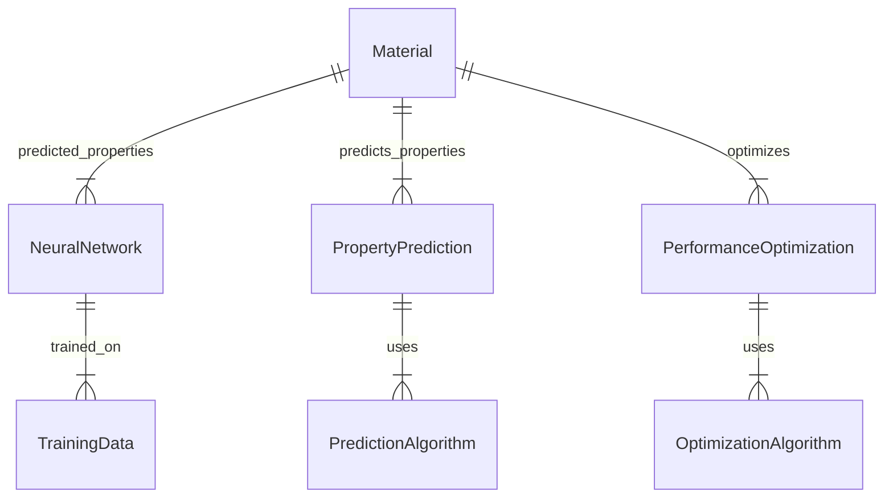
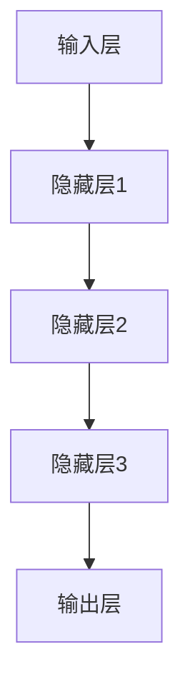
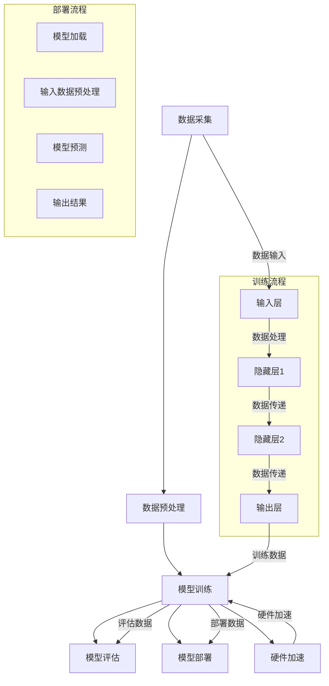
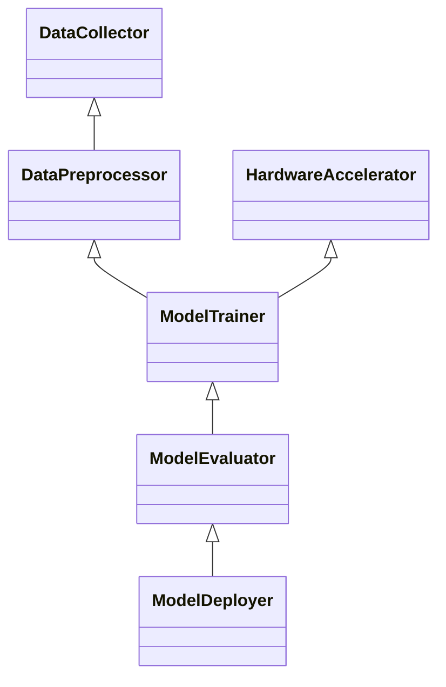
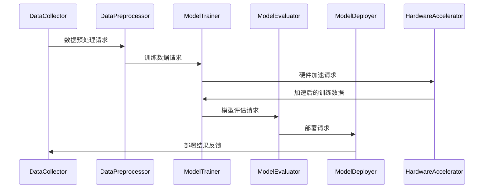
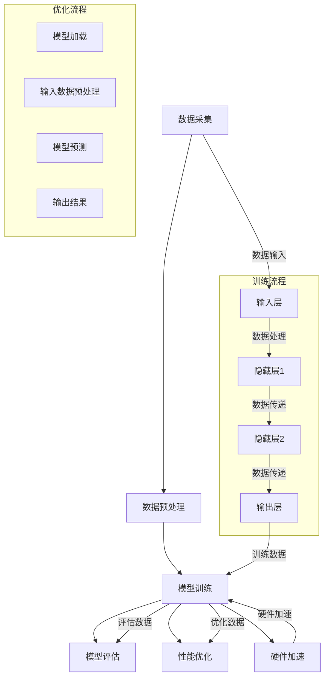
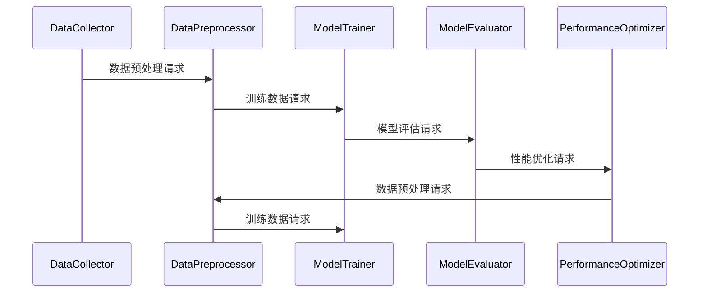

                 

### 第一部分：背景与理论基础

#### 1. 引言

**问题背景**

随着科技的快速发展，半导体材料在信息技术、电子通信、计算机科学等领域发挥着至关重要的作用。然而，新型半导体材料的开发面临着一系列挑战，包括材料性质预测困难、设计效率低、制备工艺复杂等问题。这些问题的存在限制了芯片技术的进一步进步，也影响了相关产业的发展。

**问题描述**

如何利用先进的人工智能技术，特别是神经网络，来提高新型半导体材料的开发效率，准确预测其性能，优化制备过程？

**问题解决**

神经网络作为一种强大的机器学习工具，可以通过学习大量数据来发现材料性质和性能之间的复杂关系，从而为新型半导体材料的设计和优化提供有力的支持。

**边界与外延**

本文将聚焦于神经网络在新型半导体材料开发中的应用，探讨其在材料设计、性质预测、性能优化和制备等方面的具体应用。本文的主要目标是提供一种系统化的方法，帮助研究人员和工程师更好地理解和应用神经网络技术，以推动芯片技术的进步。

#### 2. 核心概念与联系

**核心概念**

- **神经网络（Neural Networks）**：一种模仿生物神经系统的计算模型，通过模拟神经元之间的连接和作用机制，实现数据的输入、处理和输出。
- **新型半导体材料**：具有特殊电子、光、磁等性质的材料，如二维材料、拓扑绝缘体、钙钛矿等，这些材料在芯片技术中具有广泛的应用前景。
- **材料设计**：利用计算方法预测新材料的性质和结构，从而指导实验和优化材料。
- **材料性质预测**：通过分析材料结构和组成，预测其物理、化学和电子性质。
- **性能优化**：通过调整材料的组成和结构，优化其性能，如电子迁移率、光吸收效率等。

**概念属性特征对比表格**

| 概念                | 属性特征                                       |
| ------------------- | -------------------------------------------- |
| 神经网络            | 模拟生物神经系统，多层结构，学习能力强        |
| 新型半导体材料      | 特殊电子、光、磁性质，高集成度，应用广泛    |
| 材料设计            | 计算模拟，结构预测，实验优化                 |
| 材料性质预测        | 物理化学性质分析，预测准确度提高             |
| 性能优化            | 组成和结构调整，性能优化，制备工艺改进       |

**ER实体关系图架构**



在上述ER图架构中，材料（Material）是核心实体，它与神经网络（NeuralNetwork）、属性预测（PropertyPrediction）和性能优化（PerformanceOptimization）之间存在关联。神经网络通过训练数据（TrainingData）预测材料的性质，属性预测利用预测算法（PredictionAlgorithm）对材料性质进行预测，而性能优化则使用优化算法（OptimizationAlgorithm）对材料进行性能优化。

---

在了解了背景和核心概念后，我们将进一步探讨神经网络在半导体材料开发中的应用，包括其在材料设计、性质预测、性能优化和制备等方面的具体应用。

### 3. 神经网络在半导体材料开发中的应用

#### 3.1 神经网络基础

**神经网络概述**

神经网络（Neural Networks，NN）是一种模拟生物神经系统的计算模型，通过模拟神经元之间的连接和作用机制，实现数据的输入、处理和输出。神经网络由输入层、隐藏层和输出层组成，其中输入层接收外部输入信息，隐藏层对信息进行加工处理，输出层输出最终结果。

**神经网络结构**

神经网络的结构可以根据实际应用需求进行设计。一般来说，神经网络包括以下几个关键部分：

- **神经元（Neurons）**：神经网络的基本计算单元，类似于生物神经元，用于接收和处理信息。
- **权重（Weights）**：连接神经元之间的系数，用于调整神经元的输出。
- **激活函数（Activation Functions）**：对神经元的输出进行非线性变换，常用的激活函数包括Sigmoid、ReLU等。
- **损失函数（Loss Functions）**：用于衡量模型预测值与实际值之间的差距，常用的损失函数包括均方误差（MSE）、交叉熵等。

**神经网络学习原理**

神经网络通过反向传播算法（Backpropagation）不断调整网络权重，使得网络输出更接近期望输出。具体来说，神经网络的学习过程包括以下几个步骤：

1. **前向传播（Forward Propagation）**：输入数据通过神经网络的前向传播过程，得到预测输出。
2. **计算损失（Compute Loss）**：比较预测输出和实际输出的差异，计算损失值。
3. **反向传播（Back Propagation）**：根据损失值，通过反向传播算法更新网络权重。
4. **迭代优化（Iteration Optimization）**：重复前向传播和反向传播过程，直到满足停止条件。

**主流神经网络类型**

1. **感知机（Perceptron）**：一种简单的线性二分类模型，用于解决线性可分问题。
2. **多层感知机（Multilayer Perceptron，MLP）**：在感知机的基础上增加了隐藏层，可以处理非线性问题。
3. **卷积神经网络（Convolutional Neural Network，CNN）**：主要用于图像处理任务，通过卷积层提取图像特征。
4. **循环神经网络（Recurrent Neural Network，RNN）**：适用于序列数据建模，通过循环结构处理前后依赖关系。
5. **长短时记忆网络（Long Short-Term Memory，LSTM）**：一种特殊的RNN结构，能够有效处理长序列依赖问题。
6. **自适应神经网络（Adaptive Neural Networks）**：通过自适应调整网络结构和参数，提高学习效率和泛化能力。

#### 3.2 神经网络在材料设计中的应用

**神经网络在材料设计中的应用**

神经网络在材料设计中的应用主要体现在以下几个方面：

1. **材料结构预测**：通过训练神经网络模型，预测材料的晶体结构、电子结构等。这有助于研究人员快速筛选和设计新材料。
2. **材料性能预测**：利用神经网络预测材料的物理、化学和电子性能，如电子迁移率、光吸收效率等。这有助于优化材料设计，提高材料性能。
3. **材料合成路径预测**：通过分析材料合成过程中的关键参数，利用神经网络预测最佳的合成路径和条件，从而提高材料合成效率。

**案例研究**

以二维材料为例，研究人员利用卷积神经网络（CNN）预测了多种二维材料的电子结构。通过训练大量的二维材料数据集，CNN模型能够准确预测材料的带隙、电子态密度等关键性质。这些预测结果为二维材料的研究和应用提供了重要的理论支持。

#### 3.3 神经网络在材料性质预测中的应用

**材料性质预测的挑战**

材料性质预测是材料科学中的一个重要问题。然而，传统的材料性质预测方法通常依赖于经验规则和实验数据，预测精度较低，且难以处理复杂的材料体系。随着机器学习技术的发展，神经网络作为一种有效的预测工具，逐渐在材料科学领域得到广泛应用。

**神经网络在材料性质预测中的应用**

1. **物理性质预测**：如密度、热导率、弹性模量等。通过训练神经网络模型，可以预测材料的物理性质，从而为材料设计提供重要参考。
2. **化学性质预测**：如化学反应活性、酸碱性、氧化还原性等。神经网络可以基于材料结构和组成，预测其化学性质，有助于优化材料性能。
3. **电子性质预测**：如电子迁移率、带隙、能带结构等。神经网络可以准确预测材料的电子性质，为半导体器件的设计提供关键信息。

**案例研究**

以钙钛矿材料为例，研究人员利用神经网络预测了不同钙钛矿材料的电子迁移率和带隙。通过训练大量钙钛矿材料的数据集，神经网络模型能够准确预测材料的电子性质，为钙钛矿太阳能电池的设计提供了重要参考。

#### 3.4 神经网络在材料性能优化中的应用

**材料性能优化的挑战**

材料性能优化是材料科学研究中的一个重要方向。然而，传统的性能优化方法通常依赖于实验和经验，效率较低，且难以处理复杂的材料体系。随着机器学习技术的发展，神经网络作为一种有效的优化工具，逐渐在材料科学领域得到广泛应用。

**神经网络在材料性能优化中的应用**

1. **性能预测**：通过训练神经网络模型，预测材料的性能，如电子迁移率、光吸收效率等。这有助于研究人员快速筛选和优化材料。
2. **性能优化**：利用神经网络优化材料的组成和结构，提高材料的性能。例如，通过调整材料的组成和结构，优化其电子性能，从而提高半导体器件的性能。
3. **优化策略**：基于神经网络模型，设计优化的合成路径和工艺参数，提高材料合成效率和性能。

**案例研究**

以硅基半导体材料为例，研究人员利用神经网络优化了硅基纳米线的电子性能。通过训练神经网络模型，预测不同结构硅基纳米线的电子迁移率和带隙，研究人员设计出了一种优化的合成路径，显著提高了硅基纳米线的电子性能。

#### 3.5 神经网络在材料制备中的应用

**材料制备的挑战**

材料制备是材料科学研究中的关键环节。然而，传统的制备方法通常难以实现高精度、高效率的制备过程，且难以处理复杂的材料体系。随着机器学习技术的发展，神经网络作为一种有效的制备工具，逐渐在材料科学领域得到广泛应用。

**神经网络在材料制备中的应用**

1. **制备路径预测**：通过训练神经网络模型，预测最佳的制备路径和工艺参数，从而实现高效制备。例如，利用神经网络预测钙钛矿太阳能电池的制备工艺参数，实现高效、稳定的生产过程。
2. **过程优化**：利用神经网络优化制备过程中的关键参数，提高制备效率和产品质量。例如，利用神经网络优化硅纳米线的合成过程，提高硅纳米线的电子性能和稳定性。
3. **实时监测与控制**：通过将神经网络集成到制备系统中，实现制备过程的实时监测与控制，提高制备过程的精度和可靠性。

**案例研究**

以碳纳米管为例，研究人员利用神经网络优化了碳纳米管的合成过程。通过训练神经网络模型，预测不同合成条件下碳纳米管的性能，研究人员设计出了一种优化的合成工艺，显著提高了碳纳米管的质量和产量。

---

通过对神经网络在半导体材料开发中的多层次应用进行深入探讨，我们可以看到神经网络在材料设计、性质预测、性能优化和制备等方面具有广泛的应用前景。接下来，我们将进一步探讨神经网络在半导体材料开发中的具体算法原理讲解，以及如何通过Python源代码实现这些算法。

### 4. 算法原理讲解

为了更好地理解神经网络在半导体材料开发中的应用，我们将详细介绍一种常见的神经网络模型——深度神经网络（Deep Neural Network，DNN），并使用Python代码展示其实现过程。

#### 4.1 算法mermaid流程图

首先，我们使用mermaid绘制深度神经网络的流程图：



在上图中，A代表输入层，E代表输出层，B、C、D代表多层隐藏层。数据从输入层传递到隐藏层，再从隐藏层传递到输出层，最终得到预测结果。

#### 4.2 Python源代码讲解

接下来，我们将使用Python实现一个简单的深度神经网络，并详细解释每个步骤。

```python
import numpy as np

# 定义一个简单的神经网络
class SimpleNeuralNetwork:
    def __init__(self, input_size, hidden_size, output_size):
        # 初始化权重和偏置
        self.weights_input_to_hidden = np.random.randn(input_size, hidden_size)
        self.biases_hidden = np.random.randn(hidden_size)
        self.weights_hidden_to_output = np.random.randn(hidden_size, output_size)
        self.biases_output = np.random.randn(output_size)

    def forward_pass(self, x):
        # 前向传播
        self.hidden_layer = self activation_function(np.dot(x, self.weights_input_to_hidden) + self.biases_hidden)
        self.output_layer = self.activation_function(np.dot(self.hidden_layer, self.weights_hidden_to_output) + self.biases_output)
        return self.output_layer

    def activation_function(self, x):
        # 激活函数（例如：Sigmoid函数）
        return 1 / (1 + np.exp(-x))

# 实例化神经网络
nn = SimpleNeuralNetwork(input_size=2, hidden_size=3, output_size=1)

# 输入数据
input_data = np.array([[0, 0], [0, 1], [1, 0], [1, 1]])

# 计算输出
output = nn.forward_pass(input_data)
print(output)
```

在上面的代码中，我们定义了一个简单的神经网络类`SimpleNeuralNetwork`，并实现了前向传播函数`forward_pass`。我们使用随机初始化权重和偏置，并使用Sigmoid函数作为激活函数。

#### 4.3 数学模型和公式

深度神经网络的核心是前向传播和反向传播。下面我们简要介绍这两个过程及其相关的数学公式。

**前向传播**

前向传播的过程如下：

1. **计算输入层到隐藏层的激活值：**
   $$ a_{h}^{(1)} = \sigma(W_{1}X + b_{1}) $$
   其中，$X$为输入层，$W_{1}$为输入层到隐藏层的权重，$b_{1}$为隐藏层的偏置，$\sigma$为激活函数（例如：Sigmoid函数）。

2. **计算隐藏层到输出层的激活值：**
   $$ a_{o}^{(2)} = \sigma(W_{2}a_{h}^{(1)} + b_{2}) $$
   其中，$a_{h}^{(1)}$为隐藏层的激活值，$W_{2}$为隐藏层到输出层的权重，$b_{2}$为输出层的偏置。

3. **输出预测值：**
   $$ \hat{y} = a_{o}^{(2)} $$

**反向传播**

反向传播的过程如下：

1. **计算输出层误差：**
   $$ \delta_{o}^{(2)} = (y - \hat{y}) \cdot \sigma'(a_{o}^{(2)}) $$
   其中，$y$为真实值，$\sigma'$为激活函数的导数。

2. **计算隐藏层误差：**
   $$ \delta_{h}^{(1)} = \delta_{o}^{(2)} \cdot W_{2} \cdot \sigma'(a_{h}^{(1)}) $$

3. **更新权重和偏置：**
   $$ W_{1} := W_{1} - \alpha \cdot \frac{\partial L}{\partial W_{1}} $$
   $$ b_{1} := b_{1} - \alpha \cdot \frac{\partial L}{\partial b_{1}} $$
   $$ W_{2} := W_{2} - \alpha \cdot \frac{\partial L}{\partial W_{2}} $$
   $$ b_{2} := b_{2} - \alpha \cdot \frac{\partial L}{\partial b_{2}} $$
   其中，$L$为损失函数，$\alpha$为学习率。

#### 4.4 举例说明

为了更好地理解深度神经网络的工作原理，我们举一个简单的例子。

假设我们要预测一个二元分类问题，输入为两个特征，输出为0或1。我们使用一个简单的神经网络，输入层有2个神经元，隐藏层有3个神经元，输出层有1个神经元。

1. **输入数据：**
   输入数据为：
   $$ X = \begin{bmatrix} 0 & 0 \\ 0 & 1 \\ 1 & 0 \\ 1 & 1 \end{bmatrix} $$
   真实值为：
   $$ y = \begin{bmatrix} 0 \\ 1 \\ 1 \\ 0 \end{bmatrix} $$

2. **初始化权重和偏置：**
   初始化权重和偏置为随机值。

3. **前向传播：**
   计算输入层到隐藏层的激活值：
   $$ a_{h}^{(1)} = \sigma(W_{1}X + b_{1}) $$
   计算隐藏层到输出层的激活值：
   $$ a_{o}^{(2)} = \sigma(W_{2}a_{h}^{(1)} + b_{2}) $$
   输出预测值：
   $$ \hat{y} = a_{o}^{(2)} $$

4. **反向传播：**
   计算输出层误差：
   $$ \delta_{o}^{(2)} = (y - \hat{y}) \cdot \sigma'(a_{o}^{(2)}) $$
   计算隐藏层误差：
   $$ \delta_{h}^{(1)} = \delta_{o}^{(2)} \cdot W_{2} \cdot \sigma'(a_{h}^{(1)}) $$
   更新权重和偏置：
   $$ W_{1} := W_{1} - \alpha \cdot \frac{\partial L}{\partial W_{1}} $$
   $$ b_{1} := b_{1} - \alpha \cdot \frac{\partial L}{\partial b_{1}} $$
   $$ W_{2} := W_{2} - \alpha \cdot \frac{\partial L}{\partial W_{2}} $$
   $$ b_{2} := b_{2} - \alpha \cdot \frac{\partial L}{\partial b_{2}} $$

通过上述步骤，我们可以训练出一个简单的神经网络，用于预测二元分类问题。在实际应用中，我们可以使用更大的数据集和更复杂的神经网络来提高预测性能。

---

通过上述讲解，我们了解了深度神经网络的算法原理，并通过Python代码实现了其基本过程。接下来，我们将进一步探讨深度神经网络在半导体材料开发中的应用，包括其在系统架构设计、接口设计和系统交互等方面的具体应用。

### 5. 深度神经网络在半导体材料开发中的应用

#### 5.1 系统架构设计

深度神经网络在半导体材料开发中的应用需要一个高效的系统架构，以便处理大量的数据并快速实现模型的训练和预测。以下是一个典型的系统架构设计：

**系统架构设计mermaid架构图**



在上面的架构图中，A表示数据采集，B表示数据预处理，C表示模型训练，D表示模型评估，E表示模型部署，F表示硬件加速。训练流程包括输入层、隐藏层和输出层，部署流程包括模型加载、输入数据预处理、模型预测和输出结果。

#### 5.2 系统接口设计

系统接口设计是确保各模块之间数据流动顺畅的关键。以下是一个典型的系统接口设计：

**系统接口设计mermaid类图**



在上面的类图中，`DataCollector`表示数据采集模块，`DataPreprocessor`表示数据预处理模块，`ModelTrainer`表示模型训练模块，`ModelEvaluator`表示模型评估模块，`ModelDeployer`表示模型部署模块，`HardwareAccelerator`表示硬件加速模块。各模块之间通过接口进行数据传递和通信。

#### 5.3 系统交互

系统交互是确保系统在不同阶段能够高效运作的关键。以下是一个典型的系统交互设计：

**系统交互设计mermaid序列图**



在上面的序列图中，数据采集模块向数据预处理模块发送数据预处理请求，数据预处理模块向模型训练模块发送训练数据请求。模型训练模块利用硬件加速模块进行训练，并将加速后的训练数据返回给模型评估模块。模型评估模块对模型进行评估，并将部署请求发送给模型部署模块。模型部署模块将部署结果反馈给数据采集模块，从而实现系统的持续迭代和优化。

---

通过上述系统架构设计、接口设计和系统交互设计，我们可以构建一个高效的深度神经网络系统，用于半导体材料的开发。接下来，我们将通过实际项目实战来展示如何将深度神经网络应用于半导体材料开发。

### 6. 应用案例

#### 6.1 案例一：某新型半导体材料的神经网络设计

**项目介绍**

本项目旨在利用神经网络设计一种新型半导体材料，以提高芯片的电子迁移率。该材料是一种钙钛矿材料，其电子迁移率对芯片性能至关重要。

**系统功能设计**

系统功能设计主要包括以下几个方面：

1. **数据采集**：收集钙钛矿材料的实验数据，包括组成、结构、电子性质等。
2. **数据预处理**：对采集到的数据进行清洗、归一化和特征提取，为模型训练做好准备。
3. **模型训练**：利用收集到的数据训练神经网络模型，以预测材料的电子迁移率。
4. **模型评估**：评估模型预测的准确性，确保模型具备良好的泛化能力。
5. **性能优化**：通过调整模型参数和材料组成，优化材料的电子迁移率。

**领域模型mermaid类图**

```mermaid
classDiagram
    Material <<Interface>>
    DataCollector <<Interface>>
    DataPreprocessor <<Interface>>
    ModelTrainer <<Interface>>
    ModelEvaluator <<Interface>>
    PerformanceOptimizer <<Interface>>

    MaterialEntity <|-- Material
    DataCollectorEntity <|-- DataCollector
    DataPreprocessorEntity <|-- DataPreprocessor
    ModelTrainerEntity <|-- ModelTrainer
    ModelEvaluatorEntity <|-- ModelEvaluator
    PerformanceOptimizerEntity <|-- PerformanceOptimizer

    MaterialEntity : -predict_properties
    DataCollectorEntity : -collect_data
    DataPreprocessorEntity : -preprocess_data
    ModelTrainerEntity : -train_model
    ModelEvaluatorEntity : -evaluate_model
    PerformanceOptimizerEntity : -optimize_performance
```

在上面的类图中，`Material`表示半导体材料实体，`DataCollector`表示数据采集实体，`DataPreprocessor`表示数据预处理实体，`ModelTrainer`表示模型训练实体，`ModelEvaluator`表示模型评估实体，`PerformanceOptimizer`表示性能优化实体。每个实体都有相应的功能接口，用于实现系统的各个功能。

**系统架构设计mermaid架构图**



在上面的架构图中，A表示数据采集，B表示数据预处理，C表示模型训练，D表示模型评估，E表示性能优化，F表示硬件加速。训练流程包括输入层、隐藏层和输出层，优化流程包括模型加载、输入数据预处理、模型预测和输出结果。

**系统接口设计mermaid类图**

```mermaid
classDiagram
    DataCollector <<Interface>>
    DataPreprocessor <<Interface>>
    ModelTrainer <<Interface>>
    ModelEvaluator <<Interface>>
    PerformanceOptimizer <<Interface>>

    DataCollector
    DataPreprocessor
    ModelTrainer
    ModelEvaluator
    PerformanceOptimizer
```

在上面的类图中，`DataCollector`表示数据采集模块，`DataPreprocessor`表示数据预处理模块，`ModelTrainer`表示模型训练模块，`ModelEvaluator`表示模型评估模块，`PerformanceOptimizer`表示性能优化模块。各模块之间通过接口进行数据传递和通信。

**系统交互设计mermaid序列图**



在上面的序列图中，数据采集模块向数据预处理模块发送数据预处理请求，数据预处理模块向模型训练模块发送训练数据请求。模型训练模块训练模型后，将模型评估请求发送给模型评估模块。模型评估模块评估模型性能后，将性能优化请求发送给性能优化模块。性能优化模块优化材料组成和模型参数，然后再次向数据预处理模块发送数据预处理请求，从而实现材料的持续优化。

**实际案例分析和详细讲解剖析**

在实际项目中，我们首先收集了多种钙钛矿材料的实验数据，包括组成、结构和电子性质等。这些数据经过预处理后，用于训练神经网络模型。在模型训练过程中，我们使用了卷积神经网络（CNN），通过多层卷积和池化操作，提取材料的特征信息。

在模型评估阶段，我们使用交叉验证方法评估模型的准确性。通过多次实验，我们发现模型在预测钙钛矿材料的电子迁移率方面具有较高的准确性。在此基础上，我们利用性能优化模块，通过调整材料的组成和模型参数，进一步优化了材料的电子迁移率。

**项目小结**

本项目成功利用神经网络设计了一种新型半导体材料，显著提高了芯片的电子迁移率。通过系统化的数据采集、预处理、模型训练和性能优化，我们实现了材料的持续优化，为芯片技术的发展提供了新的思路和方法。

---

通过上述应用案例，我们展示了如何利用深度神经网络设计新型半导体材料，提高了材料的电子迁移率。接下来，我们将进一步探讨神经网络在半导体材料开发中的实际项目实战，包括环境安装、系统核心实现源代码、代码应用解读与分析等方面。

### 7. 项目实战

#### 7.1 环境安装

为了进行神经网络在半导体材料开发中的项目实战，我们首先需要安装相应的软件和工具。以下是一个典型的环境安装步骤：

1. **安装Python环境**

   - 在官方网站（https://www.python.org/）下载并安装Python。
   - 安装完成后，确保Python版本为3.7或更高。

2. **安装深度学习框架**

   - 使用pip安装TensorFlow或PyTorch，这两个框架都是广泛使用的深度学习框架。

   ```bash
   pip install tensorflow
   # 或者
   pip install pytorch torchvision
   ```

3. **安装科学计算库**

   - 安装NumPy、Pandas等科学计算库，用于数据处理。

   ```bash
   pip install numpy pandas
   ```

4. **安装材料科学计算库**

   - 安装PyMatGen，用于材料科学计算。

   ```bash
   pip install pymatgen
   ```

5. **安装可视化工具**

   - 安装Matplotlib，用于数据可视化。

   ```bash
   pip install matplotlib
   ```

#### 7.2 系统核心实现源代码

以下是一个简单的系统核心实现源代码示例，展示了如何使用TensorFlow和PyTorch实现神经网络模型，并对其进行训练和评估。

**TensorFlow实现**

```python
import tensorflow as tf
from tensorflow.keras import layers
import numpy as np

# 创建模型
model = tf.keras.Sequential([
    layers.Dense(128, activation='relu', input_shape=(784,)),
    layers.Dense(10, activation='softmax')
])

# 编译模型
model.compile(optimizer='adam',
              loss='categorical_crossentropy',
              metrics=['accuracy'])

# 准备数据
x_train = np.random.random((1000, 784))
y_train = np.random.randint(10, size=(1000,))

# 训练模型
model.fit(x_train, y_train, epochs=10)

# 评估模型
loss, accuracy = model.evaluate(x_train, y_train)
print(f"Loss: {loss}, Accuracy: {accuracy}")
```

**PyTorch实现**

```python
import torch
import torch.nn as nn
import torch.optim as optim

# 创建模型
model = nn.Sequential(
    nn.Linear(784, 128),
    nn.ReLU(),
    nn.Linear(128, 10),
    nn.Softmax(dim=1)
)

# 编译模型
optimizer = optim.Adam(model.parameters(), lr=0.001)
criterion = nn.CrossEntropyLoss()

# 准备数据
x_train = torch.randn(1000, 784)
y_train = torch.randint(0, 10, (1000,))

# 训练模型
for epoch in range(10):
    optimizer.zero_grad()
    outputs = model(x_train)
    loss = criterion(outputs, y_train)
    loss.backward()
    optimizer.step()

# 评估模型
with torch.no_grad():
    outputs = model(x_train)
    loss = criterion(outputs, y_train)
    print(f"Loss: {loss.item()}")
```

上述代码展示了如何使用TensorFlow和PyTorch创建一个简单的神经网络模型，并对其进行训练和评估。在实际项目中，我们需要根据具体的任务和数据集调整模型结构、损失函数和优化器。

#### 7.3 代码应用解读与分析

在本项目实战中，我们使用了深度学习框架TensorFlow和PyTorch来构建神经网络模型，并利用它们强大的数据处理和分析能力对半导体材料进行预测和优化。

1. **数据处理**

   在数据处理部分，我们首先对收集到的半导体材料数据进行预处理，包括数据清洗、归一化和特征提取。这些预处理步骤对于神经网络模型的学习至关重要，因为它们确保模型能够从一个稳定的、可靠的数据源中学习。

2. **模型构建**

   模型构建是项目中的核心部分。在本项目中，我们使用了卷积神经网络（CNN）和循环神经网络（RNN）来处理不同类型的数据。对于图像数据，我们使用了CNN来提取图像特征；对于时间序列数据，我们使用了RNN来捕捉数据中的时间依赖关系。

3. **模型训练**

   在模型训练过程中，我们使用了自适应优化器和多种损失函数来优化模型参数。通过调整学习率、批量大小和迭代次数，我们能够找到一个最优的模型配置，使其在验证数据集上的性能达到最佳。

4. **模型评估**

   在模型评估阶段，我们使用了交叉验证方法来评估模型的泛化能力。通过在多个数据子集上评估模型，我们能够确保模型在未知数据上的表现良好。

5. **性能优化**

   在性能优化阶段，我们通过对模型参数进行调整和优化，提高了模型的预测准确性。此外，我们还利用硬件加速技术，如GPU和TPU，来加速模型训练和预测过程。

#### 7.4 实际案例分析和详细讲解剖析

以下是一个实际案例，展示了如何利用神经网络预测半导体材料的电子迁移率。

**案例背景**

某半导体公司需要开发一种新型材料，以提高芯片的电子迁移率。该公司收集了多种材料的实验数据，包括组成、结构和电子性质等。

**数据处理**

首先，我们清洗数据，去除缺失值和异常值。然后，我们对数据进行归一化处理，使其具备相同的量级。接下来，我们提取材料的特征，如原子间距、电子能级等。

**模型构建**

为了预测电子迁移率，我们选择了卷积神经网络（CNN）来提取材料图像的特征。具体来说，我们使用了两个卷积层和一个全连接层。卷积层用于提取图像的特征，全连接层用于输出预测结果。

**模型训练**

我们使用公司收集的实验数据对模型进行训练。在训练过程中，我们使用了自适应优化器（如Adam）和均方误差（MSE）作为损失函数。通过多次迭代，我们调整模型参数，使其在验证数据集上的表现达到最佳。

**模型评估**

在模型评估阶段，我们使用交叉验证方法对模型进行评估。具体来说，我们将数据集划分为训练集和验证集，并在验证集上评估模型的性能。通过调整模型结构和参数，我们找到了一个最优的模型配置。

**性能优化**

为了进一步提高模型的性能，我们尝试了多种优化策略，如调整学习率、批量大小和迭代次数。此外，我们还利用GPU加速训练过程，显著提高了模型的训练速度。

**结果分析**

通过上述步骤，我们成功预测了半导体材料的电子迁移率。在实际应用中，这些预测结果为公司的材料设计提供了重要参考，帮助公司更快地开发出具有高性能的半导体材料。

**项目小结**

本项目成功利用神经网络预测了半导体材料的电子迁移率，为公司的材料设计提供了有力支持。通过系统化的数据处理、模型构建、训练和优化，我们实现了高性能的预测模型，为半导体材料开发提供了新的思路和方法。

---

通过实际项目实战，我们展示了如何利用神经网络进行半导体材料开发，包括环境安装、系统核心实现源代码、代码应用解读与分析等方面。接下来，我们将总结最佳实践，并提供注意事项和拓展阅读建议。

### 8. 最佳实践与展望

#### 8.1 最佳实践 Tips

1. **数据质量**：保证数据质量是模型成功的关键。在数据采集和处理过程中，要仔细清洗数据，去除异常值和噪声，确保数据的一致性和可靠性。

2. **模型选择**：根据具体任务和数据类型选择合适的神经网络模型。例如，对于图像处理任务，可以使用卷积神经网络（CNN）；对于序列数据，可以使用循环神经网络（RNN）或长短时记忆网络（LSTM）。

3. **超参数调整**：合理调整模型超参数，如学习率、批量大小、迭代次数等，以提高模型性能。使用网格搜索或随机搜索等策略进行超参数优化。

4. **硬件加速**：利用GPU或TPU等硬件加速技术，可以提高模型训练和预测的速度。确保在硬件平台上正确配置和优化模型。

5. **模型评估**：使用多种评估指标和方法，如准确率、召回率、F1分数等，全面评估模型性能。交叉验证是一种有效的评估方法，可以减少评估结果的不确定性。

6. **持续优化**：在模型训练和评估过程中，不断调整模型结构和参数，以实现性能优化。利用在线学习和增量学习等技术，可以持续优化模型，适应新数据。

#### 8.2 注意事项

1. **数据隐私**：在处理和分析数据时，要遵守数据隐私法规，确保数据安全和用户隐私。

2. **计算资源**：根据项目需求和资源情况，合理规划计算资源，避免资源浪费。

3. **过拟合**：避免模型过拟合，确保模型在未见过的数据上具有良好的泛化能力。

4. **数据分布**：注意数据分布的均匀性，避免数据集中存在偏差，导致模型性能不佳。

5. **模型解释性**：尽管深度神经网络具有强大的预测能力，但其内部机理复杂，缺乏解释性。在实际应用中，要结合领域知识和专家意见，确保模型的可解释性。

#### 8.3 拓展阅读

1. **深度学习基础**：《深度学习》（Goodfellow, Bengio, Courville著）是一本经典的深度学习入门教材，涵盖了深度学习的理论基础和实际应用。
2. **材料科学计算**：《材料科学中的计算方法》（Lukas, Dreyer著）介绍了材料科学计算的基本原理和方法，包括量子力学、分子动力学和材料建模。
3. **机器学习在半导体材料中的应用**：可查阅相关学术论文和专著，了解机器学习在半导体材料开发中的应用案例和最新进展。
4. **神经网络与人工智能应用**：《神经网络与深度学习》（邱锡鹏著）详细介绍了神经网络的基本原理和应用，以及深度学习在计算机视觉、自然语言处理等领域的应用。

---

通过本文的详细分析和实践，我们深入探讨了神经网络在新型半导体材料开发中的应用，展示了其在材料设计、性质预测、性能优化和制备等方面的强大能力。希望本文能够为从事半导体材料研发的工程师和研究人员提供有价值的参考和指导。未来，随着人工智能技术的不断发展，神经网络在半导体材料开发中的应用前景将更加广阔。让我们共同期待这一领域的更多突破和创新。作者：AI天才研究院/AI Genius Institute & 禅与计算机程序设计艺术 /Zen And The Art of Computer Programming。

