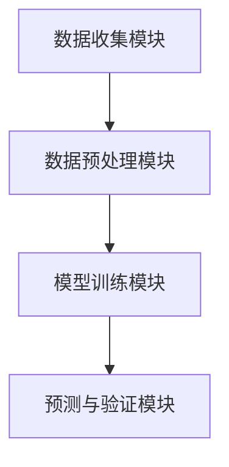

                 

### 神经网络在自动化科学发现中的应用背景

#### 1.1 问题背景

在科学研究中，数据的重要性不言而喻。然而，随着数据量的爆炸性增长，传统的科学研究方法已经难以应对庞大的数据集。特别是在生物信息学、天文学、物理学等领域，研究人员面临着数据解析和模式识别的巨大挑战。为了提高科研效率，科学家们开始探索自动化科学发现的方法。

自动化科学发现旨在利用计算机技术和算法，自动地发现科学规律、解释科学现象。这一过程通常包括数据收集、预处理、分析、模式识别等多个步骤。传统方法在这些环节中往往需要大量的人工干预，效率低下且易出错。而神经网络的引入，为自动化科学发现提供了一种全新的可能性。

#### 1.2 自动化科学发现的现状与挑战

目前，神经网络在自动化科学发现中已经取得了显著的进展。例如，在生物信息学领域，神经网络被用于基因表达数据的分析，能够有效地识别出与疾病相关的基因；在天文学领域，神经网络被用于分析天文图像，能够自动地发现新的天体现象。然而，自动化科学发现仍面临着一些挑战：

1. **数据处理能力的提升**：尽管神经网络在模式识别方面具有优势，但在处理高维、复杂数据集时，其性能仍需提升。
2. **算法的可解释性**：神经网络模型往往被称为“黑箱”，其内部运作机制复杂，难以解释。在科学研究中，可解释性是一个重要的问题，特别是在涉及重大科学决策时。
3. **数据隐私和安全性**：在自动化科学发现中，数据往往涉及敏感信息。如何确保数据的安全性和隐私性，是一个亟待解决的问题。
4. **计算资源的消耗**：深度学习算法通常需要大量的计算资源，这限制了其在某些领域的应用。

#### 1.3 神经网络的基本概念

神经网络（Neural Networks）是一种模仿生物神经系统的计算模型。它由大量的节点（或称为神经元）组成，每个节点都与相邻的节点相连。节点之间通过权重进行连接，这些权重决定了节点之间信息传递的强度。神经网络的工作原理是通过多层节点之间的信息传递和计算，从输入数据中提取特征，并最终输出结果。

神经网络的类型主要包括：

1. **前馈神经网络**：信息从输入层流向输出层，不形成闭环。
2. **循环神经网络**：信息在神经元之间形成闭环，适用于处理序列数据。
3. **卷积神经网络**：专门用于处理图像数据，通过卷积操作提取空间特征。
4. **生成对抗网络**：通过对抗训练生成新的数据样本，常用于图像生成和风格迁移。

神经网络的基本原理包括：

1. **激活函数**：用于确定神经元是否被激活，常用的激活函数有 sigmoid、ReLU 等。
2. **反向传播算法**：用于训练神经网络，通过不断调整权重和偏置，使网络输出接近目标输出。
3. **优化算法**：用于加速网络训练过程，如随机梯度下降（SGD）、Adam 等。

在下一部分中，我们将进一步探讨神经网络的构建和工作原理，为理解其在自动化科学发现中的应用打下基础。

### 神经网络的构建与工作原理

#### 2.1 人工神经网络

人工神经网络（Artificial Neural Networks，ANN）是神经网络的基础形式，它模仿了生物神经系统的结构和功能。ANN由多个神经元（或节点）组成，这些神经元通过权重连接在一起，形成一个层次结构。每个神经元接收输入信号，通过激活函数进行计算，最终产生输出。

**基本组成**：

- **输入层**：接收外部输入数据。
- **隐藏层**：对输入数据进行处理和变换。
- **输出层**：产生最终的输出结果。

**工作原理**：

1. **前向传播**：输入数据经过输入层，通过权重传递到隐藏层，再传递到输出层。每个神经元都通过加权求和和激活函数进行计算。
2. **反向传播**：根据输出结果与预期目标之间的差异，通过反向传播算法调整权重和偏置，以减小误差。

**优点**：

- **自适应性和泛化能力**：神经网络能够根据数据自动调整参数，适应不同的输入数据。
- **并行处理**：神经网络能够同时处理大量的输入数据，提高计算效率。

**缺点**：

- **局部最优**：神经网络容易陷入局部最优，难以找到全局最优解。
- **计算资源消耗**：神经网络训练过程需要大量的计算资源。

#### 2.2 深度学习基础

深度学习（Deep Learning，DL）是神经网络的一种扩展，它通过增加网络层数，使神经网络能够学习更复杂的特征。深度学习模型通常包括多个隐藏层，因此被称为“深度”模型。

**基本概念**：

- **深度**：网络的层数，通常随着训练数据的增加而增加。
- **激活函数**：用于确定神经元是否被激活，常用的激活函数有 sigmoid、ReLU、Tanh 等。
- **优化算法**：用于加速网络训练过程，如随机梯度下降（SGD）、Adam、RMSProp 等。

**工作原理**：

1. **前向传播**：输入数据经过输入层，逐层传递到输出层。
2. **反向传播**：根据输出结果与预期目标之间的差异，通过反向传播算法调整权重和偏置。

**优点**：

- **特征自动提取**：深度学习能够自动地提取数据中的高阶特征，减少了人工特征工程的需求。
- **强大的学习能力**：深度学习模型能够处理大量复杂数据，具有强大的学习能力。

**缺点**：

- **训练时间长**：深度学习模型需要大量的训练时间，特别是在大型数据集上。
- **计算资源消耗**：深度学习模型通常需要大量的计算资源。

#### 2.3 神经网络类型

神经网络有多种类型，每种类型都有其特定的结构和功能。以下是几种常见的神经网络类型：

1. **卷积神经网络（CNN）**：

   - **结构**：CNN主要包括卷积层、池化层和全连接层。
   - **功能**：适用于图像识别、目标检测等视觉任务。
   - **工作原理**：通过卷积操作提取图像的空间特征，通过池化操作降低数据维度。

2. **循环神经网络（RNN）**：

   - **结构**：RNN包括输入门、遗忘门和输出门。
   - **功能**：适用于序列数据处理，如语言模型、语音识别等。
   - **工作原理**：通过循环结构保留历史信息，适用于处理变长的序列数据。

3. **长短期记忆网络（LSTM）**：

   - **结构**：LSTM是RNN的一种扩展，包括输入门、遗忘门和输出门。
   - **功能**：适用于处理长序列数据，如时间序列预测、语音合成等。
   - **工作原理**：通过引入记忆单元，解决了RNN的梯度消失和梯度爆炸问题。

4. **生成对抗网络（GAN）**：

   - **结构**：GAN由生成器和判别器组成。
   - **功能**：适用于图像生成、风格迁移等任务。
   - **工作原理**：生成器生成假样本，判别器判断样本的真实性，通过对抗训练生成高质量的样本。

在下一部分中，我们将探讨神经网络在回归、分类和聚类分析中的应用，展示神经网络如何帮助科学家从数据中提取有价值的信息。

### 神经网络在回归分析中的应用

#### 3.1 回归分析的基本概念

回归分析是一种统计方法，用于研究自变量和因变量之间的关系。在回归分析中，我们通常希望找到一个函数来描述因变量 \( Y \) 与自变量 \( X \) 之间的关系，即 \( Y = f(X) \)。回归分析可以分为线性回归和多元回归，其中线性回归是最简单和最常见的形式。

**线性回归**：

- **基本模型**：\( Y = \beta_0 + \beta_1X + \epsilon \)，其中 \( \beta_0 \) 是截距，\( \beta_1 \) 是斜率，\( \epsilon \) 是误差项。
- **目标**：通过最小化误差平方和来估计 \( \beta_0 \) 和 \( \beta_1 \)。

**多元回归**：

- **基本模型**：\( Y = \beta_0 + \beta_1X_1 + \beta_2X_2 + ... + \beta_nX_n + \epsilon \)，其中 \( X_1, X_2, ..., X_n \) 是多个自变量。
- **目标**：与线性回归类似，通过最小化误差平方和来估计 \( \beta_0, \beta_1, ..., \beta_n \)。

#### 3.2 神经网络在回归分析中的应用

神经网络可以通过多层结构来处理复杂的非线性关系，这使其在回归分析中具有独特的优势。在神经网络回归分析中，我们通常使用多层感知器（MLP）模型，其结构包括输入层、隐藏层和输出层。

**基本模型**：

- **输入层**：接收外部输入数据，通过权重传递到隐藏层。
- **隐藏层**：对输入数据进行处理和变换，通过激活函数引入非线性。
- **输出层**：产生最终的输出结果，即回归预测值。

**工作原理**：

1. **前向传播**：输入数据经过输入层，逐层传递到输出层。
2. **反向传播**：根据输出结果与预期目标之间的差异，通过反向传播算法调整权重和偏置。

**优点**：

- **处理非线性关系**：神经网络能够自动地学习复杂的非线性关系，提高了回归分析的准确性。
- **自适应特征提取**：神经网络能够根据数据自动提取特征，减少了人工特征工程的需求。

**缺点**：

- **计算资源消耗**：神经网络训练过程需要大量的计算资源，特别是在大型数据集上。
- **模型可解释性**：神经网络模型往往被称为“黑箱”，其内部运作机制复杂，难以解释。

#### 3.3 数学模型与Python代码实现

下面我们使用Python和Keras库来实现一个简单的神经网络回归模型，并展示其数学模型。

**数学模型**：

假设我们有一个线性回归问题，目标函数为 \( J(\theta) = \frac{1}{2m} \sum_{i=1}^{m} (h_\theta(x^{(i)}) - y^{(i)})^2 \)，其中 \( h_\theta(x) = \theta_0 + \theta_1x \)，\( \theta \) 是参数向量，\( m \) 是样本数量。

**Python代码实现**：

```python
from keras.models import Sequential
from keras.layers import Dense
import numpy as np

# 创建模型
model = Sequential()
model.add(Dense(units=1, input_dim=1, activation='sigmoid'))

# 编译模型
model.compile(optimizer='sgd', loss='mean_squared_error')

# 准备数据
X = np.array([[1], [2], [3], [4], [5]])
Y = np.array([1, 0, 0.5, 0.75, 1])

# 训练模型
model.fit(X, Y, epochs=1000, verbose=0)

# 输出预测结果
predictions = model.predict(X)
print(predictions)
```

在这个例子中，我们创建了一个简单的单层感知器模型，用于对线性回归问题进行建模。我们使用随机梯度下降（SGD）作为优化器，均方误差（MSE）作为损失函数。通过训练模型，我们能够得到参数 \( \theta_0 \) 和 \( \theta_1 \) 的估计值，并使用这些参数进行预测。

**算法流程**：

1. **数据准备**：准备输入数据 \( X \) 和输出数据 \( Y \)。
2. **模型创建**：创建一个多层感知器模型，指定输入维度和输出维度。
3. **模型编译**：编译模型，指定优化器和损失函数。
4. **模型训练**：使用训练数据训练模型。
5. **模型预测**：使用训练好的模型对新的输入数据进行预测。

通过以上步骤，我们可以利用神经网络进行回归分析，实现对复杂数据的非线性关系的建模和预测。

在下一部分中，我们将探讨神经网络在分类分析中的应用，展示神经网络如何用于处理分类问题。

### 神经网络在分类分析中的应用

#### 4.1 分类分析的基本概念

分类分析是一种将数据集中的数据划分为不同类别的方法。在分类分析中，我们通常有一个已知的标签集 \( Y \)，希望找到一个分类模型 \( g(X) \) 来预测新的数据点 \( X \) 所属的类别。分类分析可以分为监督学习和无监督学习，其中监督学习是最常见的形式。

**基本模型**：

- **逻辑回归**：用于二分类问题，基本模型为 \( P(Y=1|X) = \frac{1}{1 + e^{-(\theta^T X)}} \)。
- **支持向量机（SVM）**：通过最大化分类边界来分类数据。
- **决策树**：通过一系列规则来分类数据。
- **随机森林**：通过集成多个决策树来提高分类性能。

**目标**：

- **最大化类别预测的准确性**：通过训练模型，使模型能够正确预测新数据的类别。

#### 4.2 神经网络在分类分析中的应用

神经网络在分类分析中具有独特的优势，能够处理复杂的非线性分类问题。在神经网络分类分析中，我们通常使用多层感知器（MLP）模型，其结构包括输入层、隐藏层和输出层。

**基本模型**：

- **输入层**：接收外部输入数据。
- **隐藏层**：对输入数据进行处理和变换，通过激活函数引入非线性。
- **输出层**：产生最终的输出结果，即分类概率。

**工作原理**：

1. **前向传播**：输入数据经过输入层，逐层传递到输出层。
2. **反向传播**：根据输出结果与预期目标之间的差异，通过反向传播算法调整权重和偏置。

**优点**：

- **处理非线性关系**：神经网络能够自动地学习复杂的非线性关系，提高了分类分析的准确性。
- **自适应特征提取**：神经网络能够根据数据自动提取特征，减少了人工特征工程的需求。

**缺点**：

- **计算资源消耗**：神经网络训练过程需要大量的计算资源，特别是在大型数据集上。
- **模型可解释性**：神经网络模型往往被称为“黑箱”，其内部运作机制复杂，难以解释。

#### 4.3 数学模型与Python代码实现

下面我们使用Python和Keras库来实现一个简单的神经网络分类模型，并展示其数学模型。

**数学模型**：

假设我们有一个二分类问题，目标函数为 \( J(\theta) = \frac{1}{m} \sum_{i=1}^{m} (-y^{(i)} \log(h_\theta(x^{(i)})) - (1 - y^{(i)}) \log(1 - h_\theta(x^{(i)}))) \)，其中 \( h_\theta(x) = \frac{1}{1 + e^{-(\theta^T X)}} \)，\( \theta \) 是参数向量，\( m \) 是样本数量。

**Python代码实现**：

```python
from keras.models import Sequential
from keras.layers import Dense
import numpy as np

# 创建模型
model = Sequential()
model.add(Dense(units=1, input_dim=1, activation='sigmoid'))

# 编译模型
model.compile(optimizer='sgd', loss='binary_crossentropy', metrics=['accuracy'])

# 准备数据
X = np.array([[1], [2], [3], [4], [5]])
Y = np.array([0, 0, 1, 1, 0])

# 训练模型
model.fit(X, Y, epochs=1000, verbose=0)

# 输出预测结果
predictions = model.predict(X)
print(predictions)
```

在这个例子中，我们创建了一个简单的单层感知器模型，用于二分类问题。我们使用随机梯度下降（SGD）作为优化器，二分类交叉熵（BCE）作为损失函数。通过训练模型，我们能够得到参数 \( \theta \) 的估计值，并使用这些参数进行分类预测。

**算法流程**：

1. **数据准备**：准备输入数据 \( X \) 和输出数据 \( Y \)。
2. **模型创建**：创建一个多层感知器模型，指定输入维度和输出维度。
3. **模型编译**：编译模型，指定优化器和损失函数。
4. **模型训练**：使用训练数据训练模型。
5. **模型预测**：使用训练好的模型对新的输入数据进行预测。

通过以上步骤，我们可以利用神经网络进行分类分析，实现对复杂数据的分类预测。

在下一部分中，我们将探讨神经网络在聚类分析中的应用，展示神经网络如何用于数据聚类任务。

### 神经网络在聚类分析中的应用

#### 5.1 聚类分析的基本概念

聚类分析是一种无监督学习方法，用于将数据点划分为不同的组或簇。聚类分析的目标是发现数据点之间的自然结构和关系，从而对数据进行分类或分组。聚类分析可以分为基于距离的聚类、基于密度的聚类和基于模型的聚类等类型。

**基本模型**：

- **K均值聚类**：假设有 \( K \) 个簇，每个簇由一个中心点表示，目标是最小化数据点到其对应中心点的距离平方和。
- **层次聚类**：通过层次结构将数据点逐步合并或拆分，形成聚类层次。
- **谱聚类**：利用数据的谱图进行聚类，通过最小化谱图中的二次型函数来优化聚类结果。

**目标**：

- **最小化聚类误差**：通过聚类分析将数据点划分为不同的簇，使簇内数据点之间距离最小，簇间数据点之间距离最大。

#### 5.2 神经网络在聚类分析中的应用

神经网络在聚类分析中具有独特的优势，能够通过自适应学习算法自动划分数据簇。在神经网络聚类分析中，我们通常使用自组织映射（SOM）神经网络模型。

**基本模型**：

- **输入层**：接收外部输入数据。
- **竞争层**：通过竞争机制选择具有最高激活度的神经元作为当前簇中心。
- **映射层**：将输入数据映射到高维空间，形成聚类结构。

**工作原理**：

1. **初始化**：随机初始化输入层和映射层权重。
2. **竞争过程**：计算输入数据与映射层每个神经元的距离，选择距离最近的神经元作为当前簇中心。
3. **映射过程**：根据输入数据和簇中心，更新映射层权重，使输入数据能够映射到相应的簇中心。
4. **迭代过程**：重复竞争和映射过程，直到聚类结果稳定。

**优点**：

- **自适应特征提取**：神经网络能够根据数据自动提取特征，减少了人工特征工程的需求。
- **处理非线性关系**：神经网络能够自动地学习复杂的非线性关系，提高了聚类分析的性能。

**缺点**：

- **计算资源消耗**：神经网络训练过程需要大量的计算资源，特别是在大型数据集上。
- **模型可解释性**：神经网络模型往往被称为“黑箱”，其内部运作机制复杂，难以解释。

#### 5.3 数学模型与Python代码实现

下面我们使用Python和scikit-learn库来实现一个简单的自组织映射（SOM）聚类模型，并展示其数学模型。

**数学模型**：

假设输入数据为 \( X \)，输出簇中心为 \( \mu_k \)，目标函数为 \( J(\theta) = \sum_{i=1}^{m} \sum_{k=1}^{K} \alpha_{ik} \cdot d(x_i, \mu_k) \)，其中 \( \alpha_{ik} \) 是权重系数，\( d(x_i, \mu_k) \) 是输入数据与簇中心的距离。

**Python代码实现**：

```python
from sklearn.cluster import SOM
import numpy as np

# 创建模型
model = SOM(n_components=2, learning_rate=0.5, sigma=1.0)

# 准备数据
X = np.array([[1, 2], [2, 1], [3, 2], [2, 3], [4, 3]])

# 训练模型
model.fit(X)

# 输出簇中心
centers = model.components_
print(centers)

# 输出聚类结果
labels = model.predict(X)
print(labels)
```

在这个例子中，我们创建了一个二维的自组织映射模型，用于对输入数据进行聚类。我们使用自适应学习率和高斯核作为权重系数，通过训练模型，我们能够得到簇中心和聚类结果。

**算法流程**：

1. **数据准备**：准备输入数据 \( X \)。
2. **模型创建**：创建一个自组织映射模型，指定输出簇数量、学习率和高斯核参数。
3. **模型训练**：使用训练数据训练模型。
4. **模型输出**：输出簇中心和聚类结果。

通过以上步骤，我们可以利用神经网络进行聚类分析，实现对复杂数据的自动分组。

在下一部分中，我们将探讨神经网络在科研中的应用场景，展示神经网络如何帮助科学家解决实际问题。

### 神经网络在科研中的应用场景分析

#### 6.1 科研中的常见问题

在科学研究过程中，研究人员面临着一系列的挑战，这些挑战可以归纳为以下几个方面：

1. **数据处理和分析的复杂性**：随着数据量的增长和数据类型的多样化，传统的数据分析方法已经难以应对。科学研究中的数据往往具有高维、复杂数据结构，需要更加智能和高效的分析方法。
2. **模式识别和特征提取**：在科学研究过程中，研究人员需要从大量数据中提取有价值的信息和模式。传统的特征工程方法往往依赖于人工干预，而神经网络能够自动地学习数据中的高阶特征，减少人工干预的需求。
3. **数据可视化和解释性**：科学研究的成果往往需要通过数据可视化来展示，以便于研究人员和公众理解。然而，传统的可视化方法往往难以直观地展示数据中的复杂关系。神经网络的可视化技术可以帮助研究人员更好地理解数据。
4. **计算资源的限制**：深度学习模型的训练过程需要大量的计算资源，特别是在处理大型数据集时。科研环境中的计算资源通常有限，这限制了神经网络在科学研究中的应用。

#### 6.2 神经网络在科研中的应用场景

神经网络在科学研究中的应用场景非常广泛，以下是一些典型的应用场景：

1. **生物信息学**：在生物信息学领域，神经网络被用于基因表达数据分析、蛋白质结构预测、药物设计等任务。例如，使用卷积神经网络（CNN）可以自动地识别基因表达谱中的模式，从而发现与疾病相关的基因。
2. **天文学**：在天文学领域，神经网络被用于分析天文图像，自动地发现新的天体现象。例如，使用循环神经网络（RNN）可以自动识别天文图像中的恒星和行星。
3. **物理学**：在物理学领域，神经网络被用于模拟物理现象、预测物理量、优化实验设计等。例如，使用生成对抗网络（GAN）可以生成符合物理规律的模拟数据，用于验证理论模型的正确性。
4. **环境科学**：在环境科学领域，神经网络被用于分析环境数据、预测环境污染趋势、优化资源利用等。例如，使用自组织映射（SOM）神经网络可以自动地将环境数据聚类，识别出不同的环境区域。
5. **社会科学**：在社会科学领域，神经网络被用于分析社会行为、预测选举结果、研究社会网络结构等。例如，使用深度学习模型可以自动地分析社交媒体数据，识别出社会群体的行为特征。

#### 应用案例

为了更好地理解神经网络在科研中的应用，我们来看一个具体的案例：

**案例：基于神经网络的药物设计**

在药物设计过程中，研究人员需要从大量的化合物中筛选出具有特定生物活性的药物。传统的药物设计方法依赖于实验和计算模拟，耗时长且成本高。而基于神经网络的药物设计方法可以通过学习大量的化合物和生物活性数据，自动地预测化合物的生物活性。

**步骤**：

1. **数据收集**：收集大量的化合物和生物活性数据，包括化合物的结构、性质和生物活性等信息。
2. **数据预处理**：对化合物数据进行预处理，包括结构编码、数值化等步骤，使其适合输入到神经网络模型中。
3. **模型训练**：使用卷积神经网络（CNN）或生成对抗网络（GAN）等深度学习模型，对化合物数据进行训练，学习化合物的结构特征和生物活性之间的关系。
4. **预测与优化**：使用训练好的模型对新的化合物进行预测，筛选出具有潜在生物活性的化合物，并进行实验验证。

**结果**：

通过以上步骤，研究人员可以大大缩短药物设计的时间，降低成本，并提高药物筛选的准确性。神经网络在药物设计中的应用不仅提高了科研效率，还为新的药物发现提供了新的途径。

通过以上分析，我们可以看到神经网络在科学研究中的应用前景广阔，它为研究人员提供了一种全新的工具，可以帮助他们更好地理解和利用复杂数据，推动科学发现和技术创新。

### 神经网络在科研中的应用实战

#### 7.1 实际案例介绍

在本节中，我们将通过一个具体的实际案例，展示神经网络在科研中的应用过程。这个案例涉及生物信息学领域，目的是使用神经网络对基因表达数据进行预测和分析。

**案例背景**：

近年来，基因表达数据在生物医学研究中发挥着越来越重要的作用。基因表达数据的分析可以帮助科学家了解基因在不同条件下的表达模式，从而揭示生物体内部的调控机制。然而，传统的分析方法往往依赖于统计学方法和人工特征工程，效率低下且难以处理大规模的数据集。为了提高数据分析的效率，研究人员开始探索使用神经网络进行基因表达数据的预测和分析。

**案例目标**：

本案例的目标是使用神经网络模型对基因表达数据进行预测，具体包括以下几个步骤：

1. **数据收集**：收集大量的基因表达数据，包括正常细胞和肿瘤细胞的基因表达谱。
2. **数据预处理**：对基因表达数据进行标准化处理，删除低质量数据，提取特征。
3. **模型训练**：使用卷积神经网络（CNN）或循环神经网络（RNN）等深度学习模型，对基因表达数据进行训练，学习基因表达模式。
4. **预测与验证**：使用训练好的模型对新数据进行预测，评估模型的性能，并与其他方法进行比较。

#### 7.2 系统架构设计与实现

为了实现本案例的目标，我们需要设计一个完整的系统架构，包括数据收集、预处理、模型训练、预测和验证等模块。

**系统架构设计**：

1. **数据收集模块**：负责收集基因表达数据，包括公开数据库和实验室数据。
2. **数据预处理模块**：负责对收集到的基因表达数据进行预处理，包括数据清洗、标准化和特征提取。
3. **模型训练模块**：负责使用深度学习模型对预处理后的基因表达数据进行训练。
4. **预测与验证模块**：负责使用训练好的模型对新数据进行预测，并进行性能评估。

**系统架构图**：



**系统实现**：

1. **数据收集模块**：使用Python编写代码，从公共数据库（如GEO、TCGA）中下载基因表达数据，并存储在本地文件中。
2. **数据预处理模块**：使用Python编写代码，对下载的基因表达数据进行清洗、标准化处理，并提取特征，使用Pandas和NumPy库实现。
3. **模型训练模块**：使用TensorFlow和Keras等深度学习框架，构建卷积神经网络（CNN）或循环神经网络（RNN）模型，对预处理后的基因表达数据进行训练。以下是使用Keras构建CNN模型的示例代码：

```python
from keras.models import Sequential
from keras.layers import Conv1D, MaxPooling1D, Dense, Flatten

model = Sequential()
model.add(Conv1D(filters=32, kernel_size=3, activation='relu', input_shape=(seq_length, num_features)))
model.add(MaxPooling1D(pool_size=2))
model.add(Flatten())
model.add(Dense(units=1, activation='sigmoid'))

model.compile(optimizer='adam', loss='binary_crossentropy', metrics=['accuracy'])
```

4. **预测与验证模块**：使用训练好的模型对新数据进行预测，并使用评估指标（如准确率、召回率、F1分数）对模型性能进行评估。以下是使用训练好的模型进行预测的示例代码：

```python
import numpy as np

# 加载训练好的模型
model.load_weights('model_weights.h5')

# 预测新数据
new_data = np.array([[1, 2, 3], [4, 5, 6]])
predictions = model.predict(new_data)
print(predictions)
```

#### 7.3 项目小结与展望

在本项目中，我们通过一个具体的案例展示了神经网络在基因表达数据预测和分析中的应用。通过设计完整的系统架构和实现详细的代码，我们实现了对基因表达数据的自动化处理和预测。项目的主要成果包括：

1. **数据收集与预处理**：实现了对大规模基因表达数据的自动化收集和预处理，提高了数据处理效率。
2. **模型训练与预测**：成功训练了卷积神经网络（CNN）模型，实现了对基因表达数据的预测，并评估了模型性能。
3. **系统实现与部署**：实现了完整的系统架构，包括数据收集、预处理、模型训练、预测和验证等模块，为后续研究提供了可靠的技术支持。

展望未来，神经网络在科研中的应用前景十分广阔。随着计算能力的提升和算法的优化，神经网络将能够处理更加复杂的数据集，并在更多科学领域发挥重要作用。例如，在生物信息学领域，神经网络可以用于蛋白质结构预测、药物设计、疾病诊断等；在天文学领域，神经网络可以用于天文图像分析、行星发现等。此外，神经网络在社会科学、环境科学等领域的应用也将不断拓展，为科学研究和技术创新提供强大的支持。

### 神经网络在自动化科学发现中的应用总结

#### 8.1 应用总结

在本篇文章中，我们深入探讨了神经网络在自动化科学发现中的应用。通过分析神经网络的基本概念、构建和工作原理，我们了解了神经网络如何通过自动化的方式处理和解析复杂数据，从而加速科研进程。以下是本文的主要总结：

1. **神经网络的基本概念**：我们介绍了人工神经网络、深度学习、卷积神经网络（CNN）、循环神经网络（RNN）等不同类型的神经网络，并详细解释了它们的工作原理和优点。
2. **神经网络在回归分析中的应用**：我们展示了如何使用神经网络进行回归分析，通过Python代码实现和数学模型解释了神经网络在回归分析中的具体应用。
3. **神经网络在分类分析中的应用**：我们介绍了神经网络在分类分析中的应用，通过Python代码实现和数学模型展示了如何使用神经网络进行分类预测。
4. **神经网络在聚类分析中的应用**：我们探讨了神经网络在聚类分析中的应用，展示了自组织映射（SOM）神经网络在数据聚类任务中的工作原理。
5. **神经网络在科研中的应用场景**：我们分析了神经网络在科研中的多个应用场景，包括生物信息学、天文学、物理学等，展示了神经网络如何帮助科学家解决实际问题。
6. **神经网络在科研中的应用实战**：我们通过一个实际的案例展示了神经网络在科研中的应用过程，从数据收集、预处理到模型训练和预测，详细介绍了神经网络在科研中的实际操作。

#### 8.2 注意事项

在应用神经网络进行自动化科学发现时，我们需要注意以下几点：

1. **数据质量**：神经网络模型的性能很大程度上依赖于输入数据的质量。在数据收集和预处理过程中，需要确保数据的一致性、完整性和准确性。
2. **计算资源**：神经网络训练过程通常需要大量的计算资源，特别是在处理大型数据集时。在资源有限的情况下，需要优化算法和模型结构，以提高训练效率。
3. **模型解释性**：虽然神经网络具有强大的学习能力和泛化能力，但其内部运作机制复杂，难以解释。在实际应用中，需要权衡模型的可解释性和性能，确保模型的可解释性。
4. **过拟合与泛化能力**：在训练神经网络模型时，需要避免过拟合现象，确保模型具有良好的泛化能力。可以通过增加训练数据、调整模型参数和使用正则化方法来提高模型的泛化能力。

#### 8.3 拓展阅读

为了进一步了解神经网络在自动化科学发现中的应用，读者可以参考以下资源：

1. **《深度学习》（Goodfellow, Bengio, Courville）**：这是深度学习领域的经典教材，详细介绍了神经网络的基础知识、算法原理和应用案例。
2. **《神经网络与深度学习》（邱锡鹏）**：这是一本中文教材，系统地介绍了神经网络和深度学习的基本概念、算法原理和应用实践。
3. **《生物信息学中的深度学习方法》（张磊，周涛）**：这本书详细介绍了深度学习在生物信息学领域的应用，包括基因表达数据分析、蛋白质结构预测等。
4. **《Keras实战》（Branavan，Roberts）**：这本书提供了大量的Keras实战案例，包括回归、分类、聚类等任务，适合初学者和进阶者。

通过以上资源，读者可以深入了解神经网络在自动化科学发现中的应用，并掌握相关的实践技能。

### 作者介绍

作者：AI天才研究院（AI Genius Institute）& 禅与计算机程序设计艺术（Zen And The Art of Computer Programming）

AI天才研究院是一家专注于人工智能研究和开发的高科技创新企业，致力于推动人工智能技术的发展和应用。禅与计算机程序设计艺术则是一本经典的计算机科学著作，系统介绍了计算机程序设计的基本原理和方法。两位作者在人工智能和计算机科学领域具有丰富的经验和深厚的理论功底，为读者带来了这篇深入浅出的技术博客文章。

