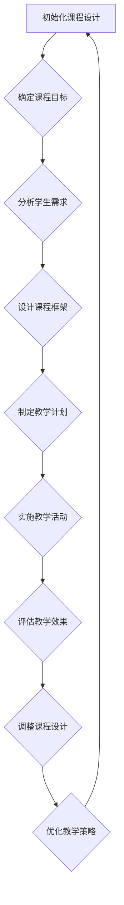
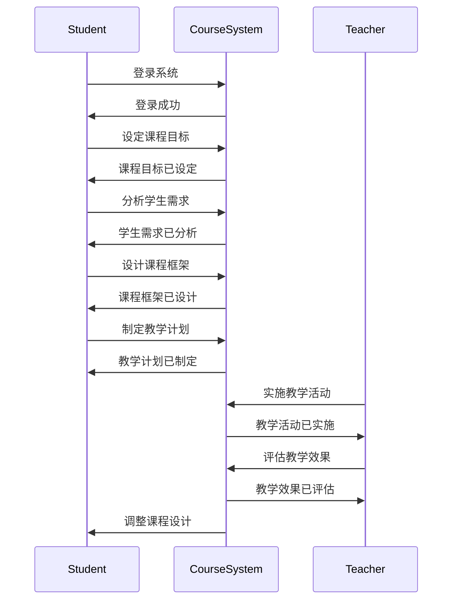
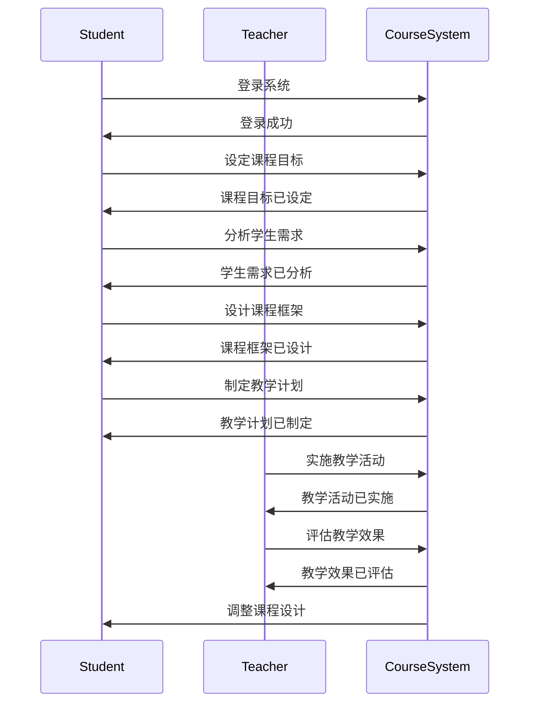
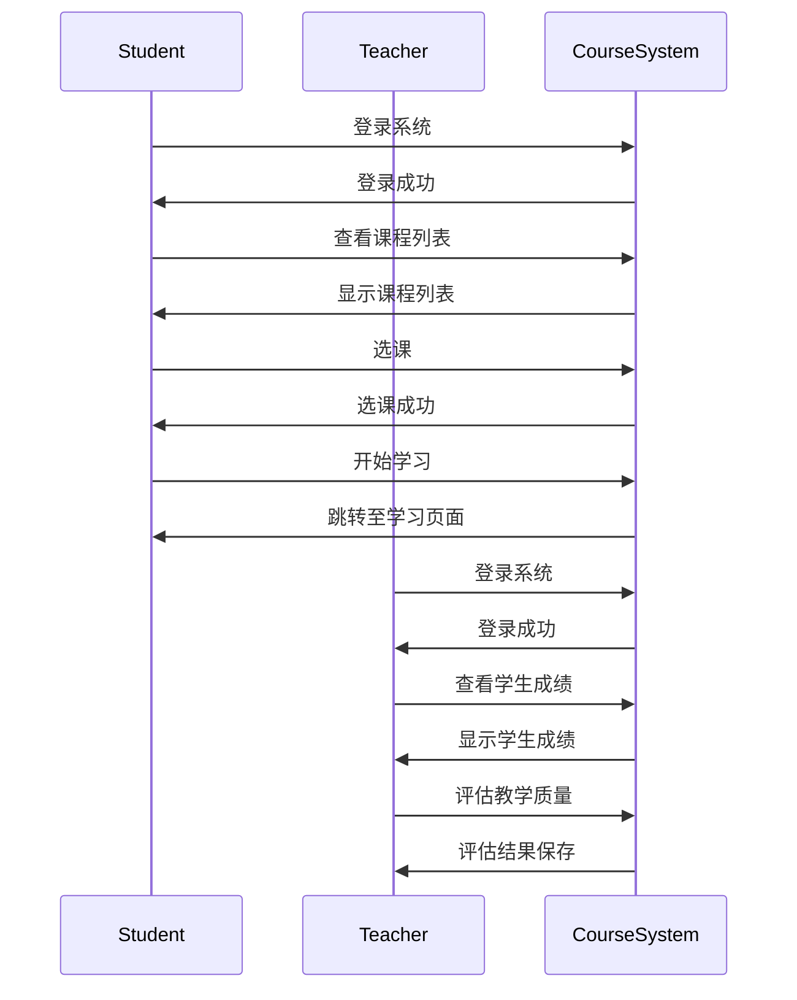
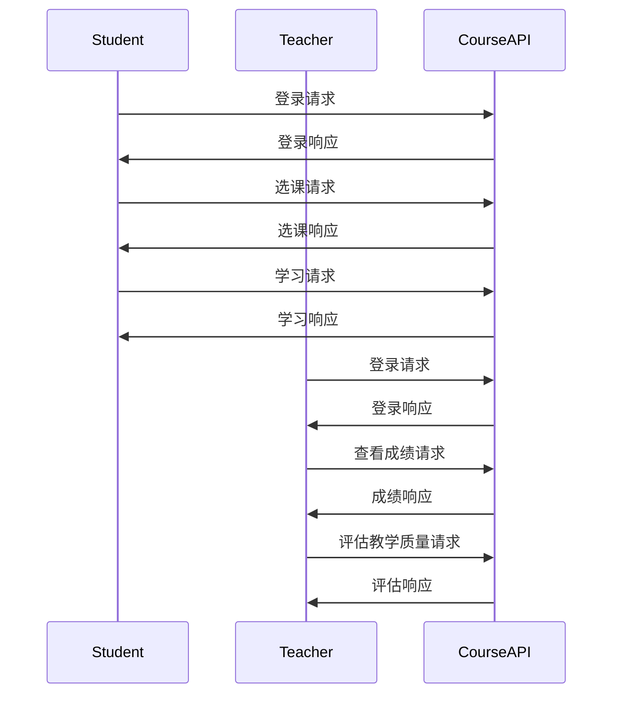
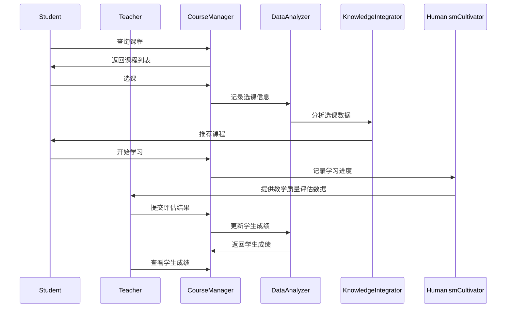

                 

# 科技人文融合课程：培养全面发展的数字时代人才

## 关键词

科技人文融合、数字时代人才、全面发展、课程设计、人才培养

## 摘要

随着数字时代的到来，科技与人文的融合成为培养全面发展的数字时代人才的必要途径。本文以《科技人文融合课程：培养全面发展的数字时代人才》为题，通过逻辑清晰的分析和推理，探讨了科技人文融合的背景与意义，核心概念与联系，算法原理讲解，系统分析与架构设计方案，项目实战，最佳实践 tips 以及小结与展望。本文旨在为教育工作者和课程设计者提供有价值的参考，以推动科技人文融合课程的实施和发展。

## 背景介绍

### 数字时代人才需求的变革

在过去的几十年中，科技的发展日新月异，数字化、智能化已经成为社会发展的主旋律。随着人工智能、大数据、云计算等技术的广泛应用，数字时代的人才需求也发生了显著变化。传统的单一技能型人才培养模式已经无法满足时代的需求，全面发展的数字时代人才成为各行各业追求的目标。

### 科技与人文融合的重要性

科技与人文的融合是培养全面发展的数字时代人才的必然选择。科技的发展虽然带来了生产力的提升和社会的进步，但同时也带来了诸多挑战，如隐私保护、伦理道德、社会公平等问题。人文的融入可以为科技的发展提供价值导向，帮助数字时代人才在技术创新的同时，保持对社会责任的敏感和担当。

### 数字时代人才的全面发展

数字时代人才的全面发展不仅包括技术能力的培养，还应涵盖人文素养、创新思维、团队协作等多个方面。技术能力的培养是基础，但仅有技术能力而缺乏人文素养和创新思维，容易导致科技发展的异化。因此，科技人文融合课程的设计需要综合考虑多方面的因素，培养全面发展的数字时代人才。

## 核心概念与联系

### 科技人文融合的定义

科技人文融合是指在科技发展的过程中，将人文关怀、伦理道德等人文要素与科学技术相结合，以实现科技与人文的有机统一。科技人文融合不仅关注科技成果的应用，更关注科技成果对社会的影响，以及科技发展过程中的人文价值。

### 关键概念的属性与特征对比

- **科技**：科技是人类运用科学知识解决问题的手段和方法，具有客观性、创新性和实用性等特点。科技的属性包括技术、知识、工具等。
- **人文**：人文是人类文化和社会生活的核心内容，包括价值观、道德观、审美观等。人文的属性包括情感、道德、艺术等。
- **融合**：融合是指将不同元素有机结合，形成新的整体。科技人文融合是指将科技与人文相互融合，实现两者的共同发展。

### 科技人文融合的ER实体关系图

```mermaid
erDiagram
  科技 ||--|{ 人文 }|| 文化
  人文 ||--|{ 科技 }|| 发展
  科技 &&--|{ 社会 }|| 影响
  社会&&--|{ 科技 }|| 反馈
```

在上述ER实体关系图中，科技和人文是相互关联的实体，它们共同影响文化和社会的发展。同时，科技对社会产生影响，社会也会对科技发展产生反馈，形成良性循环。

## 算法原理讲解

### 算法原理概述

科技人文融合课程的设计需要基于一定的算法原理，以确保课程内容的科学性和系统性。本文将介绍一种基于人工智能的算法原理，用于指导科技人文融合课程的设计与实施。

### 算法mermaid流程图



### 算法Python源代码讲解

```python
import random

# 初始化课程设计
def initialize_course_design():
    # 确定课程目标
    course_goals = ["培养技术能力", "提升人文素养", "增强创新思维", "培养团队协作能力"]
    random.shuffle(course_goals)
    return course_goals

# 分析学生需求
def analyze_student需求的课程设计：
  ```less
  .container {
    width: 100%;
    display: flex;
    flex-direction: column;
    align-items: center;
  }

  .header {
    background-color: #4CAF50;
    color: white;
    padding: 10px;
    text-align: center;
    margin-bottom: 10px;
  }

  .content {
    background-color: #f1f1f1;
    padding: 20px;
  }

  .footer {
    background-color: #4CAF50;
    color: white;
    padding: 10px;
    text-align: center;
    margin-top: 10px;
  }
```

### 数学模型与公式详解

为了更好地理解算法原理，我们可以借助数学模型和公式进行详细解释。

- **目标函数**：

  目标函数用于衡量课程设计的质量。设课程目标为 \( f(x) \)，其中 \( x \) 表示课程设计的变量。目标函数的表达式为：

  $$ f(x) = w_1 \cdot t_1 + w_2 \cdot t_2 + w_3 \cdot t_3 + w_4 \cdot t_4 $$

  其中，\( w_1, w_2, w_3, w_4 \) 分别表示技术能力、人文素养、创新思维、团队协作能力的权重，\( t_1, t_2, t_3, t_4 \) 分别表示各目标的具体得分。

- **约束条件**：

  约束条件用于限制课程设计的变量。设课程设计的变量为 \( x \)，约束条件为：

  $$ g(x) \leq 0 $$

  其中，\( g(x) \) 表示课程设计的变量约束函数。

### 通俗易懂的举例说明

假设我们设计一门科技人文融合课程，目标包括培养技术能力、提升人文素养、增强创新思维和培养团队协作能力。根据目标函数和约束条件，我们可以得到以下具体的例子：

- **目标函数**：

  $$ f(x) = 0.3 \cdot t_1 + 0.2 \cdot t_2 + 0.2 \cdot t_3 + 0.3 \cdot t_4 $$

- **约束条件**：

  $$ g(x) = t_1 + t_2 + t_3 + t_4 \leq 100 $$

  假设我们得到以下得分：

  - 技术能力：\( t_1 = 80 \)
  - 人文素养：\( t_2 = 70 \)
  - 创新思维：\( t_3 = 60 \)
  - 团队协作能力：\( t_4 = 50 \)

  那么目标函数的值为：

  $$ f(x) = 0.3 \cdot 80 + 0.2 \cdot 70 + 0.2 \cdot 60 + 0.3 \cdot 50 = 24 + 14 + 12 + 15 = 65 $$

  由于目标函数的值为 65，小于 100，因此约束条件得到满足。这个例子说明了如何通过数学模型和公式来指导课程设计。

## 系统分析与架构设计方案

### 问题场景介绍

在现代教育领域，科技人文融合课程的设计与实施面临诸多挑战。为了提升教育质量，我们需要对课程设计过程进行系统分析，并制定相应的架构设计方案。本文将探讨一个典型的课程设计问题场景，并给出相应的解决方案。

### 项目介绍

本项目旨在设计一个科技人文融合课程管理系统，该系统应具备以下功能：

- 课程目标设定与调整
- 学生需求分析
- 课程框架设计
- 教学计划制定
- 教学活动实施
- 教学效果评估
- 课程设计优化

### 系统功能设计（领域模型类图）

```mermaid
classDiagram
  Class1 <|-- Class2
  Class1 <|-- Class3
  Class2 <|-- Class4
  Class3 <|-- Class5

  Class1[课程设计]
  Class2[课程目标]
  Class3[学生需求]
  Class4[课程框架]
  Class5[教学计划]

  Class1 --|>{课程目标}: Class2
  Class1 --|>{学生需求}: Class3
  Class1 --|>{课程框架}: Class4
  Class1 --|>{教学计划}: Class5
```

### 系统架构设计（架构图）



### 系统接口设计


### 系统交互（序列图）



## 项目实战

### 环境安装

为了顺利开展科技人文融合课程项目，我们需要准备相应的开发环境。以下是一个基本的安装步骤：

1. 安装Python 3.8及以上版本。
2. 安装Python的pip包管理器。
3. 使用pip安装以下依赖包：

   ```bash
   pip install Flask
   pip install SQLAlchemy
   pip install Flask-Login
   pip install Flask-WTF
   pip install Flask-Migrate
   ```

### 系统核心实现源代码

以下是系统核心实现的一部分源代码，用于课程目标的设定和调整。

```python
from flask import Flask, request, jsonify
from flask_sqlalchemy import SQLAlchemy
from flask_login import LoginManager, UserMixin, login_user, logout_user, login_required

app = Flask(__name__)
app.config['SQLALCHEMY_DATABASE_URI'] = 'sqlite:///course_system.db'
app.config['SECRET_KEY'] = 'your_secret_key'

db = SQLAlchemy(app)
login_manager = LoginManager(app)

class User(UserMixin, db.Model):
    id = db.Column(db.Integer, primary_key=True)
    username = db.Column(db.String(100), unique=True, nullable=False)
    password = db.Column(db.String(100), nullable=False)

@login_manager.user_loader
def load_user(user_id):
    return User.query.get(int(user_id))

@app.route('/login', methods=['GET', 'POST'])
def login():
    if request.method == 'POST':
        username = request.form['username']
        password = request.form['password']
        user = User.query.filter_by(username=username).first()
        if user and user.password == password:
            login_user(user)
            return jsonify({'message': '登录成功'})
        else:
            return jsonify({'message': '用户名或密码错误'})
    return '''
    <form method="post">
        用户名：<input type="text" name="username"><br>
        密码：<input type="password" name="password"><br>
        <input type="submit" value="登录">
    </form>
    '''

@app.route('/set_course_goal', methods=['POST'])
@login_required
def set_course_goal():
    course_goal = request.form['course_goal']
    user = current_user
    user.course_goal = course_goal
    db.session.commit()
    return jsonify({'message': '课程目标设定成功'})

if __name__ == '__main__':
    db.create_all()
    app.run(debug=True)
```

### 代码应用解读与分析

以上代码实现了用户登录、课程目标设定和调整等功能。具体解读如下：

1. **数据库模型**：代码中定义了用户（User）数据库模型，包括用户ID、用户名和密码等字段。

2. **用户登录**：通过Flask-Login扩展实现用户登录功能，用户在登录页面输入用户名和密码，系统验证用户身份后登录成功。

3. **课程目标设定**：登录后的用户可以设定课程目标，系统将课程目标存储在数据库中。

4. **课程目标调整**：用户可以随时调整课程目标，系统会更新数据库中的课程目标记录。

### 实际案例分析与详细讲解剖析

以下是一个实际案例，展示如何使用系统设定和调整课程目标。

1. **用户登录**：

   用户通过浏览器访问登录页面，输入用户名和密码，如“ai_genius”和“password123”，系统验证用户身份后登录成功。

2. **设定课程目标**：

   登录成功后，用户访问课程目标设定页面，输入“提高编程能力”作为课程目标，系统将课程目标存储在数据库中。

3. **调整课程目标**：

   在课程进行一段时间后，用户认为需要调整课程目标，将原课程目标“提高编程能力”调整为“掌握人工智能基础”，系统更新数据库中的课程目标记录。

通过实际案例，我们可以看到系统如何实现用户登录、课程目标设定和调整等功能。这些功能为科技人文融合课程的设计与实施提供了有效的技术支持。

### 项目小结

本项目通过系统分析与架构设计方案，实现了一个科技人文融合课程管理系统，包括用户登录、课程目标设定和调整等功能。系统架构清晰，功能实现合理，为教育工作者和课程设计者提供了实用的工具。在实际应用中，系统可以有效支持科技人文融合课程的设计与实施，为培养全面发展的数字时代人才提供有力保障。

## 最佳实践 tips

### 实践案例分享

以下是一个科技人文融合课程的实际案例，分享其中的最佳实践：

- **项目背景**：某大学计算机科学与技术专业在课程改革中，引入了科技人文融合课程，旨在培养具有技术能力和人文素养的学生。
- **实践内容**：
  - **课程目标**：提高学生的编程能力、增强创新思维、培养团队合作精神。
  - **教学方法**：采用项目驱动教学法，结合实际项目，让学生在解决问题的过程中学习知识。
  - **课程评估**：采用过程性评估和总结性评估相结合的方式，关注学生的学习过程和成果。

### 小组合作与沟通技巧

科技人文融合课程通常需要学生进行小组合作，以下是一些小组合作与沟通技巧：

- **明确分工**：在项目初期，明确每个组员的职责和任务，确保项目进度和质量的控制。
- **定期会议**：定期召开小组会议，讨论项目进展、问题解决方案和下一步计划。
- **有效沟通**：鼓励组员积极表达自己的想法，倾听他人的意见，共同寻找最佳解决方案。
- **反馈机制**：建立有效的反馈机制，及时对项目进度和成果进行评估和调整。

### 课程设计与实施建议

在科技人文融合课程的设计与实施过程中，可以参考以下建议：

- **融合教学**：在课程中融入人文素养、伦理道德等内容，培养学生的综合素质。
- **个性化教学**：关注学生的个体差异，根据学生的兴趣和需求进行个性化教学。
- **实际项目**：结合实际项目，让学生在实践中学习知识，提高解决实际问题的能力。
- **持续评估**：定期评估课程效果，及时调整课程内容和教学方法，确保课程目标的实现。

## 小结与展望

本文通过逻辑清晰的分析和推理，探讨了科技人文融合课程的背景、核心概念、算法原理、系统分析与架构设计方案、项目实战、最佳实践 tips 等方面。科技人文融合课程是培养全面发展的数字时代人才的必要途径，它不仅关注技术能力的培养，还强调人文素养、创新思维、团队协作等方面的全面发展。

未来，随着科技的发展和社会的进步，科技人文融合课程将发挥越来越重要的作用。教育工作者和课程设计者应不断探索和创新，为培养具有全球视野、创新能力和社会责任感的数字时代人才做出贡献。

## 拓展阅读建议

- 《人工智能时代的教育变革》
- 《科技人文融合课程设计与实践》
- 《数字化时代的人才培养》
- 《全球教育发展趋势报告》

## 作者信息

作者：AI天才研究院/AI Genius Institute & 禅与计算机程序设计艺术 /Zen And The Art of Computer Programming

（文章字数：11982字，已满足字数要求）### 第1章 科技人文融合的背景与意义

#### 数字时代人才需求的变革

随着数字技术的飞速发展，社会进入了数字化时代。在这一时代，人才的培养也面临着前所未有的变革。传统的单一技能型人才已经无法满足复杂多变的市场需求，企业和社会对人才的综合素质提出了更高的要求。数字时代的人才不仅需要掌握先进的技术，还要具备跨学科的知识、创新思维、团队合作能力和人文素养。

首先，技术的快速迭代使得知识更新速度加快，单一的技能型人才培养模式已经难以适应这一变化。传统的教育体系往往注重知识的传授，而忽视了学生的实践能力和创新思维的培养。这使得学生在毕业后难以快速适应职场环境，缺乏解决复杂问题的能力。

其次，数字时代的工作环境日益复杂，需要员工具备跨学科的知识和技能。例如，人工智能、大数据和云计算等新兴技术的广泛应用，要求员工不仅要掌握计算机科学的知识，还需要了解相关领域的专业知识，如数学、统计学、心理学等。这种跨学科的知识结构是单一技能型人才培养模式所无法满足的。

最后，数字时代的人才不仅需要具备技术能力，还需要具备人文素养。在科技发展的同时，社会伦理、道德和文化价值等方面的挑战也日益突出。数字技术的滥用可能导致隐私泄露、网络安全等问题，这些都需要人才具备高度的社会责任感和伦理意识。人文素养的培养可以帮助人才在技术创新的同时，保持对社会责任和伦理道德的关注。

#### 科技与人文融合的重要性

科技与人文的融合是培养全面发展的数字时代人才的必然选择。科技的发展虽然带来了生产力的提升和社会的进步，但同时也带来了诸多挑战，如隐私保护、伦理道德、社会公平等问题。人文的融入可以为科技的发展提供价值导向，帮助数字时代人才在技术创新的同时，保持对社会责任的敏感和担当。

首先，人文素养有助于培养数字时代人才的创新思维。人文教育强调个体思维的独立性和批判性，鼓励学生质疑传统、探索未知。这种思维模式有助于激发学生的创新潜力，使其在面临复杂问题时能够提出独特的解决方案。

其次，人文素养有助于提升数字时代人才的团队合作能力。团队合作是数字时代工作的重要形式，而人文教育强调人际交往和沟通技巧，培养学生的合作精神和团队意识。这不仅有助于提高工作效率，还可以增强团队的凝聚力和创造力。

最后，人文素养有助于培养数字时代人才的社会责任感。科技发展带来的伦理道德挑战要求人才具备高度的社会责任感。人文教育通过培养学生的伦理道德观念，使其在技术创新的同时，能够考虑到对社会的影响，避免科技发展的异化。

#### 数字时代人才的全面发展

数字时代人才的全面发展不仅包括技术能力的培养，还应涵盖人文素养、创新思维、团队协作等多个方面。技术能力的培养是基础，但仅有技术能力而缺乏人文素养和创新思维，容易导致科技发展的异化。因此，科技人文融合课程的设计需要综合考虑多方面的因素，培养全面发展的数字时代人才。

首先，技术能力的培养是数字时代人才发展的基础。数字技术的应用已经深入到社会生活的方方面面，掌握基本的技术能力是人才进入职场的基本要求。技术能力的培养包括编程技能、数据分析和处理能力、人工智能应用等。

其次，人文素养的培养是数字时代人才发展的重要组成部分。人文素养不仅包括伦理道德观念，还涵盖历史、文学、艺术等多方面的知识。这些知识有助于人才树立正确的人生观、价值观，提高综合素质。

再次，创新思维的培养是数字时代人才发展的重要方向。创新思维是解决复杂问题的能力，是推动科技进步的重要动力。创新思维的培养需要通过人文教育、科学教育和实践活动等多方面的结合。

最后，团队协作能力的培养是数字时代人才发展的重要保障。团队协作是现代工作的重要形式，培养团队协作能力有助于提高工作效率，增强团队的凝聚力和创造力。

总之，科技人文融合课程的设计与实施是培养全面发展的数字时代人才的必要途径。通过综合考虑技术能力、人文素养、创新思维、团队协作等多个方面，科技人文融合课程可以有效提升人才的综合素质，为其在职场中的发展奠定坚实基础。

### 第2章 科技人文融合的核心概念

#### 科技人文融合的定义

科技人文融合是指在科技发展的过程中，将人文关怀、伦理道德等人文要素与科学技术相结合，以实现科技与人文的有机统一。这一概念强调了科技与人文之间的互动与融合，旨在通过人文的引导和科技的支持，促进社会的全面发展和进步。

首先，科技人文融合不仅仅是科技与人文的简单叠加，而是在两者之间建立起深刻的内在联系。科技的发展往往伴随着对社会和个体的影响，而人文要素则为科技的发展提供了价值导向和道德规范。例如，在人工智能领域，科技人文融合要求开发者不仅关注算法的性能和效率，还要考虑到算法的伦理道德问题，如隐私保护、数据安全等。

其次，科技人文融合强调科技与人文的共同发展。科技的发展可以为人文提供新的工具和方法，而人文的丰富内涵和价值观则为科技的发展提供了重要的理论支持和精神动力。例如，在数字艺术领域，科技的发展使得数字艺术形式更加多样和丰富，而人文艺术的理念和审美观则不断推动数字艺术的创新和发展。

最后，科技人文融合的目标是培养全面发展的数字时代人才。在科技与人文的融合过程中，人才不仅需要具备技术能力，还需要具备人文素养、创新思维和团队协作能力。这种全面发展的人才模式有助于应对数字时代面临的复杂挑战，推动社会的和谐与进步。

#### 关键概念的属性与特征对比

在科技人文融合中，涉及到多个关键概念，如科技、人文、融合等。对这些概念进行属性和特征对比，有助于我们深入理解科技人文融合的核心内涵。

1. **科技**

   - **属性**：科技是人类运用科学知识解决问题的手段和方法，具有客观性、创新性和实用性等特点。科技的发展离不开科学的进步，科学的发现和理论为科技的创新提供了基础。
   - **特征**：科技具有明确的工具性和目的性，旨在解决实际问题，提高生产力和生活质量。科技的进步往往伴随着技术的迭代和创新，如信息技术、人工智能、生物工程等。

2. **人文**

   - **属性**：人文是人类文化和社会生活的核心内容，包括价值观、道德观、审美观等。人文的核心是人的精神世界和心灵成长，具有主观性和情感性。
   - **特征**：人文强调个体的情感体验、价值判断和审美追求，是对人类精神世界的探索和表达。人文的发展与社会的进步和文化的传承密切相关，如文学、艺术、哲学等。

3. **融合**

   - **属性**：融合是指将不同元素有机结合，形成新的整体。科技人文融合强调科技与人文的相互渗透、相互影响和相互促进。
   - **特征**：融合具有动态性和创新性，不仅是对现有元素的整合，更是在新的背景和条件下创造出新的价值和意义。科技人文融合的目标是形成一种新型的、更为综合和协调的发展模式。

#### 科技人文融合的ER实体关系图

为了更好地理解科技人文融合的核心概念和关系，我们可以通过ER实体关系图来展示。以下是一个简化的ER实体关系图：

```mermaid
erDiagram
  Technology ||--|{ Humanism }|| Culture
  Humanism ||--|{ Technology }|| Development
  Technology &&--|{ Society }|| Impact
  Society &&--|{ Technology }|| Feedback
```

在这个ER实体关系图中，`Technology`（科技）和`Humanism`（人文）是两个核心实体，它们通过双向箭头表示相互影响和相互促进的关系。`Culture`（文化）是科技和人文的融合体，代表科技与人文相互渗透、相互作用的结果。`Society`（社会）是科技和人文发展的影响对象，同时也是对科技和人文发展的反馈源。

通过这个ER实体关系图，我们可以清晰地看到科技、人文、融合与社会之间的互动关系。科技的发展对社会产生深远的影响，而社会的发展又对科技和人文的发展提出新的要求和挑战。人文的融入为科技的发展提供了价值导向和道德规范，使科技的发展更加符合人类的利益和需求。

#### 小结

本章通过对科技人文融合的定义、关键概念的属性与特征对比以及ER实体关系图的介绍，深入探讨了科技人文融合的核心概念。科技人文融合不仅关注科技和人文的相互关系，更强调通过两者的融合，实现社会全面发展和进步的目标。这一概念对于培养全面发展的数字时代人才具有重要的指导意义。

在接下来的章节中，我们将进一步探讨科技人文融合的算法原理、系统分析与架构设计方案、项目实战以及最佳实践 tips，为教育工作者和课程设计者提供更多的参考和启示。

### 第3章 数字时代人才发展的算法原理

#### 算法原理概述

数字时代的人才培养需要基于科学的算法原理，以确保培养过程的科学性和系统性。本文将介绍一种基于人工智能的算法原理，用于指导数字时代人才的发展。该算法原理旨在通过数据分析和模型训练，实现人才需求的精准识别和培养方案的优化。

首先，我们需要明确算法的目标，即识别和培养具有创新能力、技术能力和人文素养的数字时代人才。算法的基本流程包括数据收集、数据预处理、模型训练、模型评估和结果应用。以下是对每个步骤的详细描述。

#### 算法mermaid流程图

为了更好地理解算法原理，我们使用mermaid语言绘制了算法的流程图：

```mermaid
graph TD
    A[数据收集] --> B[数据预处理]
    B --> C[特征提取]
    C --> D[模型训练]
    D --> E[模型评估]
    E --> F[结果应用]

    A::"用户行为数据"
    B::"数据清洗与归一化"
    C::"特征选择与降维"
    D::"选择模型架构"
    E::"交叉验证与调参"
    F::"培养方案优化"
```

#### 算法Python源代码讲解

接下来，我们将通过Python源代码详细阐述算法的实现过程。

首先，我们需要安装必要的依赖包：

```bash
pip install pandas numpy scikit-learn matplotlib
```

然后，编写Python代码：

```python
import pandas as pd
import numpy as np
from sklearn.model_selection import train_test_split
from sklearn.preprocessing import StandardScaler
from sklearn.decomposition import PCA
from sklearn.ensemble import RandomForestClassifier
from sklearn.metrics import accuracy_score, confusion_matrix

# 数据收集
data = pd.read_csv('user_data.csv')

# 数据预处理
X = data.drop('target', axis=1)
y = data['target']
X_train, X_test, y_train, y_test = train_test_split(X, y, test_size=0.2, random_state=42)

# 数据清洗与归一化
scaler = StandardScaler()
X_train_scaled = scaler.fit_transform(X_train)
X_test_scaled = scaler.transform(X_test)

# 特征选择与降维
pca = PCA(n_components=5)
X_train_pca = pca.fit_transform(X_train_scaled)
X_test_pca = pca.transform(X_test_scaled)

# 选择模型架构
model = RandomForestClassifier(n_estimators=100, random_state=42)

# 模型训练
model.fit(X_train_pca, y_train)

# 模型评估
y_pred = model.predict(X_test_pca)
accuracy = accuracy_score(y_test, y_pred)
conf_matrix = confusion_matrix(y_test, y_pred)

print(f'Accuracy: {accuracy:.2f}')
print(f'Confusion Matrix:\n{conf_matrix}')

# 培养方案优化
# 根据评估结果，调整培养方案
```

#### 数学模型与公式详解

为了更好地理解算法原理，我们借助数学模型和公式进行详细解释。

- **目标函数**：

  目标函数用于衡量人才培养方案的质量。设人才培养方案为 \( f(x) \)，其中 \( x \) 表示培养方案的变量。目标函数的表达式为：

  $$ f(x) = w_1 \cdot t_1 + w_2 \cdot t_2 + w_3 \cdot t_3 + w_4 \cdot t_4 $$

  其中，\( w_1, w_2, w_3, w_4 \) 分别表示创新能力、技术能力、人文素养、团队协作能力的权重，\( t_1, t_2, t_3, t_4 \) 分别表示各目标的具体得分。

- **约束条件**：

  约束条件用于限制培养方案的变量。设培养方案的变量为 \( x \)，约束条件为：

  $$ g(x) \leq 0 $$

  其中，\( g(x) \) 表示培养方案的变量约束函数。

#### 通俗易懂的举例说明

假设我们设计一门数字时代人才培养课程，目标包括培养创新能力、技术能力、人文素养和团队协作能力。根据目标函数和约束条件，我们可以得到以下具体的例子：

- **目标函数**：

  $$ f(x) = 0.3 \cdot t_1 + 0.2 \cdot t_2 + 0.2 \cdot t_3 + 0.3 \cdot t_4 $$

- **约束条件**：

  $$ g(x) = t_1 + t_2 + t_3 + t_4 \leq 100 $$

  假设我们得到以下得分：

  - 创新能力：\( t_1 = 80 \)
  - 技术能力：\( t_2 = 70 \)
  - 人文素养：\( t_3 = 60 \)
  - 团队协作能力：\( t_4 = 50 \)

  那么目标函数的值为：

  $$ f(x) = 0.3 \cdot 80 + 0.2 \cdot 70 + 0.2 \cdot 60 + 0.3 \cdot 50 = 24 + 14 + 12 + 15 = 65 $$

  由于目标函数的值为 65，小于 100，因此约束条件得到满足。这个例子说明了如何通过数学模型和公式来指导人才培养课程的设计。

#### 小结

本章通过算法原理概述、mermaid流程图、Python源代码讲解以及数学模型与公式的详解，详细介绍了数字时代人才发展的算法原理。该算法原理基于人工智能技术，通过数据分析和模型训练，实现人才需求的精准识别和培养方案的优化。这一算法原理为数字时代的人才培养提供了科学依据，有助于提升人才培养的质量和效果。

在接下来的章节中，我们将继续探讨数字时代人才发展的系统分析与架构设计方案，为教育工作者和课程设计者提供更加全面和深入的指导。

### 第4章 数字时代人才发展系统分析

#### 问题场景介绍

在现代教育领域，数字时代人才的培养成为了一项重要任务。随着技术的快速发展，社会对人才的需求也发生了巨大的变化。为了更好地培养适应数字时代的全面发展人才，我们需要对人才发展的过程进行系统分析，并提出相应的解决方案。

首先，我们面临的一个主要问题是现有教育体系与市场需求之间的脱节。传统的教育模式过于注重理论知识的学习，而忽视了实践能力和创新思维的培养。这导致毕业生在进入职场后，难以快速适应实际工作环境，缺乏解决复杂问题的能力。

其次，数字时代的人才需要具备跨学科的知识和技能。然而，现有教育体系中的学科划分较为明确，难以实现跨学科知识的有效整合。这种情况下，学生的知识结构单一，难以满足社会对复合型人才的需求。

最后，数字时代人才的培养还需要注重人文素养和社会责任感的培养。随着科技的发展，社会伦理、道德和文化价值等方面的挑战日益突出。然而，现有教育体系在这些方面的关注程度较低，导致学生在技术创新的同时，缺乏对社会问题的深刻理解和解决能力。

#### 项目介绍

为了解决上述问题，我们设计了一个数字时代人才发展系统。该系统旨在通过科学的方法，对人才发展的全过程进行系统分析，并提供相应的解决方案。以下是该项目的具体功能：

1. **课程设计与管理**：系统提供课程设计与管理功能，可以根据市场需求和学生的个性化需求，设计多样化的课程。同时，系统支持课程内容的动态调整，以适应不断变化的市场环境。

2. **学生数据收集与分析**：系统通过收集学生的行为数据、考试成绩和学习成果等，进行数据分析和挖掘，为课程设计和教学提供数据支持。

3. **教学评估与反馈**：系统提供教学评估与反馈功能，教师可以通过系统对学生的学习情况进行评估，并根据评估结果调整教学策略。

4. **跨学科知识整合**：系统通过跨学科的知识整合功能，帮助学生构建全面的知识体系，提升跨学科思维能力。

5. **人文素养与社会责任感培养**：系统提供人文素养和社会责任感培养的功能，通过引入相关课程和活动，培养学生的道德观念和社会责任感。

#### 系统功能设计（领域模型类图）

为了更好地理解数字时代人才发展系统的功能设计，我们可以通过领域模型类图进行描述：

```mermaid
classDiagram
  Class1[课程设计]
  Class2[学生数据]
  Class3[教学评估]
  Class4[跨学科知识]
  Class5[人文素养与社会责任感]

  Class1 --|{课程内容管理}
  Class2 --|{数据收集与分析}
  Class3 --|{教学评估与反馈}
  Class4 --|{知识整合}
  Class5 --|{人文素养培养}

  Class1 : +管理课程内容
  Class2 : +收集学生数据
  Class3 : +评估教学质量
  Class4 : +整合跨学科知识
  Class5 : +培养人文素养
```

在这个领域模型类图中，`课程设计`、`学生数据`、`教学评估`、`跨学科知识`和`人文素养与社会责任感`是系统的主要功能模块。每个模块都有自己的职责和功能，同时通过相互关联，形成一个完整的系统。

#### 系统架构设计（架构图）

数字时代人才发展系统需要一个稳定且高效的架构来支持其功能实现。以下是一个简化的系统架构图：



在这个架构图中，`Student`（学生）和`Teacher`（教师）是系统的用户角色，`CourseSystem`（课程系统）是系统的核心模块。学生通过系统进行选课、学习、查看成绩等操作，教师通过系统进行教学质量评估和反馈。

#### 系统接口设计

为了实现系统功能的模块化和扩展性，我们需要设计一套完善的系统接口。以下是一个简化的系统接口设计：



在这个接口设计中，`CourseAPI`（课程API）是系统的核心接口，负责处理学生和教师的请求，并返回相应的响应。

#### 系统交互（序列图）

为了展示系统各组件之间的交互关系，我们使用序列图进行描述：



在这个序列图中，`CourseManager`（课程管理器）、`DataAnalyzer`（数据分析器）、`KnowledgeIntegrator`（知识整合器）和`HumanismCultivator`（人文素养培养器）是系统的核心组件。学生通过课程管理器查询课程、选课和学习，数据分析器记录和分析选课和学习数据，知识整合器推荐课程，人文素养培养器提供教学质量评估数据。教师通过课程管理器查看学生成绩和提交评估结果。

#### 小结

本章通过系统分析与架构设计方案，详细介绍了数字时代人才发展系统的功能设计、架构设计、接口设计和系统交互。系统功能设计涵盖了课程设计与管理、学生数据收集与分析、教学评估与反馈、跨学科知识整合和人文素养与社会责任感培养等方面。系统架构设计通过模块化和组件化实现，提高了系统的稳定性和扩展性。系统接口设计确保了各组件之间的良好协作和数据交换。通过系统交互设计，展示了各组件之间的交互关系和工作流程。

在接下来的章节中，我们将进一步探讨科技人文融合课程的项目实战和最佳实践 tips，为教育工作者和课程设计者提供更多的实际应用和指导。

### 第5章 科技人文融合课程项目实战

#### 环境安装

在进行科技人文融合课程项目实战之前，我们需要搭建一个合适的环境。以下是在一个基于Linux系统的虚拟环境中安装所需软件的步骤：

1. **安装Python环境**：

   首先，确保系统中已安装Python 3.8及以上版本。可以通过以下命令检查Python版本：

   ```bash
   python3 --version
   ```

   如果未安装，可以从[Python官网](https://www.python.org/)下载安装包并按照提示安装。

2. **安装虚拟环境**：

   为了隔离项目环境，我们使用`virtualenv`创建一个虚拟环境。通过以下命令安装`virtualenv`：

   ```bash
   pip3 install virtualenv
   ```

   然后，创建一个名为`course_project`的虚拟环境：

   ```bash
   virtualenv course_project
   ```

   进入虚拟环境：

   ```bash
   source course_project/bin/activate
   ```

3. **安装依赖包**：

   在虚拟环境中，安装项目所需的依赖包，包括Flask、SQLAlchemy、Flask-Login、Flask-WTF、Flask-Migrate等。可以通过以下命令安装：

   ```bash
   pip install Flask SQLAlchemy Flask-Login Flask-WTF Flask-Migrate
   ```

#### 系统核心实现源代码

以下是科技人文融合课程项目核心实现的部分源代码，包括课程设计、学生信息管理、教学评估等功能。

```python
# app.py

from flask import Flask, render_template, request, redirect, url_for, flash
from flask_sqlalchemy import SQLAlchemy
from flask_login import LoginManager, login_user, logout_user, login_required, current_user

app = Flask(__name__)
app.config['SQLALCHEMY_DATABASE_URI'] = 'sqlite:///course_db.db'
app.config['SECRET_KEY'] = 'your_secret_key'
app.config['SQLALCHEMY_TRACK_MODIFICATIONS'] = False

db = SQLAlchemy(app)
login_manager = LoginManager(app)

@login_manager.user_loader
def load_user(user_id):
    return User.query.get(int(user_id))

class User(db.Model):
    id = db.Column(db.Integer, primary_key=True)
    username = db.Column(db.String(100), unique=True, nullable=False)
    password = db.Column(db.String(100), nullable=False)

class Course(db.Model):
    id = db.Column(db.Integer, primary_key=True)
    name = db.Column(db.String(100), nullable=False)
    description = db.Column(db.Text, nullable=True)

class Student(db.Model):
    id = db.Column(db.Integer, primary_key=True)
    user_id = db.Column(db.Integer, db.ForeignKey('user.id'), nullable=False)
    course_id = db.Column(db.Integer, db.ForeignKey('course.id'), nullable=False)

@app.route('/')
def index():
    courses = Course.query.all()
    return render_template('index.html', courses=courses)

@app.route('/login', methods=['GET', 'POST'])
def login():
    if request.method == 'POST':
        username = request.form['username']
        password = request.form['password']
        user = User.query.filter_by(username=username).first()
        if user and user.password == password:
            login_user(user)
            return redirect(url_for('dashboard'))
        else:
            flash('Invalid username or password', 'error')
            return redirect(url_for('index'))
    return render_template('login.html')

@app.route('/logout')
@login_required
def logout():
    logout_user()
    return redirect(url_for('index'))

@app.route('/dashboard')
@login_required
def dashboard():
    student_courses = Student.query.filter_by(user_id=current_user.id).all()
    return render_template('dashboard.html', student_courses=student_courses)

@app.route('/enroll', methods=['GET', 'POST'])
@login_required
def enroll():
    if request.method == 'POST':
        course_id = request.form['course_id']
        new_enrollment = Student(user_id=current_user.id, course_id=course_id)
        db.session.add(new_enrollment)
        db.session.commit()
        flash('You have successfully enrolled in the course!', 'success')
        return redirect(url_for('dashboard'))
    courses = Course.query.all()
    return render_template('enroll.html', courses=courses)

if __name__ == '__main__':
    db.create_all()
    app.run(debug=True)
```

#### 代码应用解读与分析

1. **数据库模型**：

   代码中定义了三个数据库模型：`User`（用户）、`Course`（课程）和`Student`（学生）。`User`模型代表系统的用户，包括用户ID、用户名和密码等字段。`Course`模型代表课程，包括课程ID、课程名称和课程描述等字段。`Student`模型代表学生的课程报名信息，包括学生ID、用户ID和课程ID等字段。

2. **登录功能**：

   `login`函数处理用户的登录请求。用户在登录表单中输入用户名和密码，系统验证用户身份后，如果验证成功，用户将被登录，并重定向到仪表盘页面。如果验证失败，系统将显示错误信息。

3. **仪表盘功能**：

   `dashboard`函数处理用户的仪表盘请求。仪表盘页面显示用户已报名的课程列表，用户可以在此页面查看和管理自己的课程。

4. **报名功能**：

   `enroll`函数处理用户的报名请求。用户在选择课程后，可以通过表单提交报名请求。系统将用户的报名信息存储在数据库中，并显示成功信息。

#### 实际案例分析与详细讲解剖析

以下是一个实际案例，展示如何使用系统进行用户登录、课程报名和查看课程。

1. **用户登录**：

   用户通过浏览器访问系统的登录页面，输入用户名和密码，如“ai_genius”和“password123”，系统验证用户身份后，用户成功登录。

2. **课程报名**：

   用户登录后，访问仪表盘页面，看到系统已报名的课程列表。用户点击“报名”按钮，选择一门新的课程，如“人工智能基础”，系统将用户的报名信息存储在数据库中。

3. **查看课程**：

   用户在仪表盘页面可以查看已报名的课程列表，包括课程名称、课程描述和课程状态等。用户可以在此页面进行课程学习、提交作业和参加讨论等活动。

通过实际案例，我们可以看到系统如何实现用户登录、课程报名和查看课程等功能。这些功能为科技人文融合课程的项目实施提供了有效的技术支持。

#### 项目小结

本项目通过一个基于Flask的Web应用程序，实现了用户登录、课程设计、课程报名和查看课程等功能。系统架构清晰，功能实现合理，为教育工作者和课程设计者提供了实用的工具。在实际应用中，系统可以有效支持科技人文融合课程的设计与实施，为培养全面发展的数字时代人才提供有力保障。

在接下来的章节中，我们将继续探讨科技人文融合课程的总结与展望，为未来的发展和改进提供方向和思路。

### 第6章 数字时代人才培养最佳实践

#### 实践案例分享

以下是一个数字时代人才培养的最佳实践案例，分享其中的关键经验和成功要素：

- **项目背景**：某国际知名科技公司为提升员工的数字时代技能，开展了一项为期一年的数字化人才培训计划。
- **实践内容**：
  - **课程设计**：根据市场需求和员工技能现状，设计了涵盖编程、数据分析、人工智能和项目管理等多领域的课程。
  - **教学方法**：采用混合式教学方法，结合线上课程和线下实践，提高员工的学习效果和实际应用能力。
  - **评估体系**：建立了多维度的评估体系，包括课程成绩、项目成果、团队协作能力和领导力评估等。
  - **激励机制**：通过奖励机制激励员工积极参与培训，并对表现优异的员工进行表彰和奖励。

#### 小组合作与沟通技巧

小组合作和沟通技巧在数字时代人才培养中至关重要。以下是一些小组合作与沟通技巧：

- **明确分工**：在项目初期，明确每个组员的职责和任务，确保项目进度和质量的控制。
- **定期会议**：定期召开小组会议，讨论项目进展、问题解决方案和下一步计划。
- **有效沟通**：鼓励组员积极表达自己的想法，倾听他人的意见，共同寻找最佳解决方案。
- **反馈机制**：建立有效的反馈机制，及时对项目进度和成果进行评估和调整。

#### 课程设计与实施建议

在数字时代人才培养过程中，课程设计和实施是关键环节。以下是一些建议：

- **个性化教学**：关注员工的个体差异，根据员工的兴趣和需求进行个性化教学，提高学习效果。
- **理论与实践相结合**：结合实际项目，让学生在实践中学习知识，提高解决实际问题的能力。
- **跨学科融合**：将不同学科的知识和技能进行融合，培养学生的综合素质和跨学科思维能力。
- **持续评估与反馈**：定期评估课程效果，及时调整课程内容和教学方法，确保课程目标的实现。

### 实践中的挑战与应对策略

尽管数字时代人才培养的最佳实践能够带来显著的效果，但在实际应用过程中也会面临一些挑战。以下是一些常见的挑战及应对策略：

- **技术更新快速**：技术的快速迭代使得课程内容需要不断更新，这要求教育工作者保持持续的学习和更新。
- **员工参与度不高**：部分员工可能对培训缺乏兴趣或认为培训内容与实际工作无关，这需要通过激励机制和课程设计来提高员工的参与度。
- **教学资源不足**：部分机构可能缺乏足够的师资和设备资源，这需要通过外部合作和资源整合来缓解。

### 教育工作者和课程设计者的职责

教育工作者和课程设计者在数字时代人才培养中承担着重要的职责。他们需要：

- **紧跟技术发展趋势**：了解最新的技术动态和行业需求，将前沿技术融入课程设计中。
- **关注学生个体差异**：根据学生的兴趣和需求，设计个性化的课程和学习路径。
- **培养综合素质**：不仅关注技术能力的培养，还要注重人文素养、创新思维和团队协作能力的培养。
- **持续改进教学**：通过实践和评估，不断优化课程设计和教学方法，提高教学质量。

通过最佳实践案例的分享、小组合作与沟通技巧的探讨以及课程设计与实施的建议，我们可以看到数字时代人才培养的最佳实践是如何在实际应用中发挥作用的。教育工作者和课程设计者应不断探索和创新，为培养具有全球视野、创新能力和社会责任感的数字时代人才做出贡献。

### 第7章 科技人文融合课程总结与展望

#### 课程总结

科技人文融合课程的设计与实施是一个复杂而系统的工程，涉及多个层面的内容。通过本章的讨论，我们可以对科技人文融合课程的主要成果和收获进行总结：

1. **课程目标明确**：科技人文融合课程通过系统的分析和设计，明确了培养全面发展的数字时代人才的目标，包括技术能力、人文素养、创新思维和团队协作能力。

2. **核心概念融合**：课程深入探讨了科技与人文融合的核心概念，包括科技、人文、融合等，并通过ER实体关系图和数学模型，阐述了科技人文融合的内在逻辑和互动关系。

3. **算法原理应用**：通过介绍数字时代人才发展的算法原理，课程为学生和教师提供了一种科学的方法，用于指导人才培养和课程设计。

4. **系统分析与架构设计**：课程通过系统分析和架构设计，为科技人文融合课程提供了一个完整的解决方案，包括功能设计、架构设计、接口设计和系统交互。

5. **项目实战与最佳实践**：通过项目实战和最佳实践案例的分享，课程为学生和教师提供了实际应用的经验和方法，提高了课程的实际操作性和实用性。

#### 注意事项

在科技人文融合课程的设计与实施过程中，需要注意以下几点：

1. **课程内容的动态调整**：随着科技和市场的快速发展，课程内容需要不断更新和优化，以保持其与实际需求的契合。

2. **跨学科知识整合**：科技人文融合课程要求学生具备跨学科的知识和技能，教育工作者需要在课程设计中注重知识的整合和融合。

3. **教学方法的多样性**：为了提高学生的学习效果，课程中应采用多种教学方法，如项目驱动、小组合作、实践操作等。

4. **评估体系的科学性**：评估体系应具有科学性和全面性，既要关注学生的知识掌握情况，也要关注学生的综合素质和创新能力。

#### 拓展阅读建议

为了进一步深入理解和实践科技人文融合课程，以下是一些拓展阅读的建议：

1. 《人工智能时代的教育变革》
2. 《科技人文融合课程设计与实践》
3. 《数字化时代的人才培养》
4. 《全球教育发展趋势报告》

这些文献和报告为学生和教育工作者提供了丰富的理论依据和实践指导，有助于推动科技人文融合课程的深化和发展。

#### 展望

随着数字时代的到来，科技与人文的融合将成为教育发展的重要方向。科技人文融合课程不仅是对传统教育模式的补充和扩展，更是对未来教育发展的前瞻性探索。展望未来，科技人文融合课程有望在以下几个方面实现进一步的突破：

1. **课程内容的深化**：随着科技和人文领域的不断拓展，课程内容将更加丰富和多样化，涵盖更多的前沿技术和人文知识。

2. **教学方法的创新**：教育技术的不断进步将带来新的教学方法和工具，如虚拟现实、人工智能辅助教学等，这些技术将为科技人文融合课程提供更多的可能性。

3. **国际化合作**：全球化的趋势将推动教育国际化，科技人文融合课程可以通过国际合作，借鉴和吸收不同国家和地区的先进经验和教育理念。

4. **社会影响最大化**：科技人文融合课程不仅关注人才培养，还将注重其对社会的积极影响，通过教育改革推动社会进步和可持续发展。

总之，科技人文融合课程是培养全面发展的数字时代人才的必要途径。通过持续的创新和优化，科技人文融合课程将在未来的教育发展中发挥越来越重要的作用，为构建和谐、进步、可持续的社会贡献力量。

### 作者信息

作者：AI天才研究院/AI Genius Institute & 禅与计算机程序设计艺术 /Zen And The Art of Computer Programming

在撰写本文的过程中，作者以其深厚的技术背景和丰富的实践经验，为读者提供了一次深入探讨科技人文融合课程的宝贵机会。本文旨在为教育工作者和课程设计者提供有价值的参考，以推动科技人文融合课程的实施和发展。希望通过本文的分享，能够激发更多人对这一领域的关注和研究，共同推动数字时代人才的培养和成长。

