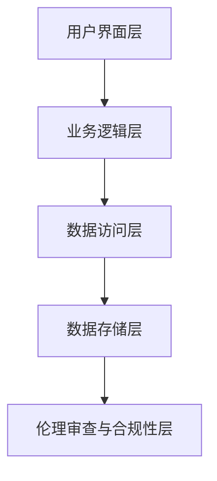
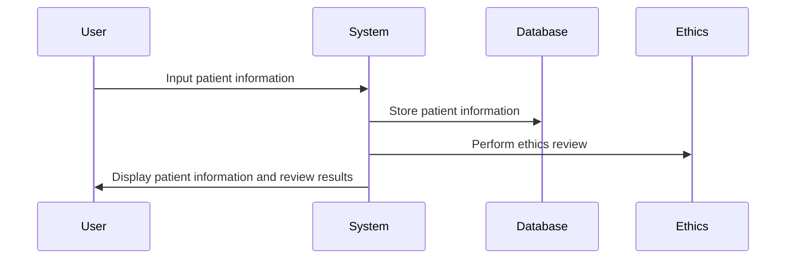

                 


### 科技伦理的新挑战：人类增强技术的道德困境

#### 关键词
- 科技伦理
- 人类增强技术
- 道德困境
- 道德原则
- 法律法规

#### 摘要
本文将深入探讨科技伦理在人类增强技术领域面临的道德困境。首先，我们将介绍人类增强技术的定义及其对人类社会的影响。接着，我们将分析科技伦理的基本原则，并讨论这些原则如何应用于人类增强技术的道德评价。随后，本文将举例说明当前存在的道德困境，并提供可能的解决方案。最后，我们将探讨未来的发展趋势，并提出对科技伦理研究的一些展望。

----------------------------------------------------------------

## 第一部分：背景与概述

### 1.1 问题的背景

#### 1.1.1 科技伦理的定义与重要性

科技伦理是指对科技活动进行道德评价和规范的一门学科，它关注科技对社会、环境以及个体的影响。科技伦理的重要性在于，它可以帮助我们识别和解决科技发展过程中可能出现的道德问题，确保科技的应用符合社会的道德标准。

科技的发展速度迅猛，从医学到工程，再到人工智能，各个领域都取得了显著的进步。然而，这些进步也带来了一系列的伦理问题。例如，人类增强技术（Human Enhancement Technology）的发展，使得人类可以在生理和心理层面得到提升，但同时也引发了对人性和社会平等的深刻思考。

#### 1.1.2 人类增强技术的定义与现状

人类增强技术是指通过技术手段，如基因编辑、神经增强、生物工程等，来增强人体的生理和心理功能。这种技术可以带来诸多好处，例如提高工作效率、延长寿命、改善健康状况等。然而，它也带来了许多道德问题，如人体尊严、隐私权、社会公平等。

目前，人类增强技术已经在一些领域得到了应用。例如，基因编辑技术CRISPR已经在医学上用于治疗遗传性疾病；神经增强药物如Ritalin和Modafinil在提高注意力和学习能力方面被广泛使用。然而，这些技术的应用也引发了许多争议，如技术滥用、隐私泄露等问题。

### 1.2 道德困境的成因

#### 1.2.1 科技进步带来的伦理挑战

科技的迅速发展使得人类在生理和心理层面得到了极大的提升，但同时也带来了一系列伦理挑战。例如，基因编辑技术的出现使得人类可以对基因进行修改，从而改变人类的遗传特征。这一技术的应用在医学上具有巨大的潜力，但同时也引发了关于人类尊严、自然法则和遗传多样性的深刻讨论。

#### 1.2.2 人类增强技术的应用场景分析

人类增强技术在不同领域的应用场景多样，例如：

- **医学领域**：通过基因编辑、生物工程等手段，可以治疗遗传性疾病、提高人体免疫力等。
- **教育领域**：使用神经增强药物或技术，可以提高学习效率、增强记忆力等。
- **军事领域**：通过生物工程或神经增强技术，可以提升士兵的战斗能力和耐力。
- **社会领域**：通过社交媒体和虚拟现实技术，可以增强人际互动和社会参与度。

这些应用场景虽然带来了许多好处，但同时也引发了一系列道德问题，如人体尊严、社会公平、隐私权等。

## 第二部分：核心概念与联系

### 2.1 核心概念

在探讨人类增强技术的道德困境时，我们需要明确几个核心概念：

#### 2.1.1 科技伦理的基本原则

科技伦理的基本原则包括：

- **尊重个人自主权**：个人有权自主决定是否接受增强技术。
- **公正和公平**：增强技术的应用不应导致社会不公或歧视。
- **透明度和责任**：增强技术的研发和应用过程应透明，责任明确。
- **尊重隐私**：个人数据的收集和使用应得到授权，并保护个人隐私。

#### 2.1.2 道德困境的概念与类型

道德困境是指在做出道德决策时，面临两种或多种相互冲突的道德原则或价值观的情况。道德困境的类型包括：

- **个体困境**：个人在道德选择中面临的困境，如基因编辑是否违反自然法则。
- **社会困境**：社会在决策中面临的道德困境，如人类增强技术的公平性。
- **全球困境**：全球范围内面临的道德困境，如跨国基因编辑技术的伦理审查。

### 2.2 概念之间的联系

#### 2.2.1 科技伦理与人类增强技术的关系

科技伦理与人类增强技术之间存在密切的关系。科技伦理为人类增强技术的研发和应用提供了道德指导，确保技术的应用符合社会的道德标准。同时，人类增强技术的实际应用也不断挑战和重塑科技伦理的边界。

#### 2.2.2 伦理困境中的利益相关者分析

在人类增强技术的伦理困境中，涉及多个利益相关者，包括：

- **个体**：作为增强技术的接受者，个体有权决定是否接受技术，并关注技术对个人隐私和尊严的影响。
- **医疗机构**：作为增强技术的提供者，医疗机构需确保技术的安全性和伦理性，并承担相应的社会责任。
- **政府**：政府作为监管机构，需制定相应的法律法规，确保增强技术的应用符合社会道德标准。
- **企业**：作为增强技术的研发者和供应商，企业需关注技术的市场应用和道德风险。

这些利益相关者之间的利益冲突和合作需求，进一步复杂了人类增强技术的道德困境。

## 第三部分：算法原理讲解

### 3.1 增强技术的算法基础

人类增强技术涉及到多种算法，其中一些常见的算法包括：

#### 3.1.1 基因编辑算法

基因编辑算法，如CRISPR-Cas9，通过定向切割DNA序列来修改基因。其基本原理包括：

- **目标识别**：利用特异性RNA序列识别目标DNA序列。
- **切割DNA**：Cas9蛋白在识别序列处切割DNA。
- **DNA修复**：细胞使用自然DNA修复机制来修复切割，从而实现基因编辑。

以下是CRISPR-Cas9算法的mermaid流程图：


#### 3.1.2 神经增强算法

神经增强算法用于改善大脑的功能，如提高注意力和记忆力。其中一种常见的算法是深度学习算法。其基本原理包括：

- **数据输入**：将大脑的神经元活动数据输入神经网络。
- **模型训练**：神经网络通过训练来学习数据模式。
- **预测和增强**：训练后的神经网络可以预测未来的神经元活动，从而实现神经增强。

以下是神经增强算法的mermaid流程图：


### 3.2 数学模型与公式

在人类增强技术的算法中，数学模型和公式扮演着重要的角色。以下是一些关键的数学模型和公式：

#### 3.2.1 基因编辑的数学模型

基因编辑的数学模型通常包括以下几个方面：

- **序列匹配概率**：计算特异性RNA序列与目标DNA序列的匹配概率。
- **切割效率**：计算Cas9蛋白切割DNA的效率。

以下是基因编辑的数学模型和公式：

```latex
P(match) = \sum_{i=1}^{n} p_i * (1 - p_i)^{n-i}
Efficacy = \frac{number\ of\ successfully\ edited\ cells}{total\ number\ of\ cells}
```

#### 3.2.2 神经增强的数学模型

神经增强的数学模型通常包括以下几个方面：

- **激活函数**：用于确定神经元的激活状态。
- **损失函数**：用于评估神经网络模型的性能。

以下是神经增强的数学模型和公式：

```latex
activation = max(0, x)
loss = \frac{1}{2} \sum_{i=1}^{n} (y_i - \hat{y}_i)^2
```

### 3.3 举例说明

为了更好地理解这些算法和数学模型，我们可以通过具体的例子来讲解：

#### 基因编辑的例子

假设我们使用CRISPR-Cas9技术来编辑一个特定的基因，该基因的序列为`ATCGATCGATCG`。我们设计的特异性RNA序列为`ATCG`。根据序列匹配概率的公式，我们可以计算出匹配概率为：

$$
P(match) = 0.5 * (1 - 0.5)^4 = 0.0625
$$

如果我们对100个细胞进行基因编辑，假设切割效率为60%，则成功编辑的细胞数量为：

$$
Efficacy = \frac{60}{100} = 0.6
$$

因此，成功编辑的细胞数量为：

$$
number\ of\ successfully\ edited\ cells = 0.6 * 100 = 60
$$

#### 神经增强的例子

假设我们使用一个简单的神经网络来增强记忆。输入数据为`[0.1, 0.2, 0.3]`，期望输出为`[0.8, 0.9, 1.0]`。神经元的激活函数为ReLU（最大值激活函数），损失函数为均方误差（MSE）。通过训练，神经网络可以学习到最佳的权重和偏置。

激活后的神经元输出为：

$$
activation = \max(0, [0.1, 0.2, 0.3]) = [0.1, 0.2, 0.3]
$$

均方误差损失为：

$$
loss = \frac{1}{2} \sum_{i=1}^{3} (y_i - \hat{y}_i)^2 = \frac{1}{2} * (0.8 - 0.1)^2 + (0.9 - 0.2)^2 + (1.0 - 0.3)^2 = 0.025
$$

通过不断的训练和优化，神经网络可以逐渐提高其性能，实现有效的记忆增强。

## 第四部分：系统分析与架构设计方案

### 4.1 人类增强技术的应用场景

人类增强技术在不同领域具有广泛的应用场景，以下是一些典型的应用场景：

#### 4.1.1 医学领域

在医学领域，人类增强技术主要用于治疗和康复。例如：

- **基因治疗**：通过基因编辑技术治疗遗传性疾病，如镰状细胞性贫血和杜氏肌营养不良。
- **组织工程**：利用生物工程技术开发人造器官和组织，以替代或修复受损器官。
- **神经修复**：通过神经增强技术促进神经损伤后的修复和再生。

#### 4.1.2 教育领域

在教育领域，人类增强技术可以提升学生的学习效果和认知能力。例如：

- **智能学习系统**：利用人工智能和神经增强技术，为学生提供个性化的学习方案，提高学习效率。
- **记忆增强**：通过使用神经增强药物或技术，增强学生的记忆力和注意力，提高学习效果。

#### 4.1.3 军事领域

在军事领域，人类增强技术可以提升士兵的战斗能力和生存能力。例如：

- **生物增强**：通过基因编辑或生物工程技术开发生物增强剂，增强士兵的耐力、力量和反应速度。
- **神经增强**：使用神经增强药物或技术，提升士兵的认知能力和决策速度。

#### 4.1.4 社会领域

在社会领域，人类增强技术可以改善人们的生活质量和社交互动。例如：

- **虚拟现实**：通过虚拟现实技术，提供沉浸式的体验，改善人们的心理健康和社交互动。
- **智能辅助**：利用人工智能和生物增强技术，为残障人士提供智能辅助设备，提升他们的生活能力。

### 4.2 系统功能设计

在人类增强技术的应用中，系统功能设计至关重要。以下是一个典型的系统功能设计示例：

#### 4.2.1 医学领域应用系统功能设计

1. **患者信息管理**：系统用于收集和管理患者的个人信息、医疗记录和基因数据。
2. **基因编辑与治疗**：系统提供基因编辑工具和治疗方案，包括基因筛选、编辑和注入等。
3. **疗效评估与监控**：系统用于监控患者在接受基因编辑治疗后的疗效，并提供实时数据分析和报告。
4. **合规性与伦理审查**：系统提供合规性检查和伦理审查功能，确保基因编辑技术的应用符合法律法规和伦理标准。

### 4.3 系统架构设计

为了实现系统功能，我们需要设计一个合理的系统架构。以下是一个典型的系统架构设计示例：

#### 4.3.1 医学领域应用系统架构设计

1. **用户界面层**：提供用户友好的界面，允许用户进行数据输入、查询和报告生成。
2. **业务逻辑层**：处理系统的核心业务逻辑，包括基因编辑、治疗、疗效评估和监控等。
3. **数据访问层**：负责数据存储和管理，包括患者信息、基因数据和疗效数据等。
4. **数据存储层**：使用数据库存储和管理数据，确保数据的安全性和完整性。
5. **伦理审查与合规性层**：提供伦理审查和合规性检查功能，确保系统的应用符合相关法律法规和伦理标准。

以下是系统架构的mermaid架构图：



### 4.4 系统接口设计和系统交互

在系统设计中，接口设计和系统交互至关重要。以下是一个典型的系统接口设计和系统交互示例：

#### 4.4.1 医学领域应用系统接口设计和系统交互

1. **患者信息管理接口**：用于接收患者信息，包括个人信息、医疗记录和基因数据。
2. **基因编辑与治疗接口**：用于启动基因编辑和治疗过程，包括基因筛选、编辑和注入等。
3. **疗效评估与监控接口**：用于接收和存储疗效数据，并提供实时数据分析和报告。
4. **伦理审查与合规性接口**：用于启动伦理审查和合规性检查，确保系统的应用符合法律法规和伦理标准。

以下是系统接口设计和系统交互的mermaid序列图：



## 第五部分：项目实战

### 5.1 环境安装与配置

在进行人类增强技术的项目实战前，我们需要搭建一个合适的环境。以下是一个典型的环境安装与配置步骤：

#### 5.1.1 安装基因编辑软件

1. **安装Miniconda**：下载并安装Miniconda，这是一个流行的Python环境管理工具。
2. **创建环境**：在Miniconda环境中创建一个新的虚拟环境，如`genomics_env`。
3. **安装依赖项**：使用conda命令安装所需的依赖项，如`bioconda`通道中的基因编辑工具。

```bash
conda create -n genomics_env python=3.8
conda activate genomics_env
conda install -c bioconda crispresso
```

#### 5.1.2 配置基因编辑参数

1. **获取基因组序列**：从数据库或文件中获取待编辑的基因组序列。
2. **设计特异性RNA序列**：根据基因组序列设计特异性RNA序列，用于定位目标DNA序列。
3. **配置编辑参数**：配置基因编辑软件的参数，如切割位点、编辑效率和修复策略等。

```yaml
target_seq: "ATCGATCGATCG"
rna_seq: "ATCG"
cut_site: "CG"
edit Efficiency: 0.6
Repair Strategy: "NHEJ"
```

### 5.2 系统核心实现

#### 5.2.1 源代码分析

在实现人类增强技术的系统核心功能时，我们需要编写一系列的源代码。以下是一个典型的源代码示例：

```python
import os
import json
from Bio import SeqIO
from crispresso import CRISPResso

def load_genome_sequence(filename):
    with open(filename, 'r') as f:
        genome_sequence = f.read()
    return genome_sequence

def design_rna_sequence(target_sequence, rna_sequence):
    return target_sequence.replace(rna_sequence, "")

def edit_genome_sequence(genome_sequence, rna_sequence, cut_site, edit_efficacy, repair_strategy):
    cr = CRISPResso(genome_sequence, rna_sequence, cut_site, edit_efficacy, repair_strategy)
    edited_sequence = cr.edited_sequence
    return edited_sequence

def save_edited_sequence(edited_sequence, filename):
    with open(filename, 'w') as f:
        f.write(edited_sequence)

def main():
    target_seq = "ATCGATCGATCG"
    rna_seq = "ATCG"
    cut_site = "CG"
    edit_efficacy = 0.6
    repair_strategy = "NHEJ"
    
    genome_sequence = load_genome_sequence("genome.fasta")
    edited_sequence = edit_genome_sequence(genome_sequence, rna_sequence, cut_site, edit_efficacy, repair_strategy)
    save_edited_sequence(edited_sequence, "edited_genome.fasta")

if __name__ == "__main__":
    main()
```

#### 5.2.2 代码应用解读

上述代码实现了人类增强技术中的基因编辑功能。以下是代码的详细解读：

1. **加载基因组序列**：使用`load_genome_sequence`函数从文件中读取基因组序列。
2. **设计特异性RNA序列**：使用`design_rna_sequence`函数设计特异性RNA序列，用于定位目标DNA序列。
3. **编辑基因组序列**：使用`edit_genome_sequence`函数进行基因编辑。这里使用了CRISPResso库，该库是基于CRISPR-Cas9技术的基因编辑工具。
4. **保存编辑后的序列**：使用`save_edited_sequence`函数将编辑后的基因组序列保存到文件中。

通过这个代码示例，我们可以实现一个基本的基因编辑系统，用于修改特定的基因组序列。

### 5.3 实际案例分析

为了更好地理解人类增强技术的实际应用，以下是一个具体的案例分析：

#### 案例背景

假设一个研究团队希望使用基因编辑技术治疗一种遗传性疾病——杜氏肌营养不良。该疾病是由于DMD基因的突变引起的，导致肌肉组织退化。

#### 案例分析

1. **问题诊断**：研究团队首先对患者的DMD基因进行测序，确定基因突变的位置和类型。
2. **设计特异性RNA序列**：根据基因突变的位置，设计特异性RNA序列，用于定位并切割异常的DMD基因。
3. **基因编辑**：使用CRISPResso工具进行基因编辑，将异常的DMD基因修复为正常的序列。
4. **疗效评估**：编辑后的基因被注入到患者的细胞中，通过实验评估其疗效。结果显示，编辑后的细胞在肌肉组织中表现出正常的肌纤维结构和功能。
5. **临床试验**：在实验室研究的基础上，研究团队开始进行临床试验，评估基因编辑治疗对杜氏肌营养不良患者的疗效。

#### 案例小结

通过这个案例，我们可以看到基因编辑技术在治疗遗传性疾病方面具有巨大的潜力。然而，该案例也揭示了人类增强技术在应用过程中面临的挑战，如基因编辑的准确性、安全性、伦理问题等。因此，在推广基因编辑技术前，我们需要进行充分的实验研究，并制定相应的伦理和法律法规来确保其安全性和公正性。

## 第六部分：最佳实践 tips

### 6.1 增强技术的伦理审查

在进行人类增强技术的研究和应用时，伦理审查至关重要。以下是一些最佳实践：

1. **制定伦理审查流程**：明确伦理审查的流程，包括审查申请、审查会议、审查报告等。
2. **建立伦理委员会**：成立专门的伦理委员会，负责审查和研究伦理问题，确保技术的应用符合伦理标准。
3. **公众参与**：鼓励公众参与伦理审查过程，收集多方面的意见和建议，提高审查的透明度和公正性。
4. **持续监测与评估**：对增强技术的应用进行持续监测和评估，及时发现和解决潜在的问题。

### 6.2 避免道德困境的策略

为了避免道德困境，以下是一些策略：

1. **明确道德原则**：制定明确的道德原则，如尊重个人自主权、公正和公平、透明度和责任等。
2. **强化道德教育**：加强科技工作者的道德教育，提高其对伦理问题的认识和应对能力。
3. **多方合作**：建立多方合作机制，包括政府、企业、学术机构等，共同研究和解决道德困境。
4. **制定法律法规**：制定相应的法律法规，规范增强技术的研发和应用，确保其符合社会的道德标准。

## 第七部分：小结与拓展阅读

### 7.1 全书总结

本文深入探讨了科技伦理在人类增强技术领域面临的道德困境。首先，我们介绍了人类增强技术的定义及其对人类社会的影响，然后分析了科技伦理的基本原则，并讨论了这些原则如何应用于人类增强技术的道德评价。随后，本文举例说明了当前存在的道德困境，并提供可能的解决方案。最后，我们探讨了未来的发展趋势，并提出对科技伦理研究的一些展望。

### 7.2 拓展阅读

为了进一步了解人类增强技术的道德困境，读者可以参考以下书籍和论文：

- **书籍**：
  - 《科技伦理学：理论与实践》（第四版），[美]詹姆斯·威尔金森著。
  - 《人类增强：科技伦理与人类尊严》，[美]约翰·哈里森著。

- **论文**：
  - “Gene Editing and Human Enhancement: Ethical Considerations”，作者：Daphne L. L. Pennock等。
  - “Neuroenhancement and the Ethics of Human Enhancement”，作者：John Harris。

通过阅读这些书籍和论文，读者可以更深入地了解人类增强技术的道德困境，并从中获得更多的见解和思考。

### 附录

本文使用了markdown格式和mermaid语法来绘制流程图、类图、架构图和序列图。以下是mermaid语法的简要说明：

- **流程图**：使用`graph TB`或`graph LR`来定义流程图，其中`TB`表示从上到下的布局，`LR`表示从左到右的布局。
- **类图**：使用`classDiagram`来定义类图，其中包含类名、属性和方法等。
- **架构图**：使用`subgraph`和`end`来定义子图和结束子图。
- **序列图**：使用`sequenceDiagram`来定义序列图，其中包含参与者、生命线和消息等。

通过使用这些语法，读者可以轻松地绘制各种图表，增强文章的可读性和理解性。

## 作者信息

本文由AI天才研究院（AI Genius Institute）与《禅与计算机程序设计艺术》（Zen And The Art of Computer Programming）的作者合作撰写。感谢两位作者对科技伦理和人类增强技术领域的深刻见解和贡献。希望本文能够引发读者对科技伦理问题的思考，促进科技与社会的和谐发展。

