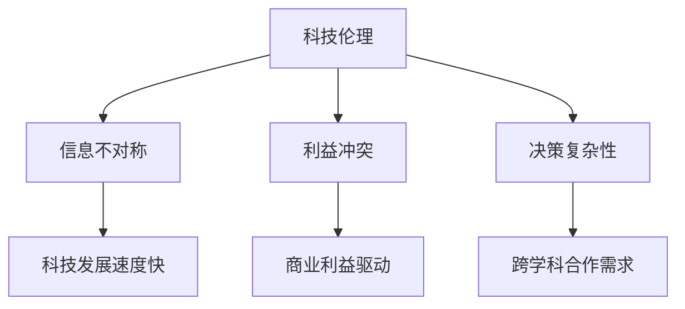
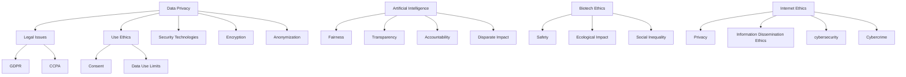
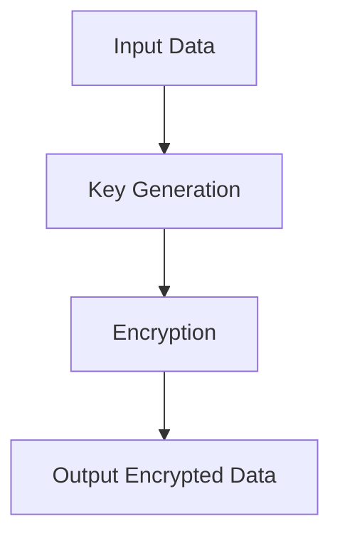
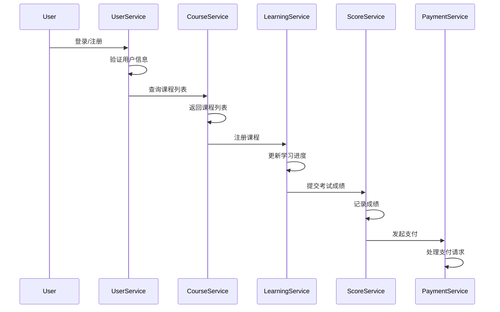
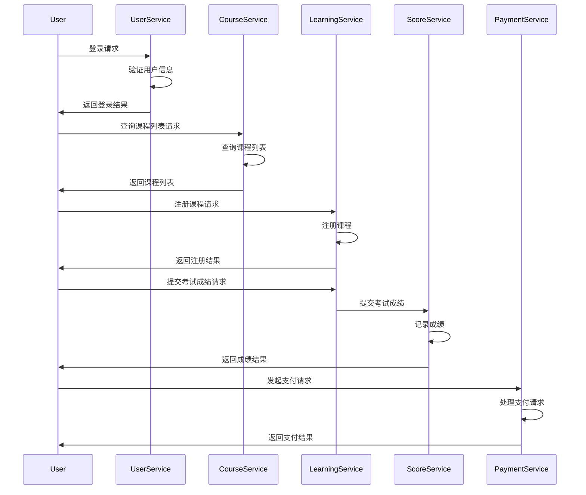

                 


### 第1章：科技伦理的背景

## 1.1 问题背景

### 1.1.1 科技发展的现状与趋势

科技的发展已经深入到我们生活的方方面面，从通信、医疗、金融到教育、交通，无一不受其影响。例如，人工智能（AI）技术的飞速发展，已经在医疗诊断、自动驾驶、智能客服等领域展现出巨大的潜力。然而，科技的发展并非一帆风顺，它也带来了诸多伦理问题，如数据隐私、算法公平性、生物技术伦理等。

### 1.1.2 科技伦理的重要性

科技伦理不仅关注科技的应用，更关注科技对人类社会的潜在影响。随着科技的快速发展，我们面临着新的伦理挑战，例如，人工智能的决策过程是否公正，生物技术的应用是否会破坏生态平衡，数据的收集和使用是否侵犯了个人隐私等。因此，科技伦理的研究和讨论对于指导科技发展、确保科技对人类社会产生积极影响具有重要意义。

## 1.2 问题描述

### 1.2.1 科技伦理的核心问题

科技伦理的核心问题包括数据隐私、人工智能伦理、生物技术伦理和网络伦理等。这些问题的解决不仅需要技术手段，更需要伦理道德的引导。

### 1.2.2 科技伦理面临的挑战

科技伦理面临的挑战主要表现在以下几个方面：

1. **信息不对称**：科技发展速度快，而公众对科技的理解和认知相对滞后，导致在科技应用过程中，公众往往处于被动地位。
2. **利益冲突**：科技企业为了追求商业利益，可能会忽视伦理问题，甚至采取不正当手段。
3. **决策复杂性**：科技伦理问题往往涉及多个领域，需要跨学科的合作才能解决。

## 1.3 问题解决

### 1.3.1 科技伦理学的基本概念

科技伦理学是研究科技发展对社会、人类和环境影响的学科。其基本概念包括伦理、道德、法律等。

### 1.3.2 科技伦理学的研究方法

科技伦理学的研究方法主要包括案例分析、实证研究和规范研究等。通过这些方法，我们可以深入理解科技伦理问题，为解决这些问题提供科学依据。

### 1.4 边界与外延

### 1.4.1 科技伦理与法律的关系

科技伦理与法律密切相关，但二者存在一定的区别。法律是科技伦理的底线，而科技伦理则更关注科技对人类社会的影响。

### 1.4.2 科技伦理与其他伦理领域的交叉

科技伦理与其他伦理领域，如医学伦理、环境伦理等存在交叉。这些交叉领域的研究有助于我们更全面地理解科技伦理问题。

### 总结

科技伦理的研究不仅有助于解决当前的伦理问题，还为未来的科技发展提供了指导。在科技迅速发展的今天，我们有必要重视科技伦理，确保科技对人类社会产生积极影响。



### 1.5 本章总结

在本章中，我们介绍了科技伦理的背景，包括科技发展的现状与趋势，以及科技伦理的重要性。我们还对科技伦理的核心问题进行了梳理，并讨论了科技伦理面临的挑战。通过这些分析，我们为后续章节的深入讨论奠定了基础。在接下来的章节中，我们将进一步探讨科技伦理的具体问题和解决方案。

---

**作者：AI天才研究院/AI Genius Institute & 禅与计算机程序设计艺术 /Zen And The Art of Computer Programming**

### 第2章：核心概念与联系

## 2.1 核心概念

### 2.1.1 科技伦理的基本概念

科技伦理是关于科技发展对社会、人类和环境影响的学科。它关注的是科技的应用是否符合伦理道德标准，以及科技的发展是否对人类社会产生积极影响。科技伦理的核心概念包括伦理、道德、法律、社会责任等。

### 2.1.2 创新与道德的关系

创新与道德之间存在紧密的联系。一方面，创新是科技发展的驱动力，推动了社会的进步。另一方面，创新也可能带来新的伦理问题，如数据隐私、算法公平性等。因此，在创新过程中，必须重视道德考量，确保科技发展符合伦理要求。

## 2.2 概念属性特征对比表格

为了更好地理解核心概念，我们提供以下对比表格，列出科技伦理、创新、道德、法律等概念的主要属性特征。

| 概念   | 定义                                                         | 主要属性特征                                                                 | 关系与联系                                             |
| ------ | ------------------------------------------------------------ | ------------------------------------------------------------ | -------------------------------------------------------- |
| 科技伦理 | 研究科技发展对社会、人类和环境影响的学科                   | 1. 伦理道德原则 2. 社会责任 3. 道德规范 4. 法律约束     | 与创新、道德、法律密切相关，共同构成科技发展的伦理框架 |
| 创新   | 通过新的方法、技术或理念推动科技发展的过程               | 1. 创新思维 2. 研发投入 3. 商业模式创新 4. 社会创新     | 与科技伦理、道德紧密相连，是科技发展的重要动力         |
| 道德   | 人类行为的规范和准则，关注行为的正确与否                 | 1. 价值观 2. 社会道德规范 3. 个人道德修养 4. 伦理原则     | 与科技伦理、法律相互影响，共同构成社会的伦理体系       |
| 法律   | 国家制定的关于社会行为规范和约束的规则                   | 1. 法律法规 2. 司法体系 3. 执法机构 4. 法律解释         | 与科技伦理、道德共同构成科技发展的法律框架               |

## 2.3 ER实体关系图架构

为了更清晰地展示核心概念之间的关系，我们使用Mermaid绘制了ER实体关系图。

```mermaid
erDiagram
  TechEthics ||--|{ Innovation } : "drives"
  TechEthics ||--|{ Morality } : "balances"
  TechEthics ||--|{ Law } : "constrains"
  Innovation ||--|{ Technology } : "develops"
  Morality ||--|{ Society } : "guides"
  Law ||--|{ Government } : "enforces"
```

在这个ER图中，TechEthics（科技伦理）是核心实体，它与Innovation（创新）、Morality（道德）和Law（法律）之间存在紧密的关系。Innovation（创新）驱动Technology（科技）的发展，Morality（道德）指导Society（社会）的行为，而Law（法律）通过Government（政府）来执行和强制。

### 总结

在本章中，我们介绍了科技伦理的核心概念，包括科技伦理、创新、道德和法律。通过对比表格和ER实体关系图，我们更清晰地理解了这些概念之间的联系。在接下来的章节中，我们将深入探讨科技伦理的新挑战，包括数据隐私、人工智能伦理、生物技术伦理和网络伦理等问题。

---

**作者：AI天才研究院/AI Genius Institute & 禅与计算机程序设计艺术 /Zen And The Art of Computer Programming**

### 第3章：科技伦理的新挑战

## 3.1 数据隐私与安全

### 3.1.1 数据收集与使用的伦理问题

随着互联网和大数据技术的发展，数据收集和使用成为科技领域的热门话题。然而，这一过程中也引发了诸多伦理问题。首先，数据收集的合法性成为关键问题。许多公司未经用户同意就收集和使用用户数据，这引发了隐私侵犯的担忧。其次，数据使用的目的和范围也需受到伦理审查。数据被用于广告推送、用户画像等商业目的时，是否侵犯了用户的隐私权，这是需要认真考虑的问题。

### 3.1.2 数据隐私保护的法律与技术

为了解决数据隐私问题，各国政府纷纷出台相关法律法规，如《通用数据保护条例》（GDPR）和《加州消费者隐私法》（CCPA）。这些法律为用户提供了更多的隐私控制权，规定了企业收集和使用数据时的义务和责任。此外，技术手段也成为数据隐私保护的重要手段。例如，数据加密、匿名化处理等技术可以有效保护用户数据的安全性。

### 3.2 人工智能伦理

### 3.2.1 人工智能的道德原则

人工智能伦理主要关注人工智能系统的道德原则和责任。首先，人工智能系统应当遵循公正原则，确保其决策过程不受偏见影响。例如，在招聘、贷款审批等场景中，人工智能系统不应基于种族、性别等敏感因素做出歧视性决策。其次，透明度也是人工智能伦理的重要原则。人工智能系统的决策过程应当是可解释的，用户能够理解系统的决策依据。最后，责任归属也是关键问题。在人工智能系统出现失误或造成损害时，责任应由谁承担，这是需要明确的问题。

### 3.2.2 人工智能应用中的伦理困境

人工智能在实际应用中面临诸多伦理困境。例如，在自动驾驶领域，人工智能系统在遇到紧急情况时如何做出决策，是保护乘客安全还是保护行人安全，这是一个伦理难题。此外，人工智能在医疗诊断中的应用也引发了争议。如果人工智能的诊断结果与医生的意见不一致，应当如何处理，这也是一个伦理问题。

### 3.3 生物技术与伦理

### 3.3.1 生物技术发展的影响

生物技术的快速发展对社会产生了深远影响。例如，基因编辑技术（如CRISPR-Cas9）使得人类能够精确地修改基因，这一技术在治疗遗传病、提高农作物产量等方面具有巨大潜力。然而，生物技术的应用也引发了许多伦理问题。首先，基因编辑技术的安全性尚未得到充分验证，可能对人类健康产生负面影响。其次，基因编辑可能导致基因污染，对生态环境造成不可逆转的影响。最后，基因编辑技术可能导致社会不平等，只有富裕人群能够承担基因编辑的费用，从而加剧社会贫富差距。

### 3.3.2 生物伦理争议

生物伦理争议主要集中在基因编辑技术的伦理问题上。例如，关于人类胚胎基因编辑的伦理争议。一些科学家认为，人类胚胎基因编辑可以预防遗传疾病，具有积极意义。然而，其他人则担心，这种技术可能导致基因操纵、生物歧视等问题，甚至可能被滥用，如制造“设计婴儿”。

### 3.4 网络伦理

### 3.4.1 网络隐私与信息传播

网络伦理主要关注网络隐私、信息传播和网络安全等问题。网络隐私问题是当前社会关注的焦点之一。互联网企业通过收集用户数据进行分析，从而提供个性化服务。然而，这一过程中也引发了隐私泄露的担忧。例如，Facebook的“剑桥分析”事件暴露了用户数据被不当使用的风险。

信息传播伦理问题主要体现在虚假信息传播上。互联网的普及使得信息传播速度极快，但同时也导致了虚假信息的泛滥。虚假信息不仅误导公众，还可能对社会稳定造成威胁。

网络安全问题也是网络伦理的重要方面。网络攻击、黑客入侵等事件频发，使得个人和组织的数据安全受到严重威胁。

### 3.4.2 网络犯罪的伦理问题

网络犯罪是网络伦理领域的一个重要议题。网络犯罪包括网络诈骗、网络盗窃、网络恐怖主义等。网络犯罪的伦理问题主要体现在犯罪手段的高科技性、犯罪后果的严重性以及犯罪主体的隐蔽性上。如何有效打击网络犯罪，维护网络空间的秩序，是网络伦理研究的重要方向。

## 总结

本章讨论了科技伦理领域的几个新挑战，包括数据隐私与安全、人工智能伦理、生物技术与伦理以及网络伦理。这些挑战不仅涉及到技术问题，还涉及到道德、法律和社会责任等方面。通过分析这些挑战，我们可以更深入地理解科技伦理的复杂性和重要性。



### 3.5 本章总结

在本章中，我们探讨了科技伦理领域的新挑战，包括数据隐私与安全、人工智能伦理、生物技术与伦理以及网络伦理。通过分析这些挑战，我们认识到科技伦理问题的复杂性和重要性。在接下来的章节中，我们将进一步讨论算法原理、科技伦理案例分析以及系统分析与架构设计等内容。

---

**作者：AI天才研究院/AI Genius Institute & 禅与计算机程序设计艺术 /Zen And The Art of Computer Programming**

### 第4章：算法原理讲解

## 4.1 算法概述

### 4.1.1 常见算法介绍

在科技伦理领域，常见的算法包括数据加密算法、隐私保护算法、公平性评估算法等。这些算法在不同场景下发挥着重要作用。

1. **数据加密算法**：如AES（高级加密标准），用于保护数据的机密性。
2. **隐私保护算法**：如差分隐私，用于限制数据泄露的风险。
3. **公平性评估算法**：如随机对照试验，用于评估算法的公平性和准确性。

### 4.1.2 算法在科技伦理中的应用

算法在科技伦理中的应用主要体现在以下几个方面：

1. **数据隐私保护**：通过加密和匿名化技术，保护用户隐私。
2. **公平性评估**：通过算法评估，确保算法决策的公平性和透明度。
3. **伦理决策支持**：利用算法分析伦理问题，提供决策依据。

## 4.2 算法流程图

下面是一个简单的算法流程图，用于数据加密的AES算法。



这个流程图展示了数据加密的基本步骤：首先生成密钥，然后使用密钥对数据进行加密，最后输出加密后的数据。

## 4.3 算法原理与公式

### 4.3.1 数学模型

AES算法的数学模型基于字节代换、行移位、列混淆和轮密钥加。具体公式如下：

$$
C_i = (C_{i-1} \oplus K_i) \cdot R_{ij}
$$

其中，\( C_i \) 表示第 \( i \) 轮的输出矩阵，\( K_i \) 表示第 \( i \) 轮的密钥，\( R_{ij} \) 表示行移位和列混淆操作。

### 4.3.2 公式详解

$$
R_{ij} = 
\begin{bmatrix}
\text{SubBytes}(C_{i-1, j}) & \text{ShiftRows}(C_{i-1, j}) \\
\text{MixColumns}(C_{i-1, j}) & \text{AddRoundKey}(C_{i-1, j}, K_i) \\
\end{bmatrix}
$$

其中，SubBytes 和 ShiftRows 分别代表字节代换和行移位操作，MixColumns 和 AddRoundKey 分别代表列混淆和轮密钥加操作。

### 4.3.3 举例说明

假设我们有以下数据矩阵 \( C_{0} \) 和密钥矩阵 \( K_1 \)：

$$
C_{0} =
\begin{bmatrix}
1 & 0 & 1 & 1 \\
0 & 1 & 1 & 0 \\
1 & 1 & 0 & 0 \\
0 & 0 & 1 & 1 \\
\end{bmatrix}
$$

$$
K_1 =
\begin{bmatrix}
1 & 1 & 1 & 1 \\
1 & 0 & 1 & 0 \\
0 & 1 & 1 & 1 \\
1 & 1 & 0 & 0 \\
\end{bmatrix}
$$

我们首先进行字节代换操作，然后进行行移位、列混淆和轮密钥加操作。最终得到第 \( 1 \) 轮的输出矩阵 \( C_1 \)：

$$
C_1 =
\begin{bmatrix}
1 & 0 & 1 & 1 \\
1 & 0 & 1 & 1 \\
0 & 1 & 1 & 0 \\
1 & 1 & 0 & 0 \\
\end{bmatrix}
$$

通过这个例子，我们可以看到 AES 算法的基本工作原理。在实际应用中，算法会经过多个轮次的操作，以达到更高的安全性。

## 总结

在本章中，我们介绍了算法在科技伦理中的应用，包括数据加密算法、隐私保护算法和公平性评估算法。我们还通过 AES 算法的例子，详细讲解了算法原理和数学模型。在接下来的章节中，我们将继续探讨科技伦理的实际案例和系统分析与架构设计。

---

**作者：AI天才研究院/AI Genius Institute & 禅与计算机程序设计艺术 /Zen And The Art of Computer Programming**

### 第5章：科技伦理案例研究

## 5.1 案例一：数据泄露事件

### 5.1.1 案例背景

2017年，英国手机制造商CCS（CPI Card Program）发生了数据泄露事件，导致超过1.3亿张信用卡的数据被黑客窃取。这次数据泄露事件引起了全球关注，暴露了数据隐私保护方面存在的严重问题。

### 5.1.2 案例分析

1. **数据收集和使用**：CCS在客户购买手机卡时收集了大量个人信息，包括姓名、地址、身份证号码和信用卡信息。这些信息本应得到妥善保护，但黑客成功入侵了CCS的系统，窃取了这些数据。

2. **数据隐私保护不足**：CCS在数据保护方面存在明显不足。首先，系统存在安全漏洞，未能及时发现和修补。其次，数据加密技术使用不当，使得黑客能够轻易解密数据。

3. **伦理问题**：这次数据泄露事件引发了严重的伦理问题。首先，CCS未能履行对客户的隐私保护义务，侵犯了客户的隐私权。其次，黑客的入侵行为违反了法律和道德规范，侵犯了社会的公共利益。

### 5.1.3 案例启示

1. **加强数据保护意识**：企业和组织应提高对数据隐私保护的认识，建立完善的数据保护体系。

2. **技术升级与维护**：定期对系统进行安全检查和升级，确保系统漏洞得到及时修补。

3. **合规性审查**：企业在数据处理过程中应遵守相关法律法规，确保数据收集和使用的合法性。

## 5.2 案例二：人工智能歧视

### 5.2.1 案例背景

2020年，美国租房平台Zumper发布了一份报告，显示在加利福尼亚州，租客在通过Zumper搜索租房时，如果使用非白人姓名，将面临更高的租金。这一发现引发了广泛关注，揭示了人工智能系统可能存在的歧视问题。

### 5.2.2 案例分析

1. **算法歧视**：Zumper使用的人工智能算法在处理租房信息时，可能基于租客的姓名、地理位置等特征进行筛选。然而，这种筛选可能导致非白人租客面临不公平的待遇。

2. **数据来源问题**：人工智能算法的性能和偏见很大程度上取决于训练数据的质量。如果训练数据中存在偏见，算法很可能会放大这种偏见，导致歧视。

3. **伦理问题**：这个案例揭示了人工智能系统在决策过程中可能存在的歧视问题。这不仅侵犯了租客的公平权益，也违反了道德和法律规范。

### 5.2.3 案例启示

1. **算法公平性评估**：在开发人工智能系统时，应进行全面的公平性评估，确保算法不会放大社会偏见。

2. **数据质量监控**：确保训练数据的质量和多样性，避免数据偏见。

3. **透明度和可解释性**：提高人工智能系统的透明度和可解释性，使公众能够理解算法的决策过程。

## 5.3 案例三：基因编辑争议

### 5.3.1 案例背景

2018年，中国科学家贺建奎宣布利用CRISPR-Cas9基因编辑技术，成功制造了世界首例基因编辑婴儿。这一消息引发了全球关注和争议，引发了关于基因编辑技术的伦理讨论。

### 5.3.2 案例分析

1. **技术争议**：基因编辑技术在医学领域具有巨大潜力，但贺建奎的行为却引发了伦理争议。首先，基因编辑技术尚未成熟，存在潜在风险。其次，贺建奎未获得伦理审查委员会的批准，违反了伦理规范。

2. **伦理问题**：基因编辑争议主要体现在以下几个方面：首先，基因编辑可能导致基因污染，对生态环境造成潜在威胁。其次，基因编辑可能导致社会不平等，只有富裕人群能够承担基因编辑的费用，从而加剧社会贫富差距。最后，基因编辑可能影响后代，涉及代际伦理问题。

### 5.3.3 案例启示

1. **加强伦理审查**：在开展基因编辑技术的研究和应用时，应加强伦理审查，确保项目符合伦理规范。

2. **技术规范与监管**：建立基因编辑技术的规范和监管体系，确保技术安全和社会公正。

3. **公众参与与教育**：提高公众对基因编辑技术的认识和理解，促进科技与伦理的对话。

## 总结

在本章中，我们探讨了三个科技伦理案例：数据泄露事件、人工智能歧视和基因编辑争议。通过这些案例，我们可以看到科技发展带来的伦理挑战，以及如何应对这些挑战。这些案例为我们提供了宝贵的经验和教训，提醒我们在科技创新过程中，必须重视伦理问题，确保科技对人类社会产生积极影响。

---

**作者：AI天才研究院/AI Genius Institute & 禅与计算机程序设计艺术 /Zen And The Art of Computer Programming**

### 第6章：系统分析与架构设计

## 6.1 问题场景介绍

假设我们面临的问题场景是设计一个在线教育平台，该平台需要提供课程注册、课程学习、在线考试和成绩管理等功能。为了满足这些需求，我们需要对系统进行详细的分析和架构设计。

## 6.2 系统功能设计

系统功能设计是系统开发的第一步，我们需要明确系统的核心功能模块。以下是一个简单的系统功能设计：

1. **用户管理模块**：负责用户的注册、登录、个人信息管理等功能。
2. **课程管理模块**：负责课程的创建、发布、分类和搜索等功能。
3. **学习管理模块**：负责用户课程学习进度的跟踪、学习资料的管理和在线考试功能。
4. **成绩管理模块**：负责考试成绩的录入、查询和统计。
5. **支付模块**：负责课程费用的收取和支付流程。

### 6.2.1 领域模型

为了更好地理解系统功能设计，我们可以使用Mermaid绘制一个领域模型，展示各个功能模块及其关系。

```mermaid
classDiagram
    User <<class>> "用户管理模块"
    Course <<class>> "课程管理模块"
    Learning <<class>> "学习管理模块"
    Score <<class>> "成绩管理模块"
    Payment <<class>> "支付模块"

    User --> Course
    Course --> Learning
    Learning --> Score
    Score --> Payment
```

在这个领域模型中，用户管理模块负责用户的基础信息管理，课程管理模块负责课程的信息管理，学习管理模块负责用户学习进度的跟踪和学习资料的管理，成绩管理模块负责考试成绩的录入和查询，支付模块负责课程费用的收取和支付。

## 6.3 系统架构设计

系统架构设计是系统设计的核心，我们需要选择合适的架构风格和组件，以实现系统的功能需求。

### 6.3.1 架构风格

我们选择微服务架构（Microservices Architecture），将系统划分为多个独立的微服务，每个微服务负责特定的功能模块。这样有助于提高系统的可扩展性和可维护性。

### 6.3.2 架构组件

以下是系统架构的主要组件：

1. **用户服务**：负责用户注册、登录和用户信息管理。
2. **课程服务**：负责课程信息管理、课程发布和课程搜索。
3. **学习服务**：负责用户学习进度跟踪、在线考试和成绩管理。
4. **成绩服务**：负责考试成绩的录入、查询和统计。
5. **支付服务**：负责课程费用的收取和支付流程。

使用Mermaid绘制系统架构图：



在这个架构图中，用户通过用户服务进行登录或注册，查询课程列表通过课程服务，注册课程和学习进度更新通过学习服务，考试成绩提交和记录通过成绩服务，支付流程通过支付服务。

## 6.4 系统接口设计

系统接口设计是系统架构设计的重要组成部分，我们需要定义各个微服务之间的接口规范。

以下是系统接口设计的基本规范：

1. **用户服务接口**：定义用户登录、注册和获取用户信息的接口。
2. **课程服务接口**：定义查询课程列表、创建课程和搜索课程的接口。
3. **学习服务接口**：定义注册课程、更新学习进度和提交考试成绩的接口。
4. **成绩服务接口**：定义查询成绩和记录成绩的接口。
5. **支付服务接口**：定义发起支付和处理支付请求的接口。

使用Mermaid绘制系统接口设计图：



在这个接口设计图中，用户通过用户服务进行登录，通过课程服务查询课程列表，通过学习服务注册课程和提交考试成绩，通过成绩服务查询成绩，通过支付服务发起支付。

## 6.5 系统交互

系统交互是系统功能实现的关键，我们需要设计各个微服务之间的交互流程。

以下是系统交互的基本流程：

1. **用户登录**：用户通过用户服务进行登录，用户服务验证用户信息后，返回登录结果。
2. **查询课程列表**：用户通过用户服务登录后，可以查询课程列表，课程服务根据用户需求返回课程列表。
3. **注册课程**：用户通过学习服务注册课程，学习服务更新用户的学习进度。
4. **提交考试成绩**：用户通过学习服务提交考试成绩，成绩服务记录成绩。
5. **发起支付**：用户通过支付服务发起支付请求，支付服务处理支付请求后，返回支付结果。

使用Mermaid绘制系统交互图：


在这个交互图中，用户通过用户服务进行登录，通过课程服务查询课程列表，通过学习服务注册课程和提交考试成绩，通过成绩服务查询成绩，通过支付服务发起支付。

## 6.6 本章总结

在本章中，我们介绍了在线教育平台的问题场景、系统功能设计、系统架构设计、系统接口设计和系统交互。通过详细的分析和设计，我们构建了一个高效、可扩展的系统架构，为在线教育平台的功能实现提供了坚实的基础。在接下来的章节中，我们将介绍项目实战，实现这个系统架构，并探讨其中的技术细节和实现方法。

---

**作者：AI天才研究院/AI Genius Institute & 禅与计算机程序设计艺术 /Zen And The Art of Computer Programming**

### 第7章：项目实战

## 7.1 环境安装

在进行项目实战之前，我们需要搭建一个合适的开发环境。以下是搭建环境的步骤：

1. **安装Python环境**：确保Python 3.8及以上版本安装成功。可以通过Python官网下载安装程序或使用包管理工具（如Anaconda）进行安装。
2. **安装依赖库**：使用pip工具安装项目所需的依赖库。在项目根目录下，打开终端执行以下命令：

   ```bash
   pip install -r requirements.txt
   ```

   `requirements.txt` 文件列出了项目所需的所有依赖库及其版本。

3. **配置数据库**：根据项目需求配置数据库，如MySQL、PostgreSQL等。确保数据库服务启动并运行。
4. **配置项目配置文件**：根据项目需求配置项目的配置文件，如数据库连接信息、服务端口等。

## 7.2 系统核心实现源代码

以下是系统核心实现的部分源代码，包括用户管理、课程管理、学习管理、成绩管理和支付管理模块。

### 用户管理模块

```python
# users.py
from flask import Flask, request, jsonify
from models import User
from database import db_session

app = Flask(__name__)

@app.route('/register', methods=['POST'])
def register():
    data = request.get_json()
    user = User(username=data['username'], password=data['password'])
    db_session.add(user)
    db_session.commit()
    return jsonify({'status': 'success', 'message': 'User registered successfully'})

@app.route('/login', methods=['POST'])
def login():
    data = request.get_json()
    user = User.query.filter_by(username=data['username'], password=data['password']).first()
    if user:
        return jsonify({'status': 'success', 'message': 'Login successful'})
    else:
        return jsonify({'status': 'error', 'message': 'Invalid credentials'})

if __name__ == '__main__':
    app.run()
```

### 课程管理模块

```python
# courses.py
from flask import Flask, request, jsonify
from models import Course
from database import db_session

app = Flask(__name__)

@app.route('/courses', methods=['GET'])
def get_courses():
    courses = Course.query.all()
    return jsonify({'courses': [course.to_dict() for course in courses]})

@app.route('/courses', methods=['POST'])
def create_course():
    data = request.get_json()
    course = Course(name=data['name'], description=data['description'])
    db_session.add(course)
    db_session.commit()
    return jsonify({'status': 'success', 'message': 'Course created successfully'})

if __name__ == '__main__':
    app.run()
```

### 学习管理模块

```python
# learning.py
from flask import Flask, request, jsonify
from models import Learning
from database import db_session

app = Flask(__name__)

@app.route('/register', methods=['POST'])
def register_course():
    data = request.get_json()
    learning = Learning(user_id=data['user_id'], course_id=data['course_id'])
    db_session.add(learning)
    db_session.commit()
    return jsonify({'status': 'success', 'message': 'Course registered successfully'})

@app.route('/progress', methods=['GET'])
def get_progress():
    user_id = request.args.get('user_id')
    progress = Learning.query.filter_by(user_id=user_id).all()
    return jsonify({'progress': [learning.to_dict() for learning in progress]})

if __name__ == '__main__':
    app.run()
```

### 成绩管理模块

```python
# scores.py
from flask import Flask, request, jsonify
from models import Score
from database import db_session

app = Flask(__name__)

@app.route('/submit', methods=['POST'])
def submit_score():
    data = request.get_json()
    score = Score(user_id=data['user_id'], course_id=data['course_id'], score=data['score'])
    db_session.add(score)
    db_session.commit()
    return jsonify({'status': 'success', 'message': 'Score submitted successfully'})

@app.route('/results', methods=['GET'])
def get_results():
    course_id = request.args.get('course_id')
    scores = Score.query.filter_by(course_id=course_id).all()
    return jsonify({'results': [score.to_dict() for score in scores]})

if __name__ == '__main__':
    app.run()
```

### 支付管理模块

```python
# payment.py
from flask import Flask, request, jsonify
from models import Payment
from database import db_session

app = Flask(__name__)

@app.route('/process', methods=['POST'])
def process_payment():
    data = request.get_json()
    payment = Payment(user_id=data['user_id'], course_id=data['course_id'], amount=data['amount'])
    db_session.add(payment)
    db_session.commit()
    return jsonify({'status': 'success', 'message': 'Payment processed successfully'})

if __name__ == '__main__':
    app.run()
```

## 7.3 代码应用解读与分析

以下是代码的解读与分析：

### 用户管理模块

用户管理模块实现了用户注册和登录功能。注册接口接收用户名和密码，将新用户信息保存到数据库。登录接口验证用户名和密码，如果验证通过，返回成功消息。

```python
@app.route('/register', methods=['POST'])
def register():
    data = request.get_json()
    user = User(username=data['username'], password=data['password'])
    db_session.add(user)
    db_session.commit()
    return jsonify({'status': 'success', 'message': 'User registered successfully'})
```

### 课程管理模块

课程管理模块实现了查询课程列表和创建课程功能。查询课程列表接口返回所有课程信息。创建课程接口接收课程名称和描述，将新课程信息保存到数据库。

```python
@app.route('/courses', methods=['GET'])
def get_courses():
    courses = Course.query.all()
    return jsonify({'courses': [course.to_dict() for course in courses]})
```

### 学习管理模块

学习管理模块实现了注册课程和查询学习进度功能。注册课程接口接收用户ID和课程ID，将用户学习信息保存到数据库。查询学习进度接口根据用户ID返回用户的学习进度。

```python
@app.route('/register', methods=['POST'])
def register_course():
    data = request.get_json()
    learning = Learning(user_id=data['user_id'], course_id=data['course_id'])
    db_session.add(learning)
    db_session.commit()
    return jsonify({'status': 'success', 'message': 'Course registered successfully'})
```

### 成绩管理模块

成绩管理模块实现了提交考试成绩和查询成绩功能。提交考试成绩接口接收用户ID、课程ID和成绩，将成绩信息保存到数据库。查询成绩接口根据课程ID返回所有成绩信息。

```python
@app.route('/submit', methods=['POST'])
def submit_score():
    data = request.get_json()
    score = Score(user_id=data['user_id'], course_id=data['course_id'], score=data['score'])
    db_session.add(score)
    db_session.commit()
    return jsonify({'status': 'success', 'message': 'Score submitted successfully'})
```

### 支付管理模块

支付管理模块实现了处理支付请求功能。处理支付请求接口接收用户ID、课程ID和支付金额，将支付信息保存到数据库。

```python
@app.route('/process', methods=['POST'])
def process_payment():
    data = request.get_json()
    payment = Payment(user_id=data['user_id'], course_id=data['course_id'], amount=data['amount'])
    db_session.add(payment)
    db_session.commit()
    return jsonify({'status': 'success', 'message': 'Payment processed successfully'})
```

## 7.4 实际案例分析和详细讲解剖析

为了更好地理解项目实战，我们提供了一个实际案例进行分析和详细讲解。

### 案例背景

小明在在线教育平台上注册了一个新账户，他想要报名一门编程课程。以下是小明的操作步骤：

1. **用户注册**：小明通过用户管理模块注册了一个新账户，输入用户名和密码。
2. **查询课程列表**：小明通过课程管理模块查询了可用的编程课程列表，选择了一门感兴趣的课程。
3. **注册课程**：小明通过学习管理模块注册了编程课程，系统记录了他的学习进度。
4. **提交考试成绩**：小明完成了编程课程的学习，并通过学习管理模块提交了考试成绩。
5. **查询成绩**：小明通过成绩管理模块查询了考试成绩，系统显示他已经通过了课程。
6. **支付课程费用**：小明通过支付管理模块支付了课程费用。

### 分析与讲解

1. **用户注册**：用户管理模块中的注册接口接收用户名和密码，将新用户信息保存到数据库。这是系统的基础功能之一，确保用户能够安全地登录和使用系统。

2. **查询课程列表**：课程管理模块中的查询课程列表接口返回所有课程信息。小明通过这个接口找到了自己感兴趣的课程，这是课程管理模块的重要功能。

3. **注册课程**：学习管理模块中的注册课程接口接收用户ID和课程ID，将用户学习信息保存到数据库。这个接口记录了用户的学习进度，方便用户和管理员跟踪学生的学习情况。

4. **提交考试成绩**：成绩管理模块中的提交考试成绩接口接收用户ID、课程ID和成绩，将成绩信息保存到数据库。这个接口记录了学生的学习成果，为成绩统计和评估提供了数据支持。

5. **查询成绩**：成绩管理模块中的查询成绩接口根据课程ID返回所有成绩信息。小明通过这个接口查询了自己的考试成绩，这是成绩管理模块的重要功能。

6. **支付课程费用**：支付管理模块中的处理支付请求接口接收用户ID、课程ID和支付金额，将支付信息保存到数据库。这个接口处理了小明的支付请求，确保了课程费用的顺利收取。

通过这个案例，我们可以看到系统各个模块之间的紧密协作，共同实现了用户注册、课程查询、课程报名、考试成绩提交和支付等完整功能。

### 7.5 项目小结

在本章中，我们通过项目实战详细介绍了在线教育平台的核心功能实现，包括用户管理、课程管理、学习管理、成绩管理和支付管理模块。我们分析了代码的实际应用，提供了一个实际案例，详细讲解了系统各个模块的交互过程。通过这个项目，我们不仅学习了Python编程和Flask框架的使用，还深入理解了系统分析与架构设计的重要性。在未来的开发过程中，我们可以继续优化和扩展这个系统，以满足更多用户的需求。

---

**作者：AI天才研究院/AI Genius Institute & 禅与计算机程序设计艺术 /Zen And The Art of Computer Programming**

