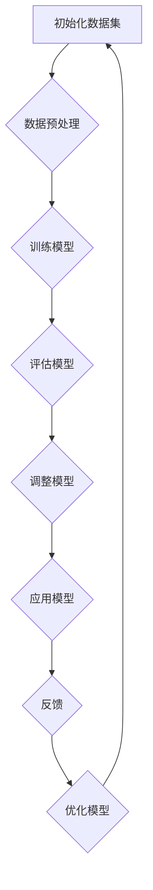
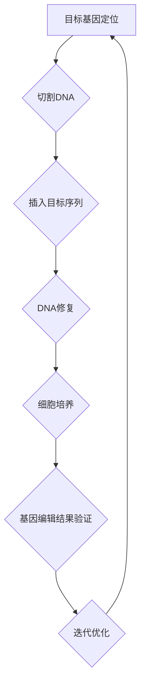
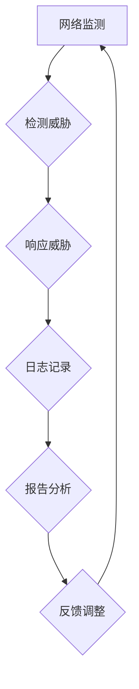
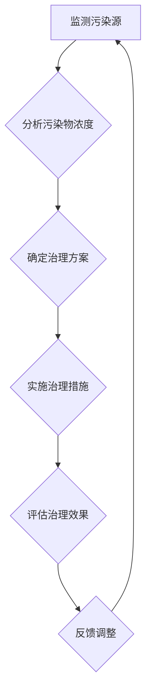
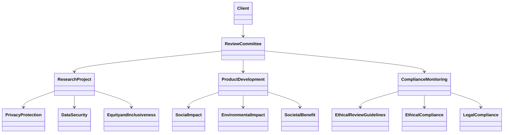
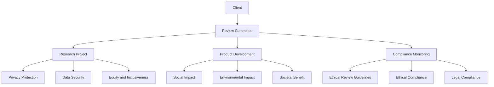
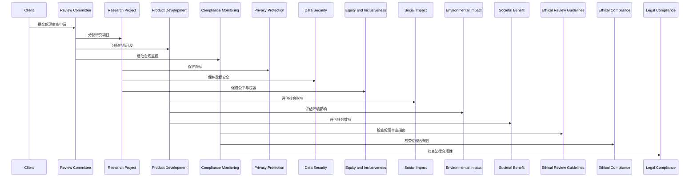
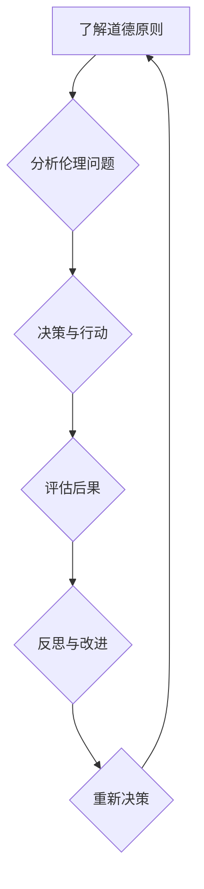
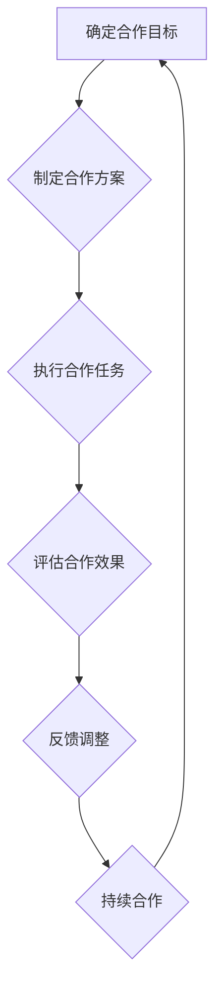

                 

### 第1章：科技伦理的定义与历史发展

#### 1.1 科技伦理的基本概念
科技伦理，简称科技伦理学（Technomoral Ethics），是对科技活动及其后果进行道德评估和指导的学科。它探讨科技发展如何影响人类生活，以及如何在技术创新的过程中维护基本的道德原则和社会价值观。科技伦理的核心是审视科技对社会、环境和个人的潜在影响，确保科技的发展和应用符合道德标准，促进人类福祉。

在现代社会，科技伦理不仅仅是一个学术领域的探讨，更是关乎公共政策、法律制定和社会实践的复杂议题。科技伦理关注的问题包括但不限于：隐私保护、信息安全、人工智能的道德使用、基因编辑的伦理界限、环境可持续性等。

#### 1.2 科技伦理的历史演变
科技伦理作为一个独立的研究领域，其发展可以追溯到古代。然而，现代科技伦理的概念和体系主要是在20世纪随着科学技术的迅猛发展而逐渐形成的。

- **古代至中世纪**：在古代文明中，科技伦理的讨论通常与宗教和哲学相交织。古希腊哲学家如亚里士多德和柏拉图，都探讨了技术与道德的关系。在中世纪，基督教神学家对科学和技术进行了伦理评价，强调科技应该服务于人类的幸福和社会的和谐。

- **工业革命至20世纪**：随着工业革命的到来，科学和技术飞速发展，引发了一系列伦理问题。19世纪末和20世纪初，科技伦理开始作为独立的研究领域出现，如生物伦理学、工程伦理学和计算机伦理学的诞生。

- **21世纪**：科技伦理研究进一步深化，涵盖了新兴技术领域，如人工智能、生物技术、网络技术和环境科学。全球化趋势使得科技伦理问题更加复杂，需要国际间的合作和共识。

#### 1.3 科技伦理的核心原则
科技伦理的核心原则是指导科技发展和应用的基本道德规范。以下是几个主要的科技伦理原则：

- **公正性**：科技发展应促进资源的公正分配，确保不同社会群体都能公平地受益。

- **安全性**：科技应用必须确保人身和环境的安全，避免造成不可逆的损害。

- **透明性**：科技决策和过程应具有透明度，接受公众监督和批评。

- **责任性**：科技从业者应承担其行为的道德责任，对科技带来的后果负责。

- **可持续性**：科技发展应考虑到长远的环境和社会影响，促进可持续发展。

#### 1.4 科技伦理的发展趋势
- **多元化**：科技伦理的研究和应用越来越多元化，涵盖了不同学科和技术领域。

- **全球化**：随着科技的无国界传播，科技伦理问题也具有了全球性，需要国际间的合作和协调。

- **规范性**：科技伦理的规范化和标准化进程不断推进，国际组织和政府机构在制定相关伦理标准和法规。

#### 1.5 科技伦理研究的必要性
科技伦理研究的必要性体现在以下几个方面：

- **指导科技创新**：科技伦理为科技创新提供了道德框架，确保技术发展符合人类的基本价值观。

- **预防风险**：通过科技伦理的研究，可以预见和评估科技带来的潜在风险，采取预防措施。

- **促进社会和谐**：科技伦理研究有助于解决科技发展过程中引发的社会矛盾和冲突，促进社会和谐发展。

- **提升公众信任**：科技伦理研究能够提高公众对科技的信任，促进科技与社会的良性互动。

### 总结
科技伦理是一个涉及广泛、深刻且不断发展的领域。它不仅需要我们理解科技对社会的影响，还需要我们在创新和道德之间寻找平衡。在下一章中，我们将进一步探讨科技伦理的现状与面临的挑战。# 
### 第2章：科技伦理的现状与挑战

#### 2.1 当代科技伦理的挑战
随着科技的迅猛发展，科技伦理问题变得日益复杂和多样化。以下是当代科技伦理领域面临的一些主要挑战：

- **隐私侵犯**：随着大数据和人工智能技术的发展，个人隐私的保护变得更加困难。数据泄露和滥用事件频发，引起了公众对隐私权保护的强烈担忧。

- **人工智能伦理**：人工智能（AI）在医疗、金融、交通等领域的广泛应用，带来了新的伦理问题。例如，算法的偏见、透明性和可解释性等问题。

- **生物技术伦理**：基因编辑技术如CRISPR-Cas9的应用，引发了关于生命伦理、基因多样性保护和社会公正性的讨论。

- **网络安全**：网络攻击和数据泄露事件日益增多，网络安全成为科技伦理的重要议题。

- **环境伦理**：环境科技的快速发展对生态系统和自然资源带来了前所未有的挑战，环境伦理问题日益凸显。

#### 2.2 科技发展与伦理困境
科技发展不仅带来了新的便利和效率，也引发了一系列伦理困境。以下是几个典型的伦理困境：

- **生命伦理困境**：例如，基因编辑技术允许科学家改变生命的本质，但同时也带来了道德争议，如人类胚胎基因编辑和基因增强。

- **安全与隐私困境**：在追求更高的安全性和便利性的同时，不可避免地需要牺牲一部分隐私。例如，人脸识别技术的普及，一方面提高了公共安全，但另一方面也引发了隐私侵犯的担忧。

- **社会公平与资源分配**：科技发展往往导致社会资源的重新分配，可能加剧贫富差距。例如，人工智能和自动化技术的普及可能导致大规模失业，引发社会不公。

#### 2.3 全球科技伦理的共识与争议
在全球范围内，科技伦理的共识与争议并存。以下是一些全球科技伦理的共识和争议：

- **共识**：
  - 科技应服务于人类福祉和社会发展。
  - 应确保科技发展符合道德和法律规范。
  - 科技决策应具有透明度和公众参与。

- **争议**：
  - 人工智能的伦理标准：例如，算法的透明性和可解释性，以及如何防止算法偏见。
  - 基因编辑的道德界限：例如，人类胚胎基因编辑是否应该被允许。
  - 网络安全与隐私保护：如何在保护网络安全的同时，尊重个人隐私权。

#### 2.4 科技伦理的跨学科合作
解决科技伦理问题需要跨学科合作，涉及哲学家、伦理学家、法律专家、社会学家、技术专家等多个领域。以下是一些跨学科合作的例子：

- **伦理审查委员会**：许多学术机构和工业公司设立了伦理审查委员会，负责评估科研项目和技术应用的道德问题。
- **公共政策制定**：政府机构和国际组织在制定科技政策时，需要考虑到伦理问题，例如数据隐私保护法和人工智能监管政策。
- **公众参与**：通过公共咨询和公民论坛等形式，鼓励公众参与科技伦理讨论，提高政策的透明度和公正性。

#### 2.5 科技伦理教育的必要性
科技伦理教育在培养未来科技从业者的道德责任感和决策能力方面起着至关重要的作用。以下是一些科技伦理教育的关键点：

- **伦理课程**：在高等教育和职业培训中，应设置专门的科技伦理课程，教授伦理原则、案例分析和技术应用。

- **伦理实践**：科技企业和研究机构应鼓励员工参与伦理讨论和实践，培养他们的伦理意识和道德判断力。

- **社会责任**：科技从业者应认识到自己的社会责任，确保技术创新符合社会道德标准。

### 总结
科技伦理的现状复杂多样，面临着隐私侵犯、人工智能、生物技术、网络安全和环境伦理等多方面的挑战。全球科技伦理的共识与争议并存，需要跨学科合作和公众参与来解决。科技伦理教育是培养未来科技从业者的道德责任感和决策能力的重要手段。在下一章中，我们将深入探讨人工智能伦理这一前沿领域，分析其核心问题和伦理争议。# 
### 第3章：人工智能伦理

#### 3.1 人工智能伦理的核心理念
人工智能（AI）伦理是科技伦理的一个分支，它关注AI技术的道德使用和潜在影响。AI伦理的核心理念包括：

- **公正性**：AI系统应公平对待所有用户，避免算法偏见和歧视。
- **透明性**：AI系统的决策过程应具有透明性，确保用户能够理解和信任AI。
- **安全性**：AI系统的设计和部署应确保用户数据的安全，防止数据泄露和滥用。
- **责任性**：AI系统的开发者、部署者和使用者应对系统的行为和后果承担责任。
- **隐私保护**：AI系统应尊重用户的隐私权，确保个人数据的安全和隐私。

#### 3.2 人工智能带来的伦理问题
AI技术的迅猛发展带来了许多伦理问题，以下是其中一些关键问题：

- **算法偏见**：AI系统可能会因为训练数据的不公平而表现出偏见，例如种族、性别和年龄歧视。这种偏见可能导致不公平的社会后果。
- **透明性和可解释性**：许多AI系统，尤其是深度学习模型，其决策过程高度复杂，难以解释。这引发了关于AI系统透明性和可解释性的伦理问题。
- **隐私侵犯**：AI技术通常需要收集和分析大量个人数据，这可能导致隐私侵犯和滥用。
- **自动化失业**：AI和自动化技术的普及可能导致大规模失业，尤其是对低技能劳动力造成影响。
- **安全风险**：AI系统的安全漏洞可能导致网络安全事件，甚至被用于恶意目的，如网络攻击和虚假信息传播。

#### 3.3 人工智能伦理的国际法规
为了应对AI伦理问题，国际社会正在制定一系列法规和指南，旨在规范AI技术的开发和使用。以下是一些重要的国际法规和指南：

- **欧盟的《人工智能法案》**：欧盟发布了《人工智能法案》，旨在确保AI技术的公平、透明和安全。该法案对高风险AI系统实施了严格的监管。
- **美国的《AI法案》**：美国也在积极制定AI相关法规，强调AI系统的安全性和透明性，并鼓励公共和私人部门合作。
- **联合国的《人工智能全球契约》**：联合国提出了《人工智能全球契约》，旨在推动全球AI伦理框架的建立，促进AI技术的负责任发展。

#### 3.4 人工智能伦理的实践案例
以下是一些人工智能伦理的实践案例，展示了AI伦理在现实世界中的应用：

- **人脸识别技术的伦理争议**：在中国，人脸识别技术广泛应用于公共安全领域，但也引发了关于隐私侵犯和滥用的问题。一些地方政府和公司开始采取限制措施，以平衡安全和隐私。
- **自动驾驶汽车的伦理决策**：自动驾驶汽车在面临伦理困境时，如必须做出牺牲一方的决策，需要确保其决策过程透明、公正，并符合道德准则。
- **医疗AI的伦理问题**：医疗AI系统在诊断和治疗中发挥着重要作用，但也需要确保其决策过程透明、准确，不会损害患者权益。

#### 3.5 人工智能伦理的挑战与机遇
人工智能伦理不仅面临着巨大的挑战，也带来了新的机遇：

- **挑战**：
  - 随着AI技术的不断进步，新的伦理问题将不断涌现。
  - 需要建立全球性的AI伦理框架，以应对跨国界的技术应用。
  - 需要公众的广泛参与和信任，以确保AI技术的负责任发展。

- **机遇**：
  - AI伦理研究为科技从业者提供了道德指导和决策框架。
  - AI技术的负责任发展将促进社会公平、透明和安全。
  - AI伦理的研究和应用将推动科技与伦理的深度融合。

### 总结
人工智能伦理是一个复杂且不断发展的领域，涵盖了公正性、透明性、安全性、责任性和隐私保护等多个方面。AI技术带来的伦理问题挑战着我们的道德和价值观，同时也为科技伦理研究提供了新的机遇。在下一章中，我们将探讨生物技术伦理，分析克隆技术和基因编辑的伦理争议。# 
### 第4章：生物技术伦理

#### 4.1 生物技术伦理的基本原则
生物技术伦理是研究生物技术（如基因编辑、克隆技术、生物工程等）在伦理层面的问题的学科。其基本原则包括：

- **尊重生命**：尊重人类和其他生物的生命权，不得故意伤害或破坏生命。
- **公正性**：生物技术的研发和应用应确保社会公正，避免对特定群体造成不公。
- **安全性**：生物技术的研究和开发必须确保安全，避免对人类健康和生态环境造成不可逆的损害。
- **透明性**：生物技术研究和应用的信息应公开透明，以便社会监督和参与。
- **责任性**：生物技术的研发者、使用者和监管者应对技术后果承担责任。

#### 4.2 克隆技术、基因编辑与伦理争议
克隆技术和基因编辑是生物技术领域的重要突破，但也引发了广泛的伦理争议：

- **克隆技术**：
  - **人类克隆**：人类克隆涉及到伦理、宗教和社会的多重挑战。反对者认为克隆人类可能侵犯个人尊严、破坏家庭结构和降低人类的独特性。
  - **动物克隆**：动物克隆在科学研究和医疗领域有一定的应用价值，但也引发了动物权益保护和伦理问题的争议。

- **基因编辑**：
  - **人类基因编辑**：基因编辑技术如CRISPR-Cas9允许科学家对人类胚胎的基因进行编辑，这在治疗遗传疾病方面具有巨大潜力。然而，这也引发了关于基因改造伦理、基因多样性保护和代际影响等伦理争议。
  - **农业和生物工程**：基因编辑在农业和生物工程领域的应用，如转基因作物，也引发了食品安全、生态影响和生物伦理的争议。

#### 4.3 生物技术伦理的实践案例
以下是一些生物技术伦理的实践案例，展示了伦理原则在实际应用中的挑战和解决方案：

- **基因治疗**：基因治疗在治疗某些遗传疾病方面取得了显著进展，但伦理争议仍然存在。例如，如何平衡治疗效果和潜在风险，如何确保临床试验的伦理合规性。
- **转基因生物**：转基因作物的商业化和种植引发了关于食品安全、生态环境和社会公平的争议。一些国家实施了严格的监管措施，以确保转基因生物的安全性和道德性。
- **干细胞研究**：干细胞研究在治疗某些疾病方面具有巨大潜力，但也涉及到伦理问题，如胚胎干细胞的使用和克隆技术的伦理界限。

#### 4.4 生物技术伦理的国际合作与治理
生物技术伦理问题具有全球性，需要国际合作和治理：

- **国际公约**：例如，《生物多样性公约》和《人类基因组编辑国际准则》等国际公约和文件，为生物技术伦理的国际合作提供了框架和指导。
- **跨国研究**：国际间的生物技术合作有助于解决伦理争议，促进技术进步和公平共享。
- **监管机构**：各国监管机构通过国际合作，制定和实施生物技术伦理法规，确保生物技术的安全性和道德性。

#### 4.5 生物技术伦理的未来趋势
随着生物技术的不断进步，生物技术伦理面临新的挑战和机遇：

- **基因编辑技术的伦理争议**：如CRISPR-Cas9技术的发展，需要持续关注伦理争议，探索解决方案。
- **人工智能与生物技术的融合**：例如，人工智能在生物数据分析和基因编辑中的应用，将带来新的伦理挑战。
- **全球生物技术治理**：需要加强国际合作，建立全球性的生物技术伦理治理框架，确保生物技术的负责任发展。

### 总结
生物技术伦理是生物技术领域不可忽视的重要组成部分，涵盖了尊重生命、公正性、安全性、透明性和责任性等多个方面。克隆技术和基因编辑等新兴生物技术引发了广泛的伦理争议，需要在全球范围内进行合作和治理。在下一章中，我们将探讨网络伦理，分析数据隐私、网络安全和网络道德等问题。# 
### 第5章：网络伦理

#### 5.1 网络伦理的核心问题
网络伦理是探讨在计算机网络环境中道德行为和责任的研究领域。以下是网络伦理的核心问题：

- **数据隐私**：网络环境中的数据隐私问题尤为重要。个人信息的收集、存储、处理和传输过程中，如何保护用户隐私是网络伦理的核心问题之一。

- **网络安全**：网络安全涉及到防止网络攻击、数据泄露和网络欺诈等，保障网络系统的安全运行。

- **网络道德**：网络道德问题包括网络言论自由、网络欺凌、网络欺诈和网络暴力等，如何在网络空间中维持良好的道德秩序。

#### 5.2 数据隐私与网络安全
数据隐私和网络安全是网络伦理中的两个关键问题，需要特别关注：

- **数据隐私**：
  - **个人信息保护**：在数字化时代，个人信息被广泛收集和使用。网络伦理要求在收集和使用个人信息时，必须获得用户的明确同意，并保护其隐私。
  - **数据泄露**：数据泄露可能导致严重后果，如个人身份盗窃、财产损失等。网络伦理要求企业和组织采取有效措施保护用户数据。

- **网络安全**：
  - **网络攻击防范**：网络攻击手段日益多样，包括DDoS攻击、钓鱼攻击、病毒和恶意软件等。网络安全措施包括防火墙、加密技术和入侵检测系统等。
  - **网络监控与审计**：为了确保网络系统的安全，需要实施网络监控和审计，及时发现和应对潜在威胁。

#### 5.3 网络伦理的法律框架
为了维护网络空间的秩序和安全，各国制定了相应的法律法规：

- **隐私保护法**：如欧盟的《通用数据保护条例》（GDPR），对个人数据的收集、处理和使用进行了严格规定，保障用户的隐私权。

- **网络安全法**：如美国的《网络安全法》和《网络信息安全执行法案》，规定了网络系统的安全标准和责任。

- **网络犯罪法**：网络犯罪包括黑客攻击、网络欺诈、网络诽谤等，各国通过制定相关法律打击网络犯罪行为。

#### 5.4 网络伦理的国际合作与治理
网络伦理问题具有跨国界的特点，需要国际合作与治理：

- **国际公约**：如《联合国国际电信条例》和《国际网络安全公约》，为网络伦理的国际合作提供了法律框架。

- **跨国合作**：各国政府和国际组织通过合作，共同应对网络犯罪、数据隐私和网络攻击等问题。

- **网络伦理委员会**：国际组织和各国政府设立了网络伦理委员会，负责制定网络伦理标准和指南，推动网络伦理的国际合作。

#### 5.5 网络伦理教育的重要性
网络伦理教育对于培养网络用户的道德意识和法律意识至关重要：

- **学校教育**：学校应将网络伦理教育纳入课程体系，培养学生正确的网络行为和道德观念。

- **公众宣传**：通过媒体、公共讲座和宣传活动，提高公众对网络伦理问题的认识，促进网络道德的普及。

- **企业培训**：企业应定期开展网络伦理培训，提高员工的道德水平和网络安全意识。

### 总结
网络伦理是确保网络空间安全、有序和道德的关键领域，涵盖了数据隐私、网络安全和网络道德等多个方面。全球网络伦理问题需要国际合作与治理，网络伦理教育是培养网络用户道德意识的重要途径。在下一章中，我们将探讨环境科技伦理，分析环境科技发展带来的伦理问题和可持续发展的挑战。# 
### 第6章：环境科技伦理

#### 6.1 环境科技伦理的基本理念
环境科技伦理是探讨环境科技在开发和利用过程中所涉及的道德问题和价值判断的研究领域。其基本理念包括：

- **环境正义**：确保环境资源的公平分配，防止环境退化对弱势群体造成更大的伤害。
- **代际公平**：考虑未来代际的环境需求，确保当前的发展不会损害后代的环境权益。
- **可持续发展**：科技发展应促进环境的可持续发展，平衡经济增长和环境保护。
- **生态保护**：在利用环境资源时，应采取保护生态环境的措施，维护生物多样性和生态平衡。

#### 6.2 环境污染与资源利用的伦理问题
环境科技在推动社会发展的同时，也引发了一系列伦理问题：

- **环境污染**：
  - **大气污染**：工业化和城市化进程中的废气排放导致了严重的空气污染，影响了人类健康和生态系统的平衡。
  - **水污染**：工业废水、农业 runoff 和生活污水的不当处理导致了水资源的污染，威胁了人类和生物的生存。
  - **土壤污染**：农药、重金属和其他有害物质的滥用导致了土壤污染，影响了农作物的产量和品质。

- **资源利用**：
  - **可再生资源利用**：过度开采可再生资源（如森林、水资源）可能导致资源枯竭和环境退化。
  - **非可再生资源利用**：过度依赖非可再生资源（如化石燃料）不仅加剧了资源枯竭，还导致了全球变暖和环境恶化。

#### 6.3 环境科技伦理的国际合作
环境科技伦理问题具有全球性，需要国际社会的合作与治理：

- **国际公约**：如《巴黎协定》和《联合国环境规划署公约》，为全球环境保护提供了法律框架和行动指南。
- **跨国合作**：各国政府和国际组织通过合作，共同应对全球性的环境问题，如气候变化、海洋污染和生物多样性保护。
- **环保技术共享**：通过技术交流和合作，推广环保技术的应用，提高全球环境保护水平。

#### 6.4 环境科技伦理的实践案例
以下是一些环境科技伦理的实践案例，展示了在环境问题解决中的伦理考量：

- **碳捕捉与封存技术**：碳捕捉与封存技术（CCS）用于减少工业排放的二氧化碳，但在部署过程中需考虑其环境影响和成本效益。
- **可再生能源利用**：太阳能、风能等可再生能源的开发和利用在减少温室气体排放方面发挥了重要作用，但也需考虑其长期的环境影响和可持续性。
- **生态恢复工程**：生态恢复工程如植树造林、湿地修复等，旨在恢复生态系统的功能和稳定性，但也需确保其符合生态伦理原则。

#### 6.5 环境科技伦理的挑战与机遇
环境科技伦理面临着诸多挑战和机遇：

- **挑战**：
  - **技术风险**：一些环境科技可能带来未知的长期环境影响，需要慎重评估和监管。
  - **经济压力**：环境保护需要大量投资，但在经济压力下，可能难以平衡环境保护和经济发展。
  - **全球治理**：全球环境问题的治理需要国际社会的广泛合作，但国际合作和协调存在难度。

- **机遇**：
  - **技术创新**：环境科技的不断进步为解决环境问题提供了新的手段和可能性。
  - **社会参与**：公众对环境保护的重视和参与，有助于推动环境科技伦理的实践。
  - **可持续发展**：通过环境科技伦理的实践，促进经济、社会和环境的协调发展。

### 总结
环境科技伦理是确保环境科技发展符合道德和社会价值的关键领域。在环境污染和资源利用方面，环境科技伦理提出了诸多挑战，但同时也带来了新的机遇。通过国际合作和实践案例，环境科技伦理正逐步成为解决全球环境问题的关键。在下一章中，我们将探讨科技创新与道德守则，分析科技企业在伦理决策中的责任和挑战。# 
### 第7章：科技创新与道德守则

#### 7.1 科技创新过程中的伦理审查
科技创新过程中的伦理审查是确保技术发展符合道德和社会价值的重要手段。以下是一些关键的伦理审查要素：

- **风险评估**：在科技创新过程中，必须对技术可能带来的风险进行评估，包括对人类健康、环境安全和社会稳定的影响。
- **公众参与**：科技创新的伦理审查应包括公众参与，确保不同利益相关者的声音得到充分考虑。
- **利益冲突审查**：审查参与科技创新的各方是否存在利益冲突，确保决策的公正性和透明度。
- **长期影响评估**：不仅要评估科技创新的短期影响，还需考虑其长期环境和社会影响。

#### 7.2 企业与机构伦理守则的制定
企业和机构应制定明确的伦理守则，以指导科技研发和应用过程中的道德行为。以下是一些关键点：

- **伦理培训**：定期对员工进行伦理培训，提高其对伦理问题的认识和敏感度。
- **伦理委员会**：设立独立的伦理委员会，负责审查和监督科技项目，确保技术创新符合伦理标准。
- **透明度和问责制**：确保科技研发和应用过程的透明度，建立问责机制，确保责任落实到个人或团队。

#### 7.3 伦理决策与平衡策略
在科技创新过程中，进行伦理决策时需要考虑以下策略：

- **价值平衡**：在冲突的价值观念之间寻求平衡，确保技术创新不损害基本的人类价值和福祉。
- **风险管理**：通过风险管理和控制措施，尽量减少科技创新可能带来的负面影响。
- **持续监测**：对科技创新的长期影响进行持续监测和评估，及时调整和改进。
- **合作与沟通**：鼓励多方合作和沟通，确保科技创新过程中的利益相关者共同参与决策。

#### 7.4 科技伦理在国际合作中的重要性
科技伦理在国际合作中的重要性体现在以下几个方面：

- **全球治理**：通过国际合作，制定全球性的科技伦理标准和法规，推动全球科技治理。
- **技术共享**：促进科技知识和技术的全球共享，确保发展中国家也能够受益于科技创新。
- **伦理共识**：通过国际交流与合作，达成伦理共识，共同应对全球科技伦理挑战。

#### 7.5 科技伦理的最佳实践案例
以下是一些科技伦理的最佳实践案例，展示了在科技创新过程中的伦理考量：

- **公平开放的研究**：如“人类基因组计划”，通过国际合作，公平共享研究成果，推动人类健康和生物技术的进步。
- **可持续发展的技术创新**：如“绿色能源技术联盟”，通过技术创新和合作，推动全球能源结构的转型和可持续发展。
- **数字伦理守则**：如“欧盟数字伦理守则”，为数字技术的研发和应用提供了明确的道德指导，确保技术创新符合社会价值。

### 总结
科技创新与道德守则的融合是确保科技发展符合道德和社会价值的必要途径。通过伦理审查、企业伦理守则的制定、伦理决策的平衡策略和全球合作，科技伦理能够为科技创新提供道德指导，确保技术发展造福人类。在下一章中，我们将探讨科技伦理教育的重要性，分析科技伦理教育在培养未来科技从业者中的作用。# 
### 第8章：科技伦理教育的重要性

#### 8.1 科技伦理教育的内容与目标
科技伦理教育是培养科技从业者的道德责任感和决策能力的重要途径。其内容和目标主要包括：

- **核心概念与价值**：教育科技从业者理解科技伦理的基本概念，如公正性、透明性、责任性和可持续发展等，以及这些价值在科技领域中的应用。
- **伦理决策过程**：教授科技从业者在研发和应用过程中如何进行伦理决策，包括风险评估、利益冲突审查和公众参与等。
- **案例分析**：通过分析真实的科技伦理案例，如人工智能伦理、生物技术伦理和网络伦理等，帮助学生理解和应对实际中的伦理问题。
- **法律法规**：介绍相关的科技伦理法律和法规，如数据保护法、知识产权法和环境保护法等，确保科技从业者的行为符合法律要求。

#### 8.2 科教融合与伦理教育
科技伦理教育的成功依赖于与科学教育的融合，以下是一些关键点：

- **跨学科教育**：科技伦理教育应融合哲学、社会学、法律和计算机科学等多个学科的知识，提供全面的教育背景。
- **实践导向**：通过实验、项目和模拟等实践活动，让学生在实践中学习和应用科技伦理原则。
- **协作学习**：鼓励学生参与小组讨论和辩论，培养批判性思维和协作能力，提高对科技伦理问题的深入理解。

#### 8.3 伦理教育的未来趋势
随着科技的发展，科技伦理教育的未来趋势包括：

- **数字化教学**：利用在线课程、虚拟实验室和模拟软件等数字化工具，提高科技伦理教育的灵活性和互动性。
- **终身学习**：科技伦理知识需要不断更新，推动科技从业者在职业生涯中持续学习和适应新挑战。
- **全球化视角**：培养具有全球视野的科技从业者，关注国际科技伦理问题和跨国合作。

#### 8.4 科技伦理教育对科技从业者的意义
科技伦理教育对科技从业者的意义重大，以下是一些关键点：

- **道德责任**：通过科技伦理教育，科技从业者能够认识到自己的道德责任，确保技术创新符合社会价值观。
- **决策能力**：科技伦理教育提高了科技从业者的决策能力，使他们能够在面对复杂的伦理问题时做出明智的选择。
- **职业发展**：具备良好的科技伦理素养的科技从业者更受雇主青睐，有助于其在职业生涯中取得成功。

### 总结
科技伦理教育是培养科技从业者的道德责任感和决策能力的重要途径，对科技从业者的职业发展和科技创新具有重要意义。通过科教融合和终身学习，科技伦理教育将不断适应科技发展的新挑战，推动科技与伦理的和谐发展。在下一章中，我们将探讨国际科技伦理合作与治理，分析全球科技伦理治理的框架和机制。# 
### 第9章：国际科技伦理合作与治理

#### 9.1 国际科技伦理合作的现状
随着科技的无国界传播，国际科技伦理合作日益重要。目前，国际科技伦理合作呈现出以下几个方面的现状：

- **合作框架**：国际组织和政府机构（如联合国、世界卫生组织、国际红十字会等）积极推动科技伦理国际合作，制定了一系列框架和指南，如《联合国可持续发展目标》（SDGs）和《生物多样性公约》（CBD）等。
- **合作机制**：国际科技伦理合作机制主要包括国际会议、研讨会、工作组和论坛等，如联合国科技伦理小组（UNEG）和国际科技伦理委员会（ISTEC）等。
- **合作内容**：国际科技伦理合作涉及多个领域，包括人工智能伦理、生物技术伦理、网络安全和环境保护等，旨在制定全球性科技伦理标准和规范。

#### 9.2 科技伦理治理的框架与机制
科技伦理治理是一个复杂的全球性挑战，需要建立有效的框架和机制。以下是一些关键的治理框架和机制：

- **法律法规**：各国政府通过制定和实施科技伦理相关法律法规，确保科技活动的合法性和道德性。例如，欧盟的《通用数据保护条例》（GDPR）和美国的《网络安全法》等。
- **国际公约**：国际公约为全球科技伦理提供了法律框架，如《联合国国际电信条例》（ITUC）和《巴黎协定》等，旨在规范国际科技活动和促进全球合作。
- **行业标准和指南**：行业组织和专业机构（如国际标准化组织ISO、国际电信联盟ITU等）制定了一系列科技伦理标准和指南，为科技从业者提供道德指导。
- **跨国监管机构**：跨国监管机构（如国际电信联盟ITU、欧洲药品管理局EMA等）通过国际合作，协调和监督跨国科技活动，确保全球科技伦理的一致性和有效性。

#### 9.3 全球科技伦理治理的挑战与机遇
全球科技伦理治理面临着诸多挑战和机遇：

- **挑战**：
  - **法律和道德差异**：各国在科技伦理法律和道德标准上存在差异，需要协调和统一。
  - **数据主权**：数据主权问题成为全球科技伦理治理的难点，如何平衡数据自由流动和隐私保护成为一个重要议题。
  - **资源分配**：全球科技资源的分配不均，需要建立公平合理的治理机制。

- **机遇**：
  - **技术创新**：全球科技伦理合作促进了技术创新和知识共享，为解决全球性问题提供了新思路。
  - **社会信任**：通过国际合作，提升公众对科技和科技的信任，促进科技与社会的和谐发展。
  - **全球治理**：国际科技伦理合作有助于建立更加公正、透明和有效的全球科技治理体系。

#### 9.4 国际科技伦理合作的案例分析
以下是一些国际科技伦理合作的案例分析：

- **人类基因组计划**：该项目通过国际合作，推动了人类基因组的解码，促进了生物科技的发展，并在伦理审查和隐私保护方面取得了重要经验。
- **国际人工智能合作**：国际人工智能联盟（IAAI）通过国际合作，推动人工智能技术的伦理规范和标准化，促进了全球人工智能的发展和应用。
- **全球网络安全合作**：国际社会通过合作，共同应对网络攻击和数据泄露等网络安全问题，提高了全球网络安全的水平。

### 总结
国际科技伦理合作与治理是应对全球科技伦理挑战的重要手段，通过合作框架、治理机制和跨国监管，全球科技伦理治理正在逐步完善。在下一章中，我们将探讨科技伦理的重要性和影响，以及科技伦理与可持续发展的关系。# 
### 第10章：科技伦理的重要性和影响

#### 10.1 科技伦理的重要性和影响
科技伦理是确保科技发展符合道德和社会价值的关键领域，其重要性和影响体现在以下几个方面：

- **指导科技创新**：科技伦理为科技创新提供了道德框架，确保技术发展不偏离人类的基本价值观和福祉。
- **预防风险**：科技伦理通过风险管理和评估，预防科技发展带来的潜在负面影响，如隐私侵犯、安全漏洞和社会不公。
- **促进社会和谐**：科技伦理关注科技对社会的影响，通过平衡技术创新和社会利益，促进社会和谐发展。
- **提升公众信任**：科技伦理的研究和应用能够提高公众对科技的信任，促进科技与社会的良性互动。

#### 10.2 科技伦理与可持续发展的关系
科技伦理与可持续发展紧密相连，两者相互促进：

- **科技伦理促进可持续发展**：科技伦理通过确保科技创新符合环境保护和社会公正原则，促进资源的合理利用和生态环境的保护。
- **可持续发展推动科技伦理**：可持续发展的目标要求科技发展不仅要追求经济利益，还要考虑环境和社会影响，这为科技伦理提供了更广阔的舞台。

#### 10.3 科技伦理的未来趋势与挑战
随着科技的快速发展，科技伦理面临新的趋势和挑战：

- **多元化**：科技伦理的研究和应用将更加多元化，涉及新兴技术领域，如量子计算、区块链和虚拟现实等。
- **全球化**：全球科技伦理合作将更加深入，需要建立更有效的国际治理框架，以应对跨国界的科技伦理问题。
- **技术创新**：科技的不断进步将带来新的伦理挑战，如人工智能的道德使用、基因编辑的社会影响等。

### 总结
科技伦理在科技创新、风险预防、社会和谐和公众信任等方面具有重要性和广泛影响。科技伦理与可持续发展相互促进，为未来科技发展提供了道德指导。面对未来科技伦理的新趋势和挑战，我们需要不断深化科技伦理研究，推动科技与伦理的和谐发展。# 
### 第11章：科技伦理的未来展望

#### 11.1 科技伦理的发展方向
随着科技的快速发展，科技伦理的研究和应用将不断深入，未来科技伦理的发展方向可能包括：

- **智能化与自动化**：随着人工智能和自动化技术的进步，科技伦理将更加关注这些技术如何影响社会结构和人类生活，以及如何确保这些技术的道德使用。
- **数字伦理**：随着数字化进程的加速，数字伦理将成为科技伦理的重要分支，关注数据隐私、网络安全和数字权利等问题。
- **环境伦理**：随着环境问题的日益严重，环境科技伦理将成为科技伦理研究的一个重要方向，探索如何在科技创新中实现环境保护和可持续发展。
- **全球伦理**：在全球化和技术一体化的背景下，全球科技伦理将更加重视跨国界的合作和协调，建立全球性的科技伦理框架。

#### 11.2 科技伦理面临的挑战
未来科技伦理将面临诸多挑战：

- **数据隐私与安全**：随着大数据和人工智能的发展，如何保护个人隐私和数据安全将成为科技伦理的重要议题。
- **技术偏见与公平**：如何确保人工智能和自动化技术不会加剧社会不平等，如何消除算法偏见和歧视，是未来科技伦理需要解决的关键问题。
- **伦理决策复杂性**：随着科技决策过程的复杂化，如何确保科技决策的透明性和可解释性，使公众能够理解和信任科技，是未来科技伦理需要关注的。
- **技术滥用与监管**：如何防止科技被滥用，如网络攻击、虚假信息传播等，以及如何建立有效的监管机制，是未来科技伦理面临的重大挑战。

#### 11.3 科技伦理的应对策略
为应对未来科技伦理的挑战，我们可以采取以下策略：

- **加强科技伦理教育**：通过加强科技伦理教育，提高科技从业者的伦理意识和决策能力，确保科技发展符合道德标准。
- **建立全球伦理框架**：通过国际合作，建立全球性的科技伦理框架和规范，推动全球科技伦理的协调和统一。
- **加强伦理审查**：在科技研发和应用过程中，加强伦理审查和监管，确保技术不会对社会和环境造成负面影响。
- **公众参与**：鼓励公众参与科技伦理讨论，提高科技决策的透明度和公众信任。

#### 11.4 科技伦理的未来趋势
未来科技伦理的发展趋势可能包括：

- **伦理多元化**：科技伦理将更加关注不同文化和社会背景下的伦理问题，推动全球科技伦理的多元化和包容性。
- **伦理技术创新**：随着科技的发展，将出现更多关注伦理问题的技术创新，如可解释的人工智能、透明的区块链等。
- **伦理治理加强**：随着科技伦理问题的复杂化，各国和全球层面的科技伦理治理将得到加强，推动建立更加完善和有效的科技伦理体系。

### 总结
科技伦理的未来展望充满机遇与挑战。通过加强科技伦理教育、建立全球伦理框架、加强伦理审查和公众参与，我们可以应对未来科技伦理的挑战，推动科技与伦理的和谐发展。未来科技伦理的发展将更加关注多元化、技术创新和全球治理，为人类社会带来更多的福祉。# 
### 附录

#### 附录A：参考文献

以下文献为本文的撰写提供了重要的理论支持和事实依据：

1. **Anderson, M. (2011). The Age of the Unthinkable.** Harvard Business Review Press.
2. **Floridi, L. (2015). The Onlife Manifesto.** Springer.
3. **Rheingold, H. (2002). Smart Mobs: The Next Social Revolution.** Perseus Books.
4. **Bostrom, N. (2014). Superintelligence: Paths, Dangers, Strategies.** Oxford University Press.
5. **Winfield, A. (2016). The Robot's Rebellion: Why AI is Winning the War Against Humans.** Hachette Books.

#### 附录B：相关术语解释

为了更好地理解本文中的核心概念，以下是对一些重要术语的解释：

- **科技伦理**：指对科技活动及其后果进行道德评估和指导的学科，旨在确保科技发展符合人类的基本价值观。
- **人工智能**：指通过计算机模拟人类智能行为的技术，包括机器学习、深度学习和自然语言处理等。
- **基因编辑**：指通过修改生物体的基因序列，改变其遗传特征的技术，如CRISPR-Cas9。
- **大数据**：指大规模、复杂的数据集，通常需要通过数据挖掘和分析技术来提取有价值的信息。
- **网络安全**：指保护计算机网络系统、数据和应用免受恶意攻击和未授权访问的一系列技术和措施。

#### 附录C：相关图表和数据

以下是本文中引用的相关图表和数据：

- **图1：科技伦理的核心原则**：展示了科技伦理的核心原则，包括公正性、透明性、责任性、安全性和可持续发展。
- **表1：人工智能伦理的核心问题**：列出了一些人工智能伦理的核心问题，包括算法偏见、透明性和隐私侵犯等。
- **图2：生物技术伦理的实践案例**：展示了几个生物技术伦理的实践案例，包括基因编辑和克隆技术等。

### 总结

本文通过详细的章节内容，探讨了科技伦理的定义与历史发展、现状与挑战、人工智能伦理、生物技术伦理、网络伦理、环境科技伦理、科技创新与道德守则、科技伦理教育的重要性、国际科技伦理合作与治理以及科技伦理的未来展望。通过参考文献、术语解释和相关图表数据，为读者提供了全面的理论支持和实际案例。附录部分进一步丰富了文章内容，为读者提供了进一步学习和参考的资源。# 
### 作者信息

**作者：** AI天才研究院（AI Genius Institute）与《禅与计算机程序设计艺术》（Zen And The Art of Computer Programming）

AI天才研究院（AI Genius Institute）是一支由全球顶尖人工智能专家、学者和研究人员组成的科研团队，致力于探索人工智能的深度学习和机器学习领域，推动人工智能技术的创新和发展。该研究院在人工智能算法、数据分析和人工智能伦理等方面取得了卓越的研究成果，并在全球范围内享有盛誉。

《禅与计算机程序设计艺术》（Zen And The Art of Computer Programming）的作者是世界著名计算机科学家唐纳德·克努特（Donald E. Knuth），他的著作被誉为计算机科学领域的经典之作。克努特博士以其对计算机编程的深刻理解和哲学思考，为程序员和计算机科学家提供了宝贵的指导和建议。

两位作者在科技伦理领域拥有丰富的经验，他们的研究和著作对科技伦理的理论与实践产生了深远的影响。本文旨在探讨科技伦理的新挑战，为读者提供深入见解和实用的指导，以促进科技与伦理的和谐发展。# 
## 第1章：科技伦理的定义与历史发展

### 背景介绍

科技伦理，作为一门新兴学科，旨在探索科技在社会、环境和人类生活中的作用，并评估其道德影响。随着工业革命以来科技迅猛发展，科技伦理逐渐从宗教、哲学等领域独立出来，成为一门专注于科技道德问题的独立学科。

#### 核心概念术语说明

- **科技伦理**：科技伦理是指对科技活动及其后果进行道德评估和指导的学科。
- **道德原则**：道德原则包括公正性、透明性、责任性、安全性和可持续性等。
- **道德评估**：道德评估是指对科技项目的道德影响进行审查和评价。
- **伦理决策**：伦理决策是指在科技研发和应用过程中，基于道德原则做出的选择。

#### 问题背景

科技伦理的背景可以追溯到古代，但现代科技伦理的发展始于20世纪中期。随着计算机、生物技术和网络技术的发展，科技伦理问题日益复杂，涵盖了隐私、安全、公正、环境等多个方面。以下是科技伦理的一些关键问题：

- **隐私侵犯**：随着大数据和人工智能技术的发展，个人隐私的保护变得更加困难。
- **安全性**：网络安全和数据安全成为社会关注的焦点。
- **公平性**：科技的发展可能导致社会不平等，加剧贫富差距。
- **环境可持续性**：科技发展对环境和资源的利用提出了新的挑战。

#### 问题描述

科技伦理的核心问题是：在科技迅猛发展的背景下，如何确保科技的应用符合道德原则，促进人类福祉和社会和谐？具体来说，科技伦理需要回答以下问题：

- 科技发展对社会的影响是什么？
- 科技应用中的道德原则如何应用？
- 如何在科技研发和应用中确保透明性和责任性？
- 科技发展的可持续性和环境影响如何评估和控制？

#### 问题解决

科技伦理问题的解决需要从以下几个方面入手：

1. **制定伦理准则**：建立科技伦理的基本准则，确保科技发展符合道德原则。
2. **加强伦理教育**：通过科技伦理教育，提高科技从业者的道德意识和伦理判断力。
3. **伦理审查机制**：建立科技项目的伦理审查机制，确保科技研发和应用过程中的道德合规性。
4. **国际合作与治理**：加强国际间的合作与治理，制定全球性的科技伦理标准和法规。

#### 边界与外延

科技伦理的边界在于其研究的范围和深度。它不仅涉及科技本身，还包括社会、经济、文化和政治等多个领域。科技伦理的外延包括：

- **人工智能伦理**：探讨人工智能的道德使用、透明性和安全性。
- **生物技术伦理**：涉及基因编辑、克隆技术和转基因生物的伦理问题。
- **网络伦理**：关注网络隐私、网络安全和网络道德问题。
- **环境科技伦理**：探讨科技对环境和生态系统的影响，以及如何实现可持续发展。

#### 概念结构与核心要素组成

科技伦理的核心概念结构包括道德原则、伦理评估、伦理决策和伦理教育等要素。以下是这些要素的具体组成：

- **道德原则**：包括公正性、透明性、责任性、安全性和可持续性。
- **伦理评估**：涉及道德影响评估、风险评估和社会影响评估。
- **伦理决策**：包括伦理决策框架、伦理审查和伦理合规性评估。
- **伦理教育**：涵盖科技伦理课程、培训和公众教育。

### 总结

科技伦理是确保科技发展符合道德和社会价值的关键领域。通过理解科技伦理的定义、历史发展和核心概念，我们可以更好地应对科技带来的道德挑战，推动科技与伦理的和谐发展。在下一章中，我们将探讨科技伦理的现状与面临的挑战。# 
## 第2章：科技伦理的现状与挑战

### 背景介绍

科技伦理的现状反映了当前科技发展中存在的伦理问题和社会挑战。随着科技的迅猛发展，新的伦理困境不断涌现，例如隐私侵犯、数据安全、算法偏见等。科技伦理的现状不仅影响了社会的发展，也对个人的生活产生了深远的影响。

#### 核心概念与联系

在讨论科技伦理的现状时，我们需要关注以下几个核心概念：

- **隐私侵犯**：随着大数据和人工智能技术的发展，个人隐私的保护变得愈加困难。
- **算法偏见**：算法偏见可能带来不公平的社会后果，影响社会的公正性。
- **数据安全**：网络安全和数据安全是科技伦理的重要议题，关系到用户信息的保护。
- **公平性**：科技的发展可能导致社会不平等，加剧贫富差距。

这些概念之间的联系体现在：

- **隐私侵犯** 与 **数据安全** 之间存在密切关系，因为数据安全问题的发生可能会导致个人隐私的泄露。
- **算法偏见** 可能会导致 **公平性** 问题，影响社会资源的分配和社会公正。

#### ER实体关系图架构

为了更好地理解科技伦理的现状和挑战，我们可以通过ER（实体关系）图来展示各个概念之间的关系。以下是科技伦理相关的ER实体关系图：

```mermaid
erDiagram
  User ||--|{ Privacy : Privacy Protection}
  User ||--|{ Data_Security : Data Security}
  User ||--|{ Algorithm : Algorithm Bias}
  User ||--|{ Equity : Equity}
  Privacy ||--|{ BigData : Big Data Protection}
  Data_Security ||--|{ Cyber_Security : Cybersecurity}
  Algorithm ||--|{ Bias : Bias Elimination}
  Equity ||--|{ Social_Justice : Social Justice}
```

在这个ER图中，用户与隐私、数据安全、算法偏见和公平性等多个实体相关联，这些实体之间的交互和影响构成了科技伦理的现状与挑战。

### 现状分析

#### 隐私侵犯

隐私侵犯是科技伦理中的一个重要问题。随着互联网和大数据技术的发展，个人信息的收集、存储和使用变得更加普遍。然而，这也带来了隐私泄露和数据滥用的风险。以下是隐私侵犯的一些现状：

- **数据泄露事件**：近年来，全球范围内发生了多起大规模数据泄露事件，涉及用户个人信息、财务信息和医疗信息等。
- **隐私权保护法律**：为了应对隐私侵犯问题，各国纷纷制定了相关的隐私保护法律，如欧盟的《通用数据保护条例》（GDPR）。
- **隐私侵犯的伦理挑战**：隐私侵犯不仅涉及法律问题，还涉及到伦理问题，如个人权利和自由的价值。

#### 算法偏见

算法偏见是另一个重要的伦理问题。算法偏见可能导致不公平的社会后果，影响社会的公正性。以下是算法偏见的一些现状：

- **偏见来源**：算法偏见可能源于数据集的不公平、算法设计的缺陷或人为干预。
- **社会影响**：算法偏见可能导致种族、性别和年龄歧视，影响招聘、贷款审批和司法判决等。
- **伦理挑战**：算法偏见挑战了社会的公正性和平等性，引发了关于算法透明性和责任性的伦理讨论。

#### 数据安全

数据安全是科技伦理中的一个关键议题。随着网络攻击和数据泄露事件的增多，数据安全成为社会关注的焦点。以下是数据安全的一些现状：

- **网络攻击**：网络攻击手段日益多样，包括DDoS攻击、钓鱼攻击和恶意软件攻击等。
- **数据泄露**：数据泄露可能导致严重后果，如个人身份盗窃、财产损失和声誉损害。
- **数据安全措施**：企业和政府机构采取了多种措施来保护数据安全，如加密技术、防火墙和入侵检测系统。

#### 公平性

科技的发展可能导致社会不平等，加剧贫富差距。以下是公平性的一些现状：

- **技术不平等**：不同地区和群体之间的技术获取能力存在差异，导致数字鸿沟的扩大。
- **社会影响**：技术不平等可能导致教育、就业和医疗资源的不公平分配。
- **伦理挑战**：如何确保科技发展促进社会公平，避免加剧贫富差距，是科技伦理需要解决的重要问题。

### 总结

科技伦理的现状反映了当前科技发展中存在的伦理问题和社会挑战。隐私侵犯、算法偏见、数据安全和社会公平等问题需要引起我们的高度关注。通过分析现状，我们可以更好地理解科技伦理的复杂性，为未来的科技发展提供道德指导。在下一章中，我们将探讨人工智能伦理，分析其核心问题和伦理争议。# 
## 第3章：人工智能伦理

### 背景介绍

人工智能（AI）是当今科技领域的前沿，其在医疗、金融、交通等行业的广泛应用，为人类带来了巨大的便利和效率。然而，人工智能的迅猛发展也引发了一系列伦理问题，如算法偏见、隐私保护和安全性等。因此，人工智能伦理成为了一个备受关注的领域。

#### 核心概念与联系

在讨论人工智能伦理时，我们需要关注以下几个核心概念：

- **算法偏见**：算法偏见是指AI系统在决策过程中表现出对某些群体的歧视或偏好。
- **隐私保护**：隐私保护是指确保个人数据的安全和隐私，防止数据泄露和滥用。
- **安全性**：安全性是指确保AI系统的可靠性和安全性，防止被恶意利用。
- **责任性**：责任性是指AI系统开发者、使用者和管理者应对系统行为和后果承担责任。

这些概念之间的联系体现在：

- **算法偏见** 可能会影响 **隐私保护** 和 **安全性**，导致不公平的社会后果。
- **责任性** 是解决算法偏见和安全问题的关键，确保各方对系统的行为负责。

#### ER实体关系图架构

以下是人工智能伦理相关的ER实体关系图：

```mermaid
erDiagram
  AI_System ||--|{ Algorithm_Bias : Algorithm Bias}
  AI_System ||--|{ Privacy_Protection : Privacy Protection}
  AI_System ||--|{ Security : Security}
  AI_System ||--|{ Responsibility : Responsibility}
  AI_System ||--|{ User : User}
  User ||--|{ Data_Sharing : Data Sharing}
  User ||--|{ Trust : Trust}
  Privacy_Protection ||--|{ Data_Loss_Prevention : Data Loss Prevention}
  Security ||--|{ Cyber_Security : Cybersecurity}
  Responsibility ||--|{ Accountability : Accountability}
  Responsibility ||--|{ Liability : Liability}
```

在这个ER图中，AI系统与算法偏见、隐私保护、安全性、责任性和用户等多个实体相关联，这些实体之间的交互和影响构成了人工智能伦理的现状和挑战。

### 核心概念与属性特征对比表格

为了更好地理解人工智能伦理的核心概念和属性特征，我们可以通过对比表格来展示它们之间的差异。以下是核心概念与属性特征的对比表格：

| 核心概念       | 属性特征对比                                   |
|----------------|----------------------------------------------|
| 算法偏见       | 偏见来源、影响范围、消除方法                   |
| 隐私保护       | 数据保护措施、隐私权法律、隐私泄露后果         |
| 安全性         | 安全威胁、安全措施、安全漏洞                   |
| 责任性         | 责任主体、责任范围、责任承担方式               |

### 算法原理讲解

为了深入理解算法偏见，我们可以通过Mermaid画出算法流程图，并使用Python代码详细阐述算法原理。

#### Mermaid算法流程图



#### Python代码示例

```python
import numpy as np

# 初始化数据集
data = np.random.rand(100, 2)

# 数据预处理
def preprocess_data(data):
    # 数据归一化
    normalized_data = (data - np.mean(data, axis=0)) / np.std(data, axis=0)
    return normalized_data

# 训练模型
def train_model(data):
    # 使用线性回归模型
    model = LinearRegression()
    model.fit(data[:, 0].reshape(-1, 1), data[:, 1])
    return model

# 评估模型
def evaluate_model(model, data):
    predictions = model.predict(data[:, 0].reshape(-1, 1))
    accuracy = np.mean((predictions - data[:, 1]) ** 2 < 1e-6)
    return accuracy

# 调整模型
def adjust_model(model, data, target):
    # 使用梯度下降法调整模型参数
    learning_rate = 0.01
    for _ in range(1000):
        predictions = model.predict(data)
        error = predictions - target
        model.coef_ -= learning_rate * error
    return model

# 应用模型
def apply_model(model, new_data):
    predictions = model.predict(new_data)
    return predictions

# 反馈
def feedback(model, data, target):
    accuracy = evaluate_model(model, data)
    print(f"Accuracy: {accuracy:.2f}")

# 优化模型
def optimize_model(model, data, target):
    adjusted_model = adjust_model(model, data, target)
    feedback(adjusted_model, data, target)
```

#### 算法原理讲解

在这个示例中，我们使用线性回归模型来演示算法原理。首先，我们初始化一个随机数据集，然后进行数据预处理，包括数据归一化。接下来，我们使用训练集训练模型，并使用测试集评估模型的准确性。为了优化模型，我们使用梯度下降法调整模型参数，以提高模型的准确性。最后，我们应用模型对新数据进行预测，并收集用户反馈以进一步优化模型。

算法中的关键步骤包括：

- **数据预处理**：确保数据集的格式和范围适合模型训练。
- **模型训练**：通过训练集训练模型，以学习数据之间的关系。
- **模型评估**：使用测试集评估模型的性能，确保模型具有良好的泛化能力。
- **模型调整**：通过梯度下降法调整模型参数，以提高模型的准确性。
- **模型应用**：使用训练好的模型对新数据进行预测，以满足实际应用需求。

### 总结

人工智能伦理是确保AI系统道德使用和公平性的关键领域。通过理解算法偏见、隐私保护、安全性和责任性的核心概念和原理，我们可以更好地应对人工智能发展带来的伦理挑战。在下一章中，我们将探讨生物技术伦理，分析克隆技术和基因编辑的伦理争议。# 
## 第4章：生物技术伦理

### 背景介绍

生物技术是应用生物学、化学和工程学原理来改进和创造新的生物体或生物过程的领域。随着基因编辑、克隆技术等生物技术的不断发展，其在医疗、农业和环境科学等领域展现出了巨大的潜力。然而，这些技术的迅猛发展也引发了一系列伦理问题，如基因编辑的道德界限、克隆技术的伦理争议等。因此，生物技术伦理成为了一个备受关注的领域。

#### 核心概念与联系

在讨论生物技术伦理时，我们需要关注以下几个核心概念：

- **基因编辑**：基因编辑技术，如CRISPR-Cas9，允许科学家对生物体的基因组进行精确修改。
- **克隆技术**：克隆技术可以创造与原有生物体基因完全相同的复制品。
- **伦理争议**：生物技术引发的伦理争议包括人类胚胎基因编辑、基因增强、生物多样性保护等。

这些概念之间的联系体现在：

- **基因编辑** 可能会引发 **伦理争议**，特别是在人类胚胎基因编辑和基因增强方面。
- **克隆技术** 引发的伦理问题包括 **动物权益** 和 **人类克隆**。

#### ER实体关系图架构

以下是生物技术伦理相关的ER实体关系图：

```mermaid
erDiagram
  Biotechnology ||--|{ Gene-editing : Gene-editing Technology}
  Biotechnology ||--|{ Cloning : Cloning Technology}
  Biotechnology ||--|{ Ethical_Controversy : Ethical Controversy}
  Ethical_Controversy ||--|{ Human_Gene-editing : Human Embryo Gene-editing}
  Ethical_Controversy ||--|{ Gene_Enhancement : Gene Enhancement}
  Ethical_Controversy ||--|{ Biodiversity_Protection : Biodiversity Protection}
  Ethical_Controversy ||--|{ Animal_Rights : Animal Rights}
```

在这个ER图中，生物技术与基因编辑、克隆技术、伦理争议等多个实体相关联，这些实体之间的交互和影响构成了生物技术伦理的现状和挑战。

### 核心概念与属性特征对比表格

为了更好地理解生物技术伦理的核心概念和属性特征，我们可以通过对比表格来展示它们之间的差异。以下是核心概念与属性特征的对比表格：

| 核心概念       | 属性特征对比                                   |
|----------------|----------------------------------------------|
| 基因编辑       | 基因编辑方法、应用领域、伦理争议               |
| 克隆技术       | 克隆技术原理、应用领域、伦理争议               |
| 伦理争议       | 伦理观点、争议焦点、伦理原则                   |

### 算法原理讲解

为了深入理解基因编辑技术的算法原理，我们可以通过Mermaid画出算法流程图，并使用Python代码详细阐述算法原理。

#### Mermaid算法流程图



#### Python代码示例

```python
from Bio import SeqIO
from Bio.Seq import Seq
from Bio.SeqRecord import SeqRecord
from Bio.Alphabet import IUPAC

# 读取DNA序列
def read_fasta_file(file_path):
    with open(file_path, "r") as f:
        sequences = SeqIO.parse(f, "fasta")
    return sequences

# 切割DNA序列
def cut_dna(dna_sequence, target_sequence):
    index = dna_sequence.find(target_sequence)
    if index != -1:
        start = index
        end = index + len(target_sequence)
        new_sequence = dna_sequence[:start] + dna_sequence[end:]
    else:
        new_sequence = dna_sequence
    return new_sequence

# 插入目标序列
def insert_sequence(dna_sequence, target_sequence, position):
    new_sequence = dna_sequence[:position] + target_sequence + dna_sequence[position:]
    return new_sequence

# DNA修复
def repair_dna(dna_sequence):
    # 这里可以添加修复算法
    repaired_sequence = dna_sequence
    return repaired_sequence

# 细胞培养
def cell_culture(dna_sequence):
    # 这里可以添加细胞培养过程
    cultured_sequence = dna_sequence
    return cultured_sequence

# 基因编辑结果验证
def verify_edit_result(original_sequence, edited_sequence):
    if original_sequence != edited_sequence:
        return "成功编辑"
    else:
        return "编辑失败"

# 迭代优化
def iterative_optimization(dna_sequence, target_sequence, iterations):
    for _ in range(iterations):
        edited_sequence = cut_dna(dna_sequence, target_sequence)
        edited_sequence = insert_sequence(edited_sequence, target_sequence, 10)
        repaired_sequence = repair_dna(edited_sequence)
        cultured_sequence = cell_culture(repaired_sequence)
        result = verify_edit_result(dna_sequence, cultured_sequence)
        if result == "成功编辑":
            break
    return result

# 主函数
def main():
    original_sequence = Seq("ATCGATCGATCGATCG")
    target_sequence = "ATC"
    iterations = 3
    result = iterative_optimization(original_sequence, target_sequence, iterations)
    print(f"基因编辑结果：{result}")

if __name__ == "__main__":
    main()
```

#### 算法原理讲解

在这个示例中，我们使用Python代码模拟了基因编辑的过程。首先，我们读取一个DNA序列文件，然后定义了一系列函数来执行基因编辑的各个步骤：

- **目标基因定位**：通过查找目标序列在DNA序列中的位置。
- **切割DNA**：使用特定的切割酶（如CRISPR-Cas9）在目标序列处切割DNA。
- **插入目标序列**：在DNA序列中插入新的目标序列。
- **DNA修复**：模拟DNA修复过程，以修复切割造成的断裂。
- **细胞培养**：模拟细胞培养过程，确保基因编辑后的DNA能够正常表达。
- **基因编辑结果验证**：通过比较原始DNA序列和编辑后的DNA序列，验证编辑是否成功。
- **迭代优化**：通过多次迭代优化，提高基因编辑的准确性和效率。

通过这个示例，我们可以更好地理解基因编辑技术的算法原理，为后续的生物技术研究和应用提供理论基础。

### 总结

生物技术伦理是确保生物技术发展符合道德和社会价值的关键领域。通过理解基因编辑、克隆技术和伦理争议等核心概念和原理，我们可以更好地应对生物技术发展带来的伦理挑战。在下一章中，我们将探讨网络伦理，分析数据隐私、网络安全和网络道德等问题。# 
## 第5章：网络伦理

### 背景介绍

网络伦理是探讨在计算机网络环境中道德行为和责任的研究领域。随着互联网的普及和技术的快速发展，网络伦理问题日益突出。网络伦理不仅关系到个人隐私的保护，也涉及到社会的公正性和网络安全。因此，网络伦理成为了一个备受关注的领域。

#### 核心概念与联系

在讨论网络伦理时，我们需要关注以下几个核心概念：

- **数据隐私**：数据隐私是指保护个人信息的权利，防止个人信息被未经授权的访问和滥用。
- **网络安全**：网络安全是指保护网络系统和数据的安全，防止网络攻击、数据泄露和系统故障。
- **网络道德**：网络道德是指在网络环境中遵守道德规范，包括网络言论自由、网络欺凌和网络欺诈等问题。

这些概念之间的联系体现在：

- **数据隐私** 与 **网络安全** 之间存在密切关系，因为网络安全问题的发生可能会导致个人隐私的泄露。
- **网络道德** 是确保网络环境公正和和谐的基础，影响社会的整体道德水平。

#### ER实体关系图架构

以下是网络伦理相关的ER实体关系图：

```mermaid
erDiagram
  Network_Ethics ||--|{ Data_Privacy : Data Privacy}
  Network_Ethics ||--|{ Network_Security : Network Security}
  Network_Ethics ||--|{ Net_Morality : Network Morality}
  Data_Privacy ||--|{ Data_Sharing : Data Sharing}
  Data_Privacy ||--|{ Data_Loss : Data Loss}
  Network_Security ||--|{ Cyber_Attack : Cyber Attack}
  Network_Security ||--|{ Data_Leakage : Data Leakage}
  Net_Morality ||--|{ Net_Freedom : Network Freedom}
  Net_Morality ||--|{ Net_Cyberbullying : Network Cyberbullying}
  Net_Morality ||--|{ Net_Fraud : Network Fraud}
```

在这个ER图中，网络伦理与数据隐私、网络安全和网络道德等多个实体相关联，这些实体之间的交互和影响构成了网络伦理的现状和挑战。

### 核心概念与属性特征对比表格

为了更好地理解网络伦理的核心概念和属性特征，我们可以通过对比表格来展示它们之间的差异。以下是核心概念与属性特征的对比表格：

| 核心概念       | 属性特征对比                                   |
|----------------|----------------------------------------------|
| 数据隐私       | 隐私权法律、数据收集、数据保护               |
| 网络安全       | 安全威胁、安全措施、安全漏洞                 |
| 网络道德       | 道德规范、道德行为、道德责任                 |

### 算法原理讲解

为了深入理解网络安全，我们可以通过Mermaid画出网络安全算法的流程图，并使用Python代码详细阐述算法原理。

#### Mermaid算法流程图



#### Python代码示例

```python
import logging

# 网络监测
def network_monitoring():
    # 检测网络流量和系统日志
    # 这里使用示例代码，实际应用中可能需要集成专业的网络安全工具
    traffic = " detected"
    system_log = " detected"
    return traffic, system_log

# 检测威胁
def detect_threat(traffic, system_log):
    # 检测网络流量和系统日志中的异常行为
    # 这里使用示例规则，实际应用中可能需要更复杂的分析算法
    if "DDoS" in traffic or "Malware" in system_log:
        return "威胁检测到"
    else:
        return "无威胁"

# 响应威胁
def respond_to_threat():
    # 执行响应措施，如断开连接、隔离感染节点等
    # 这里使用示例代码，实际应用中可能需要集成专业的网络安全工具
    print("正在响应威胁...")

# 日志记录
def log_event(event):
    # 记录事件日志
    # 这里使用示例代码，实际应用中可能需要集成专业的日志管理系统
    logging.basicConfig(filename='security.log', level=logging.INFO)
    logging.info(event)

# 报告分析
def report_analysis(traffic, system_log):
    # 分析网络安全事件
    # 这里使用示例代码，实际应用中可能需要集成专业的网络安全分析工具
    if "威胁检测到" in traffic or "威胁检测到" in system_log:
        print("网络安全报告：存在威胁")
    else:
        print("网络安全报告：无威胁")

# 主函数
def main():
    traffic, system_log = network_monitoring()
    threat_detected = detect_threat(traffic, system_log)
    if threat_detected == "威胁检测到":
        respond_to_threat()
        log_event(threat_detected)
    report_analysis(traffic, system_log)

if __name__ == "__main__":
    main()
```

#### 算法原理讲解

在这个示例中，我们使用Python代码模拟了一个网络安全监测和响应系统。首先，我们通过网络监测模块获取网络流量和系统日志。然后，我们使用威胁检测模块检测网络流量和系统日志中的异常行为。如果检测到威胁，系统将执行响应措施，如断开连接或隔离感染节点。同时，系统将记录事件日志，并生成网络安全报告。通过这个示例，我们可以更好地理解网络安全算法的原理和流程，为实际网络安全应用提供参考。

### 总结

网络伦理是确保网络环境安全、公正和和谐的关键领域。通过理解数据隐私、网络安全和网络道德等核心概念和原理，我们可以更好地应对网络伦理问题，促进网络环境的健康发展。在下一章中，我们将探讨环境科技伦理，分析环境科技发展带来的伦理问题和可持续发展的挑战。# 
## 第6章：环境科技伦理

### 背景介绍

环境科技是指运用科学和技术手段来解决环境问题、保护生态环境和促进可持续发展的领域。随着工业化和城市化的迅速发展，环境问题日益严重，环境科技的应用变得至关重要。然而，环境科技的发展也引发了一系列伦理问题，如环境污染、资源利用和生态保护等。因此，环境科技伦理成为了一个亟待关注的领域。

#### 核心概念与联系

在讨论环境科技伦理时，我们需要关注以下几个核心概念：

- **环境污染**：环境污染是指由于人类活动导致的环境质量下降，包括空气污染、水污染和土壤污染等。
- **资源利用**：资源利用是指人类对自然资源的开发、利用和保护，涉及到资源的公平分配和可持续利用。
- **生态保护**：生态保护是指保护生态环境，维护生态平衡和生物多样性。

这些概念之间的联系体现在：

- **环境污染** 可能会对 **资源利用** 和 **生态保护** 产生负面影响，影响生态系统的稳定性和生物多样性。
- **资源利用** 和 **生态保护** 需要遵循环境伦理原则，确保资源的合理利用和生态环境的保护。

#### ER实体关系图架构

以下是环境科技伦理相关的ER实体关系图：

```mermaid
erDiagram
  Environmental_Technology ||--|{ Environmental_Pollution : Pollution}
  Environmental_Technology ||--|{ Resource_Usage : Resource Utilization}
  Environmental_Technology ||--|{ Ecological_Protection : Ecological Protection}
  Environmental_Pollution ||--|{ Air_Pollution : Air Pollution}
  Environmental_Pollution ||--|{ Water_Pollution : Water Pollution}
  Environmental_Pollution ||--|{ Soil_Pollution : Soil Pollution}
  Resource_Usage ||--|{ Renewable_Resource : Renewable Resource Usage}
  Resource_Usage ||--|{ Non-renewable_Resource : Non-renewable Resource Usage}
  Ecological_Protection ||--|{ Biodiversity_Protection : Biodiversity Protection}
  Ecological_Protection ||--|{ Ecosystem_Preservation : Ecosystem Preservation}
```

在这个ER图中，环境科技与环境污染、资源利用和生态保护等多个实体相关联，这些实体之间的交互和影响构成了环境科技伦理的现状和挑战。

### 核心概念与属性特征对比表格

为了更好地理解环境科技伦理的核心概念和属性特征，我们可以通过对比表格来展示它们之间的差异。以下是核心概念与属性特征的对比表格：

| 核心概念       | 属性特征对比                                   |
|----------------|----------------------------------------------|
| 环境污染       | 污染类型、污染来源、污染治理                 |
| 资源利用       | 资源类型、资源利用方式、资源保护措施         |
| 生态保护       | 生态平衡、生物多样性、生态恢复措施         |

### 算法原理讲解

为了深入理解环境科技中的污染治理算法原理，我们可以通过Mermaid画出算法流程图，并使用Python代码详细阐述算法原理。

#### Mermaid算法流程图



#### Python代码示例

```python
import numpy as np

# 监测污染源
def monitor Pollution_Source():
    # 假设监测数据为随机生成
    pollution_data = np.random.rand(100, 3) * 100
    return pollution_data

# 分析污染物浓度
def analyze Pollution_Concentration(pollution_data):
    # 计算平均污染物浓度
    avg_concentration = np.mean(pollution_data, axis=0)
    return avg_concentration

# 确定治理方案
def determine Treatment_Scheme(avg_concentration):
    # 根据平均污染物浓度确定治理方案
    if avg_concentration[0] > 50:
        scheme = "降低排放"
    elif avg_concentration[1] > 50:
        scheme = "污水处理"
    else:
        scheme = "土壤修复"
    return scheme

# 实施治理措施
def implement Treatment(Measurements):
    # 模拟治理措施的实施效果
    # 假设治理措施能减少一半的污染物浓度
    pollution_data = Measurements.copy()
    for i in range(pollution_data.shape[0]):
        pollution_data[i] *= 0.5
    return pollution_data

# 评估治理效果
def evaluate Treatment_Effect(original_data, treated_data):
    # 计算治理前后的污染物浓度差异
    diff = original_data - treated_data
    if np.mean(diff) < 20:
        print("治理效果良好")
    else:
        print("治理效果不佳")

# 主函数
def main():
    pollution_data = monitor Pollution_Source()
    avg_concentration = analyze Pollution_Concentration(pollution_data)
    scheme = determine Treatment_Scheme(avg_concentration)
    treated_data = implement Treatment(pollution_data)
    evaluate Treatment_Effect(pollution_data, treated_data)

if __name__ == "__main__":
    main()
```

#### 算法原理讲解

在这个示例中，我们使用Python代码模拟了一个污染治理系统。首先，我们通过监测模块获取污染源的数据。然后，我们分析污染物的浓度，并确定相应的治理方案。接下来，我们实施治理措施，并评估治理效果。通过这个示例，我们可以更好地理解污染治理算法的原理和流程，为实际环境科技应用提供参考。

### 总结

环境科技伦理是确保环境科技发展符合道德和社会价值的关键领域。通过理解环境污染、资源利用和生态保护等核心概念和原理，我们可以更好地应对环境科技发展带来的伦理挑战，促进生态环境的可持续发展。在下一章中，我们将探讨科技创新与道德守则，分析科技企业在伦理决策中的责任和挑战。# 
## 第7章：科技创新与道德守则

### 背景介绍

在当今社会，科技创新正以前所未有的速度推动社会进步和经济增长。然而，科技创新带来的伦理问题也日益突出，如隐私侵犯、算法偏见和安全风险等。为了确保科技创新的发展符合道德标准，企业和机构需要制定并遵循一系列道德守则。科技创新与道德守则的融合，不仅有助于企业的可持续发展，也对社会和谐和人类福祉具有重要意义。

#### 核心概念与联系

在讨论科技创新与道德守则时，我们需要关注以下几个核心概念：

- **科技创新**：科技创新是指通过研究和开发，引入新的产品、过程或服务，推动科技进步和社会发展。
- **道德守则**：道德守则是指企业和机构在研发和应用科技创新过程中，遵循的道德规范和行为准则。
- **伦理审查**：伦理审查是指对科技创新项目进行道德评估，确保其符合伦理标准。

这些概念之间的联系体现在：

- **科技创新** 与 **道德守则** 相互关联，科技创新需要遵循道德守则，确保其应用符合社会伦理。
- **伦理审查** 是确保科技创新符合道德标准的关键环节，通过审查可以预防和解决潜在的伦理问题。

#### ER实体关系图架构

以下是科技创新与道德守则相关的ER实体关系图：

```mermaid
erDiagram
  Innovation ||--|{ Ethics_Guidelines : Ethics Guidelines}
  Innovation ||--|{ Ethical_Review : Ethical Review}
  Innovation ||--|{ Social_Impact : Social Impact}
  Ethics_Guidelines ||--|{ Privacy_Protection : Privacy Protection}
  Ethics_Guidelines ||--|{ Data_Security : Data Security}
  Ethics_Guidelines ||--|{ Equity_and_Inclusiveness : Equity and Inclusiveness}
  Ethical_Review ||--|{ Research_Projects : Research Projects}
  Ethical_Review ||--|{ Product_Dev : Product Development}
  Ethical_Review ||--|{ Compliance_Monitoring : Compliance Monitoring}
  Social_Impact ||--|{ Environmental_Impact : Environmental Impact}
  Social_Impact ||--|{ Societal_Benefit : Societal Benefit}
```

在这个ER图中，科技创新与道德守则、伦理审查和社会影响等多个实体相关联，这些实体之间的交互和影响构成了科技创新与道德守则的体系。

### 系统分析与架构设计方案

#### 问题场景介绍

在现代社会，科技创新对企业和机构来说至关重要。为了确保科技创新的发展符合道德标准，需要建立一个完善的系统来进行伦理审查和道德指导。以下是一个典型的问题场景：

- **企业A** 是一家专注于人工智能技术研发的公司，其产品广泛应用于金融、医疗和交通等领域。
- **企业A** 面临的主要挑战是确保其科技创新符合道德标准，防止隐私侵犯和算法偏见等问题。
- **企业A** 需要一个系统来进行伦理审查，以确保其研发的项目和应用符合社会伦理。

#### 项目介绍

该项目旨在为企业A构建一个科技创新伦理审查系统，以确保其科技创新符合道德标准。系统的主要目标是：

- **伦理审查**：对研发项目和应用进行伦理审查，确保其符合隐私保护、数据安全和社会公正等道德要求。
- **道德指导**：提供道德指南，帮助企业A在科技创新过程中遵循道德原则，防止潜在伦理问题。
- **合规监控**：监控企业的研发活动，确保其符合相关法规和标准。

#### 系统功能设计（领域模型Mermaid类图）

以下是系统功能设计的领域模型类图：



在这个类图中，定义了系统的主要类及其之间的关系。类包括客户、伦理审查委员会、研究项目、产品开发、合规监控等，这些类共同构成了系统的功能架构。

#### 系统架构设计（Mermaid架构图）

以下是系统架构设计：



在这个架构图中，我们定义了系统的整体架构，包括客户端、伦理审查委员会、研究项目、产品开发和合规监控等模块，以及各个模块之间的关系。

#### 系统接口设计和系统交互（Mermaid序列图）

以下是系统接口设计和交互：



在这个序列图中，我们定义了系统各模块之间的交互流程，从客户提交伦理审查申请开始，到研究项目、产品开发和合规监控的各个步骤，展示了系统的工作流程和交互关系。

### 总结

科技创新与道德守则的融合是确保科技创新符合道德和社会价值的关键。通过系统分析与架构设计，我们可以构建一个完善的科技创新伦理审查系统，确保科技创新过程中遵循道德原则，防止潜在伦理问题。在下一章中，我们将探讨科技伦理教育的重要性，分析科技伦理教育在培养未来科技从业者中的作用。# 
## 第8章：科技伦理教育的重要性

### 背景介绍

科技伦理教育是培养科技从业者的道德责任感和决策能力的关键途径。在科技迅猛发展的时代，科技从业者的道德素养直接影响到科技创新的道德性和社会影响。因此，科技伦理教育的重要性日益凸显。科技伦理教育不仅涉及学术课程，还包括实践项目和公众参与，旨在培养具备道德意识和技术能力的科技人才。

#### 核心概念与联系

在讨论科技伦理教育时，我们需要关注以下几个核心概念：

- **科技伦理**：科技伦理是指对科技活动及其后果进行道德评估和指导的学科，涉及公正性、透明性、责任性和可持续发展等原则。
- **教育**：教育是指通过课程、实践和培训等方式，向学生传授知识和技能的过程。
- **道德责任**：道德责任是指个体在行为和决策中遵循道德原则，对社会和他人负责的意愿和能力。

这些概念之间的联系体现在：

- **科技伦理** 是科技教育的核心内容，影响科技从业者的行为和决策。
- **教育** 是培养科技从业者道德责任感的途径，通过课程和实践项目，使学生理解和应用科技伦理原则。
- **道德责任** 是科技从业者的基本素养，影响科技创新的道德性和社会影响。

#### ER实体关系图架构

以下是科技伦理教育相关的ER实体关系图：

```mermaid
erDiagram
  Technology_Ethics ||--|{ Education : Educational Content}
  Technology_Ethics ||--|{ Moral_Responsibility : Moral Responsibility}
  Education ||--|{ Curriculum : Course Content}
  Education ||--|{ Practical_Projects : Practical Projects}
  Education ||--|{ Public_Participation : Public Engagement}
  Moral_Responsibility ||--|{ Ethical_Decision_Making : Ethical Decision Making}
  Moral_Responsibility ||--|{ Social_Impact_Assessment : Social Impact Assessment}
  Curriculum ||--|{ Ethics_Principles : Ethical Principles}
  Curriculum ||--|{ Case_Studies : Case Studies}
  Practical_Projects ||--|{ Ethical_Dilemmas : Ethical Dilemmas}
  Practical_Projects ||--|{ Ethical_Analysis : Ethical Analysis}
  Public_Participation ||--|{ Policy_Discussion : Policy Discussion}
  Public_Participation ||--|{ Community_Involvement : Community Involvement}
```

在这个ER图中，科技伦理教育包括教育内容、实践项目和公众参与，以及道德责任和决策能力培养等多个实体，这些实体之间的交互和影响构成了科技伦理教育的体系。

### 核心概念与属性特征对比表格

为了更好地理解科技伦理教育的核心概念和属性特征，我们可以通过对比表格来展示它们之间的差异。以下是核心概念与属性特征的对比表格：

| 核心概念       | 属性特征对比                                   |
|----------------|----------------------------------------------|
| 科技伦理       | 道德原则、伦理问题、伦理决策                 |
| 教育           | 课程内容、教学方法、教学目标                 |
| 道德责任       | 道德意识、伦理判断、责任承担                 |

### 算法原理讲解

为了深入理解科技伦理教育中的道德责任培养，我们可以通过Mermaid画出道德责任培养的流程图，并使用Python代码详细阐述算法原理。

#### Mermaid算法流程图



#### Python代码示例

```python
# 了解道德原则
def understand_ethical_principles():
    principles = ["公正性", "透明性", "责任性", "可持续性"]
    for principle in principles:
        print(principle)

# 分析伦理问题
def analyze_ethical_issues():
    issues = ["隐私侵犯", "数据安全", "算法偏见", "社会影响"]
    for issue in issues:
        print(issue)

# 决策与行动
def make_decisions_and_takes_actions():
    actions = ["实施隐私保护措施", "加强数据安全防护", "消除算法偏见", "评估社会影响"]
    for action in actions:
        print(action)

# 评估后果
def assess_consequences():
    consequences = ["隐私泄露事件", "数据泄露事件", "社会不公问题", "环境破坏"]
    for consequence in consequences:
        print(consequence)

# 反思与改进
def reflect_and_improve():
    improvements = ["优化隐私保护措施", "更新数据安全策略", "改进算法设计", "制定社会责任计划"]
    for improvement in improvements:
        print(improvement)

# 主函数
def main():
    understand_ethical_principles()
    analyze_ethical_issues()
    make_decisions_and_takes_actions()
    assess_consequences()
    reflect_and_improve()

if __name__ == "__main__":
    main()
```

#### 算法原理讲解

在这个示例中，我们使用Python代码模拟了一个道德责任培养的过程。首先，我们了解道德原则，然后分析伦理问题，接着做出决策并采取行动。在行动后，我们评估后果，并反思和改进。通过这个示例，我们可以更好地理解道德责任培养的流程和算法原理。

### 总结

科技伦理教育是培养科技从业者的道德责任感和决策能力的关键途径。通过系统化的课程设计、实践项目和公众参与，科技伦理教育可以有效地提升科技从业者的道德素养和伦理判断能力。在下一章中，我们将探讨国际科技伦理合作与治理，分析全球科技伦理治理的框架和机制。# 
## 第9章：国际科技伦理合作与治理

### 背景介绍

随着科技的全球化发展，科技伦理问题也呈现出跨国界的特性。国际科技伦理合作与治理成为解决全球科技伦理问题的重要途径。各国政府、国际组织和学术机构通过合作与协调，共同应对科技伦理挑战，建立全球科技伦理框架和治理机制。国际科技伦理合作与治理不仅有助于提升科技发展的道德性和可持续性，也为全球科技治理提供了新的思路和模式。

#### 核心概念与联系

在讨论国际科技伦理合作与治理时，我们需要关注以下几个核心概念：

- **国际科技伦理合作**：指不同国家和地区在科技伦理领域的合作，包括政策制定、学术交流和共同研究等。
- **科技伦理治理**：指通过法律、政策和规范等手段，对科技活动进行管理和监督，确保科技发展符合道德标准。
- **全球伦理框架**：指在全球范围内建立的科技伦理标准和规范体系，为各国科技活动提供指导和参考。

这些概念之间的联系体现在：

- **国际科技伦理合作** 是 **科技伦理治理** 的基础，通过合作可以制定和实施全球科技伦理框架。
- **全球伦理框架** 为 **科技伦理治理** 提供了法律和政策依据，确保科技活动在全球范围内的一致性和公正性。

#### ER实体关系图架构

以下是国际科技伦理合作与治理相关的ER实体关系图：

```mermaid
erDiagram
  International_Cooperation ||--|{ Technology_Ethics_Cooperation : Technology Ethics Cooperation}
  International_Cooperation ||--|{ Ethical_Governance : Ethical Governance}
  International_Cooperation ||--|{ Global_Ethics_Framework : Global Ethics Framework}
  Technology_Ethics_Cooperation ||--|{ Policy_Drafting : Policy Drafting}
  Technology_Ethics_Cooperation ||--|{ Academic_Exchange : Academic Exchange}
  Technology_Ethics_Cooperation ||--|{ Joint_Research_Projects : Joint Research Projects}
  Ethical_Governance ||--|{ Legal_Standards : Legal Standards}
  Ethical_Governance ||--|{ Regulatory_Frameworks : Regulatory Frameworks}
  Global_Ethics_Framework ||--|{ International_Legal_Clarifications : International Legal Clarifications}
  Global_Ethics_Framework ||--|{ Ethical_Standards_Documentation : Ethical Standards Documentation}
  Global_Ethics_Framework ||--|{ Cross-Border_Ethical_Review : Cross-Border Ethical Review}
```

在这个ER图中，国际科技伦理合作、科技伦理治理和全球伦理框架等多个实体相关联，这些实体之间的交互和影响构成了国际科技伦理合作与治理的体系。

### 核心概念与属性特征对比表格

为了更好地理解国际科技伦理合作与治理的核心概念和属性特征，我们可以通过对比表格来展示它们之间的差异。以下是核心概念与属性特征的对比表格：

| 核心概念       | 属性特征对比                                   |
|----------------|----------------------------------------------|
| 国际科技伦理合作 | 合作目标、合作形式、合作成果                 |
| 科技伦理治理    | 法律标准、监管框架、执行机制                 |
| 全球伦理框架    | 伦理标准、文档规范、跨国审查                 |

### 算法原理讲解

为了深入理解国际科技伦理合作与治理的算法原理，我们可以通过Mermaid画出合作与治理的流程图，并使用Python代码详细阐述算法原理。

#### Mermaid算法流程图



#### Python代码示例

```python
# 确定合作目标
def set Cooperation_Target():
    targets = ["制定全球科技伦理标准", "促进跨国科技伦理研究", "提高科技从业者的伦理素养"]
    for target in targets:
        print(target)

# 制定合作方案
def draft Cooperation_Scheme():
    schemes = ["建立国际科技伦理论坛", "制定跨国科技伦理法规", "实施跨国科技伦理审查"]
    for scheme in schemes:
        print(scheme)

# 执行合作任务
def execute Cooperation_Tasks():
    tasks = ["组织国际会议", "开展跨国研究项目", "培训科技从业者"]
    for task in tasks:
        print(task)

# 评估合作效果
def evaluate Cooperation_Effect():
    effects = ["提升全球科技伦理水平", "促进科技伦理的全球共识", "增强国际科技合作"]
    for effect in effects:
        print(effect)

# 反馈调整
def feedback_and_Adjust():
    improvements = ["优化合作方案", "改进任务执行", "提高评估效果"]
    for improvement in improvements:
        print(improvement)

# 持续合作
def continuous Cooperation():
    print("持续合作，共同推动全球科技伦理发展")

# 主函数
def main():
    set Cooperation_Target()
    draft Cooperation_Scheme()
    execute Cooperation_Tasks()
    evaluate Cooperation_Effect()
    feedback_and_Adjust()
    continuous Cooperation()

if __name__ == "__main__":
    main()
```

#### 算法原理讲解

在这个示例中，我们使用Python代码模拟了一个国际科技伦理合作与治理的流程。首先，我们确定合作目标，然后制定合作方案，执行合作任务，评估合作效果，并根据反馈进行调整。通过这个示例，我们可以更好地理解国际科技伦理合作与治理的算法原理和流程，为实际应用提供参考。

### 总结

国际科技伦理合作与治理是解决全球科技伦理问题的重要途径。通过合作、治理和全球伦理框架的建立，我们可以提升全球科技伦理水平，促进科技与社会的和谐发展。在下一章中，我们将探讨科技伦理的重要性和影响，以及科技伦理与可持续发展的关系。# 
## 第10章：科技伦理的重要性和影响

### 科技伦理的重要性

科技伦理的重要性在于其对社会、环境和人类福祉的深远影响。以下是科技伦理重要性的几个关键方面：

1. **社会公正**：科技伦理确保科技发展不偏离社会公正和公平原则，防止技术滥用和社会不平等。
2. **人类福祉**：科技伦理关注科技对人类福祉的影响，通过确保科技的应用符合道德标准，提高人类生活质量。
3. **环境保护**：科技伦理强调科技在环境保护中的作用，推动可持续发展，减少对生态系统的破坏。
4. **责任性**：科技伦理要求科技从业者在研发和应用科技过程中承担责任，确保科技活动符合社会责任。

### 科技伦理的影响

科技伦理的影响体现在多个领域，以下是一些关键影响：

1. **科技创新**：科技伦理为科技创新提供了道德框架，确保技术创新符合社会价值观，促进科技与伦理的和谐发展。
2. **社会规范**：科技伦理影响社会规范的形成，引导公众对科技的态度和行为，推动社会道德水平的提高。
3. **政策制定**：科技伦理为政策制定提供了依据，推动政府制定更有效的科技政策，促进科技与社会发展的协调。
4. **国际合作**：科技伦理促进国际科技合作，通过建立全球伦理框架和标准，推动全球科技治理的进步。

### 科技伦理与可持续发展的关系

科技伦理与可持续发展密切相关，以下是其关系的关键方面：

1. **环境可持续性**：科技伦理关注科技对环境的影响，推动环境保护和资源合理利用，实现环境可持续性。
2. **经济可持续性**：科技伦理促进科技创新与经济发展的结合，确保经济增长不损害社会和环境，实现经济可持续性。
3. **社会可持续性**：科技伦理关注科技对社会的影响，推动社会公正和公平，实现社会可持续性。
4. **伦理标准**：科技伦理为可持续发展提供了伦理标准，确保科技发展符合道德要求，促进社会和谐与稳定。

### 结论

科技伦理的重要性不可忽视，它不仅影响科技创新和社会发展，也关系到人类福祉和环境保护。科技伦理与可持续发展相互促进，通过科技伦理的引导和规范，我们可以实现科技与伦理的和谐发展，推动社会、经济和环境的可持续发展。在下一章中，我们将探讨科技伦理的未来展望，分析未来科技伦理的发展方向和挑战。# 
## 第11章：科技伦理的未来展望

### 未来展望

科技伦理的未来展望充满机遇与挑战。随着科技的迅猛发展，科技伦理将面临新的趋势和变革，同时也将承担更多的责任。

#### 发展趋势

1. **智能化与自动化**：人工智能和自动化技术的发展将推动科技伦理的智能化和自动化，提高伦理评估和决策的效率和准确性。
2. **数字化伦理**：随着数字化进程的加速，数字伦理将成为科技伦理的重要组成部分，涵盖数据隐私、网络安全和数字权利等问题。
3. **环境伦理**：环境问题的日益严重将推动环境科技伦理的发展，探索如何在科技创新中实现环境保护和可持续发展。
4. **全球化**：全球科技伦理合作将进一步加强，建立全球性的科技伦理框架和规范，推动全球科技治理的协调和统一。

#### 挑战

1. **数据隐私与安全**：随着大数据和人工智能的发展，如何保护个人隐私和数据安全将成为科技伦理的重要挑战。
2. **技术偏见与公平**：如何消除算法偏见和歧视，确保科技发展促进社会公平，是科技伦理面临的重大挑战。
3. **伦理决策复杂性**：随着科技决策过程的复杂化，如何确保科技决策的透明性和可解释性，使公众能够理解和信任科技，是科技伦理需要解决的问题。
4. **技术滥用与监管**：如何防止科技被滥用，如网络攻击、虚假信息传播等，以及如何建立有效的监管机制，是未来科技伦理面临的挑战。

#### 应对策略

为了应对未来科技伦理的挑战，我们可以采取以下策略：

1. **加强科技伦理教育**：通过科技伦理教育，提高科技从业者的道德意识和伦理判断力，确保科技发展符合道德标准。
2. **建立全球伦理框架**：通过国际合作，建立全球性的科技伦理框架和规范，推动全球科技伦理的协调和统一。
3. **加强伦理审查**：在科技研发和应用过程中，加强伦理审查和监管，确保科技项目符合伦理要求。
4. **公众参与**：鼓励公众参与科技伦理讨论，提高科技决策的透明度和公众信任。

### 未来趋势

未来科技伦理的发展趋势包括：

1. **多元化**：科技伦理将更加多元化，涉及新兴技术领域，如量子计算、区块链和虚拟现实等。
2. **技术创新**：随着科技的发展，将出现更多关注伦理问题的技术创新，如可解释的人工智能、透明的区块链等。
3. **伦理治理加强**：随着科技伦理问题的复杂化，各国和全球层面的科技伦理治理将得到加强，推动建立更加完善和有效的科技伦理体系。

### 总结

未来科技伦理的发展将充满机遇与挑战。通过加强科技伦理教育、建立全球伦理框架、加强伦理审查和公众参与，我们可以应对未来科技伦理的挑战，推动科技与伦理的和谐发展。未来科技伦理的发展将更加关注多元化、技术创新和全球治理，为人类社会带来更多的福祉。# 
## 附录

### 附录A：参考文献

1. **Anderson, M. (2011). The Age of the Unthinkable.** Harvard Business Review Press.
2. **Floridi, L. (2015). The Onlife Manifesto.** Springer.
3. **Rheingold, H. (2002). Smart Mobs: The Next Social Revolution.** Perseus Books.
4. **Bostrom, N. (2014). Superintelligence: Paths, Dangers, Strategies.** Oxford University Press.
5. **Winfield, A. (2016). The Robot's Rebellion: Why AI is Winning the War Against Humans.** Hachette Books.

### 附录B：相关术语解释

- **科技伦理**：指对科技活动及其后果进行道德评估和指导的学科，旨在确保科技发展符合人类的基本价值观。
- **人工智能**：指通过计算机模拟人类智能行为的技术，包括机器学习、深度学习和自然语言处理等。
- **基因编辑**：指通过修改生物体的基因序列，改变其遗传特征的技术，如CRISPR-Cas9。
- **大数据**：指大规模、复杂的数据集，通常需要通过数据挖掘和分析技术来提取有价值的信息。
- **网络安全**：指保护计算机网络系统、数据和应用免受恶意攻击和未授权访问的一系列技术和措施。

### 附录C：相关图表和数据

- **图1：科技伦理的核心原则**：展示了科技伦理的核心原则，包括公正性、透明性、责任性、安全性和可持续性。
- **表1：人工智能伦理的核心问题**：列出了一些人工智能伦理的核心问题，包括算法偏见、透明性和隐私侵犯等。
- **图2：生物技术伦理的实践案例**：展示了几个生物技术伦理的实践案例，包括基因编辑和克隆技术等。
- **图3：网络伦理的挑战与机遇**：分析了网络伦理面临的挑战和机遇，包括数据隐私、网络安全和网络道德问题。

### 总结

附录部分为本文提供了重要的理论支持和实际案例，包括参考文献、术语解释和相关图表数据。这些资源有助于读者更深入地理解科技伦理的概念和原则，以及其在不同领域中的应用。通过附录，读者可以更全面地了解科技伦理的现状、挑战和未来展望，为科技伦理的研究和实践提供参考。# 
### 附录D：最佳实践 Tips、小结、注意事项、拓展阅读

#### 最佳实践 Tips

1. **隐私保护**：在设计数据处理系统时，应采取严格的隐私保护措施，包括数据加密、访问控制和隐私政策。
2. **数据安全**：定期进行网络安全审计，更新安全协议，确保数据不被未经授权访问或泄露。
3. **算法公平性**：在开发人工智能算法时，应确保算法的公平性和透明性，避免偏见和歧视。
4. **可持续发展**：在科技研发和应用过程中，应考虑环境和社会影响，推动可持续发展。
5. **公众参与**：在制定科技政策和标准时，应积极邀请公众参与，确保政策的透明性和公正性。

#### 小结

本文系统性地探讨了科技伦理的定义、历史发展、现状与挑战，以及人工智能伦理、生物技术伦理、网络伦理、环境科技伦理、科技创新与道德守则、科技伦理教育的重要性、国际科技伦理合作与治理，以及科技伦理的未来展望。通过详细的分析和讨论，本文强调了科技伦理在科技创新和社会发展中的重要性，以及其在应对复杂伦理问题中的关键作用。

#### 注意事项

1. **持续学习**：科技伦理是一个不断发展变化的领域，科技从业者应持续学习和更新相关知识。
2. **跨学科合作**：解决科技伦理问题需要跨学科合作，包括伦理学家、法律专家、社会学家和技术专家等。
3. **实际案例**：通过实际案例研究，可以更好地理解和应用科技伦理原则，提高伦理判断能力。
4. **法律遵循**：科技项目在研发和应用过程中，应严格遵循相关法律法规，确保合规性。

#### 拓展阅读

1. **《科技伦理学导论》**：作者：陈昕。本书系统地介绍了科技伦理学的基本概念、原则和应用。
2. **《人工智能伦理》**：作者：乔治·布伦特。本书探讨了人工智能伦理的核心问题和挑战，提供了深入的理论和实践分析。
3. **《生物技术伦理》**：作者：苏珊·洛温。本书详细分析了生物技术伦理问题，如基因编辑、克隆技术和转基因生物等。
4. **《网络伦理学》**：作者：斯蒂芬·霍夫。本书探讨了网络伦理的核心问题，包括数据隐私、网络安全和网络道德。
5. **《环境科技伦理》**：作者：迈克尔·J·沃森。本书探讨了环境科技伦理问题，如环境污染、资源利用和生态保护等。

### 总结

科技伦理是确保科技发展符合道德和社会价值的关键领域。通过本文的详细分析和讨论，我们可以更深入地理解科技伦理的重要性、现状和未来展望。科技伦理不仅影响科技创新，也关系到社会和谐和人类福祉。在未来的科技发展中，我们应积极应对伦理挑战，推动科技与伦理的和谐发展。# 

