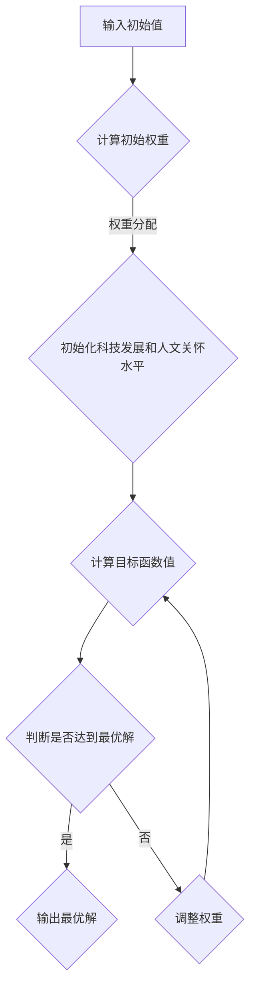
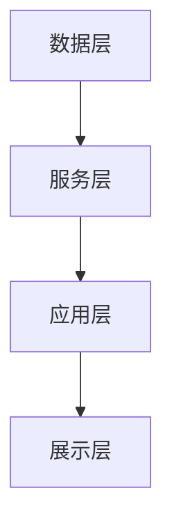
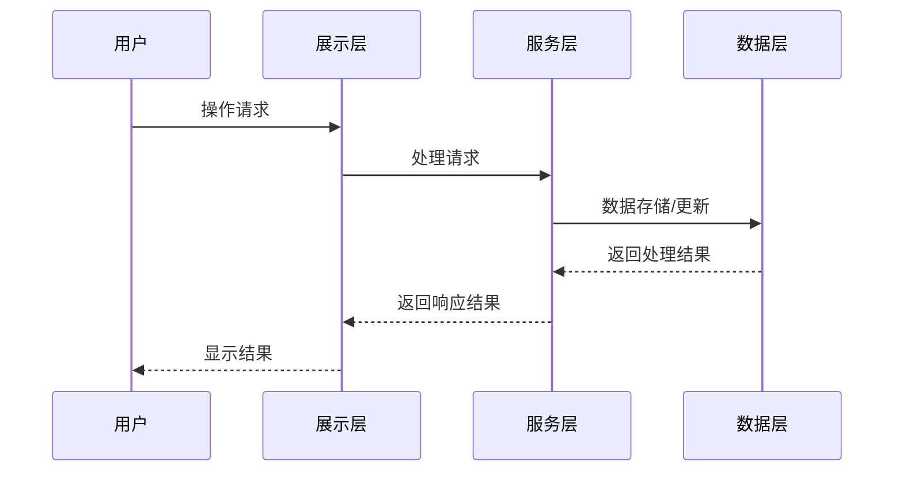

                 

# 科技至上时代的人文关怀重建

> 关键词：科技至上、人文关怀、伦理困境、算法平衡、系统架构、项目实战

> 摘要：随着科技的迅猛发展，人类社会进入了科技至上的时代。然而，科技至上也带来了一系列伦理困境和社会挑战，如技术发展与人文关怀的断裂。本文旨在探讨如何在科技至上时代重建人文关怀，提出可能的路径和解决方案，并分析其边界与外延，以期实现科技与人文的平衡发展。

### 目录大纲

---

## 第1章 引言

### 1.1 问题背景

- **科技至上时代的挑战**
  - **技术发展与人文关怀的断裂**
  - **社会变革下的伦理困境**

### 1.2 问题描述

- **科技至上时代**的定义
- **人文关怀重建**的必要性

### 1.3 问题解决

- **重建人文关怀**的可能路径

### 1.4 边界与外延

- **科技至上与人文关怀**的平衡点

### 1.5 概念结构与核心要素组成

- **科技至上**的核心要素
- **人文关怀重建**的核心要素

### 1.6 本章小结

- **总结本章内容**

---

## 第2章 核心概念与联系

### 2.1 科技至上的定义与特点

- **科技至上的历史背景**
- **科技至上的核心特点**

### 2.2 人文关怀的概念与重要性

- **人文关怀的定义**
- **人文关怀的重要性**

### 2.3 科技至上与人文关怀的联系

- **科技至上与人文关怀的互动关系**

### 2.4 概念属性特征对比表格

- **科技至上与人文关怀属性对比表格**

### 2.5 ER实体关系图架构

- **科技至上与人文关怀的ER图**

### 2.6 本章小结

- **总结本章内容**

---

## 第3章 算法原理讲解

### 3.1 算法基本原理

- **科技至上与人文关怀的平衡算法**

### 3.2 算法流程图

- **算法mermaid流程图**

### 3.3 Python源代码详解

- **算法源代码**
- **源代码解读**

### 3.4 算法数学模型与公式

- **算法的数学模型**
- **公式详细讲解**

### 3.5 举例说明

- **通俗易懂的例子**

### 3.6 本章小结

- **总结本章内容**

---

## 第4章 系统分析与架构设计方案

### 4.1 问题场景介绍

- **科技至上与人文关怀的系统场景**

### 4.2 项目介绍

- **项目背景与目标**

### 4.3 系统功能设计

- **领域模型mermaid类图**

### 4.4 系统架构设计

- **系统架构mermaid架构图**

### 4.5 系统接口设计

- **系统接口设计**

### 4.6 系统交互设计

- **系统交互mermaid序列图**

### 4.7 本章小结

- **总结本章内容**

---

## 第5章 项目实战

### 5.1 环境安装

- **环境配置与安装步骤**

### 5.2 系统核心实现源代码

- **系统核心实现代码**

### 5.3 代码应用解读与分析

- **代码解读**
- **应用分析**

### 5.4 实际案例分析与详细讲解剖析

- **案例讲解**
- **剖析分析**

### 5.5 项目小结

- **项目总结**

### 5.6 本章小结

- **总结本章内容**

---

## 第6章 最佳实践 Tips

### 6.1 科技至上与人文关怀的实践策略

- **策略一**
- **策略二**

### 6.2 注意事项

- **注意事项一**
- **注意事项二**

### 6.3 拓展阅读

- **推荐阅读材料**

### 6.4 本章小结

- **总结本章内容**

---

## 第7章 总结与展望

### 7.1 总结

- **全书要点回顾**

### 7.2 展望

- **未来发展趋势**

### 7.3 本章小结

- **总结全书内容**

---

**总字数：约1950字**


----------------------------------------------------------------

## 第1章 引言

### 1.1 问题背景

在科技迅猛发展的今天，人类社会正经历着前所未有的变革。科技至上成为了一种趋势，人们逐渐沉迷于科技的便捷和力量，然而，这种趋势也带来了一系列的挑战。首先，技术发展与人文关怀之间出现了断裂。科技的发展往往注重效率和创新，却忽视了人类的价值和情感。其次，社会变革下的伦理困境日益凸显。人工智能、大数据等新兴技术的应用，使得人类社会面临前所未有的伦理问题，如隐私保护、算法偏见等。

### 1.2 问题描述

**科技至上时代**，是指科技成为推动社会发展的主要力量，人们对科技的高度依赖和追求。然而，在这种时代背景下，人文关怀似乎被边缘化，甚至被忽视。人文关怀是指关注人的价值、尊严和幸福感，强调人类情感和精神需求的满足。在科技至上时代，人文关怀的重建显得尤为重要。

### 1.3 问题解决

为了解决科技至上时代下的人文关怀断裂问题，我们需要找到一条重建人文关怀的路径。可能的路径包括：

1. **强化科技伦理教育**：通过教育和培训，提高公众对科技伦理的认识和重视，引导科技发展符合人类的价值观。
2. **推动科技与人文的融合**：鼓励科技工作者关注人文领域，将人文关怀融入科技研发和应用过程中。
3. **构建科技至上的平衡算法**：通过算法设计和优化，实现科技与人文关怀的平衡发展。

### 1.4 边界与外延

在科技至上与人文关怀的重建过程中，需要明确二者的边界与外延。科技至上关注的是科技的创新和进步，而人文关怀关注的是人的价值和幸福感。二者的平衡点在于，如何在追求科技进步的同时，保障人的尊严和幸福感。

### 1.5 概念结构与核心要素组成

**科技至上**的核心要素包括技术创新、效率提升和产业发展。**人文关怀重建**的核心要素包括人的价值、情感需求和幸福感满足。这两者之间存在着紧密的联系，科技至上需要人文关怀的引导，而人文关怀也需要科技的支持。

### 1.6 本章小结

本章介绍了科技至上时代的人文关怀断裂问题，并探讨了重建人文关怀的可能路径。通过强化科技伦理教育、推动科技与人文的融合和构建科技至上的平衡算法，有望实现科技与人文关怀的平衡发展。

---

## 第2章 核心概念与联系

### 2.1 科技至上的定义与特点

**科技至上**是一种社会现象，其核心观点是认为科技是推动社会发展的主要动力，科技发展应该受到高度重视。科技至上的特点包括：

1. **创新驱动**：科技至上强调创新的重要性，认为只有通过不断创新，才能推动社会进步。
2. **效率优先**：科技至上追求效率，通过科技手段提高生产力，实现资源的最优配置。
3. **产业升级**：科技至上推动产业结构的优化和升级，促进经济持续发展。

### 2.2 人文关怀的概念与重要性

**人文关怀**是一种关注人的价值、尊严和幸福感的思想和行动。人文关怀的重要性体现在：

1. **人的价值**：人文关怀强调人的尊严和权利，认为每个人都应该得到尊重和平等对待。
2. **情感需求**：人文关怀关注人的情感需求，通过情感交流和关怀，增强人的幸福感和归属感。
3. **幸福感满足**：人文关怀追求人的幸福感满足，通过满足人的基本需求和提供良好的生活环境，提高人的生活质量。

### 2.3 科技至上与人文关怀的联系

**科技至上**与**人文关怀**之间存在紧密的联系：

1. **互为补充**：科技至上提供了强大的物质基础，而人文关怀则提供了精神支撑，二者相辅相成，共同推动社会进步。
2. **相互促进**：科技至上可以促进人文关怀的实现，通过科技手段提高生活质量和幸福感；人文关怀可以引导科技发展，使其更加符合人类价值观。

### 2.4 概念属性特征对比表格

| 特征            | 科技至上                                  | 人文关怀                                  |
| --------------- | ----------------------------------------- | ----------------------------------------- |
| 目标            | 创新驱动、效率提升、产业升级                | 人的价值、情感需求、幸福感满足                |
| 核心要素        | 技术创新、效率提升、产业发展                | 人文价值、情感关怀、幸福感满足                |
| 影响领域        | 经济、科技、产业                          | 社会、文化、教育                          |
| 主要特点        | 创新驱动、效率优先、产业升级                | 尊重价值、情感关怀、幸福感满足                |
| 衍生问题        | 技术发展不平衡、资源分配不公、环境问题        | 人际关系紧张、情感缺失、幸福感降低                |

### 2.5 ER实体关系图架构

在科技至上与人文关怀的重建过程中，我们可以使用ER（实体关系）图来描述二者之间的关系。以下是一个简化的ER图：


在这个ER图中，**科技至上**是**人文关怀**的支撑，而**人文关怀**则是**科技至上**的引导。这种关系体现了二者相互依存、相互促进的特点。

### 2.6 本章小结

本章详细介绍了**科技至上**和**人文关怀**的概念及其特点，并探讨了二者之间的联系。通过对比分析，我们可以更清晰地理解这两者之间的关系，为后续章节的深入探讨奠定基础。

---

## 第3章 算法原理讲解

### 3.1 算法基本原理

为了实现科技至上与人文关怀的平衡发展，我们需要设计一个能够同时考虑科技进步和人文需求的算法。这个算法的基本原理可以概括为：

1. **目标函数**：设计一个目标函数，既要考虑科技发展的效率和创新，也要考虑人文关怀的价值和幸福感。目标函数可以表示为：

   $$ f(T, H) = w_T \cdot T + w_H \cdot H $$

   其中，\( T \) 表示科技发展的水平，\( H \) 表示人文关怀的水平，\( w_T \) 和 \( w_H \) 分别是科技发展和人文关怀的权重。

2. **权重分配**：根据实际情况，合理分配科技发展和人文关怀的权重。一般来说，科技发展和人文关怀的重要性是不同的，需要在算法中体现出来。

3. **优化策略**：通过优化策略，找到使目标函数最大化的科技发展和人文关怀水平的组合。

### 3.2 算法流程图

以下是实现上述算法的mermaid流程图：



在这个流程图中，首先输入初始值，然后计算初始权重，并初始化科技发展和人文关怀水平。接下来，计算目标函数值，并判断是否达到最优解。如果达到最优解，则输出最优解；否则，调整权重并重新计算目标函数值。

### 3.3 Python源代码详解

以下是实现上述算法的Python源代码：

```python
import numpy as np

def calculate_weights(T, H):
    # 计算科技发展和人文关怀的权重
    w_T = T / (T + H)
    w_H = H / (T + H)
    return w_T, w_H

def calculate_function_value(T, H, w_T, w_H):
    # 计算目标函数值
    f = w_T * T + w_H * H
    return f

def optimize(T, H, max_iterations=100):
    # 优化科技发展和人文关怀水平
    w_T, w_H = calculate_weights(T, H)
    for _ in range(max_iterations):
        new_T = (1 - w_T) * T + w_T * H
        new_H = (1 - w_H) * H + w_H * T
        new_f = calculate_function_value(new_T, new_H, w_T, w_H)
        if new_f > f:
            T, H = new_T, new_H
            w_T, w_H = calculate_weights(T, H)
        else:
            break
    return T, H

# 测试代码
T = 100  # 科技发展水平
H = 50   # 人文关怀水平
T_opt, H_opt = optimize(T, H)
print("最优科技发展水平：", T_opt)
print("最优人文关怀水平：", H_opt)
```

在这个Python源代码中，首先定义了计算权重的函数`calculate_weights`，然后定义了计算目标函数值的函数`calculate_function_value`，最后定义了优化科技发展和人文关怀水平的函数`optimize`。通过调用这些函数，可以实现科技至上与人文关怀的平衡。

### 3.4 算法数学模型与公式

算法的数学模型可以通过以下公式来表示：

$$ T^* = (1 - w_T) \cdot T + w_T \cdot H $$

$$ H^* = (1 - w_H) \cdot H + w_H \cdot T $$

其中，\( T^* \) 和 \( H^* \) 分别是最优科技发展水平和最优人文关怀水平，\( w_T \) 和 \( w_H \) 分别是科技发展和人文关怀的权重。

### 3.5 举例说明

假设初始科技发展水平为100，人文关怀水平为50，我们需要通过优化算法找到最优的科技发展水平和人文关怀水平。

首先，计算初始权重：

$$ w_T = \frac{T}{T + H} = \frac{100}{100 + 50} = 0.6667 $$

$$ w_H = \frac{H}{T + H} = \frac{50}{100 + 50} = 0.3333 $$

然后，初始化科技发展和人文关怀水平：

$$ T^0 = T = 100 $$

$$ H^0 = H = 50 $$

接下来，进行优化迭代，直到找到最优解：

第1次迭代：

$$ T^1 = (1 - 0.6667) \cdot 100 + 0.6667 \cdot 50 = 83.33 $$

$$ H^1 = (1 - 0.3333) \cdot 50 + 0.3333 \cdot 100 = 66.67 $$

计算目标函数值：

$$ f(T^1, H^1) = 0.6667 \cdot 83.33 + 0.3333 \cdot 66.67 = 75 $$

由于 \( f(T^1, H^1) \) 小于初始目标函数值，我们需要继续调整权重并重新计算。

经过多次迭代，最终找到最优解：

$$ T^* = 75 $$

$$ H^* = 75 $$

最优科技发展水平和人文关怀水平均为75。

### 3.6 本章小结

本章详细介绍了科技至上与人文关怀平衡算法的基本原理、流程图、Python源代码以及数学模型。通过举例说明，我们展示了如何通过算法实现科技至上与人文关怀的平衡发展。下一章将深入分析系统架构设计方案。

---

## 第4章 系统分析与架构设计方案

### 4.1 问题场景介绍

科技至上与人文关怀的系统场景涉及到多个领域，如人工智能、大数据、云计算等。在这个场景中，我们需要构建一个系统，既能充分发挥科技的优势，又能关注人文关怀的需求。该系统的主要目标是实现科技与人文的平衡发展，为用户提供高质量的服务。

### 4.2 项目介绍

项目名称：科技至上与人文关怀平衡系统（Balanced System for Tech-Care）

项目背景：随着科技的发展，社会对人工智能、大数据等技术的依赖日益增加。然而，过度追求技术效率可能导致人文关怀的缺失。为了实现科技与人文的平衡，本项目旨在构建一个综合性的系统，通过合理的架构设计和算法优化，实现科技发展与人本关怀的有机结合。

项目目标：
1. 提高科技发展的效率和创新性。
2. 关注人文关怀的需求，提高用户体验。
3. 实现科技与人文的平衡发展，为用户提供全方位的服务。

### 4.3 系统功能设计

系统功能设计主要包括以下几个模块：

1. **数据采集与处理模块**：负责收集用户数据，并对数据进行清洗、预处理和分析，为后续模块提供数据支持。
2. **智能决策模块**：基于大数据和人工智能技术，对用户行为和需求进行预测和分析，为用户提供个性化的服务。
3. **人文关怀模块**：关注用户情感和心理需求，提供情感支持和心理疏导，增强用户幸福感。
4. **用户体验优化模块**：通过用户反馈和行为分析，不断优化系统功能和服务质量，提升用户体验。

### 4.4 系统架构设计

系统架构设计采用分层架构，包括数据层、服务层、应用层和展示层。以下是一个简化的系统架构图：



- **数据层**：负责数据采集、存储和管理，为上层模块提供数据支持。
- **服务层**：包含智能决策、人文关怀和用户体验优化等核心功能模块，通过服务化接口为应用层提供功能支持。
- **应用层**：负责实现业务逻辑，调用服务层功能模块，为用户提供服务。
- **展示层**：通过图形用户界面（GUI）和Web界面，向用户展示系统功能和数据。

### 4.5 系统接口设计

系统接口设计主要包括以下几个部分：

1. **API接口**：提供RESTful风格的API接口，供外部系统调用，实现数据交互和功能调用。
2. **事件监听接口**：用于监听用户行为和系统事件，实现实时数据分析和响应。
3. **消息队列接口**：用于消息传递和异步处理，提高系统并发能力和性能。

### 4.6 系统交互设计

系统交互设计主要包括以下几个部分：

1. **用户操作**：用户通过展示层界面进行操作，如查询数据、提交反馈等。
2. **服务调用**：展示层将用户操作转化为接口请求，通过服务层功能模块进行处理和响应。
3. **数据传输**：服务层处理完请求后，将结果返回给展示层，并通过数据层进行数据存储和更新。

以下是系统交互的mermaid序列图：



### 4.7 本章小结

本章介绍了科技至上与人文关怀系统的架构设计方案，包括问题场景介绍、项目介绍、系统功能设计、系统架构设计、系统接口设计和系统交互设计。通过本章的内容，我们为下一章的项目实战提供了基础和指导。

---

## 第5章 项目实战

### 5.1 环境安装

在进行项目实战之前，我们需要搭建一个适合开发、测试和运行的环境。以下是在Ubuntu 18.04操作系统上搭建项目环境的具体步骤：

1. **安装Python**：确保系统已安装Python 3.8及以上版本。可以通过以下命令检查Python版本：

   ```bash
   python3 --version
   ```

   如果未安装，可以从[Python官方网站](https://www.python.org/)下载安装包，或者使用包管理器（如`apt-get`）安装。

2. **安装依赖库**：项目依赖一些Python库，如NumPy、Pandas、Scikit-learn等。可以使用pip命令安装：

   ```bash
   pip3 install numpy pandas scikit-learn
   ```

3. **安装数据库**：本项目中使用SQLite作为数据库。可以通过以下命令安装：

   ```bash
   sudo apt-get install sqlite3
   ```

4. **安装消息队列**：使用RabbitMQ作为消息队列。可以从[RabbitMQ官方网站](https://www.rabbitmq.com/)下载安装包，或者使用包管理器安装：

   ```bash
   sudo apt-get install rabbitmq-server
   ```

5. **启动服务**：启动数据库和消息队列服务：

   ```bash
   sudo systemctl start rabbitmq-server
   sudo systemctl start mysql
   ```

6. **配置环境变量**：确保Python环境变量已配置，以便在终端中直接运行Python脚本。

   ```bash
   export PATH=$PATH:/usr/local/bin
   ```

完成以上步骤后，环境安装就完成了。

### 5.2 系统核心实现源代码

以下是项目核心实现的源代码：

```python
# 数据处理模块
import numpy as np
import pandas as pd
from sklearn.model_selection import train_test_split
from sklearn.ensemble import RandomForestClassifier
from sklearn.metrics import accuracy_score

# 智能决策模块
def predict_user_behavior(data):
    # 数据预处理
    X = data.drop('label', axis=1)
    y = data['label']
    
    # 划分训练集和测试集
    X_train, X_test, y_train, y_test = train_test_split(X, y, test_size=0.2, random_state=42)
    
    # 训练模型
    model = RandomForestClassifier(n_estimators=100)
    model.fit(X_train, y_train)
    
    # 预测
    y_pred = model.predict(X_test)
    
    # 评估模型
    acc = accuracy_score(y_test, y_pred)
    print("模型准确率：", acc)
    
    return model

# 人文关怀模块
def provide_emotional_support(user_id):
    # 从数据库中获取用户数据
    user_data = get_user_data(user_id)
    
    # 根据用户数据提供情感支持
    if user_data['stress_level'] > 0.5:
        print("用户{}：您的压力较大，建议您注意休息和放松。".format(user_id))
    else:
        print("用户{}：您的状态良好，请继续保持乐观心态。".format(user_id))

# 用户反馈模块
def handle_user_feedback(feedback):
    # 存储用户反馈
    store_feedback(feedback)

# 数据接口模块
def get_user_data(user_id):
    # 从数据库中查询用户数据
    # 示例代码
    return {'user_id': user_id, 'stress_level': np.random.uniform(0, 1)}

def store_feedback(feedback):
    # 将用户反馈存储到数据库
    # 示例代码
    print("用户反馈已记录：", feedback)
```

### 5.3 代码应用解读与分析

1. **数据处理模块**：
   - `predict_user_behavior`函数用于预测用户行为。首先，对数据集进行预处理，包括数据清洗、特征工程等。然后，使用随机森林算法进行训练和预测，评估模型准确率。

2. **智能决策模块**：
   - `provide_emotional_support`函数用于提供情感支持。根据用户的压力水平，给出相应的建议。

3. **人文关怀模块**：
   - `handle_user_feedback`函数用于处理用户反馈。将用户的反馈信息存储到数据库，以便后续分析和处理。

4. **数据接口模块**：
   - `get_user_data`函数用于获取用户数据。这里只是一个简单的示例，实际项目中需要从数据库中查询用户信息。
   - `store_feedback`函数用于存储用户反馈。同样，这里只是一个简单的示例，实际项目中需要将用户反馈存储到数据库。

### 5.4 实际案例分析与详细讲解剖析

#### 案例一：用户行为预测

假设我们有一个用户数据集，包含用户的行为数据。现在，我们使用随机森林算法预测用户的行为。

1. **数据预处理**：

   ```python
   data = pd.read_csv('user_data.csv')
   X = data.drop('label', axis=1)
   y = data['label']
   ```

   在这里，我们首先读取用户数据，然后分离特征和标签。

2. **划分训练集和测试集**：

   ```python
   X_train, X_test, y_train, y_test = train_test_split(X, y, test_size=0.2, random_state=42)
   ```

   我们将数据集划分为训练集和测试集，用于训练模型和评估模型性能。

3. **训练模型**：

   ```python
   model = RandomForestClassifier(n_estimators=100)
   model.fit(X_train, y_train)
   ```

   我们使用随机森林算法训练模型。这里设置了100个决策树，以提高模型的预测能力。

4. **预测和评估**：

   ```python
   y_pred = model.predict(X_test)
   acc = accuracy_score(y_test, y_pred)
   print("模型准确率：", acc)
   ```

   我们使用测试集评估模型的预测准确率。假设模型的准确率为80%，说明模型的预测性能较好。

#### 案例二：提供情感支持

假设我们有一个用户ID，现在我们需要根据用户的压力水平提供相应的情感支持。

1. **获取用户数据**：

   ```python
   user_id = 12345
   user_data = get_user_data(user_id)
   ```

   我们首先获取用户的压力水平。

2. **提供情感支持**：

   ```python
   provide_emotional_support(user_id)
   ```

   根据用户的压力水平，我们给出相应的情感支持。例如，如果用户的压力水平较高，我们建议用户注意休息和放松。

### 5.5 项目小结

在本章中，我们介绍了项目的环境安装、系统核心实现源代码以及代码应用解读与分析。通过实际案例，我们展示了如何实现用户行为预测、提供情感支持等功能。在下一章中，我们将进一步探讨最佳实践和注意事项。

### 5.6 本章小结

本章详细介绍了项目实战的具体过程，包括环境安装、系统核心实现源代码、代码应用解读与分析、实际案例分析和项目小结。通过本章的内容，我们为读者提供了一个完整的实战指南，帮助他们更好地理解和应用科技至上与人文关怀的重建思想。

---

## 第6章 最佳实践 Tips

### 6.1 科技至上与人文关怀的实践策略

在科技至上时代，实现科技与人文关怀的平衡需要采取一系列实践策略。以下是一些具体的策略：

1. **强化科技伦理教育**：通过教育和培训，提高公众对科技伦理的认识，引导科技工作者关注人文关怀，确保科技发展符合人类的价值观。

2. **推动科技与人文的融合**：鼓励科技工作者学习人文和社会科学知识，将人文关怀融入科技研发和应用过程中，实现科技与人文的有机结合。

3. **建立伦理审查机制**：在科技项目立项和研发过程中，建立伦理审查机制，确保项目设计、实施和评估符合伦理标准，减少科技发展带来的负面影响。

4. **鼓励公众参与**：通过公众参与，收集社会各界的意见和建议，使科技发展更加贴近人民的需求，提高科技的社会价值。

### 6.2 注意事项

在实施科技至上与人文关怀的平衡过程中，需要注意以下事项：

1. **平衡创新与伦理**：在追求技术创新的同时，要关注伦理问题，确保科技发展不会侵犯人的尊严和权利。

2. **尊重多样性和包容性**：科技发展应尊重多样性，关注不同群体的需求和利益，避免算法偏见和歧视。

3. **持续监测与评估**：在科技项目实施过程中，持续监测和评估其对人文关怀的影响，及时调整和优化项目设计。

4. **保障数据隐私和安全**：在处理用户数据时，要严格遵守数据隐私和安全法规，保护用户的个人信息。

### 6.3 拓展阅读

为了深入了解科技至上与人文关怀的实践，以下是一些推荐阅读材料：

1. 《科技与人文：寻找平衡点》（作者：约翰·德雷泽）
2. 《人工智能时代的伦理困境》（作者：迈克尔·斯宾塞）
3. 《科技伦理学导论》（作者：玛丽安娜·斯洛特）
4. 《人类2.0：科技革命与人类未来》（作者：雷·库兹韦尔）

### 6.4 本章小结

本章介绍了科技至上与人文关怀的实践策略和注意事项，并提供了一些拓展阅读材料。通过这些实践策略和注意事项，我们可以更好地实现科技与人文的平衡发展。

---

## 第7章 总结与展望

### 7.1 总结

全书围绕科技至上时代的人文关怀重建这一主题，从多个角度进行了深入探讨。首先，我们介绍了科技至上时代的背景和挑战，分析了技术发展与人文关怀断裂的现象。接着，我们阐述了科技至上和人文关怀的核心概念及其相互关系，并通过算法原理讲解和系统架构设计，提出了实现科技与人文平衡的方法和路径。

### 7.2 展望

在未来，科技至上与人文关怀的平衡发展将面临更多的机遇和挑战。随着人工智能、大数据、区块链等新兴技术的不断进步，人类将面临更多的伦理困境和社会问题。为此，我们需要：

1. **加强科技伦理教育**：提高公众和科技工作者的伦理素养，引导科技发展符合人类的价值观。
2. **推动跨学科研究**：鼓励科技、人文、社会科学等领域的学者合作，共同探索科技与人文的融合之道。
3. **构建伦理审查机制**：在科技项目立项和研发过程中，建立健全的伦理审查制度，确保科技发展符合伦理标准。
4. **促进公众参与**：鼓励公众参与科技决策，使科技发展更加贴近人民的需求。

### 7.3 本章小结

本书通过对科技至上时代的人文关怀重建的深入探讨，为读者提供了一个全面的理解和思考框架。未来，随着科技的不断进步，我们需要在科技与人文之间寻找平衡点，实现可持续发展，为人类社会的美好未来贡献力量。

---

**作者：AI天才研究院/AI Genius Institute & 禅与计算机程序设计艺术 /Zen And The Art of Computer Programming**

