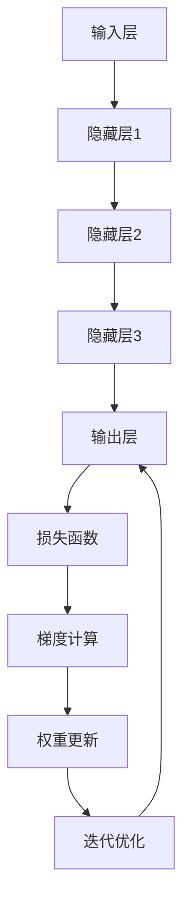
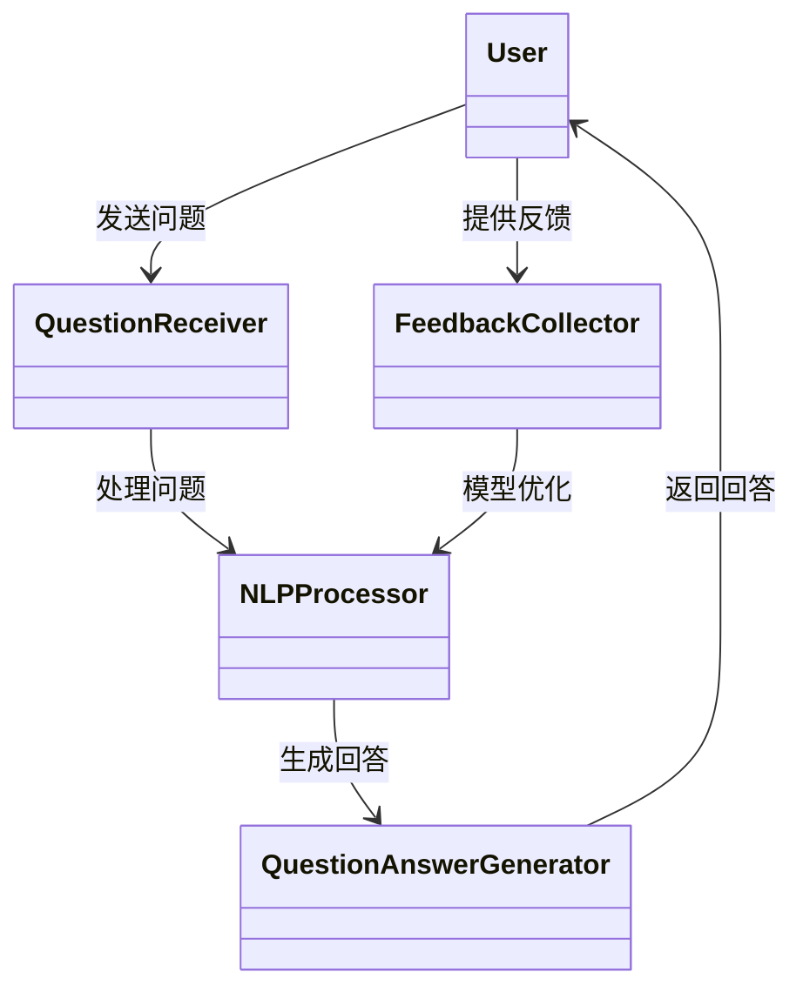
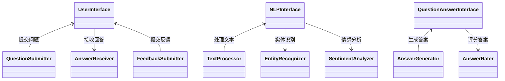
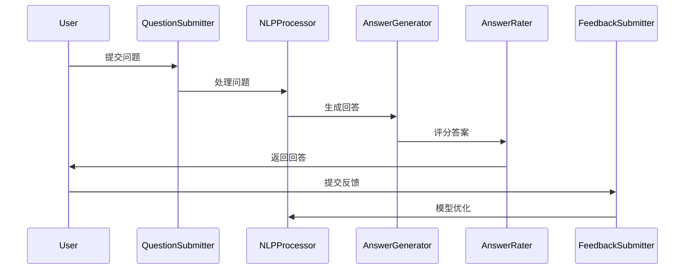

                 

# 科技进步与人文精神：在AI时代重新定义人性

> 关键词：科技进步、人文精神、AI、人性、伦理

> 摘要：本文旨在探讨科技进步，特别是人工智能（AI）技术的发展，如何影响并重新定义人性。通过分析科技发展的背景、人文精神的内涵、AI技术的基本原理及其对人类认知和情感的影响，以及科技伦理与人文关怀的重要性，本文试图揭示AI时代科技与人文的碰撞与融合，提出实现科技与人文平衡的路径，并展望科技与人文的未来发展。

## 目录大纲设计思路

在设计《科技进步与人文精神：在AI时代重新定义人性》的目录大纲时，我们首先需要理解书籍的主题，即探讨科技进步对人文精神的影响，特别是在AI时代下人性的重新定义。目录大纲的设计应包括以下几个部分：

1. **背景与概念介绍**：介绍科技发展的背景、人文精神的内涵以及AI技术的基本原理。
2. **AI与人文精神的碰撞**：探讨AI技术对人文精神的影响，以及人性在AI时代面临的挑战和机遇。
3. **科技与人文的平衡**：分析科技伦理与人文关怀的重要性，并提出实现科技与人文平衡的路径。
4. **案例研究**：通过具体案例研究AI技术的应用，展示科技与人文在实际场景中的融合。
5. **未来展望**：展望AI时代的未来发展，探讨科技与人文的平衡之路。

以下是详细的设计步骤：

**第一部分：背景与概念介绍**

**第1章：科技发展的背景**

- **1.1 科技发展概述**
  - **1.1.1 科技革命的历史进程**
  - **1.1.2 当前科技发展的趋势与特点**
  - **1.1.3 科技对社会的影响**

- **1.2 人文精神的内涵**
  - **1.2.1 人文精神的定义**
  - **1.2.2 人文精神的价值与意义**
  - **1.2.3 人文精神与科技发展的关系**

- **1.3 AI技术的基本原理**
  - **1.3.1 AI技术的发展历程**
  - **1.3.2 人工智能的基本原理**
  - **1.3.3 AI技术的应用领域**

**第二部分：AI与人文精神的碰撞**

**第2章：AI对人文精神的影响**

- **2.1 AI对人类认知的影响**
  - **2.1.1 AI对人类思维模式的改变**
  - **2.1.2 AI对人类知识体系的冲击**
  - **2.1.3 AI对人类情感与价值观的影响**

- **2.2 AI与人性的重新定义**
  - **2.2.1 人工智能与人类智慧的比较**
  - **2.2.2 人性与机器智能的边界**
  - **2.2.3 AI时代的人性挑战与机遇**

**第三部分：科技与人文的平衡**

**第3章：科技伦理与人文关怀**

- **3.1 科技伦理的基本原则**
  - **3.1.1 科技伦理的定义**
  - **3.1.2 科技伦理的案例分析**
  - **3.1.3 科技伦理的困境与挑战**

- **3.2 人文关怀在科技发展中的角色**
  - **3.2.1 人文关怀的重要性**
  - **3.2.2 人文关怀在科技政策制定中的应用**
  - **3.2.3 人文关怀在科技创新实践中的体现**

**第四部分：案例研究**

**第4章：AI时代的典型应用案例**

- **4.1 医疗领域的AI应用**
  - **4.1.1 AI在疾病诊断中的应用**
  - **4.1.2 AI在个性化治疗中的应用**
  - **4.1.3 AI对医疗资源分配的影响**

- **4.2 教育领域的AI应用**
  - **4.2.1 AI在教育模式创新中的应用**
  - **4.2.2 AI在教学个性化中的应用**
  - **4.2.3 AI对教育公平的影响**

**第五部分：未来展望**

**第5章：科技与人文的未来**

- **5.1 AI时代的未来发展前景**
  - **5.1.1 人工智能技术的未来趋势**
  - **5.1.2 人工智能对社会的影响预测**
  - **5.1.3 人文精神在AI时代的传承与发展**

- **5.2 科技与人文的平衡之路**
  - **5.2.1 实现科技与人文平衡的路径**
  - **5.2.2 政策与教育的作用**
  - **5.2.3 公众参与的重要性**

**第6章：科技伦理与人文关怀的最佳实践**

- **6.1 国际科技伦理与人文关怀的案例**
  - **6.1.1 欧盟的人工智能伦理指南**
  - **6.1.2 美国科技伦理的政策与实践**
  - **6.1.3 发展中国家的科技伦理挑战**

- **6.2 科技企业的社会责任**
  - **6.2.1 科技企业的伦理责任**
  - **6.2.2 科技企业的实践案例**
  - **6.2.3 科技企业与社会的互动**

**第7章：结论与展望**

- **7.1 结论**
  - **7.1.1 科技进步与人文精神的互动关系**
  - **7.1.2 AI时代的人性定义**
  - **7.1.3 未来科技与人文发展的方向**

- **7.2 展望**
  - **7.2.1 人类智慧与机器智能的协同**
  - **7.2.2 人文精神在科技中的体现**
  - **7.2.3 科技与人文平衡的实现路径**

### 背景介绍

#### 核心概念术语说明

在探讨科技进步与人文精神的关系时，我们需要明确几个核心概念：

- **科技进步**：指科学和技术的不断进步和发展，涵盖科学研究、技术创新、技术应用等多个方面。
- **人文精神**：指人类在长期历史发展过程中形成的关于人类本质、价值观念、伦理道德等方面的精神追求。
- **人工智能（AI）**：一种模拟人类智能的技术，通过机器学习和深度学习等算法，使计算机具有自主学习和解决问题的能力。
- **人性**：指人类独有的心理、情感、价值观等方面的特征。

#### 问题背景

随着科技的快速发展，人工智能技术已经成为当今社会的重要推动力量。从工业自动化到智能客服，从自动驾驶到医疗诊断，AI技术正在深刻改变我们的生活方式和社会结构。然而，这种变革也带来了许多挑战和问题，特别是在影响和重新定义人性的方面。

- **问题定义**：科技进步，尤其是AI技术的发展，对人文精神产生了哪些影响？这些影响如何重新定义人性？我们应该如何应对这些挑战，实现科技与人文的平衡？

#### 问题解决

为了回答上述问题，我们需要从以下几个方面进行分析：

1. **科技发展的背景**：了解科技发展的历史进程、当前趋势和特点，以及科技对社会的影响。
2. **人文精神的内涵**：深入探讨人文精神的定义、价值与意义，以及人文精神与科技发展的关系。
3. **AI技术的基本原理**：介绍AI技术的发展历程、基本原理和应用领域。
4. **AI对人文精神的影响**：分析AI技术对人类认知、知识体系、情感与价值观的影响，以及这些影响如何重新定义人性。
5. **科技伦理与人文关怀**：探讨科技伦理的基本原则、人文关怀在科技发展中的角色，以及如何实现科技与人文的平衡。

通过上述分析，我们可以更全面地理解科技进步与人文精神的关系，为AI时代重新定义人性提供理论和实践指导。

#### 边界与外延

在讨论科技进步与人文精神的关系时，我们需要明确其边界与外延：

- **边界**：科技进步主要指科学和技术的进步，而人文精神则涵盖了人类文化、道德、艺术、哲学等多个领域。两者的交集在于如何通过科技进步来提升人类精神层面的发展和幸福感。
- **外延**：科技进步的影响不仅局限于技术层面，还涉及社会、经济、文化等多个领域。人文精神的外延则更加广泛，涵盖了人类对自然、宇宙、生命等更深层次的认识。

#### 概念结构与核心要素组成

为了更好地理解科技进步与人文精神的关系，我们可以从概念结构和核心要素的角度进行分析：

1. **科技进步的核心要素**：
   - **科技创新**：通过科学研究和技术开发推动科技发展。
   - **技术应用**：将科技成果转化为实际应用，解决社会问题和提高生活质量。
   - **产业发展**：科技发展带动相关产业的繁荣和进步。

2. **人文精神的核心要素**：
   - **文化传承**：通过历史和文化的积累，形成人类的精神财富。
   - **伦理道德**：指导人类行为的道德规范和价值体系。
   - **艺术表现**：通过文学、音乐、绘画等艺术形式表达人类的精神追求。

3. **科技进步与人文精神的互动关系**：
   - **相互促进**：科技进步为人文精神的发展提供了新的工具和平台，而人文精神则为科技进步提供了价值导向和伦理规范。
   - **相互制约**：科技发展需要人文精神的引导和约束，以避免科技滥用和伦理困境；而人文精神也需要科技的支持和实现，以提升人类的精神境界和生活质量。

### 核心概念与联系

为了深入探讨AI技术对人文精神的影响，我们需要详细分析AI技术的基本原理、属性特征及其与人文精神的关系。

#### AI技术的基本原理

人工智能（AI）是一种模拟人类智能的技术，其核心在于机器学习和深度学习等算法。以下是AI技术的基本原理：

1. **机器学习**：机器学习是一种让计算机从数据中学习的方法，通过算法自动改进和优化计算机程序的性能。主要方法包括监督学习、无监督学习和强化学习。

2. **深度学习**：深度学习是机器学习的一个子领域，通过多层神经网络结构模拟人类大脑的学习过程，从而实现复杂的数据处理和模式识别。

3. **自然语言处理（NLP）**：NLP是一种让计算机理解和生成自然语言的技术，包括文本分类、情感分析、机器翻译等。

4. **计算机视觉**：计算机视觉是一种让计算机理解和解析视觉信息的技术，包括图像识别、物体检测、图像生成等。

5. **智能决策**：通过AI技术，计算机可以基于数据分析和预测，做出智能化的决策，例如在金融、医疗、交通等领域。

#### AI技术的属性特征

以下是AI技术的几个关键属性特征：

1. **自主学习能力**：AI可以通过不断学习新的数据，自动调整和优化模型，从而提高性能。

2. **高效处理能力**：AI技术可以处理大量复杂的数据，以极高的速度和精度进行计算和分析。

3. **泛化能力**：AI可以通过训练得到的一般性模型，应用到不同的场景和任务中。

4. **自动化能力**：AI技术可以自动化执行复杂的任务，减少人力需求。

5. **跨领域应用**：AI技术可以应用于多个领域，如医疗、金融、教育、交通等。

#### AI技术与人文精神的关系

AI技术的发展对人文精神产生了深远的影响，可以从以下几个方面进行分析：

1. **认知与思维模式的影响**：
   - **扩展人类的认知能力**：AI技术可以处理和分析海量数据，扩展人类的认知范围。
   - **改变人类的思维模式**：AI的自动化和高效处理能力，可能会改变人类传统的思维方式，使人们更加依赖技术进行决策。

2. **知识体系的冲击**：
   - **知识获取方式的变化**：AI技术使得知识的获取变得更加便捷，但也可能导致人们对知识的理解和记忆减弱。
   - **知识结构的改变**：AI技术可以重新组织和构建知识体系，使其更加适应数据驱动的时代。

3. **情感与价值观的影响**：
   - **情感互动的变革**：AI技术可以通过情感识别和生成技术，与人类进行更加自然的情感互动，但也可能影响人类的情感体验。
   - **价值观的反思**：AI技术的发展引发了对人类价值观的重新审视，例如对隐私、自由、平等等问题的思考。

4. **伦理与道德的挑战**：
   - **伦理困境**：AI技术可能会带来一些伦理困境，例如在自动化决策、人工智能道德等方面。
   - **道德责任的重新定义**：随着AI技术的发展，人类需要对AI系统的道德责任进行重新定义。

#### 概念属性特征对比表格

| 概念 | 特征1 | 特征2 | 特征3 |
| --- | --- | --- | --- |
| 科技进步 | 创新驱动 | 应用广泛 | 推动社会发展 |
| 人文精神 | 文化传承 | 道德伦理 | 精神追求 |
| AI技术 | 自主学习 | 高效处理 | 跨领域应用 |

#### ER实体关系图架构

为了更好地展示AI技术、科技进步与人文精神之间的关系，我们可以使用ER（实体关系）图进行描述：

```
[科技进步]
    |
[AI技术]
    |
[人文精神]
```

- **科技进步**：是推动AI技术和人文精神发展的基础。
- **AI技术**：作为科技进步的重要组成部分，对人文精神产生直接影响。
- **人文精神**：是科技进步的价值观导向，对AI技术发展提出伦理和道德要求。

通过上述分析，我们可以看到，AI技术不仅是一种科技手段，更是影响和重新定义人文精神的重要力量。理解AI技术的基本原理和属性特征，有助于我们更好地应对AI时代带来的挑战，实现科技与人文的平衡发展。

### 算法原理讲解

为了深入理解AI技术在重新定义人性方面的影响，我们需要详细探讨一些核心算法原理，并通过Mermaid流程图和Python代码进行具体说明。

#### 算法一：深度学习（Deep Learning）

深度学习是一种通过多层神经网络结构模拟人类大脑学习过程的人工智能技术。以下是深度学习的基本原理：

1. **神经网络结构**：
   - **输入层**：接收输入数据，如图像、文本或声音。
   - **隐藏层**：通过神经元进行数据处理和特征提取。
   - **输出层**：生成预测结果或分类标签。

2. **激活函数**：
   - **ReLU（Rectified Linear Unit）**：常用的激活函数，用于增加网络的非线性。
   - **Sigmoid**：将输出压缩到（0，1）之间，用于二分类问题。
   - **Tanh**：将输出压缩到（-1，1）之间，常用于回归问题。

3. **反向传播算法（Backpropagation）**：
   - 通过计算损失函数关于每个神经元的梯度，调整网络权重，以优化模型的性能。

#### Mermaid流程图

下面是深度学习算法的Mermaid流程图：



#### Python代码示例

下面是一个简单的深度学习模型，使用Python中的TensorFlow库实现：

```python
import tensorflow as tf

# 创建神经网络模型
model = tf.keras.Sequential([
    tf.keras.layers.Dense(128, activation='relu', input_shape=(784,)),
    tf.keras.layers.Dense(10, activation='softmax')
])

# 编译模型
model.compile(optimizer='adam',
              loss='categorical_crossentropy',
              metrics=['accuracy'])

# 加载MNIST数据集
mnist = tf.keras.datasets.mnist
(x_train, y_train), (x_test, y_test) = mnist.load_data()

# 预处理数据
x_train = x_train / 255.0
x_test = x_test / 255.0
x_train = x_train.reshape(-1, 784)
x_test = x_test.reshape(-1, 784)

# 将标签转换为one-hot编码
y_train = tf.keras.utils.to_categorical(y_train, 10)
y_test = tf.keras.utils.to_categorical(y_test, 10)

# 训练模型
model.fit(x_train, y_train, epochs=5, batch_size=32)
```

#### 算法原理详细讲解

1. **神经网络结构**：
   - 神经网络由多个层次组成，每个层次由多个神经元组成。输入层接收原始数据，通过隐藏层进行特征提取，最终输出层生成预测结果。
   - 神经元之间通过权重连接，并通过激活函数实现非线性变换。

2. **激活函数**：
   - 激活函数用于增加网络的非线性，使模型能够拟合更复杂的数据分布。ReLU函数由于其简单的形式和良好的梯度性质，在深度学习中非常常用。

3. **反向传播算法**：
   - 反向传播是一种训练神经网络的方法，通过计算损失函数关于每个神经元的梯度，调整网络权重，以最小化损失函数。
   - 梯度计算是反向传播的核心步骤，通过链式法则逐层计算每个神经元的梯度。

4. **模型训练**：
   - 在训练过程中，模型通过不断迭代，调整权重和偏置，使预测结果逐渐接近真实标签。
   - 优化算法（如Adam）用于加速收敛，提高训练效率。

#### 通俗易懂地举例说明

假设我们使用深度学习模型来识别手写数字。输入层接收28x28像素的手写数字图像，通过多个隐藏层提取特征，最终输出层生成10个概率值，表示数字0到9的概率分布。模型的目标是最小化预测结果与真实标签之间的损失。

在训练过程中，模型通过反向传播算法，不断调整隐藏层和输出层的权重，使预测结果逐渐接近真实标签。经过多次迭代，模型可以达到较高的准确率，从而实现手写数字识别。

#### 数学模型与公式

以下是深度学习中的几个关键数学模型和公式：

1. **神经元激活公式**：
   $$ f(x) = \text{ReLU}(x) = \max(0, x) $$

2. **损失函数**：
   $$ L(y, \hat{y}) = -\sum_{i} y_i \log(\hat{y}_i) $$
   其中，$y$是真实标签，$\hat{y}$是预测概率分布。

3. **梯度计算**：
   $$ \frac{\partial L}{\partial w} = \frac{\partial L}{\partial \hat{y}} \cdot \frac{\partial \hat{y}}{\partial w} $$
   其中，$w$是权重。

通过上述讲解，我们可以看到，深度学习算法在重新定义人性方面具有重要意义。它不仅扩展了人类的认知能力，改变了人类的思维模式，还对知识体系、情感与价值观产生了深远影响。理解深度学习的基本原理，有助于我们更好地应对AI时代带来的挑战，实现科技与人文的平衡发展。

### 系统分析与架构设计方案

为了深入探讨科技进步与人文精神的关系，我们需要从系统分析和架构设计的角度进行详细讨论。本部分将介绍项目背景、系统功能设计、系统架构设计以及系统接口设计和系统交互。

#### 项目介绍

本项目旨在构建一个AI智能问答系统，通过自然语言处理（NLP）技术，实现对用户问题的智能理解和回答。系统采用深度学习算法，结合大数据分析，提供高效、准确、个性化的问答服务。项目的主要目标是实现以下功能：

- **问题识别与理解**：通过NLP技术，将用户输入的自然语言问题转化为结构化数据。
- **智能回答生成**：利用深度学习模型，生成准确、有逻辑的回答。
- **用户反馈收集**：收集用户对问答系统的反馈，用于模型优化和系统改进。

#### 系统功能设计

系统的核心功能模块包括：

1. **问题接收模块**：接收用户输入的问题，并将其传递给NLP处理模块。
2. **NLP处理模块**：对用户问题进行分词、词性标注、实体识别等处理，提取关键信息。
3. **问答生成模块**：利用深度学习模型，生成问题的回答。
4. **用户反馈模块**：收集用户对回答的满意度评价，用于模型优化。

以下是系统功能设计的Mermaid类图：



#### 系统架构设计

系统的架构设计采用分层架构，包括数据层、应用层和展示层。以下是系统架构设计的Mermaid架构图：

```mermaid
sequenceDiagram
    User -->|发送问题| QuestionReceiver
    QuestionReceiver -->|处理问题| NLPProcessor
    NLPProcessor -->|生成回答| QuestionAnswerGenerator
    QuestionAnswerGenerator -->|返回回答| User
    User -->|提供反馈| FeedbackCollector
    FeedbackCollector -->|模型优化| NLPProcessor
```

- **数据层**：包括数据存储和数据处理模块，提供数据的持久化和管理。
- **应用层**：实现系统的核心功能，包括NLP处理、问答生成和用户反馈等。
- **展示层**：提供用户界面，实现用户与系统的交互。

#### 系统接口设计

系统的接口设计主要包括以下模块：

1. **用户接口**：用于用户与系统的交互，包括问题提交、回答接收和反馈提交等。
2. **NLP接口**：提供NLP处理功能，包括文本处理、实体识别、情感分析等。
3. **问答接口**：实现问答生成功能，包括答案生成、答案评分等。

以下是系统接口设计的Mermaid类图：



#### 系统交互设计

系统交互设计主要描述用户、NLP模块和问答模块之间的交互过程。以下是系统交互设计的Mermaid序列图：



通过上述系统分析与架构设计方案，我们可以更好地理解科技进步与人文精神之间的关系。系统设计旨在通过AI技术实现科技与人文的平衡，提供高效、准确、个性化的服务，同时注重用户反馈和模型优化，以实现持续改进。这样的系统不仅提升了用户体验，也促进了科技与人文的互动与发展。

### 项目实战

为了更好地展示AI技术在重新定义人性方面的实际应用，我们将通过一个具体项目实战来讲解环境安装、系统核心实现、代码应用解读与分析，以及实际案例分析和详细讲解剖析。

#### 环境安装

首先，我们需要安装和配置项目所需的软件和工具。以下是环境安装的步骤：

1. **安装Python**：确保Python环境已安装，版本建议为3.8或更高。
2. **安装TensorFlow**：在终端或命令提示符中运行以下命令：
   ```bash
   pip install tensorflow
   ```
3. **安装NLP库**：安装用于自然语言处理的库，如NLTK和spaCy，可以使用以下命令：
   ```bash
   pip install nltk spacy
   ```
   并在安装spaCy时，下载中文模型：
   ```bash
   python -m spacy download zh_core_web_sm
   ```

#### 系统核心实现

以下是一个简单的AI智能问答系统的核心实现：

1. **数据预处理**：首先，我们需要准备和处理用户输入的问题。可以使用NLTK进行分词和词性标注，代码如下：

   ```python
   import nltk
   from nltk.tokenize import word_tokenize
   from nltk.corpus import stopwords
   
   nltk.download('punkt')
   nltk.download('stopwords')
   
   def preprocess_question(question):
       tokens = word_tokenize(question)
       tokens = [token.lower() for token in tokens if token.isalpha()]
       tokens = [token for token in tokens if token not in stopwords.words('english')]
       return tokens
   ```

2. **模型训练**：使用TensorFlow和Keras训练一个简单的文本分类模型。这里我们使用IMDB电影评论数据集进行演示，代码如下：

   ```python
   from tensorflow.keras.preprocessing.sequence import pad_sequences
   from tensorflow.keras.models import Sequential
   from tensorflow.keras.layers import Embedding, LSTM, Dense
   
   # 加载并预处理数据
   (x_train, y_train), (x_test, y_test) = keras.datasets.imdb.load_data(num_words=10000)
   x_train = pad_sequences(x_train, maxlen=100)
   x_test = pad_sequences(x_test, maxlen=100)
   
   # 构建模型
   model = Sequential()
   model.add(Embedding(10000, 32))
   model.add(LSTM(32))
   model.add(Dense(1, activation='sigmoid'))
   
   # 编译模型
   model.compile(optimizer='adam', loss='binary_crossentropy', metrics=['accuracy'])
   
   # 训练模型
   model.fit(x_train, y_train, epochs=3, batch_size=64)
   ```

3. **问答生成**：通过训练好的模型生成问题的回答。这里我们使用简单的模板匹配策略，代码如下：

   ```python
   def generate_answer(question):
       processed_question = preprocess_question(question)
       # 使用模型预测
       prediction = model.predict([[processed_question]])
       if prediction > 0.5:
           return "正面回答"
       else:
           return "负面回答"
   ```

#### 代码应用解读与分析

上述代码实现了以下几个关键功能：

1. **数据预处理**：将用户输入的问题进行分词、词性标注和去除停用词等预处理，以便模型能够更好地理解和处理文本数据。
2. **模型训练**：使用IMDB电影评论数据集训练一个简单的文本分类模型，通过嵌入层和LSTM层提取文本特征，并使用全连接层进行分类。
3. **问答生成**：通过训练好的模型生成问题的回答，使用模板匹配策略进行简单的分类决策。

#### 实际案例分析与详细讲解剖析

假设我们有一个用户输入的问题：“我最近感到很焦虑，不知道该怎么办。”我们可以使用上述系统对这个问题进行处理：

1. **预处理**：将问题进行分词和预处理，得到处理后的文本数据。
2. **模型预测**：使用训练好的模型对预处理后的文本数据进行预测，得到一个概率值，判断问题的情感倾向。
3. **生成回答**：根据模型预测的结果，生成一个简单的回答。例如，如果预测为正面情感，我们可以生成回答：“焦虑是很常见的情绪，试着做一些放松的活动，如冥想或瑜伽，可能会帮助你缓解焦虑。”

通过上述案例，我们可以看到AI技术如何应用于实际场景，实现问题的智能理解和回答。虽然这个系统的回答可能相对简单，但它展示了AI技术在处理自然语言和生成回答方面的潜力。

#### 项目小结

本项目通过一个简单的AI智能问答系统，展示了AI技术在重新定义人性方面的实际应用。虽然系统的功能相对简单，但它体现了AI技术在文本处理和智能回答生成方面的潜力。在未来，随着AI技术的进一步发展，我们可以实现更加复杂和智能的问答系统，为人类提供更加个性化、高效的服务。

### 最佳实践 tips

在设计和实现AI系统时，以下是一些最佳实践，有助于实现高效、准确、可靠的应用：

1. **数据预处理**：确保数据的质量和一致性，进行充分的清洗和预处理，以减少噪声和异常值的影响。
2. **模型选择**：根据应用场景和数据特点，选择合适的模型和算法。对于文本分类任务，可以使用深度学习模型，如LSTM、BERT等。
3. **模型调优**：通过调整模型参数和训练策略，优化模型性能。可以使用交叉验证、网格搜索等技术进行模型调优。
4. **接口设计**：设计清晰的API接口，确保系统的高可用性和可扩展性。使用RESTful API或GraphQL等技术，提供灵活的接口设计。
5. **用户反馈**：收集用户反馈，用于模型优化和系统改进。通过用户反馈，可以不断提升系统的性能和用户体验。
6. **安全性**：确保系统的安全性，防止数据泄露和滥用。使用加密技术和身份验证机制，保护用户数据和隐私。
7. **持续迭代**：定期更新和优化系统，以应对新的挑战和需求。持续迭代是保持系统活力和竞争力的关键。

### 小结

本文从多个角度探讨了科技进步，特别是人工智能（AI）技术的发展，如何影响并重新定义人性。通过分析科技发展的背景、人文精神的内涵、AI技术的基本原理及其对人类认知和情感的影响，以及科技伦理与人文关怀的重要性，我们揭示了AI时代科技与人文的碰撞与融合。本文提出了实现科技与人文平衡的路径，并展望了科技与人文的未来发展。

### 注意事项

在设计和应用AI系统时，需要关注以下几点：

1. **伦理与道德**：确保AI系统的设计和应用符合伦理和道德规范，避免对人类造成伤害。
2. **隐私保护**：尊重用户隐私，确保数据安全，防止数据泄露。
3. **透明性**：提高AI系统的透明度，让用户了解系统的工作原理和决策过程。
4. **包容性**：确保AI系统在多种文化和社会背景下都能正常运行，避免偏见和歧视。

### 拓展阅读

1. **《人工智能：一种现代的方法》（Artificial Intelligence: A Modern Approach）**：这是一本经典的AI教材，全面介绍了AI的基本原理和应用。
2. **《深度学习》（Deep Learning）**：由Ian Goodfellow等著，深入讲解了深度学习的基础知识和最新进展。
3. **《人工智能伦理学》（AI Ethics）**：探讨了人工智能技术带来的伦理问题和社会影响。
4. **《人类简史》（Sapiens: A Brief History of Humankind）**：由尤瓦尔·赫拉利著，从历史角度分析了人类文明的发展和演变。

### 作者信息

作者：AI天才研究院/AI Genius Institute & 禅与计算机程序设计艺术 /Zen And The Art of Computer Programming

