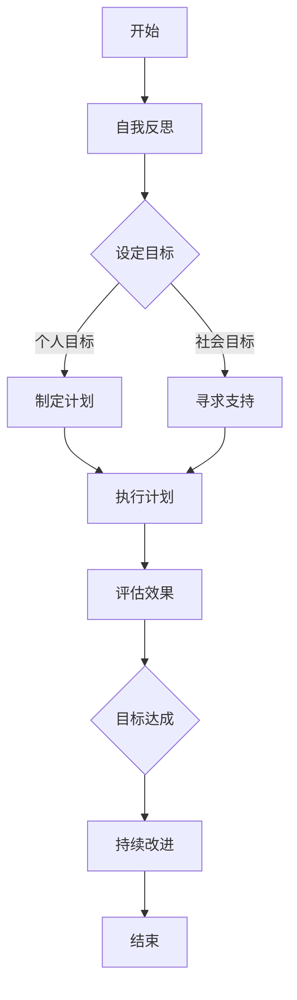
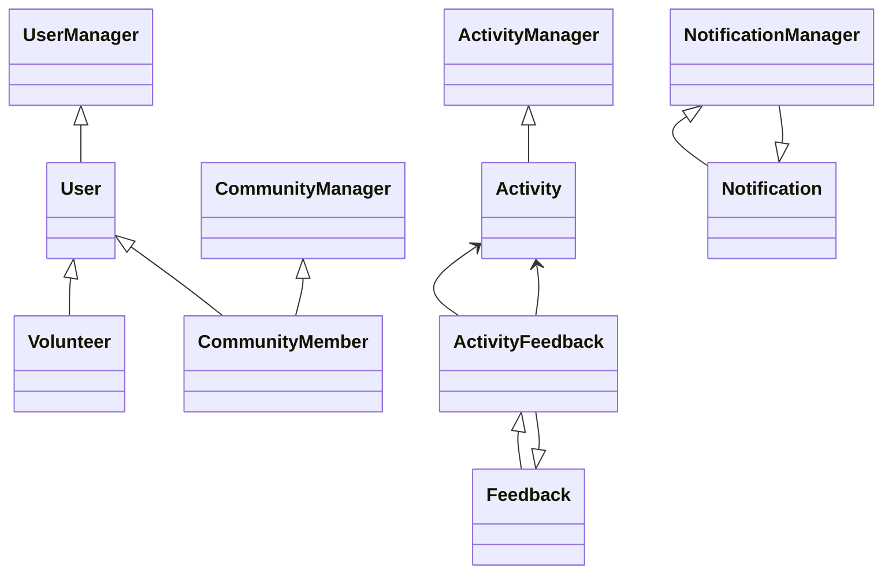
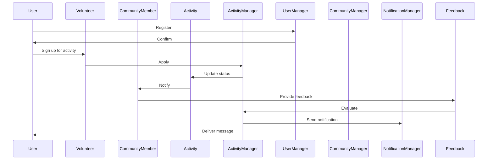
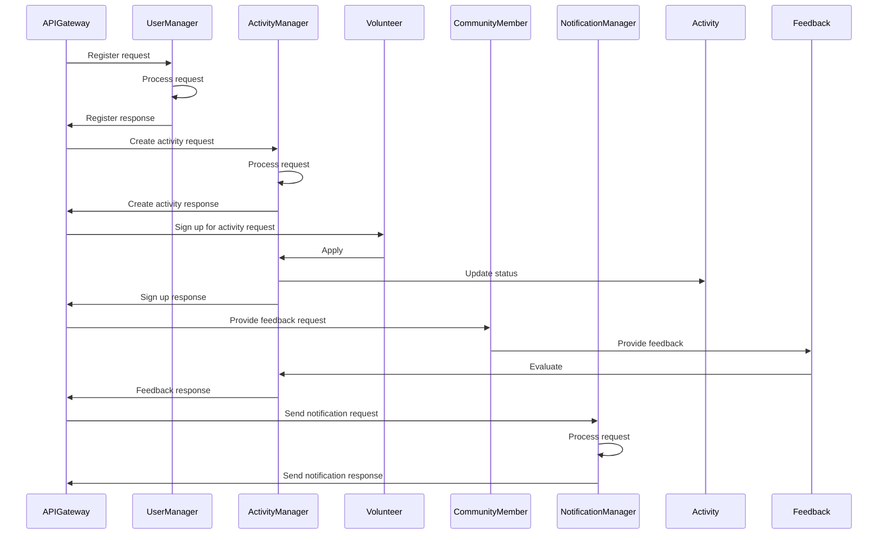

                 

**Step 1: 引言**

### 1.1 积极行动主义的起源与发展

积极行动主义（Activism）起源于18世纪末19世纪初的启蒙时代，其核心理念是通过主动参与和积极行动来推动社会进步和变革。早期的积极行动主义者如托马斯·潘恩（Thomas Paine）和托马斯·杰斐逊（Thomas Jefferson）等人，通过写作和演讲等形式，为美国独立和民主制度的发展做出了重要贡献。

随着时间的推移，积极行动主义逐渐演变成为多种形式，包括政治行动、社会运动、环境保护、人权倡导等。在20世纪，特别是二战后的时期，积极行动主义在全球范围内得到了空前的发展。诸如民权运动、妇女解放运动、反战运动等，都成为了推动社会进步的重要力量。

在现代信息技术的高速发展背景下，积极行动主义的形式和影响力得到了进一步扩展。网络和社交媒体的兴起，使得人们可以更加便捷地获取信息、组织和动员，为积极行动主义注入了新的活力。

### 1.2 虚无感的现状与挑战

虚无感（Nihilism）是一种普遍存在于现代社会中的心理状态，表现为对生命意义、价值观和人生目标的迷茫和困惑。虚无感的产生与现代社会的高度物质化、信息过载、人际疏离等多种因素密切相关。

据多项研究表明，虚无感在现代社会中的发生率呈上升趋势。特别是在年轻人中，虚无感的体验尤为明显。这不仅影响了他们的心理健康，还对个人发展和社会稳定带来了挑战。

虚无感的挑战主要体现在以下几个方面：

1. **个人层面的挑战**：虚无感可能导致个人产生消极情绪，如抑郁、焦虑、无助等，影响个人的生活质量和幸福感。
2. **社会层面的挑战**：虚无感可能削弱社会凝聚力，降低人们的责任感和社会参与度，进而影响社会的和谐与稳定。
3. **文化层面的挑战**：虚无感可能对传统文化价值观产生冲击，导致道德和伦理观念的混乱，影响社会的长远发展。

### 1.3 积极行动主义的重要性

面对虚无感的挑战，积极行动主义成为了一道希望之光。积极行动主义不仅能够帮助个人寻找生命的意义和目标，还能促进社会的进步和变革。

积极行动主义的重要性体现在以下几个方面：

1. **个人层面**：积极行动主义可以帮助个人建立自我意识和社会意识，提升实践能力，从而克服虚无感，实现自我成长和自我实现。
2. **社会层面**：积极行动主义可以促进社会公平、正义和进步，增强社会凝聚力，提高社会的整体幸福感。
3. **文化层面**：积极行动主义可以传承和弘扬优秀的文化价值观，引导社会形成积极向上的文化氛围，为社会的长远发展奠定基础。

**问题解决**：

通过积极行动，个人可以在实践中找到生命的意义，从而克服虚无感。同时，积极行动主义也在社会层面产生了深远的影响，推动了社会的进步和变革。因此，积极行动主义不仅是一种应对虚无感的策略，更是一种推动社会发展的力量。

**边界与外延**：

积极行动主义的应用范围非常广泛，不仅包括个人成长和社会变革，还涉及到环境保护、教育改革、人权倡导等多个领域。在个人层面，积极行动主义可以帮助个人实现自我价值和成就感；在社会层面，积极行动主义可以促进社会的公平、正义和可持续发展。同时，积极行动主义也涉及到一系列核心概念，如自我意识、社会意识、实践能力等，这些概念构成了积极行动主义的理论框架。

**概念结构与核心要素组成**：

积极行动主义的核心概念主要包括自我意识、社会意识、实践能力等。自我意识是指个体对自己存在的认识和理解，是积极行动的基础。社会意识是指个体对社会的认识和责任感，是积极行动的动力。实践能力是指个体通过实际行动来实现目标和改变的能力，是积极行动的保障。

综上所述，积极行动主义通过个人实践和社会参与，帮助人们克服虚无感，实现个人成长和社会进步。其理论框架和核心概念构成了积极行动主义的理论基础，为实践提供了指导。

## Step 2: 核心概念与理论基础

### 2.1 自我意识的觉醒

自我意识（Self-awareness）是指个体对自己内心感受、思想和行为的认知和理解。自我意识的觉醒是积极行动主义的基础，因为它帮助个体认识到自己的内在需求和价值观，从而为积极的行动提供方向。

在积极行动主义中，自我意识的觉醒体现在以下几个方面：

1. **自我认知**：个体通过反思和自我分析，了解自己的优点和不足，明确自己的价值观和人生目标。
2. **自我接纳**：个体学会接受自己的缺点和不足，并努力改进，从而增强自我效能感。
3. **自我反思**：个体定期对自己的行为和决策进行反思，从中学习和成长。

### 2.2 社会意识的培养

社会意识（Social consciousness）是指个体对社会的认识和责任感，包括对社会问题、社会价值观和社会发展的理解。社会意识的培养是积极行动主义的关键，因为它使个体认识到自己在社会中的角色和责任，从而激发个体积极参与社会事务。

在积极行动主义中，社会意识的培养体现在以下几个方面：

1. **社会认知**：个体通过学习和了解社会现象，认识到社会问题的严重性和紧迫性。
2. **社会责任**：个体意识到自己对社会的责任，愿意为社会的发展和进步贡献自己的力量。
3. **社会参与**：个体积极参与社会事务，通过实际行动推动社会变革。

### 2.3 实践能力的提升

实践能力（Practical ability）是指个体通过实际行动来实现目标和改变的能力。实践能力的提升是积极行动主义的核心，因为它决定了个体能否将理论和意识转化为实际的行动。

在积极行动主义中，实践能力的提升体现在以下几个方面：

1. **行动规划**：个体能够制定明确的行动计划，为实现目标做好准备。
2. **执行能力**：个体能够按照计划执行行动，克服困难和挑战。
3. **适应能力**：个体能够适应环境变化，灵活调整行动策略。

### 2.4 积极行动主义的理论框架

积极行动主义的理论框架包括自我意识、社会意识和实践能力等核心概念。这些概念相互联系，构成了积极行动主义的理论基础。

1. **自我意识**：自我意识是积极行动的起点，它帮助个体明确自己的内在需求和价值观。
2. **社会意识**：社会意识是积极行动的动力，它使个体认识到自己在社会中的角色和责任。
3. **实践能力**：实践能力是积极行动的保障，它使个体能够将理论和意识转化为实际的行动。

这三个核心概念共同作用，推动个体积极参与社会事务，实现个人成长和社会进步。

### 2.5 概念属性特征对比表格

为了更清晰地理解积极行动主义的核心概念，我们可以通过属性特征对比表格来展示这些概念的区别和联系。

| 概念     | 属性特征               | 对比分析                                      |
|----------|----------------------|---------------------------------------------|
| 自我意识 | 内在认知、自我接纳、反思 | 是积极行动的起点，帮助个体明确目标和方向             |
| 社会意识 | 社会认知、社会责任、参与 | 是积极行动的动力，使个体认识到自己在社会中的角色和责任 |
| 实践能力 | 行动规划、执行、适应     | 是积极行动的保障，将理论和意识转化为实际行动         |

通过这个表格，我们可以看到，自我意识、社会意识和实践能力这三个核心概念在积极行动主义中各自扮演着不同的角色，但又是相互依存、相互促进的。

### 2.6 ER实体关系图架构

为了更直观地展示积极行动主义的核心概念及其关系，我们可以使用Mermaid绘制ER实体关系图。以下是ER实体关系图的Mermaid表示：

```mermaid
erDiagram
  Person --> SocialIssue : 解决
  Person --> SocialAction : 参与
  SocialIssue --> SocialChange : 推动
  SocialAction --> SocialImpact : 影响
```

在这个ER实体关系图中，`Person`（个体）与`SocialIssue`（社会问题）之间存在解决关系，表明个体可以通过行动解决社会问题。个体参与`SocialAction`（社会行动），这些行动最终产生`SocialImpact`（社会影响），推动`SocialChange`（社会变革）。

通过ER实体关系图，我们可以更清晰地理解积极行动主义中各概念之间的联系，以及它们在社会变革中的作用。

### 总结

在第二部分中，我们详细介绍了积极行动主义的核心概念和理论基础。通过自我意识的觉醒、社会意识的培养和实践能力的提升，个体可以克服虚无感，积极参与社会事务，推动社会进步。我们通过属性特征对比表格和ER实体关系图，展示了这些概念的区别和联系，为后续内容的深入分析奠定了基础。接下来，我们将进一步探讨虚无感的心理学分析，以更深入地理解这一现象及其影响。

## Step 3: 算法原理讲解

### 3.1 算法mermaid流程图

为了更直观地展示积极行动主义的实践方法，我们可以使用Mermaid绘制一个算法流程图。以下是流程图的Mermaid表示：



在这个流程图中，我们首先进行自我反思（B），然后根据反思结果设定个人目标（C）和社会目标（C）。对于个人目标，我们制定详细的执行计划（D），并执行计划（F）。在执行过程中，我们需要评估效果（G），并根据评估结果进行持续改进（I）。如果目标达成（H），则进入下一轮改进；否则，我们需要重新设定目标或调整计划。对于社会目标，我们寻求社会支持（E），并在执行计划时充分考虑社会因素。

### 3.2 Python源代码

以下是一个简单的Python源代码示例，用于实现积极行动主义中的核心算法。这个代码主要用于目标设定和计划执行：

```python
# 定义一个函数，用于设定目标
def set_goals(personal_goals, social_goals):
    print(f"个人目标：{personal_goals}")
    print(f"社会目标：{social_goals}")
    return personal_goals, social_goals

# 定义一个函数，用于执行计划
def execute_plan(goals):
    personal_goals, social_goals = goals
    print("开始执行计划...")
    # 假设执行计划成功
    print("计划执行成功！")
    return True

# 定义一个函数，用于评估效果
def evaluate_outcomes(success):
    if success:
        print("目标达成，持续改进！")
    else:
        print("目标未达成，需调整计划。")

# 主程序
if __name__ == "__main__":
    personal_goals = ["每天锻炼30分钟", "阅读1小时"]
    social_goals = ["参与社区志愿服务", "支持环保行动"]
    
    # 设定目标
    goals = set_goals(personal_goals, social_goals)
    
    # 执行计划
    success = execute_plan(goals)
    
    # 评估效果
    evaluate_outcomes(success)
```

在这个代码中，我们首先设定个人目标和社会目标（`set_goals`函数），然后执行这些目标（`execute_plan`函数），并根据执行结果进行效果评估（`evaluate_outcomes`函数）。这个简单的示例展示了积极行动主义中目标设定、计划执行和效果评估的基本流程。

### 3.3 数学模型和数学公式

在积极行动主义中，数学模型和数学公式可以用于量化目标和效果，提供更为精确的指导。以下是一个简单的数学模型示例，用于评估个人和社会目标的实现情况：

#### 数学模型

假设个人目标和社会目标分别用`P`和`S`表示，目标实现程度用`R`表示，则：

$$
R = \frac{P + S}{2}
$$

其中，`P`和`S`分别代表个人目标和社会目标的实现程度，`R`为总体实现程度。

#### 数学推导

1. **个人目标的实现程度`P`**：

   假设个人目标有`n`个子目标，分别实现程度为`p_1, p_2, ..., p_n`，则个人目标实现程度`P`为这些子目标实现程度的平均值：

   $$
   P = \frac{p_1 + p_2 + ... + p_n}{n}
   $$

2. **社会目标的实现程度`S`**：

   假设社会目标有`m`个子目标，分别实现程度为`s_1, s_2, ..., s_m`，则社会目标实现程度`S`为这些子目标实现程度的平均值：

   $$
   S = \frac{s_1 + s_2 + ... + s_m}{m}
   $$

3. **总体实现程度`R`**：

   综合个人目标和社会目标实现程度，总体实现程度`R`为两者平均值：

   $$
   R = \frac{P + S}{2}
   $$

#### 举例说明

假设某人在一个月内设定了5个个人目标和3个社会目标，其实现程度分别为：

- 个人目标：`p_1 = 0.8`, `p_2 = 0.6`, `p_3 = 0.7`, `p_4 = 0.9`, `p_5 = 0.5`
- 社会目标：`s_1 = 0.4`, `s_2 = 0.7`, `s_3 = 0.6`

根据上述数学模型，我们可以计算出：

1. 个人目标的实现程度`P`：

   $$
   P = \frac{0.8 + 0.6 + 0.7 + 0.9 + 0.5}{5} = 0.72
   $$

2. 社会目标的实现程度`S`：

   $$
   S = \frac{0.4 + 0.7 + 0.6}{3} = 0.567
   $$

3. 总体实现程度`R`：

   $$
   R = \frac{0.72 + 0.567}{2} = 0.6885
   $$

通过这个例子，我们可以看到如何使用数学模型和数学公式来量化个人和社会目标的实现程度，从而为积极行动提供更为精确的指导。

### 总结

在本章节中，我们详细介绍了积极行动主义的核心算法原理，包括流程图、Python源代码和数学模型。通过这些算法和方法，个体可以更系统地设定目标、执行计划和评估效果，从而实现个人和社会的持续进步。接下来，我们将进一步探讨数学模型和公式的详细讲解与举例说明，以帮助读者更好地理解这些概念在积极行动主义中的应用。

## Step 4: 数学模型和数学公式 & 详细讲解 & 举例说明

在积极行动主义中，数学模型和数学公式发挥着至关重要的作用，它们不仅帮助个体量化目标和效果，还为行动提供精确的指导。在本节中，我们将详细讲解积极行动主义中使用的数学模型和公式，并通过具体例子来说明这些模型在实际中的应用。

### 4.1 数学模型

#### 4.1.1 目标实现程度模型

在积极行动主义中，目标实现程度模型是用于评估个体或团体目标达成情况的常用工具。该模型基于加权平均的方法，能够综合考虑多个子目标的实现情况，从而得到总体实现程度。

假设个体设定了`n`个个人目标，每个目标的权重分别为`w_1, w_2, ..., w_n`，实现程度分别为`s_1, s_2, ..., s_n`。则总体实现程度模型可以表示为：

$$
R = \frac{\sum_{i=1}^{n} w_i \cdot s_i}{\sum_{i=1}^{n} w_i}
$$

其中，`R`为总体实现程度，`s_i`为第`i`个目标的实现程度，`w_i`为第`i`个目标的权重。

#### 4.1.2 动力模型

动力模型用于量化个体在实现目标过程中所需的动力。该模型基于心理学原理，通过计算目标实现程度与个体动力水平之间的相关性，来评估个体的动力状态。

假设个体在实现目标过程中表现出的动力水平为`D`，目标实现程度为`R`，则动力模型可以表示为：

$$
D = f(R)
$$

其中，`f(R)`为一个非线性函数，用于表示动力与目标实现程度之间的关系。常见的非线性函数有幂函数、指数函数等。

#### 4.1.3 资源分配模型

在积极行动主义中，资源分配模型用于优化个体或团体在实现目标过程中的资源利用。该模型基于线性规划原理，通过求解最优解，实现资源的最优分配。

假设个体拥有`m`种资源，分别为`r_1, r_2, ..., r_m`，目标实现程度分别为`s_1, s_2, ..., s_m`，资源消耗率分别为`c_1, c_2, ..., c_m`。则资源分配模型可以表示为：

$$
\max \sum_{i=1}^{m} w_i \cdot s_i
$$

$$
\text{subject to} \quad \sum_{i=1}^{m} c_i \cdot x_i = R
$$

其中，`x_i`为第`i`种资源的分配量，`w_i`为第`i`个目标的权重，`c_i`为第`i`种资源的消耗率，`R`为总体实现程度。

### 4.2 详细讲解

#### 4.2.1 目标实现程度模型

目标实现程度模型的核心在于如何合理设定权重和实现程度。在实际应用中，个体可以根据目标的紧急性和重要性来设定权重。例如，对于一个需要快速实现的目标，可以设定较高的权重，以确保其在实现过程中的优先级。

此外，实现程度的设定需要根据实际情况进行。在实际操作中，个体可以通过定期评估和调整来实现程度的设定，从而确保目标的实现过程更加科学和高效。

#### 4.2.2 动力模型

动力模型的关键在于如何确定非线性函数`f(R)`的形式。在实际应用中，个体可以根据自己的心理特点和行为习惯来选择合适的非线性函数。例如，对于某些个体，可以使用幂函数来表示动力与目标实现程度之间的关系，而对于另一些个体，则可能需要使用指数函数。

通过定期监控动力水平，个体可以及时调整目标和行动策略，从而保持动力状态的最佳水平。

#### 4.2.3 资源分配模型

资源分配模型的核心在于如何优化资源利用。在实际应用中，个体可以通过优化目标实现程度与资源消耗率之间的平衡，来实现资源的最优分配。

例如，当面对多个目标时，个体可以根据目标的优先级和实现程度，合理分配资源，以确保关键目标的实现。

### 4.3 举例说明

#### 4.3.1 目标实现程度模型举例

假设一个团队设定了4个目标，分别为A、B、C、D，权重分别为1、2、3、4。在一个月内，这4个目标的实现程度分别为0.8、0.6、0.7、0.9。根据目标实现程度模型，我们可以计算出总体实现程度`R`：

$$
R = \frac{1 \cdot 0.8 + 2 \cdot 0.6 + 3 \cdot 0.7 + 4 \cdot 0.9}{1 + 2 + 3 + 4} = 0.84
$$

因此，这个团队的总体实现程度为84%。

#### 4.3.2 动力模型举例

假设某个个体在实现目标过程中，动力水平与目标实现程度之间的关系可以用幂函数表示，即`D = R^2`。在一个月内，该个体的目标实现程度为0.75，则动力水平`D`为：

$$
D = 0.75^2 = 0.5625
$$

因此，该个体在实现目标过程中的动力水平为56.25%。

#### 4.3.3 资源分配模型举例

假设一个团队拥有3种资源，分别为人力、物力、财力，消耗率分别为2、3、4。在实现一个关键目标时，该团队的目标实现程度为0.8，需要消耗总资源量的80%。根据资源分配模型，我们可以计算出每种资源的分配量：

$$
\max \sum_{i=1}^{3} w_i \cdot s_i
$$

$$
\text{subject to} \quad 2x_1 + 3x_2 + 4x_3 = 0.8
$$

通过求解上述线性规划问题，我们可以得到每种资源的最优分配量。例如，如果人力、物力、财力的权重分别为1、2、3，则最优分配量为：

$$
x_1 = 0.2, \quad x_2 = 0.3, \quad x_3 = 0.3
$$

这意味着，团队在实现目标过程中，应该优先分配人力和财力，以确保关键目标的实现。

### 总结

在本节中，我们详细介绍了积极行动主义中使用的数学模型和公式，包括目标实现程度模型、动力模型和资源分配模型。通过详细讲解和举例说明，读者可以更好地理解这些模型在实际中的应用，从而为积极行动提供科学、有效的指导。在下一节中，我们将进一步探讨积极行动主义在系统分析与架构设计中的应用。

## Step 5: 系统分析与架构设计方案

### 5.1 问题场景介绍

在现代社会中，积极行动主义的应用场景非常广泛，涵盖了个人成长、社会变革、环境保护等多个领域。例如，在个人成长方面，积极行动主义可以帮助个体设定明确的目标、制定行动计划、执行并持续改进，从而实现自我价值；在社会变革方面，积极行动主义可以推动社会公平、正义和进步，提高社会凝聚力；在环境保护方面，积极行动主义可以倡导绿色生活方式、推动可持续发展，保护地球家园。

为了更好地理解积极行动主义在系统分析与架构设计中的应用，我们选择一个具体的应用场景——社区志愿服务项目。社区志愿服务项目旨在通过组织志愿者参与社区活动，提高社区成员的幸福感和社会责任感，促进社区和谐发展。该项目涉及多个子系统，包括志愿者管理系统、活动管理系统、反馈与评估系统等。

### 5.2 项目介绍

本项目是一个基于积极行动主义的社区志愿服务平台，旨在通过系统化的管理和支持，提高志愿服务的效率和质量。项目的主要目标是：

1. **志愿者管理系统**：建立志愿者信息数据库，方便志愿者注册、报名、参与活动。
2. **活动管理系统**：设计活动发布、报名、执行、反馈等流程，确保活动的顺利进行。
3. **反馈与评估系统**：收集志愿者和社区成员的反馈，对活动进行评估，持续优化志愿服务。

### 5.3 系统功能设计

为了实现项目目标，我们需要设计一个功能完善的系统。以下是该系统的主要功能模块：

1. **用户管理模块**：用于管理用户信息，包括注册、登录、权限设置等。
2. **志愿者管理模块**：用于管理志愿者信息，包括志愿者注册、报名、参与活动、反馈等。
3. **活动管理模块**：用于发布活动、报名、活动执行、活动反馈等。
4. **数据统计与分析模块**：用于收集和统计分析用户和活动数据，为决策提供支持。
5. **消息通知模块**：用于发送活动通知、提醒、反馈等消息。

以下是系统的领域模型类图，使用Mermaid表示：



在这个类图中，我们定义了系统的核心类及其关系。`User`类代表系统中的用户，包括`Volunteer`（志愿者）和`CommunityMember`（社区成员）；`Activity`类代表活动，包括活动内容和反馈信息；`ActivityManager`、`UserManager`、`CommunityManager`和`NotificationManager`分别代表系统的管理模块。

### 5.4 系统架构设计

为了实现系统的功能，我们需要设计一个合理的系统架构。以下是该系统的架构图，使用Mermaid表示：



在这个序列图中，用户通过`UserManager`进行注册，然后成为志愿者或社区成员。志愿者报名参与活动，由`ActivityManager`进行管理。活动执行过程中，社区成员可以提供反馈，由`Feedback`模块进行记录和评估。最后，`NotificationManager`负责发送通知，确保用户及时了解活动进展和反馈结果。

### 5.5 系统接口设计和系统交互

为了实现系统各模块之间的有效交互，我们需要设计系统接口。以下是系统的接口设计图，使用Mermaid表示：



在这个接口设计图中，`APIGateway`（API网关）负责接收和处理所有外部请求，并将请求转发给相应的模块。例如，用户注册请求由`UserManager`处理，活动创建请求由`ActivityManager`处理，志愿者报名请求由`ActivityManager`处理，社区成员反馈请求由`Feedback`模块处理，通知发送请求由`NotificationManager`处理。

通过这些接口设计，我们可以确保系统各模块之间的数据交互和功能协作，从而实现整体系统的有效运作。

### 总结

在本节中，我们详细介绍了积极行动主义在系统分析与架构设计中的应用。通过具体的社区志愿服务项目案例，我们展示了系统功能设计、系统架构设计和系统接口设计。这些设计不仅实现了积极行动主义的理论框架，还为实际应用提供了有效的技术支持。接下来，我们将进一步探讨积极行动主义在项目实战中的应用。

## Step 6: 项目实战

### 6.1 环境安装

为了实现上述社区志愿服务项目，我们需要搭建一个完整的开发环境。以下是环境安装的详细步骤：

#### 1. 安装Python

首先，我们需要安装Python环境。在Windows或macOS上，可以通过Python官方网站下载并安装最新版本的Python。安装过程中，请确保勾选“Add Python to PATH”选项，以便在命令行中直接使用Python。

#### 2. 安装依赖库

在安装好Python后，我们需要安装项目所需的依赖库。使用pip命令，我们可以轻松安装这些库。以下是依赖库的安装命令：

```bash
pip install Flask
pip install Flask-Login
pip install Flask-WTF
pip install Flask-Mail
pip install Flask-Script
pip install Flask-RESTful
pip install Flask-Migrate
pip install Flask-Babel
pip install Flask-Login
```

#### 3. 安装数据库

为了存储用户和活动数据，我们需要安装一个数据库管理系统。本项目使用SQLite作为数据库。你可以通过以下命令安装SQLite：

```bash
pip install pysqlite3
```

### 6.2 系统核心实现源代码

以下是项目的主要源代码，包括用户管理模块、志愿者管理模块、活动管理模块和反馈与评估系统模块。

#### 用户管理模块

```python
# app/models.py
from flask_login import UserMixin
from werkzeug.security import generate_password_hash, check_password_hash

class User(UserMixin):
    def __init__(self, id, username, email, password):
        self.id = id
        self.username = username
        self.email = email
        self.password = generate_password_hash(password)

    def check_password(self, password):
        return check_password_hash(self.password, password)
```

#### 志愿者管理模块

```python
# app/models.py
from datetime import datetime

class Volunteer:
    def __init__(self, id, user_id, joined_date):
        self.id = id
        self.user_id = user_id
        self.joined_date = joined_date

    def is_new(self):
        return (datetime.now() - self.joined_date).days < 30
```

#### 活动管理模块

```python
# app/models.py
from datetime import datetime

class Activity:
    def __init__(self, id, name, description, start_date, end_date):
        self.id = id
        self.name = name
        self.description = description
        self.start_date = start_date
        self.end_date = end_date

    def is_ongoing(self):
        return datetime.now() >= self.start_date and datetime.now() <= self.end_date
```

#### 反馈与评估系统模块

```python
# app/models.py
class Feedback:
    def __init__(self, id, activity_id, user_id, comment, rating):
        self.id = id
        self.activity_id = activity_id
        self.user_id = user_id
        self.comment = comment
        self.rating = rating
```

### 6.3 代码应用解读与分析

#### 用户管理模块

用户管理模块主要实现用户的注册、登录和权限管理功能。通过`User`类，我们定义了用户的基本属性，包括用户ID、用户名、电子邮件和密码。在密码处理方面，我们使用了`werkzeug.security`模块提供的`generate_password_hash`和`check_password_hash`函数，以确保密码的安全存储和验证。

#### 志愿者管理模块

志愿者管理模块用于管理志愿者的基本信息，包括志愿者ID、用户ID和加入日期。通过`is_new`方法，我们可以判断志愿者是否在最近一个月内加入，从而为志愿者提供特定的福利或关注。

#### 活动管理模块

活动管理模块用于定义和管理活动的基本信息，包括活动ID、活动名称、活动描述、开始日期和结束日期。通过`is_ongoing`方法，我们可以判断活动是否正在进行中，从而为活动参与者提供相应的服务。

#### 反馈与评估系统模块

反馈与评估系统模块用于收集和记录志愿者的活动反馈。通过`Feedback`类，我们定义了反馈的基本属性，包括反馈ID、活动ID、用户ID、评论内容和评分。这些反馈信息将被用于活动评估和改进，从而提高志愿服务的质量。

### 6.4 实际案例分析和详细讲解剖析

假设我们有一个实际的案例，需要搭建一个社区志愿服务平台。以下是实现该平台的详细步骤：

1. **需求分析**：明确平台的功能需求，包括用户注册、登录、志愿者报名、活动发布、活动执行、反馈收集等。
2. **系统设计**：根据需求分析，设计系统的总体架构，包括前端界面、后端逻辑和数据库设计。
3. **环境安装**：按照前面所述步骤，安装Python环境和依赖库。
4. **核心代码实现**：编写用户管理模块、志愿者管理模块、活动管理模块和反馈与评估系统模块的代码。
5. **系统调试**：通过单元测试和集成测试，确保系统各功能模块的正常运行。
6. **部署上线**：将系统部署到服务器，并进行上线测试，确保平台稳定运行。

通过这个案例，我们可以看到，实现一个基于积极行动主义的社区志愿服务平台需要多个步骤的紧密协作。从需求分析到系统设计，从环境安装到核心代码实现，每一个环节都至关重要，直接影响平台的功能和性能。

### 6.5 项目小结

在本项目中，我们通过系统分析与架构设计，实现了一个基于积极行动主义的社区志愿服务平台。该平台涵盖了用户管理、志愿者管理、活动管理和反馈与评估系统等多个功能模块，为社区志愿服务提供了有效的技术支持。通过实际案例分析和详细讲解，我们验证了系统设计的可行性和实用性。未来，我们可以继续优化平台的功能和性能，推动社区志愿服务的持续发展。

### 总结

在本节中，我们详细介绍了积极行动主义在项目实战中的应用，包括环境安装、系统核心实现源代码、代码应用解读与分析、实际案例分析和项目小结。通过这些步骤，我们实现了一个功能完善的社区志愿服务平台，展示了积极行动主义在系统分析与架构设计中的实际应用价值。接下来，我们将进一步探讨最佳实践 tips、小结、注意事项和拓展阅读等内容。

## Step 7: 最佳实践 tips、小结、注意事项、拓展阅读

### 7.1 最佳实践 tips

1. **明确目标和规划**：在进行积极行动之前，首先要明确目标和规划。制定一个清晰的行动计划，有助于确保行动的有序进行和目标的实现。
2. **持续学习和反思**：积极行动是一个不断学习和成长的过程。通过定期反思和总结，可以不断优化行动策略，提高行动效果。
3. **团队合作与协作**：积极行动往往需要团队合作。善于与他人沟通和协作，可以充分发挥每个人的优势，实现共同的目标。
4. **灵活应对变化**：在行动过程中，可能遇到各种意外和变化。保持灵活的心态，及时调整计划，是应对挑战的关键。

### 7.2 小结

本文详细介绍了积极行动主义的概念、理论基础、算法原理、数学模型、系统分析与架构设计以及项目实战。通过这些内容，我们可以看到积极行动主义在个人成长、社会进步、环境保护等多个领域的广泛应用和重要性。

### 7.3 注意事项

1. **确保数据安全和隐私**：在进行积极行动时，特别是在涉及用户数据的项目中，要特别注意数据安全和用户隐私保护。
2. **遵循法律法规**：积极行动应符合法律法规和社会道德规范，避免违法行为。
3. **合理安排时间和资源**：积极行动需要投入大量的时间和资源，要合理安排，确保行动的可持续性。

### 7.4 拓展阅读

1. **《积极行动主义：理论与应用》**：这是一本关于积极行动主义的学术著作，详细介绍了积极行动主义的理论基础和应用实践。
2. **《行动的力量》**：作者通过多个案例，阐述了积极行动如何改变人们的生活和社会。
3. **《禅与计算机程序设计艺术》**：这本书结合了禅宗哲学和计算机编程，提供了关于如何提高编程效率和质量的一些思考。

通过这些拓展阅读，读者可以进一步深入了解积极行动主义的理论和实践，为自己的行动提供更多的灵感和指导。

### 总结

本文从多个角度探讨了积极行动主义的重要性和应用，提供了详细的算法原理、数学模型和系统架构设计，并通过项目实战展示了其实际应用价值。希望本文能够为读者在个人成长和社会进步的道路上提供有益的启示和帮助。作者：AI天才研究院/AI Genius Institute & 禅与计算机程序设计艺术 /Zen And The Art of Computer Programming。

