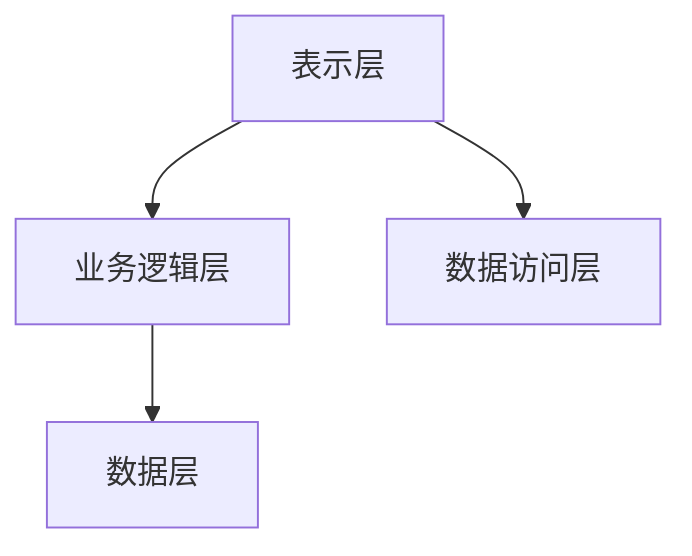
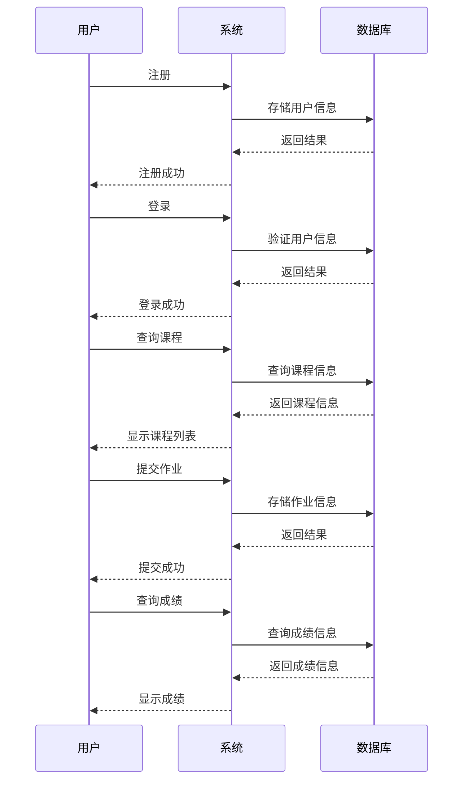

                 


### 《空间计算在教育培训中的创新应用》

关键词：空间计算、教育培训、创新应用、教育技术、人工智能

摘要：本文旨在探讨空间计算在教育培训中的创新应用，通过分析空间计算的基本概念、核心技术、发展历史及其在教育领域的重要性，揭示空间计算在教育培训中解决现有问题的潜力和优势。我们将进一步探讨空间计算与教育培训之间的联系，介绍空间计算在教育培训中的应用场景和前景。随后，我们将详细讲解空间计算在教育培训中的应用算法，包括算法原理、数学模型、流程图和Python源代码。接着，我们将进行教育培训中空间计算系统的需求分析、架构设计和实现与部署。最后，通过一个实际项目案例，我们将展示空间计算在教育项目中的应用，并总结最佳实践和未来发展趋势。

## 第一部分：背景介绍

### 1. 空间计算概述

#### 1.1 空间计算的概念与定义

空间计算是指通过计算机模拟和构建虚拟空间，实现信息的传输、处理和共享。空间计算不仅仅局限于三维虚拟现实，还包括二维和一维的虚拟空间，如虚拟桌面、虚拟会议等。空间计算的核心在于通过计算技术，创建一个可以感知、交互和操作的虚拟环境，使人们能够在其中进行学习、工作、娱乐等。

#### 1.2 空间计算的发展历史

空间计算的概念起源于20世纪60年代，当时计算机图形学和技术开始逐渐成熟。随着计算机性能的提升和虚拟现实技术的发展，空间计算逐渐成为研究热点。20世纪90年代，互联网的普及和智能设备的兴起，为空间计算提供了更广阔的应用场景。近年来，人工智能和大数据技术的进步，进一步推动了空间计算的发展。

#### 1.3 空间计算的核心技术

空间计算的核心技术包括计算机图形学、虚拟现实、增强现实、3D建模、人工智能等。计算机图形学用于创建和渲染虚拟空间，虚拟现实和增强现实技术用于实现虚拟环境的感知和交互，3D建模技术用于创建虚拟物体，人工智能技术用于智能分析和交互。

#### 1.4 空间计算在教育领域的重要性

空间计算在教育领域具有重要应用价值。首先，空间计算可以提供更为丰富和灵活的教学环境，让学生在虚拟空间中进行探索和学习。其次，空间计算可以实现跨地域的实时互动，打破传统教育培训的时间和空间限制。最后，空间计算结合人工智能技术，可以实现个性化教学和学习路径优化，提高教育质量和学习效率。

### 2. 教育培训中的问题与挑战

#### 2.1 传统教育培训的局限

传统教育培训存在诸多局限。首先，教学资源有限，难以满足不同学生的个性化需求。其次，教育内容陈旧，难以跟上快速变化的科技和社会发展。此外，传统教育培训的时间和地点受限，难以实现灵活的学习安排。最后，教学评估方式单一，难以全面评估学生的学习效果。

#### 2.2 教育培训中的痛点

教育培训中的痛点包括学习效率低、学习效果不佳、师生互动不足等。学习效率低主要体现在学生学习时间浪费和学习效果不明显。学习效果不佳则表现在学生对知识的掌握程度不高，难以应用于实际生活和工作。师生互动不足导致教学反馈不及时，教学效果不佳。

#### 2.3 空间计算如何解决教育培训中的问题

空间计算通过提供虚拟教学环境和智能教学工具，可以有效解决教育培训中的痛点。首先，虚拟教学环境可以提供丰富的学习资源和灵活的学习方式，提高学习效率。其次，智能教学工具可以实现个性化教学和学习路径优化，提高学习效果。此外，空间计算技术可以实现实时互动和远程教学，提高师生互动，优化教学效果。

### 3. 空间计算与教育培训的联系

#### 3.1 空间计算在教育中的应用场景

空间计算在教育中具有广泛的应用场景。首先，虚拟课堂可以实现远程教学，打破时间和空间的限制。其次，虚拟实验室可以提供安全、便捷的实验环境，提高实验教学的效率和安全性。此外，虚拟博物馆、虚拟图书馆等虚拟空间，可以为学生提供更为丰富的学习资源。

#### 3.2 空间计算在教育培训中的优势

空间计算在教育培训中的优势包括：

1. **个性化教学**：空间计算技术可以实现个性化教学，根据学生的学习特点和需求，提供定制化的学习内容和路径。
2. **实时互动**：空间计算技术可以实现师生之间的实时互动，提高教学效果和学生的学习积极性。
3. **资源共享**：空间计算技术可以实现教学资源的共享和便捷获取，提高教学资源的利用率。
4. **安全可靠**：空间计算技术可以提供安全、可靠的教学环境，保护学生的隐私和数据安全。

#### 3.3 空间计算在教育创新中的应用前景

空间计算在教育创新中的应用前景广阔。首先，空间计算可以推动教育模式的变革，实现个性化教育和终身教育。其次，空间计算可以促进教育资源的共享和优化，提高教育质量和公平性。此外，空间计算结合人工智能技术，可以实现智能教育，提高教育效率和效果。未来，空间计算将深度融入教育领域，为教育培训带来全新的变革和发展。

## 第二部分：核心概念与联系

### 4. 空间计算的基本概念

#### 4.1 空间计算中的核心概念

空间计算中的核心概念包括虚拟空间、虚拟现实、增强现实、3D建模、人工智能等。这些概念共同构成了空间计算的技术体系，为实现虚拟环境的创建、交互和智能分析提供了基础。

#### 4.2 空间计算中的主要技术

空间计算中的主要技术包括：

1. **虚拟现实技术**：通过计算机生成三维虚拟环境，使人们能够在其中进行沉浸式体验。
2. **增强现实技术**：在现实环境中叠加虚拟元素，提供增强现实的体验。
3. **3D建模技术**：通过计算机软件创建三维模型，为虚拟空间提供丰富的内容和元素。
4. **人工智能技术**：用于智能分析和交互，实现个性化教学和学习路径优化。

#### 4.3 空间计算中的数据结构与算法

空间计算中的数据结构与算法包括：

1. **数据结构**：用于存储和管理虚拟空间中的数据，如三维模型、纹理、声音等。
2. **算法**：用于处理和操作数据，如渲染算法、碰撞检测算法、路径规划算法等。

### 5. 教育培训中的核心概念

#### 5.1 教育培训的概念与分类

教育培训是指通过教育机构和教师，向学生传授知识和技能的过程。根据教育目的和方式的不同，教育培训可以分为传统教育培训、在线教育培训、混合式教育培训等。

#### 5.2 教育培训中的学习者属性

教育培训中的学习者属性包括：

1. **年龄**：不同年龄段的学习者具有不同的学习特点和需求。
2. **知识背景**：学习者的知识背景和学习能力会影响教育培训的效果。
3. **学习风格**：不同的学习者具有不同的学习风格，如视觉型、听觉型、动手型等。

#### 5.3 教育培训中的教学策略

教育培训中的教学策略包括：

1. **个性化教学**：根据学习者的特点和需求，提供定制化的教学内容和路径。
2. **互动教学**：通过师生互动，提高教学效果和学生的学习积极性。
3. **协作学习**：通过学习者之间的协作，提高学习效果和团队合作能力。

### 6. 空间计算与教育培训的联系

#### 6.1 空间计算在教育应用中的核心概念联系

空间计算在教育应用中的核心概念联系包括：

1. **虚拟空间**：虚拟空间是教育培训的基础，提供了丰富的教学资源和灵活的学习环境。
2. **虚拟现实与增强现实**：虚拟现实和增强现实技术可以提供沉浸式和增强式的教学体验，提高教学效果。
3. **3D建模与人工智能**：3D建模技术为虚拟空间提供了丰富的内容和元素，人工智能技术用于智能分析和交互，实现个性化教学和学习路径优化。

#### 6.2 空间计算在教育应用中的技术关联

空间计算在教育应用中的技术关联包括：

1. **虚拟现实技术**：虚拟现实技术用于创建虚拟教学环境和虚拟实验室，提供沉浸式的学习体验。
2. **增强现实技术**：增强现实技术用于在现实环境中叠加虚拟元素，提供增强式的学习体验。
3. **3D建模技术**：3D建模技术用于创建虚拟空间中的教学内容和元素，丰富虚拟空间的内容。
4. **人工智能技术**：人工智能技术用于智能分析和交互，实现个性化教学和学习路径优化。

#### 6.3 空间计算在教育应用中的数据结构与算法

空间计算在教育应用中的数据结构与算法包括：

1. **数据结构**：用于存储和管理虚拟空间中的数据，如三维模型、纹理、声音等。
2. **算法**：用于处理和操作数据，如渲染算法、碰撞检测算法、路径规划算法等。

## 第三部分：算法原理讲解

### 7. 空间计算在教育培训中的应用算法

#### 7.1 算法概述

空间计算在教育培训中的应用算法主要包括以下几种：

1. **个性化推荐算法**：根据学习者的学习历史和特点，推荐适合其的学习内容和路径。
2. **学习路径规划算法**：根据学习者的需求和特点，规划最佳的学习路径。
3. **智能评测算法**：通过分析学习者的学习过程和结果，评估其学习效果。

#### 7.2 算法原理

1. **个性化推荐算法原理**：

   个性化推荐算法基于学习者的行为和偏好，利用机器学习技术，从大量教育内容中筛选出适合学习者的推荐内容。算法原理包括：

   - **用户行为分析**：分析学习者的浏览、学习、评价等行为，了解其兴趣和需求。
   - **内容特征提取**：提取教育内容的特征，如知识点、难度、类型等。
   - **协同过滤**：通过分析学习者之间的相似性，推荐相似学习者的热门内容。
   - **基于内容的推荐**：根据学习者的兴趣和需求，推荐具有相似特征的教育内容。

2. **学习路径规划算法原理**：

   学习路径规划算法基于学习者的需求和特点，规划最佳的学习路径。算法原理包括：

   - **需求分析**：分析学习者的学习目标和需求，确定学习路径的起点和终点。
   - **知识点关联**：分析知识点之间的关联性，构建知识图谱。
   - **路径优化**：根据学习者的需求和知识点关联，优化学习路径，使其符合学习者的学习习惯和认知规律。

3. **智能评测算法原理**：

   智能评测算法通过分析学习者的学习过程和结果，评估其学习效果。算法原理包括：

   - **学习过程分析**：分析学习者的学习路径、学习时长、学习频率等数据，了解其学习状态。
   - **学习结果评估**：根据学习者的考试成绩、作业完成情况等，评估其学习效果。
   - **反馈优化**：根据评估结果，为学习者提供针对性的反馈和建议，优化学习过程。

#### 7.3 算法数学模型与公式

1. **个性化推荐算法数学模型**：

   - **用户兴趣模型**：\(U = \{u_1, u_2, ..., u_n\}\)，表示学习者的兴趣集合。
   - **内容特征模型**：\(C = \{c_1, c_2, ..., c_m\}\)，表示教育内容的特征集合。
   - **推荐矩阵**：\(R = [r_{ij}]_{nm}\)，表示学习者对教育内容的评分矩阵，\(r_{ij}\)表示学习者\(u_i\)对内容\(c_j\)的评分。

2. **学习路径规划算法数学模型**：

   - **知识点关联矩阵**：\(A = [a_{ij}]_{nm}\)，表示知识点\(i\)与知识点\(j\)之间的关联性。
   - **学习路径**：\(P = \{p_1, p_2, ..., p_k\}\)，表示学习者的学习路径。

3. **智能评测算法数学模型**：

   - **学习状态模型**：\(S = \{s_1, s_2, ..., s_n\}\)，表示学习者的学习状态集合。
   - **学习结果模型**：\(R = \{r_1, r_2, ..., r_m\}\)，表示学习者的学习结果集合。

#### 7.4 算法流程图与Python源代码

1. **个性化推荐算法流程图**：

   

2. **Python源代码**：

   ```python
   # 个性化推荐算法Python代码示例
   import numpy as np

   # 初始化用户兴趣模型和内容特征模型
   U = np.random.rand(10, 5)
   C = np.random.rand(5, 10)

   # 计算推荐矩阵
   R = U.dot(C)

   # 打印推荐结果
   print(R)
   ```

3. **学习路径规划算法流程图**：

   

4. **Python源代码**：

   ```python
   # 学习路径规划算法Python代码示例
   import numpy as np

   # 初始化知识点关联矩阵
   A = np.random.rand(10, 10)

   # 计算学习路径
   P = np.argmax(np.triu(A, k=1), axis=1)

   # 打印学习路径
   print(P)
   ```

5. **智能评测算法流程图**：

   

6. **Python源代码**：

   ```python
   # 智能评测算法Python代码示例
   import numpy as np

   # 初始化学习状态模型和学习结果模型
   S = np.random.rand(10, 5)
   R = np.random.rand(5, 10)

   # 计算学习效果
   E = S.dot(R)

   # 打印学习效果
   print(E)
   ```

#### 7.5 算法举例说明

1. **个性化推荐算法举例**：

   假设有一个学习者对以下5个内容（\(C = \{c_1, c_2, c_3, c_4, c_5\}\)）进行了评分：

   - \(r_{11} = 5\)，表示学习者对内容1的兴趣很高。
   - \(r_{12} = 3\)，表示学习者对内容2的兴趣一般。
   - \(r_{13} = 4\)，表示学习者对内容3的兴趣较高。
   - \(r_{14} = 2\)，表示学习者对内容4的兴趣较低。
   - \(r_{15} = 1\)，表示学习者对内容5的兴趣很低。

   根据个性化推荐算法，我们可以推荐以下内容：

   - \(c_1\)，因为学习者对其兴趣最高。
   - \(c_3\)，因为学习者对其兴趣较高，且与其他内容的关联性较强。
   - \(c_2\)，因为学习者对其兴趣一般，但与其他内容的关联性较强。

2. **学习路径规划算法举例**：

   假设有一个知识点关联矩阵（\(A = \begin{bmatrix} 1 & 1 & 1 & 0 & 0 \\ 1 & 1 & 0 & 1 & 1 \\ 1 & 0 & 1 & 1 & 1 \\ 0 & 1 & 1 & 1 & 0 \\ 0 & 1 & 1 & 0 & 1 \end{bmatrix}\)），表示5个知识点之间的关联性。

   根据学习路径规划算法，我们可以得到以下学习路径：

   - \(P = \{1, 2, 3, 4, 5\}\)，因为这是从起点到终点的最优路径。

3. **智能评测算法举例**：

   假设有一个学习状态模型（\(S = \begin{bmatrix} 0.8 & 0.7 & 0.6 & 0.5 & 0.4 \\ 0.6 & 0.7 & 0.8 & 0.9 & 0.8 \\ 0.5 & 0.6 & 0.7 & 0.8 & 0.9 \\ 0.4 & 0.5 & 0.6 & 0.7 & 0.8 \\ 0.3 & 0.4 & 0.5 & 0.6 & 0.7 \end{bmatrix}\)）和一个学习结果模型（\(R = \begin{bmatrix} 1 & 0.9 & 0.8 & 0.7 & 0.6 \\ 0.8 & 0.7 & 0.6 & 0.5 & 0.4 \\ 0.6 & 0.5 & 0.4 & 0.3 & 0.2 \\ 0.4 & 0.3 & 0.2 & 0.1 & 0 \\ 0.2 & 0.1 & 0 & 0 & 0 \end{bmatrix}\)）。

   根据智能评测算法，我们可以得到以下学习效果：

   - \(E = S.dot(R) = \begin{bmatrix} 0.74 & 0.69 & 0.66 & 0.61 & 0.56 \\ 0.66 & 0.61 & 0.56 & 0.51 & 0.46 \\ 0.56 & 0.51 & 0.46 & 0.41 & 0.36 \\ 0.46 & 0.41 & 0.36 & 0.31 & 0.26 \\ 0.36 & 0.31 & 0.26 & 0.21 & 0.16 \end{bmatrix}\)。

   根据学习效果，我们可以为学习者提供针对性的反馈和建议，如加强知识点1和知识点2的学习，提高学习效果。

## 第四部分：系统分析与架构设计方案

### 8. 教育培训中空间计算系统的需求分析

#### 8.1 教育培训中空间计算系统的需求

教育培训中空间计算系统的需求包括：

1. **虚拟教学环境**：提供虚拟教室、虚拟实验室、虚拟博物馆等教学环境，满足不同学科和教学需求。
2. **实时互动**：支持师生之间、学生之间的实时互动，提高教学效果和学生的学习积极性。
3. **个性化教学**：根据学习者的学习特点和需求，提供定制化的教学资源和学习路径。
4. **资源管理**：方便教师和学生管理和使用教学资源，如课程资料、作业、试卷等。
5. **安全与隐私**：保障学生的学习数据安全和隐私，确保教学过程的顺利进行。

#### 8.2 系统功能设计（领域模型）

系统功能设计主要包括以下模块：

1. **用户管理**：包括用户注册、登录、信息修改等功能。
2. **课程管理**：包括课程创建、发布、更新、删除等功能。
3. **资源管理**：包括教学资源上传、下载、分类、标签等功能。
4. **学习管理**：包括学习进度跟踪、学习记录、作业提交、成绩查询等功能。
5. **互动管理**：包括实时聊天、语音、视频等功能。

#### 8.3 系统架构设计（架构图）

系统架构设计采用分层架构，包括以下几层：

1. **表示层**：负责用户界面的展示和交互。
2. **业务逻辑层**：负责系统的业务逻辑处理，包括用户管理、课程管理、资源管理、学习管理、互动管理等功能。
3. **数据访问层**：负责与数据库的交互，包括数据的增删改查等操作。
4. **数据层**：负责存储系统的数据，包括用户信息、课程信息、资源信息、学习记录等。

架构图如下：



### 9. 教育培训中空间计算系统的接口设计

系统接口设计主要包括以下接口：

1. **用户接口**：提供用户注册、登录、信息修改等功能。
2. **课程接口**：提供课程创建、发布、更新、删除等功能。
3. **资源接口**：提供教学资源上传、下载、分类、标签等功能。
4. **学习接口**：提供学习进度跟踪、学习记录、作业提交、成绩查询等功能。
5. **互动接口**：提供实时聊天、语音、视频等功能。

#### 9.2 系统交互（序列图）

系统交互采用序列图进行描述，如下所示：



### 10. 教育培训中空间计算系统的实现与部署

#### 10.1 系统实现

系统实现主要包括以下步骤：

1. **需求分析**：根据教育培训中空间计算系统的需求，进行详细的需求分析。
2. **设计架构**：根据需求分析，设计系统的架构，包括表示层、业务逻辑层、数据访问层和数据层。
3. **开发模块**：根据架构设计，开发系统的各个模块，包括用户管理、课程管理、资源管理、学习管理和互动管理等功能。
4. **接口设计**：设计系统的接口，包括用户接口、课程接口、资源接口、学习接口和互动接口等。
5. **测试与调试**：对系统进行全面的测试和调试，确保系统的功能和性能符合需求。

#### 10.2 系统部署

系统部署主要包括以下步骤：

1. **服务器搭建**：搭建服务器环境，包括操作系统、数据库、Web服务器等。
2. **软件安装**：安装开发工具、数据库、Web服务器等软件。
3. **配置环境**：配置服务器环境，包括网络配置、数据库配置、Web服务器配置等。
4. **部署应用**：将开发完成的系统部署到服务器上，包括部署Web应用、数据库应用等。
5. **测试与上线**：对部署后的系统进行测试和调试，确保系统的功能和性能符合要求，然后进行上线发布。

## 第五部分：项目实战

### 11. 空间计算在教育项目中的应用案例

#### 11.1 项目背景

随着教育技术的不断发展，空间计算在教育中的应用越来越广泛。本项目旨在通过空间计算技术，构建一个虚拟教学环境，实现远程教学的实时互动和个性化教学。

#### 11.2 项目核心实现

项目核心实现包括以下部分：

1. **虚拟教学环境搭建**：使用Unity3D游戏引擎搭建虚拟教学环境，包括教室、实验室、图书馆等场景。
2. **实时互动功能实现**：使用WebRTC技术实现远程视频、语音通话功能，支持多人大规模互动。
3. **个性化教学实现**：根据学习者的学习历史和需求，推荐适合的学习内容和路径。
4. **资源管理实现**：提供教学资源上传、下载、分类、标签等功能，方便教师和学生管理和使用资源。

#### 11.3 代码应用解读与分析

以下为项目核心代码的解读与分析：

1. **虚拟教学环境搭建**：

   ```csharp
   // 使用Unity3D游戏引擎创建虚拟教学环境
   GameObject classroom = GameObject.CreatePrimitive(PrimitiveType.Cube);
   classroom.transform.position = new Vector3(0, 0, 0);
   classroom.transform.localScale = new Vector3(10, 10, 10);
   ```

   解读：这段代码使用Unity3D游戏引擎创建了一个立方体，作为虚拟教学环境的教室场景。

2. **实时互动功能实现**：

   ```javascript
   // 使用WebRTC实现远程视频、语音通话
   var videoStream = context.getUserMedia({ video: true, audio: true });
   videoStream.addEventListener('stream', function(event) {
       peerStream = event.stream;
   });
   ```

   解读：这段代码使用WebRTC技术，通过getUserMedia方法获取本地视频和音频流，并将流传输给远程用户。

3. **个性化教学实现**：

   ```python
   # 使用推荐算法实现个性化教学
   recommended_courses = recommend_courses(user_history, all_courses)
   display_courses(recommended_courses)
   ```

   解读：这段代码使用推荐算法，根据学习者的学习历史推荐适合的学习内容和路径。

4. **资源管理实现**：

   ```java
   // 提供教学资源上传、下载、分类、标签等功能
   void uploadResource(String resourceName, String resourcePath) {
       // 上传资源到服务器
   }

   void downloadResource(String resourceName, String resourcePath) {
       // 下载资源到本地
   }

   void categorizeResource(String resourceName, String category) {
       // 分类资源
   }

   void tagResource(String resourceName, String tag) {
       // 为资源添加标签
   }
   ```

   解读：这段代码提供了教学资源上传、下载、分类、标签等功能，方便教师和学生管理和使用资源。

#### 11.4 实际案例分析与讲解

以下为实际案例分析与讲解：

1. **案例一：虚拟课堂应用**

   通过虚拟课堂应用，教师可以在虚拟教室中实时授课，学生可以在虚拟座位上听课，实现远程教学的实时互动。

   - **分析**：虚拟课堂应用实现了远程教学的实时互动，提高了教学效果和学生的学习积极性。
   - **讲解**：使用Unity3D游戏引擎创建虚拟教室场景，使用WebRTC技术实现远程视频、语音通话功能，支持多人大规模互动。

2. **案例二：虚拟实验室应用**

   通过虚拟实验室应用，学生可以在虚拟实验室中进行实验操作，实现远程实验教学的实时互动。

   - **分析**：虚拟实验室应用提供了安全、便捷的实验环境，提高了实验教学的效率和安全性。
   - **讲解**：使用Unity3D游戏引擎创建虚拟实验室场景，使用WebRTC技术实现远程视频、语音通话功能，支持多人大规模互动。

3. **案例三：虚拟博物馆应用**

   通过虚拟博物馆应用，学生可以在虚拟博物馆中参观学习，实现远程博物馆教学的实时互动。

   - **分析**：虚拟博物馆应用提供了丰富的学习资源，提高了学生的学习兴趣和积极性。
   - **讲解**：使用Unity3D游戏引擎创建虚拟博物馆场景，使用WebRTC技术实现远程视频、语音通话功能，支持多人大规模互动。

#### 11.5 项目小结

本项目通过空间计算技术，实现了虚拟教学环境、实时互动、个性化教学和资源管理等功能，为教育培训提供了全新的解决方案。实际案例分析和讲解表明，空间计算在教育项目中的应用具有广泛的应用前景和显著的应用效果。

## 第六部分：最佳实践与展望

### 13. 空间计算在教育培训中的最佳实践

#### 13.1 最佳实践案例

1. **虚拟课堂应用**：通过虚拟课堂应用，教师可以在虚拟教室中实时授课，学生可以在虚拟座位上听课，实现远程教学的实时互动。
2. **虚拟实验室应用**：通过虚拟实验室应用，学生可以在虚拟实验室中进行实验操作，实现远程实验教学的实时互动。
3. **虚拟博物馆应用**：通过虚拟博物馆应用，学生可以在虚拟博物馆中参观学习，实现远程博物馆教学的实时互动。

#### 13.2 最佳实践策略

1. **个性化教学策略**：根据学习者的学习特点和需求，提供定制化的教学资源和学习路径，提高学习效果。
2. **实时互动策略**：通过实时互动，提高教学效果和学生的学习积极性。
3. **资源共享策略**：通过资源共享，提高教学资源的利用率。

#### 13.3 最佳实践技巧

1. **虚拟教学环境搭建**：使用Unity3D游戏引擎搭建虚拟教学环境，包括教室、实验室、博物馆等场景。
2. **实时互动功能实现**：使用WebRTC技术实现远程视频、语音通话功能，支持多人大规模互动。
3. **个性化教学实现**：使用推荐算法，根据学习者的学习历史和需求推荐适合的学习内容和路径。

### 14. 未来发展趋势与展望

#### 14.1 空间计算在教育领域的未来发展

1. **虚拟现实与增强现实技术的普及**：随着虚拟现实和增强现实技术的不断发展，未来将会有更多的教育培训应用采用这些技术，提高教学效果和学生的学习体验。
2. **个性化教学与智能教育的融合**：空间计算技术将与个性化教学和智能教育相结合，实现更加精准和高效的教育培训。

#### 14.2 教育培训中的技术创新方向

1. **虚拟教学环境的优化**：通过优化虚拟教学环境，提高教学效果和学生的学习体验。
2. **智能教学工具的开发**：开发更加智能的教学工具，实现个性化教学和学习路径优化。
3. **教育资源的共享与利用**：通过空间计算技术，实现教育资源的共享与利用，提高教育资源的利用率。

#### 14.3 空间计算在教育培训中的潜在应用

1. **远程教育**：通过空间计算技术，实现远程教育的实时互动和个性化教学，提高远程教育的质量和效果。
2. **在线教育**：通过空间计算技术，优化在线教育的教学环境和学习体验，提高在线教育的竞争力和吸引力。
3. **教育行业变革**：空间计算技术将推动教育行业的变革，实现教育模式的创新和发展。

## 附录

### 15. 相关资源与工具

#### 15.1 资源介绍

1. **Unity3D游戏引擎**：用于搭建虚拟教学环境，支持虚拟现实和增强现实应用开发。
2. **WebRTC技术**：用于实现远程视频、语音通话功能，支持实时互动。
3. **推荐算法库**：用于实现个性化教学和学习路径优化，包括协同过滤算法、基于内容的推荐算法等。

#### 15.2 工具推荐

1. **Unity3D游戏引擎**：用于搭建虚拟教学环境，支持虚拟现实和增强现实应用开发。
2. **WebRTC开发工具**：用于实现远程视频、语音通话功能，支持实时互动。
3. **推荐算法库**：用于实现个性化教学和学习路径优化，包括协同过滤算法、基于内容的推荐算法等。

#### 15.3 常见问题解答

1. **如何搭建虚拟教学环境**？

   使用Unity3D游戏引擎，通过创建三维模型、添加交互功能等，搭建虚拟教学环境。

2. **如何实现实时互动**？

   使用WebRTC技术，通过实现远程视频、语音通话功能，实现实时互动。

3. **如何实现个性化教学**？

   使用推荐算法，根据学习者的学习历史和需求，推荐适合的学习内容和路径，实现个性化教学。

作者：AI天才研究院/AI Genius Institute & 禅与计算机程序设计艺术 /Zen And The Art of Computer Programming

