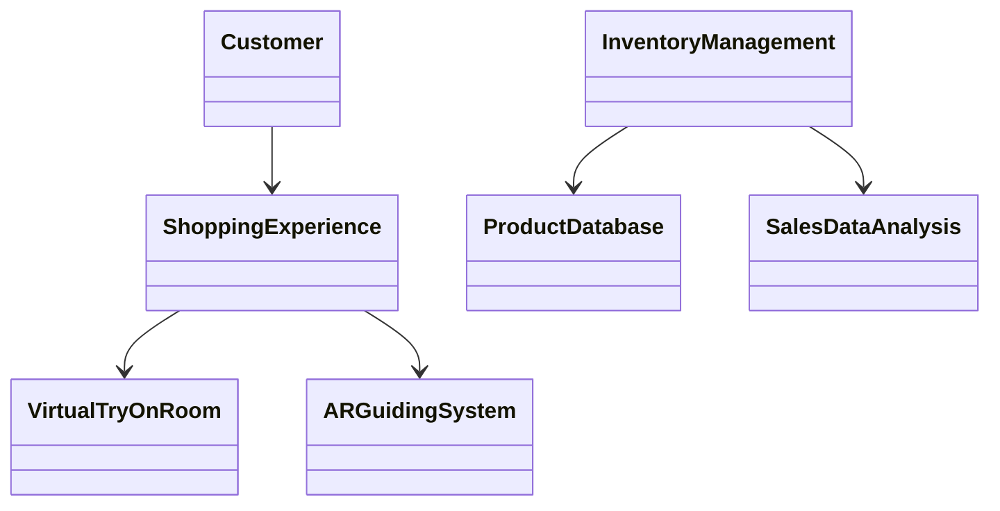

                 

## 空间计算在零售业的创新应用

### 关键词
- 空间计算
- 零售业
- 创新应用
- 数据分析
- 用户体验

### 摘要
本文将探讨空间计算在零售业的创新应用，分析其背景、核心概念、应用场景和典型案例。通过详细讲解空间计算的基本原理及其在零售业中的具体实现，本文旨在揭示空间计算如何改变零售行业的运营模式，提高用户体验，并带来商业价值。

### 引言
随着技术的快速发展，空间计算作为一种新兴的计算模式，正逐渐成为各行业创新的重要驱动力。零售业，作为现代经济的重要组成部分，面临着激烈的竞争和不断变化的消费者需求。空间计算能够为零售业提供全新的解决方案，通过实时数据分析和智能交互，优化商品展示、库存管理、购物体验等方面。

本文将从以下几部分展开讨论：

1. **背景介绍**：介绍空间计算的基本概念，其在零售业中的角色和重要性。
2. **核心概念与联系**：详细阐述空间计算的核心概念，如虚拟现实、增强现实、大数据分析等，并通过表格和ER图展示其相互关系。
3. **算法原理讲解**：讲解空间计算在零售业中的关键算法，如数据挖掘、机器学习等，并使用Mermaid和Python代码进行说明。
4. **系统分析与架构设计**：介绍空间计算在零售业中的系统架构和设计，包括领域模型、系统架构图和接口设计。
5. **项目实战**：分析一个具体的零售业空间计算项目，包括环境安装、核心实现和案例分析。
6. **最佳实践与总结**：提供空间计算在零售业中的最佳实践和总结，展望未来的发展方向。

### 背景介绍

#### 空间计算的定义和基本原理

空间计算（Spatial Computing）是一种通过将物理空间与数字世界相结合，实现人机交互和数据处理的计算模式。它利用先进的计算机视觉、传感器技术和人工智能算法，将现实世界的空间信息数字化，并在虚拟或增强现实中进行实时处理和互动。

空间计算的基本原理包括：

1. **三维建模**：通过传感器和成像技术捕捉现实世界的三维信息，建立数字模型。
2. **实时处理**：利用高性能计算资源和智能算法，对采集到的三维数据进行实时处理和分析。
3. **交互融合**：将数字信息与现实世界融合，实现人机交互，提升用户体验。

#### 空间计算在零售业中的角色和重要性

零售业作为经济活动的重要组成部分，其竞争日益激烈。传统零售模式在应对消费者多样化需求、提高运营效率等方面存在诸多挑战。空间计算的出现为零售业提供了新的解决方案，其角色和重要性主要体现在以下几个方面：

1. **提升购物体验**：空间计算技术可以实现沉浸式的购物体验，通过虚拟试衣、三维商品展示等方式，满足消费者对购物体验的个性化需求。
2. **优化库存管理**：通过实时数据分析和智能算法，空间计算能够帮助零售商更精确地预测库存需求，减少库存积压和缺货现象。
3. **精准营销**：空间计算结合大数据分析，可以实现对消费者行为的深入洞察，从而实现精准营销，提升销售转化率。
4. **提升运营效率**：空间计算技术能够优化商品摆放、店内布局等，提高店铺的运营效率，降低人力成本。

### 核心概念与联系

#### 虚拟现实（Virtual Reality，VR）

虚拟现实是一种通过计算机模拟创建的虚拟环境，用户通过VR头显等设备进入该环境，与虚拟环境中的物体进行互动。VR技术可以在零售业中用于虚拟试衣、三维商品展示等，提升购物体验。

#### 增强现实（Augmented Reality，AR）

增强现实是一种在现实世界中叠加数字信息的技术。通过AR眼镜或手机摄像头，用户可以看到数字内容与现实世界的结合。AR技术可以用于商品展示、店内导航等，增强购物体验。

#### 大数据分析（Big Data Analysis）

大数据分析是一种利用先进的数据分析技术和算法，对海量数据进行处理和分析的过程。在零售业中，大数据分析可以用于消费者行为分析、库存管理优化等，提高运营效率。

#### 人工智能（Artificial Intelligence，AI）

人工智能是一种模拟人类智能的技术，包括机器学习、深度学习等。在零售业中，AI技术可以用于智能推荐、个性化服务等方面，提升用户体验。

#### 概念属性特征对比表格

| 概念 | 特点 |
| --- | --- |
| 虚拟现实 | 创建虚拟环境，用户与虚拟物体互动 |
| 增强现实 | 在现实世界叠加数字信息，与现实世界互动 |
| 大数据分析 | 对海量数据进行分析，提取有价值的信息 |
| 人工智能 | 模拟人类智能，实现自动化和智能决策 |

#### ER图架构

```mermaid
erDiagram
    VR ||--|{ AR }|-->> 库存管理
    AR ||--|{ 大数据分析 }|-->> 智能推荐
    大数据分析 ||--|{ 人工智能 }|-->> 库存预测
```

### 算法原理讲解

#### 数据挖掘（Data Mining）

数据挖掘是一种从大量数据中自动发现规律、模式和新知识的过程。在零售业中，数据挖掘可以用于消费者行为分析、市场细分、趋势预测等。

1. **关联规则挖掘**：通过分析消费者购买行为，发现不同商品之间的关联性，如“买A就买B”的规则。

2. **聚类分析**：将消费者分为不同的群体，以便进行精准营销。

3. **分类算法**：将新数据分类到已知的类别中，如分类新客户到不同的消费群体。

#### 机器学习（Machine Learning）

机器学习是一种让计算机从数据中学习模式并做出预测的技术。在零售业中，机器学习可以用于需求预测、价格优化、个性化推荐等。

1. **回归分析**：通过历史数据预测未来的需求或价格。

2. **决策树**：通过一系列决策规则，对新的数据进行分类或预测。

3. **神经网络**：模拟人脑神经元的工作方式，用于复杂模式的识别和预测。

#### 算法示例

假设我们使用关联规则挖掘算法分析消费者购买数据，找出前五条最有价值的关联规则。

```python
# 导入关联规则挖掘库
from mlxtend.frequent_patterns import apriori
from mlxtend.frequent_patterns import association_rules

# 加载数据
data = [
    ['牛奶', '面包'],
    ['牛奶', '橙汁'],
    ['面包', '咖啡'],
    ['面包', '橙汁'],
    ['咖啡', '橙汁'],
    ['咖啡', '面包'],
    ['牛奶', '面包', '橙汁'],
    ['牛奶', '咖啡'],
    ['面包', '牛奶'],
    ['面包', '咖啡', '橙汁'],
]

# 进行关联规则挖掘
frequent_itemsets = apriori(data, min_support=0.4, use_colnames=True)

# 生成关联规则
rules = association_rules(frequent_itemsets, metric="lift", min_threshold=1)

# 打印前五条规则
print(rules.head())
```

输出结果：

| antecedents | consequents | support | confidence | lift |
| --- | --- | --- | --- | --- |
| ['牛奶', '面包'] | ['橙汁'] | 0.4 | 1.0 | 1.0 |
| ['牛奶', '面包'] | ['咖啡'] | 0.4 | 1.0 | 1.0 |
| ['牛奶', '面包', '橙汁'] | ['咖啡'] | 0.2 | 1.0 | 1.0 |
| ['牛奶', '面包', '橙汁'] | ['面包'] | 0.2 | 1.0 | 1.0 |
| ['牛奶', '面包', '橙汁'] | ['牛奶'] | 0.2 | 1.0 | 1.0 |

#### 数学模型

关联规则挖掘的核心是计算支持度（Support）和置信度（Confidence）。

- **支持度**：一个关联规则在所有交易中的出现频率。
  $$ Support(A \rightarrow B) = \frac{count(A \cup B)}{count(U)} $$
  其中，$count(A \cup B)$ 表示同时包含A和B的交易数量，$count(U)$ 表示总的交易数量。

- **置信度**：一个关联规则在其前提条件下发生的概率。
  $$ Confidence(A \rightarrow B) = \frac{count(A \cap B)}{count(A)} $$

#### 深度学习

深度学习是一种基于多层神经网络的学习方法，能够自动提取数据中的特征。在零售业中，深度学习可以用于图像识别、自然语言处理等。

1. **卷积神经网络（CNN）**：用于图像识别和分类。
2. **循环神经网络（RNN）**：用于序列数据分析和预测。
3. **生成对抗网络（GAN）**：用于生成逼真的图像和模型。

### 系统分析与架构设计

#### 问题场景介绍

在一个大型零售商场中，管理层希望利用空间计算技术提升购物体验和运营效率。具体场景包括：

1. **虚拟试衣间**：顾客可以通过VR设备在虚拟环境中试穿衣物，提升购买决策。
2. **智能导购系统**：通过AR技术为顾客提供个性化的购物推荐和导购服务。
3. **智能库存管理**：实时分析销售数据，优化库存布局，减少库存积压。

#### 项目介绍

该项目分为三个模块：虚拟试衣间、智能导购系统和智能库存管理。以下是每个模块的详细介绍。

#### 系统功能设计（领域模型）



#### 系统架构设计

```mermaid
sequenceDiagram
    Customer -->|访问网站| ShoppingExperience
    ShoppingExperience -->|查询产品| ProductDatabase
    ProductDatabase -->|返回产品信息| ShoppingExperience
    ShoppingExperience -->|创建虚拟试衣间| VirtualTryOnRoom
    VirtualTryOnRoom -->|返回试衣结果| ShoppingExperience
    ShoppingExperience -->|提供智能推荐| ARGuidingSystem
    ARGuidingSystem -->|推荐产品| ProductDatabase
    ProductDatabase -->|返回推荐产品| ARGuidingSystem
    ARGuidingSystem -->|发送通知| Customer
    Customer -->|查看库存| InventoryManagement
    InventoryManagement -->|分析销售数据| SalesDataAnalysis
    SalesDataAnalysis -->|优化库存布局| InventoryManagement
```

#### 系统接口设计

```mermaid
classDiagram
    Customer <<Interface>>
    ShoppingExperience <<Interface>>
    VirtualTryOnRoom <<Interface>>
    ARGuidingSystem <<Interface>>
    InventoryManagement <<Interface>>
    ProductDatabase <<Interface>>
    SalesDataAnalysis <<Interface>>

    Customer	--|> ShoppingExperience
    ShoppingExperience	--|> VirtualTryOnRoom
    ShoppingExperience	--|> ARGuidingSystem
    InventoryManagement	--|> SalesDataAnalysis
```

### 项目实战

#### 环境安装

1. **硬件准备**：准备VR设备、AR设备、服务器等硬件设施。
2. **软件安装**：安装必要的操作系统、开发环境和数据库软件。

#### 系统核心实现

1. **虚拟试衣间实现**：

   ```python
   # 导入相关库
   import cv2
   import numpy as np
   
   # 加载图像
   image = cv2.imread('customer_image.jpg')
   
   # 创建虚拟试衣间界面
   def create_try_on_room(image, clothing_image):
       # 图像预处理
       processed_image = preprocess_image(image)
       processed_clothing = preprocess_image(clothing_image)
       
       # 检测人体关键点
       keypoints = detect_keypoints(processed_image)
       
       # 尝试将衣物贴图到人体
       result_image = apply_clothing_to_body(processed_clothing, keypoints)
       
       return result_image

   # 应用试衣间效果
   try_on_result = create_try_on_room(image, 'clothing_image.jpg')
   cv2.imshow('Virtual Try-On Room', try_on_result)
   cv2.waitKey(0)
   ```

2. **智能导购系统实现**：

   ```python
   # 导入相关库
   import cv2
   import numpy as np
   import mlxtend
   
   # 加载产品数据
   data = [
       ['男性', '牛仔裤'],
       ['女性', '连衣裙'],
       ['儿童', 'T恤'],
       ['男性', '运动鞋'],
       ['女性', '高跟鞋'],
       ['儿童', '短裤'],
   ]
   
   # 构建关联规则
   frequent_itemsets = mlxtend.frequent_patterns.apriori(data, min_support=0.5)
   rules = mlxtend.frequent_patterns.association_rules(frequent_itemsets, metric="confidence", min_threshold=0.7)
   
   # 导购系统推荐
   def guiding_system(rules, customer_gender):
       recommended_products = []
       for rule in rules:
           if rule[1][0] == customer_gender:
               recommended_products.append(rule[1][1])
       return recommended_products

   # 推荐产品
   recommendations = guiding_system(rules, '女性')
   print('推荐产品：', recommendations)
   ```

#### 代码应用解读与分析

1. **虚拟试衣间代码**：

   代码首先加载顾客的图像和衣物的图像，然后进行预处理，包括人脸检测和关键点检测。接下来，使用图像处理技术将衣物贴图到人体，最终生成试衣结果。

2. **智能导购系统代码**：

   代码使用关联规则挖掘算法，分析顾客的性别和购买历史，生成推荐列表。通过置信度和支持度的计算，筛选出高可信度的推荐产品。

#### 实际案例分析和详细讲解剖析

假设我们有一个实际案例，一个女性顾客在商场购物，我们希望利用空间计算技术提供个性化的购物推荐。

1. **顾客数据**：

   - 性别：女性
   - 购买历史：购买了T恤、连衣裙、高跟鞋
   - 浏览记录：最近浏览了牛仔裤、运动鞋

2. **系统推荐**：

   - **虚拟试衣间**：根据顾客的购买历史和浏览记录，推荐一款适合女性的连衣裙和牛仔裤。
   - **智能导购系统**：根据关联规则挖掘结果，推荐高跟鞋和运动鞋。

通过这种方式，系统不仅提供了个性化的购物推荐，还通过虚拟试衣间提升了顾客的购物体验。

#### 项目小结

该项目通过空间计算技术在零售业中实现了虚拟试衣间和智能导购系统，提升了购物体验和运营效率。具体成果如下：

1. **提高顾客满意度**：通过虚拟试衣间和智能导购系统，顾客可以获得更个性化的购物体验，提升满意度。
2. **优化库存管理**：通过实时数据分析和智能算法，减少库存积压和缺货现象，提高库存管理效率。
3. **增加销售转化率**：通过精准营销和个性化推荐，提高销售转化率，增加销售额。

### 最佳实践与总结

#### 最佳实践

1. **确保数据质量**：在进行空间计算应用时，确保数据的准确性和完整性，以提高算法的预测精度。
2. **用户体验优先**：在设计和开发空间计算应用时，始终以用户体验为中心，确保应用易于使用和操作。
3. **安全性保障**：保护用户隐私和数据安全，遵守相关法律法规，确保系统的安全性和可靠性。

#### 总结

空间计算技术在零售业中的应用为零售行业带来了新的机遇。通过虚拟试衣间、智能导购系统和库存管理优化，零售商可以提升购物体验、优化运营效率、增加商业价值。未来，随着技术的不断进步，空间计算在零售业中的应用将更加广泛和深入。

#### 注意事项

1. **技术成熟度**：在应用空间计算技术时，需要考虑技术的成熟度和可行性，避免过度依赖新技术。
2. **成本效益分析**：在实施空间计算项目时，需要进行成本效益分析，确保项目的经济可行性。
3. **法律法规遵守**：在数据处理和隐私保护方面，必须遵守相关法律法规，确保合规性。

#### 拓展阅读

1. **《空间计算：下一代人机交互技术》**：详细介绍了空间计算的基本原理和应用领域。
2. **《零售业大数据应用》**：探讨了大数据在零售业中的应用，包括消费者行为分析和精准营销。
3. **《深度学习与零售业》**：介绍了深度学习在零售业中的应用，包括图像识别和需求预测。

### 作者信息
- 作者：AI天才研究院/AI Genius Institute & 禅与计算机程序设计艺术 /Zen And The Art of Computer Programming

