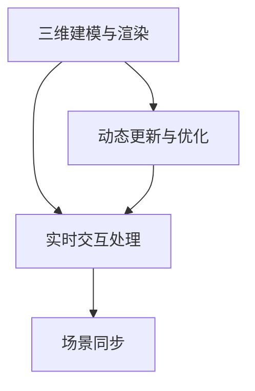
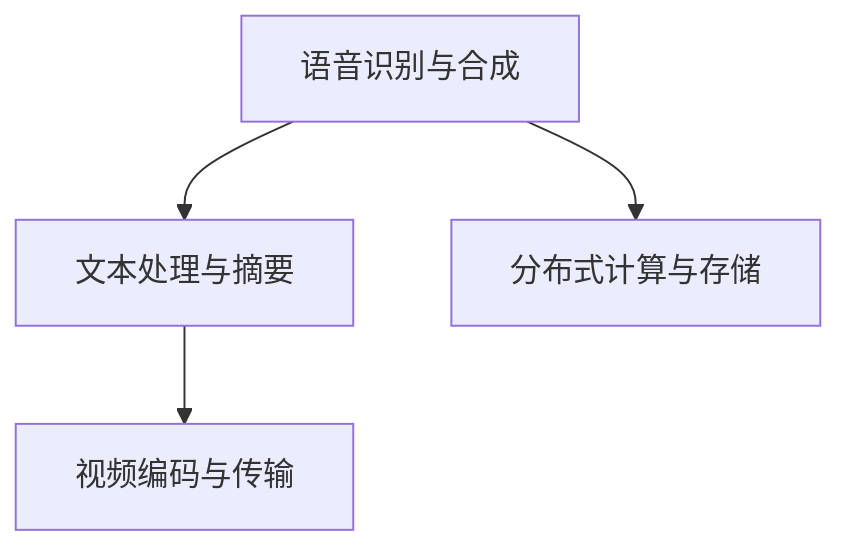
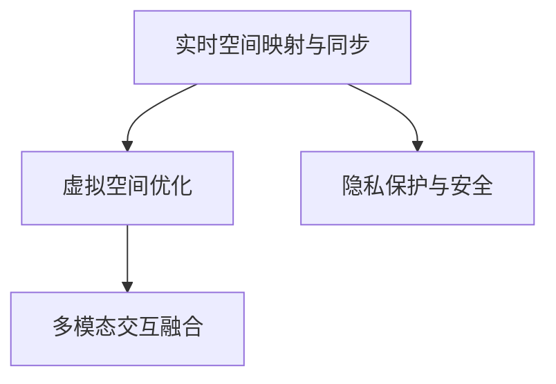
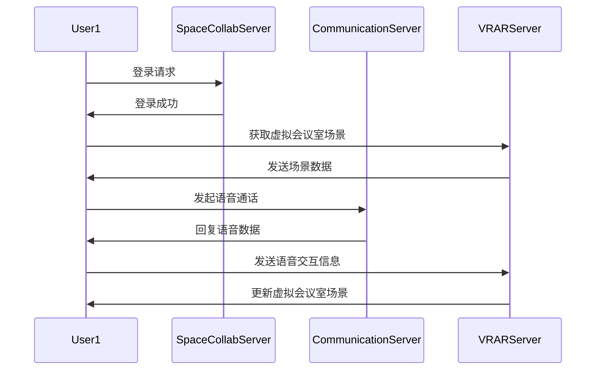

                 

## 引言

### 1.1 问题背景

远程协作作为一种高效、灵活的办公模式，在现代社会中越来越受到重视。然而，传统的远程协作方式面临着诸多挑战，如沟通不畅、协作效率低下、工作状态难以监控等。这些问题的存在严重影响了远程协作的效果，使得许多企业和团队在远程办公时面临困境。

空间计算技术，作为一项新兴的计算技术，通过模拟现实空间中的物理交互，提供了一种全新的远程协作方式。它不仅能够弥补传统远程协作的不足，还可以带来更为丰富的协作体验，从而提高远程协作的效率和质量。

### 1.1.1 远程协作的现状与挑战

远程协作的现状主要集中在以下几个方面：

1. **沟通障碍**：由于地理位置的分离，团队成员之间的沟通变得复杂和困难。信息传递的速度和准确性都受到限制，导致协作效率低下。

2. **协作效率**：传统远程协作依赖于文本、邮件、视频会议等工具，但这些工具往往无法提供实时的、即时的协作体验。团队成员需要花费额外的时间来同步工作进度，从而降低了整体的工作效率。

3. **工作状态监控**：远程协作中，管理者难以直接监控团队成员的工作状态，这增加了对员工自律性的要求，同时也增加了管理上的不确定性。

面对这些挑战，远程协作迫切需要新的技术手段来改善现状。

### 1.1.2 空间计算技术的基本概念

空间计算技术是一种通过虚拟现实（VR）、增强现实（AR）和混合现实（MR）等技术，将用户的空间环境数字化并进行互动的技术。其基本概念包括：

1. **虚拟现实（VR）**：通过计算机生成一个模拟环境，用户可以在这个环境中进行沉浸式的体验。

2. **增强现实（AR）**：将计算机生成的信息叠加到现实环境中，使用户能够同时看到虚拟和现实的内容。

3. **混合现实（MR）**：结合VR和AR的特点，为用户提供一个同时包含虚拟和现实元素的环境。

这些技术为远程协作提供了新的可能性，使得远程团队成员可以如同在同一个物理空间中一样进行协作，从而克服传统远程协作的种种不足。

### 1.1.3 空间计算技术对远程协作的意义

空间计算技术对远程协作的意义主要体现在以下几个方面：

1. **增强沟通体验**：通过虚拟空间，团队成员可以实时交流、互动，减少信息传递的延迟，提高沟通的效率和质量。

2. **提高协作效率**：空间计算技术可以提供即时的、沉浸式的协作体验，使得团队成员能够更快速地同步工作进度，减少协调成本。

3. **改善工作状态监控**：管理者可以通过虚拟空间实时监控团队成员的工作状态，提高管理效率，减少管理风险。

综上所述，空间计算技术为远程协作带来了全新的解决方案，有望解决传统远程协作中的诸多问题，提高远程协作的效率和质量。

### 1.2 问题描述

在远程协作中，主要存在以下问题：

1. **沟通不畅**：团队成员地理位置分散，信息传递速度慢，沟通方式单一，导致协作效率低下。

2. **协作效率低**：传统协作工具无法提供实时、沉浸式的协作体验，团队成员需要花费大量时间来同步工作进度。

3. **工作状态难以监控**：管理者难以实时了解团队成员的工作状态，增加了管理上的不确定性。

针对这些问题，空间计算技术提供了以下潜在的应用：

1. **增强沟通体验**：通过虚拟空间，团队成员可以进行实时、沉浸式的交流，减少信息传递的延迟。

2. **提高协作效率**：空间计算技术提供了丰富的协作工具和场景，使得团队成员能够更快速地同步工作进度。

3. **改善工作状态监控**：管理者可以通过虚拟空间实时监控团队成员的工作状态，提高管理效率。

### 1.3 问题解决

#### 1.3.1 空间计算技术的基本原理

空间计算技术的基本原理是通过虚拟现实（VR）、增强现实（AR）和混合现实（MR）等技术，模拟现实空间中的物理交互。这些技术利用计算机生成的虚拟环境或增强现实环境，使用户能够在虚拟空间中实现与真实世界的互动。

1. **虚拟现实（VR）**：通过计算机生成的三维模拟环境，用户可以在这个环境中进行沉浸式的体验。VR技术主要依赖于头戴式显示器、跟踪设备和输入设备等硬件设备，为用户提供高度沉浸的虚拟体验。

2. **增强现实（AR）**：将计算机生成的信息叠加到现实环境中，使用户能够同时看到虚拟和现实的内容。AR技术主要通过摄像头、显示设备和算法等技术实现，使虚拟信息与真实环境相结合。

3. **混合现实（MR）**：结合VR和AR的特点，为用户提供一个同时包含虚拟和现实元素的环境。MR技术利用计算机生成的虚拟信息和现实世界的元素进行融合，使用户能够在一个混合现实中进行互动。

#### 1.3.2 空间计算技术在远程协作中的应用

空间计算技术在远程协作中的应用主要体现在以下几个方面：

1. **虚拟会议室**：通过VR或AR技术，远程团队成员可以在一个虚拟的会议室中开会，实现面对面的交流。这种技术可以减少因地理位置分离而产生的沟通障碍，提高沟通效率。

2. **协同工作空间**：利用空间计算技术，团队成员可以共享一个虚拟的协同工作空间，实时编辑和查看文档、图表等资料。这种空间可以模拟现实中的办公环境，使得团队成员如同在同一个物理空间中一样进行协作。

3. **虚拟培训与演示**：通过VR或AR技术，企业和教育机构可以提供虚拟的培训与演示环境，让员工或学生能够在虚拟空间中进行实践和操作。这种技术可以大大提高培训的效果和效率。

4. **远程协作工具增强**：将空间计算技术集成到现有的远程协作工具中，如视频会议系统、项目管理工具等，可以提供更加丰富的交互功能和协作体验。

### 1.4 边界与外延

#### 1.4.1 空间计算技术的适用范围

空间计算技术的适用范围非常广泛，包括但不限于以下领域：

1. **企业远程协作**：适用于跨地区、跨国企业的远程办公，提高沟通效率和协作质量。

2. **远程教育**：适用于在线教育平台，提供沉浸式的学习体验，提高教学效果。

3. **医疗远程协作**：适用于远程医疗诊断、手术指导等场景，实现远程医疗的高效协作。

4. **娱乐与游戏**：适用于虚拟现实游戏、虚拟演唱会等娱乐场景，提供全新的互动体验。

5. **工程设计**：适用于大型工程项目的远程协作，通过虚拟空间进行设计评审、讨论等。

#### 1.4.2 远程协作中的其他技术手段

除了空间计算技术，远程协作还可以利用其他技术手段，如：

1. **视频会议系统**：通过视频和语音通信，实现远程会议和交流。

2. **即时通讯工具**：通过文本、语音、视频等多种方式，实现实时沟通和协作。

3. **项目管理工具**：通过在线协作平台，实现任务分配、进度跟踪、文档共享等。

4. **虚拟办公环境**：通过虚拟现实技术，模拟现实办公环境，提供沉浸式的办公体验。

这些技术手段可以与空间计算技术结合，形成更加丰富的远程协作解决方案。

### 1.5 概念结构与核心要素组成

#### 1.5.1 空间计算技术的核心概念

空间计算技术的核心概念包括：

1. **虚拟现实（VR）**：通过计算机生成的三维模拟环境，为用户提供沉浸式体验。

2. **增强现实（AR）**：将虚拟信息叠加到现实环境中，为用户提供虚拟和现实相结合的体验。

3. **混合现实（MR）**：结合VR和AR的特点，为用户提供同时包含虚拟和现实元素的环境。

#### 1.5.2 远程协作的关键要素

远程协作的关键要素包括：

1. **沟通**：实现团队成员之间的实时沟通，是远程协作的基础。

2. **协作**：团队成员在虚拟空间中协同完成工作，提高协作效率。

3. **工作状态监控**：管理者通过虚拟空间实时了解团队成员的工作状态，提高管理效率。

### 1.6 本章小结

本章介绍了空间计算技术在远程协作中的作用，包括背景介绍、问题描述、问题解决和边界与外延。通过分析空间计算技术的基本原理和应用，我们认识到其在远程协作中的重要价值。接下来，我们将深入探讨空间计算技术的核心概念和远程协作的关键要素，为后续章节的详细讲解奠定基础。

---

## 核心概念与联系

### 2.1 空间计算技术的核心概念

空间计算技术的核心概念主要包括虚拟现实（VR）、增强现实（AR）和混合现实（MR）。这三个概念相互关联，共同构成了空间计算技术的基础。

#### 2.1.1 虚拟现实（VR）

虚拟现实（VR）是一种通过计算机生成三维模拟环境，为用户提供沉浸式体验的技术。VR技术的核心在于创造一个虚拟的空间，用户可以通过头戴显示器、虚拟现实眼镜等设备进入这个空间，并在其中进行交互。VR技术的主要特征包括：

1. **沉浸感**：用户完全沉浸在一个虚拟环境中，感觉自己置身其中。
2. **交互性**：用户可以通过手势、声音、触觉等方式与虚拟环境进行交互。
3. **逼真感**：通过高精度的图形渲染和物理模拟，虚拟环境与真实世界的感受接近。

VR技术主要应用于游戏、娱乐、教育、医疗等多个领域，为用户提供了全新的交互体验。

#### 2.1.2 增强现实（AR）

增强现实（AR）是将虚拟信息叠加到现实环境中，使用户能够同时看到虚拟和现实内容的技术。AR技术通过摄像头、显示屏和算法实现，将虚拟对象与现实场景进行实时融合。AR技术的主要特征包括：

1. **叠加性**：虚拟信息叠加到现实环境中，与真实世界相结合。
2. **实时性**：虚拟信息的显示和更新与用户视角实时同步。
3. **交互性**：用户可以通过手势、语音等方式与虚拟信息进行交互。

AR技术在教育、医疗、零售、建筑等多个领域得到广泛应用，为用户提供了丰富的信息获取和互动体验。

#### 2.1.3 混合现实（MR）

混合现实（MR）是结合虚拟现实（VR）和增强现实（AR）的特点，为用户提供同时包含虚拟和现实元素的环境的技术。MR技术通过计算机生成的虚拟信息与现实世界的元素进行融合，使用户能够在一个混合现实中进行互动。MR技术的主要特征包括：

1. **融合性**：虚拟信息与现实世界的元素相互融合，形成一个新的混合现实环境。
2. **交互性**：用户可以通过手势、语音、触觉等方式与虚拟和现实元素进行交互。
3. **增强感**：虚拟信息增强了现实世界的感知和体验，提供了更加丰富的信息呈现方式。

MR技术在设计、工程、教育、医疗等多个领域展现出巨大的应用潜力。

### 2.2 远程协作的关键要素

远程协作的关键要素包括沟通、协作和工作状态监控。这些要素共同构成了远程协作的基础，对于提高协作效率和确保工作质量具有重要意义。

#### 2.2.1 远程协作的概念与类型

远程协作是指团队成员在不同地理位置通过信息技术工具进行沟通、协作和工作的过程。根据协作方式的差异，远程协作可以分为以下几种类型：

1. **文本协作**：通过电子邮件、即时通讯工具、文档共享平台等实现文本信息的交流和协作。
2. **视频协作**：通过视频会议系统实现实时的音视频交流，支持面对面沟通。
3. **项目管理协作**：通过项目管理工具实现任务分配、进度跟踪、资源管理等功能，提高协作效率。
4. **虚拟会议室**：通过虚拟现实（VR）或增强现实（AR）技术，提供一个虚拟的会议室环境，实现沉浸式协作。

#### 2.2.2 远程协作的挑战与问题

远程协作面临以下挑战和问题：

1. **沟通障碍**：团队成员地理位置分散，信息传递速度慢，沟通方式单一，导致协作效率低下。
2. **协作效率**：传统协作工具无法提供实时、沉浸式的协作体验，团队成员需要花费大量时间来同步工作进度。
3. **工作状态监控**：管理者难以直接监控团队成员的工作状态，增加了对员工自律性的要求，同时也增加了管理上的不确定性。

#### 2.2.3 远程协作的解决方案

为了解决远程协作中的问题，可以采取以下解决方案：

1. **引入空间计算技术**：通过虚拟现实（VR）、增强现实（AR）和混合现实（MR）等技术，提供实时、沉浸式的协作体验，提高协作效率。
2. **优化沟通工具**：采用视频会议系统、即时通讯工具等，提供多渠道、多方式的沟通渠道，减少沟通障碍。
3. **应用项目管理工具**：通过项目管理工具实现任务分配、进度跟踪、资源管理等功能，提高协作效率。
4. **加强工作状态监控**：通过虚拟空间实时监控团队成员的工作状态，提高管理效率，减少管理风险。

### 2.3 空间计算技术与远程协作的联系

空间计算技术与远程协作之间存在密切的联系。空间计算技术为远程协作提供了新的工具和方法，可以解决传统远程协作中的问题，提升协作效率和用户体验。

#### 2.3.1 空间计算技术在远程协作中的应用

空间计算技术在远程协作中的应用主要体现在以下几个方面：

1. **虚拟会议室**：通过VR或AR技术，提供一个虚拟的会议室环境，实现沉浸式协作，减少沟通障碍，提高协作效率。
2. **协同工作空间**：通过VR或AR技术，提供共享的虚拟工作空间，团队成员可以实时编辑和查看文档、图表等资料，实现高效的协同工作。
3. **虚拟培训与演示**：通过VR或AR技术，提供虚拟的培训与演示环境，提高培训效果和效率。
4. **远程协作工具增强**：将空间计算技术集成到现有的远程协作工具中，如视频会议系统、项目管理工具等，提供更加丰富的交互功能和协作体验。

#### 2.3.2 空间计算技术对远程协作的改进

空间计算技术对远程协作的改进主要体现在以下几个方面：

1. **增强沟通体验**：通过虚拟空间，团队成员可以实时交流、互动，减少信息传递的延迟，提高沟通的效率和质量。
2. **提高协作效率**：空间计算技术可以提供即时的、沉浸式的协作体验，使得团队成员能够更快速地同步工作进度，减少协调成本。
3. **改善工作状态监控**：管理者可以通过虚拟空间实时监控团队成员的工作状态，提高管理效率，减少管理风险。

#### 2.3.3 空间计算技术与远程协作的融合趋势

随着空间计算技术的不断发展，远程协作与空间计算技术的融合趋势日益显著。未来，空间计算技术将在远程协作中发挥更加重要的作用，为团队协作带来更加丰富和高效的体验。具体趋势包括：

1. **技术集成**：将空间计算技术与现有的远程协作工具进行深度融合，提供更加集成、一体化的解决方案。
2. **个性化定制**：根据不同团队的需求和特点，提供个性化的空间计算服务，满足多样化的协作需求。
3. **智能化演进**：通过人工智能技术，实现空间计算技术在远程协作中的应用智能化，提高协作效率和用户体验。

### 2.4 概念属性特征对比表格

为了更好地理解空间计算技术与远程协作的核心概念和属性，下面提供一张概念属性特征对比表格。

| 概念       | 特征1 | 特征2 | 特征3 | 应用领域                  |
|------------|-------|-------|-------|-------------------------|
| 虚拟现实（VR） | 沉浸感 | 交互性 | 逼真感 | 游戏、娱乐、教育、医疗 |
| 增强现实（AR） | 叠加性 | 实时性 | 交互性 | 教育、医疗、零售、建筑 |
| 混合现实（MR） | 融合性 | 交互性 | 增强感 | 设计、工程、教育、医疗 |

### 2.5 ER实体关系图架构

为了更清晰地展示空间计算技术与远程协作的概念及其相互关系，我们可以使用实体关系图（ER图）进行表示。下面分别给出空间计算技术、远程协作以及二者融合的ER图。

#### 2.5.1 空间计算技术的ER图

```mermaid
erDiagram
  User ..|> VRSystem : 使用
  User ..|> ARSystem : 使用
  User ..|> MRSystem : 使用
  VRSystem ||--|{ Scene
  ARSystem ||--|{ Scene
  MRSystem ||--|{ Scene
```

#### 2.5.2 远程协作的ER图

```mermaid
erDiagram
  TeamMember ..|> Communication : 沟通
  TeamMember ..|> Collaboration : 协作
  TeamMember ..|> WorkStateMonitoring : 监控
  Communication ||--|{ Tool
  Collaboration ||--|{ Tool
  WorkStateMonitoring ||--|{ Tool
```

#### 2.5.3 空间计算技术与远程协作的融合ER图

```mermaid
erDiagram
  RemoteCollaborationSystem ||--|{ VRModule
  RemoteCollaborationSystem ||--|{ ARModule
  RemoteCollaborationSystem ||--|{ MRModule
  VRModule ||--|{ Scene
  ARModule ||--|{ Scene
  MRModule ||--|{ Scene
  TeamMember ..|> RemoteCollaborationSystem : 参与远程协作
```

### 2.6 本章小结

本章介绍了空间计算技术的核心概念及其在远程协作中的应用。通过分析虚拟现实（VR）、增强现实（AR）和混合现实（MR）技术的基本原理和特征，我们理解了它们在远程协作中的重要价值。同时，我们探讨了远程协作的关键要素及其面临的挑战与解决方案。最后，通过概念属性特征对比表格和ER实体关系图架构，我们展示了空间计算技术与远程协作的密切联系。这些内容为后续章节的深入分析奠定了基础。

---

## 算法原理讲解

### 3.1 空间计算技术的基本算法原理

空间计算技术的核心在于通过虚拟现实（VR）、增强现实（AR）和混合现实（MR）等技术模拟现实空间中的物理交互。这些技术的实现依赖于一系列复杂而高效的算法，以下将详细讲解这些算法的基本原理。

#### 3.1.1 虚拟现实（VR）的基本算法

虚拟现实（VR）的基本算法主要涉及以下几个方面：

1. **三维建模与渲染**：VR系统首先需要创建三维模型，这些模型可以是真实世界的场景，也可以是虚拟环境的场景。建模过程通常包括几何建模、纹理映射和光照计算等。在渲染阶段，计算机通过图形处理单元（GPU）将这些三维模型转化为可视化的图像，用户通过头戴显示器（HMD）看到这些图像。

2. **实时交互**：VR系统需要实时响应用户的输入，如头部的运动、手势等。这涉及到输入设备的捕捉算法和输入数据的实时处理。常见的输入设备包括摄像头、手势识别传感器、位置跟踪器等。

3. **场景同步**：在多人VR协作场景中，系统需要实时同步不同用户之间的场景状态，确保每个用户看到的场景是一致的。这涉及到网络通信算法和分布式计算技术。

#### 3.1.2 增强现实（AR）的基本算法

增强现实（AR）的基本算法主要包括以下几个方面：

1. **目标检测与跟踪**：AR系统需要识别和跟踪现实世界中的特定目标，如标志、物体等。通过摄像头捕捉现实世界的图像，并利用图像处理和计算机视觉技术进行目标检测和跟踪。

2. **图像识别与合成**：在识别出目标后，AR系统会在图像上叠加虚拟信息，如文字、图像、视频等。这涉及到图像识别和图像合成算法。

3. **实时渲染与显示**：与VR类似，AR系统也需要实时渲染虚拟信息，并将其叠加到真实世界的图像上。这个过程涉及到图像处理和显示技术。

#### 3.1.3 混合现实（MR）的基本算法

混合现实（MR）是VR和AR的结合，其基本算法包括：

1. **空间映射与注册**：MR系统需要建立一个与现实世界相对应的三维空间模型，这个模型称为空间映射。在注册过程中，系统将虚拟信息与真实世界进行匹配，确保虚拟信息放置在正确的位置。

2. **动态更新与优化**：由于现实世界的动态变化，MR系统需要不断更新空间映射和虚拟信息的显示。这涉及到实时数据更新和优化算法。

3. **多模态交互**：MR系统支持多种交互方式，如手势、语音、位置等。这涉及到多模态交互算法的设计和实现。

### 3.2 远程协作中的算法原理

远程协作中的算法原理主要关注如何通过技术手段提高协作效率和沟通质量。以下是一些关键算法：

1. **语音识别与合成**：通过语音识别技术，将用户的语音转换为文本，并通过语音合成技术将文本转换为语音，实现实时语音交流。

2. **自然语言处理**：利用自然语言处理技术，对文本信息进行理解和分析，实现文本的自动摘要、分类、情感分析等。

3. **视频编码与传输**：通过视频编码技术，将视频数据压缩成高效的数据流，并通过网络传输到远程用户。视频编码技术包括H.264、H.265等。

4. **分布式计算与存储**：在远程协作中，分布式计算和存储技术可以有效地处理大量数据和实时计算需求。这涉及到分布式算法、并行计算、云存储等。

### 3.3 空间计算技术与远程协作算法的融合原理

空间计算技术与远程协作算法的融合旨在提供更加高效、沉浸式的协作体验。以下是一些融合算法：

1. **实时空间映射与同步**：通过空间计算技术，实时生成和更新三维空间模型，并将其同步到远程用户的设备上。这涉及到实时数据传输和分布式计算技术。

2. **虚拟空间优化**：根据用户的交互行为和工作需求，动态调整虚拟空间的布局和功能，提供最佳的用户体验。

3. **多模态交互融合**：将语音、手势、位置等多种交互方式融合到虚拟空间中，实现无缝的用户体验。

4. **隐私保护与安全**：在融合过程中，需要确保用户数据的安全和隐私，采用加密、访问控制等技术实现。

### 3.4 算法mermaid流程图

为了更好地理解上述算法的原理和流程，我们可以使用mermaid绘制相应的流程图。

#### 3.4.1 空间计算技术的mermaid流程图



#### 3.4.2 远程协作的mermaid流程图



#### 3.4.3 空间计算技术与远程协作算法的融合mermaid流程图



通过这些mermaid流程图，我们可以更直观地了解空间计算技术和远程协作算法的原理和流程。

### 3.5 本章小结

本章详细讲解了空间计算技术的基本算法原理、远程协作的算法原理以及空间计算技术与远程协作算法的融合原理。通过mermaid流程图，我们展示了这些算法的具体实现流程。接下来，我们将进一步探讨空间计算技术在远程协作中的具体应用，以及如何通过数学模型和数学公式来详细分析和优化这些应用。

---

## 数学模型和数学公式 & 详细讲解 & 举例说明

### 4.1 空间计算技术的数学模型

空间计算技术的数学模型是理解和分析其工作原理的关键。以下将介绍空间计算技术中常用的数学模型和公式。

#### 4.1.1 虚拟现实（VR）的数学模型

虚拟现实（VR）的核心在于三维建模与渲染。以下是VR中的关键数学模型和公式：

1. **三维几何建模**：
   - **点云建模**：使用点云（点集）来表示三维物体，每个点由其三维坐标（x, y, z）表示。
     $$ P = (x, y, z) $$
   - **网格建模**：使用三角形网格（面片）来表示三维物体，每个三角形由三个顶点表示。
     $$ T = (P_1, P_2, P_3) $$

2. **三维渲染**：
   - **光线追踪**：使用光线追踪算法来模拟光线在三维空间中的传播和反射，计算像素的颜色。
     $$ I(p) = L_e(p) + \int_{\Omega} f_r(\omega_i, \omega_o) \cos(\theta) \cdot L_i(\omega_i) \cdot d\omega_i $$
     其中，$I(p)$ 是像素的颜色，$L_e(p)$ 是环境光照，$f_r(\omega_i, \omega_o)$ 是反射率，$\omega_i$ 和 $\omega_o$ 分别是入射光线和反射光线的方向，$L_i(\omega_i)$ 是入射光线的强度，$\theta$ 是入射光线与表面的夹角。

#### 4.1.2 增强现实（AR）的数学模型

增强现实（AR）的核心在于目标检测与跟踪以及图像识别与合成。以下是AR中的关键数学模型和公式：

1. **目标检测与跟踪**：
   - **卡尔曼滤波**：用于估计目标的运动轨迹，提高跟踪的稳定性。
     $$ x_{k|k-1} = A_k x_{k-1|k-1} + B_k u_k $$
     $$ P_{k|k-1} = A_k P_{k-1|k-1} A_k^T + Q_k $$
     其中，$x_{k|k-1}$ 是状态估计，$P_{k|k-1}$ 是状态估计的误差协方差，$A_k$ 是状态转移矩阵，$B_k$ 是控制输入矩阵，$u_k$ 是控制输入，$Q_k$ 是过程噪声协方差矩阵。

2. **图像识别与合成**：
   - **特征提取**：使用卷积神经网络（CNN）提取图像的特征向量。
     $$ f(\textbf{x}) = \sigma(\text{ReLU}(\text{Conv}_k(\text{ReLU}(\text{Conv}_{k-1}(... \text{ReLU}(\text{Conv}_1(\textbf{x})))...) $$
     其中，$f(\textbf{x})$ 是特征向量，$\sigma$ 是激活函数，$\text{ReLU}$ 是ReLU激活函数，$\text{Conv}_k$ 是卷积层。

#### 4.1.3 混合现实（MR）的数学模型

混合现实（MR）是虚拟现实（VR）和增强现实（AR）的结合，其数学模型也相应地融合了两者的特点。以下是MR中的关键数学模型和公式：

1. **空间映射与注册**：
   - **SLAM（同时定位与地图构建）**：用于实时构建三维空间地图并跟踪目标位置。
     $$ \text{Pose} = T_k x_{k-1} $$
     $$ P_{k|k-1} = A_k P_{k-1|k-1} A_k^T + Q_k $$
     其中，$\text{Pose}$ 是目标位置，$T_k$ 是变换矩阵，$x_{k-1}$ 是前一时刻的状态，$P_{k|k-1}$ 是状态估计的误差协方差，$Q_k$ 是过程噪声协方差矩阵。

2. **动态更新与优化**：
   - **粒子滤波**：用于在动态环境中进行目标跟踪和地图更新。
     $$ w_k = \frac{p(z_k | x_k)}{w_k} $$
     $$ x_{k|k} = \frac{1}{w_k} \sum_{i=1}^N w_i z_i $$
     其中，$w_k$ 是粒子权重，$z_k$ 是观测值，$x_{k|k}$ 是状态估计。

### 4.2 远程协作的数学模型

远程协作的数学模型主要关注如何通过算法优化协作效率和沟通质量。以下是远程协作中的关键数学模型和公式：

1. **语音识别与合成**：
   - **HMM（隐马尔可夫模型）**：用于语音识别，建模语音信号的时间序列特性。
     $$ P(\textbf{x}|H) = \prod_{i=1}^T P(x_i|h_i) $$
     其中，$\textbf{x}$ 是输入语音信号，$H$ 是隐状态序列，$h_i$ 是第$i$个隐状态。

2. **自然语言处理**：
   - **词向量模型**：如Word2Vec，用于将文本转化为向量表示。
     $$ \textbf{v}_i = \text{Word2Vec}(\text{sentence}) $$
     其中，$\textbf{v}_i$ 是单词$i$的向量表示。

3. **视频编码与传输**：
   - **率失真理论**：用于优化视频数据的传输率和质量。
     $$ R(D) = \int_{X} p(x) D(x) \cdot \log_2 \frac{1}{p(x)} dx $$
     其中，$R$ 是传输率，$D$ 是失真度，$p(x)$ 是输入数据的概率分布。

### 4.3 空间计算技术与远程协作算法的融合数学模型

空间计算技术与远程协作算法的融合旨在提供更加高效、沉浸式的协作体验。以下是融合中的关键数学模型和公式：

1. **实时空间映射与同步**：
   - **分布式计算**：用于处理大规模的空间数据并同步到远程用户。
     $$ C = \sum_{i=1}^N w_i c_i $$
     其中，$C$ 是总体计算结果，$w_i$ 是权重，$c_i$ 是每个计算节点的结果。

2. **虚拟空间优化**：
   - **多目标优化**：用于根据用户需求和交互行为动态调整虚拟空间的布局。
     $$ \min f(x) $$
     $$ \text{subject to } g_i(x) \leq 0 $$
     其中，$f(x)$ 是目标函数，$g_i(x)$ 是约束条件。

3. **多模态交互融合**：
   - **贝叶斯网络**：用于建模和推理多模态交互数据。
     $$ P(A, B, C) = P(A)P(B|A)P(C|A, B) $$
     其中，$A, B, C$ 是三个变量，$P(A), P(B|A), P(C|A, B)$ 分别是它们的概率分布。

### 4.4 本章小结

本章详细介绍了空间计算技术、远程协作以及二者融合的数学模型和公式。通过这些数学模型，我们可以更好地理解和分析空间计算技术在远程协作中的应用。接下来，我们将进一步探讨空间计算技术在远程协作系统分析与架构设计中的应用。

---

## 系统分析与架构设计

### 5.1 问题场景介绍

在当前远程协作中，团队面临着诸多挑战，如沟通不畅、协作效率低、工作状态难以监控等。这些问题严重影响了团队的工作效果和生产力。为了解决这些问题，我们需要设计一个基于空间计算技术的远程协作系统，以提高团队协作效率和沟通质量。

### 5.2 项目介绍

我们的项目名称为“空间协作平台（SpaceCollab）”，目标是构建一个基于虚拟现实（VR）和增强现实（AR）技术的远程协作系统。该系统旨在提供实时、沉浸式的协作体验，通过虚拟会议室、协同工作空间、虚拟培训与演示等功能，提升团队协作效率和沟通质量。

### 5.3 系统功能设计

空间协作平台的主要功能设计如下：

1. **虚拟会议室**：提供虚拟会议室环境，支持实时语音、视频通信，以及文档、屏幕共享等功能。

2. **协同工作空间**：提供一个共享的虚拟工作空间，团队成员可以实时编辑和查看文档、图表等资料，提高协作效率。

3. **虚拟培训与演示**：提供虚拟的培训与演示环境，支持实时互动，提高培训效果和效率。

4. **工作状态监控**：通过虚拟空间实时监控团队成员的工作状态，提高管理效率，减少管理风险。

5. **多模态交互**：支持语音、手势、位置等多种交互方式，提供更加丰富的用户交互体验。

### 5.4 系统架构设计

空间协作平台的系统架构设计如下：

1. **前端架构**：
   - **VR/AR客户端**：用户通过VR头戴设备或AR眼镜进入虚拟或增强现实环境。
   - **Web客户端**：提供网页版的远程协作界面，支持文本、语音、视频等多种通信方式。

2. **后端架构**：
   - **VR/AR服务器**：负责处理VR/AR场景的渲染、同步、交互等。
   - **通信服务器**：提供实时语音、视频通信服务，使用WebRTC等技术实现低延迟、高保真的通信。
   - **数据库**：存储用户信息、文档资料、工作进度等数据，使用关系数据库或NoSQL数据库。

3. **基础设施**：
   - **云平台**：使用云计算资源，提供弹性、可扩展的计算和存储服务。
   - **网络设施**：确保系统的稳定性和高可用性，使用高性能网络设备和技术。

### 5.5 系统接口设计

空间协作平台的接口设计主要包括：

1. **API接口**：提供RESTful API接口，方便第三方系统集成和扩展。
2. **SDK接口**：提供VR/AR客户端的软件开发工具包（SDK），方便开发者集成和开发定制化应用。
3. **Websocket接口**：提供实时数据传输接口，实现实时通信和同步。

### 5.6 系统交互mermaid序列图

以下是一个空间协作平台的mermaid序列图，展示了系统的关键交互流程：



通过上述系统架构设计和交互设计，空间协作平台能够提供高效、沉浸式的远程协作体验，有效解决团队协作中的问题，提升团队的工作效率和质量。

### 5.7 项目实战

#### 5.7.1 环境安装

要部署空间协作平台，我们需要安装以下软件和工具：

1. **操作系统**：Linux或Windows
2. **开发环境**：Python 3.x、Node.js、Git
3. **数据库**：MySQL或MongoDB
4. **VR/AR客户端**：Unity、Unity AR SDK、WebXR SDK
5. **服务器**：Nginx、Apache Kafka、Elasticsearch

安装步骤如下：

1. 安装操作系统和基本软件环境。
2. 安装Python 3.x和Node.js，并配置相应的开发环境。
3. 安装MySQL或MongoDB数据库服务器。
4. 安装Unity和AR SDK，并配置VR/AR客户端的开发环境。
5. 安装Nginx、Apache Kafka和Elasticsearch，配置服务器环境。

#### 5.7.2 系统核心实现源代码

空间协作平台的核心实现源代码分为前端和后端两部分。

1. **前端**：

   前端采用Vue.js框架，负责处理用户界面和交互逻辑。以下是前端的核心代码示例：

   ```javascript
   // main.js
   import Vue from 'vue';
   import App from './App.vue';

   Vue.config.productionTip = false;

   new Vue({
     render: h => h(App),
   }).$mount('#app');
   ```

   前端还使用WebXR SDK进行VR/AR场景的渲染和处理。

2. **后端**：

   后端采用Flask框架，负责处理业务逻辑和API接口。以下是后端的核心代码示例：

   ```python
   # app.py
   from flask import Flask, request, jsonify
   from VRARServer import VRARServer

   app = Flask(__name__)
   vrar_server = VRARServer()

   @app.route('/api/scene', methods=['GET'])
   def get_scene():
       scene_data = vrar_server.get_scene_data()
       return jsonify(scene_data)

   @app.route('/api/scene', methods=['POST'])
   def update_scene():
       scene_data = request.json
       vrar_server.update_scene_data(scene_data)
       return jsonify({'status': 'success'})

   if __name__ == '__main__':
       app.run(host='0.0.0.0', port=5000)
   ```

   后端还使用Kafka处理实时数据传输，使用Elasticsearch进行数据存储和分析。

#### 5.7.3 代码应用解读与分析

空间协作平台的代码主要分为前端和后端两部分。

1. **前端**：

   前端主要实现用户界面和交互逻辑，通过Vue.js框架构建。前端使用WebXR SDK进行VR/AR场景的渲染和处理。前端的核心代码是`main.js`，负责启动Vue应用程序。

   ```javascript
   // main.js
   new Vue({
     render: h => h(App),
   }).$mount('#app');
   ```

   在`App.vue`文件中，定义了虚拟会议室、协同工作空间等组件，并处理用户的交互事件。

   ```vue
   <template>
     <div id="app">
       <virtual-lobby v-if="currentScene === 'lobby'"/>
       <virtual-meeting v-if="currentScene === 'meeting'"/>
       <collaboration-space v-if="currentScene === 'collaboration'"/>
     </div>
   </template>

   <script>
   export default {
     data() {
       return {
         currentScene: 'lobby',
       };
     },
     methods: {
       changeScene(scene) {
         this.currentScene = scene;
       },
     },
   };
   </script>
   ```

2. **后端**：

   后端主要实现业务逻辑和API接口，通过Flask框架构建。后端的核心代码是`app.py`，负责处理HTTP请求并调用VR/AR服务器处理场景数据。

   ```python
   # app.py
   from flask import Flask, request, jsonify
   from VRARServer import VRARServer

   app = Flask(__name__)
   vrar_server = VRARServer()

   @app.route('/api/scene', methods=['GET'])
   def get_scene():
       scene_data = vrar_server.get_scene_data()
       return jsonify(scene_data)

   @app.route('/api/scene', methods=['POST'])
   def update_scene():
       scene_data = request.json
       vrar_server.update_scene_data(scene_data)
       return jsonify({'status': 'success'})
   ```

   后端使用Kafka进行实时数据传输，使用Elasticsearch进行数据存储和分析。

#### 5.7.4 实际案例分析和详细讲解剖析

我们以一个实际案例——远程团队会议为例，分析空间协作平台在远程协作中的应用。

1. **用户登录**：

   用户通过前端界面输入用户名和密码，前端将请求发送到后端进行认证。后端验证成功后，返回用户信息，前端将用户信息存储在本地，并跳转到虚拟会议室界面。

2. **虚拟会议室**：

   用户进入虚拟会议室后，可以看到其他参会者的头像和名称。用户可以通过语音、视频、屏幕共享等方式与参会者进行交流。

3. **协作场景**：

   会议期间，主持人可以创建或切换不同的协作场景，如白板、文档共享、代码编辑等。参会者可以实时编辑和查看文档，进行协作。

4. **工作状态监控**：

   管理员可以通过虚拟会议室实时监控参会者的工作状态，包括语音参与度、文档编辑进度等，从而提高管理效率。

5. **数据同步与存储**：

   系统使用Kafka进行实时数据传输，确保会议过程中的数据同步。同时，数据存储在Elasticsearch中，便于后续分析和查询。

#### 5.7.5 项目小结

通过实际案例的分析，我们可以看到空间协作平台在远程协作中发挥了重要作用。它提供了实时、沉浸式的协作体验，解决了传统远程协作中的沟通不畅、协作效率低、工作状态难以监控等问题。空间协作平台的应用不仅提高了团队的工作效率，还增强了团队之间的凝聚力。

在未来的发展中，我们可以继续优化平台的功能和性能，如引入更多的人工智能技术、增强数据隐私保护等，以进一步提升空间协作平台的价值。

### 5.8 最佳实践 tips

1. **合理规划虚拟空间**：在搭建虚拟会议室和协同工作空间时，要合理规划空间布局，确保用户体验舒适。
2. **优化网络环境**：确保网络稳定性和带宽充足，以提供良好的实时通信和协同体验。
3. **重视数据安全和隐私**：在数据传输和存储过程中，采用加密和安全协议，确保用户数据的安全和隐私。
4. **定期维护和更新**：定期对系统进行维护和更新，确保系统的稳定性和安全性。

### 5.9 小结

本章详细介绍了空间协作平台的系统分析与架构设计，包括问题场景介绍、项目介绍、系统功能设计、系统架构设计、系统接口设计以及系统交互流程。通过实际案例分析和详细讲解，我们展示了空间协作平台在远程协作中的应用价值。在未来的发展中，我们可以继续优化平台的功能和性能，为用户提供更好的协作体验。

### 5.10 注意事项

1. **硬件要求**：使用VR/AR设备时，需要确保设备兼容性和性能，以获得良好的体验。
2. **网络配置**：确保网络带宽和稳定性，避免网络延迟和断连问题。
3. **用户培训**：对新用户进行必要的培训和指导，确保他们能够熟练使用系统功能。

### 5.11 拓展阅读

- **空间计算技术**：
  - 《空间计算：技术与应用》
  - 《虚拟现实与增强现实》

- **远程协作**：
  - 《远程工作与协作：策略与实践》
  - 《远程团队管理：新技能与新方法》

通过拓展阅读，您可以深入了解空间计算技术和远程协作的更多知识和应用场景。这将为您的实际工作提供更多灵感和指导。

