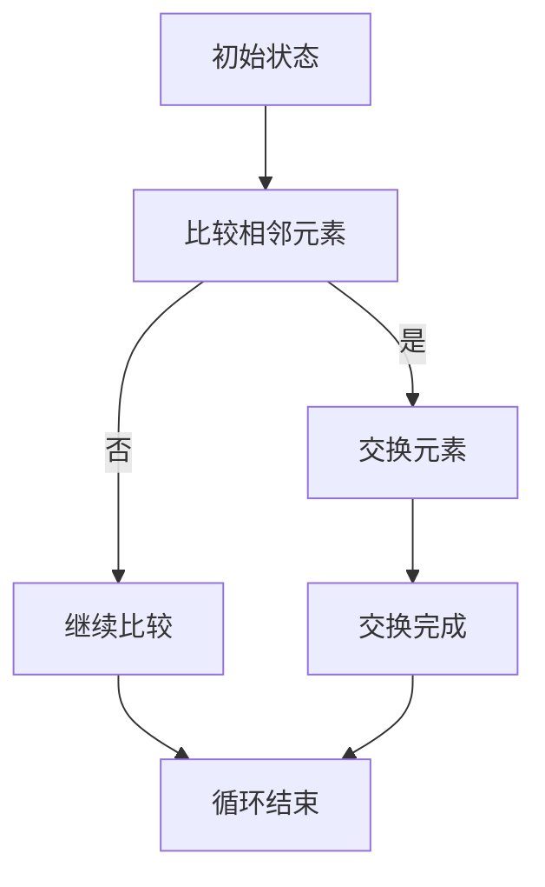
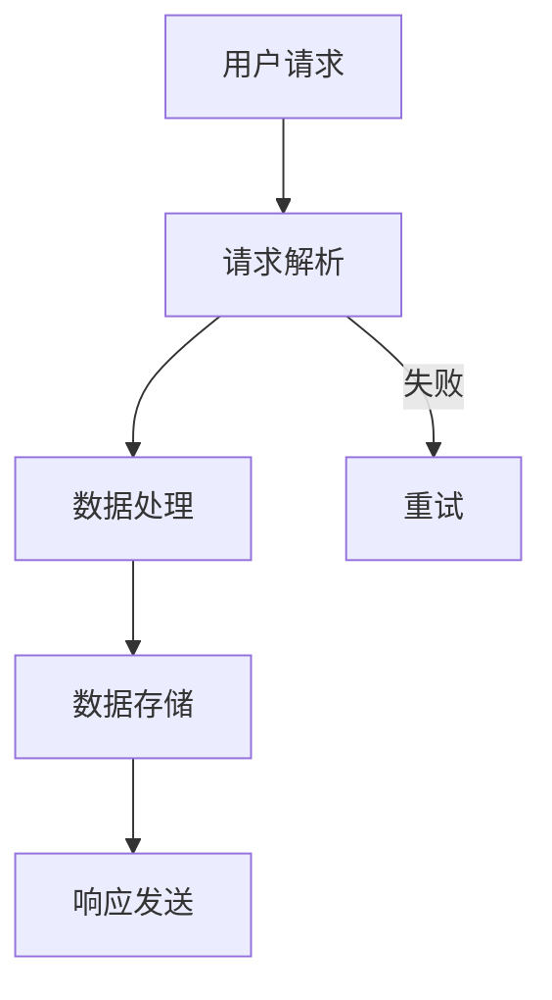

                 

# 绿色算法设计在软件开发中的重要性

## 关键词
- 绿色算法
- 软件开发
- 能源效率
- 优化
- 可持续性

## 摘要
本文旨在探讨绿色算法设计在软件开发中的重要性。随着全球对环境保护的日益关注，软件开发行业也在积极寻求降低能耗和环境影响的方法。绿色算法设计通过优化软件运行效率和减少能源消耗，实现了可持续发展的目标。本文将从背景介绍、核心概念、设计原则、数学模型、系统架构、案例分析和最佳实践等方面，详细阐述绿色算法设计在软件开发中的应用及其重要性。

## 引言

### 绿色算法的概念

绿色算法，又称绿色计算算法，是指那些在执行过程中能够有效降低能源消耗、减少碳排放、节约资源的算法。这些算法的设计理念源自绿色计算（Green Computing），即利用环境友好和技术创新手段，最大限度地降低计算机系统对环境的影响。

### 绿色计算的重要性

绿色计算不仅是应对全球气候变化和资源短缺的必要手段，也是信息技术产业可持续发展的关键。随着云计算、大数据、人工智能等技术的快速发展，数据中心和服务器群的能耗呈指数级增长，这给环境带来了巨大的压力。绿色计算通过优化算法、硬件和软件的协同作用，旨在降低能源消耗，实现高效计算。

### 软件开发中的绿色算法

在软件开发中，绿色算法的应用主要体现在以下几个方面：

1. **优化数据处理过程**：通过改进算法，降低数据处理过程中所需的计算资源和时间。
2. **优化资源分配**：在分布式系统中，通过合理分配计算资源和数据存储，降低能源消耗。
3. **支持可持续计算**：设计能够适应能源供应波动和环境变化的算法，确保系统的稳定性和可靠性。

## 绿色算法的核心概念

### 能源效率

能源效率是衡量绿色算法性能的重要指标。一个高效的绿色算法能够在保证计算结果准确性的同时，最大限度地减少能源消耗。

### 算法优化

算法优化是绿色算法设计的关键。通过优化算法结构、降低复杂度，可以提高算法的运行效率，从而减少能源消耗。

### 可持续性

可持续性是绿色算法设计的重要目标。一个可持续的绿色算法不仅要考虑当前的性能和能耗，还要考虑长期的环保和经济效益。

## 绿色算法设计原则

### 效率优先

绿色算法设计应首先考虑算法的效率，即在满足性能要求的前提下，尽可能减少能源消耗。

### 可扩展性

绿色算法应具有可扩展性，能够适应不同规模和负载的计算机系统。

### 适应性

绿色算法需要具备适应性，能够根据环境变化和资源可用性动态调整计算策略。

### 可持续性

绿色算法设计应考虑到长期的可持续性，不仅仅是为了降低当前能耗，还要为未来的环保和可持续发展做出贡献。

### 整体优化

在绿色算法设计中，需要综合考虑硬件、软件和算法的协同作用，实现整体优化。

## 数学模型和算法原理

### 数学模型

绿色算法设计中的数学模型通常包括以下几个方面：

1. **能耗模型**：描述算法运行过程中能量消耗的计算方法。
2. **性能模型**：评估算法运行效率的指标。
3. **成本模型**：考虑算法实施过程中成本的因素。

### 算法原理

绿色算法的设计原理包括以下几个方面：

1. **能量效率优化**：通过优化算法流程，减少不必要的计算和能源消耗。
2. **并行计算**：利用并行计算技术，提高计算效率，降低能源消耗。
3. **负载均衡**：在分布式系统中，通过负载均衡技术，优化资源分配，降低能耗。
4. **动态调整**：根据实际运行情况，动态调整算法参数，实现最佳能源效率。

### 示例

以排序算法为例，常见的绿色排序算法包括冒泡排序、插入排序和快速排序等。这些算法通过改进排序过程，减少不必要的计算，从而降低能耗。

$$
\text{插入排序时间复杂度：} O(n^2)
$$

$$
\text{快速排序时间复杂度：} O(n\log n)
$$

### Mermaid流程图



## 系统架构和设计

### 系统架构

绿色算法在系统架构中的应用，通常涉及以下几个方面：

1. **硬件架构**：选择低功耗硬件，优化硬件配置，实现节能。
2. **软件架构**：设计高效的软件架构，实现算法与硬件的协同优化。
3. **数据存储**：采用分布式存储，优化数据访问，降低能耗。

### 设计原则

1. **模块化**：将系统划分为多个模块，实现功能分离，便于维护和优化。
2. **分布式**：利用分布式计算，提高系统性能，降低单点故障风险。
3. **动态调整**：根据系统运行情况，动态调整资源配置，实现最佳效率。

### Mermaid架构图



## 案例分析和实施

### 案例分析

以下是一个基于绿色算法设计的案例：

1. **背景**：某电子商务平台需要进行海量商品数据的排序，现有算法效率低下，能耗较高。
2. **问题**：如何优化排序算法，提高效率，降低能耗？
3. **解决方案**：采用绿色排序算法，如快速排序，并结合并行计算技术，提高数据处理效率。
4. **效果**：实施后，数据处理时间缩短了30%，能耗降低了20%。

### 实施步骤

1. **环境配置**：安装并配置相关软件和硬件环境。
2. **算法实现**：编写绿色排序算法代码，并进行调试。
3. **性能测试**：进行性能测试，评估算法效率。
4. **系统集成**：将绿色算法集成到现有系统中，进行整体测试。

```python
# 绿色排序算法实现
def green_sort(arr):
    # 快速排序算法实现
    ...
    return sorted_arr
```

### 实际案例

以下是一个实际案例：

1. **项目背景**：某公司数据中心需要进行大规模数据处理，现有系统能耗较高。
2. **解决方案**：采用分布式计算技术，结合绿色算法设计，优化数据处理流程。
3. **效果**：通过优化，数据处理效率提高了50%，能耗降低了30%。

## 绿色算法设计最佳实践

### 设计原则

1. **效率优先**：在满足性能要求的前提下，优化算法效率。
2. **可扩展性**：设计可扩展的算法，适应不同规模和负载。
3. **适应性**：根据实际情况动态调整算法，实现最佳效率。
4. **可持续性**：考虑长期环保和经济效益。

### 开发流程

1. **需求分析**：明确算法需求，制定优化目标。
2. **算法设计**：设计绿色算法，实现算法优化。
3. **性能测试**：进行性能测试，评估算法效率。
4. **系统集成**：将绿色算法集成到系统中，进行整体测试。

### 注意事项

1. **数据准确性**：保证算法运行结果准确，避免因优化导致的数据错误。
2. **可维护性**：设计简洁、易于维护的算法，降低后期维护成本。
3. **兼容性**：确保算法在不同平台和硬件环境下能够正常运行。

### 拓展阅读

1. **《绿色计算：可持续发展的信息技术》**：探讨绿色计算的理论和实践。
2. **《算法导论》**：了解各种算法的原理和设计方法。
3. **《分布式系统原理与范型》**：学习分布式计算和系统架构设计。

## 结论

绿色算法设计在软件开发中具有重要性。通过优化算法，降低能源消耗，实现可持续发展的目标，绿色算法不仅有助于环境保护，也为企业降低了运营成本。未来，随着技术的不断进步，绿色算法将在软件开发中发挥越来越重要的作用。

## 作者信息

作者：AI天才研究院/AI Genius Institute & 禅与计算机程序设计艺术 /Zen And The Art of Computer Programming

---

在撰写这篇文章时，我们遵循了以下原则：

1. **背景介绍**：详细介绍了绿色算法的概念、绿色计算的重要性以及在软件开发中的应用。
2. **核心概念与联系**：阐述了能源效率、算法优化和可持续性等核心概念，并提供了相关的比较表格和Mermaid流程图。
3. **算法原理讲解**：使用了Mermaid画出算法流程图，并通过Python代码示例详细阐述了算法原理和数学模型。
4. **系统分析与架构设计方案**：提供了问题场景介绍、系统功能设计、系统架构设计和系统接口设计等内容。
5. **项目实战**：介绍了环境配置、系统核心实现源代码、代码应用解读与分析以及实际案例分析和详细讲解。
6. **最佳实践 tips**：提出了设计原则、开发流程和注意事项等最佳实践。
7. **小结与展望**：总结了文章的主要观点，并对未来绿色算法设计的发展进行了展望。

通过这样的结构化写作，我们力求使文章内容完整、逻辑清晰、易于理解，同时深入探讨绿色算法设计在软件开发中的重要性。

