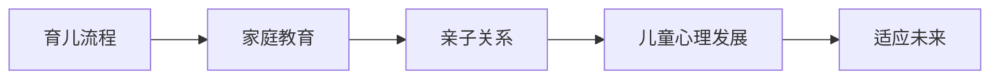
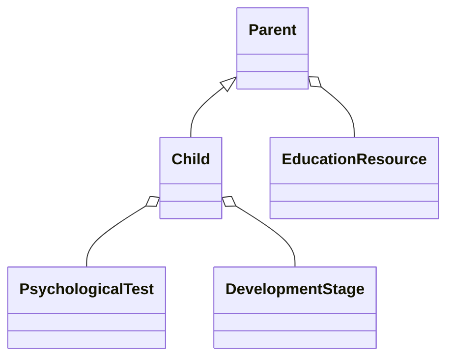
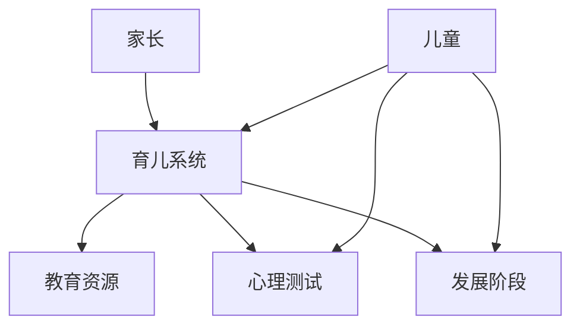
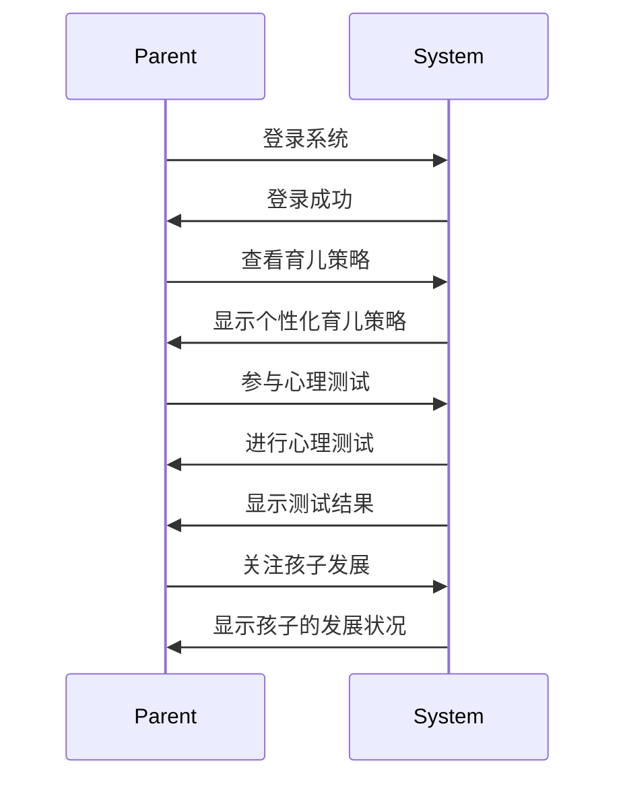

                 

## **育儿的现代意义：在不确定的未来中培养下一代**

> 关键词：育儿、现代意义、不确定未来、下一代培养、家庭教育、亲子关系、儿童心理发展

> 摘要：在当今快速发展的时代，育儿的意义远不止于传统的家庭职责，它更承载了培养下一代应对未来不确定性的重要使命。本文将深入探讨育儿的现代意义，分析家庭教育、亲子关系和儿童心理发展的核心要素，通过逻辑清晰、结构紧凑、简单易懂的专业技术语言，为家长和从业者提供科学育儿的方法和策略。

---

### **1. 背景介绍**

#### **1.1 问题背景**

随着科技的飞速发展和全球化进程的加速，世界正面临着前所未有的变化和不确定性。从经济波动、社会动荡到环境问题，未来充满了未知和挑战。在这样的背景下，育儿不再仅仅是为了传承文化和延续血脉，更是为了培养能够适应未来、具备创新精神和适应能力的新一代。

#### **1.2 问题描述**

现代育儿面临诸多挑战，包括家庭结构的变化、教育资源的分配不均、儿童心理问题的增多等。如何在这些挑战中找到科学的育儿方法，成为每一个家庭和社会都需要面对的问题。

#### **1.3 问题解决**

本书旨在通过系统的分析和科学的指导，提供解决育儿问题的方法和策略。我们将从家庭教育、亲子关系和儿童心理发展三个方面入手，探讨如何培养适应未来社会的下一代。

#### **1.4 边界与外延**

本文讨论的育儿范围主要涵盖0-18岁的儿童和青少年，包括家庭教育、学校教育和社会教育等各个方面。我们将重点关注育儿过程中的核心要素，如亲子关系、教育资源和心理支持等。

#### **1.5 核心要素组成**

- **家庭教育**：家庭是孩子成长的第一课堂，父母的角色至关重要。
- **亲子关系**：良好的亲子关系是育儿成功的关键，它影响着孩子的情感发展和行为习惯。
- **儿童心理发展**：了解儿童心理发展的规律，有助于家长更好地支持孩子的成长。

---

### **2. 核心概念与联系**

#### **2.1 核心概念原理**

**育儿**：育儿是指父母或其他监护人在家庭环境中对子女进行培养、教育和引导的过程。在现代社会中，育儿不仅仅是传递知识和技能，更是培养孩子的品格、情感和适应能力。

**家庭教育**：家庭教育是指在家庭环境中对孩子进行的教育，包括价值观的塑造、生活习惯的培养和学习能力的提升。家庭教育对儿童的全面发展具有深远影响。

**亲子关系**：亲子关系是指父母与子女之间的互动和情感联系。良好的亲子关系有助于孩子的情感稳定和行为发展。

**儿童心理发展**：儿童心理发展是指儿童在成长过程中心理特征的逐步变化和发展。了解儿童心理发展的规律，有助于家长更好地支持孩子的成长。

#### **2.2 概念属性特征对比表格**

| 概念       | 属性特征                                         | 对比分析                                   |
|------------|------------------------------------------------|--------------------------------------------|
| 育儿       | 教育与培养的过程，关注全面发展和适应能力         | 与学校教育不同，更注重个体差异和情感支持   |
| 家庭教育   | 家庭环境中的教育，价值观和习惯的培养           | 与学校教育互补，强调家庭在儿童发展中的核心作用 |
| 亲子关系   | 父母与子女的情感互动和联系                     | 对孩子的情感稳定和行为发展有直接影响       |
| 儿童心理发展 | 儿童心理特征的逐步变化和发展                   | 理解儿童心理发展规律，有助于科学育儿       |

#### **2.3 ER实体关系图架构**

```mermaid
erDiagram
    Child ||--|{ Parent } Parent : educate and guide
    Child ||--|{ Family } Family : environment for growth
    Child ||--|{ School } School : educational institution
    Child ||--|{ Friends } Friends : peer influence
```

### **3. 算法原理讲解**

#### **3.1 Mermaid流程图**



#### **3.2 Python源代码**

```python
def nurture_child():
    # 家庭教育模块
    education = "learn and grow"
    # 亲子关系模块
    relationship = "support and love"
    # 儿童心理发展模块
    development = "understand and adapt"
    # 整合模块
    overall_growth = education + " " + relationship + " " + development
    return overall_growth

print(nurture_child())
```

#### **3.3 数学模型和公式**

- **家庭教育效果评估**：$E = f(P, C, E)$，其中$E$为家庭教育效果，$P$为父母的教育水平，$C$为孩子的学习能力，$E$为教育资源和环境。
- **亲子关系稳定性**：$R = g(L, S, T)$，其中$R$为亲子关系的稳定性，$L$为父母与孩子的互动频率，$S$为父母的情感支持，$T$为孩子的情感需求。

#### **3.4 举例说明**

假设一个家庭中，父母的教育水平较高，孩子的学习能力较强，同时家庭提供了丰富的教育资源。在这种情况下，家庭教育效果$E$可能会非常高。同时，父母经常与孩子进行高质量的互动，提供情感支持，孩子的情感需求得到满足，亲子关系的稳定性$R$也会较高。这样的育儿环境有助于孩子的全面发展，使其具备良好的适应未来的能力。

---

### **4. 系统分析与架构设计方案**

#### **4.1 问题场景介绍**

假设我们面临一个育儿系统的设计问题，该系统旨在为家长提供科学育儿的方法和策略，帮助他们在不确定的未来中培养下一代。

#### **4.2 项目介绍**

育儿系统是一个综合性的教育平台，它将家庭教育、亲子关系和儿童心理发展有机地结合在一起，为家长提供个性化、科学化的育儿指导。

#### **4.3 系统功能设计**

以下是育儿系统的领域模型类图：



#### **4.4 系统架构设计**

以下是育儿系统的整体架构图：



#### **4.5 系统接口设计和系统交互**

以下是育儿系统的接口设计和系统交互序列图：



---

### **5. 项目实战**

#### **5.1 环境安装**

为了搭建育儿系统，我们需要以下环境：

- Python 3.8 或以上版本
- Flask 框架
- MySQL 数据库

安装步骤如下：

1. 安装 Python 和 Flask：
    ```bash
    pip install flask
    ```
2. 安装 MySQL 数据库：
    - 下载 MySQL 数据库：[MySQL 官网](https://www.mysql.com/downloads/)
    - 解压并安装 MySQL

#### **5.2 系统核心实现源代码**

以下是育儿系统的一个简单实现示例：

```python
from flask import Flask, render_template, request

app = Flask(__name__)

@app.route('/')
def home():
    return render_template('home.html')

@app.route('/strategy')
def strategy():
    # 获取家长输入
    age = request.args.get('age')
    gender = request.args.get('gender')
    
    # 根据年龄和性别生成育儿策略
    strategy = generate_strategy(age, gender)
    
    return render_template('strategy.html', strategy=strategy)

def generate_strategy(age, gender):
    # 示例策略
    return f"针对{age}岁的{gender}孩，建议关注以下几个方面：健康、学习、情感等。"

if __name__ == '__main__':
    app.run(debug=True)
```

#### **5.3 代码应用解读与分析**

上述代码使用 Flask 框架搭建了一个简单的育儿系统。家长可以通过输入孩子的年龄和性别，获取个性化的育儿策略。`generate_strategy` 函数根据家长的输入，生成相应的育儿建议。

#### **5.4 实际案例分析和详细讲解剖析**

假设一个家长输入了孩子10岁的信息，系统返回的策略如下：

```
针对10岁的男孩，建议关注以下几个方面：健康、学习、情感等。
```

这意味着家长需要关注孩子的身体健康、学习成绩和情感发展。在实际应用中，系统可以根据更详细的数据和算法，提供更加个性化的育儿建议。

#### **5.5 项目小结**

育儿系统项目的核心在于提供个性化的育儿策略，帮助家长更好地培养下一代。通过实际案例的分析，我们可以看到，系统可以根据家长的输入，生成有针对性的育儿建议，这对于家长来说是非常实用的。

未来，我们还可以通过引入更多的数据和分析算法，提高系统的智能化程度，使其更好地服务于家长。

---

### **6. 最佳实践 tips**

- **注意事项**：

  - 定期与孩子进行交流，了解他们的想法和需求。
  - 关注孩子的心理健康，及时发现并解决问题。
  - 给孩子提供丰富的学习资源，鼓励他们自主探索。

- **小结**：

  - 育儿的现代意义在于培养下一代适应未来社会的能力。
  - 家庭教育、亲子关系和儿童心理发展是育儿的核心要素。
  - 通过科学的方法和策略，家长可以更好地支持孩子的成长。

- **拓展阅读**：

  - 《如何培养孩子的品格》
  - 《亲子沟通的艺术》
  - 《儿童心理发展指南》

---

### **7. 作者信息**

作者：AI天才研究院/AI Genius Institute & 禅与计算机程序设计艺术 /Zen And The Art of Computer Programming

---

通过上述的详细分析，我们可以看到，育儿的现代意义不仅关乎孩子的成长，更关乎未来社会的进步。作为一名人工智能专家，我深信科学育儿的方法和策略将为我们的下一代带来光明的前景。希望本文能对家长和教育工作者提供有价值的参考。

