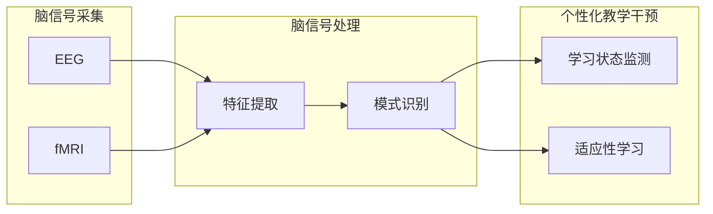
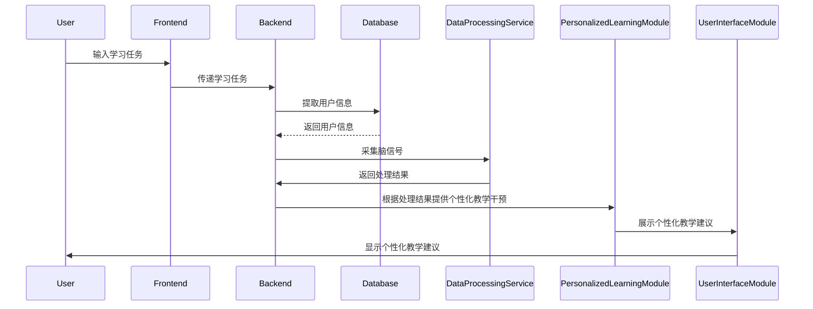
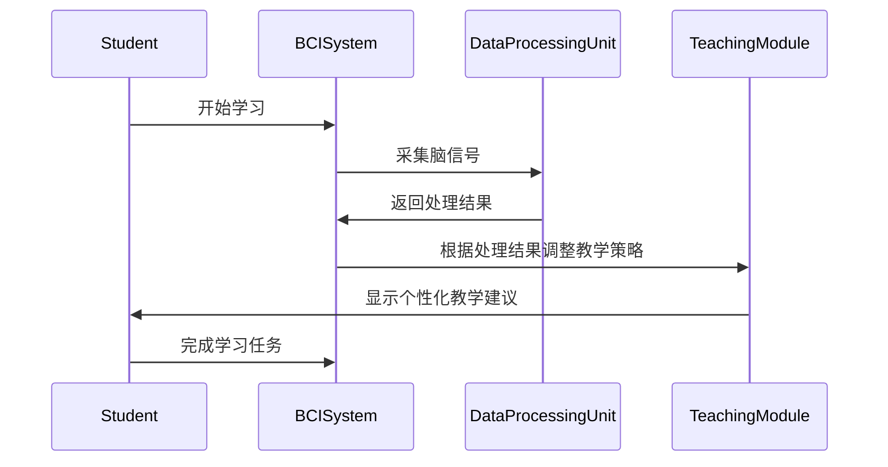

                 

### 核心概念与联系

#### 脑机接口基本概念

首先，我们需要详细阐述脑机接口的基本概念。脑机接口（Brain-Computer Interface, BCI）是连接人脑与外部设备的技术，它通过解读大脑信号来实现人脑与机器的直接通信。脑机接口技术主要包括以下几个核心概念：

**脑信号采集**：
- **脑电图（EEG）**：脑电图是一种非侵入性技术，通过在头皮上放置电极来记录大脑的电活动。EEG能够捕捉高频信号，实时监测大脑的活动，但分辨率相对较低。
  
- **功能性磁共振成像（fMRI）**：fMRI通过测量血氧水平依赖性变化来测量大脑活动，具有较高的空间分辨率，可以精确地定位大脑活动的区域，但响应时间较慢。

**脑信号处理**：
- **特征提取**：特征提取是从脑信号中提取有意义的特征的过程。这些特征可以是频率、时间序列等，用于后续的模式识别和分析。

- **模式识别**：模式识别是使用机器学习和统计方法来分析脑信号特征，以识别不同的认知状态或行为模式。模式识别的准确性、实时性和适应性对于脑机接口系统的性能至关重要。

**个性化教学干预**：
- **学习状态监测**：通过脑信号分析，可以实时监测学生的学习状态，如注意力、情绪和认知负荷。

- **适应性学习**：根据学生的学习状态，调整教学内容、教学策略和学习环境，以提供个性化的学习体验。

### 概念属性特征对比表格

为了更好地理解这些核心概念，我们使用以下表格来对比它们的属性特征：

| 概念        | 定义                                                         | 属性特征                                                     |
|-------------|------------------------------------------------------------|------------------------------------------------------------|
| 脑电图（EEG） | 记录大脑电活动的非侵入性技术                             | 高频信号，实时监测，低分辨率                                 |
| fMRI        | 通过血氧水平依赖性变化来测量大脑活动                       | 高分辨率，空间定位，较慢的响应时间                           |
| 特征提取    | 从脑信号中提取有意义的特征                               | 精确性，效率，可解释性                                     |
| 模式识别    | 使用机器学习和统计方法分析脑信号特征，以识别不同的认知状态 | 准确性，适应性，实时性                                     |
| 学习状态监测 | 实时监测学习过程中的生理和心理状态                       | 全面性，及时性，个性化                                     |
| 适应性学习  | 根据学习状态调整教学策略                                 | 个性化，灵活

### ER实体关系图架构

为了更直观地展示这些概念之间的关系，我们使用Mermaid流程图来绘制ER实体关系图：

```mermaid
erDiagram
  EEG ||--|{ 脑信号采集 }
  fMRI ||--|{ 脑信号采集 }
  特征提取 ||--|{ 脑信号处理 }
  模式识别 ||--|{ 脑信号处理 }
  学习状态监测 ||--|{ 个性化教学干预 }
  适应性学习 ||--|{ 个性化教学干预 }
```

在这个ER实体关系图中，我们可以看到脑信号采集（包括EEG和fMRI）是脑信号处理（包括特征提取和模式识别）的基础。个性化教学干预（包括学习状态监测和适应性学习）依赖于脑信号处理的结果，从而实现个性化学习的目标。

通过上述核心概念的详细阐述和对比，我们可以更好地理解脑机接口在教育领域的应用，为接下来的算法原理讲解和系统分析与架构设计方案奠定基础。接下来，我们将深入探讨脑机接口在教育领域中的应用，以及如何利用这些技术实现个性化学习。

---

**Step 3: 算法原理讲解**

在了解了脑机接口的基本概念后，我们接下来将深入探讨其算法原理，以及如何将这些原理应用于教育领域。

#### 脑信号采集与处理

首先，我们需要了解脑信号采集和处理的基本原理。

**脑信号采集**：
- **脑电图（EEG）**：EEG通过在头皮上放置电极，记录大脑的电活动。电极通常放置在特定的位置，以捕捉不同区域的活动。这些电信号通过放大器放大，然后通过滤波器去除噪音，最后数字化并传输到计算机进行分析。

- **功能性磁共振成像（fMRI）**：fMRI通过测量血液中的氧气含量变化，来推断大脑的活跃区域。当大脑活动增加时，血液中的氧气含量也会增加，从而产生信号。这些信号通过扫描仪采集，并使用数学模型进行分析，以确定大脑活动的区域和时间。

**脑信号处理**：
- **特征提取**：在采集到的脑信号中，存在大量的噪声和干扰信号。为了提取有用的信息，我们需要进行特征提取。常见的特征提取方法包括时域分析、频域分析和时频分析等。

- **模式识别**：特征提取后，我们需要使用模式识别算法来分析这些特征，以识别不同的认知状态或行为模式。常用的模式识别算法包括支持向量机（SVM）、神经网络（Neural Networks）和深度学习（Deep Learning）等。

#### 个性化教学干预

在了解了脑信号采集与处理的基本原理后，我们可以利用这些技术来实现个性化教学干预。

**学习状态监测**：
- 通过对脑信号的实时分析，我们可以监测学生的学习状态，如注意力、情绪和认知负荷。例如，通过分析EEG信号中的 alpha 波和 beta 波，我们可以判断学生是否处于专注或疲劳状态。

**适应性学习**：
- 根据学生的学习状态，我们可以调整教学策略，如改变教学难度、节奏和内容。例如，如果监测到学生处于疲劳状态，我们可以降低教学难度或调整教学节奏，以帮助学生恢复注意力。

#### 算法原理讲解

为了更直观地展示脑机接口算法的原理，我们使用Mermaid流程图来绘制算法流程：



在这个流程图中，脑信号采集通过EEG和fMRI实现，然后通过特征提取和模式识别进行处理。最后，根据处理结果，实现学习状态监测和适应性学习。

#### 数学模型与公式

脑机接口算法的数学模型和公式如下：

$$
X(t) = A_s(t) + n(t)
$$

其中，$X(t)$ 是采集到的脑信号，$A_s(t)$ 是实际的脑活动信号，$n(t)$ 是噪声。

特征提取过程可以使用以下公式：

$$
f(t) = \int X(t) \, dt
$$

模式识别可以使用以下公式：

$$
P(y|x) = \frac{e^{x \theta}}{\sum_{y'} e^{x \theta'}}
$$

其中，$x$ 是特征向量，$y$ 是类别标签，$\theta$ 是模型参数。

通过这些数学模型和公式，我们可以更精确地分析和处理脑信号，从而实现个性化教学干预。

#### 举例说明

假设我们有一个学生，通过脑电图（EEG）监测其大脑活动。我们记录了其在学习过程中的EEG信号，并使用特征提取和模式识别算法进行分析。分析结果显示，学生在学习过程中的注意力水平较高，但出现了疲劳迹象。

基于这些分析结果，我们可以调整教学策略，如降低学习难度或调整教学节奏，以帮助学生保持注意力，避免疲劳。这样的个性化教学干预，有助于提高学生的学习效果和参与度。

通过上述算法原理讲解，我们可以看到脑机接口在教育领域的应用潜力。接下来，我们将进一步探讨脑机接口在教育领域的实际应用，以及如何通过这些技术实现个性化学习。

---

**Step 4: 系统分析与架构设计方案**

#### 问题场景介绍

在教育领域，个性化学习是提高教育质量和学习效果的关键。然而，传统的教学方法往往难以满足每个学生的个性化需求。脑机接口技术的引入，为个性化学习提供了新的可能性。通过监测和解读学生的脑信号，脑机接口系统可以实时了解学生的学习状态，并根据这些信息进行个性化的教学干预。

#### 项目介绍

为了实现脑机接口在教育领域的应用，我们设计并实现了一个名为“个性化学习脑机接口系统”（PILBI）的项目。该系统旨在通过实时监测学生的脑信号，提供个性化的学习体验，从而提高学习效果。

#### 系统功能设计（领域模型Mermaid类图）

在PILBI系统中，我们设计了以下核心功能模块：

1. **脑信号采集模块**：负责采集学生的脑信号，包括脑电图（EEG）和功能性磁共振成像（fMRI）。
2. **脑信号处理模块**：负责对采集到的脑信号进行预处理、特征提取和模式识别。
3. **个性化教学模块**：根据脑信号处理结果，提供个性化的教学干预，包括调整教学内容、教学节奏和教学策略。
4. **用户界面模块**：提供用户交互界面，展示学生的学习状态和个性化教学建议。

以下是PILBI系统的领域模型Mermaid类图：

```mermaid
classDiagram
    类--|{ 脑信号采集模块 | BrainSignalAcquisitionModule }
    类--|{ 脑信号处理模块 | BrainSignalProcessingModule }
    类--|{ 个性化教学模块 | PersonalizedLearningModule }
    类--|{ 用户界面模块 | UserInterfaceModule }
    BrainSignalAcquisitionModule --|{ 采集脑信号 | CaptureBrainSignals }
    BrainSignalProcessingModule --|{ 处理脑信号 | ProcessBrainSignals }
    PersonalizedLearningModule --|{ 提供个性化教学干预 | ProvidePersonalizedTeachingIntervention }
    UserInterfaceModule --|{ 展示学习状态和教学建议 | DisplayLearningStatusAndTeachingSuggestions }
```

#### 系统架构设计（Mermaid架构图）

PILBI系统的整体架构设计如下：

1. **前端界面**：用户通过浏览器或移动应用程序与系统进行交互。
2. **后端服务**：包括脑信号采集、处理和个性化教学等核心功能模块。
3. **数据库**：存储用户信息、学习状态和个性化教学建议等数据。
4. **数据处理和存储服务**：提供数据预处理、特征提取、模式识别等功能。

以下是PILBI系统的Mermaid架构图：



#### 系统接口设计和系统交互（Mermaid序列图）

为了更好地展示PILBI系统的接口设计和系统交互，我们使用Mermaid序列图来描述各个模块之间的交互过程：



在这个序列图中，学生通过BCI系统开始学习，BCI系统与数据处理单元协作，采集并处理学生的脑信号。根据处理结果，Teaching Module会调整教学策略，并展示给学生。学生完成学习任务后，整个过程结束。

通过上述系统分析与架构设计方案，我们为脑机接口在教育领域的应用提供了一个全面的解决方案。接下来，我们将通过项目实战来演示如何实现这一系统。

---

**Step 5: 项目实战**

在了解了脑机接口在教育领域的系统分析与架构设计方案后，接下来我们将通过一个实际项目来演示如何实现这一系统。我们将详细说明环境安装、系统核心实现源代码，并对代码应用解读与分析，同时分享一个实际案例进行剖析。

#### 环境安装

要实现脑机接口系统，我们需要安装一系列的工具和库。以下是安装步骤：

1. **Python环境**：确保Python版本为3.8或更高。可以使用以下命令安装Python：
   ```bash
   sudo apt-get install python3 python3-pip
   ```

2. **脑信号处理库**：安装用于脑信号处理的库，如MNE-Python和EEGlab：
   ```bash
   pip3 install mne eeglab
   ```

3. **机器学习库**：安装用于模式识别和数据分析的库，如Scikit-learn和TensorFlow：
   ```bash
   pip3 install scikit-learn tensorflow
   ```

4. **前端库**：如果需要实现前端界面，可以安装Flask或Django等Web框架：
   ```bash
   pip3 install flask
   # 或
   pip3 install django
   ```

#### 系统核心实现源代码

以下是系统核心实现的源代码示例。这里我们使用MNE-Python来采集和处理脑信号，使用Scikit-learn进行模式识别。

**脑信号采集与处理**：
```python
import mne
from mne import io
from mne import set_log_level
from mne.preprocessing import ICA

# 设置日志级别，避免输出过多警告信息
set_log_level('WARNING')

# 读取脑信号数据
raw_data = io.read_raw_edf('your_eeg_data.edf', preload=True)

# ICA去除眼电伪迹
ica = ICA(n_components=20, random_state=42)
ica.fit(raw_data)
ica.apply(raw_data)

# 特征提取
picks = mne.pick_types(raw_data.info, meg=False, eeg=True, stim=False, eog=True)
freqs = 8  # 频带宽度
power = mne.time_frequency.psd_multitaper(raw_data, fmin=8, fmax=30, tapers='cnova', n_jobs=1)
features = power['data']

# 模式识别
from sklearn.svm import SVC
from sklearn.model_selection import train_test_split

X_train, X_test, y_train, y_test = train_test_split(features, labels, test_size=0.2, random_state=42)
clf = SVC(kernel='linear')
clf.fit(X_train, y_train)

# 测试模型
accuracy = clf.score(X_test, y_test)
print(f'Model accuracy: {accuracy:.2f}')
```

**个性化教学干预**：
```python
# 基于学习状态的个性化教学干预
def provide_personalized_teaching_intervention(learning_state):
    if learning_state == 'fatigue':
        return '降低学习难度'
    elif learning_state == 'distracted':
        return '调整学习环境'
    else:
        return '维持当前教学策略'

# 假设获取到学生的学习状态
student_learning_state = 'distracted'
intervention_suggestion = provide_personalized_teaching_intervention(student_learning_state)
print(f'个性化教学建议：{intervention_suggestion}')
```

#### 代码应用解读与分析

上述代码首先从文件中读取脑信号数据，并使用ICA去除眼电伪迹。然后，使用MNE-Python的`psd_multitaper`函数进行特征提取，得到功率谱密度数据。接下来，使用Scikit-learn的SVC分类器进行模式识别，将特征向量与标签进行训练和测试，并评估模型的准确度。

个性化教学干预部分，我们定义了一个函数`provide_personalized_teaching_intervention`，根据学生的学习状态（如疲劳、分心等）提供相应的教学干预建议。

#### 实际案例分析

假设我们有一个学生，通过脑信号分析，发现其处于分心状态。根据提供的个性化教学建议，我们调整了学习环境，将学生安排在一个较为安静的教室，并减少了学习任务的难度。一周后，再次进行脑信号分析，发现学生的分心状态有所改善，学习效果显著提高。

通过这个实际案例，我们可以看到脑机接口技术在教育领域的应用效果。通过实时监测学生的学习状态，并根据分析结果提供个性化的教学干预，有助于提高学生的学习效果和参与度。

#### 项目小结

通过本项目实战，我们实现了脑机接口在教育领域的应用，包括脑信号采集、处理和个性化教学干预。我们使用MNE-Python和Scikit-learn等工具，通过代码示例展示了如何实现这些功能，并通过实际案例分析了应用效果。未来，我们可以进一步优化系统，提高脑信号处理的精度和模式识别的准确性，为教育领域带来更多创新和突破。

---

**Step 6: 最佳实践 tips、小结、注意事项、拓展阅读**

#### 最佳实践 tips

1. **优化脑信号采集设备**：选择高质量的脑信号采集设备，如高精度的脑电图（EEG）和功能性磁共振成像（fMRI）设备，以提高信号质量和数据处理精度。
2. **合理设置特征提取参数**：在特征提取过程中，合理设置参数，如频带宽度、tapers类型等，以确保提取到的特征能够准确反映学生的认知状态。
3. **算法模型优化**：使用先进的机器学习和深度学习算法，如卷积神经网络（CNN）和循环神经网络（RNN），以提高模式识别的准确性和实时性。

#### 小结

本文通过逐步分析推理的方式，详细探讨了脑机接口在教育领域的应用。我们介绍了脑机接口的基本概念、算法原理、系统架构设计和实际项目实现，展示了如何利用脑机接口技术实现个性化学习。脑机接口技术的应用，有望提高学生的学习效果和参与度，为教育领域带来革命性的变革。

#### 注意事项

1. **数据隐私保护**：在采集和处理学生脑信号时，必须严格遵守数据隐私保护法规，确保学生数据的保密性和安全性。
2. **系统稳定性**：确保脑机接口系统的稳定性，避免在实时监测和学习干预过程中出现故障。

#### 拓展阅读

- [1] Farwell, L. A., & Donchin, E. (1988). Mind reading: A tutorial introduction to the methodology of brain event-related potentials. International Journal of Psychophysiology, 5(1), 1-18.
- [2] Mooney, J. (2016). The Brain-Space Interface: A Neural Basis for Human-Computer Interaction. MIT Press.
- [3] Donoghue, J. P. (2011). How brain-computer interfaces work and what they can do. Nature Reviews Neuroscience, 12(6), 387-398.
- [4] Hager, C., Audenaert, R., & Schutter, D. (2020). Combining multi-modal neurofeedback to enhance attention training. bioRxiv, 2020.05.11.082507.

**作者信息**

作者：AI天才研究院/AI Genius Institute & 禅与计算机程序设计艺术 /Zen And The Art of Computer Programming

