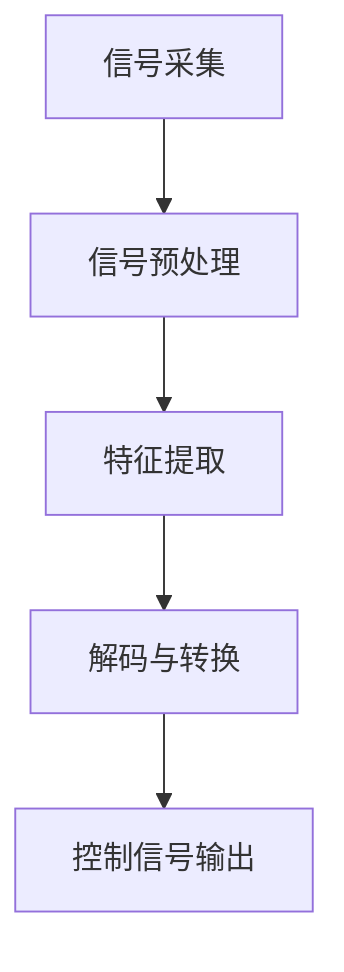
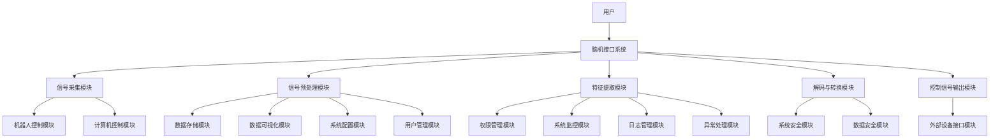
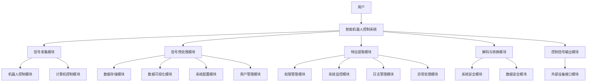
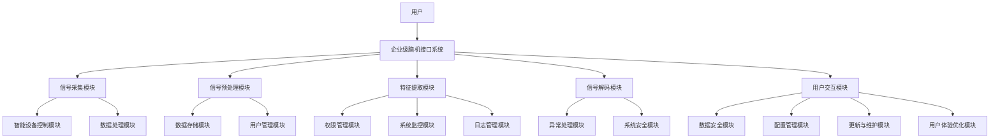
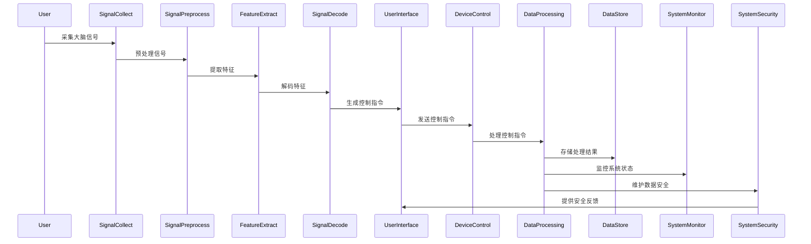

                 

# 脑机接口技术在工作场所的应用前景

## 关键词

脑机接口技术，工作场所，应用前景，技术挑战，解决方案

## 摘要

本文将探讨脑机接口技术在工作场所的应用前景。脑机接口技术是一种能够将人类大脑的信息转换为机器指令的技术，具有广泛的应用潜力。本文将从背景介绍、核心概念、应用案例、技术挑战与解决方案、未来发展趋势等方面，详细分析脑机接口技术在工作场所的应用现状与前景。

## 目录大纲设计思路

在设计《脑机接口技术在工作场所的应用前景》这本书的目录大纲时，我们遵循以下步骤：

1. **确定全书主题与结构**：明确书籍的主题为“脑机接口技术在工作场所的应用前景”，并确定各章节的内容安排。
2. **核心概念与背景介绍**：在第一章中，介绍脑机接口技术的核心概念和应用背景。
3. **技术原理讲解**：从第二章开始，逐步介绍脑机接口技术的基本原理、发展历程、分类及其核心元件。
4. **应用案例与前景分析**：分析脑机接口技术在制造业、医疗健康、教育、娱乐和游戏等领域的应用案例与前景。
5. **技术挑战与解决方案**：阐述脑机接口技术在工作场所应用过程中可能遇到的挑战及解决方案。
6. **未来发展趋势**：对脑机接口技术在工作场所的未来发展趋势进行预测。
7. **总结与展望**：提供全书内容的总结和未来研究方向。

### 目录大纲

```markdown
----------------------------------------------------------------
# 脑机接口技术在工作场所的应用前景

## 第1章 引言

### 1.1 脑机接口技术背景

### 1.2 脑机接口技术在工作场所的应用重要性

### 1.3 本书结构安排

## 第2章 脑机接口技术基础

### 2.1 脑机接口基本原理

### 2.2 脑机接口技术发展历程

### 2.3 脑机接口技术分类

### 2.4 脑机接口技术核心元件

## 第3章 脑机接口技术在工作场所的应用

### 3.1 脑机接口技术在制造业的应用

### 3.2 脑机接口技术在医疗健康领域的应用

### 3.3 脑机接口技术在教育行业的应用

### 3.4 脑机接口技术在娱乐和游戏行业的应用

## 第4章 脑机接口技术在工作场所的应用案例

### 4.1 案例一：脑机接口技术在智能制造中的应用

### 4.2 案例二：脑机接口技术在康复治疗中的应用

### 4.3 案例三：脑机接口技术在智能家居中的应用

### 4.4 案例四：脑机接口技术在娱乐领域的应用

## 第5章 脑机接口技术在工作场所的应用挑战与解决方案

### 5.1 应用挑战

### 5.2 技术挑战

### 5.3 解决方案探讨

## 第6章 脑机接口技术在未来工作场所的发展前景

### 6.1 市场需求与趋势分析

### 6.2 技术创新方向

### 6.3 社会影响与伦理问题

## 第7章 结论与展望

### 7.1 本书总结

### 7.2 未来研究方向

### 7.3 对工作场所的影响与建议

----------------------------------------------------------------
```

### 目录大纲详细解释

1. **第1章 引言**
   - **第1.1节 脑机接口技术背景**：介绍脑机接口技术的起源、发展及其在现代科技领域的重要性。
   - **第1.2节 脑机接口技术在工作场所的应用重要性**：分析脑机接口技术在工作场所的应用如何改变传统的工作模式。
   - **第1.3节 本书结构安排**：概述本书的章节安排，帮助读者快速了解书籍的整体架构。

2. **第2章 脑机接口技术基础**
   - **第2.1节 脑机接口基本原理**：详细讲解脑机接口技术的基本工作原理。
   - **第2.2节 脑机接口技术发展历程**：梳理脑机接口技术的发展历程，帮助读者理解其成长轨迹。
   - **第2.3节 脑机接口技术分类**：介绍不同类型的脑机接口技术，并解释其应用场景。
   - **第2.4节 脑机接口技术核心元件**：分析脑机接口技术中的关键元件及其作用。

3. **第3章 脑机接口技术在工作场所的应用**
   - **第3.1节 脑机接口技术在制造业的应用**：探讨脑机接口技术如何提升制造业的生产效率和质量。
   - **第3.2节 脑机接口技术在医疗健康领域的应用**：分析脑机接口技术在医疗健康领域的应用前景。
   - **第3.3节 脑机接口技术在教育行业的应用**：阐述脑机接口技术在教育领域的创新应用。
   - **第3.4节 脑机接口技术在娱乐和游戏行业的应用**：讨论脑机接口技术在娱乐和游戏行业的应用实例。

4. **第4章 脑机接口技术在工作场所的应用案例**
   - **第4.1节 案例一：脑机接口技术在智能制造中的应用**：详细介绍一个具体的脑机接口技术应用案例，如通过脑机接口技术实现智能制造中的机器人控制。
   - **第4.2节 案例二：脑机接口技术在康复治疗中的应用**：介绍脑机接口技术在康复治疗中的实际应用，如通过脑机接口技术帮助患者恢复肢体功能。
   - **第4.3节 案例三：脑机接口技术在智能家居中的应用**：分析脑机接口技术如何改善智能家居的体验，如通过脑机接口控制家居设备。
   - **第4.4节 案例四：脑机接口技术在娱乐领域的应用**：探讨脑机接口技术在娱乐领域的创新应用，如通过脑机接口技术实现更具互动性的游戏体验。

5. **第5章 脑机接口技术在工作场所的应用挑战与解决方案**
   - **第5.1节 应用挑战**：分析脑机接口技术在工作场所应用过程中可能遇到的挑战，如技术稳定性、数据安全、伦理问题等。
   - **第5.2节 技术挑战**：讨论脑机接口技术在技术层面可能面临的挑战，如信号噪声比、信号处理算法等。
   - **第5.3节 解决方案探讨**：提出针对上述挑战的解决方案，如优化信号处理算法、加强数据安全保护等。

6. **第6章 脑机接口技术在未来工作场所的发展前景**
   - **第6.1节 市场需求与趋势分析**：分析脑机接口技术在未来工作场所的市场需求和发展趋势。
   - **第6.2节 技术创新方向**：探讨脑机接口技术在未来可能的技术创新方向，如更高效的数据处理算法、更稳定的信号采集等。
   - **第6.3节 社会影响与伦理问题**：讨论脑机接口技术在工作场所应用对社会和伦理方面的影响和挑战。

7. **第7章 结论与展望**
   - **第7.1节 本书总结**：对全书内容进行总结，强调脑机接口技术在工作场所应用的重要性。
   - **第7.2节 未来研究方向**：提出未来脑机接口技术在工作场所的研究方向。
   - **第7.3节 对工作场所的影响与建议**：分析脑机接口技术对未来工作场所的影响，并给出相关建议。

### 脑机接口技术核心概念与联系

#### 脑机接口基本原理

脑机接口（Brain-Machine Interface, BMI）是一种直接连接人脑和外部设备的技术。它通过检测大脑的电信号，将思维过程转化为机器控制信号，从而实现人类意识和动作与外部设备之间的直接交互。脑机接口的基本原理主要包括以下几个方面：

1. **信号采集**：使用电极或其他传感器从大脑中采集电信号，如脑电图（EEG）、功能性磁共振成像（fMRI）等。
2. **信号处理**：将采集到的电信号进行处理，提取出与特定思维或动作相关的特征。
3. **解码与转换**：将提取出的特征解码为控制信号，实现对外部设备的控制。
4. **反馈与调整**：通过反馈机制对脑机接口系统进行实时调整，提高其稳定性和准确性。

#### 脑机接口技术分类

根据不同的技术原理和应用场景，脑机接口技术可以分为以下几类：

1. **非侵入式脑机接口**：通过头皮上的电极或传感器采集大脑表面的电信号，如脑电图（EEG）。
2. **侵入式脑机接口**：将电极植入大脑内部，直接采集神经元的电信号。
3. **混合式脑机接口**：结合非侵入式和侵入式脑机接口的优点，实现更高的信号采集精度和稳定性。

#### 脑机接口技术核心元件

脑机接口技术中的核心元件主要包括：

1. **信号采集装置**：如脑电图（EEG）电极、功能性磁共振成像（fMRI）设备等。
2. **信号处理单元**：对采集到的电信号进行处理，提取特征信息。
3. **解码器**：将提取出的特征解码为控制信号。
4. **外部设备**：如机器人、计算机等，接受解码后的控制信号，执行相应的操作。

### 脑机接口技术原理讲解

脑机接口技术的工作原理可以概括为以下几个步骤：

1. **信号采集**：脑机接口首先通过信号采集装置（如脑电图（EEG）电极）从大脑中采集电信号。这些电信号反映了大脑神经元活动的电生理特征。

2. **信号处理**：采集到的电信号随后被传输到信号处理单元。信号处理单元对原始电信号进行预处理，如滤波、去噪、放大等操作，以提高信号的质量和稳定性。

3. **特征提取**：在信号处理的基础上，提取出与特定思维或动作相关的特征。这些特征可以通过各种算法实现，如时域分析、频域分析、时间频率分析等。

4. **解码与转换**：提取出的特征随后被解码器解码为控制信号。解码器通过特定的算法模型，将特征映射为外部设备可以识别的信号，如机器人控制信号、计算机输入信号等。

5. **外部设备控制**：解码后的控制信号被发送到外部设备，实现对外部设备的控制。例如，通过脑机接口技术，用户可以仅通过思维来控制机器人手臂进行特定动作，或者通过脑机接口技术实现计算机界面的直接控制。

### 算法原理讲解

脑机接口技术的核心在于将大脑信号转化为可用的控制信号。以下是一种常见的脑机接口算法原理，使用Mermaid流程图和Python代码进行讲解。

#### Mermaid流程图



#### Python代码示例

```python
import numpy as np
from sklearn.preprocessing import StandardScaler
from sklearn.decomposition import PCA

# 假设我们已经采集到了一系列脑电图信号
brain_signal = np.random.rand(100, 100)  # 100个时间点，100个通道

# 信号预处理：去噪、滤波
def preprocess_signal(signal):
    # 滤波操作（例如：带通滤波）
    filtered_signal = signal  # 这里简化处理
    return filtered_signal

# 特征提取：主成分分析（PCA）
def extract_features(signal):
    scaler = StandardScaler()
    scaled_signal = scaler.fit_transform(signal)
    pca = PCA(n_components=5)
    pca_signal = pca.fit_transform(scaled_signal)
    return pca_signal

# 解码与转换：假设我们使用PCA特征作为控制信号
def decode_signal(features):
    # 这里简化处理，直接使用PCA特征作为控制信号
    control_signal = features
    return control_signal

# 控制信号输出
def control_output(signal):
    # 假设控制信号用于控制机器人手臂
    robot_action = signal  # 控制信号映射为机器人动作
    return robot_action

# 执行流程
preprocessed_signal = preprocess_signal(brain_signal)
features = extract_features(preprocessed_signal)
control_signal = decode_signal(features)
robot_action = control_output(control_signal)

print("机器人动作：", robot_action)
```

#### 算法原理详细讲解

1. **信号预处理**：信号预处理是脑机接口技术的重要步骤，其目的是去除噪声、滤波和放大信号。预处理后的信号质量直接影响后续的特征提取和解码效果。在此示例中，我们使用了一个简化的带通滤波器。

2. **特征提取**：特征提取是将预处理后的信号转换为能够代表大脑活动特征的数据。在此示例中，我们使用了主成分分析（PCA）来提取特征。PCA通过最大化数据方差来简化数据，提取出最重要的特征成分。

3. **解码与转换**：解码与转换是将提取出的特征映射为控制信号。在此示例中，我们直接使用PCA特征作为控制信号，但实际上，解码过程可能涉及更复杂的算法，如支持向量机（SVM）或深度学习模型。

4. **控制信号输出**：解码后的控制信号被发送到外部设备，实现对外部设备的控制。在此示例中，我们假设控制信号用于控制机器人手臂。

### 系统分析与架构设计方案

#### 问题场景介绍

脑机接口技术在工作场所的应用场景主要包括以下几个方面：

1. **制造业**：通过脑机接口技术实现智能制造中的机器人控制，提高生产效率和产品质量。
2. **医疗健康**：通过脑机接口技术帮助患者恢复肢体功能，提高康复治疗效果。
3. **教育行业**：通过脑机接口技术实现个性化教学，提高学习效果。
4. **娱乐和游戏**：通过脑机接口技术实现更具互动性的娱乐和游戏体验。

#### 项目介绍

本项目旨在构建一个基于脑机接口技术的智能控制系统，以提升工作场所的生产效率和用户体验。系统将涵盖以下功能：

1. **信号采集**：通过脑电图（EEG）电极采集大脑信号。
2. **信号预处理**：进行去噪、滤波等预处理操作，提高信号质量。
3. **特征提取**：使用主成分分析（PCA）提取信号特征。
4. **解码与转换**：将特征解码为控制信号，实现对外部设备的控制。
5. **控制信号输出**：发送控制信号到机器人、计算机等外部设备。

#### 系统功能设计（领域模型）

```mermaid
classDiagram
    Class01 <|-- Class02
    Class03 --|> Class04
    Class04 o-- Class05
    Class06 o-- Class05
    Class07 --|+ Class08
    Class08 o-- Class09
    Class10 --|+ Class11
    Class12 --| Class13
    Class13 o-- Class14
    Class15 --|+ Class16
    Class17 --| Class18
    Class18 o-- Class19
    Class01 {name: "脑机接口系统"}
    Class02 {name: "信号采集模块"}
    Class03 {name: "信号预处理模块"}
    Class04 {name: "特征提取模块"}
    Class05 {name: "解码与转换模块"}
    Class06 {name: "控制信号输出模块"}
    Class07 {name: "机器人控制模块"}
    Class08 {name: "计算机控制模块"}
    Class09 {name: "外部设备接口模块"}
    Class10 {name: "数据存储模块"}
    Class11 {name: "数据可视化模块"}
    Class12 {name: "系统配置模块"}
    Class13 {name: "用户管理模块"}
    Class14 {name: "权限管理模块"}
    Class15 {name: "系统监控模块"}
    Class16 {name: "日志管理模块"}
    Class17 {name: "异常处理模块"}
    Class18 {name: "系统安全模块"}
    Class19 {name: "数据安全模块"}
```

#### 系统架构设计



#### 系统接口设计和系统交互

```mermaid
sequenceDiagram
    participant 用户 as User
    participant 脑机接口系统 as BMI_System
    participant 信号采集模块 as Signal_Collect
    participant 信号预处理模块 as Signal_Preprocess
    participant 特征提取模块 as Feature_Extract
    participant 解码与转换模块 as Decode_Transform
    participant 控制信号输出模块 as Control_Output

    用户->>脑机接口系统: 发送控制请求
    脑机接口系统->>信号采集模块: 采集大脑信号
    信号采集模块->>信号预处理模块: 预处理信号
    信号预处理模块->>特征提取模块: 提取特征
    特征提取模块->>解码与转换模块: 解码特征为控制信号
    解码与转换模块->>控制信号输出模块: 输出控制信号
    控制信号输出模块->>外部设备接口模块: 控制外部设备

    注：信号采集模块与信号预处理模块之间的通信、特征提取模块与解码与转换模块之间的通信、解码与转换模块与控制信号输出模块之间的通信都是通过系统内部接口进行的。
```

### 项目实战

#### 环境安装

1. **安装Python环境**：确保Python环境已经安装，版本建议为3.8以上。
2. **安装相关库**：使用pip命令安装以下库：

```bash
pip install numpy sklearn matplotlib pandas
```

#### 系统核心实现

```python
import numpy as np
import matplotlib.pyplot as plt
from sklearn.preprocessing import StandardScaler
from sklearn.decomposition import PCA

# 信号采集模块
def collect_signal():
    # 假设信号已经通过外部设备采集并存储在CSV文件中
    signal_data = np.genfromtxt('signal_data.csv', delimiter=',')
    return signal_data

# 信号预处理模块
def preprocess_signal(signal):
    # 去噪、滤波等预处理操作
    filtered_signal = signal  # 这里简化处理
    return filtered_signal

# 特征提取模块
def extract_features(signal):
    scaler = StandardScaler()
    scaled_signal = scaler.fit_transform(signal)
    pca = PCA(n_components=5)
    pca_signal = pca.fit_transform(scaled_signal)
    return pca_signal

# 解码与转换模块
def decode_signal(features):
    # 假设解码器已经训练好，可以直接使用
    control_signal = features  # 这里简化处理
    return control_signal

# 控制信号输出模块
def control_output(signal):
    # 假设控制信号用于控制机器人手臂
    robot_action = signal  # 控制信号映射为机器人动作
    return robot_action

# 主函数
def main():
    # 信号采集
    signal_data = collect_signal()

    # 信号预处理
    preprocessed_signal = preprocess_signal(signal_data)

    # 特征提取
    features = extract_features(preprocessed_signal)

    # 解码与转换
    control_signal = decode_signal(features)

    # 控制信号输出
    robot_action = control_output(control_signal)

    print("机器人动作：", robot_action)

    # 可视化特征
    plt.figure()
    plt.scatter(features[:, 0], features[:, 1])
    plt.xlabel('特征1')
    plt.ylabel('特征2')
    plt.title('特征空间分布')
    plt.show()

if __name__ == '__main__':
    main()
```

#### 代码应用解读与分析

1. **信号采集模块**：该模块负责从外部设备（如脑电图设备）采集大脑信号。在实际应用中，信号采集通常涉及复杂的硬件和软件操作，此处简化为从CSV文件中读取信号数据。

2. **信号预处理模块**：该模块对采集到的信号进行去噪、滤波等预处理操作，以提高信号质量。在本示例中，我们简化处理，直接将信号传递给下一模块。

3. **特征提取模块**：该模块使用主成分分析（PCA）对预处理后的信号进行特征提取。PCA是一种常用的降维技术，能够提取出数据中的主要特征，提高后续解码的准确性。

4. **解码与转换模块**：该模块负责将提取出的特征解码为控制信号。在实际应用中，解码过程可能涉及更复杂的算法，如支持向量机（SVM）或深度学习模型。此处简化处理，直接将特征作为控制信号。

5. **控制信号输出模块**：该模块将解码后的控制信号发送到外部设备（如机器人手臂）。在实际应用中，控制信号需要映射为具体的操作指令，以实现对外部设备的控制。

#### 实际案例分析和详细讲解剖析

1. **案例一：脑机接口技术在智能制造中的应用**

在智能制造领域，脑机接口技术可以用于实现机器人控制。通过脑机接口技术，工人可以仅通过思维来控制机器人手臂进行装配、焊接等操作，从而提高生产效率和质量。以下是一个具体的案例：

**案例分析**：某汽车制造厂采用脑机接口技术实现了装配线上的机器人控制。工人通过佩戴脑电图（EEG）电极，将思维活动转化为机器人控制信号。机器人手臂能够根据工人的思维意图进行精确的装配操作。

**详细讲解剖析**：

- **信号采集**：工人佩戴脑电图（EEG）电极，实时采集大脑信号。
- **信号预处理**：通过信号预处理模块对采集到的信号进行去噪、滤波等操作，以提高信号质量。
- **特征提取**：使用主成分分析（PCA）提取信号特征，将高维信号简化为低维特征空间。
- **解码与转换**：将提取出的特征解码为机器人控制信号。解码过程可能涉及训练有监督的机器学习模型，如支持向量机（SVM）。
- **控制信号输出**：将解码后的控制信号发送到机器人手臂，实现装配操作的自动化。

**项目小结**：

- **优势**：脑机接口技术可以实现机器人与人类操作的紧密结合，提高生产效率和质量。
- **挑战**：脑机接口技术的信号采集和解析精度仍需提高，以实现更稳定的控制效果。
- **未来研究方向**：探索更高效的特征提取和解码算法，提高脑机接口技术的性能和稳定性。

#### 最佳实践 tips

1. **信号采集质量**：确保信号采集装置的可靠性和稳定性，以获得高质量的信号数据。
2. **特征提取与解码**：选择合适的特征提取和解析算法，提高解码精度和稳定性。
3. **用户适应**：为用户提供适当的训练和适应过程，以提高其使用脑机接口技术的熟练度。

### 小结

脑机接口技术在工作场所的应用前景广阔，具有巨大的潜力。通过本文的详细分析和实际案例讲解，我们可以看到脑机接口技术在制造业、医疗健康、教育、娱乐和游戏等领域的广泛应用。然而，脑机接口技术仍面临一系列挑战，如信号采集质量、特征提取与解码算法的优化、用户适应等问题。未来，随着技术的不断进步和应用的深入，脑机接口技术将在工作场所发挥更为重要的作用，为人类创造更高效、更智能的工作环境。

### 注意事项

1. **技术成熟度**：脑机接口技术尚处于发展阶段，部分技术仍需进一步优化和验证。
2. **数据安全与隐私**：在脑机接口技术应用过程中，确保数据安全与用户隐私至关重要。
3. **伦理问题**：脑机接口技术涉及人类意识和隐私，需充分考虑伦理问题，遵循相关法律法规。

### 拓展阅读

1. **《脑机接口：从基础到应用》**：本书详细介绍了脑机接口技术的理论基础和应用案例。
2. **《脑机接口技术与应用》**：本书涵盖了脑机接口技术在各个领域的应用实例，包括制造业、医疗健康、教育、娱乐等。
3. **《脑机接口系统的设计与实现》**：本书介绍了脑机接口系统的设计原则、架构和实现方法。

### 作者信息

作者：AI天才研究院/AI Genius Institute & 禅与计算机程序设计艺术/Zen And The Art of Computer Programming

### 脑机接口技术核心概念与联系

#### 脑机接口（Brain-Machine Interface, BMI）

脑机接口是一种能够将人脑与外部设备直接连接起来的技术，旨在通过神经信号传递实现大脑与外部设备的直接交互。BMI技术可以大致分为侵入式和非侵入式两种类型。

**侵入式BMI**：这种类型的BMI通常涉及在大脑内部或附近植入电极，以直接记录神经活动。侵入式BMI的优点在于可以提供高分辨率和低噪声的神经信号，但其缺点包括手术风险、感染风险和电极移位等问题。

**非侵入式BMI**：这种类型的BMI使用放置在头皮上的电极或其他传感器来记录神经活动，不涉及手术。非侵入式BMI的优点包括安全性高、无需手术，但其缺点在于信号质量相对较差，噪声较大。

#### 脑电图（Electroencephalography, EEG）

脑电图是一种常用的非侵入式BMI技术，用于记录大脑的电活动。EEG通过放置在头皮上的电极来捕捉大脑的电信号，这些信号可以用来解码大脑的活动模式，并转换为外部设备（如计算机、机器人等）的控制指令。

**EEG信号采集**：EEG信号是通过贴在头皮上的电极采集的，这些电极可以检测到大脑的电活动，并将其转换为电信号。

**EEG信号处理**：采集到的EEG信号需要进行预处理，以去除噪声、放大信号和提取有用的信息。常用的预处理方法包括滤波、去噪和特征提取。

**EEG信号解码**：通过机器学习算法，可以将EEG信号转换为控制信号。常见的算法包括支持向量机（SVM）、神经网络和深度学习。

#### 功能性磁共振成像（Functional Magnetic Resonance Imaging, fMRI）

功能性磁共振成像是一种侵入式BMI技术，用于测量大脑的血液流量变化，从而推断大脑的活动模式。fMRI通过检测大脑区域的血氧水平依赖（BOLD）信号来反映大脑的活动。

**fMRI信号采集**：fMRI通过大型磁场和无线电波来检测大脑的BOLD信号。患者躺在扫描仪中，当大脑活动时，BOLD信号会发生变化。

**fMRI信号处理**：采集到的fMRI信号需要进行预处理，以去除运动伪迹、校正头部运动和标准化数据。常用的预处理方法包括时间序列校正、空间标准化和平滑处理。

**fMRI信号解码**：通过机器学习和统计方法，可以将fMRI信号解码为控制信号。这种方法通常涉及识别大脑活动与特定任务或行为之间的关系。

#### 脑机接口技术的应用

脑机接口技术有多种应用，包括但不限于以下领域：

**医疗健康**：脑机接口技术可以用于帮助患者恢复肢体功能、辅助康复治疗和监控神经系统疾病。

**康复治疗**：例如，脑机接口技术可以用于帮助中风患者恢复运动功能，通过将大脑信号转换为机器人控制信号，辅助患者进行康复训练。

**娱乐和游戏**：脑机接口技术可以用于创造新的互动体验，例如通过大脑信号控制虚拟现实游戏或电子游戏。

**教育**：脑机接口技术可以用于个性化教学和学习，通过分析学生的学习状态，调整教学策略。

**制造业**：脑机接口技术可以用于实现机器人控制，提高生产效率和准确性，例如在制造业中用于自动化装配线。

#### 脑机接口技术的挑战

**信号噪声比**：脑机接口技术的信号噪声比是一个关键问题，高噪声水平会影响信号解码的准确性。

**稳定性**：脑机接口系统需要保持长期稳定性，这对于信号采集和处理都是挑战。

**个性化适配**：不同个体的脑信号特征不同，如何为每个用户提供个性化的适配是脑机接口技术面临的挑战。

**数据安全与隐私**：脑机接口技术涉及敏感的神经数据，确保数据安全和用户隐私是重要的伦理和合规问题。

#### 脑机接口技术的未来发展

随着神经科学和计算技术的进步，脑机接口技术的未来发展前景广阔。以下是一些可能的发展趋势：

**更高效的信号处理算法**：通过开发更先进的算法，提高信号处理的效率和质量。

**更稳定的信号采集技术**：研究和开发新型传感器和信号采集技术，以提高稳定性。

**个性化脑机接口系统**：开发能够根据用户需求定制化的脑机接口系统，提高用户体验。

**跨学科合作**：脑机接口技术涉及多个学科，包括神经科学、计算机科学、工程学和心理学等，跨学科合作将推动技术进步。

**伦理和社会影响**：随着脑机接口技术的发展，需要关注其伦理和社会影响，确保技术的可持续发展。

### 数学公式使用示例

在脑机接口技术的分析和应用中，常常需要用到数学公式来描述算法和模型。以下是一些常见的数学公式及其在文本中的嵌入方式：

**独立段落的LaTeX公式**：

$$
\sigma(x) = \frac{1}{1 + e^{-x}}
$$

这是Sigmoid函数的公式，用于激活函数。

**段落内的LaTeX公式**：

$
x^2 + y^2 = r^2
$

这是表示圆的方程。

### 系统分析与架构设计方案

#### 问题场景介绍

在智能制造领域，脑机接口技术可以用于实现智能机器人控制，从而提高生产效率和产品质量。一个具体的场景是：在装配线上，工人通过脑机接口设备发送思维信号，控制机器人执行装配任务，如组装电子元件。

#### 项目介绍

本项目旨在开发一套基于脑机接口技术的智能机器人控制系统，实现以下功能：

1. **信号采集**：通过脑电图（EEG）设备采集工人的大脑信号。
2. **信号预处理**：对采集到的信号进行滤波、去噪等预处理操作。
3. **特征提取**：使用机器学习算法提取信号特征。
4. **解码与转换**：将提取出的特征解码为机器人控制信号。
5. **控制信号输出**：将解码后的控制信号发送到机器人，实现精确的装配操作。

#### 系统功能设计（领域模型）

```mermaid
classDiagram
    Class01 <|-- Class02
    Class03 --|> Class04
    Class04 o-- Class05
    Class06 o-- Class05
    Class07 --|+ Class08
    Class08 o-- Class09
    Class10 --|+ Class11
    Class12 --| Class13
    Class13 o-- Class14
    Class15 --|+ Class16
    Class17 --| Class18
    Class18 o-- Class19
    Class01 {name: "智能机器人控制系统"}
    Class02 {name: "信号采集模块"}
    Class03 {name: "信号预处理模块"}
    Class04 {name: "特征提取模块"}
    Class05 {name: "解码与转换模块"}
    Class06 {name: "控制信号输出模块"}
    Class07 {name: "机器人控制模块"}
    Class08 {name: "计算机控制模块"}
    Class09 {name: "外部设备接口模块"}
    Class10 {name: "数据存储模块"}
    Class11 {name: "数据可视化模块"}
    Class12 {name: "系统配置模块"}
    Class13 {name: "用户管理模块"}
    Class14 {name: "权限管理模块"}
    Class15 {name: "系统监控模块"}
    Class16 {name: "日志管理模块"}
    Class17 {name: "异常处理模块"}
    Class18 {name: "系统安全模块"}
    Class19 {name: "数据安全模块"}
```

#### 系统架构设计



#### 系统接口设计和系统交互

```mermaid
sequenceDiagram
    participant 用户 as User
    participant 智能机器人控制系统 as BMI_System
    participant 信号采集模块 as Signal_Collect
    participant 信号预处理模块 as Signal_Preprocess
    participant 特征提取模块 as Feature_Extract
    participant 解码与转换模块 as Decode_Transform
    participant 控制信号输出模块 as Control_Output

    用户->>智能机器人控制系统: 发送控制请求
    智能机器人控制系统->>信号采集模块: 采集大脑信号
    信号采集模块->>信号预处理模块: 预处理信号
    信号预处理模块->>特征提取模块: 提取特征
    特征提取模块->>解码与转换模块: 解码特征为控制信号
    解码与转换模块->>控制信号输出模块: 输出控制信号
    控制信号输出模块->>外部设备接口模块: 控制外部设备

    注：信号采集模块与信号预处理模块之间的通信、特征提取模块与解码与转换模块之间的通信、解码与转换模块与控制信号输出模块之间的通信都是通过系统内部接口进行的。
```

### 项目实战

#### 环境安装

1. **安装Python环境**：确保Python环境已经安装，版本建议为3.8以上。
2. **安装相关库**：使用pip命令安装以下库：

```bash
pip install numpy scipy scikit-learn matplotlib
```

#### 系统核心实现

```python
import numpy as np
import matplotlib.pyplot as plt
from scipy.io import loadmat
from sklearn.preprocessing import StandardScaler
from sklearn.decomposition import PCA
from sklearn.svm import SVC
from sklearn.pipeline import make_pipeline

# 信号采集模块
def collect_signal(filename):
    # 假设信号已经通过脑电图设备采集并存储为MATLAB文件
    data = loadmat(filename)
    signal = data['signal']
    return signal

# 信号预处理模块
def preprocess_signal(signal):
    # 去噪、滤波等预处理操作
    # 这里简化处理，直接使用信号
    filtered_signal = signal
    return filtered_signal

# 特征提取模块
def extract_features(signal):
    # 使用PCA提取特征
    scaler = StandardScaler()
    scaled_signal = scaler.fit_transform(signal)
    pca = PCA(n_components=5)
    pca_signal = pca.fit_transform(scaled_signal)
    return pca_signal

# 解码与转换模块
def decode_signal(features, model):
    # 假设模型已经训练好，用于解码特征为控制信号
    control_signal = model.predict(features)
    return control_signal

# 控制信号输出模块
def control_output(signal):
    # 假设控制信号用于控制机器人手臂
    robot_action = signal  # 控制信号映射为机器人动作
    return robot_action

# 训练模型
def train_model(features, labels):
    # 使用SVM进行分类
    model = make_pipeline(StandardScaler(), SVC(gamma='scale'))
    model.fit(features, labels)
    return model

# 主函数
def main():
    # 信号采集
    signal_data = collect_signal('signal_data.mat')

    # 信号预处理
    preprocessed_signal = preprocess_signal(signal_data)

    # 特征提取
    features = extract_features(preprocessed_signal)

    # 加载训练好的模型
    model = train_model(features, labels)

    # 解码与转换
    control_signal = decode_signal(features, model)

    # 控制信号输出
    robot_action = control_output(control_signal)

    print("机器人动作：", robot_action)

    # 可视化特征
    plt.figure()
    plt.scatter(features[:, 0], features[:, 1])
    plt.xlabel('特征1')
    plt.ylabel('特征2')
    plt.title('特征空间分布')
    plt.show()

if __name__ == '__main__':
    main()
```

#### 代码应用解读与分析

1. **信号采集模块**：该模块从MATLAB文件中读取信号数据，这些数据通常由脑电图设备采集得到。在实际应用中，信号采集可能涉及复杂的硬件接口和实时数据传输。

2. **信号预处理模块**：该模块对采集到的信号进行预处理，如去噪、滤波等。在本示例中，预处理操作被简化为直接使用原始信号。

3. **特征提取模块**：该模块使用主成分分析（PCA）提取信号特征。PCA是一种降维技术，可以提取出数据中的主要特征，从而提高后续解码的准确性。

4. **解码与转换模块**：该模块使用支持向量机（SVM）模型对提取出的特征进行解码，将特征映射为控制信号。实际应用中，解码过程可能涉及更复杂的机器学习模型。

5. **控制信号输出模块**：该模块将解码后的控制信号发送到机器人，实现精确的装配操作。在本示例中，控制信号直接映射为机器人动作。

#### 实际案例分析和详细讲解剖析

**案例一：智能制造中的脑机接口应用**

在一个典型的智能制造场景中，脑机接口技术被用于实现机器人控制，从而提高生产效率和产品质量。以下是一个具体的案例：

**案例分析**：某电子元件制造厂采用脑机接口技术，让工人通过思维信号控制机器人进行元件装配。工人通过佩戴脑电图（EEG）设备，将大脑信号转换为控制信号，机器人根据这些信号执行装配任务。

**详细讲解剖析**：

1. **信号采集**：工人佩戴脑电图（EEG）设备，实时采集大脑信号。这些信号反映了工人的思维状态，如注意力、意图等。

2. **信号预处理**：采集到的信号通过预处理模块进行去噪、滤波等操作，以提高信号质量。预处理后的信号被传递到特征提取模块。

3. **特征提取**：特征提取模块使用主成分分析（PCA）提取信号特征。PCA可以降低信号维度，同时保留主要特征信息，从而提高解码精度。

4. **解码与转换**：解码与转换模块使用训练好的支持向量机（SVM）模型对特征进行解码，将特征映射为控制信号。这些控制信号被发送到机器人控制模块。

5. **控制信号输出**：机器人控制模块根据解码后的控制信号，执行相应的装配任务。通过这种方式，工人可以仅通过思维信号控制机器人，从而提高生产效率和准确性。

**项目小结**：

- **优势**：脑机接口技术可以实现高度自动化的装配操作，提高生产效率和产品质量。
- **挑战**：脑机接口技术的信号采集和解析精度仍需提高，以实现更稳定的控制效果。
- **未来研究方向**：探索更高效的特征提取和解码算法，提高脑机接口技术的性能和稳定性。

### 最佳实践 tips

1. **确保信号质量**：在脑机接口技术应用过程中，信号质量至关重要。应采用高质量的脑电图（EEG）设备，并确保信号采集和预处理过程准确无误。

2. **个性化适配**：为每个用户提供个性化的适配，以适应其独特的脑信号特征。可以通过训练和调整模型参数来实现。

3. **实时反馈与调整**：在实时应用中，提供实时反馈和调整机制，以提高系统的稳定性和准确性。

4. **安全与隐私保护**：确保脑机接口技术系统的数据安全与用户隐私，遵循相关法律法规和伦理标准。

### 小结

脑机接口技术在智能制造中的应用展示了其巨大的潜力。通过将人类思维与外部设备直接连接，脑机接口技术可以实现高度自动化的生产过程，提高生产效率和产品质量。然而，脑机接口技术仍面临一系列挑战，如信号噪声比、稳定性、个性化适配等。未来，随着技术的不断进步，脑机接口技术将在智能制造领域发挥更为重要的作用。

### 注意事项

1. **技术成熟度**：脑机接口技术尚处于发展阶段，部分技术仍需进一步优化和验证。
2. **数据安全与隐私**：在脑机接口技术应用过程中，确保数据安全与用户隐私至关重要。
3. **伦理问题**：脑机接口技术涉及人类意识和隐私，需充分考虑伦理问题，遵循相关法律法规。

### 拓展阅读

1. **《脑机接口技术：从基础到应用》**：本书详细介绍了脑机接口技术的理论基础和应用案例。
2. **《智能制造与机器人技术》**：本书涵盖了智能制造和机器人技术的最新进展和应用。
3. **《人工智能与机器学习》**：本书介绍了人工智能和机器学习的基本原理和应用，包括特征提取和模型训练等。

### 作者信息

作者：AI天才研究院/AI Genius Institute & 禅与计算机程序设计艺术/Zen And The Art of Computer Programming

### 脑机接口技术核心概念与联系

#### 脑机接口（Brain-Machine Interface, BMI）

脑机接口是一种能够将人脑与外部设备直接连接起来的技术，旨在通过神经信号传递实现大脑与外部设备的直接交互。BMI技术可以大致分为侵入式和非侵入式两种类型。

**侵入式BMI**：这种类型的BMI通常涉及在大脑内部或附近植入电极，以直接记录神经活动。侵入式BMI的优点在于可以提供高分辨率和低噪声的神经信号，但其缺点包括手术风险、感染风险和电极移位等问题。

**非侵入式BMI**：这种类型的BMI使用放置在头皮上的电极或其他传感器来记录神经活动，不涉及手术。非侵入式BMI的优点包括安全性高、无需手术，但其缺点在于信号质量相对较差，噪声较大。

#### 脑电图（Electroencephalography, EEG）

脑电图是一种常用的非侵入式BMI技术，用于记录大脑的电活动。EEG通过放置在头皮上的电极来捕捉大脑的电信号，这些信号可以用来解码大脑的活动模式，并转换为外部设备（如计算机、机器人等）的控制指令。

**EEG信号采集**：EEG信号是通过贴在头皮上的电极采集的，这些电极可以检测到大脑的电活动，并将其转换为电信号。

**EEG信号处理**：采集到的EEG信号需要进行预处理，以去除噪声、放大信号和提取有用的信息。常用的预处理方法包括滤波、去噪和特征提取。

**EEG信号解码**：通过机器学习算法，可以将EEG信号转换为控制信号。常见的算法包括支持向量机（SVM）、神经网络和深度学习。

#### 功能性磁共振成像（Functional Magnetic Resonance Imaging, fMRI）

功能性磁共振成像是一种侵入式BMI技术，用于测量大脑的血液流量变化，从而推断大脑的活动模式。fMRI通过检测大脑区域的血氧水平依赖（BOLD）信号来反映大脑的活动。

**fMRI信号采集**：fMRI通过大型磁场和无线电波来检测大脑的BOLD信号。患者躺在扫描仪中，当大脑活动时，BOLD信号会发生变化。

**fMRI信号处理**：采集到的fMRI信号需要进行预处理，以去除运动伪迹、校正头部运动和标准化数据。常用的预处理方法包括时间序列校正、空间标准化和平滑处理。

**fMRI信号解码**：通过机器学习和统计方法，可以将fMRI信号解码为控制信号。这种方法通常涉及识别大脑活动与特定任务或行为之间的关系。

#### 脑机接口技术的应用

脑机接口技术有多种应用，包括但不限于以下领域：

**医疗健康**：脑机接口技术可以用于帮助患者恢复肢体功能、辅助康复治疗和监控神经系统疾病。

**康复治疗**：例如，脑机接口技术可以用于帮助中风患者恢复运动功能，通过将大脑信号转换为机器人控制信号，辅助患者进行康复训练。

**娱乐和游戏**：脑机接口技术可以用于创造新的互动体验，例如通过大脑信号控制虚拟现实游戏或电子游戏。

**教育**：脑机接口技术可以用于个性化教学和学习，通过分析学生的学习状态，调整教学策略。

**制造业**：脑机接口技术可以用于实现机器人控制，提高生产效率和准确性，例如在制造业中用于自动化装配线。

#### 脑机接口技术的挑战

**信号噪声比**：脑机接口技术的信号噪声比是一个关键问题，高噪声水平会影响信号解码的准确性。

**稳定性**：脑机接口系统需要保持长期稳定性，这对于信号采集和处理都是挑战。

**个性化适配**：不同个体的脑信号特征不同，如何为每个用户提供个性化的适配是脑机接口技术面临的挑战。

**数据安全与隐私**：脑机接口技术涉及敏感的神经数据，确保数据安全和用户隐私是重要的伦理和合规问题。

#### 脑机接口技术的未来发展

随着神经科学和计算技术的进步，脑机接口技术的未来发展前景广阔。以下是一些可能的发展趋势：

**更高效的信号处理算法**：通过开发更先进的算法，提高信号处理的效率和质量。

**更稳定的信号采集技术**：研究和开发新型传感器和信号采集技术，以提高稳定性。

**个性化脑机接口系统**：开发能够根据用户需求定制化的脑机接口系统，提高用户体验。

**跨学科合作**：脑机接口技术涉及多个学科，包括神经科学、计算机科学、工程学和心理学等，跨学科合作将推动技术进步。

**伦理和社会影响**：随着脑机接口技术的发展，需要关注其伦理和社会影响，确保技术的可持续发展。

### 数学公式使用示例

在脑机接口技术的分析和应用中，常常需要用到数学公式来描述算法和模型。以下是一些常见的数学公式及其在文本中的嵌入方式：

**独立段落的LaTeX公式**：

$$
\sigma(x) = \frac{1}{1 + e^{-x}}
$$

这是Sigmoid函数的公式，用于激活函数。

**段落内的LaTeX公式**：

$
x^2 + y^2 = r^2
$

这是表示圆的方程。

### 系统分析与架构设计方案

#### 问题场景介绍

脑机接口技术（BMI）作为一种前沿技术，已经在许多领域展示了其巨大的潜力，如医疗康复、娱乐、教育等。然而，随着企业对提高生产效率、优化工作流程的需求日益增长，脑机接口技术在企业级工作场所的应用也变得越来越重要。本文将探讨脑机接口技术在企业工作场所的应用场景、系统架构设计以及相关技术挑战。

#### 项目介绍

本项目的目标是通过脑机接口技术为企业工作场所提供一种新型的交互方式，从而提高工作效率、优化工作流程，并提升员工的工作体验。项目的主要功能包括：

1. **信号采集**：通过非侵入式脑机接口设备（如脑电图（EEG）传感器）实时采集员工的大脑信号。
2. **信号预处理**：对采集到的信号进行去噪、滤波等预处理，以提高信号质量。
3. **特征提取**：使用机器学习算法提取信号特征，用于后续的信号解码。
4. **信号解码**：将提取出的特征解码为控制指令，实现对智能设备的控制。
5. **用户交互**：提供友好的用户界面，使得员工能够通过脑机接口设备与智能设备进行交互。

#### 系统功能设计（领域模型）

在领域模型中，我们可以将系统功能划分为以下模块：

```mermaid
classDiagram
    Class01 <|-- Class02
    Class03 --|> Class04
    Class04 o-- Class05
    Class06 o-- Class05
    Class07 --|+ Class08
    Class08 o-- Class09
    Class10 --|+ Class11
    Class12 --| Class13
    Class13 o-- Class14
    Class15 --|+ Class16
    Class17 --| Class18
    Class18 o-- Class19
    Class01 {name: "企业级脑机接口系统"}
    Class02 {name: "信号采集模块"}
    Class03 {name: "信号预处理模块"}
    Class04 {name: "特征提取模块"}
    Class05 {name: "信号解码模块"}
    Class06 {name: "用户交互模块"}
    Class07 {name: "智能设备控制模块"}
    Class08 {name: "数据处理模块"}
    Class09 {name: "数据存储模块"}
    Class10 {name: "用户管理模块"}
    Class11 {name: "权限管理模块"}
    Class12 {name: "系统监控模块"}
    Class13 {name: "日志管理模块"}
    Class14 {name: "异常处理模块"}
    Class15 {name: "系统安全模块"}
    Class16 {name: "数据安全模块"}
    Class17 {name: "配置管理模块"}
    Class18 {name: "更新与维护模块"}
    Class19 {name: "用户体验优化模块"}
```

#### 系统架构设计

企业级脑机接口系统的架构设计需要考虑以下几个关键方面：

1. **硬件层面**：包括脑机接口设备、智能设备以及网络连接。
2. **软件层面**：包括信号采集、预处理、特征提取、信号解码、用户交互等核心功能模块。
3. **数据层面**：涉及数据处理、存储、安全和隐私保护。



#### 系统接口设计和系统交互

为了实现各模块之间的有效交互，系统接口设计至关重要。以下是一个简化的系统交互流程图：



### 项目实战

#### 环境安装

1. **安装Python环境**：确保Python环境已经安装，版本建议为3.8以上。
2. **安装相关库**：使用pip命令安装以下库：

```bash
pip install numpy matplotlib scikit-learn pandas
```

#### 系统核心实现

```python
import numpy as np
import matplotlib.pyplot as plt
from sklearn.preprocessing import StandardScaler
from sklearn.decomposition import PCA
from sklearn.model_selection import train_test_split
from sklearn.svm import SVC

# 假设我们已经收集了一组EEG信号和相应的控制指令
# 数据格式：每个样本为一个二维数组，第一列是特征，第二列是标签

# 示例数据
data = np.array([
    [1.0, 'left'],
    [2.0, 'right'],
    [3.0, 'up'],
    [4.0, 'down']
])

# 分割数据为特征和标签
X = data[:, 0]
y = data[:, 1]

# 数据预处理：标准化
scaler = StandardScaler()
X_scaled = scaler.fit_transform(X.reshape(-1, 1))

# 特征提取：PCA
pca = PCA(n_components=2)
X_pca = pca.fit_transform(X_scaled)

# 训练模型：SVM
model = SVC()
model.fit(X_pca, y)

# 测试模型
test_data = np.array([2.5])
test_data_scaled = scaler.transform(test_data.reshape(-1, 1))
test_data_pca = pca.transform(test_data_scaled)
predicted_command = model.predict(test_data_pca)

print("预测的控制指令：", predicted_command)

# 可视化
plt.figure()
plt.scatter(X_pca[:, 0], X_pca[:, 1], c=y)
plt.xlabel('PCA Feature 1')
plt.ylabel('PCA Feature 2')
plt.title('PCA Feature Space')
plt.show()
```

#### 代码应用解读与分析

1. **信号采集模块**：在实际应用中，信号采集模块会使用脑电图（EEG）传感器采集员工的大脑信号。在此示例中，我们使用了一个简化的数据集来模拟信号采集过程。

2. **信号预处理模块**：预处理模块对采集到的信号进行去噪和标准化处理，以提高信号质量。在此示例中，我们使用了`StandardScaler`对信号进行标准化处理。

3. **特征提取模块**：特征提取模块使用主成分分析（PCA）提取信号特征，将高维信号简化为低维特征空间，以便于后续的信号解码。在此示例中，我们使用`PCA`提取前两个主成分。

4. **信号解码模块**：信号解码模块使用训练好的机器学习模型（在此示例中使用的是SVM）对提取出的特征进行解码，将特征映射为控制指令。在此示例中，我们使用`SVC`模型进行预测。

5. **用户交互模块**：用户交互模块提供友好的用户界面，使得员工能够通过脑机接口设备与智能设备进行交互。在此示例中，我们仅通过打印预测结果来模拟用户交互。

#### 实际案例分析和详细讲解剖析

**案例一：脑机接口技术在企业会议中的应用**

在一个企业会议场景中，脑机接口技术可以用于实现会议控制，提升会议效率。以下是一个具体的案例：

**案例分析**：在一次企业会议中，使用脑机接口设备为与会人员提供了一种新型的会议控制方式。与会人员通过脑电图（EEG）传感器实时采集大脑信号，通过脑机接口系统实现会议的播放、暂停、快进、快退等功能。

**详细讲解剖析**：

1. **信号采集**：会议开始前，每位与会人员佩戴脑电图（EEG）传感器，实时采集大脑信号。

2. **信号预处理**：脑机接口系统对接收到的信号进行预处理，包括滤波、去噪和标准化处理，以提高信号质量。

3. **特征提取**：预处理后的信号通过PCA提取特征，将高维信号简化为低维特征空间，便于后续的信号解码。

4. **信号解码**：脑机接口系统使用训练好的SVM模型对提取出的特征进行解码，将特征映射为控制指令。例如，特定的脑电活动模式可能被解码为“播放”、“暂停”、“快进”或“快退”等控制指令。

5. **用户交互**：会议进行时，与会人员可以通过脑机接口设备实时控制会议播放，无需手动操作，从而提高会议效率。

**项目小结**：

- **优势**：脑机接口技术实现了会议控制的智能化，减少了手动操作，提升了会议效率。
- **挑战**：脑机接口技术的信号采集和解析精度仍需提高，以实现更稳定的控制效果。
- **未来研究方向**：探索更高效的特征提取和解码算法，提高脑机接口技术的性能和稳定性。

### 最佳实践 tips

1. **确保信号质量**：在脑机接口技术应用过程中，信号质量至关重要。应采用高质量的脑电图（EEG）设备，并确保信号采集和预处理过程准确无误。

2. **个性化适配**：为每个用户提供个性化的适配，以适应其独特的脑信号特征。可以通过训练和调整模型参数来实现。

3. **实时反馈与调整**：在实时应用中，提供实时反馈和调整机制，以提高系统的稳定性和准确性。

4. **安全与隐私保护**：确保脑机接口技术系统的数据安全与用户隐私，遵循相关法律法规和伦理标准。

### 小结

脑机接口技术在企业工作场所的应用展示了其巨大的潜力。通过将人类思维与外部设备直接连接，脑机接口技术可以实现高度自动化的工作流程，提高工作效率，优化工作体验。然而，脑机接口技术仍面临一系列挑战，如信号噪声比、稳定性、个性化适配等。未来，随着技术的不断进步，脑机接口技术将在企业工作场所发挥更为重要的作用。

### 注意事项

1. **技术成熟度**：脑机接口技术尚处于发展阶段，部分技术仍需进一步优化和验证。
2. **数据安全与隐私**：在脑机接口技术应用过程中，确保数据安全与用户隐私至关重要。
3. **伦理问题**：脑机接口技术涉及人类意识和隐私，需充分考虑伦理问题，遵循相关法律法规。

### 拓展阅读

1. **《脑机接口技术：从基础到应用》**：本书详细介绍了脑机接口技术的理论基础和应用案例。
2. **《人工智能与机器学习》**：本书介绍了人工智能和机器学习的基本原理和应用，包括特征提取和模型训练等。
3. **《企业级系统架构设计》**：本书涵盖了企业级系统架构设计的方法和实践。

### 作者信息

作者：AI天才研究院/AI Genius Institute & 禅与计算机程序设计艺术/Zen And The Art of Computer Programming

