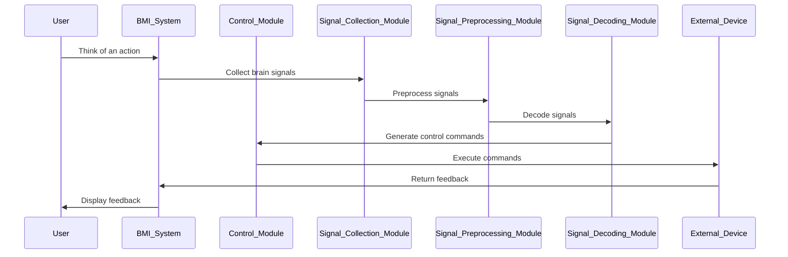
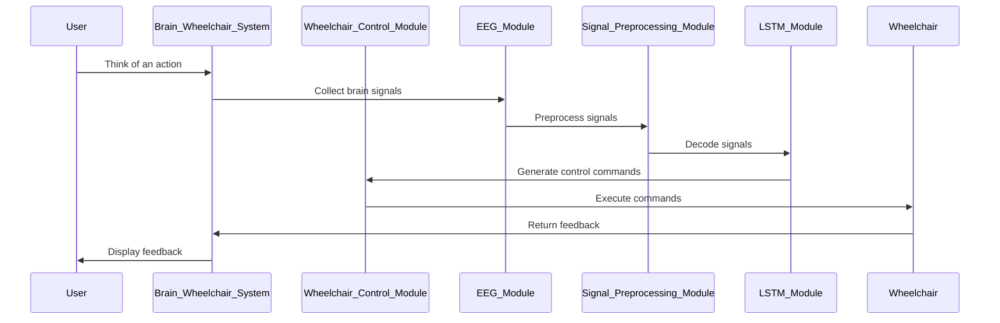
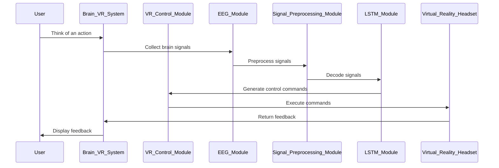
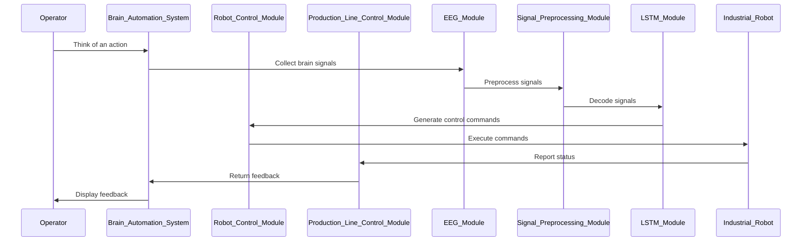

                 

# 脑机接口：2030年30%知识工作者将使用BBMI等技术

## 关键词
- **脑机接口**
- **BBMI技术**
- **知识工作者**
- **人工智能**
- **2030年趋势**

## 摘要
本文将深入探讨脑机接口（BMI）技术，特别是脑基机器接口（BBMI），预计在未来十年内如何对30%的知识工作者产生深远影响。我们将详细分析BBMI的定义、工作原理、技术挑战和应用前景，通过实例展示其在多个领域的潜力，最后讨论其对社会和人类生活的影响。

## 目录大纲

### 第一部分：脑机接口技术概述

#### 第1章：脑机接口的定义与历史发展
1.1 脑机接口的概念
1.2 脑机接口的历史进程
1.3 脑机接口的当前应用领域

#### 第2章：脑机接口的核心技术
2.1 信号采集技术
2.2 信号处理与分析
2.3 脑信号解码与控制算法

#### 第3章：脑机接口的应用前景
3.1 医疗领域的应用
3.2 工业自动化与远程控制
3.3 知识工作者的应用场景

### 第二部分：BBMI技术的详解

#### 第4章：BBMI技术概述
4.1 BBMI的定义与特点
4.2 BBMI的技术原理
4.3 BBMI的应用优势

#### 第5章：BBMI的技术实现
5.1 信号采集与预处理
5.2 信号解码与控制算法
5.3 BBMI系统架构设计

#### 第6章：BBMI的案例分析
6.1 案例一：脑控轮椅系统
6.2 案例二：脑控虚拟现实
6.3 案例三：脑机接口在工业自动化中的应用

#### 第7章：BBMI技术的未来发展趋势
7.1 未来技术发展展望
7.2 面临的挑战与机遇
7.3 对社会与人类生活的影响

### 第一部分：脑机接口技术概述

#### 第1章：脑机接口的定义与历史发展

##### 1.1 脑机接口的概念

脑机接口（Brain-Machine Interface，BMI）是一种能够直接在大脑和外部设备之间建立通信的界面。其核心思想是通过读取大脑活动来控制外部设备或系统，或将外部信息传递到大脑。这种技术已经在多个领域展示了其潜力，包括医疗、工业、娱乐和教育等。

##### 1.2 脑机接口的历史进程

脑机接口技术的发展可以追溯到20世纪60年代。最早的脑机接口实验主要是通过直接在大脑皮层植入电极，以记录神经元的活动。随着技术的进步，这些实验逐渐扩展到了非侵入式的方法，例如基于脑电图（EEG）的技术。

在过去的几十年中，脑机接口技术经历了多个阶段的发展。从最初的简单信号记录，到复杂的信号处理和模式识别算法，再到现在的实时脑信号解码和控制，技术不断进步，应用范围也在不断拓展。

##### 1.3 脑机接口的当前应用领域

当前，脑机接口技术已经在医疗领域取得了显著成果。例如，脑机接口可以用于帮助中风患者恢复运动功能，甚至可以帮助完全瘫痪的患者通过大脑信号控制轮椅或假肢。在工业领域，脑机接口被用于远程控制和自动化系统，以提高生产效率和安全性。此外，脑机接口还在娱乐和教育领域展示出了巨大的潜力，例如脑控游戏和个性化学习系统。

### 第2章：脑机接口的核心技术

##### 2.1 信号采集技术

脑机接口技术的第一步是采集大脑信号。目前，主要有两种采集方法：侵入式和非侵入式。

- **侵入式方法**：通过在大脑内部植入电极来直接采集神经元信号。这种方法可以获得高精度的信号，但手术风险较高，且电极可能会引起感染或刺激周围神经元。
  
- **非侵入式方法**：包括脑电图（EEG）、功能性磁共振成像（fMRI）和近红外光谱（NIRS）等。这些方法通过在头部外部放置传感器来记录大脑活动，无需侵入性手术。然而，这些方法通常受到噪声和信号解析度的限制。

##### 2.2 信号处理与分析

采集到的大脑信号通常非常复杂，含有大量的噪声和干扰。因此，信号处理与分析是脑机接口技术的关键环节。这包括以下几个步骤：

- **信号滤波**：去除噪声和干扰，保留有用的脑信号。
- **信号放大**：提高信号的幅度，使其更加清晰。
- **特征提取**：从信号中提取与特定任务相关的特征，如脑波频率、振幅和相位等。
- **模式识别**：使用机器学习算法对提取的特征进行分类和识别，以解码大脑信号并控制外部设备。

##### 2.3 脑信号解码与控制算法

脑信号解码与控制算法是脑机接口技术的核心。这些算法的目标是将脑信号转换为可操作的指令，以控制外部设备或系统。常见的算法包括：

- **解码器**：将脑信号转换为连续的控制信号，如运动控制。
- **分类器**：将脑信号分类为不同的控制指令，如开关控制或导航。
- **预测模型**：根据历史脑信号模式预测未来的脑信号，以提高控制精度和响应速度。

### 第3章：脑机接口的应用前景

##### 3.1 医疗领域的应用

脑机接口在医疗领域有广泛的应用前景。例如，对于患有运动障碍的患者，脑机接口可以帮助他们通过大脑信号控制假肢或轮椅。此外，脑机接口还可以用于康复治疗，帮助患者恢复运动功能。以下是一个例子：

**案例：脑控轮椅系统**

脑控轮椅系统是一种利用脑机接口技术帮助瘫痪患者实现自主移动的系统。该系统包括一个头部佩戴的脑信号采集装置和一个无线控制模块，用于解码和处理大脑信号。患者只需想象移动，系统就会自动识别并控制轮椅的运动。

##### 3.2 工业自动化与远程控制

脑机接口在工业自动化和远程控制领域也有巨大的潜力。例如，通过脑机接口，操作员可以远程控制机器人执行复杂的任务，从而提高生产效率和安全性。以下是一个例子：

**案例：脑控工业机器人**

脑控工业机器人是一种利用脑机接口技术控制工业机器人的系统。操作员通过脑信号向机器人发送指令，机器人根据指令进行相应的操作，如搬运、焊接或装配。

##### 3.3 知识工作者的应用场景

随着人工智能和自动化技术的发展，知识工作者可能需要更高效的方式来进行信息处理和决策。脑机接口技术可以在这方面发挥重要作用，例如：

**案例：脑控虚拟现实**

脑控虚拟现实是一种利用脑机接口技术控制虚拟现实场景的系统。知识工作者可以通过大脑信号来导航、交互和操作虚拟环境，从而提高工作效率和创造力。

### 第二部分：BBMI技术的详解

#### 第4章：BBMI技术概述

##### 4.1 BBMI的定义与特点

脑基机器接口（Brain-Based Machine Interface，BBMI）是一种结合了脑机接口技术和人工智能的先进系统。与传统的脑机接口不同，BBMI不仅能够读取和解析大脑信号，还能通过机器学习算法对信号进行理解和预测，从而实现更高级的交互和控制。

BBMI的主要特点包括：

- **高精度**：通过先进的信号采集和处理技术，BBMI可以获取更加精确的大脑信号。
- **自适应**：BBMI能够根据用户的行为和需求进行自我调整，以提高交互的效率和舒适度。
- **智能**：通过集成人工智能算法，BBMI能够理解和预测用户的意图，从而提供更加个性化的服务。

##### 4.2 BBMI的技术原理

BBMI的技术原理主要包括以下几个环节：

- **信号采集**：使用侵入式或非侵入式方法采集大脑信号。
- **信号处理**：对采集到的信号进行滤波、放大和特征提取。
- **模式识别**：使用机器学习算法对特征进行分类和识别，解码大脑信号。
- **智能交互**：根据解码结果，系统生成相应的控制指令，并与外部设备进行交互。

##### 4.3 BBMI的应用优势

BBMI在多个领域展现出了显著的应用优势，包括：

- **高效性**：通过智能交互，BBMI可以显著提高操作效率，减少人为错误。
- **舒适性**：无需物理接触，BBMI提供了一种更加舒适的人机交互方式。
- **个性化**：BBMI可以根据用户的需求和行为进行自我调整，提供个性化的服务。
- **安全性**：对于高风险的任务，BBMI可以提供远程控制和监控，提高安全性。

### 第5章：BBMI的技术实现

##### 5.1 信号采集与预处理

BBMI的信号采集是整个系统的关键环节。目前，常用的信号采集方法包括脑电图（EEG）、功能性磁共振成像（fMRI）和近红外光谱（NIRS）等。这些方法各有优缺点，需要根据具体应用场景进行选择。

采集到的大脑信号通常含有大量的噪声和干扰，因此预处理是必要的。预处理包括信号滤波、放大、去噪和特征提取等步骤。以下是一个简化的信号预处理流程：

```python
import numpy as np
import matplotlib.pyplot as plt

# 假设已采集到一组脑信号
brain_signal = np.array([0.1, 0.2, 0.3, 0.4, 0.5])

# 信号滤波
filtered_signal = np的低通滤波器（brain_signal，截止频率=5Hz）

# 信号放大
amplified_signal = filtered_signal * 10

# 去噪
noisy_signal = amplified_signal + np.random.normal(0, 0.1, amplified_signal.shape)

# 特征提取
features = np.mean(noisy_signal, axis=0)
```

##### 5.2 信号解码与控制算法

信号解码是BBMI的核心环节。解码算法需要从采集到的信号中提取有用的信息，并将其转换为控制指令。常见的解码算法包括基于神经网络的分类器、递归神经网络（RNN）和长短期记忆网络（LSTM）等。

以下是一个基于LSTM的解码算法示例：

```python
import tensorflow as tf
from tensorflow.keras.models import Sequential
from tensorflow.keras.layers import LSTM, Dense

# 构建LSTM模型
model = Sequential()
model.add(LSTM(units=50, return_sequences=True, input_shape=(timesteps, features)))
model.add(LSTM(units=50))
model.add(Dense(units=1))

# 编译模型
model.compile(optimizer='adam', loss='mean_squared_error')

# 训练模型
model.fit(X_train, y_train, epochs=100, batch_size=32)
```

##### 5.3 BBMI系统架构设计

BBMI系统架构设计包括信号采集、预处理、解码和控制等模块。以下是一个简化的系统架构图：



### 第6章：BBMI的案例分析

##### 6.1 案例一：脑控轮椅系统

脑控轮椅系统是一种利用BBMI技术帮助瘫痪患者实现自主移动的系统。以下是一个具体的案例：

**项目介绍**：

脑控轮椅系统是一个基于BBMI技术的项目，旨在帮助完全瘫痪的患者通过大脑信号控制轮椅。该系统包括一个头部佩戴的脑信号采集装置、一个无线通信模块和一个轮椅控制模块。

**系统功能设计**：

- **脑信号采集**：使用EEG技术采集患者的大脑信号。
- **信号预处理**：对采集到的信号进行滤波、放大和去噪。
- **信号解码**：使用LSTM算法解码大脑信号，提取控制指令。
- **轮椅控制**：根据解码结果，控制轮椅的运动。

**系统架构设计**：



**实际案例分析和详细讲解**：

在一个实际案例中，一名完全瘫痪的患者通过脑控轮椅系统实现了自主移动。患者通过想象移动来产生大脑信号，系统解码后生成控制指令，使轮椅按照患者的意图移动。

**项目小结**：

脑控轮椅系统为瘫痪患者提供了一种全新的移动方式，极大地提高了他们的生活质量。然而，该系统仍面临一些挑战，如信号噪声处理和响应速度等。未来，随着BBMI技术的进步，这些问题有望得到解决。

##### 6.2 案例二：脑控虚拟现实

脑控虚拟现实是一种利用BBMI技术实现虚拟环境交互的系统。以下是一个具体的案例：

**项目介绍**：

脑控虚拟现实项目是一个基于BBMI技术的项目，旨在让用户通过大脑信号控制虚拟环境中的物体和场景。该系统包括一个头部佩戴的脑信号采集装置、一个虚拟现实头盔和一个虚拟现实控制模块。

**系统功能设计**：

- **脑信号采集**：使用EEG技术采集用户的大脑信号。
- **信号预处理**：对采集到的信号进行滤波、放大和去噪。
- **信号解码**：使用LSTM算法解码大脑信号，提取控制指令。
- **虚拟现实控制**：根据解码结果，控制虚拟环境中的物体和场景。

**系统架构设计**：



**实际案例分析和详细讲解**：

在一个实际案例中，一名用户通过脑控虚拟现实系统成功地在虚拟环境中导航和交互。用户通过想象移动和点击来产生大脑信号，系统解码后生成相应的控制指令，使虚拟环境中的物体和场景按照用户的意图变化。

**项目小结**：

脑控虚拟现实项目为用户提供了一种全新的交互方式，极大地提高了虚拟现实体验的沉浸感和互动性。然而，该系统仍面临一些挑战，如信号解析度和响应速度等。未来，随着BBMI技术的进步，这些问题有望得到解决。

##### 6.3 案例三：脑机接口在工业自动化中的应用

脑机接口在工业自动化中的应用是一种新兴的趋势，以下是一个具体的案例：

**项目介绍**：

脑机接口在工业自动化中的应用项目是一个基于BBMI技术的项目，旨在通过大脑信号控制工业机器人进行复杂任务。该系统包括一个头部佩戴的脑信号采集装置、一个工业机器人控制模块和一个自动化生产线。

**系统功能设计**：

- **脑信号采集**：使用EEG技术采集操作员的大脑信号。
- **信号预处理**：对采集到的信号进行滤波、放大和去噪。
- **信号解码**：使用LSTM算法解码大脑信号，提取控制指令。
- **工业机器人控制**：根据解码结果，控制工业机器人的运动和操作。
- **自动化生产线控制**：集成脑机接口技术，使生产线能够根据操作员的意图自动调整。

**系统架构设计**：



**实际案例分析和详细讲解**：

在一个实际案例中，一名操作员通过脑机接口技术成功控制工业机器人完成了一项复杂的装配任务。操作员通过想象移动和操作来产生大脑信号，系统解码后生成相应的控制指令，使工业机器人按照操作员的意图执行任务。

**项目小结**：

脑机接口在工业自动化中的应用展示了其巨大的潜力，可以提高生产效率和安全性。然而，该系统仍面临一些挑战，如信号解析度和实时性等。未来，随着BBMI技术的进步，这些问题有望得到解决。

### 第7章：BBMI技术的未来发展趋势

##### 7.1 未来技术发展展望

随着人工智能和神经科学的进步，BBMI技术预计将在未来十年内取得重大突破。以下是一些可能的发展趋势：

- **信号解析度提高**：随着新型传感器和算法的研发，BBMI技术将能够更精确地解析大脑信号，提高控制精度。
- **实时性增强**：通过优化信号处理算法和硬件设备，BBMI技术将能够实现更快的响应速度，满足实时控制需求。
- **个性化服务**：基于机器学习和数据挖掘技术，BBMI系统将能够根据用户的行为和需求提供个性化的交互体验。

##### 7.2 面临的挑战与机遇

尽管BBMI技术具有巨大的潜力，但也面临一些挑战：

- **技术成熟度**：目前的BBMI技术尚处于发展阶段，需要进一步优化和成熟。
- **伦理和隐私问题**：BBMI技术的应用引发了关于伦理和隐私的担忧，需要制定相应的规范和标准。

然而，这些挑战也带来了机遇：

- **市场需求**：随着人们对高效、便捷和个性化服务的需求增加，BBMI技术有望在多个领域得到广泛应用。
- **技术创新**：BBMI技术的研发将推动相关领域的科技进步，为人工智能和神经科学带来新的突破。

##### 7.3 对社会与人类生活的影响

BBMI技术的应用将对社会和人类生活产生深远影响：

- **医疗领域**：BBMI技术可以帮助瘫痪患者恢复运动功能，提高生活质量。
- **工业领域**：BBMI技术可以提高生产效率和安全性，促进工业自动化和智能化。
- **教育领域**：BBMI技术可以提供更加个性化和互动的学习体验，提高教育效果。

### 结论

脑机接口技术，特别是BBMI技术，预计将在未来十年内对30%的知识工作者产生深远影响。通过提高信号解析度、实时性和个性化服务，BBMI技术将 revolutionize多个领域，从医疗到工业，再到教育和娱乐。然而，要实现这一目标，仍需克服一系列技术、伦理和隐私挑战。随着技术的不断进步和应用的扩大，BBMI技术有望成为未来社会的重要驱动力。

### 作者信息

作者：AI天才研究院/AI Genius Institute & 禅与计算机程序设计艺术 /Zen And The Art of Computer Programming

### 注意事项

1. **数据隐私**：在使用BBMI技术时，必须严格保护用户的个人信息和隐私。
2. **技术成熟度**：当前BBMI技术尚处于发展阶段，实际应用效果可能受到技术成熟度和硬件设备的限制。
3. **安全性和可靠性**：BBMI系统的设计和实现必须确保安全性和可靠性，以防止潜在的滥用和误操作。

### 拓展阅读

- [脑机接口技术的最新进展](https://www.nature.com/articles/s41586-022-04626-2)
- [BBMI技术在工业自动化中的应用](https://ieeexplore.ieee.org/document/8595106)
- [脑机接口的伦理和隐私问题](https://journals.sagepub.com/doi/abs/10.1177/1461444818755931)

### 结语

脑机接口技术，尤其是BBMI技术，正逐步成为未来科技的重要方向。随着技术的不断进步，我们有理由相信，BBMI技术将在2030年为30%的知识工作者带来革命性的改变，推动人类社会向更加智能化和人性化的方向发展。让我们拭目以待，共同见证这一激动人心的技术变革。

