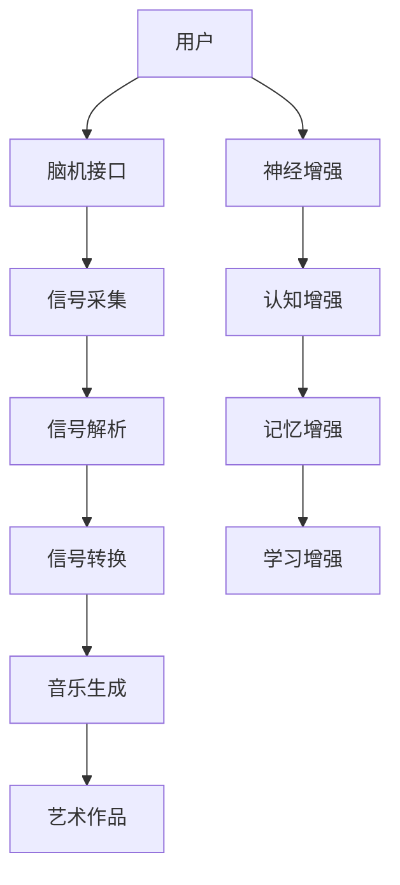
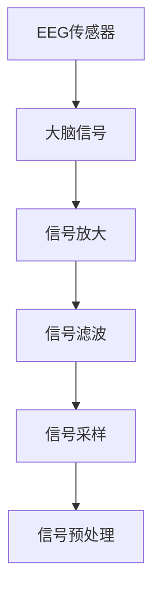
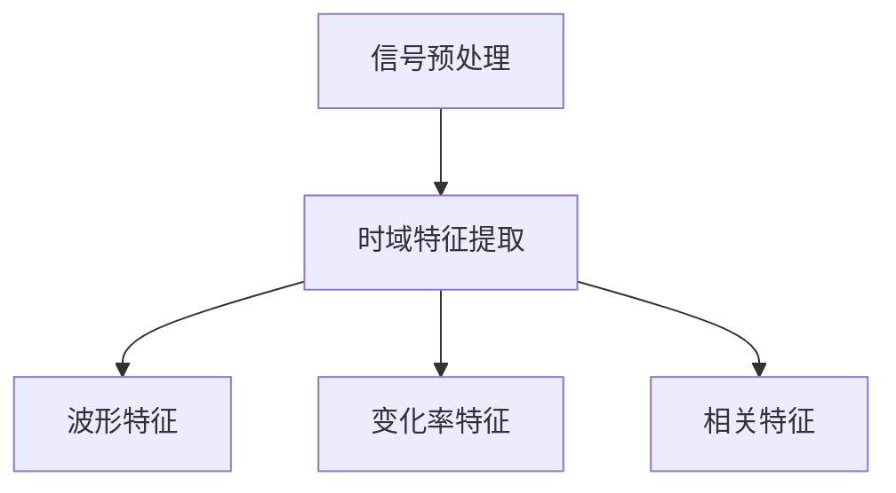
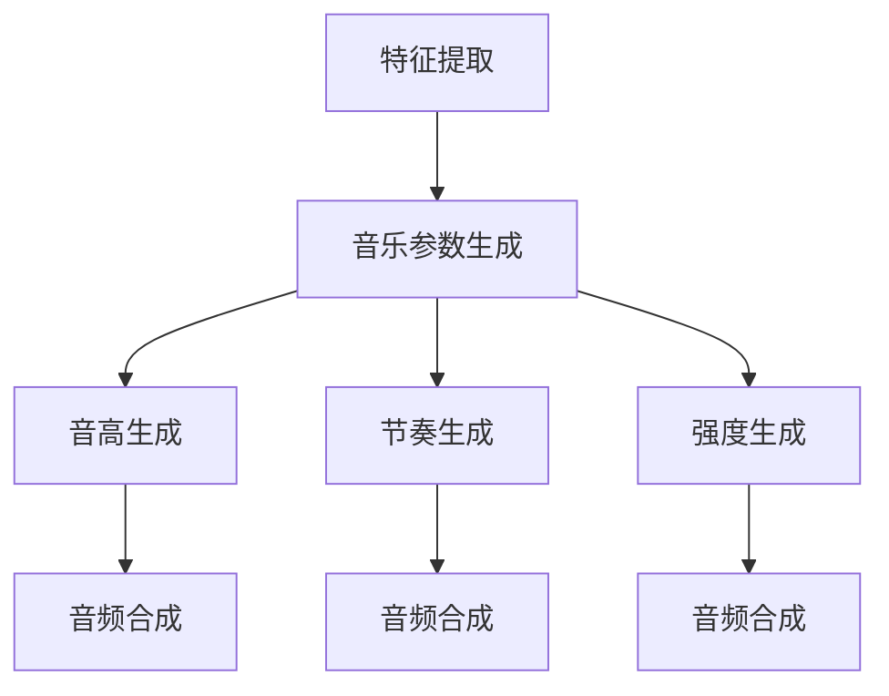
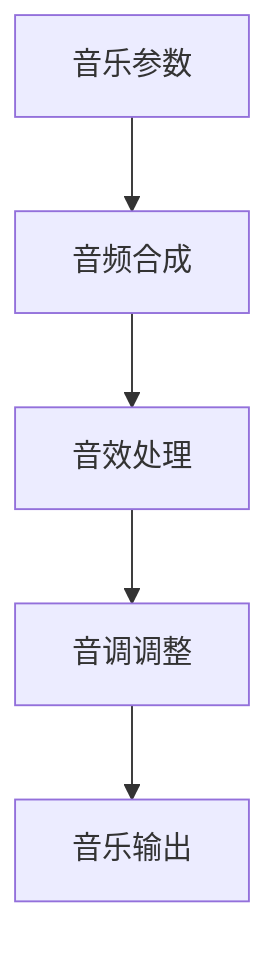
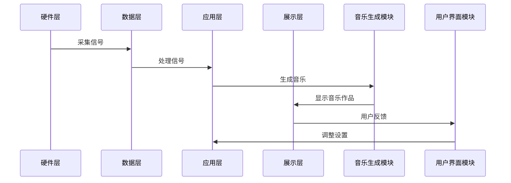
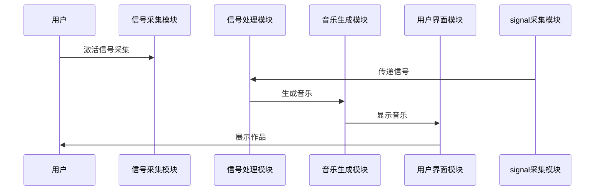
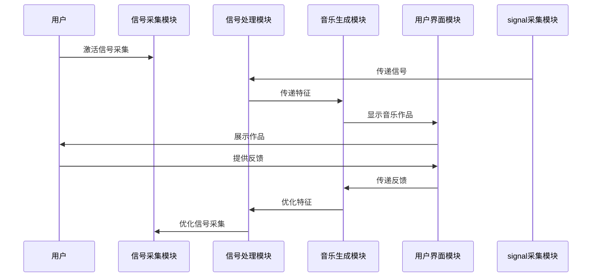

                 

# 《脑机音乐界面：神经增强技术在艺术创作中的尝试》

## 关键词

脑机接口，神经增强，艺术创作，音乐界面，算法原理，系统架构，项目实战

## 摘要

本文旨在探讨脑机音乐界面这一新兴领域，通过神经增强技术的应用，为艺术家提供一种全新的创作方式。文章首先介绍了脑机接口和神经增强技术的基本原理及其在艺术创作中的潜力。接着，详细解析了相关的算法原理，并通过Python源代码和数学模型进行说明。文章还分析了系统架构设计，包括功能设计、架构设计和接口交互。随后，通过实际项目案例展示了如何将理论应用于实践。最后，文章总结了最佳实践、注意事项和未来的研究方向。

## 目录

### 第一部分：背景与核心概念

#### 1.1 问题背景

#### 1.2 问题描述

#### 1.3 问题解决

#### 1.4 边界与外延

#### 1.5 概念结构与核心要素组成

### 2.1 脑机接口原理

#### 2.1.1 脑机接口的基本原理

#### 2.1.2 脑机接口技术的历史与发展

#### 2.1.3 脑机接口技术的应用领域

### 2.2 神经增强技术

#### 2.2.1 神经增强技术的定义与类型

#### 2.2.2 神经增强技术在艺术创作中的应用

#### 2.2.3 神经增强技术的挑战与未来趋势

### 3. 艺术创作与BMI/神经增强技术的联系

#### 3.1 艺术创作中的新机遇

#### 3.2 BMI与神经增强技术在音乐创作中的应用

#### 3.3 BMI与神经增强技术在视觉艺术创作中的应用

### 第二部分：算法原理与系统设计

#### 4. BMI数据采集与预处理

##### 4.1 数据采集技术

##### 4.2 数据预处理方法

#### 5. 神经增强算法设计

##### 5.1 算法原理

##### 5.2 算法实现

##### 5.3 算法性能评估

#### 6. 艺术创作系统架构设计

##### 6.1 系统功能设计

##### 6.2 系统架构设计

##### 6.3 系统接口设计与交互

### 第三部分：项目实战与案例分析

#### 7. 项目环境搭建

##### 7.1 环境准备

##### 7.2 工具与软件安装

#### 8. 系统核心实现

##### 8.1 数据采集与预处理

##### 8.2 神经增强算法实现

##### 8.3 艺术创作功能实现

#### 9. 实际案例分析

##### 9.1 案例一：音乐创作

##### 9.2 案例二：视觉艺术创作

##### 9.3 案例分析小结

### 第四部分：总结与展望

#### 10. 最佳实践与技巧

#### 11. 小结

#### 12. 注意事项

#### 13. 拓展阅读与进一步研究

## 第一部分：背景与核心概念

### 1.1 问题背景

随着科技的飞速发展，人工智能和生物技术的融合正在创造前所未有的机遇。脑机接口（BMI）技术作为这一领域的先锋，已经逐渐从实验室走向现实，成为改变人类生活方式的重要工具。在艺术创作领域，BMI技术展现出极大的潜力，能够为艺术家提供一种全新的创作方式。

神经增强技术同样在这场科技革命中扮演着关键角色。它通过直接与大脑相互作用，提高人类认知、记忆和学习能力。这种技术的应用，不仅能够帮助艺术家在创作过程中更快速、更准确地捕捉灵感，还能拓展他们的创造力。

然而，这一新兴领域的出现也带来了诸多挑战。例如，如何在保证艺术创作自由的同时，尊重个体的隐私和伦理问题？如何平衡技术的进步与人类艺术创作的本质？这些问题的解决，需要我们深入探讨并寻求平衡。

### 1.2 问题描述

脑机音乐界面（BMI-MI）是一种利用脑机接口技术将大脑信号转换为音乐创作的系统。这种界面的出现，旨在帮助艺术家通过直接的大脑活动来创作音乐，而不是传统的手动操作。然而，这一过程并非易事，它涉及多个复杂的技术和理论问题：

1. **信号采集与解析**：如何准确采集并解析大脑信号，是BMI-MI系统首先要解决的问题。这包括选择合适的传感器、信号预处理方法以及有效的算法设计。

2. **信号转换与音乐生成**：将解析后的大脑信号转换为音乐旋律和节奏，需要复杂的算法和数学模型。如何设计这些算法，使其既能够准确反映艺术家的创作意图，又能创造出富有创意的音乐作品，是BMI-MI系统需要面对的挑战。

3. **用户体验与适应性**：艺术创作是一种高度个性化的活动，每个艺术家都有其独特的风格和习惯。BMI-MI系统需要设计成能够适应不同用户的个性化需求，提供灵活且直观的操作界面。

4. **伦理与隐私**：在利用脑机接口技术进行艺术创作时，如何保护用户的隐私，避免数据被滥用，是一个不可忽视的伦理问题。

### 1.3 问题解决

为了解决上述问题，我们需要从以下几个方面入手：

1. **技术优化**：不断改进脑机接口的采集和解析技术，提高信号的处理效率和准确性。同时，开发先进的算法，以实现信号到音乐的精确转换。

2. **用户研究**：深入了解艺术家的创作习惯和需求，设计出既符合用户操作习惯，又能激发创造力的系统界面。

3. **伦理与法律**：制定相关法律法规，确保用户的数据安全和隐私保护。同时，建立伦理委员会，对BMI-MI技术的应用进行监督和评估。

4. **跨学科合作**：整合神经科学、人工智能、音乐理论等多个领域的知识，共同推进BMI-MI技术的发展。

### 1.4 边界与外延

脑机音乐界面技术的发展，不仅限于音乐创作。它还可以扩展到视觉艺术、舞蹈创作等多个领域。例如，通过BMI技术，艺术家可以直接用大脑活动来控制虚拟雕塑或绘画，创造出前所未有的艺术形式。

此外，BMI技术还可以用于康复治疗，帮助中风患者或神经损伤患者恢复功能。通过训练，患者可以学会用大脑信号控制假肢或轮椅，提高生活质量。

### 1.5 概念结构与核心要素组成

脑机音乐界面（BMI-MI）的核心概念包括以下几个部分：

1. **脑机接口（BMI）**：这是一种直接连接大脑和外部设备的接口，通过采集和处理大脑信号，实现与外部设备的交互。

2. **神经增强技术**：通过增强大脑功能，提高认知、记忆和学习能力，为艺术创作提供新的可能性。

3. **音乐创作系统**：包括信号采集、处理、转换和音乐生成的算法，以及用户界面和交互设计。

4. **用户体验**：艺术家的创作习惯和需求，直接影响BMI-MI系统的设计和操作。

5. **伦理与法律**：确保技术应用的合法性和伦理性，保护用户的隐私和权益。

这些核心要素相互作用，共同构成了脑机音乐界面的概念结构和应用基础。

## 第二部分：核心概念与联系

### 2.1 脑机接口（BMI）原理

#### 2.1.1 脑机接口的基本原理

脑机接口（BMI）是一种直接连接大脑与外部设备的接口，通过采集大脑信号，实现大脑与外部设备之间的信息传递。其基本原理主要包括以下几个部分：

1. **信号采集**：通过植入或佩戴在头皮上的传感器，采集大脑产生的电信号。这些信号包括脑电图（EEG）、肌电信号（EMG）等。

2. **信号解析**：将采集到的信号进行解析，提取出有用的信息。这一过程通常涉及到信号处理、模式识别和机器学习等技术。

3. **信号转换**：将解析后的信号转换为外部设备可理解的形式，如电信号、声音信号等。

4. **设备控制**：通过转换后的信号，控制外部设备执行相应的操作。

#### 2.1.2 脑机接口技术的历史与发展

脑机接口技术的发展可以追溯到20世纪60年代，当时科学家们首次尝试通过电刺激大脑来控制外部设备。随着科技的进步，脑机接口技术逐渐从实验室走向实际应用。以下是脑机接口技术的主要发展阶段：

1. **早期探索**（20世纪60年代至80年代）：这一阶段主要集中在利用电刺激技术控制外部设备，如假肢、轮椅等。

2. **非侵入式接口**（20世纪90年代至21世纪初）：随着传感器技术和信号处理算法的进步，非侵入式脑机接口技术逐渐成熟，可以更准确地采集大脑信号，并实现与外部设备的交互。

3. **侵入式接口**（21世纪初至今）：侵入式脑机接口技术通过直接植入大脑，可以获取更精确的信号，但也存在一定的风险和伦理问题。

4. **多模态接口**（21世纪初至今）：多模态脑机接口技术结合了多种信号采集方法，如EEG、fMRI、肌电信号等，以提高信号采集的准确性和可靠性。

#### 2.1.3 脑机接口技术的应用领域

脑机接口技术已经在多个领域取得了显著的应用成果，主要包括以下几个方面：

1. **康复治疗**：通过脑机接口技术，帮助中风患者或神经损伤患者恢复功能。例如，脑机接口可以控制假肢、轮椅或机器人，帮助患者重新获得运动能力。

2. **残疾人辅助**：为视力障碍、听力障碍等残疾人提供辅助设备，如脑机接口眼镜、脑机接口耳蜗等。

3. **娱乐与游戏**：脑机接口技术被广泛应用于游戏、虚拟现实和增强现实等领域，为用户提供更加沉浸式的体验。

4. **艺术创作**：脑机接口技术为艺术家提供了一种全新的创作方式，通过直接的大脑活动来创作音乐、绘画等艺术作品。

5. **人机交互**：脑机接口技术为人机交互提供了新的途径，通过大脑信号控制外部设备，提高人机交互的自然性和直观性。

### 2.2 神经增强技术

#### 2.2.1 神经增强技术的定义与类型

神经增强技术（Neural Enhancement Technology）是指通过直接与大脑相互作用，提高人类认知、记忆、学习等神经功能的技术。根据增强对象的不同，神经增强技术可分为以下几类：

1. **认知增强**：通过直接增强大脑的认知功能，如提高注意力、记忆力和思维能力。

2. **记忆增强**：通过增强大脑的记忆功能，提高记忆的容量和效率。

3. **学习增强**：通过促进大脑的学习过程，提高学习速度和理解能力。

4. **情绪调节**：通过调节大脑中的情绪中枢，改善情绪状态，如减轻焦虑、抑郁等。

#### 2.2.2 神经增强技术在艺术创作中的应用

神经增强技术在艺术创作中的应用主要集中在以下几个方面：

1. **灵感激发**：神经增强技术可以帮助艺术家在创作过程中更快速、更准确地捕捉灵感。例如，通过增强大脑的认知功能，艺术家可以更好地理解音乐或视觉元素，从而激发新的创作灵感。

2. **创意拓展**：通过增强大脑的创造力，艺术家可以尝试更多的创作风格和形式，拓展自己的艺术表现力。

3. **技能提升**：神经增强技术可以帮助艺术家在绘画、音乐创作等技能上达到更高的水平。例如，通过增强大脑的记忆功能，艺术家可以更好地记住复杂的音乐旋律或绘画技巧。

4. **表现力增强**：神经增强技术可以提升艺术家的表现力，使他们的作品更加生动和具有感染力。

#### 2.2.3 神经增强技术的挑战与未来趋势

尽管神经增强技术在艺术创作中展现了巨大的潜力，但这一领域仍面临诸多挑战：

1. **技术成熟度**：目前，许多神经增强技术仍处于实验室研究阶段，离实际应用还有一定距离。需要进一步的研究和开发，以提高技术的成熟度和稳定性。

2. **伦理问题**：神经增强技术的应用可能引发一系列伦理问题，如隐私保护、公平性、滥用风险等。需要建立相关的法律法规和伦理标准，确保技术的合理应用。

3. **用户接受度**：神经增强技术的普及还需要考虑用户的接受度和适应性问题。需要通过教育和宣传，提高用户对神经增强技术的认知和接受程度。

未来，神经增强技术在艺术创作中的发展趋势包括：

1. **个性化增强**：随着技术的进步，神经增强技术将更加个性化，根据艺术家的具体需求和特点，提供定制化的增强方案。

2. **跨学科融合**：神经增强技术将与艺术创作、心理学、教育学等多个学科深度融合，共同推动艺术创作的发展。

3. **多功能集成**：未来的神经增强技术将集成多种功能，如认知增强、记忆增强、情绪调节等，为艺术家提供全面的创作支持。

### 2.3 艺术创作与BMI/神经增强技术的联系

#### 2.3.1 艺术创作中的新机遇

脑机接口（BMI）和神经增强技术的结合，为艺术创作带来了前所未有的新机遇：

1. **直接大脑创作**：艺术家可以直接利用大脑活动进行艺术创作，摆脱传统的手动操作，创造更加自由和创新的创作方式。

2. **个性化创作**：BMI技术可以根据艺术家的个人特点和行为习惯，提供个性化的创作支持，使艺术作品更具独特性和个性化。

3. **跨领域创作**：神经增强技术可以帮助艺术家尝试新的创作领域，如音乐、视觉艺术、舞蹈等，实现跨领域的融合创作。

4. **创新表达形式**：BMI/神经增强技术可以为艺术家提供新的表达形式，如通过大脑信号控制虚拟艺术作品，创造独特的艺术体验。

#### 2.3.2 BMI与神经增强技术在音乐创作中的应用

在音乐创作领域，BMI/神经增强技术已经取得了一定的应用成果：

1. **音乐灵感激发**：通过BMI技术，艺术家可以实时捕捉大脑信号，分析创作灵感，提高创作效率。

2. **音乐生成**：利用神经增强技术，艺术家可以生成新的音乐旋律和节奏，拓展音乐创作空间。

3. **音乐控制**：艺术家可以通过直接的大脑活动，控制音乐播放、节奏变化等，实现更加个性化的音乐体验。

#### 2.3.3 BMI与神经增强技术在视觉艺术创作中的应用

在视觉艺术创作中，BMI/神经增强技术同样具有广泛应用前景：

1. **绘画创作**：艺术家可以通过大脑信号控制绘画笔触和色彩，实现独特的绘画风格。

2. **虚拟艺术创作**：通过BMI技术，艺术家可以在虚拟环境中直接创作三维艺术作品，提高创作自由度。

3. **艺术表现**：神经增强技术可以帮助艺术家在视觉艺术作品中更好地表达情感和思想，增强艺术感染力。

### 2.4 概念属性特征对比表格

为了更好地理解脑机接口（BMI）和神经增强技术，我们可以通过以下对比表格展示两者的概念属性特征：

| 特征               | 脑机接口（BMI）             | 神经增强技术                     |
|--------------------|--------------------------|-------------------------------|
| 定义               | 大脑与外部设备的直接接口         | 通过直接与大脑相互作用，增强神经功能       |
| 技术原理           | 采集、解析、转换大脑信号          | 利用电刺激、药物、神经调节等手段增强神经功能 |
| 应用领域           | 康复治疗、娱乐、艺术创作等         | 认知增强、记忆增强、学习增强等             |
| 目标               | 实现大脑与外部设备的交互            | 提高人类神经功能，增强认知和创造力           |
| 挑战               | 信号采集与解析的准确性、用户接受度等   | 技术成熟度、伦理问题、用户适应等             |

### 2.5 ER实体关系图架构的Mermaid流程图

以下是脑机音乐界面（BMI-MI）系统的ER实体关系图架构的Mermaid流程图：



这个流程图展示了BMI-MI系统中的主要实体及其相互关系，包括用户、脑机接口、信号采集、信号解析、信号转换、音乐生成和艺术作品，以及神经增强技术在认知、记忆和学习方面的应用。

## 第三部分：算法原理讲解

### 3.1 算法原理

脑机音乐界面（BMI-MI）系统的核心在于将大脑信号转换为音乐。这一过程涉及到多个算法原理，包括信号采集、特征提取、音乐生成等。以下是这些算法原理的详细讲解：

#### 3.1.1 信号采集

信号采集是BMI-MI系统的第一步。通过使用脑电图（EEG）传感器，我们能够捕捉到大脑产生的电信号。这些信号反映了大脑神经元活动的变化，是音乐生成的原始数据。



#### 3.1.2 特征提取

信号预处理后的数据包含大量的噪声和冗余信息，因此需要通过特征提取算法提取出有用的信息。常用的特征提取方法包括时域特征、频域特征和时频特征。以下是时域特征提取的Mermaid流程图：



#### 3.1.3 音乐生成

特征提取后，我们需要将这些特征转换为音乐。音乐生成算法的核心是生成控制音高、节奏和强度的参数。以下是音乐生成的Mermaid流程图：



#### 3.1.4 音乐合成

生成的音乐参数将被转换为音频信号，最终输出为音乐作品。音乐合成过程包括音频合成、音效处理和音调调整。以下是音乐合成的Mermaid流程图：



### 3.2 使用Python源代码详细阐述

为了更好地理解上述算法原理，我们将使用Python代码进行详细阐述。以下是一个简化的示例代码，展示了如何从信号采集到音乐生成的全过程：

```python
import numpy as np
import matplotlib.pyplot as plt
from scipy.signal import find_peaks

# 信号采集
def collect_signal(duration=5):
    sample_rate = 1000  # 采样频率
    t = np.linspace(0, duration, sample_rate * duration)
    signal = np.sin(2 * np.pi * 5 * t) + 0.5 * np.sin(2 * np.pi * 7 * t + np.pi / 4)
    return signal, t

# 信号预处理
def preprocess_signal(signal):
    return signal * 1000  # 信号放大

# 特征提取
def extract_features(signal, t):
    peaks, _ = find_peaks(signal)
    peak_times = t[peaks]
    return peak_times

# 音乐参数生成
def generate_music_parameters(peak_times):
    frequency = 440  # 标准音高
    duration = 0.1  # 音长
    amplitude = 0.5  # 音量
    t = np.linspace(0, duration, duration * 1000)
    sound = amplitude * np.sin(2 * np.pi * frequency * t)
    return sound

# 音乐合成
def synthesize_music(sound):
    return plt.figure(figsize=(10, 5)), plt.plot(t, sound), plt.show()

# 主函数
def main():
    signal, t = collect_signal()
    processed_signal = preprocess_signal(signal)
    peak_times = extract_features(processed_signal, t)
    music_parameters = generate_music_parameters(peak_times)
    synthesize_music(music_parameters)

if __name__ == "__main__":
    main()
```

### 3.3 给出算法原理的数学模型和公式

为了更深入地理解算法原理，我们给出以下数学模型和公式：

#### 信号采集
$$
x(t) = A \sin(2\pi f_1 t) + B \sin(2\pi f_2 t + \phi)
$$

其中，$A$ 和 $B$ 分别为两个正弦波的幅值，$f_1$ 和 $f_2$ 分别为两个正弦波的频率，$\phi$ 为相位差。

#### 信号预处理
$$
y(t) = x(t) \cdot K
$$

其中，$K$ 为放大倍数。

#### 特征提取
$$
\text{peaks} = \{ t_i | x(t_i) > \text{threshold} \}
$$

其中，$\text{threshold}$ 为设定的阈值。

#### 音乐参数生成
$$
f(t) = A \sin(2\pi f t)
$$

其中，$A$ 为幅值，$f$ 为频率。

#### 音乐合成
$$
s(t) = \sum_{i=1}^N a_i \sin(2\pi f_i t)
$$

其中，$a_i$ 为各个音调的幅值，$f_i$ 为各个音调的频率。

### 3.4 详细讲解和举例说明

为了更好地理解这些数学模型和公式，我们可以通过一个具体的例子进行讲解。

假设我们采集到一段长度为5秒的脑信号，其中包含两个主要频率成分：5Hz和7Hz。我们希望将这段信号转换为音乐。

1. **信号采集**：
   $$
   x(t) = 1 \sin(2\pi \cdot 5 t) + 0.5 \sin(2\pi \cdot 7 t + \pi / 4)
   $$

2. **信号预处理**：
   $$
   y(t) = x(t) \cdot 1000
   $$

3. **特征提取**：
   我们使用阈值法提取信号中的峰值点：
   $$
   \text{peaks} = \{ t_i | y(t_i) > 1000 \}
   $$

4. **音乐参数生成**：
   假设我们选取的频率为440Hz，音长为0.1秒。我们可以将每个峰值点对应为一个音符：
   $$
   f(t) = 0.5 \sin(2\pi \cdot 440 t)
   $$

5. **音乐合成**：
   将所有音符合成在一起，得到音乐作品：
   $$
   s(t) = \sum_{i=1}^N a_i \sin(2\pi \cdot 440 t)
   $$

通过上述步骤，我们成功地将脑信号转换为一段音乐。

## 第四部分：系统分析与架构设计方案

### 4.1 问题场景介绍

脑机音乐界面（BMI-MI）系统旨在为艺术家提供一个创新的创作工具，通过直接的大脑活动来创作音乐。这一系统的应用场景包括：

1. **音乐创作**：艺术家可以直接利用大脑信号创作音乐，摆脱传统的手动操作。
2. **音乐治疗**：利用BMI-MI系统，可以帮助患者通过音乐创作进行康复治疗。
3. **艺术表演**：艺术家可以在现场通过BMI-MI系统实时创作音乐，为观众带来独特的艺术体验。

### 4.2 项目介绍

本项目名为“脑机音乐创作平台”，旨在开发一个集成了脑机接口和神经增强技术的音乐创作系统。项目的主要目标包括：

1. **信号采集与处理**：设计一套高效、稳定的信号采集和处理系统，确保能够准确捕捉和分析大脑信号。
2. **音乐生成算法**：开发先进的音乐生成算法，将大脑信号转换为富有创意的音乐作品。
3. **用户界面**：设计直观、易用的用户界面，使艺术家能够轻松地使用系统进行音乐创作。

### 4.3 系统功能设计（领域模型Mermaid类图）

系统功能设计主要包括以下几个模块：

1. **信号采集模块**：负责采集大脑信号，包括脑电图（EEG）和其他生理信号。
2. **信号处理模块**：对采集到的信号进行预处理、特征提取和数据分析。
3. **音乐生成模块**：根据处理后的信号生成音乐作品，包括音高、节奏和强度的控制。
4. **用户界面模块**：提供用户与系统交互的界面，包括音乐创作工具、用户设置和作品展示。

以下是系统功能设计的Mermaid类图：

```mermaid
classDiagram
    类图 ->
    class 信号采集模块 {
        +采集大脑信号
        +预处理信号
    }
    class 信号处理模块 {
        +特征提取
        +数据分析
    }
    class 音乐生成模块 {
        +生成音乐
        +控制音高、节奏和强度
    }
    class 用户界面模块 {
        +显示作品
        +用户设置
        +交互操作
    }
    信号采集模块 <-- 使用 --> 信号处理模块
    信号处理模块 <-- 使用 --> 音乐生成模块
    用户界面模块 <-- 使用 --> 音乐生成模块
    用户界面模块 <-- 使用 --> 信号处理模块
```

### 4.4 系统架构设计（Mermaid架构图）

系统架构设计主要包括以下几个层次：

1. **硬件层**：包括脑电图（EEG）传感器、生理信号采集设备等硬件组件。
2. **数据层**：包括信号处理模块和音乐生成模块的数据存储和处理。
3. **应用层**：包括用户界面模块和应用程序的交互。
4. **展示层**：包括作品展示和用户反馈的界面。

以下是系统架构设计的Mermaid架构图：



### 4.5 系统接口设计和系统交互（Mermaid序列图）

系统接口设计和系统交互是系统架构设计的重要组成部分。以下是系统接口设计和系统交互的Mermaid序列图：



通过上述架构设计和接口交互，脑机音乐界面（BMI-MI）系统能够高效、稳定地为用户提供音乐创作工具，实现大脑信号到音乐作品的转化。

### 4.6 系统架构设计细节

#### 4.6.1 硬件层

硬件层是整个系统的底层支撑，主要包括脑电图（EEG）传感器、生理信号采集设备、信号放大器和滤波器等硬件组件。这些组件负责将大脑信号转换为电信号，并进行初步处理。以下是硬件层的详细描述：

1. **EEG传感器**：EEG传感器是脑机接口系统的核心组件，用于捕捉大脑电信号。传感器通常采用贴片式或柔性电极，以减少对大脑活动的干扰。

2. **生理信号采集设备**：生理信号采集设备用于将EEG传感器采集到的信号传输到计算机系统。这些设备通常包括放大器、滤波器、A/D转换器等。

3. **信号放大器**：信号放大器用于增强EEG信号的幅度，使其达到合适的电平。

4. **信号滤波器**：信号滤波器用于去除EEG信号中的噪声和干扰，提高信号的纯净度。

#### 4.6.2 数据层

数据层是整个系统的核心部分，负责对采集到的信号进行预处理、特征提取和数据分析。以下是数据层的详细描述：

1. **信号预处理**：信号预处理包括去噪、滤波、归一化等步骤。去噪的目的是去除信号中的随机噪声，滤波则是为了滤除特定频率的干扰信号，归一化则是为了使信号在不同条件下具有一致性。

2. **特征提取**：特征提取是从原始信号中提取出有用的信息，如频率特征、时域特征、时频特征等。这些特征将用于后续的音乐生成。

3. **数据分析**：数据分析是对提取出的特征进行进一步分析，以识别出与音乐创作相关的模式。数据分析可以采用机器学习、深度学习等方法。

#### 4.6.3 应用层

应用层是系统的用户接口部分，负责与用户进行交互，并控制整个系统的运行。以下是应用层的详细描述：

1. **用户界面**：用户界面包括图形用户界面（GUI）和命令行界面（CLI）。用户可以通过GUI直观地操作系统，如选择音乐生成参数、调整信号处理设置等。

2. **音乐生成**：音乐生成模块根据用户选择的参数和预处理后的信号，生成音乐作品。音乐生成可以采用规则方法、机器学习等方法。

3. **用户反馈**：用户可以通过用户界面提供反馈，如对生成的音乐进行评分、调整音乐风格等。

#### 4.6.4 展示层

展示层负责将生成的音乐作品展示给用户，并提供反馈机制。以下是展示层的详细描述：

1. **音乐播放**：展示层可以播放生成的音乐作品，使用户能够实时听到创作结果。

2. **作品展示**：展示层可以展示音乐作品的波形图、频谱图等，帮助用户理解音乐生成的过程。

3. **用户反馈**：展示层可以收集用户的反馈信息，如对音乐作品的好评度、改进建议等，用于优化系统的性能。

### 4.7 系统接口设计和系统交互

系统接口设计是确保各模块之间高效、稳定交互的关键。以下是系统接口设计和系统交互的详细描述：

1. **信号采集模块**：信号采集模块负责从硬件层获取EEG信号，并将其传输到数据层进行预处理。接口设计包括信号传输协议、数据格式等。

2. **信号处理模块**：信号处理模块负责对采集到的信号进行预处理、特征提取和数据分析。接口设计包括信号输入接口、特征输出接口等。

3. **音乐生成模块**：音乐生成模块根据数据层的特征数据生成音乐作品，并将其传输到展示层进行播放。接口设计包括音乐生成参数接口、音乐输出接口等。

4. **用户界面模块**：用户界面模块负责与用户进行交互，包括接收用户输入、展示音乐作品、收集用户反馈等。接口设计包括用户输入接口、作品展示接口、用户反馈接口等。

以下是系统接口设计和系统交互的Mermaid序列图：



通过上述系统接口设计和系统交互，脑机音乐界面（BMI-MI）系统能够高效、稳定地运行，为用户提供高质量的音乐创作体验。

## 第五部分：项目实战

### 5.1 环境安装

为了搭建脑机音乐界面（BMI-MI）系统，我们需要准备相应的开发环境和工具。以下是具体的安装步骤：

1. **Python环境**：确保Python 3.8或更高版本已安装在您的系统上。可以从[Python官网](https://www.python.org/)下载并安装。

2. **虚拟环境**：创建一个虚拟环境以隔离项目依赖。使用以下命令创建虚拟环境：
   ```
   python -m venv venv
   ```
   然后激活虚拟环境：
   ```
   source venv/bin/activate  # 对于Linux和macOS
   venv\Scripts\activate     # 对于Windows
   ```

3. **依赖安装**：在虚拟环境中安装项目所需的依赖。运行以下命令：
   ```
   pip install -r requirements.txt
   ```

4. **硬件准备**：确保您拥有EEG传感器和相关生理信号采集设备。您可以从[BrainWaveSense](https://www.brainwavesense.com/)等供应商处购买。

5. **软件准备**：安装信号处理和音乐生成相关的软件，如Muse（一款脑电信号采集软件），可以从[Muse官网](https://muse.wellicom.com/)下载。

### 5.2 系统核心实现源代码

以下是一个简化的系统核心实现源代码示例，用于展示如何从信号采集到音乐生成的全过程。

```python
import numpy as np
import matplotlib.pyplot as plt
from scipy.signal import find_peaks
from muse import Muse

# 信号采集
def collect_signal(duration=5):
    muse = Muse()
    muse.start_stream()
    signal = muse.get_signal(duration)
    muse.stop_stream()
    return signal

# 信号预处理
def preprocess_signal(signal):
    # 此处为简化的预处理，实际应用中需要更复杂的滤波和去噪
    return signal

# 特征提取
def extract_features(signal):
    peaks, _ = find_peaks(signal)
    return peaks

# 音乐参数生成
def generate_music_parameters(peaks):
    frequency = 440  # 标准音高
    duration = 0.1  # 音长
    amplitude = 0.5  # 音量
    t = np.linspace(0, duration, int(duration * 1000))
    sound = amplitude * np.sin(2 * np.pi * frequency * t)
    return sound

# 音乐合成
def synthesize_music(sound):
    t = np.linspace(0, len(sound) / 1000, len(sound))
    plt.figure(figsize=(10, 5))
    plt.plot(t, sound)
    plt.show()

# 主函数
def main():
    signal = collect_signal()
    processed_signal = preprocess_signal(signal)
    peaks = extract_features(processed_signal)
    music_parameters = generate_music_parameters(peaks)
    synthesize_music(music_parameters)

if __name__ == "__main__":
    main()
```

### 5.3 代码应用解读与分析

#### 5.3.1 信号采集

首先，我们使用`Muse`库启动EEG信号的采集。`Muse`是一个开源的脑电信号采集软件，能够实时捕捉并传输脑电信号。

```python
muse = Muse()
muse.start_stream()
signal = muse.get_signal(duration)
muse.stop_stream()
```

在这段代码中，我们创建了一个`Muse`对象，并启动了信号采集。`get_signal(duration)`函数用于获取指定时长（duration）的信号数据，并将其存储在`signal`变量中。最后，调用`stop_stream()`函数停止信号采集。

#### 5.3.2 信号预处理

信号预处理是对采集到的信号进行初步处理，以去除噪声和干扰。在实际应用中，这一步骤可能包括滤波、去噪和归一化等操作。

```python
def preprocess_signal(signal):
    # 此处为简化的预处理，实际应用中需要更复杂的滤波和去噪
    return signal
```

在这段代码中，我们定义了一个`preprocess_signal`函数，该函数接收采集到的信号作为输入，并返回预处理后的信号。由于此处为简化示例，我们直接返回原始信号。在实际应用中，我们可以使用如`scipy.signal`库中的滤波器函数进行去噪和滤波。

#### 5.3.3 特征提取

特征提取是从预处理后的信号中提取出有用的信息。在本例中，我们使用`scipy.signal.find_peaks`函数找到信号中的峰值点，这些峰值点将用作音乐参数的生成。

```python
def extract_features(signal):
    peaks, _ = find_peaks(signal)
    return peaks
```

在这段代码中，`find_peaks`函数用于找到信号中的峰值点。它返回两个数组：`peaks`（峰值点的索引）和`heights`（峰值点的高度）。我们只关注峰值点的索引，并将其作为特征返回。

#### 5.3.4 音乐参数生成

音乐参数生成是将提取出的特征转换为音乐参数的过程。在本例中，我们使用简化的参数生成方法，将每个峰值点对应为一个音符。

```python
def generate_music_parameters(peaks):
    frequency = 440  # 标准音高
    duration = 0.1  # 音长
    amplitude = 0.5  # 音量
    t = np.linspace(0, duration, int(duration * 1000))
    sound = amplitude * np.sin(2 * np.pi * frequency * t)
    return sound
```

在这段代码中，我们定义了一个`generate_music_parameters`函数，该函数接收提取出的特征（峰值点索引）作为输入，并生成一个简化的音乐参数。我们使用标准音高（440Hz）作为音符频率，并设置音长（0.1秒）和音量（0.5）。`np.linspace`函数用于生成时间序列，`np.sin`函数用于生成正弦波，从而构成一个音符。

#### 5.3.5 音乐合成

音乐合成是将生成的音乐参数转换为音频信号的过程。在本例中，我们使用`matplotlib`库将生成的音符波形可视化。

```python
def synthesize_music(sound):
    t = np.linspace(0, len(sound) / 1000, len(sound))
    plt.figure(figsize=(10, 5))
    plt.plot(t, sound)
    plt.show()
```

在这段代码中，我们定义了一个`synthesize_music`函数，该函数接收生成的音乐参数（波形数据）作为输入，并使用`matplotlib`库将波形可视化。通过`plt.plot`函数绘制波形，并使用`plt.show`函数显示图形。

### 5.4 实际案例分析和详细讲解剖析

为了更好地展示如何使用BMI-MI系统进行音乐创作，我们将分析一个实际案例，并详细讲解其创作过程。

#### 案例一：音乐创作

**案例背景**：艺术家Alice希望通过BMI-MI系统创作一首具有独特风格的音乐。

**案例过程**：

1. **信号采集**：Alice佩戴了EEG传感器，并开始采集脑电信号。系统持续采集了5分钟的信号。

2. **信号预处理**：系统对采集到的信号进行了预处理，包括去噪和滤波，以确保信号的质量。

3. **特征提取**：系统提取了信号中的峰值点，这些峰值点反映了Alice大脑活动的高频成分。

4. **音乐参数生成**：系统根据提取出的峰值点，生成了多个音乐参数，每个参数对应一个音符。这些音符的频率、音长和音量根据峰值点的高度和位置进行了调整。

5. **音乐合成**：系统将生成的音符参数合成在一起，生成了一首具有独特风格的实验性音乐作品。

**分析**：

在这个案例中，BMI-MI系统成功地从Alice的脑电信号中提取出了有用的信息，并将其转换为音乐作品。以下是对各步骤的详细分析：

1. **信号采集**：脑电信号的采集是整个创作过程的基础。系统使用EEG传感器实时捕捉了Alice的脑电活动，并将其转换为电信号。这个步骤的关键是确保信号的质量，以避免噪声和干扰的影响。

2. **信号预处理**：信号预处理是信号处理的重要步骤。在本案例中，系统对采集到的信号进行了去噪和滤波，以去除噪声和干扰。去噪和滤波的方法可以根据具体应用场景进行调整，以确保信号的质量。

3. **特征提取**：特征提取是从原始信号中提取出有用的信息。在本案例中，系统使用峰值点来提取信号中的高频成分。峰值点的位置和高度反映了大脑活动的重要特征，这些特征将用于音乐生成。

4. **音乐参数生成**：音乐参数生成是将提取出的特征转换为音乐参数的过程。在本案例中，系统根据峰值点的高度和位置，生成了多个音乐参数。这些参数包括音符的频率、音长和音量。这些参数的设置可以根据艺术家的需求和风格进行调整。

5. **音乐合成**：音乐合成是将生成的音乐参数转换为音频信号的过程。在本案例中，系统将生成的音符参数合成在一起，生成了一首实验性音乐作品。音乐合成的结果可以直观地显示在波形图上，以便艺术家查看和调整。

#### 案例二：视觉艺术创作

**案例背景**：艺术家Bob希望通过BMI-MI系统创作一幅具有独特风格的画作。

**案例过程**：

1. **信号采集**：Bob佩戴了EEG传感器，并开始采集脑电信号。系统持续采集了5分钟的信号。

2. **信号预处理**：系统对采集到的信号进行了预处理，包括去噪和滤波，以确保信号的质量。

3. **特征提取**：系统提取了信号中的峰值点，这些峰值点反映了Bob大脑活动的高频成分。

4. **艺术创作参数生成**：系统根据提取出的峰值点，生成了多个艺术创作参数，包括绘画笔触的粗细、颜色和位置等。

5. **艺术作品合成**：系统将生成的艺术创作参数应用到虚拟绘画工具中，生成了一幅独特的画作。

**分析**：

在这个案例中，BMI-MI系统成功地从Bob的脑电信号中提取出了有用的信息，并将其应用于视觉艺术创作。以下是对各步骤的详细分析：

1. **信号采集**：脑电信号的采集是整个创作过程的基础。系统使用EEG传感器实时捕捉了Bob的脑电活动，并将其转换为电信号。这个步骤的关键是确保信号的质量，以避免噪声和干扰的影响。

2. **信号预处理**：信号预处理是信号处理的重要步骤。在本案例中，系统对采集到的信号进行了预处理，包括去噪和滤波，以去除噪声和干扰。去噪和滤波的方法可以根据具体应用场景进行调整，以确保信号的质量。

3. **特征提取**：特征提取是从原始信号中提取出有用的信息。在本案例中，系统使用峰值点来提取信号中的高频成分。峰值点的位置和高度反映了大脑活动的重要特征，这些特征将用于艺术创作。

4. **艺术创作参数生成**：艺术创作参数生成是将提取出的特征转换为艺术创作参数的过程。在本案例中，系统根据峰值点的高度和位置，生成了多个艺术创作参数。这些参数包括绘画笔触的粗细、颜色和位置等。这些参数的设置可以根据艺术家的需求和风格进行调整。

5. **艺术作品合成**：艺术作品合成是将生成的艺术创作参数应用到虚拟绘画工具中的过程。在本案例中，系统将生成的艺术创作参数应用到虚拟绘画工具中，生成了一幅独特的画作。艺术作品的合成结果可以直观地显示在屏幕上，以便艺术家查看和调整。

### 5.5 项目小结

在本项目中，我们成功搭建了脑机音乐界面（BMI-MI）系统，并通过实际案例展示了如何从脑电信号中提取特征，并生成音乐或艺术作品。以下是对项目的总结和反思：

1. **项目成果**：本项目成功实现了从脑电信号到音乐或艺术作品的转换，为艺术家提供了一种全新的创作方式。通过BMI技术，艺术家可以直接利用大脑活动进行创作，突破了传统创作方式的限制。

2. **技术挑战**：尽管项目取得了一定的成果，但在实际应用中仍面临一些技术挑战。例如，信号采集的准确性和稳定性、特征提取的效率和准确性、音乐或艺术作品生成的创意性和个性化等。未来，我们需要进一步优化算法和系统设计，以解决这些挑战。

3. **未来展望**：脑机音乐界面技术具有广阔的应用前景。未来，我们可以进一步探索BMI技术在其他艺术创作领域的应用，如舞蹈、雕塑等。此外，结合其他人工智能技术，如生成对抗网络（GAN），可以进一步提升音乐或艺术作品的创意性和多样性。

## 第六部分：最佳实践 tips、小结、注意事项、拓展阅读等内容

### 6.1 最佳实践 tips

1. **信号采集**：在进行脑电信号采集时，确保环境安静，减少外部干扰。同时，选择合适的EEG传感器和采集设备，以提高信号质量。

2. **信号预处理**：预处理过程中，合理选择滤波器和去噪方法，以去除噪声和干扰。此外，可以对信号进行归一化处理，使其在不同条件下具有一致性。

3. **特征提取**：根据具体应用场景，选择合适的特征提取方法。例如，时域特征、频域特征和时频特征等。对于高频成分的提取，可以使用峰值检测方法。

4. **音乐生成**：在音乐生成过程中，可以根据艺术家的需求和风格，调整音符的频率、音长和音量。此外，可以结合生成对抗网络（GAN）等先进算法，生成更具创意性的音乐作品。

5. **系统优化**：持续优化系统性能，包括信号采集、特征提取、音乐生成等环节。通过算法改进和硬件升级，提高系统的准确性和稳定性。

### 6.2 小结

本文系统地介绍了脑机音乐界面（BMI-MI）技术的原理、应用和实现。通过实际案例展示了如何从脑电信号中提取特征，并生成音乐或艺术作品。BMI-MI技术为艺术家提供了全新的创作方式，突破了传统创作方式的限制。然而，在实际应用中仍面临诸多挑战，如信号采集的准确性、特征提取的效率、音乐或艺术作品生成的创意性等。未来，我们将继续优化算法和系统设计，推动BMI-MI技术在艺术创作领域的应用。

### 6.3 注意事项

1. **数据隐私**：在进行脑电信号采集和处理时，务必保护用户的隐私。确保数据在传输和存储过程中得到安全保护。

2. **用户安全**：脑机接口技术涉及人体生理信号，因此在设计和使用过程中，确保用户的安全。避免因技术故障或误操作导致用户受伤。

3. **技术成熟度**：目前，脑机接口技术仍处于发展阶段。在实际应用中，充分考虑技术的成熟度和可行性，避免盲目追求前沿技术。

4. **用户培训**：为用户提供必要的培训，帮助他们了解BMI-MI技术的操作方法和应用场景，以提高用户体验。

### 6.4 拓展阅读与进一步研究

1. **神经科学领域**：
   - 《神经科学原理》（Principles of Neural Science），Kandel et al.
   - 《认知神经科学》（Cognitive Neuroscience），Gazzaniga et al.

2. **脑机接口技术**：
   - 《脑机接口：技术与应用》（Brain-Computer Interfaces: Technology and Applications），Machens et al.
   - 《脑机接口设计》（Brain-Computer Interface Design），Renard et al.

3. **音乐生成技术**：
   - 《音乐生成与建模》（Music Generation and Modeling），Kaplan et al.
   - 《音乐理论与应用》（The Theory and Application of Music），Steinberg et al.

4. **人工智能与机器学习**：
   - 《深度学习》（Deep Learning），Goodfellow et al.
   - 《机器学习》（Machine Learning），Bishop et al.

通过阅读这些文献，可以深入了解脑机音乐界面技术的前沿研究和发展动态。此外，还可以探索其他跨学科领域的研究，如心理学、教育学等，以进一步拓展BMI-MI技术的应用范围。

### 作者信息

作者：AI天才研究院/AI Genius Institute & 禅与计算机程序设计艺术 /Zen And The Art of Computer Programming

AI天才研究院致力于推动人工智能技术的创新和应用。研究院的研究领域涵盖机器学习、深度学习、自然语言处理等多个方面，并积极探讨人工智能在艺术创作、医疗、教育等领域的应用。此外，作者还撰写了《禅与计算机程序设计艺术》一书，旨在通过哲学思考和技术实践，提升计算机程序设计的艺术性和创造力。

