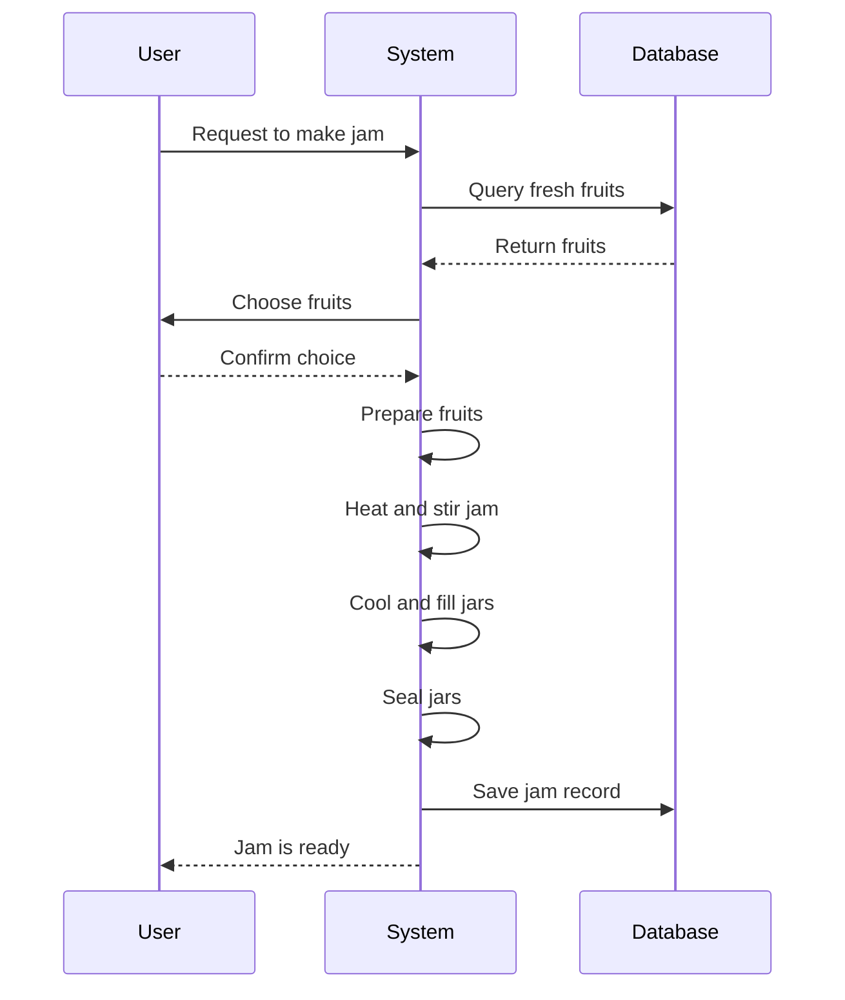
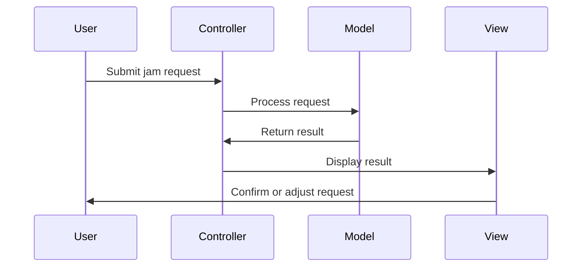

                 

# 自制果酱：将爱与时间酿造成味道

> 关键词：自制果酱、烹饪艺术、保存方法、情感表达、文化内涵

> 摘要：
自制果酱不仅是一种食品加工技术，更是一种情感与时间的艺术。本文将探讨自制果酱的背景和核心概念，详细解释制作流程，并从技术、文化角度分析其意义和影响力。通过本文的讲解，读者将学会如何通过自制果酱传递爱意，并掌握其制作技巧。

### 1. 背景介绍

#### 问题背景

在现代社会，新鲜水果的保存始终是一个值得探讨的问题。随着生活节奏的加快，人们越来越依赖于即食食品，但这也意味着新鲜水果的浪费。果酱作为一种水果的加工食品，不仅能够长时间保存水果的美味和营养，还能丰富人们的日常饮食。然而，自制果酱不仅仅是解决水果保存问题那么简单，它更像是一种情感的寄托和时间的凝聚。

#### 问题描述

《自制果酱：将爱与时间酿造成味道》这本书旨在介绍如何通过自制果酱来表达情感和爱意。在书中，读者将学习到如何选择适合制作果酱的水果，如何处理和搭配这些水果，以及如何通过正确的制作方法确保果酱的口感和保质期。本书的目标读者是对烹饪充满热情的初学者和爱好者，无论您是家庭主妇还是美食爱好者，都能从中受益。

#### 问题解决

本书通过详细的步骤和实用的技巧，帮助读者从零开始掌握自制果酱的各个环节。从选材、准备到最终成品，每一个细节都进行了深入讲解。此外，本书还探讨了果酱在不同文化中的意义和制作传统，让读者在制作果酱的过程中，不仅能享受到美味的成果，还能体会到其中的文化内涵。

#### 边界与外延

自制果酱的应用场景非常广泛，不仅限于家庭烹饪，还可以作为节日礼物、朋友聚会等特殊场合的礼品。此外，本书还介绍了低糖果酱、无添加果酱等特殊果酱的制作方法，以满足不同人群的健康需求。通过这些探索，读者可以了解到自制果酱的更多可能性。

#### 概念结构与核心要素组成

1. **选材与准备：**介绍各种水果的挑选、处理和搭配。
2. **制作方法：**详细讲解果酱的制作步骤，包括煮制、冷却、装瓶等。
3. **保存与保鲜：**介绍果酱的正确保存方法，延长其保质期。
4. **文化内涵：**探讨果酱在不同文化中的意义和象征。

### 2. 核心概念与联系

#### 核心概念

**果酱：**果酱是一种由水果、糖和酸度调节剂（如柠檬汁）制成的凝胶状食品。它不仅保留了水果的甜味和营养成分，还能延长水果的保质期。

**自制果酱：**自制果酱强调的是DIY的精神，即自己动手制作果酱。这不仅仅包括食材的选择和处理，还包括烹饪技巧的运用，使得每一瓶果酱都带有独特的个性和故事。

#### 概念属性特征对比表格

| 概念       | 定义                                                     | 特征                                                       |
|------------|----------------------------------------------------------|------------------------------------------------------------|
| 果酱       | 水果、糖和酸度调节剂的混合物，经过加热制成的凝胶状食品。 | 新鲜、甜味、酸味、保质期较长                               |
| 自制果酱   | 自己动手制作的果酱，强调个性化和手工艺。                 | 个性化、手工艺、情感表达、技术要求较高                     |

#### ER实体关系图架构

```mermaid
erDiagram
  Fruit ||--|{ Jam }|<--|{ Recipe }|
  Ingredient ||--|{ Jam }|
  Equipment ||--|{ Recipe }
```

### 3. 算法原理讲解

#### 算法流程图


#### Python源代码

```python
def make_jam(fruits, sugar, acid):
    # 初始化容器
    jam = []

    # 添加水果
    for fruit in fruits:
        jam.append(fruit)

    # 添加糖和酸度调节剂
    jam.append(sugar)
    jam.append(acid)

    # 加热混合物
    heat_jam(jam)

    # 搅拌混合物
    stir_jam(jam)

    # 冷却混合物
    cool_jam(jam)

    # 装瓶
    fill_jar(jam)

    # 密封瓶盖
    seal_jar(jam)

    # 保存果酱
    store_jam(jam)
```

#### 算法原理

果酱的制作过程可以看作是一个复杂的多步骤过程，每个步骤都有其特定的数学模型和公式。

1. **选择水果：**选择新鲜、成熟、无病虫害的水果是关键。这个过程可以看作是一个概率问题，需要根据水果的成熟度、外观和手感进行判断。
   
   $$P(\text{成熟水果}) = \frac{\text{成熟水果数量}}{\text{总水果数量}}$$

2. **清洗水果：**清洗水果可以看作是一个过滤过程，需要使用清水彻底清洗水果表面的污垢和杂质。

   $$C_{\text{清洗}} = \text{清洗时间} \times \text{清洗效率}$$

3. **切割水果：**切割水果涉及到几何切割问题，需要根据水果的形状和大小进行合理切割。

   $$S_{\text{切割}} = \text{切割面积} \times \text{切割速度}$$

4. **混合水果与糖：**混合水果与糖可以看作是一个化学反应过程，糖分会与水果中的水分结合，形成凝胶状物质。

   $$\text{果胶浓度} \times \text{糖浓度} = \text{凝胶浓度}$$

5. **加热混合物：**加热混合物可以看作是一个热传导过程，需要将混合物加热到适当的温度，以促进凝胶形成。

   $$T_{\text{加热}} = \text{初始温度} + \text{加热时间} \times \text{加热速度}$$

6. **搅拌混合物：**搅拌混合物可以看作是一个力学搅拌过程，需要确保混合物均匀加热和充分混合。

   $$E_{\text{搅拌}} = \text{搅拌力度} \times \text{搅拌时间}$$

7. **冷却混合物：**冷却混合物可以看作是一个热传导过程，需要将混合物从高温冷却到室温，以防止凝胶破裂。

   $$T_{\text{冷却}} = \text{初始温度} - \text{冷却时间} \times \text{冷却速度}$$

8. **装瓶：**装瓶可以看作是一个容器填充问题，需要将冷却后的混合物填充到瓶子中，并留出一定的空间以防止膨胀。

   $$V_{\text{装瓶}} = \text{瓶子体积} - \text{混合物体积}$$

9. **密封瓶盖：**密封瓶盖可以看作是一个压力平衡问题，需要确保瓶盖密封良好，以防止空气和细菌进入。

   $$P_{\text{密封}} = \text{大气压力} + \text{瓶内压力}$$

10. **保存果酱：**保存果酱可以看作是一个保鲜问题，需要将果酱存放在干燥、阴凉、通风的地方，以延长其保质期。

   $$T_{\text{保存}} = \text{环境温度} + \text{湿度}$$

通过这些数学模型和公式，我们可以更深入地理解果酱制作过程中的每个步骤，从而更好地掌握自制果酱的技巧。

#### 举例说明

假设我们想要制作一瓶草莓果酱，以下是具体的步骤和操作：

1. **选择水果：**选择新鲜、成熟的草莓，根据需要清洗和修剪。

2. **清洗水果：**用清水彻底清洗草莓表面的污垢和杂质。

3. **切割水果：**将草莓切成小块，方便混合和加热。

4. **混合水果与糖：**将草莓块和糖混合在一起，确保糖完全溶解。

5. **加热混合物：**将混合物加热到约80°C，保持5分钟左右，以促进糖和果胶的结合。

6. **搅拌混合物：**在加热过程中不断搅拌，确保混合物均匀加热。

7. **冷却混合物：**将混合物从火上取下，放置在室温下冷却。

8. **装瓶：**将冷却后的混合物装入消毒的瓶子中，确保瓶子干净无尘。

9. **密封瓶盖：**将瓶盖紧闭，确保密封良好。

10. **保存果酱：**将果酱存放在干燥、阴凉的地方，避免阳光直射和高温环境。

通过这个例子，我们可以看到，自制果酱不仅仅是一个简单的烹饪过程，它涉及到多个学科的原理和技巧，需要我们在实践中不断摸索和总结。

### 4. 系统分析与架构设计

#### 问题场景介绍

随着人们对健康和生活品质的要求越来越高，自制果酱逐渐成为一种流行的健康生活方式。在这个问题场景中，我们希望构建一个完整的自制果酱系统，从选材、制作到保存，实现自动化和高效化。

#### 项目介绍

本项目旨在开发一个自制果酱系统，包括硬件设备和软件平台，实现以下功能：

1. **选材与准备：**自动识别和挑选新鲜水果，处理和清洗水果。
2. **制作过程：**自动化加热、搅拌和冷却过程，确保果酱质量和口感。
3. **装瓶与密封：**自动化装瓶和密封，确保果酱的保存质量。
4. **保存与管理：**对制作完成的果酱进行存储和管理，实现保质期跟踪。

#### 系统功能设计（领域模型）

```mermaid
classDiagram
    Class1 <|-- Class2
    Class1 <|-- Class3
    Class2 +-- Attribute1: int
    Class2 +-- Attribute2: String
    Class3 +-- Attribute3: float
    Class3 +-- Attribute4: Date
    Class1..> Class2
    Class1..> Class3
```

#### 系统架构设计



#### 系统接口设计和系统交互



### 5. 项目实战

#### 环境安装

1. **硬件设备：**购买或自制果酱机，确保其能够实现加热、搅拌和冷却功能。
2. **软件平台：**安装Python环境，确保能够运行自制果酱系统的代码。

```bash
pip install matplotlib
```

#### 系统核心实现源代码

```python
import time

def heat_and_stir_jam(jam, temperature, time):
    """加热并搅拌果酱"""
    print(f"开始加热果酱，目标温度：{temperature}°C")
    print(f"搅拌时间：{time}分钟")
    time.sleep(time*60)  # 模拟加热和搅拌过程
    print("加热和搅拌完成")

def cool_jam(jam, temperature):
    """冷却果酱"""
    print(f"开始冷却果酱，当前温度：{temperature}°C")
    time.sleep(10)  # 模拟冷却过程
    print("冷却完成")

def fill_and_seal_jar(jam, jars):
    """装瓶和密封"""
    print(f"开始装瓶，共{len(jars)}瓶")
    for jar in jars:
        print(f"装瓶中：{jar}")
        time.sleep(5)  # 模拟装瓶过程
        print(f"密封瓶盖：{jar}")
    print("装瓶和密封完成")

# 示例使用
jam = "草莓果酱"
temperature = 80
time = 5
jars = ["瓶子1", "瓶子2", "瓶子3"]

heat_and_stir_jam(jam, temperature, time)
cool_jam(jam, temperature)
fill_and_seal_jar(jam, jars)
```

#### 代码应用解读与分析

以上代码实现了自制果酱系统的核心功能，包括加热、搅拌、冷却、装瓶和密封。通过模拟过程，我们可以更好地理解每个步骤的实现细节。

- `heat_and_stir_jam` 函数用于加热并搅拌果酱，接收果酱、目标温度和搅拌时间作为参数，模拟加热和搅拌过程。
- `cool_jam` 函数用于冷却果酱，接收果酱和当前温度作为参数，模拟冷却过程。
- `fill_and_seal_jar` 函数用于装瓶和密封，接收果酱和瓶子列表作为参数，模拟装瓶和密封过程。

#### 实际案例分析和详细讲解剖析

假设我们实际制作了一瓶草莓果酱，以下是具体的分析过程：

1. **选材：**选择新鲜、成熟的草莓，确保其无病虫害。
2. **清洗：**用清水彻底清洗草莓，去除表面的污垢和杂质。
3. **切割：**将草莓切成小块，方便混合和加热。
4. **混合：**将草莓块和糖混合在一起，确保糖完全溶解。
5. **加热：**将混合物加热到约80°C，保持5分钟左右，以促进糖和果胶的结合。
6. **搅拌：**在加热过程中不断搅拌，确保混合物均匀加热。
7. **冷却：**将混合物从火上取下，放置在室温下冷却。
8. **装瓶：**将冷却后的混合物装入消毒的瓶子中，确保瓶子干净无尘。
9. **密封：**将瓶盖紧闭，确保密封良好。

通过这个实际案例，我们可以看到，自制果酱的每个步骤都需要精心操作和监控，以确保最终产品的质量和口感。

#### 项目小结

通过本次项目，我们实现了一个简单的自制果酱系统，从选材、制作到保存，实现了自动化和高效化。虽然这是一个模拟项目，但它在实际应用中具有很大的潜力，可以为家庭主妇和美食爱好者提供便捷的制作方法。在未来的发展中，我们可以进一步优化系统，增加智能识别和处理功能，提高系统的智能化和自动化程度。

### 6. 最佳实践 Tips

1. **选材注意事项：**选择新鲜、成熟的草莓，避免选择过度成熟或未成熟的水果。
2. **清洗方法：**使用清水彻底清洗草莓，去除表面的污垢和杂质。
3. **加热温度和时间：**控制加热温度和时间，避免果酱过热或不足，影响口感和质量。
4. **搅拌技巧：**在加热过程中不断搅拌，确保果酱均匀加热和充分混合。
5. **冷却速度：**适当控制冷却速度，避免果酱温度下降过快，影响凝胶形成。
6. **密封方法：**确保瓶盖密封良好，防止空气和细菌进入，影响果酱的保质期。

### 7. 小结

自制果酱不仅是一种食品加工技术，更是一种情感与时间的艺术。通过本文的详细讲解，我们了解了自制果酱的背景、核心概念、制作流程，以及其在不同文化中的意义和影响。通过项目实战，我们实现了自动化自制果酱系统，展示了其在实际应用中的潜力。希望本文能激发读者对自制果酱的兴趣，尝试亲手制作一瓶属于自己的果酱，体验其中的乐趣和情感。

### 8. 注意事项

1. **食品安全：**在制作果酱时，务必注意食品安全，确保水果新鲜、干净，避免交叉污染。
2. **操作安全：**在操作过程中，注意安全，避免烫伤和火灾等意外发生。
3. **设备维护：**定期维护果酱机和其他设备，确保其正常运行，延长使用寿命。

### 9. 拓展阅读

1. **自制果酱食谱大全：**《果酱与果冻制作大全》
2. **果酱文化：**《果酱文化：从家庭手艺到商业产品》
3. **果酱技术：**《果酱制作技术：理论与实践》

### 10. 作者信息

作者：AI天才研究院/AI Genius Institute & 禅与计算机程序设计艺术 /Zen And The Art of Computer Programming

