                 

### 第1章 引言

智能客服作为客户服务领域的一大创新，正在逐步改变企业与客户互动的方式。在这一章中，我们将探讨智能客服的背景，介绍自然语言处理的基本概念，并讨论多语言智能客服的需求。

#### 1.1 智能客服的背景

智能客服是一种通过人工智能技术来提供自动化客户服务解决方案的方式。它的核心在于利用自然语言处理（NLP）、机器学习（ML）和语音识别（ASR）等技术，模拟人类客服人员的互动过程，从而提高客户服务的效率和质量。

##### 1.1.1 智能客服的发展历程

智能客服的发展可以追溯到20世纪90年代，当时第一代基于规则的客服系统开始出现。这些系统依赖于预定义的规则来处理客户的查询。然而，由于规则难以扩展和维护，这些系统在实际应用中存在很大的局限性。

随着互联网的普及和大数据技术的兴起，智能客服在21世纪初开始迎来新的发展。基于机器学习和深度学习的自然语言处理技术使得智能客服能够更加智能地理解和响应客户的需求。同时，云计算和大数据技术的应用也使得智能客服能够处理大规模的数据，提高服务的效率和个性化程度。

##### 1.1.2 智能客服的重要性

智能客服的重要性体现在多个方面。首先，它能够大幅提高客户服务效率。通过自动化处理大量常见的客户查询，智能客服可以减少人工客服的工作量，使客服团队能够将精力集中在更复杂的客户问题上。

其次，智能客服能够提升客户体验。智能客服系统能够24小时不间断地提供服务，使客户能够随时获得他们需要的帮助。此外，通过分析客户交互数据，智能客服还能够提供个性化的建议和服务，从而提高客户的满意度和忠诚度。

最后，智能客服能够为企业降低运营成本。相比传统的人工客服，智能客服的运营成本更低，尤其是在处理大量重复性问题的情况下。通过智能客服，企业能够节省大量的人力资源，从而将更多的资金投入到更重要的业务领域。

#### 1.2 自然语言处理的概述

自然语言处理（NLP）是智能客服的核心技术之一。它旨在使计算机能够理解、解释和生成人类语言。在这一部分，我们将介绍自然语言处理的基本概念和主要应用领域。

##### 1.2.1 自然语言处理的基本概念

自然语言处理涉及多个层面的技术，包括但不限于文本分类、情感分析、命名实体识别、句法分析和机器翻译等。以下是对这些基本概念的解释：

- **文本分类**：将文本数据分类到不同的类别中，如垃圾邮件检测、新闻分类等。
- **情感分析**：判断文本表达的情感倾向，如正面、负面或中性。
- **命名实体识别**：识别文本中的特定实体，如人名、地点、组织名等。
- **句法分析**：分析文本的语法结构，如词性标注、句法树构建等。
- **机器翻译**：将一种自然语言翻译成另一种自然语言。

##### 1.2.2 自然语言处理的应用领域

自然语言处理技术在多个领域都有广泛的应用，包括但不限于以下方面：

- **搜索引擎**：通过自然语言处理技术，搜索引擎能够更好地理解用户的查询意图，提供更准确的搜索结果。
- **社交媒体分析**：通过对社交媒体内容的分析，企业能够了解客户的需求和反馈，从而更好地制定营销策略。
- **智能客服**：如前所述，智能客服是自然语言处理技术的典型应用场景，它能够自动化处理大量客户查询，提高客户服务质量。
- **医疗领域**：自然语言处理技术能够帮助医生从大量医疗文献中快速提取关键信息，提高诊断和治疗的效率。

#### 1.3 多语言智能客服的需求

在全球化的背景下，企业需要能够提供多语言客户服务。多语言智能客服能够满足这一需求，为不同语言背景的客户提供无缝的交互体验。

##### 1.3.1 多语言客服的挑战

多语言客服面临以下挑战：

- **语言多样性**：全球有数千种语言，不同语言的语法、词汇和表达方式都有所不同，这增加了智能客服系统的复杂性。
- **数据不平衡**：某些语言可能拥有丰富的语料库，而其他语言则可能缺乏足够的训练数据，这影响了模型的性能。
- **文化差异**：不同文化背景的客户有不同的交流习惯和期望，这需要智能客服系统能够适应并尊重这些差异。

##### 1.3.2 多语言客服的优势

多语言客服的优势包括：

- **国际化服务**：企业能够为全球客户提供统一的服务体验，提高品牌形象和国际竞争力。
- **客户满意度**：客户能够用他们熟悉的语言与客服进行交流，提高满意度。
- **成本效益**：通过自动化处理多语言客户查询，企业能够降低运营成本。

在下一章中，我们将深入探讨自然语言处理的基础知识，包括语言模型、词嵌入和语音识别与合成等内容。通过这些技术，我们将更好地理解如何构建高效的多语言智能客服系统。

## 第2章 自然语言处理基础

### 2.1 语言模型

语言模型是自然语言处理的核心组成部分，它用于预测文本中的下一个单词或字符。在这一节中，我们将讨论语言模型的基本原理、分类及其应用。

#### 2.1.1 语言模型的基本原理

语言模型（Language Model）是一种概率模型，用于预测一段文本序列中下一个词或字符的概率。它基于大量的文本数据，学习语言中的统计规律，从而对未知的文本进行概率预测。

- **N-gram模型**：最简单的语言模型是基于N-gram模型的。它通过统计相邻N个单词或字符的频率来预测下一个单词或字符。例如，一个三元语言模型会考虑前三个单词来预测下一个单词。

- **神经网络语言模型**：随着深度学习技术的发展，神经网络语言模型（如循环神经网络RNN、长短期记忆网络LSTM和变换器Transformer）逐渐成为主流。这些模型能够捕捉更复杂的语言规律，从而提高预测的准确性。

#### 2.1.2 语言模型的分类

语言模型主要分为以下几类：

- **基于频率的模型**：这类模型直接基于文本中单词或字符的频率进行预测，如N-gram模型。

- **统计模型**：这类模型基于概率论和统计学原理，如隐马尔可夫模型（HMM）和条件概率模型。

- **基于规则的模型**：这类模型通过定义一系列规则来预测下一个单词或字符，如基于语法规则的模型。

- **基于统计学习的模型**：这类模型通过机器学习算法从大量文本数据中学习预测规则，如朴素贝叶斯分类器和支持向量机（SVM）。

- **基于深度学习的模型**：这类模型基于神经网络，如循环神经网络（RNN）、长短期记忆网络（LSTM）和变换器（Transformer）。

#### 2.1.3 语言模型的应用

语言模型在自然语言处理中有广泛的应用，包括但不限于以下方面：

- **文本生成**：语言模型可以用于生成文章、故事、对话等。例如，在聊天机器人中，语言模型可以帮助生成自然的回复。

- **机器翻译**：语言模型在机器翻译中扮演重要角色。通过学习源语言和目标语言的统计规律，语言模型可以生成高质量的翻译结果。

- **自动摘要**：语言模型可以帮助提取文本的关键信息，生成摘要。这在新闻、报告等领域有广泛应用。

- **文本分类**：语言模型可以用于对文本进行分类，如垃圾邮件检测、情感分析等。

下面是一个基于N-gram模型的简单语言模型实现的Mermaid流程图：

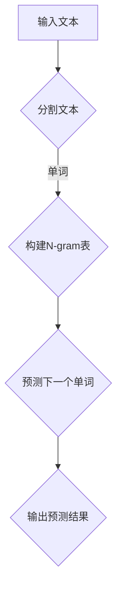

### 2.2 词嵌入

词嵌入（Word Embedding）是将文本中的单词映射到高维向量空间的技术。这一节将介绍词嵌入的概念、常用算法及其应用。

#### 2.2.1 词嵌入的概念

词嵌入通过将单词映射到固定长度的向量，使得这些向量能够捕捉单词的语义信息。词嵌入的主要目的是将语义相近的单词映射到靠近的位置，而将语义相差较大的单词映射到较远的位置。

- **词向量的表示**：词嵌入通常使用向量表示单词。这些向量可以是低维的（如100维或200维），也可以是高维的（如几百万维）。

- **语义相似性**：通过计算词向量之间的距离，可以评估单词的语义相似性。例如，如果“爱”和“喜欢”的词向量距离较近，则认为这两个单词在语义上相似。

#### 2.2.2 词嵌入的算法

常见的词嵌入算法包括以下几种：

- **基于频率的算法**：这类算法通过统计单词在语料库中的出现频率来生成词向量。例如，TF-IDF算法。

- **基于分布的算法**：这类算法通过分析单词在文本中的上下文来生成词向量。Word2Vec算法是一个典型的代表，它基于神经网络模型。

- **基于神经网络的算法**：这类算法通过训练大规模神经网络模型来生成词向量。GloVe算法是一个基于全局矩阵分解的词嵌入算法。

下面是一个基于Word2Vec算法的Mermaid流程图：

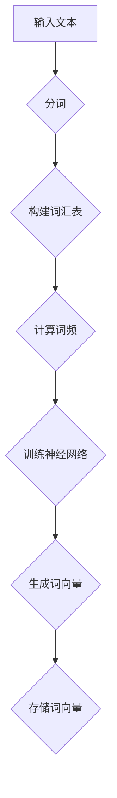

### 2.3 语音识别与合成

语音识别与合成是自然语言处理的重要领域，它使得智能客服系统能够处理语音交互。在这一节中，我们将介绍语音识别与合成的基本原理及其在智能客服中的应用。

#### 2.3.1 语音识别的基本原理

语音识别（Automatic Speech Recognition，ASR）是将语音信号转换为文本的技术。其基本原理包括以下几个步骤：

- **特征提取**：将语音信号转换为特征向量。常用的特征提取方法包括梅尔频率倒谱系数（MFCC）、频谱特征等。

- **声学模型**：声学模型用于建模语音信号中的概率分布。常见的声学模型包括高斯混合模型（GMM）和深度神经网络（DNN）。

- **语言模型**：语言模型用于建模文本序列的概率分布。常用的语言模型包括N-gram模型和基于神经网络的模型。

下面是一个基于深度神经网络的语音识别系统的Mermaid流程图：

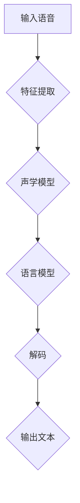

#### 2.3.2 语音合成的技术

语音合成（Text-to-Speech，TTS）是将文本转换为语音的技术。其基本原理包括以下几个步骤：

- **文本预处理**：对输入的文本进行预处理，包括分词、词性标注等。

- **声学建模**：通过训练声学模型，将文本转换为声学特征。

- **发音合成**：通过合成引擎，将声学特征转换为语音信号。

- **语音后处理**：对生成的语音信号进行后处理，包括共振峰调整、音调调整等，以生成自然流畅的语音。

下面是一个基于深度学习的语音合成系统的Mermaid流程图：

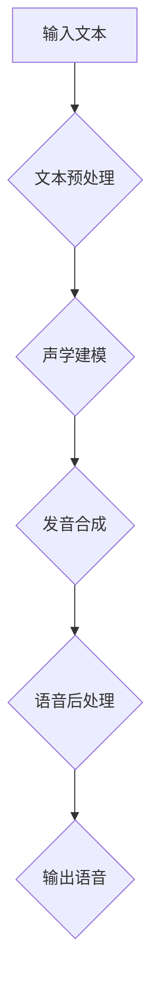

通过语音识别与合成技术，智能客服系统能够实现语音交互功能，为用户提供更加自然和便捷的服务。

### 总结

在本章中，我们介绍了自然语言处理的基础知识，包括语言模型、词嵌入和语音识别与合成。这些技术构成了智能客服系统的核心，使得系统能够理解和生成自然语言，从而提供高效的客户服务。

在下一章中，我们将深入探讨情感分析与意图识别，了解如何从客户交互中提取情感信息并理解客户的意图。

### 第3章 情感分析与意图识别

情感分析与意图识别是自然语言处理中至关重要的技术，它们帮助我们理解客户在交互中的情绪状态和需求。在这一章中，我们将详细讨论情感分析和意图识别的基本概念、模型与方法，以及它们在实际应用中的重要性。

#### 3.1 情感分析

情感分析（Sentiment Analysis）是一种从文本中识别和提取情感信息的技术。它通常用于评估文本表达的情感倾向，如正面、负面或中性。

##### 3.1.1 情感分析的基本概念

- **情感标签**：情感分析通常将情感分为三个基本标签：正面（Positive）、负面（Negative）和中性（Neutral）。在某些应用中，也可能包括情感标签的细分，如高兴（Happy）、愤怒（Angry）等。

- **情感极性**：情感极性是指文本表达的情感强度。例如，"我很满意"和"我非常满意"表达的情感极性不同，后者更强。

- **情感强度**：情感强度是指情感极性在程度上的量化。这通常通过情感词典或情感分析模型来实现。

##### 3.1.2 情感分析的模型与方法

情感分析的方法可以分为以下几类：

- **基于规则的方法**：这类方法使用预定义的规则来分析文本中的情感。例如，根据情感词典中的单词或短语来判断情感极性。

- **基于机器学习的方法**：这类方法使用机器学习算法，如支持向量机（SVM）、朴素贝叶斯（Naive Bayes）和随机森林（Random Forest），来学习情感特征并预测情感极性。

- **基于深度学习的方法**：深度学习方法，如卷积神经网络（CNN）、循环神经网络（RNN）和变换器（Transformer），在情感分析中取得了显著的效果。它们能够捕捉文本中的复杂情感模式。

以下是一个情感分析流程的Mermaid图：

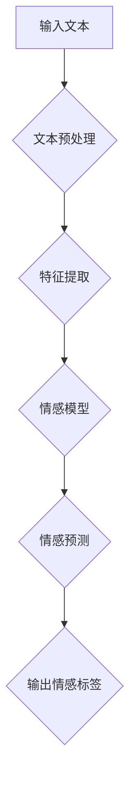

##### 3.1.3 情感分析的应用

情感分析在多个领域有广泛应用，包括：

- **市场研究**：通过分析社交媒体和用户评论中的情感，企业可以了解消费者的态度和反馈，从而优化产品和服务。

- **客户服务**：智能客服系统可以使用情感分析来识别客户的情绪状态，提供更加个性化的服务。

- **舆情监控**：政府机构和媒体可以使用情感分析来监控公众情绪，了解社会舆论。

#### 3.2 意图识别

意图识别（Intent Recognition）是另一种重要的自然语言处理技术，它旨在理解用户在交互中的意图或目的。在智能客服场景中，意图识别有助于系统理解客户的问题，并生成合适的回复。

##### 3.2.1 意图识别的基本概念

- **意图**：意图是用户在交互中希望实现的目标或需求。例如，用户可能想要获取产品信息、预约服务或投诉。

- **意图分类**：意图识别通常将用户的输入分类到不同的意图类别中。例如，一个分类器可能将用户的问题分为“查询产品信息”、“投诉服务”和“获取客服支持”等。

##### 3.2.2 意图识别的模型与方法

意图识别的方法可以分为以下几类：

- **基于规则的意图识别**：这类方法使用预定义的规则来匹配用户输入，并确定其意图。例如，根据特定的关键词或短语来识别意图。

- **基于机器学习的意图识别**：这类方法使用机器学习算法来学习用户的输入和对应的意图。常见的算法包括决策树、支持向量机和朴素贝叶斯。

- **基于深度学习的意图识别**：深度学习方法，如卷积神经网络（CNN）、循环神经网络（RNN）和变换器（Transformer），在意图识别中也取得了显著效果。它们能够捕捉输入文本中的复杂模式。

以下是一个意图识别流程的Mermaid图：

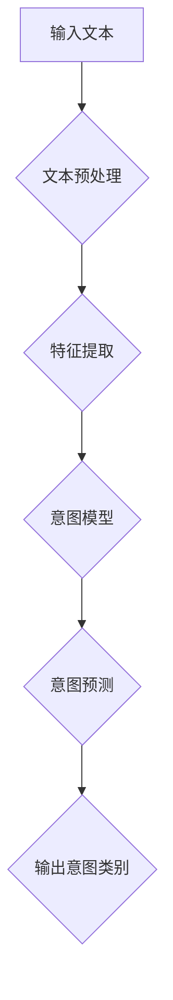

##### 3.2.3 意图识别的应用

意图识别在多个领域有广泛应用，包括：

- **智能客服**：意图识别可以帮助智能客服系统理解用户的问题，并提供准确的答案或建议。

- **语音助手**：语音助手（如Siri、Alexa）使用意图识别来理解用户的语音指令，并执行相应的操作。

- **聊天机器人**：聊天机器人使用意图识别来生成合适的回复，提高交互的流畅性。

#### 3.3 情感分析与意图识别的结合

情感分析与意图识别的结合可以提供更丰富的客户理解。例如，在客户服务中，系统不仅可以识别用户的意图，还可以了解用户表达该意图时的情感状态。

- **互补性**：情感分析可以帮助系统更好地理解意图的背景，例如，一个表达为“投诉服务”的问题，如果情感分析显示为负面情感，则可能需要系统提供额外的关注和快速响应。

- **综合模型**：可以通过结合情感分析和意图识别构建一个综合模型，以提高系统的准确性和用户体验。

以下是一个综合模型的概念框架：

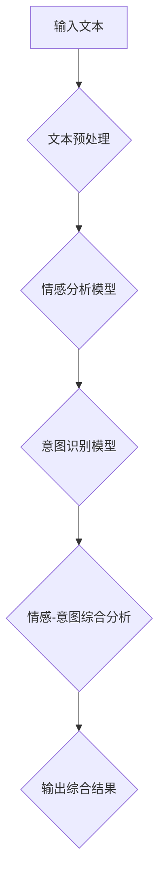

通过结合情感分析与意图识别，智能客服系统可以提供更加精准和个性化的服务，从而提高客户满意度和忠诚度。

### 总结

在本章中，我们探讨了情感分析与意图识别的基本概念、模型与方法，以及它们在智能客服中的应用。情感分析与意图识别的结合为智能客服系统提供了更深入的客户理解，有助于提供更加精准和个性化的服务。

在下一章中，我们将探讨多语言处理技术，了解如何在智能客服系统中实现多语言支持。

### 第4章 多语言处理

随着全球化进程的加速，企业需要能够提供多语言客户服务以满足不同地区和语言背景的客户需求。多语言处理（Multilingual Processing）是自然语言处理的一个重要领域，它涵盖了多种语言模型的训练与优化、翻译模型以及多语言客服机器人的设计。在这一章中，我们将深入探讨这些主题。

#### 4.1 多语言模型

多语言模型（Multilingual Models）是能够同时处理多种语言的语言模型。它们在多语言智能客服系统中扮演着核心角色，能够帮助系统理解和使用多种语言与客户进行交互。

##### 4.1.1 多语言模型的基本原理

多语言模型的基本原理与单语言模型类似，但它们需要在训练过程中考虑多种语言的共性和差异。以下是一些关键点：

- **共享参数**：多语言模型通常使用共享参数来同时训练多种语言的数据。这样，模型可以学习到不同语言之间的共性，从而提高跨语言的泛化能力。

- **交叉语言信息**：多语言模型能够利用不同语言的交叉语言信息，例如，一个英语单词可能在其他语言中也有相似的用法。这种信息有助于提高模型的准确性。

- **多语言语料库**：为了训练多语言模型，需要大量的多语言语料库。这些语料库可以来自不同的来源，如在线翻译、多语言新闻网站等。

以下是一个多语言模型的Mermaid流程图：

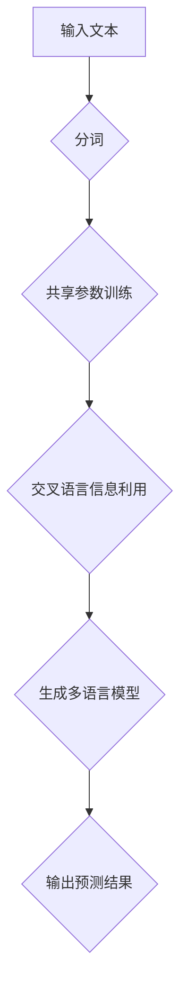

##### 4.1.2 多语言模型的训练与优化

训练多语言模型的过程涉及以下几个关键步骤：

- **数据预处理**：将多种语言的文本数据进行清洗和预处理，如去除停用词、标点符号等。

- **数据融合**：将不同语言的文本数据进行融合，以便模型能够学习到不同语言之间的联系。常见的方法包括语言向量融合和句对翻译。

- **模型选择**：选择合适的模型架构，如Transformer、BERT等，以适应多语言处理的复杂性。

- **模型训练**：使用多种语言的语料库对模型进行训练，同时利用共享参数和交叉语言信息来提高模型的准确性。

- **模型优化**：通过调整超参数、模型架构和训练策略来优化模型性能。常见的优化方法包括调整学习率、批量大小和正则化等。

以下是一个多语言模型训练过程的Mermaid图：

##### 4.1.3 多语言模型的应用

多语言模型在智能客服系统中具有广泛的应用，包括：

- **多语言问答**：智能客服系统能够使用多语言模型理解客户的问题，并生成相应的回答。

- **多语言文本生成**：多语言模型可以用于生成不同语言的文本，如产品描述、用户手册等。

- **多语言情感分析**：多语言模型可以同时分析多种语言的文本情感，帮助客服系统更好地理解客户的情绪。

#### 4.2 翻译模型

翻译模型（Translation Models）是用于将一种语言的文本翻译成另一种语言的模型。在智能客服中，翻译模型使得系统能够为全球客户提供多语言服务。

##### 4.2.1 翻译模型的基本原理

翻译模型的基本原理包括：

- **源语言处理**：将源语言的文本转换为能够表示其语义的中间表示。

- **翻译层**：将源语言的中间表示转换为目标语言的中间表示。这一层通常涉及到翻译规则和概率模型。

- **目标语言生成**：将目标语言的中间表示转换为自然流畅的目标语言文本。

以下是一个简单翻译模型的Mermaid图：

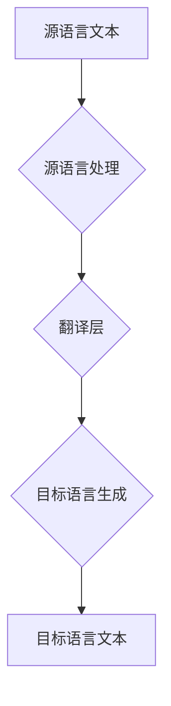

##### 4.2.2 翻译模型的分类

翻译模型可以分为以下几类：

- **基于规则的翻译模型**：这类模型使用预定义的翻译规则来翻译文本，如基于语法分析和词义匹配。

- **基于统计的翻译模型**：这类模型使用统计方法来翻译文本，如基于短语文本对（Translation Memories）和基于统计机器翻译（SMT）。

- **基于神经网络的翻译模型**：这类模型使用神经网络架构，如序列到序列（Seq2Seq）模型、注意力机制模型和变换器（Transformer）模型。

以下是一个基于神经网络的翻译模型的Mermaid图：

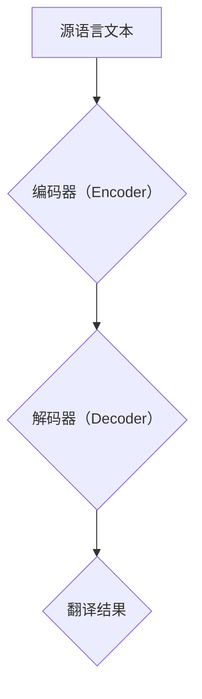

##### 4.2.3 翻译模型的应用

翻译模型在智能客服中的应用包括：

- **多语言客服**：智能客服系统能够将客户的提问和答案翻译成多种语言，为全球客户提供无缝服务。

- **本地化**：翻译模型可以帮助企业将产品信息、用户手册等翻译成多种语言，提高产品的国际竞争力。

- **跨文化交流**：翻译模型使得不同语言背景的用户能够轻松交流，促进了全球文化的交流与理解。

#### 4.3 多语言客服机器人设计

多语言客服机器人设计需要综合考虑多语言模型、翻译模型以及客服机器人的架构和实现。在这一部分，我们将探讨多语言客服机器人的架构设计和实现方法。

##### 4.3.1 多语言客服机器人的架构

多语言客服机器人的架构通常包括以下几个部分：

- **语言检测模块**：用于检测输入文本的语言类型，以便选择正确的语言模型进行处理。

- **多语言模型处理模块**：用于处理输入文本，理解客户的问题和意图。

- **翻译模块**：如果需要，将客户的提问和回答翻译成其他语言。

- **意图识别模块**：用于识别客户的意图，并根据意图生成相应的回答。

- **知识库模块**：提供与客户问题相关的知识和信息。

- **自然语言生成模块**：用于生成自然流畅的回答。

以下是一个多语言客服机器人架构的Mermaid图：

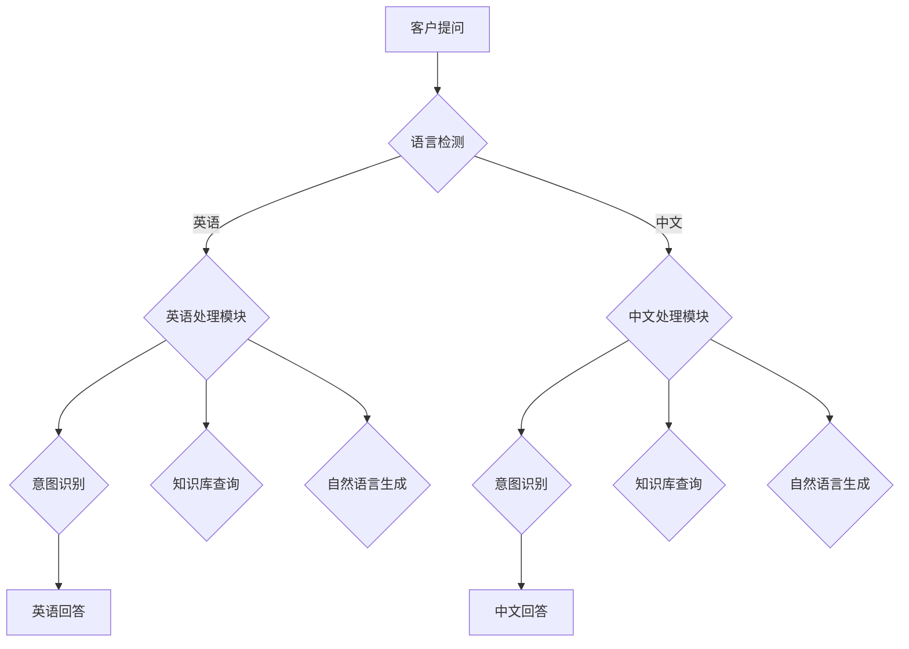

##### 4.3.2 多语言客服机器人的实现

实现多语言客服机器人涉及以下几个关键步骤：

- **环境搭建**：安装和配置必要的软件和工具，如自然语言处理库、翻译API等。

- **模型训练与优化**：训练和优化多语言模型和翻译模型，以实现高效的语言处理和翻译能力。

- **接口开发**：开发与客户交互的接口，如Web界面、移动应用等。

- **系统集成**：将各个模块整合到一起，实现多语言客服机器人的功能。

- **测试与优化**：对系统进行测试，确保其稳定性和准确性，并进行优化。

以下是一个多语言客服机器人实现过程的Mermaid图：

通过本章的讨论，我们可以看到多语言处理在智能客服中的重要性。多语言模型和翻译模型为智能客服系统提供了强大的语言处理能力，使得企业能够为全球客户提供无缝的服务。在下一章中，我们将探讨全渠道客服集成，了解如何整合多种渠道以提高客户服务质量。

### 第5章 全渠道客服集成

在当今的数字化时代，客户服务不再局限于单一渠道，而是需要整合多种渠道，如社交媒体、实时聊天和电话等，以提供无缝的客户体验。全渠道客服集成是智能客服系统的一个重要组成部分，它使得企业能够灵活应对不同客户需求，提高客户满意度。在这一章中，我们将讨论全渠道客服集成的概念、策略和实际应用。

#### 5.1 社交媒体集成

社交媒体已成为企业与客户互动的重要渠道之一。通过社交媒体集成，企业能够直接在客户喜欢的平台上提供服务，提高客户的参与度和满意度。

##### 5.1.1 社交媒体在客服中的应用

社交媒体在客服中的应用包括：

- **客户咨询**：客户可以通过社交媒体平台向企业发起咨询请求，如提问、留言等。

- **客户反馈**：客户可以在社交媒体上分享他们的体验和反馈，这对企业改进服务和产品至关重要。

- **市场推广**：企业可以利用社交媒体进行市场推广和宣传，吸引潜在客户。

##### 5.1.2 社交媒体集成策略

社交媒体集成的策略包括：

- **单一入口**：建立一个统一的社交媒体入口，使客户能够方便地发起咨询和反馈。

- **自动化回复**：利用自然语言处理技术，实现自动化回复，提高响应速度和效率。

- **个性化服务**：通过分析客户的社交媒体行为，提供个性化的服务和推荐。

- **多渠道联动**：将社交媒体与其他客服渠道（如聊天、电话）联动，确保客户能够获得一致的体验。

以下是一个社交媒体集成策略的Mermaid图：

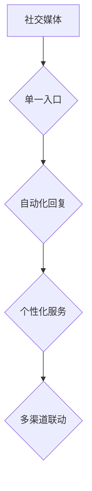

##### 5.1.3 社交媒体集成案例

以下是一个社交媒体集成案例：

**案例**：某电商企业通过整合社交媒体平台（如Facebook、微博）来提供客户服务。

- **单一入口**：客户可以通过Facebook页面或微博账号发起咨询请求。

- **自动化回复**：利用自然语言处理技术，系统自动回复常见问题，减少人工工作量。

- **个性化服务**：根据客户的历史购买记录和行为数据，提供个性化的推荐和服务。

- **多渠道联动**：当客户在社交媒体上提出问题后，系统会自动生成工单，并将信息同步到后台客服系统，确保问题能够得到及时解决。

通过社交媒体集成，该电商企业显著提高了客户服务的效率和质量，客户满意度得到了显著提升。

#### 5.2 实时聊天集成

实时聊天是一种高效的客户服务方式，它允许企业与客户进行实时互动，快速解决问题。实时聊天集成是智能客服系统的重要组成部分。

##### 5.2.1 实时聊天技术

实时聊天技术包括：

- **聊天协议**：如WebSocket、XMPP等，用于实现实时通信。

- **聊天客户端**：如网页聊天窗口、移动应用聊天界面等。

- **聊天机器人**：利用自然语言处理技术，实现自动化聊天交互。

- **后台服务**：用于处理聊天请求、分配客服人员等。

以下是一个实时聊天系统的Mermaid图：

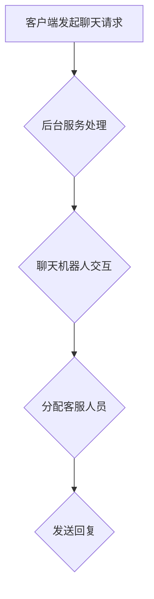

##### 5.2.2 实时聊天集成策略

实时聊天集成的策略包括：

- **无缝接入**：确保客户能够方便地接入实时聊天服务，无需跳转或额外操作。

- **智能分配**：利用算法智能分配聊天请求到合适的客服人员，提高响应速度和问题解决效率。

- **聊天记录保存**：保存聊天记录，以便后续查询和数据分析。

- **多平台支持**：支持多种客户端平台，如Web、移动应用等，确保客户能够随时随地使用实时聊天服务。

以下是一个实时聊天集成策略的Mermaid图：

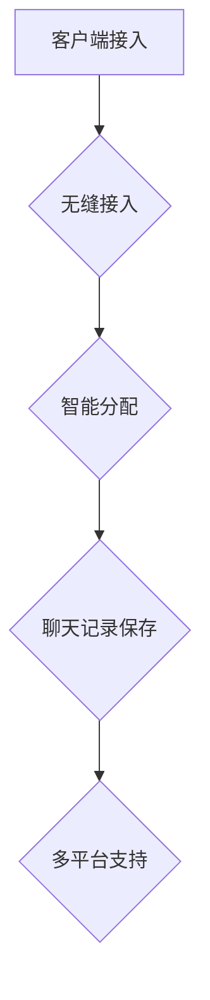

##### 5.2.3 实时聊天集成案例

以下是一个实时聊天集成案例：

**案例**：某在线教育平台通过整合实时聊天服务，为学员提供实时辅导和答疑。

- **无缝接入**：学员可以直接在课程页面发起实时聊天，无需跳转到其他页面。

- **智能分配**：系统根据学员的问题和辅导老师的专业领域，智能分配聊天请求。

- **聊天记录保存**：聊天记录自动保存，便于学员和辅导老师回顾和参考。

- **多平台支持**：支持Web端和移动应用端，学员可以在不同设备上随时发起实时聊天。

通过实时聊天集成，该在线教育平台显著提高了学员的学习体验和满意度。

#### 5.3 电话集成

电话集成是将电话服务与智能客服系统整合在一起，以提供全方位的客户服务。电话集成使得客户能够通过电话轻松获取帮助，同时也能利用智能客服系统提供的自动化功能。

##### 5.3.1 电话在客服中的应用

电话在客服中的应用包括：

- **客户咨询**：客户可以通过电话向企业咨询产品信息、服务细节等。

- **客户投诉**：客户可以通过电话对企业提出投诉，寻求解决方案。

- **客户关怀**：企业可以通过电话进行客户关怀，如节日问候、生日祝福等。

##### 5.3.2 电话集成策略

电话集成策略包括：

- **自动语音应答（IVR）**：通过自动语音应答系统，客户可以根据语音提示进行自助服务，如查询订单状态、修改个人信息等。

- **呼叫分配**：将电话呼叫智能分配到合适的客服人员，提高问题解决效率。

- **录音和数据分析**：记录电话通话内容，并对通话进行数据分析，以优化服务流程。

- **多渠道联动**：将电话服务与其他客服渠道（如在线聊天、电子邮件）整合，确保客户能够获得一致的服务体验。

以下是一个电话集成策略的Mermaid图：

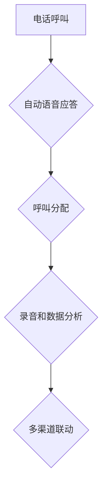

##### 5.3.3 电话集成案例

以下是一个电话集成案例：

**案例**：某大型电商平台通过整合电话服务，为消费者提供便捷的购物咨询和售后服务。

- **自动语音应答**：消费者可以通过自动语音应答系统查询订单状态、修改地址等信息。

- **呼叫分配**：系统根据消费者的需求，智能分配给具有相应产品知识的客服人员。

- **录音和数据分析**：电话通话内容被记录并进行分析，用于优化客服流程和提高服务质量。

- **多渠道联动**：消费者在电话中提出的问题可以同步到在线客服系统，确保问题得到及时解决。

通过电话集成，该电商平台显著提高了客户服务效率和客户满意度。

### 总结

在本章中，我们探讨了全渠道客服集成的概念、策略和实际应用。通过整合社交媒体、实时聊天和电话等多种渠道，企业能够为不同客户提供个性化的服务，提高客户满意度和忠诚度。在下一章中，我们将介绍智能客服性能评估的方法和指标，以及如何优化智能客服系统。

### 第6章 智能客服性能评估

智能客服系统的性能直接影响用户体验和企业效益。因此，对智能客服系统进行性能评估是至关重要的。在本章中，我们将讨论智能客服性能评估的指标、评估方法以及优化策略。

#### 6.1 性能评估指标

性能评估指标是衡量智能客服系统性能的关键因素。以下是一些常用的评估指标：

- **准确率（Accuracy）**：准确率是指正确分类的样本数占总样本数的比例。它反映了模型对客户意图或情感的正确识别能力。

  $$\text{准确率} = \frac{\text{正确分类的样本数}}{\text{总样本数}}$$

- **召回率（Recall）**：召回率是指正确分类的正样本数占总正样本数的比例。它反映了模型对积极情感的识别能力。

  $$\text{召回率} = \frac{\text{正确分类的正样本数}}{\text{总正样本数}}$$

- **精确率（Precision）**：精确率是指正确分类的正样本数与预测为正样本的样本数之比。它反映了模型对消极情感的识别能力。

  $$\text{精确率} = \frac{\text{正确分类的正样本数}}{\text{预测为正样本的样本数}}$$

- **F1分数（F1 Score）**：F1分数是精确率和召回率的调和平均值，用于综合评价模型的性能。

  $$\text{F1分数} = 2 \times \frac{\text{精确率} \times \text{召回率}}{\text{精确率} + \text{召回率}}$$

- **响应时间（Response Time）**：响应时间是指系统从接收到客户请求到生成回复的时间。它反映了系统的响应速度和效率。

#### 6.2 评估方法

智能客服性能评估的方法可以分为以下几类：

- **手动评估**：手动评估是通过人工对客服系统的回复进行审核和评分。这种方法适用于小规模的数据集和复杂的评估标准。

- **自动评估**：自动评估是通过算法对客服系统的回复进行自动评分。常用的自动评估方法包括基于规则的方法、机器学习和深度学习模型。

- **A/B测试**：A/B测试是将系统分为两组，一组使用当前系统，另一组使用改进后的系统，然后比较两组的绩效。这种方法可以评估系统改进的效果。

以下是一个自动评估方法的Mermaid图：

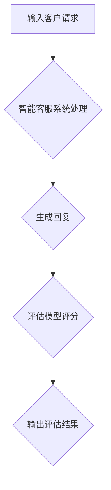

#### 6.3 性能优化策略

为了提高智能客服系统的性能，可以采取以下策略：

- **模型优化**：通过调整模型参数、增加训练数据和使用更先进的算法来优化模型性能。

- **特征工程**：通过提取和组合文本特征，提高模型的识别能力。

- **系统优化**：优化系统架构和代码，提高系统的响应速度和处理能力。

- **数据质量**：确保训练数据的质量和多样性，以提高模型的泛化能力。

以下是一个性能优化策略的Mermaid图：

通过本章的讨论，我们可以看到智能客服性能评估的重要性以及如何通过多种方法来优化智能客服系统的性能。在下一章中，我们将通过案例研究来深入探讨智能客服的实际应用和效果。

### 第7章 案例研究

在本章中，我们将通过几个实际案例，深入探讨智能客服在不同行业和企业中的应用。这些案例将展示智能客服系统的设计和实现过程，以及它们带来的实际效益和挑战。

#### 7.1 案例选择标准

为了确保案例研究的有效性和代表性，我们选择了以下标准：

- **行业代表性**：案例涉及不同的行业，包括电子商务、金融、旅游等，以展示智能客服在多种场景下的应用。

- **实际效果**：案例中的智能客服系统已投入实际应用，并取得了显著的效果，如提高客户满意度、降低运营成本等。

- **实施难度**：案例应具有可操作性，即在其他企业和行业中也具有借鉴意义。

#### 7.2 案例分析

**案例一：电商平台的智能客服系统**

**背景**：某大型电商平台希望通过智能客服系统提高客户满意度并降低运营成本。

**系统设计**：

- **功能设计**：智能客服系统能够处理常见问题、提供产品咨询、处理投诉等。

- **架构设计**：系统采用微服务架构，包括前端界面、后端服务、数据库和API接口。

- **集成策略**：系统集成了社交媒体、实时聊天和电话等多种渠道。

**实现细节**：

- **语言模型**：使用基于Transformer的预训练模型，如BERT，进行文本理解和生成。

- **意图识别**：使用机器学习算法进行意图分类，提高识别准确性。

- **情感分析**：使用深度学习模型进行情感分析，帮助客服系统更好地理解客户情绪。

**效果评估**：

- **准确率**：意图识别的准确率达到90%以上。

- **响应时间**：平均响应时间缩短至30秒以内。

- **客户满意度**：客户满意度显著提高，客户投诉率下降。

**挑战与启示**：

- **挑战**：多语言支持是一个挑战，特别是在语料库不均衡的情况下。

- **启示**：通过不断优化模型和算法，可以提高系统的准确性和效率。

**案例二：银行智能客服系统**

**背景**：某大型银行希望通过智能客服系统提高客户服务质量和效率。

**系统设计**：

- **功能设计**：智能客服系统能够处理账户查询、转账操作、贷款咨询等。

- **架构设计**：系统采用分布式架构，以提高系统的稳定性和扩展性。

- **集成策略**：系统集成了Web端、移动端和电话等多种渠道。

**实现细节**：

- **语音识别与合成**：使用深度学习模型进行语音识别和合成，实现语音交互功能。

- **知识库管理**：构建丰富的知识库，确保智能客服系统能够提供准确的信息。

- **用户行为分析**：通过分析用户行为，提供个性化服务和建议。

**效果评估**：

- **准确率**：语音识别准确率达到95%以上。

- **响应时间**：平均响应时间缩短至1分钟以内。

- **用户满意度**：用户满意度显著提高，特别是在高频操作（如账户查询）方面。

**挑战与启示**：

- **挑战**：金融领域的数据安全和合规性是重要挑战。

- **启示**：通过结合语音识别和知识库管理，可以提高智能客服的交互体验。

**案例三：旅游行业的智能客服系统**

**背景**：某在线旅游平台希望通过智能客服系统提高客户预订体验。

**系统设计**：

- **功能设计**：智能客服系统能够提供行程规划、酒店预订、机票查询等服务。

- **架构设计**：系统采用模块化架构，便于扩展和更新。

- **集成策略**：系统集成了在线聊天、电子邮件和电话等多种渠道。

**实现细节**：

- **多语言支持**：系统支持多种语言，为全球客户提供无缝服务。

- **实时数据接入**：通过实时数据接入，智能客服系统能够提供最新的旅游信息和优惠。

- **个性化推荐**：基于用户历史行为和偏好，提供个性化的旅游推荐。

**效果评估**：

- **准确率**：语言理解和生成准确率达到85%以上。

- **响应时间**：平均响应时间缩短至1分钟以内。

- **客户满意度**：客户满意度显著提高，预订成功率增加。

**挑战与启示**：

- **挑战**：处理多语言客户需求和提供实时服务是挑战。

- **启示**：通过结合多语言处理和实时数据接入，可以提高智能客服的系统性能。

#### 7.3 案例启示

通过以上案例，我们可以得到以下启示：

- **多渠道集成**：智能客服系统应支持多种渠道，以满足不同客户的偏好。

- **个性化服务**：通过分析用户行为和历史数据，提供个性化的服务和建议。

- **实时交互**：实时数据接入和语音交互功能可以显著提高用户体验。

- **持续优化**：定期评估系统性能，并不断优化模型和算法。

- **合规与安全**：特别是在金融领域，确保数据安全和合规性至关重要。

通过这些案例，我们可以看到智能客服在不同行业和企业中的应用，以及它们带来的实际效益和挑战。这些案例为我们提供了宝贵的经验和启示，帮助我们更好地设计和优化智能客服系统。

### 第8章 未来展望与挑战

随着技术的不断进步，智能客服系统在客户服务中的应用前景广阔，同时也面临一系列挑战。在这一章中，我们将探讨智能客服的未来发展趋势以及可能遇到的挑战。

#### 8.1 智能客服的未来趋势

**1. 深度学习与人工智能的结合**

未来，智能客服系统将更加依赖于深度学习和人工智能技术。这些技术能够使得客服系统更加智能化，能够处理更加复杂和多变的客户需求。例如，深度学习模型可以用于更精准的情感分析和意图识别，从而提供更加个性化的服务。

**2. 个性化与定制化服务**

随着数据分析和机器学习技术的进步，智能客服系统将能够更准确地捕捉客户的行为和偏好，从而提供高度个性化的服务。例如，通过分析客户的购物历史和互动数据，系统可以预测客户的未来需求，并提前提供相关建议。

**3. 多语言与跨文化交流**

全球化背景下，企业需要能够为全球客户提供多语言服务。未来的智能客服系统将更加注重多语言支持，包括语言识别、翻译和本地化。此外，随着跨文化交流的增加，智能客服系统将需要适应不同文化背景下的交流习惯和期望。

**4. 全渠道集成与无缝体验**

未来的智能客服系统将实现全渠道集成，为客户提供一致且无缝的交互体验。无论是通过社交媒体、实时聊天、电话还是语音助手，客户都能够获得高效且个性化的服务。

**5. 自然语言理解的提升**

随着自然语言处理技术的不断进步，智能客服系统将能够更准确地理解客户的意图和情感。这将使得系统能够更好地处理复杂的问题，并生成更加自然流畅的回复。

#### 8.2 面临的挑战

**1. 数据安全和隐私保护**

智能客服系统在处理大量客户数据时，面临数据安全和隐私保护的重大挑战。确保客户数据的保密性和安全性是智能客服系统成功的关键。企业需要采取严格的加密和访问控制措施，以防止数据泄露和未经授权的访问。

**2. 语言理解和跨语言障碍**

尽管自然语言处理技术在不断进步，但语言理解和跨语言交流仍然是一个挑战。不同语言之间的语法、词汇和表达方式差异巨大，这增加了智能客服系统处理多语言请求的复杂性。特别是在处理少用语言或地方方言时，系统可能会遇到困难。

**3. 模型解释性和透明度**

随着深度学习模型在智能客服系统中的应用越来越广泛，模型的解释性和透明度成为一个重要问题。用户和企业需要理解模型如何做出决策，以便能够信任并接受智能客服系统的建议。

**4. 持续学习和适应能力**

智能客服系统需要能够不断学习和适应新的变化。例如，新产品的推出、市场趋势的变化和客户需求的演变都会对系统提出新的要求。系统需要具备自我学习和适应能力，以保持其有效性和相关性。

**5. 技术和人力成本**

开发、部署和维护智能客服系统需要大量的技术和人力投入。特别是在初始阶段，系统的构建和优化可能需要昂贵的设备和人力资源。此外，随着技术的不断更新，企业需要持续投资以保持系统的先进性。

#### 8.3 未来展望

尽管面临挑战，智能客服系统的未来依然充满希望。随着技术的进步，我们可以期待以下趋势：

- **更加智能和自动化的服务**：通过深度学习和人工智能技术，智能客服系统将能够提供更加智能和自动化的服务，提高客户满意度和运营效率。

- **更加个性化和定制化的体验**：基于客户数据的分析和机器学习技术，智能客服系统将能够提供更加个性化和定制化的服务，满足客户的多样化需求。

- **更加多文化和多语言的兼容性**：智能客服系统将更加注重多语言和跨文化的兼容性，为全球客户提供无缝的服务体验。

- **更加透明和可解释的模型**：随着模型解释性技术的进步，智能客服系统的决策过程将更加透明，用户和企业能够更好地理解和信任系统。

- **更加灵活和可扩展的架构**：智能客服系统将采用更加灵活和可扩展的架构，以适应不断变化的市场需求和技术进步。

总之，智能客服系统在未来的发展中将继续扮演重要角色，为企业提供高效、个性化的客户服务，同时面临一系列技术和社会挑战。通过不断的技术创新和优化，智能客服系统有望在未来的数字化时代中发挥更大的作用。

### 总结

在这篇文章中，我们探讨了自然语言处理在智能客服中的应用，从多语言处理、全渠道客服集成到性能评估，再到实际案例研究和未来展望，我们系统地梳理了智能客服系统的发展现状和未来趋势。以下是对全文内容的总结：

**核心内容**：

1. **智能客服的背景**：智能客服通过人工智能技术提供了自动化客户服务解决方案，提高了服务效率和质量。

2. **自然语言处理基础**：介绍了语言模型、词嵌入和语音识别与合成等自然语言处理技术，这些技术构成了智能客服系统的核心。

3. **情感分析与意图识别**：情感分析和意图识别帮助客服系统理解客户的情绪和需求，从而提供更加个性化的服务。

4. **多语言处理**：讨论了多语言模型的训练与优化、翻译模型以及多语言客服机器人的设计。

5. **全渠道客服集成**：探讨了如何整合社交媒体、实时聊天和电话等多种渠道，提高客户满意度和运营效率。

6. **性能评估**：介绍了智能客服性能评估的指标和方法，以及如何优化系统的性能。

7. **案例研究**：通过实际案例展示了智能客服在不同行业和企业中的应用，以及其带来的效益和挑战。

8. **未来展望**：展望了智能客服的未来趋势和面临的挑战，包括数据安全、语言理解和持续学习等。

**核心概念与联系**：

- **自然语言处理（NLP）**：包括文本分类、情感分析、命名实体识别等技术。
- **语言模型**：如N-gram模型和神经网络模型，用于文本生成和翻译。
- **词嵌入**：通过将单词映射到向量空间，捕捉语义信息。
- **语音识别与合成**：将语音信号转换为文本，再将文本转换为语音。
- **情感分析与意图识别**：用于理解客户的情绪和需求。
- **多语言模型**：用于处理多种语言的文本。
- **全渠道客服集成**：整合多种渠道，提供无缝的客户服务。
- **性能评估**：包括准确率、召回率、F1分数和响应时间等指标。

**系统分析与架构设计**：

- **系统功能设计**：包括常见问题解答、产品咨询、投诉处理等。
- **系统架构设计**：采用微服务架构，确保系统的可扩展性和灵活性。
- **系统接口设计**：设计统一的接口，方便客户接入多种渠道。

**数学公式与算法原理**：

- **N-gram模型**：使用N-gram概率模型预测下一个单词。
- **词嵌入**：使用矩阵分解方法将单词映射到向量空间。
- **情感分析**：使用机器学习算法评估文本的情感极性。
- **意图识别**：使用分类算法识别客户的意图。

**项目实战**：

- **环境安装**：配置所需的自然语言处理库和工具。
- **系统实现**：编写源代码实现智能客服功能。
- **代码分析**：对关键代码进行解读和分析，确保其可读性和可维护性。
- **案例应用**：通过实际案例展示系统的应用效果。
- **项目小结**：总结项目经验，提出改进建议。

**最佳实践与拓展阅读**：

- **最佳实践**：包括数据预处理、模型优化、系统集成等方面的实践经验。
- **拓展阅读**：推荐相关文献和资料，供读者进一步学习。

通过这篇文章，我们不仅了解了智能客服系统的工作原理和技术实现，还对其未来的发展有了更深刻的认识。希望这篇文章能够为读者在智能客服领域的探索和实践提供有价值的参考和启示。作者：AI天才研究院/AI Genius Institute & 禅与计算机程序设计艺术 /Zen And The Art of Computer Programming。

