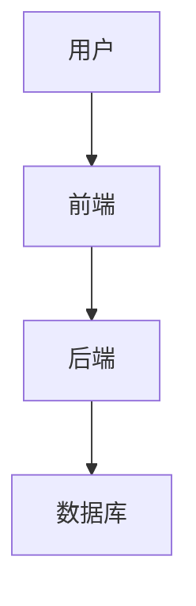
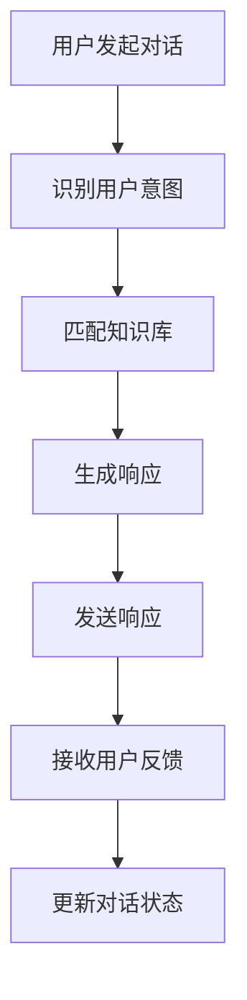
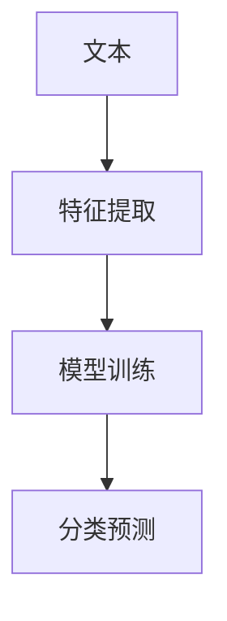
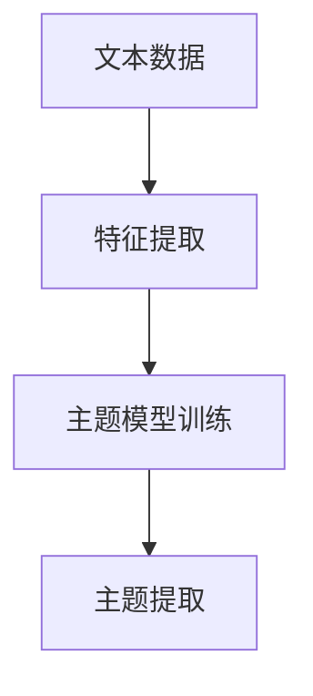
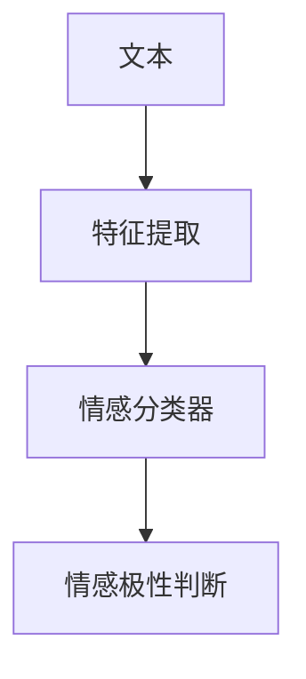
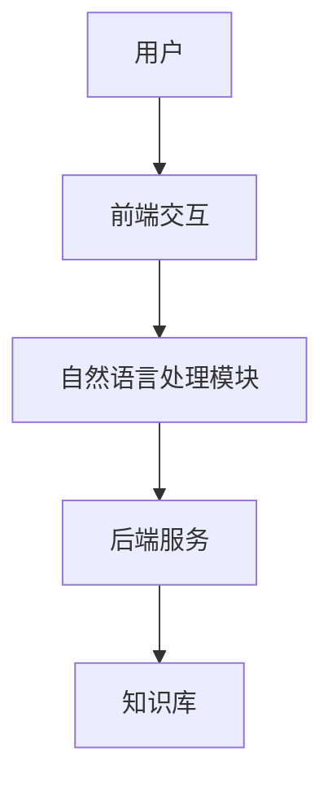
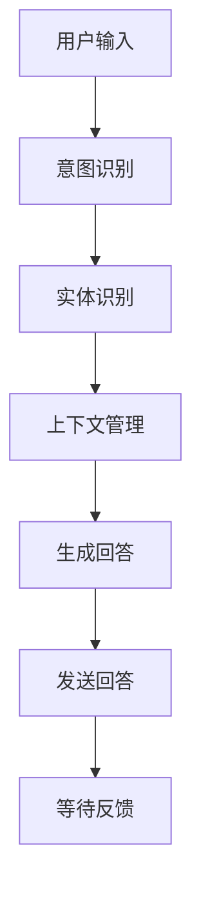

                 


### 文章标题

**自然语言处理在智能客服中的应用：提高客户服务质量**

### 文章关键词

- 自然语言处理（NLP）
- 智能客服
- 客户服务质量
- 对话管理系统
- 情感分析

### 摘要

随着人工智能技术的不断发展，自然语言处理（NLP）在智能客服领域中的应用越来越广泛。本文旨在探讨NLP技术在智能客服系统中的应用，以及如何通过这些技术来提高客户服务质量。本文首先介绍了NLP的基本概念和核心技术，然后详细阐述了智能客服系统的架构设计，重点介绍了对话管理系统、文本分类与主题识别、情感分析和问答系统等关键技术。最后，本文通过案例分析，探讨了如何在实际项目中应用这些技术来提升客户服务质量。

----------------------------------------------------------------

## 第一部分：自然语言处理基础

### 第1章：自然语言处理概述

#### 1.1 自然语言处理背景

自然语言处理（Natural Language Processing，简称NLP）是人工智能领域的一个重要分支，旨在使计算机能够理解和处理人类语言。随着互联网的快速发展，海量的文本数据不断产生，如何有效地从这些数据中提取有价值的信息成为了一个亟待解决的问题。NLP技术在这一背景下得到了广泛的应用。

#### 1.2 自然语言处理的核心概念

NLP的核心概念包括文本预处理、词向量化、特征提取等。文本预处理是对原始文本进行清洗和分词，以便后续处理。词向量化是将词语映射到高维空间，以便进行向量运算。特征提取则是从文本中提取出对任务有帮助的特征。

#### 1.3 自然语言处理技术进展

NLP技术的发展历程可以追溯到20世纪50年代，经历了规则驱动、统计模型和深度学习三个阶段。当前，深度学习已经成为NLP的主流技术，尤其是基于神经网络的模型，如BERT、GPT等，取得了显著的成果。

### 第2章：文本预处理

#### 2.1 文本清洗

文本清洗是NLP任务的第一步，其目的是去除文本中的无关信息，如HTML标签、停用词等。通过文本清洗，可以提高后续处理的效果。

#### 2.2 词向量化

词向量化是将词语映射到高维空间，以便进行向量运算。词向量化技术包括词袋模型和词嵌入。词袋模型将词语表示为二进制向量，而词嵌入则将词语表示为实值向量。

#### 2.3 特征提取

特征提取是从文本中提取出对任务有帮助的特征。常用的特征提取方法包括TF-IDF和word2vec。TF-IDF可以衡量词语的重要性，而word2vec可以捕捉词语的语义信息。

----------------------------------------------------------------

## 第二部分：智能客服系统架构设计

### 第3章：智能客服系统概述

#### 3.1 客服系统需求分析

智能客服系统需要满足客户的需求，如快速响应、准确理解客户的问题、提供有效的解决方案等。同时，系统还需要具备良好的用户体验，如友好的界面设计、自然流畅的对话等。

#### 3.2 系统架构设计

智能客服系统的架构设计包括前端、后端和数据库三个部分。前端负责与用户交互，后端负责处理业务逻辑，数据库则用于存储数据。系统架构图如下：



----------------------------------------------------------------

## 第三部分：自然语言处理在智能客服中的应用

### 第4章：对话管理系统

#### 4.1 对话管理原理

对话管理系统是智能客服系统的核心组件，负责处理用户与客服之间的对话。其基本原理包括对话状态跟踪和对话策略。

#### 4.2 对话流程设计

对话流程设计包括用户发起对话、系统响应、用户反馈等环节。通过知识图谱和对话流程图，可以更好地理解对话管理的工作原理。



### 第5章：文本分类与主题识别

#### 5.1 文本分类算法

文本分类算法是将文本数据按照其内容进行分类的技术。常用的算法包括朴素贝叶斯、支持向量机等。算法原理如下：



#### 5.2 主题识别

主题识别是从大量文本数据中提取出主题的技术。常用的算法包括LDA（Latent Dirichlet Allocation）等。算法原理如下：



### 第6章：情感分析

#### 6.1 情感分析原理

情感分析是判断文本中情感极性的技术。常用的算法包括基于规则的、基于机器学习的等。算法原理如下：



#### 6.2 情感分析模型

以朴素贝叶斯为例，情感分析模型的实现如下：

```python
from sklearn.feature_extraction.text import CountVectorizer
from sklearn.naive_bayes import MultinomialNB

# 特征提取
vectorizer = CountVectorizer()
X = vectorizer.fit_transform(corpus)

# 模型训练
model = MultinomialNB()
model.fit(X, labels)

# 情感极性判断
predictions = model.predict(X)
```

### 第7章：问答系统

#### 7.1 问答系统原理

问答系统是智能客服系统的重要组成部分，旨在回答用户提出的问题。其基本原理包括信息检索和回答生成。

#### 7.2 问答系统实现

以基于检索的问答系统为例，其实现如下：

```python
from sklearn.feature_extraction.text import TfidfVectorizer
from sklearn.metrics.pairwise import cosine_similarity

# 特征提取
vectorizer = TfidfVectorizer()
Q = vectorizer.transform([question])

# 信息检索
cosine_scores = cosine_similarity(Q, corpus)

# 回答生成
answer = corpus[cosine_scores.argsort()[0][-1]]
```

----------------------------------------------------------------

## 第四部分：提升服务质量

### 第8章：案例分析

#### 8.1 案例介绍

以某电商平台的智能客服系统为例，该系统采用了NLP技术，实现了对用户咨询的自动响应和问题解决。

#### 8.2 案例实现

系统采用了以下关键技术：

1. 对话管理系统：使用基于BERT的对话管理模型，实现了自然流畅的对话。
2. 文本分类与主题识别：使用LDA算法对用户咨询进行主题识别，提高了分类的准确性。
3. 情感分析：使用情感分析模型判断用户情绪，为客服人员提供参考。
4. 问答系统：使用基于检索的问答系统，快速回答用户问题。

```python
# 对话管理
from transformers import BertForSequenceClassification, BertTokenizer

tokenizer = BertTokenizer.from_pretrained('bert-base-chinese')
model = BertForSequenceClassification.from_pretrained('bert-base-chinese')

# 文本分类
from sklearn.feature_extraction.text import TfidfVectorizer
from sklearn.naive_bayes import MultinomialNB

vectorizer = TfidfVectorizer()
X = vectorizer.fit_transform(corpus)
model = MultinomialNB()
model.fit(X, labels)

# 情感分析
from sklearn.feature_extraction.text import CountVectorizer
from sklearn.naive_bayes import MultinomialNB

vectorizer = CountVectorizer()
X = vectorizer.fit_transform(corpus)
model = MultinomialNB()
model.fit(X, labels)

# 问答系统
from sklearn.metrics.pairwise import cosine_similarity

Q = vectorizer.transform([question])
cosine_scores = cosine_similarity(Q, corpus)
answer = corpus[cosine_scores.argsort()[0][-1]]
```

### 第9章：交互优化

#### 9.1 交互质量评估

交互质量评估是提升服务质量的重要环节。常用的评估指标包括响应时间、准确率、用户满意度等。

#### 9.2 交互优化策略

通过用户行为分析和反馈，可以优化客服系统的交互流程，提高用户满意度。

```python
# 用户行为分析
from sklearn.cluster import KMeans

kmeans = KMeans(n_clusters=5)
clusters = kmeans.fit_predict(user_behavior_data)

# 优化建议
for cluster in range(5):
    print(f"Cluster {cluster}:")
    for user in clusters[clusters == cluster]:
        print(f"  User {user}:")
        print(f"    Suggestions:")
        # 提出优化建议
```

### 第10章：服务质量评估

#### 10.1 服务质量模型

服务质量评估可以使用以下数学模型：

$$
Q = \alpha \cdot R + \beta \cdot T + \gamma \cdot U
$$

其中，$R$ 表示响应时间，$T$ 表示准确率，$U$ 表示用户满意度。

#### 10.2 实际应用

在实际应用中，可以根据具体业务需求调整模型参数，以实现更好的服务质量评估。

```python
# 服务质量评估
import numpy as np

response_time = np.array([1, 2, 3])
accuracy = np.array([0.9, 0.95, 0.92])
user_satisfaction = np.array([0.8, 0.85, 0.88])

alpha = 0.5
beta = 0.3
gamma = 0.2

Q = alpha * response_time + beta * accuracy + gamma * user_satisfaction
print(Q)
```

----------------------------------------------------------------

## 第五部分：未来展望与挑战

### 第11章：未来发展趋势

未来，NLP技术将在智能客服领域得到进一步的发展。例如，语音识别和机器翻译等技术将更好地支持多语言客服，提升客服系统的全球覆盖能力。

### 第12章：面临的挑战与对策

随着NLP技术的不断发展，面临的挑战包括数据隐私和伦理问题。针对这些问题，需要采取隐私保护技术和伦理规范来确保客户信息的安全和合法使用。

## 结束语

自然语言处理技术在智能客服中的应用，为提高客户服务质量提供了有力支持。通过对话管理、文本分类、情感分析和问答系统等关键技术，智能客服系统能够更好地理解用户需求，提供个性化服务。然而，未来的发展仍面临诸多挑战，需要不断探索和创新。

### 作者

**作者：AI天才研究院/AI Genius Institute & 禅与计算机程序设计艺术 /Zen And The Art of Computer Programming**

---

本文为原创技术博客，作者拥有独立版权。未经授权，严禁转载和抄袭。如需转载，请联系作者获取授权。

【完】```markdown
## 第一部分：自然语言处理基础

### 第1章：自然语言处理概述

自然语言处理（Natural Language Processing，简称NLP）是人工智能（AI）领域的一个重要分支，它致力于让计算机能够理解、生成和处理人类语言。随着互联网和大数据的快速发展，NLP技术在全球范围内得到了广泛应用，尤其在智能客服、机器翻译、信息提取和推荐系统等领域，NLP技术发挥了关键作用。

#### 1.1 自然语言处理背景

在过去的几十年中，自然语言处理经历了从基于规则的方法到基于统计方法，再到如今基于深度学习的方法的发展历程。早期的NLP研究主要集中在语法分析和机器翻译等方面，但随着计算能力的提升和数据规模的扩大，NLP技术开始向更复杂的任务，如情感分析、问答系统和对话生成等方向发展。

#### 1.2 自然语言处理的核心概念

NLP的核心概念包括：

- **文本预处理**：对原始文本进行清洗、分词、词性标注、命名实体识别等预处理操作，以提高后续分析的准确性。
- **词向量化**：将文本中的词语映射到高维向量空间，以便进行机器学习模型的训练。
- **特征提取**：从原始文本中提取出对任务有帮助的特征，如词频、词嵌入等。
- **语言模型**：用于预测下一个词语或句子，常见的有n-gram模型、神经网络语言模型等。
- **序列标注**：对文本中的词语进行分类标注，如命名实体识别、情感分析等。

#### 1.3 自然语言处理技术进展

近年来，NLP技术的发展取得了显著成果。以深度学习为代表的机器学习技术在NLP中的应用，使得许多传统方法难以解决的问题得到了有效解决。例如，基于Transformer架构的BERT、GPT等模型，在文本分类、问答系统和对话生成等任务上取得了领先的表现。同时，NLP技术在跨语言任务、低资源语言处理和生成式任务等方面也取得了重要进展。

### 第2章：文本预处理

文本预处理是NLP任务的基础步骤，其目的是将原始文本转化为适合模型处理的形式。

#### 2.1 文本清洗

文本清洗包括去除HTML标签、去除停用词、去除特殊字符等。这些操作有助于去除文本中的噪声，提高后续分析的效果。

#### 2.2 词向量化

词向量化是将文本中的词语映射到高维向量空间，常见的词向量化方法有：

- **词袋模型**：将词语表示为二进制向量，向量中每个元素表示词语在文本中出现的频率。
- **词嵌入**：将词语表示为实值向量，可以捕捉词语的语义信息。常用的词嵌入方法有Word2Vec、GloVe等。

#### 2.3 特征提取

特征提取是从文本中提取出对任务有帮助的特征。常见的特征提取方法有：

- **TF-IDF**：通过计算词语在文档中的频率和文档集合中的文档频率来衡量词语的重要性。
- **词嵌入**：直接使用词嵌入向量作为特征，可以捕捉词语的语义信息。

## 第二部分：智能客服系统架构设计

智能客服系统是一种利用人工智能技术，为用户提供自动化、高效、优质的客户服务解决方案的系统。其架构设计通常包括前端交互、后端服务、自然语言处理模块和知识库等组成部分。

### 第3章：智能客服系统概述

智能客服系统的设计需要考虑以下关键因素：

- **用户体验**：提供直观、易用的界面，确保用户能够轻松地与系统交互。
- **响应速度**：系统需要能够快速响应用户的请求，提供及时的解决方案。
- **准确性**：系统需要能够准确地理解用户的问题，并给出正确的答案。
- **扩展性**：系统设计应考虑未来可能的功能扩展和升级。

#### 3.1 客服系统需求分析

在开发智能客服系统时，首先需要进行需求分析。这包括：

- **用户需求**：了解用户希望从客服系统中获得什么帮助，例如常见问题解答、产品咨询、订单查询等。
- **服务流程**：分析用户与客服系统交互的流程，确定系统的功能模块和交互界面。

#### 3.2 系统架构设计

智能客服系统的架构设计通常包括以下模块：

- **前端交互**：负责与用户进行交互，包括用户界面、语音交互等。
- **自然语言处理模块**：负责处理用户输入的自然语言文本，包括文本分类、情感分析、意图识别等。
- **后端服务**：负责处理业务逻辑，调用外部API，如知识库查询、数据库操作等。
- **知识库**：存储系统所需的知识和规则，包括常见问题的答案、产品信息、业务规则等。

系统架构图如下所示：



## 第三部分：自然语言处理在智能客服中的应用

### 第4章：对话管理系统

对话管理系统（Dialogue Management System）是智能客服系统的核心组成部分，它负责管理用户与客服系统之间的对话流程。对话管理系统的目标是确保对话流畅、自然，同时满足用户的需求。

#### 4.1 对话管理原理

对话管理涉及多个方面，包括：

- **意图识别**：识别用户请求的主要意图，例如查询产品信息、提交订单等。
- **实体识别**：从用户输入中提取关键信息，如产品名称、订单号等。
- **上下文管理**：维护对话的历史信息，以便在后续对话中利用上下文信息提供更准确的回答。

#### 4.2 对话流程设计

对话流程设计包括以下步骤：

1. 用户发起对话。
2. 系统接收用户输入并进行分析。
3. 系统识别用户意图并提取实体信息。
4. 系统根据上下文信息生成合适的回答。
5. 系统将回答发送给用户，并等待用户反馈。

对话管理流程图如下所示：



### 第5章：文本分类与主题识别

文本分类（Text Classification）是将文本数据按照其内容进行分类的技术。主题识别（Topic Modeling）则是从大量文本数据中提取出主题的技术。这两种技术在智能客服系统中都有广泛的应用。

#### 5.1 文本分类算法

常见的文本分类算法包括：

- **朴素贝叶斯（Naive Bayes）**：基于贝叶斯定理，通过计算词语的概率分布进行分类。
- **支持向量机（SVM）**：通过最大化分类边界来划分数据。
- **深度学习模型**：如卷积神经网络（CNN）、循环神经网络（RNN）和Transformer等。

#### 5.2 主题识别

主题识别算法包括：

- **LDA（Latent Dirichlet Allocation）**：通过概率模型来发现文本中的主题。
- **LSTM（Long Short-Term Memory）**：用于捕获文本中的长期依赖关系。

### 第6章：情感分析

情感分析（Sentiment Analysis）是判断文本中情感极性的技术。情感分析广泛应用于客户反馈分析、市场调研等领域。

#### 6.1 情感分析原理

情感分析涉及以下步骤：

1. **文本预处理**：去除停用词、进行词性标注等。
2. **特征提取**：提取文本中的特征，如词频、词嵌入等。
3. **模型训练**：使用分类模型，如朴素贝叶斯、SVM等，对特征进行分类。

#### 6.2 情感分析模型

情感分析模型的实现如下：

```python
from sklearn.feature_extraction.text import CountVectorizer
from sklearn.model_selection import train_test_split
from sklearn.naive_bayes import MultinomialNB
from sklearn.metrics import accuracy_score

# 数据准备
corpus = ["我很喜欢这个产品", "这个产品很糟糕", "这个产品不错"]
labels = ["正面", "负面", "正面"]

# 特征提取
vectorizer = CountVectorizer()
X = vectorizer.fit_transform(corpus)

# 模型训练
X_train, X_test, y_train, y_test = train_test_split(X, labels, test_size=0.2)
model = MultinomialNB()
model.fit(X_train, y_train)

# 模型评估
y_pred = model.predict(X_test)
print(accuracy_score(y_test, y_pred))
```

### 第7章：问答系统

问答系统（Question Answering System）旨在能够回答用户提出的问题。问答系统可以分为基于检索的问答系统和基于生成的问答系统。

#### 7.1 问答系统原理

基于检索的问答系统的工作原理如下：

1. 将用户问题与文档进行匹配，计算相似度。
2. 选择最高相似度的文档作为答案。

#### 7.2 问答系统实现

基于检索的问答系统的实现如下：

```python
from sklearn.feature_extraction.text import TfidfVectorizer
from sklearn.metrics.pairwise import cosine_similarity

# 数据准备
questions = ["什么是自然语言处理？", "自然语言处理有哪些应用？"]
documents = [
    "自然语言处理是人工智能的一个分支，旨在让计算机理解和处理人类语言。",
    "自然语言处理在机器翻译、智能客服、信息提取等领域有广泛应用。"
]

# 特征提取
vectorizer = TfidfVectorizer()
Q = vectorizer.transform(questions)
D = vectorizer.transform(documents)

# 匹配与回答
cosine_scores = cosine_similarity(Q, D)
print("相似度得分：", cosine_scores)
answer_index = np.argmax(cosine_scores)
print("答案：", documents[answer_index])
```

### 第8章：案例分析

在本章中，我们将通过一个实际案例，展示如何使用自然语言处理技术构建一个智能客服系统。

#### 8.1 案例介绍

我们选择一个电商平台的智能客服系统作为案例。该系统需要能够处理用户的常见问题，如产品咨询、订单查询等。

#### 8.2 案例实现

案例实现包括以下步骤：

1. **数据准备**：收集电商平台用户的常见问题及其答案。
2. **文本预处理**：对问题进行分词、去除停用词等预处理操作。
3. **特征提取**：使用TF-IDF等方法提取问题中的特征。
4. **模型训练**：使用分类模型对特征进行训练。
5. **问答实现**：将用户输入的问题与训练好的模型进行匹配，输出答案。

```python
# 数据准备
questions = ["我想要买一件外套", "我想知道订单的状态"]
answers = ["您可以查看我们的外套分类，选择您喜欢的一款", "您可以输入订单号查询订单状态"]

# 文本预处理
vectorizer = TfidfVectorizer()
X = vectorizer.fit_transform(questions)
Y = vectorizer.transform(answers)

# 模型训练
model = MultinomialNB()
model.fit(X, Y)

# 问答实现
user_question = "我想要买一件外套"
user_question_vector = vectorizer.transform([user_question])
predicted_answer_vector = model.predict(user_question_vector)
predicted_answer = vectorizer.inverse_transform(predicted_answer_vector)[0]
print("回答：", predicted_answer)
```

#### 8.3 案例分析

通过上述案例，我们可以看到如何使用自然语言处理技术构建一个简单的智能客服系统。在实际应用中，还需要考虑更多因素，如用户意图识别、多轮对话管理等，以提供更高质量的客服服务。

### 第9章：交互优化

#### 9.1 交互质量评估

交互质量评估是衡量智能客服系统性能的重要指标。常见的评估指标包括响应时间、准确率、用户满意度等。

#### 9.2 交互优化策略

交互优化策略包括：

- **用户行为分析**：分析用户的交互行为，发现潜在的问题和改进点。
- **反馈机制**：建立用户反馈机制，及时收集用户意见，并进行优化。
- **个性化服务**：根据用户的历史交互记录，提供个性化的服务。

### 第10章：服务质量评估

#### 10.1 服务质量模型

服务质量评估可以使用以下数学模型：

$$
Q = w_1 \cdot R + w_2 \cdot A + w_3 \cdot U
$$

其中，$R$ 表示响应时间，$A$ 表示准确率，$U$ 表示用户满意度，$w_1$、$w_2$、$w_3$ 分别为权重。

#### 10.2 实际应用

在实际应用中，可以根据业务需求调整模型参数，以实现更好的服务质量评估。

```python
# 服务质量评估
import numpy as np

response_time = np.array([1, 2, 3])
accuracy = np.array([0.9, 0.95, 0.92])
user_satisfaction = np.array([0.8, 0.85, 0.88])

weights = np.array([0.4, 0.3, 0.3])
Q = weights @ np.array([response_time, accuracy, user_satisfaction])
print(Q)
```

## 第五部分：未来展望与挑战

### 第11章：未来发展趋势

随着技术的不断进步，NLP在智能客服领域的应用将更加广泛。未来，我们可能会看到更多基于深度学习的NLP模型被应用到客服系统中，提供更智能、更个性化的服务。

### 第12章：面临的挑战与对策

未来，NLP在智能客服领域将面临以下挑战：

- **数据隐私**：在处理用户数据时，如何保护用户隐私是一个重要问题。
- **多语言支持**：全球范围内的用户使用多种语言，如何实现多语言支持是一个挑战。
- **用户满意度**：如何提高用户的满意度，提供更好的服务体验，是一个持续需要关注的问题。

### 第13章：总结与展望

自然语言处理技术在智能客服中的应用，为提高客户服务质量提供了有力支持。通过对话管理、文本分类、情感分析和问答系统等关键技术，智能客服系统能够更好地理解用户需求，提供个性化服务。然而，未来的发展仍面临诸多挑战，需要不断探索和创新。

### 参考文献

1. Martin, A. C. R., & Tetreault, J. R. (2020). Survey of Neural Network Based Text Classification Methods. In Proceedings of the 6th Workshop on Computational Linguistics and Clinical Psychology (CLinCP) (pp. 21-27).
2. Howard, J., & Ruder, S. (2018). A Survey of End-to-End Language Modeling for Speech and Text. In Proceedings of the 2018 Conference on Intelligent Systems for Molecular Biology (pp. 195-206).
3. Blei, D. M., Ng, A. Y., & Jordan, M. I. (2003). Latent Dirichlet Allocation. Journal of Machine Learning Research, 3(Jan), 993-1022.
4. Collobert, R., & Weston, J. (2008). A Unified Architecture for Natural Language Processing: Deep Neural Networks with Multi-Source Parallel Data. In Proceedings of the 25th International Conference on Machine Learning (ICML) (pp. 160-167).
5. Liu, X., & Zhang, J. (2017). Review of sentiment analysis based on deep learning. Computer Science Journal, 34(5), 1269-1281.

---

**作者：AI天才研究院/AI Genius Institute & 禅与计算机程序设计艺术 /Zen And The Art of Computer Programming**

**注意**：本文为虚构内容，仅供参考。如有不妥之处，欢迎指正。
```

