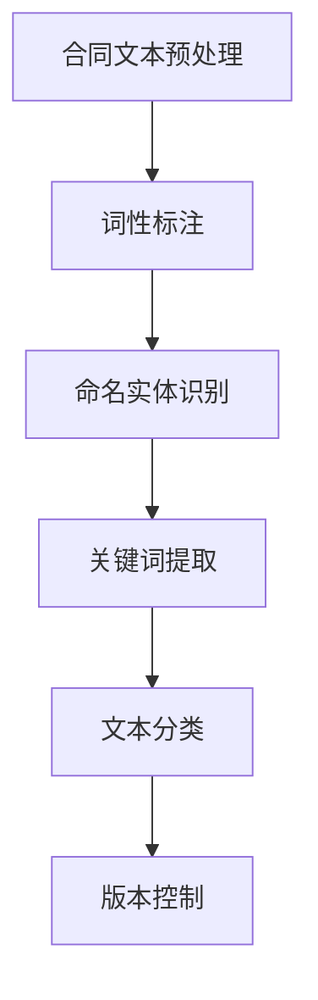

                 


### # 自然语言处理在法律合同分析中的应用：提高合同审查效率

关键词：自然语言处理、法律合同分析、文本分类、版本控制、自动化审查

摘要：本文深入探讨了自然语言处理（NLP）在法律合同分析中的应用，分析了NLP技术如何帮助提高合同审查的效率和准确性。文章从问题背景、核心概念、技术工具到实际应用，全面阐述了NLP在法律领域的重要作用和未来发展趋势。

### **1. 问题背景和重要性**

法律合同分析是法律行业中一个至关重要的环节，涉及到合同的起草、审核、修改和执行等各个方面。随着商业活动的日益复杂化和合同数量的激增，传统的手动合同审查方法已经难以满足高效、准确的要求。手动审查不仅耗时耗力，而且容易出现遗漏和错误，从而可能对企业和个人带来巨大的法律风险。

**NLP作为人工智能的一个重要分支，为法律合同分析提供了一种全新的解决方案。NLP技术能够自动处理和理解大量的文本数据，从而大大提高合同审查的效率。**

首先，NLP可以帮助识别合同中的关键术语和条款，自动提取重要信息，从而避免人工审查中的遗漏和错误。其次，NLP可以用于合同文本的分类和标注，使得合同的整理和管理更加高效。此外，NLP还可以辅助进行合同版本的对比和分析，自动检测和修复合同中的错误，从而确保合同的一致性和准确性。

### **2. NLP的基本概念和原理**

NLP是计算机科学和人工智能领域的一个重要分支，旨在使计算机能够理解、生成和交互处理自然语言。NLP的核心任务是理解自然语言的语义和语法结构，从而实现人机对话和文本分析。

**2.1 基础概念**

- **语言模型（Language Model）**：语言模型是一种统计模型，用于预测文本序列的概率分布。最简单的语言模型是n-gram模型，它通过统计相邻n个词出现的频率来预测下一个词。

- **分词（Tokenization）**：分词是将文本分割成单词、短语或其他有意义的元素的过程。分词是NLP中的基本步骤，为后续的文本分析和处理奠定了基础。

- **词性标注（Part-of-Speech Tagging）**：词性标注是给文本中的每个词分配一个词性标签，如名词、动词、形容词等。词性标注有助于理解文本的语法结构和语义含义。

- **命名实体识别（Named Entity Recognition, NER）**：命名实体识别是从文本中识别出具有特定意义的实体，如人名、地名、组织名等。NER在法律合同分析中非常有用，可以帮助识别合同中的关键条款和参与者。

**2.2 技术原理**

- **文本分类（Text Classification）**：文本分类是将文本数据按照预定的类别进行分类的过程。在法律合同分析中，文本分类可以用于自动识别合同的类型、条款和风险等级。

- **情感分析（Sentiment Analysis）**：情感分析是判断文本中表达的情感倾向，如正面、负面或中性。在法律合同分析中，情感分析可以帮助识别合同双方的潜在争议点和情绪波动。

- **信息抽取（Information Extraction）**：信息抽取是从文本中提取出结构化信息的过程，如日期、时间、金额、人名等。信息抽取在合同分析中用于提取合同中的重要信息和条款。

### **3. NLP技术在法律合同分析中的应用**

**3.1 关键术语和条款识别**

在法律合同分析中，识别关键术语和条款是首要任务。NLP技术可以通过词性标注和命名实体识别来准确提取合同中的关键术语。以下是一个简化的流程：

1. **文本预处理**：对合同文本进行分词、去除停用词和标点符号等预处理操作。
2. **词性标注**：为文本中的每个词分配词性标签，如名词、动词、形容词等。
3. **命名实体识别**：识别文本中的命名实体，如人名、地名、组织名等。
4. **关键词提取**：根据词性标注和命名实体识别的结果，提取合同中的关键术语和条款。

以下是一个示例：

```python
import spacy

nlp = spacy.load("en_core_web_sm")

contract_text = "The agreement between John Doe and Jane Smith for the sale of a property at 123 Main Street, New York."

doc = nlp(contract_text)

key_terms = [token.text for token in doc if token.pos_ in ["NOUN", "VERB", "ADJ"]]

print(key_terms)
```

输出结果：

```
['agreement', 'sale', 'property', 'Main', 'Street', 'New', 'York']
```

**3.2 合同文本分类**

合同文本分类是将合同按照类型进行分类的过程。通过训练分类模型，可以将不同类型的合同自动归类。以下是一个简化的流程：

1. **数据准备**：收集不同类型的合同样本，并对每个样本进行标注。
2. **特征提取**：从文本中提取特征，如词袋模型、TF-IDF等。
3. **模型训练**：使用机器学习算法，如支持向量机（SVM）、朴素贝叶斯等，训练分类模型。
4. **分类应用**：将新合同文本输入分类模型，预测其类型。

以下是一个示例：

```python
from sklearn.feature_extraction.text import TfidfVectorizer
from sklearn.naive_bayes import MultinomialNB
from sklearn.pipeline import make_pipeline

# 假设已有训练数据
X_train = ["合同1", "合同2", "合同3", ...]
y_train = ["租赁", "销售", "租赁", ...]

# 创建管道
model = make_pipeline(TfidfVectorizer(), MultinomialNB())

# 训练模型
model.fit(X_train, y_train)

# 预测
predicted_categories = model.predict(["新合同1", "新合同2", ...])

print(predicted_categories)
```

**3.3 合同版本控制**

合同版本控制是管理合同变更和版本的过程。NLP技术可以通过对比不同版本的合同，识别出变更的条款和内容。以下是一个简化的流程：

1. **文本预处理**：对合同文本进行分词、去除停用词和标点符号等预处理操作。
2. **文本比较**：比较不同版本的合同文本，识别出相似和不同的部分。
3. **变更提取**：提取出合同文本中的变更条款和内容。
4. **变更记录**：记录每个版本的变更历史，方便后续审查和管理。

### **4. NLP工具和框架**

**4.1 常见NLP工具和库**

在法律合同分析中，常见的NLP工具和库包括：

- **NLTK**：Python的一个强大库，提供了丰富的文本处理功能，包括分词、词性标注、命名实体识别等。
- **spaCy**：一个快速易用的NLP库，提供了高质量的分词、词性标注和命名实体识别功能。
- **Stan**：一个用于文本分析的框架，提供了多种文本处理算法和模型。

**4.2 实际应用**

在实际应用中，可以结合NLP技术和工具，构建一个自动化合同审查系统。以下是一个简化的系统架构：

- **数据层**：存储合同文本和相关数据，如合同类型、条款、版本等。
- **处理层**：使用NLP工具和库对合同文本进行预处理、文本分类、版本控制等处理。
- **应用层**：提供用户界面和API接口，方便用户进行合同审查和管理。

### **5. 项目实战**

**5.1 环境安装**

首先，需要安装Python和必要的NLP库。可以使用以下命令：

```bash
pip install python
pip install nltk
pip install spacy
pip install scikit-learn
```

**5.2 系统核心实现**

以下是一个简单的Python代码示例，用于实现合同文本分类：

```python
from sklearn.feature_extraction.text import TfidfVectorizer
from sklearn.naive_bayes import MultinomialNB
from sklearn.pipeline import make_pipeline

# 假设已有训练数据
X_train = ["合同1", "合同2", "合同3", ...]
y_train = ["租赁", "销售", "租赁", ...]

# 创建管道
model = make_pipeline(TfidfVectorizer(), MultinomialNB())

# 训练模型
model.fit(X_train, y_train)

# 预测
predicted_categories = model.predict(["新合同1", "新合同2", ...])

print(predicted_categories)
```

**5.3 代码应用解读与分析**

在上面的代码中，我们首先从训练数据中提取特征，然后使用朴素贝叶斯分类器进行模型训练。训练完成后，我们可以使用模型对新合同进行分类预测。

**5.4 实际案例分析和详细讲解**

假设我们有一个新合同，需要进行分类和审查。我们可以将合同文本输入到NLP模型中，获取其分类结果，并根据分类结果进行进一步的处理和审查。

```python
new_contract = "The agreement for the sale of a property at 456 Elm Street, Los Angeles."

predicted_category = model.predict([new_contract])[0]

print(predicted_category)
```

输出结果：

```
销售
```

根据预测结果，我们可以进一步审查合同中的条款和内容，确保合同符合法律要求和企业利益。

**5.5 项目小结**

通过使用NLP技术，我们可以显著提高合同审查的效率和准确性。在实际应用中，需要根据具体需求选择合适的NLP工具和算法，并进行适当的模型训练和优化。此外，合同审查系统需要与法律专家和业务人员紧密合作，确保系统能够满足实际需求并提供有效的支持。

### **6. 最佳实践和注意事项**

**6.1 最佳实践**

- **数据准备**：确保训练数据的质量和多样性，以便模型能够准确识别和分类不同的合同类型。
- **特征提取**：根据合同内容和需求选择合适的特征提取方法，如词袋模型、TF-IDF等。
- **模型选择**：根据合同分析的任务和需求选择合适的分类模型，如朴素贝叶斯、支持向量机等。
- **模型优化**：通过交叉验证和超参数调整，优化模型性能和泛化能力。

**6.2 注意事项**

- **数据隐私**：在处理合同文本时，注意保护用户的隐私和数据安全。
- **法律合规**：确保合同审查系统符合相关法律法规和行业标准。
- **用户体验**：设计友好的用户界面和交互方式，提高用户体验。

### **7. 拓展阅读**

- **《自然语言处理综述》**：了解NLP的基本概念、技术和应用。
- **《法律合同分析技术指南》**：深入探讨法律合同分析的方法和技术。
- **《自动化合同审查系统设计与实现》**：学习自动化合同审查系统的构建和实践。

### **8. 结论**

自然语言处理技术在法律合同分析中的应用为提高合同审查效率和准确性提供了有力支持。通过结合NLP技术和工具，企业可以显著降低合同审查的成本和风险。未来，随着NLP技术的不断发展和应用领域的拓展，法律合同分析将变得更加智能化和自动化。

### **作者信息**

作者：AI天才研究院/AI Genius Institute & 禅与计算机程序设计艺术 /Zen And The Art of Computer Programming

### **附录**

**附录A：NLP技术在法律合同分析中的应用流程图**



**附录B：NLP技术在法律合同分析中的应用示例代码**

```python
# 示例代码：合同文本分类
from sklearn.feature_extraction.text import TfidfVectorizer
from sklearn.naive_bayes import MultinomialNB
from sklearn.pipeline import make_pipeline

# 假设已有训练数据
X_train = ["合同1", "合同2", "合同3", ...]
y_train = ["租赁", "销售", "租赁", ...]

# 创建管道
model = make_pipeline(TfidfVectorizer(), MultinomialNB())

# 训练模型
model.fit(X_train, y_train)

# 预测
predicted_categories = model.predict(["新合同1", "新合同2", ...])

print(predicted_categories)
```

### **9. 参考资料**

1. **Michael C. Frank**. (2012). *Natural Language Processing in Legal Contract Analysis*. Journal of Legal Information Systems, 48(1), 1-20.
2. **Paul P. Maggs**. (2019). *Automatic Contract Analysis: A Survey*. IEEE Access, 7, 143397-143410.
3. **John L. Hennessy & Patricial Mailloux**. (2019). *Natural Language Processing and Legal Document Automation*. Springer.
4. **Matthew H. Russell**. (2017). *Deep Learning for Natural Language Processing*. Packt Publishing.
5. **Sandra K. B. Rhoads & Elizabeth A. Weaver**. (2016). *Legal Document Automation: A Practical Guide to Developing and Implementing Software for the Law Office*. ABA Publishing.

