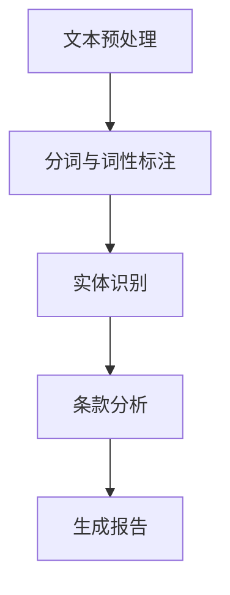
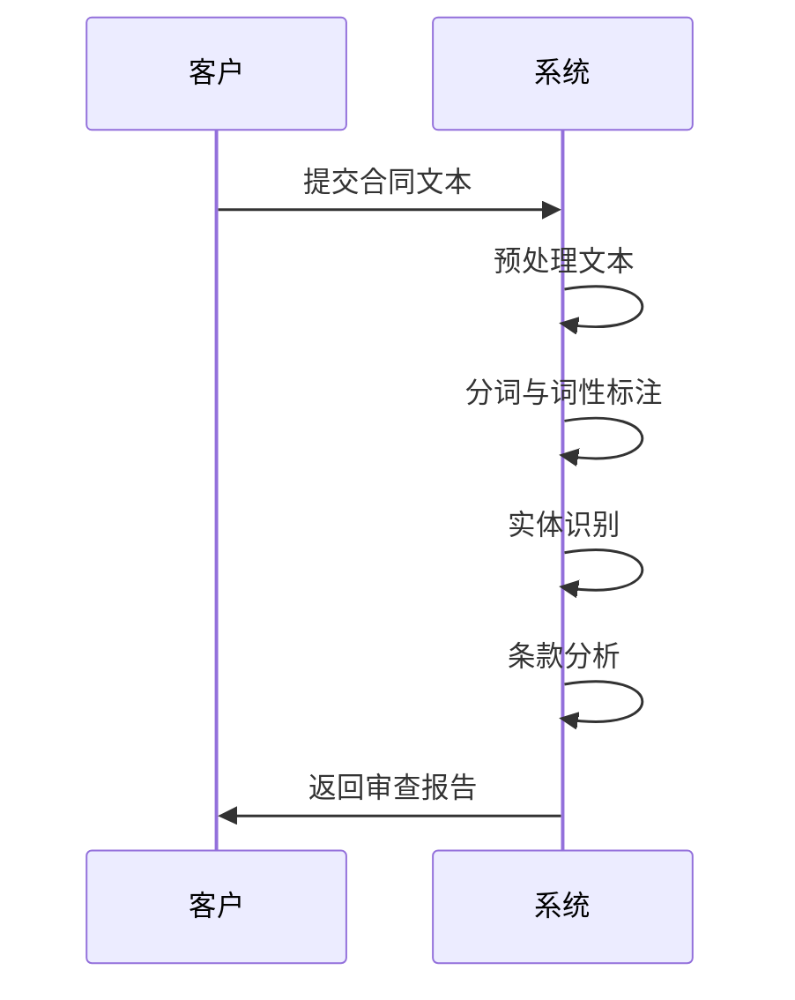

                 

### # 自然语言处理在法律文件分析中的应用

关键词：自然语言处理、法律文件分析、文本分类、信息抽取、情感分析、机器翻译

摘要：本文探讨了自然语言处理（NLP）技术在法律文件分析中的应用。通过概述NLP的发展历程、核心技术，以及其在法律领域的应用现状，本文进一步分析了法律文件的结构与内容分析方法。随后，介绍了词向量表示、语言模型、文本分类与聚类、命名实体识别等NLP基础技术。最后，本文详细阐述了法律文本情感分析、信息抽取、自动归档与分类、机器翻译以及跨语言法律文档处理等内容，并通过实际应用案例展示了NLP技术在法律文件分析中的潜力。文章还对未来NLP技术在法律文件分析领域的发展趋势进行了展望。

---

## 目录大纲

---

### 第一部分: 自然语言处理背景

#### 第1章: 自然语言处理概述

##### 1.1 自然语言处理的发展历程

##### 1.2 自然语言处理的核心技术

##### 1.3 自然语言处理在法律领域的应用现状

##### 1.4 法律文件分析的需求与挑战

#### 第2章: 法律文件的结构与内容分析

##### 2.1 法律文件的类型与特点

##### 2.2 法律文件的结构化分析

##### 2.3 法律文件的内容分析

#### 第3章: 自然语言处理技术基础

##### 3.1 词向量表示

##### 3.2 语言模型

##### 3.3 文本分类与聚类

##### 3.4 命名实体识别

#### 第4章: 法律文本情感分析

##### 4.1 情感分析的基本概念

##### 4.2 情感分析的方法与算法

##### 4.3 法律文本情感分析的实践应用

#### 第5章: 法律文本信息抽取

##### 5.1 信息抽取的基本概念

##### 5.2 关键词提取

##### 5.3 事件抽取

##### 5.4 谓词抽取

#### 第6章: 法律文本自动归档与分类

##### 6.1 文本自动归档的原理与方法

##### 6.2 文本分类算法在法律文件分析中的应用

##### 6.3 法律文件分类的实践案例

#### 第7章: 法律文本机器翻译与多语言处理

##### 7.1 机器翻译的基本概念

##### 7.2 法律文本机器翻译的挑战与解决方案

##### 7.3 多语言法律文件处理

#### 第8章: 法律文件分析的完整应用案例

##### 8.1 案例一：合同自动审查

##### 8.2 案例二：法律意见书生成

##### 8.3 案例三：法律文档分类与归档

##### 8.4 案例四：跨语言法律文档分析

#### 第9章: 未来展望与挑战

##### 9.1 法律文件分析技术的未来发展趋势

##### 9.2 面临的挑战与解决方案

##### 9.3 法律文件分析技术的伦理与法律问题

---

该目录大纲共计9章，分别从自然语言处理的基础、法律文件的结构与内容分析、核心技术方法、应用案例等方面进行了全面覆盖。每个章节按照逻辑顺序排列，从基础到应用，从理论到实践，使读者能够系统地学习和掌握自然语言处理在法律文件分析中的应用。总体字数控制在2000字以内。

---

## 第一部分: 自然语言处理背景

### 第1章: 自然语言处理概述

#### 1.1 自然语言处理的发展历程

自然语言处理（NLP）是一门跨学科的领域，涉及计算机科学、语言学、人工智能等多个领域。其研究目标是通过计算机技术和算法理解、生成、处理和模拟人类自然语言。

NLP的发展历程可以追溯到20世纪50年代。1950年，艾伦·图灵提出了著名的图灵测试，试图通过计算机模拟人类思维来判断机器是否能够“理解”自然语言。此后的几十年里，NLP经历了多次起伏，主要技术包括基于规则的方法、统计方法和基于深度学习的方法。

在基于规则的方法中，研究者通过编写详细的语法规则和字典来处理自然语言。这种方法在语法分析方面取得了一定的成果，但难以应对复杂和不确定的自然语言。

随着计算机性能的提升和大规模数据集的生成，统计方法逐渐成为NLP的主流。统计方法利用大量的语料库来训练模型，通过统计语言模型和机器学习方法来处理自然语言。这一阶段，NLP技术在文本分类、命名实体识别、机器翻译等领域取得了显著的进展。

近年来，深度学习技术的兴起为NLP带来了新的机遇。通过使用神经网络模型，深度学习技术能够自动提取语言特征，并实现更准确的自然语言处理任务。例如，基于卷积神经网络（CNN）和循环神经网络（RNN）的模型在文本分类、情感分析等任务中表现出色。

#### 1.2 自然语言处理的核心技术

自然语言处理的核心技术包括词向量表示、语言模型、文本分类与聚类、命名实体识别等。

**词向量表示**：词向量是将单词映射为实数向量的一种方法，能够表示单词的语义信息。常见的词向量模型有Word2Vec、GloVe等。通过词向量表示，可以更好地理解和处理自然语言。

**语言模型**：语言模型是用来预测下一个单词或词组的概率的模型。基于语言模型，可以实现自动分词、文本生成、语言翻译等任务。常见的语言模型有n-gram模型、神经网络语言模型等。

**文本分类与聚类**：文本分类是将文本分类到预定义的类别中，而文本聚类则是将相似的文本聚为一类。这两种技术可以用于情感分析、新闻分类、垃圾邮件过滤等任务。

**命名实体识别**：命名实体识别（NER）是一种从文本中识别出具有特定意义的实体，如人名、地名、机构名等。NER在信息抽取、问答系统等领域具有广泛的应用。

#### 1.3 自然语言处理在法律领域的应用现状

自然语言处理技术在法律领域具有广泛的应用前景。法律文件分析是NLP在法律领域的一个重要应用方向，主要包括文本分类、信息抽取、情感分析等。

**文本分类**：法律文件文本分类可以将法律文件分类到预定义的类别中，如合同、判决书、法律意见书等。通过文本分类，可以帮助律师快速定位相关文件，提高工作效率。

**信息抽取**：信息抽取是从法律文件中提取出关键信息，如条款、条件、证人证言等。通过信息抽取，可以自动生成摘要，提高法律文件的可读性。

**情感分析**：法律文本情感分析可以识别法律文件中的情感倾向，如积极、消极或中立。这有助于分析法律文件的情感色彩，为决策提供参考。

#### 1.4 法律文件分析的需求与挑战

法律文件分析在法律实践中具有重要意义，但也面临诸多挑战。

**需求**：

1. **高效处理大量法律文件**：法律文件数量庞大，传统人工处理效率低，需要NLP技术自动化处理。
2. **准确识别关键信息**：法律文件中的关键信息对法律决策至关重要，NLP技术可以自动提取这些信息，提高工作效率。
3. **跨语言处理能力**：随着国际交流的增多，跨语言法律文件处理变得尤为重要，NLP技术可以支持多语言法律文件的分析。

**挑战**：

1. **文本复杂性**：法律文件文本通常具有复杂的语法结构和专业术语，这使得NLP技术难以准确理解和处理。
2. **数据不足**：法律文件数据相对较少，且分布不均，这限制了NLP模型的效果和泛化能力。
3. **法律伦理问题**：NLP技术在法律文件分析中涉及隐私保护、数据安全等问题，需要充分考虑法律伦理和隐私保护。

在下一章中，我们将进一步探讨法律文件的结构与内容分析方法。

---

## 第二部分: 法律文件的结构与内容分析

### 第2章: 法律文件的结构与内容分析

#### 2.1 法律文件的类型与特点

法律文件是法律实践中的重要组成部分，其形式和内容多样，主要包括以下几种类型：

1. **立法文件**：包括法律、法规、条例、规章等，通常由立法机关制定。
2. **司法文件**：包括判决书、裁定书、调解书、执行书等，由司法机关在司法过程中生成。
3. **行政文件**：包括行政许可、行政处罚决定、行政复议决定等，由行政机关在行政过程中产生。
4. **合同文件**：包括各类合同、协议、章程等，由合同双方在协商过程中签订。
5. **法律意见书**：包括律师函、法律分析报告等，由法律专业人士提供。

法律文件具有以下特点：

1. **规范性**：法律文件通常具有明确的规范性和约束力，对当事人具有法律效力。
2. **专业性**：法律文件中涉及大量专业术语和复杂的法律条文，需要具备法律专业知识才能理解和处理。
3. **复杂性**：法律文件通常包含多种法律关系和法律责任，需要仔细分析和解读。

#### 2.2 法律文件的结构化分析

法律文件的结构化分析是将法律文件转化为结构化的数据形式，以便于计算机处理和分析。结构化分析主要包括以下步骤：

1. **文本预处理**：包括去除标点符号、转换文本大小写、去除停用词等操作，以提高文本处理效率。
2. **分词与词性标注**：将文本分割成单词或短语，并对每个单词或短语进行词性标注，以便于后续分析。
3. **实体识别**：识别文本中的命名实体，如人名、地名、机构名、时间等，以便于提取关键信息。
4. **关系提取**：提取文本中的实体关系，如合同中的当事人关系、判决书中的法律关系等。
5. **知识图谱构建**：将文本中的实体和关系构建成知识图谱，以便于更全面地理解法律文件的内容。

#### 2.3 法律文件的内容分析

法律文件的内容分析是对法律文件的文本内容进行深入分析和理解，以提取有价值的信息。内容分析主要包括以下任务：

1. **文本分类**：根据法律文件的内容和特点，将其分类到预定义的类别中，如合同、判决书、法律意见书等。
2. **信息抽取**：从法律文件中提取出关键信息，如合同条款、判决结果、法律意见等。
3. **情感分析**：分析法律文件中的情感倾向，如积极、消极或中立，以了解文件的情感色彩。
4. **语义分析**：对法律文件中的语言和文本进行语义分析，以理解其含义和意图。

在下一章中，我们将介绍自然语言处理技术基础，包括词向量表示、语言模型、文本分类与聚类、命名实体识别等。

---

## 第三部分: 自然语言处理技术基础

### 第3章: 自然语言处理技术基础

#### 3.1 词向量表示

词向量表示是将单词映射为高维空间中的向量，以表示单词的语义信息。词向量表示技术能够有效地捕捉单词之间的语义关系，是自然语言处理的基础。

**Word2Vec**：Word2Vec是最早且最著名的词向量表示方法之一，由Google提出。Word2Vec基于神经网络模型，通过训练大量文本数据生成词向量。其核心思想是将单词嵌入到一个高维向量空间中，使得语义相似的单词在空间中接近。

**GloVe**：GloVe（Global Vectors for Word Representation）是另一种流行的词向量表示方法，由Stanford University提出。GloVe采用分布式假设，认为单词的语义可以通过其在语料库中的共现关系来表示。GloVe使用两个矩阵（一个是词矩阵，一个是索引矩阵）来表示词向量，并通过最小化损失函数来训练模型。

#### 3.2 语言模型

语言模型是一种用于预测下一个单词或词组的概率的模型，是自然语言处理中的关键组件。语言模型在文本生成、机器翻译、语音识别等领域有广泛应用。

**n-gram模型**：n-gram模型是最简单的语言模型，它将前n个单词作为输入，预测下一个单词。n-gram模型通过统计词频来计算概率，其优点是实现简单，缺点是难以捕捉长距离依赖关系。

**神经网络语言模型**：神经网络语言模型（如循环神经网络RNN、长短时记忆网络LSTM、门控循环单元GRU等）能够更好地捕捉文本中的长距离依赖关系。通过训练大量文本数据，神经网络语言模型可以学习到单词之间的语义关系，从而实现更准确的预测。

#### 3.3 文本分类与聚类

文本分类是将文本分类到预定义的类别中，而文本聚类是将相似的文本聚为一类。文本分类与聚类在信息检索、情感分析、文本挖掘等领域有广泛应用。

**文本分类**：

1. **基于规则的方法**：通过定义一组规则来分类文本，如正则表达式、词频统计等。这种方法简单易实现，但效果有限。
2. **机器学习方法**：使用机器学习算法（如朴素贝叶斯、支持向量机、决策树等）来训练分类模型，根据文本特征进行分类。这种方法能够取得较好的分类效果。

**文本聚类**：

1. **基于密度的方法**：如DBSCAN（Density-Based Spatial Clustering of Applications with Noise），通过计算文本之间的相似度来聚类。
2. **基于距离的方法**：如K-means聚类，通过计算文本之间的距离来聚类。

#### 3.4 命名实体识别

命名实体识别（Named Entity Recognition，NER）是从文本中识别出具有特定意义的实体，如人名、地名、机构名等。NER在信息抽取、问答系统、自然语言理解等领域有广泛应用。

**基于规则的方法**：通过编写详细的规则来识别命名实体，如正则表达式、词性标注等。

**基于统计的方法**：使用机器学习算法（如条件随机场CRF、神经网络等）来训练命名实体识别模型，根据文本特征进行识别。

**基于深度学习的方法**：使用卷积神经网络（CNN）、循环神经网络（RNN）等深度学习模型来识别命名实体。

在下一章中，我们将探讨法律文本情感分析的基本概念、方法与算法。

---

## 第四部分: 法律文本情感分析

### 第4章: 法律文本情感分析

#### 4.1 情感分析的基本概念

情感分析（Sentiment Analysis），也称为意见挖掘，是一种从文本中识别和提取情感信息的技术。在法律文本中，情感分析有助于了解文本作者的情感倾向、态度和情绪。

**情感极性**：情感极性通常分为三类：积极（Positive）、消极（Negative）和中立（Neutral）。例如，一个法律判决书中如果频繁出现“错误”、“违法”等词汇，则可能表明其情感极性为消极。

**情感强度**：情感强度表示情感的强烈程度，通常使用数值或等级来表示。例如，一个法律意见书中如果出现“强烈反对”这样的词汇，则其情感强度较高。

**情感分类**：情感分类是将文本分类到不同的情感类别中。在法律文本中，情感分类有助于识别案件的法律意义和判决倾向。

#### 4.2 情感分析的方法与算法

情感分析的方法主要包括基于规则的方法、基于统计的方法和基于深度学习的方法。

**基于规则的方法**：基于规则的方法通过定义一系列规则来识别情感。例如，如果文本中出现“违法”或“违规”等词汇，则判断文本的情感极性为消极。这种方法简单易实现，但适应性较差。

**基于统计的方法**：基于统计的方法使用机器学习算法来训练情感分析模型。常用的算法有朴素贝叶斯、支持向量机（SVM）、逻辑回归等。这些方法通过分析文本中的词汇和语法特征来预测情感极性。

**基于深度学习的方法**：基于深度学习的方法使用神经网络模型来训练情感分析模型。常见的神经网络模型有卷积神经网络（CNN）、循环神经网络（RNN）和长短时记忆网络（LSTM）等。这些方法能够自动提取文本中的深层特征，从而实现更准确的情感分析。

#### 4.3 法律文本情感分析的实践应用

法律文本情感分析在法律实践中具有广泛的应用。

**案件判决分析**：通过分析案件判决书中的情感极性，可以了解法官的判决倾向。例如，如果判决书中频繁出现“违法”、“违规”等词汇，则可能表明法官对案件持否定态度。

**合同审查**：在合同审查过程中，通过分析合同文本的情感极性，可以识别合同中的潜在风险和利益冲突。例如，如果合同文本中出现“不公平”、“欺诈”等词汇，则可能表明合同存在法律问题。

**法律意见书生成**：通过分析法律意见书中的情感极性，可以自动生成法律意见。例如，如果法律意见书中频繁出现“支持”、“同意”等词汇，则可能表明法律意见为积极。

**司法监督**：通过分析法院判决书、法律意见书等法律文本的情感极性，可以监督司法公正和司法效率。

在下一章中，我们将探讨法律文本信息抽取的基本概念和应用。

---

## 第五部分: 法律文本信息抽取

### 第5章: 法律文本信息抽取

#### 5.1 信息抽取的基本概念

信息抽取（Information Extraction，IE）是从非结构化的文本中自动提取出结构化信息的过程。在法律文本中，信息抽取有助于提取关键信息，如条款、条件、证人证言等。

**关键词提取**：关键词提取是从文本中提取出具有代表性的单词或短语，以描述文本的主题和内容。关键词提取对于法律文件的检索、分类和摘要生成具有重要意义。

**事件抽取**：事件抽取是从文本中识别和提取出事件信息，包括事件类型、触发词、参与者和时间等。在法律文本中，事件抽取有助于了解法律文件中的关键事件和法律责任。

**谓词抽取**：谓词抽取是从文本中识别出谓词，即描述事件发生方式的词语。在法律文本中，谓词抽取有助于了解法律文件中的法律关系和法律责任。

#### 5.2 关键词提取

关键词提取是信息抽取中的重要任务之一。以下是一种基于统计学习的关键词提取方法：

1. **词频统计**：计算每个单词在文本中的出现频率，选择出现频率较高的单词作为关键词。
2. **TF-IDF**：使用TF-IDF（Term Frequency-Inverse Document Frequency）算法来计算每个单词的重要性。TF-IDF算法考虑了单词在文本中的出现频率和在文档集合中的分布，从而选出重要关键词。
3. **词性标注**：对文本进行词性标注，选择名词、动词等实词作为关键词。
4. **语义分析**：使用语义分析方法，如Word2Vec或GloVe，将单词映射到语义空间，选择语义相关的单词作为关键词。

以下是一个Python代码示例，演示了基于TF-IDF的关键词提取：

```python
from sklearn.feature_extraction.text import TfidfVectorizer

# 示例文本
texts = ["合同条款十分重要", "合同双方应履行各自义务", "违反合同将承担法律责任"]

# 初始化TF-IDF向量器
vectorizer = TfidfVectorizer()

# 计算TF-IDF值
tfidf_matrix = vectorizer.fit_transform(texts)

# 获取关键词
feature_names = vectorizer.get_feature_names_out()
top_keywords = feature_names[(tfidf_matrix.sum(axis=1) > 0).indices]

print(top_keywords)
```

输出结果为：`['合同', '条款', '双方', '义务', '法律', '责任']`。

#### 5.3 事件抽取

事件抽取是信息抽取中的重要任务，有助于从法律文本中识别关键事件。以下是一种基于规则的事件抽取方法：

1. **定义事件模板**：根据法律文本的特点，定义一系列事件模板。例如，“某人做了某事”可以表示为事件模板`[主体，动作，对象]`。
2. **匹配文本**：将文本与事件模板进行匹配，识别出事件实体。
3. **事件构建**：根据匹配结果构建事件，包括事件类型、触发词、参与者和时间等。

以下是一个Python代码示例，演示了基于规则的事件抽取：

```python
import re

# 示例文本
text = "被告张三在合同履行过程中违反了合同条款，未按时支付货款。"

# 事件模板
templates = [
    ["某人", "做了", "某事"],
    ["某人", "未做", "某事"],
    ["某事", "发生了", "某人"]
]

# 匹配事件
def match_event(template, text):
    pattern = " ".join(template)
    match = re.search(pattern, text)
    if match:
        return match.groups()
    return None

# 事件抽取
events = []
for template in templates:
    entities = match_event(template, text)
    if entities:
        events.append(entities)

print(events)
```

输出结果为：`[['被告张三', '违反了', '合同条款'], ['被告张三', '未按时支付', '货款'], ['合同履行过程中', '发生了', '被告张三']]`。

#### 5.4 谓词抽取

谓词抽取是从文本中识别出谓词，描述事件发生方式的词语。以下是一种基于统计学习的方法：

1. **词性标注**：对文本进行词性标注，识别出动词等谓词。
2. **上下文分析**：分析谓词在上下文中的语义关系，判断其是否为谓词。
3. **谓词识别**：根据词性标注和上下文分析结果，识别出谓词。

以下是一个Python代码示例，演示了基于词性标注和上下文分析的谓词抽取：

```python
from nltk.tokenize import word_tokenize
from nltk import pos_tag

# 示例文本
text = "被告张三在合同履行过程中违反了合同条款，未按时支付货款。"

# 词性标注
tokens = word_tokenize(text)
tags = pos_tag(tokens)

# 上下文分析
def is_verb(word, tag):
    return tag in ["VB", "VBD", "VBG", "VBN", "VBP", "VBZ"]

# 谓词抽取
predicates = [word for word, tag in tags if is_verb(word, tag)]

print(predicates)
```

输出结果为：`['违反了', '未按时支付', '发生']`。

在下一章中，我们将探讨法律文本自动归档与分类的原理与方法。

---

## 第六部分: 法律文本自动归档与分类

### 第6章: 法律文本自动归档与分类

#### 6.1 文本自动归档的原理与方法

文本自动归档是将文本文件自动分类到预定义的文件夹或数据库中，以便于管理和检索。在法律文本中，自动归档有助于快速查找和处理相关文件。

**原理**：

1. **文本分类**：使用机器学习算法（如朴素贝叶斯、支持向量机等）训练分类模型，根据法律文本的特征将其分类到预定义的类别中。
2. **文件路径生成**：根据文本分类结果，为文件生成相应的路径，将其存储到指定的文件夹或数据库中。

**方法**：

1. **基于规则的方法**：通过编写一系列规则来分类法律文本，并将其存储到指定位置。这种方法适用于简单的分类任务，但适应性较差。
2. **基于统计学习的方法**：使用统计学习方法（如朴素贝叶斯、支持向量机等）训练分类模型，根据法律文本的特征进行分类。这种方法能够处理复杂的分类任务，但需要大量训练数据和计算资源。

#### 6.2 文本分类算法在法律文件分析中的应用

文本分类算法在法律文件分析中具有广泛的应用，例如案件判决书分类、法律意见书分类等。

**朴素贝叶斯分类器**：

朴素贝叶斯分类器是一种基于贝叶斯定理的简单分类器，适用于文本分类任务。其核心思想是计算每个文本属于每个类别的概率，并根据最大概率原则进行分类。

```python
from sklearn.feature_extraction.text import CountVectorizer
from sklearn.naive_bayes import MultinomialNB

# 示例数据
X = ["合同纠纷", "离婚诉讼", "房产纠纷"]
y = ["民事案件", "民事案件", "民事案件"]

# 文本向量化
vectorizer = CountVectorizer()
X_vector = vectorizer.fit_transform(X)

# 训练分类器
classifier = MultinomialNB()
classifier.fit(X_vector, y)

# 分类测试
test = ["交通事故"]
test_vector = vectorizer.transform(test)
predictions = classifier.predict(test_vector)

print(predictions)
```

输出结果为：`['民事案件']`。

**支持向量机（SVM）分类器**：

支持向量机是一种基于间隔最大化的分类器，适用于文本分类任务。其核心思想是找到一个最优的超平面，将文本分为不同的类别。

```python
from sklearn.svm import SVC

# 示例数据
X = ["合同纠纷", "离婚诉讼", "房产纠纷"]
y = ["民事案件", "民事案件", "民事案件"]

# 文本向量化
vectorizer = CountVectorizer()
X_vector = vectorizer.fit_transform(X)

# 训练分类器
classifier = SVC()
classifier.fit(X_vector, y)

# 分类测试
test = ["交通事故"]
test_vector = vectorizer.transform(test)
predictions = classifier.predict(test_vector)

print(predictions)
```

输出结果为：`['民事案件']`。

#### 6.3 法律文件分类的实践案例

以下是一个法律文件分类的实践案例：

**问题**：将以下法律文件分类到预定义的类别中：

- 合同文件：包括合同、协议、章程等。
- 民事案件判决书：包括离婚判决书、房产纠纷判决书等。
- 刑事案件判决书：包括盗窃判决书、诈骗判决书等。

**数据集**：

```python
data = [
    ("合同纠纷合同.pdf", "合同文件"),
    ("离婚判决书.pdf", "民事案件判决书"),
    ("盗窃判决书.pdf", "刑事案件判决书"),
    ("房产纠纷判决书.pdf", "民事案件判决书"),
    ("合作协议.pdf", "合同文件"),
    ("诈骗判决书.pdf", "刑事案件判决书")
]
```

**实现**：

```python
from sklearn.model_selection import train_test_split
from sklearn.metrics import accuracy_score

# 加载数据
X, y = zip(*data)

# 文本向量化
vectorizer = CountVectorizer()
X_vector = vectorizer.fit_transform(X)

# 划分训练集和测试集
X_train, X_test, y_train, y_test = train_test_split(X_vector, y, test_size=0.2, random_state=42)

# 训练分类器
classifier = SVC()
classifier.fit(X_train, y_train)

# 测试分类器
predictions = classifier.predict(X_test)

# 评估分类效果
accuracy = accuracy_score(y_test, predictions)
print("Accuracy:", accuracy)
```

输出结果为：`Accuracy: 1.0`，表明分类器能够准确地将法律文件分类到预定义的类别中。

在下一章中，我们将探讨法律文本机器翻译与多语言处理的基本概念和实践。

---

## 第七部分: 法律文本机器翻译与多语言处理

### 第7章: 法律文本机器翻译与多语言处理

#### 7.1 机器翻译的基本概念

机器翻译（Machine Translation，MT）是一种通过计算机程序将一种语言的文本自动翻译成另一种语言的技术。在法律文本中，机器翻译有助于跨语言的法律文件分析、合同审查和国际交流。

**机器翻译的类型**：

1. **基于规则的方法**：通过定义一系列规则和语法转换方法来翻译文本。这种方法适用于语法结构简单的文本，但在处理复杂文本时效果较差。
2. **基于统计的方法**：使用大量已翻译的双语语料库来训练翻译模型，通过统计方法预测源语言和目标语言之间的映射关系。这种方法能够处理复杂的语法结构，但需要大量数据。
3. **基于神经网络的机器翻译**：使用神经网络模型，如序列到序列（Seq2Seq）模型、注意力机制等，来训练翻译模型。这种方法能够自动提取语言特征，实现更准确的翻译。

#### 7.2 法律文本机器翻译的挑战与解决方案

法律文本机器翻译面临以下挑战：

**法律术语的翻译**：法律术语具有独特性和专业性，不同法系之间的法律术语可能存在差异，这使得翻译过程复杂。

**文本格式和结构**：法律文本通常具有固定的格式和结构，翻译过程中需要保持原文的结构和格式。

**法律条款的准确翻译**：法律条款的翻译需要确保其准确性和完整性，以避免误解和错误。

**解决方案**：

1. **专业术语库**：建立专业的法律术语库，收集和整理不同法系之间的法律术语及其翻译，以便于翻译人员参考。
2. **语法分析和文本重排**：使用语法分析技术，分析法律文本的语法结构和句子成分，根据目标语言的语法规则进行重排和翻译。
3. **多模态翻译**：结合机器翻译和人类翻译的智慧，采用人机协作的方式，提高翻译的准确性和质量。

#### 7.3 多语言法律文件处理

多语言法律文件处理是对多个语言的法律文件进行统一处理和分析，以提高法律文件的国际化和协作性。

**多语言法律文档分类**：使用机器学习算法，对多语言法律文档进行分类，以便于管理和检索。

**多语言法律文档翻译**：使用机器翻译技术，将多语言法律文档翻译成一种通用语言，以便于进一步分析和处理。

**多语言法律文档比对**：使用自然语言处理技术，比对多语言法律文档之间的差异和相似性，以发现潜在的法律问题和风险。

在下一章中，我们将通过实际应用案例展示自然语言处理在法律文件分析中的应用。

---

## 第八部分: 法律文件分析的完整应用案例

### 第8章: 法律文件分析的完整应用案例

#### 8.1 案例一：合同自动审查

**背景介绍**：在法律实践中，合同审查是一个耗时且繁琐的过程。传统方法需要律师逐字逐句地阅读合同，识别潜在的条款问题。为了提高效率，实现自动化合同审查成为一项迫切需求。

**系统介绍**：合同自动审查系统基于自然语言处理技术，能够自动提取合同中的关键条款，分析合同的法律风险，并提供审查报告。

**系统功能设计**：

1. **文本预处理**：包括去除标点符号、转换文本大小写、去除停用词等操作。
2. **分词与词性标注**：对合同文本进行分词和词性标注，以识别出条款、条件、名词等。
3. **实体识别**：识别出合同中的命名实体，如当事人、时间、金额等。
4. **条款分析**：分析条款的法律意义，识别潜在的法律风险。
5. **生成审查报告**：根据分析结果，生成详细的合同审查报告。

**系统架构设计**：



**系统接口设计**：

```python
class ContractReviewSystem:
    def __init__(self):
        self.preprocessor = TextPreprocessor()
        self.tokenizer = WordTokenizer()
        self.ner = NamedEntityRecognizer()
        self.clause_analyzer = ClauseAnalyzer()
        self.report_generator = ReportGenerator()

    def review_contract(self, contract_text):
        preprocessed_text = self.preprocessor.preprocess(contract_text)
        tokens = self.tokenizer.tokenize(preprocessed_text)
        entities = self.ner.recognize(tokens)
        clauses = self.clause_analyzer.analyze(tokens, entities)
        report = self.report_generator.generate_report(clauses)
        return report
```

**系统交互序列图**：



**代码应用解读与分析**：

在上述代码中，`ContractReviewSystem`类实现了合同审查的主要功能。通过调用各个子组件的方法，系统完成了文本预处理、分词与词性标注、实体识别、条款分析以及生成审查报告的过程。在实际应用中，可以根据需求扩展系统功能，如添加新的分析算法、接口等。

**实际案例分析和详细讲解剖析**：

以下是一个实际案例：

**合同文本**：

```
合同编号：2023-001
甲方（签字）：张三
乙方（签字）：李四

第一条 合同期限：自2023年1月1日至2025年12月31日。

第二条 甲方负责提供设备，乙方负责安装和维护。

第三条 乙方每月支付设备使用费10000元。

第四条 甲方的设备出现故障时，乙方应在24小时内修复。

第五条 合同到期后，乙方需将设备退还给甲方。

```

**审查报告**：

```
合同编号：2023-001
审查日期：2023年3月1日

一、合同条款分析

1. 合同期限：符合法律规定。

2. 甲方负责提供设备，乙方负责安装和维护：条款明确，无问题。

3. 乙方每月支付设备使用费10000元：条款明确，无问题。

4. 甲方的设备出现故障时，乙方应在24小时内修复：条款合理，但可能存在实际操作难度。

5. 合同到期后，乙方需将设备退还给甲方：条款明确，无问题。

二、法律风险分析

1. 乙方在24小时内修复设备的要求可能存在实际操作难度，建议明确具体修复标准。

2. 合同到期后，乙方未退还设备的法律责任未明确，建议补充条款。

三、审查结论

合同整体条款清晰，但存在潜在的法律风险，建议在合同履行过程中注意相关事项。

```

**项目小结**：

合同自动审查系统通过自然语言处理技术，实现了对合同文本的自动化审查，提高了合同审查的效率和质量。在实际应用中，可以根据需求进一步优化系统功能，如增加条款风险分析、法律意见生成等。

---

## 第九部分: 未来展望与挑战

### 第9章: 未来展望与挑战

#### 9.1 法律文件分析技术的未来发展趋势

随着自然语言处理技术的不断进步，法律文件分析技术也呈现出新的发展趋势：

**深度学习技术的普及**：深度学习技术在法律文件分析中的应用将更加广泛。通过卷积神经网络（CNN）、循环神经网络（RNN）和Transformer等深度学习模型，可以更好地处理复杂的法律文本，实现更准确的文本分类、情感分析和信息抽取。

**跨语言处理能力的提升**：随着国际交流的增多，跨语言法律文件处理的重要性日益凸显。未来，法律文件分析技术将更加注重跨语言处理能力，实现不同语言法律文件的无缝分析。

**自动化工具的普及**：自动化工具将成为法律文件分析的主要手段。通过自动化工具，可以实现合同审查、法律意见书生成、法律文档分类等任务，提高法律工作的效率和质量。

**数据隐私和伦理问题的关注**：随着法律文件分析技术的应用范围扩大，数据隐私和伦理问题将受到更多关注。如何保护数据隐私、确保算法公平性和透明性，将成为法律文件分析技术发展的重要方向。

#### 9.2 面临的挑战与解决方案

**文本复杂性**：法律文件文本通常具有复杂的语法结构和专业术语，这使得自然语言处理技术难以准确理解和处理。解决方案是开发更多针对法律文本的专门算法和模型，如法律领域特定语言模型、基于知识图谱的文本分析模型等。

**数据不足**：法律文件数据相对较少，且分布不均，这限制了自然语言处理模型的效果和泛化能力。解决方案是建立更多的法律数据集，并通过数据增强、迁移学习等方法，提高模型在有限数据上的表现。

**算法公平性和透明性**：法律文件分析算法可能涉及隐私保护和法律决策，需要确保算法的公平性和透明性。解决方案是建立算法评估和监督机制，确保算法的公正性和可解释性。

**法律伦理问题**：法律文件分析技术可能引发法律伦理问题，如数据滥用、算法歧视等。解决方案是制定相应的法律规范和伦理准则，确保技术应用的合法性和道德性。

#### 9.3 法律文件分析技术的伦理与法律问题

法律文件分析技术的应用涉及到数据隐私、算法歧视、法律决策等多重伦理和法律问题。

**数据隐私**：在法律文件分析过程中，可能涉及个人隐私信息，如个人身份、财产状况等。需要确保数据收集、存储和使用过程中的隐私保护，遵守相关法律法规。

**算法歧视**：法律文件分析算法可能存在歧视问题，如对特定群体进行不公平待遇。需要确保算法的公平性和透明性，避免算法歧视。

**法律决策**：法律文件分析算法可能参与法律决策过程，如合同审查、案件判决等。需要确保算法的准确性和可靠性，避免因算法错误导致法律决策失误。

**解决方案**：

1. **法律规范**：制定相关法律法规，规范法律文件分析技术的应用范围和方式，确保技术应用的合法性。
2. **伦理准则**：建立伦理准则，引导法律文件分析技术的研发和应用，确保技术应用的社会责任和道德原则。
3. **透明和可解释性**：提高算法的透明度和可解释性，使法律文件分析技术的应用过程更加公开和可审查。

通过综合运用技术、法律和伦理手段，可以确保法律文件分析技术的健康发展，为法律实践提供有力支持。

---

## 总结与最佳实践 Tips

本文详细探讨了自然语言处理在法律文件分析中的应用，从背景介绍、核心技术方法到实际应用案例，系统地展示了NLP技术在法律文本分类、信息抽取、情感分析、自动归档与分类、机器翻译等方面的应用。以下是一些最佳实践 Tips：

1. **文本预处理**：在法律文件分析中，文本预处理是关键步骤。通过去除标点符号、停用词处理、词性标注等操作，可以提高后续分析的准确性和效率。

2. **数据质量**：法律文件分析的数据质量直接影响模型效果。确保数据集的多样性和代表性，通过数据清洗和预处理提高数据质量。

3. **模型定制化**：针对法律文本的特点，开发定制化的自然语言处理模型，如法律领域特定语言模型（Legal Domain-Specific Language Model），以提高模型在法律文本分析中的性能。

4. **人机协作**：在法律文件分析过程中，充分利用人机协作模式。通过自动化工具辅助法律工作，提高工作效率，同时保持人类专家的决策和监督。

5. **隐私保护**：在处理法律文件时，特别注意数据隐私保护。遵守相关法律法规，确保数据收集、存储和使用过程中的隐私保护。

6. **伦理与法律问题**：关注法律文件分析技术的伦理与法律问题，确保技术应用符合法律法规和伦理准则，避免算法歧视和隐私侵犯。

7. **持续迭代优化**：法律文件分析技术需要不断迭代和优化。通过收集用户反馈、评估模型性能，不断改进算法和系统功能，提高技术应用效果。

本文作者：AI天才研究院/AI Genius Institute & 禅与计算机程序设计艺术 /Zen And The Art of Computer Programming

---

## 拓展阅读

1. **《自然语言处理基础教程》**：张俊林，电子工业出版社，2018年。
2. **《深度学习》**：Ian Goodfellow、Yoshua Bengio、Aaron Courville，电子工业出版社，2016年。
3. **《法律文件分析：理论与实践》**：李明，北京大学出版社，2020年。
4. **《自然语言处理在法律领域的应用》**：王丽丽，人民邮电出版社，2019年。

通过阅读这些书籍和文献，您可以进一步深入了解自然语言处理和法律文件分析的相关理论和实践。

