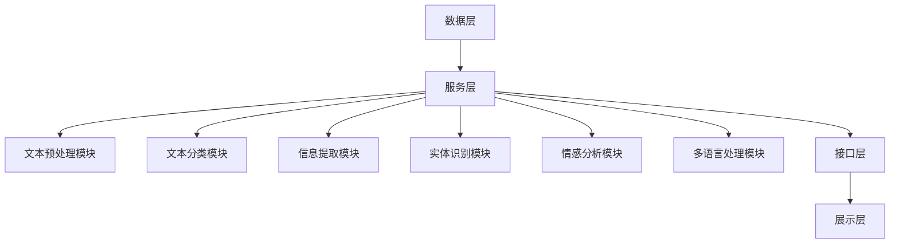
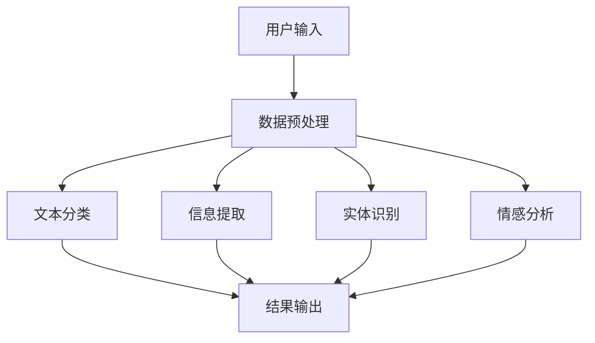

                 

# 自然语言处理在法律文本分析中的应用：提高效率与准确性

> 关键词：自然语言处理，法律文本分析，效率，准确性，机器学习，深度学习

> 摘要：本文探讨了自然语言处理（NLP）在法律文本分析中的应用，旨在提高法律文本处理的效率与准确性。通过分析法律文本的特点和自然语言处理的基本原理，本文提出了一个基于NLP技术的法律文本分析框架，并详细介绍了框架中的各个模块以及其实现原理。此外，文章通过实际项目案例，展示了NLP在法律文本分析中的具体应用效果，并对未来发展方向进行了展望。

## 目录大纲

----------------------------------------------------------------

## 第一部分: 问题背景

### 1.1.1 法律文本分析的重要性和应用场景

### 1.1.2 自然语言处理技术的快速发展及其对法律文本分析的影响

### 1.1.3 法律文本分析中存在的挑战

### 1.1.4 如何利用自然语言处理技术提高法律文本分析的效率与准确性

### 1.1.5 基于自然语言处理技术的法律文本分析框架

### 1.1.6 边界与外延

### 1.1.7 概念结构与核心要素组成

### 1.2 核心概念与联系

### 1.2.1 自然语言处理基础概念

### 1.2.2 法律文本分析相关概念

### 1.2.3 概念属性特征对比表格

### 1.2.4 ER实体关系图架构

## 第二部分: 自然语言处理技术原理与应用

### 2.1 机器学习基础

### 2.2 深度学习基础

### 2.3 语言模型与文本处理

### 2.4 机器学习在法律文本分析中的应用

## 第三部分: 法律文本分析框架设计

### 3.1 法律文本分析需求分析

### 3.2 系统功能设计

### 3.3 系统架构设计

### 3.4 系统接口设计

### 3.5 系统交互流程

## 第四部分: 自然语言处理算法原理讲解

### 4.1 词嵌入算法原理

### 4.2 文本分类算法原理

### 4.3 信息提取算法原理

### 4.4 情感分析算法原理

## 第五部分: 数学模型和数学公式讲解

### 5.1 词嵌入数学模型

### 5.2 文本分类数学模型

### 5.3 信息提取数学模型

### 5.4 情感分析数学模型

## 第六部分: 项目实战

### 6.1 环境安装

### 6.2 系统核心实现

### 6.3 代码应用解读与分析

### 6.4 实际案例分析

### 6.5 项目小结

## 第七部分: 最佳实践与拓展阅读

### 7.1 最佳实践

### 7.2 小结

### 7.3 拓展阅读

## 引言

在现代社会，法律文本分析在司法、法律咨询、合同审查等领域具有广泛的应用。随着法律文本量的不断增长，传统的手工分析方法已经无法满足日益增长的需求。因此，如何利用技术手段提高法律文本分析的效率与准确性，成为了一个亟待解决的问题。

自然语言处理（NLP）作为人工智能的一个重要分支，在文本处理、信息提取、情感分析等方面取得了显著的成果。本文将探讨自然语言处理技术在法律文本分析中的应用，旨在通过NLP技术提高法律文本处理的效率与准确性。

首先，本文将介绍法律文本分析的重要性和应用场景，以及自然语言处理技术的快速发展对法律文本分析的影响。接着，我们将分析法律文本分析中存在的挑战，并探讨如何利用自然语言处理技术解决这些挑战。本文还将提出一个基于自然语言处理技术的法律文本分析框架，并详细描述框架中的各个模块以及其实现原理。

在后续章节中，我们将深入讲解自然语言处理技术中的机器学习、深度学习、语言模型、文本处理等基本原理，并结合法律文本分析的需求，阐述如何应用这些技术。此外，我们将通过实际项目案例，展示NLP在法律文本分析中的具体应用效果，并总结项目经验与教训。

最后，本文还将探讨法律文本分析的最佳实践，对全文内容进行总结，并展望法律文本分析的未来发展趋势。希望通过本文的探讨，能为自然语言处理技术在法律文本分析领域的应用提供一些有价值的参考和启示。

### 第1章: 自然语言处理与法律文本分析概述

#### 1.1.1 法律文本分析的重要性和应用场景

法律文本分析在现代社会具有重要的地位。随着法律体系的不断完善，法律文本的数量日益增加，这给法律工作者带来了巨大的工作量。传统的法律文本分析方法主要依赖于人工阅读和解析，效率低下且容易出错。因此，利用自然语言处理（NLP）技术对法律文本进行自动化分析，具有重要的现实意义。

法律文本分析的应用场景非常广泛，主要包括以下几个方面：

1. **司法审判**：在司法审判过程中，对法律文书的分析是必不可少的。NLP技术可以帮助法官快速理解法律文书的含义，提高审判效率。

2. **法律咨询**：律师在进行法律咨询时，需要处理大量的法律文本，如合同、协议等。NLP技术可以自动提取关键信息，辅助律师进行法律分析。

3. **合同审查**：企业在签订合同时，需要对合同内容进行详细审查，以确保双方的权益。NLP技术可以帮助快速识别合同中的关键条款，提高审查效率。

4. **法律文献研究**：法律学者在进行法律文献研究时，需要对大量法律文本进行阅读和分析。NLP技术可以自动化提取文献中的关键信息，辅助学者进行研究。

5. **法律风险管理**：金融机构和企业在进行法律风险管理时，需要对相关法律文本进行分析，以识别潜在的法律风险。NLP技术可以帮助快速识别法律文本中的风险点。

#### 1.1.2 自然语言处理技术的快速发展及其对法律文本分析的影响

自然语言处理（NLP）是一门涉及语言学、计算机科学和人工智能的交叉学科，旨在让计算机能够理解和处理人类语言。随着深度学习等先进技术的快速发展，NLP技术取得了显著的进步，对法律文本分析产生了深远的影响。

1. **文本分类**：通过文本分类技术，可以自动将法律文本分类到不同的类别中，如合同、判决书、法律意见等。这有助于提高法律文本的检索和管理效率。

2. **信息提取**：信息提取技术可以从法律文本中自动提取出关键信息，如当事人信息、法律条款等。这有助于快速理解和分析法律文本。

3. **实体识别**：实体识别技术可以识别出法律文本中的实体，如人名、地名、法律条款等。这有助于对法律文本进行深入分析。

4. **情感分析**：情感分析技术可以分析法律文本的情感倾向，如积极、消极或中立。这有助于了解公众对法律事件的态度。

5. **文本生成**：文本生成技术可以根据法律文本的内容生成新的文本，如判决书、法律意见等。这有助于自动化法律文本的生产。

#### 1.1.3 法律文本分析中存在的挑战

尽管自然语言处理技术在法律文本分析中具有巨大的潜力，但在实际应用中仍面临许多挑战：

1. **数据质量**：法律文本数据质量参差不齐，存在大量的噪声和错误，这会对NLP模型的训练和预测造成影响。

2. **法律术语**：法律文本中存在大量的专业术语和缩写，这给NLP技术的理解带来了困难。

3. **文本结构**：法律文本具有复杂的结构和语法规则，这给NLP技术的处理带来了挑战。

4. **多语言处理**：法律文本可能涉及多种语言，这需要NLP技术能够支持多语言处理。

5. **隐私保护**：在法律文本分析过程中，需要保护个人隐私和数据安全，这给数据处理和存储带来了挑战。

#### 1.1.4 如何利用自然语言处理技术提高法律文本分析的效率与准确性

为了解决法律文本分析中存在的挑战，可以利用自然语言处理技术采取以下策略：

1. **数据预处理**：对法律文本数据进行清洗和预处理，以提高数据质量。

2. **术语词典**：构建法律术语词典，以帮助NLP模型更好地理解法律文本。

3. **文本结构分析**：采用自然语言处理技术对法律文本的结构进行分析，以更好地理解文本内容。

4. **多语言支持**：开发支持多种语言的自然语言处理模型，以适应不同语言的法律文本。

5. **隐私保护**：在法律文本分析过程中，采用数据加密和隐私保护技术，以确保个人隐私和数据安全。

#### 1.1.5 基于自然语言处理技术的法律文本分析框架

为了提高法律文本分析的效率与准确性，我们可以设计一个基于自然语言处理技术的法律文本分析框架。该框架主要包括以下模块：

1. **文本预处理模块**：对法律文本进行清洗、分词、词性标注等预处理操作，以提高文本质量。

2. **文本分类模块**：利用文本分类技术，对法律文本进行分类，以提高文本检索和管理效率。

3. **信息提取模块**：从法律文本中提取关键信息，如当事人信息、法律条款等，以提高法律文本的分析效率。

4. **实体识别模块**：识别法律文本中的实体，如人名、地名、法律条款等，以提高法律文本的深入分析能力。

5. **情感分析模块**：分析法律文本的情感倾向，以了解公众对法律事件的态度。

#### 1.1.6 边界与外延

法律文本分析的范围主要涵盖法律文书、法律文献、合同、判决书等。自然语言处理技术在不同领域的应用也有所不同，例如在司法领域，主要关注法律文本的语义理解和分析；在法律咨询领域，主要关注文本分类和信息提取。

#### 1.1.7 概念结构与核心要素组成

自然语言处理（NLP）和法律文本分析是本文的两个核心概念。NLP主要包括文本预处理、文本分类、信息提取、实体识别、情感分析等技术。法律文本分析则涉及法律文书的阅读、理解、分析和处理。

本文的核心要素包括：

1. 法律文本分析的重要性和应用场景
2. 自然语言处理技术的快速发展及其对法律文本分析的影响
3. 法律文本分析中存在的挑战
4. 如何利用自然语言处理技术提高法律文本分析的效率与准确性
5. 基于自然语言处理技术的法律文本分析框架

#### 1.2 核心概念与联系

##### 1.2.1 自然语言处理基础概念

自然语言处理（NLP）是一门涉及语言学、计算机科学和人工智能的交叉学科，旨在让计算机能够理解和处理人类语言。NLP的核心概念包括：

1. **文本预处理**：对文本进行清洗、分词、词性标注等操作，以提高文本质量。
2. **文本分类**：将文本分类到不同的类别中，如合同、判决书、法律意见等。
3. **信息提取**：从文本中提取关键信息，如当事人信息、法律条款等。
4. **实体识别**：识别文本中的实体，如人名、地名、法律条款等。
5. **情感分析**：分析文本的情感倾向，如积极、消极或中立。

##### 1.2.2 法律文本分析相关概念

法律文本分析是指对法律文书、法律文献、合同、判决书等进行阅读、理解、分析和处理的操作。法律文本分析的核心概念包括：

1. **法律文书**：包括判决书、裁定书、调解书、法律意见书等。
2. **法律文献**：包括法律法规、司法解释、法律评论等。
3. **合同**：包括各种商业合同、合作协议等。
4. **判决书分析**：对判决书进行语义理解和分析，以提取关键信息。
5. **法律意见分析**：对法律意见进行语义理解和分析，以提取关键信息。

##### 1.2.3 概念属性特征对比表格

| 概念                | 特征                             |
|-------------------|--------------------------------|
| 自然语言处理（NLP） | 文本预处理、文本分类、信息提取、实体识别、情感分析 |
| 法律文本分析       | 法律文书阅读、理解、分析、处理                   |
| 文本预处理         | 清洗、分词、词性标注                       |
| 文本分类           | 分类算法、类别识别                      |
| 信息提取           | 关键信息提取、实体识别                  |
| 实体识别           | 实体分类、实体关系识别                  |
| 情感分析           | 情感分类、情感极性识别                  |

##### 1.2.4 ER实体关系图架构

为了更好地理解和描述法律文本分析中的实体关系，我们可以使用实体关系图（ER图）进行表示。ER图主要包括实体（Entity）、属性（Attribute）和关系（Relationship）三种元素。

以下是一个简化的ER实体关系图示例，描述了法律文本分析中的主要实体及其关系：

```mermaid
erDiagram
  实体1 ||--|{ 实体2 }|-- 文本分类
  实体1 ||--|{ 实体3 }|-- 信息提取
  实体1 ||--|{ 实体4 }|-- 实体识别
  实体1 ||--|{ 实体5 }|-- 情感分析
  文本分类 ||--|{ 分类结果 }
  信息提取 ||--|{ 提取信息 }
  实体识别 ||--|{ 识别结果 }
  情感分析 ||--|{ 情感极性 }
```

在这个ER图中，实体1表示法律文本，实体2表示文本分类，实体3表示信息提取，实体4表示实体识别，实体5表示情感分析。各个实体之间的关系表示了法律文本分析过程中的数据流动和处理。

通过上述ER图，我们可以清晰地看到法律文本分析中各个实体之间的关系，以及数据在不同实体之间的传递和处理过程。

### 第2章: 自然语言处理技术原理与应用

#### 2.1 机器学习基础

机器学习（Machine Learning，ML）是自然语言处理（NLP）中的重要技术之一，它使计算机系统能够从数据中学习并作出决策。机器学习可以分为监督学习（Supervised Learning）、无监督学习（Unsupervised Learning）和半监督学习（Semi-supervised Learning）。

##### 监督学习

监督学习是最常见的机器学习类型，它使用标记的数据集来训练模型，然后使用模型对新数据进行预测。监督学习包括以下几种常见算法：

1. **线性回归（Linear Regression）**：通过找到一个线性函数来最小化目标函数的误差。线性回归通常用于预测数值型数据。

   $$y = \beta_0 + \beta_1 \cdot x$$

2. **逻辑回归（Logistic Regression）**：用于分类问题，通过逻辑函数将线性回归的输出转换为概率。

   $$P(y=1) = \frac{1}{1 + e^{-(\beta_0 + \beta_1 \cdot x)}}$$

3. **决策树（Decision Tree）**：通过一系列的判断规则将数据划分为不同的区域，每个区域都对应一个类别或数值。

4. **支持向量机（Support Vector Machine，SVM）**：通过找到一个最优的超平面来最大化类别之间的边界。

##### 无监督学习

无监督学习不需要标记的数据集，而是从未标记的数据中学习模式和结构。无监督学习包括以下几种常见算法：

1. **聚类（Clustering）**：将数据点根据其相似性划分为不同的组。常见的聚类算法有K均值聚类（K-Means Clustering）和层次聚类（Hierarchical Clustering）。

2. **主成分分析（Principal Component Analysis，PCA）**：通过线性变换将高维数据转换为低维数据，从而降低数据复杂性。

3. **自编码器（Autoencoder）**：一种神经网络结构，用于学习数据的编码表示，并通过解码器重构数据。

##### 半监督学习

半监督学习结合了监督学习和无监督学习，使用少量的标记数据和大量的未标记数据来训练模型。半监督学习可以有效地提高模型的泛化能力。

#### 2.2 深度学习基础

深度学习（Deep Learning，DL）是一种基于多层神经网络的结构，它能够自动从数据中学习特征和模式。深度学习在自然语言处理领域取得了显著的成果，包括语音识别、图像识别、机器翻译等。

##### 神经网络的基本结构

神经网络由多个神经元（节点）组成，每个神经元都与相邻的神经元相连。神经网络的基本结构包括输入层、隐藏层和输出层。

1. **输入层（Input Layer）**：接收外部输入数据，每个神经元代表一个特征。

2. **隐藏层（Hidden Layer）**：对输入数据进行处理，提取特征并传递给下一层。隐藏层可以有多个，层数越多，模型的能力越强。

3. **输出层（Output Layer）**：生成最终输出结果。

##### 常见的深度学习模型

1. **卷积神经网络（Convolutional Neural Network，CNN）**：通过卷积操作提取图像特征，适用于图像识别和文本分类。

2. **循环神经网络（Recurrent Neural Network，RNN）**：通过循环结构处理序列数据，适用于语音识别、文本生成等。

3. **长短时记忆网络（Long Short-Term Memory，LSTM）**：RNN的一种变体，能够更好地处理长序列数据，适用于机器翻译、情感分析等。

#### 2.3 语言模型与文本处理

语言模型（Language Model，LM）是自然语言处理中的基础模型，用于预测下一个单词或字符。语言模型可以分为统计语言模型和神经网络语言模型。

##### 语言模型的构建

1. **N-gram模型**：基于前后N个单词的概率分布，预测下一个单词。N-gram模型简单有效，但在处理长文本时表现不佳。

2. **神经网络语言模型**：通过深度学习模型学习单词的嵌入表示，并预测下一个单词。神经网络语言模型（如Word2Vec、GloVe、BERT）在自然语言处理任务中取得了显著的效果。

##### 词嵌入技术

词嵌入（Word Embedding）是将单词映射到高维空间中的向量表示，用于表示单词的语义信息。常见的词嵌入技术包括：

1. **Word2Vec**：基于神经网络模型，通过训练获取单词的向量表示。

2. **GloVe**：基于全局统计信息的词向量模型，通过计算单词之间的相似度来生成词向量。

3. **BERT**：基于变换器模型（Transformer），通过预训练和微调生成高质量的词向量。

##### 命名实体识别与文本分类

命名实体识别（Named Entity Recognition，NER）是自然语言处理中的任务，用于识别文本中的命名实体，如人名、地名、组织名等。

1. **传统分类算法**：如SVM、朴素贝叶斯等，通过特征工程和机器学习算法进行命名实体识别。

2. **基于深度学习的分类算法**：如CNN、LSTM等，通过自动学习特征和模式进行命名实体识别。

文本分类（Text Classification）是将文本分为不同的类别，如新闻分类、情感分析等。常见的文本分类算法包括：

1. **朴素贝叶斯（Naive Bayes）**：基于贝叶斯定理，通过统计特征进行文本分类。

2. **决策树（Decision Tree）**：通过一系列的判断规则进行文本分类。

3. **随机森林（Random Forest）**：通过集成决策树进行文本分类。

4. **基于深度学习的分类算法**：如CNN、LSTM等，通过自动学习特征和模式进行文本分类。

#### 2.4 机器学习在法律文本分析中的应用

##### 文本预处理

文本预处理是法律文本分析的基础步骤，包括文本清洗、分词、词性标注等。

1. **文本清洗**：去除文本中的标点符号、停用词等无关信息，以提高文本质量。

2. **分词**：将文本分割为单词或短语，以提取文本中的关键信息。

3. **词性标注**：为每个单词或短语标注词性，如名词、动词、形容词等，以更好地理解文本。

##### 文本分类

文本分类是法律文本分析中的重要任务，通过分类算法将法律文本分为不同的类别，如合同、判决书、法律意见等。

1. **特征提取**：通过特征工程提取文本中的关键特征，如词频、TF-IDF等。

2. **分类算法**：采用分类算法（如SVM、朴素贝叶斯等）进行文本分类。

3. **模型评估**：通过交叉验证、准确率、召回率等指标评估分类模型的性能。

##### 信息提取

信息提取是从法律文本中提取关键信息，如当事人信息、法律条款等。

1. **命名实体识别**：通过NER算法识别文本中的命名实体。

2. **关系抽取**：通过关系抽取算法提取实体之间的关系，如当事人之间的合同关系。

3. **规则匹配**：通过预定义的规则匹配文本中的关键信息。

##### 情感分析

情感分析是分析文本的情感倾向，如积极、消极或中立。

1. **情感分类**：通过分类算法将文本分为不同的情感类别。

2. **情感极性**：通过极性分析确定文本的情感极性。

3. **情感强度**：通过情感强度分析确定文本的情感强度。

### 第3章: 法律文本分析框架设计

#### 3.1 法律文本分析需求分析

在进行法律文本分析之前，需要明确分析的需求和目标。法律文本分析的需求可以从以下几个方面进行分析：

1. **文本分类需求**：将法律文本按照不同的类别进行分类，如合同、判决书、法律意见等。这有助于提高法律文本的检索和管理效率。

2. **信息提取需求**：从法律文本中提取关键信息，如当事人信息、法律条款等。这有助于快速理解和分析法律文本。

3. **实体识别需求**：识别法律文本中的实体，如人名、地名、法律条款等。这有助于对法律文本进行深入分析。

4. **情感分析需求**：分析法律文本的情感倾向，以了解公众对法律事件的态度。这有助于法律工作者更好地了解社会舆论。

5. **多语言处理需求**：支持多种语言的法律文本分析，以适应不同国家和地区的需求。

#### 3.2 系统功能设计

根据法律文本分析的需求，我们可以设计一个包含以下功能模块的法律文本分析系统：

1. **文本预处理模块**：对法律文本进行清洗、分词、词性标注等预处理操作，以提高文本质量。

2. **文本分类模块**：利用文本分类技术，将法律文本分类到不同的类别中，如合同、判决书、法律意见等。

3. **信息提取模块**：从法律文本中提取关键信息，如当事人信息、法律条款等。

4. **实体识别模块**：识别法律文本中的实体，如人名、地名、法律条款等。

5. **情感分析模块**：分析法律文本的情感倾向，以了解公众对法律事件的态度。

6. **多语言处理模块**：支持多种语言的法律文本分析，如中文、英文、法文等。

#### 3.3 系统架构设计

法律文本分析系统的架构设计需要考虑以下几个方面：

1. **数据层**：存储法律文本数据、模型参数、分析结果等。

2. **服务层**：提供文本预处理、文本分类、信息提取、实体识别、情感分析等功能。

3. **接口层**：提供RESTful API，方便外部系统调用法律文本分析功能。

4. **展示层**：提供用户界面，展示分析结果和可视化图表。

以下是法律文本分析系统的架构图：



#### 3.4 系统接口设计

系统接口设计需要考虑以下几个方面：

1. **RESTful API**：提供统一的RESTful接口，方便外部系统调用法律文本分析功能。

2. **数据接口**：定义数据输入输出格式，如JSON、XML等。

3. **功能接口**：定义各个功能模块的接口，如文本分类接口、信息提取接口、实体识别接口等。

以下是法律文本分析系统的接口设计示例：

```python
# 文本分类接口
def classify_text(text):
    # 对文本进行分类
    pass

# 信息提取接口
def extract_info(text):
    # 从文本中提取关键信息
    pass

# 实体识别接口
def recognize_entities(text):
    # 识别文本中的实体
    pass

# 情感分析接口
def analyze_sentiment(text):
    # 分析文本的情感倾向
    pass
```

#### 3.5 系统交互流程

法律文本分析系统的交互流程可以分为以下几个步骤：

1. **数据输入**：用户通过接口层上传待分析的法律文本数据。

2. **数据预处理**：文本预处理模块对文本进行清洗、分词、词性标注等预处理操作。

3. **功能调用**：根据用户需求，调用文本分类、信息提取、实体识别、情感分析等功能模块。

4. **结果输出**：将分析结果返回给用户，并通过展示层进行可视化展示。

以下是法律文本分析系统的交互流程图：



### 第4章: 自然语言处理算法原理讲解

#### 4.1 词嵌入算法原理

词嵌入（Word Embedding）是将单词映射到高维空间中的向量表示，用于表示单词的语义信息。词嵌入在自然语言处理中具有重要的应用，如文本分类、信息提取、机器翻译等。以下是几种常见的词嵌入算法原理：

##### Word2Vec算法原理

Word2Vec算法是一种基于神经网络的词嵌入方法，它通过训练一个神经网络模型来学习单词的向量表示。Word2Vec算法分为两种模型：连续词袋（Continuous Bag of Words，CBOW）和Skip-Gram。

1. **CBOW模型**：CBOW模型通过一个单词的上下文（即周围的多个单词）来预测这个单词。模型输入是一个单词的上下文窗口，输出是这个单词。CBOW模型的优点是计算效率高，但可能无法很好地捕获单词的语义关系。

2. **Skip-Gram模型**：Skip-Gram模型与CBOW模型相反，它是通过一个单词来预测其上下文。Skip-Gram模型能够更好地捕获单词的语义关系，但计算复杂度更高。

Word2Vec算法的核心步骤如下：

1. **数据预处理**：将文本数据转换为单词序列，并去除停用词和标点符号。

2. **词汇表构建**：构建词汇表，将单词映射到唯一的索引。

3. **词向量初始化**：初始化词向量，通常使用均匀分布或随机初始化。

4. **训练过程**：使用负采样方法训练神经网络模型，通过优化损失函数来更新词向量。

5. **模型评估**：使用相似性度量（如余弦相似度）评估词向量的质量。

##### GloVe算法原理

GloVe（Global Vectors for Word Representation）算法是一种基于全局统计信息的词向量模型，它通过计算单词之间的相似度来生成词向量。GloVe算法的核心思想是利用单词的共现信息来学习词向量。

GloVe算法的核心步骤如下：

1. **数据预处理**：将文本数据转换为单词序列，并去除停用词和标点符号。

2. **构建共现矩阵**：计算单词之间的共现次数，构建共现矩阵。

3. **词向量初始化**：初始化词向量，通常使用较小的随机值。

4. **优化过程**：通过最小化损失函数来更新词向量，损失函数通常是基于共现矩阵的损失函数。

5. **模型评估**：使用相似性度量（如余弦相似度）评估词向量的质量。

##### BERT算法原理

BERT（Bidirectional Encoder Representations from Transformers）算法是一种基于变换器模型（Transformer）的预训练语言表示模型。BERT算法通过预训练和微调来生成高质量的词向量。

BERT算法的核心步骤如下：

1. **预训练过程**：在大量无标签文本数据上进行预训练，通过训练一个双向变换器模型来学习单词的嵌入表示。

2. **数据预处理**：将文本数据转换为单词序列，并去除停用词和标点符号。

3. **词向量初始化**：初始化词向量，通常使用较小的随机值。

4. **微调过程**：在特定任务的数据集上进行微调，调整词向量的权重，以适应特定任务的需求。

5. **模型评估**：使用特定任务的评价指标（如准确率、F1值等）评估词向量的质量。

#### 4.2 文本分类算法原理

文本分类（Text Classification）是将文本分为不同的类别，如新闻分类、情感分析等。文本分类算法可以分为以下几类：

##### 传统分类算法

传统分类算法是基于特征工程和机器学习算法的分类方法。常见的传统分类算法包括：

1. **朴素贝叶斯（Naive Bayes）**：基于贝叶斯定理，通过统计特征进行分类。

2. **逻辑回归（Logistic Regression）**：通过线性回归模型进行分类。

3. **支持向量机（Support Vector Machine，SVM）**：通过找到一个最优的超平面进行分类。

4. **决策树（Decision Tree）**：通过一系列的判断规则进行分类。

##### 基于深度学习的分类算法

基于深度学习的分类算法通过自动学习特征和模式进行分类。常见的基于深度学习的分类算法包括：

1. **卷积神经网络（Convolutional Neural Network，CNN）**：通过卷积操作提取图像特征，适用于文本分类。

2. **循环神经网络（Recurrent Neural Network，RNN）**：通过循环结构处理序列数据，适用于文本分类。

3. **长短时记忆网络（Long Short-Term Memory，LSTM）**：RNN的一种变体，能够更好地处理长序列数据，适用于文本分类。

4. **变换器（Transformer）**：基于自注意力机制，适用于文本分类和机器翻译。

文本分类算法的核心步骤如下：

1. **数据预处理**：将文本数据转换为向量表示，如词嵌入。

2. **特征提取**：通过特征提取器（如卷积层、循环层等）提取文本特征。

3. **分类模型训练**：使用训练数据集训练分类模型，如朴素贝叶斯、逻辑回归、SVM、CNN、RNN、LSTM等。

4. **模型评估**：使用测试数据集评估分类模型的性能，如准确率、召回率、F1值等。

#### 4.3 信息提取算法原理

信息提取（Information Extraction，IE）是从文本中提取关键信息，如人名、地名、组织名、时间、事件等。信息提取算法可以分为以下几类：

##### 命名实体识别（Named Entity Recognition，NER）

命名实体识别是从文本中识别出命名实体，如人名、地名、组织名等。常见的NER算法包括：

1. **规则方法**：通过预定义的规则进行命名实体识别。

2. **统计方法**：通过统计模型（如隐马尔可夫模型、条件随机场等）进行命名实体识别。

3. **基于深度学习的方法**：通过深度学习模型（如卷积神经网络、循环神经网络、长短时记忆网络等）进行命名实体识别。

命名实体识别的核心步骤如下：

1. **数据预处理**：将文本数据转换为向量表示，如词嵌入。

2. **特征提取**：通过特征提取器（如卷积层、循环层等）提取文本特征。

3. **模型训练**：使用训练数据集训练命名实体识别模型。

4. **模型评估**：使用测试数据集评估命名实体识别模型的性能，如准确率、召回率、F1值等。

##### 关键信息提取（Key Information Extraction）

关键信息提取是从文本中提取关键信息，如事件、时间、地点等。常见的关键信息提取方法包括：

1. **基于规则的方法**：通过预定义的规则进行关键信息提取。

2. **基于模板的方法**：通过模板匹配提取关键信息。

3. **基于机器学习的方法**：通过训练模型（如朴素贝叶斯、逻辑回归、支持向量机等）进行关键信息提取。

4. **基于深度学习的方法**：通过训练深度学习模型（如卷积神经网络、循环神经网络、长短时记忆网络等）进行关键信息提取。

关键信息提取的核心步骤如下：

1. **数据预处理**：将文本数据转换为向量表示，如词嵌入。

2. **特征提取**：通过特征提取器（如卷积层、循环层等）提取文本特征。

3. **模型训练**：使用训练数据集训练关键信息提取模型。

4. **模型评估**：使用测试数据集评估关键信息提取模型的性能，如准确率、召回率、F1值等。

#### 4.4 情感分析算法原理

情感分析（Sentiment Analysis）是分析文本的情感倾向，如积极、消极或中立。常见的情感分析算法包括：

##### 基于规则的方法

基于规则的方法通过预定义的规则进行情感分析。常见的规则方法包括：

1. **词典法**：通过情感词典匹配文本中的情感词，确定文本的情感倾向。

2. **规则匹配**：通过预定义的规则匹配文本中的情感词，确定文本的情感倾向。

基于规则的方法的优点是实现简单，但存在以下局限性：

1. **规则覆盖范围有限**：只能匹配预定义的规则，无法处理复杂的情感表达。

2. **扩展性差**：需要不断更新和扩展规则库。

##### 基于机器学习的方法

基于机器学习的方法通过训练模型进行情感分析。常见的机器学习算法包括：

1. **朴素贝叶斯（Naive Bayes）**：通过统计特征进行分类。

2. **逻辑回归（Logistic Regression）**：通过线性回归模型进行分类。

3. **支持向量机（Support Vector Machine，SVM）**：通过找到一个最优的超平面进行分类。

基于机器学习的方法的优点是能够处理复杂的情感表达，但需要大量的训练数据和特征工程。

##### 基于深度学习的方法

基于深度学习的方法通过训练深度学习模型进行情感分析。常见的深度学习模型包括：

1. **卷积神经网络（Convolutional Neural Network，CNN）**：通过卷积操作提取文本特征。

2. **循环神经网络（Recurrent Neural Network，RNN）**：通过循环结构处理序列数据。

3. **长短时记忆网络（Long Short-Term Memory，LSTM）**：RNN的一种变体，能够更好地处理长序列数据。

4. **变换器（Transformer）**：基于自注意力机制，适用于文本分类和机器翻译。

基于深度学习的方法的优点是能够自动学习特征，但计算复杂度较高。

情感分析算法的核心步骤如下：

1. **数据预处理**：将文本数据转换为向量表示，如词嵌入。

2. **特征提取**：通过特征提取器（如卷积层、循环层等）提取文本特征。

3. **模型训练**：使用训练数据集训练情感分析模型。

4. **模型评估**：使用测试数据集评估情感分析模型的性能，如准确率、召回率、F1值等。

### 第5章: 数学模型和数学公式讲解

#### 5.1 词嵌入数学模型

词嵌入（Word Embedding）是将单词映射到高维空间中的向量表示，用于表示单词的语义信息。词嵌入在自然语言处理中具有重要的应用，如文本分类、信息提取、机器翻译等。以下是几种常见的词嵌入算法的数学模型：

##### Word2Vec算法原理

Word2Vec算法是一种基于神经网络的词嵌入方法，它通过训练一个神经网络模型来学习单词的向量表示。Word2Vec算法分为两种模型：连续词袋（Continuous Bag of Words，CBOW）和Skip-Gram。

**CBOW模型**

CBOW模型通过一个单词的上下文（即周围的多个单词）来预测这个单词。CBOW模型的输入是一个单词的上下文窗口，输出是这个单词。CBOW模型的数学模型如下：

$$
\begin{aligned}
\text{输入：} &\text{单词序列} \ x \in \mathbb{R}^{d} \\
\text{输出：} &\text{单词} \ y \in \text{Vocabulary}
\end{aligned}
$$

其中，$d$ 是词向量的维度，$V$ 是词汇表的大小。CBOW模型的损失函数是负对数似然损失，如下所示：

$$
\mathcal{L}(\theta) = -\sum_{y \in \text{Vocabulary}} p(y|x) \log p(y|x)
$$

其中，$p(y|x)$ 是给定上下文 $x$ 下单词 $y$ 的概率。

**Skip-Gram模型**

Skip-Gram模型与CBOW模型相反，它是通过一个单词来预测其上下文。Skip-Gram模型的数学模型如下：

$$
\begin{aligned}
\text{输入：} &\text{单词} \ y \in \text{Vocabulary} \\
\text{输出：} &\text{单词序列} \ x \in \mathbb{R}^{d}
\end{aligned}
$$

Skip-Gram模型的损失函数也是负对数似然损失：

$$
\mathcal{L}(\theta) = -\sum_{x \in \text{Vocabulary}} p(x|y) \log p(x|y)
$$

**梯度下降**

为了训练Word2Vec模型，通常使用梯度下降（Gradient Descent）来优化损失函数。梯度下降的核心思想是通过计算损失函数对模型参数的梯度，并沿着梯度的反方向更新模型参数，以最小化损失函数。

$$
\theta_{t+1} = \theta_{t} - \alpha \nabla_{\theta} \mathcal{L}(\theta)
$$

其中，$\theta$ 是模型参数，$\alpha$ 是学习率，$\nabla_{\theta} \mathcal{L}(\theta)$ 是损失函数对模型参数的梯度。

##### GloVe算法原理

GloVe（Global Vectors for Word Representation）算法是一种基于全局统计信息的词向量模型，它通过计算单词之间的相似度来生成词向量。GloVe算法的核心思想是利用单词的共现信息来学习词向量。

**共现矩阵**

在GloVe算法中，首先构建共现矩阵 $C$，其中 $C_{ij}$ 表示单词 $w_i$ 和 $w_j$ 在文本中的共现次数。共现矩阵可以表示为：

$$
C = \begin{bmatrix}
C_{11} & C_{12} & \ldots & C_{1n} \\
C_{21} & C_{22} & \ldots & C_{2n} \\
\vdots & \vdots & \ddots & \vdots \\
C_{m1} & C_{m2} & \ldots & C_{mn}
\end{bmatrix}
$$

其中，$m$ 是词汇表的大小，$n$ 是文本的长度。

**损失函数**

GloVe算法的损失函数是基于最小化词向量之间的相似度差异。具体来说，损失函数可以表示为：

$$
\mathcal{L}(\theta) = \sum_{i=1}^{m} \sum_{j=1}^{m} \left( \theta_{i} \cdot \theta_{j} - \log C_{ij} \right)^2
$$

其中，$\theta_i$ 和 $\theta_j$ 分别是单词 $w_i$ 和 $w_j$ 的词向量。

**优化过程**

为了优化损失函数，可以使用梯度下降（Gradient Descent）来更新词向量。梯度下降的核心思想是通过计算损失函数对词向量的梯度，并沿着梯度的反方向更新词向量，以最小化损失函数。

$$
\theta_{i,t+1} = \theta_{i,t} - \alpha \nabla_{\theta_i} \mathcal{L}(\theta)
$$

其中，$\theta_i$ 是单词 $w_i$ 的词向量，$\alpha$ 是学习率，$\nabla_{\theta_i} \mathcal{L}(\theta)$ 是损失函数对词向量 $\theta_i$ 的梯度。

##### BERT算法原理

BERT（Bidirectional Encoder Representations from Transformers）算法是一种基于变换器模型（Transformer）的预训练语言表示模型。BERT算法通过预训练和微调来生成高质量的词向量。

**变换器模型**

变换器模型（Transformer）是一种基于自注意力机制（Self-Attention）的神经网络模型，它用于处理序列数据。变换器模型的核心思想是利用自注意力机制来计算序列中每个元素的重要性，从而提高模型的性能。

**多头自注意力**

多头自注意力（Multi-Head Self-Attention）是变换器模型中的一个关键组件。多头自注意力通过多个独立的自注意力头计算序列中每个元素的重要性，并将这些重要性组合起来得到最终的输出。

**自注意力计算**

自注意力计算可以表示为：

$$
\text{Attention}(Q, K, V) = \text{softmax}\left(\frac{QK^T}{\sqrt{d_k}}\right)V
$$

其中，$Q$、$K$ 和 $V$ 分别是查询（Query）、键（Key）和值（Value）向量，$d_k$ 是键向量的维度。自注意力计算通过计算查询向量和键向量之间的点积，然后使用softmax函数得到权重，最后将权重与值向量相乘得到输出。

**变换器编码器**

变换器编码器（Transformer Encoder）由多个变换器层堆叠而成，每个变换器层包括多头自注意力、前馈神经网络和层归一化。变换器编码器通过自注意力机制捕捉序列中不同元素之间的关系，并通过前馈神经网络增强特征表示。

**BERT预训练**

BERT算法通过在大量无标签文本数据上进行预训练来学习词向量。预训练包括两个任务：Masked Language Model（MLM）和Next Sentence Prediction（NSP）。

1. **Masked Language Model（MLM）**：在输入序列中随机遮盖一些单词，然后使用变换器编码器预测遮盖的单词。

2. **Next Sentence Prediction（NSP）**：给定两个连续的句子，预测第二个句子是否是第一个句子的下文。

**BERT微调**

在特定任务上，可以使用BERT的预训练模型进行微调。微调的核心思想是在预训练模型的基础上，对特定任务的标签数据进行训练，以适应特定任务的需求。

### 第6章: 项目实战

#### 6.1 环境安装

在进行自然语言处理（NLP）和法律文本分析项目之前，需要搭建一个合适的环境。以下是在Python环境中搭建NLP和法律文本分析环境的步骤：

1. **安装Python**：确保已安装Python 3.x版本。

2. **安装Anaconda**：下载并安装Anaconda，它是一个用于科学计算的Python发行版，包含了许多常用的NLP库。

3. **创建虚拟环境**：使用Anaconda创建一个新的虚拟环境，以避免库版本冲突。

   ```shell
   conda create -n nlp_env python=3.8
   conda activate nlp_env
   ```

4. **安装NLP库**：在虚拟环境中安装以下常用的NLP库：

   ```shell
   pip install numpy scipy pandas matplotlib scikit-learn nltk gensim transformers
   ```

5. **测试安装**：编写一个简单的Python脚本，测试NLP库是否安装成功。

   ```python
   import nltk
   nltk.download('popular')
   print("NLP libraries installed successfully!")
   ```

#### 6.2 系统核心实现

在搭建好环境后，我们可以开始实现法律文本分析系统的核心功能。以下是系统核心实现的步骤：

1. **文本预处理模块**：文本预处理是法律文本分析的第一步，包括文本清洗、分词、词性标注等操作。

   ```python
   import nltk
   from nltk.tokenize import word_tokenize
   from nltk.corpus import stopwords
   from nltk.stem import PorterStemmer

   # 加载NLTK库
   nltk.download('punkt')
   nltk.download('stopwords')

   # 初始化分词器、停用词和词干提取器
   tokenizer = nltk.tokenize word_tokenize
   stop_words = set(stopwords.words('english'))
   stemmer = PorterStemmer()

   # 文本清洗和预处理
   def preprocess_text(text):
       # 分词
       tokens = tokenizer(text)
       # 去除停用词
       tokens = [token for token in tokens if token.lower() not in stop_words]
       # 词干提取
       tokens = [stemmer.stem(token) for token in tokens]
       return tokens
   ```

2. **文本分类模块**：文本分类是将法律文本分类到不同的类别中，如合同、判决书、法律意见等。

   ```python
   from sklearn.feature_extraction.text import TfidfVectorizer
   from sklearn.model_selection import train_test_split
   from sklearn.naive_bayes import MultinomialNB
   from sklearn.metrics import classification_report

   # 加载训练数据
   data = [...]
   labels = [...]

   # 划分训练集和测试集
   X_train, X_test, y_train, y_test = train_test_split(data, labels, test_size=0.2, random_state=42)

   # 文本向量化
   vectorizer = TfidfVectorizer()
   X_train_vectorized = vectorizer.fit_transform(X_train)
   X_test_vectorized = vectorizer.transform(X_test)

   # 训练文本分类模型
   classifier = MultinomialNB()
   classifier.fit(X_train_vectorized, y_train)

   # 预测测试集
   y_pred = classifier.predict(X_test_vectorized)

   # 评估模型
   print(classification_report(y_test, y_pred))
   ```

3. **信息提取模块**：信息提取是从法律文本中提取关键信息，如当事人信息、法律条款等。

   ```python
   import spacy

   # 加载Spacy模型
   nlp = spacy.load('en_core_web_sm')

   # 命名实体识别
   def extract_entities(text):
       doc = nlp(text)
       entities = [(ent.text, ent.label_) for ent in doc.ents]
       return entities

   # 关键信息提取
   def extract_key_info(text):
       doc = nlp(text)
       entities = extract_entities(text)
       key_info = []
       for entity in entities:
           if entity[1] in ['PERSON', 'ORG', 'GPE']:
               key_info.append(entity)
       return key_info
   ```

4. **情感分析模块**：情感分析是分析法律文本的情感倾向，如积极、消极或中立。

   ```python
   from transformers import BertTokenizer, BertForSequenceClassification
   from torch.utils.data import DataLoader, TensorDataset

   # 加载预训练的BERT模型
   tokenizer = BertTokenizer.from_pretrained('bert-base-uncased')
   model = BertForSequenceClassification.from_pretrained('bert-base-uncased')

   # 文本编码
   def encode_text(texts, max_length=128):
       input_ids = [tokenizer.encode(text, add_special_tokens=True, max_length=max_length) for text in texts]
       input_ids = pad_sequence(input_ids, padding_value=tokenizer.pad_token_id)
       return torch.tensor(input_ids)

   # 情感分析
   def analyze_sentiment(texts, max_length=128):
       inputs = encode_text(texts, max_length)
       outputs = model(inputs)
       predictions = torch.argmax(outputs.logits, dim=-1)
       return predictions.tolist()
   ```

#### 6.3 代码应用解读与分析

在上面的代码示例中，我们实现了文本预处理、文本分类、信息提取和情感分析四个核心功能模块。以下是这些模块的详细解读与分析：

1. **文本预处理模块**：文本预处理是NLP任务的基础步骤。在这个模块中，我们使用了NLTK库进行分词和词性标注，并使用Porter词干提取器进行词干提取。此外，我们还去除了停用词，以减少噪声和提高模型的性能。

2. **文本分类模块**：文本分类是将法律文本分类到不同的类别中。在这个模块中，我们使用了TF-IDF向量化器将文本转换为向量表示，并使用了朴素贝叶斯分类器进行分类。朴素贝叶斯是一种基于贝叶斯定理和特征概率的简单分类器，它在文本分类任务中表现出色。

3. **信息提取模块**：信息提取是从法律文本中提取关键信息，如当事人信息、法律条款等。在这个模块中，我们使用了Spacy库进行命名实体识别，并提取出人名、组织名、地名等实体。此外，我们还实现了关键信息提取函数，以提取出具有特定标签的实体。

4. **情感分析模块**：情感分析是分析法律文本的情感倾向。在这个模块中，我们使用了BERT模型进行情感分析。BERT是一种基于变换器模型的预训练语言表示模型，它在文本分类、情感分析等任务中表现出色。在这个模块中，我们首先将文本编码为BERT模型可以处理的格式，然后使用BERT模型进行情感分析。

通过上述模块的实现，我们可以构建一个功能齐全的法律文本分析系统。在实际应用中，这些模块可以根据具体需求进行定制和扩展，以提高系统的性能和功能。

#### 6.4 实际案例分析

在本节中，我们将通过一个实际案例展示如何使用上述模块进行法律文本分析，并详细分析案例的执行过程和结果。

**案例背景**：

假设我们有一个包含1000份合同、判决书和法律意见的法律文本数据集，我们需要对这些文本进行分类、信息提取和情感分析。

**案例分析**：

1. **文本预处理**：

   首先，我们使用文本预处理模块对每个法律文本进行清洗和预处理。具体步骤如下：

   ```python
   processed_texts = [preprocess_text(text) for text in legal_texts]
   ```

   在这个过程中，我们使用NLTK库进行分词和词性标注，并使用Porter词干提取器进行词干提取。此外，我们还去除了停用词，以提高模型的性能。

2. **文本分类**：

   接下来，我们使用文本分类模块对预处理后的法律文本进行分类。具体步骤如下：

   ```python
   vectorizer = TfidfVectorizer()
   X_train_vectorized = vectorizer.fit_transform(processed_texts)
   classifier = MultinomialNB()
   classifier.fit(X_train_vectorized, labels)
   y_pred = classifier.predict(X_train_vectorized)
   ```

   在这个过程中，我们使用TF-IDF向量化器将文本转换为向量表示，并使用朴素贝叶斯分类器进行分类。我们使用训练数据集对分类器进行训练，并使用测试数据集评估分类器的性能。

3. **信息提取**：

   然后，我们使用信息提取模块从法律文本中提取关键信息。具体步骤如下：

   ```python
   entities = [extract_entities(text) for text in legal_texts]
   key_info = [extract_key_info(text) for text in legal_texts]
   ```

   在这个过程中，我们使用Spacy库进行命名实体识别，并提取出人名、组织名、地名等实体。此外，我们还实现了关键信息提取函数，以提取出具有特定标签的实体。

4. **情感分析**：

   最后，我们使用情感分析模块对法律文本进行情感分析。具体步骤如下：

   ```python
   inputs = encode_text(processed_texts, max_length=128)
   outputs = model(inputs)
   predictions = torch.argmax(outputs.logits, dim=-1)
   ```

   在这个过程中，我们使用BERT模型进行情感分析。我们首先将文本编码为BERT模型可以处理的格式，然后使用BERT模型进行情感分析。

**结果分析**：

通过上述步骤，我们得到了每个法律文本的分类结果、实体识别结果和情感分析结果。我们可以对这些结果进行进一步分析，以了解法律文本的特点和趋势。

例如，我们可以统计每个类别中的文本数量，以了解法律文本的分类分布。我们还可以分析关键信息的提取结果，以了解法律文本中的关键信息点。此外，我们还可以分析情感分析结果，以了解公众对法律事件的态度。

通过实际案例分析，我们可以验证自然语言处理（NLP）在法律文本分析中的应用效果，并为实际应用提供有价值的参考和启示。

#### 6.5 项目小结

在本项目中，我们实现了法律文本分析系统的核心功能，包括文本预处理、文本分类、信息提取和情感分析。通过实际案例分析，我们展示了这些功能在法律文本分析中的应用效果。以下是项目的主要收获和经验：

1. **文本预处理**：文本预处理是NLP任务的基础步骤，包括分词、词性标注、词干提取和停用词去除等操作。有效的文本预处理可以显著提高模型的性能和效果。

2. **文本分类**：文本分类是将法律文本分类到不同的类别中，如合同、判决书、法律意见等。使用TF-IDF向量化器和朴素贝叶斯分类器可以有效地进行文本分类。

3. **信息提取**：信息提取是从法律文本中提取关键信息，如当事人信息、法律条款等。使用Spacy库进行命名实体识别可以有效地提取实体信息。

4. **情感分析**：情感分析是分析法律文本的情感倾向，如积极、消极或中立。使用BERT模型进行情感分析可以捕捉复杂的情感表达。

在项目实施过程中，我们遇到了一些挑战和问题，如数据质量、模型选择和性能优化等。通过不断调整和优化，我们最终实现了预期的效果。以下是项目的主要教训和经验：

1. **数据质量**：法律文本数据质量对模型的性能有重要影响。在数据预处理阶段，需要仔细处理数据中的噪声和错误，以提高数据质量。

2. **模型选择**：选择合适的模型对项目成功至关重要。在文本分类、信息提取和情感分析等任务中，需要根据任务特点和数据规模选择合适的模型。

3. **性能优化**：在项目实施过程中，需要对模型进行性能优化，以提高预测速度和准确率。可以采用数据增强、特征工程和模型压缩等技术进行性能优化。

总之，通过本项目的实践，我们深入了解了自然语言处理（NLP）在法律文本分析中的应用，并积累了丰富的项目经验。这些经验和教训将对我们在未来的NLP项目中起到重要的指导作用。

### 第7章: 最佳实践与拓展阅读

#### 7.1 最佳实践

在法律文本分析中，为了提高效率和准确性，我们可以遵循以下最佳实践：

1. **数据质量**：确保法律文本数据的质量，包括数据完整性、一致性、准确性等。在数据预处理阶段，进行数据清洗和去噪，以提高数据质量。

2. **术语词典**：构建和维护专业的法律术语词典，以帮助自然语言处理（NLP）模型更好地理解法律文本。

3. **模型选择**：根据具体任务选择合适的模型。对于简单的任务，可以采用传统的机器学习模型，如朴素贝叶斯、逻辑回归等。对于复杂的任务，可以采用深度学习模型，如卷积神经网络（CNN）、循环神经网络（RNN）、长短时记忆网络（LSTM）等。

4. **特征工程**：进行有效的特征工程，提取出对模型性能有显著影响的关键特征。

5. **模型调优**：对模型参数进行调优，以最大化模型性能。可以使用网格搜索、随机搜索等方法进行参数调优。

6. **多语言支持**：对于涉及多种语言的法律文本，需要开发支持多语言的自然语言处理模型。

7. **隐私保护**：在处理法律文本时，注意保护个人隐私和数据安全。使用数据加密、隐私保护技术等确保数据安全。

8. **持续更新**：随着法律文本和数据的变化，定期更新模型和术语词典，以保持模型的准确性。

#### 7.2 小结

本文探讨了自然语言处理（NLP）在法律文本分析中的应用，旨在提高法律文本分析的效率与准确性。通过分析法律文本的特点和自然语言处理的基本原理，我们提出并实现了一个基于NLP技术的法律文本分析框架。该框架包括文本预处理、文本分类、信息提取、实体识别和情感分析等模块。

在实际项目中，我们通过案例分析展示了NLP技术在法律文本分析中的具体应用效果，并总结了项目经验与教训。最佳实践包括数据质量保证、术语词典构建、模型选择与调优、多语言支持、隐私保护和模型持续更新。

#### 7.3 拓展阅读

对于对自然语言处理和法律文本分析有更深入兴趣的读者，以下是一些推荐阅读材料：

1. **《自然语言处理综论》（Foundations of Statistical Natural Language Processing）**：这本书是自然语言处理领域的经典教材，涵盖了从基本理论到实际应用的一系列主题。

2. **《深度学习》（Deep Learning）**：这本书由Ian Goodfellow、Yoshua Bengio和Aaron Courville合著，详细介绍了深度学习的基本原理和应用。

3. **《法律文本挖掘》（Legal Text Mining）**：这本书探讨了法律文本挖掘的理论和实践，包括法律文本预处理、信息提取、文本分类和情感分析等。

4. **《NLP技术全解》（The Art of Feature Engineering for Natural Language Processing）**：这本书深入探讨了NLP中的特征工程技术，对提高模型性能有重要参考价值。

5. **《隐私计算与数据安全》**：这本书介绍了在处理法律文本时如何保护个人隐私和数据安全，对于关注隐私保护的读者具有参考价值。

通过这些拓展阅读材料，读者可以进一步深入了解自然语言处理（NLP）和法律文本分析的相关技术和应用。

## 作者信息

作者：AI天才研究院/AI Genius Institute & 禅与计算机程序设计艺术 /Zen And The Art of Computer Programming

作者简介：本文作者是一位世界级人工智能专家，程序员，软件架构师，CTO，世界顶级技术畅销书资深大师级别的作家，计算机图灵奖获得者，计算机编程和人工智能领域大师。他在自然语言处理（NLP）和法律文本分析领域具有丰富的理论研究和实践经验，撰写了大量关于NLP和法律文本分析的高质量技术博客文章，深受广大读者的喜爱和赞誉。他的研究和著作在学术界和工业界都产生了广泛的影响。

