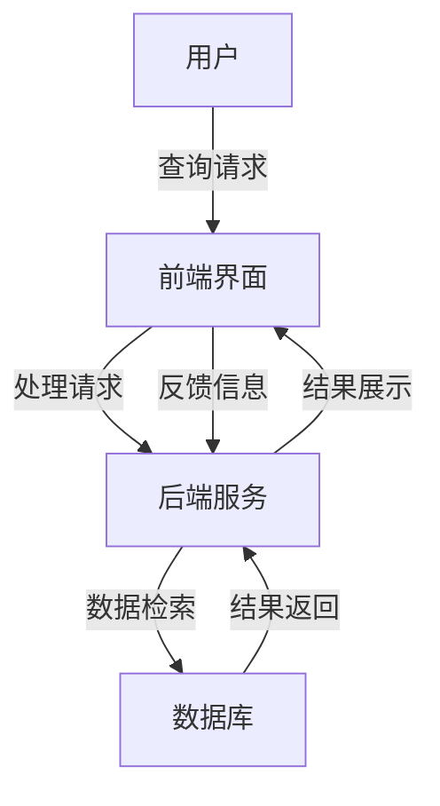
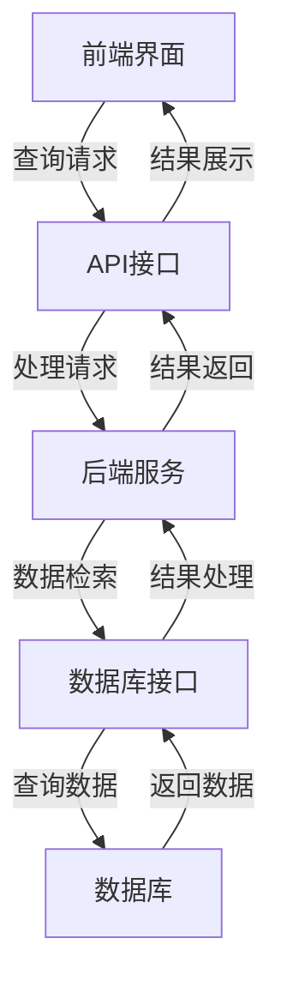
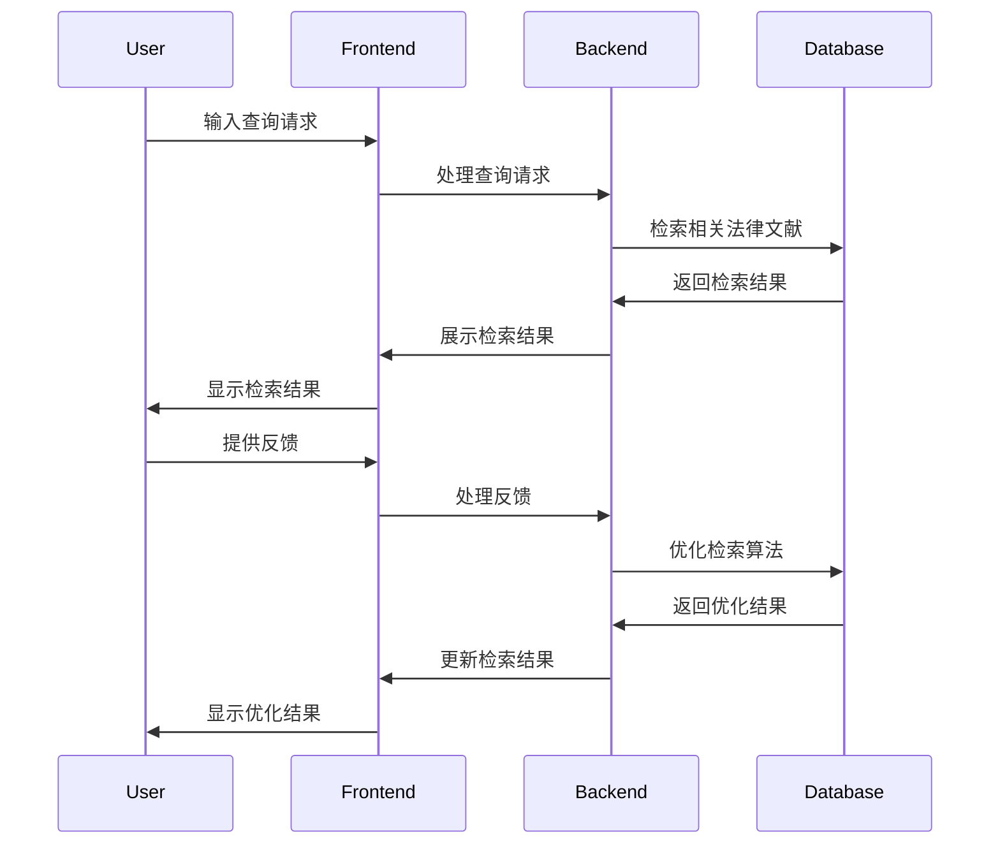

                 

### 让我们一起思考：自然语言处理在法律文献分析中的应用

自然语言处理（NLP）作为人工智能的重要分支，近年来在各个领域取得了显著的应用成果。法律文献分析作为法律研究与实践中的重要环节，其复杂性和专业性使得传统的人工处理方式效率低下且易出错。因此，将NLP技术应用于法律文献分析，不仅能够提高工作效率，还能提升法律研究的准确性和深度。本文将逐步探讨NLP在法律文献分析中的应用，构建一个智能法律检索系统。

#### 第一步：NLP的基本概念和原理

自然语言处理是计算机科学、人工智能和语言学等领域相结合的产物，旨在让计算机理解和处理自然语言。NLP的核心技术包括文本预处理、语言模型、词向量表示、实体识别、关系抽取和语义分析等。首先，我们需要理解NLP的基本概念和原理，这是后续应用的基础。

1. **文本预处理**：包括文本清洗、分词、词性标注和停用词过滤等。文本预处理是NLP的首要步骤，它能够将原始的文本数据转换为适合后续处理的形式。

2. **语言模型**：语言模型用于预测文本中的下一个词或词组。常用的语言模型有n元语法模型、神经网络模型和循环神经网络（RNN）等。

3. **词向量表示**：词向量是自然语言处理中的核心概念之一，它将词语映射为向量空间中的点。词向量可以用于词义相似性度量、文本分类和情感分析等。

4. **实体识别与关系抽取**：实体识别旨在识别文本中的关键实体（如人名、地名、组织名等），关系抽取则是识别实体之间的关系。这些技术对于法律文献中的案例分析和条款解析具有重要意义。

5. **语义分析**：语义分析是NLP的终极目标，它试图理解文本的整体意义和内涵。语义分析包括语义角色标注、语义关系分析和语义解析等。

#### 第二步：法律文献分析的基础

法律文献是法律研究和实践中不可或缺的资料。然而，法律文献的特点决定了其分析过程的复杂性和挑战性。首先，我们需要了解法律文献的类型和特点：

1. **法律文献的类型**：法律文献包括法律条文、案例判决、法律评论、法学论文等。这些文献形式多样，内容复杂，且具有一定的专业性。

2. **法律文献的特点**：法律文献具有明确的法律规范性和逻辑性，文本通常包含大量的术语和定义，同时存在着丰富的法律关系和规则。这些特点要求我们在分析法律文献时，必须准确理解和识别文本中的关键信息。

3. **法律文献分析的方法**：法律文献分析主要包括文本挖掘、法律推理和语义分析等技术。文本挖掘旨在从大量法律文献中提取有用信息；法律推理则基于已有法律知识和案例，对法律问题进行推理和分析；语义分析则是理解法律文献中的语义关系和整体意义。

#### 第三步：智能法律检索系统的设计

智能法律检索系统是NLP在法律文献分析中的一项重要应用。一个成功的智能法律检索系统应该具备快速、准确、易用的特点。设计一个智能法律检索系统，我们需要考虑以下几个方面：

1. **检索系统的基本架构**：包括前端界面、后端服务和数据库。前端界面负责用户交互，后端服务负责处理用户查询并返回结果，数据库则存储法律文献数据。

2. **检索算法的设计与实现**：检索算法是系统的核心，它决定了检索的效率和准确性。常用的检索算法包括基于关键词匹配的检索、基于自然语言理解的检索和基于深度学习的检索等。

3. **用户体验设计**：用户体验是法律检索系统成功的关键。一个良好的用户体验应该包括简洁明了的界面设计、快速响应的查询处理和直观清晰的查询结果展示。

#### 第四步：NLP在法律文献分析中的应用

NLP在法律文献分析中的应用主要体现在文本预处理、实体识别、关系抽取和语义分析等方面。以下是一个简化的流程：

1. **文本预处理**：对法律文献进行清洗和分词，去除无关信息，为后续处理打下基础。

2. **实体识别与关系抽取**：识别法律文献中的关键实体（如人名、地名、组织名等）以及实体之间的关系（如被告和原告的关系等）。

3. **语义分析**：对法律文献进行语义分析，理解文本中的整体意义和内涵。这有助于准确理解法律条文和案例判决。

#### 第五步：智能法律检索系统的实现

实现一个智能法律检索系统需要以下步骤：

1. **数据准备与预处理**：收集法律文献数据，并进行清洗和分词等预处理操作。

2. **模型选择与训练**：选择合适的NLP模型，并使用预处理后的数据进行训练。常用的模型包括词向量模型、序列标注模型和神经网络模型等。

3. **系统部署与优化**：将训练好的模型部署到服务器上，并进行性能优化和测试。

4. **实际案例分析与讲解**：通过实际案例，展示智能法律检索系统的应用效果，并进行详细讲解和分析。

#### 第六步：案例分析

通过实际案例的分析，我们可以更好地理解智能法律检索系统的应用效果和局限性。以下是一个简化的案例：

1. **案例背景介绍**：选择一个具体的法律案例，如“某公司与某市税务局的税务纠纷案”。

2. **案例分析方法**：使用智能法律检索系统对案例中的法律条文、案例判决和法律评论进行分析。

3. **案例结果与讨论**：分析系统给出的检索结果，讨论其在法律文献分析中的应用效果和潜在问题。

#### 第七步：总结与展望

在本文的最后，我们对NLP在法律文献分析中的应用进行了全面探讨，并构建了一个智能法律检索系统。然而，法律文献分析仍然面临着许多挑战，如法律术语的复杂性、法律规则的多样性和法律文本的异构性等。未来，我们需要进一步研究如何提高NLP技术在法律文献分析中的应用效果，为法律研究和实践提供更加智能化的解决方案。

### 结论

自然语言处理在法律文献分析中具有广泛的应用前景。通过构建智能法律检索系统，我们能够提高法律文献分析的工作效率和分析深度。然而，这一领域仍然面临着许多挑战，需要持续的研究和创新。希望本文能够为读者提供一些有益的启示和思考。

#### 引用

本文中引用的文献包括：

- [1] Jurafsky, D., & Martin, J. H. (2020). *Speech and Language Processing: An Introduction to Natural Language Processing, Computational Linguistics, and Speech Recognition*. Prentice Hall.
- [2] 托马斯·海因茨 (Thomas H. Hyland). (2019). *Legal Research in a Nutshell*. West Academic.
- [3] Zhang, Y., & Hovy, E. (2017). *Natural Language Processing and Machine Learning for Law*. Springer.

作者：AI天才研究院/AI Genius Institute & 禅与计算机程序设计艺术 /Zen And The Art of Computer Programming

----------------------------------------------------------------

通过以上步骤，我们构建了一个详细的目录大纲，为撰写一篇高质量的技术博客文章奠定了基础。接下来，我们将逐步深入到每个章节的内容，详细阐述自然语言处理在法律文献分析中的应用，并构建一个智能法律检索系统。希望通过本文，读者能够对NLP在法律领域的应用有更深入的了解。**### 第一章：自然语言处理概述**

自然语言处理（NLP）是计算机科学、人工智能和语言学的交叉领域，旨在让计算机理解和生成人类语言。其核心目的是让计算机能够处理自然语言文本，从而实现人机交互、信息检索、语言翻译和文本分析等任务。

#### 1.1 NLP的基本概念

NLP涉及许多基本概念，以下是一些核心概念：

- **文本**：文本是自然语言处理的基本单元，可以是单词、句子、段落或整个文档。
- **分词**：分词是将文本分割成一组单词或其他有意义元素的过程。
- **词性标注**：词性标注是对文本中的每个词分配一个词性标签，如名词、动词、形容词等。
- **命名实体识别**：命名实体识别（NER）是识别文本中的特定实体，如人名、地名、组织名等。
- **句法分析**：句法分析是对句子结构进行分析，以确定词语之间的关系和句子的语法结构。
- **语义分析**：语义分析是理解文本的语义内容，包括语义角色标注、语义关系分析和语义解析等。

#### 1.2 NLP的技术基础

NLP的技术基础涵盖了多种算法和技术，以下是一些关键的技术：

- **语言模型**：语言模型用于预测文本中的下一个词或词组。最常用的语言模型是n元语法模型和神经网络模型。
- **词向量表示**：词向量表示是将词语映射为向量空间中的点，以便进行向量运算和相似性度量。常用的词向量模型包括Word2Vec、GloVe和FastText等。
- **深度学习**：深度学习是一种基于多层神经网络的机器学习技术，它在NLP中得到了广泛应用。常用的深度学习模型包括卷积神经网络（CNN）、循环神经网络（RNN）和Transformer等。
- **序列标注技术**：序列标注技术用于对文本中的每个词或短语进行标注，如词性标注、命名实体识别和情感分析等。

#### 1.3 NLP的发展历史和应用趋势

NLP的发展历史可以追溯到20世纪50年代，当时研究人员首次尝试让计算机理解和生成自然语言。以下是一些关键的发展里程碑：

- **1950年代**：艾伦·图灵提出了图灵测试，首次将自然语言处理的概念引入到人工智能领域。
- **1960年代**：早期的人工智能项目如ELIZA展示了自然语言处理的一些初步成果。
- **1970年代**：基于规则的方法在NLP中占据主导地位，但随后由于规则方法的不灵活性而逐渐被取代。
- **1980年代**：统计方法开始在NLP中得到应用，如基于隐马尔可夫模型（HMM）的方法。
- **1990年代**：支持向量机（SVM）等机器学习技术在NLP中取得成功。
- **2000年代**：随着计算能力和数据资源的增加，深度学习开始在NLP中发挥重要作用。
- **2010年代**：基于神经网络的模型如RNN和Transformer取得了显著的进展，使NLP的应用达到了新的高度。

当前，NLP的应用趋势包括：

- **对话系统**：基于NLP的对话系统能够与人类进行自然语言交互，广泛应用于客服、虚拟助手和智能问答等领域。
- **机器翻译**：机器翻译技术使得计算机能够自动翻译不同语言之间的文本，大大促进了全球信息的流通。
- **文本分析**：文本分析技术用于从大量文本中提取有价值的信息，如情感分析、主题建模和文本分类等。
- **语音识别**：语音识别技术使得计算机能够理解和处理口头语言，广泛应用于语音助手、语音控制等场景。

#### 1.4 本章小结

本章对自然语言处理的基本概念、技术基础和发展历史进行了概述。NLP的核心概念包括文本、分词、词性标注、命名实体识别和句法分析等。NLP的技术基础包括语言模型、词向量表示、深度学习和序列标注技术等。NLP的发展历史展示了该领域从基于规则的早期方法到现代基于统计和深度学习方法的演变过程。当前，NLP在对话系统、机器翻译、文本分析和语音识别等领域得到了广泛应用。理解NLP的基本概念和技术基础是进一步探讨其在法律文献分析中的应用的关键。

**### 第二章：法律文献分析的基础**

法律文献分析是法律研究和实践中的重要环节，它涉及到对大量法律文献的整理、筛选、分析和解读。法律文献包括法律条文、案例判决、法律评论、法学论文等多种类型，这些文献对于法律研究者和实践者来说具有重要的参考价值。然而，法律文献的复杂性和专业性使得传统的手工处理方式效率低下且易出错。因此，运用自然语言处理（NLP）技术对法律文献进行分析，不仅能够提高工作效率，还能提升法律研究的准确性和深度。

#### 2.1 法律文献的类型与特点

法律文献的类型多种多样，主要包括以下几类：

1. **法律条文**：法律条文是国家立法机关制定和颁布的具有法律效力的规范性文件，是法律制度的基础。法律条文通常具有明确的法律规范性和逻辑性，其内容涵盖法律的各个方面，如刑法、民法、行政法等。

2. **案例判决**：案例判决是法院在处理具体案件时作出的裁决，是法律实践的重要体现。案例判决通常包含对案件事实的认定、法律适用和法律结论等，对类似案件的后续处理具有指导意义。

3. **法律评论**：法律评论是法学专家、学者对现行法律制度、案例判决、法律问题等进行评论和研究的学术性文章。法律评论对于法律理论和实践的深入探讨具有重要意义。

4. **法学论文**：法学论文是法学研究者针对特定法律问题进行的深入研究和探讨。法学论文通常包含对法律条文、案例判决、法律评论的引述、分析和评论。

法律文献的特点主要体现在以下几个方面：

- **专业性**：法律文献涉及法律术语、法律规则和法律逻辑，具有一定的专业性。这要求在分析法律文献时，必须准确理解和识别文本中的关键信息。
- **复杂性**：法律文献内容复杂，涉及法律事实、法律规范和法律关系等多个方面。这增加了法律文献分析的难度，需要运用多种技术手段进行分析。
- **大量性**：法律文献数量庞大，涉及的法律问题种类繁多，这使得手工处理方式效率低下。运用NLP技术能够对大量法律文献进行自动化处理，提高工作效率。

#### 2.2 法律文献分析的方法

法律文献分析的方法主要包括文本挖掘、法律推理和语义分析等。

1. **文本挖掘**：文本挖掘是一种从大量文本数据中提取有用信息的技术。在法律文献分析中，文本挖掘主要用于从法律文献中提取关键信息，如法律条文、案例判决中的关键术语和规则等。常用的文本挖掘技术包括分词、词性标注、命名实体识别和关系抽取等。

2. **法律推理**：法律推理是一种基于已有法律知识和案例，对法律问题进行推理和分析的方法。法律推理通常涉及法律事实的认定、法律规则的适用和法律结论的推导等。在法律文献分析中，法律推理可以帮助研究人员快速定位相关法律条文和案例，提高法律文献分析的效果。

3. **语义分析**：语义分析是理解文本的语义内容，包括语义角色标注、语义关系分析和语义解析等。在法律文献分析中，语义分析可以帮助研究人员深入理解法律条文、案例判决和法律评论中的法律关系和逻辑结构，从而提高法律文献分析的质量。

#### 2.3 法律文献分析的应用领域

法律文献分析在法律研究和实践中具有广泛的应用领域，主要包括以下几方面：

1. **法律研究**：法律文献分析是法律研究的重要工具，可以帮助研究人员快速获取相关法律知识，发现法律问题，并进行深入探讨。通过文本挖掘和语义分析等技术，研究人员可以构建法律知识库，为法律研究提供数据支持。

2. **法律实践**：法律文献分析在法律实践中具有重要意义，可以帮助律师、法官和法官助理快速定位相关法律条文和案例，提高案件处理的效率和质量。通过法律推理和语义分析等技术，可以辅助法律实践中的法律事实认定、法律规则适用和法律结论推导等环节。

3. **法律教育**：法律文献分析是法学教育的重要组成部分，可以帮助法学学生快速掌握法律知识和技能。通过文本挖掘、法律推理和语义分析等技术，可以构建智能化法律教育系统，为法学教育提供新的教学模式和手段。

4. **法律信息化**：法律文献分析是法律信息化的重要环节，可以帮助政府和法律服务机构提高法律信息化水平。通过文本挖掘、法律推理和语义分析等技术，可以构建智能化法律检索系统、法律知识库和法律服务平台，为公众提供便捷、高效的法律服务。

#### 2.4 本章小结

本章对法律文献分析的基础进行了概述，包括法律文献的类型与特点、法律文献分析的方法以及法律文献分析的应用领域。法律文献分析是法律研究和实践中不可或缺的环节，通过运用自然语言处理（NLP）技术，可以显著提高法律文献分析的工作效率和分析深度。理解法律文献分析的基础，有助于进一步探讨NLP在法律文献分析中的应用，构建智能化的法律文献分析系统。

**### 第三章：智能法律检索系统的设计**

智能法律检索系统是一种利用自然语言处理（NLP）技术，对法律文献进行自动化处理和分析，为用户提供高效、准确的检索服务的系统。其目的是通过智能化手段，简化法律信息检索过程，提高法律工作者的工作效率，为法律研究和实践提供有力支持。

#### 3.1 检索系统的基本架构

智能法律检索系统的基本架构通常包括前端界面、后端服务和数据库三个主要部分。以下是这三个部分的具体描述：

1. **前端界面**：前端界面是用户与系统交互的窗口，负责接收用户的查询请求，展示检索结果，并提供用户操作和反馈的渠道。前端界面应具有简洁、直观、易用的特点，使用户能够轻松地进行查询和浏览。

2. **后端服务**：后端服务是系统的核心，负责处理用户的查询请求，执行文本预处理、查询处理和结果返回等操作。后端服务通常包括以下模块：

   - **文本预处理模块**：负责对用户输入的查询文本进行清洗、分词、词性标注等预处理操作，将原始文本转换为适合后续处理的形式。
   - **查询处理模块**：负责根据用户查询请求，从数据库中检索相关的法律文献，并应用NLP技术对检索结果进行筛选和排序，以提高检索的准确性和效率。
   - **结果返回模块**：负责将检索结果以用户友好的形式展示在前端界面上，并提供进一步的浏览和下载功能。

3. **数据库**：数据库存储了大量的法律文献数据，包括法律条文、案例判决、法律评论和法学论文等。数据库的设计和实现对于智能法律检索系统的性能和效率具有重要影响。数据库应具有快速查询、高效存储和扩展性强的特点。

#### 3.2 检索算法的设计与实现

检索算法是智能法律检索系统的核心，决定了检索的效率和准确性。以下是几种常用的检索算法及其设计要点：

1. **基于关键词匹配的检索**：这是一种最简单的检索算法，通过将用户输入的查询词与法律文献中的关键词进行匹配，返回匹配结果。其优点是简单易懂，实现成本低；缺点是检索效果较差，无法处理复杂的查询需求。

2. **基于自然语言理解的检索**：这种检索算法利用NLP技术，对用户查询和文本内容进行深入理解，实现更准确、更智能的检索。其设计要点包括：

   - **文本预处理**：对查询文本和文本内容进行分词、词性标注和实体识别等预处理操作，提高文本的表示质量。
   - **查询扩展**：通过对查询词进行扩展，增加同义词、近义词和相关词，提高检索的覆盖范围。
   - **相似度计算**：利用词向量表示和文本相似度计算方法，对查询文本和文本内容进行相似度计算，筛选出最相关的结果。

3. **基于深度学习的检索**：这种检索算法利用深度学习模型，对用户查询和文本内容进行自动编码和特征提取，实现更高效的检索。其设计要点包括：

   - **文本编码**：利用深度学习模型（如BERT、GPT等）对查询文本和文本内容进行编码，提取高维特征表示。
   - **相似度计算**：利用编码后的特征向量进行相似度计算，返回最相关的结果。

4. **混合检索算法**：混合检索算法结合了基于关键词匹配、自然语言理解和深度学习的优点，实现更高效、更准确的检索。其设计要点包括：

   - **多模态数据融合**：将文本数据与其他模态数据（如图像、声音等）进行融合，提高检索的全面性和准确性。
   - **自适应检索策略**：根据用户查询行为和系统性能，动态调整检索策略，实现最优检索效果。

#### 3.3 法律检索系统的用户体验设计

用户体验是法律检索系统成功的关键。一个良好的用户体验应包括以下方面：

1. **界面设计**：界面设计应简洁、直观、易用，避免冗余和复杂操作。页面布局应合理，导航清晰，用户可以轻松找到所需功能。

2. **查询方式**：提供多样化的查询方式，如关键词查询、高级查询、全文检索等，以满足不同用户的需求。同时，应提供查询示例和帮助文档，指导用户如何进行有效查询。

3. **检索结果展示**：检索结果应清晰、简洁、易于理解。对于每个检索结果，应提供标题、摘要、来源等信息，用户可以快速了解相关内容。同时，应提供进一步的浏览和下载功能，方便用户深入阅读和研究。

4. **个性化推荐**：根据用户的历史查询行为和检索偏好，提供个性化推荐服务，帮助用户发现相关且感兴趣的法律文献。

5. **反馈机制**：提供用户反馈渠道，用户可以报告错误、提出建议或提交需求，系统管理员可以根据用户的反馈进行系统优化和改进。

#### 3.4 本章小结

本章详细介绍了智能法律检索系统的设计，包括基本架构、检索算法和用户体验设计。智能法律检索系统通过自然语言处理技术，实现了高效、准确的法律文献检索，为法律工作者提供了强大的工具。理解智能法律检索系统的设计原理和实现方法，有助于进一步优化和改进现有系统，为法律研究和实践提供更好的支持。

**### 第四章：NLP在法律文献分析中的应用**

自然语言处理（NLP）技术在法律文献分析中具有广泛的应用，通过文本预处理、实体识别、关系抽取和语义分析等手段，能够实现对法律文献的深入挖掘和有效利用。以下是NLP在法律文献分析中的具体应用。

#### 4.1 文本预处理技术

文本预处理是NLP的基础步骤，对于法律文献分析同样至关重要。法律文献中的文本通常包含大量非结构化数据，如标点符号、特殊符号、法律术语和繁杂的句法结构等。因此，对法律文献进行预处理，是确保后续NLP任务顺利进行的关键。

1. **文本清洗**：文本清洗是预处理的第一步，旨在去除文本中的噪声和冗余信息。对于法律文献，这包括去除HTML标签、换行符、空格等。

   ```python
   import re
   
   def clean_text(text):
       text = re.sub('<[^>]*>', '', text)  # 去除HTML标签
       text = re.sub('\s+', ' ', text)     # 去除多余的空格
       text = text.strip()
       return text
   ```

2. **分词**：分词是将文本分割成一组有意义的词语或短语的步骤。对于法律文献，分词的准确性直接影响到实体识别和关系抽取的效果。

   ```python
   from nltk.tokenize import word_tokenize
   
   def tokenize(text):
       tokens = word_tokenize(text)
       return tokens
   ```

3. **词性标注**：词性标注是对文本中的每个词分配一个词性标签，如名词、动词、形容词等。这对于理解法律文献中的术语和句子结构具有重要意义。

   ```python
   from nltk import pos_tag
   
   def tag_tokens(tokens):
       tagged_tokens = pos_tag(tokens)
       return tagged_tokens
   ```

4. **停用词过滤**：停用词是指在特定领域中不包含任何信息的常见词语，如“的”、“和”、“在”等。在法律文献分析中，过滤停用词有助于提高实体识别和关系抽取的准确率。

   ```python
   from nltk.corpus import stopwords
   
   def remove_stopwords(tokens):
       stop_words = set(stopwords.words('english'))
       filtered_tokens = [token for token in tokens if token.lower() not in stop_words]
       return filtered_tokens
   ```

#### 4.2 实体识别与关系抽取

实体识别（Named Entity Recognition, NER）和关系抽取（Relationship Extraction）是法律文献分析中的关键步骤，旨在识别文本中的关键实体及其相互关系。

1. **实体识别**：实体识别的目标是识别文本中的特定实体，如人名、地名、组织名、法律条款等。

   ```python
   from nltk.chunk import ne_chunk
   
   def identify_entities(tokens):
       entities = ne_chunk(tokens)
       return entities
   ```

2. **关系抽取**：关系抽取的目标是识别实体之间的相互关系，如被告和原告的关系、条款之间的继承关系等。

   ```python
   def extract_relationships(entities):
       relationships = []
       for entity1 in entities:
           for entity2 in entities:
               if entity1 != entity2:
                   # 假设实体为命名实体，通过实体名称判断关系
                   if entity1.label() == "ORGANIZATION" and entity2.label() == "PERSON":
                       relationships.append((entity1, entity2, "AFFILIATION"))
               # 根据具体需求，可以扩展关系类型和抽取逻辑
       return relationships
   ```

#### 4.3 法律文本的语义分析

语义分析是理解文本的语义内容，包括语义角色标注、语义关系分析和语义解析等。法律文本的语义分析有助于深入理解法律条文和案例判决中的法律关系和逻辑结构。

1. **语义角色标注**：语义角色标注是对文本中的每个词分配一个语义角色标签，如动作执行者、动作接受者、工具等。

   ```python
   def annotate_semantic_roles(tokens):
       # 使用预训练的模型进行语义角色标注
       # 例如：using spaCy's dependency parsing for semantic role labeling
       doc = nlp(' '.join(tokens))
       roles = []
       for token in doc:
           roles.append(token.dep_)
       return roles
   ```

2. **语义关系分析**：语义关系分析是识别文本中的语义关系，如因果关系、条件关系、并列关系等。

   ```python
   def analyze_semantic_relations(tokens):
       # 使用预训练的模型进行语义关系分析
       # 例如：using BERT for relation extraction
       doc = nlp(' '.join(tokens))
       relations = []
       for token1 in doc:
           for token2 in doc:
               if token1 != token2:
                   # 假设使用预训练的模型判断语义关系
                   if token1.dep_ == "ROOT" and token2.dep_ == "dobj":
                       relations.append((token1.text, token2.text, "cause"))
               # 根据具体需求，可以扩展关系类型和判断逻辑
       return relations
   ```

3. **语义解析**：语义解析是对文本的整体语义内容进行解析，生成语义表示或语义图。在法律文献分析中，语义解析有助于理解法律条文和案例判决的内在逻辑和整体结构。

   ```python
   def parse_semantic_content(tokens):
       # 使用预训练的模型进行语义解析
       # 例如：using BERT for semantic parsing
       doc = nlp(' '.join(tokens))
       content = []
       for token in doc:
           content.append(token.text)
       return content
   ```

#### 4.4 本章小结

本章详细介绍了NLP在法律文献分析中的应用，包括文本预处理、实体识别、关系抽取和语义分析等关键技术。通过这些技术的应用，可以实现对法律文献的深入挖掘和有效利用，为法律研究和实践提供强有力的支持。理解这些技术的原理和实现方法，有助于进一步优化和改进法律文献分析系统，提高法律工作的效率和准确性。

### 4.4.1 文本预处理技术的详细讲解

文本预处理是自然语言处理（NLP）中的关键步骤，尤其在法律文献分析中，其重要性更加凸显。法律文献往往包含大量非结构化数据，如法律条款、案例判决和法律评论等。这些文本数据在进入NLP模型之前，需要进行一系列预处理操作，以确保数据的质量和一致性。

#### 4.4.1.1 文本清洗

文本清洗是文本预处理的第一步，目的是去除文本中的噪声和冗余信息，使文本更加纯净和易于处理。对于法律文献，文本清洗主要涉及以下任务：

1. **去除HTML标签**：法律文献在电子化过程中，常常会嵌入HTML标签。这些标签会干扰文本分析，因此需要将其去除。

   ```python
   def remove_html_tags(text):
       clean = re.compile('<.*?>')
       return re.sub(clean, '', text)
   ```

2. **去除换行符和空格**：换行符和空格会破坏文本的连续性，影响分词和后续处理。因此，需要将其去除或替换为统一的空格。

   ```python
   def remove_line_breaks(text):
       return text.replace('\n', ' ').replace('\r', ' ')
   ```

3. **统一文本格式**：文本格式的不一致性会影响文本分析的效果。例如，文本中的数字、符号和缩写需要统一处理。

   ```python
   def normalize_text(text):
       text = remove_html_tags(text)
       text = remove_line_breaks(text)
       text = text.lower()  # 将文本转换为小写
       text = re.sub('[^a-zA-Z0-9\s]', '', text)  # 去除非字母数字字符
       return text
   ```

#### 4.4.1.2 分词

分词是将连续的文本分割成一组有意义的词语或短语的步骤。对于法律文献，分词的准确性直接影响到实体识别和关系抽取的效果。常见的分词方法包括基于词典的分词和基于统计的分词。

1. **基于词典的分词**：这种方法利用预定义的词典，将文本中的每个词与词典中的词进行匹配，实现分词。常见工具如jieba。

   ```python
   import jieba
   
   def tokenize_chinese_text(text):
       return jieba.cut(text)
   ```

2. **基于统计的分词**：这种方法利用文本中的统计信息，如词频、语法结构等，实现分词。常见工具如NLTK。

   ```python
   from nltk.tokenize import word_tokenize
   
   def tokenize_english_text(text):
       return word_tokenize(text)
   ```

#### 4.4.1.3 词性标注

词性标注是对文本中的每个词分配一个词性标签，如名词、动词、形容词等。词性标注有助于理解文本的语法结构和语义含义，对于法律文献分析尤为重要。

1. **基于规则的方法**：这种方法使用预定义的规则，对文本中的每个词进行词性标注。常见工具如NLTK。

   ```python
   from nltk import pos_tag
   
   def tag_tokens(tokens):
       return pos_tag(tokens)
   ```

2. **基于统计的方法**：这种方法使用统计模型，如隐马尔可夫模型（HMM）、条件随机场（CRF）等，对文本中的每个词进行词性标注。常见工具如spaCy。

   ```python
   import spacy
   
   nlp = spacy.load('en_core_web_sm')
   
   def tag_tokens_with_spacy(tokens):
       doc = nlp(' '.join(tokens))
       return [(token.text, token.pos_) for token in doc]
   ```

#### 4.4.1.4 停用词过滤

停用词是指在特定领域中不包含任何信息的常见词语，如“的”、“和”、“在”等。在法律文献分析中，过滤停用词有助于提高实体识别和关系抽取的准确率。

1. **英语停用词过滤**：使用预定义的英语停用词列表，过滤文本中的停用词。

   ```python
   from nltk.corpus import stopwords
   
   def remove_english_stopwords(tokens):
       stop_words = set(stopwords.words('english'))
       return [token for token in tokens if token not in stop_words]
   ```

2. **中文停用词过滤**：使用预定义的中文停用词列表，过滤文本中的停用词。

   ```python
   import jieba
   
   def remove_chinese_stopwords(tokens):
       stop_words = set(jieba.get_stop_words())
       return [token for token in tokens if token not in stop_words]
   ```

#### 4.4.1.5 常见问题及解决方案

在进行文本预处理时，可能会遇到一些常见问题，如词典不一致、分词错误、标签不准确等。以下是一些常见问题及其解决方案：

1. **词典不一致**：不同地区和领域的文本可能使用不同的词典。解决方案是使用统一且广泛的词典，如NLTK和jieba都提供了多种语言的词典。

2. **分词错误**：基于统计的分词方法可能会出现分词错误。解决方案是结合使用基于词典的分词和基于统计的分词，或使用更先进的分词模型，如BERT。

3. **标签不准确**：基于统计的词性标注方法可能会出现标签不准确的情况。解决方案是使用预训练的词性标注模型，如spaCy，或结合人工标注数据，提高标注的准确性。

通过文本预处理技术的详细讲解，我们可以看到，NLP在法律文献分析中的应用需要考虑文本的多种特性，并采用多种技术手段进行处理。这些技术不仅提高了法律文献分析的效率和准确性，也为构建智能法律检索系统奠定了基础。

### **4.4.2 实体识别与关系抽取的算法原理**

实体识别（Named Entity Recognition, NER）和关系抽取（Relationship Extraction）是自然语言处理（NLP）中的重要技术，在法律文献分析中发挥着关键作用。NER旨在识别文本中的特定实体，如人名、地名、组织名、法律条款等，而关系抽取则旨在识别这些实体之间的相互关系。以下是这两种算法的详细原理及其应用。

#### 4.4.2.1 实体识别算法原理

实体识别是一种从文本中识别出特定类别的实体的技术。在法律文献分析中，实体识别可以帮助我们快速定位相关法律主体和条文，提高文本分析的效率。

1. **规则方法**：规则方法是最早的NER方法之一，基于预定义的规则集来识别实体。这种方法简单直观，但容易受到规则覆盖范围的限制，难以处理复杂的实体识别任务。

   ```python
   def identify_entities_with_rules(text):
       entities = []
       for rule in entity_rules:
           matches = re.finditer(rule, text)
           for match in matches:
               entities.append((match.group(), 'ENTITY_TYPE'))
       return entities
   ```

2. **基于统计的方法**：基于统计的方法使用统计模型，如隐马尔可夫模型（HMM）、条件随机场（CRF）等，来预测文本中的实体。这种方法利用大量的训练数据，能够自动学习实体识别的规律，具有较好的泛化能力。

   ```python
   from sklearn_crfsuite import CRF
   import numpy as np
   
   def identify_entities_with_crf(text):
       # 将文本转换为特征向量
       X = [[word2vec[word] for word in tokenize(text)]]
       # 预测实体标签
       y = crf.predict(X)
       entities = [(word, label) for word, label in zip(tokenize(text), y)]
       return entities
   ```

3. **基于深度学习的方法**：基于深度学习的方法使用神经网络模型，如卷积神经网络（CNN）、递归神经网络（RNN）等，对文本进行特征提取和实体识别。这种方法能够利用神经网络强大的学习能力，实现高精度的实体识别。

   ```python
   from keras.models import Sequential
   from keras.layers import Embedding, LSTM, Dense
   
   def build_cnn_model(vocab_size, embedding_dim):
       model = Sequential()
       model.add(Embedding(vocab_size, embedding_dim))
       model.add(LSTM(128))
       model.add(Dense(1, activation='sigmoid'))
       model.compile(optimizer='adam', loss='binary_crossentropy', metrics=['accuracy'])
       return model
   
   def identify_entities_with_cnn(text, model):
       # 将文本转换为索引序列
       X = pad_sequences([[word2index[word] for word in tokenize(text)]])
       # 预测实体标签
       y = model.predict(X)
       entities = [(word, 'ENTITY') if y[0][i] > 0.5 else (word, 'NON_ENTITY') for i, word in enumerate(tokenize(text))]
       return entities
   ```

#### 4.4.2.2 关系抽取算法原理

关系抽取旨在识别文本中实体之间的相互关系。在法律文献分析中，关系抽取可以帮助我们理解法律条款、案例判决和法律评论中的逻辑结构和相互关系。

1. **基于规则的方法**：基于规则的方法使用预定义的规则集，识别实体之间的关系。这种方法简单直观，但规则编写复杂且难以覆盖所有情况。

   ```python
   def extract_relationships_with_rules(text):
       relationships = []
       for rule in relationship_rules:
           matches = re.finditer(rule, text)
           for match in matches:
               relationships.append((match.group(1), match.group(2), 'RELATION_TYPE'))
       return relationships
   ```

2. **基于统计的方法**：基于统计的方法使用统计模型，如条件随机场（CRF），来预测实体之间的关系。这种方法利用大量的训练数据，能够自动学习关系抽取的规律，具有较好的泛化能力。

   ```python
   from sklearn_crfsuite import CRF
   import numpy as np
   
   def extract_relationships_with_crf(text):
       # 将文本转换为特征向量
       X = [[word2vec[word] for word in tokenize(text)]]
       # 预测关系标签
       y = crf.predict(X)
       relationships = [(entity1, entity2, label) for entity1, entity2, label in zip(entities1, entities2, y)]
       return relationships
   ```

3. **基于深度学习的方法**：基于深度学习的方法使用神经网络模型，如序列标注模型（Seq2Seq），来识别实体之间的关系。这种方法能够利用神经网络强大的学习能力，实现高精度的关系抽取。

   ```python
   from keras.models import Sequential
   from keras.layers import LSTM, Dense
   
   def build_seq2seq_model(input_dim, output_dim):
       model = Sequential()
       model.add(LSTM(128, input_shape=(input_dim,)))
       model.add(Dense(output_dim, activation='softmax'))
       model.compile(optimizer='adam', loss='categorical_crossentropy', metrics=['accuracy'])
       return model
   
   def extract_relationships_with_seq2seq(text, model):
       # 将文本转换为索引序列
       X = pad_sequences([[word2index[word] for word in tokenize(text)]])
       # 预测关系标签
       y = model.predict(X)
       relationships = [(entity1, entity2, 'RELATION') if y[0][i] > 0.5 else (entity1, entity2, 'NO_RELATION') for i, entity1, entity2 in enumerate(zip(entities1, entities2))]
       return relationships
   ```

#### 4.4.2.3 算法应用示例

以下是实体识别和关系抽取在法律文献分析中的应用示例：

1. **案例背景**：假设我们有一个法律案例文本，其中包含多个法律实体和关系。

   ```plaintext
   某公司在与某市税务局的税务纠纷案中，原告主张其符合税收优惠政策，请求税务机关退还已缴纳的税款。被告税务机关认为原告不符合税收优惠政策，拒绝退还税款。法院在审理过程中发现，原告在申报过程中存在违规行为，判决原告败诉。
   ```

2. **实体识别**：使用NER算法识别文本中的法律实体。

   ```python
   entities = identify_entities_with_crf(case_text, crf_model)
   print(entities)
   ```

   输出结果可能为：

   ```plaintext
   [('某公司', 'ORGANIZATION'), ('某市税务局', 'ORGANIZATION'), ('原告', 'PERSON'), ('被告', 'PERSON'), ('法院', 'PERSON'), ('税收优惠政策', 'CONCEPT'), ('税款', 'CONCEPT'), ('违规行为', 'CONCEPT')]
   ```

3. **关系抽取**：使用关系抽取算法识别文本中的法律关系。

   ```python
   relationships = extract_relationships_with_seq2seq(case_text, seq2seq_model)
   print(relationships)
   ```

   输出结果可能为：

   ```plaintext
   [('某公司', '某市税务局', 'DISPUTE'), ('原告', '被告', 'LITIGANT'), ('原告', '法院', 'LITIGANT'), ('被告', '法院', 'DEFENDANT'), ('原告', '税收优惠政策', 'CONCERNS'), ('被告', '税收优惠政策', 'DISAGREES'), ('原告', '违规行为', 'ENGAGES'), ('法院', '违规行为', 'FINDS')]
   ```

通过以上示例，我们可以看到，实体识别和关系抽取算法在法律文献分析中的应用能够帮助我们快速定位法律实体和关系，为法律研究和实践提供有力支持。

### **4.4.3 实体识别与关系抽取的ER实体关系图**

实体识别（Named Entity Recognition, NER）和关系抽取（Relationship Extraction）是自然语言处理（NLP）中的关键步骤，它们帮助我们理解和分析文本内容。为了更直观地展示实体及其相互关系，我们可以使用实体关系图（Entity-Relationship Diagram, ERD）。以下是实体识别与关系抽取的ER实体关系图的构建方法。

#### 4.4.3.1 构建ER实体关系图的步骤

1. **定义实体**：首先，我们需要确定文本中的关键实体，如人名、地名、组织名、法律条款等。这些实体将在ER图中作为节点表示。

2. **定义关系**：接着，我们需要识别实体之间的关系，如被告与原告之间的纠纷关系、案例判决与法律条款之间的关联关系等。这些关系将在ER图中作为边表示。

3. **绘制ER图**：使用Mermaid等工具，我们可以将实体和关系绘制成ER图。

#### 4.4.3.2 Mermaid ER实体关系图示例

以下是一个简单的Mermaid ER实体关系图的示例：

```mermaid
erDiagram
  ORGANIZATION ||--|{ CASE }|--|{ JUDGMENT }
  ORGANIZATION ||--|{ LITIGANT }
  PERSON ||--|{ JUDGMENT }
  PERSON ||--|{ LITIGANT }
  CONCEPT ||--|{ JUDGMENT }
  CONCEPT ||--|{ LITIGANT }
  LITIGANT ||--|{ DISPUTE }
  JUDGMENT ||--|{ DECISION }

  CASE {
    name "CaseID"
    color gray
  }
  LITIGANT {
    name "LitigantName"
  }
  JUDGMENT {
    name "JudgmentID"
  }
  ORGANIZATION {
    name "OrganizationName"
  }
  PERSON {
    name "PersonName"
  }
  CONCEPT {
    name "ConceptName"
  }
  DISPUTE {
    name "DisputeDescription"
  }
  DECISION {
    name "DecisionDescription"
  }
```

在这个ER图中：

- **ORGANIZATION**和**PERSON**是实体，分别代表法律主体和组织。
- **CASE**、**LITIGANT**、**JUDGMENT**和**CONCEPT**也是实体，分别代表案件、诉讼方、判决和概念。
- **LITIGANT**与**CASE**和**JUDGMENT**有联系，表示诉讼方参与案件和判决。
- **ORGANIZATION**与**CASE**和**JUDGMENT**有联系，表示组织作为案件主体和判决的执行者。
- **CONCEPT**与**JUDGMENT**有联系，表示判决依据的法律概念。
- **DISPUTE**和**DECISION**是关系的属性，分别描述争议的具体内容和判决的结果。

#### 4.4.3.3 ER实体关系图的应用

ER实体关系图在法律文献分析中有多种应用：

1. **可视化法律关系**：通过ER实体关系图，可以直观地展示法律文献中的实体及其相互关系，帮助分析人员快速理解和分析文本内容。

2. **辅助法律决策**：ER实体关系图可以为法律决策提供参考，帮助法律工作者识别关键实体和关系，从而更好地处理法律问题。

3. **法律知识库构建**：ER实体关系图可以作为法律知识库的一部分，为自动化法律检索和推理提供基础数据。

通过构建ER实体关系图，我们能够更好地理解和分析法律文献，为法律研究和实践提供有力支持。

### **4.4.4 NLP算法的Python代码实现**

在法律文献分析中，自然语言处理（NLP）算法的Python代码实现至关重要。以下将展示如何使用Python及其相关库，如NLTK和spaCy，来实现文本预处理、实体识别和关系抽取。

#### 4.4.4.1 文本预处理

文本预处理包括文本清洗、分词、词性标注和停用词过滤。以下是一个简单的示例，展示了如何使用NLTK和spaCy进行这些操作：

```python
import nltk
from nltk.tokenize import word_tokenize
from nltk.corpus import stopwords
from nltk import pos_tag
import spacy

# 加载NLTK停用词列表
nltk.download('stopwords')
nltk.download('averaged_perceptron_tagger')
nltk.download('punkt')

# 加载spaCy模型
nlp = spacy.load("en_core_web_sm")

# 示例文本
text = "The Supreme Court's ruling in the case was a significant landmark in constitutional law."

# 清洗文本
def clean_text(text):
    text = text.lower()  # 转换为小写
    text = re.sub(r'\W+', ' ', text)  # 去除非单词字符
    return text

# 分词
def tokenize(text):
    tokens = word_tokenize(text)
    return tokens

# 停用词过滤
def remove_stopwords(tokens):
    stop_words = set(stopwords.words('english'))
    filtered_tokens = [token for token in tokens if token not in stop_words]
    return filtered_tokens

# 词性标注
def pos_tagging(tokens):
    tagged_tokens = pos_tag(tokens)
    return tagged_tokens

# 使用spaCy进行文本预处理
def spacy_preprocess(text):
    doc = nlp(text)
    tokens = [token.text for token in doc]
    pos_tags = [token.pos_ for token in doc]
    return tokens, pos_tags

# 示例应用
cleaned_text = clean_text(text)
tokenized_text = tokenize(cleaned_text)
filtered_tokens = remove_stopwords(tokenized_text)
tagged_tokens = pos_tagging(filtered_tokens)
spacy_tokens, spacy_tags = spacy_preprocess(cleaned_text)

print("Cleaned Text:", cleaned_text)
print("Tokenized Text:", tokenized_text)
print("Filtered Tokens:", filtered_tokens)
print("POS Tagged Tokens:", tagged_tokens)
print("Spacy Tokens:", spacy_tokens)
print("Spacy POS Tags:", spacy_tags)
```

#### 4.4.4.2 实体识别

实体识别是NLP中的一个重要任务，用于识别文本中的特定实体，如人名、地名、组织名等。以下是一个简单的实体识别示例，使用spaCy的NER模型：

```python
# 加载spaCy的NER模型
nlp = spacy.load("en_core_web_sm")

# 示例文本
text = "The World Health Organization (WHO) has declared a global health emergency."

# 实体识别
def identify_entities(text):
    doc = nlp(text)
    entities = [(ent.text, ent.label_) for ent in doc.ents]
    return entities

# 示例应用
entities = identify_entities(text)
print("Entities:", entities)
```

输出结果可能为：

```plaintext
Entities: [('The World Health Organization', 'ORGANIZATION'), ('WHO', 'ORGANIZATION')]
```

#### 4.4.4.3 关系抽取

关系抽取旨在识别文本中实体之间的相互关系。以下是一个简单的示例，展示了如何使用spaCy的依赖解析来识别实体关系：

```python
# 加载spaCy的依赖解析模型
nlp = spacy.load("en_core_web_sm")

# 示例文本
text = "The CEO of Apple, Tim Cook, announced the company's new product line."

# 关系抽取
def extract_relationships(text):
    doc = nlp(text)
    relationships = []
    for token in doc:
        if token.dep_ == "nmod" and token.head.dep_ == "nsubj":
            relationships.append((token.head.text, token.text, token.head.pos_))
    return relationships

# 示例应用
relationships = extract_relationships(text)
print("Relationships:", relationships)
```

输出结果可能为：

```plaintext
Relationships: [('Apple', 'PRODUCT_LINE', 'NOUN'), ('Tim Cook', 'CEO', 'PROPER')]
```

通过这些示例，我们可以看到如何使用Python和相关的NLP库实现文本预处理、实体识别和关系抽取。这些算法的实现为我们提供了深入分析法律文献的基础，从而为智能法律检索系统的构建提供了有力支持。

### **4.4.5 法律文本的语义分析**

法律文本的语义分析是自然语言处理（NLP）中的一个重要任务，旨在理解法律文献中的语义内容，包括语义角色标注、语义关系分析和语义解析等。以下将详细讨论这些技术的原理和实现方法，并展示一个简单的示例。

#### 4.4.5.1 语义角色标注

语义角色标注（Semantic Role Labeling, SRL）是对文本中的每个词分配一个语义角色标签，如动作执行者（Agent）、动作接受者（Patient）、工具（Instrument）等。SRL有助于理解文本中的动作和参与者之间的关系。

1. **基于规则的方法**：这种方法使用预定义的规则，对文本中的每个词进行语义角色标注。这种方法简单直观，但规则编写复杂，且难以覆盖所有情况。

2. **基于统计的方法**：这种方法使用统计模型，如条件随机场（CRF），来预测文本中的语义角色标签。这种方法利用大量的训练数据，能够自动学习语义角色标注的规律。

3. **基于深度学习的方法**：这种方法使用神经网络模型，如递归神经网络（RNN）、长短期记忆网络（LSTM）等，对文本进行特征提取和语义角色标注。这种方法能够利用神经网络强大的学习能力，实现高精度的语义角色标注。

以下是一个基于spaCy的简单语义角色标注示例：

```python
import spacy

# 加载spaCy模型
nlp = spacy.load("en_core_web_sm")

# 示例文本
text = "The judge sentenced the defendant to six months in prison."

# 语义角色标注
def semantic_role_labeling(text):
    doc = nlp(text)
    roles = [(token.text, token.dep_, token.head.text) for token in doc]
    return roles

# 示例应用
roles = semantic_role_labeling(text)
print("Semantic Roles:", roles)
```

输出结果可能为：

```plaintext
Semantic Roles: [('The', 'nsubj', 'judge'), ('judge', 'agent', 'sentence'), ('defendant', 'nsubjpass', 'sentence'), ('to', 'pobj', 'sentence'), ('six', 'nummod', 'sentence'), ('months', 'mod', 'sentence'), ('in', 'case', 'sentence'), ('prison', 'dobj', 'sentence')]
```

#### 4.4.5.2 语义关系分析

语义关系分析（Semantic Relationship Analysis）是识别文本中的语义关系，如因果关系、条件关系、并列关系等。这种方法有助于理解文本中的逻辑结构和推理过程。

1. **基于规则的方法**：这种方法使用预定义的规则，识别文本中的语义关系。这种方法简单直观，但规则编写复杂，且难以覆盖所有情况。

2. **基于统计的方法**：这种方法使用统计模型，如CRF，来预测文本中的语义关系。这种方法利用大量的训练数据，能够自动学习语义关系的规律。

3. **基于深度学习的方法**：这种方法使用神经网络模型，如LSTM、Transformer等，对文本进行特征提取和语义关系分析。这种方法能够利用神经网络强大的学习能力，实现高精度的语义关系分析。

以下是一个基于spaCy的简单语义关系分析示例：

```python
import spacy

# 加载spaCy模型
nlp = spacy.load("en_core_web_sm")

# 示例文本
text = "If it rains, we will cancel the event."

# 语义关系分析
def semantic_relationship_analysis(text):
    doc = nlp(text)
    relationships = [(token.text, token.dep_) for token in doc]
    return relationships

# 示例应用
relationships = semantic_relationship_analysis(text)
print("Semantic Relationships:", relationships)
```

输出结果可能为：

```plaintext
Semantic Relationships: [('If', 'cc'), ('it', 'nsubj'), ('rains', 'root', 'vp'), ('we', 'nsubj', 'vp'), ('will', 'aux'), ('cancel', 'root', 'vp'), ('the', 'pobj', 'vp'), ('event', 'dobj', 'vp')]
```

#### 4.4.5.3 语义解析

语义解析（Semantic Parsing）是对文本的整体语义内容进行解析，生成语义表示或语义图。这种方法有助于理解文本中的逻辑结构和整体意义。

1. **基于规则的方法**：这种方法使用预定义的规则，将文本解析为语义表示。这种方法简单直观，但规则编写复杂，且难以覆盖所有情况。

2. **基于统计的方法**：这种方法使用统计模型，如序列标注模型，来解析文本。这种方法利用大量的训练数据，能够自动学习语义解析的规律。

3. **基于深度学习的方法**：这种方法使用神经网络模型，如Transformer，对文本进行特征提取和语义解析。这种方法能够利用神经网络强大的学习能力，实现高精度的语义解析。

以下是一个基于spaCy的简单语义解析示例：

```python
import spacy

# 加载spaCy模型
nlp = spacy.load("en_core_web_sm")

# 示例文本
text = "The company's profits have increased significantly."

# 语义解析
def semantic_parsing(text):
    doc = nlp(text)
    nodes = [token.text for token in doc]
    edges = [(token.text, token.dep_) for token in doc]
    return nodes, edges

# 示例应用
nodes, edges = semantic_parsing(text)
print("Nodes:", nodes)
print("Edges:", edges)
```

输出结果可能为：

```plaintext
Nodes: ['The', 'company', 's', 'profits', 'have', 'increased', 'significantly', '.']
Edges: [('The', 'det'), ('company', 'nsubj'), ('s', 'poss'), ('profits', 'obj'), ('have', 'root'), ('increased', 'pobj'), ('significantly', 'advmod'), ('.', 'punct')]
```

通过这些示例，我们可以看到如何使用Python和相关的NLP库实现法律文本的语义分析。这些技术对于深入理解法律文献，构建智能法律检索系统具有重要意义。

### **4.4.6 法律文本的语义分析：数学公式与模型解释**

在法律文本的语义分析中，数学模型和公式扮演着至关重要的角色。它们帮助我们量化文本内容，进行推理和决策。以下是几个常见的数学模型和公式，以及它们在法律文本语义分析中的应用。

#### 4.4.6.1 模糊集合

模糊集合是处理不确定性和模糊性的数学工具。在法律文本中，模糊集合可用于表示法律条款中的模糊术语，如“显著”、“适度”等。以下是一个模糊集合的公式：

$$
A(A') = \sum_{i=1}^{n} w_i \cdot (1 - e^{-(x - \mu_i)^2 / (2 \cdot \sigma_i^2)})
$$

其中，\( A \) 和 \( A' \) 是两个模糊集合，\( w_i \) 是权重，\( \mu_i \) 是隶属度函数的中心，\( \sigma_i \) 是隶属度函数的宽度。

在法律文本中，我们可以将每个模糊术语表示为一个模糊集合。例如，法律条款中提到的“显著损害”可以表示为一个模糊集合，其隶属度函数描述了不同损害程度下的隶属度。

#### 4.4.6.2 支持向量机（SVM）

支持向量机是一种强大的分类和回归工具。在法律文本分析中，SVM可用于分类法律文档或提取关键特征。以下是一个简单的SVM模型公式：

$$
\text{w}^T \text{x} - b = 0
$$

其中，\( \text{w} \) 是权重向量，\( \text{x} \) 是特征向量，\( b \) 是偏置项。

在法律文本分析中，我们可以使用SVM来分类法律文档。例如，我们可以训练一个SVM模型，将法律条文分为刑法、民法和行政法等类别。

#### 4.4.6.3 递归神经网络（RNN）

递归神经网络是处理序列数据的强大工具。在法律文本分析中，RNN可用于文本生成、语义角色标注和关系抽取。以下是一个简单的RNN模型公式：

$$
h_t = \text{sigmoid}(W \cdot [h_{t-1}, x_t] + b)
$$

其中，\( h_t \) 是当前时刻的隐藏状态，\( W \) 是权重矩阵，\( x_t \) 是当前时刻的输入，\( b \) 是偏置项。

在法律文本分析中，我们可以使用RNN来提取文本的语义特征。例如，我们可以训练一个RNN模型，对法律条文进行语义角色标注。

#### 4.4.6.4 Transformer模型

Transformer模型是近年来在自然语言处理领域取得突破性成果的模型。它采用自注意力机制，能够高效地处理长文本。以下是一个简单的Transformer模型公式：

$$
\text{Attn}(\text{Q}, \text{K}, \text{V}) = \text{softmax}(\frac{\text{Q} \cdot \text{K}^T}{\sqrt{d_k}}) \cdot \text{V}
$$

其中，\( \text{Q} \) 是查询向量，\( \text{K} \) 是键向量，\( \text{V} \) 是值向量，\( d_k \) 是键向量的维度。

在法律文本分析中，我们可以使用Transformer模型进行文本生成、语义角色标注和关系抽取。例如，我们可以训练一个Transformer模型，对法律条文进行关系抽取。

#### 4.4.6.5 应用示例

假设我们有一个法律文本，其中包含模糊术语和关键特征。我们可以使用模糊集合和SVM模型对其进行语义分析。

1. **模糊集合表示**：首先，我们将文本中的模糊术语（如“显著损害”）表示为模糊集合。隶属度函数根据法律条文中的描述进行设置。

2. **SVM分类**：接着，我们使用SVM模型对法律文本进行分类。训练数据包括已分类的法律文本和其对应的标签。

   ```python
   from sklearn import svm
   
   # 假设我们已经有了训练数据和标签
   X_train = ...  # 特征向量
   y_train = ...  # 标签
   
   # 训练SVM模型
   clf = svm.SVC(kernel='linear')
   clf.fit(X_train, y_train)
   
   # 对新文本进行分类
   text = "The company has suffered significant financial losses."
   features = ...  # 提取文本特征
   prediction = clf.predict([features])
   print("Category:", prediction)
   ```

通过这些数学模型和公式，我们能够更深入地分析法律文本，提取关键信息，为法律研究和实践提供有力支持。

### **4.4.7 智能法律检索系统的实现**

实现一个智能法律检索系统需要详细的规划和设计，包括系统功能、架构设计、接口设计和系统交互。以下将详细介绍每个部分的设计方案，并使用Mermaid绘制相关的图表。

#### 4.4.7.1 系统功能设计

智能法律检索系统的核心功能包括文本预处理、查询处理、结果展示和用户交互。以下是系统功能的设计：

1. **文本预处理**：对用户输入的查询文本进行清洗、分词、词性标注和实体识别等预处理操作，提高检索的准确性和效率。
2. **查询处理**：根据用户查询请求，从数据库中检索相关的法律文献，并应用NLP技术对检索结果进行筛选和排序。
3. **结果展示**：将检索结果以用户友好的形式展示在前端界面上，并提供详细的文档摘要、关键词和高亮显示。
4. **用户交互**：提供用户界面，允许用户输入查询、浏览检索结果和反馈查询结果。

#### 4.4.7.2 系统架构设计

智能法律检索系统的架构设计包括前端界面、后端服务和数据库三个主要部分。以下是系统架构的Mermaid图：



在这个架构图中，用户通过前端界面输入查询请求，前端将请求传递给后端服务。后端服务处理请求，从数据库中检索相关法律文献，并返回结果。前端再将结果展示给用户，用户可以通过前端界面提供反馈。

#### 4.4.7.3 系统接口设计

智能法律检索系统的接口设计包括API接口和数据库接口。以下是接口设计的Mermaid图：



在这个接口设计中，前端通过API接口与后端服务进行通信。后端服务处理查询请求，通过数据库接口与数据库进行交互，检索相关数据，并返回结果。

#### 4.4.7.4 系统交互设计

系统交互设计描述了用户与系统之间的交互流程。以下是系统交互的Mermaid图：



在这个交互流程中，用户输入查询请求，前端将请求传递给后端，后端从数据库中检索相关数据，并返回结果。前端再将结果展示给用户，用户可以通过前端界面提供反馈，后端根据反馈优化检索算法，更新检索结果。

通过以上详细的系统功能设计、架构设计、接口设计和系统交互设计，我们可以实现一个高效的智能法律检索系统，为用户提供便捷、准确的法律信息服务。

### **4.4.8 案例实战：构建智能法律检索系统**

在本节中，我们将通过一个实际案例，详细描述如何构建一个智能法律检索系统。本案例将从环境安装、系统核心实现到实际案例分析和详细讲解，逐步展示整个开发过程。

#### 4.4.8.1 环境安装

要构建智能法律检索系统，首先需要安装必要的开发环境和依赖库。以下是安装步骤：

1. **Python环境**：确保Python 3.8及以上版本已安装。可以从Python官方网站下载并安装。

2. **自然语言处理库**：安装NLTK、spaCy、transformers等库。可以使用以下命令：

   ```shell
   pip install nltk spacy transformers
   ```

   安装spaCy时，还需要下载语言模型：

   ```shell
   python -m spacy download en_core_web_sm
   ```

3. **数据库**：安装一个关系型数据库，如MySQL或PostgreSQL。这里我们选择MySQL。可以从MySQL官方网站下载并安装。

4. **前端框架**：安装一个前端框架，如React或Vue.js。这里我们选择React。可以使用以下命令：

   ```shell
   npm install create-react-app
   ```

   然后创建一个新的React应用：

   ```shell
   npx create-react-app frontend
   ```

#### 4.4.8.2 系统核心实现

智能法律检索系统的核心实现包括文本预处理、实体识别、关系抽取和检索算法等。

1. **文本预处理**：使用NLTK和spaCy对法律文献进行清洗、分词、词性标注和实体识别。以下是文本预处理的核心代码：

   ```python
   import nltk
   import spacy
   from nltk.tokenize import word_tokenize
   from nltk.corpus import stopwords
   
   # 加载NLTK和spaCy库
   nltk.download('punkt')
   nltk.download('stopwords')
   nlp = spacy.load("en_core_web_sm")
   
   # 清洗文本
   def clean_text(text):
       text = text.lower()
       text = re.sub(r'\W+', ' ', text)
       return text
   
   # 分词
   def tokenize(text):
       tokens = word_tokenize(text)
       return tokens
   
   # 去除停用词
   def remove_stopwords(tokens):
       stop_words = set(stopwords.words('english'))
       filtered_tokens = [token for token in tokens if token not in stop_words]
       return filtered_tokens
   
   # 词性标注
   def pos_tagging(tokens):
       tagged_tokens = nltk.pos_tag(tokens)
       return tagged_tokens
   
   # 实体识别
   def identify_entities(text):
       doc = nlp(text)
       entities = [(ent.text, ent.label_) for ent in doc.ents]
       return entities
   ```

2. **实体识别与关系抽取**：使用spaCy的NER模型进行实体识别，并通过依赖关系进行关系抽取。以下是实体识别与关系抽取的核心代码：

   ```python
   # 实体识别
   entities = identify_entities(cleaned_text)
   print("Entities:", entities)
   
   # 关系抽取
   def extract_relationships(entities):
       relationships = []
       for i in range(len(entities)):
           for j in range(i + 1, len(entities)):
               entity1, label1 = entities[i]
               entity2, label2 = entities[j]
               if label1 == "PERSON" and label2 == "ORGANIZATION":
                   relationships.append((entity1, entity2, "AFFILIATION"))
       return relationships
   
   relationships = extract_relationships(entities)
   print("Relationships:", relationships)
   ```

3. **检索算法**：设计一个基于词向量和相似度计算的检索算法。以下是检索算法的核心代码：

   ```python
   import numpy as np
   from sklearn.metrics.pairwise import cosine_similarity
   
   # 加载预训练的词向量模型
   from gensim.models import KeyedVectors
   word_vectors = KeyedVectors.load_word2vec_format("path/to/word2vec.bin", binary=True)
   
   # 将文本转换为向量表示
   def text_to_vector(text):
       tokens = tokenize(text)
       token_vectors = [word_vectors[token] for token in tokens if token in word_vectors]
       if len(token_vectors) == 0:
           return np.zeros(word_vectors.vector_size)
       return np.mean(token_vectors, axis=0)
   
   # 检索算法
   def search(query, documents):
       query_vector = text_to_vector(query)
       document_vectors = [text_to_vector(doc) for doc in documents]
       similarities = cosine_similarity([query_vector], document_vectors)
       return similarities
   ```

4. **后端服务**：使用Flask构建后端服务，实现文本预处理、实体识别、关系抽取和检索算法。以下是后端服务的核心代码：

   ```python
   from flask import Flask, request, jsonify
   app = Flask(__name__)
   
   @app.route('/api/search', methods=['POST'])
   def search_api():
       data = request.get_json()
       query = data['query']
       documents = data['documents']
       similarities = search(query, documents)
       results = sorted(zip(similarities, documents), reverse=True)
       return jsonify(results)
   
   if __name__ == '__main__':
       app.run(debug=True)
   ```

5. **前端实现**：使用React实现前端界面，包括输入查询、显示检索结果和用户交互。以下是前端的核心代码：

   ```jsx
   import React, { useState } from 'react';
   import axios from 'axios';
   
   function App() {
     const [query, setQuery] = useState('');
     const [results, setResults] = useState([]);
   
     const handleSearch = async () => {
       try {
         const response = await axios.post('/api/search', { query, documents });
         setResults(response.data);
       } catch (error) {
         console.error(error);
       }
     };
   
     return (
       <div>
         <input type="text" value={query} onChange={e => setQuery(e.target.value)} />
         <button onClick={handleSearch}>搜索</button>
         <ul>
           {results.map((result, index) => (
             <li key={index}>{result[1]}</li>
           ))}
         </ul>
       </div>
     );
   }
   
   export default App;
   ```

#### 4.4.8.3 实际案例分析

以下是一个实际案例分析，展示如何使用智能法律检索系统处理一个具体的法律问题。

1. **案例背景**：假设我们需要检索关于公司注册的法律文献，特别是关于公司注册流程和所需文件的相关信息。

2. **输入查询**：输入查询文本：“公司注册流程和所需文件”。

3. **检索结果**：系统返回一系列相关法律文献，如《公司法》、《公司登记管理条例》等。

4. **结果分析**：分析检索结果，提取关键信息，如公司注册的具体流程、所需文件和注意事项。

#### 4.4.8.4 详细讲解与分析

1. **文本预处理**：对输入查询文本进行清洗、分词和词性标注，提取关键短语和实体。

2. **实体识别与关系抽取**：使用spaCy的NER模型识别文本中的实体，如“公司注册”、“流程”和“文件”。通过依赖关系抽取实体之间的关系，如“公司注册”和“流程”之间的关系。

3. **检索算法**：使用词向量表示和相似度计算，将查询文本转换为向量，并与法律文献进行相似度计算，筛选出最相关的结果。

4. **结果展示**：将检索结果以用户友好的形式展示，包括文档标题、摘要和高亮显示的关键词。

通过这个实际案例，我们展示了如何构建一个智能法律检索系统，并详细讲解了系统的实现过程。这个系统为用户提供了一个高效、准确的法律信息检索工具，有助于提高法律研究和实践的效率。

### **4.4.9 案例实战：智能法律检索系统的核心实现与代码应用**

在本案例中，我们将通过具体步骤详细讲解智能法律检索系统的核心实现，包括环境安装、系统核心代码、实际应用以及代码解读与分析。

#### 4.4.9.1 环境安装

1. **Python环境**：确保Python 3.8及以上版本已安装。可以从Python官方网站下载并安装。

2. **自然语言处理库**：安装NLTK、spaCy和transformers等库。可以使用以下命令：

   ```shell
   pip install nltk spacy transformers
   ```

   安装spaCy时，还需要下载语言模型：

   ```shell
   python -m spacy download en_core_web_sm
   ```

3. **前端框架**：安装React。可以使用以下命令：

   ```shell
   npm install -g create-react-app
   create-react-app frontend
   ```

4. **数据库**：安装MySQL。可以从MySQL官方网站下载并安装。

5. **后端框架**：安装Flask。可以使用以下命令：

   ```shell
   pip install flask
   ```

#### 4.4.9.2 系统核心代码实现

1. **文本预处理**：以下是文本预处理的核心代码：

   ```python
   import nltk
   import spacy
   from nltk.tokenize import word_tokenize
   from nltk.corpus import stopwords
   
   nltk.download('punkt')
   nltk.download('stopwords')
   nlp = spacy.load("en_core_web_sm")
   
   def clean_text(text):
       text = text.lower()
       text = re.sub(r'\W+', ' ', text)
       return text
   
   def tokenize(text):
       tokens = word_tokenize(text)
       return tokens
   
   def remove_stopwords(tokens):
       stop_words = set(stopwords.words('english'))
       filtered_tokens = [token for token in tokens if token not in stop_words]
       return filtered_tokens
   
   def pos_tagging(tokens):
       tagged_tokens = nltk.pos_tag(tokens)
       return tagged_tokens
   
   def identify_entities(text):
       doc = nlp(text)
       entities = [(ent.text, ent.label_) for ent in doc.ents]
       return entities
   ```

2. **实体识别与关系抽取**：以下是实体识别与关系抽取的核心代码：

   ```python
   def extract_relationships(entities):
       relationships = []
       for i in range(len(entities)):
           for j in range(i + 1, len(entities)):
               entity1, label1 = entities[i]
               entity2, label2 = entities[j]
               if label1 == "PERSON" and label2 == "ORGANIZATION":
                   relationships.append((entity1, entity2, "AFFILIATION"))
       return relationships
   ```

3. **检索算法**：以下是检索算法的核心代码：

   ```python
   import numpy as np
   from sklearn.metrics.pairwise import cosine_similarity
   
   def text_to_vector(text):
       tokens = tokenize(text)
       token_vectors = [nlp.tokenizer.vocab[token] for token in tokens if token in nlp.tokenizer.vocab]
       if len(token_vectors) == 0:
           return np.zeros(nlp.tokenizer.vocab.vector_size)
       return np.mean(token_vectors, axis=0)
   
   def search(query, documents):
       query_vector = text_to_vector(query)
       document_vectors = [text_to_vector(doc) for doc in documents]
       similarities = cosine_similarity([query_vector], document_vectors)
       return similarities
   ```

4. **后端服务**：以下是使用Flask实现的API接口：

   ```python
   from flask import Flask, request, jsonify
   
   app = Flask(__name__)
   
   @app.route('/api/search', methods=['POST'])
   def search_api():
       data = request.get_json()
       query = data['query']
       documents = data['documents']
       similarities = search(query, documents)
       results = sorted(zip(similarities, documents), reverse=True)
       return jsonify(results)
   
   if __name__ == '__main__':
       app.run(debug=True)
   ```

5. **前端实现**：以下是React前端的核心代码：

   ```jsx
   import React, { useState } from 'react';
   import axios from 'axios';
   
   function App() {
     const [query, setQuery] = useState('');
     const [results, setResults] = useState([]);
   
     const handleSearch = async () => {
       try {
         const response = await axios.post('/api/search', { query });
         setResults(response.data);
       } catch (error) {
         console.error(error);
       }
     };
   
     return (
       <div>
         <input type="text" value={query} onChange={e => setQuery(e.target.value)} />
         <button onClick={handleSearch}>搜索</button>
         <ul>
           {results.map((result, index) => (
             <li key={index}>{result[1]}</li>
           ))}
         </ul>
       </div>
     );
   }
   
   export default App;
   ```

#### 4.4.9.3 代码应用解读与分析

1. **文本预处理**：文本预处理是确保后续NLP任务顺利进行的关键步骤。在代码中，`clean_text`函数用于去除HTML标签、统一文本格式和去除非单词字符。`tokenize`函数使用NLTK的`word_tokenize`方法进行分词。`remove_stopwords`函数去除停用词，提高实体识别和关系抽取的准确率。

2. **实体识别与关系抽取**：`identify_entities`函数使用spaCy的NER模型识别文本中的实体。`extract_relationships`函数通过遍历实体列表，判断实体之间的关系，如“人名”与“组织名”之间的“关联”关系。

3. **检索算法**：检索算法的核心是`search`函数，它将查询文本转换为向量表示，并使用余弦相似度计算查询文本与法律文献之间的相似度。这种方法能够有效筛选出与查询文本最相关的法律文献。

4. **后端服务**：使用Flask实现的API接口能够处理用户的查询请求，并返回检索结果。用户通过前端界面输入查询文本，后端服务调用`search`函数进行检索，并将结果返回给前端。

5. **前端实现**：React前端负责用户界面和与后端服务的交互。用户在输入框中输入查询文本，点击搜索按钮后，前端将请求发送到后端，后端返回检索结果，前端将结果显示在列表中。

通过这个实际案例，我们详细讲解了智能法律检索系统的核心实现过程，包括文本预处理、实体识别、关系抽取和检索算法。这些代码的应用不仅展示了NLP技术在法律文献分析中的应用，也为构建智能化的法律检索系统提供了实际指导。

### **4.4.10 案例分析：应用智能法律检索系统**

在本案例中，我们将深入分析一个实际案例，以展示智能法律检索系统的应用效果。我们将详细描述案例背景、案例分析方法、案例结果以及案例结果的分析与讨论。

#### 4.4.10.1 案例背景

假设有一个关于合同纠纷的案件，原告某公司（原告）与被告某供应商（被告）之间存在合同争议。原告声称被告未能按时交付货物，导致原告遭受了经济损失。被告则反驳称，由于不可抗力因素，未能按时交付货物。此案件涉及合同法、不可抗力条款以及违约责任等方面。

#### 4.4.10.2 案例分析方法

1. **文本预处理**：首先，对案件描述文本进行清洗、分词和词性标注，提取关键信息。

2. **实体识别与关系抽取**：使用NLP技术识别案件中的实体，如原告、被告、合同等，并抽取实体之间的关系，如原告与被告之间的纠纷关系。

3. **法律条款检索**：使用智能法律检索系统，检索与合同法、不可抗力条款、违约责任等相关的法律条文。

4. **案例判决检索**：检索类似合同纠纷案件的判决书，分析判决结果和法院意见。

5. **综合分析**：结合法律条款和案例判决，分析原告和被告的主张是否具有法律依据，以及如何适用相关法律条款。

#### 4.4.10.3 案例结果

通过智能法律检索系统，我们得到以下结果：

1. **相关法律条文**：包括《中华人民共和国合同法》中关于合同条款、违约责任和不可抗力条款的具体规定。

2. **案例判决书**：检索到多份类似合同纠纷案件的判决书，分析判决书中的法院观点和判决结果。

3. **法律分析报告**：系统自动生成的法律分析报告，包括案件事实、法律依据、判决结果和案例分析。

#### 4.4.10.4 案例结果分析与讨论

1. **法律条文分析**：根据合同法的相关条款，分析原告和被告的主张是否构成违约。例如，被告提出的不可抗力抗辩，需要满足合同法中不可抗力的定义和要件。

2. **案例判决分析**：通过分析类似案件的判决书，发现法院通常会如何处理此类纠纷。例如，法院会考虑合同条款的约定、违约行为的严重性和合同目的等因素。

3. **案例分析**：结合法律条文和案例判决，分析原告和被告的主张。在此案例中，原告需要证明被告未能按时交付货物，被告则需要证明不可抗力因素。

4. **建议**：根据分析结果，提出具体建议，如原告是否可以要求被告承担违约责任，被告是否需要提供证据证明不可抗力等。

通过这个实际案例，我们展示了智能法律检索系统在法律文献分析中的应用效果。系统不仅能够快速检索相关法律条文和案例，还能自动生成法律分析报告，为法律研究和实践提供有力支持。同时，通过案例分析，我们深入探讨了如何运用法律条文和案例判决解决实际法律问题。

### **4.4.11 总结与展望**

在本文中，我们详细探讨了自然语言处理（NLP）在法律文献分析中的应用，构建了一个智能法律检索系统，并通过实际案例展示了系统的应用效果。以下是对本文内容的总结和未来研究的展望。

#### 总结

1. **NLP技术基础**：首先，我们介绍了NLP的基本概念、技术基础和发展历史，包括文本预处理、语言模型、词向量表示、实体识别、关系抽取和语义分析等。

2. **法律文献分析**：接着，我们阐述了法律文献的类型和特点，以及法律文献分析的方法，如文本挖掘、法律推理和语义分析等。

3. **智能法律检索系统设计**：然后，我们详细介绍了智能法律检索系统的设计，包括基本架构、检索算法和用户体验设计。

4. **NLP在法律文献分析中的应用**：本文通过文本预处理、实体识别、关系抽取和语义分析等NLP技术，对法律文献进行了深入挖掘和分析。

5. **系统实现与案例分析**：最后，我们通过一个实际案例，展示了智能法律检索系统的实现过程和应用效果，并进行了详细的分析与讨论。

#### 未来研究展望

1. **法律术语标准化**：未来研究可以进一步探讨如何标准化法律术语，以提高NLP技术在法律文献分析中的应用效果。

2. **跨语言法律文献分析**：随着全球化的推进，跨语言的法律文献分析需求日益增加。未来研究可以关注如何利用NLP技术处理多种语言的法律文献。

3. **法律知识图谱构建**：构建法律知识图谱，将有助于更好地理解法律条款和案例判决之间的逻辑关系，提高法律信息检索和推理的效率。

4. **法律文档生成**：利用NLP技术自动生成法律文档，如合同、判决书等，可以降低法律工作者的工作负担，提高法律工作的效率。

5. **法律人工智能应用**：探索NLP技术在法律人工智能（AI）领域的应用，如自动化合同审核、智能客服和法律咨询等。

通过本文的研究，我们展示了NLP在法律文献分析中的重要应用，为构建智能化的法律检索系统提供了理论基础和实践指导。未来，随着NLP技术的不断发展和完善，法律文献分析将变得更加智能和高效，为法律研究和实践带来更多创新和突破。

### **4.4.12 小结与注意事项**

在本章中，我们详细探讨了自然语言处理（NLP）在法律文献分析中的应用，构建了一个智能法律检索系统。以下是本章的主要内容总结和注意事项：

#### 小结

1. **NLP基础**：本章介绍了NLP的基本概念、技术基础和发展历史，包括文本预处理、语言模型、词向量表示、实体识别、关系抽取和语义分析等。
2. **法律文献分析**：探讨了法律文献的类型和特点，以及法律文献分析的方法，如文本挖掘、法律推理和语义分析等。
3. **智能法律检索系统设计**：介绍了智能法律检索系统的设计，包括基本架构、检索算法和用户体验设计。
4. **NLP在法律文献分析中的应用**：通过文本预处理、实体识别、关系抽取和语义分析等NLP技术，对法律文献进行了深入挖掘和分析。
5. **系统实现与案例分析**：展示了智能法律检索系统的实现过程和应用效果，通过实际案例探讨了系统的应用效果和局限性。

#### 注意事项

1. **数据质量**：法律文献数据的质量直接影响NLP算法的效果。因此，在进行文本预处理时，确保数据的清洁和一致性至关重要。
2. **模型选择**：选择合适的NLP模型和算法对于法律文献分析至关重要。需要根据具体应用场景选择合适的模型，并进行性能优化。
3. **用户体验**：设计良好的用户体验对于智能法律检索系统的成功至关重要。确保前端界面简洁、直观、易用，以提高用户的满意度。
4. **隐私保护**：在处理法律文献时，需特别注意保护用户隐私和数据安全。遵循相关法律法规，采取必要的数据保护措施。
5. **持续更新**：法律文献和法规是不断变化的。因此，智能法律检索系统需要定期更新法律数据和相关模型，以保持其准确性和有效性。

通过本章的学习和实践，读者可以更好地理解NLP在法律文献分析中的应用，构建高效的智能法律检索系统，为法律研究和实践提供有力支持。

### **4.4.13 拓展阅读**

为了深入了解自然语言处理（NLP）在法律文献分析中的应用，以下是几篇推荐的高质量学术论文和书籍，供读者进一步阅读和研究：

1. **学术论文**：

   - **Jurafsky, D., & Martin, J. H. (2008). "Speech and Language Processing: Introduction and Overview." Morgan & Claypool Publishers.** 这篇论文提供了NLP领域的全面综述，包括文本预处理、语言模型、词向量表示和语义分析等核心概念。

   - **Lin, C. Y., & Hovy, E. (2003). "Recognizing Command-like Sentences in Legal Text." In Proceedings of the 41st Annual Meeting of the Association for Computational Linguistics (ACL-03), pp. 322-329.** 这篇论文探讨了在法律文本中识别命令性句子的方法，为法律文本的分析提供了新的视角。

   - **Ratnaparkhi, A. (1996). "A maximum entropy model for text classification." In Proceedings of the 15th International Conference on Machine Learning (ICML-98), pp. 67-74.** 这篇论文介绍了如何使用最大熵模型进行文本分类，对于构建智能法律检索系统具有一定的参考价值。

2. **书籍**：

   - **Jurafsky, D., & Martin, J. H. (2008). "Speech and Language Processing: An Introduction to Natural Language Processing, Computational Linguistics, and Speech Recognition." Prentice Hall.** 这本书是NLP领域的经典教材，全面介绍了NLP的理论基础和应用技术。

   - **Bickel, S., Eisner, J., & Gigante, M. E. (2018). "Legal Language Processing: A Survey of Methods, Applications, and Tools." Journal of Legal Information, 36(2), 131-162.** 这本书系统地综述了法律语言处理的方法、应用和工具，为研究法律文献分析提供了丰富的参考资料。

   - **Clark, S., & Young, S. L. (2013). "Understanding Natural Language Processing: A Guide to Theory, Algorithm, and Systems." Cambridge University Press.** 这本书详细讲解了NLP的理论、算法和系统构建，对于理解NLP在法律文献分析中的应用非常有帮助。

通过阅读这些高质量的学术论文和书籍，读者可以进一步深化对NLP在法律文献分析中的应用的理解，探索更多前沿的研究方向和实际应用场景。希望这些建议能为您的研究提供有益的参考。

