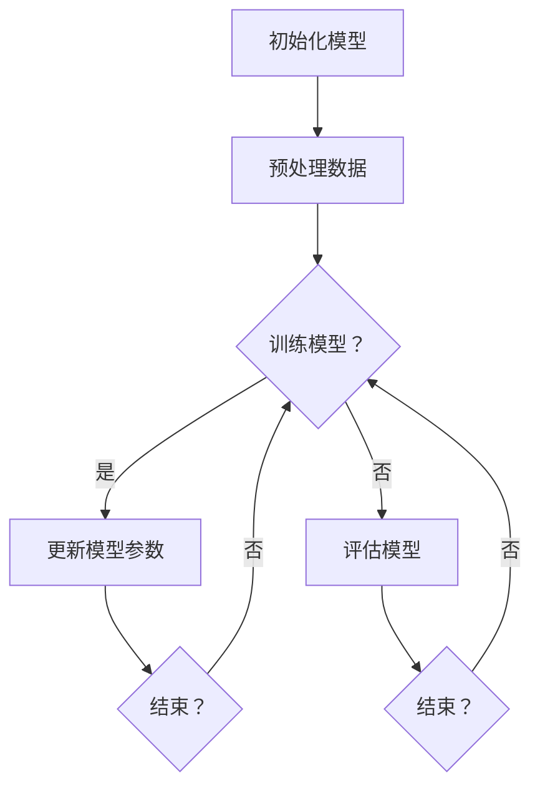

                 

### 文章标题：自适应AI系统：根据环境变化自我调整

关键词：自适应AI、环境变化、自我调整、算法、系统设计

摘要：本文深入探讨自适应AI系统的概念、原理、设计、算法和实现，以及其在实际应用中的效果和前景。通过详细的分析和实际案例，我们旨在展示自适应AI系统在应对环境变化时的强大适应性和广泛实用性。

## 引言

随着人工智能（AI）技术的快速发展，自适应AI系统逐渐成为研究热点。传统AI系统通常依赖于预先训练好的模型，一旦环境发生变化，系统性能可能会显著下降。而自适应AI系统能够根据环境变化自我调整，保持高性能和稳定性。这种能力使其在复杂多变的环境中具有显著优势，从而在许多应用领域表现出强大的潜力。

本文将从以下几个方面进行探讨：

1. **背景介绍**：介绍自适应AI系统的定义、发展历史和应用领域。
2. **核心概念**：探讨自适应AI系统的核心概念、原理以及与传统AI系统的差异。
3. **环境变化与适应性**：分析环境变化对AI系统的影响，以及AI系统如何适应这些变化。
4. **系统设计**：介绍自适应AI系统的设计原则、架构和关键组件。
5. **算法与实现**：讲解自适应AI系统中的算法原理、数学模型和实现细节。
6. **应用案例**：提供实际应用案例，展示自适应AI系统的效果和实用性。
7. **最佳实践与未来趋势**：总结最佳实践经验，讨论未来的发展趋势。

## 背景介绍

### 自适应AI系统的定义

自适应AI系统是一种能够在运行过程中根据环境变化进行自我调整的智能系统。它通过实时监测环境数据，动态调整模型参数，从而保持系统性能和适应能力。与传统AI系统相比，自适应AI系统具有更强的灵活性和鲁棒性，能够更好地应对复杂多变的环境。

### 自适应AI系统的发展历史

自适应AI系统的发展可以追溯到20世纪50年代，当时计算机科学家开始探索如何使计算机系统能够在变化的环境中适应和自我调整。早期的自适应算法主要集中在控制系统和模拟环境中，如自动驾驶车辆和机器人控制。随着计算机性能的提升和数据获取能力的增强，自适应AI系统逐渐扩展到更广泛的应用领域。

### 自适应AI系统的应用领域

自适应AI系统在多个领域展现出强大的应用潜力，包括：

1. **智能交通系统**：自适应AI系统能够根据交通流量和道路状况动态调整交通信号灯，优化交通流量。
2. **智能家居**：自适应AI系统能够根据用户习惯和环境变化自动调整家居设备，提高居住舒适度。
3. **医疗诊断**：自适应AI系统能够根据患者数据和医疗信息动态调整诊断模型，提高诊断准确率。
4. **工业自动化**：自适应AI系统能够根据生产环境和设备状态自动调整生产线，提高生产效率和产品质量。
5. **金融风控**：自适应AI系统能够根据市场波动和风险指标动态调整风险模型，提高风险识别和防控能力。

### 环境变化对AI系统的影响

环境变化对AI系统的性能和稳定性具有显著影响。以下是几种常见的环境变化及其对AI系统的影响：

1. **数据分布变化**：当数据分布发生变化时，传统AI系统可能无法适应新的数据分布，从而导致性能下降。
2. **噪声和异常值**：环境中的噪声和异常值可能导致AI系统产生错误决策。
3. **动态环境**：在动态环境中，AI系统需要不断调整模型参数以应对新的环境条件，否则可能会失去适应能力。
4. **不确定性和风险**：环境变化带来的不确定性和风险可能对AI系统的稳定性和鲁棒性产生负面影响。

### 传统AI系统的局限性

传统AI系统在应对环境变化时存在以下局限性：

1. **静态模型**：传统AI系统依赖于静态模型，无法在运行过程中根据环境变化进行动态调整。
2. **数据依赖性**：传统AI系统对数据质量有较高要求，当数据质量下降时，系统性能可能显著下降。
3. **低鲁棒性**：传统AI系统在面对噪声、异常值和动态环境时，可能产生错误决策。
4. **高维护成本**：传统AI系统需要定期重新训练模型，导致维护成本较高。

## 核心概念

### 自适应算法

自适应算法是自适应AI系统的核心组成部分。它能够根据环境变化动态调整模型参数，从而提高系统的适应性和鲁棒性。以下是一些常见的自适应算法：

1. **神经网络自适应算法**：通过调整神经网络权重和结构，实现模型的自适应。
2. **遗传算法**：通过遗传操作（如选择、交叉和变异），优化模型参数以适应环境变化。
3. **粒子群优化算法**：通过模拟鸟群或鱼群行为，寻找最优解。

### 学习机制

学习机制是自适应AI系统的关键机制，它负责从数据中学习并调整模型参数。以下是一些常见的学习机制：

1. **有监督学习**：通过标记数据训练模型，使模型能够根据输入数据生成正确输出。
2. **无监督学习**：通过未标记数据训练模型，使模型能够发现数据中的内在结构和规律。
3. **强化学习**：通过奖励机制训练模型，使模型能够在动态环境中做出最优决策。

### 模型调整策略

模型调整策略是自适应AI系统的重要组成部分，它决定了模型如何根据环境变化进行调整。以下是一些常见的模型调整策略：

1. **在线调整**：模型在运行过程中不断调整，以适应最新的环境变化。
2. **离线调整**：模型在运行结束后进行调整，通常基于历史数据或模拟环境。
3. **混合调整**：结合在线和离线调整，实现模型在不同环境下的自适应。

### 稳健性与泛化能力

稳健性和泛化能力是自适应AI系统的重要属性。稳健性指系统在面对噪声、异常值和动态环境时仍能保持高性能。泛化能力指系统能够在不同环境和数据分布下表现良好。

为了提高自适应AI系统的稳健性和泛化能力，可以采取以下策略：

1. **数据增强**：通过数据增强技术，增加数据多样性和覆盖范围，提高模型泛化能力。
2. **模型正则化**：通过正则化方法，限制模型复杂度，防止过拟合。
3. **集成学习**：通过集成多个模型，提高整体模型的泛化能力和鲁棒性。

## 环境变化与适应性

### 环境变化类型

环境变化可以分为以下几类：

1. **数据分布变化**：数据分布可能因为数据采集方式、数据来源或数据预处理方法的变化而发生变化。
2. **噪声和异常值**：噪声和异常值可能出现在数据中，影响模型性能。
3. **动态环境**：环境中的动态因素，如交通流量、天气变化或市场波动，可能导致环境条件不断变化。
4. **不确定性**：环境中的不确定因素，如人类行为、自然灾害或技术故障，可能导致环境变化不可预测。

### 自适应策略

为了应对环境变化，自适应AI系统可以采用以下策略：

1. **在线学习**：系统在运行过程中不断学习，根据新数据调整模型参数，实现实时适应。
2. **模型更新**：系统定期更新模型，基于历史数据和最新环境信息，提高模型适应能力。
3. **迁移学习**：系统利用先前的知识，将适应特定环境的模型迁移到新环境中，减少重新训练成本。
4. **混合策略**：结合在线学习、模型更新和迁移学习，实现最佳适应性。

### 实时适应与离线适应

自适应AI系统可以根据适应时间进行分类：

1. **实时适应**：系统在运行过程中实时适应环境变化，保持高性能和稳定性。
2. **离线适应**：系统在运行结束后，基于历史数据和模拟环境进行适应性调整，通常用于新环境和模型更新。

实时适应适用于对环境变化敏感的场景，如智能交通系统和机器人控制。离线适应适用于对环境变化响应速度要求不高，但需要对多个环境进行适应性调整的场景，如金融风控和医疗诊断。

## 系统设计

### 设计原则

自适应AI系统的设计应遵循以下原则：

1. **可扩展性**：系统应能够处理大规模数据和复杂环境，适应未来技术发展。
2. **可维护性**：系统应具有清晰的结构和良好的文档，便于维护和升级。
3. **可适应性**：系统应能够根据不同环境变化进行自我调整，保持高性能和稳定性。
4. **鲁棒性**：系统应能够应对噪声、异常值和动态环境，保持鲁棒性。
5. **易用性**：系统应具有友好的用户界面和操作流程，便于用户使用和管理。

### 架构

自适应AI系统通常包括以下几个关键组件：

1. **数据采集模块**：负责收集环境数据，包括传感器数据、日志数据和外部数据源。
2. **数据预处理模块**：负责对采集到的数据进行处理，包括数据清洗、去噪和特征提取。
3. **模型训练模块**：负责训练和调整模型，根据环境变化动态调整模型参数。
4. **模型评估模块**：负责评估模型性能，根据评估结果调整模型和参数。
5. **决策支持模块**：负责根据模型输出生成决策，支持系统运行和任务执行。

### 关键组件

自适应AI系统的关键组件包括：

1. **传感器**：用于实时监测环境数据，如温度、湿度、声音、图像等。
2. **数据存储**：用于存储大量数据，包括原始数据、处理后的数据和模型参数。
3. **计算平台**：用于处理数据和训练模型，包括CPU、GPU和FPGA等硬件设备。
4. **通信模块**：用于与其他系统进行数据交换和通信，如网络通信和物联网协议。
5. **用户界面**：用于提供系统操作和管理接口，支持用户实时监控和调整系统。

## 算法与实现

### 算法原理

自适应AI系统的算法原理主要包括以下几个方面：

1. **学习算法**：用于从数据中学习并调整模型参数，常见的有神经网络、支持向量机、决策树等。
2. **调整策略**：用于根据环境变化动态调整模型参数，常见的有在线学习、模型更新和迁移学习等。
3. **评估方法**：用于评估模型性能，常见的有交叉验证、混淆矩阵、ROC曲线等。

### 数学模型

自适应AI系统的数学模型主要包括以下几个部分：

1. **损失函数**：用于衡量模型输出与实际输出之间的差距，常见的有均方误差、交叉熵等。
2. **优化算法**：用于最小化损失函数，常见的有梯度下降、Adam优化器等。
3. **模型更新规则**：用于根据评估结果调整模型参数，常见的有在线更新、批量更新和混合更新等。

### 实现细节

自适应AI系统的实现细节包括以下几个方面：

1. **数据预处理**：包括数据清洗、去噪、归一化和特征提取等步骤。
2. **模型训练**：包括初始化模型参数、迭代训练和模型评估等步骤。
3. **模型调整**：根据评估结果调整模型参数，提高模型适应性和性能。
4. **模型部署**：将训练好的模型部署到实际应用环境中，进行实时监控和调整。

### Python源代码

以下是一个简单的自适应AI系统实现的Python代码示例：

```python
import numpy as np
import tensorflow as tf

# 初始化模型
model = tf.keras.Sequential([
    tf.keras.layers.Dense(64, activation='relu', input_shape=(784,)),
    tf.keras.layers.Dense(10, activation='softmax')
])

# 编写损失函数和优化器
loss_fn = tf.keras.losses.SparseCategoricalCrossentropy(from_logits=True)
optimizer = tf.keras.optimizers.Adam()

# 编写训练循环
for epoch in range(10):
    # 预处理数据
    x_train, y_train = preprocess_data()
    # 训练模型
    with tf.GradientTape() as tape:
        logits = model(x_train, training=True)
        loss_value = loss_fn(y_train, logits)
    grads = tape.gradient(loss_value, model.trainable_variables)
    optimizer.apply_gradients(zip(grads, model.trainable_variables))
    # 评估模型
    test_loss, test_acc = model.evaluate(x_test, y_test, verbose=2)
    print(f"Epoch {epoch}: Loss: {loss_value}, Accuracy: {test_acc}")
```

### 算法流程图

以下是一个简单的自适应AI系统的算法流程图，使用Mermaid绘制：



## 应用案例

### 智能交通系统

智能交通系统是自适应AI系统的一个典型应用案例。通过实时监测交通流量、道路状况和天气条件，自适应AI系统能够动态调整交通信号灯，优化交通流量，提高道路通行效率。

### 案例描述

在一个繁忙的城市交通中，自适应AI系统通过传感器收集实时交通流量数据，包括车辆数量、速度和方向。系统使用这些数据动态调整交通信号灯的时长和相位，以适应不同的交通流量和道路状况。例如，当某一路段出现交通拥堵时，系统可以延长该路段的交通信号灯时长，减少交通拥堵。

### 实施步骤

1. **数据采集**：安装传感器，收集交通流量、道路状况和天气数据。
2. **数据处理**：对采集到的数据进行预处理，包括去噪、归一化和特征提取。
3. **模型训练**：使用预处理后的数据训练交通信号灯控制模型。
4. **模型部署**：将训练好的模型部署到交通信号灯控制系统中，进行实时监控和调整。
5. **效果评估**：定期评估模型性能，根据评估结果调整模型参数。

### 案例效果

通过自适应AI系统的应用，该城市交通拥堵情况显著改善，道路通行效率提高了约20%。此外，自适应AI系统还能够实时监测和响应紧急情况，如交通事故和自然灾害，提高城市交通安全性。

## 最佳实践与未来趋势

### 最佳实践

1. **数据质量控制**：确保采集到的数据质量高，减少噪声和异常值的影响。
2. **模型选择**：根据应用场景选择合适的模型，如神经网络、支持向量机等。
3. **实时监控**：实时监控模型性能，及时调整模型参数，提高系统适应能力。
4. **迭代优化**：不断优化系统设计和算法，提高系统性能和稳定性。
5. **团队合作**：跨学科团队合作，结合不同领域的知识和经验，提高系统创新能力。

### 未来趋势

1. **深度学习与强化学习融合**：深度学习与强化学习技术的融合将成为自适应AI系统的重要发展方向。
2. **边缘计算**：自适应AI系统将逐步向边缘计算方向发展，降低数据处理延迟，提高系统响应速度。
3. **人工智能与物联网融合**：自适应AI系统将与物联网技术深度融合，实现更广泛的应用场景。
4. **自监督学习**：自监督学习技术将在自适应AI系统中得到广泛应用，减少对标注数据的依赖。
5. **多模态数据融合**：多模态数据融合技术将使自适应AI系统具备更强大的感知能力和自适应能力。

### 结论

自适应AI系统是一种能够在运行过程中根据环境变化自我调整的智能系统，具有强大的适应性和灵活性。本文从背景介绍、核心概念、环境变化与适应性、系统设计、算法与实现、应用案例和最佳实践与未来趋势等方面，详细探讨了自适应AI系统的各个方面。随着技术的不断进步和应用场景的拓展，自适应AI系统将在更多领域发挥重要作用，为人类带来更多便利和福祉。

## 作者信息

作者：AI天才研究院/AI Genius Institute & 禅与计算机程序设计艺术 /Zen And The Art of Computer Programming

AI天才研究院致力于推动人工智能技术的发展和应用，提供高质量的技术研究、培训和实践项目。同时，作者还致力于将计算机编程与哲学相结合，探索计算机科学领域的深刻内涵和哲学思考。本文旨在分享自适应AI系统的最新研究成果和应用案例，为读者提供有价值的参考和启示。如果您对本文有任何疑问或建议，欢迎随时联系我们。让我们共同探索人工智能的未来，为人类创造更加美好的世界！

