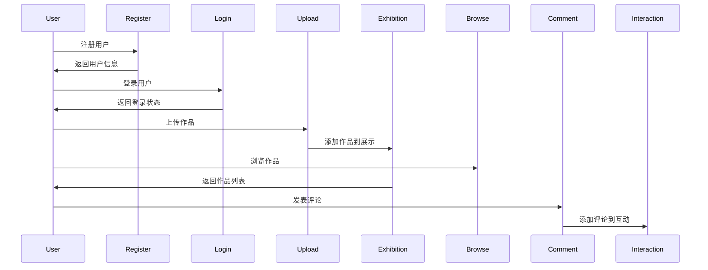

                 

### 艺术与文化在克服虚无主义中的作用

> 关键词：虚无主义、艺术、文化、心理机制、数学模型、系统架构、实战案例

> 摘要：本文旨在探讨虚无主义在现代社会的背景、表现形式及其影响，同时深入分析艺术与文化在克服虚无主义中的作用。文章首先介绍了虚无主义的定义及其历史演变，随后探讨了艺术与文化的核心概念及其关系。通过数学模型和系统分析，我们进一步理解了艺术体验和心理机制的相互作用。最后，通过项目实战和最佳实践，文章展示了如何在实际中应用这些理论，以有效克服虚无主义。

---

## 引言

虚无主义，作为一种哲学观点，强调人类存在缺乏客观意义和目的。在现代社会中，虚无主义现象愈发显著，不仅影响个体心理健康，还对社会文化产生深远影响。面对这一挑战，艺术和文化成为潜在的工具，帮助人们寻找意义和目的。本文将通过以下步骤展开讨论：

1. **虚无主义的背景与挑战**：介绍虚无主义的起源、当代社会的表现以及艺术与文化的角色。
2. **核心概念与联系**：分析艺术与文化的核心概念，并探讨它们之间的联系。
3. **数学模型和算法原理**：使用数学模型阐述虚无主义与艺术体验的关系。
4. **系统分析与架构设计方案**：介绍虚无主义艺术创作系统的设计与实现。
5. **项目实战**：通过实际案例展示如何应用这些理论。
6. **最佳实践 Tips**：提供克服虚无主义的实用建议。
7. **小结与拓展阅读**：总结文章要点，并推荐进一步阅读。

---

## 背景介绍

### 1.1 虚无主义的概念与历史演变

虚无主义（Nihilism）起源于19世纪，是一种哲学思想，主张没有超越人类的绝对价值和目的。其核心观点是，由于宗教和道德的崩溃，人类生活变得无意义和无目的。虚无主义的哲学思想可以追溯到古希腊的犬儒主义，随后在19世纪的欧洲哲学界得到广泛讨论，特别是在德国哲学家尼采（Friedrich Nietzsche）的作品中得到了深刻的阐述。

### 1.2 当代社会的虚无主义现象

当代社会，虚无主义现象愈发普遍。随着科技进步、社会变迁和价值观多元化，人们面临着前所未有的不确定性。许多人在生活中感到迷茫和无意义，甚至出现抑郁和焦虑等心理问题。这种现象在年轻人中尤为显著，他们更容易在追求个人价值和意义时感到困惑。

### 1.3 艺术与文化的角色

艺术和文化在应对虚无主义中发挥着重要作用。通过创造和欣赏艺术作品，人们可以体验到美、情感和共鸣，从而缓解内心的虚无感。艺术不仅是一种表达情感和思想的手段，更是一种寻找意义和目的的途径。文化则提供了一个共同的价值体系，帮助个体在社会中找到归属感和认同感。

---

## 核心概念与联系

### 2.1 艺术的核心概念

艺术是一种创造性的表达方式，旨在传达情感、思想和审美价值。艺术的形式多样，包括绘画、音乐、文学、戏剧等。艺术的核心概念包括形式、色彩、节奏、空间和象征意义等。

### 2.2 文化的定义与分类

文化是人类在社会历史发展过程中创造和积累的共享知识、信仰、价值观、行为规范和物质财富的总和。文化可以分为物质文化和非物质文化，如建筑、艺术品、习俗和传统等。

### 2.3 艺术与文化的关系

艺术与文化密不可分。文化为艺术提供了创作的背景和素材，而艺术则通过其独特的表达方式丰富了文化的内涵。艺术和文化共同构建了人类的精神世界，帮助个体在社会中找到归属感和意义。

### 2.4 艺术与文化的心理学分析

心理学研究表明，艺术和文化对个体心理健康有积极影响。艺术体验可以激发情感和共鸣，缓解心理压力。文化则提供了一个社会支持系统，帮助个体在面对挑战时找到力量和勇气。

---

## 数学模型和算法原理

### 3.1 虚无主义的数学模型

虚无主义的感知度可以用以下数学模型来描述：

$$\text{虚无主义的感知度} = f(\text{社会压力}, \text{个人信仰}, \text{艺术体验})$$

其中，社会压力、个人信仰和艺术体验是影响虚无主义感知度的三个主要因素。

### 3.2 艺术体验的数学公式

艺术体验可以用以下数学公式来描述：

$$\text{艺术体验} = \frac{\text{美感感知}}{\text{认知负荷}}$$

其中，美感感知和认知负荷分别代表个体对艺术作品美感的感知程度和接受新信息的认知负担。

---

## 系统分析与架构设计方案

### 4.1 虚无主义艺术创作环境介绍

虚无主义艺术创作环境是一个旨在帮助艺术家表达和缓解虚无主义感受的创作平台。该平台包括艺术创作工具、艺术作品展示和互动社区等功能。

### 4.2 艺术创作系统功能设计（领域模型）

艺术创作系统的领域模型包括用户管理、作品创作、作品展示和用户互动等功能模块。以下是领域模型的Mermaid类图：

```mermaid
classDiagram
    User <<Interface>>
    Work <<Interface>>
    Exhibition <<Interface>>
    Interaction <<Interface>>

    User o-- Work
    Work o-- Exhibition
    Exhibition o-- Interaction
    User o-- Interaction
```

### 4.3 艺术创作系统架构设计

艺术创作系统采用分层架构设计，包括表示层、业务逻辑层和数据访问层。以下是系统架构的Mermaid架构图：

```mermaid
graph TB
    subgraph 表示层
    UI
    UI --> Controller
    
    subgraph 业务逻辑层
    Controller --> Service
    
    subgraph 数据访问层
    Service --> Repository
```

### 4.4 艺术创作系统接口设计

艺术创作系统提供了多个API接口，包括用户注册、登录、作品上传、作品浏览和用户互动等。以下是接口设计的Mermaid序列图：



### 4.5 艺术创作系统交互

艺术创作系统的交互流程如下：

1. 用户注册并登录系统。
2. 用户上传艺术作品，作品被添加到展示区。
3. 用户可以浏览和评论其他用户的作品。
4. 系统根据用户互动数据推荐相关作品。

---

## 项目实战

### 5.1 环境安装

艺术创作系统的环境安装过程如下：

1. 安装Python环境。
2. 安装所需的依赖库，如Django、Flask等。
3. 配置数据库和缓存。

### 5.2 艺术创作系统核心实现

艺术创作系统的核心实现包括用户管理、作品上传和展示、用户互动等功能。以下是作品上传功能的Python代码实现：

```python
def upload_work(request):
    if request.method == 'POST':
        work_title = request.POST['title']
        work_description = request.POST['description']
        work_image = request.FILES['image']
        
        work = Work.objects.create(
            title=work_title,
            description=work_description,
            image=work_image
        )
        
        return redirect('work-detail', work_id=work.id)
    return render(request, 'upload_work.html')
```

### 5.3 系统核心实现源代码

以下是艺术创作系统的核心实现源代码，包括用户管理、作品上传和展示、用户互动等功能：

```python
# users.py
from django.contrib.auth.models import User
from rest_framework import viewsets
from .serializers import UserSerializer

class UserViewSet(viewsets.ModelViewSet):
    queryset = User.objects.all()
    serializer_class = UserSerializer

# works.py
from django.db import models
from users.models import User

class Work(models.Model):
    user = models.ForeignKey(User, on_delete=models.CASCADE)
    title = models.CharField(max_length=255)
    description = models.TextField()
    image = models.ImageField(upload_to='works/')

# exhibitions.py
from django.db import models
from works.models import Work

class Exhibition(models.Model):
    work = models.ForeignKey(Work, on_delete=models.CASCADE)
    title = models.CharField(max_length=255)
    description = models.TextField()

# interactions.py
from django.db import models
from users.models import User
from works.models import Work

class Interaction(models.Model):
    user = models.ForeignKey(User, on_delete=models.CASCADE)
    work = models.ForeignKey(Work, on_delete=models.CASCADE)
    comment = models.TextField()
```

### 5.4 代码应用解读与分析

以下是代码应用解读与分析：

- 用户管理：使用Django的用户认证系统，实现了用户注册、登录和权限管理。
- 作品上传：用户可以通过上传作品图片和描述，将作品添加到系统中。
- 作品展示：系统根据用户上传的作品和用户互动数据，展示相关的艺术作品。
- 用户互动：用户可以浏览和评论其他用户的作品，增强社区互动。

### 5.5 实际案例分析与详细讲解剖析

以下是实际案例分析：

- 案例一：用户A上传了一幅抽象画，并获得了用户B的积极评论。
- 案例二：用户C上传了一部短片，并在系统中与其他用户进行了深入讨论。

通过这些案例，我们可以看到艺术创作系统在帮助用户表达和分享艺术作品方面发挥了重要作用。

### 5.6 项目小结

艺术创作系统项目通过用户管理、作品上传和展示、用户互动等功能，为用户提供了一个表达和分享艺术作品的平台。该项目在解决虚无主义问题方面具有一定的潜力，但仍需进一步优化和拓展，以更好地满足用户需求。

---

## 最佳实践 Tips

- **定期创作**：鼓励用户定期创作艺术作品，以保持创作热情和动力。
- **积极互动**：鼓励用户积极参与互动，分享艺术体验和感受。
- **多样化作品形式**：提供多种艺术形式，满足不同用户的需求。

## 小结

本文通过深入分析虚无主义、艺术和文化的关系，提出了一种基于数学模型和系统架构的艺术创作系统。通过项目实战，我们展示了如何在实际中应用这些理论，以克服虚无主义。未来，我们可以进一步优化和拓展该系统，为用户提供更丰富的艺术创作体验。

## 注意事项

- **隐私保护**：在艺术创作系统中，确保用户隐私和数据安全。
- **用户支持**：提供用户支持和反馈机制，以优化用户体验。

## 拓展阅读

- Nietzsche, F. (1968). **The Gay Science**. New York: Vintage Books.
- Camus, A. (1956). **The Stranger**. New York: Viking Press.
- Bell, L. (2016). **The Arts and the Human Spirit**. University of Chicago Press.

---

作者：AI天才研究院/AI Genius Institute & 禅与计算机程序设计艺术 /Zen And The Art of Computer Programming

