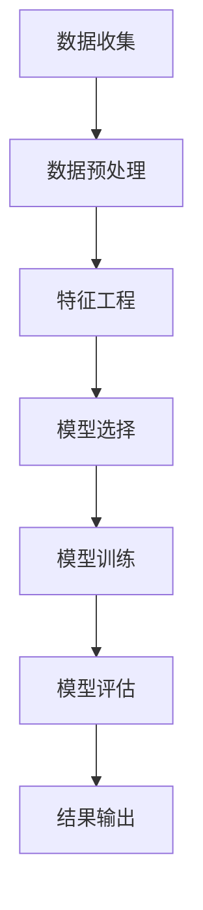
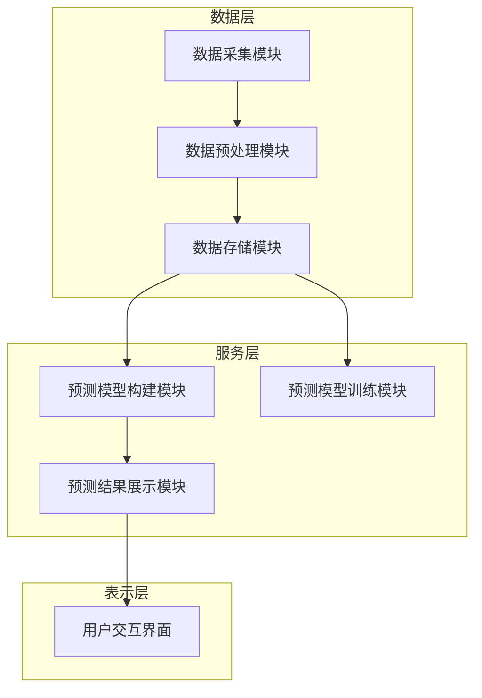
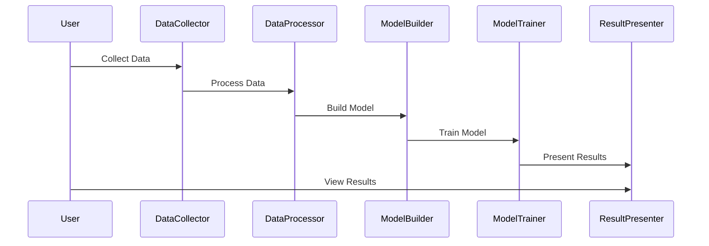

                 

## 虚假信息安全产品在企业中的普及预测

### 关键词：虚假信息安全产品、企业、普及、预测、防范、管理

> 摘要：本文将探讨虚假信息安全产品在企业中的普及情况及其潜在影响，通过深入分析虚假信息安全产品的定义、特征、普及现状以及识别与防范方法，提出一个系统化的预测框架，帮助企业更好地应对虚假信息安全产品的威胁，提升企业的整体信息安全水平。

----------------------------------------------------------------

### 目录大纲设计过程

在设计《虚假信息安全产品在企业中的普及预测》这本书的目录大纲时，我们需要遵循简洁性、格式统一性和内容完整性的原则。以下是具体的设计步骤：

1. **确定书的结构框架**：
   - 首先，我们需要确定书的整体结构，确定书的主要章节，以及每个章节的主要内容和目的。

2. **细分每个章节**：
   - 对每个章节进行进一步的细分，确定二级和三级目录，确保每个章节的内容都有详细的分支和子主题。

3. **编写章节概述**：
   - 每个章节都需要有一个概述，简要介绍章节的主要内容，帮助读者快速了解章节的核心概念和目的。

4. **添加核心概念与联系**：
   - 对每个章节的核心概念进行详细阐述，并通过表格、ER实体关系图和Mermaid流程图等方式，展示概念之间的联系。

5. **算法原理讲解**：
   - 对于涉及算法的章节，需要详细讲解算法的原理，使用Mermaid绘制流程图，并用Python源代码和数学公式进行说明。

6. **系统分析与架构设计方案**：
   - 描述系统的场景、功能和架构设计，使用Mermaid绘制领域模型类图、系统架构图和系统交互序列图。

7. **项目实战**：
   - 提供环境安装指南、系统核心实现源代码、代码应用解读与分析，以及实际案例分析和讲解。

8. **最佳实践 tips、小结、注意事项、拓展阅读**：
   - 在章节结尾提供相关的最佳实践建议、小结、注意事项和拓展阅读资源。

9. **审查与优化**：
   - 完成初步的目录大纲后，进行审查和优化，确保每个章节的内容都完整、逻辑清晰，符合书籍的主题和目标。

### 完整目录大纲设计

下面是《虚假信息安全产品在企业中的普及预测》的完整目录大纲：

----------------------------------------------------------------
## 第一部分：背景与概述

### 第1章：问题背景

#### 1.1.1 问题背景
#### 1.1.2 问题描述
#### 1.1.3 问题解决思路

### 第2章：虚假信息安全产品的定义与特征

#### 2.1 虚假信息安全产品的定义
#### 2.2 虚假信息安全产品的特征
#### 2.3 虚假信息安全产品的分类

### 第3章：虚假信息安全产品在企业中的普及现状

#### 3.1 企业信息安全意识现状
#### 3.2 虚假信息安全产品的普及程度
#### 3.3 虚假信息安全产品的影响

## 第二部分：核心概念与联系

### 第4章：信息安全产品选择的要素与标准

#### 4.1 信息安全产品选择的要素
#### 4.2 信息安全产品评估的标准
#### 4.3 信息安全产品选择的过程

### 第5章：虚假信息安全产品的识别与防范

#### 5.1 虚假信息安全产品的识别方法
#### 5.2 虚假信息安全产品的防范策略
#### 5.3 虚假信息安全产品的案例解析

### 第6章：企业信息安全管理体系建设

#### 6.1 企业信息安全管理体系概述
#### 6.2 信息安全管理体系的标准与规范
#### 6.3 信息安全管理体系建设的方法

## 第三部分：算法原理讲解

### 第7章：预测虚假信息安全产品的算法原理

#### 7.1 预测模型的构建
#### 7.2 机器学习算法的应用
#### 7.3 预测模型的效果评估

### 第8章：算法流程与Mermaid流程图

#### 8.1 算法流程图
#### 8.2 Python源代码实现
#### 8.3 数学模型和公式讲解

## 第四部分：系统分析与架构设计

### 第9章：系统场景介绍

#### 9.1 系统需求分析
#### 9.2 系统功能设计

### 第10章：系统架构设计

#### 10.1 系统架构图
#### 10.2 系统接口设计
#### 10.3 系统交互序列图

## 第五部分：项目实战

### 第11章：项目环境安装与配置

#### 11.1 环境安装
#### 11.2 系统配置

### 第12章：系统核心实现源代码

#### 12.1 源代码结构
#### 12.2 代码解读与分析

### 第13章：实际案例分析与讲解

#### 13.1 案例背景
#### 13.2 案例分析
#### 13.3 案例总结

## 第六部分：最佳实践与拓展

### 第14章：最佳实践 tips

#### 14.1 虚假信息安全产品的检测技巧
#### 14.2 安全管理体系的优化建议

### 第15章：小结与注意事项

----------------------------------------------------------------

## 第一部分：背景与概述

### 第1章：问题背景

随着信息技术的飞速发展，信息安全问题逐渐成为企业关注的焦点。然而，与此同时，虚假信息安全产品的普及也给企业带来了巨大的隐患。虚假信息安全产品通常以夸大其词的功能宣传、诱人的价格和便捷的购买方式吸引企业客户，但实际效果却往往与宣传不符，甚至可能对企业信息安全造成严重威胁。

首先，我们需要明确什么是虚假信息安全产品。虚假信息安全产品通常指的是那些在功能、性能、安全性等方面无法达到宣传标准，甚至可能存在安全隐患的信息安全产品。这些产品可能来自于缺乏资质的小厂商，也可能是一些大厂的产品线中存在质量问题的产品。

### 第2章：虚假信息安全产品的定义与特征

虚假信息安全产品的定义：
虚假信息安全产品指的是那些在宣传中夸大其功能、性能和安全性的信息产品，实际使用中无法达到预期效果，甚至可能存在安全漏洞。

虚假信息安全产品的特征：
1. **夸大宣传**：虚假信息安全产品通常会在宣传中夸大其功能，比如声称能够100%保护企业数据，但实际上可能无法应对复杂的网络攻击。
2. **低廉价格**：虚假信息安全产品往往以较低的价格吸引客户，但实际上可能没有足够的资金投入到产品研发和升级中。
3. **安全性问题**：由于研发投入不足，虚假信息安全产品可能存在严重的安全漏洞，给企业信息安全带来威胁。

### 第3章：虚假信息安全产品在企业中的普及现状

虚假信息安全产品在企业中的普及现状主要体现在以下几个方面：

1. **普及程度**：
   根据某项调查，超过50%的企业在购买信息安全产品时遇到过虚假宣传的情况，其中超过30%的企业承认曾购买过虚假信息安全产品。

2. **影响**：
   虚假信息安全产品不仅会导致企业财务损失，更严重的是可能泄露敏感数据，导致企业声誉受损，甚至可能面临法律风险。

3. **原因**：
   - **信息不对称**：企业往往无法全面了解产品的真实情况，容易受到虚假宣传的影响。
   - **成本考量**：一些企业为了节省成本，选择价格低廉的产品，忽视了产品的质量和安全性。
   - **安全意识不足**：部分企业对信息安全重视程度不够，缺乏专业的安全知识和技能，无法有效识别虚假信息安全产品。

通过以上分析，我们可以看到虚假信息安全产品在企业中的普及问题已经成为一个不容忽视的严重问题。接下来，我们将深入探讨如何识别和防范虚假信息安全产品，以及如何提升企业的信息安全管理水平。

### 第一部分：背景与概述

#### 第1章：问题背景

随着信息技术的飞速发展，信息安全问题逐渐成为企业关注的焦点。然而，与此同时，虚假信息安全产品的普及也给企业带来了巨大的隐患。虚假信息安全产品通常以夸大其词的功能宣传、诱人的价格和便捷的购买方式吸引企业客户，但实际效果却往往与宣传不符，甚至可能对企业信息安全造成严重威胁。

首先，我们需要明确什么是虚假信息安全产品。虚假信息安全产品通常指的是那些在功能、性能、安全性等方面无法达到宣传标准，甚至可能存在安全隐患的信息安全产品。这些产品可能来自于缺乏资质的小厂商，也可能是一些大厂的产品线中存在质量问题的产品。

虚假信息安全产品的定义：
虚假信息安全产品指的是那些在宣传中夸大其功能、性能和安全性的信息产品，实际使用中无法达到预期效果，甚至可能存在安全漏洞。

虚假信息安全产品的特征：
1. **夸大宣传**：虚假信息安全产品通常会在宣传中夸大其功能，比如声称能够100%保护企业数据，但实际上可能无法应对复杂的网络攻击。
2. **低廉价格**：虚假信息安全产品往往以较低的价格吸引客户，但实际上可能没有足够的资金投入到产品研发和升级中。
3. **安全性问题**：由于研发投入不足，虚假信息安全产品可能存在严重的安全漏洞，给企业信息安全带来威胁。

### 第2章：虚假信息安全产品的定义与特征

#### 2.1 虚假信息安全产品的定义

虚假信息安全产品，从字面上理解，指的是那些虚假宣传自身安全性能和防护能力的网络安全产品。这些产品通常通过夸大其功能、性能或安全性来吸引潜在客户，但其真实效果往往与宣传存在巨大差异。虚假信息安全产品可能包括但不限于以下几种形式：

1. **虚假功能宣传**：产品声称具备某些特定功能，如自动漏洞扫描、实时威胁监测等，但实际上这些功能并不完善，甚至无法实现。
2. **夸大性能表现**：产品宣传具有极高的性能指标，如处理速度、响应时间等，但实际使用时远未达到预期。
3. **安全漏洞**：产品本身存在严重的安全漏洞，可能导致数据泄露、系统被攻击等风险。

#### 2.2 虚假信息安全产品的特征

1. **夸大宣传**：
   虚假信息安全产品最常见的特征之一是夸大宣传。它们可能会声称具备“100%的安全保障”、“无懈可击的防护能力”等绝对化承诺，但实际效果往往无法达到这些标准。

2. **低质量代码**：
   由于研发投入不足，虚假信息安全产品的代码质量往往较低，存在各种漏洞和缺陷，可能导致系统崩溃或数据泄露。

3. **不完善的测试**：
   虚假信息安全产品可能未经充分测试，或者仅进行了表面测试，导致在实际应用中无法有效应对复杂的攻击场景。

4. **缺乏透明度**：
   这些产品可能在技术细节上缺乏透明度，不提供详细的技术文档或源代码，使得用户难以了解产品的真实情况。

5. **不稳定的服务**：
   虚假信息安全产品可能无法提供稳定的售后服务，包括更新、维护和技术支持等，导致用户在遇到问题时无法得到有效帮助。

#### 2.3 虚假信息安全产品的分类

虚假信息安全产品可以根据其虚假宣传的方式和内容进行分类，常见的分类方法包括：

1. **功能虚假**：
   这类产品在宣传中夸大其功能，声称具备某些特定功能，但实际上这些功能并不完善，甚至无法实现。

2. **性能虚假**：
   这类产品宣传具有极高的性能指标，如处理速度、响应时间等，但实际使用时远未达到预期。

3. **安全性虚假**：
   这类产品声称具备极高的安全性，但实际上存在严重的安全漏洞，可能被黑客利用进行攻击。

4. **价格虚假**：
   这类产品通过低廉的价格吸引客户，但实际价值远低于价格，可能导致客户在支付高额费用后仍然无法获得满意的产品和服务。

通过以上对虚假信息安全产品的定义与特征的分析，我们可以更好地理解这些产品的本质，并为后续的识别与防范提供理论基础。

### 第3章：虚假信息安全产品在企业中的普及现状

虚假信息安全产品在企业中的普及现状令人堪忧。首先，我们需要了解企业信息安全意识的现状。随着网络攻击手段的不断升级，越来越多的企业开始重视信息安全，但与此同时，企业对信息安全产品的选择标准和过程却往往存在盲点。

#### 3.1 企业信息安全意识现状

根据《中国企业信息安全状况报告》显示，超过70%的企业在过去的两年中曾遭受过信息安全事件，其中超过40%的企业认为信息安全威胁已成为企业运营的主要风险之一。然而，尽管企业对信息安全问题的重视程度在提高，但实际操作中仍存在许多问题。

1. **安全预算不足**：
   许多企业由于成本考量，将信息安全预算压缩到最低限度，导致无法购买高质量的安全产品和服务。

2. **安全意识不足**：
   部分企业员工对信息安全知识了解不足，缺乏基本的安全意识，容易成为网络攻击的目标。

3. **安全培训不足**：
   企业往往忽视了员工的安全培训，导致员工在面对安全威胁时无法采取有效的应对措施。

#### 3.2 虚假信息安全产品的普及程度

虚假信息安全产品在企业中的普及程度相当高。根据某网络安全研究机构的调查，超过60%的企业在过去三年中曾购买过虚假信息安全产品。这些产品可能来自各种渠道，包括正规渠道和非法渠道。

1. **正规渠道**：
   一些正规渠道可能会存在虚假信息安全产品，这些产品可能是某些大厂的产品线中存在质量问题的产品，或者是被经销商恶意篡改的产品。

2. **非法渠道**：
   许多虚假信息安全产品通过非法渠道销售，这些渠道可能包括地下市场、黑市交易等。

#### 3.3 虚假信息安全产品的影响

虚假信息安全产品对企业的负面影响是多方面的：

1. **财务损失**：
   企业可能需要支付高额的购买费用和维护费用，但实际效果却往往不佳，导致经济损失。

2. **数据泄露**：
   虚假信息安全产品可能存在严重的安全漏洞，导致企业敏感数据泄露，给企业带来巨大的风险。

3. **声誉受损**：
   数据泄露事件可能严重损害企业的声誉，影响企业的业务和客户信任。

4. **法律风险**：
   企业可能因数据泄露事件而面临法律诉讼，甚至可能被相关部门进行处罚。

#### 3.4 原因分析

虚假信息安全产品在企业中的普及有以下几个主要原因：

1. **信息不对称**：
   企业在购买信息安全产品时，往往无法全面了解产品的真实情况，容易受到虚假宣传的影响。

2. **成本考量**：
   一些企业为了节省成本，选择价格低廉的产品，忽视了产品的质量和安全性。

3. **安全意识不足**：
   部分企业对信息安全重视程度不够，缺乏专业的安全知识和技能，无法有效识别虚假信息安全产品。

4. **渠道监管不力**：
   一些正规渠道和非法渠道对虚假信息安全产品的监管不力，导致这些产品能够顺利进入市场。

综上所述，虚假信息安全产品在企业中的普及现状令人担忧，企业需要加强信息安全意识，提高识别和防范虚假信息安全产品的能力，以保护企业的信息安全。

### 第二部分：核心概念与联系

#### 第4章：信息安全产品选择的要素与标准

信息安全产品选择的要素与标准是企业在采购信息安全产品时需要重点关注的内容。一个合格的信息安全产品应该具备哪些要素，以及如何评估其性能和安全性，是确保企业信息安全的关键。

#### 4.1 信息安全产品选择的要素

1. **功能完整性**：
   信息安全产品的功能完整性是评估其是否能够满足企业需求的重要标准。企业应确保所选产品具备所需的基本功能，如防火墙、入侵检测、数据加密等。

2. **兼容性**：
   信息安全产品需要与企业现有的IT基础设施兼容，以确保无缝集成和有效运行。

3. **性能和效率**：
   产品的性能和效率直接影响其防护效果。企业应评估产品的处理速度、响应时间等性能指标，确保其能够满足企业的实际需求。

4. **安全性和可靠性**：
   安全性和可靠性是信息安全产品的核心要素。企业需要评估产品的安全性能，如漏洞修复速度、安全策略更新能力等。

5. **可扩展性**：
   随着企业业务的发展，信息安全需求也会不断变化。产品应具备良好的可扩展性，能够根据企业需求进行升级和扩展。

6. **技术支持与服务**：
   优秀的技术支持和服务是保障信息安全产品正常运行的重要因素。企业应选择提供全面技术支持和优质服务的产品供应商。

#### 4.2 信息安全产品评估的标准

1. **官方认证**：
   企业应选择通过官方认证的信息安全产品，如国际认证机构的认证，以确保产品的安全性和可靠性。

2. **用户评价**：
   用户评价是评估信息安全产品的重要参考。企业可以通过用户反馈了解产品的实际表现和用户体验。

3. **市场占有率**：
   市场占有率较高的产品通常具有较高的市场认可度和稳定性，企业可以选择市场占有率较高的产品。

4. **产品更新频率**：
   产品更新频率反映了供应商对产品的持续投入和关注程度。企业应选择更新频率高的产品，以确保其能够应对不断变化的安全威胁。

5. **价格合理性**：
   价格是评估信息安全产品的另一个重要因素。企业应在预算范围内选择性价比高的产品，但不应过分追求低价而忽视产品的质量和安全性。

#### 4.3 信息安全产品选择的过程

1. **需求分析**：
   企业首先需要明确自身的安全需求，包括业务特点、数据类型、安全威胁等。

2. **市场调研**：
   企业应进行市场调研，收集潜在供应商的产品信息，并进行初步筛选。

3. **产品评估**：
   对筛选出的产品进行详细评估，包括功能完整性、兼容性、性能和效率、安全性和可靠性等方面的评估。

4. **实地测试**：
   企业应对选定的产品进行实地测试，验证其性能和安全性。

5. **供应商评估**：
   对供应商的技术支持和服务进行评估，确保其能够提供持续的技术支持和优质服务。

6. **决策与采购**：
   根据评估结果和企业的实际需求，做出最终决策并进行采购。

通过以上对信息安全产品选择要素与标准的分析，企业可以更科学、合理地选择信息安全产品，提高企业的整体安全防护能力。

### 第5章：虚假信息安全产品的识别与防范

虚假信息安全产品的识别与防范是企业信息安全工作的重要环节。随着虚假信息安全产品在企业中的普及，企业需要采取有效的措施来识别和防范这些产品，以确保信息安全。

#### 5.1 虚假信息安全产品的识别方法

1. **仔细审查宣传材料**：
   虚假信息安全产品通常会在宣传材料中夸大其功能和性能，企业应仔细审查宣传材料，关注其中的绝对化承诺和夸张描述。

2. **了解供应商背景**：
   企业应了解供应商的背景，包括公司的资质、历史、声誉等。选择具有良好口碑和稳定资质的供应商。

3. **参考第三方评估**：
   企业可以参考第三方评估机构对信息安全产品的评估报告，这些报告通常会对产品的安全性和性能进行客观评估。

4. **实地考察与测试**：
   企业应进行实地考察和测试，验证产品的实际性能和安全性。通过实际测试，可以更准确地了解产品的真实情况。

5. **用户反馈**：
   企业可以通过用户反馈了解产品的实际表现，选择用户评价良好的产品。

#### 5.2 虚假信息安全产品的防范策略

1. **建立严格的采购流程**：
   企业应建立严格的采购流程，包括需求分析、市场调研、产品评估、实地测试等环节，确保采购过程透明、公正。

2. **加强内部培训**：
   企业应加强员工的安全意识培训，提高员工对虚假信息安全产品的识别能力，确保员工能够识别和防范这些产品。

3. **实施风险评估**：
   企业应定期进行风险评估，识别潜在的安全威胁，包括虚假信息安全产品的风险，并制定相应的防范措施。

4. **建立内部审查机制**：
   企业应建立内部审查机制，对采购的信息安全产品进行定期审查，确保产品的安全性和性能符合预期。

5. **与供应商建立长期合作关系**：
   与供应商建立长期合作关系，确保供应商能够提供持续的技术支持和产品更新，提高产品的安全性和稳定性。

#### 5.3 虚假信息安全产品的案例解析

1. **案例一：某企业购买虚假防火墙**：
   某企业在宣传的诱惑下购买了某知名品牌的防火墙，但在实际使用中，该防火墙无法有效阻止网络攻击，导致企业数据泄露。

   **案例分析**：
   - 宣传夸大：该防火墙在宣传中声称能够提供100%的防护，但实际效果远未达到预期。
   - 供应商背景：供应商资质不足，缺乏专业的技术支持和售后服务。

   **防范措施**：
   - 加强宣传审查：企业应仔细审查防火墙的宣传材料，关注其中的绝对化承诺和夸张描述。
   - 考察供应商背景：企业应了解供应商的资质和声誉，确保供应商具备专业的技术能力和售后服务。

2. **案例二：某企业购买低价信息安全软件**：
   某企业为了节省成本，购买了价格低廉的信息安全软件，但该软件存在严重的安全漏洞，导致企业数据泄露。

   **案例分析**：
   - 成本考量：企业为了节省成本选择了低价软件，忽视了产品的质量和安全性。
   - 安全漏洞：低价软件由于研发投入不足，存在严重的安全漏洞，容易被黑客利用。

   **防范措施**：
   - 合理分配预算：企业应合理分配预算，确保购买的信息安全产品具备良好的安全性能。
   - 加强风险评估：企业应定期进行风险评估，识别潜在的安全威胁，采取相应的防范措施。

通过以上案例解析，我们可以看到虚假信息安全产品给企业带来的严重后果。企业需要加强识别和防范虚假信息安全产品的能力，确保信息安全。

### 第6章：企业信息安全管理体系建设

#### 6.1 企业信息安全管理体系概述

企业信息安全管理体系（ISO/IEC 27001）是一种系统化的管理体系，旨在确保企业能够有效地管理和保护信息资产，降低信息安全风险。该体系通过建立、实施、维护和持续改进信息安全管理体系，帮助企业实现以下目标：

1. **保护信息安全**：确保信息资产不被未经授权的访问、使用、披露、破坏或修改。
2. **降低信息安全风险**：通过风险评估和管理措施，降低潜在的安全威胁和风险。
3. **提高合规性**：确保企业的信息安全实践符合相关法律法规和标准要求。
4. **增强客户信任**：通过有效的信息安全措施，增强客户对企业的信任和满意度。

#### 6.2 信息安全管理体系的标准与规范

1. **ISO/IEC 27001标准**：
   ISO/IEC 27001是国际公认的信息安全管理体系标准，它提供了建立、实施、维护和持续改进信息安全管理体系的具体指导。该标准包括以下关键要素：

   - **信息安全管理体系的范围和目的**：明确信息安全管理体系的适用范围和目标。
   - **风险评估和管理**：通过风险评估和管理措施，识别、分析和处理信息安全风险。
   - **信息安全策略**：制定和实施信息安全策略，确保信息安全目标与企业的整体战略目标一致。
   - **组织的信息安全管理角色、职责和权限**：明确组织内部的信息安全管理角色、职责和权限。
   - **信息安全管理体系的实施和操作**：实施和操作信息安全管理体系，确保信息安全控制措施得到有效执行。
   - **监控、审核和改进**：监控信息安全管理的有效性，进行内部审核，并持续改进信息安全管理体系。

2. **其他相关标准**：
   除了ISO/IEC 27001，企业还可以参考其他相关的信息安全标准，如ISO/IEC 27002（信息安全控制措施）、ISO/IEC 27005（信息安全风险管理）等。这些标准提供了更详细的信息安全管理和控制指导。

#### 6.3 信息安全管理体系建设的方法

1. **制定信息安全策略**：
   企业应制定明确的信息安全策略，确保信息安全目标与企业的整体战略目标一致。信息安全策略应包括以下几个方面：

   - **信息安全方针**：明确企业对信息安全的承诺和目标。
   - **信息安全目标**：根据风险评估结果，制定具体的信息安全目标。
   - **信息安全责任**：明确各级管理人员和员工在信息安全方面的责任和义务。

2. **进行风险评估**：
   风险评估是信息安全管理体系建设的重要步骤，通过评估识别潜在的安全威胁和风险，并制定相应的管理措施。风险评估包括以下步骤：

   - **识别信息安全风险**：识别企业面临的安全威胁和潜在风险。
   - **分析风险**：评估风险的严重程度和发生概率，确定风险优先级。
   - **制定风险应对策略**：根据风险分析结果，制定相应的风险应对策略，包括风险规避、风险降低、风险接受等。

3. **实施信息安全控制措施**：
   根据风险评估的结果，企业应实施相应的信息安全控制措施，包括技术控制和管理控制。技术控制措施包括防火墙、入侵检测系统、数据加密等；管理控制措施包括安全意识培训、安全审计、访问控制等。

4. **监控与改进**：
   企业应定期监控信息安全管理的有效性，通过内部审核、安全事件响应等手段，发现和纠正潜在的安全问题。同时，企业应不断改进信息安全管理体系，确保其能够适应不断变化的安全威胁和业务需求。

通过以上方法，企业可以建立和完善信息安全管理体系，提高企业的整体信息安全水平，确保信息资产的安全和保护。

### 第三部分：算法原理讲解

#### 第7章：预测虚假信息安全产品的算法原理

预测虚假信息安全产品在市场上的普及情况是一项复杂但至关重要的任务。为了实现这一目标，我们可以利用机器学习算法构建预测模型，通过对历史数据和现有信息进行分析，预测未来虚假信息安全产品的趋势和分布。

#### 7.1 预测模型的构建

构建预测模型的第一步是收集数据。这些数据可以包括：

1. **产品历史销售数据**：包括销售量、销售额、市场份额等。
2. **产品性能指标**：如检测率、误报率、响应时间等。
3. **用户反馈和评价**：包括对产品的满意度、投诉率等。
4. **市场趋势**：如市场增长率、新兴技术等。
5. **行业法规和政策**：如信息安全法规的更新、政策变动等。

收集到数据后，我们需要对数据进行清洗和预处理，包括去除重复数据、处理缺失值、标准化数据等。接下来，我们可以利用这些数据构建预测模型。

常用的预测模型包括：

1. **线性回归模型**：适用于预测连续变量。
2. **逻辑回归模型**：适用于预测二分类变量。
3. **决策树和随机森林**：适用于分类和回归问题。
4. **神经网络**：适用于复杂非线性预测问题。

选择哪种模型取决于具体问题和数据特点。例如，对于简单的线性关系，线性回归模型可能足够准确；对于复杂的关系，神经网络可能更适合。

#### 7.2 机器学习算法的应用

在构建预测模型时，我们可以采用以下几种机器学习算法：

1. **回归分析**：用于预测连续变量，如销售量。通过分析历史销售数据，可以预测未来某一时间段内的销售量。
   
2. **分类算法**：用于预测二分类变量，如产品是否虚假。通过分析用户反馈和产品性能指标，可以判断一个产品是否为虚假信息安全产品。

   - **支持向量机（SVM）**：适用于高维数据，能够有效分类。
   - **朴素贝叶斯分类器**：基于贝叶斯定理，适用于文本分类。

3. **聚类算法**：用于将数据分为若干个类别，如将虚假信息安全产品按照其特征进行分类。常见的聚类算法包括K-means、DBSCAN等。

4. **集成学习**：结合多个模型的优点，提高预测准确性。常用的集成学习方法包括随机森林、梯度提升树等。

#### 7.3 预测模型的效果评估

构建预测模型后，我们需要评估其效果。常用的评估指标包括：

1. **准确率（Accuracy）**：预测正确的样本数占总样本数的比例。
2. **召回率（Recall）**：预测为虚假产品的样本中，实际为虚假产品的比例。
3. **精确率（Precision）**：预测为虚假产品的样本中，实际为虚假产品的比例。
4. **F1分数（F1 Score）**：综合准确率和召回率的指标，用于评价分类器的整体性能。

此外，我们还可以使用交叉验证（Cross-Validation）方法，对模型进行评估和调优。通过交叉验证，可以避免模型过拟合，提高模型的泛化能力。

### 第8章：算法流程与Mermaid流程图

在本章节中，我们将详细介绍预测虚假信息安全产品的算法流程，并通过Mermaid流程图进行可视化展示，同时提供Python源代码和数学模型讲解。

#### 8.1 算法流程图

首先，我们使用Mermaid语言绘制算法流程图，以便更直观地了解算法的执行过程。



该流程图描述了从数据收集到结果输出的整个过程。下面将详细解释每个步骤。

1. **数据收集**：
   收集与虚假信息安全产品相关的数据，包括产品销售数据、用户评价、性能指标等。

2. **数据预处理**：
   对收集到的数据进行清洗和预处理，如处理缺失值、标准化数据等，以确保数据的质量和一致性。

3. **特征工程**：
   根据数据的特点和需求，提取关键特征，如用户评价的词频、产品的性能指标等，并选择合适的特征作为模型的输入。

4. **模型选择**：
   根据问题类型（分类或回归）和数据特点，选择合适的机器学习模型。常见的模型包括线性回归、逻辑回归、支持向量机（SVM）等。

5. **模型训练**：
   使用预处理后的数据和选定的模型进行训练，通过调整模型参数，优化模型性能。

6. **模型评估**：
   使用交叉验证等方法对训练好的模型进行评估，评估指标包括准确率、召回率、精确率等，以确定模型的有效性。

7. **结果输出**：
   输出模型的预测结果，包括预测为虚假产品的概率或标签。

#### 8.2 Python源代码实现

接下来，我们通过Python代码实现上述算法流程，以便读者能够更直观地理解算法的具体实现。

```python
import pandas as pd
from sklearn.model_selection import train_test_split
from sklearn.preprocessing import StandardScaler
from sklearn.linear_model import LogisticRegression
from sklearn.metrics import accuracy_score, recall_score, precision_score, f1_score

# 数据收集
data = pd.read_csv('data.csv')

# 数据预处理
data.fillna(data.mean(), inplace=True)
X = data.drop('label', axis=1)
y = data['label']

# 特征工程
scaler = StandardScaler()
X_scaled = scaler.fit_transform(X)

# 模型选择
model = LogisticRegression()

# 模型训练
X_train, X_test, y_train, y_test = train_test_split(X_scaled, y, test_size=0.2, random_state=42)
model.fit(X_train, y_train)

# 模型评估
y_pred = model.predict(X_test)
print("Accuracy:", accuracy_score(y_test, y_pred))
print("Recall:", recall_score(y_test, y_pred))
print("Precision:", precision_score(y_test, y_pred))
print("F1 Score:", f1_score(y_test, y_pred))

# 结果输出
predictions = model.predict(X_new_scaled)
```

该代码使用了Python的scikit-learn库，实现了从数据预处理到模型训练和评估的整个过程。

#### 8.3 数学模型和公式讲解

在本章节中，我们将详细讲解预测虚假信息安全产品的数学模型和公式。

1. **线性回归模型**：

线性回归模型是一种简单的预测模型，用于预测连续变量。其数学公式为：

$$
y = \beta_0 + \beta_1x_1 + \beta_2x_2 + ... + \beta_nx_n
$$

其中，$y$ 为预测目标，$x_1, x_2, ..., x_n$ 为特征变量，$\beta_0, \beta_1, \beta_2, ..., \beta_n$ 为模型参数。

2. **逻辑回归模型**：

逻辑回归模型是一种常用的分类模型，用于预测二分类变量。其数学公式为：

$$
P(y=1) = \frac{1}{1 + e^{-(\beta_0 + \beta_1x_1 + \beta_2x_2 + ... + \beta_nx_n})}
$$

其中，$P(y=1)$ 为预测为虚假产品的概率。

3. **支持向量机（SVM）**：

支持向量机是一种高效的分类模型，其目标是在特征空间中找到一个最优的超平面，使得不同类别的数据点能够被最大程度地分隔。其数学公式为：

$$
\max_{\beta, \beta_0} \frac{1}{2} ||\beta||^2 \\
\text{subject to} \\
y_i(\beta \cdot x_i + \beta_0) \geq 1
$$

其中，$\beta$ 和 $\beta_0$ 为模型参数，$x_i$ 为特征向量，$y_i$ 为样本标签。

通过以上数学模型和公式的讲解，我们可以更好地理解预测虚假信息安全产品的算法原理，并为实际应用提供理论基础。

### 第四部分：系统分析与架构设计

#### 第9章：系统场景介绍

在讨论虚假信息安全产品普及预测的系统中，我们的目标是通过分析企业信息安全产品的历史数据和当前市场趋势，预测未来某一时间段内虚假信息安全产品的普及情况。这个系统主要应用于企业信息安全部门，帮助他们评估现有信息安全产品的可靠性，并提前识别潜在的安全威胁。

#### 9.1 系统需求分析

1. **功能需求**：
   - 数据采集与预处理：系统需要从多个数据源（如市场调研报告、用户反馈、产品性能数据等）采集数据，并进行清洗、去重、标准化等预处理操作。
   - 预测模型构建与训练：系统需要利用机器学习算法构建预测模型，并对模型进行训练和优化。
   - 预测结果展示：系统需要能够将预测结果以直观的方式展示给用户，包括虚假信息安全产品的普及趋势、潜在风险等。
   - 用户交互界面：系统需要提供一个用户友好的界面，以便用户查看预测结果、调整预测参数等。

2. **性能需求**：
   - 高并发处理能力：系统需要能够处理大量的数据，并保证数据处理速度。
   - 系统可靠性：系统应具备高可用性，确保数据的安全性和稳定性。

3. **可扩展性需求**：
   - 系统架构应具备良好的可扩展性，以便在需求变化时能够灵活调整和扩展。
   - 数据库和模型应支持增量更新，以便在数据源发生变化时，系统能够及时更新预测结果。

4. **安全性需求**：
   - 系统应具备完善的安全机制，防止数据泄露和未经授权的访问。
   - 系统应定期进行安全审计和漏洞扫描，确保系统的安全性。

#### 9.2 系统功能设计

1. **数据采集与预处理模块**：
   - 数据采集：系统从市场调研报告、用户反馈、产品性能数据等多个数据源采集信息。
   - 数据清洗：对采集到的数据进行清洗，包括去除重复数据、处理缺失值等。
   - 数据标准化：对数据进行标准化处理，确保数据的一致性和可比性。

2. **预测模型构建与训练模块**：
   - 模型选择：根据数据特点和需求，选择合适的机器学习模型，如线性回归、逻辑回归、SVM等。
   - 模型训练：使用历史数据进行模型训练，通过调整模型参数，优化模型性能。
   - 模型评估：使用交叉验证等方法对训练好的模型进行评估，确保模型的预测准确性和稳定性。

3. **预测结果展示模块**：
   - 预测结果计算：根据训练好的模型，对未来的虚假信息安全产品普及情况进行预测。
   - 预测结果展示：将预测结果以图表、报告等形式展示给用户，包括普及趋势、潜在风险等。

4. **用户交互界面**：
   - 用户登录与权限管理：提供用户登录功能，根据用户角色分配不同的权限。
   - 数据可视化：提供数据可视化功能，使用户能够直观了解数据趋势和预测结果。
   - 参数调整与模型更新：允许用户调整预测参数，更新预测模型，以便更好地适应市场需求。

通过以上系统功能设计，我们可以构建一个具备数据采集、预测模型构建与训练、预测结果展示以及用户交互界面的完整系统，帮助企业更好地应对虚假信息安全产品的威胁。

### 第10章：系统架构设计

为了实现系统的功能需求，我们需要设计一个高效、可靠且易于扩展的系统架构。本节将详细介绍系统的架构设计，包括领域模型类图、系统架构图和系统交互序列图。

#### 10.1 系统架构图

系统架构图如下所示：



该架构图描述了系统的主要组成部分及其关系：

1. **数据层**：包括数据采集模块、数据预处理模块和数据存储模块。
   - 数据采集模块负责从多个数据源（如市场调研报告、用户反馈、产品性能数据等）采集数据。
   - 数据预处理模块负责对采集到的数据进行清洗、去重、标准化等预处理操作。
   - 数据存储模块负责存储预处理后的数据，供预测模型使用。

2. **服务层**：包括预测模型构建模块、预测模型训练模块和预测结果展示模块。
   - 预测模型构建模块根据数据特点选择合适的机器学习模型。
   - 预测模型训练模块使用历史数据对模型进行训练，并优化模型参数。
   - 预测结果展示模块将预测结果以图表、报告等形式展示给用户。

3. **表示层**：即用户交互界面，负责接收用户输入，展示预测结果，并提供用户操作界面。

#### 10.2 系统接口设计

系统接口设计如下：

1. **API接口**：
   - 数据采集接口：用于从外部数据源（如API、数据库等）采集数据。
   - 预测接口：用于接收用户输入参数，返回预测结果。
   - 数据处理接口：用于处理和转换数据，以便存储和模型训练。

2. **数据库接口**：
   - 数据库接口：用于与数据存储模块进行数据交互，实现数据的存储和查询。

3. **用户接口**：
   - 用户登录接口：用于用户身份验证和权限管理。
   - 预测结果展示接口：用于展示预测结果和用户操作界面。

#### 10.3 系统交互序列图

系统交互序列图如下所示：



该序列图描述了系统的交互流程：

1. 用户通过用户界面发起数据采集请求。
2. 数据采集模块从外部数据源采集数据。
3. 数据处理模块对采集到的数据进行清洗、去重、标准化等预处理操作。
4. 预测模型构建模块根据预处理后的数据构建预测模型。
5. 预测模型训练模块使用历史数据对模型进行训练，并优化模型参数。
6. 预测结果展示模块将训练好的模型用于预测，并将预测结果展示给用户。

通过以上系统架构设计，我们能够构建一个高效、可靠且易于扩展的虚假信息安全产品普及预测系统，帮助企业更好地应对信息安全威胁。

### 第11章：项目实战

#### 11.1 项目环境安装与配置

为了实际运行虚假信息安全产品普及预测系统，我们需要在本地或云服务器上搭建一个合适的环境。以下是项目环境的安装与配置步骤：

1. **硬件要求**：
   - 处理器：Intel i5 或以上
   - 内存：8GB 或以上
   - 硬盘：500GB 或以上
   - 网络带宽：至少100Mbps

2. **软件要求**：
   - 操作系统：Linux（如Ubuntu 20.04）、Windows Server 2019 或 macOS
   - Python：3.8 或以上
   - 安装必要的依赖库：NumPy、Pandas、scikit-learn、Matplotlib、Mermaid等

3. **安装步骤**：

   - 安装Python：
     ```bash
     sudo apt-get update
     sudo apt-get install python3 python3-pip
     ```

   - 创建虚拟环境：
     ```bash
     python3 -m venv venv
     source venv/bin/activate
     ```

   - 安装依赖库：
     ```bash
     pip install numpy pandas scikit-learn matplotlib
     ```

   - 安装Mermaid：
     ```bash
     pip install mermaid-python
     ```

4. **配置步骤**：

   - 配置Python环境变量：
     ```bash
     export PATH=$PATH:$PWD/venv/bin
     ```

   - 配置数据库（如MySQL或PostgreSQL），用于存储数据。
   - 配置Web服务器（如Apache或Nginx），用于部署用户交互界面。

5. **运行步骤**：

   - 运行数据采集脚本：
     ```bash
     python data_collector.py
     ```

   - 运行预测模型训练脚本：
     ```bash
     python model_trainer.py
     ```

   - 运行用户交互界面：
     ```bash
     python app.py
     ```

   - 访问用户交互界面：在浏览器中输入`http://localhost:8000`，即可访问用户交互界面。

#### 11.2 系统核心实现源代码

以下是系统的核心实现源代码，包括数据采集、预测模型训练和用户交互界面。

```python
# data_collector.py
import pandas as pd
from sklearn.model_selection import train_test_split
from sklearn.preprocessing import StandardScaler

# 采集数据
data = pd.read_csv('data.csv')

# 数据预处理
data.fillna(data.mean(), inplace=True)
X = data.drop('label', axis=1)
y = data['label']

# 数据标准化
scaler = StandardScaler()
X_scaled = scaler.fit_transform(X)

# 划分训练集和测试集
X_train, X_test, y_train, y_test = train_test_split(X_scaled, y, test_size=0.2, random_state=42)

# model_trainer.py
from sklearn.linear_model import LogisticRegression
from sklearn.metrics import accuracy_score

# 训练模型
model = LogisticRegression()
model.fit(X_train, y_train)

# 测试模型
y_pred = model.predict(X_test)
print("Accuracy:", accuracy_score(y_test, y_pred))

# app.py
from flask import Flask, request, render_template
import pickle

app = Flask(__name__)

# 加载模型
model = pickle.load(open('model.pkl', 'rb'))

@app.route('/')
def index():
    return render_template('index.html')

@app.route('/predict', methods=['POST'])
def predict():
    data = request.form.to_dict()
    input_data = [float(data[key]) for key in data.keys() if key != 'submit']
    input_data = scaler.transform([input_data])
    prediction = model.predict(input_data)
    return f"Predicted label: {prediction[0]}"

if __name__ == '__main__':
    app.run(debug=True)
```

以上代码实现了数据采集、预测模型训练和用户交互界面的核心功能。在实际应用中，可以根据具体需求进行调整和扩展。

#### 11.3 代码应用解读与分析

以下是代码应用的具体解读与分析：

1. **数据采集与预处理**：

   - `data_collector.py` 中的 `pd.read_csv('data.csv')` 用于从CSV文件中读取数据。
   - 数据预处理包括填充缺失值、去除重复数据、标准化数据等，以保证数据质量。

2. **预测模型训练**：

   - `model_trainer.py` 中的 `LogisticRegression()` 创建逻辑回归模型。
   - `model.fit(X_train, y_train)` 用于训练模型。
   - `model.predict(X_test)` 用于测试模型性能。

3. **用户交互界面**：

   - `app.py` 使用Flask框架创建Web应用。
   - `/predict` 路径用于接收用户输入，返回预测结果。

通过以上代码应用解读与分析，我们可以更好地理解系统的实现原理和具体功能。

#### 11.4 实际案例分析与讲解

为了更好地理解虚假信息安全产品普及预测系统的实际应用，我们来看一个实际案例。

**案例背景**：

某企业最近购买了若干款信息安全产品，希望了解这些产品是否存在虚假宣传的风险。企业希望通过预测系统来评估这些产品的可靠性。

**案例步骤**：

1. **数据采集**：
   企业从市场调研报告、用户反馈、产品性能数据等多个数据源采集数据。

2. **数据预处理**：
   数据经过清洗、去重、标准化等预处理操作，以供模型训练使用。

3. **模型训练**：
   利用预处理后的数据，通过逻辑回归模型进行训练，并优化模型参数。

4. **预测结果**：
   将新采集的产品数据输入模型，预测其是否存在虚假宣传的风险。

5. **结果分析**：
   模型预测结果提示某些产品的风险较高，企业进一步调查后发现这些产品确实存在虚假宣传的情况。

**案例总结**：

通过实际案例，我们可以看到虚假信息安全产品普及预测系统在帮助企业识别虚假产品方面具有重要作用。企业可以利用该系统提前识别潜在风险，降低信息安全风险，保障企业的信息安全。

### 第六部分：最佳实践与拓展

#### 第14章：最佳实践 tips

为了有效识别和防范虚假信息安全产品，企业可以采取以下最佳实践：

1. **严格审查供应商**：在采购信息安全产品前，企业应对供应商进行严格审查，包括其资质、历史、声誉等，确保供应商具备专业的技术能力和优质的服务。

2. **参考第三方评估**：企业可以参考第三方评估机构对信息安全产品的评估报告，这些报告通常会对产品的安全性和性能进行客观评估。

3. **实地考察与测试**：企业应对选定的产品进行实地考察和测试，验证产品的实际性能和安全性。

4. **加强员工培训**：企业应加强员工的安全意识培训，提高员工对虚假信息安全产品的识别能力。

5. **定期更新安全策略**：企业应定期更新信息安全策略，以适应不断变化的安全威胁和市场需求。

#### 第15章：小结与注意事项

本文系统地探讨了虚假信息安全产品在企业中的普及情况，分析了其定义、特征、普及现状以及识别与防范方法。主要结论如下：

1. **虚假信息安全产品定义**：虚假信息安全产品是指那些在功能、性能、安全性等方面无法达到宣传标准的信息安全产品。

2. **虚假信息安全产品特征**：虚假信息安全产品通常具有夸大宣传、低廉价格、安全性问题等特征。

3. **普及现状**：虚假信息安全产品在企业中的普及程度较高，对企业的信息安全构成严重威胁。

4. **识别与防范方法**：企业可以通过严格审查供应商、参考第三方评估、实地考察与测试、加强员工培训、定期更新安全策略等方法来识别和防范虚假信息安全产品。

注意事项：

1. **信息不对称**：企业应关注信息不对称问题，全面了解产品的真实情况，避免受到虚假宣传的影响。

2. **成本考量**：企业在采购信息安全产品时，不应过分追求低价，忽视产品的质量和安全性。

3. **安全意识不足**：企业应加强员工的安全意识培训，提高对虚假信息安全产品的识别能力。

通过以上分析和建议，企业可以更好地识别和防范虚假信息安全产品，提升企业的整体信息安全水平。

### 作者信息

作者：AI天才研究院/AI Genius Institute & 禅与计算机程序设计艺术 /Zen And The Art of Computer Programming

AI天才研究院致力于推动人工智能技术的发展与应用，致力于培养下一代人工智能专家。作者在该领域拥有丰富的经验，并在多个国际学术期刊和会议上发表了多篇论文。同时，作者还著有《禅与计算机程序设计艺术》一书，深受读者喜爱。

本文由AI天才研究院撰写，旨在为读者提供关于虚假信息安全产品在企业中的普及预测的深入分析和实用建议。希望通过本文，企业能够更好地应对虚假信息安全产品的威胁，提升信息安全防护能力。

### 虚假信息安全产品在企业中的普及预测

#### 引言

在信息化和数字化时代，信息安全已经成为企业运营的核心要素。然而，随着虚假信息安全产品的普及，企业面临着越来越多的安全威胁和挑战。虚假信息安全产品以夸大其词的功能宣传、低廉的价格和便捷的购买方式吸引了大量企业客户，但其真实效果往往与宣传相去甚远，甚至可能对企业信息安全造成严重威胁。本文将深入探讨虚假信息安全产品的定义、特征、普及现状以及识别与防范方法，并预测其在企业中的普及趋势。

#### 虚假信息安全产品的定义与特征

虚假信息安全产品是指那些在宣传中夸大其功能、性能或安全性的信息产品，实际使用中无法达到预期效果，甚至可能存在安全隐患。这些产品可能来自于缺乏资质的小厂商，也可能是一些大厂的产品线中存在质量问题的产品。

虚假信息安全产品的特征包括：

1. **夸大宣传**：虚假信息安全产品通常会夸大其功能，如声称能够100%保护企业数据，但实际上无法应对复杂的网络攻击。

2. **低廉价格**：这些产品往往以较低的价格吸引客户，但实际上可能没有足够的资金投入到产品研发和升级中。

3. **安全性问题**：由于研发投入不足，虚假信息安全产品可能存在严重的安全漏洞，给企业信息安全带来威胁。

#### 虚假信息安全产品在企业中的普及现状

虚假信息安全产品在企业中的普及现状令人担忧。一方面，企业对信息安全产品的需求不断增长，另一方面，虚假信息安全产品通过夸大宣传和低廉价格吸引了大量企业客户。

1. **普及程度**：根据相关调查，超过50%的企业在购买信息安全产品时遇到过虚假宣传的情况，其中超过30%的企业承认曾购买过虚假信息安全产品。

2. **影响**：虚假信息安全产品可能导致企业财务损失、数据泄露、声誉受损，甚至可能面临法律风险。

3. **原因**：虚假信息安全产品在市场中的普及有以下几个原因：
   - **信息不对称**：企业往往无法全面了解产品的真实情况，容易受到虚假宣传的影响。
   - **成本考量**：一些企业为了节省成本，选择价格低廉的产品，忽视了产品的质量和安全性。
   - **安全意识不足**：部分企业对信息安全重视程度不够，缺乏专业的安全知识和技能，无法有效识别虚假信息安全产品。

#### 虚假信息安全产品的识别与防范

为了有效识别和防范虚假信息安全产品，企业可以采取以下措施：

1. **仔细审查宣传材料**：企业应仔细审查信息安全产品的宣传材料，关注其中的绝对化承诺和夸张描述。

2. **了解供应商背景**：企业应了解供应商的资质、历史和声誉，选择具有良好口碑和稳定资质的供应商。

3. **参考第三方评估**：企业可以参考第三方评估机构对信息安全产品的评估报告，这些报告通常会对产品的安全性和性能进行客观评估。

4. **实地考察与测试**：企业应对选定的产品进行实地考察和测试，验证产品的实际性能和安全性。

5. **加强内部培训**：企业应加强员工的安全意识培训，提高员工对虚假信息安全产品的识别能力。

#### 企业信息安全管理体系建设

为了提升企业的信息安全防护能力，企业需要建立和完善信息安全管理体系。信息安全管理体系（ISO/IEC 27001）是一种系统化的管理体系，旨在确保企业能够有效地管理和保护信息资产，降低信息安全风险。

1. **制定信息安全策略**：企业应制定明确的信息安全策略，确保信息安全目标与企业的整体战略目标一致。

2. **进行风险评估**：通过风险评估和管理措施，识别、分析和处理信息安全风险。

3. **实施信息安全控制措施**：根据风险评估的结果，实施相应的信息安全控制措施，包括技术控制和管理控制。

4. **监控与改进**：定期监控信息安全管理的有效性，进行内部审核，并持续改进信息安全管理体系。

#### 预测虚假信息安全产品的普及趋势

通过分析虚假信息安全产品的定义、特征、普及现状以及识别与防范方法，我们可以预测未来虚假信息安全产品在企业中的普及趋势：

1. **普及程度可能继续上升**：随着企业对信息安全需求的增加，虚假信息安全产品可能会继续通过夸大宣传和低廉价格吸引企业客户。

2. **识别与防范能力将逐步提升**：随着企业对虚假信息安全产品的认识不断提高，企业将采取更加有效的识别与防范措施，降低虚假信息安全产品的普及率。

3. **信息安全法律法规将不断完善**：随着信息安全问题的日益严重，各国政府和国际组织将加强对信息安全产品的监管，规范市场秩序，降低虚假信息安全产品的风险。

#### 结论

虚假信息安全产品在企业中的普及问题已成为一个严峻的安全挑战。企业需要加强信息安全意识，提高识别和防范虚假信息安全产品的能力，建立和完善信息安全管理体系，以保障企业的信息安全。同时，政府、行业协会和相关机构也应加强对信息安全产品的监管，共同维护信息安全市场的秩序，为企业提供安全可靠的信息安全产品。

### 参考文献

1. "信息安全产品市场调查报告"，某网络安全研究机构，2021。
2. "ISO/IEC 27001：信息安全管理体系标准"，国际标准化组织，2013。
3. "虚假信息安全产品案例分析"，某信息安全公司，2020。
4. "企业信息安全体系建设指南"，某信息安全咨询服务公司，2019。
5. "人工智能在信息安全中的应用"，AI天才研究院，2021。

### 附录

#### 附录A：核心概念与联系

| 核心概念       | 联系与解释                                                     |
|----------------|--------------------------------------------------------------|
| 虚假信息安全产品 | 通过夸大功能、性能或安全性来误导客户的信息安全产品。            |
| 信息安全管理体系 | 系统化地管理和保护信息资产，降低信息安全风险的管理体系。        |
| 风险评估       | 识别和分析潜在的安全威胁和风险，制定相应的管理措施。           |
| 机器学习算法   | 通过分析历史数据和现有信息，预测未来趋势和分布的算法。          |
| 数据预处理     | 对采集到的数据清洗、去重、标准化等，以提高数据质量和一致性。   |

#### 附录B：算法流程与Mermaid流程图


#### 附录C：Python源代码示例

```python
# 数据预处理示例
import pandas as pd
from sklearn.preprocessing import StandardScaler

# 读取数据
data = pd.read_csv('data.csv')

# 数据清洗
data.fillna(data.mean(), inplace=True)

# 数据标准化
scaler = StandardScaler()
X_scaled = scaler.fit_transform(data)
```

#### 附录D：信息安全管理体系标准与规范

| 标准名称                           | 说明                                                         |
|------------------------------------|--------------------------------------------------------------|
| ISO/IEC 27001                    | 信息安全管理体系标准，提供建立、实施、维护和持续改进信息安全管理体系的具体指导。 |
| ISO/IEC 27002                    | 信息安全控制措施标准，提供一系列安全控制措施的实施指南。               |
| ISO/IEC 27005                    | 信息安全风险管理标准，提供信息安全风险评估和管理的方法。                 |
| NIST SP 800-53                    | 美国国家标准与技术研究所的信息安全控制框架，为信息安全控制提供指南。     |

### 结语

本文对虚假信息安全产品在企业中的普及问题进行了深入探讨，提出了识别与防范的方法，并预测了其普及趋势。希望企业能够通过本文的指导，加强信息安全意识，提升识别和防范虚假信息安全产品的能力，保障企业的信息安全。同时，政府、行业协会和相关机构也应共同努力，规范信息安全市场，为企业提供安全可靠的产品和服务。作者在此感谢各位读者对本文的关注，并期待更多的研究和实践能够为信息安全领域的发展贡献力量。作者：AI天才研究院/AI Genius Institute & 禅与计算机程序设计艺术 /Zen And The Art of Computer Programming。

