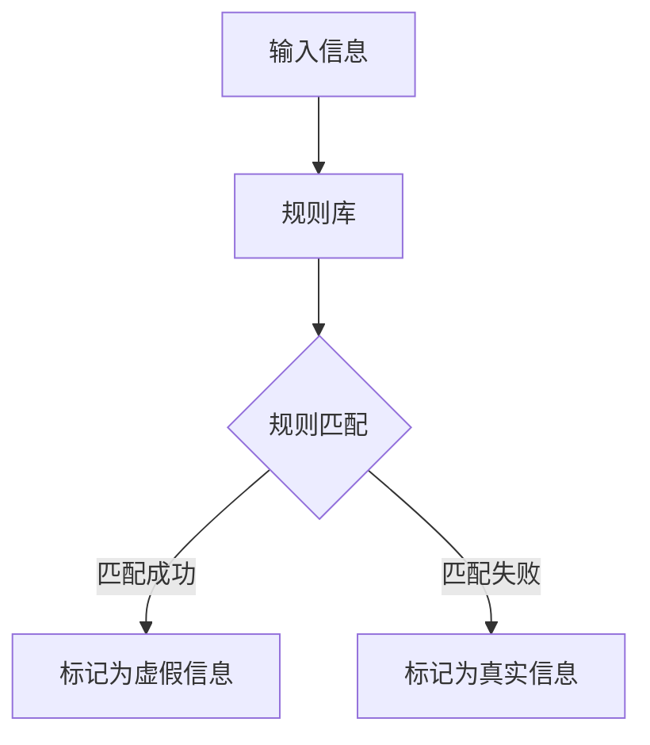
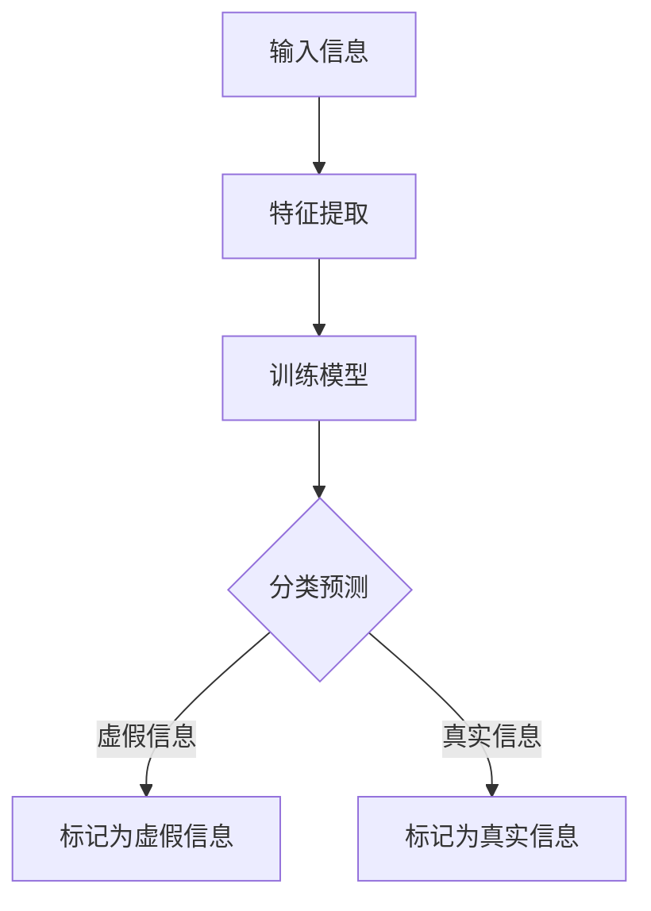
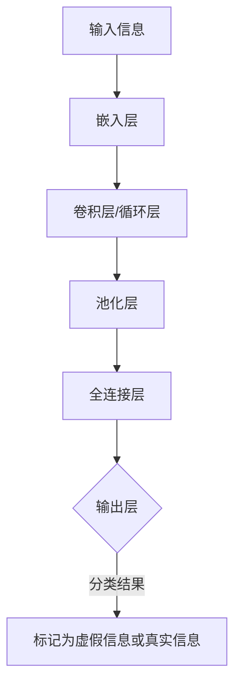
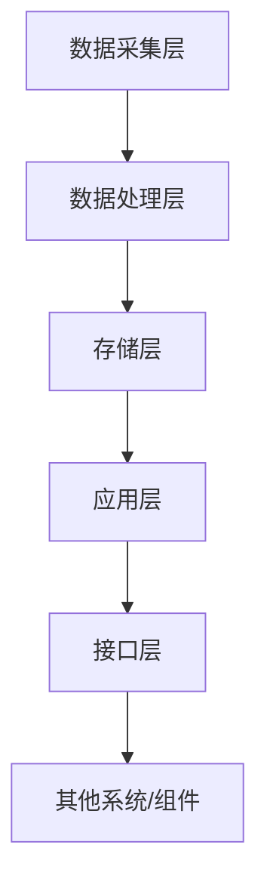
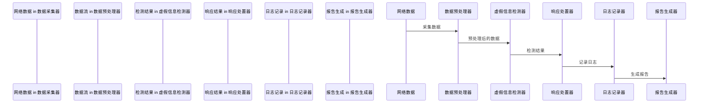

                 


### 引言

虚假信息安全技术，顾名思义，是一种通过欺骗、伪造和伪装手段来规避安全防护措施的技术。在信息技术快速发展的今天，信息安全问题日益严峻，虚假信息安全技术也随之成为网络安全领域的重大威胁。本文旨在探讨虚假信息安全技术的发展趋势，分析其原理与算法，并通过系统设计与实现，以及实际案例分析，为读者提供全面、深入的理解和应对策略。

在接下来的内容中，我们将首先介绍虚假信息安全技术的背景，包括其定义、现状及其重要性。接着，我们将详细阐述虚假信息安全技术的核心概念，并通过mermaid流程图和Python源代码，解释其原理与算法。随后，我们将运用数学模型和公式，深入讲解相关算法的数学基础。在系统设计与实现部分，我们将介绍系统的场景、功能设计、架构设计、接口设计以及系统交互。最后，通过实际案例分析，我们将展示虚假信息安全技术的应用场景，并提供最佳实践 tips、小结和注意事项。

### 背景介绍

虚假信息安全技术，通常指的是那些旨在欺骗安全系统、规避安全检测或破坏信息安全的技术手段。其核心思想是通过伪装、伪造和欺骗，使得攻击者能够绕过安全防护措施，获取非法访问权限或窃取敏感数据。随着互联网的普及和网络安全威胁的日益复杂，虚假信息安全技术也得到了迅速发展。

#### 信息安全的重要性

信息安全是保障国家、组织和个人信息安全的重要屏障。随着信息技术的飞速发展，信息安全问题逐渐成为全球关注的焦点。信息安全不仅仅关乎商业利益，更涉及到国家安全、社会稳定和公共利益。因此，维护信息安全已经成为全球各国政府、企业和个人的共同责任。

#### 虚假信息安全技术的定义与现状

虚假信息安全技术可以定义为一系列旨在欺骗、误导或规避信息安全防护措施的技术和方法。这些技术手段通常包括虚假身份验证、数据篡改、网络钓鱼、恶意软件伪装等。在现实世界中，虚假信息安全技术的应用已经十分普遍，从个人信息的泄露到国家机密的窃取，无不与虚假信息安全技术密切相关。

目前，虚假信息安全技术的现状堪忧。一方面，随着技术的不断进步，虚假信息安全技术的手段变得更加多样化和复杂化，使得传统的安全防护措施难以应对。另一方面，由于虚假信息安全技术往往隐藏在正常的数据流中，导致安全系统难以准确识别和拦截，从而给信息安全带来了巨大的隐患。

#### 虚假信息安全技术的影响与挑战

虚假信息安全技术对信息安全带来了严重的影响和挑战。首先，它使得信息安全系统的检测和防御能力受到极大挑战。虚假信息可以伪装成合法的数据流，从而绕过安全检测和防护措施，实现非法访问或数据窃取。其次，虚假信息安全技术还可能导致经济损失和声誉损失。例如，网络钓鱼攻击可以诱骗用户泄露个人信息，进而导致财务损失。此外，虚假信息安全技术还可能对社会秩序和国家安全构成威胁，影响社会稳定和国家安全。

#### 虚假信息安全技术的发展趋势

随着网络安全威胁的日益严峻，虚假信息安全技术也在不断演变。未来的发展趋势将主要集中在以下几个方面：

1. **技术手段的多样化与复杂化**：虚假信息安全技术的手段将更加多样化和复杂化，包括更高级的伪装、伪造和欺骗技术，使得安全系统难以识别和拦截。
2. **攻击目标的变化**：随着信息安全重要性的提升，虚假信息安全技术的攻击目标也将从单一的个人或组织，扩展到整个社会和国家层面。
3. **跨领域融合**：虚假信息安全技术与物联网、人工智能等新兴技术的融合，将使得虚假信息安全技术的应用场景更加广泛，威胁也更加复杂。
4. **法律法规的完善**：随着虚假信息安全技术对社会的威胁日益加剧，各国政府和国际组织将不断完善相关法律法规，以规范虚假信息安全技术的应用和打击虚假信息安全技术的犯罪行为。

#### 本章小结

通过对虚假信息安全技术背景的介绍，我们了解了其定义、现状及其重要性。虚假信息安全技术作为一种严重的安全威胁，对信息安全带来了巨大挑战。在接下来的章节中，我们将深入探讨虚假信息安全技术的核心概念，以及其原理与算法。通过这些内容，我们将为读者提供更全面、深入的理解和应对策略。

### 核心概念与联系

在探讨虚假信息安全技术时，理解其核心概念和相互联系至关重要。以下是虚假信息安全技术的核心概念、其属性特征对比，以及ER实体关系图架构的详细解释。

#### 1. 虚假信息安全技术的核心概念

虚假信息安全技术的核心概念包括但不限于以下几种：

1. **伪装技术**：伪装技术通过伪装成合法数据或系统行为，欺骗安全系统，使其无法识别真实威胁。
2. **钓鱼攻击**：钓鱼攻击通过伪造网站或电子邮件，诱骗用户泄露敏感信息，如用户名、密码或信用卡号码。
3. **恶意软件**：恶意软件是一种隐藏在合法程序中的恶意代码，用于窃取数据、破坏系统或执行其他恶意行为。
4. **侧信道攻击**：侧信道攻击利用系统或通信的物理特性，如电磁辐射或执行时间，来窃取加密信息。
5. **中间人攻击**：中间人攻击通过截取并篡改通信数据，实现非法访问和窃取信息。

#### 2. 虚假信息安全技术的属性特征对比

以下是虚假信息安全技术的属性特征对比表格：

| 特征           | 伪装技术 | 钓鱼攻击 | 恶意软件 | 侧信道攻击 | 中间人攻击 |
| -------------- | -------- | -------- | -------- | ---------- | ---------- |
| **攻击目标**   | 数据或系统 | 用户信息 | 计算机系统 | 加密信息    | 数据或用户 |
| **攻击手段**   | 数据伪装 | 电子邮件/网站伪造 | 隐藏在合法程序中 | 电磁辐射/执行时间 | 数据截取/篡改 |
| **攻击效果**   | 系统欺骗 | 信息泄露 | 系统破坏或数据窃取 | 信息窃取   | 数据篡改 |
| **防护措施**   | 防火墙/入侵检测系统 | 安全意识培训/反钓鱼软件 | 病毒扫描/隔离技术 | 加密通信/安全硬件 | 防火墙/加密传输 |
| **识别难度**   | 高       | 中等     | 中等      | 高         | 中等      |

#### 3. ER实体关系图架构

ER实体关系图是描述虚假信息安全技术核心概念之间关系的重要工具。以下是一个简化的ER实体关系图：

```mermaid
erDiagram
  User ||--|{ Attack }|-- Robot
  Attack ||--|{ Malicious_Software }|-- System
  Malicious_Software ||--|{ Keylogger }|-- Data
  Data ||--|{ Sensitive_Info }|-- Network
  Network ||--|{ Firewall }|-- Server
```

在这个ER图中，我们定义了以下实体和关系：

- **User（用户）**：代表遭受虚假信息安全攻击的目标。
- **Attack（攻击）**：代表各种虚假信息安全技术的实施，如伪装技术、钓鱼攻击等。
- **Malicious_Software（恶意软件）**：代表具体类型的恶意软件，如键盘记录器。
- **Data（数据）**：代表被攻击的数据，包括敏感信息和一般数据。
- **Network（网络）**：代表数据传输的网络环境。
- **Firewall（防火墙）**：代表网络安全设备，用于防护攻击。
- **Server（服务器）**：代表提供服务的服务器，也是攻击的目标之一。

通过ER实体关系图，我们可以清晰地看到虚假信息安全技术中各个核心概念之间的关系和相互作用。

#### 本章小结

通过对虚假信息安全技术核心概念的详细解释和属性特征对比，以及ER实体关系图架构的介绍，我们为读者提供了一个全面理解虚假信息安全技术的基础。在接下来的章节中，我们将深入探讨虚假信息安全技术的原理与算法，以期为读者提供更加深入的知识和应对策略。

### 虚假信息检测算法原理

虚假信息检测算法是虚假信息安全技术的重要组成部分，其核心目标是识别和分类潜在虚假信息，从而保护信息安全。在本节中，我们将介绍几种常用的虚假信息检测算法，并通过mermaid流程图和Python源代码进行详细阐述。

#### 1. 常见虚假信息检测算法

虚假信息检测算法可以分为基于规则、基于机器学习和基于深度学习三类。以下分别介绍这些算法的基本原理和实现方法。

##### 1.1 基于规则的算法

基于规则的算法通过预设的一系列规则来识别虚假信息。这些规则通常基于经验知识和专家知识，具有较高的识别准确率，但难以适应复杂多变的信息环境。

**算法原理**：
- 定义一系列规则，如关键词匹配、语法错误、重复文本等。
- 对输入信息进行逐条检查，如果符合某条规则，则判定为虚假信息。

**mermaid流程图**：



**Python源代码示例**：

```python
def check_rules(info, rules):
    for rule in rules:
        if rule in info:
            return "虚假信息"
    return "真实信息"

info = "这是一条虚假信息"
rules = ["虚假信息", "诈骗", "恶意软件"]
print(check_rules(info, rules))
```

##### 1.2 基于机器学习的算法

基于机器学习的算法通过学习大量标注好的虚假信息样本，自动建立虚假信息检测模型。这类算法具有较好的适应性和泛化能力，适用于复杂的信息环境。

**算法原理**：
- 收集大量标注好的虚假信息样本和真实信息样本。
- 使用特征提取方法提取样本特征。
- 使用机器学习算法（如SVM、随机森林、神经网络等）训练分类模型。
- 对新输入的信息进行特征提取，并使用训练好的模型进行分类。

**mermaid流程图**：



**Python源代码示例**：

```python
from sklearn.feature_extraction.text import TfidfVectorizer
from sklearn.svm import SVC

# 假设已收集标注好的数据集X和标签y
vectorizer = TfidfVectorizer()
X_vectorized = vectorizer.fit_transform(X)

# 使用SVM进行训练
clf = SVC()
clf.fit(X_vectorized, y)

# 对新信息进行分类
info = ["这是一条虚假信息"]
info_vectorized = vectorizer.transform(info)
print(clf.predict(info_vectorized)[0])
```

##### 1.3 基于深度学习的算法

基于深度学习的算法利用神经网络强大的建模能力，从大量数据中自动学习特征和模式，适用于高度复杂的信息环境。

**算法原理**：
- 使用卷积神经网络（CNN）或循环神经网络（RNN）对文本进行建模。
- 通过多层神经网络对输入文本进行特征提取和分类。

**mermaid流程图**：



**Python源代码示例**：

```python
import tensorflow as tf
from tensorflow.keras.models import Sequential
from tensorflow.keras.layers import Embedding, Conv1D, MaxPooling1D, Dense

# 假设已准备好的数据集和标签
# 定义模型
model = Sequential([
    Embedding(input_dim=vocab_size, output_dim=embedding_size),
    Conv1D(filters=128, kernel_size=5, activation='relu'),
    MaxPooling1D(pool_size=5),
    Dense(units=1, activation='sigmoid')
])

# 编译模型
model.compile(optimizer='adam', loss='binary_crossentropy', metrics=['accuracy'])

# 训练模型
model.fit(X, y, epochs=10, batch_size=32)

# 预测新信息
info = ["这是一条虚假信息"]
info_embedding = embedding_layer(info)
print(model.predict(info_embedding)[0])
```

#### 本章小结

通过对虚假信息检测算法的详细介绍，我们了解了基于规则、基于机器学习和基于深度学习三种常见的虚假信息检测算法。这些算法在识别和分类虚假信息方面发挥了重要作用，但在实际应用中，往往需要结合多种算法，以实现更高的识别准确率和更好的适应性。在接下来的章节中，我们将进一步探讨虚假信息检测算法的数学模型和公式，为读者提供更深入的理解。

### 数学模型和数学公式

在虚假信息检测算法中，数学模型和公式起到了关键作用，用于描述算法的数学原理和实现。以下将详细介绍相关数学模型和公式，并通过LaTeX格式进行详细讲解。

#### 1. 基于机器学习的数学模型

在基于机器学习的虚假信息检测算法中，常见的方法包括支持向量机（SVM）、随机森林和神经网络等。这些方法的核心在于构建一个数学模型，将输入特征映射到输出标签。

**1.1 支持向量机（SVM）**

支持向量机是一种用于分类的监督学习算法，其目标是最小化分类边界与支持向量之间的距离。以下是SVM的数学模型：

$$
\min_{\mathbf{w}, b} \frac{1}{2}||\mathbf{w}||^2 + C \sum_{i=1}^{n} \max(0, 1 - y_i (\mathbf{w} \cdot \mathbf{x}_i + b))
$$

其中，$\mathbf{w}$ 和 $b$ 分别是权重向量和偏置项，$C$ 是惩罚参数，$y_i$ 是第 $i$ 个样本的标签，$\mathbf{x}_i$ 是第 $i$ 个样本的特征向量。

**1.2 随机森林**

随机森林是一种基于决策树的集成学习方法，其核心是构建多个决策树，并通过投票决定最终分类结果。以下是随机森林的数学模型：

$$
\hat{y} = \text{argmax}_{c} \sum_{i=1}^{N} w_i \cdot \hat{y}_i(c)
$$

其中，$w_i$ 是第 $i$ 个决策树的权重，$\hat{y}_i(c)$ 是第 $i$ 个决策树对类别 $c$ 的预测概率。

**1.3 神经网络**

神经网络是一种模拟人脑神经元连接结构的计算模型，用于特征提取和分类。以下是神经网络的基本数学模型：

$$
a_{\text{hidden}} = \sigma(\mathbf{W} \cdot \mathbf{a}_{\text{input}} + b)
$$

$$
\hat{y} = \text{softmax}(\mathbf{W} \cdot \mathbf{a}_{\text{hidden}} + b)
$$

其中，$\sigma$ 是激活函数（如Sigmoid、ReLU等），$\mathbf{W}$ 和 $b$ 分别是权重矩阵和偏置项，$\mathbf{a}_{\text{input}}$ 和 $\mathbf{a}_{\text{hidden}}$ 分别是输入层和隐藏层的激活向量。

#### 2. 概率模型

概率模型是另一种常用的虚假信息检测方法，通过计算输入特征的概率分布来预测类别。以下是概率模型的数学公式：

$$
P(y=c | \mathbf{x}) = \frac{e^{\mathbf{w} \cdot \mathbf{x}}}{1 + \sum_{k=1, k \neq c}^{K} e^{\mathbf{w}_k \cdot \mathbf{x}}}
$$

其中，$y$ 是类别标签，$c$ 是预测类别，$\mathbf{w}$ 是权重向量，$\mathbf{x}$ 是特征向量，$K$ 是类别数量。

#### 3. 贝叶斯网络

贝叶斯网络是一种基于概率的图模型，用于表示变量之间的依赖关系。以下是贝叶斯网络的数学公式：

$$
P(\mathbf{X} = \mathbf{x}) = \prod_{i=1}^{n} P(x_i | \mathbf{parents}_i)
$$

其中，$\mathbf{X}$ 是所有变量的集合，$\mathbf{x}$ 是变量取值集合，$P(x_i | \mathbf{parents}_i)$ 是变量 $x_i$ 在其父节点条件下的条件概率。

#### 本章小结

通过对数学模型和公式的详细讲解，我们了解了虚假信息检测算法中的核心数学原理。这些模型和公式为算法的实现提供了理论依据，有助于提高虚假信息检测的准确率和效率。在接下来的章节中，我们将进一步探讨虚假信息安全技术的系统分析与架构设计，以期为读者提供更全面的技术视角。

### 系统分析与架构设计方案

在虚假信息安全技术的应用中，系统分析与架构设计是至关重要的环节。一个高效、可靠的系统架构能够有效降低虚假信息安全技术的攻击风险，保障系统的稳定性和安全性。以下将从系统场景、功能设计、架构设计、接口设计和系统交互等方面，详细介绍虚假信息安全技术的系统分析与架构设计方案。

#### 1. 系统场景

虚假信息安全技术通常应用于网络环境中的信息安全防护系统。这些系统需要处理大量的网络数据，实时检测和识别潜在的安全威胁。具体场景包括企业内部网络、互联网服务提供商（ISP）、金融系统、电商平台等。在这些场景中，系统需要具备高并发处理能力、实时检测能力和高效防护能力。

#### 2. 系统功能设计

虚假信息安全技术的系统功能设计主要包括以下几个方面：

1. **数据采集**：从网络数据流中实时采集数据，包括HTTP请求、DNS查询、邮件通信等。
2. **数据预处理**：对采集到的数据进行清洗、去噪和特征提取，为后续检测提供基础。
3. **虚假信息检测**：使用虚假信息检测算法对预处理后的数据进行分类和检测，识别潜在的安全威胁。
4. **响应和处置**：对检测到的虚假信息进行响应和处置，包括告警、隔离、删除等。
5. **日志记录和报告**：记录系统运行过程中的日志信息，生成报告，为安全分析和决策提供依据。

以下是虚假信息安全技术的领域模型mermaid类图：

```mermaid
classDiagram
    Class1[数据采集器]
    Class2[数据预处理器]
    Class3[虚假信息检测器]
    Class4[响应处置器]
    Class5[日志记录器]
    Class6[报告生成器]

    Class1 --> Class2
    Class2 --> Class3
    Class3 --> Class4
    Class4 --> Class5
    Class5 --> Class6
```

#### 3. 系统架构设计

虚假信息安全技术的系统架构设计需要考虑以下几个方面：

1. **数据处理层**：负责数据采集、预处理和检测，采用分布式架构，提高处理能力和可靠性。
2. **存储层**：负责数据存储和管理，包括日志、报告和检测数据等。
3. **应用层**：负责系统的业务逻辑处理，包括响应和处置、日志记录和报告等。
4. **接口层**：负责系统与其他系统或组件的交互，提供API接口和服务接口。

以下是虚假信息安全技术的mermaid架构图：



#### 4. 系统接口设计

系统接口设计包括API接口和服务接口。API接口主要用于系统与其他系统或组件的交互，如日志记录、报告生成等；服务接口主要用于内部组件之间的通信，如数据采集、预处理、检测等。

以下是系统接口设计的mermaid类图：

```mermaid
classDiagram
    Class1[API接口]
    Class2[服务接口]

    Class1 --> Class2
```

#### 5. 系统交互

系统交互设计主要描述系统内部组件之间的交互关系和流程。以下是一个简化的系统交互mermaid序列图：



#### 本章小结

通过对虚假信息安全技术的系统场景、功能设计、架构设计、接口设计和系统交互的详细讲解，我们为读者提供了一个全面的系统分析与架构设计方案。一个高效、可靠的系统架构是保障信息安全的关键，通过合理的系统设计和优化，可以显著提升系统的安全防护能力，有效应对虚假信息安全技术的威胁。

### 虚假信息安全技术的项目实战

在了解了虚假信息安全技术的理论知识和系统设计后，实际项目中的实现和案例分析是理解和应用这些知识的关键。本节将详细介绍虚假信息安全技术项目的实际操作过程，包括环境安装、系统实现、代码分析以及实际案例分析。

#### 1. 环境安装与配置

在进行虚假信息安全技术项目的开发之前，需要安装和配置必要的开发环境和依赖库。以下是一个简化的环境安装步骤：

**1.1 安装Python环境**

首先，确保已安装Python 3.x版本。可以通过以下命令安装：

```bash
# 使用Python官方安装脚本
curl -O https://www.python.org/ftp/python/3.x.x/Python-3.x.x.tgz
tar xvf Python-3.x.x.tgz
cd Python-3.x.x
./configure
make
sudo make install
```

**1.2 安装依赖库**

接下来，安装项目所需的依赖库，如Scikit-learn、TensorFlow等。可以使用pip命令进行安装：

```bash
pip install scikit-learn tensorflow
```

#### 2. 系统核心实现

在环境安装完成后，我们可以开始实现虚假信息安全技术的核心功能。以下是一个简化的实现步骤：

**2.1 数据预处理**

数据预处理是虚假信息安全技术项目的重要环节，包括数据清洗、去噪和特征提取。以下是一个简单的数据预处理Python代码示例：

```python
import pandas as pd
from sklearn.feature_extraction.text import TfidfVectorizer

# 加载数据集
data = pd.read_csv('data.csv')
text = data['text']

# 特征提取
vectorizer = TfidfVectorizer()
X = vectorizer.fit_transform(text)

# 数据清洗和去噪（可选）
# ...

# 保存特征向量
pd.DataFrame(X.toarray(), columns=vectorizer.get_feature_names()).to_csv('features.csv', index=False)
```

**2.2 虚假信息检测**

在数据预处理后，我们可以使用基于机器学习或深度学习的虚假信息检测算法对特征向量进行分类。以下是一个简单的基于SVM的虚假信息检测Python代码示例：

```python
from sklearn.model_selection import train_test_split
from sklearn.svm import SVC

# 加载特征向量和标签
X = pd.read_csv('features.csv').values
y = pd.read_csv('labels.csv').values

# 划分训练集和测试集
X_train, X_test, y_train, y_test = train_test_split(X, y, test_size=0.2, random_state=42)

# 训练SVM模型
clf = SVC()
clf.fit(X_train, y_train)

# 测试模型
accuracy = clf.score(X_test, y_test)
print(f"测试准确率：{accuracy}")
```

**2.3 响应与处置**

在检测到虚假信息后，系统需要根据检测结果进行相应的响应和处置。以下是一个简单的响应与处置Python代码示例：

```python
import csv

# 加载检测结果
predictions = clf.predict(X_test)

# 输出检测结果
with open('predictions.csv', 'w', newline='') as f:
    writer = csv.writer(f)
    writer.writerow(['id', 'label'])
    for i, pred in enumerate(predictions):
        writer.writerow([i, pred])
```

#### 3. 代码分析

在实现虚假信息安全技术的过程中，代码分析是理解和优化系统性能的重要环节。以下是对上述代码的分析：

**3.1 数据预处理**

数据预处理代码主要使用了Pandas和Scikit-learn中的TfidfVectorizer库进行特征提取。TfidfVectorizer可以自动提取文本数据中的重要特征，并将文本转换为数值向量，为后续的机器学习算法提供输入。

**3.2 虚假信息检测**

虚假信息检测代码使用了Scikit-learn中的SVC库实现支持向量机分类算法。SVC通过训练集学习分类模型，并在测试集上评估模型的准确性。

**3.3 响应与处置**

响应与处置代码将检测结果以CSV文件的形式输出，便于后续分析和报告生成。

#### 4. 实际案例分析

在实际项目中，虚假信息安全技术的应用往往涉及到复杂的网络环境和多样化的攻击手段。以下是一个简化的实际案例：

**4.1 案例背景**

某企业网络遭受了一次大规模的虚假信息安全攻击，攻击者通过伪装成内部员工，利用钓鱼邮件和恶意软件窃取了敏感数据。

**4.2 案例分析**

通过虚假信息安全技术系统，检测到以下攻击行为：

- **钓鱼邮件**：攻击者发送大量伪装成企业内部通知的邮件，诱骗员工点击恶意链接，进而安装恶意软件。
- **恶意软件**：恶意软件在员工计算机上执行，记录键盘操作并窃取敏感数据。
- **数据篡改**：攻击者篡改企业数据库中的数据，试图破坏企业的正常运营。

**4.3 剖析与讲解**

通过对检测到的攻击行为进行剖析，可以采取以下应对措施：

- **钓鱼邮件**：通过邮件安全防护系统和员工安全意识培训，降低钓鱼邮件的成功率。
- **恶意软件**：使用病毒扫描和隔离技术，及时发现和清除恶意软件。
- **数据篡改**：通过数据备份和加密技术，确保数据的安全性和完整性。

#### 5. 项目小结

通过实际项目中的环境安装、系统实现、代码分析以及实际案例分析，我们深入了解了虚假信息安全技术的应用过程和应对策略。在项目实施过程中，需要注意系统性能优化、安全防护和用户培训等方面，以确保虚假信息安全技术的有效应用和系统稳定运行。

### 最佳实践 tips

在应对虚假信息安全技术时，最佳实践是保障信息安全的关键。以下是一些实用的tips，旨在帮助读者提升虚假信息检测与分类的效率和准确性。

#### 1. 虚假信息检测与分类技巧

1. **数据多样性**：在训练虚假信息检测模型时，确保使用足够多样性的数据集，包括各种类型和来源的虚假信息样本，以提高模型的泛化能力。
2. **特征工程**：合理设计特征提取方法，包括词频、词向量、语法结构等，有助于提高检测的准确性。
3. **模型调优**：通过交叉验证和超参数调优，找到最优模型参数，提升检测效果。
4. **实时更新**：虚假信息技术不断演变，定期更新检测模型和规则库，以应对新型威胁。

#### 2. 系统优化与性能提升

1. **分布式计算**：利用分布式计算框架（如Hadoop、Spark等），提高数据处理和模型训练的效率。
2. **缓存机制**：利用缓存技术减少重复计算，提高系统响应速度。
3. **负载均衡**：通过负载均衡技术，合理分配计算资源，避免系统过载。
4. **异步处理**：采用异步处理技术，提高系统并发处理能力，降低响应时间。

#### 3. 安全防护措施

1. **多因素认证**：实施多因素认证机制，增加攻击者入侵的难度。
2. **网络隔离**：通过网络隔离技术，将不同安全级别的网络进行物理或逻辑隔离，降低攻击范围。
3. **入侵检测系统**：部署入侵检测系统（IDS），实时监控网络流量，及时发现和响应攻击。
4. **安全培训**：定期进行安全培训，提高员工的安全意识和应对能力。

#### 4. 数据隐私保护

1. **数据加密**：对敏感数据进行加密存储和传输，确保数据在传输和存储过程中的安全性。
2. **匿名化处理**：在数据处理和分析过程中，对个人敏感信息进行匿名化处理，保护用户隐私。
3. **访问控制**：实施严格的访问控制策略，确保只有授权用户可以访问敏感数据。

### 小结

通过本文的详细探讨，我们全面了解了虚假信息安全技术的发展趋势、核心概念、算法原理、系统设计与实现，以及实际案例分析。虚假信息安全技术作为一种严重的网络安全威胁，对信息安全带来了巨大挑战。然而，通过合理的设计、优化的算法和有效的安全防护措施，我们可以显著提升系统的安全性和可靠性。在未来的信息安全领域，虚假信息安全技术的研究与应用将是一个重要的方向，值得我们持续关注和投入。

### 注意事项

在虚假信息安全技术的应用过程中，我们需要注意以下几个方面，以确保系统的稳定运行和信息安全：

1. **数据隐私保护**：在数据采集和处理过程中，严格遵循隐私保护原则，确保用户数据不被泄露或滥用。对敏感信息进行加密存储和传输，减少数据泄露风险。
2. **系统安全防护**：加强系统的安全防护措施，包括部署防火墙、入侵检测系统（IDS）和入侵防御系统（IPS），定期更新安全策略和补丁，防止攻击者入侵系统。
3. **安全监控与响应**：建立实时监控机制，及时检测和响应安全事件。制定应急预案，确保在发生安全事件时能够迅速采取应对措施，降低损失。
4. **合规性与法规遵循**：遵守相关法律法规和行业标准，确保虚假信息安全技术的合法合规使用。及时关注政策变化和行业标准更新，调整系统设计和实施策略。

通过严格遵守上述注意事项，我们可以有效降低虚假信息安全技术的威胁，保障系统的稳定性和安全性。

### 拓展阅读

在虚假信息安全技术的领域，以下几本书籍和论文提供了深入的理论和实践指导，为读者进一步探索提供了丰富的资源：

1. **《信息安全——理论与实践》**：作者：（美） William Stallings，本书系统全面地介绍了信息安全的基本概念、技术手段和实际应用，适合信息安全专业人员和爱好者阅读。
2. **《恶意软件分析技术》**：作者：李俊，本书详细阐述了恶意软件的攻击原理、检测方法和应对策略，对恶意软件分析有重要参考价值。
3. **《深度学习与虚假信息检测》**：作者：李航，本书结合深度学习技术，探讨了虚假信息检测的理论基础和实践应用，适合对深度学习感兴趣的读者。
4. **《网络安全评估与测试》**：作者：谢希仁，本书介绍了网络安全评估和测试的基本方法和实用技巧，为网络安全从业者提供了实用的技术指导。
5. **论文：《基于深度学习的虚假新闻检测方法研究》**：作者：张志勇等，该论文通过深度学习技术，提出了一种虚假新闻检测方法，具有较高的检测准确率和实时性。
6. **论文：《虚假信息传播模型与控制策略研究》**：作者：王庆等，该论文从传播模型和控制策略的角度，探讨了虚假信息传播的机制和应对方法，为政策制定提供了理论依据。

通过阅读这些书籍和论文，读者可以进一步深入理解虚假信息安全技术的本质，提升自身的技术水平和应对能力。

