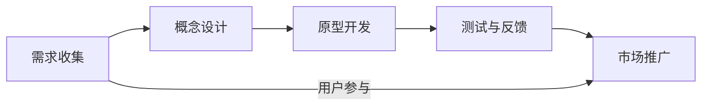
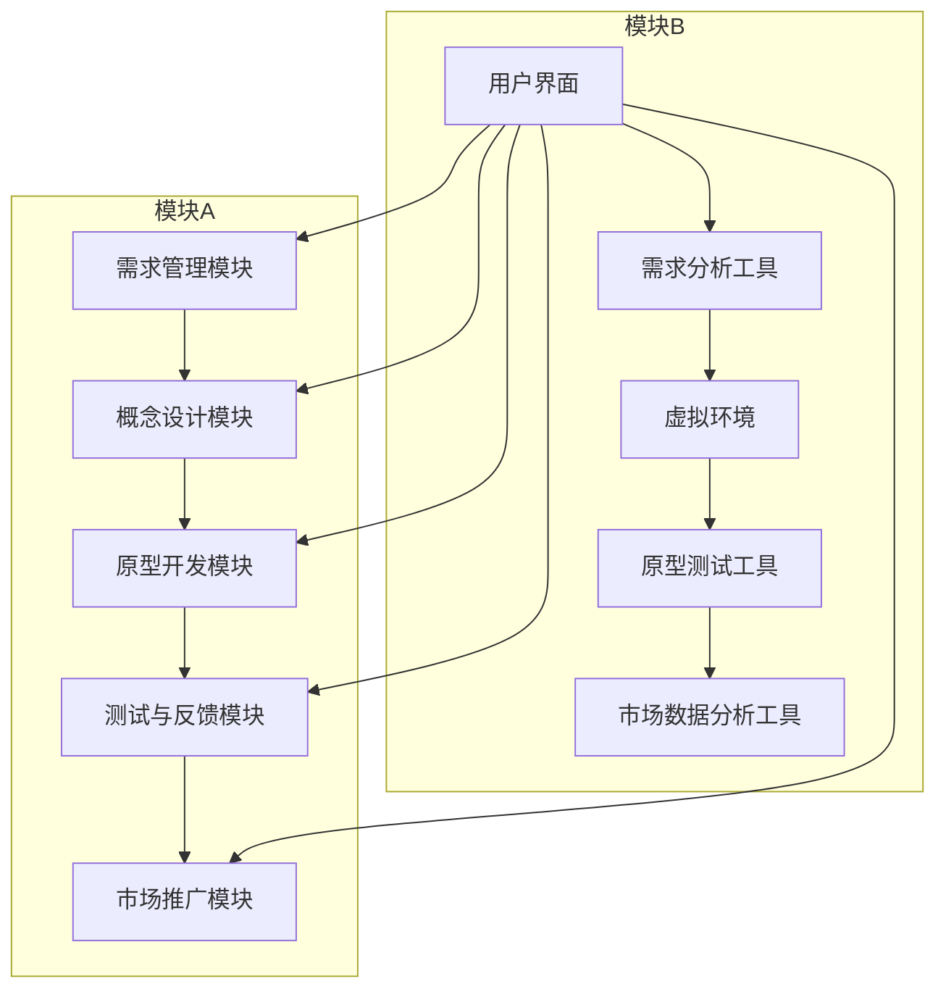

                 

# 虚拟产品开发：空间计算技术加速创新周期

关键词：虚拟产品开发、空间计算技术、创新周期、协同设计、数据可视化

摘要：随着科技的迅猛发展，虚拟产品开发（Virtual Product Development，VPD）已成为现代企业创新的重要手段。本文将探讨空间计算技术在VPD中的应用，如何通过空间计算技术加速创新周期，提高产品开发效率和市场竞争力。

#### 一、背景介绍

在现代商业环境中，产品开发的速度和效率是决定企业成败的关键因素。传统产品开发方法通常涉及复杂的设计流程、长时间的研发周期和高昂的成本，往往难以迅速响应市场的变化。虚拟产品开发（VPD）作为一种创新的开发方法，通过空间计算技术（Space Computing Technology）实现了对产品开发过程的加速和创新。

空间计算技术是近年来兴起的一门交叉学科，它结合了计算机图形学、虚拟现实（VR）和增强现实（AR）等多种前沿技术，旨在模拟和扩展现实空间，为VPD提供强大的技术支持。空间计算技术不仅能够提高产品的设计精度和用户体验，还能够大幅减少开发成本和时间。

##### 1.1. 问题背景

传统产品开发面临的挑战主要包括：

- **复杂性管理**：产品开发过程涉及多个技术领域，如何有效协调和整合这些技术成为一个重要问题。
- **数据集成**：VPD需要处理来自不同来源的大量数据，如何高效集成和利用这些数据是实现加速创新的关键。
- **用户参与**：用户需求在产品开发中的地位日益重要，但如何有效收集用户反馈和需求，是VPD面临的一个挑战。

##### 1.2. 问题描述

VPD过程中存在的问题主要包括：

- **协同工作**：如何利用VR和AR技术，提供一个沉浸式环境，使团队成员能够实时协作。
- **数据可视化**：如何通过空间计算技术，将复杂的数据以直观的方式呈现，便于分析和决策。
- **用户参与**：如何利用VR和AR技术，让用户在早期阶段就能够参与到产品开发中，提供实时反馈。

##### 1.3. 问题解决

空间计算技术通过以下几个方面解决了VPD中的问题：

- **协同工作**：利用VR和AR技术，提供一个沉浸式环境，使团队成员能够实时协作。
- **数据可视化**：通过空间计算技术，将复杂的数据以直观的方式呈现，便于分析和决策。
- **用户参与**：利用VR和AR技术，让用户在早期阶段就能够参与到产品开发中，提供实时反馈。

##### 1.4. 边界与外延

VPD不仅关注产品的虚拟化，还包括整个产品生命周期的管理。从概念设计到市场推广，每个阶段都可以通过空间计算技术来优化。

##### 1.5. 概念结构与核心要素组成

VPD涉及以下核心概念和要素：

- **空间计算技术**：包括计算机图形学、虚拟现实、增强现实、人工智能和大数据分析。
- **虚拟产品开发流程**：包括需求收集、概念设计、原型开发、测试与反馈、市场推广。

#### 二、核心概念与联系

##### 2.1. 核心概念

- **虚拟产品开发（VPD）**：一种以空间计算技术为基础的产品开发方法，强调快速迭代和用户参与。
- **空间计算技术**：利用计算机技术模拟和扩展现实空间，为VPD提供技术支持。
- **协同设计**：通过VR和AR技术，实现团队成员在虚拟环境中的实时协作。

##### 2.2. 概念属性特征对比表格

| 特征               | 虚拟产品开发（VPD） | 空间计算技术          | 协同设计            |
|--------------------|--------------------|----------------------|---------------------|
| 目的               | 加速产品开发        | 模拟和扩展现实空间   | 提高协作效率        |
| 技术支持           | VR、AR、AI、大数据 | VR、AR、AI、大数据   | VR、AR、AI          |
| 主要挑战           | 复杂性管理、数据集成、用户参与 | 数据可视化、计算资源 | 协作效率、沟通障碍  |
| 优势               | 加速创新、降低成本  | 提高数据分析能力     | 提高协作效率、增强用户体验 |

##### 2.3. ER实体关系图架构

```mermaid
erDiagram
  Product -->|1| Requirement
  Product -->|1| Design
  Product -->|1| Prototype
  Product -->|1| Testing
  Product -->|1| Marketing
  Requirement -->|1| User
  Design -->|1| TeamMember
  Prototype -->|1| Feedback
  Testing -->|1| Quality
  Marketing -->|1| Customer
```

#### 三、算法原理讲解

##### 3.1. 算法流程图



##### 3.2. Python源代码

```python
# 虚拟产品开发流程示例

def demand_collection():
    # 收集用户需求
    pass

def concept_design():
    # 概念设计
    pass

def prototype_development():
    # 原型开发
    pass

def testing_and_feedback():
    # 测试与反馈
    pass

def marketing():
    # 市场推广
    pass

if __name__ == "__main__":
    demand_collection()
    concept_design()
    prototype_development()
    testing_and_feedback()
    marketing()
```

#### 四、系统分析与架构设计方案

##### 4.1. 问题场景介绍

在产品开发过程中，如何高效地管理需求、设计、原型和测试等环节，是每个项目团队面临的重要问题。VPD通过空间计算技术提供了一种全新的解决方案，使得团队成员可以在虚拟环境中协同工作，从而提高开发效率和产品质量。

##### 4.2. 项目介绍

本项目旨在构建一个基于空间计算技术的虚拟产品开发平台，该平台将集成需求收集、概念设计、原型开发、测试与反馈以及市场推广等功能。通过该平台，项目团队可以实时协作、快速迭代，以适应市场变化。

##### 4.3. 系统功能设计

系统功能设计主要包括以下方面：

- **需求管理**：收集并管理用户需求，提供需求分析工具。
- **概念设计**：提供虚拟环境进行产品概念设计，支持多人实时协作。
- **原型开发**：支持快速开发原型，并提供原型测试和反馈功能。
- **测试与反馈**：对原型进行测试，收集用户反馈，优化产品设计。
- **市场推广**：提供市场数据分析工具，支持产品市场推广。

##### 4.4. 系统架构设计

系统架构设计如图所示：



##### 4.5. 系统接口设计和系统交互

系统接口设计和系统交互如图所示：


#### 五、项目实战

##### 5.1. 环境安装

在开始项目实战之前，首先需要安装以下软件和工具：

- **Unity**：用于创建虚拟环境和原型开发。
- **Unreal Engine**：用于创建高品质的虚拟现实和增强现实应用。
- **Python**：用于编写自动化脚本和数据分析。
- **Docker**：用于容器化部署和管理。

##### 5.2. 系统核心实现源代码

以下是系统核心实现的源代码示例：

```python
# 需求收集模块

def demand_collection():
    # 收集用户需求
    pass

# 概念设计模块

def concept_design():
    # 概念设计
    pass

# 原型开发模块

def prototype_development():
    # 原型开发
    pass

# 测试与反馈模块

def testing_and_feedback():
    # 测试与反馈
    pass

# 市场推广模块

def marketing():
    # 市场推广
    pass
```

##### 5.3. 代码应用解读与分析

代码应用解读与分析如下：

- **需求收集模块**：该模块负责收集用户需求，通过Python脚本实现与用户的交互，获取用户需求信息。
- **概念设计模块**：该模块负责将用户需求转化为产品概念，利用Unity和Unreal Engine等工具进行虚拟环境搭建和原型开发。
- **原型开发模块**：该模块负责开发产品原型，通过虚拟环境进行测试和优化。
- **测试与反馈模块**：该模块负责对产品原型进行测试，收集用户反馈，并根据反馈优化产品设计。
- **市场推广模块**：该模块负责对产品进行市场推广，通过数据分析工具分析市场趋势，制定推广策略。

##### 5.4. 实际案例分析和详细讲解剖析

以下是一个实际案例分析和详细讲解剖析：

**案例：一款智能家居控制系统的虚拟产品开发**

1. **需求收集**：通过用户调研和访谈，收集用户对智能家居系统的需求，如远程控制家电、智能安防等。

2. **概念设计**：利用Unity搭建一个虚拟家庭环境，将用户需求转化为虚拟场景，通过协同设计工具实现团队成员实时协作。

3. **原型开发**：在虚拟环境中开发智能家居系统的原型，如添加智能音箱、智能门锁等设备，并通过虚拟环境进行测试和优化。

4. **测试与反馈**：在虚拟环境中进行用户测试，收集用户反馈，如设备的操作便捷性、系统的稳定性等，并根据反馈优化产品。

5. **市场推广**：通过市场数据分析工具，分析市场趋势和用户需求，制定智能家居系统的推广策略，如广告投放、产品发布会等。

##### 5.5. 项目小结

本项目通过虚拟产品开发平台，实现了对产品开发过程的优化，提高了开发效率和产品质量。在实际应用中，通过空间计算技术实现了团队成员的实时协作和用户需求的快速响应，有效缩短了产品开发周期。

#### 六、最佳实践 tips

1. **明确项目目标和需求**：在项目启动阶段，确保所有团队成员对项目目标和需求有清晰的认识，减少后续开发中的误解和偏差。

2. **充分利用协同设计工具**：通过VR和AR技术，提供沉浸式环境，使团队成员能够实时协作，提高协作效率和产品质量。

3. **重视用户反馈**：在产品开发过程中，持续收集用户反馈，并根据反馈进行产品优化，以适应市场需求。

4. **数据驱动决策**：利用大数据分析工具，对用户行为和市场趋势进行分析，为产品开发提供数据支持。

#### 七、小结

虚拟产品开发（VPD）通过空间计算技术实现了产品开发过程的加速和创新。通过协同设计、数据可视化和用户参与，VPD有效解决了传统产品开发面临的复杂性管理、数据集成和用户参与等问题。在未来的发展中，VPD有望成为企业创新的重要手段，助力企业在激烈的市场竞争中脱颖而出。

#### 八、注意事项

1. **技术选型**：在VPD项目中，应根据具体需求和团队技术实力，选择合适的技术和工具。
2. **团队协作**：确保团队成员之间有良好的沟通和协作，以提高开发效率。
3. **安全与隐私**：在VPD过程中，确保用户数据的安全和隐私，遵守相关法律法规。

#### 九、拓展阅读

1. **《虚拟产品开发：理论与实践》**：详细介绍了虚拟产品开发的原理和实践方法。
2. **《空间计算技术与应用》**：探讨了空间计算技术在各个领域的应用。
3. **《人工智能与虚拟产品开发》**：分析了人工智能技术在VPD中的应用和影响。

作者：AI天才研究院/AI Genius Institute & 禅与计算机程序设计艺术 /Zen And The Art of Computer Programming

