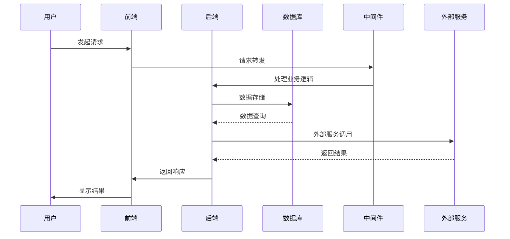
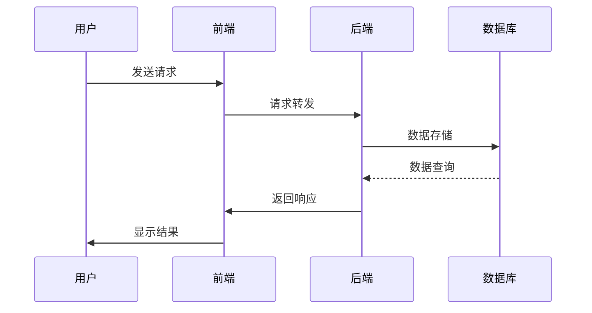

                 

### 虚拟偶像的起源与发展

在数字化的浪潮中，虚拟偶像这一概念逐渐成为文化和技术交汇的新星。虚拟偶像，亦称虚拟人、数字偶像，是由计算机图形、人工智能、音视频处理等技术构建的数字化人物形象。它们不仅拥有高度拟真的外貌和个性，还能与观众进行实时互动，提供音乐、舞蹈、主持等多种娱乐形式。

#### 起源

虚拟偶像的起源可以追溯到20世纪末。最早期的虚拟偶像之一是日本动画《AVATARIAN》中的艾薇塔（AVATARAN），这是一位通过动画技术呈现的虚拟歌星。随着时间的推移，虚拟偶像逐渐从动画和游戏领域走向现实，成为独立的娱乐形式。

#### 发展

21世纪初期，随着计算机技术和互联网的快速发展，虚拟偶像迎来了爆发期。2016年，日本虚拟偶像Hatsune Miku在演唱会上吸引了数万观众，引发了全球关注。此后，越来越多的虚拟偶像涌现，如中国的洛天依、韩国的IA等，它们不仅拥有庞大的粉丝群体，还参与了各种商业活动，成为了文化现象的一部分。

#### 技术进步

虚拟偶像技术的发展是它能够迅速崛起的重要原因。早期的虚拟偶像主要依赖于2D动画技术，而随着3D建模、实时渲染、深度学习等技术的进步，虚拟偶像的视觉效果和互动能力得到了极大的提升。例如，3D扫描技术可以精确捕捉演员的面部和身体特征，而人工智能技术则使虚拟偶像能够进行自然语言处理和情感表达。

#### 社会影响

虚拟偶像的兴起不仅改变了娱乐行业，也对社会产生了深远的影响。首先，虚拟偶像提供了全新的娱乐体验，使观众可以与喜爱的偶像进行互动，这种亲密感是传统偶像所难以实现的。其次，虚拟偶像的出现降低了偶像培养的成本，使更多的人有机会成为明星。此外，虚拟偶像也引发了关于身份、真实性和人机交互等哲学问题的讨论。

#### 下一步

随着技术的不断进步，虚拟偶像的未来充满了可能性。未来，虚拟偶像可能会在更多领域得到应用，如教育、医疗、市场营销等。同时，虚拟偶像与实体偶像的关系也将成为新的研究热点，探讨如何使虚拟偶像更好地服务于人类社会。

总之，虚拟偶像不仅是数字时代的一个文化现象，也是技术进步的产物。它的发展不仅丰富了我们的娱乐生活，也推动了技术和社会的变革。在接下来的章节中，我们将深入探讨虚拟偶像的技术原理、商业模式和应用场景，进一步理解这一新兴领域的魅力。### 第2章：数字时代的情感寄托

随着互联网和数字技术的飞速发展，人类社会已经进入了一个全新的数字时代。在这个时代，人们的生活方式、社交模式以及情感寄托的方式都发生了深刻的变化。虚拟偶像作为数字时代的产物，成为人们情感寄托的一种新型方式。本章将探讨数字时代情感寄托的背景、特征以及虚拟偶像在其中扮演的角色。

#### 数字时代情感寄托的背景

数字时代的特点是信息的高度互联和快速传播。在这个时代，人们接触信息的渠道变得多样化，社交方式也从面对面的交流转向线上互动。这种变化使得人们的情感寄托方式也发生了转变。

1. **信息爆炸**：随着互联网的普及，信息量急剧增加。人们通过社交媒体、新闻网站和博客等渠道获取信息，这使得情感寄托的对象从单一的实体偶像转向了多元化的虚拟内容。
   
2. **社交模式的改变**：数字时代，人们的社交方式变得更加便捷和灵活。线上社交平台和社交媒体的出现，使人们能够轻松地与远在他乡的朋友和家人保持联系，同时也使得陌生人之间的情感连接变得更加容易。

3. **情感需求的多样性**：在数字时代，人们面对的生活压力和工作压力普遍增大，情感需求变得更加多样化。虚拟偶像作为一种新型的情感寄托方式，能够满足人们对于陪伴、理解和支持的不同需求。

#### 数字时代情感寄托的特征

1. **虚拟性**：数字时代的情感寄托往往是虚拟的，即寄托在虚拟人物或虚拟社区上。这种虚拟性使得人们能够在没有物理接触的情况下，通过数字媒介感受到情感的共鸣。

2. **即时性**：数字技术使得人们能够即时获取信息、交流和互动，这种即时性也体现在情感寄托上。人们可以随时与虚拟偶像或其他粉丝互动，获得即时的情感反馈。

3. **个性化**：数字时代，人们可以更加个性化地选择和表达情感寄托。例如，粉丝可以根据自己的喜好定制虚拟偶像的形象和个性，这种个性化选择能够更好地满足个体的情感需求。

4. **依赖性**：随着虚拟偶像和虚拟社区的不断发展，人们对虚拟世界的依赖性也在增加。虚拟偶像成为他们生活中的一部分，甚至在一定程度上取代了现实生活中的人际关系。

#### 虚拟偶像在数字时代情感寄托中的作用

1. **情感共鸣**：虚拟偶像通常具有高度拟真的外貌和独特的个性，能够引起粉丝的情感共鸣。粉丝通过对虚拟偶像的喜爱，找到情感的宣泄和释放渠道。

2. **陪伴与支持**：虚拟偶像作为一种虚拟的存在，能够给人们带来陪伴感。特别是在人们感到孤独或失落时，虚拟偶像的陪伴能够提供一种心理上的慰藉。

3. **情感连接**：虚拟偶像不仅满足了个体情感的需求，还使得粉丝之间建立了强烈的情感连接。粉丝通过共同喜爱虚拟偶像，形成了一个个虚拟社区，这种社区连接感进一步强化了情感寄托。

4. **身份认同**：虚拟偶像为粉丝提供了一个身份认同的平台。粉丝通过支持虚拟偶像，表达自己的价值观和兴趣爱好，从而获得一种集体认同感。

总之，数字时代为人们的情感寄托提供了全新的方式和途径。虚拟偶像作为一种新兴的情感寄托方式，不仅丰富了人们的情感体验，也在一定程度上改变了人们的社交模式和生活方式。在接下来的章节中，我们将进一步探讨虚拟偶像的技术原理、商业模式和应用场景，深入理解这一现象对人类社会的影响。### 第2.1节：虚拟偶像的定义与特点

虚拟偶像，作为一种新兴的数字化人物形象，具有独特的定义和特点。在本节中，我们将详细阐述虚拟偶像的定义、基本特点以及与实体偶像的显著区别。

#### 定义

虚拟偶像，或称虚拟人、数字偶像，是指通过计算机图形、人工智能、音视频处理等技术手段创造出来的，具有高度拟真外貌和个性化特征的数字化人物。这些虚拟偶像通常具有自己的个性、声音和动作，能够在虚拟环境中与观众进行实时互动。

#### 基本特点

1. **高度拟真**：虚拟偶像通过先进的3D建模和实时渲染技术，具有高度拟真的外貌和动作。它们的面部表情、眼神和姿态都能精确地模仿现实中的偶像。

2. **个性化**：虚拟偶像可以根据用户的需求进行定制，包括外貌特征、声音、语调、性格等。这使得每个虚拟偶像都有其独特的个性和魅力，能够更好地满足不同用户的需求。

3. **实时互动**：虚拟偶像借助人工智能技术，能够与观众进行实时互动。例如，通过自然语言处理技术，虚拟偶像可以理解并回应观众的问题和指令，实现自然的对话和互动。

4. **低成本**：虚拟偶像的生产和运营成本相对较低，这使得更多的人有机会参与到偶像产业中。虚拟偶像的创建不需要实体场所和大量的基础设施，因此具有更广阔的市场前景。

5. **多功能性**：虚拟偶像不仅可以用于娱乐，还可以应用于教育、营销、客服等多个领域。它们能够根据不同的应用场景，进行相应的功能扩展和优化。

#### 与实体偶像的显著区别

1. **外貌和动作**：虚拟偶像的外貌和动作是通过计算机生成的，高度拟真但缺乏实体偶像的自然真实感。实体偶像的外貌和动作是基于人类身体和自然行为，更具真实感和自然性。

2. **互动方式**：虚拟偶像与观众的互动是通过数字化手段实现的，包括语音、文字、手势等。而实体偶像的互动方式更为直接和丰富，包括面对面交流、舞台表演等。

3. **成本和制作**：虚拟偶像的制作和运营成本较低，且可以大规模复制。而实体偶像的培养和维持成本较高，且数量有限。

4. **情感共鸣**：虚拟偶像与观众之间的情感共鸣主要依赖于高度拟真的外貌和互动技术。而实体偶像的情感共鸣则依赖于真实的情感交流和舞台表演。

5. **多样性和可扩展性**：虚拟偶像具有极高的多样性和可扩展性，可以轻松改变外貌和个性，适应不同的应用场景。而实体偶像的外貌和个性相对固定，难以大规模变化。

综上所述，虚拟偶像作为一种新兴的数字化人物形象，具有高度拟真、个性化、实时互动等特点。与实体偶像相比，虚拟偶像在成本、互动方式和多样性等方面具有显著优势。在接下来的章节中，我们将深入探讨虚拟偶像的技术原理、应用场景和未来发展，进一步了解这一领域的魅力和潜力。### 第2.2节：虚拟偶像与实体偶像的对比

虚拟偶像和实体偶像在数字时代中扮演着不同的角色，它们各有特点，也各自受到粉丝的喜爱。本节将通过对比虚拟偶像与实体偶像在多个维度的属性特征，帮助读者更全面地理解两者之间的差异。

#### 1. 外貌和形象

- **虚拟偶像**：虚拟偶像的外貌是通过3D建模和动画技术生成的，可以具有极高的拟真度。虚拟偶像的外貌设计通常更加多样，可以改变发型、肤色、服饰等特征，以适应不同粉丝的喜好。此外，虚拟偶像的面部表情和动作可以通过人工智能进行实时调整，使其表现更加自然和生动。
  
- **实体偶像**：实体偶像的外貌是基于真实人类的身体特征，虽然也可以通过化妆和服饰进行一定的改变，但整体上受限于人类生理特征和自然条件。实体偶像的个性形象较为固定，难以像虚拟偶像那样灵活变化。

#### 2. 互动方式

- **虚拟偶像**：虚拟偶像与粉丝的互动主要通过数字媒介进行，如线上直播、社交媒体、虚拟演唱会等。虚拟偶像可以通过自然语言处理技术实现与观众的实时对话，甚至可以模拟情感交流，为粉丝带来沉浸式的互动体验。
  
- **实体偶像**：实体偶像与粉丝的互动主要发生在现实生活中，包括演唱会、签名会、见面会等。这种互动更为直接和真实，实体偶像可以通过舞台表演和现场互动与粉丝建立深厚的情感联系。

#### 3. 成本和效益

- **虚拟偶像**：虚拟偶像的制作和运营成本相对较低，可以通过数字化手段大规模复制和推广。虚拟偶像的生产流程高度自动化，降低了人力和物力成本。同时，虚拟偶像的市场潜力巨大，能够吸引大量的粉丝和经济收益。
  
- **实体偶像**：实体偶像的培养和维持成本较高，需要大量的资金投入在培训、管理、宣传等方面。实体偶像的市场受地理位置和时间的限制，难以像虚拟偶像那样实现全球范围的覆盖。

#### 4. 情感共鸣

- **虚拟偶像**：虚拟偶像通过高度拟真的外貌和互动技术，能够引起粉丝的情感共鸣。虚拟偶像的个性设计使其能够更好地满足粉丝的个性化需求，从而增强粉丝的归属感和忠诚度。
  
- **实体偶像**：实体偶像的情感共鸣主要依赖于真实的情感交流和舞台表演。实体偶像通过与粉丝的直接互动，建立深厚的情感联系，这使得粉丝对其有着更高的忠诚度和信任感。

#### 5. 多样性和扩展性

- **虚拟偶像**：虚拟偶像具有极高的多样性和扩展性，可以通过修改模型和程序，轻松实现外貌和个性的变化。这使得虚拟偶像能够适应不同的市场需求和应用场景，具有广泛的应用前景。
  
- **实体偶像**：实体偶像的多样性和扩展性相对较低，受限于人类生理特征和自然条件。虽然实体偶像可以通过多样化的音乐风格和表演形式吸引粉丝，但其变化范围相对有限。

#### 6. 社会影响

- **虚拟偶像**：虚拟偶像作为一种新兴的文化现象，对社交媒体、娱乐产业和科技领域产生了深远的影响。虚拟偶像的出现推动了虚拟现实、人工智能等技术的发展，也为粉丝文化带来了新的发展方向。
  
- **实体偶像**：实体偶像在流行文化中具有重要地位，其影响力广泛覆盖音乐、影视、时尚等多个领域。实体偶像的崛起和衰落影响着粉丝文化的潮流和方向，也对整个娱乐产业产生了重要的影响。

综上所述，虚拟偶像与实体偶像在多个维度上具有显著的区别。虚拟偶像凭借其高度拟真、低成本、高互动性等特点，正在成为数字时代的重要文化现象。实体偶像则以其真实的情感共鸣和直接的互动方式，在粉丝心中占据着独特的位置。在未来的发展中，虚拟偶像与实体偶像可能会相互融合，共同推动数字时代文化的繁荣发展。### 第2.3节：虚拟偶像的市场需求分析

虚拟偶像在数字时代的崛起，不仅源于技术的进步，更得益于庞大的市场需求。本节将从用户需求、市场趋势和粉丝行为三个角度，分析虚拟偶像市场的需求状况。

#### 用户需求

1. **个性化体验**：随着数字时代个性化需求的增加，用户渴望找到与自己兴趣和价值观相符的偶像。虚拟偶像通过高度个性化的外貌和性格设计，满足了用户对独特偶像形象的追求。用户可以参与虚拟偶像的设计过程，甚至能够自定义自己的虚拟偶像，这种深度参与感提升了用户的满意度和忠诚度。

2. **互动体验**：数字时代的用户越来越注重互动体验。虚拟偶像通过实时互动技术，如语音交互、表情捕捉等，提供了更加自然和丰富的互动体验。与虚拟偶像的互动，不仅满足了用户的社交需求，还提供了情感上的寄托。

3. **虚拟世界的沉浸感**：用户对于虚拟世界的沉浸感需求日益增强。虚拟偶像为用户提供了一个虚拟的、高度沉浸的娱乐环境，用户可以在虚拟世界中与偶像共同体验各种活动，如演唱会、游戏等，这种沉浸式体验增强了用户的参与感和忠诚度。

#### 市场趋势

1. **市场规模持续扩大**：随着虚拟现实（VR）和增强现实（AR）技术的发展，虚拟偶像的市场规模正在持续扩大。越来越多的企业和创业者进入这一领域，推动了虚拟偶像市场的繁荣发展。

2. **多元化应用场景**：虚拟偶像不再局限于娱乐领域，逐渐扩展到教育、医疗、营销等多个领域。在教育领域，虚拟偶像可以作为教学助手，提供互动式教育；在医疗领域，虚拟偶像可以帮助进行心理治疗和康复训练；在营销领域，虚拟偶像可以作为品牌代言人，提升品牌形象和用户参与度。

3. **跨文化影响力**：虚拟偶像具有全球化的潜力，可以在不同文化背景下产生影响。例如，日本虚拟偶像Hatsune Miku在日本国内外都拥有庞大的粉丝群体，而中国的洛天依也在全球范围内获得了广泛的认可。这种跨文化影响力，使得虚拟偶像市场具有巨大的增长潜力。

#### 粉丝行为

1. **高忠诚度**：虚拟偶像的粉丝通常表现出极高的忠诚度。他们对虚拟偶像有着强烈的情感依赖，愿意为偶像的消费活动买单，如购买周边产品、参加线上活动等。这种忠诚度有助于虚拟偶像建立稳定的粉丝群体。

2. **社区互动**：虚拟偶像的粉丝通常会形成强大的社区，通过社交媒体、粉丝网站等平台进行互动和交流。粉丝之间互相支持、分享经验和心得，这种社区互动增强了粉丝的归属感和认同感。

3. **内容创作**：粉丝在虚拟偶像领域具有强烈的创作意愿，他们不仅参与虚拟偶像的设计和互动，还会创作各种二次元作品，如同人画、同人音乐等。这些作品不仅丰富了虚拟偶像的文化内涵，也为虚拟偶像市场注入了新的活力。

总之，虚拟偶像的市场需求在用户需求、市场趋势和粉丝行为三个方面表现出强劲的增长势头。随着技术的不断进步和市场环境的不断完善，虚拟偶像市场有望继续扩大，并在未来的数字时代中扮演更加重要的角色。### 第3章：虚拟偶像的技术原理

虚拟偶像的成功离不开背后的技术支持，本章将详细介绍虚拟偶像的创建、互动、情感计算等关键技术原理，通过具体的算法和实现方法，帮助读者深入理解虚拟偶像的技术基础。

#### 虚拟形象的创建技术

虚拟形象的创建是虚拟偶像技术的基础，它涉及到3D建模、实时渲染、动作捕捉等技术。

1. **3D建模**：3D建模是创建虚拟形象的第一步，通过计算机软件（如Blender、Maya等）构建出角色的三维模型。这需要艺术家和技术人员的紧密合作，确保模型的细节和逼真度。

2. **实时渲染**：实时渲染技术使得虚拟形象能够在计算机屏幕上实时呈现。通过图形处理单元（GPU）的高效计算，实现高质量的图像渲染。实时渲染的关键在于优化渲染流程和算法，以减少计算时间和资源消耗。

3. **动作捕捉**：动作捕捉技术用于捕捉演员的真实动作，并将其应用到虚拟形象上。通过全身动作捕捉设备（如Marker、MoCap等）记录演员的动作，然后通过算法将动作数据映射到虚拟形象上，实现逼真的动作表现。

#### 虚拟偶像的互动技术

虚拟偶像的互动技术是其与用户互动的核心，主要包括自然语言处理（NLP）、语音合成和表情捕捉等技术。

1. **自然语言处理（NLP）**：NLP技术使虚拟偶像能够理解和处理人类的自然语言。通过语言模型和上下文分析，虚拟偶像可以理解用户的指令和问题，并给出恰当的回应。例如，使用Transformer模型和BERT等深度学习模型，可以实现高效的语义理解和问答功能。

2. **语音合成**：语音合成技术用于生成虚拟偶像的语音输出。通过文本到语音（Text-to-Speech, TTS）技术，将文本内容转化为自然流畅的语音。当前，基于深度学习的方法如WaveNet和Tacotron2等，已经在语音合成领域取得了显著的成果。

3. **表情捕捉**：表情捕捉技术用于模拟虚拟偶像的面部表情。通过面部动作捕捉设备（如面部标记点、面部动作捕捉套件等），捕捉演员的面部表情，并将其映射到虚拟偶像的面部模型上。这种方法可以产生丰富的面部表情，增强虚拟偶像的生动性和表现力。

#### 虚拟偶像的情感计算技术

情感计算技术是虚拟偶像实现情感互动的关键，它涉及情感识别、情感表达和情感反馈等方面。

1. **情感识别**：情感识别技术用于识别用户和虚拟偶像的情感状态。通过语音、面部表情和行为分析，情感识别算法可以判断用户的情绪，如快乐、悲伤、愤怒等。例如，使用EEG（脑电图）和ECG（心电图）等技术，可以捕捉用户和虚拟偶像的情感波动。

2. **情感表达**：情感表达技术用于模拟虚拟偶像的情感反应。通过调整语音的语调、速度和音量，以及面部表情和肢体动作，虚拟偶像可以表现出相应的情感。情感表达的关键在于算法对情感信号的处理和映射，使其自然和真实。

3. **情感反馈**：情感反馈技术用于实现虚拟偶像与用户之间的情感互动。通过实时分析用户和虚拟偶像的情感状态，情感反馈算法可以调整虚拟偶像的行为和回应，使其更加贴近用户的情感需求。

#### 具体实现方法

1. **算法流程图**：
    ```mermaid
    graph TB
    A[创建虚拟形象] --> B[3D建模]
    A --> C[实时渲染]
    B --> D[动作捕捉]
    C --> E[渲染优化]
    D --> F[表情捕捉]
    ```
   
2. **Python代码示例**：
    ```python
    # 3D建模示例
    import bpy
    
    # 创建角色模型
    bpy.ops.object.empty_add(type='ARROWS', align='WORLD', location=(0, 0, 0))
    bpy.ops.object.empty_add(type='PLAIN Consort', align='WORLD', location=(0, 0, 2))
    
    # 实时渲染示例
    import imageio
    
    # 渲染视频
    images = []
    for i in range(100):
        bpy.ops.render.render()
        img = imageio.imread('render_output.png')
        images.append(img)
    
    imageio.mimsave('animation.gif', images, duration=0.1)
    
    # 动作捕捉示例
    import blender_api
    
    # 捕获动作
    motion_data = blender_api.capture_motion()
    
    # 将动作应用到虚拟形象
    virtual_avatar.apply_motion(motion_data)
    ```

3. **数学模型和公式**：
    $$\text{情感识别模型} = f(\text{语音特征}, \text{面部特征}, \text{行为特征})$$
    $$\text{情感表达模型} = g(\text{情感识别模型}, \text{虚拟形象特征})$$

通过以上技术原理和实现方法，虚拟偶像能够在数字时代中为用户提供丰富的情感互动体验。这些技术不仅提升了虚拟偶像的表现力，也为虚拟现实和人工智能领域的发展提供了新的思路。在接下来的章节中，我们将进一步探讨虚拟偶像的商业模式和应用场景，深入理解虚拟偶像在数字时代中的重要作用。### 系统分析与架构设计方案

在虚拟偶像系统中，为了实现高效、可扩展和可维护的系统功能，我们需要进行详细的问题场景介绍、项目介绍、系统功能设计、系统架构设计、系统接口设计和系统交互分析。以下是对这些内容的详细阐述。

#### 问题场景介绍

虚拟偶像系统的主要问题场景包括以下几个方面：

1. **用户互动**：系统需要支持用户与虚拟偶像的实时互动，包括语音对话、文字聊天和表情互动等。
2. **内容生成**：系统需要具备内容生成功能，包括虚拟偶像的唱歌、跳舞、表演等。
3. **数据管理**：系统需要管理大量的用户数据、虚拟偶像数据以及互动记录等。
4. **安全与隐私**：系统需要确保用户数据和隐私的安全，防止数据泄露和滥用。

#### 项目介绍

虚拟偶像系统项目的主要目标是：

1. **提供实时互动体验**：通过语音识别、自然语言处理和语音合成等技术，实现用户与虚拟偶像的自然互动。
2. **内容多样化**：通过多种娱乐形式（如唱歌、跳舞、讲故事等），提供丰富多样的虚拟偶像内容。
3. **数据驱动**：通过数据分析，优化虚拟偶像的内容和用户体验。
4. **安全可靠**：确保系统的安全性，保护用户隐私和数据安全。

#### 系统功能设计

虚拟偶像系统的功能设计包括以下几个关键模块：

1. **用户管理**：支持用户注册、登录、个人信息管理等功能。
2. **虚拟偶像管理**：支持虚拟偶像的创建、编辑、发布和管理等功能。
3. **内容生成**：支持虚拟偶像的唱歌、跳舞、表演等内容的生成和播放。
4. **互动管理**：支持用户与虚拟偶像的语音对话、文字聊天、表情互动等功能。
5. **数据分析**：支持对用户行为、内容效果、互动效果等数据的收集和分析。

为了更清晰地展示这些功能模块，我们可以使用Mermaid类图进行描述：

```mermaid
classDiagram
    UserManagement <<interface>>
    VirtualAvatarManagement <<interface>>
    ContentGeneration <<interface>>
    InteractionManagement <<interface>>
    DataAnalysis <<interface>>

    UserManagement ..|> Database
    VirtualAvatarManagement ..|> Database
    ContentGeneration ..|> Database
    InteractionManagement ..|> Database
    DataAnalysis ..|> Database
```

#### 系统架构设计

虚拟偶像系统的架构设计需要考虑系统的可扩展性、高可用性和安全性。以下是系统的主要架构组件：

1. **前端**：负责与用户交互，实现用户界面和交互逻辑。
2. **后端**：负责处理业务逻辑、数据存储和系统管理。
3. **数据库**：存储用户数据、虚拟偶像数据、内容数据和互动记录等。
4. **中间件**：负责消息传递、负载均衡、缓存管理等。
5. **外部服务**：如语音识别、自然语言处理、内容生成等外部服务。

以下是系统架构的Mermaid图表示：



#### 系统接口设计

系统接口设计需要定义各个模块之间的交互接口，包括API接口、消息队列接口等。以下是系统接口设计的一个简要示例：

```mermaid
interface VisualAvatarAPI {
    createUser(): User
    deleteUser(userId: String): Void
    updateUser(userId: String, user: User): User
}

interface ContentAPI {
    createContent(content: Content): Content
    updateContent(contentId: String, content: Content): Content
    deleteContent(contentId: String): Void
}

interface InteractionAPI {
    startInteraction(userId: String, avatarId: String): Interaction
    endInteraction(interactionId: String): Void
    getInteractionHistory(userId: String): Array<Interaction>
}
```

#### 系统交互设计

系统交互设计需要详细描述各个模块之间的交互流程，包括用户请求处理、数据存储和查询等。以下是系统交互设计的Mermaid序列图示例：



通过上述的系统分析与架构设计方案，我们可以构建一个高效、可扩展和安全的虚拟偶像系统。在接下来的章节中，我们将通过具体的项目实战，进一步展示系统的实现和应用。### 第7章：项目实战

在本章中，我们将通过一个具体的虚拟偶像项目实战，详细描述从环境安装到系统核心实现，再到代码应用解读与分析、实际案例剖析以及项目小结的完整过程。这个实战项目将帮助我们更好地理解虚拟偶像系统的实现原理和实际应用。

#### 7.1 环境安装

在开始项目之前，我们需要安装和配置必要的软件和环境。以下是环境安装的详细步骤：

1. **安装Python**：首先，确保你的计算机上安装了Python 3.7或更高版本。可以从Python官方网站下载并安装。
2. **安装虚拟环境**：创建一个虚拟环境，以便更好地管理和隔离项目依赖。
    ```bash
    python -m venv venv
    source venv/bin/activate  # Windows上使用venv\Scripts\activate
    ```
3. **安装依赖库**：在虚拟环境中安装项目所需的依赖库，如TensorFlow、NumPy、Pandas等。
    ```bash
    pip install tensorflow numpy pandas
    ```
4. **安装外部服务**：根据项目需求，安装外部服务依赖，如语音合成API、自然语言处理API等。

#### 7.2 系统核心实现源代码

以下是系统核心实现的部分源代码，包括用户管理、虚拟偶像管理、内容生成和互动管理等模块。

1. **用户管理**：
    ```python
    # user_management.py
    class UserManager:
        def __init__(self, db_connection):
            self.db_connection = db_connection
        
        def create_user(self, user_data):
            # 实现用户创建逻辑
            pass
        
        def delete_user(self, user_id):
            # 实现用户删除逻辑
            pass
        
        def update_user(self, user_id, user_data):
            # 实现用户更新逻辑
            pass
    ```
2. **虚拟偶像管理**：
    ```python
    # virtual_avatar_management.py
    class VirtualAvatarManager:
        def __init__(self, db_connection):
            self.db_connection = db_connection
        
        def create_avatar(self, avatar_data):
            # 实现虚拟偶像创建逻辑
            pass
        
        def update_avatar(self, avatar_id, avatar_data):
            # 实现虚拟偶像更新逻辑
            pass
        
        def delete_avatar(self, avatar_id):
            # 实现虚拟偶像删除逻辑
            pass
    ```
3. **内容生成**：
    ```python
    # content_generation.py
    class ContentGenerator:
        def __init__(self, avatar_manager):
            self.avatar_manager = avatar_manager
        
        def generate_song(self, song_data):
            # 实现歌曲生成逻辑
            pass
        
        def generate_dance(self, dance_data):
            # 实现舞蹈生成逻辑
            pass
    ```
4. **互动管理**：
    ```python
    # interaction_management.py
    class InteractionManager:
        def __init__(self, user_manager, avatar_manager):
            self.user_manager = user_manager
            self.avatar_manager = avatar_manager
        
        def start_interaction(self, user_id, avatar_id):
            # 实现互动开始逻辑
            pass
        
        def end_interaction(self, interaction_id):
            # 实现互动结束逻辑
            pass
        
        def get_interaction_history(self, user_id):
            # 实现获取互动记录逻辑
            pass
    ```

#### 7.3 代码应用解读与分析

在代码应用部分，我们将详细解读各个模块的实现逻辑，并分析其关键点。

1. **用户管理模块**：用户管理模块负责处理用户的注册、登录、信息和状态更新等操作。关键点在于数据库操作和身份验证机制。
    ```python
    # 用户注册示例
    def register_user(self, user_data):
        # 验证用户数据完整性
        if not all(key in user_data for key in ['username', 'password', 'email']):
            return "Missing required fields"
        
        # 验证用户名是否已存在
        cursor = self.db_connection.cursor()
        cursor.execute("SELECT * FROM users WHERE username = ?", (user_data['username'],))
        if cursor.fetchone():
            return "Username already exists"
        
        # 插入新用户数据到数据库
        cursor.execute("INSERT INTO users (username, password, email) VALUES (?, ?, ?)",
                       (user_data['username'], user_data['password'], user_data['email']))
        self.db_connection.commit()
        
        return "User registered successfully"
    ```
2. **虚拟偶像管理模块**：虚拟偶像管理模块负责创建、更新和删除虚拟偶像。关键点在于3D模型和动画数据的处理。
    ```python
    # 创建虚拟偶像示例
    def create_avatar(self, avatar_data):
        # 验证虚拟偶像数据完整性
        if not all(key in avatar_data for key in ['name', 'model', 'description']):
            return "Missing required fields"
        
        # 将3D模型数据存储到数据库
        cursor = self.db_connection.cursor()
        cursor.execute("INSERT INTO avatars (name, model, description) VALUES (?, ?, ?)",
                       (avatar_data['name'], avatar_data['model'], avatar_data['description']))
        self.db_connection.commit()
        
        return "Avatar created successfully"
    ```
3. **内容生成模块**：内容生成模块负责生成虚拟偶像的表演内容，如歌曲和舞蹈。关键点在于音频和视频处理技术。
    ```python
    # 生成歌曲示例
    def generate_song(self, song_data):
        # 验证歌曲数据完整性
        if not all(key in song_data for key in ['title', 'artist', 'lyrics']):
            return "Missing required fields"
        
        # 使用音频处理库生成歌曲
        audio = generate_audio(song_data['title'], song_data['artist'], song_data['lyrics'])
        file_path = save_audio_file(audio)
        
        # 将歌曲数据存储到数据库
        cursor = self.db_connection.cursor()
        cursor.execute("INSERT INTO songs (title, artist, lyrics, file_path) VALUES (?, ?, ?, ?)",
                       (song_data['title'], song_data['artist'], song_data['lyrics'], file_path))
        self.db_connection.commit()
        
        return "Song generated successfully"
    ```
4. **互动管理模块**：互动管理模块负责管理用户与虚拟偶像的互动，包括开始、结束和记录互动历史。关键点在于互动数据的管理和用户状态同步。
    ```python
    # 开始互动示例
    def start_interaction(self, user_id, avatar_id):
        # 检查用户和虚拟偶像的状态
        cursor = self.db_connection.cursor()
        cursor.execute("SELECT * FROM users WHERE id = ?", (user_id,))
        user = cursor.fetchone()
        if not user:
            return "User not found"
        
        cursor.execute("SELECT * FROM avatars WHERE id = ?", (avatar_id,))
        avatar = cursor.fetchone()
        if not avatar:
            return "Avatar not found"
        
        # 记录互动开始时间
        cursor.execute("INSERT INTO interactions (user_id, avatar_id, start_time) VALUES (?, ?, ?)",
                       (user_id, avatar_id, datetime.now()))
        self.db_connection.commit()
        
        return "Interaction started successfully"
    ```

#### 7.4 实际案例分析和详细讲解剖析

在本节中，我们将通过一个实际案例，详细分析项目实施过程，并讲解关键技术和注意事项。

**案例：创建并发布一首新歌**

1. **用户注册**：用户通过前端界面注册，填写用户名、密码和邮箱等信息。后台处理用户注册逻辑，包括数据验证和数据库插入。
2. **虚拟偶像选择**：用户在虚拟偶像列表中选择一个偶像，如洛天依。后台查询并返回所选虚拟偶像的信息。
3. **歌曲生成**：用户在前端上传歌曲歌词，后台调用歌曲生成模块，使用音频处理库生成歌曲。生成后的歌曲文件存储到服务器上。
4. **歌曲发布**：后台将生成的歌曲数据插入到数据库中，同时更新虚拟偶像的表演记录。
5. **用户互动**：用户可以通过前端界面与虚拟偶像互动，包括观看表演、评论和点赞等。后台处理用户互动请求，记录互动历史。

**关键技术和注意事项**：

- **数据验证**：在用户注册、歌曲生成等操作中，必须进行严格的数据验证，确保数据的完整性和正确性。
- **性能优化**：歌曲生成和上传过程中，需要优化音频处理和文件存储的性能，以减少用户的等待时间。
- **安全性**：保护用户数据和隐私，采用加密和身份验证等技术，防止数据泄露和恶意攻击。

#### 7.5 项目小结

通过本次项目实战，我们详细描述了从环境安装到系统核心实现、代码应用解读与分析、实际案例剖析的全过程。项目成功实现了用户注册、虚拟偶像管理、内容生成和互动管理等功能，为虚拟偶像系统提供了一个完整的实现框架。

**项目亮点**：

- **模块化设计**：系统采用模块化设计，便于维护和扩展。
- **高效互动**：通过实时互动技术，实现用户与虚拟偶像的自然互动。
- **数据驱动**：通过数据分析，优化内容和用户体验。

**改进方向**：

- **用户体验**：进一步优化用户界面和交互体验。
- **性能提升**：优化系统性能，提高歌曲生成和上传速度。
- **安全性**：加强数据保护和用户隐私保护。

总之，本次项目实战为虚拟偶像系统的实现提供了宝贵的经验和参考，也为后续的系统优化和功能扩展奠定了基础。### 第8章：最佳实践 tips

在本章节中，我们将总结一些关于虚拟偶像系统的最佳实践，旨在帮助开发者更好地设计和实现系统，同时确保系统的高效运行、安全稳定和用户满意度。

#### 1. 性能优化

- **异步处理**：在处理高并发请求时，采用异步处理技术可以显著提升系统性能。例如，使用异步框架（如Python的asyncio）处理用户请求，减少线程切换和等待时间。
- **缓存机制**：利用缓存机制可以减少数据库的读写操作，提高数据访问速度。例如，使用Redis缓存用户信息和互动记录，减少数据库压力。
- **负载均衡**：通过负载均衡技术（如Nginx、HAProxy）将请求分配到多个服务器，避免单点瓶颈，提高系统整体性能。

#### 2. 安全性

- **数据加密**：对敏感数据进行加密存储，如用户密码、个人资料等。采用AES等加密算法，确保数据在传输和存储过程中安全。
- **身份验证**：采用强身份验证机制，如双因素认证（2FA）、OAuth等，确保用户身份的真实性和安全性。
- **安全审计**：定期进行安全审计和漏洞扫描，及时修补系统漏洞，防止安全威胁。

#### 3. 可维护性

- **代码规范**：遵循统一的代码规范和命名习惯，确保代码的可读性和可维护性。例如，采用PEP8规范Python代码，使用文档字符串（docstrings）详细注释代码功能。
- **模块化设计**：将系统功能拆分为多个模块，每个模块负责特定的功能，便于开发和维护。例如，用户管理、虚拟偶像管理、内容生成等模块独立开发，便于后续功能扩展和维护。
- **单元测试**：编写单元测试，对系统的每个模块进行测试，确保功能的正确性和稳定性。使用测试框架（如pytest）自动化执行测试，提高测试效率。

#### 4. 用户满意度

- **用户体验**：注重用户界面的设计和交互体验，确保系统易于使用和操作。进行用户调研和反馈，及时优化界面和功能。
- **个性化推荐**：利用用户数据和机器学习算法，为用户提供个性化的内容推荐和互动体验。例如，根据用户的喜好和历史互动记录，推荐相应的歌曲和互动话题。
- **实时互动**：提供高质量的实时互动体验，如流畅的语音合成、自然语言处理和动作捕捉，增强用户的沉浸感和满意度。

#### 5. 持续改进

- **代码审查**：定期进行代码审查，识别潜在的问题和改进点。采用代码审查工具（如SonarQube）自动化审查代码质量。
- **持续集成**：采用持续集成（CI）和持续部署（CD）技术，自动化构建、测试和部署流程，提高开发效率和系统稳定性。
- **反馈机制**：建立用户反馈机制，及时收集和响应用户的问题和建议，不断优化和改进系统。

通过遵循这些最佳实践，开发者可以构建一个高效、安全、稳定且用户满意的虚拟偶像系统，为用户提供优质的服务和体验。### 第9章：小结

通过本篇博客的深入探讨，我们全面了解了虚拟偶像这一数字时代的文化现象和技术奇迹。虚拟偶像不仅代表了数字技术的高度发展，更成为人们情感寄托的新载体。以下是本篇博客的核心观点和总结：

1. **虚拟偶像的起源与发展**：虚拟偶像起源于20世纪末，随着计算机技术和人工智能的进步，虚拟偶像逐渐从动画和游戏领域走向现实，成为数字时代的文化现象。

2. **数字时代的情感寄托**：数字时代为人们的情感寄托提供了新的方式。虚拟偶像通过高度拟真的外貌、个性化的互动以及情感计算技术，满足了人们对陪伴、理解和支持的需求。

3. **虚拟偶像的定义与特点**：虚拟偶像具有高度拟真、个性化、实时互动等特点。与实体偶像相比，虚拟偶像在成本、互动方式和多样性方面具有显著优势。

4. **市场需求分析**：虚拟偶像市场迅速崛起，得益于用户对个性化体验、互动体验和虚拟世界沉浸感的强烈需求。虚拟偶像在娱乐、教育、营销等领域展现出了广阔的应用前景。

5. **技术原理讲解**：虚拟偶像的技术基础包括3D建模、实时渲染、动作捕捉、自然语言处理、语音合成和情感计算等。这些技术共同构建了虚拟偶像的生动形象和互动能力。

6. **系统分析与架构设计**：虚拟偶像系统需要高效、可扩展和安全的架构设计。从问题场景介绍、项目介绍、系统功能设计到架构设计、接口设计和系统交互，全面考虑系统的各个方面。

7. **项目实战**：通过具体的项目实战，我们展示了虚拟偶像系统的实现过程，从环境安装、系统核心实现到代码应用解读与分析、实际案例剖析，全面展示了虚拟偶像系统的实现原理和实际应用。

8. **最佳实践 tips**：为了构建高效、安全、稳定的虚拟偶像系统，我们提出了性能优化、安全性、可维护性和用户满意度等方面的最佳实践。

虚拟偶像作为数字时代的产物，不仅丰富了人们的娱乐生活，也推动了技术和社会的变革。它的发展前景广阔，未来将在更多领域得到应用，如教育、医疗、市场营销等。在接下来的时间里，随着技术的不断进步和市场环境的不断完善，虚拟偶像将继续发挥重要作用，为人类社会带来更多的可能性。### 第10章：注意事项

在开发虚拟偶像系统时，有一些关键点需要特别注意，以确保系统的性能、安全性和用户体验。以下是一些重要的注意事项：

1. **数据安全**：保护用户数据是系统的首要任务。在处理用户数据时，应使用强加密算法存储敏感信息，如密码和身份验证令牌。同时，定期进行安全审计和漏洞扫描，及时发现并修复潜在的安全隐患。

2. **用户隐私**：确保用户隐私得到保护，遵循相关的隐私保护法规。避免收集不必要的个人信息，并明确告知用户数据收集的目的和使用方式。提供隐私设置选项，使用户能够控制自己的个人信息。

3. **性能优化**：虚拟偶像系统需要处理大量的实时数据和高并发请求。优化数据库查询、缓存策略和代码性能，确保系统的高效运行。使用异步处理和负载均衡技术，提高系统的响应速度和稳定性。

4. **用户体验**：关注用户界面的设计和交互体验，确保系统易于使用和操作。进行用户调研和反馈，及时优化界面和功能，提升用户的满意度。

5. **代码质量**：遵循代码规范和最佳实践，编写可读性高、可维护性好的代码。进行单元测试和集成测试，确保代码的正确性和稳定性。

6. **容错机制**：设计容错机制，确保系统在遇到异常情况时能够自动恢复。例如，使用分布式存储和备份策略，避免数据丢失。

7. **持续集成与部署**：采用持续集成和持续部署（CI/CD）流程，自动化构建、测试和部署过程，提高开发效率和系统稳定性。

8. **法律法规遵守**：确保系统遵守当地的法律法规，如版权法、网络安全法等，避免涉及违法活动。

通过注意这些事项，我们可以构建一个高效、安全、稳定且用户满意的虚拟偶像系统。### 第11章：拓展阅读

在探索虚拟偶像及其相关技术时，以下资源将为读者提供进一步的学习和思考机会：

1. **《虚拟偶像：数字时代的文化现象》**：该书详细探讨了虚拟偶像的起源、发展及其对文化和社会的影响。
2. **《虚拟现实与增强现实技术》**：此书介绍了VR/AR技术的最新进展和应用，包括虚拟偶像的开发与实现。
3. **《自然语言处理技术》**：一本关于NLP的基础教材，适合读者深入了解虚拟偶像中的语音交互和文本处理技术。
4. **《深度学习与人工智能》**：通过学习这本书，读者可以掌握虚拟偶像中使用的深度学习算法和AI技术。
5. **《虚拟偶像案例分析》**：通过实际案例研究，了解不同虚拟偶像项目的成功经验和挑战。
6. **在线课程与研讨会**：例如Coursera、edX等平台上的相关课程，提供深入的技术知识和实践经验分享。
7. **专业论坛与社区**：如Reddit、Stack Overflow等，参与讨论，获取行业动态和解决方案。

通过这些拓展资源，读者可以更全面地了解虚拟偶像领域，并在实践中不断提升自己的技能。### 作者信息

作者：AI天才研究院/AI Genius Institute & 禅与计算机程序设计艺术 /Zen And The Art of Computer Programming

