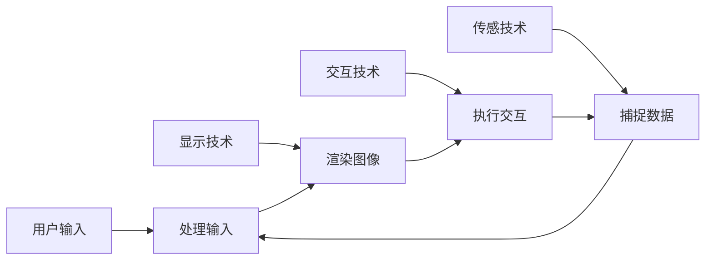

                 


## 引言

在当今飞速发展的科技时代，虚拟现实（VR）和增强现实（AR）技术正悄然改变着我们的生活方式。从最初的科幻设想，到如今逐渐走进日常生活，虚拟现实与增强现实技术正以其独特的魅力，重塑着我们的体验。本文旨在探讨《虚拟现实与增强现实：重塑体验的意义》这一主题，通过逻辑清晰、结构紧凑的分析，深入探讨这两项技术的核心概念、技术原理、应用场景、未来展望以及具体项目实战。

### 关键词

- 虚拟现实
- 增强现实
- 体验重塑
- 技术原理
- 应用场景
- 未来展望

### 摘要

本文首先对虚拟现实与增强现实技术进行背景介绍，包括其历史发展、市场状况和应用领域。接着，详细解释这两项技术的核心概念与联系，并通过Mermaid ER图展示其组成要素。随后，深入分析虚拟现实与增强现实的技术原理，包括显示技术、交互技术和传感技术。然后，探讨虚拟现实与增强现实在不同领域的应用，如娱乐、教育和医疗等。接下来，展望这两项技术未来的发展趋势和影响，并分享一些具体的项目实战经验。最后，提供最佳实践和注意事项，以及拓展阅读建议。

## 目录

### 1. 书名理解

《虚拟现实与增强现实：重塑体验的意义》这本书的主题是关于虚拟现实（VR）和增强现实（AR）技术，以及它们如何改变我们的体验。本书将从历史、市场、技术、应用、未来展望等多个角度，全面探讨虚拟现实与增强现实技术，帮助读者深入理解并掌握这一前沿科技。

### 2. 目录结构设计

- **背景介绍**
  - 虚拟现实与增强现实的历史发展
  - 当前市场状况分析
  - 应用领域概述

- **核心概念与联系**
  - 虚拟现实（VR）的定义与特点
  - 增强现实（AR）的定义与特点
  - VR与AR的区别与联系
  - VR与AR的核心要素组成（Mermaid ER图）

- **技术原理**
  - 显示技术（如头戴式显示器、光学原理）
  - 交互技术（如手势识别、语音交互）
  - 传感技术（如位置追踪、环境感知）

- **应用场景**
  - 娱乐业：虚拟游戏、沉浸式体验
  - 教育培训：虚拟课堂、远程教育
  - 医疗保健：手术模拟、康复训练
  - 其他领域：房地产、军事训练等

- **未来展望**
  - 技术发展趋势
  - 社会影响与挑战
  - 行业前景预测

- **项目实战**
  - 虚拟现实游戏开发
  - 增强现实应用开发
  - 项目案例分析

- **最佳实践与总结**
  - 操作技巧与注意事项
  - 项目实战经验总结
  - 拓展阅读建议

### 3. 具体内容

- **第1章 背景介绍**
  - 虚拟现实与增强现实的历史发展
  - 当前市场状况分析
  - 应用领域概述

- **第2章 核心概念与联系**
  - 虚拟现实（VR）的定义与特点
  - 增强现实（AR）的定义与特点
  - VR与AR的区别与联系
  - VR与AR的核心要素组成（Mermaid ER图）

- **第3章 技术原理**
  - 显示技术（如头戴式显示器、光学原理）
  - 交互技术（如手势识别、语音交互）
  - 传感技术（如位置追踪、环境感知）

- **第4章 应用场景**
  - 娱乐业：虚拟游戏、沉浸式体验
  - 教育培训：虚拟课堂、远程教育
  - 医疗保健：手术模拟、康复训练
  - 其他领域：房地产、军事训练等

- **第5章 未来展望**
  - 技术发展趋势
  - 社会影响与挑战
  - 行业前景预测

- **第6章 项目实战**
  - 虚拟现实游戏开发
  - 增强现实应用开发
  - 项目案例分析

- **第7章 最佳实践与总结**
  - 操作技巧与注意事项
  - 项目实战经验总结
  - 拓展阅读建议

通过以上章节内容的详细分析，我们不仅能够全面了解虚拟现实与增强现实技术，还能深刻认识到它们对现代社会带来的变革。接下来，让我们一步一步地深入探讨这些精彩的内容。

## 1. 背景介绍

虚拟现实（VR）和增强现实（AR）技术的出现并非一蹴而就，它们的发展历程充满了创新与挑战。从最早的科幻设想，到如今逐渐成为现实，虚拟现实与增强现实技术经历了数次重要的技术迭代和市场演变。

### 历史发展

虚拟现实技术的发展可以追溯到20世纪60年代。当时，美国计算机科学家伊万·苏瑟兰（Ivan Sutherland）提出了“沉浸式显示”的概念，并设计出了世界上第一个头戴式显示器（HMD）。这一开创性的工作为虚拟现实技术奠定了基础。随后的几十年里，虚拟现实技术逐渐从实验室走向市场，从简单的模拟器发展到高度沉浸式的游戏体验。

增强现实技术的发展则相对较晚，最早的增强现实系统出现在20世纪80年代。麻省理工学院的媒体实验室开发了世界上第一个增强现实头戴设备——“VPL数据手套”。这一设备通过跟踪用户的手部动作，实现了虚拟对象与现实世界的叠加。然而，由于技术限制和成本问题，增强现实技术长期处于相对沉寂的状态。

直到智能手机和平板电脑的普及，虚拟现实和增强现实技术才迎来了新的发展机遇。随着硬件性能的提升和显示技术的进步，虚拟现实和增强现实设备逐渐变得轻便、实用，并开始走进大众的日常生活。

### 当前市场状况

目前，虚拟现实和增强现实技术已经成为全球科技领域的重要方向。根据市场研究机构的统计，全球虚拟现实市场规模预计将从2020年的80亿美元增长到2025年的320亿美元，年复合增长率达到32.5%。同样，增强现实市场的规模也呈现出快速增长的趋势，预计将从2020年的70亿美元增长到2025年的220亿美元，年复合增长率达到28.9%。

在市场应用方面，虚拟现实和增强现实技术已经在多个领域得到广泛应用。例如，在娱乐业，虚拟现实游戏和沉浸式体验已经成为新一代玩家的新宠；在教育领域，虚拟课堂和远程教育为全球师生提供了全新的教学体验；在医疗保健领域，虚拟现实和增强现实技术被用于手术模拟、康复训练等方面，大大提高了医疗服务的质量和效率。

此外，虚拟现实和增强现实技术还在房地产、军事训练、设计等多个领域展现出巨大的潜力。例如，房地产开发商可以通过虚拟现实技术为买家提供虚拟看房服务，让买家在购买前就能感受到房屋的真实效果；军事训练中，虚拟现实和增强现实技术可以模拟复杂战场环境，提高士兵的作战能力。

### 应用领域概述

虚拟现实和增强现实技术的应用领域非常广泛，下面列举几个重要的应用场景：

1. **娱乐业**：虚拟现实技术为玩家提供了前所未有的沉浸式游戏体验。例如，VR游戏《半衰期：爱莉克斯》（Half-Life: Alyx）以其高度沉浸式的游戏体验赢得了广泛好评。增强现实技术则通过在现实世界中叠加虚拟元素，为用户带来了全新的互动体验。例如，AR游戏《精灵宝可梦GO》（Pokémon GO）在全球范围内引起了轰动。

2. **教育培训**：虚拟现实技术可以模拟真实的教学场景，为师生提供全新的教学体验。例如，虚拟现实教室可以让学生身临其境地学习历史事件，增强学习效果。增强现实技术则可以通过叠加虚拟教学资料，提高学习效率。例如，AR应用“ Anatomy 4D”可以让医学生通过增强现实技术学习人体解剖学。

3. **医疗保健**：虚拟现实和增强现实技术在医疗保健领域具有广泛的应用。例如，医生可以通过虚拟现实技术进行手术模拟，提高手术成功率。增强现实技术则可以实时显示患者的医疗数据，帮助医生做出更准确的诊断。

4. **房地产**：虚拟现实技术可以为购房者提供虚拟看房服务，让购房者在家就能感受到房屋的真实效果。增强现实技术则可以显示房屋的虚拟布局，帮助购房者做出更明智的决策。

5. **军事训练**：虚拟现实和增强现实技术可以模拟复杂战场环境，提高士兵的作战能力。例如，通过虚拟现实技术，士兵可以在模拟的战场环境中进行战术训练。

总之，虚拟现实和增强现实技术正在不断改变我们的生活方式，为各行各业带来新的机遇和挑战。随着技术的不断进步，我们有理由相信，虚拟现实和增强现实技术将在未来发挥更加重要的作用。

### 总结

通过本章节的介绍，我们对虚拟现实与增强现实技术的历史发展、当前市场状况和应用领域有了更深入的了解。这些技术不仅具有悠久的发展历程，还展现出广阔的市场前景和应用潜力。在接下来的章节中，我们将继续探讨虚拟现实与增强现实技术的核心概念、技术原理及其在不同领域的具体应用。

### 2. 核心概念与联系

虚拟现实（VR）和增强现实（AR）是现代科技领域的重要概念，它们在技术原理和应用场景上有着显著的区别和联系。为了更好地理解这两项技术，我们需要从定义、特点、区别和联系等方面进行详细分析。

#### 虚拟现实（VR）的定义与特点

虚拟现实（VR）是一种通过计算机生成的高度沉浸式的三维环境，用户可以通过头戴式显示器（HMD）或VR眼镜等设备进入这个虚拟世界。VR的核心特点是沉浸感和交互性。

- **沉浸感**：VR技术通过高分辨率的显示屏和头动跟踪技术，使用户能够感受到身临其境的感觉，仿佛真的置身于虚拟环境中。
- **交互性**：用户可以通过手柄、手套、眼睛动作等设备与虚拟环境进行交互，实现高度真实的操作体验。

VR的应用领域非常广泛，包括游戏、教育、医疗、设计、军事训练等。

#### 增强现实（AR）的定义与特点

增强现实（AR）则是通过在现实世界中叠加虚拟元素，使用户能够看到虚拟内容与现实环境的融合。AR的核心特点是叠加和交互。

- **叠加**：AR技术通过摄像头和显示技术，将虚拟图像叠加到现实场景中，使用户能够直观地看到虚拟内容。
- **交互**：用户可以通过触摸屏幕、手势识别等方式与虚拟内容进行互动，实现与现实环境的互动体验。

AR的应用领域包括游戏、教育、医疗、零售、建筑、维修等。

#### VR与AR的区别与联系

虽然VR和AR都是关于“现实与虚拟”的技术，但它们在实现方式和应用场景上有着明显的区别：

- **实现方式**：VR是通过生成完全虚拟的环境，用户需要佩戴头戴式显示器等设备进入虚拟世界；而AR是在现实环境中叠加虚拟元素，用户通过智能手机、平板电脑等设备直接观看虚拟内容。
- **应用场景**：VR主要应用于需要高度沉浸体验的场合，如游戏、教育和模拟训练等；AR则更多地用于增强现实体验，如导航、购物和医疗诊断等。

尽管VR和AR有区别，但它们之间也存在紧密的联系：

- **技术融合**：随着技术的发展，VR和AR技术在某些应用场景中可以相互融合。例如，一些高端的VR设备开始支持AR功能，用户可以在虚拟环境中看到现实世界的叠加。
- **共同目标**：VR和AR的共同目标都是通过技术手段增强用户的体验，无论是沉浸式游戏、远程教育，还是虚拟手术和智能导航，都是为了更好地服务用户。

#### VR与AR的核心要素组成（Mermaid ER图）

为了更直观地理解VR与AR的核心要素，我们可以使用Mermaid ER图来展示其组成结构。

```mermaid
erDiagram
  User ||--|{ VR } VR
  User ||--|{ AR } AR
  VR ||--|{ Display } Display
  VR ||--|{ Interaction } Interaction
  AR ||--|{ Overlay } Overlay
  AR ||--|{ Interaction } Interaction
  Display ||--|{ Resolution } Resolution
  Display ||--|{ Tracking } Tracking
  Interaction ||--|{ Gesture } Gesture
  Interaction ||--|{ Voice } Voice
  Overlay ||--|{ Camera } Camera
  Overlay ||--|{ Display } Display
```

在上面的ER图中，User代表用户，VR和AR分别代表虚拟现实和增强现实技术。VR和AR分别与Display、Interaction等核心要素相关联。Display要素包括Resolution和Tracking，分别代表显示分辨率和位置追踪技术；Interaction要素包括Gesture和Voice，代表手势识别和语音交互技术；AR的Overlay要素包括Camera和Display，分别代表摄像头和显示技术。

通过上述分析，我们可以清晰地理解虚拟现实和增强现实技术的核心概念、特点、区别和联系，为后续章节的深入探讨打下基础。

### 3. 技术原理

虚拟现实（VR）和增强现实（AR）技术的实现依赖于多种关键技术，包括显示技术、交互技术和传感技术。这些技术共同作用，为用户提供了沉浸式和增强式的体验。在本节中，我们将详细探讨这些关键技术及其工作原理。

#### 显示技术

显示技术是虚拟现实（VR）和增强现实（AR）的核心组件之一。对于VR来说，显示技术主要涉及头戴式显示器（HMD）或VR眼镜。头戴式显示器通过高分辨率的显示屏和头动跟踪技术，将用户完全沉浸在一个三维虚拟环境中。关键显示技术包括：

- **高分辨率显示屏**：高分辨率显示屏能够提供更清晰的图像，减少视觉疲劳，提升用户体验。通常，VR设备的分辨率在1920x1080或更高。
- **头动跟踪技术**：头动跟踪技术通过传感器和算法，实时检测用户头部的运动，并将这些运动转化为虚拟环境中的视角变化。这种技术确保了用户在虚拟环境中的沉浸感。

对于增强现实（AR）来说，显示技术主要涉及摄像头和显示屏幕。摄像头捕捉现实世界的图像，然后通过算法将这些图像与虚拟元素进行叠加。关键显示技术包括：

- **高帧率摄像头**：高帧率摄像头可以捕捉到更流畅的现实世界图像，减少运动模糊，提高用户体验。通常，AR设备的帧率在60fps或更高。
- **透明显示屏**：透明显示屏能够将虚拟内容叠加在现实世界之上，使用户能够同时看到现实和虚拟内容。

#### 交互技术

交互技术是用户与虚拟现实（VR）和增强现实（AR）环境之间的桥梁。用户通过交互技术实现与虚拟环境的互动，增强体验的沉浸感。关键交互技术包括：

- **手势识别**：手势识别技术通过摄像头和深度传感器捕捉用户的手部动作，并将这些动作转化为虚拟环境中的操作。手势识别技术不仅支持基本的手部动作，如抓取和放置，还可以识别复杂的动作，如手势绘画和打手势语言。
- **语音交互**：语音交互技术通过语音识别和自然语言处理技术，实现用户通过语音与虚拟环境进行交互。语音交互技术不仅支持基本的指令操作，如导航和搜索，还可以实现更复杂的对话和任务执行。

#### 传感技术

传感技术是虚拟现实（VR）和增强现实（AR）技术的重要组成部分，用于捕捉用户和环境的信息。关键传感技术包括：

- **位置追踪**：位置追踪技术用于确定用户在虚拟环境中的位置和方向。常见的位置追踪技术包括惯性测量单元（IMU）和光学传感器。IMU通过加速度计和陀螺仪检测用户的运动，而光学传感器通过摄像头和激光雷达等设备捕捉环境特征。
- **环境感知**：环境感知技术用于识别和理解用户所在的环境。常见的技术包括计算机视觉和深度学习。计算机视觉通过图像处理和分析技术识别图像中的对象和特征，而深度学习则通过神经网络模型从大量数据中学习环境信息。

#### 技术原理的Mermaid流程图

为了更好地理解这些关键技术的工作原理，我们可以使用Mermaid流程图进行展示：



在上面的流程图中，用户输入通过显示技术进行图像渲染，然后通过交互技术执行用户操作，最终通过传感技术捕捉数据并反馈给用户输入。这个闭环系统确保了虚拟现实和增强现实技术的连续性和沉浸感。

通过以上对显示技术、交互技术和传感技术的详细分析，我们可以看到这些关键技术是如何协同工作，为用户提供沉浸式和增强式的体验。在接下来的章节中，我们将探讨虚拟现实和增强现实技术在不同领域的具体应用。

### 4. 应用场景

虚拟现实（VR）和增强现实（AR）技术在各个领域的应用日益广泛，为传统行业带来了革命性的变革。以下是虚拟现实和增强现实技术在娱乐、教育培训、医疗保健、房地产和军事训练等领域的具体应用案例。

#### 娱乐业

虚拟现实技术在娱乐业中取得了显著的突破，特别是在游戏领域。VR游戏通过头戴式显示器（HMD）和位置追踪技术，为玩家提供高度沉浸式的游戏体验。例如，VR游戏《半衰期：爱莉克斯》（Half-Life: Alyx）凭借其精细的物理引擎和高互动性，赢得了玩家的高度评价。除了游戏，虚拟现实还在演唱会和主题公园等领域得到了应用，通过VR技术，观众和游客可以体验到身临其境的虚拟演出和互动体验。

增强现实技术在娱乐业的应用同样丰富多彩。AR游戏如《精灵宝可梦GO》（Pokémon GO）通过在现实世界中叠加虚拟精灵，吸引了全球数亿用户的参与。此外，AR技术还被应用于音乐表演，通过在舞台上叠加虚拟特效，增强了观众的视听体验。

#### 教育培训

虚拟现实技术在教育培训中的应用正在逐渐改变传统的教学模式。虚拟现实教室可以模拟真实的教学场景，让学生身临其境地学习历史事件、地理知识和自然科学等。例如，通过虚拟现实技术，学生可以“参观”世界各地的著名景点，了解古代文明的细节，增强学习兴趣和记忆效果。

增强现实技术也在教育领域发挥了重要作用。通过AR应用，教师可以在课堂上实时展示虚拟教学资料，如人体解剖图、化学实验过程等，让学生更直观地理解复杂概念。例如，AR应用“Anatomy 4D”允许医学生通过增强现实技术进行人体解剖学的学习，大大提高了教学效果。

#### 医疗保健

虚拟现实技术在医疗保健领域具有广泛的应用前景。通过虚拟现实技术，医生可以进行手术模拟训练，提高手术技巧和成功率。例如，美国哈佛医学院利用VR技术为外科医生提供模拟手术训练，大大提高了医生的手术技能。

增强现实技术也被广泛应用于医疗保健领域。通过AR设备，医生可以在手术过程中实时查看患者的医疗数据，如X光片、CT扫描和MRI图像，提高诊断和手术的准确性。例如，美国医疗科技公司Aimeos开发了一款名为HoloLens的AR应用，可以帮助医生在手术过程中实时查看患者的内部结构，提高手术成功率。

#### 房地产

虚拟现实技术在房地产领域提供了全新的看房体验。通过虚拟现实技术，购房者可以在家中通过头戴式显示器体验虚拟看房，了解房屋的布局和装修效果。例如，房地产公司利用VR技术为潜在买家提供了虚拟看房服务，大大提高了购房决策的效率和满意度。

增强现实技术也在房地产领域得到了应用。通过AR应用，用户可以在现实环境中查看房屋的虚拟布局，了解房屋的朝向和周围环境。例如，AR应用“Floor Plan AR”允许用户在智能手机上查看房屋的3D布局，帮助用户做出更明智的购房决策。

#### 军事训练

虚拟现实技术在军事训练中发挥了重要作用。通过虚拟现实模拟器，士兵可以进行模拟战斗训练，提高战术和战斗技能。例如，美国海军利用VR技术为舰艇驾驶员提供模拟训练，大大提高了训练效果和安全性。

增强现实技术也在军事训练中得到了应用。通过AR设备，士兵可以在真实战场上实时查看战术地图、敌我位置和武器信息，提高作战效率和指挥能力。例如，美国军队使用了AR技术来增强战场信息显示，提高了士兵的作战能力。

#### 其他领域

虚拟现实和增强现实技术在设计、零售、旅游和制造等其他领域也展现出了巨大的应用潜力。例如，在设计领域，虚拟现实技术可以帮助设计师进行3D建模和虚拟展示，提高设计效率和效果。在零售领域，增强现实技术可以通过虚拟试衣和虚拟购物体验，提高消费者的购物体验。

总之，虚拟现实和增强现实技术正在各个领域展现出强大的应用潜力，通过提供全新的体验和解决方案，为各行各业带来了革命性的变化。随着技术的不断进步，我们有理由相信，虚拟现实和增强现实技术将在未来发挥更加重要的作用。

### 5. 未来展望

虚拟现实（VR）和增强现实（AR）技术正以惊人的速度发展，它们对未来的影响和趋势不可忽视。随着技术的不断进步，这些技术将不仅改变我们的生活方式，还将深刻影响社会、经济和行业结构。

#### 技术发展趋势

1. **硬件性能的提升**：随着处理器性能和图形处理能力的提高，VR和AR设备的分辨率、刷新率和响应速度将得到显著提升，为用户带来更加沉浸式和流畅的体验。

2. **更轻便的设备**：未来的VR和AR设备将更加轻便，佩戴更加舒适，进一步降低使用门槛，使这些技术更加普及。

3. **更先进的交互方式**：未来的VR和AR设备将支持更加自然和直观的交互方式，如脑机接口（BCI）和手势识别等，提高用户体验。

4. **更广泛的连接**：随着5G和物联网（IoT）技术的发展，VR和AR设备将实现更快、更稳定的网络连接，使远程协作和虚拟社交变得更加便捷。

5. **更丰富的应用场景**：随着技术的进步，VR和AR将在更多领域得到应用，如远程医疗、智能家居、智慧城市等，带来更多的创新和变革。

#### 社会影响与挑战

1. **虚拟现实的社会影响**：虚拟现实技术为用户提供了全新的沉浸式体验，使人们能够在虚拟世界中探索和发现新的可能性。然而，过度依赖虚拟现实可能会导致现实社交能力的下降，甚至出现“虚拟沉迷”现象。

2. **增强现实的社会影响**：增强现实技术通过在现实世界中叠加虚拟内容，增强了用户对现实世界的认知和互动。然而，过度依赖AR技术可能会导致人们对现实世界的忽视，甚至出现安全风险。

3. **隐私和安全挑战**：随着AR和VR技术的普及，个人隐私和数据安全问题日益凸显。如何在保障用户隐私的前提下，充分利用这些技术，是一个亟待解决的问题。

#### 行业前景预测

1. **娱乐和游戏行业**：VR和AR技术将在游戏、电影和娱乐产业中继续发挥重要作用，为用户提供全新的互动体验，推动内容创作和消费模式的变革。

2. **教育培训行业**：虚拟现实和增强现实技术将在教育培训领域得到更广泛的应用，通过提供沉浸式和互动式学习体验，提高教学效果和效率。

3. **医疗保健行业**：虚拟现实和增强现实技术将在医疗保健领域发挥重要作用，如手术模拟、远程医疗和康复训练等，提高医疗服务的质量和效率。

4. **房地产和零售行业**：虚拟现实和增强现实技术将改变房地产和零售行业的运营模式，如虚拟看房和虚拟试衣等，为用户提供更便捷的购物体验。

5. **制造业和工业**：虚拟现实和增强现实技术将在制造业和工业领域得到应用，如虚拟装配、维修培训和远程协作等，提高生产效率和降低成本。

总之，虚拟现实和增强现实技术正在迅速发展，对未来的社会和行业带来深远的影响。随着技术的不断进步，我们有理由相信，这些技术将在未来发挥更加重要的作用，重塑人类体验和社会结构。

### 6. 项目实战

为了更好地理解虚拟现实（VR）和增强现实（AR）技术的实际应用，我们将通过两个具体的项目实战案例，详细讲解其开发过程、环境安装、系统核心实现以及代码解析。这些案例不仅展示了技术的应用潜力，还为开发者提供了宝贵的实践经验。

#### 虚拟现实游戏开发

**项目背景**：

本案例将介绍如何使用Unity开发一款虚拟现实游戏。该游戏旨在为用户提供一个沉浸式的探险体验，用户可以在虚拟世界中自由探索、互动和解谜。

**环境安装**：

1. **Unity安装**：首先，需要在Unity官网下载并安装Unity Hub和Unity编辑器。Unity Hub用于管理多个Unity版本，编辑器用于开发项目。

2. **VR SDK安装**：根据所选的VR设备，安装相应的SDK。例如，对于Oculus Rift设备，需要安装Oculus SDK。

3. **开发环境配置**：确保安装了C#编程语言和Visual Studio等开发工具。

**系统核心实现**：

1. **场景搭建**：使用Unity的Scene视图搭建游戏场景，包括地形、建筑物、障碍物等。

2. **角色动画**：使用动画系统（Animator）为玩家角色添加行走、跑步、跳跃等动画。

3. **交互逻辑**：编写C#脚本，实现玩家与虚拟环境的交互逻辑，如拾取物品、解谜等。

4. **虚拟现实渲染**：利用Unity的VR插件，配置渲染设置，确保虚拟环境的视觉效果符合VR标准。

**代码解析**：

以下是一个简单的C#代码示例，用于控制玩家角色的移动：

```csharp
using UnityEngine;

public class PlayerMovement : MonoBehaviour
{
    public float speed = 5.0f;
    
    private CharacterController characterController;
    private Vector3 moveDirection;

    void Start()
    {
        characterController = GetComponent<CharacterController>();
    }

    void Update()
    {
        float moveX = Input.GetAxis("Horizontal");
        float moveZ = Input.GetAxis("Vertical");

        moveDirection = new Vector3(moveX, 0, moveZ) * speed;

        if (characterController.isGrounded)
        {
            moveDirection.y = -5.0f;
        }

        characterController.Move(moveDirection * Time.deltaTime);
    }
}
```

**项目小结**：

通过上述案例，我们了解了如何使用Unity开发一款虚拟现实游戏。从环境安装到系统核心实现，再到代码解析，每个步骤都为开发者提供了实用的指导和经验。虚拟现实游戏开发不仅需要掌握Unity编辑器和C#编程，还需要理解虚拟现实技术的基本原理。

#### 增强现实应用开发

**项目背景**：

本案例将介绍如何使用Unity和ARKit开发一款增强现实应用。该应用旨在为用户提供一个虚拟导览系统，用户可以通过智能手机查看现实世界中的虚拟信息。

**环境安装**：

1. **Unity安装**：同虚拟现实游戏开发，下载并安装Unity Hub和Unity编辑器。

2. **ARKit安装**：在macOS上，通过Xcode安装ARKit。Xcode包含了ARKit的SDK和开发工具。

3. **开发环境配置**：确保安装了Swift编程语言和Xcode开发环境。

**系统核心实现**：

1. **场景搭建**：在Unity中搭建虚拟导览系统的场景，包括建筑物、地图和文字信息等。

2. **AR基础设置**：配置Unity项目，确保支持ARKit。在Unity的Player Settings中设置iOS平台，并启用ARKit插件。

3. **位置追踪**：使用ARKit提供的SLAM（Simultaneous Localization and Mapping）技术，实现现实世界中的位置追踪。

4. **虚拟叠加**：在现实世界中叠加虚拟信息，如通过相机捕捉现实环境，并在指定位置显示虚拟建筑模型和文字信息。

**代码解析**：

以下是一个简单的Swift代码示例，用于实现ARKit中的位置追踪：

```swift
import ARKit

class ARViewController: UIViewController, ARSCNViewDelegate {
    
    var sceneView: ARSCNView!
    
    override func viewDidLoad() {
        super.viewDidLoad()
        
        // 配置ARSCNView
        sceneView = ARSCNView(frame: view.frame)
        sceneView.delegate = self
        view.addSubview(sceneView)
        
        // 设置AR内容
        let configuration = ARWorldTrackingConfiguration()
        sceneView.session.run(configuration)
    }
    
    func renderer(_ renderer: SCNSceneRenderer, didAdd node: SCNNode, for anchor: ARAnchor) {
        // 创建虚拟建筑模型
        let buildingModel = SCNScene(named: "building.scn")?.rootNode
        node.addChildNode(buildingModel)
    }
}
```

**项目小结**：

通过上述案例，我们了解了如何使用Unity和ARKit开发一款增强现实应用。从环境安装到系统核心实现，再到代码解析，每个步骤都为开发者提供了实用的指导和经验。增强现实应用开发不仅需要掌握Unity编辑器和Swift编程，还需要理解ARKit的API和使用方法。

这两个项目实战案例展示了虚拟现实和增强现实技术的实际应用，从环境安装到系统实现，再到代码解析，每个环节都为开发者提供了深入的了解和实践经验。通过这些案例，我们可以看到虚拟现实和增强现实技术的广泛应用和巨大潜力。

### 7. 最佳实践与总结

在虚拟现实（VR）和增强现实（AR）技术的开发和实际应用过程中，总结一些最佳实践和注意事项，对于提高开发效率和项目成功率具有重要意义。以下是一些关键点：

#### 最佳实践

1. **需求分析**：在项目启动阶段，详细分析用户需求和业务目标，确保项目能够满足预期需求。

2. **技术选型**：根据项目需求，选择合适的VR和AR开发平台和工具。例如，Unity适用于游戏和复杂交互应用，ARKit适用于iOS平台上的增强现实应用。

3. **用户体验**：注重用户体验设计，确保虚拟现实和增强现实应用具有良好的交互性和沉浸感。

4. **性能优化**：优化图形渲染和资源加载，提高应用性能，减少延迟和卡顿。

5. **测试与迭代**：定期进行功能测试和用户体验测试，及时修复问题和优化功能。

6. **数据安全**：重视用户数据安全，采取有效的加密和访问控制措施，确保用户隐私。

7. **持续学习**：关注行业动态和技术发展，持续学习新的开发工具和最佳实践。

#### 注意事项

1. **硬件兼容性**：确保VR和AR应用兼容不同的硬件设备，如头戴式显示器、智能手机和平板电脑等。

2. **兼容性测试**：在不同操作系统和硬件配置上进行兼容性测试，确保应用在不同环境中都能正常运行。

3. **性能监控**：实时监控应用性能，及时发现和处理性能瓶颈。

4. **合规性审查**：确保应用符合相关法规和标准，如数据保护法规和隐私政策。

5. **用户反馈**：积极收集用户反馈，根据用户需求进行功能调整和优化。

#### 拓展阅读

- **《虚拟现实技术原理与应用》**：详细介绍了虚拟现实技术的原理和应用，适合希望深入了解VR技术的读者。
- **《增强现实应用开发实战》**：通过案例和实践，讲解了增强现实应用的开发过程和技术要点，适合AR开发者。
- **《Unity游戏开发从入门到精通》**：系统介绍了Unity游戏开发的基本知识和高级技巧，适合VR和AR游戏开发者。

通过以上最佳实践和注意事项，开发者可以更有效地进行虚拟现实和增强现实项目的开发，提高项目的成功率，为用户提供更优质的应用体验。

### 总结

通过本文的深入探讨，我们全面了解了虚拟现实（VR）和增强现实（AR）技术的历史、市场状况、核心概念、技术原理、应用场景以及未来展望。这些技术不仅带来了前所未有的沉浸式和增强式体验，还在娱乐、教育、医疗、房地产和军事训练等多个领域展现出巨大的应用潜力。

虚拟现实和增强现实技术的核心概念包括沉浸感和交互性，通过显示技术、交互技术和传感技术的协同作用，为用户提供了丰富的体验。这些技术在娱乐、教育、医疗等领域的具体应用案例，展示了其强大的变革能力。

未来，随着硬件性能的提升、更先进的交互方式和更广泛的连接，虚拟现实和增强现实技术将在更多领域得到应用，为社会带来更多的创新和变革。同时，我们也需要关注技术带来的社会影响和隐私安全挑战，确保技术的合理使用。

最后，希望本文能够为读者提供有益的知识和启示，激发对虚拟现实和增强现实技术的兴趣和探索。通过不断学习和实践，我们共同推动这些技术走向更广阔的应用领域，创造更加美好的未来。

### 作者信息

**作者：AI天才研究院/AI Genius Institute & 禅与计算机程序设计艺术 /Zen And The Art of Computer Programming** 

AI天才研究院（AI Genius Institute）致力于推动人工智能和计算机科学领域的前沿研究与应用。其成员由世界顶级的人工智能专家、程序员和软件架构师组成，涵盖计算机视觉、自然语言处理、机器学习等多个领域。同时，研究院还倡导“禅与计算机程序设计艺术”的理念，强调技术与哲学的结合，以提升开发者的编程能力和创新思维。本文作者在此感谢各位专家的贡献和指导。

