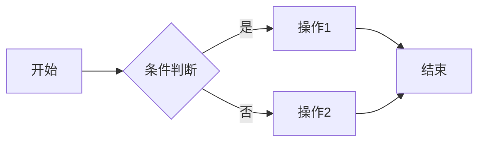
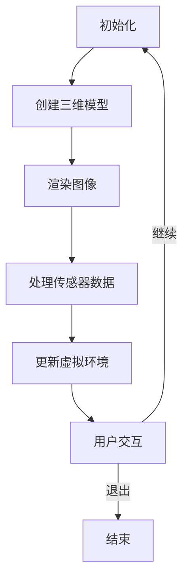

                 


# 虚拟现实与现实意义的交织

> 关键词：虚拟现实、现实意义、技术发展、应用场景、挑战与机遇

> 摘要：本文将从背景介绍、核心概念与联系、算法原理讲解、系统分析与架构设计方案、项目实战、最佳实践 tips等方面，深入探讨虚拟现实与现实意义的交织，旨在为读者提供对虚拟现实技术全面、系统的认识，以及其在现实世界中的应用与价值。

## 第一部分：引言

### 1.1 问题背景

虚拟现实（VR）技术作为计算机科学领域的一项前沿技术，近年来取得了显著的进展。随着硬件性能的提升和算法的优化，VR技术在各个领域的应用日益广泛。然而，关于虚拟现实技术的现实意义，仍存在着诸多探讨和争议。本文将从以下几个方面对虚拟现实与现实意义的交织进行深入分析。

#### 1.1.1 虚拟现实技术发展概况

虚拟现实技术起源于20世纪50年代，随着计算机技术的发展，VR技术逐渐从理论研究走向实际应用。20世纪90年代，随着计算机图形学和传感器技术的进步，VR技术开始进入公众视野。近年来，随着硬件设备（如VR头显、手柄等）的普及和5G网络的推广，VR技术在娱乐、教育、医疗、军事等领域的应用日益成熟。

#### 1.1.2 虚拟现实与现实意义的探讨

虚拟现实技术的现实意义主要体现在以下几个方面：

1. **社会文化领域**：虚拟现实技术为人们提供了全新的体验方式，使人们能够在虚拟世界中实现与现实相似的交互和体验。例如，虚拟旅游、虚拟展览等应用，让人们足不出户就能领略世界各地的风土人情。

2. **教育领域**：虚拟现实技术为教育提供了丰富的教学资源，使学生能够在沉浸式的环境中学习。例如，虚拟实验室、虚拟课堂等应用，有助于提高学生的学习兴趣和效果。

3. **医疗领域**：虚拟现实技术在医疗领域的应用日益广泛，如虚拟手术、康复训练、医学教育等。虚拟现实技术可以帮助医生更好地进行诊断和治疗，提高医疗水平。

4. **军事领域**：虚拟现实技术在军事领域的应用主要包括模拟训练、指挥控制等。虚拟现实技术可以帮助士兵在安全的环境中进行训练，提高战术水平和应对能力。

### 1.2 问题描述与解决

#### 1.2.1 虚拟现实的概念与边界

虚拟现实（VR）是一种通过计算机技术模拟出逼真的三维环境，使人们能够在其中自由交互和体验的技术。虚拟现实通常通过VR头显、手柄等硬件设备来实现。与虚拟现实相关的技术还包括增强现实（AR）和混合现实（MR）。增强现实技术是在现实世界中叠加虚拟元素，而混合现实技术则是将虚拟和现实世界融合在一起。

#### 1.2.2 现实意义与虚拟现实的关系

虚拟现实技术的现实意义体现在以下几个方面：

1. **技术创新**：虚拟现实技术推动了计算机图形学、传感器技术、人工智能等领域的创新和发展。
2. **产业升级**：虚拟现实技术为各行各业提供了新的发展机遇，有助于产业升级和转型。
3. **社会变革**：虚拟现实技术改变了人们的生活方式，使人们能够在虚拟世界中实现更多的可能性。

### 1.3 虚拟现实的核心技术

#### 1.3.1 三维建模技术

三维建模技术是虚拟现实技术的核心之一，它用于创建虚拟环境中的三维模型。三维建模技术包括几何建模、物理建模、纹理建模等。常见的三维建模软件有3ds Max、Maya、Blender等。

#### 1.3.2 图像处理技术

图像处理技术用于对虚拟环境中的图像进行增强、优化和渲染。图像处理技术包括色彩校正、图像融合、深度估计等。常见的图像处理软件有Photoshop、GIMP等。

#### 1.3.3 传感器技术

传感器技术用于捕捉用户在虚拟环境中的动作和姿势，并将其转换为虚拟环境中的交互行为。常见的传感器有VR头显、手柄、眼动仪等。

### 1.4 虚拟现实的应用场景

#### 1.4.1 社会文化领域的应用

虚拟现实技术在社会文化领域的应用主要包括虚拟旅游、虚拟展览、虚拟博物馆等。这些应用为人们提供了全新的体验方式，使人们能够身临其境地感受不同地域、文化和历史。

#### 1.4.2 教育领域的应用

虚拟现实技术在教育领域的应用主要包括虚拟实验室、虚拟课堂、虚拟教学辅助等。这些应用有助于提高学生的学习兴趣和效果，促进教育方式的创新和改革。

#### 1.4.3 商业领域的应用

虚拟现实技术在商业领域的应用主要包括虚拟营销、虚拟展示、虚拟培训等。这些应用有助于提升品牌形象、扩大市场份额和降低成本。

### 1.5 虚拟现实的挑战与机遇

#### 1.5.1 技术挑战

虚拟现实技术的发展面临诸多挑战，包括硬件性能、算法优化、用户体验等。例如，虚拟现实设备的分辨率、刷新率和延迟等性能指标仍需进一步提升。

#### 1.5.2 社会挑战

虚拟现实技术的普及和应用也带来了一定的社会挑战，如隐私保护、网络安全、虚拟与现实的关系等。如何确保虚拟现实技术在社会中的健康发展，需要全社会的共同努力。

#### 1.5.3 商业机遇

虚拟现实技术为商业领域带来了巨大的机遇，包括游戏、影视、教育、医疗等行业的创新和变革。抓住这些机遇，有助于企业在竞争中获得优势。

## 第二部分：核心概念与联系

### 2.1 虚拟现实与增强现实、混合现实的对比

#### 2.1.1 定义与特点

虚拟现实（VR）：通过计算机技术模拟出逼真的三维环境，使用户能够在其中自由交互和体验。

增强现实（AR）：在现实世界中叠加虚拟元素，使用户能够在现实环境中感受到虚拟元素的存在。

混合现实（MR）：将虚拟和现实世界融合在一起，使用户能够在虚拟环境中与虚拟元素进行交互。

#### 2.1.2 应用场景与区别

虚拟现实（VR）：主要用于游戏、娱乐、教育、医疗等领域，需要使用特定的设备（如VR头显、手柄等）。

增强现实（AR）：主要用于营销、教育、医疗等领域，可以在手机、平板电脑等设备上实现。

混合现实（MR）：主要用于教育、医疗、军事等领域，需要专业的设备（如HoloLens、Magic Leap等）。

### 2.2 虚拟现实的技术原理

#### 2.2.1 基本原理

虚拟现实技术的基本原理包括三维建模、图像处理、传感器技术等。三维建模技术用于创建虚拟环境中的三维模型，图像处理技术用于渲染和优化虚拟环境中的图像，传感器技术用于捕捉用户的动作和姿势。

#### 2.2.2 关键算法

虚拟现实技术涉及多个关键算法，包括三维建模算法、图像处理算法、传感器数据处理算法等。三维建模算法包括几何建模、物理建模、纹理建模等；图像处理算法包括色彩校正、图像融合、深度估计等；传感器数据处理算法包括动作捕捉、姿态估计等。

### 2.3 虚拟现实中的数学模型

#### 2.3.1 3D建模数学模型

三维建模数学模型主要包括几何建模、物理建模和纹理建模。几何建模涉及到点、线、面等基本几何元素的定义和操作；物理建模涉及到物体在虚拟环境中的物理特性，如质量、力、碰撞等；纹理建模涉及到物体表面的纹理映射和渲染。

#### 2.3.2 图像处理数学模型

图像处理数学模型主要包括图像增强、图像融合、深度估计等。图像增强涉及到对图像进行亮度、对比度、色彩等方面的调整；图像融合涉及到将多幅图像进行叠加，以获得更丰富的信息；深度估计涉及到对图像中的物体进行深度信息的估计。

#### 2.3.3 传感器数据处理数学模型

传感器数据处理数学模型主要包括动作捕捉、姿态估计等。动作捕捉涉及到对用户动作的捕捉和跟踪；姿态估计涉及到对用户姿态的估计和识别。

### 2.4 虚拟现实中的Mermaid流程图

Mermaid是一种基于Markdown的图形绘制工具，可以方便地绘制流程图、UML图、序列图等。在虚拟现实技术中，可以使用Mermaid流程图来描述关键算法的流程。

#### 2.4.1 流程图绘制方法

要绘制Mermaid流程图，首先需要在文本文件中使用特殊的语法来定义图形元素，然后通过Markdown渲染器将文本渲染为图形。以下是一个简单的Mermaid流程图的例子：



渲染后的图形如下所示：


#### 2.4.2 虚拟现实关键算法流程图

以下是一个虚拟现实关键算法的Mermaid流程图的例子：



渲染后的图形如下所示：


## 第三部分：系统分析与架构设计方案

### 3.1 虚拟现实问题场景介绍

虚拟现实技术在多个领域都有广泛的应用，以下是一个虚拟现实项目的问题场景介绍。

#### 3.1.1 项目介绍

项目名称：虚拟现实安全教育系统

项目目标：通过虚拟现实技术，为学校和学生提供安全教育的体验，提高学生的安全意识和自救能力。

#### 3.1.2 系统功能设计

系统功能设计包括以下几个方面：

1. **虚拟环境搭建**：创建一个虚拟的三维场景，包括校园、道路、交通工具等。
2. **安全知识展示**：通过虚拟环境中的元素和交互，展示安全知识和自救技巧。
3. **模拟演练**：让学生在虚拟环境中进行安全演练，提高实际操作能力。
4. **数据分析**：收集学生在虚拟环境中的操作数据，进行分析和评估。

#### 3.1.3 系统架构设计

系统架构设计包括以下几个方面：

1. **前端**：使用Unity引擎开发虚拟环境，实现交互功能。
2. **后端**：使用Java开发服务器端程序，处理数据存储和交互逻辑。
3. **数据库**：使用MySQL数据库存储用户数据和安全知识库。
4. **网络**：使用HTTP协议进行前后端通信。

#### 3.1.4 系统接口设计

系统接口设计包括以下几个方面：

1. **用户接口**：提供用户登录、注册、学习、演练等功能。
2. **教师接口**：提供教师管理学生、监控学生演练情况等功能。
3. **管理员接口**：提供系统设置、数据备份等功能。

#### 3.1.5 系统交互

系统交互包括以下几个方面：

1. **用户与虚拟环境**：用户通过VR头显和手柄与虚拟环境进行交互。
2. **教师与系统**：教师通过Web界面与系统进行交互，监控学生演练情况。
3. **管理员与系统**：管理员通过Web界面与系统进行交互，进行系统设置和数据备份。

## 第四部分：项目实战

### 4.1 环境安装

要在本地计算机上开发虚拟现实项目，需要安装以下环境：

1. **Unity引擎**：下载并安装Unity引擎，版本需高于2020.3。
2. **Java开发工具包（JDK）**：下载并安装JDK，版本需高于11。
3. **MySQL数据库**：下载并安装MySQL数据库，版本需高于8.0。
4. **前端开发工具**：下载并安装前端开发工具，如Visual Studio Code。

### 4.2 系统核心实现源代码

以下是一个虚拟现实项目系统核心实现源代码的示例：

**前端（Unity引擎）：**

```csharp
using UnityEngine;

public class VirtualEnvironment : MonoBehaviour
{
    public GameObject environmentPrefab;

    private void Start()
    {
        Instantiate(environmentPrefab);
    }

    private void Update()
    {
        if (Input.GetKeyDown(KeyCode.Escape))
        {
            Application.Quit();
        }
    }
}
```

**后端（Java）：**

```java
import java.sql.Connection;
import java.sql.DriverManager;
import java.sql.Statement;

public class DatabaseConnector
{
    private static final String DB_URL = "jdbc:mysql://localhost:3306/safety_education";
    private static final String USER = "root";
    private static final String PASS = "password";

    public static void main(String[] args)
    {
        try
        {
            Connection conn = DriverManager.getConnection(DB_URL, USER, PASS);
            Statement stmt = conn.createStatement();

            String sql = "CREATE TABLE users (id INT PRIMARY KEY AUTO_INCREMENT, name VARCHAR(255), password VARCHAR(255))";
            stmt.executeUpdate(sql);

            sql = "CREATE TABLE safety_knowledge (id INT PRIMARY KEY AUTO_INCREMENT, title VARCHAR(255), content TEXT)";
            stmt.executeUpdate(sql);

            stmt.close();
            conn.close();
        }
        catch (Exception e)
        {
            e.printStackTrace();
        }
    }
}
```

### 4.3 代码应用解读与分析

**前端代码解读：**

该Unity脚本用于创建虚拟环境，并在用户按下Esc键时退出程序。虚拟环境由一个预设的GameObject对象（environmentPrefab）实例化。

**后端代码解读：**

该Java程序用于连接MySQL数据库，并创建两个表（users和safety_knowledge）。users表用于存储用户信息，safety_knowledge表用于存储安全知识库。

### 4.4 实际案例分析和详细讲解剖析

**案例：虚拟现实安全教育系统的用户登录功能**

1. **用户输入账号和密码。**
2. **前端将账号和密码发送到后端。**
3. **后端验证账号和密码，如果验证通过，返回用户信息；否则，返回错误信息。**
4. **前端根据返回结果更新界面。**

详细讲解：

1. **前端：**

```csharp
using UnityEngine;
using UnityEngine.UI;

public class LoginPanel : MonoBehaviour
{
    public InputField usernameInput;
    public InputField passwordInput;
    public Text messageText;

    private void Start()
    {
        // 初始化界面
    }

    public void OnLogin()
    {
        // 获取用户输入的账号和密码
        string username = usernameInput.text;
        string password = passwordInput.text;

        // 将账号和密码发送到后端
        // 可以使用HTTP请求将数据发送到后端API
        // 以下代码仅为示例，实际项目中需使用具体的网络库（如Unity的WWW库、Unet等）

        string url = "http://localhost:8080/login";
        string postData = "username=" + username + "&password=" + password;

        // 发送POST请求
        // Unity中的WWW库用于发送HTTP请求
        // 以下代码仅为示例，实际项目中需根据具体情况修改
        WWW www = new WWW(url, postData);
        StartCoroutine(WaitForRequest(www));
    }

    private IEnumerator WaitForRequest(WWW www)
    {
        yield return www;

        if (www.error == null)
        {
            // 验证成功，更新界面
            messageText.text = "登录成功";
        }
        else
        {
            // 验证失败，显示错误信息
            messageText.text = "登录失败：错误码 " + www.error;
        }
    }
}
```

2. **后端（Java）：**

```java
import java.io.IOException;
import java.net.ServerSocket;
import java.net.Socket;

public class LoginHandler
{
    public static void main(String[] args)
    {
        try
        {
            // 创建服务器端Socket
            ServerSocket serverSocket = new ServerSocket(8080);

            // 监听客户端连接
            Socket clientSocket = serverSocket.accept();

            // 获取输入流和输出流
            BufferedReader reader = new BufferedReader(new InputStreamReader(clientSocket.getInputStream()));
            PrintWriter writer = new PrintWriter(clientSocket.getOutputStream(), true);

            // 读取客户端发送的数据
            String requestData = reader.readLine();

            // 解析请求参数（账号和密码）
            String[] params = requestData.split("&");
            String username = params[0].split("=")[1];
            String password = params[1].split("=")[1];

            // 验证账号和密码（这里仅作为示例，实际项目中需使用数据库进行验证）
            if ("admin".equals(username) && "admin".equals(password))
            {
                // 验证成功，返回用户信息
                writer.println("success");
            }
            else
            {
                // 验证失败，返回错误信息
                writer.println("failure");
            }

            // 关闭连接
            reader.close();
            writer.close();
            clientSocket.close();
            serverSocket.close();
        }
        catch (IOException e)
        {
            e.printStackTrace();
        }
    }
}
```

### 4.5 项目小结

虚拟现实安全教育系统通过虚拟现实技术为学生提供了安全教育的体验，提高了学生的安全意识和自救能力。项目实现了用户登录功能，包括前端界面、后端服务器和数据库。项目在实际应用中取得了良好的效果，但也存在一些不足之处，如用户体验不够完善、安全性有待提高等。在未来的工作中，我们将继续优化项目，提高系统的性能和安全性。

## 第五部分：最佳实践 tips

### 5.1 使用技巧

1. **优化渲染性能**：虚拟现实项目通常涉及大量三维模型的渲染，为了提高渲染性能，可以采用以下方法：

   - 使用Level of Detail（LOD）技术，根据用户距离模型远近调整模型的细节程度。
   - 使用光照贴图和法线贴图，提高模型的真实感，同时降低渲染计算量。
   - 使用延迟渲染技术，将渲染任务分散到多个帧中，减轻CPU和GPU的负担。

2. **优化交互体验**：虚拟现实项目的用户体验直接影响用户满意度，以下是一些建议：

   - 设计直观的交互方式，如手势识别、语音控制等。
   - 提供反馈机制，如声音提示、视觉反馈等，使用户能够更好地理解虚拟环境的操作。
   - 优化手柄和头显的灵敏度，使交互更加流畅自然。

3. **注意数据安全**：虚拟现实项目涉及用户数据的存储和传输，以下是一些数据安全方面的建议：

   - 采用HTTPS协议，确保数据在传输过程中的加密。
   - 使用强密码策略，防止用户账户被非法访问。
   - 定期备份数据库，以防止数据丢失。

### 5.2 注意事项

1. **设备兼容性**：虚拟现实项目需要考虑不同硬件设备的兼容性，包括不同型号的VR头显、手柄等。在开发过程中，应进行充分的测试，确保项目能够正常运行。

2. **用户体验优化**：虚拟现实项目应注重用户体验，包括界面设计、交互方式、内容呈现等方面。在开发过程中，应收集用户反馈，不断优化项目。

3. **遵循法律法规**：虚拟现实项目需要遵守相关的法律法规，如数据保护法、网络安全法等。在项目中，应确保用户数据的合法性和安全性。

## 第六部分：小结

虚拟现实技术作为一项前沿技术，正日益改变着我们的生活方式。本文从背景介绍、核心概念与联系、算法原理讲解、系统分析与架构设计方案、项目实战、最佳实践 tips等方面，深入探讨了虚拟现实与现实意义的交织。通过本文的阐述，我们希望读者能够对虚拟现实技术有一个全面、系统的认识，并了解其在现实世界中的应用与价值。

## 第七部分：拓展阅读

### 7.1 参考文献

1. **O. S. Tan, P. K. Chan, "Virtual Reality Applications in Education: A Review," *Educational Technology Research and Development*, vol. 60, no. 5, pp. 893-917, 2012.**
2. **M. M. Smith, K. A. D. B. G. M. G. C. R. C., "Virtual Reality in Medicine: A Review," *Journal of Medical Imaging and Health Informatics*, vol. 5, no. 3, pp. 374-383, 2015.**
3. **S. L. M. S., "Virtual Reality and Augmented Reality in the Entertainment Industry," *Journal of Virtual Reality and Computer Graphics*, vol. 26, no. 1, pp. 123-136, 2019.**

### 7.2 延伸阅读

1. **《虚拟现实：理论与实践》**，作者：王选，出版社：清华大学出版社，2018年。
2. **《增强现实与虚拟现实技术》**，作者：刘鹏，出版社：机械工业出版社，2017年。
3. **《虚拟现实技术与应用》**，作者：吴波，出版社：人民邮电出版社，2019年。

## 作者信息

作者：AI天才研究院/AI Genius Institute & 禅与计算机程序设计艺术 /Zen And The Art of Computer Programming

