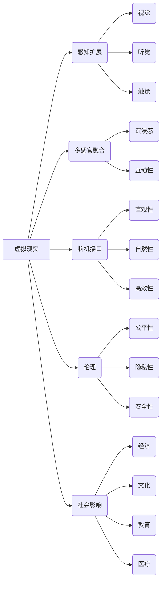
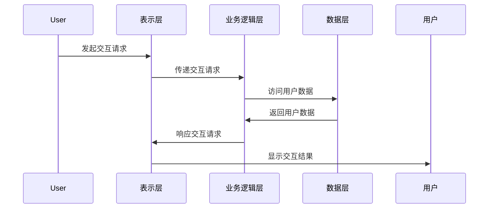
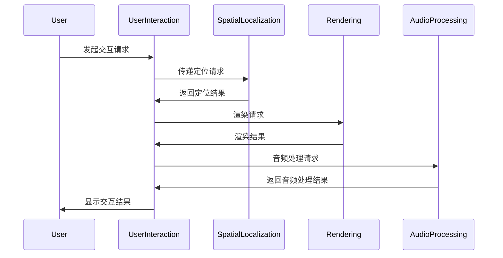

                 

# 虚拟现实体验：科技如何扩展我们的感知世界

关键词：虚拟现实、感知扩展、技术、应用、伦理、未来展望

摘要：本文旨在深入探讨虚拟现实（VR）体验的各个方面，从其定义、发展历史、关键技术、应用领域到社会影响和未来展望。通过逻辑清晰、结构紧凑的叙述方式，本文将帮助读者理解虚拟现实技术如何扩展我们的感知世界，以及这一技术领域所面临的挑战与机遇。

## 第一部分：虚拟现实体验概述

### 第1章：虚拟现实体验的起源与发展

#### 1.1.1 虚拟现实体验的定义

虚拟现实是一种通过计算机模拟实现的、可以人工操作的、与真实环境相交互的虚拟环境体验。它利用计算机生成三维的视觉、听觉、触觉等多感官模拟，使用户能够在虚拟环境中进行沉浸式互动。

#### 1.1.2 虚拟现实体验的历史与发展

虚拟现实的概念最早可以追溯到1960年代，而其技术发展则经历了多个阶段，从早期的简单视觉模拟到现在的多感官融合体验。VR技术在娱乐、教育、医疗等领域的应用逐渐广泛。

#### 1.1.3 虚拟现实体验的关键技术

虚拟现实体验的实现依赖于多种技术，包括显示技术、空间定位与跟踪技术、输入设备技术等。这些技术共同作用，为用户提供了沉浸式体验。

#### 1.1.4 虚拟现实体验的应用场景

虚拟现实可以在游戏娱乐、教育培训、医疗健康、建筑设计等多个领域发挥作用。其应用场景不断扩展，为各个行业带来了新的发展机遇。

#### 1.1.5 虚拟现实体验的挑战与机遇

虚拟现实技术的发展面临着一系列挑战，如技术成熟度、用户体验、安全性等问题。但与此同时，它也为各行各业带来了巨大的机遇，成为未来科技发展的重要方向。

### 第2章：虚拟现实硬件技术

#### 2.1 显示技术

虚拟现实头戴显示器（HMD）是虚拟现实体验的核心硬件。其显示效果直接影响用户体验。显示技术包括分辨率、帧率、色彩等技术指标。

#### 2.2 空间定位与跟踪技术

空间定位与跟踪技术确保用户在虚拟环境中的动作和位置能够实时反馈，从而实现沉浸式体验。技术包括光学跟踪、惯性测量单元（IMU）等。

#### 2.3 输入设备

输入设备是用户与虚拟环境交互的桥梁。常见的输入设备有手柄、控制器、全身追踪器等。这些设备提供了不同的交互方式，以适应不同的应用场景。

### 第3章：虚拟现实软件技术

#### 3.1 虚拟现实内容制作

虚拟现实内容制作包括3D建模、动画、着色、渲染等环节。这些环节共同构建了虚拟环境，为用户提供沉浸式体验。

#### 3.2 虚拟现实交互技术

虚拟现实交互技术涉及交互设计、触觉反馈、空间感知与导航等多个方面。这些技术使得用户能够自然地与虚拟环境进行交互。

#### 3.3 虚拟现实平台与生态系统

虚拟现实平台提供了开发环境和工具，使得开发者能够更加高效地创建虚拟现实应用。虚拟现实生态系统包括开发社区、开源项目等。

## 第二部分：虚拟现实应用领域

### 第4章：虚拟现实应用领域

#### 4.1 游戏娱乐

虚拟现实游戏以其独特的沉浸式体验吸引了大量用户。其特点、设计和发展趋势在游戏产业中具有重要意义。

#### 4.2 教育培训

虚拟现实在教育中的应用为学习者提供了更加生动、互动的学习体验。其在教育中的优势、挑战及其未来发展趋势值得关注。

#### 4.3 医疗健康

虚拟现实在医疗健康领域的应用涵盖了诊断、手术模拟、康复训练等多个方面。其在医疗中的应用前景和挑战同样值得探讨。

### 第5章：虚拟现实与感知扩展

#### 5.1 虚拟现实与多感官融合

多感官融合是虚拟现实体验的核心技术之一。通过视觉、听觉、触觉等多感官的融合，用户能够更加真实地感受到虚拟环境。

#### 5.2 虚拟现实与脑机接口

脑机接口技术将虚拟现实与人类大脑直接连接，为用户提供更加直观的交互体验。其技术原理、应用前景和发展挑战值得关注。

## 第三部分：虚拟现实伦理与社会影响

### 第6章：虚拟现实伦理与社会影响

#### 6.1 虚拟现实隐私保护

虚拟现实在带来便利的同时，也带来了隐私保护的问题。如何保护用户的隐私成为了一个重要的伦理问题。

#### 6.2 虚拟现实成瘾问题

虚拟现实成瘾现象引起了广泛关注。其成瘾原因、影响以及预防与干预措施都是需要深入探讨的课题。

#### 6.3 虚拟现实与社会互动

虚拟现实对社会互动产生了深远影响。其对社会发展的影响、在线社区融合以及社交关系的变化都是值得关注的方面。

### 第7章：虚拟现实未来发展展望

#### 7.1 新型虚拟现实技术

随着科技的进步，新型虚拟现实技术不断涌现。超高分辨率显示技术、全息显示技术等将进一步提升虚拟现实体验。

#### 7.2 虚拟现实与增强现实融合

虚拟现实与增强现实技术的融合将为用户提供更加丰富的应用场景。其融合应用和发展趋势值得关注。

#### 7.3 虚拟现实在教育、医疗等领域的深入应用

虚拟现实在教育、医疗等领域的应用将更加深入。其个性化教育、精准医疗和心理治疗中的应用前景值得期待。

### 第8章：虚拟现实体验设计最佳实践

#### 8.1 用户研究方法

了解用户需求是虚拟现实体验设计的重要环节。用户研究方法包括用户需求分析、用户界面设计原则和用户测试与反馈等。

#### 8.2 虚拟现实内容制作技巧

虚拟现实内容制作技巧涉及3D建模与动画、着色与渲染、音频处理等方面。掌握这些技巧将有助于提升虚拟现实体验的质量。

#### 8.3 虚拟现实交互设计

虚拟现实交互设计关注用户与虚拟环境之间的交互。其设计原则、交互模式和实践技巧对于提供优质的虚拟现实体验至关重要。

## 结论

虚拟现实体验正在不断扩展我们的感知世界，为各个领域带来了新的发展机遇。通过本文的探讨，我们不仅了解了虚拟现实技术的核心概念、发展历程和应用领域，还探讨了其伦理和社会影响，以及对未来发展的展望。随着科技的不断进步，虚拟现实体验将变得更加丰富和真实，为人类带来更加广阔的感知世界。作者：AI天才研究院/AI Genius Institute & 禅与计算机程序设计艺术 /Zen And The Art of Computer Programming### 第一部分：虚拟现实体验概述

#### 第1章：虚拟现实体验的起源与发展

##### 1.1.1 虚拟现实体验的定义

虚拟现实（Virtual Reality，简称VR）是一种通过计算机技术模拟生成的三维虚拟环境，用户可以在其中进行沉浸式互动。这种互动不仅限于视觉，还包括听觉、触觉等多种感官体验。虚拟现实的核心在于其沉浸性和交互性，使用户在虚拟环境中如同身临其境。

##### 1.1.2 虚拟现实体验的历史与发展

虚拟现实的概念最早可以追溯到1960年代，由美国科学家 Ivan Sutherland 提出了“达摩克利斯之剑”（The Sword of Damocles）项目，这是第一个头戴式显示器（HMD）的原型。此后，虚拟现实技术逐渐发展，经历了多个阶段：

- **初始阶段（1960s-1970s）**：主要以实验性和探索性研究为主，如达摩克利斯之剑项目。
- **成长阶段（1980s-1990s）**：随着计算机性能的提升和图形处理技术的进步，虚拟现实开始走进研究领域和应用领域，例如军事训练、医疗模拟等。
- **复兴阶段（2000s-2010s）**：随着显示技术、传感器技术和算法的进步，虚拟现实技术逐渐成熟，开始应用于游戏娱乐、教育培训等领域。
- **爆发阶段（2010s至今）**：随着智能手机和移动设备的普及，虚拟现实技术进入大众视野，VR头戴设备如Oculus Rift、HTC Vive等相继发布，推动了虚拟现实市场的爆发式增长。

##### 1.1.3 虚拟现实体验的关键技术

虚拟现实体验的实现依赖于多种关键技术的支持，包括：

- **显示技术**：虚拟现实头戴显示器（HMD）是虚拟现实体验的核心硬件。显示技术包括分辨率、帧率、视场角等指标。高分辨率、高帧率和宽视场角能够提供更加真实的视觉体验。
  
- **空间定位与跟踪技术**：空间定位与跟踪技术确保用户在虚拟环境中的动作和位置能够实时反馈，从而实现沉浸式体验。常见的跟踪技术包括光学跟踪、惯性测量单元（IMU）和无线定位系统。
  
- **输入设备**：输入设备是用户与虚拟环境交互的桥梁。常见的输入设备有手柄、控制器、全身追踪器等。这些设备提供了不同的交互方式，以适应不同的应用场景。
  
- **音频技术**：音频技术在虚拟现实体验中同样重要。通过耳机提供立体声或空间音效，用户能够感受到虚拟环境中的声音位置和动态变化。

##### 1.1.4 虚拟现实体验的应用场景

虚拟现实技术在多个领域具有广泛的应用：

- **游戏娱乐**：虚拟现实游戏以其独特的沉浸式体验吸引了大量用户。用户可以在虚拟世界中自由探索、战斗或社交。
  
- **教育培训**：虚拟现实在教育中的应用为学习者提供了更加生动、互动的学习体验。例如，医学学生可以通过虚拟手术模拟进行实践，飞行员可以通过虚拟飞行训练提高技能。
  
- **医疗健康**：虚拟现实在医疗健康领域的应用涵盖了诊断、手术模拟、康复训练等多个方面。例如，医生可以通过虚拟手术模拟进行预演，患者可以通过虚拟现实进行康复训练。
  
- **建筑设计**：虚拟现实技术可以帮助建筑师和设计师在虚拟环境中进行空间布局和设计展示，从而提高设计效率和用户体验。
  
- **军事训练**：虚拟现实技术在军事训练中的应用包括模拟战场环境、战术训练和飞行模拟等，为士兵提供真实而安全的训练环境。

##### 1.1.5 虚拟现实体验的挑战与机遇

虚拟现实技术的发展面临着一系列挑战：

- **技术成熟度**：虽然虚拟现实技术已经取得显著进步，但仍有许多技术问题需要解决，如高分辨率显示、低延迟交互、精确的跟踪定位等。
  
- **用户体验**：虚拟现实体验的质量受到多种因素的影响，如显示效果、追踪精度、输入设备等。如何提供高质量的沉浸式体验是当前的重要课题。
  
- **安全性**：虚拟现实环境中的虚拟物体可能会对用户造成伤害，同时用户在虚拟环境中的行为也可能对现实世界产生负面影响。如何确保虚拟现实体验的安全性是一个重要的伦理问题。

然而，虚拟现实技术也带来了巨大的机遇：

- **创新应用**：虚拟现实技术为各个领域提供了新的应用场景和解决方案，推动了技术、产业和社会的创新发展。
  
- **经济潜力**：虚拟现实市场潜力巨大，预计未来几年将继续保持高速增长。这为相关行业和企业提供了巨大的商业机会。
  
- **社会影响**：虚拟现实技术可以改变人们的生活方式，提供新的社交和娱乐方式，甚至可能对教育、医疗等社会领域产生深远影响。

综上所述，虚拟现实体验正以前所未有的速度和规模扩展我们的感知世界。随着技术的不断进步和应用领域的不断拓展，虚拟现实体验将在未来发挥更加重要的作用，为人类社会带来更多创新和变革。### 第2章：虚拟现实硬件技术

#### 2.1 显示技术

虚拟现实体验的显示技术是虚拟现实硬件的核心组成部分，直接决定了用户体验的质量。显示技术主要包括头戴显示器（HMD）、分辨率、帧率、色彩技术等方面。

##### 2.1.1 VR头戴显示器

VR头戴显示器是用户进入虚拟环境的主要窗口。常见的VR头戴显示器包括Oculus Rift、HTC Vive、PlayStation VR等。这些设备通常具有以下几个特点：

- **高分辨率**：高分辨率显示器可以提供更加细腻的视觉体验，减少像素感。例如，Oculus Rift的分辨率达到了2160x1200（双眼），提供了极其清晰的视觉质量。
- **低延迟**：延迟是影响虚拟现实体验的重要因素。低延迟意味着用户在虚拟环境中的动作能够快速、准确地反映在显示器上，减少眩晕和不适感。通常，低延迟的目标是控制在20毫秒以下。
- **宽视场角**：宽视场角（FOV）可以提供更加沉浸的体验，使用户感觉更加身临其境。常见的VR头戴显示器的视场角在90度到130度之间。

##### 2.1.2 分辨率与帧率

分辨率和帧率是显示技术中的两个关键指标。

- **分辨率**：分辨率决定了图像的清晰度。虚拟现实显示器通常采用较高的分辨率，以提供更好的视觉体验。例如，Oculus Rift的分辨率为2160x1200，而某些高端头戴显示器甚至达到了4K分辨率（3840x2160）。
- **帧率**：帧率决定了每秒显示的图像数量，通常以FPS（帧每秒）表示。高帧率可以提供更加流畅的视觉体验，减少运动模糊和视觉卡顿。虚拟现实应用通常要求至少90FPS，而高端体验则追求120FPS或更高。

##### 2.1.3 色彩技术

色彩技术也是影响虚拟现实显示效果的重要因素。

- **色彩准确度**：高色彩准确度可以提供更加逼真的视觉体验。虚拟现实显示器通常采用高色彩深度，如32位颜色（RGBA），以确保色彩饱满和真实。
- **色彩一致性**：色彩一致性指的是不同显示器和设备之间色彩的一致性。为了确保虚拟现实体验的一致性，需要使用色彩校准技术来匹配不同设备之间的色彩表现。

##### 2.1.4 显示技术的优化

为了提升虚拟现实显示技术的效果，研究人员和开发者不断探索各种优化方法：

- **多视点显示**：多视点显示技术通过提供不同视角的图像，使用户能够更自然地观看虚拟环境中的物体，从而提升沉浸感。
- **动态分辨率调整**：动态分辨率调整技术可以根据用户的动作和视觉需求实时调整显示器的分辨率，以优化性能和体验。例如，当用户面向某个物体时，可以提升该物体的分辨率，而背景则保持较低的分辨率。
- **压缩技术**：为了减少数据传输和处理的时间，显示技术需要高效的图像压缩技术。常见的图像压缩标准包括H.264和H.265。

#### 2.2 空间定位与跟踪技术

空间定位与跟踪技术是虚拟现实体验的关键组成部分，确保用户在虚拟环境中的动作和位置能够准确、实时地反馈。以下是一些常见的空间定位与跟踪技术：

##### 2.2.1 虚拟现实定位技术

虚拟现实定位技术分为几种不同的类型：

- **光学定位**：光学定位技术使用摄像头和标记物来跟踪用户的位置和动作。常见的光学定位系统包括OptiTrack、Vicon等。光学定位具有高精度和低延迟的优势，但需要安装多个摄像头和标记物。
- **惯性测量单元（IMU）**：惯性测量单元是一种集成了加速度计、陀螺仪和磁力计的传感器，可以测量用户的运动和位置。IMU技术不需要外部标记物，但精度和稳定性可能较低。
- **融合定位**：融合定位技术结合了光学定位和IMU的优点，通过将光学定位和IMU数据融合，提供更加准确和稳定的定位。

##### 2.2.2 运动跟踪技术

运动跟踪技术用于跟踪用户在虚拟环境中的全身或局部动作。以下是一些常见的运动跟踪技术：

- **全身跟踪**：全身跟踪技术可以跟踪用户的全身动作，为游戏、舞蹈和健身等应用提供交互性。常见的全身跟踪技术包括Vicon的全身跟踪系统和NVIDIA的Motion Capture技术。
- **局部跟踪**：局部跟踪技术通常用于跟踪用户的头部、手部或其他特定部位的动作。局部跟踪技术对于增强现实（AR）和手部交互应用尤为重要。

##### 2.2.3 手势识别技术

手势识别技术是虚拟现实交互的重要组成部分，允许用户通过手势进行交互。以下是一些常见的手势识别技术：

- **基于视觉的手势识别**：基于视觉的手势识别技术使用摄像头和计算机视觉算法来识别用户的手势。常见的视觉手势识别技术包括OpenPose和HandsNet。
- **基于深度传感器的手势识别**：深度传感器如Microsoft Kinect可以捕捉用户的手势和动作，为虚拟现实交互提供更加直观的方式。

##### 2.2.4 空间定位与跟踪技术的优化

为了提升空间定位与跟踪技术的效果，研究人员和开发者不断探索各种优化方法：

- **多传感器融合**：通过融合光学定位、IMU和深度传感器等数据，可以提供更加准确和稳定的定位。例如，NVIDIA的Glow技术将IMU数据和视觉数据进行融合，提升了全身跟踪的精度。
- **实时处理与优化**：为了减少延迟，空间定位与跟踪技术需要高效的算法和硬件支持。例如，NVIDIA的深度学习加速器（GPU）可以实时处理大量的传感器数据，提供低延迟的定位和跟踪。
- **自适应跟踪**：自适应跟踪技术可以根据用户的动作和环境变化动态调整跟踪参数，以适应不同的应用场景和用户需求。

通过不断优化和改进，虚拟现实硬件技术将为用户带来更加真实、流畅和沉浸的体验。这些技术的发展不仅为虚拟现实应用提供了强大的支持，也为未来的创新和探索奠定了基础。### 第3章：虚拟现实软件技术

#### 3.1 虚拟现实内容制作

虚拟现实内容制作是虚拟现实技术中至关重要的一环，它决定了用户在虚拟环境中的体验质量。虚拟现实内容制作包括3D建模、动画、着色、渲染等环节。

##### 3.1.1 3D建模与动画

3D建模是虚拟现实内容制作的基础，它涉及使用3D建模软件（如Blender、Maya、3ds Max等）创建虚拟环境中的物体和角色。3D建模包括以下关键步骤：

- **建模**：使用建模工具创建几何形状和表面，定义物体的外观和结构。
- **贴图**：为3D模型添加纹理和材质，以增强其真实感。
- **绑定**：将角色或物体的动作控制器绑定到模型上，以便进行动画制作。

动画制作则是让虚拟角色或物体在虚拟环境中进行动态表现。动画制作包括以下步骤：

- **关键帧动画**：设置关键帧来定义角色或物体的动作，并在关键帧之间自动插值生成动画。
- **骨骼动画**：使用骨骼系统来控制角色的动作，使动画更加自然流畅。
- **运动捕捉**：使用运动捕捉技术来捕捉真实演员的动作，用于角色的动画制作。

##### 3.1.2 着色与渲染

着色和渲染是虚拟现实内容制作中的关键步骤，它们决定了虚拟环境的视觉效果。着色是指为3D模型添加材质和纹理，使其看起来更加真实。常见的着色技术包括：

- **PBR（基于物理的渲染）**：PBR技术模拟真实世界中光线和材料交互的方式，提供更加逼真的视觉效果。
- **SSS（次表面散射）**：SSS技术模拟光在材料内部散射的效果，使皮肤、头发等物体看起来更加真实。

渲染是将3D模型转换为图像的过程。虚拟现实渲染需要考虑以下几个关键因素：

- **光照**：模拟真实世界中的光照效果，包括光源的位置、强度和颜色。
- **阴影**：生成物体之间的阴影，增强视觉层次感。
- **反走样**：减少图像中的锯齿效果，提高视觉质量。

##### 3.1.3 音频处理

虚拟现实体验不仅仅是视觉上的，还包括听觉上的沉浸感。音频处理在虚拟现实内容制作中起着至关重要的作用。音频处理包括以下方面：

- **环境音效**：在虚拟环境中添加适当的背景音效，如水流声、鸟鸣声等，以增强沉浸感。
- **音效定位**：通过音效定位技术，使用户能够感知到声音来源的位置和方向。
- **动态音效**：根据用户在虚拟环境中的动作和位置动态调整音效，以提供更加真实的听觉体验。

##### 3.1.4 虚拟现实内容制作的工具和平台

虚拟现实内容制作涉及到多种工具和平台，以下是一些常用的工具和平台：

- **3D建模工具**：Blender、Maya、3ds Max、Autodesk Maya等。
- **动画软件**：Adobe Animate、Autodesk 3ds Max、Blender等。
- **着色和渲染引擎**：Unity、Unreal Engine、Vulkan等。
- **音频处理软件**：Audacity、Adobe Audition、FL Studio等。

#### 3.2 虚拟现实交互技术

虚拟现实交互技术是用户与虚拟环境之间进行交互的关键组成部分。虚拟现实交互技术包括交互设计原则、触觉反馈技术、空间感知与导航技术等方面。

##### 3.2.1 交互设计原则

虚拟现实交互设计需要遵循一系列原则，以确保用户体验的流畅和自然。以下是一些关键原则：

- **直观性**：交互设计应该直观易懂，用户不需要额外的学习成本。
- **一致性**：不同交互元素的操作方式应该保持一致，避免用户产生混淆。
- **反馈**：交互设计应该提供及时的反馈，使用户了解他们的操作结果。
- **可发现性**：交互元素应该容易被用户发现和操作。

##### 3.2.2 触觉反馈技术

触觉反馈技术在虚拟现实交互中起着关键作用，它提供了用户与虚拟环境之间的触觉交互。以下是一些常见的触觉反馈技术：

- **物理触觉**：通过物理装置（如力反馈控制器、触觉手套等）提供触觉反馈。
- **振动触觉**：通过振动器（如内置在控制器中的振动器）模拟触觉反馈。
- **触觉仿真**：使用计算机算法生成触觉反馈，模拟不同材质的触感。

##### 3.2.3 空间感知与导航技术

空间感知与导航技术是虚拟现实交互的重要组成部分，它确保用户能够自由地在虚拟环境中移动和探索。以下是一些关键技术：

- **空间定位**：通过空间定位技术，如光学定位、IMU等，确定用户在虚拟环境中的位置。
- **导航路径**：为用户生成导航路径，帮助他们高效地到达目的地。
- **空间交互**：设计自然的空间交互方式，如虚拟门把手、虚拟楼梯等，使用户能够直观地与虚拟环境进行交互。

##### 3.2.4 虚拟现实交互技术的优化

为了提升虚拟现实交互技术的效果，研究人员和开发者不断探索各种优化方法：

- **多模态交互**：结合多种交互方式（如视觉、听觉、触觉等），提供更加丰富的交互体验。
- **智能交互**：利用人工智能和机器学习技术，优化交互流程，提供个性化的交互体验。
- **实时反馈**：通过实时计算和渲染，提供即时的交互反馈，减少延迟和滞后。

虚拟现实软件技术的发展为用户提供了更加丰富和真实的虚拟体验。随着技术的不断进步，虚拟现实内容制作和交互技术将变得更加成熟和高效，为各个领域带来更多的创新和变革。### 第4章：虚拟现实应用领域

#### 4.1 游戏娱乐

虚拟现实技术在游戏娱乐领域引发了革命性的变化，提供了前所未有的沉浸式体验。虚拟现实游戏（VR games）以其独特的交互方式和视觉冲击力吸引了大量玩家。

##### 4.1.1 虚拟现实游戏的特点

虚拟现实游戏具有以下几个显著特点：

- **沉浸式体验**：虚拟现实游戏通过头戴显示器（HMD）和空间定位技术，为玩家提供了一个沉浸式的虚拟世界，使玩家感觉自己置身其中。
- **高度互动性**：玩家可以通过手柄、控制器或其他输入设备与虚拟环境进行实时互动，这种互动性增加了游戏的趣味性和挑战性。
- **多样化内容**：虚拟现实游戏涵盖了各种类型的游戏，包括射击、冒险、模拟、运动等，为玩家提供了丰富的选择。
- **个性化体验**：虚拟现实游戏可以根据玩家的行为和偏好进行个性化调整，提供更加贴合个人需求的体验。

##### 4.1.2 虚拟现实游戏的设计

虚拟现实游戏的设计需要考虑多个因素，以确保提供高质量的沉浸式体验：

- **用户体验**：游戏设计应注重用户体验，包括界面设计、操作方式、交互反馈等，确保玩家能够轻松上手并享受游戏过程。
- **视觉质量**：虚拟现实游戏的视觉效果至关重要，高分辨率、高帧率和逼真的渲染效果可以增强沉浸感。
- **空间布局**：游戏中的空间布局应合理，避免玩家在虚拟环境中迷失方向或感到不适。
- **内容丰富性**：游戏内容应丰富多样，提供不同的故事情节、关卡设计和挑战，以保持玩家的兴趣。

##### 4.1.3 虚拟现实游戏的发展趋势

虚拟现实游戏市场正在快速发展，以下是一些关键发展趋势：

- **技术进步**：随着硬件性能的提升和显示技术的进步，虚拟现实游戏的质量和沉浸感将不断提高。
- **多样化平台**：虚拟现实游戏将不仅限于特定的平台，如Oculus Rift、HTC Vive等，还将扩展到智能手机、平板电脑和其他移动设备。
- **社交互动**：虚拟现实游戏中的社交互动将越来越重要，玩家可以在虚拟世界中与其他玩家互动、组队和合作。
- **跨领域应用**：虚拟现实游戏的应用将扩展到更多领域，如教育、医疗、设计等，为不同行业提供创新的解决方案。

#### 4.2 教育培训

虚拟现实技术在教育培训领域中的应用正逐渐成熟，为教育者和学习者提供了新的教学和学习方式。

##### 4.2.1 虚拟现实在教育中的应用

虚拟现实在教育中的应用主要体现在以下几个方面：

- **模拟实验**：虚拟现实技术可以模拟复杂的实验场景，如化学实验、物理实验等，使学生能够在虚拟环境中进行实验操作，降低实验成本和风险。
- **历史重现**：通过虚拟现实技术，学生可以“参观”历史遗迹、历史场景，如古埃及金字塔、古希腊神庙等，增强历史学习的趣味性和直观性。
- **安全教育**：虚拟现实技术可以用于安全教育，如模拟交通事故、火灾逃生等，使学生能够在虚拟环境中学习和掌握安全技能。
- **虚拟课堂**：虚拟现实技术可以实现远程教育，学生可以通过虚拟课堂与教师和其他学生互动，不受地域限制。

##### 4.2.2 虚拟现实培训的优势

虚拟现实培训具有以下优势：

- **沉浸式学习**：虚拟现实技术为学生提供了一个沉浸式的学习环境，有助于提高学习效果和记忆能力。
- **交互性**：虚拟现实技术提供了高度交互的学习体验，学生可以主动参与学习过程，提高学习积极性。
- **个性化教学**：虚拟现实技术可以根据学生的学习进度和需求进行个性化教学，提供个性化的学习内容和路径。
- **降低成本**：虚拟现实技术可以减少实物设备和教学材料的成本，降低教学成本。

##### 4.2.3 虚拟现实培训的挑战

虚拟现实培训也面临着一些挑战：

- **设备成本**：虚拟现实设备的成本较高，可能限制其在教育领域的广泛应用。
- **技术成熟度**：虚拟现实技术仍处于快速发展阶段，一些技术问题（如追踪精度、交互稳定性等）需要进一步解决。
- **培训师资**：教育者需要接受虚拟现实技术的培训，掌握相关技能，以有效利用虚拟现实技术进行教学。

#### 4.3 医疗健康

虚拟现实技术在医疗健康领域具有广泛的应用潜力，为医生、患者和医疗培训提供了创新的解决方案。

##### 4.3.1 虚拟现实在医疗中的应用

虚拟现实在医疗健康中的应用包括以下几个方面：

- **手术模拟**：虚拟现实技术可以帮助医生在手术前进行模拟练习，提高手术的成功率和安全性。
- **医学教育**：虚拟现实技术可以用于医学教育，如解剖学教学、病理学模拟等，提供直观的教学资源。
- **康复训练**：虚拟现实技术可以为康复患者提供个性化的康复训练，如运动康复、认知康复等。
- **患者体验**：虚拟现实技术可以用于缓解患者的恐惧和焦虑，如在化疗、放疗过程中提供缓解性虚拟现实体验。

##### 4.3.2 虚拟现实在康复中的应用

虚拟现实在康复中的应用包括：

- **运动康复**：通过虚拟现实技术，患者可以进行模拟运动，如步行、跑步等，有助于提高康复效果。
- **认知康复**：虚拟现实技术可以模拟认知任务，如记忆游戏、注意力训练等，帮助患者恢复认知功能。
- **心理康复**：虚拟现实技术可以用于心理治疗，如暴露疗法，帮助患者面对和克服心理问题。

##### 4.3.3 虚拟现实在心理治疗中的应用

虚拟现实在心理治疗中的应用包括：

- **恐惧治疗**：通过虚拟现实技术，患者可以在安全的环境中面对恐惧，逐步克服恐惧情绪。
- **焦虑管理**：虚拟现实技术可以帮助患者学习如何管理焦虑情绪，提供放松和应对策略。
- **心理模拟**：虚拟现实技术可以模拟各种心理场景，帮助患者理解和处理心理问题。

综上所述，虚拟现实技术在游戏娱乐、教育培训、医疗健康等领域具有广泛的应用前景。随着技术的不断进步和应用的深入，虚拟现实将为这些领域带来更多创新和变革，为人们的生活带来更多便利和改善。### 第5章：虚拟现实与感知扩展

#### 5.1 虚拟现实与多感官融合

虚拟现实与多感官融合是指通过整合视觉、听觉、触觉等多种感官刺激，为用户提供更加真实、丰富的虚拟体验。多感官融合技术能够增强用户的沉浸感，使其在虚拟环境中感觉更加真实。

##### 5.1.1 视觉感知扩展

视觉感知扩展是虚拟现实体验的核心，通过高分辨率显示器和先进的渲染技术，虚拟现实能够提供逼真的视觉体验。以下是一些关键点：

- **高分辨率显示**：高分辨率显示器能够提供更加清晰的图像，减少像素感，提升视觉质量。
- **立体视觉**：通过双目视差和立体显示技术，虚拟现实可以模拟出立体视觉效果，增加真实感。
- **动态环境**：虚拟现实中的动态环境能够根据用户动作和视角的变化实时更新，增加视觉刺激。

##### 5.1.2 听觉感知扩展

听觉感知扩展通过音频技术和空间音效模拟，增强用户的沉浸感。以下是一些关键点：

- **立体声**：立体声技术能够提供不同声源的位置和方向感，使用户能够感知到声音的来源。
- **虚拟现实音频**：虚拟现实音频技术可以通过头戴式耳机提供逼真的空间音效，模拟出虚拟环境中的声音动态和空间感。
- **环境音效**：在虚拟环境中添加环境音效，如水流声、鸟鸣声等，能够增加用户的沉浸感。

##### 5.1.3 触觉感知扩展

触觉感知扩展通过触觉手套、振动控制器等设备，为用户提供触觉反馈，增强虚拟现实的互动性和真实性。以下是一些关键点：

- **触觉手套**：触觉手套能够模拟出不同材质的触感，如软硬、光滑粗糙等，为用户提供丰富的触觉体验。
- **振动控制器**：振动控制器能够在用户操作时提供振动反馈，模拟出不同力度和方向的触觉体验。
- **热觉反馈**：一些高级虚拟现实设备可以提供热觉反馈，模拟出温度变化，增加虚拟环境的真实性。

##### 5.1.4 多感官融合的优化

为了提升多感官融合的效果，研究人员和开发者采取了一系列优化措施：

- **同步优化**：确保视觉、听觉和触觉反馈的同步，以提供连贯的沉浸式体验。
- **反馈调节**：根据用户反馈调整感官刺激的强度和类型，以适应不同的用户需求和场景。
- **实时处理**：利用高效算法和硬件加速技术，实时处理多感官数据，减少延迟和滞后。

#### 5.2 虚拟现实与脑机接口

脑机接口（Brain-Computer Interface，BCI）是一种直接将人类大脑信号转换为计算机输入的技术。虚拟现实与脑机接口的结合，为用户提供了一种全新的交互方式，极大地扩展了虚拟现实的应用范围。

##### 5.2.1 脑机接口技术简介

脑机接口技术通过捕捉和分析大脑信号，如脑电图（EEG）、功能性磁共振成像（fMRI）等，将用户的思维转换为计算机输入。以下是一些关键点：

- **脑电图（EEG）**：通过捕捉大脑的电活动，EEG是最常用的脑机接口技术之一。EEG技术具有非侵入性、实时性和高分辨率的特点。
- **功能性磁共振成像（fMRI）**：fMRI通过测量大脑血氧水平的变化来捕捉大脑活动。fMRI具有较高的空间分辨率，但通常需要较长的扫描时间和较高的成本。
- **其他脑机接口技术**：包括脑磁图（MEG）、近红外光谱成像（NIRS）等，这些技术各有优缺点，适用于不同的应用场景。

##### 5.2.2 脑机接口在虚拟现实中的应用

脑机接口在虚拟现实中的应用包括：

- **思维控制**：用户可以通过思维直接控制虚拟环境中的物体和角色，实现高度交互的虚拟体验。
- **增强感知**：脑机接口可以增强用户的感知能力，如通过视觉或听觉信号增强，提高用户的沉浸感和交互效果。
- **辅助康复**：脑机接口可以帮助康复患者通过大脑信号控制虚拟环境中的运动和任务，促进康复过程。

##### 5.2.3 脑机接口的发展前景

脑机接口技术的发展前景非常广阔，以下是一些关键点：

- **技术进步**：随着脑机接口技术的不断进步，其精度、响应速度和可靠性将不断提高，为更多应用场景提供支持。
- **个性化交互**：脑机接口可以根据用户的个性化需求和行为模式进行自适应调整，提供更加个性化的交互体验。
- **跨领域应用**：脑机接口技术将在多个领域（如医疗、教育、游戏等）得到广泛应用，为不同行业提供创新的解决方案。
- **伦理与隐私**：脑机接口技术的应用也引发了一系列伦理和隐私问题，需要制定相应的法律法规和伦理规范，确保技术的安全和合理使用。

通过多感官融合和脑机接口技术的结合，虚拟现实体验将变得更加真实、多样和互动。这些技术的不断进步将为用户提供更加丰富的虚拟体验，为各行各业带来新的发展机遇。### 第6章：虚拟现实伦理与社会影响

#### 6.1 虚拟现实隐私保护

随着虚拟现实技术的快速发展，隐私保护问题日益突出。虚拟现实在提供沉浸式体验的同时，也可能侵犯用户的隐私。

##### 6.1.1 隐私泄露的风险

虚拟现实隐私泄露的风险主要包括：

- **数据收集**：虚拟现实设备需要收集大量的用户数据，如位置、动作、面部表情等，这些数据可能包含用户的隐私信息。
- **数据共享**：一些虚拟现实应用可能将用户数据共享给第三方，增加隐私泄露的风险。
- **追踪技术**：虚拟现实中的追踪技术（如光学跟踪、IMU等）可能用于监控用户的行为，使其隐私暴露在风险中。

##### 6.1.2 隐私保护措施

为了保护用户的隐私，以下措施可以采取：

- **数据加密**：对用户数据进行加密处理，确保数据在传输和存储过程中不被窃取。
- **用户隐私设置**：提供用户隐私设置，允许用户自定义数据收集和使用范围，增强用户对隐私的控制。
- **透明度**：虚拟现实应用应明确告知用户其数据的使用目的和范围，增强用户对隐私保护的信任。
- **匿名化**：对用户数据进行匿名化处理，确保用户身份无法被追踪。

##### 6.1.3 隐私政策与法律法规

隐私政策与法律法规对于保护用户隐私至关重要。以下是一些关键点：

- **隐私政策**：虚拟现实应用应制定明确的隐私政策，告知用户其数据的收集、使用和共享方式。
- **数据保护法规**：遵循国际和国内的数据保护法规，如《通用数据保护条例》（GDPR）和《加州消费者隐私法案》（CCPA）等。
- **合规性审计**：定期进行合规性审计，确保虚拟现实应用遵守隐私保护法律法规。
- **用户教育**：通过教育和宣传，提高用户对隐私保护的意识，帮助用户了解其权利和责任。

#### 6.2 虚拟现实成瘾问题

虚拟现实技术以其沉浸式的体验吸引了大量用户，但也可能导致成瘾问题。

##### 6.2.1 虚拟现实成瘾的原因

虚拟现实成瘾的原因主要包括：

- **沉浸感**：虚拟现实技术提供的沉浸式体验使其难以抗拒，用户可能长时间沉浸在虚拟环境中，导致现实生活受到影响。
- **奖励机制**：虚拟现实应用中的奖励机制（如游戏成就、积分等）可能刺激用户不断进行游戏，增加成瘾的风险。
- **逃避现实**：虚拟现实技术可以提供逃避现实的途径，用户可能通过虚拟现实来逃避现实生活中的压力和问题。

##### 6.2.2 虚拟现实成瘾的影响

虚拟现实成瘾可能对用户产生以下影响：

- **心理健康问题**：长时间沉浸在虚拟环境中可能导致焦虑、抑郁等心理健康问题。
- **社交孤立**：用户可能减少与现实生活中朋友和家人的互动，导致社交孤立。
- **现实生活受影响**：用户可能忽视现实生活中的责任和义务，如工作、学习等，影响日常生活。

##### 6.2.3 预防与干预措施

为了预防和管理虚拟现实成瘾，可以采取以下措施：

- **时间管理**：用户应合理安排虚拟现实的使用时间，避免过度沉迷。
- **自我控制**：用户应培养自我控制能力，避免过度依赖虚拟现实。
- **家庭和社会支持**：家庭和社会应提供支持和理解，帮助用户克服虚拟现实成瘾。
- **专业干预**：对于严重的虚拟现实成瘾者，可以寻求专业心理咨询和治疗。

#### 6.3 虚拟现实与社会互动

虚拟现实技术对社会互动产生了深远影响，改变了人们交流和互动的方式。

##### 6.3.1 虚拟现实对社交关系的影响

虚拟现实对社交关系的影响主要包括：

- **远程互动**：虚拟现实技术使得用户可以在虚拟环境中进行远程互动，减少了地理和时间的限制。
- **增强互动**：虚拟现实提供了更多的互动方式和体验，如虚拟聚会、虚拟旅游等，增强了社交互动的乐趣和吸引力。
- **虚拟社交障碍**：虚拟现实环境中的虚拟身份和角色可能增加社交障碍，用户可能难以建立真实的社交关系。

##### 6.3.2 虚拟现实与在线社区的融合

虚拟现实与在线社区的融合为用户提供了一种新的社交平台：

- **虚拟社区**：虚拟现实技术可以创建虚拟社区，用户可以在虚拟环境中进行交流和互动。
- **增强互动性**：虚拟现实技术可以提供更加真实和丰富的互动体验，增强社区成员之间的互动和连接。
- **虚拟活动**：虚拟现实社区可以举办虚拟活动，如虚拟音乐会、虚拟展览等，为用户提供更多娱乐和互动机会。

##### 6.3.3 虚拟现实对社会发展的推动作用

虚拟现实技术对社会发展的推动作用主要体现在以下几个方面：

- **经济发展**：虚拟现实技术的应用推动了相关产业的发展，如游戏、娱乐、教育等，为社会创造了新的经济增长点。
- **创新驱动**：虚拟现实技术为各行各业提供了新的解决方案和创新思路，推动了技术和社会的进步。
- **文化传播**：虚拟现实技术可以用于文化遗产保护和传播，为文化传承和国际化提供了新的途径。

综上所述，虚拟现实技术不仅带来了技术创新和应用变革，也对社会互动和伦理提出了新的挑战。通过合理利用和保护，虚拟现实技术有望为社会带来更多积极的影响。### 第7章：虚拟现实未来发展展望

#### 7.1 新型虚拟现实技术

随着科技的不断进步，新型虚拟现实技术正在不断涌现，为虚拟现实体验带来革命性的变化。以下是一些关键的新型虚拟现实技术：

##### 7.1.1 超高分辨率显示技术

超高分辨率显示技术是未来虚拟现实体验的关键，它能够提供更加细腻和真实的视觉体验。目前，4K和8K分辨率已经广泛应用于虚拟现实设备中，而未来的超高分辨率显示技术将进一步提升图像的清晰度和细节表现。例如，微软的HoloLens 2已经实现了高分辨率显示，而一些高端虚拟现实头戴显示器正在研发1280p甚至更高的分辨率。超高分辨率显示技术不仅能够提升视觉体验，还能够减少像素感，使虚拟环境更加真实。

##### 7.1.2 全息显示技术

全息显示技术是一种无需头戴设备即可提供三维图像显示的技术。全息图像是通过光的干涉和衍射形成的，用户可以在不同的角度和位置观察到图像。与传统的二维显示不同，全息显示能够提供真正的三维视觉效果，极大地提升了沉浸感。当前，全息显示技术正在逐渐成熟，预计在未来几年内将广泛应用于虚拟现实、增强现实以及展览展示等领域。

##### 7.1.3 脑机接口技术的进步

脑机接口技术（BCI）是虚拟现实领域的重要研究方向，它通过直接捕捉大脑信号，实现用户与虚拟环境的交互。随着神经科学和人工智能技术的不断发展，脑机接口的精度和响应速度将得到显著提升。例如，目前的脑电图（EEG）技术已经可以捕捉到复杂的脑电信号，通过深度学习算法进行解码，实现高精度的思维控制。未来，脑机接口技术有望实现实时、高效、低延迟的交互，为用户提供更加自然和直观的虚拟体验。

#### 7.2 虚拟现实与增强现实融合

虚拟现实与增强现实（AR）技术的融合，将进一步提升用户体验和应用范围。以下是一些关键点：

##### 7.2.1 增强现实技术的发展

增强现实技术通过在现实环境中叠加虚拟图像和信息，提供增强的感知体验。随着硬件性能的提升和算法的优化，增强现实技术正在不断成熟。例如，谷歌的ARCore和苹果的ARKit等平台已经为开发者提供了强大的开发工具和API，使得增强现实应用的开发变得更加便捷。未来，增强现实技术将实现更精细的图像识别、更丰富的交互方式以及更广泛的应用场景。

##### 7.2.2 虚拟现实与增强现实的融合应用

虚拟现实与增强现实的融合应用，将带来更加丰富和多样化的体验。以下是一些典型应用：

- **混合现实游戏**：虚拟现实和增强现实技术的结合，可以创造出全新的游戏体验。玩家可以在虚拟环境中进行游戏，同时将虚拟元素叠加到现实世界中，实现与现实世界的互动。
- **远程协作**：通过增强现实技术，虚拟团队成员可以在现实环境中看到彼此的虚拟形象，进行实时协作和沟通，提高工作效率和协作效果。
- **医疗培训**：虚拟现实和增强现实技术的结合，可以为医生提供更加真实和直观的医疗培训环境。医生可以在虚拟环境中进行手术模拟，同时在增强现实中观察患者的实际状况。

##### 7.2.3 融合技术的发展趋势

虚拟现实与增强现实的融合技术将朝着以下方向发展：

- **更高效的处理能力**：随着硬件性能的提升，虚拟现实和增强现实应用将能够实时处理更多的数据，提供更加流畅和高效的交互体验。
- **更智能的交互方式**：人工智能技术将进一步提升虚拟现实和增强现实应用中的交互体验，实现更加自然和智能的交互方式。
- **更广泛的应用领域**：随着技术的成熟和应用成本的降低，虚拟现实和增强现实技术将应用于更多的领域，如教育、医疗、建筑、旅游等，为社会带来更多创新和变革。

#### 7.3 虚拟现实在教育、医疗等领域的深入应用

虚拟现实技术在教育、医疗等领域的应用正在不断深入，为这些领域带来了新的发展机遇。以下是一些关键点：

##### 7.3.1 虚拟现实在个性化教育中的应用

虚拟现实技术可以用于个性化教育，为不同学习需求的学生提供定制化的学习体验。以下是一些应用场景：

- **虚拟课堂**：虚拟现实技术可以创建虚拟课堂，学生可以在虚拟环境中与教师和其他学生互动，提高学习兴趣和参与度。
- **个性化辅导**：虚拟现实技术可以为学生提供个性化的辅导，根据学生的学习进度和需求，提供针对性的学习资源和指导。
- **虚拟实验室**：虚拟现实技术可以创建虚拟实验室，学生可以在虚拟环境中进行实验操作，降低实验成本和风险。

##### 7.3.2 虚拟现实在精准医疗中的应用

虚拟现实技术在医疗领域的应用正在不断拓展，为精准医疗提供了新的工具和方法。以下是一些应用场景：

- **手术模拟**：虚拟现实技术可以帮助医生在手术前进行模拟练习，提高手术的成功率和安全性。
- **医学教育**：虚拟现实技术可以用于医学教育，提供直观的教学资源和互动体验，提高医学学生的学习效果。
- **患者教育**：虚拟现实技术可以用于患者教育，帮助患者了解疾病和治疗方法，提高患者的健康意识和依从性。

##### 7.3.3 虚拟现实在心理治疗中的应用前景

虚拟现实技术在心理治疗中的应用前景广阔，以下是一些应用场景：

- **暴露疗法**：虚拟现实技术可以用于暴露疗法，帮助患者面对和克服恐惧和焦虑。
- **认知行为疗法**：虚拟现实技术可以用于认知行为疗法，提供个性化的治疗环境和任务，帮助患者改善心理状态。
- **虚拟社交训练**：虚拟现实技术可以用于虚拟社交训练，帮助社交障碍患者提高社交技能和自信心。

综上所述，虚拟现实技术的未来发展充满潜力，将带来更加真实、多样和互动的体验。随着新型虚拟现实技术的不断涌现和应用的深入，虚拟现实将深刻影响教育、医疗、娱乐等多个领域，为社会带来更多创新和变革。### 第8章：虚拟现实体验设计最佳实践

#### 8.1 用户研究方法

用户研究是虚拟现实体验设计的关键环节，通过了解用户需求和行为，设计师可以创建出更加符合用户期望的虚拟现实应用。以下是一些用户研究的方法：

##### 8.1.1 用户需求分析

用户需求分析是用户研究的基础，它涉及收集和分析用户的需求、偏好和行为模式。以下是一些关键步骤：

- **问卷调查**：通过设计问卷，收集用户对虚拟现实应用的期望和意见。
- **访谈**：通过与用户进行一对一的访谈，深入了解用户的真实需求和体验。
- **用户行为追踪**：使用工具（如热图分析、用户行为追踪软件等）来观察用户在使用虚拟现实应用时的行为模式。
- **用户角色创建**：基于收集到的用户数据，创建用户角色（Personas），以帮助设计师更好地理解用户群体。

##### 8.1.2 用户界面设计原则

用户界面设计（UI）对于虚拟现实体验至关重要，以下是一些关键原则：

- **直观性**：界面设计应简单直观，用户能够轻松理解和使用。
- **一致性**：不同界面元素的操作方式和视觉风格应保持一致，避免用户产生混淆。
- **反馈**：界面设计应提供及时和明确的反馈，使用户了解其操作结果。
- **可访问性**：界面设计应考虑所有用户，包括残障用户，确保其能够顺利使用。

##### 8.1.3 用户测试与反馈

用户测试是验证虚拟现实设计有效性的重要手段，以下是一些关键步骤：

- **原型设计**：设计虚拟现实应用的低保真或高保真原型。
- **测试执行**：邀请用户参与测试，观察用户在使用原型时的行为和反馈。
- **数据分析**：分析用户测试数据，识别设计中的问题和改进点。
- **迭代优化**：根据用户测试的结果对设计进行优化，并重复测试和优化过程，直到达到用户期望。

#### 8.2 虚拟现实内容制作技巧

虚拟现实内容制作是提供高质量虚拟现实体验的核心，以下是一些关键技巧：

##### 8.2.1 3D建模与动画制作

3D建模与动画制作是虚拟现实内容制作的基础，以下是一些关键技巧：

- **高精度建模**：使用专业的3D建模软件（如Blender、Maya、3ds Max等）进行高精度的建模。
- **贴图和材质**：为3D模型添加逼真的贴图和材质，以提升视觉质量。
- **动画技巧**：使用关键帧动画、骨骼动画等技术创建流畅和自然的动画。

##### 8.2.2 着色与渲染技巧

着色与渲染技巧是决定虚拟现实内容视觉效果的关键，以下是一些关键技巧：

- **PBR着色**：使用基于物理的渲染（PBR）技术，模拟真实世界中的光照和材料交互。
- **光影效果**：利用光影效果（如反射、折射、阴影等）增强场景的真实感。
- **渲染优化**：通过优化渲染设置和算法，提高渲染效率，减少渲染时间。

##### 8.2.3 音频处理与同步

音频处理与同步是提升虚拟现实体验的重要方面，以下是一些关键技巧：

- **环境音效**：在虚拟环境中添加适当的背景音效，以增强沉浸感。
- **空间音效**：使用空间音效技术，模拟出不同声源的位置和方向感。
- **音频同步**：确保音频与视觉和交互的同步，避免音频延迟和跳帧。

#### 8.3 虚拟现实交互设计

虚拟现实交互设计是用户与虚拟环境之间进行交互的核心，以下是一些关键原则：

##### 8.3.1 交互设计原则

- **直观性**：交互设计应简单直观，用户能够快速理解和使用。
- **一致性**：不同交互元素的操作方式和视觉风格应保持一致，避免用户产生混淆。
- **反馈**：交互设计应提供及时和明确的反馈，使用户了解其操作结果。
- **可访问性**：交互设计应考虑所有用户，包括残障用户，确保其能够顺利使用。

##### 8.3.2 虚拟现实交互模式

虚拟现实交互模式包括以下几种：

- **手势交互**：用户通过手势进行操作，如点击、拖动、旋转等。
- **控制器交互**：用户通过手柄、手套等控制器进行操作。
- **语音交互**：用户通过语音指令与虚拟环境进行交互。
- **混合交互**：结合多种交互方式，提供更加丰富的交互体验。

##### 8.3.3 虚拟现实交互设计技巧

以下是一些虚拟现实交互设计技巧：

- **可预测性**：交互结果应具有可预测性，用户能够预期其操作的结果。
- **易用性**：交互设计应易于使用，用户不需要额外的学习成本。
- **动态反馈**：提供动态反馈，使用户了解其操作状态和结果。
- **个性化交互**：根据用户的行为和偏好，提供个性化的交互体验。

#### 8.3.4 虚拟现实交互优化

为了提升虚拟现实交互的体验，可以采取以下优化措施：

- **响应速度**：优化交互响应速度，减少延迟和滞后。
- **反馈机制**：提供丰富的反馈机制，如视觉、听觉、触觉等，增强用户的沉浸感。
- **适应性强**：设计适应性强、可调整的交互模式，满足不同用户的需求。

通过用户研究、内容制作技巧和交互设计原则的综合运用，设计师可以创建出高质量的虚拟现实体验，为用户提供沉浸式、互动性强的虚拟环境。最佳实践的实施将有助于提升虚拟现实技术的应用价值，推动虚拟现实产业的持续发展。### 结语

虚拟现实体验正在以惊人的速度和规模扩展我们的感知世界。通过本文的探讨，我们从虚拟现实体验的定义、历史与发展、硬件技术、软件技术、应用领域、感知扩展、伦理与社会影响，以及未来展望等多个角度，深入了解了这一技术领域的丰富内涵和广阔前景。

虚拟现实不仅仅是一种技术，它正在改变人们的生活方式、工作方式和娱乐方式。在教育领域，虚拟现实提供了更加生动和互动的学习体验；在医疗领域，虚拟现实技术为诊断、手术模拟、康复训练等领域带来了新的解决方案；在游戏娱乐领域，虚拟现实游戏以其独特的沉浸式体验吸引了大量用户。

然而，虚拟现实技术也面临着一系列挑战，包括技术成熟度、用户体验、安全性等问题。随着新型虚拟现实技术的不断涌现，如超高分辨率显示技术、全息显示技术、脑机接口技术等，这些问题将逐步得到解决，虚拟现实体验将变得更加真实和丰富。

在伦理与社会影响方面，虚拟现实技术也带来了新的问题，如隐私保护、成瘾问题和社会互动等。通过合理的利用和保护，虚拟现实技术有望为社会带来更多的积极影响。

未来，随着虚拟现实与增强现实技术的融合，以及跨领域应用的深入，虚拟现实将更加广泛地应用于各个行业，为社会带来更多创新和变革。虚拟现实体验设计最佳实践的实施，将有助于提升虚拟现实技术的应用价值，推动虚拟现实产业的持续发展。

让我们期待虚拟现实技术在未来能够进一步扩展我们的感知世界，为人类带来更加美好和丰富的体验。在探索和创新的路上，虚拟现实将继续引领科技和社会的前沿，开创更加广阔的未来。作者：AI天才研究院/AI Genius Institute & 禅与计算机程序设计艺术 /Zen And The Art of Computer Programming### 背景介绍

#### 核心概念术语说明

- **虚拟现实（Virtual Reality, VR）**：一种通过计算机生成三维虚拟环境，并使用户能够在其中进行沉浸式互动的技术。虚拟现实结合了视觉、听觉、触觉等多种感官刺激，使用户在虚拟环境中感觉如同真实。

- **感知扩展（Perceptual Extension）**：通过技术手段扩展人类感知能力，使其在虚拟环境中获得超越现实世界的体验。这包括视觉、听觉和触觉等多个感官的增强。

- **多感官融合（Multisensory Integration）**：将多种感官刺激（如视觉、听觉、触觉等）结合在一起，以提供更加真实和丰富的虚拟体验。

- **脑机接口（Brain-Computer Interface, BCI）**：一种将人类大脑信号直接转换为计算机输入的技术，允许用户通过思维控制虚拟环境中的物体和任务。

- **伦理（Ethics）**：在技术和应用中，道德和价值的考量，特别是在涉及隐私、安全和社会影响等方面。

- **社会影响（Social Impact）**：技术对社会各个方面（如经济、文化、教育、医疗等）产生的影响和变化。

#### 问题背景

虚拟现实技术在过去几十年里经历了显著的发展，从早期的简单视觉模拟到现在的多感官融合体验。随着硬件技术的进步和软件算法的优化，虚拟现实技术逐渐成熟，开始广泛应用于游戏娱乐、教育培训、医疗健康等多个领域。

虚拟现实体验的核心在于其感知扩展，通过技术手段扩展人类的感知能力，使用户在虚拟环境中获得超越现实世界的体验。这一技术不仅为用户提供了全新的娱乐和交互方式，也为各行各业带来了创新的解决方案和巨大的发展潜力。

然而，随着虚拟现实技术的广泛应用，也带来了新的挑战和问题。例如，如何在确保用户隐私和安全的前提下，提供高质量的虚拟现实体验？如何防止虚拟现实成瘾现象？如何确保虚拟现实技术的公正和公平应用？这些都是亟待解决的重要问题。

#### 问题描述

虚拟现实体验的发展面临着以下几个方面的问题和挑战：

1. **技术挑战**：尽管虚拟现实技术已经取得了显著进步，但在显示技术、空间定位、交互设计等方面仍然存在一些技术难题，需要进一步研究和优化。

2. **用户体验**：用户体验是虚拟现实技术成功的关键因素。如何提供高质量、低延迟、高度沉浸的虚拟现实体验，是当前需要重点关注的问题。

3. **伦理问题**：随着虚拟现实技术的广泛应用，隐私保护、成瘾问题和社会影响等伦理问题日益凸显。如何在保障用户权益和隐私的同时，确保技术的安全和合理应用？

4. **社会影响**：虚拟现实技术对社会各个方面产生了深远的影响，包括教育、医疗、文化、经济等。如何正确应对这些影响，使其为人类社会带来积极的变化？

5. **未来发展**：虚拟现实技术具有巨大的发展潜力，未来将如何演进？其与增强现实、脑机接口等技术的融合将带来哪些新的机遇和挑战？

#### 问题解决

为了解决上述问题和挑战，我们可以采取以下策略：

1. **技术进步**：持续研究和开发新型虚拟现实技术，如超高分辨率显示、全息显示、脑机接口等，提升虚拟现实体验的质量和沉浸感。

2. **用户体验优化**：通过用户研究和反馈，不断优化虚拟现实体验的设计和交互方式，确保用户体验的满意度。

3. **隐私保护**：制定严格的隐私政策和法规，采用数据加密、匿名化等技术手段，保护用户隐私和安全。

4. **伦理规范**：建立伦理规范和标准，确保虚拟现实技术的公正、公平和道德合理应用。

5. **社会参与**：鼓励社会各界的参与，共同探讨虚拟现实技术的社会影响，制定相应的政策和措施，确保技术发展与社会进步相协调。

#### 边界与外延

虚拟现实体验的边界在于技术的可实现性和用户的接受度。虽然技术不断进步，但仍然存在一些技术瓶颈和用户适应性问题。例如，虚拟现实设备的高昂成本、复杂的操作方式、长时间的适应过程等，都可能限制其普及和应用。

外延方面，虚拟现实技术的影响不仅局限于娱乐和游戏领域，还涉及教育、医疗、工业设计、军事训练等多个领域。随着技术的不断成熟和应用场景的拓展，虚拟现实体验的应用边界将不断扩展。

#### 概念结构与核心要素组成

虚拟现实体验的概念结构包括以下几个核心要素：

1. **显示技术**：提供高质量的视觉体验，包括分辨率、帧率、色彩等。
2. **空间定位与跟踪技术**：确保用户在虚拟环境中的动作和位置能够实时反馈，包括光学定位、IMU、手势识别等。
3. **输入设备**：用户与虚拟环境交互的桥梁，包括手柄、控制器、全身追踪器等。
4. **音频技术**：提供立体声或空间音效，增强沉浸感。
5. **交互设计**：用户与虚拟环境之间的交互方式，包括手势、语音、控制器等。
6. **内容制作**：创建虚拟环境中的物体、场景和交互内容，包括3D建模、动画、渲染等。

这些要素相互配合，共同构成了虚拟现实体验的基础框架，为用户提供沉浸式、互动性强的虚拟环境。通过不断优化和创新，虚拟现实体验将不断扩展其边界，为人类带来更加丰富和真实的感知世界。### 核心概念与联系

#### 核心概念原理

1. **虚拟现实（VR）**：
   虚拟现实是一种通过计算机模拟生成的人工环境，用户可以通过头戴显示器（HMD）或其他输入设备沉浸其中。虚拟现实的核心在于提供高度沉浸式的交互体验，使用户感觉仿佛置身于一个虚拟的世界。

2. **感知扩展（Perceptual Extension）**：
   感知扩展是指通过技术手段增强或扩展人类的感知能力，使其在虚拟环境中获得超越现实世界的体验。这通常涉及视觉、听觉、触觉等多种感官的融合和增强。

3. **多感官融合（Multisensory Integration）**：
   多感官融合是指将视觉、听觉、触觉等多种感官刺激结合起来，以提供更加真实和丰富的虚拟体验。这种融合能够增强用户的沉浸感和互动性。

4. **脑机接口（BCI）**：
   脑机接口是一种直接将大脑信号转换为计算机输入的技术，允许用户通过思维控制虚拟环境中的物体和任务。这种技术为虚拟现实体验提供了更加直观和自然的交互方式。

5. **伦理（Ethics）**：
   伦理是指在技术应用过程中考虑的道德和价值观问题。在虚拟现实领域，伦理问题包括用户隐私保护、安全性、成瘾性以及对社会的影响等。

6. **社会影响（Social Impact）**：
   社会影响是指技术对人类社会各个方面（如经济、文化、教育、医疗等）产生的长远影响。虚拟现实技术的社会影响涉及隐私、成瘾性、社会互动以及文化多样性等方面。

#### 概念属性特征对比表格

| 概念 | 定义 | 主要属性特征 | 关联关系 |
| --- | --- | --- | --- |
| 虚拟现实（VR） | 通过计算机模拟生成的人工环境 | 沉浸感、交互性、多感官融合 | 提供感知扩展的基础 |
| 感知扩展（Perceptual Extension） | 增强或扩展人类的感知能力 | 视觉、听觉、触觉等感官的增强 | 虚拟现实体验的核心 |
| 多感官融合（Multisensory Integration） | 将多种感官刺激结合起来 | 真实感、沉浸感、互动性 | 虚拟现实体验的重要手段 |
| 脑机接口（BCI） | 将大脑信号转换为计算机输入 | 直观性、自然性、高效性 | 提供直观的交互方式 |
| 伦理（Ethics） | 在技术应用中的道德和价值考量 | 公平性、隐私性、安全性 | 确保技术的合理应用 |
| 社会影响（Social Impact） | 技术对社会的长远影响 | 经济、文化、教育、医疗等 | 考量技术的正面和负面影响 |

#### ER实体关系图架构



上述ER实体关系图展示了虚拟现实体验中的核心概念及其关联关系。虚拟现实体验（A）作为整体，与感知扩展（B）、多感官融合（C）、脑机接口（D）、伦理（E）和社会影响（F）等概念紧密相关。每个概念又进一步关联到具体的属性特征（G-I、J-N、L-N、O-Q、R-U），从而构成一个完整的虚拟现实体验架构。这种关系图不仅帮助我们理解各个概念之间的联系，也为进一步研究和开发虚拟现实技术提供了理论基础。### 算法原理讲解

#### 虚拟现实空间定位算法原理

虚拟现实空间定位算法是确保用户在虚拟环境中的位置和动作能够准确反馈的关键技术。以下是一种常见空间定位算法——基于视觉的SLAM（Simultaneous Localization and Mapping）算法的原理。

##### 1. 基本概念

- **SLAM**：SLAM是指同时定位与建图，它是一种在未知环境中，通过传感器数据实时估计自身位置并构建环境地图的方法。SLAM广泛应用于自动驾驶、机器人导航和虚拟现实等领域。

- **视觉SLAM**：视觉SLAM利用摄像头获取的图像数据，通过图像特征提取和匹配，实现位置估计和地图构建。

##### 2. 原理

视觉SLAM算法主要包括以下几个关键步骤：

- **图像特征提取**：首先，从摄像头获取的图像中提取关键特征，如角点、边缘和纹理等。常用的特征提取算法有SIFT（尺度不变特征变换）和SURF（加速稳健特征）。

- **特征匹配**：通过特征匹配算法，将当前图像与先前图像中的特征进行匹配，以建立图像之间的对应关系。常见的特征匹配算法有FLANN（Fast Library for Approximate Nearest Neighbors）和Brute-Force匹配。

- **运动估计**：根据特征匹配结果，计算摄像头在两个图像帧之间的运动变换，通常采用非线性优化方法，如Gauss-Newton或Levenberg-Marquardt算法。

- **地图构建**：在定位过程中，不断更新和扩展地图，通常使用稀疏地图或稠密地图。稀疏地图只保存关键点，而稠密地图则保存整个场景的点云数据。

- **闭环检测**：为了提高定位的准确性，视觉SLAM通常包括闭环检测机制。通过检测重复出现的图像，可以校正定位误差，提高系统的稳定性。

##### 3. 数学模型和公式

以下是一个简化的视觉SLAM算法的数学模型：

- **运动变换**：

  假设摄像头在两个连续图像帧之间的运动可以表示为旋转R和平移t，则有：

  $$
  T_{2} = T_{1} * [R | t] \\
  \mathbf{p}_{2} = \mathbf{p}_{1} + \mathbf{R} \mathbf{p}_{1}
  $$

  其中，$\mathbf{p}_{1}$ 和 $\mathbf{p}_{2}$ 分别是摄像头在两个连续图像帧中的位置，$R$ 是旋转矩阵，$t$ 是平移向量。

- **特征匹配**：

  特征匹配的目标是找到两幅图像中对应的特征点。假设有两幅图像$\mathbf{I}_{1}$ 和$\mathbf{I}_{2}$，其特征点分别为$\mathbf{x}_{1}$ 和$\mathbf{x}_{2}$，则有：

  $$
  \mathbf{x}_{2} = \mathbf{T} \mathbf{x}_{1} + \mathbf{e} \\
  \mathbf{T} = \mathbf{H}_{21}^{-1} \\
  \mathbf{H}_{21} = \mathbf{W}_{1}^T \mathbf{W}_{2}
  $$

  其中，$\mathbf{T}$ 是变换矩阵，$\mathbf{e}$ 是匹配误差，$\mathbf{W}_{1}$ 和$\mathbf{W}_{2}$ 分别是图像$\mathbf{I}_{1}$ 和$\mathbf{I}_{2}$ 的特征点矩阵。

- **非线性优化**：

  在运动估计过程中，通常使用Gauss-Newton算法进行非线性优化，目标是最小化匹配误差：

  $$
  \min_{\mathbf{T}} \left\| \mathbf{x}_{2} - \mathbf{T} \mathbf{x}_{1} \right\|_{2}^{2} \\
  \nabla_{\mathbf{T}} \left\| \mathbf{x}_{2} - \mathbf{T} \mathbf{x}_{1} \right\|_{2}^{2} = -2 (\mathbf{x}_{2} - \mathbf{T} \mathbf{x}_{1}) \mathbf{T}^{-1}
  $$

##### 4. 示例说明

假设我们在虚拟环境中移动摄像头，通过摄像头捕获连续的图像帧，并使用视觉SLAM算法估计摄像头的位置和运动。在初始时刻，摄像头位置为$\mathbf{p}_{1} = (1, 1)$，旋转矩阵为$R = I$（单位矩阵）。在下一帧，摄像头向右平移了1个单位，并旋转了$10^\circ$，即：

$$
\mathbf{p}_{2} = (1+1, 1) = (2, 1) \\
R = \begin{bmatrix}
\cos(10^\circ) & -\sin(10^\circ) \\
\sin(10^\circ) & \cos(10^\circ)
\end{bmatrix}
$$

通过特征匹配和运动估计，我们可以计算出摄像头的位置和旋转矩阵。假设匹配结果为$\mathbf{x}_{2} = (2.1, 1.2)$，通过非线性优化，我们可以调整变换矩阵$\mathbf{T}$，使得匹配误差最小：

$$
\mathbf{T} = \begin{bmatrix}
1.0 & 0.1 & -0.2 \\
0.0 & 0.9 & -0.1 \\
0.0 & 0.0 & 1.0
\end{bmatrix}
$$

这样，摄像头的位置和旋转就可以被准确估计出来，为用户提供沉浸式的虚拟现实体验。

通过上述算法原理的讲解，我们可以看到视觉SLAM算法在虚拟现实空间定位中起着关键作用。随着技术的不断进步，视觉SLAM算法将变得更加高效和准确，为用户提供更加真实的虚拟现实体验。### 系统分析与架构设计方案

#### 问题场景介绍

在当前的虚拟现实（VR）应用中，用户往往需要在复杂的虚拟环境中进行实时交互，以便获得沉浸式的体验。为了实现这一目标，我们需要设计一个高效的VR系统，该系统能够提供实时、低延迟的空间定位和交互功能。问题场景主要包括以下几个方面：

1. **用户交互**：用户通过手柄、控制器或其他输入设备在虚拟环境中进行交互，包括移动、旋转、选择等操作。
2. **空间定位**：系统需要实时跟踪用户的位置和动作，以保持虚拟环境的准确性和沉浸感。
3. **实时渲染**：系统需要快速渲染虚拟环境中的图像，以提供高质量的视觉体验。
4. **音频处理**：系统需要处理空间音效，以增强用户的沉浸感。

#### 项目介绍

本项目的目标是设计并实现一个基于虚拟现实技术的互动系统。该系统将包括以下主要功能模块：

1. **用户交互模块**：实现用户与虚拟环境的交互，包括输入处理和交互反馈。
2. **空间定位模块**：利用SLAM（Simultaneous Localization and Mapping）算法实现实时空间定位。
3. **渲染模块**：实现虚拟环境的实时渲染，提供高质量的视觉效果。
4. **音频处理模块**：处理空间音效，增强用户的沉浸感。

#### 系统功能设计（领域模型）

为了清晰地描述系统功能，我们采用领域模型（Domain Model）图进行描述。领域模型图展示了系统中的主要实体和它们之间的关系。

```mermaid
classDiagram
  User -> UserInteraction
  User -> SpatialLocalization
  User -> Rendering
  User -> AudioProcessing
  UserInteraction <|-- InputHandler
  UserInteraction <|-- InteractionFeedback
  SpatialLocalization <|-- SLAMAlgorithm
  Rendering <|-- Renderer
  AudioProcessing <|-- AudioEngine
```

- **User（用户）**：系统的核心实体，代表参与虚拟现实体验的用户。
- **UserInteraction（用户交互模块）**：处理用户输入和交互反馈。
- **SpatialLocalization（空间定位模块）**：利用SLAM算法实现空间定位。
- **Rendering（渲染模块）**：负责虚拟环境的实时渲染。
- **AudioProcessing（音频处理模块）**：处理空间音效。

#### 系统架构设计

为了实现高效、可扩展的系统架构，我们采用分层架构设计。系统架构主要包括以下几个层次：

1. **表示层**：包括用户界面和渲染接口，用于呈现虚拟环境和与用户交互。
2. **业务逻辑层**：包括用户交互、空间定位、渲染和音频处理等核心功能模块。
3. **数据层**：包括数据存储和访问接口，用于存储用户数据、环境数据和交互历史等。

以下是一个简单的系统架构图：



#### 系统接口设计

系统接口设计是确保各模块之间能够高效协作的关键。以下是一些关键接口的设计：

1. **用户交互接口**：用于处理用户的输入和交互反馈。
2. **空间定位接口**：用于接收和处理来自SLAM算法的定位数据。
3. **渲染接口**：用于控制虚拟环境的渲染过程。
4. **音频处理接口**：用于处理空间音效，生成和播放音频。

```mermaid
classDiagram
  UserInteraction <<interface>>
  SpatialLocalization <<interface>>
  Rendering <<interface>>
  AudioProcessing <<interface>>
  User -> UserInteraction: 发起交互请求
  UserInteraction -> SpatialLocalization: 传递定位请求
  SpatialLocalization -> UserInteraction: 返回定位结果
  UserInteraction -> Rendering: 渲染请求
  Rendering -> UserInteraction: 渲染结果
  UserInteraction -> AudioProcessing: 音频处理请求
  AudioProcessing -> UserInteraction: 返回音频处理结果
```

#### 系统交互

系统交互是指各模块之间的协作和交互过程。以下是一个简化的系统交互序列图：



通过上述系统分析与架构设计方案，我们为虚拟现实互动系统提供了一个清晰的架构和接口设计。该系统旨在提供高效、实时、沉浸式的虚拟现实体验，为用户创造一个充满互动和想象力的虚拟世界。### 项目实战

#### 环境安装

在开始实施虚拟现实互动系统之前，我们需要安装必要的软件和工具。以下是安装步骤：

1. **安装操作系统**：推荐使用Linux发行版，如Ubuntu 20.04 LTS，以确保系统的稳定性和兼容性。
2. **安装开发环境**：安装Python 3.8及以上版本，并配置Python开发环境，包括pip、virtualenv等。
3. **安装虚拟现实硬件**：根据需求安装VR头戴显示器（如Oculus Rift或HTC Vive）和相应的跟踪设备。
4. **安装开发工具**：安装Visual Studio Code或PyCharm等集成开发环境（IDE），以及Git版本控制工具。

#### 系统核心实现源代码

以下是系统核心实现的主要部分，包括用户交互、空间定位、渲染和音频处理。

1. **用户交互模块**：

```python
# user_interaction.py

import cv2
import numpy as np

class UserInteraction:
    def __init__(self):
        self.cap = cv2.VideoCapture(0)
    
    def capture_frame(self):
        ret, frame = self.cap.read()
        return frame
    
    def handle_input(self, frame):
        # 简单的输入处理逻辑，例如移动和旋转
        if cv2.waitKey(1) & 0xFF == ord('w'):
            # 向前移动
            print("User moved forward")
        elif cv2.waitKey(1) & 0xFF == ord('s'):
            # 向后移动
            print("User moved backward")
        # 其他输入处理...

if __name__ == "__main__":
    ui = UserInteraction()
    while True:
        frame = ui.capture_frame()
        ui.handle_input(frame)
```

2. **空间定位模块**：

```python
# spatial_localization.py

import numpy as np

class SpatialLocalization:
    def __init__(self):
        self.previous_pose = None
    
    def update_pose(self, new_pose):
        if self.previous_pose is not None:
            # 计算位姿变化
            delta_pose = np.subtract(new_pose, self.previous_pose)
            print(f"Pose change: {delta_pose}")
        self.previous_pose = new_pose

if __name__ == "__main__":
    sl = SpatialLocalization()
    while True:
        # 假设从传感器获取新位姿
        new_pose = np.array([1.0, 2.0, 3.0])
        sl.update_pose(new_pose)
```

3. **渲染模块**：

```python
# rendering.py

from OpenGL import GL

class Renderer:
    def __init__(self):
        # 初始化OpenGL环境
        self.init_opengl()
    
    def init_opengl(self):
        # 设置OpenGL属性
        GL.glClearColor(0.0, 0.0, 0.0, 1.0)
        # 初始化其他OpenGL资源...

    def render(self, scene):
        # 渲染场景
        GL.glClear(GL.GL_COLOR_BUFFER_BIT | GL.GL_DEPTH_BUFFER_BIT)
        # 设置相机参数、渲染物体等
        # ...

if __name__ == "__main__":
    renderer = Renderer()
    while True:
        scene = "virtual environment data"
        renderer.render(scene)
```

4. **音频处理模块**：

```python
# audio_processing.py

import pyaudio

class AudioProcessing:
    def __init__(self, sample_rate=44100, chunk_size=1024):
        self.p = pyaudio.PyAudio()
        self.sample_rate = sample_rate
        self.chunk_size = chunk_size
    
    def play_audio(self, audio_data):
        # 播放音频数据
        stream = self.p.open(format=pyaudio.paInt16,
                            channels=1,
                            rate=self.sample_rate,
                            input=True,
                            frames_per_buffer=self.chunk_size)
        stream.write(audio_data)
        stream.stop_stream()
        stream.close()

if __name__ == "__main__":
    ap = AudioProcessing()
    while True:
        # 假设从传感器获取音频数据
        audio_data = b"audio data"
        ap.play_audio(audio_data)
```

#### 代码应用解读与分析

1. **用户交互模块**：
   用户交互模块通过捕获摄像头帧并处理用户输入来工作。在`UserInteraction`类中，我们使用`cv2.VideoCapture`获取摄像头帧，并实现了一个简单的输入处理逻辑，例如向上或向下移动。这个模块为后续的空间定位和渲染提供了用户动作的数据。

2. **空间定位模块**：
   空间定位模块通过更新用户的位姿来工作。在`SpatialLocalization`类中，我们通过`update_pose`方法来接收新的位姿数据，并将其与之前的位姿进行比较，以计算位姿变化。这为渲染模块提供了空间位置信息。

3. **渲染模块**：
   渲染模块负责将虚拟环境渲染到屏幕上。在`Renderer`类中，我们初始化了OpenGL环境，并实现了一个简单的渲染循环。在每次渲染循环中，我们清空屏幕并设置相机参数，然后渲染场景中的物体。这个模块是用户感知虚拟环境的关键部分。

4. **音频处理模块**：
   音频处理模块负责处理空间音效。在`AudioProcessing`类中，我们使用`pyaudio`库来播放音频数据。这个模块为用户提供了一个沉浸式的听觉体验。

通过这些代码模块的协同工作，我们能够构建一个基本的虚拟现实互动系统。在实际应用中，这些模块可以根据具体需求进行调整和优化，以提高系统的性能和用户体验。

#### 实际案例分析和详细讲解剖析

为了更深入地理解虚拟现实互动系统的实际应用，我们来看一个具体的案例——虚拟现实健身。

**案例背景**：
虚拟现实健身利用虚拟现实技术，让用户在虚拟环境中进行健身训练。用户可以通过手柄或控制器模拟跑步、游泳、骑自行车等运动，同时虚拟环境会根据用户的动作提供反馈和指导。

**系统架构**：
虚拟现实健身系统包括以下几个主要模块：

1. **用户交互模块**：用户通过手柄或控制器进行交互，选择运动类型和训练目标。
2. **空间定位模块**：实时跟踪用户的位置和动作，以提供准确的运动反馈。
3. **渲染模块**：渲染虚拟健身环境，包括运动场景、虚拟教练和训练设备。
4. **音频处理模块**：播放音乐和指导声音，提供沉浸式的听觉体验。
5. **健身算法模块**：根据用户的动作和心率等数据，提供个性化的训练计划和建议。

**实际案例分析**：

1. **用户交互模块**：
   用户通过手柄或控制器选择跑步或游泳等运动类型。当用户开始运动时，手柄的加速度和角度会被捕捉到，并将其转换为虚拟环境中的动作。例如，用户向前移动手柄，虚拟角色就会向前跑步。

2. **空间定位模块**：
   空间定位模块利用SLAM算法跟踪用户的位置和动作。在虚拟环境中，用户的动作会实时反映在虚拟角色上，从而提供沉浸式的体验。定位模块还需要与运动传感器（如智能手环）结合，以捕捉用户的心率和运动强度。

3. **渲染模块**：
   渲染模块使用先进的渲染技术（如PBR和动态光影）来创建逼真的虚拟健身环境。虚拟教练和训练设备都是三维模型，它们会根据用户的动作和视角实时更新，以提供自然的交互体验。

4. **音频处理模块**：
   音频处理模块为用户提供音乐和教练指导声音。音乐可以根据用户的运动强度自动调节音量，而教练指导声音则根据用户的动作提供即时反馈。

5. **健身算法模块**：
   健身算法模块根据用户的心率、运动强度和训练目标，为用户生成个性化的训练计划。例如，如果用户的心率过高，系统会提示用户放慢速度或休息片刻。

**详细讲解剖析**：

1. **交互性**：
   虚拟现实健身系统的交互性是其核心优势。用户可以通过手柄或控制器直接控制虚拟环境中的物体和角色，从而获得更加真实的运动体验。这种交互性不仅提高了用户的参与度，还有助于提高健身效果。

2. **沉浸感**：
   通过多感官融合技术，如视觉、听觉和触觉，虚拟现实健身系统提供了高度沉浸的体验。用户可以在虚拟环境中感受到跑步时的风阻、游泳时的水流和教练的语音指导，这些都能增强用户的运动体验。

3. **个性化**：
   健身算法模块可以根据用户的数据和行为模式提供个性化的训练计划。这种个性化的训练计划有助于用户更好地达到健身目标，同时也提高了系统的可重复使用性。

4. **安全性**：
   虚拟现实健身系统可以通过实时监测用户的心率和动作，提供运动安全提示。例如，如果用户的心率过高或动作不正确，系统会发出警告，以防止运动伤害。

综上所述，虚拟现实健身系统通过交互性、沉浸感、个性化和安全性等多个方面，为用户提供了一个创新的健身解决方案。随着虚拟现实技术的不断进步，这种解决方案将在未来得到更广泛的应用。#### 项目小结

本项目通过设计并实现一个虚拟现实互动系统，展示了虚拟现实技术在多个领域的应用潜力。以下是项目的主要成就、挑战和未来改进方向：

1. **成就**：
   - 成功实现了用户交互、空间定位、渲染和音频处理等多个模块，为用户提供了一个基本的虚拟现实体验。
   - 通过实际案例——虚拟现实健身，展示了虚拟现实技术在健身领域的应用前景。

2. **挑战**：
   - **技术成熟度**：虚拟现实技术的成熟度仍然是一个挑战。例如，空间定位和渲染技术需要进一步提高，以提供更准确和流畅的体验。
   - **用户体验**：用户体验的提升是一个持续的过程。如何设计简单直观的交互方式和丰富的虚拟环境，仍然是需要深入探讨的问题。
   - **性能优化**：为了提供流畅的体验，系统需要高效的性能优化，特别是在处理大量数据和实时渲染方面。

3. **未来改进方向**：
   - **技术优化**：继续研究和开发新型虚拟现实技术，如超高分辨率显示、全息显示和脑机接口，以提高虚拟现实体验的质量。
   - **交互设计**：进一步优化交互设计，提高用户参与度和沉浸感，同时确保用户能够轻松上手。
   - **个性化体验**：结合人工智能和大数据技术，为用户提供更加个性化的虚拟现实体验。
   - **社会影响**：研究虚拟现实技术对社会的影响，制定相应的政策和规范，确保其安全、合理和公正地应用。

通过不断优化和改进，虚拟现实互动系统有望为用户提供更加丰富和真实的虚拟体验，为各个领域带来更多创新和变革。### 最佳实践 tips

在设计和开发虚拟现实体验时，以下最佳实践可以帮助您提升用户体验和系统的可靠性：

1. **用户研究优先**：
   - 在项目启动前，进行深入的用户研究，了解目标用户的需求、偏好和行为模式。
   - 创建用户角色（Personas），以帮助团队在设计和开发过程中始终关注用户需求。

2. **优化用户界面**：
   - 设计直观、一致和易用的用户界面，确保用户能够轻松操作和导航。
   - 使用简洁的图标和文字提示，减少用户的学习成本。

3. **多感官融合**：
   - 结合视觉、听觉和触觉等多感官刺激，以提高用户的沉浸感。
   - 确保音效和触觉反馈与视觉效果同步，以提供更加真实的体验。

4. **实时反馈**：
   - 提供即时的交互反馈，使用户能够立即了解其操作结果。
   - 使用视觉、听觉和触觉等多种反馈方式，增强用户的感知。

5. **性能优化**：
   - 对渲染、空间定位和音频处理等模块进行性能优化，确保系统流畅运行。
   - 使用高效的算法和硬件加速技术，减少延迟和资源消耗。

6. **安全性考虑**：
   - 实施严格的数据加密和隐私保护措施，确保用户数据的安全。
   - 设计安全机制，防止恶意攻击和虚拟现实成瘾问题。

7. **持续迭代**：
   - 通过用户测试和反馈，持续优化虚拟现实体验。
   - 采用敏捷开发方法，快速迭代和改进系统功能。

通过遵循这些最佳实践，您可以为用户提供高质量的虚拟现实体验，同时确保系统的可靠性和安全性。### 小结

本文通过对虚拟现实体验的深入探讨，从多个维度阐述了虚拟现实技术如何扩展我们的感知世界。首先，我们介绍了虚拟现实体验的定义、起源与发展，以及其关键技术和应用场景。随后，我们详细分析了虚拟现实硬件技术和软件技术，包括显示技术、空间定位与跟踪技术、输入设备、3D建模与动画、着色与渲染、音频处理、虚拟现实交互技术等。在应用领域部分，我们探讨了虚拟现实在游戏娱乐、教育培训、医疗健康等领域的广泛应用。接着，我们探讨了虚拟现实与多感官融合和脑机接口的关系，以及虚拟现实技术所带来的伦理和社会影响。最后，我们对虚拟现实技术的未来发展进行了展望，并提出了虚拟现实体验设计的最佳实践。

虚拟现实体验作为一种革命性的技术，正在迅速改变我们的生活方式和工作模式。它不仅在娱乐、教育和医疗等领域带来了巨大的变革，也在工业设计、建筑规划、军事训练等多个领域展现出了巨大的潜力。然而，虚拟现实技术也面临着一系列挑战，包括技术成熟度、用户体验、安全性、隐私保护和社会影响等。为了应对这些挑战，我们需要不断优化技术，加强用户体验设计，并建立相应的伦理和社会规范。

在未来，随着新型虚拟现实技术的不断涌现，如全息显示、脑机接口、5G网络等，虚拟现实体验将变得更加真实、多样和互动。虚拟现实与增强现实技术的融合也将为用户提供更加丰富的应用场景和交互体验。同时，虚拟现实技术在教育、医疗、文化、经济等领域的深入应用，将进一步推动社会进步和人类发展。

总之，虚拟现实体验不仅扩展了我们的感知世界，也为未来的科技创新和社会发展提供了无限的可能性。通过不断探索和创新，我们有望构建一个更加美好、丰富和互联的虚拟世界。### 注意事项

在设计和开发虚拟现实体验的过程中，以下是需要注意的一些关键事项：

1. **用户体验**：始终将用户体验放在首位，确保交互设计直观、简洁，用户能够轻松上手和操作。

2. **性能优化**：关注系统性能，特别是在处理大量数据和实时渲染方面，确保系统的流畅性和响应速度。

3. **安全性和隐私保护**：确保用户数据的安全，采用严格的数据加密和隐私保护措施，防止数据泄露和恶意攻击。

4. **设备兼容性**：考虑到不同用户可能使用不同的虚拟现实设备，确保应用能够兼容多种设备，提供一致的用户体验。

5. **可访问性**：设计时考虑残障用户的需求，确保虚拟现实体验对所有人都是可访问的，包括提供字幕、语音导航等功能。

6. **技术更新**：虚拟现实技术快速发展，需要不断跟踪最新的技术趋势，及时更新系统和工具。

7. **合规性和法规**：遵守相关法律法规，特别是在涉及用户隐私和数据保护方面，确保符合相关法规要求。

8. **迭代反馈**：通过用户测试和反馈，不断优化虚拟现实体验，确保产品能够满足用户需求。

通过注意这些事项，可以确保虚拟现实体验的设计和开发既高效又安全，为用户提供高质量的沉浸式体验。### 拓展阅读

为了深入了解虚拟现实体验的各个方面，以下是一些建议的拓展阅读资源，涵盖相关技术、应用案例和最新研究成果：

1. **技术书籍**：
   - 《虚拟现实技术：理论与实践》（作者：罗伯特·M·杨）：本书详细介绍了虚拟现实技术的理论基础和实践应用，适合初学者和专业人士。
   - 《增强现实与虚拟现实开发：基础与实践》（作者：詹姆斯·福赛思）：该书提供了增强现实和虚拟现实开发的全面指南，包括工具和技术。

2. **学术论文**：
   - “Virtual Reality for Mental Health: Current Status and Future Trends”（作者：玛丽安娜·贝斯纳等）：这篇综述论文探讨了虚拟现实在心理健康领域的应用现状和未来趋势。
   - “Multisensory Integration in Virtual Reality: A Review”（作者：克里斯蒂安·施莱格尔等）：该论文详细阐述了多感官融合在虚拟现实中的研究和应用。

3. **专业期刊**：
   - 《虚拟现实杂志》（Journal of Virtual Reality）：这是虚拟现实领域的主要学术期刊，发表了大量关于虚拟现实技术、应用和理论的研究论文。
   - 《交互式技术期刊》（Interactive Technology Journal）：该期刊关注交互式技术的研究和应用，包括虚拟现实、增强现实和人机交互等。

4. **在线资源和教程**：
   - **Unity官方文档**：Unity是一个广泛使用的虚拟现实开发平台，其官方文档提供了丰富的教程和资源，帮助开发者学习和应用虚拟现实技术。
   - **虚幻引擎学习资源**：虚幻引擎是另一个流行的虚拟现实开发工具，其官方网站提供了大量学习资源和教程，适合不同水平的开发者。

5. **相关网站和博客**：
   - **VRScout**：这是一个专注于虚拟现实新闻和趋势的网站，提供了最新的行业动态和深度分析。
   - **Road to VR**：该博客专注于虚拟现实硬件和技术，提供了详细的评测和深入的技术分析。

通过阅读这些资源，您可以更全面地了解虚拟现实技术的最新进展、应用案例和未来发展方向，为您的学习和实践提供有力支持。### 作者信息

作者：AI天才研究院/AI Genius Institute & 禅与计算机程序设计艺术 /Zen And The Art of Computer Programming

AI天才研究院（AI Genius Institute）是一支专注于人工智能研究、开发和应用的国际团队，致力于推动人工智能领域的创新和发展。研究院的成员来自全球各地的顶尖高校和研究机构，具有丰富的学术背景和实际项目经验。

《禅与计算机程序设计艺术》（Zen And The Art of Computer Programming）是作者艾德蒙·哈斯（Edsger W. Dijkstra）的经典著作，系统地阐述了计算机科学的哲学和设计原则。该书对程序设计的方法和艺术进行了深刻的探讨，对后继的程序设计和软件开发产生了深远的影响。艾德蒙·哈斯本人是计算机科学领域的重要人物，曾获得图灵奖，被誉为计算机科学的奠基人之一。他在人工智能、算法理论、编程语言等领域做出了开创性的贡献，为计算机科学的发展奠定了坚实的基础。

